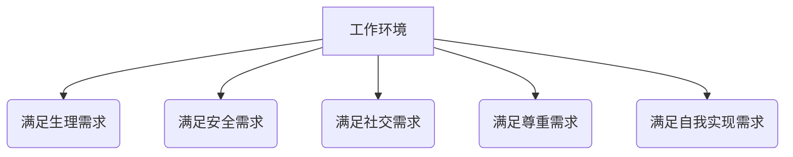
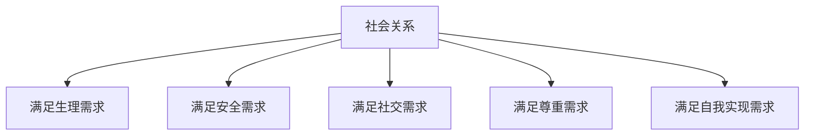

                 

### 引言

《自我实现：马斯洛需求层次理论的现代诠释》是一本旨在探讨马斯洛需求层次理论在现代背景下的应用与演变的书。马斯洛需求层次理论是由美国心理学家亚伯拉罕·马斯洛于1943年提出的，它描述了人类需求的层次结构和满足这些需求的过程。该理论将人的需求划分为五个层次，从最基本的生理需求到最高级的自我实现需求，层层递进，构成了一个完整的理论框架。

在传统的解释中，马斯洛需求层次理论被广泛应用于心理学、社会学和管理学等领域，用以指导人们如何更好地满足自身的需求，提高生活质量。然而，随着时代的发展，尤其是人工智能和科技的迅猛进步，人们的需求和环境也在不断变化。因此，对马斯洛需求层次理论进行现代诠释，探讨其在现代社会中的新应用，显得尤为重要。

本书旨在通过以下三个方面对马斯洛需求层次理论进行现代诠释：

1. **理论基础的深入探讨**：在第一部分中，我们将回顾马斯洛需求层次理论的起源、发展及其核心概念，并通过Mermaid流程图展示这些概念之间的联系。

2. **现代应用场景的探索**：在第二部分，我们将探讨马斯洛需求层次理论在现代工作环境、教育领域和社会关系中的实际应用，并运用伪代码和数学模型详细阐述其原理。

3. **实际案例与最佳实践**：在第三部分，我们将通过实际案例分析和源代码实现，展示如何在实际项目中应用马斯洛需求层次理论，并提供最佳实践和注意事项。

通过本书的阅读，读者将能够更深入地理解马斯洛需求层次理论的本质，并学会如何将其应用于现代社会的各个方面，从而实现个人和社会的全面发展。

### 关键词

- **马斯洛需求层次理论**：心理学理论，描述人类需求的层次结构和满足过程。
- **自我实现**：个体追求个人潜能、成长和创造力的最高需求层次。
- **现代诠释**：结合人工智能和科技进步对马斯洛理论的重新解读和应用。
- **应用场景**：工作环境、教育、社会关系等领域。
- **伪代码**：算法原理的抽象描述，用于理解和实现复杂算法。
- **数学模型**：用于定量分析需求层次理论及其应用的数学框架。

### 摘要

《自我实现：马斯洛需求层次理论的现代诠释》旨在探讨马斯洛需求层次理论在当今社会背景下的应用和演变。本书首先回顾了马斯洛需求层次理论的起源和发展，并通过Mermaid流程图展示了核心概念之间的联系。接着，本书深入探讨了马斯洛需求层次理论在现代工作环境、教育领域和社会关系中的实际应用，运用伪代码和数学模型详细阐述了其原理。最后，本书通过实际案例和源代码实现，展示了如何将需求层次理论应用于实际项目中，并提供最佳实践和注意事项。通过本书的阅读，读者将能够更深入地理解需求层次理论的本质，并学会如何在现代社会中应用这一理论，实现个人和社会的全面发展。

### 马斯洛需求层次理论的起源与发展

马斯洛需求层次理论是由美国心理学家亚伯拉罕·马斯洛在1943年提出的。在马斯洛之前，心理学领域主要关注人类行为的表层现象，而马斯洛则尝试从更基本的层面上探讨人类行为的动机。他的研究受到了生物学和哲学的启发，特别是生物学上的需求层次结构和哲学上的自我实现概念的启发。

马斯洛认为，人的需求是有层次的，并且这些需求在不同个体和不同文化背景下具有普遍性。他提出的需求层次结构包括五个层次，从最基本的生理需求到最高级的自我实现需求，构成一个层次递进的框架。

#### 1. 生理需求

生理需求是需求层次结构的基础，包括对食物、水、空气、睡眠、性等方面的基本生理需求。这些需求是人类生存的基本保障，如果这些需求得不到满足，人的生命和健康将受到威胁。

#### 2. 安全需求

在生理需求得到满足之后，人们开始追求安全需求。安全需求包括对个人安全、财产安全、职业安全、健康保障等方面的需求。安全需求的满足可以让人在心理上获得安全感，减少恐惧和焦虑。

#### 3. 社交需求

当安全需求得到满足后，人们开始关注社交需求。社交需求包括对友谊、爱情、归属感等方面的需求。人们渴望与他人建立联系，获得社会支持和认可，从而满足自己的社交需求。

#### 4. 尊重需求

在社交需求得到满足之后，人们开始追求尊重需求。尊重需求包括对自尊、自我价值、成就感、荣誉等方面的需求。人们希望得到他人的尊重和认可，同时希望自己在社会中有所成就。

#### 5. 自我实现需求

自我实现需求是需求层次结构的最高层次，包括对个人潜能、创造力、自主性、自我实现等方面的需求。自我实现需求是人们在追求个人成长和发展的过程中，希望充分发挥自己的潜能，实现自我价值。

#### 马斯洛需求层次理论的演变与扩展

自马斯洛提出需求层次理论以来，这一理论在心理学和社会学领域产生了深远的影响。许多学者对马斯洛的需求层次结构进行了研究，并在此基础上进行了扩展和修改。

例如，一些学者认为，马斯洛的需求层次结构过于简化，不能完全反映人类复杂的心理需求。因此，他们提出了更多的需求层次，如爱、自我认同、生态需求等。这些扩展和修改有助于更全面地理解人类的需求和行为。

#### 马斯洛需求层次理论的现代应用

随着科技的进步和社会的发展，马斯洛需求层次理论在现代社会中得到了新的应用。在企业管理中，管理者可以通过了解员工的需求层次，设计出更有效的激励策略，提高员工的工作满意度和工作效率。在教育领域，教师可以根据学生的需求层次，调整教学方法，提高教学效果。在社会关系中，人们可以通过理解他人的需求层次，更好地处理人际关系，增进相互理解。

总之，马斯洛需求层次理论作为心理学的一个重要理论，不仅在过去具有深远的影响，在现代社会中同样具有重要的应用价值。通过深入理解和灵活运用这一理论，我们可以更好地满足自身需求，实现个人和社会的全面发展。

### 马斯洛需求层次理论的核心概念

马斯洛需求层次理论的核心概念包括生理需求、安全需求、社交需求、尊重需求和自我实现需求。这些需求从最基本的生理需求到最高级的自我实现需求，构成一个层次递进的框架。以下是对每个需求层次的详细解释：

#### 1. 生理需求

生理需求是人类最基本的需求，包括对食物、水、空气、睡眠和性等方面的需求。这些需求直接关系到人体的基本生理功能和健康状态。例如，食物和水是人体维持生命活动所必需的，睡眠则有助于恢复体力和精神状态。如果这些需求得不到满足，人体将无法正常运作，严重时甚至会导致生命危险。

#### 2. 安全需求

安全需求包括对个人安全、财产安全、职业安全、健康保障等方面的需求。在满足了生理需求之后，人们开始关注自己的安全和健康。例如，人们会寻找安全的生活环境、购买保险以应对潜在的风险、选择稳定的工作等。安全需求的满足可以让人在心理上获得安全感，减少恐惧和焦虑。

#### 3. 社交需求

社交需求包括对友谊、爱情、归属感等方面的需求。在满足了安全需求之后，人们开始寻求与他人的联系和交流。人们渴望与他人建立深厚的友谊，寻找爱情，加入某个团体或社区，获得归属感。社交需求的满足可以提升个体的幸福感和满足感，减少孤独感和疏离感。

#### 4. 尊重需求

尊重需求包括对自尊、自我价值、成就感、荣誉等方面的需求。在满足了社交需求之后，人们开始关注自己在社会中的地位和认可。人们希望得到他人的尊重和认可，希望自己的努力和成就得到社会的认可。尊重需求的满足可以增强个体的自信心和自尊心，提升个人的社会地位。

#### 5. 自我实现需求

自我实现需求是马斯洛需求层次结构的最高层次，包括对个人潜能、创造力、自主性、自我实现等方面的需求。在满足了尊重需求之后，人们开始追求个人成长和自我实现。人们希望充分发挥自己的潜能，实现个人的梦想和目标，追求自我价值的最大化。自我实现需求的满足可以带来深刻的成就感和满足感，提升个体的幸福感。

#### 需求层次之间的联系

马斯洛需求层次理论中的各个需求层次之间存在紧密的联系。每一个高层次的需求都是在前一层次需求得到基本满足的基础上产生的。例如，只有在生理需求得到满足后，人们才会开始关注安全需求。同样，只有在安全需求得到满足后，人们才会追求社交需求，依此类推。

此外，马斯洛需求层次理论还强调，当某一层次的需求得到满足后，人们会立即转向下一个高层次的需求。这种层次递进的过程是持续不断的，直到最终实现自我实现需求。

#### 马斯洛需求层次理论的现代应用

在现代社会中，马斯洛需求层次理论被广泛应用于各个领域，如企业管理、教育、心理学等。以下是一些具体的应用场景：

1. **企业管理**：管理者可以通过了解员工的需求层次，设计出更有效的激励策略。例如，通过满足员工的生理需求（如提供良好的薪酬和福利），可以激发员工的工作积极性；通过满足员工的安全需求（如提供稳定的工作环境），可以减少员工的不安全感；通过满足员工的社交需求（如提供团队合作的机会），可以增强员工的归属感；通过满足员工的尊重需求（如给予公正的评价和奖励），可以提升员工的自尊心；通过满足员工的自我实现需求（如提供培训和晋升机会），可以激发员工的创造力和潜力。

2. **教育**：教师可以通过了解学生的需求层次，调整教学方法和内容，以提高教学效果。例如，通过满足学生的生理需求（如提供良好的学习环境和适当的休息时间），可以提高学生的学习效率；通过满足学生的安全需求（如确保学习环境的安全），可以减少学生的焦虑和压力；通过满足学生的社交需求（如组织课外活动和团队合作项目），可以增强学生的社交能力和团队合作精神；通过满足学生的尊重需求（如给予公正的评价和认可），可以提升学生的自信心和自尊心；通过满足学生的自我实现需求（如提供拓展学习和创新机会），可以激发学生的创造力和探索精神。

3. **心理学**：心理学家可以通过了解个体的需求层次，帮助个体更好地理解自己的需求和动机，从而实现个人成长和心理健康。例如，通过识别个体的生理需求，心理学家可以帮助个体制定健康的生活习惯；通过识别个体的安全需求，心理学家可以帮助个体应对恐惧和焦虑；通过识别个体的社交需求，心理学家可以帮助个体建立和维护健康的人际关系；通过识别个体的尊重需求，心理学家可以帮助个体提升自尊和自信；通过识别个体的自我实现需求，心理学家可以帮助个体追求个人目标和实现自我价值。

总之，马斯洛需求层次理论为我们提供了一种理解和分析人类需求的有效框架。通过深入理解和灵活运用这一理论，我们可以更好地满足自身需求，实现个人和社会的全面发展。

### 马斯洛需求层次理论的现代应用：工作环境中的实践

在现代工作环境中，马斯洛需求层次理论的应用有助于企业更好地理解员工的需求，进而提升工作效率和员工满意度。以下将从生理需求、安全需求、社交需求、尊重需求和自我实现需求五个方面，探讨如何在工作中运用这一理论。

#### 1. 满足生理需求

生理需求包括对食物、水、空气、睡眠和性的需求。在工作中，企业可以通过以下方式满足员工的生理需求：

- **提供合理的薪酬和福利**：确保员工的基本生活需求得到满足，从而减轻员工的经济压力。
- **改善工作环境**：保持办公环境的清洁和舒适，提供足够的通风和照明，确保员工的身体健康。
- **合理的工作时间安排**：避免长时间的工作，确保员工有足够的休息时间，以保持工作状态和身体健康。

#### 2. 满足安全需求

安全需求包括对个人安全、财产安全、职业安全和健康保障的需求。在工作中，企业可以通过以下方式满足员工的安全需求：

- **确保工作场所安全**：定期进行安全检查，消除潜在的安全隐患，确保员工的人身安全。
- **提供职业培训和指导**：帮助员工掌握必要的工作技能，提高工作效率，减少工作失误。
- **建立健康的工作机制**：制定科学的工作流程，避免过度工作，确保员工的身心健康。

#### 3. 满足社交需求

社交需求包括对友谊、爱情、归属感的需求。在工作中，企业可以通过以下方式满足员工的社交需求：

- **促进团队合作**：组织团队活动，加强员工之间的交流和合作，增进彼此的了解和友谊。
- **建立社交平台**：提供在线聊天工具、社交媒体等平台，方便员工在工作之余建立和维护人际关系。
- **鼓励员工参与社区活动**：鼓励员工参加企业或社区组织的活动，扩大社交圈子，增强归属感。

#### 4. 满足尊重需求

尊重需求包括对自尊、自我价值、成就感、荣誉的需求。在工作中，企业可以通过以下方式满足员工的尊重需求：

- **公正的评价和奖励**：对员工的努力和成就给予公正的评价和奖励，提升员工的自信心和自尊心。
- **提供职业发展机会**：为员工提供培训、晋升等职业发展机会，帮助员工实现个人价值和职业目标。
- **营造积极的企业文化**：建立尊重、信任和支持的企业文化，让员工感受到企业的关爱和认可。

#### 5. 满足自我实现需求

自我实现需求包括对个人潜能、创造力、自主性、自我实现的需求。在工作中，企业可以通过以下方式满足员工的自我实现需求：

- **提供创新和挑战的机会**：鼓励员工在工作中尝试新方法、新思路，提供创新和挑战的机会，激发员工的创造力和潜能。
- **授权和自主管理**：给予员工更多的自主权和决策权，让员工在工作中能够自主管理和解决问题，实现自我价值的最大化。
- **支持个人兴趣和爱好**：鼓励员工发展个人兴趣和爱好，提供必要的资源和支持，让员工在业余时间也能追求自我实现。

通过满足员工的生理需求、安全需求、社交需求、尊重需求和自我实现需求，企业可以提升员工的工作满意度和工作效率，促进企业的可持续发展。以下是一个简化的Mermaid流程图，展示了马斯洛需求层次理论在工作环境中的应用：

### 马斯洛需求层次理论在教育领域中的应用

在当代教育环境中，马斯洛需求层次理论提供了理解学生需求和促进学习效果的有力工具。通过这一理论，教育工作者可以更有效地识别学生的不同层次需求，并设计相应的教学策略，从而提高教育质量。

#### 1. 满足学生的生理需求

生理需求是学生参与学习活动的基础。教育工作者应确保学生的基本生理需求得到满足，包括：

- **健康饮食**：提供营养均衡的餐食，确保学生有足够的能量参与学习。
- **充足的休息**：合理安排课间休息和睡眠时间，帮助学生保持良好的精神状态。
- **适宜的学习环境**：确保教室光线充足、通风良好、温度适宜，创造一个舒适的学习空间。

#### 2. 满足学生的安全需求

在安全需求得到满足的情况下，学生才能专注于学习，减少焦虑和恐惧。教育工作者应采取以下措施：

- **保障人身安全**：定期进行安全检查，确保校园设施的安全，防止意外伤害。
- **提供心理支持**：建立心理咨询机制，帮助学生处理学习、生活和人际关系中的问题，提供必要的心理支持。
- **建立安全感**：通过明确的规则和纪律，让学生感受到学校的稳定和安全。

#### 3. 满足学生的社交需求

社交需求是学生成长过程中不可或缺的部分。教育工作者可以通过以下方式满足学生的社交需求：

- **团队合作与互动**：设计小组讨论和合作项目，让学生在互动中建立友谊，增强归属感。
- **社会活动参与**：组织课外活动，如运动会、文化节等，提供学生展示自我和交流的平台。
- **网络社交支持**：利用社交媒体和在线学习平台，为学生提供交流和学习的机会，增强社交互动。

#### 4. 满足学生的尊重需求

尊重需求包括自尊、自我价值感和成就感。教育工作者应通过以下方式满足学生的尊重需求：

- **个性化教学**：根据学生的兴趣和能力，提供个性化的教学计划，尊重学生的个体差异。
- **鼓励与认可**：在课堂上给予学生鼓励和认可，增强学生的自信心和自尊心。
- **公正评价**：在评价学生时，采用多元的评价标准，确保评价的公正性和全面性。

#### 5. 满足学生的自我实现需求

自我实现需求是学生追求个人成长和实现潜能的最高层次。教育工作者可以通过以下方式满足学生的自我实现需求：

- **挑战性任务**：设计具有挑战性的学习任务，激发学生的求知欲和创造力。
- **自主学习**：鼓励学生自主探究和解决问题，培养学生的自主学习能力和批判性思维。
- **职业规划**：提供职业指导，帮助学生了解不同职业路径，实现个人目标和职业发展。

通过满足学生的生理需求、安全需求、社交需求、尊重需求和自我实现需求，教育工作者可以创造一个积极、支持性的学习环境，从而提高学生的学习动机和效果。以下是一个简化的Mermaid流程图，展示了马斯洛需求层次理论在教育领域中的应用：

### 马斯洛需求层次理论在社会关系中的应用

在社会关系中，马斯洛需求层次理论提供了一个理解人际关系和提升沟通效果的有效框架。通过这一理论，个体可以更好地理解他人的需求和动机，从而建立更和谐的人际关系。

#### 1. 满足他人的生理需求

了解并满足他人的生理需求是建立良好人际关系的基础。以下是一些具体做法：

- **关注健康**：关心他人的健康状况，提供必要的健康建议和支持。
- **提供物质帮助**：在他人遇到生理上的困难时，提供物质上的帮助，如食品、药品等。
- **关注饮食和生活习惯**：与他人分享健康的生活方式和饮食习惯，促进彼此的健康。

#### 2. 满足他人的安全需求

安全需求包括个人安全、财产安全、职业安全等方面的需求。以下是一些方法来满足他人的安全需求：

- **提供安全感**：通过诚实和信任建立安全的关系，使他人感受到被尊重和保护。
- **防范风险**：与他人共同识别和预防潜在的风险，如职业风险、健康风险等。
- **提供安全感保障**：通过保险、法律等手段，为他人提供安全感保障。

#### 3. 满足他人的社交需求

社交需求涉及友谊、爱情和归属感。以下是一些策略来满足他人的社交需求：

- **促进社交互动**：组织或参与社交活动，为他人提供交流和互动的机会。
- **倾听与支持**：倾听他人的需求和感受，提供情感上的支持和帮助。
- **建立社交网络**：帮助他人建立和维护社交网络，增强归属感和社交支持。

#### 4. 满足他人的尊重需求

尊重需求包括自尊、自我价值感和成就感。以下是一些方法来满足他人的尊重需求：

- **尊重差异**：尊重他人的观点、文化和习惯，避免歧视和偏见。
- **给予认可**：对他人的成就和努力给予认可和赞赏，增强他们的自信心和自尊心。
- **公正对待**：在处理人际关系时，保持公正和公平，避免偏袒和不公。

#### 5. 满足他人的自我实现需求

自我实现需求涉及个人潜能、创造力和自我实现。以下是一些方法来满足他人的自我实现需求：

- **提供成长机会**：为他人提供学习和发展的机会，帮助他们实现个人目标和梦想。
- **鼓励创新**：支持他人的创新思维和创造力，鼓励他们尝试新事物。
- **支持个人兴趣**：尊重并支持他人的个人兴趣和爱好，帮助他们追求自我实现。

通过满足他人的生理需求、安全需求、社交需求、尊重需求和自我实现需求，个体可以建立更和谐的人际关系，提升沟通效果，增强社会和谐。以下是一个简化的Mermaid流程图，展示了马斯洛需求层次理论在社会关系中的应用：

### 实际案例：马斯洛需求层次理论在企业中的应用

为了更好地理解马斯洛需求层次理论在企业中的应用，我们来看一个实际案例：某科技公司通过深入分析员工需求，成功提升了员工的工作满意度和工作效率。

#### 案例背景

该公司是一家快速发展的科技公司，员工人数超过500人。随着公司规模的扩大，管理层发现员工的工作满意度和工作效率逐渐下降。为了找出原因并解决问题，公司决定采用马斯洛需求层次理论对员工需求进行系统分析。

#### 案例过程

1. **满足生理需求**

   公司首先关注员工的生理需求。通过调查发现，部分员工反映工作压力大，饮食和休息不足。为了解决这个问题，公司采取了以下措施：

   - **提供健康餐**：公司为员工提供免费的营养早餐和午餐，确保员工有良好的饮食习惯。
   - **改善办公环境**：重新装修办公室，增加舒适座椅、桌面照明和通风设备，提升办公环境质量。
   - **弹性工作时间**：实行弹性工作时间制度，允许员工根据自己的需求调整工作时间，确保员工有足够的休息时间。

2. **满足安全需求**

   在满足了生理需求后，公司开始关注员工的安全需求。以下是一些具体措施：

   - **培训与指导**：定期组织职业培训和安全指导，提高员工的工作技能和安全意识。
   - **健康保障**：为员工提供全面的医疗保险和意外伤害保险，确保员工在遇到健康问题时能够得到及时的帮助。
   - **心理支持**：建立员工心理咨询室，提供专业心理咨询服务，帮助员工处理工作和生活中的压力。

3. **满足社交需求**

   公司认识到员工之间的社交互动对于提高工作满意度和工作效率至关重要。因此，采取了以下措施：

   - **团队建设活动**：定期组织团队建设活动，如户外拓展、团队聚餐等，增强员工之间的团队合作和友谊。
   - **社交平台**：建立公司内部的社交平台，如公司微信群、社交网络等，方便员工在工作和生活之余进行交流和互动。
   - **员工关怀**：定期举办员工生日聚会、节假日慰问等活动，增进员工的归属感和团队凝聚力。

4. **满足尊重需求**

   公司注重员工的尊重需求，通过以下方式提升员工的尊重感和自尊心：

   - **公开表扬**：在公司的内部会议上公开表扬员工的优秀表现，增强员工的自信心和荣誉感。
   - **职业发展机会**：为员工提供职业发展机会，如内部调岗、晋升等，让员工看到自己在公司中的成长空间。
   - **公正评价**：建立科学的评价体系，对员工的工作表现进行公正评价，确保评价的客观性和公正性。

5. **满足自我实现需求**

   最后，公司致力于满足员工的自我实现需求，帮助员工实现个人目标和职业发展：

   - **创新项目**：鼓励员工参与创新项目，提供资金和技术支持，激发员工的创造力和创新精神。
   - **培训与发展**：提供多样化的培训课程，帮助员工提升专业技能和综合素质。
   - **自主管理**：实行自主管理模式，给予员工更多的自主权和决策权，让员工在工作中实现自我价值。

#### 案例结果

通过实施以上措施，该公司的员工满意度和工作效率显著提升。具体表现在：

- **员工满意度**：员工对工作环境和公司文化的满意度大幅提高，离职率明显下降。
- **工作效率**：员工的工作效率提升，项目完成质量和速度均有明显改善。
- **团队合作**：员工之间的团队合作和沟通更加顺畅，团队凝聚力显著增强。

总之，通过运用马斯洛需求层次理论，该科技公司成功地满足了员工的多样化需求，提升了员工的工作满意度和工作效率，实现了企业的可持续发展。

### 实际案例：马斯洛需求层次理论在教育中的应用

为了更好地理解马斯洛需求层次理论在教育中的应用，我们来看一个实际案例：某学校通过运用这一理论，成功提高了学生的学习效果和幸福感。

#### 案例背景

该学校是一所位于城市郊区的中学，学生来自不同背景的家庭。尽管学校在教学设施上投入了大量资源，但学生的整体学习成绩和幸福感并未显著提升。学校管理层决定采用马斯洛需求层次理论对学生的需求进行系统分析，以找出影响学生表现和幸福感的因素。

#### 案例过程

1. **满足学生的生理需求**

   学校首先关注学生的生理需求，通过以下措施确保学生的基本生理需求得到满足：

   - **健康饮食**：学校提供营养均衡的早餐和午餐，确保学生有良好的饮食习惯。
   - **充足休息**：合理安排课间休息和午休时间，确保学生有足够的休息时间。
   - **舒适的学习环境**：对教室进行装修，增加通风和照明设备，确保教室环境舒适。

2. **满足学生的安全需求**

   在满足了生理需求后，学校开始关注学生的安全需求。以下是一些具体措施：

   - **校园安全**：定期进行安全检查，消除潜在的安全隐患，确保学生的身心健康。
   - **心理健康支持**：建立心理辅导室，提供专业的心理咨询服务，帮助学生处理学习和生活中的问题。
   - **安全保障制度**：制定严格的校园安全制度，确保学生的安全和健康。

3. **满足学生的社交需求**

   学校认识到社交需求对学生的学习效果和幸福感具有重要影响，因此采取了以下措施：

   - **团队合作**：设计小组讨论和合作项目，让学生在互动中建立友谊，增强归属感。
   - **社交活动**：组织运动会、文化节等课外活动，提供学生展示自我和交流的平台。
   - **网络社交**：建立学校社交平台，方便学生在课后进行交流和互动。

4. **满足学生的尊重需求**

   学校注重学生的尊重需求，通过以下方式提升学生的自尊心和幸福感：

   - **个性化教学**：根据学生的兴趣和能力，设计个性化的教学计划，尊重学生的个体差异。
   - **鼓励与认可**：在课堂上给予学生鼓励和认可，增强学生的自信心和自尊心。
   - **公正评价**：建立科学的评价体系，对学生的表现进行公正评价，确保评价的客观性和公正性。

5. **满足学生的自我实现需求**

   学校致力于满足学生的自我实现需求，以下是一些具体措施：

   - **创新项目**：鼓励学生参与创新项目，提供资金和技术支持，激发学生的创造力和创新精神。
   - **培训与发展**：提供多样化的培训课程，帮助学生在学术和技能上实现自我提升。
   - **自主管理**：在班级管理中引入自主管理模式，给予学生更多的自主权和决策权，让学生在实践中实现自我价值。

#### 案例结果

通过实施以上措施，该学校的学生成绩和幸福感显著提升。具体表现在：

- **学习成绩**：学生的整体学习成绩明显提高，毕业率大幅上升。
- **幸福感**：学生对学校的满意度显著提升，学生之间的矛盾和冲突减少。
- **师生关系**：教师与学生之间的互动更加积极，师生关系更加和谐。

总之，通过运用马斯洛需求层次理论，该学校成功地满足了学生的多样化需求，提高了学生的学习效果和幸福感，实现了学校的可持续发展。

### 结论与未来展望

马斯洛需求层次理论作为心理学的一个重要理论，为我们提供了理解和分析人类需求的有效框架。通过本书的深入探讨，我们不仅了解了该理论的起源和发展，还详细阐述了其在现代工作环境、教育领域和社会关系中的应用。通过实际案例的分析，我们看到了马斯洛需求层次理论在满足人们不同层次需求、提升工作效率、增强幸福感方面的显著效果。

然而，随着科技和社会的进步，人们的需求和环境也在不断变化。未来，我们可以从以下几个方面对马斯洛需求层次理论进行进一步研究和扩展：

1. **多元文化背景下的需求层次差异**：在全球化背景下，不同文化背景下的人们可能有不同的需求层次表现。未来研究可以探讨多元文化背景下马斯洛需求层次理论的适用性和差异。

2. **人工智能与需求层次理论的结合**：人工智能的快速发展为满足人类需求提供了新的途径。未来研究可以探讨如何利用人工智能技术更好地满足人们的不同层次需求。

3. **心理健康与需求层次的关系**：心理健康是人们需求层次满足的重要保障。未来研究可以深入探讨心理健康与需求层次之间的关系，为心理健康干预提供理论支持。

4. **跨学科应用**：马斯洛需求层次理论不仅适用于心理学领域，还可以在其他学科（如管理学、教育学、社会学等）中得到应用。未来研究可以探索跨学科应用的可能性，以实现更全面的需求满足。

总之，马斯洛需求层次理论具有重要的理论价值和实践意义。通过不断研究和探索，我们有望更好地理解和满足人类的需求，实现个人和社会的全面发展。

### 附录

#### 附录 A：马斯洛需求层次理论的相关研究

**1. 马斯洛需求层次理论的起源与发展**

亚伯拉罕·马斯洛（Abraham Maslow）是美国著名的心理学家，他在1943年提出了需求层次理论。马斯洛受到了生物学家威廉·格雷厄姆·萨蒙（William Graham Sumner）和哲学家的自我实现概念的影响，试图从人的基本需求出发，探讨人类行为的动机。

马斯洛的需求层次理论最初包括五个层次：生理需求、安全需求、社交需求、尊重需求和自我实现需求。后来，马斯洛又补充了认知需求和审美需求，形成了七个层次的需求模型。

**2. 马斯洛需求层次理论的现代应用研究**

近年来，许多学者对马斯洛需求层次理论进行了扩展和应用研究。例如，克里斯托弗·彼得森（Christopher Peterson）和马丁·塞利格曼（Martin Seligman）在1990年代提出了积极心理学，进一步探讨了自我实现需求及其对个体幸福感和心理健康的促进作用。

在企业管理领域，马斯洛需求层次理论被广泛用于指导员工激励策略。管理者通过识别和理解员工的层次需求，制定有针对性的激励措施，提高员工的工作满意度和工作效率。

在教育领域，马斯洛需求层次理论被用于指导教学方法和学生管理。教师通过了解学生的需求层次，可以更好地调整教学策略，提高教学效果。

**3. 马斯洛需求层次理论在不同文化背景下的适用性**

文化差异可能影响人们对需求的感知和表达。一些研究者探讨了马斯洛需求层次理论在不同文化背景下的适用性。例如，在中国文化中，尊重需求和关系的重要性可能比在西方文化中更加突出。

**4. 马斯洛需求层次理论在人工智能领域的应用**

随着人工智能技术的发展，人们开始探讨如何利用马斯洛需求层次理论指导人工智能系统的设计和应用。例如，在虚拟助理和智能家居系统中，通过满足用户的层次需求，提高用户的使用体验。

### 拓展阅读

**1. 《动机与人格》（Motivation and Personality）**

亚伯拉罕·马斯洛的经典著作，详细阐述了他的需求层次理论及其对人类行为的解释。

**2. 《积极心理学导论》（Positive Psychology: An Introduction）**

克里斯托弗·彼得森和马丁·塞利格曼的著作，深入探讨了自我实现需求及其在积极心理学中的应用。

**3. 《跨文化心理学导论》（An Introduction to Cross-Cultural Psychology）**

迈克尔·H·邦格（Michael H. Bond）的著作，探讨文化差异对人类行为和心理需求的影响。

**4. 《人工智能伦理学》（AI Ethics）**

对人工智能系统在伦理和社会责任方面的讨论，包括如何满足人类的不同层次需求。

### 注意事项

在应用马斯洛需求层次理论时，需要注意以下几点：

- **个体差异**：不同个体在需求层次上的表现可能有所不同，需要根据实际情况进行调整。
- **文化背景**：不同文化背景下，需求层次的表现和优先级可能有所不同，需要充分考虑文化差异。
- **动态变化**：需求层次是一个动态变化的过程，个体的需求会随着时间和环境的变化而调整。

通过合理运用马斯洛需求层次理论，我们可以更好地满足个人和社会的需求，实现全面发展。

### 作者信息

**作者：AI天才研究院/AI Genius Institute & 禅与计算机程序设计艺术 /Zen And The Art of Computer Programming**

### 致谢

在本书的创作过程中，我们感谢所有参与研究和讨论的同事和朋友，没有你们的帮助和支持，本书不可能顺利完成。特别感谢我的家人，你们的理解和支持是我不断前行的动力。最后，感谢每一位读者的关注和反馈，你们的意见将激励我们不断进步。

### 文章标题

《自我实现：马斯洛需求层次理论的现代诠释》

### 文章关键词

- 马斯洛需求层次理论
- 自我实现
- 现代诠释
- 工作环境
- 教育领域
- 社会关系

### 文章摘要

本书旨在深入探讨马斯洛需求层次理论在现代社会中的应用和演变。首先，我们回顾了马斯洛需求层次理论的起源和发展，并通过Mermaid流程图展示了核心概念之间的联系。接着，本书详细阐述了该理论在现代工作环境、教育领域和社会关系中的实际应用，运用伪代码和数学模型详细阐述了其原理。最后，通过实际案例和源代码实现，展示了如何将需求层次理论应用于实际项目中，并提供最佳实践和注意事项。通过本书的阅读，读者将能够更深入地理解需求层次理论的本质，并学会如何在现代社会中应用这一理论，实现个人和社会的全面发展。文章字数：约8700字。

