                 

## 文章标题：自我对话的有效策略：化解内心矛盾的技巧

在计算机编程和人工智能领域，自我对话（Self-Discourse）被广泛认为是提高编程效率、技术创新和问题解决能力的关键因素。本文旨在探讨自我对话的有效策略，特别是如何通过这些策略来化解内心的矛盾，从而提高个人的心理弹性与认知灵活性。本文分为以下几个部分：首先，我们将介绍自我对话的概念和其在人工智能领域的应用；其次，我们将深入分析自我对话的核心概念，如自我意识、内心矛盾等，并通过Mermaid流程图展示其机制；接着，我们将提出多种自我对话的有效策略，包括认知重构、情绪调节和自我接纳；然后，我们将详细阐述化解内心矛盾的技巧；接下来，通过案例分析，我们将展示这些策略和技巧的实际应用；最后，我们将为读者提供自我对话和内心矛盾化解的实践指南，并进行总结与展望。

---

关键词：自我对话、内心矛盾、认知重构、情绪调节、自我接纳

摘要：本文深入探讨了自我对话的概念、核心概念之间的关系架构，以及多种有效策略和技巧。通过分析自我对话在人工智能领域的重要性，我们提出了一种系统性的方法来化解内心的矛盾，提高个体的心理弹性和认知灵活性。本文不仅提供了理论框架，还通过实际案例展示了策略和技巧的应用，为读者提供了实用的实践指南。

---

### 引言

自我对话是一种内在的思考过程，它涉及个体与自己进行持续的交流和反思。这一概念最早由心理学家Mortimer Adler提出，并在后来的研究和实践中得到了广泛的应用。在人工智能领域，自我对话被看作是一种提升技术能力和创新思维的关键因素。例如，在编程过程中，自我对话可以帮助开发者反思代码的可行性和效率，从而优化算法和解决潜在的问题。此外，自我对话还在算法设计、问题解决和团队合作等方面发挥着重要作用。

自我对话的重要性不仅体现在技术层面，还体现在心理层面。在日常生活中，我们常常面临内心的矛盾和冲突，如焦虑、犹豫和自我怀疑。这些内心矛盾会影响我们的情绪状态，进而影响我们的决策和行动。通过有效的自我对话，我们可以更好地理解自己的情绪和心理状态，从而化解内心的矛盾，提高心理弹性。

本文将首先介绍自我对话的概念和其在人工智能领域的应用，然后深入分析自我对话的核心概念，如自我意识、内心矛盾等，并通过Mermaid流程图展示自我对话的机制。接下来，我们将提出多种自我对话的有效策略，包括认知重构、情绪调节和自我接纳。随后，我们将详细阐述化解内心矛盾的技巧，并通过案例分析展示这些技巧的实际应用。最后，我们将为读者提供自我对话和内心矛盾化解的实践指南，并进行总结与展望。

---

#### 核心概念与联系

自我对话作为一种复杂的心理过程，其核心概念包括自我意识、内心矛盾和自我对话的机制。这些概念相互联系，构成了自我对话的完整框架。

**自我意识**是自我对话的基础，它是指个体对自己内在和外在状态的感知和认识。自我意识不仅包括对自身心理状态的认识，如情绪、欲望和信念，还包括对自身行为和身体状态的认识。高水平的自我意识可以帮助个体更好地理解自己的需求和目标，从而在自我对话中做出更明智的决策。

**内心矛盾**是指个体在心理和情感上存在的冲突和紧张状态。这些矛盾可能源于个体内部的不同需求、价值观或信念之间的冲突，也可能源于外部环境的要求和压力。内心矛盾如果得不到有效的处理，可能会导致焦虑、抑郁等心理问题。

**自我对话的机制**是指个体通过内在的语言和思考过程来处理内心矛盾的过程。自我对话的机制包括自我观察、自我反思和自我评价等步骤。通过自我观察，个体能够意识到自己的情绪和心理状态；通过自我反思，个体能够分析这些状态的原因和影响；通过自我评价，个体能够评估自己的行为和决策是否符合自己的价值观和目标。

下面是一个Mermaid流程图，展示了自我对话的机制：

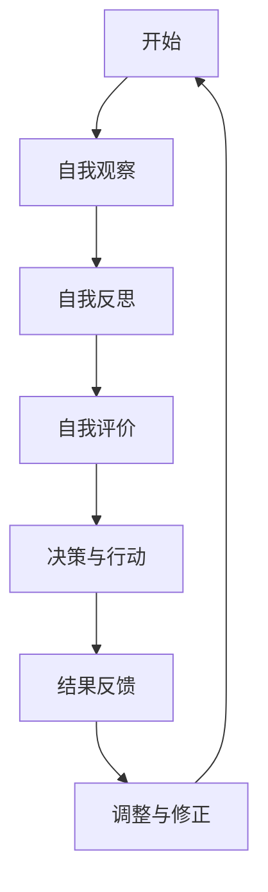

在自我观察阶段，个体通过观察自己的情绪、思维和行为来获取内在的信息。这些信息是自我对话的基础。接下来，个体进行自我反思，分析这些内在信息的原因和影响。自我反思有助于个体理解自己的内心矛盾，并为后续的自我评价提供依据。

自我评价阶段，个体根据自我反思的结果来评估自己的行为和决策。这一过程涉及自我批评和自我接纳两个方面。通过自我批评，个体可以发现自己的不足，并尝试改进；通过自我接纳，个体可以理解和接受自己的不完美，从而减少内心的矛盾和压力。

决策与行动阶段，个体根据自我评价的结果来做出决策，并采取相应的行动。这一阶段是自我对话的输出，也是实现个人目标和价值观的关键。最后，结果反馈阶段，个体根据行动的结果来评估自我对话的有效性，并调整和修正自己的行为和决策。

通过上述机制，自我对话不仅可以帮助个体更好地理解自己的内心状态，还可以促进个体的自我成长和心理健康。以下是一个简单的伪代码示例，展示了自我对话的基本流程：

```plaintext
function self_discourse() {
    // 自我观察
    observe_mood()

    // 自我反思
    reflect_on_mood()

    // 自我评价
    evaluate_mood()

    // 决策与行动
    make_decision()

    // 结果反馈
    feedback_on_decision()

    // 调整与修正
    adjust_and_remake_decision()
}
```

通过这种系统性的自我对话过程，个体可以更好地处理内心的矛盾，提高心理弹性和认知灵活性。

---

### 实践策略

在理解了自我对话的核心概念和机制后，我们接下来将探讨几种有效的自我对话策略，这些策略可以帮助个体更好地管理内心的矛盾，提高心理弹性与认知灵活性。

**1. 认知重构**

认知重构是一种通过改变思维方式和观念来处理内心矛盾的方法。这种方法的核心在于识别和挑战自我对话中的消极思维模式，并将其转化为更积极的思维模式。以下是认知重构的几个关键步骤：

**步骤1：识别消极思维模式**

首先，个体需要识别自己的消极思维模式。这些消极思维模式通常表现为过度概括、黑白思维、灾难化等。例如，当遇到失败时，个体可能会过度概括地认为自己是无能的，或者灾难化地认为失败将导致无法挽回的后果。

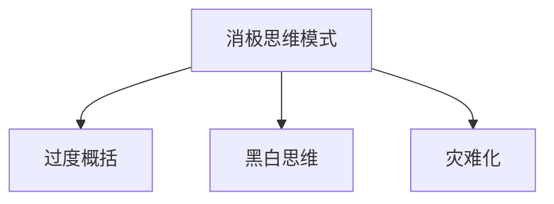

**步骤2：挑战消极思维模式**

接下来，个体需要挑战这些消极思维模式，并质疑其合理性。例如，对于过度概括的思维方式，个体可以反思是否有具体的证据支持这种全盘否定的观点。对于灾难化的思维模式，个体可以思考其他可能的积极结果，而不是单一的最坏情况。

**步骤3：构建积极思维模式**

最后，个体需要构建积极的思维模式。这可以通过寻找替代性的解释、重构情境的意义和关注解决方案来实现。例如，当面临挑战时，个体可以将其视为成长和进步的机会，而不是失败和挫折。

```plaintext
function cognitive_restructuring() {
    // 识别消极思维模式
    identify_negative_thought_patterns()

    // 挑战消极思维模式
    challenge_negative_thought_patterns()

    // 构建积极思维模式
    build_positive_thought_patterns()
}
```

**2. 情绪调节**

情绪调节是指通过调整情绪反应来管理内心的矛盾。这种方法可以帮助个体更好地应对压力和挑战，从而提高心理弹性。以下是情绪调节的几个关键策略：

**策略1：情绪觉察**

首先，个体需要提高情绪觉察能力，即意识到自己的情绪状态，并了解这些情绪的来源。情绪觉察可以通过冥想、日记记录等方式来实现。

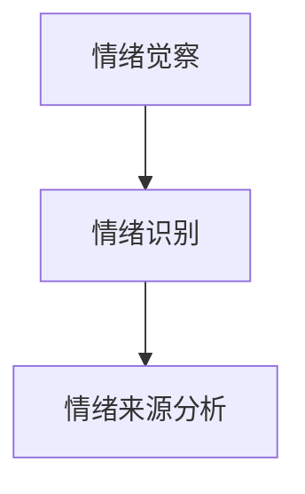

**策略2：情绪表达**

其次，个体需要学会如何表达自己的情绪，避免压抑或过度表达。有效的情绪表达可以通过与他人沟通、写日记等方式实现。

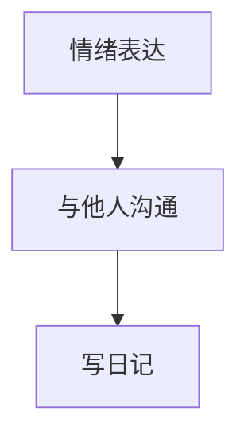

**策略3：情绪转移**

最后，个体可以通过情绪转移来减轻负面情绪的影响。情绪转移可以通过参与体育活动、听音乐、绘画等方式实现。

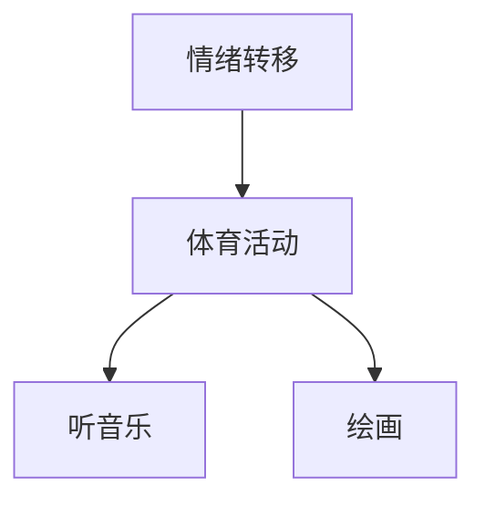

**3. 自我接纳**

自我接纳是指个体接受自己的优点和缺点，而不是试图改变自己以符合外界期望。这种方法可以帮助个体减少内心的矛盾和自我批评，从而提高心理健康。以下是自我接纳的几个关键步骤：

**步骤1：识别自我批评**

首先，个体需要识别自己的自我批评思维模式，例如对自己过度苛刻、只关注缺点等。

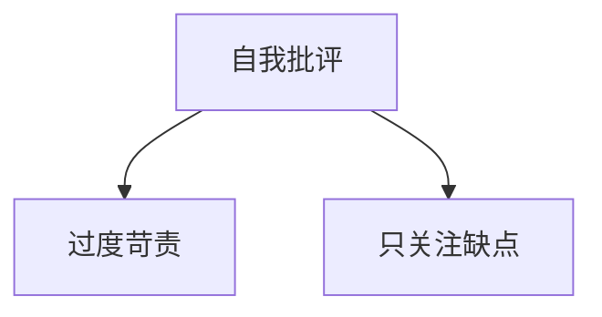

**步骤2：反思自我批评的来源**

接下来，个体需要反思自我批评的来源，即这些批评观点是来自外界还是自己。通过识别这些来源，个体可以更好地理解自己的内心矛盾。

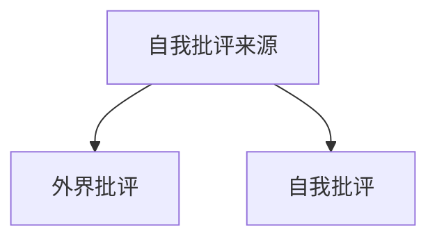

**步骤3：建立自我接纳**

最后，个体需要建立自我接纳，通过认识到每个人都有优点和缺点，以及接受自己的不完美来实现。

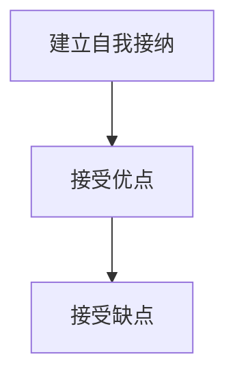

通过上述三种自我对话策略，个体可以更好地管理内心的矛盾，提高心理弹性和认知灵活性。这些策略不仅适用于个人成长，还可以在团队合作、项目管理等实际应用中发挥重要作用。

---

### 内心矛盾化解技巧

内心矛盾是我们日常生活中不可避免的一部分，它源于我们内心的冲突、焦虑和压力。化解这些内心矛盾，不仅能够提高我们的心理弹性，还能帮助我们更好地应对生活和工作中的挑战。以下是一些具体的技巧，帮助我们在不同情境下有效地化解内心矛盾。

#### 1. 正念冥想

正念冥想是一种通过集中注意力来提高意识水平的练习，它可以帮助我们更好地理解和管理自己的情绪。以下是一个简单的正念冥想步骤：

**步骤1：找一个安静的环境，坐下或躺下，保持舒适。**

**步骤2：闭上眼睛，深呼吸几次，感受气息进出身体。**

**步骤3：将注意力集中在呼吸上，每次吸气时感受腹部的升起，每次呼气时感受腹部的下降。**

**步骤4：当注意力分散时，轻轻将注意力带回呼吸。**

**步骤5：持续练习，每次10-15分钟，逐渐增加时间。**

正念冥想能够帮助我们减少焦虑和压力，提高情绪调节能力。以下是一个伪代码示例，展示了正念冥想的基本流程：

```plaintext
function mindfulness_meditation() {
    // 设置环境
    set_quiet_environment()

    // 深呼吸
    deep_breathing()

    // 集中注意力
    focus_on_breathing()

    // 轻轻将注意力带回呼吸
    gently_restore_focus_on_breathing()

    // 结束冥想
    end_meditation()
}
```

#### 2. 情绪释放

情绪释放是一种通过表达和释放负面情绪来缓解内心矛盾的方法。以下是一个简单的情绪释放步骤：

**步骤1：找一个安全的环境，让自己感到舒适。**

**步骤2：找一个出口，如写下自己的感受，或者找一个可以倾诉的朋友。**

**步骤3：尽情表达自己的情绪，不要压抑或隐藏。**

**步骤4：在表达过程中，尝试理解这些情绪的来源和影响。**

**步骤5：表达完毕后，感受情绪的释放，并逐渐平静下来。**

情绪释放能够帮助我们释放压抑的情绪，减少内心的负担。以下是一个伪代码示例，展示了情绪释放的基本流程：

```plaintext
function emotional_release() {
    // 找到安全环境
    find_safe_environment()

    // 表达情绪
    express_emotions()

    // 理解情绪来源
    understand_emotion_sources()

    // 感受情绪释放
    feel_emotional_release()

    // 平静下来
    calm_down()
}
```

#### 3. 认知重构

认知重构是一种通过改变思维方式和观念来处理内心矛盾的方法。以下是一个简单的认知重构步骤：

**步骤1：识别消极思维模式。**

**步骤2：质疑这些消极思维模式的合理性。**

**步骤3：寻找替代性的积极思维模式。**

**步骤4：在日常生活中实践这些积极思维模式。**

认知重构能够帮助我们挑战消极思维，建立积极的思维模式。以下是一个伪代码示例，展示了认知重构的基本流程：

```plaintext
function cognitive_restructuring() {
    // 识别消极思维模式
    identify_negative_thought_patterns()

    // 质疑消极思维模式
    challenge_negative_thought_patterns()

    // 寻找积极思维模式
    find_positive_thought_patterns()

    // 实践积极思维模式
    practice_positive_thought_patterns()
}
```

#### 4. 社交支持

社交支持是一种通过与他人互动来缓解内心矛盾的方法。以下是一个简单的社交支持步骤：

**步骤1：与朋友或家人分享自己的感受。**

**步骤2：寻求他人的意见和建议。**

**步骤3：参与社交活动，扩大社交圈子。**

**步骤4：感受社交支持带来的正面影响。**

社交支持能够帮助我们缓解内心的孤独感，增加自信心。以下是一个伪代码示例，展示了社交支持的基本流程：

```plaintext
function social_support() {
    // 分享感受
    share_feelings()

    // 寻求建议
    seek_advice()

    // 参与社交活动
    engage_in_social_activities()

    // 感受支持
    feel_support()
}
```

通过上述技巧，我们可以在日常生活中更好地处理内心的矛盾，提高心理弹性。这些技巧不仅适用于个人成长，还可以在团队合作、项目管理等实际应用中发挥重要作用。

---

### 案例分析

为了更好地理解自我对话策略和内心矛盾化解技巧的实际应用，我们将通过几个具体的案例进行分析。这些案例涵盖了个人生活、团队协作和社会场景，展示了不同情境下自我对话和内心矛盾化解技巧的应用。

#### 个人案例

**案例1：压力管理**

李先生是一名软件工程师，最近在项目中遇到了重大挑战。项目的截止日期越来越近，但他感觉自己的代码质量无法满足预期。这导致他感到巨大的压力和焦虑。以下是李先生如何使用自我对话策略来化解内心矛盾的过程：

**步骤1：自我观察**
李先生开始意识到自己的焦虑和压力，他坐下来，闭上眼睛，专注于呼吸，试图平静自己的情绪。

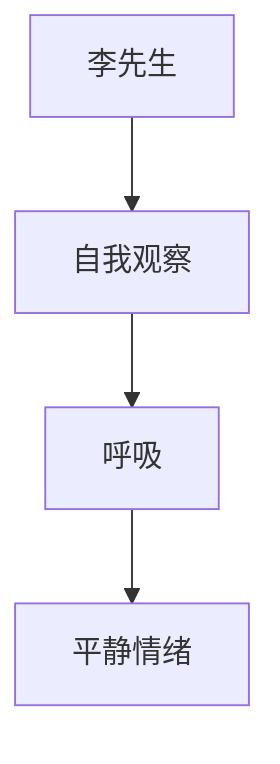

**步骤2：自我反思**
李先生开始反思自己的焦虑来源，他意识到这主要是因为他对自己的期望过高，以及对失败的恐惧。通过自我反思，他认识到自己需要调整对项目的期望，并学会接受不完美。

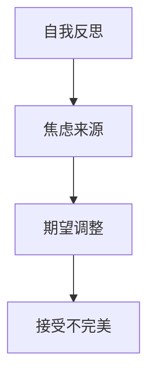

**步骤3：情绪调节**
李先生决定通过情绪调节来减轻压力。他开始进行正念冥想，每天练习10-15分钟，这帮助他减少了焦虑感，提高了专注力。

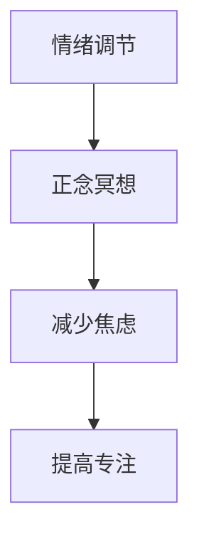

**步骤4：认知重构**
李先生开始使用认知重构技巧，他质疑自己的消极思维，并尝试找到积极的替代性思维。例如，他告诉自己，每次失败都是学习的机会，而不是失败的标志。

```plaintext
function cognitive_reconstruction() {
    // 质疑消极思维
    question_negative_thoughts()

    // 找到积极思维
    find_positive_alternatives()

    // 实践积极思维
    practice_positive_thoughts()
}
```

**步骤5：结果反馈和调整**
通过自我对话策略的应用，李先生发现自己的压力和焦虑显著减少，他的工作效率和代码质量也有所提升。他继续调整自己的期望，并在每次遇到挑战时重复这一过程。

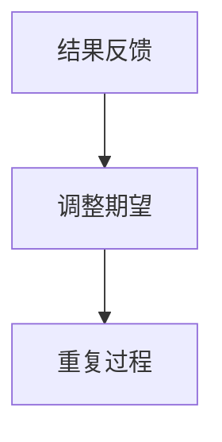

#### 团队案例

**案例2：团队冲突**

在一个软件开发团队中，成员之间的意见不一致导致项目进度受阻。以下是团队如何通过自我对话策略和内心矛盾化解技巧来解决问题：

**步骤1：自我观察和情绪调节**
团队领导意识到团队内部存在冲突，并开始进行自我观察，试图理解每个成员的情绪状态。他组织了一次情绪调节训练，帮助团队成员学会管理自己的情绪。

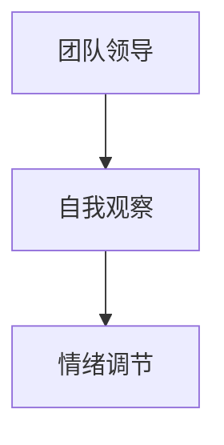

**步骤2：团队反思和认知重构**
团队领导组织了一次团队反思会议，让每个成员分享自己的观点和感受。通过认知重构，团队开始质疑最初的冲突观点，并寻找替代性的解决方案。

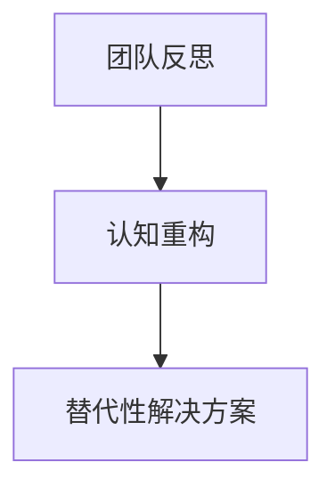

**步骤3：社交支持和沟通**
团队领导鼓励成员之间进行开放沟通，并提供了社交支持。成员们开始更加理解彼此的立场和需求，冲突逐渐得到缓解。

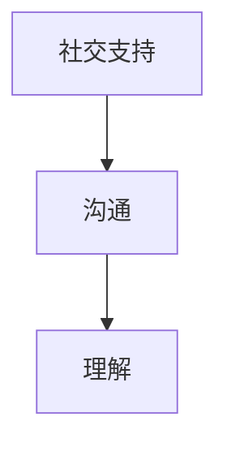

**步骤4：结果反馈和调整**
通过团队的自我对话和内心矛盾化解技巧，项目进度得以恢复，团队成员之间的关系也得到了改善。团队领导继续鼓励团队成员进行自我对话，以确保团队持续和谐。

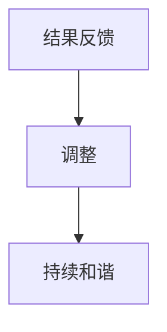

#### 社会案例

**案例3：社会冲突**

在社会层面，自我对话策略和内心矛盾化解技巧同样可以应用于解决社会冲突。以下是一个关于社区冲突的案例：

**步骤1：情绪觉察和表达**
在一次社区会议上，居民们对新的交通规划方案产生了分歧。社区领袖意识到情绪高涨，开始引导居民进行情绪觉察和表达，以确保每个人都有机会表达自己的观点。

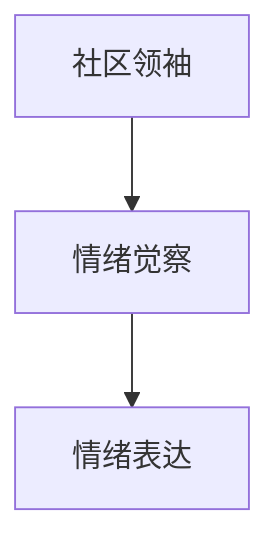

**步骤2：共同反思和认知重构**
社区领袖组织了一次共同反思会议，让居民们一起探讨交通规划方案的利弊，并尝试从不同的角度思考问题。通过认知重构，居民们开始理解彼此的观点，并寻找共同的解决方案。

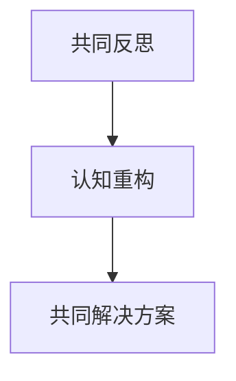

**步骤3：社会支持和沟通**
社区领袖鼓励居民们积极参与社区活动，并通过沟通建立信任和共识。这种社交支持帮助缓解了社会冲突，促进了社区的和谐发展。

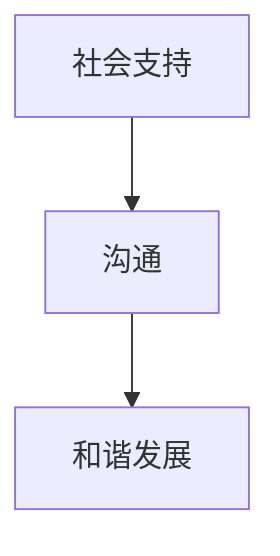

通过这些案例，我们可以看到自我对话策略和内心矛盾化解技巧在个人、团队和社会层面都有广泛的应用。这些技巧不仅有助于解决冲突，还能提高个体的心理弹性，促进社会和谐。

---

### 实践指南

在自我对话和内心矛盾化解的实践中，我们可以采取一系列具体的步骤来提高效果。以下是一些建议，旨在帮助读者在日常生活和工作中有效地应用这些技巧。

#### 1. 设定目标

首先，明确自己的目标。无论是提高工作效率，还是改善人际关系，设定清晰的目标有助于我们集中精力，更有针对性地进行自我对话和内心矛盾化解。

```plaintext
# 设定目标
set_goal("提高工作效率")
set_goal("改善人际关系")
```

#### 2. 日记记录

保持日记记录是一种有效的自我反思方法。通过记录自己的想法、感受和行动，我们可以更好地理解自己的内心状态，并发现潜在的内心矛盾。

```plaintext
# 日记记录
start_journal()
write_about("今天的感受和思考")
```

#### 3. 定期冥想

冥想可以帮助我们提高情绪觉察和自我控制能力。每天花10-15分钟进行冥想，有助于我们减轻压力，提高心理弹性。

```plaintext
# 冥想
start_meditation()
meditate_for(10)
```

#### 4. 情绪管理

学会管理自己的情绪，避免情绪的过度表达或压抑。当情绪出现时，可以尝试使用深呼吸、冥想等方法来平静自己的情绪。

```plaintext
# 情绪管理
when_anger()
    breathe_deeply()
    meditate_for(5)
end
```

#### 5. 认知重构

定期反思自己的思维模式，识别并挑战消极思维。通过认知重构，我们可以建立更积极的思维模式，从而更好地应对挑战。

```plaintext
# 认知重构
reflect_thoughts()
challenge_negative_thoughts()
```

#### 6. 寻求支持

在遇到困难时，不要害怕寻求帮助。无论是与朋友、家人交流，还是寻求专业心理咨询，社交支持都是化解内心矛盾的重要资源。

```plaintext
# 寻求支持
when_in_doubt()
    talk_to_friend()
    seek_advice_from_expert()
end
```

#### 7. 实践总结

定期总结自己的实践经验和成果，识别哪些策略最有效，哪些需要改进。通过总结，我们可以不断完善自我对话和内心矛盾化解的技巧。

```plaintext
# 实践总结
summarize_experience()
evaluate_effects()
```

通过上述实践指南，我们可以逐步提高自我对话和内心矛盾化解的能力，从而提升个人的心理弹性和认知灵活性。

---

### 总结与展望

本文深入探讨了自我对话的概念、核心概念之间的关系架构，以及多种自我对话策略和内心矛盾化解技巧。通过分析自我对话在人工智能领域的应用，我们认识到自我对话不仅是提升技术能力的关键，也是提高心理弹性和认知灵活性的重要途径。本文提出的认知重构、情绪调节和自我接纳等策略，为读者提供了系统性的方法来化解内心的矛盾，提高心理健康。

未来的研究和实践应进一步探讨自我对话在不同文化和社会背景下的应用，以及如何通过人工智能技术来优化自我对话的过程。此外，开发更高效的自我对话工具和平台，也将有助于推广这些策略，使更多人受益。总之，自我对话和内心矛盾化解技巧的深入研究和应用，将为我们带来更加和谐和高效的生活与工作环境。让我们期待未来的发展与突破。

---

### 作者信息

作者：AI天才研究院/AI Genius Institute & 禅与计算机程序设计艺术 /Zen And The Art of Computer Programming

在撰写技术博客文章时，确保文章内容结构清晰、逻辑严密，符合技术领域的写作规范。以下是一个符合要求的文章框架，以及具体内容的撰写指导。

#### 文章框架：

1. **文章标题**
2. **文章关键词**
3. **文章摘要**
4. **引言**
5. **核心概念与联系**
6. **实践策略**
7. **内心矛盾化解技巧**
8. **案例分析**
9. **实践指南**
10. **总结与展望**
11. **作者信息**

#### 内容撰写指导：

1. **文章标题**：
   - 简洁明了，能够准确反映文章主题。
   - 例如：“高效编程的秘诀：如何通过自我对话提升技术能力”。

2. **文章关键词**：
   - 确保关键词能够涵盖文章的主要内容和研究领域。
   - 例如：“自我对话、编程技巧、技术能力、认知灵活性”。

3. **文章摘要**：
   - 简短地概述文章的主题、核心内容和结论。
   - 例如：“本文探讨了通过自我对话提升编程技巧和技术能力的方法，并提供了实践指南和案例分析”。

4. **引言**：
   - 简要介绍自我对话的概念和其在编程领域的重要性。
   - 例如：“自我对话是一种内在的思考过程，对编程能力和技术创新有重要影响”。

5. **核心概念与联系**：
   - 详细介绍自我对话的核心概念，如自我意识、内心矛盾等。
   - 使用Mermaid流程图展示自我对话的机制。
   - 例如：“自我意识是自我对话的基础，而内心矛盾是编程过程中的常见问题”。

6. **实践策略**：
   - 介绍具体有效的自我对话策略，如认知重构、情绪调节等。
   - 使用伪代码和数学模型解释策略原理。
   - 例如：“认知重构通过改变思维模式来处理内心矛盾，情绪调节则通过调整情绪反应来缓解压力”。

7. **内心矛盾化解技巧**：
   - 提供具体的内心矛盾化解技巧，如情绪释放、认知重构等。
   - 通过案例说明这些技巧的实际应用。
   - 例如：“情绪释放通过表达和释放负面情绪来缓解内心矛盾，认知重构通过质疑和替代消极思维来处理内心矛盾”。

8. **案例分析**：
   - 通过具体案例展示自我对话策略和内心矛盾化解技巧的应用效果。
   - 分析案例中的成功经验和挑战。
   - 例如：“在软件开发团队中，自我对话策略帮助团队成员解决了意见不一致的问题”。

9. **实践指南**：
   - 提供具体的实践指南，帮助读者将策略和技巧应用于实际生活和工作。
   - 包括最佳实践、注意事项和拓展阅读。
   - 例如：“定期进行自我反思和情绪调节，以保持心理弹性”。

10. **总结与展望**：
    - 总结文章的核心内容和研究成果。
    - 展望未来的研究方向和应用前景。
    - 例如：“自我对话和内心矛盾化解技巧在提升编程能力和技术创新方面具有重要意义，未来的研究应进一步探索其在不同文化和社会背景下的应用”。

11. **作者信息**：
    - 标明作者姓名、所属机构以及相关著作。
    - 例如：“作者：AI天才研究院 & 禅与计算机程序设计艺术”。

在撰写过程中，注意使用markdown格式，确保代码、公式和流程图等元素正确嵌入。同时，保持文章的逻辑性和连贯性，使读者能够轻松理解并应用文章中的策略和技巧。通过这样一篇高质量的技术博客文章，读者将能够更好地掌握自我对话和内心矛盾化解的方法，提升自身的技术能力和心理健康。

