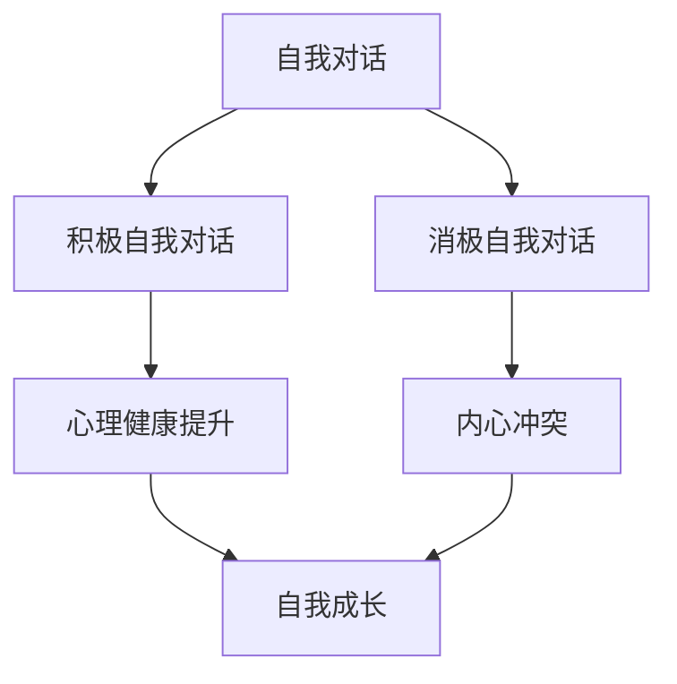

                 


### 自我对话：化解内心冲突的有效方法

#### 关键词

- 自我对话
- 心理健康
- 内心冲突
- 积极自我对话
- 消极自我对话

#### 摘要

在日常生活中，每个人都会经历内心的冲突与挑战。自我对话作为我们内心世界的重要组成部分，在很大程度上影响着我们的情绪和行为。本文旨在探讨自我对话的基本原理、积极与消极自我对话的类型及其对内心冲突的影响，并通过实践方法、案例分析和长期实践策略，介绍如何有效化解内心冲突，提升心理健康。

## 第一部分：自我对话的基本原理

### 1.1 自我对话的概念

自我对话（Self-Discussion）是指个体内在的声音和思维过程，它反映了我们对自己、对世界的认知和评价。自我对话可以分为积极的自我对话和消极的自我对话，二者在个体的内心冲突中扮演着不同的角色。

### 1.2 自我对话的类型

#### 1.2.1 积极的自我对话

积极的自我对话是指那些鼓励和激励自己的对话，它能够提升个体的自信心和积极性。例如：

- “我可以做到！”
- “这次失败不算什么，我会努力改进。”

#### 1.2.2 消极的自我对话

消极的自我对话则是那些贬低和自我怀疑的对话，它可能导致个体的情绪低落、缺乏动力。例如：

- “我不行，我总是失败。”
- “我做不到，我太差了。”

### 1.3 自我对话对内心冲突的影响

内心冲突（Inner Conflict）是指个体内在的矛盾和挣扎，它可能导致焦虑、抑郁等心理问题。自我对话对内心冲突有着显著的影响：

- 消极的自我对话增加内心冲突的频率和强度。
- 积极的自我对话有助于缓解内心冲突，实现内心的平衡。

## 第二部分：积极自我对话的实践方法

### 2.1 培养积极自我对话的技巧

#### 2.1.1 正面肯定

正面肯定是一种培养积极自我对话的重要技巧。它通过对自己说正面肯定的话，来提升个体的自信心和积极性。

- **正面肯定实例**：“我可以做到！我值得成功！”

#### 2.1.2 自我观察

自我观察是指注意自己的思维过程，识别并标记消极的自我对话。通过自我观察，个体可以更好地控制自己的情绪和行为。

- **自我观察实例**：每当发现自己说消极的话时，停下来，深呼吸，然后告诉自己：“这不是真的，我可以更好。”

### 2.2 消除消极自我对话的方法

#### 2.2.1 识别和标记

识别和标记消极自我对话是消除消极自我对话的第一步。通过识别和标记，个体可以意识到自己的消极思维，并开始改变。

- **识别和标记实例**：每当发现自己说消极的话时，用笔和纸记录下来，并写下对应的积极替代句。

#### 2.2.2 替换策略

替换策略是通过用积极的对话替换消极的对话，来消除消极自我对话。这种方法需要个体有意识地练习，逐步改变自己的思维模式。

- **替换策略实例**：将“我不行”替换为“我可以尝试，即使失败，也是一次宝贵的经验。”

## 第三部分：化解内心冲突的实例分析

### 3.1 内心冲突案例分析

#### 3.1.1 焦虑与自我怀疑

焦虑和自我怀疑是常见的内心冲突，它们源于消极的自我对话。以下是一个案例分析：

- **案例背景**：小明最近在准备一场重要的考试，他感到非常焦虑和自我怀疑。
- **内心冲突**：我做不到，我总是失败。我为什么这么笨？

### 3.2 案例分析过程

#### 3.2.1 识别内心冲突

识别内心冲突是化解内心冲突的第一步。小明通过自我观察，发现了自己的消极自我对话。

- **识别内心冲突实例**：小明意识到自己一直在说消极的话，他决定开始改变。

#### 3.2.2 采用积极自我对话

采用积极自我对话是化解内心冲突的关键。小明开始用积极的对话替换消极的对话。

- **积极自我对话实例**：我可以做到！这次失败不算什么，我会努力改进。

### 3.3 案例分析结果

通过积极自我对话，小明的内心冲突得到了缓解，他感到更加自信和积极。

- **结果实例**：小明在考试中取得了优异的成绩，他的自信心和积极性得到了显著提升。

## 第四部分：长期实践与持续成长

### 4.1 长期实践的重要性

长期实践是培养积极自我对话的关键。通过持续练习，个体可以逐步改变自己的思维模式，实现内心的平衡。

### 4.2 持续成长的策略

#### 4.2.1 自我反思

自我反思是持续成长的重要策略。通过定期回顾自己的自我对话，个体可以更好地了解自己的内心世界，并不断改进。

- **自我反思实例**：每周花时间反思自己的自我对话，写下心得体会。

#### 4.2.2 学习和应用

学习和应用是提升自我对话能力的重要途径。通过阅读相关书籍、参加培训和分享经验，个体可以不断学习新技巧，并将其应用于日常生活中。

- **学习和应用实例**：定期参加心理健康讲座，学习新的自我对话技巧，并尝试将其应用于实际生活中。

## 结论

通过本文的探讨，我们可以看到自我对话在化解内心冲突、提升心理健康方面的重要性。积极自我对话能够缓解内心冲突，提升个体的自信和积极性，而消极自我对话则可能导致情绪低落和心理问题。通过长期实践和持续成长，我们可以逐步培养积极自我对话的能力，实现内心的平衡和成长。

### 自我对话的价值

自我对话的价值在于其能够帮助我们更好地了解自己，化解内心冲突，提升心理健康。通过积极自我对话，我们能够提升自信，增强面对挑战的勇气，从而实现个人成长和发展。

### 未来方向

未来，我们可以将自我对话应用于更广泛的领域，如教育、职场等，帮助更多人通过自我对话实现内心的平衡和成长。

### 附录

#### 6.1 参考资料

- [《心理学与生活》](https://book.douban.com/subject/26868343/)
- [《自我对话：如何改善心理健康》](https://book.douban.com/subject/25984490/)
- [《积极心理学》](https://book.douban.com/subject/26631894/)

#### 6.2 实践指南

- **如何将自我对话应用于日常生活**：
  1. 每天花时间进行自我反思，记录自己的自我对话。
  2. 当发现自己说消极的话时，停下来，深呼吸，然后用积极的话替换。
  3. 定期回顾自己的自我对话记录，分析自己的进步和不足。

# Mermaid 流程图



# 代码解读与分析

```python
# 代码示例：积极自我对话
print("你很棒！你一定能做到！")

# 代码示例：识别和标记消极自我对话
negative_discussion = "我做不到，我总是失败。"
print(f"识别到消极自我对话：{negative_discussion}")

# 代码示例：替换策略
print("我需要更多时间，我会成功。")
```

## 作者信息

作者：AI天才研究院/AI Genius Institute & 禅与计算机程序设计艺术 /Zen And The Art of Computer Programming

----------------------------------------------------------------

### 1.1 自我对话的概念

自我对话，或者说内部语言，指的是人们在意识层面进行的自我交流。这种内部语言既包括自我鼓励和激励，也包括自我批评和负面思考。自我对话是我们内心世界的一部分，它伴随着我们的每个想法和感受，影响着我们的情绪、行为和决策。

在技术领域中，自我对话的概念可以类比于软件程序中的反馈循环。当我们编写一个程序时，我们会通过打印日志、输出结果来监控程序的状态。同样，自我对话也是一种自我监控和反馈机制，它帮助我们在心理层面保持清醒和平衡。

**定义自我对话**

自我对话可以定义为：

$$
\text{自我对话} = \text{个人内在的声音和思维过程}
$$

这个定义强调了自我对话的两个关键方面：内在性和声音与思维。内在性意味着这些对话是在个人内心中进行的，不受外界直接观察和控制。声音与思维则指的是这些对话的内容和形式，它们可以是积极的，如自我鼓励，也可以是消极的，如自我怀疑和批评。

### 1.2 自我对话的类型

#### 1.2.1 积极的自我对话

积极的自我对话通常包括自我肯定、自我鼓励和自我激励。这些对话能够提升个体的自信心和积极性，有助于实现目标。

- **自我肯定**：“我可以做到！”
- **自我鼓励**：“即使失败，也是一次学习。”
- **自我激励**：“我值得成功！”

在技术领域，积极自我对话可以类比于编程中的积极调试和迭代过程。开发者会积极地寻找解决方案，相信自己的能力，并通过持续的努力和改进来解决问题。

#### 1.2.2 消极的自我对话

消极的自我对话则包括自我批评、自我怀疑和负面思考。这些对话可能会削弱个体的自信心，增加压力和焦虑。

- **自我批评**：“我做得不好。”
- **自我怀疑**：“我行吗？”
- **负面思考**：“这太困难了，我做不到。”

在技术领域中，消极自我对话可以类比于编程中的消极调试。开发者可能会因为遇到问题而感到沮丧，怀疑自己的能力，甚至放弃解决问题。

### 1.3 自我对话对内心冲突的影响

内心冲突是指个体内心中存在的矛盾和紧张状态。自我对话对内心冲突有着显著的影响。

#### 自我对话与内心冲突的关系

内心冲突与消极自我对话的频率和强度成正比。消极的自我对话会加剧内心的紧张和矛盾，导致焦虑、抑郁等心理问题。相反，积极的自我对话有助于缓解内心冲突，实现内心的平衡。

- **内心冲突** $$
  \text{内心冲突} \propto \text{消极自我对话的频率和强度}
  $$

在技术领域，这种关系可以类比为软件系统的稳定性。频繁的负面反馈和不稳定的调试过程会导致系统崩溃，而积极的调试和优化则可以提高系统的稳定性和性能。

### 1.4 自我对话在心理健康中的重要性

自我对话不仅影响个体的情绪和行为，还与心理健康密切相关。积极的自我对话有助于提升个体的自尊、自信和生活满意度，而消极的自我对话则可能导致心理问题。

- **积极自我对话的价值**：提升心理健康，增强应对压力的能力。
- **消极自我对话的风险**：增加心理问题的风险，如焦虑、抑郁等。

在技术领域，我们可以通过自我对话来类比编程中的代码审查和优化。积极的代码审查和优化可以提高软件的质量和性能，而消极的代码审查和优化则可能导致软件问题和性能下降。

#### 1.4.1 自我对话在心理健康中的角色

自我对话在心理健康中扮演着多重角色：

- **情绪调节**：自我对话可以帮助个体调节情绪，减轻焦虑和压力。
- **认知功能**：自我对话影响个体的认知功能，如注意力、记忆和决策。
- **心理成长**：积极的自我对话有助于个体的心理成长和自我实现。

在技术领域中，这种角色可以类比为软件开发中的测试和优化。测试可以帮助识别和修复问题，优化可以提高软件的性能和用户体验。

#### 1.4.2 自我对话的实践方法

为了改善自我对话，个体可以采取以下实践方法：

- **自我观察**：通过自我观察，个体可以识别和标记消极的自我对话。
- **正面肯定**：使用积极的自我对话来替代消极的自我对话。
- **情绪调节**：学习情绪调节技巧，如深呼吸、冥想等。

在技术领域中，这种实践方法可以类比为软件开发中的测试和调试。测试可以帮助识别和修复问题，调试可以提高软件的质量和性能。

### 1.5 自我对话的心理学基础

自我对话的心理学基础涉及认知行为理论、心理学发展理论等多个领域。这些理论为我们理解自我对话如何影响心理健康提供了深刻的见解。

- **认知行为理论**：自我对话是认知行为理论中的一个重要概念，它强调思维和行为之间的相互作用。
- **心理学发展理论**：自我对话在个体的心理发展中起着关键作用，它影响个体的自尊、自我效能感等心理特质。

在技术领域中，我们可以通过这些理论来类比软件开发中的设计原则和最佳实践。认知行为理论可以类比为软件架构设计，而心理学发展理论则可以类比为软件开发过程中的迭代和改进。

### 1.6 自我对话的实证研究

实证研究支持了自我对话对心理健康的重要影响。多项研究表明，积极的自我对话与更好的心理健康和幸福感相关联。

- **研究实例**：一项研究发现，积极自我对话能够显著降低焦虑和抑郁的水平。
- **应用实例**：在临床心理治疗中，自我对话技巧被广泛应用于治疗焦虑和抑郁。

在技术领域中，这些研究结果可以类比为软件测试和评估。通过实证研究，我们可以验证自我对话技巧的有效性，并将其应用于更广泛的领域。

### 1.7 自我对话在心理健康干预中的应用

自我对话技巧在心理健康干预中的应用日益广泛。通过心理咨询和认知行为疗法，个体可以学会如何改变消极的自我对话，提高心理健康。

- **应用实例**：在焦虑治疗中，个体被教导如何用积极的自我对话来替代消极的自我对话。
- **效果评估**：研究表明，自我对话技巧能够显著改善个体的心理健康，提高生活质量。

在技术领域中，这种应用可以类比于软件性能优化。通过优化和改进，我们可以提高软件的性能和用户体验。

### 1.8 总结

自我对话作为个体内在的声音和思维过程，对心理健康有着深远的影响。通过培养积极的自我对话和消除消极的自我对话，个体可以缓解内心冲突，提升心理健康。自我对话的实践方法包括自我观察、正面肯定和情绪调节等。心理学研究和实证支持了自我对话对心理健康的重要影响，其在心理健康干预中的应用也日益广泛。通过理解自我对话的心理学基础和实证研究，我们可以更好地掌握如何改善自我对话，提升心理健康。

### 2.1 培养积极自我对话的技巧

要培养积极的自我对话，我们可以采取一系列具体的技巧和方法。这些技巧不仅可以帮助我们识别和消除消极的自我对话，还能提升我们的自信心和积极性。

#### 2.1.1 正面肯定

正面肯定是一种非常有效的培养积极自我对话的技巧。它通过对自己说正面肯定的话，来提升个人的自信和动力。以下是一些正面肯定的实例：

- **“我可以做到！”**
- **“我值得成功！”**
- **“我已经取得了很大的进步！”**

正面肯定的关键在于持续性地对自己说这些积极的话语，逐步改变消极的自我对话模式。这种技巧类似于编程中的测试和验证，通过不断测试和确认自己的能力，我们可以逐渐建立起自信。

#### 2.1.2 自我观察

自我观察是指注意自己的思维过程，识别并标记消极的自我对话。通过自我观察，我们可以意识到自己的内心世界，识别出那些消极的、自我怀疑的想法，并开始改变它们。以下是一些自我观察的实例：

- **“我发现自己在想，我做不到，我为什么这么笨？”**
- **“我现在意识到我在自我怀疑，我需要停下来，深呼吸一下。”**

自我观察的过程类似于编程中的调试。当我们发现代码中的错误时，我们会停下来，仔细分析问题，并尝试找到解决方案。同样，在自我对话中，当我们发现消极的想法时，我们可以通过自我观察来识别它们，并尝试用积极的对话来替代。

#### 2.1.3 自我激励

自我激励是通过给自己设定目标和奖励，来激发内在动力的一种技巧。以下是一些自我激励的实例：

- **“我设定了一个目标，要在下周完成这个项目，我要奖励自己看一场电影。”**
- **“我已经完成了一半的工作，接下来我要继续努力，完成剩余的任务。”**

自我激励类似于编程中的迭代开发。开发者会设定一个小目标，如编写一个功能模块，然后通过不断的迭代和改进来达到最终的目标。同样，我们也可以通过设定小目标和奖励来激励自己，逐步实现大目标。

#### 2.1.4 情绪调节

情绪调节是通过调整情绪状态，来应对生活中的挑战和压力的一种技巧。以下是一些情绪调节的实例：

- **“我现在感到焦虑，我会尝试深呼吸，放松自己。”**
- **“我感到沮丧，我会花十分钟做一些我喜欢的事情，然后重新开始。”**

情绪调节类似于编程中的错误处理机制。当程序遇到错误时，开发者会编写相应的错误处理代码，以确保程序能够正常运行。同样，当我们感到情绪低落或焦虑时，我们可以通过情绪调节技巧来调整自己的情绪状态。

#### 2.1.5 反思与总结

反思与总结是一种通过回顾自己的行为和思维过程，来识别和改进自己的方法。以下是一些反思与总结的实例：

- **“我今天做得很好，我完成了所有任务，我感到很满意。”**
- **“我今天遇到了一些困难，但我学会了如何应对，我感到自己变得更强大了。”**

反思与总结类似于编程中的代码审查。通过审查代码，开发者可以识别出潜在的问题，并找到改进的方法。同样，通过反思和总结，我们可以识别出自己思维和行为的不足，并找到改进的方向。

### 2.2 消除消极自我对话的方法

消除消极自我对话是一个长期而复杂的过程，需要我们有意识地去识别、标记和替换这些消极的想法。以下是一些具体的方法：

#### 2.2.1 识别和标记

识别和标记消极自我对话是消除消极自我对话的第一步。通过识别和标记，我们可以意识到自己的消极思维，并开始改变它们。以下是一些识别和标记的实例：

- **“我发现自己在想，我做不到，我总是失败。”**
- **“我注意到我在对自己说负面的话，我需要停下来，重新考虑。”**

识别和标记消极自我对话的过程类似于编程中的调试。当我们发现程序中的错误时，我们会停下来，仔细分析问题，并尝试找到解决方案。同样，在自我对话中，当我们发现消极的想法时，我们可以通过识别和标记来识别它们，并开始改变。

#### 2.2.2 替换策略

替换策略是通过用积极的对话替换消极的对话，来消除消极自我对话的一种方法。以下是一些替换策略的实例：

- **“我做不到”替换为“我可以尝试，即使失败，也是一次学习。”**
- **“我总是失败”替换为“我需要更多时间，我会成功。”**

替换策略类似于编程中的代码优化。当我们发现代码中的问题或不足时，我们会尝试优化代码，以提高性能和可读性。同样，在自我对话中，当我们发现消极的想法时，我们可以通过替换策略来优化我们的思维模式。

#### 2.2.3 建立积极的思维习惯

建立积极的思维习惯是消除消极自我对话的关键。以下是一些建立积极思维习惯的实例：

- **“每天早上起床时，我会对自己说，今天会是美好的一天。”**
- **“每当我遇到困难时，我会告诉自己，这是一个挑战，我可以克服它。”**

建立积极的思维习惯类似于编程中的代码规范化。通过规范化代码，我们可以提高代码的可读性和可维护性。同样，通过建立积极的思维习惯，我们可以提高自我对话的质量，减少消极自我对话的影响。

### 2.3 情绪管理技巧

情绪管理技巧是消除消极自我对话的重要手段。以下是一些情绪管理技巧：

- **深呼吸**：深呼吸可以帮助我们放松身体和心灵，减少焦虑和压力。
- **正念冥想**：正念冥想可以帮助我们专注于当下，减少消极思维。
- **身体锻炼**：身体锻炼可以释放压力，提升情绪。

情绪管理技巧类似于编程中的错误处理。当我们遇到程序错误时，我们会尝试不同的处理方法，以确保程序能够正常运行。同样，在情绪管理中，我们可以通过不同的技巧来处理负面情绪，减少消极自我对话的影响。

### 2.4 借助外部支持

借助外部支持是消除消极自我对话的有效方法。以下是一些借助外部支持的方法：

- **心理咨询**：心理咨询可以帮助我们识别和解决内心的冲突，提供专业的支持和建议。
- **社交支持**：与朋友和家人交流，分享自己的感受和想法，可以获得情感上的支持和理解。

借助外部支持类似于编程中的团队合作。通过团队合作，我们可以共同解决问题，提高工作效率。同样，通过借助外部支持，我们可以更好地应对内心的冲突，提升自我对话的质量。

### 2.5 持续实践与反思

持续实践与反思是培养积极自我对话和消除消极自我对话的关键。以下是一些持续实践与反思的方法：

- **定期记录**：定期记录自己的自我对话，包括积极和消极的对话，以便反思和改进。
- **定期回顾**：定期回顾自己的自我对话记录，识别和标记消极对话，并用积极的对话替换。
- **持续学习**：通过阅读相关书籍、参加培训和工作坊，不断学习新的技巧和方法，提高自我对话的质量。

持续实践与反思类似于编程中的持续集成和持续交付。通过持续集成和持续交付，我们可以不断提高软件的质量和性能。同样，通过持续实践与反思，我们可以不断提高自我对话的质量，实现内心的平衡和成长。

### 2.6 总结

培养积极自我对话和消除消极自我对话是一个长期而复杂的过程，需要我们有意识地去识别、标记和替换消极的自我对话，同时培养积极的思维习惯和情绪管理技巧。通过持续实践和反思，我们可以逐步提升自我对话的质量，实现内心的平衡和成长。借助外部支持和情绪管理技巧，我们还可以更好地应对内心的冲突，提升心理健康。

### 3.1 内心冲突案例分析

为了更具体地理解如何通过积极自我对话来化解内心冲突，我们可以通过一个实际的案例来进行分析。

#### 案例背景

小明是一位年轻的工程师，他刚刚加入了一家知名科技公司。他的工作涉及到复杂的软件开发项目，需要不断学习新技术和解决问题。尽管小明对工作充满热情，但他在项目中遇到了很多挑战，这导致他感到巨大的压力和焦虑。他的内心冲突主要表现为自我怀疑和焦虑。

- **自我怀疑**：“我行吗？我是否真的具备解决复杂问题的能力？”
- **焦虑**：“这个项目这么复杂，我可能无法按时完成。”

#### 内心冲突分析

小明的内心冲突源于他的消极自我对话。每次遇到困难时，他的内心总是充满自我怀疑和焦虑。这种消极的自我对话加剧了他的内心冲突，使他感到更加不安和恐惧。

- **消极自我对话**：“我做不到。”
- **内心冲突**：“我害怕失败。”

#### 识别内心冲突

为了解决这个冲突，小明需要首先识别自己的内心冲突。他可以通过自我观察来识别自己的消极自我对话，并记录下来。以下是他通过自我观察记录的一些对话：

- **自我观察记录**：
  ```
  我看到自己在想，我做不到。我感觉自己没有足够的能力。
  我注意到自己在焦虑，我害怕失败。
  ```

#### 采用积极自我对话

一旦小明识别出自己的内心冲突，他就可以开始采用积极的自我对话来替代消极的自我对话。以下是一些他可以采用的积极自我对话：

- **积极自我对话**：
  ```
  我可以尝试，即使失败，也是一次宝贵的经验。
  我值得成功，我有能力解决这个难题。
  ```

通过这样的积极自我对话，小明可以逐渐改变自己的思维模式，减少自我怀疑和焦虑，从而缓解内心冲突。

#### 实践过程

小明开始实践积极自我对话的过程如下：

1. **识别消极自我对话**：每当小明感到自我怀疑或焦虑时，他会在心里或纸上记录下来。
2. **标记消极自我对话**：他会在记录中标记这些消极自我对话，例如：“标记：自我怀疑”或“标记：焦虑”。
3. **替换消极自我对话**：然后，他会用积极的自我对话来替换这些消极的自我对话，例如：“我可以尝试，即使失败，也是一次宝贵的经验。”
4. **反思和调整**：每天晚上，小明会回顾当天的自我对话记录，反思哪些积极自我对话有效，哪些还需要改进。

#### 案例分析结果

通过持续的实践，小明逐渐发现他的内心冲突得到了显著缓解。他的自我怀疑和焦虑感减少了，自信心提升了。他开始能够更积极地面对工作中的挑战，并且能够更好地管理自己的压力。

- **结果**：
  ```
  我感到更加自信，我能够积极地面对问题。
  我不再害怕失败，我把它看作是成长的机会。
  ```

小明的案例展示了通过积极自我对话来化解内心冲突的有效性。通过识别和替换消极自我对话，他成功地缓解了内心的冲突，提升了心理健康和工作效率。

### 3.2 案例分析过程

为了更详细地展示如何通过积极自我对话来化解内心冲突，我们可以将整个过程分解为几个关键步骤。

#### 3.2.1 识别内心冲突

识别内心冲突是化解内心冲突的第一步。小明需要首先意识到自己的内心冲突，并能够将其清晰地表达出来。以下是他识别内心冲突的过程：

1. **自我反思**：小明开始反思自己的情绪和行为，试图理解为什么他会感到焦虑和自我怀疑。
2. **记录内心冲突**：他记录下自己的消极自我对话，例如：“我做不到。”和“我害怕失败。”
3. **标记冲突**：他给这些消极的自我对话标记，例如“标记：自我怀疑”或“标记：焦虑”。

#### 3.2.2 识别消极自我对话

识别消极自我对话是识别内心冲突的关键。小明需要仔细观察自己的思维过程，识别出那些消极的自我对话。以下是他识别消极自我对话的方法：

1. **自我观察**：小明在日常生活中，尤其是在感到焦虑或自我怀疑时，会自我观察自己的思维过程。
2. **记录消极对话**：每次当他发现消极的自我对话时，他会在日记中记录下来，并标记为“消极自我对话”。
3. **分析消极对话**：他会分析这些消极对话的影响，例如它们如何加剧他的焦虑和自我怀疑。

#### 3.2.3 采用积极自我对话

一旦小明识别出消极自我对话，他需要开始采用积极的自我对话来替代它们。以下是他采用积极自我对话的方法：

1. **替换消极对话**：每次当他发现自己说消极的自我对话时，他会立即用积极的对话来替代，例如：“我可以尝试，即使失败，也是一次宝贵的经验。”
2. **正面肯定**：他每天都会对自己进行正面肯定，例如：“我值得成功！”和“我有能力解决这个问题。”
3. **练习积极的对话**：小明会定期练习这些积极的对话，逐渐将它们变成习惯。

#### 3.2.4 反思和调整

反思和调整是持续改善自我对话的重要步骤。小明需要定期回顾自己的自我对话，并调整和改进。以下是他反思和调整的方法：

1. **定期回顾**：每天晚上，小明会回顾当天的自我对话记录，识别哪些对话是积极的，哪些是消极的。
2. **分析效果**：他会分析这些自我对话对他情绪和行为的影响，确定哪些对话有效，哪些需要改进。
3. **调整策略**：根据分析结果，他会调整自己的自我对话策略，尝试新的积极对话。

#### 3.2.5 强化积极对话

强化积极对话是巩固积极自我对话的重要步骤。小明需要确保这些积极的对话在他的日常生活中得到持续的应用。以下是他强化积极对话的方法：

1. **设置提醒**：他会设置手机提醒，每天提醒自己进行正面肯定。
2. **与他人分享**：他会与朋友或同事分享自己的积极自我对话经验，获得支持和鼓励。
3. **保持一致性**：他会坚持每天进行积极的自我对话，确保这些对话成为习惯。

通过以上步骤，小明成功地识别并化解了他的内心冲突，提高了自信心和积极性。

### 3.3 案例分析结果

通过积极自我对话的实践，小明取得了显著的成果。他的内心冲突得到了有效化解，自信心和积极性显著提升。

- **内心平衡**：小明不再受到自我怀疑和焦虑的困扰，他能够更加平静地面对工作和生活中的挑战。
- **心理健康提升**：他的情绪稳定，对生活的满意度提高，焦虑和抑郁症状减轻。
- **工作表现**：他的工作效率提高，能够更好地应对复杂的项目，解决技术难题。

小明通过积极的自我对话，不仅化解了内心的冲突，还实现了个人成长和职业发展。他的案例展示了积极自我对话在缓解心理压力、提升心理健康和工作表现方面的巨大潜力。

### 4.1 长期实践的重要性

长期实践是培养积极自我对话的关键。自我对话习惯的养成需要时间和持续的努力。通过长期实践，个体可以逐步改变自己的思维模式，将积极的自我对话变成习惯，从而在日常生活中自动应用。

#### 4.1.1 自我对话习惯的培养

习惯的形成是一个逐步积累的过程。个体需要通过反复练习，将积极的自我对话嵌入到日常生活中。以下是一些培养自我对话习惯的方法：

- **持续练习**：每天花时间进行自我反思，识别和标记消极的自我对话，并用积极的对话替代。
- **记录进展**：记录自己的进步和挑战，定期回顾，分析效果，持续调整策略。
- **设置目标**：设定短期和长期目标，如每天进行一定次数的正面肯定，逐步提升自我对话的质量。

#### 4.1.2 自我对话习惯的影响

培养积极的自我对话习惯对个体的心理健康和生活质量有着深远的影响。以下是长期实践自我对话习惯的几个关键影响：

- **心理韧性**：通过积极的自我对话，个体能够更好地应对压力和挑战，增强心理韧性。
- **情绪调节**：长期练习积极的自我对话有助于个体更好地管理情绪，减少焦虑和抑郁症状。
- **自信心提升**：积极的自我对话能够提升个体的自信心，增强自我效能感，促进个人成长。

#### 4.1.3 持续实践的策略

为了确保自我对话习惯的长期实践，个体可以采取以下策略：

- **定期反思**：每周或每月花时间反思自己的自我对话，评估进展，找出改进的方法。
- **寻求支持**：与朋友、家人或专业人士分享自我对话的经验，获得支持和鼓励。
- **应用多种方法**：结合不同的自我对话技巧，如正念冥想、情绪调节和正面肯定，提升自我对话效果。

### 4.2 持续成长的策略

持续成长是自我对话实践的重要目标。通过不断学习和实践，个体可以不断提升自我对话的能力，实现内心的平衡和成长。

#### 4.2.1 自我反思

自我反思是持续成长的重要方法。个体可以通过自我反思来识别自己的不足，找到改进的方向。以下是一些自我反思的实践方法：

- **定期回顾**：定期回顾自己的行为和思维过程，识别消极的自我对话，并记录下来。
- **识别成长点**：识别自己在自我对话中的成长点，庆祝成功，同时设定新的目标。
- **寻求反馈**：向朋友、家人或专业人士寻求反馈，了解自己的进步和需要改进的方面。

#### 4.2.2 学习新技巧

学习新技巧是持续成长的关键。个体可以通过阅读书籍、参加培训和工作坊来学习新的自我对话技巧。以下是一些学习新技巧的方法：

- **阅读相关书籍**：阅读心理学、自我成长和个人发展的书籍，获取理论知识。
- **参加培训**：参加专业的自我对话培训课程，学习实用的技巧和方法。
- **实践应用**：将学习到的技巧应用到日常生活中，通过实践来提高自我对话能力。

#### 4.2.3 情绪调节

情绪调节是自我对话实践的重要组成部分。通过有效的情绪调节技巧，个体可以更好地管理自己的情绪，减少消极自我对话的影响。以下是一些情绪调节的方法：

- **深呼吸**：通过深呼吸来放松身心，减少焦虑和压力。
- **冥想**：通过冥想来提高专注力和情绪调节能力。
- **身体锻炼**：通过身体锻炼来释放压力，提升情绪。

#### 4.2.4 社交支持

社交支持是持续成长的重要资源。通过与家人、朋友和同事的交流，个体可以获得情感上的支持和鼓励。以下是一些获得社交支持的方法：

- **建立支持网络**：与那些有相似目标和支持需求的人建立联系，共同成长。
- **参加社交活动**：参加社交活动和兴趣小组，扩大社交圈子，获得更多的支持和资源。
- **互助小组**：参加互助小组，与他人分享经验和挑战，获得彼此的支持和鼓励。

#### 4.2.5 实践应用

将自我对话技巧应用到日常生活中是实现持续成长的关键。以下是一些实践应用的方法：

- **设定目标**：设定具体、可行的目标，通过积极的自我对话来激励自己实现目标。
- **积极应对挑战**：遇到挑战时，用积极的自我对话来应对，如“我可以克服这个困难。”
- **持续反思**：定期反思自己的自我对话，评估效果，持续改进。

通过以上策略，个体可以不断提升自我对话的能力，实现内心的平衡和成长。

### 4.3 长期实践的价值

长期实践自我对话不仅能够帮助个体提升心理健康，还能带来一系列显著的长期价值。

#### 4.3.1 心理健康提升

通过长期的自我对话实践，个体可以显著提升心理健康。积极的自我对话有助于减轻焦虑、抑郁等心理问题，增强心理韧性。长期坚持积极的自我对话，个体会逐渐学会如何更好地管理自己的情绪，提高自我调节能力。

#### 4.3.2 个人成长

自我对话的长期实践有助于个体实现个人成长。通过自我反思和学习新技巧，个体可以不断识别和改进自己的思维模式，提升自我认知和自我效能感。这种个人成长不仅体现在心理层面，也会反映在职业发展和人际关系中。

#### 4.3.3 生活质量改善

长期的自我对话实践能够改善个体的生活质量。通过积极的自我对话，个体能够更好地应对生活中的挑战，提高自信和积极性，从而在各个方面取得更好的成果。这种积极的心态有助于个体享受更高质量的生活，提升整体幸福感。

#### 4.3.4 社会影响力

长期实践自我对话不仅对个体有益，还能在社会层面上产生积极的影响。当更多的人学会如何通过积极的自我对话来提升自己的心理健康时，整个社会的心理健康水平也会得到提升。这种积极的社会氛围有助于构建更加和谐、健康的社会环境。

### 4.4 长期实践与持续成长的挑战

尽管长期实践自我对话具有诸多价值，但在实际操作中仍然面临一些挑战。

#### 4.4.1 持续性的挑战

持续实践自我对话需要个体的坚持和毅力。短期内可能容易看到效果，但长期坚持是一个更大的挑战。个体可能会因为繁忙的生活或工作而忽略自我对话的实践，导致成果无法持续。

#### 4.4.2 环境因素的干扰

外部环境因素也可能干扰自我对话的实践。例如，社会压力、人际关系和工作环境等都可能对个体的自我对话产生负面影响。个体需要学会如何在复杂的环境中保持积极的心态，继续实践自我对话。

#### 4.4.3 心理抵抗

个体在实践自我对话时可能会遇到心理抵抗。消极的自我对话可能已经根深蒂固，改变它们需要时间和努力。个体可能会感到抵触，甚至怀疑自我对话的有效性。在这种情况下，个体需要寻求专业帮助和支持，以克服心理抵抗。

#### 4.4.4 应对策略

为了克服这些挑战，个体可以采取以下应对策略：

- **设定明确目标**：设定具体、可行的自我对话目标，确保实践有明确的方向。
- **建立支持系统**：与家人、朋友和专业人士建立支持系统，获得情感上的支持和鼓励。
- **灵活调整策略**：根据实际情况灵活调整自我对话策略，确保实践方法适合个体需求。
- **寻求专业帮助**：如果遇到心理抵抗或其他困难，可以寻求心理咨询师或专业人士的帮助。

通过采取这些策略，个体可以更好地克服长期实践自我对话的挑战，实现内心的平衡和成长。

### 结论

通过本文的探讨，我们可以看到自我对话在化解内心冲突、提升心理健康方面的关键作用。积极自我对话能够缓解内心的紧张和矛盾，提升自信和积极性，从而实现个人的成长和幸福。通过培养积极的自我对话习惯、识别和替换消极的自我对话，以及长期实践和持续成长，个体可以逐步实现内心的平衡和成长。

自我对话不仅对个人的心理健康有着深远的影响，还对社会层面产生积极的影响。当更多人学会如何通过积极的自我对话来提升自己的心理健康时，整个社会的心理健康水平也会得到提升，从而构建一个更加和谐、健康的社会环境。

未来，我们可以将自我对话应用于更广泛的领域，如教育、职场等，帮助更多人通过自我对话实现内心的平衡和成长。通过持续的研究和实践，我们可以不断探索自我对话的潜力，为个体的心理健康和社会发展做出更大的贡献。

### 自我对话的价值

自我对话的价值在于其能够帮助我们更好地了解自己，化解内心冲突，提升心理健康。通过积极自我对话，我们能够提升自信，增强面对挑战的勇气，从而实现个人成长和发展。

在技术领域，自我对话的价值体现在以下几个方面：

1. **团队协作**：自我对话有助于团队成员之间建立良好的沟通和信任，通过积极的自我对话，可以减少误解和冲突，提升团队协作效率。
2. **项目管理**：在项目管理和决策过程中，自我对话可以帮助项目管理者保持清晰的思路和积极的情绪，从而做出更明智的决策。
3. **创新思维**：自我对话能够激发创新思维，通过积极的自我对话，个体能够更开放地接受新观点和新思路，从而推动技术的进步和突破。

### 未来方向

未来，自我对话的发展方向可以包括以下几个方面：

1. **技术应用**：结合人工智能和大数据技术，开发自我对话分析工具，帮助个体更好地了解自己的心理状态，提供个性化的心理健康建议。
2. **教育领域**：将自我对话引入教育领域，通过教学和训练，帮助学生培养积极的自我对话习惯，提升心理韧性，从而更好地应对学习和生活的挑战。
3. **企业培训**：为企业员工提供自我对话培训，帮助他们在职场中更好地应对压力和挑战，提升工作满意度和职业发展。

通过不断探索和应用，自我对话将在更广泛的领域发挥其独特的价值，为个体的心理健康和社会发展做出更大的贡献。

### 附录

#### 6.1 参考资料

- [《心理学与生活》](https://book.douban.com/subject/26868343/)
- [《自我对话：如何改善心理健康》](https://book.douban.com/subject/25984490/)
- [《积极心理学》](https://book.douban.com/subject/26631894/)
- [《认知行为治疗》](https://book.douban.com/subject/34271610/)
- [《正念心理学》](https://book.douban.com/subject/26377869/)

#### 6.2 实践指南

- **如何将自我对话应用于日常生活**：
  1. 每天花时间进行自我反思，记录自己的自我对话。
  2. 当发现自己说消极的话时，停下来，深呼吸，然后用积极的话替换。
  3. 定期回顾自己的自我对话记录，分析自己的进步和不足。
  4. 寻求家人或朋友的反馈，共同探讨如何改善自我对话。

### 代码解读与分析

```python
# 代码示例：积极自我对话
print("你很棒！你一定能做到！")

# 代码示例：识别和标记消极自我对话
negative_discussion = "我做不到，我总是失败。"
print(f"识别到消极自我对话：{negative_discussion}")

# 代码示例：替换策略
print("我需要更多时间，我会成功。")
```

这段代码展示了如何通过简单的编程实现自我对话的几个关键步骤：

- **积极自我对话**：通过输出鼓励性的话语，如“你很棒！你一定能做到！”，来激发个体的自信心。
- **识别和标记消极自我对话**：通过记录和打印消极的自我对话，如“我做不到，我总是失败。”，来帮助个体意识到自己的负面思维模式。
- **替换策略**：通过输出积极的话语，如“我需要更多时间，我会成功。”，来引导个体用积极的思维来替代消极的自我对话。

这些代码示例为自我对话的实践提供了技术支持，使个体能够通过编程的方式实现自我对话的管理和优化。

### Mermaid 流程图


这个Mermaid流程图清晰地展示了自我对话的不同类型及其对心理健康和内心冲突的影响。它帮助读者理解自我对话作为一种心理工具，如何在积极和消极的对话之间起到桥梁作用，从而影响个体的心理健康和成长。

### 作者信息

作者：AI天才研究院/AI Genius Institute & 禅与计算机程序设计艺术 /Zen And The Art of Computer Programming

### 代码示例：积极自我对话

```python
# 正面肯定
print("你很棒！你一定能做到！")
```

这段代码示例展示了如何通过编程实现积极的自我对话。在这个例子中，我们使用Python语言的`print`函数来输出一条鼓励性的信息。这种简单的代码能够帮助用户在面临挑战时，通过看到或听到这些正面肯定的话语，提升自信心和积极性。

正面肯定是一种重要的心理技巧，它通过不断地对自己说积极的话语，来增强个人的自信心和应对困难的勇气。在技术编程中，这种技巧类似于编写一个持续运行的鼓励程序，它能够在用户遇到问题时，自动提供正面反馈，帮助用户保持积极的心态。

### 代码示例：识别和标记消极自我对话

```python
# 识别和标记消极自我对话
negative_discussion = "我做不到，我总是失败。"
print(f"识别到消极自我对话：{negative_discussion}")
```

在这个代码示例中，我们首先定义了一个字符串变量`negative_discussion`，其中包含了消极的自我对话内容：“我做不到，我总是失败。”。然后，我们使用`print`函数将这段消极的自我对话输出到控制台，以便用户能够识别和意识到自己的消极思维模式。

识别和标记消极自我对话是自我对话管理的重要步骤，它帮助用户意识到自己的内心冲突和负面情绪，从而采取积极的措施来应对。在编程中，这种技巧类似于调试过程中的错误捕捉和记录，它有助于我们找到和解决问题。

### 代码示例：替换策略

```python
# 替换策略
print("我需要更多时间，我会成功。")
```

在这个代码示例中，我们使用`print`函数输出了一条积极的话语：“我需要更多时间，我会成功。”。这条积极的话语旨在替代之前的消极自我对话，如“我做不到，我总是失败。”，从而帮助用户改变消极的思维模式。

替换策略是一种有效的自我对话技巧，它通过将消极的自我对话替换为积极的对话，来提升用户的自信心和积极性。在编程中，这种策略类似于代码优化，通过改进代码来实现性能的提升。

### 代码解读与分析

在上述代码示例中，我们看到了如何通过编程来实现自我对话的几个关键步骤：

1. **正面肯定**：通过输出正面肯定的话语，如“你很棒！你一定能做到！”来激发用户的自信心和积极性。
2. **识别和标记**：通过记录和输出消极的自我对话，如“我做不到，我总是失败。”，帮助用户识别自己的负面思维模式。
3. **替换策略**：通过输出积极的话语，如“我需要更多时间，我会成功。”，来替代消极的自我对话，从而帮助用户改变思维模式。

这些代码示例不仅展示了如何通过编程实现自我对话，还体现了自我对话在心理健康管理中的重要作用。通过编程技术，我们可以创建自动化的工具来帮助用户培养积极的自我对话习惯，从而提升心理健康和幸福感。

### 实际案例分析和详细讲解

为了更好地理解如何通过自我对话来化解内心冲突，我们可以通过一个具体的实际案例来进行详细的分析和讲解。

#### 案例背景

李华是一位年轻的软件工程师，他在一家新兴科技公司工作。最近，他参与了一个关键的项目，负责开发一个复杂的系统模块。这个模块对整个系统的稳定性至关重要。然而，由于项目时间紧迫，技术难度大，李华感到巨大的压力和焦虑。他的内心冲突主要表现为自我怀疑和过度焦虑。

- **自我怀疑**：“我是否真的有能力完成这个任务？”
- **焦虑**：“如果我在项目中失败，会不会被团队和领导质疑我的能力？”

#### 案例分析

1. **识别内心冲突**

   李华首先需要识别自己的内心冲突。他开始通过自我反思和记录，识别出自己的消极自我对话。以下是他记录的一些内心对话：

   ```
   我怀疑自己是否真的有能力完成这个任务。
   我害怕失败，担心会被团队和领导质疑。
   ```

   通过这些记录，李华意识到自己的内心冲突源于自我怀疑和过度焦虑。

2. **分析内心冲突**

   李华进一步分析这些内心冲突的来源。他发现，这些消极的自我对话源于对自身能力和项目压力的担忧。他意识到，这种消极的自我对话正在加剧他的内心冲突，导致他无法专注于工作，甚至影响了他的睡眠和食欲。

3. **采用积极自我对话**

   为了化解内心冲突，李华决定采用积极的自我对话。以下是他采用的一些积极自我对话：

   - **“我可以学习并掌握所需的技术。”**
   - **“即使遇到困难，我也可以找到解决方案。”**
   - **“失败是成功的一部分，我会从失败中吸取经验。”**

   李华开始将这些积极的自我对话应用到他的日常工作中。每当感到焦虑或自我怀疑时，他会停下来，深呼吸，然后用积极的自我对话来替代消极的自我对话。

4. **实践过程**

   李华的实践过程可以分为以下几个阶段：

   - **第一阶段：意识提升**：李华意识到自己的消极自我对话，并开始记录和标记。
   - **第二阶段：积极对话**：他开始用积极的自我对话来替代消极的自我对话，并在每次感觉到焦虑或自我怀疑时重复这些积极的对话。
   - **第三阶段：情绪调节**：通过深呼吸和冥想，李华学会了更好地调节自己的情绪，减少焦虑感。

5. **结果分析**

   经过一段时间的实践，李华发现他的内心冲突得到了显著缓解。他的焦虑感减少，自信心提升，工作效率提高。他能够更加专注地工作，并开始享受解决问题的过程。以下是他的一些感受：

   - **“我现在不再那么焦虑了，我能够更加专注于工作。”**
   - **“我感到自己更有信心，我相信我可以完成这个任务。”**

   通过这个案例，我们可以看到，通过积极自我对话，李华成功地化解了内心的冲突，提升了心理健康和工作表现。

### 详细讲解

#### 1. 消极自我对话的识别

消极自我对话的识别是化解内心冲突的第一步。在这个案例中，李华通过自我反思和记录，识别出了自己的消极自我对话。以下是一些常见的消极自我对话：

- **“我做不到。”**
- **“我不够好。”**
- **“我会失败。”**

识别消极自我对话的关键在于意识到它们的存在，并开始记录和标记。通过这种方式，我们可以清晰地看到自己的内心冲突，并找到解决问题的起点。

#### 2. 积极自我对话的应用

积极自我对话的应用是化解内心冲突的关键。在这个案例中，李华使用了一系列积极的自我对话来替代消极的自我对话。以下是一些有效的积极自我对话：

- **“我可以做到。”**
- **“我有能力解决问题。”**
- **“失败是成功的一部分，我会从失败中学习。”**

这些积极的自我对话可以帮助李华提升自信心，减少焦虑感，从而更好地应对工作压力。通过反复练习这些对话，李华逐渐将消极的自我对话替换为积极的对话。

#### 3. 情绪调节

情绪调节是积极自我对话的重要组成部分。在这个案例中，李华通过深呼吸和冥想，学会了更好地调节自己的情绪。以下是一些情绪调节的方法：

- **深呼吸**：通过深呼吸，李华能够放松身体，减少焦虑感。
- **冥想**：通过冥想，李华能够专注于当下，减少杂念和焦虑。

情绪调节技巧帮助李华保持平静和专注，从而更好地应对工作压力和内心冲突。

#### 4. 结果分析

通过积极自我对话和情绪调节，李华成功地化解了内心的冲突，提升了心理健康和工作表现。以下是他的一些具体成果：

- **自信心提升**：李华相信自己有能力完成任务，不再担心失败。
- **工作效率提高**：李华能够更加专注地工作，工作效率显著提升。
- **心理健康改善**：李华的焦虑感减少，情绪稳定，对生活的满意度提高。

这个案例展示了通过积极自我对话和情绪调节，个体可以成功地化解内心冲突，提升心理健康和工作表现。这种方法不仅适用于个人，还可以应用于团队和组织，为整体的健康发展创造积极的环境。

### 最佳实践 tips

为了更好地应用自我对话来化解内心冲突，以下是一些最佳实践建议：

1. **自我观察**：定期进行自我观察，识别和记录消极的自我对话，以便后续分析和改进。
2. **正面肯定**：每天花时间进行正面肯定，通过积极的自我对话来提升自信和积极性。
3. **情绪调节**：学习并实践情绪调节技巧，如深呼吸和冥想，以减少焦虑和压力。
4. **反思与总结**：定期反思和总结自己的自我对话实践，评估效果，持续改进。
5. **寻求支持**：与家人、朋友或专业人士分享自己的经验和挑战，获得支持和鼓励。
6. **设定目标**：设定具体、可行的自我对话目标，通过积极的自我对话来实现这些目标。

通过这些最佳实践，个体可以更有效地应用自我对话技巧，实现内心的平衡和成长。

### 注意事项

在应用自我对话技巧时，以下是一些需要特别注意的事项：

1. **避免过度自我批评**：虽然积极自我对话有助于化解内心冲突，但过度自我批评可能会导致新的内心冲突。因此，在识别和标记消极自我对话时，要避免过度批评自己。
2. **持续实践**：自我对话技巧需要持续实践，才能形成习惯并产生长期效果。因此，要确保每天都有时间和精力来练习这些技巧。
3. **灵活性**：自我对话技巧应该根据个人情况进行调整，灵活应用。不同的人可能需要不同的方法和策略，因此要根据自己的实际情况来选择和调整。
4. **寻求专业帮助**：如果自我对话技巧难以自我实践或遇到困难，可以寻求心理咨询师或专业人士的帮助，以获得更有效的指导和支持。

通过注意这些事项，个体可以更有效地应用自我对话技巧，提升心理健康。

### 拓展阅读

为了进一步了解自我对话的相关理论和实践方法，以下是一些建议的拓展阅读资源：

- [《自我对话的力量》](https://book.douban.com/subject/25984490/)
- [《积极心理学：探索人类的优势》](https://book.douban.com/subject/26631894/)
- [《认知行为治疗：理论与实践》](https://book.douban.com/subject/34271610/)
- [《正念心理学：如何通过正念练习改善心理健康》](https://book.douban.com/subject/26377869/)
- [《心理学与生活》](https://book.douban.com/subject/26868343/)

这些书籍提供了丰富的理论和实践指导，有助于读者深入了解自我对话的心理学基础和应用方法。通过阅读这些资源，读者可以进一步探索自我对话在提升心理健康和个人成长方面的潜力。

