                 

### 文章标题

“自我引导的艺术：成为人生的主导者”

在当今快速变化的世界中，自我引导和成为人生的主导者变得比以往任何时候都更加重要。这篇文章旨在帮助您理解如何通过自我引导，从而掌握自己的生活，实现个人和职业上的成功。我们将深入探讨自我认知、目标设定、决策制定、时间管理、情绪管理、人际关系建立以及持续学习与成长等方面，提供实用的方法和技巧，帮助您成为人生的主导者。

关键词：自我引导、人生主导者、自我认知、目标设定、决策制定、时间管理、情绪管理、人际关系、持续学习与成长

摘要：本文通过逻辑清晰、结构紧凑的方式，详细介绍了自我引导和成为人生主导者的艺术。文章首先探讨了自我认知的重要性，随后深入分析了目标设定、决策制定、时间管理、情绪管理、人际关系建立以及持续学习与成长等方面。通过这些核心内容的详细讲解和实例分析，读者将能够更好地理解如何通过自我引导，实现个人和职业上的成功。

## 目录大纲设计方案

为了使文章内容更加系统和易于理解，我们设计了详细的目录大纲，以确保文章的结构紧凑、逻辑清晰。以下是本文的目录大纲设计方案：

### 1. 确定书的核心主题

《自我引导的艺术：成为人生的主导者》的核心主题在于帮助读者掌握自我引导的方法和技巧，从而在个人和职业生活中取得成功。本书将涵盖以下关键方面：

- 自我认知与内在成长
- 目标设定与规划
- 决策制定与执行力
- 时间管理技巧
- 情绪管理与自我调节
- 建立积极的人际关系
- 持续学习与成长

### 2. 设计章节结构

根据核心主题，我们将章节结构设计为以下七个部分：

**第1章：自我认知与内在成长**
- 1.1 自我认知的重要性
- 1.2 内在成长的方法与实践

**第2章：目标设定与规划**
- 2.1 目标设定的原则与技巧
- 2.2 规划时间与资源

**第3章：决策制定与执行力**
- 3.1 决策制定的原则与方法
- 3.2 提升执行力的技巧

**第4章：时间管理技巧**
- 4.1 时间管理的原则与方法
- 4.2 高效利用工具与技巧

**第5章：情绪管理与自我调节**
- 5.1 情绪管理的重要性
- 5.2 自我调节的方法与实践

**第6章：建立积极的人际关系**
- 6.1 人际关系的重要性
- 6.2 人际交往的技巧

**第7章：持续学习与成长**
- 7.1 学习的重要性
- 7.2 成长的方法与实践

### 3. 设计每一章节的详细内容

为了确保文章内容的完整性和实用性，我们将对每一章节的详细内容进行设计，包括核心概念、算法原理讲解、数学模型和公式、项目实战等。以下是每一章节的详细内容设计方案：

**第1章：自我认知与内在成长**

- **1.1 自我认知的重要性**
  - **核心概念与联系**：我们将通过Mermaid流程图展示自我认知在内在成长中的重要性。
  - **核心算法原理讲解**：本节无需算法讲解。
  - **数学模型和数学公式**：本节无需数学模型和公式。
  - **项目实战**：我们将通过实例说明如何进行自我认知的练习。

- **1.2 内在成长的方法与实践**
  - **核心概念与联系**：我们将通过Mermaid流程图展示内在成长与自我认知的关系。
  - **核心算法原理讲解**：本节无需算法讲解。
  - **数学模型和数学公式**：本节无需数学模型和公式。
  - **项目实战**：我们将通过实例说明如何进行内在成长练习。

**第2章：目标设定与规划**

- **2.1 目标设定的原则与技巧**
  - **核心概念与联系**：我们将通过Mermaid流程图展示目标设定与规划的关系。
  - **核心算法原理讲解**：本节无需算法讲解。
  - **数学模型和数学公式**：本节无需数学模型和公式。
  - **项目实战**：我们将通过实例说明如何设定个人目标。

- **2.2 规划时间与资源**
  - **核心概念与联系**：我们将通过Mermaid流程图展示规划时间与资源的重要性。
  - **核心算法原理讲解**：本节无需算法讲解。
  - **数学模型和数学公式**：本节无需数学模型和公式。
  - **项目实战**：我们将通过实例说明如何规划时间和资源。

**第3章：决策制定与执行力**

- **3.1 决策制定的原则与方法**
  - **核心概念与联系**：我们将通过Mermaid流程图展示决策制定与执行力的关系。
  - **核心算法原理讲解**：本节无需算法讲解。
  - **数学模型和数学公式**：本节无需数学模型和公式。
  - **项目实战**：我们将通过实例说明如何制定决策。

- **3.2 提升执行力的技巧**
  - **核心概念与联系**：我们将通过Mermaid流程图展示执行力与决策制定的关系。
  - **核心算法原理讲解**：本节无需算法讲解。
  - **数学模型和数学公式**：本节无需数学模型和公式。
  - **项目实战**：我们将通过实例说明如何提升执行力。

**第4章：时间管理技巧**

- **4.1 时间管理的原则与方法**
  - **核心概念与联系**：我们将通过Mermaid流程图展示时间管理与个人成长的关系。
  - **核心算法原理讲解**：本节无需算法讲解。
  - **数学模型和数学公式**：本节无需数学模型和公式。
  - **项目实战**：我们将通过实例说明如何进行时间管理。

- **4.2 高效利用工具与技巧**
  - **核心概念与联系**：我们将通过Mermaid流程图展示工具与时间管理的联系。
  - **核心算法原理讲解**：本节无需算法讲解。
  - **数学模型和数学公式**：本节无需数学模型和公式。
  - **项目实战**：我们将通过实例说明如何高效利用工具。

**第5章：情绪管理与自我调节**

- **5.1 情绪管理的重要性**
  - **核心概念与联系**：我们将通过Mermaid流程图展示情绪管理在个人成长中的重要性。
  - **核心算法原理讲解**：本节无需算法讲解。
  - **数学模型和数学公式**：本节无需数学模型和公式。
  - **项目实战**：我们将通过实例说明如何管理情绪。

- **5.2 自我调节的方法与实践**
  - **核心概念与联系**：我们将通过Mermaid流程图展示自我调节与情绪管理的联系。
  - **核心算法原理讲解**：本节无需算法讲解。
  - **数学模型和数学公式**：本节无需数学模型和公式。
  - **项目实战**：我们将通过实例说明如何进行自我调节。

**第6章：建立积极的人际关系**

- **6.1 人际关系的重要性**
  - **核心概念与联系**：我们将通过Mermaid流程图展示人际关系在个人成长中的重要性。
  - **核心算法原理讲解**：本节无需算法讲解。
  - **数学模型和数学公式**：本节无需数学模型和公式。
  - **项目实战**：我们将通过实例说明如何建立积极的人际关系。

- **6.2 人际交往的技巧**
  - **核心概念与联系**：我们将通过Mermaid流程图展示人际交往与人际关系管理的关系。
  - **核心算法原理讲解**：本节无需算法讲解。
  - **数学模型和数学公式**：本节无需数学模型和公式。
  - **项目实战**：我们将通过实例说明如何运用人际交往技巧。

**第7章：持续学习与成长**

- **7.1 学习的重要性**
  - **核心概念与联系**：我们将通过Mermaid流程图展示学习在个人成长中的重要性。
  - **核心算法原理讲解**：本节无需算法讲解。
  - **数学模型和数学公式**：本节无需数学模型和公式。
  - **项目实战**：我们将通过实例说明如何进行有效学习。

- **7.2 成长的方法与实践**
  - **核心概念与联系**：我们将通过Mermaid流程图展示成长方法与实践的关系。
  - **核心算法原理讲解**：本节无需算法讲解。
  - **数学模型和数学公式**：本节无需数学模型和公式。
  - **项目实战**：我们将通过实例说明如何实践个人成长。

通过以上详细的章节内容和设计方案，我们相信读者能够系统地理解自我引导和成为人生主导者的艺术，并在实际生活中应用这些方法和技巧，实现个人和职业上的成功。接下来，我们将逐步深入探讨每一个章节的核心内容，帮助读者掌握自我引导的艺术。

## 第1章：自我认知与内在成长

### 1.1 自我认知的重要性

自我认知是一个复杂但至关重要的过程，它涉及到我们如何理解和识别自己的性格、情感、需求和动机。自我认知的重要性在于，它是我们成长和发展的基础。正如著名心理学家卡尔·荣格所说：“你的意识决定你的命运。”如果我们不能正确地认知自我，就很难实现个人和职业上的成长。

**核心概念与联系：**

为了更好地理解自我认知的重要性，我们可以通过一个Mermaid流程图来展示核心概念之间的关系：

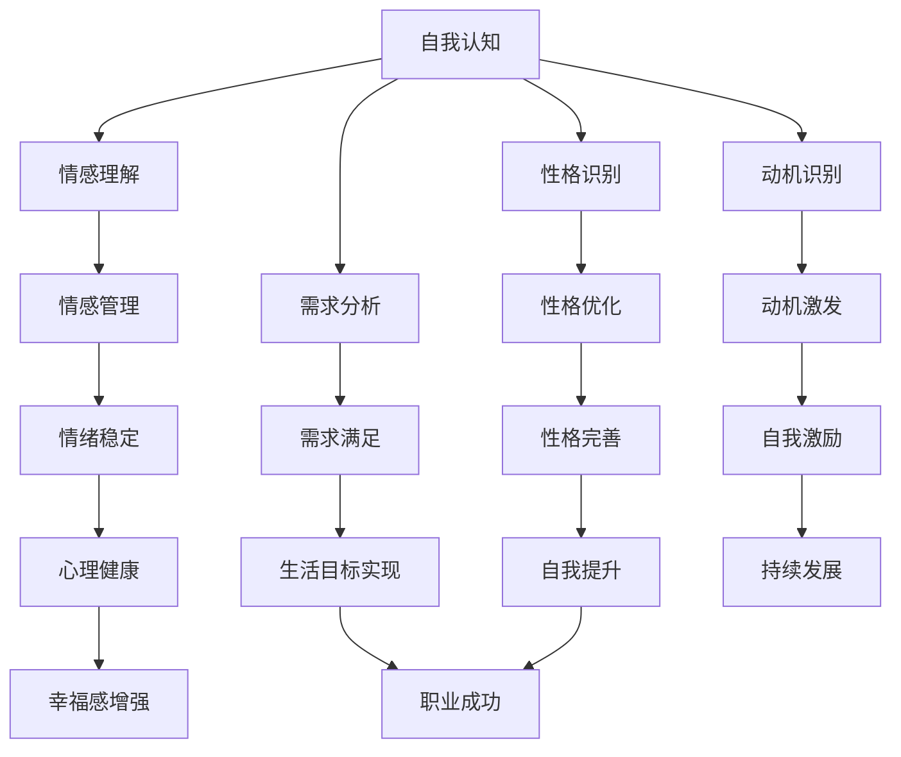
```mermaid
graph TB
A[自我认知] --> B[情感理解]
A --> C[性格识别]
A --> D[需求分析]
A --> E[动机识别]
B --> F[情感管理]
C --> G[性格优化]
D --> H[需求满足]
E --> I[动机激发]
F --> J[情绪稳定]
G --> K[性格完善]
H --> L[生活目标实现]
I --> M[自我激励]
J --> N[心理健康]
K --> O[自我提升]
L --> P[职业成功]
M --> Q[持续发展]
N --> R[幸福感增强]
O --> P
```

**核心算法原理讲解：**

虽然自我认知的过程不是基于传统意义上的算法，但它包含了一些可以类比的核心原理：

1. **数据分析原理**：自我认知的过程类似于数据分析，我们需要收集和整理关于自己的各种信息，例如性格测试结果、日记记录、他人反馈等，然后对这些信息进行分类和分析。

2. **机器学习原理**：我们可以将自我认知看作是一个持续学习和优化的过程。通过不断地反思和调整，我们能够逐步改善自己的认知和理解。

**数学模型和数学公式：**

自我认知并不涉及复杂的数学模型和公式，但它可以使用一些简单的统计学方法来量化自我认知的某些方面，例如通过问卷调查和统计分析来评估个人的性格特征和需求。

**项目实战：**

为了帮助读者进行自我认知，我们可以提供一个简单的自我反思练习：

1. **日记记录**：每天花一定时间记录自己的情感、行为和思考，并尝试从中找出规律和模式。
2. **性格测试**：使用一些可信的性格测试工具，如MBTI或大五人格测试，了解自己的性格特点。
3. **反馈收集**：向亲朋好友或同事收集对他们自己性格和你性格的看法，了解外部视角下的自己。

通过这些方法，读者可以更深入地了解自己，为后续的自我引导和成长打下坚实的基础。

### 1.2 内在成长的方法与实践

内在成长不仅仅是了解自己，更是通过持续的学习和实践来提升自我。这一过程需要坚定的决心和持续的努力，但它的回报是巨大的。以下是几种有效的方法和实践，帮助读者实现内在成长。

**核心概念与联系：**

我们可以通过另一个Mermaid流程图来展示内在成长的核心概念及其相互关系：

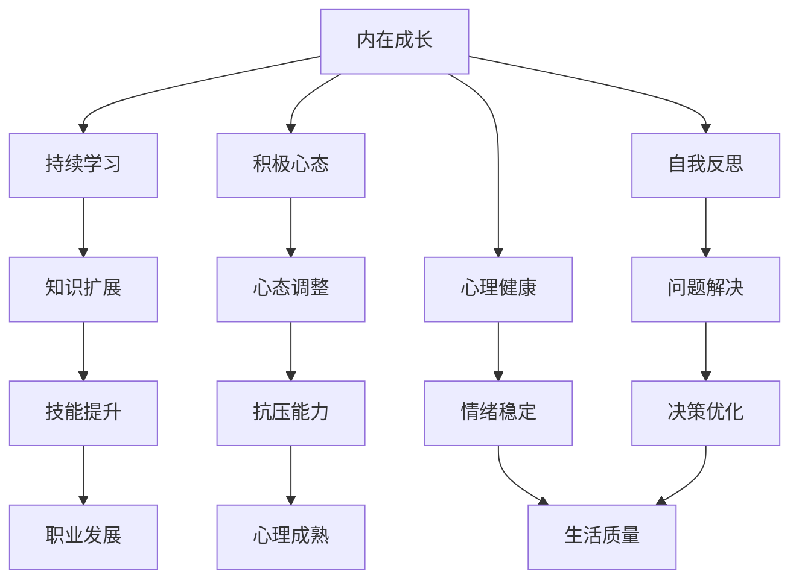
```mermaid
graph TB
A[内在成长] --> B[持续学习]
A --> C[积极心态]
A --> D[自我反思]
A --> E[心理健康]
B --> F[知识扩展]
C --> G[心态调整]
D --> H[问题解决]
E --> I[情绪稳定]
F --> J[技能提升]
G --> K[抗压能力]
H --> L[决策优化]
I --> M[生活质量]
J --> N[职业发展]
K --> O[心理成熟]
L --> M
```

**核心算法原理讲解：**

内在成长的过程虽然不直接涉及算法，但可以借鉴一些算法的基本原理：

1. **迭代优化**：内在成长是一个不断迭代和优化的过程，类似于算法中的迭代优化步骤。通过不断地自我反思和改进，我们可以逐步提升自我。
2. **反馈机制**：内在成长需要有效的反馈机制，类似于算法中的反馈循环。通过收集和分析反馈，我们可以更好地了解自己的成长方向和需要改进的领域。

**数学模型和数学公式：**

虽然内在成长不涉及复杂的数学模型和公式，但可以使用一些简单的统计方法来量化学习成果，例如通过学习曲线和成就评估来监测自己的成长。

**项目实战：**

为了帮助读者实践内在成长，我们可以提供以下一些具体的实践方法：

1. **每日学习习惯**：设定每天固定的学习时间，阅读专业书籍、观看教学视频或参加线上课程，不断扩展知识面。
2. **积极心态训练**：通过冥想、呼吸练习或正念训练来培养积极心态，提高抗压能力。
3. **定期反思**：每周或每月花时间进行自我反思，回顾自己的成长和进步，识别问题和挑战，并制定改进计划。

**实例说明**：

假设一位年轻的软件工程师希望通过内在成长提升自己的技能和职业发展。他可以采取以下步骤：

1. **每日学习**：每天晚上花两小时阅读关于最新编程技术和算法的书籍，并尝试在项目中应用所学知识。
2. **积极心态**：通过冥想和正念训练来减少工作压力，提高工作效率。
3. **定期反思**：每月底花一天时间回顾自己的工作表现，识别需要改进的地方，并制定下一月的改进计划。

通过这些实践，这位工程师不仅能够提升自己的专业技能，还能培养出更加积极的心态和解决问题的能力，从而实现内在成长和职业发展。

总之，自我认知和内在成长是成为人生主导者的基础。通过理解自我和持续成长，我们能够更好地掌握自己的生活，实现个人和职业上的成功。接下来，我们将进一步探讨目标设定、决策制定和时间管理等关键主题。

### 第2章：目标设定与规划

#### 2.1 目标设定的原则与技巧

目标设定是自我引导和成功的关键步骤之一。明确且具体的目标能够指导我们的行动，帮助我们集中精力和资源，实现预期的结果。在本节中，我们将探讨目标设定的原则和技巧，帮助读者有效地设定和达成个人和职业目标。

**核心概念与联系：**

为了理解目标设定的原则和技巧，我们可以通过一个Mermaid流程图来展示相关概念及其相互关系：

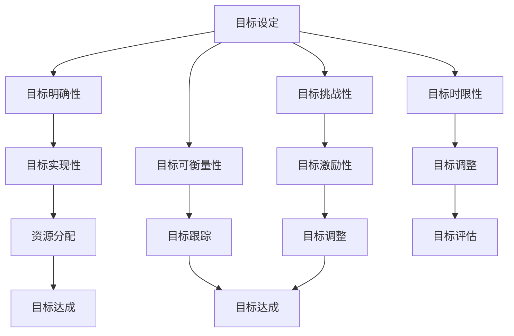
```mermaid
graph TB
A[目标设定] --> B[目标明确性]
A --> C[目标挑战性]
A --> D[目标可衡量性]
A --> E[目标时限性]
B --> F[目标实现性]
C --> G[目标激励性]
D --> H[目标跟踪]
E --> I[目标调整]
F --> J[资源分配]
G --> K[目标调整]
H --> L[目标达成]
I --> M[目标评估]
J --> N[目标达成]
K --> L
```

**核心算法原理讲解：**

虽然目标设定不直接涉及复杂的算法原理，但可以借鉴一些算法的核心原则：

1. **动态规划**：目标设定和达成过程类似于动态规划问题，我们需要根据当前情况和资源进行决策，并逐步实现目标。
2. **贪心算法**：在某些情况下，我们可以使用贪心算法来优先处理最重要的目标，从而提高整体效率和达成率。

**数学模型和数学公式：**

目标设定可以借助一些数学模型和公式来评估目标的实现可能性：

1. **期望值计算**：通过计算目标实现的期望值，可以帮助我们评估目标的可行性和激励性。
2. **关键路径分析**：在项目规划中，可以使用关键路径分析来确定目标达成的最佳时间安排。

**项目实战：**

为了帮助读者设定和达成目标，我们可以提供一个具体的目标设定和实现案例：

**案例：设定并实现职业晋升目标**

1. **目标明确性**：明确职业晋升的具体目标，例如在一年内晋升为团队主管。
2. **目标挑战性**：确保目标具有挑战性，激发自己的动力和潜力。
3. **目标可衡量性**：设定可衡量的里程碑，例如在六个月内完成特定项目，或在团队中提升个人绩效。
4. **目标时限性**：设定明确的时间限制，以增强目标的紧迫性和可实现性。

**实现步骤：**

1. **定期评估**：每月评估一次自己的工作表现，与晋升目标进行对比，识别需要改进的领域。
2. **资源分配**：合理分配时间和精力，确保在关键领域进行深入学习和实践。
3. **寻求反馈**：向同事、上司或导师寻求反馈，了解自己在团队中的表现和提升空间。
4. **持续学习**：通过参加培训课程、阅读专业书籍或参加在线研讨会，提升自己的专业技能和管理能力。
5. **时间管理**：使用时间管理工具，如日程表或时间跟踪应用程序，确保充分利用每一天的时间，实现既定目标。

**案例反思：**

通过这个案例，我们可以看到，设定和实现职业晋升目标需要明确性、挑战性、可衡量性和时限性。同时，通过定期评估、资源分配、寻求反馈和持续学习，我们能够有效地实现目标，实现职业上的成长和成功。

总之，目标设定是自我引导和成功的重要步骤。通过理解目标设定的原则和技巧，以及通过具体案例的实践，我们能够更加有效地设定和实现个人和职业目标，从而成为人生的主导者。接下来，我们将进一步探讨如何规划时间和资源，以实现这些目标。

### 2.2 规划时间与资源

在实现目标的过程中，时间管理和资源规划起着至关重要的作用。良好的时间管理和资源规划能够帮助我们在有限的时间内实现最大的效率和产出，从而更好地达成目标。在本节中，我们将探讨时间管理和资源规划的原则与技巧，帮助读者有效地管理自己的时间和资源，实现个人和职业目标。

**核心概念与联系：**

为了理解时间管理和资源规划的重要性，我们可以通过一个Mermaid流程图来展示相关概念及其相互关系：

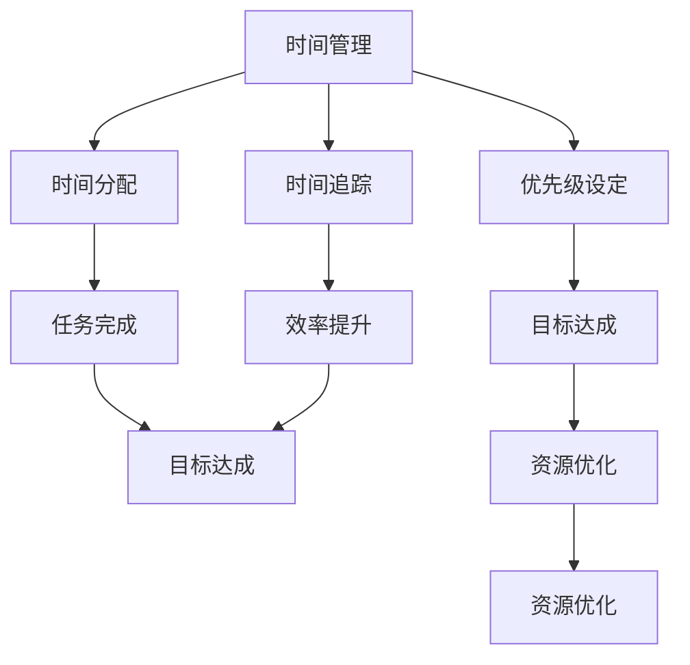
```mermaid
graph TB
A[时间管理] --> B[时间分配]
A --> C[优先级设定]
A --> D[时间追踪]
B --> E[任务完成]
C --> F[目标达成]
D --> G[效率提升]
E --> H[目标达成]
F --> I[资源优化]
G --> H
I --> J[资源优化]
```

**核心算法原理讲解：**

虽然时间管理和资源规划不涉及复杂的算法原理，但可以借鉴一些算法的基本原则：

1. **贪心算法**：在时间分配和任务优先级设定时，可以使用贪心算法来优先处理最重要的任务，从而最大化效率和产出。
2. **动态规划**：在长期规划和资源分配时，可以使用动态规划方法来考虑所有可能的任务和资源组合，找到最佳解决方案。

**数学模型和数学公式：**

时间管理和资源规划可以使用一些数学模型和公式来评估和优化：

1. **优化模型**：通过建立优化模型，如线性规划或动态规划模型，可以确定最佳的时间分配和任务优先级。
2. **关键路径分析**：在项目规划和资源分配中，可以使用关键路径分析来确定任务的最短完成时间和关键资源。

**项目实战：**

为了帮助读者实践时间管理和资源规划，我们可以提供一个具体的案例：

**案例：规划并管理日常工作和学习时间**

1. **时间分配**：首先，将每天的时间分配给工作、学习、休息和娱乐。例如，每天工作8小时，学习2小时，休息和娱乐4小时。
2. **优先级设定**：根据任务的紧急程度和重要性，设定任务的优先级。例如，优先完成紧急且重要的任务，如项目截止日期的工作。
3. **时间追踪**：使用时间追踪工具，如Toggl或RescueTime，记录每天的工作和学习时间，了解时间的实际使用情况。
4. **任务完成**：每天结束后，评估任务的完成情况，并根据实际情况调整时间分配和优先级。
5. **资源优化**：定期评估所需的资源，如书籍、工具和设备，确保它们能够支持任务的完成。如果资源不足，及时进行调整和补充。

**实现步骤：**

1. **制定时间表**：制定一个详细的每日或每周时间表，包括所有任务和活动的时间安排。
2. **定期回顾**：每周或每月回顾一次时间表，分析时间使用的效率和产出，找出需要改进的地方。
3. **灵活调整**：在时间管理和资源规划过程中，保持灵活性，根据实际情况和突发情况调整计划。
4. **沟通协调**：与同事、家人或朋友沟通，确保他们了解你的时间安排，减少不必要的干扰和冲突。
5. **持续优化**：不断学习和尝试新的时间管理和资源规划技巧，以持续提升效率和产出。

**案例反思：**

通过这个案例，我们可以看到，规划时间与资源需要明确时间分配、设定优先级、追踪时间使用、任务完成和资源优化。通过这些步骤，我们能够更有效地管理自己的时间和资源，从而实现个人和职业目标。

总之，时间管理和资源规划是实现目标的关键步骤。通过理解其核心概念和原则，并运用具体案例的实践，我们能够更好地规划和管理自己的时间和资源，实现个人和职业上的成功。接下来，我们将进一步探讨决策制定与执行力，帮助读者在实现目标的过程中做出明智的决策并付诸行动。

### 第3章：决策制定与执行力

#### 3.1 决策制定的原则与方法

决策制定是自我引导和成功的关键环节，它关系到我们如何有效地利用资源、应对挑战和抓住机遇。有效的决策制定不仅需要逻辑思维和理性分析，还需要对风险的评估和应对策略。在本节中，我们将探讨决策制定的原则和方法，帮助读者在生活和工作中做出明智且高效的决策。

**核心概念与联系：**

为了理解决策制定的核心概念，我们可以通过一个Mermaid流程图来展示相关概念及其相互关系：

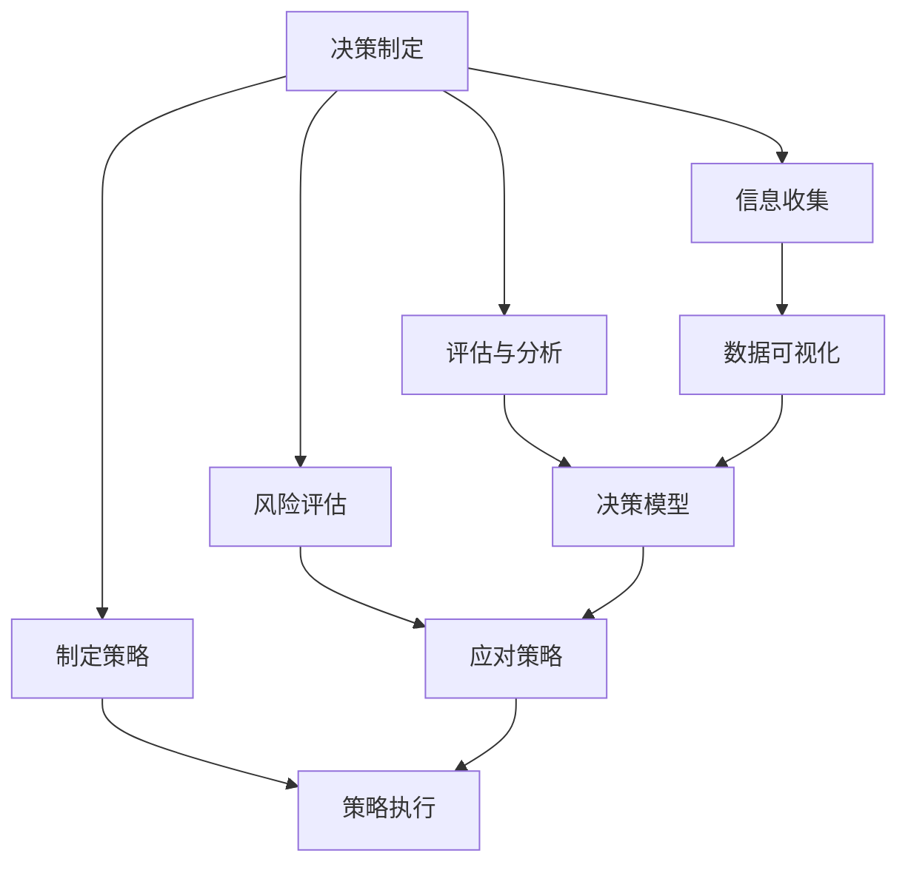
```mermaid
graph TB
A[决策制定] --> B[信息收集]
A --> C[评估与分析]
A --> D[风险评估]
A --> E[制定策略]
B --> F[数据可视化]
C --> G[决策模型]
D --> H[应对策略]
E --> I[策略执行]
F --> G
G --> H
H --> I
```

**核心算法原理讲解：**

决策制定虽然不涉及复杂的算法，但可以借鉴一些算法的核心原理：

1. **启发式算法**：在决策过程中，可以使用启发式算法来快速评估和选择最佳方案。例如，使用贪心算法来优先处理最紧急或最重要的任务。
2. **机器学习**：通过机器学习模型，如决策树或神经网络，可以分析和预测决策结果，从而提高决策的准确性和效率。

**数学模型和数学公式：**

决策制定可以使用一些数学模型和公式来评估和优化：

1. **期望值计算**：通过计算每个决策的期望值，可以帮助评估决策的潜在结果和风险。
2. **多目标优化**：在涉及多个目标的情况下，可以使用多目标优化模型来找到平衡各目标的最佳决策。

**项目实战：**

为了帮助读者理解决策制定的过程，我们可以提供一个具体的案例：

**案例：决定是否辞职以追求职业发展**

1. **信息收集**：首先，收集有关当前工作和潜在机会的信息，包括薪资、工作环境、职业发展前景等。
2. **评估与分析**：分析这些信息，评估当前工作的满意度和潜在机会的优势。
3. **风险评估**：评估辞职带来的风险，如收入不稳定、职业发展不确定等。
4. **制定策略**：根据评估结果，制定具体的策略，如谈判薪资、提前准备职业计划等。
5. **策略执行**：按照制定的策略采取行动，例如递交辞职信、面试新工作等。

**实现步骤：**

1. **确定决策目标**：明确需要做出的决策，并定义决策的目标和约束条件。
2. **信息收集**：广泛收集与决策相关的信息，确保信息的全面性和准确性。
3. **数据分析**：使用数据分析和可视化工具，如图表和矩阵，帮助理解和评估决策选项。
4. **制定备选方案**：根据分析结果，制定多个备选方案，并评估每个方案的潜在风险和收益。
5. **决策模型**：建立决策模型，如决策树或收益矩阵，帮助分析和选择最佳方案。
6. **风险评估**：对每个方案进行风险评估，考虑潜在的风险和不确定性。
7. **制定策略**：根据风险评估结果，制定具体的策略和行动计划。
8. **策略执行**：按照制定的策略采取行动，确保决策的有效执行。

**案例反思：**

通过这个案例，我们可以看到，决策制定是一个复杂但必要的过程。通过明确决策目标、信息收集、评估与分析、风险评估、制定策略和策略执行，我们能够更系统地做出明智的决策，从而更好地实现个人和职业目标。

总之，决策制定是自我引导和成功的关键步骤。通过理解决策制定的原则和方法，以及通过具体案例的实践，我们能够更好地应对生活和职业中的各种挑战，做出明智且高效的决策。接下来，我们将进一步探讨如何提升执行力，确保决策得到有效执行。

### 3.2 提升执行力的技巧

执行力是决策成功的关键，它关系到我们是否能够将计划付诸实践，并最终实现目标。提升执行力需要策略和方法，同时也需要持续的实践和反思。在本节中，我们将探讨一些提升执行力的技巧，帮助读者在生活和工作中更好地实现自己的决策。

**核心概念与联系：**

为了理解提升执行力的核心概念，我们可以通过一个Mermaid流程图来展示相关概念及其相互关系：

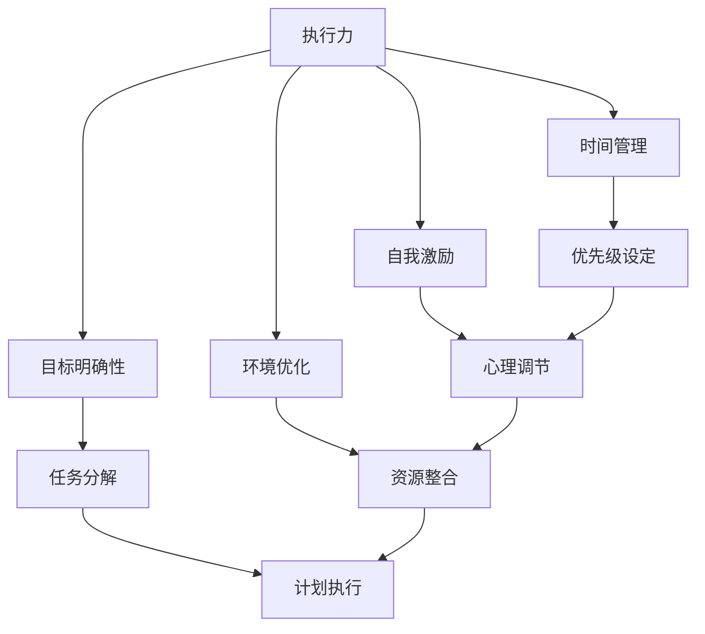
```mermaid
graph TB
A[执行力] --> B[目标明确性]
A --> C[时间管理]
A --> D[自我激励]
A --> E[环境优化]
B --> F[任务分解]
C --> G[优先级设定]
D --> H[心理调节]
E --> I[资源整合]
F --> J[计划执行]
G --> H
H --> I
I --> J
```

**核心算法原理讲解：**

提升执行力可以借鉴一些算法的核心原则：

1. **分而治之**：将复杂任务分解为小步骤，使得每个步骤都更容易管理和执行。
2. **动态调整**：在执行过程中根据实际情况进行动态调整，确保任务能够按时完成。

**数学模型和数学公式：**

虽然提升执行力不涉及复杂的数学模型和公式，但可以使用一些简单的统计方法来评估执行效果：

1. **时间效率分析**：通过记录实际完成任务所需的时间，分析执行效率，找出需要改进的环节。
2. **绩效评估模型**：使用绩效评估模型，如目标与关键成果法（OKR），来评估执行效果和目标达成情况。

**项目实战：**

为了帮助读者提升执行力，我们可以提供一个具体的实践案例：

**案例：有效完成一个复杂项目的任务**

1. **目标明确性**：首先，明确项目的目标和任务，确保每个团队成员都清楚自己的职责和任务。
2. **任务分解**：将复杂项目分解为一系列小任务，每个任务都有明确的目标和时间表。
3. **时间管理**：使用项目管理工具，如Trello或Asana，来规划和跟踪任务的进度，确保任务按时完成。
4. **优先级设定**：根据任务的重要性和紧急程度，设定任务的优先级，优先处理最重要的任务。
5. **自我激励**：通过设定奖励机制，如完成任务后的小奖励，来提高个人的积极性。
6. **心理调节**：在执行过程中，定期进行心理调节，如冥想或短暂的休息，以保持专注和精力。
7. **资源整合**：确保团队成员能够获得所需的资源和支持，以更好地完成任务。
8. **计划执行**：按照制定的计划和策略，逐步执行每个任务，确保项目能够按时完成。

**实现步骤：**

1. **制定详细计划**：制定一个详细的执行计划，包括每个任务的时间表、责任人、所需资源等。
2. **任务分解**：将大任务分解为小任务，每个小任务都有明确的目标和时间限制。
3. **任务分配**：根据团队成员的专长和任务需求，合理分配任务。
4. **定期检查**：定期检查任务的进展情况，确保任务按计划进行。
5. **反馈与调整**：在执行过程中，及时收集反馈，根据实际情况进行调整。
6. **持续激励**：通过奖励机制和正面的反馈，保持团队成员的积极性和动力。
7. **心理支持**：提供心理支持和资源，帮助团队成员应对压力和挑战。

**案例反思：**

通过这个案例，我们可以看到，提升执行力需要明确目标、任务分解、时间管理、优先级设定、自我激励、心理调节、资源整合和计划执行。通过这些步骤，我们能够更好地将决策付诸实践，确保项目能够按时、高质量地完成。

总之，执行力是决策成功的关键。通过理解提升执行力的核心概念和技巧，以及通过具体案例的实践，我们能够更好地实现自己的决策，提升个人和团队的整体效能。接下来，我们将进一步探讨时间管理技巧，帮助读者更有效地规划和利用时间。

### 4.1 时间管理的原则与方法

时间管理是自我引导和高效生活的重要技能。良好的时间管理能够帮助我们更好地平衡工作、学习和个人生活，提高生产力和生活质量。在本节中，我们将探讨时间管理的核心原则和方法，帮助读者理解和应用时间管理技巧，实现个人和职业目标。

**核心概念与联系：**

为了理解时间管理的核心概念，我们可以通过一个Mermaid流程图来展示相关概念及其相互关系：

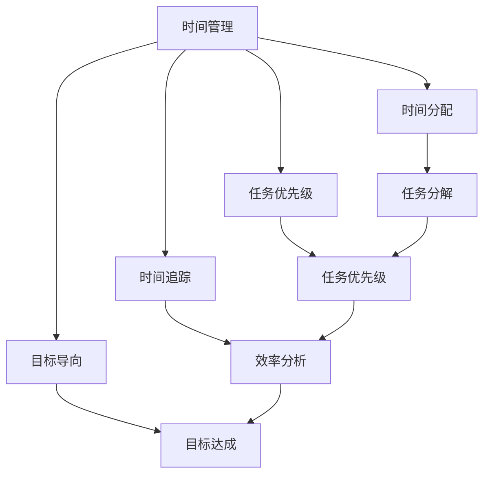
```mermaid
graph TB
A[时间管理] --> B[时间分配]
A --> C[任务优先级]
A --> D[时间追踪]
A --> E[目标导向]
B --> F[任务分解]
C --> G[任务优先级]
D --> H[效率分析]
E --> I[目标达成]
F --> G
G --> H
H --> I
```

**核心算法原理讲解：**

虽然时间管理不直接涉及复杂的算法，但可以借鉴一些算法的基本原理：

1. **贪心算法**：在任务优先级设定时，可以使用贪心算法来优先处理最紧急或最重要的任务，从而提高整体效率。
2. **动态规划**：在长期时间管理中，可以使用动态规划方法来考虑所有可能的任务和时间安排，找到最佳的时间分配方案。

**数学模型和数学公式：**

时间管理可以使用一些简单的数学模型和公式来评估和优化：

1. **关键路径分析**：在项目管理中，可以使用关键路径分析来确定任务的最短完成时间和关键路径，确保项目按时完成。
2. **优化模型**：通过建立优化模型，可以确定最佳的时间分配和任务优先级，从而最大化效率。

**项目实战：**

为了帮助读者理解时间管理的原则和方法，我们可以提供一个具体的案例：

**案例：优化日常工作和学习的时间安排**

1. **时间分配**：首先，将每天的时间分配给工作、学习、休息和娱乐。例如，每天工作8小时，学习2小时，休息和娱乐4小时。
2. **任务优先级**：根据任务的重要性和紧急程度，设定任务的优先级。例如，优先完成重要且紧急的任务，如项目截止日期的工作。
3. **时间追踪**：使用时间追踪工具，如Toggl或RescueTime，记录每天的工作和学习时间，了解时间的实际使用情况。
4. **任务分解**：将复杂任务分解为小任务，每个小任务都有明确的目标和时间限制。
5. **目标导向**：设定明确的时间管理目标，例如每天完成一定的学习任务或工作目标，确保任务能够按时完成。

**实现步骤：**

1. **制定时间表**：制定一个详细的每日或每周时间表，包括所有任务和活动的时间安排。
2. **任务分解**：将大任务分解为小任务，确保每个任务都有明确的目标和时间限制。
3. **设定优先级**：根据任务的重要性和紧急程度，设定任务的优先级，确保优先处理重要的任务。
4. **时间追踪**：使用时间追踪工具记录每天的工作和学习时间，了解时间的实际使用情况，并根据实际情况进行调整。
5. **定期评估**：每周或每月评估一次时间管理的效果，分析时间使用的效率和产出，找出需要改进的领域。
6. **反馈与调整**：根据评估结果，及时调整时间表和任务安排，确保时间管理策略的有效性。
7. **持续优化**：不断学习和尝试新的时间管理技巧，如时间块管理、番茄工作法等，以持续提升时间管理效果。

**案例反思：**

通过这个案例，我们可以看到，时间管理需要明确时间分配、任务优先级、时间追踪、任务分解和目标导向。通过这些步骤，我们能够更有效地规划和利用时间，提高生产力和生活质量。

总之，时间管理是自我引导和高效生活的重要技能。通过理解时间管理的原则和方法，以及通过具体案例的实践，我们能够更好地规划和利用时间，实现个人和职业目标。接下来，我们将进一步探讨如何高效利用工具与技巧，进一步提升时间管理的效率。

### 4.2 高效利用工具与技巧

在现代工作环境中，高效利用工具和技巧是提高生产力和时间管理的关键。借助各种工具和技巧，我们能够更好地组织和规划任务，优化工作流程，从而实现高效的产出。在本节中，我们将探讨一些实用的工具和技巧，帮助读者更好地管理时间和资源，提升工作效率。

**核心概念与联系：**

为了理解高效利用工具与技巧的核心概念，我们可以通过一个Mermaid流程图来展示相关概念及其相互关系：

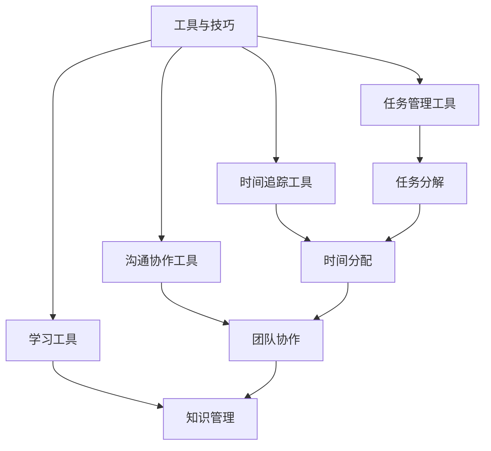
```mermaid
graph TB
A[工具与技巧] --> B[任务管理工具]
A --> C[时间追踪工具]
A --> D[沟通协作工具]
A --> E[学习工具]
B --> F[任务分解]
C --> G[时间分配]
D --> H[团队协作]
E --> I[知识管理]
F --> G
G --> H
H --> I
```

**核心算法原理讲解：**

虽然高效利用工具和技巧不直接涉及复杂的算法原理，但可以借鉴一些算法的基本原则：

1. **分而治之**：在任务管理和时间分配时，可以使用分而治之的原则，将复杂任务分解为小任务，从而提高可管理性和执行效率。
2. **动态规划**：在规划和调整任务和时间时，可以使用动态规划的方法，根据实时情况进行调整和优化。

**数学模型和数学公式：**

高效利用工具和技巧可以使用一些简单的数学模型和公式来评估和优化：

1. **优化模型**：通过建立优化模型，如线性规划，可以确定最佳的任务和时间分配方案。
2. **关键路径分析**：在项目管理和时间安排中，可以使用关键路径分析来确定任务的最短完成时间和关键路径。

**项目实战：**

为了帮助读者高效利用工具和技巧，我们可以提供一个具体的案例：

**案例：利用工具和技巧优化工作流程**

1. **任务管理工具**：使用Trello或Asana等任务管理工具，将工作任务分解为小任务，并设定优先级和截止日期，确保任务有序进行。
2. **时间追踪工具**：使用Toggl或RescueTime等时间追踪工具，记录每天的工作时间，了解时间使用情况，并根据数据调整时间分配。
3. **沟通协作工具**：使用Slack或Microsoft Teams等沟通协作工具，与团队成员保持实时沟通，确保信息畅通和协作高效。
4. **学习工具**：使用Coursera或LinkedIn Learning等在线学习平台，持续提升自己的专业技能和知识。
5. **知识管理**：使用Evernote或Notion等知识管理工具，整理和存储工作笔记和资料，方便随时查阅和共享。

**实现步骤：**

1. **选择合适的工具**：根据工作需求和特点，选择适合的任务管理、时间追踪、沟通协作和学习工具。
2. **制定工作流程**：制定详细的工作流程和标准操作步骤，确保任务能够有序进行。
3. **培训与学习**：对团队成员进行工具和技巧的培训，确保他们能够熟练使用这些工具，提高工作效率。
4. **数据收集与分析**：定期收集和使用工具产生的数据，如时间追踪记录和任务完成情况，分析数据，找出需要改进的领域。
5. **反馈与改进**：根据数据分析结果，及时调整工作流程和工具使用策略，持续优化工作效率。

**案例反思：**

通过这个案例，我们可以看到，高效利用工具和技巧需要选择合适的工具、制定工作流程、培训与学习、数据收集与分析以及反馈与改进。通过这些步骤，我们能够更好地组织和规划任务，优化工作流程，提升工作效率。

总之，高效利用工具和技巧是提升工作效率的关键。通过理解其核心概念、选择合适的工具、制定工作流程以及持续优化，我们能够更好地管理时间和资源，实现高效的工作和生活。接下来，我们将进一步探讨情绪管理与自我调节，帮助读者保持积极的心态和情绪，更好地应对生活中的挑战。

### 5.1 情绪管理的重要性

情绪管理是自我引导和成功的关键要素之一。良好的情绪管理不仅有助于我们应对日常生活中的挑战，还能提高我们的工作效率和生活质量。情绪管理涉及到识别、理解和管理自己的情绪，使其对我们产生积极的影响。在本节中，我们将探讨情绪管理的重要性，并介绍一些基本的情绪管理技巧。

**核心概念与联系：**

为了理解情绪管理的重要性，我们可以通过一个Mermaid流程图来展示相关概念及其相互关系：

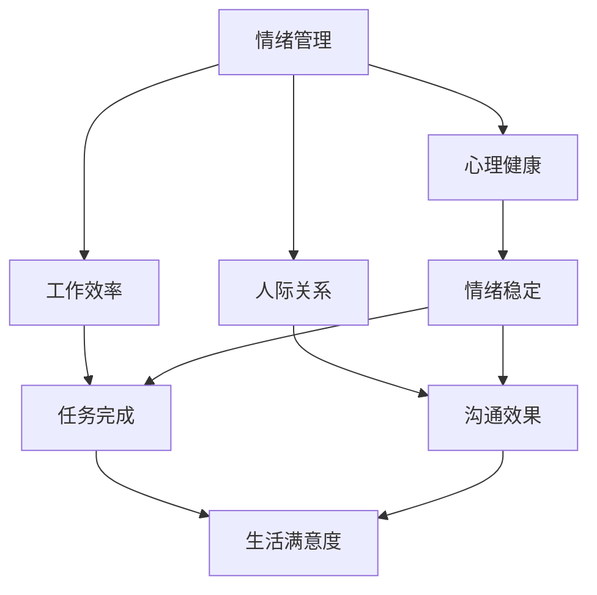
```mermaid
graph TB
A[情绪管理] --> B[心理健康]
A --> C[工作效率]
A --> D[人际关系]
B --> E[情绪稳定]
C --> F[任务完成]
D --> G[沟通效果]
E --> F
E --> G
F --> H[生活满意度]
G --> H
```

**核心算法原理讲解：**

情绪管理不涉及直接的算法原理，但可以借鉴以下算法原则：

1. **状态机**：情绪管理可以看作是一个状态转换过程，通过识别不同情绪状态，并采取相应策略来调节情绪。
2. **反馈机制**：情绪管理需要有效的反馈机制，如自我反思和他人反馈，来不断调整和优化情绪调节策略。

**数学模型和数学公式：**

情绪管理可以使用一些简单的数学模型和公式来评估情绪状态和调节效果：

1. **情绪评估模型**：通过建立情绪评估模型，如情绪得分和情绪稳定度指数，来量化情绪状态。
2. **心理压力指数**：通过计算心理压力指数，来评估情绪压力水平，并制定相应的调节策略。

**项目实战：**

为了帮助读者理解情绪管理的重要性，我们可以提供一个具体的实践案例：

**案例：应对工作中的压力和情绪波动**

1. **情绪识别**：通过自我反思和记录，识别在工作和生活中常见的情绪波动和压力源。
2. **情绪调节**：使用放松技巧，如深呼吸和冥想，来缓解紧张和焦虑情绪。
3. **积极心态**：通过积极的心态和自我暗示，提升情绪稳定性，减少负面情绪的影响。
4. **情绪表达**：学习有效的情绪表达技巧，如倾听和沟通，以合理的方式表达情绪，避免情绪压抑或爆发。
5. **寻求支持**：在情绪波动较大时，向家人、朋友或专业人士寻求支持和建议。

**实现步骤：**

1. **自我反思**：定期进行自我反思，了解自己的情绪状态和触发因素。
2. **情绪记录**：使用日记或情绪记录应用程序，记录情绪波动和压力源。
3. **情绪调节**：学习并实践放松技巧，如深呼吸、冥想和正念练习，以缓解情绪压力。
4. **积极心态**：通过阅读积极心理学书籍、听积极音乐或参与正能量活动，培养积极心态。
5. **情绪表达**：学习有效的沟通技巧，如倾听和表达感受，以合理表达情绪。
6. **求助与支持**：在情绪波动较大时，及时寻求家人、朋友或专业人士的支持和建议。
7. **定期评估**：定期评估情绪管理的效果，根据实际情况调整和优化情绪管理策略。

**案例反思：**

通过这个案例，我们可以看到，情绪管理是一个需要持续实践和调整的过程。通过情绪识别、情绪调节、积极心态、情绪表达和寻求支持，我们能够更好地应对工作和生活中的情绪挑战，提高心理健康和工作效率。

总之，情绪管理对于个人成长和成功至关重要。通过理解情绪管理的核心概念和实践技巧，以及通过具体案例的实践，我们能够更好地管理情绪，提升心理健康和工作效率。接下来，我们将进一步探讨如何进行自我调节，以更好地应对情绪波动和压力。

### 5.2 自我调节的方法与实践

自我调节是一种重要的情绪管理技巧，它涉及到我们如何通过自我控制和调节来应对情绪波动和压力。良好的自我调节能力不仅能够帮助我们保持情绪稳定，还能提高我们的适应能力和生活质量。在本节中，我们将介绍一些自我调节的方法和实践，帮助读者掌握自我调节技巧，更好地应对生活中的各种挑战。

**核心概念与联系：**

为了理解自我调节的方法，我们可以通过一个Mermaid流程图来展示相关概念及其相互关系：

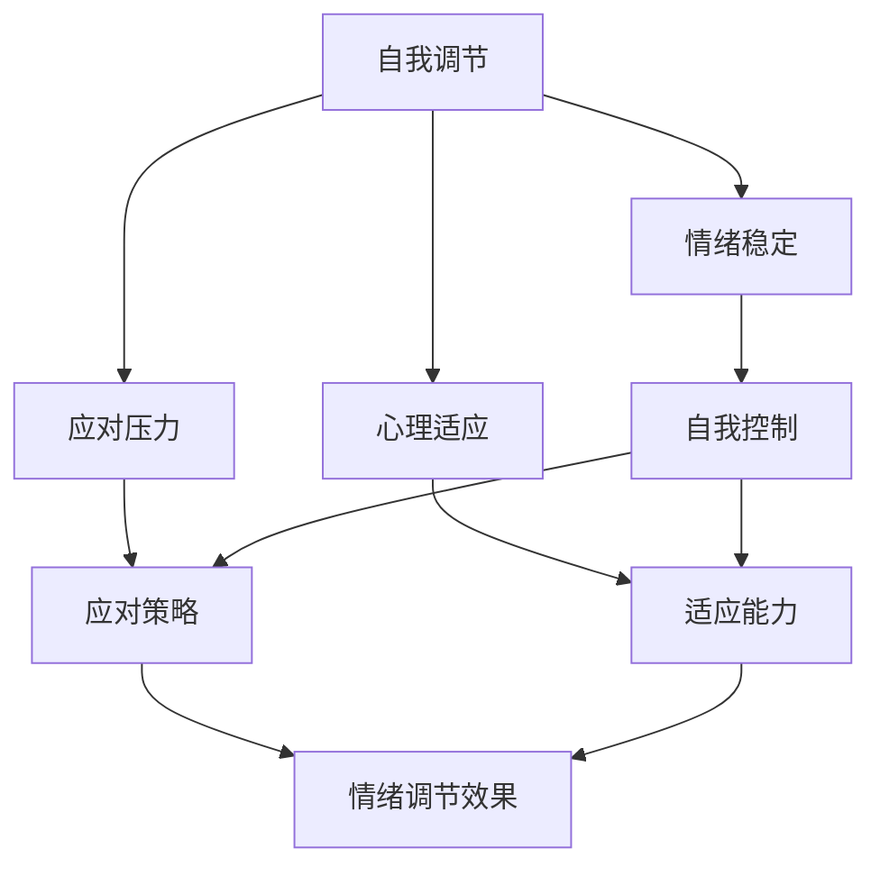
```mermaid
graph TB
A[自我调节] --> B[情绪稳定]
A --> C[应对压力]
A --> D[心理适应]
B --> E[自我控制]
C --> F[应对策略]
D --> G[适应能力]
E --> F
E --> G
F --> H[情绪调节效果]
G --> H
```

**核心算法原理讲解：**

虽然自我调节不直接涉及复杂的算法原理，但可以借鉴以下算法原则：

1. **反馈机制**：自我调节过程中，需要建立有效的反馈机制，如自我监控和反思，以不断调整和优化调节策略。
2. **动态调整**：在自我调节过程中，根据实时情绪状态和外部环境的变化，进行动态调整，以实现最佳的情绪调节效果。

**数学模型和数学公式：**

自我调节可以使用一些简单的数学模型和公式来评估调节效果：

1. **情绪波动指数**：通过建立情绪波动指数模型，如情绪波动幅度和频率，来量化情绪调节效果。
2. **心理适应度模型**：通过计算心理适应度指数，如适应度变化率和适应度阈值，来评估个体在面对压力时的适应能力。

**项目实战：**

为了帮助读者掌握自我调节技巧，我们可以提供一个具体的实践案例：

**案例：通过冥想和正念练习进行自我调节**

1. **冥想**：每天花15-20分钟进行冥想，专注于呼吸和当下的感受，以减轻压力和焦虑。
2. **正念练习**：通过正念练习，如正念行走和正念进食，培养对当前情绪和感受的觉察和接受能力。
3. **情绪记录**：使用情绪记录应用程序，记录每天的情绪波动和压力源，并分析其模式和触发因素。
4. **反思与调整**：定期反思自我调节实践的效果，根据实际情况调整练习方法和策略。

**实现步骤：**

1. **选择练习方法**：根据个人喜好和需求，选择合适的自我调节方法，如冥想、正念练习或放松技巧。
2. **设定练习时间**：每天设定固定的练习时间，确保能够持续进行自我调节实践。
3. **情绪记录**：使用情绪记录应用程序，记录每天的情绪状态和触发因素，分析情绪波动的模式和原因。
4. **反思与调整**：定期反思自我调节实践的效果，根据实际情况调整练习方法和策略。
5. **寻求支持**：在遇到困难和挑战时，向专业人士或信任的朋友寻求支持和建议。

**案例反思：**

通过这个案例，我们可以看到，自我调节需要选择合适的练习方法、设定练习时间、情绪记录和反思与调整。通过这些步骤，我们能够更好地掌握自我调节技巧，提高情绪稳定性和心理适应能力。

总之，自我调节是情绪管理和心理健康的关键。通过理解自我调节的核心概念和实践技巧，以及通过具体案例的实践，我们能够更好地应对情绪波动和压力，提升生活质量。接下来，我们将进一步探讨如何建立积极的人际关系，帮助我们在社交环境中更好地与他人相处。

### 第6章：建立积极的人际关系

#### 6.1 人际关系的重要性

人际关系是影响我们生活质量和幸福感的重要因素之一。良好的人际关系不仅能够为我们提供情感支持和实际帮助，还能提升我们的职业发展和个人成长。在本节中，我们将探讨人际关系的重要性，并介绍如何建立和维护积极的人际关系。

**核心概念与联系：**

为了理解人际关系的重要性，我们可以通过一个Mermaid流程图来展示相关概念及其相互关系：

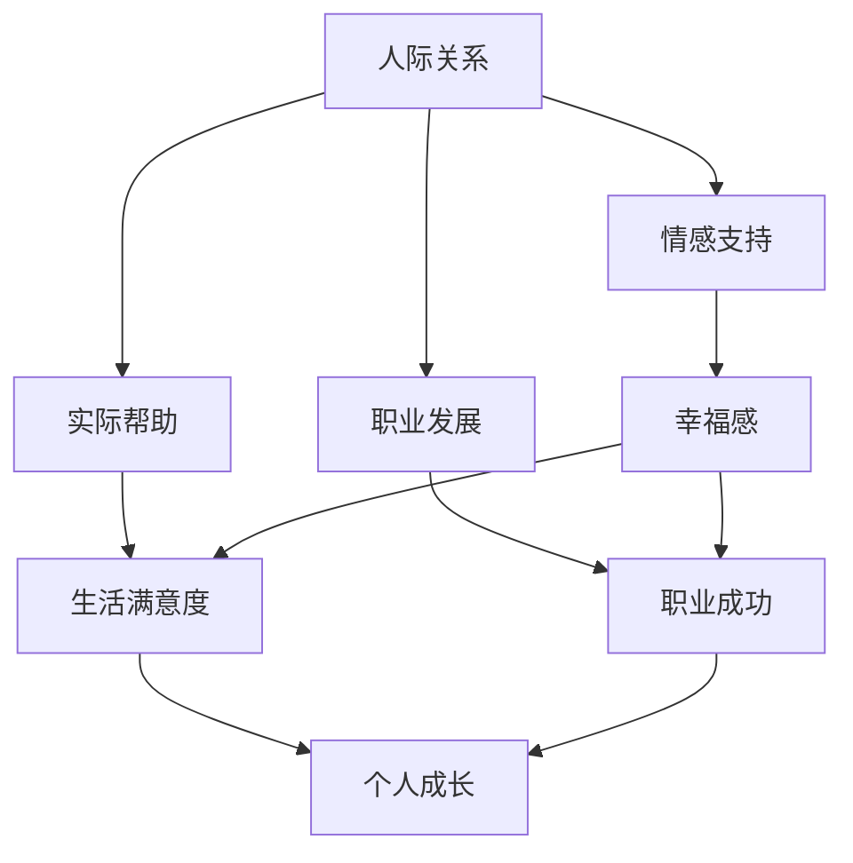
```mermaid
graph TB
A[人际关系] --> B[情感支持]
A --> C[实际帮助]
A --> D[职业发展]
B --> E[幸福感]
C --> F[生活满意度]
D --> G[职业成功]
E --> F
E --> G
F --> H[个人成长]
G --> H
```

**核心算法原理讲解：**

人际关系管理不涉及直接的算法原理，但可以借鉴以下算法原则：

1. **网络分析**：在人际关系管理中，可以使用网络分析的方法，如社交网络图，来识别和评估人际关系的重要性和影响力。
2. **机器学习**：通过机器学习模型，如社交行为预测模型，可以分析和预测人际关系的发展和变化。

**数学模型和数学公式：**

人际关系管理可以使用一些简单的数学模型和公式来评估和优化：

1. **社交网络分析模型**：通过建立社交网络分析模型，如度数中心性或接近中心性，来评估人际关系的重要性和紧密程度。
2. **情感分析模型**：通过情感分析模型，如情感倾向分类，来评估人际交往中的情感状态和满意度。

**项目实战：**

为了帮助读者理解人际关系的重要性，我们可以提供一个具体的实践案例：

**案例：通过积极互动建立积极的人际关系**

1. **主动交流**：积极参与社交活动，主动与同事、朋友和家人交流，建立良好的沟通渠道。
2. **倾听与理解**：倾听他人的意见和需求，展示对他们的关心和理解，建立信任和共鸣。
3. **情感支持**：在朋友或同事遇到困难时，提供情感支持和实际帮助，增强彼此的情感联系。
4. **共同活动**：参与共同的兴趣和活动，如运动、旅行或志愿服务，增强人际关系的紧密性。
5. **定期联系**：通过电话、邮件或社交媒体，定期与亲朋好友保持联系，维护和加深人际关系。

**实现步骤：**

1. **参与社交活动**：积极参与公司或社区组织的社交活动，结识新朋友并扩展社交圈。
2. **建立信任**：通过诚实、可靠和一致的行为，建立他人对我们的信任。
3. **倾听与反馈**：倾听他人的意见和需求，并提供积极的反馈和支持，增强彼此的理解和信任。
4. **提供帮助**：在朋友或同事需要帮助时，主动提供帮助，展示我们的关心和支持。
5. **共同兴趣**：寻找共同的兴趣和爱好，参与相关的活动和团队，增强人际关系的紧密性。
6. **定期联系**：通过定期电话、邮件或社交媒体联系，保持与亲朋好友的联系，维护和加深人际关系。

**案例反思：**

通过这个案例，我们可以看到，建立积极的人际关系需要主动交流、倾听与理解、情感支持、共同活动和定期联系。通过这些步骤，我们能够建立和维护积极的人际关系，提升生活质量和幸福感。

总之，人际关系是影响我们生活质量和幸福感的重要因素。通过理解人际关系的重要性，以及通过具体案例的实践，我们能够更好地建立和维护积极的人际关系，从而在社交环境中取得更好的发展和成就。接下来，我们将进一步探讨人际关系中的沟通技巧和冲突解决策略。

### 6.2 人际交往的技巧

在建立和维护积极的人际关系中，沟通技巧和冲突解决策略是至关重要的。有效的沟通能够增强人际关系，促进理解和信任，而良好的冲突解决策略则能够化解矛盾，维护和谐。在本节中，我们将探讨人际交往中的关键技巧，帮助读者在社交环境中更好地与他人相处。

**核心概念与联系：**

为了理解人际交往的技巧，我们可以通过一个Mermaid流程图来展示相关概念及其相互关系：

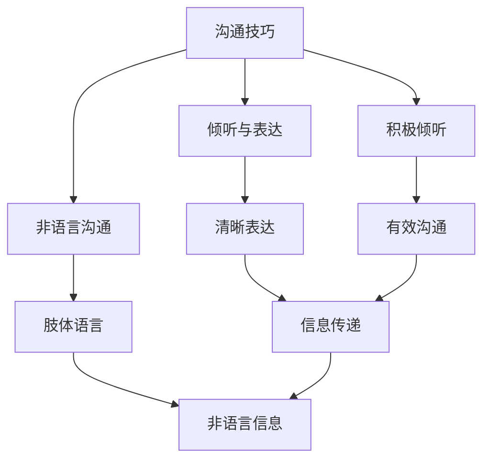
```mermaid
graph TB
A[沟通技巧] --> B[倾听与表达]
A --> C[非语言沟通]
A --> D[积极倾听]
B --> E[清晰表达]
C --> F[肢体语言]
D --> G[有效沟通]
E --> H[信息传递]
F --> I[非语言信息]
G --> H
H --> I
```

**核心算法原理讲解：**

人际交往的技巧虽然不涉及复杂的算法原理，但可以借鉴以下算法原则：

1. **模式识别**：在沟通中，可以通过模式识别算法来分析语言和行为的模式，从而更好地理解和回应对方。
2. **情感分析**：通过情感分析算法，可以识别和评估沟通中的情感状态，从而调整沟通策略，提高沟通效果。

**数学模型和数学公式：**

人际交往的技巧可以使用一些简单的数学模型和公式来评估和优化：

1. **社交网络分析模型**：通过社交网络分析模型，如网络密度和连接性，来评估人际关系的强度和紧密程度。
2. **情感分析模型**：通过情感分析模型，如情绪倾向分析，来评估沟通中的情感状态和满意度。

**项目实战：**

为了帮助读者掌握人际交往的技巧，我们可以提供一个具体的实践案例：

**案例：通过有效的沟通技巧解决冲突**

1. **倾听与表达**：在冲突发生时，先倾听对方的观点和感受，然后清晰表达自己的看法，避免误解和情绪升级。
2. **非语言沟通**：注意自己的肢体语言和面部表情，确保它们与语言表达一致，传递积极的信号。
3. **积极倾听**：通过积极倾听，确认对方的需求和期望，寻找共同点和解决方案。
4. **冲突解决策略**：使用冲突解决策略，如寻求第三方的帮助或妥协，来化解矛盾，达成共识。

**实现步骤：**

1. **倾听与表达**：在沟通时，注意倾听对方的意见，并清晰表达自己的观点，确保信息传递的准确性。
2. **非语言沟通**：注意自己的肢体语言和面部表情，确保它们与语言表达一致，传递积极的信号。
3. **积极倾听**：通过积极的反馈和确认，展示对对方的理解和尊重，建立信任和共鸣。
4. **冲突解决策略**：在冲突发生时，采取适当的冲突解决策略，如寻求第三方的帮助或妥协，以化解矛盾。
5. **反思与调整**：在每次沟通后，反思沟通的效果，根据实际情况调整沟通策略和技巧。
6. **持续学习**：通过阅读相关书籍、参加培训课程或与专业人士交流，不断学习和提升人际交往技巧。

**案例反思：**

通过这个案例，我们可以看到，人际交往的技巧需要倾听与表达、非语言沟通、积极倾听和冲突解决策略。通过这些技巧，我们能够更好地与他人沟通，解决冲突，维护和谐的人际关系。

总之，人际交往技巧对于建立和维护积极的人际关系至关重要。通过理解人际交往的核心概念和实践技巧，以及通过具体案例的实践，我们能够提升沟通效果，化解冲突，建立更加和谐和紧密的人际关系。接下来，我们将进一步探讨持续学习与成长，帮助读者在个人和职业生活中不断提升自己。

### 7.1 学习的重要性

在快速变化的世界中，持续学习是保持竞争力、实现个人和职业成长的关键。学习不仅能够帮助我们获取新知识和技能，还能提升我们的思维能力和创新能力，使我们能够更好地应对未来的挑战。在本节中，我们将探讨学习的重要性，并介绍如何进行有效学习。

**核心概念与联系：**

为了理解学习的重要性，我们可以通过一个Mermaid流程图来展示相关概念及其相互关系：

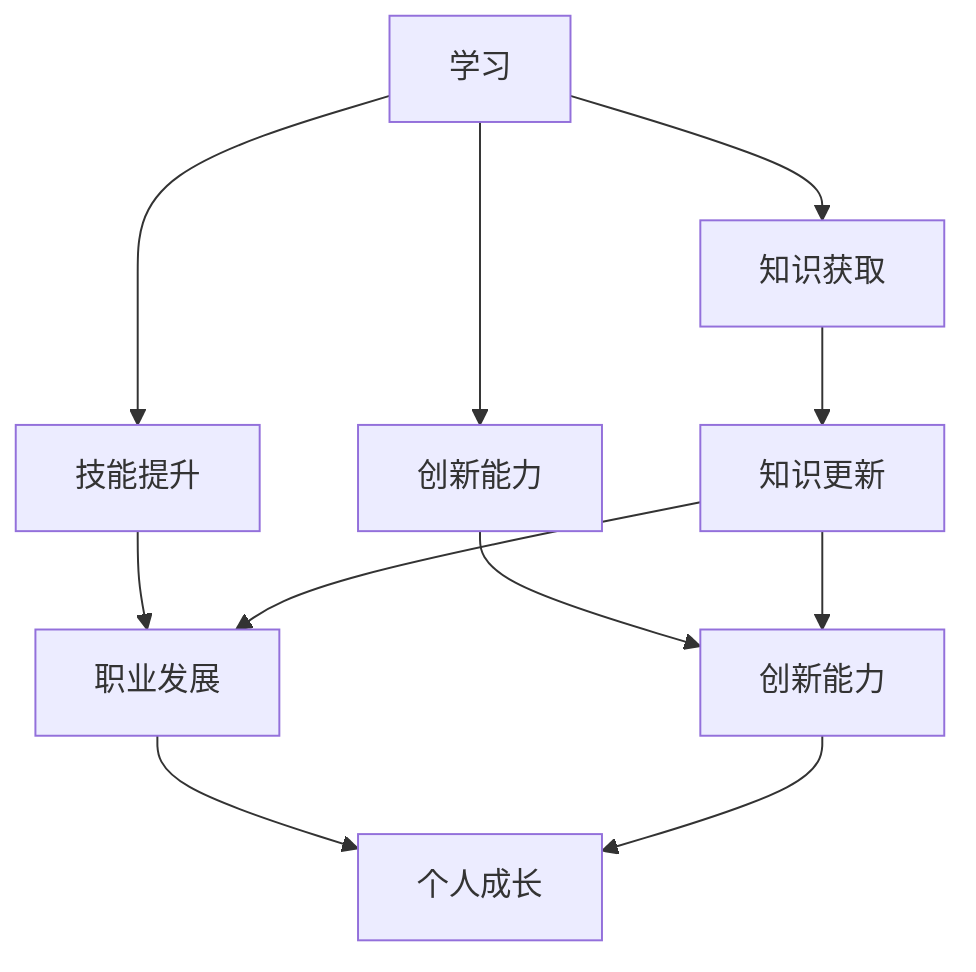
```mermaid
graph TB
A[学习] --> B[知识获取]
A --> C[技能提升]
A --> D[创新能力]
B --> E[知识更新]
C --> F[职业发展]
D --> G[创新能力]
E --> F
E --> G
F --> H[个人成长]
G --> H
```

**核心算法原理讲解：**

虽然学习不涉及直接的算法原理，但可以借鉴以下算法原则：

1. **机器学习**：通过机器学习算法，如神经网络和强化学习，可以模拟和优化学习过程，提高学习效率和效果。
2. **自适应学习**：在学习过程中，可以使用自适应学习算法，根据学习者的表现和反馈，动态调整学习内容和策略。

**数学模型和数学公式：**

学习可以使用一些简单的数学模型和公式来评估和优化：

1. **学习曲线**：通过学习曲线模型，可以量化学习过程中的进步和瓶颈，指导学习策略的调整。
2. **认知负荷模型**：通过认知负荷模型，可以评估学习过程中的认知负荷，确保学习内容的合理性和可接受性。

**项目实战：**

为了帮助读者理解学习的重要性，我们可以提供一个具体的实践案例：

**案例：通过有效学习提升编程技能**

1. **目标设定**：首先，明确学习目标，例如掌握某种编程语言或理解特定算法。
2. **资源选择**：选择合适的学习资源，如在线课程、教材和教程。
3. **实践应用**：通过实际编程项目，将所学知识应用于实践中，加深理解和记忆。
4. **定期复习**：定期回顾和复习所学内容，巩固记忆，避免遗忘。
5. **反馈与调整**：根据学习过程中的反馈，及时调整学习策略和资源，提高学习效果。

**实现步骤：**

1. **设定学习目标**：明确自己的学习目标和期望，制定具体的学习计划。
2. **选择学习资源**：根据学习目标，选择合适的教材、课程和在线资源。
3. **实践应用**：通过实际项目或练习题，将所学知识应用于实际情境，提高实践能力。
4. **定期复习**：定期复习所学内容，通过测试和练习巩固记忆。
5. **反馈与调整**：在学习过程中，及时收集反馈，根据实际情况调整学习计划和方法。
6. **持续学习**：保持学习的热情和动力，不断扩展知识领域和技能范围。
7. **反思与总结**：在学习结束后，进行反思和总结，评估学习效果，总结经验教训。

**案例反思：**

通过这个案例，我们可以看到，学习的重要性在于设定明确的目标、选择合适的学习资源、实践应用、定期复习、反馈与调整以及持续学习。通过这些步骤，我们能够更有效地提升自己的技能和知识，实现个人和职业成长。

总之，学习是个人和职业成长的重要驱动力。通过理解学习的重要性，以及通过具体案例的实践，我们能够掌握有效的学习方法和策略，不断提升自己的能力和竞争力。接下来，我们将进一步探讨如何通过持续学习和实践，实现个人和职业上的持续成长。

### 7.2 成长的方法与实践

持续成长是一个涉及自我认知、学习实践、反馈调整和目标达成的复杂过程。通过有效的成长方法，我们能够在个人和职业生活中不断进步，实现更高的成就。在本节中，我们将探讨成长的方法和实践，帮助读者制定和实现个人成长计划。

**核心概念与联系：**

为了理解持续成长的方法，我们可以通过一个Mermaid流程图来展示相关概念及其相互关系：

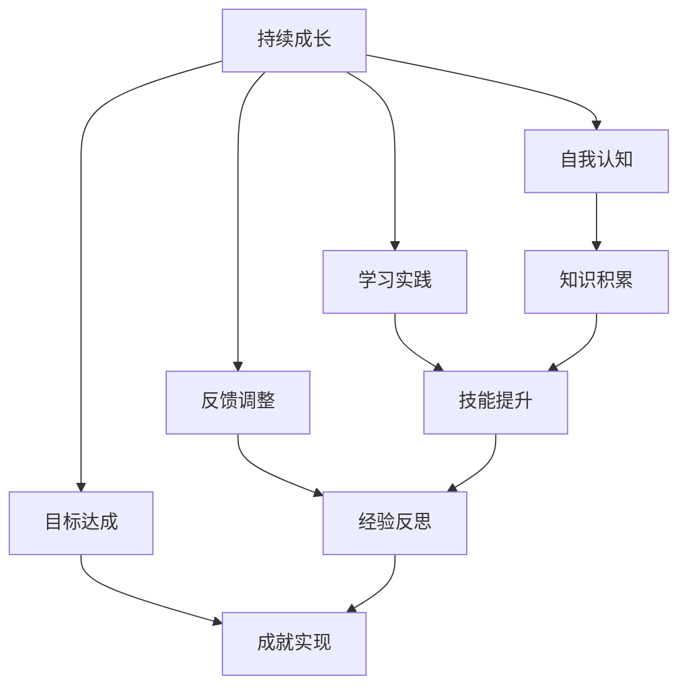
```mermaid
graph TB
A[持续成长] --> B[自我认知]
A --> C[学习实践]
A --> D[反馈调整]
A --> E[目标达成]
B --> F[知识积累]
C --> G[技能提升]
D --> H[经验反思]
E --> I[成就实现]
F --> G
G --> H
H --> I
```

**核心算法原理讲解：**

虽然持续成长的过程不直接涉及复杂的算法原理，但可以借鉴以下算法原则：

1. **迭代优化**：成长过程类似于算法中的迭代优化步骤，通过不断地反思和调整，我们能够逐步提升自我。
2. **反馈机制**：成长过程需要有效的反馈机制，类似于算法中的反馈循环，通过收集和分析反馈，我们可以更好地了解自己的成长方向和需要改进的领域。

**数学模型和数学公式：**

持续成长可以使用一些简单的数学模型和公式来评估和优化：

1. **学习曲线**：通过学习曲线模型，可以量化学习过程中的进步和瓶颈，指导学习策略的调整。
2. **目标达成模型**：通过目标达成模型，如线性规划和关键路径分析，可以确定最佳的学习和实践策略，实现目标。

**项目实战：**

为了帮助读者制定和实现个人成长计划，我们可以提供一个具体的案例：

**案例：制定并实现个人成长计划**

1. **自我认知**：首先，通过自我反思和性格测试，了解自己的优势和不足，明确成长目标。
2. **学习实践**：选择合适的学习资源和实践项目，如在线课程、实习机会和实际项目，逐步提升知识和技能。
3. **反馈调整**：定期收集反馈，如通过导师指导、同事评价和自我评估，识别需要改进的领域，并调整成长计划。
4. **目标达成**：设定短期和长期成长目标，如提升特定技能或实现职业晋升，通过持续学习和实践，逐步实现目标。

**实现步骤：**

1. **自我认知**：定期进行自我反思和评估，识别自己的优势和不足，明确成长方向。
2. **设定目标**：设定明确的短期和长期成长目标，如提升技能、实现职业晋升或掌握新知识。
3. **选择资源**：选择合适的学习资源和实践项目，如在线课程、实习机会和实际项目，确保学习内容的实用性和深度。
4. **学习实践**：按照设定的目标和资源，逐步学习和实践，确保所学知识能够应用于实际工作或生活中。
5. **反馈调整**：定期收集反馈，如通过导师指导、同事评价和自我评估，识别需要改进的领域，并调整成长计划。
6. **持续优化**：根据反馈和实际情况，不断调整成长策略和学习内容，确保成长过程的持续性和有效性。
7. **实现目标**：通过持续学习和实践，逐步实现设定的成长目标，不断提升个人能力和竞争力。

**案例反思：**

通过这个案例，我们可以看到，持续成长需要自我认知、目标设定、学习实践、反馈调整和目标达成。通过这些步骤，我们能够系统地实现个人成长，不断提升自己的能力和竞争力。

总之，持续成长是个人和职业发展的重要途径。通过理解持续成长的方法和实践，以及通过具体案例的实践，我们能够系统地实现个人成长，实现更高的成就和职业发展。接下来，我们将总结本文的关键观点，并强调自我引导在个人和职业成功中的重要性。

## 总结与展望

在本文中，我们系统地探讨了自我引导的艺术，从自我认知与内在成长，到目标设定与规划，决策制定与执行力，时间管理与资源规划，情绪管理与自我调节，建立积极的人际关系，以及持续学习与成长，每个方面都至关重要，共同构成了自我引导的完整体系。以下是对每个关键观点的总结：

1. **自我认知与内在成长**：通过深入自我认知和内在成长，我们能够更好地理解自己的性格、需求和动机，为个人和职业成功打下坚实的基础。
2. **目标设定与规划**：明确的目标和合理的规划是成功的关键。通过科学的目标设定和资源规划，我们能够更有效地实现个人和职业目标。
3. **决策制定与执行力**：有效的决策制定和执行力是实现目标的重要保障。通过理解决策制定的原则和提升执行力的技巧，我们能够在生活和工作中做出明智且高效的决策。
4. **时间管理与资源规划**：良好的时间管理和资源规划能够提高生产力和生活质量。通过合理分配时间和资源，我们能够更高效地完成任务，实现目标。
5. **情绪管理与自我调节**：情绪管理是维持心理健康和应对生活挑战的关键。通过自我调节技巧，我们能够更好地管理情绪，提高适应能力。
6. **建立积极的人际关系**：积极的人际关系对我们的生活和工作都有着重要影响。通过有效的沟通技巧和冲突解决策略，我们能够建立和维护良好的人际关系。
7. **持续学习与成长**：持续学习是个人和职业成长的不竭动力。通过有效的学习方法和实践，我们能够不断提升自己的能力和竞争力。

自我引导在个人和职业成功中具有至关重要的地位。通过自我引导，我们能够更好地认识自己，设定和实现目标，做出明智的决策，管理时间和资源，调节情绪，建立积极的人际关系，并持续学习和成长。自我引导不仅帮助我们实现个人和职业上的成功，还能提高我们的幸福感和生活质量。

为了在未来的生活和工作中更好地应用自我引导的技巧，以下是一些建议：

1. **定期反思**：每周或每月花时间进行自我反思，评估自己的行为和表现，找出需要改进的领域。
2. **制定计划**：设定明确的短期和长期目标，制定详细的计划和时间表，确保每个目标都有明确的时间和资源安排。
3. **持续学习**：保持对知识和技能的渴望，定期学习新知识和技能，不断提升自己的能力。
4. **积极交流**：与他人保持积极交流，倾听他人的意见和需求，建立良好的人际关系。
5. **调整策略**：根据实际情况和反馈，及时调整目标和计划，确保策略的有效性。

通过持续的自我引导和实践，我们能够更好地掌握自己的生活，实现个人和职业上的成功，成为真正的人生主导者。让我们将自我引导的艺术融入日常实践中，不断提升自我，迎接未来的挑战。

