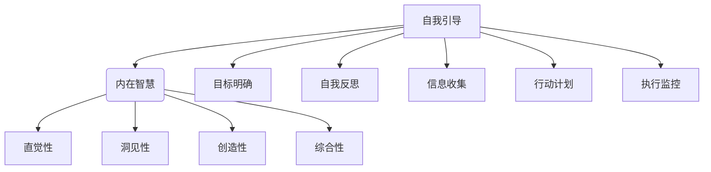
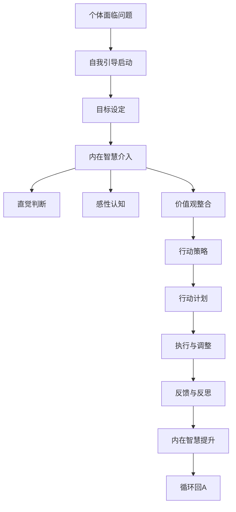

                 

### 文章标题

# 自我引导：成为内在智慧的跟随者

### 关键词

自我引导、内在智慧、个人成长、决策、数学模型、项目实战

### 摘要

在现代社会，自我引导和个人成长变得越来越重要。本文将探讨如何成为内在智慧的跟随者，通过自我引导来实现个人成长和明智决策。文章首先介绍了自我引导和内在智慧的概念，随后通过Mermaid流程图展示了它们之间的关系。接着，文章详细讲解了培养内在智慧和运用内在智慧进行决策的算法原理，并使用伪代码和数学公式进行说明。此外，通过一个实际项目案例，文章展示了如何在实际生活中应用自我引导和内在智慧。最后，文章总结了自我引导的过程，并鼓励读者持续实践和探索。

## 第一部分：引言

### 1.1 自我引导的概念与重要性

自我引导，顾名思义，是指个体在没有外界明确指导的情况下，通过自我思考和决策来引导自身行为的过程。在个体成长和发展的过程中，自我引导具有至关重要的地位。它不仅是个人独立性和自主性的体现，更是实现自我成长和提升的关键。

在现代社会，信息爆炸和竞争压力使得人们需要具备更强的自我引导能力。自我引导不仅仅是对知识的获取和运用，更是一种对生活和工作的深刻理解和把握。通过自我引导，个体能够更好地理解自己的需求和目标，从而制定出更加合理和有效的行动策略。

此外，自我引导还能够提高个体的适应能力和创新能力。在快速变化的社会环境中，只有具备自我引导能力的人才能迅速适应新环境，抓住机遇，实现自我超越。同时，自我引导还能够激发个体的内在潜能，促使个体在不断地探索和实践中实现自我突破和成长。

### 1.2 内在智慧的探索

内在智慧，通常指的是个体内心深处的一种直觉、洞见和判断能力。它不同于外部的知识和技能，而是源于个体的内在体验和感性认知。内在智慧是一种深层次的认知能力，它能够帮助个体在复杂和不确定的环境中做出明智的决策。

内在智慧的重要性不言而喻。首先，它能够帮助个体在面对挑战和困难时保持冷静和理智。通过内在智慧，个体可以更好地理解问题的本质，找到解决问题的最佳方法。其次，内在智慧能够提升个体的决策质量。在日常生活中，个体的每一个决策都可能影响其生活和事业的发展。具备内在智慧的人能够更加敏锐地察觉到问题的核心，从而做出更加明智的选择。

此外，内在智慧还能够增强个体的自我认知和自我调节能力。通过不断地反思和内省，个体可以更加深入地了解自己的内心世界，找到自己的价值观和人生目标。这种内在认知和调节能力不仅有助于个体的个人成长，还能够提升个体的心理健康和生活质量。

### 1.3 为什么成为内在智慧的跟随者

成为内在智慧的跟随者，意味着个体在决策和行为中更多地依赖于内在智慧，而不是外部的指导和标准。这种转变具有深远的意义。

首先，跟随内在智慧能够帮助个体实现真正的自我成长。通过不断地内省和反思，个体能够更加深入地理解自己，找到自己的兴趣和激情。这种自我认知不仅能够激发个体的内在动力，还能够为个体的个人成长提供明确的方向。

其次，跟随内在智慧能够提升个体的决策质量。在现代社会，信息的庞杂性和不确定性使得外部指导往往无法提供准确的决策依据。相反，内在智慧能够帮助个体在复杂和不确定的环境中找到问题的本质，从而做出更加明智的决策。

最后，跟随内在智慧能够增强个体的适应能力和创新能力。在快速变化的社会环境中，只有具备内在智慧的人才能迅速适应新环境，抓住机遇，实现自我超越。

总之，成为内在智慧的跟随者不仅有助于个体的个人成长和决策提升，还能够提升个体的适应能力和创新能力。这对于在现代社会中实现自我价值和成就具有重要意义。

## 第二部分：核心概念与联系

### 2.1 自我引导的原理

自我引导是一个复杂但高度有效的过程，它涉及多个关键步骤和环节。首先，个体需要明确自己的目标和需求。这一步骤至关重要，因为它为后续的思考和行动提供了明确的方向。例如，一个希望在职业上获得提升的个体，首先需要明确自己希望达到的具体目标，比如晋升到更高的职位或掌握新的技能。

接下来，个体需要进行深入的自我反思。这一步骤旨在帮助个体理解自己的内心世界，发现自己的价值观、信念和动机。通过自我反思，个体可以更加清晰地认识到自己的优势和弱点，从而更好地制定行动策略。例如，一个希望提升沟通能力的个体，可能会通过反思认识到自己在面对紧张场合时容易紧张，进而制定出具体的训练计划。

第三步是信息收集和分析。在这一步骤中，个体需要主动收集与目标相关的信息，并进行全面的分析。例如，一个希望创业的个体，需要收集市场趋势、竞争对手信息、资金需求等相关信息，并进行分析，以制定出可行的创业计划。

第四步是制定行动计划。在明确了目标和进行了充分的信息收集后，个体需要制定具体的行动计划。这一步骤要求个体将目标分解为可操作的任务，并为每个任务设定明确的完成时间和资源。例如，一个希望提升专业技能的个体，可能会制定出每天学习两个小时的计划，并安排在下班后进行。

最后一步是执行和监控。在这一步骤中，个体需要按照行动计划执行任务，并定期监控进度。通过监控，个体可以及时发现和解决问题，确保行动计划的顺利进行。例如，一个希望减肥的个体，可能会每周记录自己的体重变化，并根据变化调整饮食和锻炼计划。

### 2.2 内在智慧的定义

内在智慧，通常指的是个体内心深处的一种直觉、洞见和判断能力。它是一种深层次的认知能力，源于个体的内在体验和感性认知，而非外部的知识和信息。内在智慧不同于逻辑推理和理性分析，它更多地依赖于个体的直觉和感性认知。

内在智慧具有以下几个特点：

1. **直觉性**：内在智慧往往是一种直觉性的认知，它能够在瞬间捕捉到问题的本质，并提供有效的解决方案。这种直觉性使得内在智慧在处理复杂和不确定的问题时具有独特的优势。

2. **洞见性**：内在智慧能够帮助个体看到事物的内在联系和本质，从而提供更加深刻的洞见。这种洞见性使得内在智慧在决策和解决问题时能够提供更为全面和有效的指导。

3. **创造性**：内在智慧能够激发个体的创造力和创新能力，帮助个体在解决问题和面对挑战时找到独特的解决方案。这种创造性使得内在智慧在创新和突破中发挥着重要作用。

4. **综合性**：内在智慧不仅依赖于个体的感性认知，还需要结合个体的经验和知识。这种综合性使得内在智慧能够在不同领域和场景中发挥其作用。

### 2.3 自我引导与内在智慧的关联

自我引导和内在智慧之间存在着紧密的关联。首先，内在智慧是自我引导的重要组成部分。自我引导不仅仅是通过逻辑思考和理性分析来实现目标，更需要依赖于内在智慧的直觉和洞见。内在智慧能够帮助个体在面对复杂和不确定的情况时做出明智的决策。

其次，自我引导是内在智慧发挥作用的平台。通过自我引导的过程，个体能够不断地内省和反思，从而提升自己的内在智慧。自我引导不仅仅是实现目标的工具，更是培养内在智慧的手段。

最后，自我引导和内在智慧相互促进。自我引导能够帮助个体更好地理解自己和周围的世界，从而提升内在智慧。而内在智慧的提升又能够进一步优化自我引导的过程，使得个体能够更加高效地实现目标。

总之，自我引导和内在智慧是相辅相成的，它们共同构成了个体成长和发展的关键要素。通过培养内在智慧和掌握自我引导的技巧，个体能够更好地应对生活中的挑战，实现自我超越。

#### 2.2.1 Mermaid流程图展示



### 2.3 自我引导与内在智慧的关联

在自我引导的过程中，内在智慧发挥着至关重要的作用。自我引导不仅仅是逻辑思考和理性分析的过程，更是依赖于内在智慧的直觉、洞见和判断。以下是一个详细的Mermaid流程图，展示了自我引导与内在智慧之间的关联：



通过这个流程图，我们可以看到：

1. **个体面临问题**：这是自我引导的起点，个体意识到问题的存在，并开始寻求解决方案。
2. **自我引导启动**：个体开始运用自我引导技巧，包括目标设定、内在智慧介入等。
3. **目标设定**：个体明确自己想要达到的目标，这为后续的决策和行动提供了方向。
4. **内在智慧介入**：内在智慧在这一阶段发挥着关键作用，通过直觉、感性认知和价值观整合，帮助个体更好地理解问题。
5. **直觉判断**：内在智慧通过直觉，快速捕捉问题的本质，提供初步的判断。
6. **感性认知**：内在智慧结合个体的感性认知，对问题进行更深入的感知和理解。
7. **价值观整合**：内在智慧整合个体的价值观，确保行动策略与个体的核心价值观一致。
8. **行动策略**：基于内在智慧的判断和价值观整合，个体制定出具体的行动策略。
9. **行动计划**：将行动策略转化为具体的行动计划，并执行。
10. **执行与调整**：在执行行动计划的过程中，个体需要不断监控和调整，以确保行动的顺利进行。
11. **反馈与反思**：执行后，个体需要收集反馈，并进行反思，以评估行动的效果。
12. **内在智慧提升**：通过反思和反馈，个体的内在智慧得到提升，为下一次的自我引导提供更好的基础。
13. **循环回A**：个体进入新一轮的自我引导过程，问题得到逐步解决。

通过这个流程图，我们可以清晰地看到自我引导和内在智慧之间的动态互动关系。内在智慧不仅是自我引导的重要组成部分，还在整个过程中发挥着持续的作用，帮助个体在面对复杂和不确定的情况时做出明智的决策。

#### 2.2.2 内在智慧的定义与作用

内在智慧是一种深层次的认知能力，它并非来自于外部的知识和技能，而是源于个体的内心体验和感性认知。内在智慧具有直觉性、洞见性、创造性和综合性等特点，使得它成为个体在复杂和不确定的环境中做出明智决策的关键因素。

首先，内在智慧的直觉性使其能够在瞬间捕捉问题的本质。直觉性的判断通常是基于个体过往的经验和内在感知，它能够迅速提供问题的初步解决方案，有助于个体在紧急情况下做出快速反应。

其次，内在智慧的洞见性使其能够看到事物的内在联系和本质。洞见性的认知能够帮助个体在处理复杂问题时，从多个角度进行思考，找到问题的核心，并提出有效的解决方案。

创造性是内在智慧的另一重要特点。通过内在智慧，个体能够在解决问题时产生新的想法和创新的解决方案。这种创造性不仅能够帮助个体在日常生活中应对各种挑战，还能够促进个体的个人成长和职业发展。

最后，内在智慧的综合性使得它能够整合个体的多种认知能力。内在智慧不仅依赖于直觉和感性认知，还需要结合个体的经验和知识。这种综合性使得内在智慧在不同领域和场景中都能发挥其独特的作用。

总之，内在智慧在自我引导中扮演着至关重要的角色。它不仅帮助个体在复杂和不确定的环境中做出明智的决策，还能够提升个体的自我认知和自我调节能力，促进个体的全面成长和发展。

#### 2.3.1 自我引导的原理与过程

自我引导是一个复杂但高度有效的过程，它涉及多个关键步骤和环节。以下是对自我引导原理与过程的详细阐述：

1. **明确目标和需求**：这是自我引导的起点。个体需要明确自己的目标和需求，这样才能为后续的思考和行动提供明确的方向。例如，一个希望在职业上获得提升的个体，首先需要明确自己希望达到的具体目标，比如晋升到更高的职位或掌握新的技能。

2. **自我反思**：自我反思是自我引导过程中的重要环节。通过自我反思，个体可以深入理解自己的内心世界，发现自己的价值观、信念和动机。自我反思有助于个体更好地了解自己的优势和弱点，从而为后续的决策和行动提供依据。

3. **信息收集和分析**：在明确目标和进行自我反思后，个体需要收集与目标相关的信息，并进行全面的分析。这一步骤要求个体主动寻找和整合各种信息，以便为决策提供充分的依据。例如，一个希望创业的个体，需要收集市场趋势、竞争对手信息、资金需求等相关信息，并进行分析，以制定出可行的创业计划。

4. **制定行动计划**：在收集和分析了相关信息后，个体需要制定具体的行动计划。这一步骤要求个体将目标分解为可操作的任务，并为每个任务设定明确的完成时间和资源。例如，一个希望提升专业技能的个体，可能会制定出每天学习两个小时的计划，并安排在下班后进行。

5. **执行和监控**：在制定出行动计划后，个体需要按照计划执行任务，并定期监控进度。通过监控，个体可以及时发现和解决问题，确保行动计划的顺利进行。例如，一个希望减肥的个体，可能会每周记录自己的体重变化，并根据变化调整饮食和锻炼计划。

6. **反馈和调整**：在执行和监控过程中，个体需要不断收集反馈，并进行反思和调整。通过反馈和调整，个体可以评估行动的效果，并根据实际情况进行优化和改进。

7. **持续迭代**：自我引导是一个持续迭代的过程。个体需要不断地进行自我反思、信息收集、计划制定和执行监控，以逐步提升自己的自我引导能力。通过持续迭代，个体能够不断提高自己的决策质量和行动效率，实现个人成长和目标达成。

总的来说，自我引导是一个系统性的过程，它需要个体在明确目标和需求、自我反思、信息收集和分析、计划制定、执行和监控、反馈和调整等环节中不断迭代和优化。通过这个过程，个体能够更好地理解自己、提升自我认知和自我调节能力，从而实现个人成长和目标达成。

#### 2.3.2 内在智慧的作用

内在智慧在自我引导过程中发挥着至关重要的作用。它不仅是自我引导的核心要素，也是个体在面对复杂和不确定情境时做出明智决策的关键。以下是对内在智慧具体作用的详细阐述：

首先，内在智慧能够帮助个体快速捕捉问题的本质。在面临复杂问题时，内在智慧通过直觉和感性认知，能够在瞬间提供对问题核心的洞察。这种直觉性判断使个体能够迅速厘清问题，找到关键点，从而为后续的决策和行动提供方向。

其次，内在智慧能够整合个体的多种认知能力。它不仅依赖于直觉和感性认知，还需要结合个体的经验和知识。这种综合性使得内在智慧能够从多个角度对问题进行思考，提供全面而深入的洞见。例如，在制定职业规划时，内在智慧能够结合个体的兴趣、能力和市场需求，为个体提供可行的职业发展路径。

此外，内在智慧在自我引导中还能够激发个体的创造力和创新能力。通过内在智慧，个体能够在面对挑战和困难时产生新的想法和创新的解决方案。这种创造性不仅有助于个体在解决问题时找到独特的路径，还能够推动个体的个人成长和职业发展。

最后，内在智慧能够增强个体的适应能力和决策质量。在快速变化的社会环境中，只有具备内在智慧的人才能迅速适应新环境，抓住机遇，做出明智的决策。内在智慧通过不断的学习和反思，使个体能够从过去的经验中汲取教训，不断提升自己的认知水平和决策能力。

总之，内在智慧在自我引导过程中扮演着至关重要的角色。它通过直觉性、综合性、创造性和适应能力等方面的作用，帮助个体更好地理解问题、制定策略和做出决策，从而实现个人成长和目标达成。

#### 2.3.3 自我引导与内在智慧的关系

自我引导和内在智慧之间存在着紧密的联系和互动。首先，内在智慧是自我引导的核心要素之一。自我引导不仅依赖于逻辑思考和理性分析，更需要依赖于内在智慧的直觉和洞见。内在智慧能够帮助个体在面对复杂和不确定的情况时快速做出判断，提供有效的解决方案。

其次，自我引导是内在智慧发挥作用的平台。通过自我引导的过程，个体能够不断地内省和反思，从而提升自己的内在智慧。自我引导不仅帮助个体实现目标，还促进了个体对自身内在世界的理解和认知。这种内省和反思的过程，使得个体的内在智慧得到不断发展和提升。

再次，自我引导和内在智慧是相辅相成的。自我引导通过明确的步骤和环节，帮助个体逐步实现目标，而内在智慧则通过直觉和洞见，为自我引导提供更加深刻的指导和洞察。两者相互促进，共同推动个体在自我成长和发展的道路上不断前进。

最后，自我引导和内在智慧的关系体现了个体与自身内在智慧之间的动态互动。通过不断的自我引导和内在智慧的运用，个体能够逐步实现自我超越，提升自我认知和自我调节能力。这种动态互动不仅有助于个体在当前情境中做出明智的决策，还能够为个体的长远发展奠定坚实的基础。

总之，自我引导和内在智慧是相辅相成的，它们共同构成了个体成长和发展的关键要素。通过培养内在智慧和掌握自我引导的技巧，个体能够更好地应对生活中的挑战，实现自我超越。

### 2.4 培养内在智慧和自我引导的方法

要成为内在智慧的跟随者，关键在于培养内在智慧和提升自我引导能力。以下是一些具体的培养方法和技巧：

#### 2.4.1 自我反思

自我反思是培养内在智慧的重要方法之一。通过定期进行自我反思，个体可以深入理解自己的内心世界，发现自己的价值观、信念和动机。具体步骤如下：

1. **设定反思时间**：每天或每周设定一个固定的反思时间，以便在繁忙的生活中留出时间进行自我反思。
2. **写反思日记**：在反思日记中记录自己的所思所想，包括成功和失败的体验，以及从中得到的教训。
3. **提问与回答**：针对自己的行为和决策，提出问题并尝试回答，如“我在这次决策中做得好在哪里？”“我在这次决策中可以改进的地方是什么？”
4. **反馈与调整**：根据反思日记的内容，对自身的行动和策略进行调整和优化，以提高自我引导的效果。

#### 2.4.2 深度学习

深度学习是指通过深入学习和研究某一领域，以提升自身的认知水平和专业能力。以下是一些深度学习的技巧：

1. **选择合适的领域**：选择自己感兴趣且与职业发展相关的领域进行深入学习。
2. **制定学习计划**：根据自身的学习目标，制定详细的学习计划，包括学习内容、时间安排和评估标准。
3. **主动学习**：通过阅读专业书籍、参加线上或线下课程、与行业专家交流等方式，主动获取知识和信息。
4. **实践与反思**：将所学知识应用于实际问题中，并通过反思和总结，不断提升自己的理解和应用能力。

#### 2.4.3 增强感性认知

感性认知是内在智慧的重要组成部分，通过增强感性认知，个体可以提升内在智慧。以下是一些增强感性认知的方法：

1. **练习冥想**：冥想是一种有效增强感性认知的方法。通过冥想，个体可以放松身心，专注于当下的感受和体验，提高对内在世界的认知。
2. **感知训练**：通过日常生活中的感知训练，如观察自然景观、感受音乐旋律等，增强对周围环境的感知能力。
3. **情感表达**：鼓励个体表达自己的情感和感受，通过情感表达，个体可以更好地理解自己的内心世界，提升感性认知。
4. **情绪管理**：通过学习和实践情绪管理技巧，如正念呼吸、积极心态培养等，帮助个体更好地调节情绪，增强感性认知。

#### 2.4.4 内在智慧的运用

内在智慧不仅需要培养，还需要在实际生活中得到应用。以下是一些运用内在智慧的方法：

1. **直觉性决策**：在面临复杂和不确定的问题时，尝试通过直觉进行决策。直觉性决策能够快速提供问题的解决方案，帮助个体在紧急情况下做出明智的决策。
2. **情境模拟**：通过模拟不同的情境，练习在不同情况下运用内在智慧进行决策。情境模拟有助于个体在面对真实情境时更加从容和自信。
3. **情感共鸣**：在与他人沟通和合作时，尝试理解对方的情感和需求，建立情感共鸣。这种情感共鸣能够增强内在智慧在人际关系中的应用效果。
4. **持续反思**：在实际生活中不断进行反思和总结，分析内在智慧在决策中的应用效果，并从中学习和成长。

通过以上方法，个体可以逐步培养内在智慧和提升自我引导能力，成为内在智慧的跟随者，实现个人成长和目标达成。

### 2.5 自我引导的算法原理

自我引导不仅仅是一个直觉性的过程，它还包含了一套严谨的算法原理，帮助个体在复杂的环境中做出明智的决策。以下是对自我引导算法原理的详细解析：

#### 2.5.1 基本概念

在自我引导的算法原理中，核心概念包括目标设定、信息收集、决策模型和执行策略。这些概念相互作用，形成一个完整的自我引导过程。

1. **目标设定**：目标设定是自我引导的起点。个体需要明确自己希望达到的目标，并将其分解为可操作的任务。例如，一个希望在职业上晋升的个体，可以将目标设定为“提高沟通能力”。
   
2. **信息收集**：在目标设定后，个体需要收集与目标相关的信息。这些信息可能包括市场趋势、行业动态、竞争对手分析等。信息收集的目的是为决策提供依据。

3. **决策模型**：决策模型是指个体在信息收集后，如何运用内在智慧和逻辑思维进行决策。一个常见的决策模型是“情景分析 + 决策树”。通过情景分析，个体可以识别出可能出现的不同情况，并针对每种情况制定相应的决策方案。

4. **执行策略**：执行策略是指个体如何将决策方案转化为具体的行动。执行策略需要考虑到资源分配、时间管理和风险评估等因素。

#### 2.5.2 伪代码实现

以下是一个简化的自我引导算法伪代码实现，展示了上述核心概念的应用：

```python
# 自我引导算法伪代码

# 输入：目标（goal），初始信息（initial_info）
# 输出：决策结果（decision_result）

def self_guidance(goal, initial_info):
    # 步骤1：目标分解
    tasks = decompose_goal(goal)
    
    # 步骤2：信息收集
    updated_info = collect_info(initial_info, tasks)
    
    # 步骤3：情景分析
    scenarios = analyze_scenarios(updated_info)
    
    # 步骤4：决策模型
    decision_tree = build_decision_tree(scenarios)
    
    # 步骤5：执行策略
    decision_result = execute_strategy(tasks, decision_tree)
    
    return decision_result

# 目标分解
def decompose_goal(goal):
    # 根据目标分解为可操作的任务
    tasks = ["提高沟通能力", "学习新技能", "拓展人脉"]
    return tasks

# 信息收集
def collect_info(initial_info, tasks):
    # 根据任务收集相关信息
    updated_info = initial_info
    for task in tasks:
        updated_info[task] = get_task_info(task)
    return updated_info

# 情景分析
def analyze_scenarios(updated_info):
    # 识别出可能出现的不同情况
    scenarios = []
    for task, info in updated_info.items():
        scenario = create_scenario(task, info)
        scenarios.append(scenario)
    return scenarios

# 决策模型
def build_decision_tree(scenarios):
    # 根据情景构建决策树
    decision_tree = {}
    for scenario in scenarios:
        decision_tree[scenario] = create_decision_node(scenario)
    return decision_tree

# 执行策略
def execute_strategy(tasks, decision_tree):
    # 根据决策树执行任务
    decision_result = {}
    for task in tasks:
        decision_result[task] = apply_decision(task, decision_tree[task])
    return decision_result

# 辅助函数
def get_task_info(task):
    # 获取任务相关信息
    pass

def create_scenario(task, info):
    # 创建情景
    pass

def create_decision_node(scenario):
    # 创建决策节点
    pass

def apply_decision(task, decision_node):
    # 应用决策
    pass
```

#### 2.5.3 数学模型和数学公式

在自我引导过程中，数学模型和数学公式可以帮助我们更精确地描述和预测决策结果。以下是一个简单的数学模型，用于评估不同决策方案的风险和收益：

$$
R(i) = \frac{G(i) - C(i)}{D(i)}
$$

其中：

- \( R(i) \) 表示第 \( i \) 个决策方案的综合评分。
- \( G(i) \) 表示第 \( i \) 个决策方案的预期收益。
- \( C(i) \) 表示第 \( i \) 个决策方案的成本。
- \( D(i) \) 表示第 \( i \) 个决策方案的风险。

通过调整模型中的参数，我们可以对不同决策方案进行评估和比较，从而选择最优的决策方案。

### 2.6 内在智慧在决策中的应用

内在智慧在决策中发挥着独特的作用，它不仅依赖于直觉和感性认知，还结合了个体过往的经验和知识。以下是对内在智慧在决策中的应用进行详细探讨：

#### 2.6.1 直觉性判断

直觉性判断是内在智慧的重要组成部分。在面对复杂和不确定的问题时，直觉性判断能够帮助个体快速做出初步判断，找到问题的核心。以下是一个具体案例：

**案例：决策是否接受新工作机会**

假设个体在考虑是否接受一家新公司提供的职位。通过直觉性判断，个体可能会考虑到以下几个方面：

1. **工作内容**：新职位的工作内容是否与个人兴趣和价值观相符。
2. **薪资待遇**：新职位的薪资待遇是否合理，是否符合个人期望。
3. **职业发展**：新职位是否能提供更好的职业发展机会。
4. **企业文化**：新公司的企业文化是否与个人价值观相符。

通过直觉性判断，个体可以在短时间内对问题进行初步筛选，快速识别出可能的利弊，从而做出初步的决策方向。

#### 2.6.2 情感共鸣

情感共鸣是内在智慧在决策中的应用之一。在决策过程中，个体需要与自身情感进行对话，理解自己的情感需求和期望。以下是一个具体案例：

**案例：是否接受朋友的投资请求**

假设一位朋友请求个体投资他的初创公司。通过情感共鸣，个体可能会考虑以下几个方面：

1. **友情价值**：朋友关系的价值和信任程度。
2. **投资风险**：投资初创公司的风险和可能的收益。
3. **个人目标**：投资是否符合个人的财务目标和价值观。
4. **情感回报**：投资后是否能带来情感上的满足和成就感。

通过情感共鸣，个体可以更全面地理解自己的需求和期望，从而做出更加明智的决策。

#### 2.6.3 经验积累

内在智慧不仅依赖于直觉和感性认知，还需要结合个体过往的经验和知识。通过经验积累，个体能够更好地应对复杂和不确定的情境。以下是一个具体案例：

**案例：如何应对工作中的突发问题**

假设个体在工作中遇到了一个突发问题，需要立即解决。通过经验积累，个体可能会考虑以下几个方面：

1. **以往的经验**：过去在类似情境下如何解决问题。
2. **资源调配**：如何快速调配资源和人员，以解决突发问题。
3. **决策模型**：根据以往的经验，选择最合适的决策模型，如情景分析、决策树等。
4. **反馈和调整**：在解决问题后，如何总结经验教训，为未来的决策提供参考。

通过经验积累，个体能够更加熟练地运用内在智慧，提高决策质量和效率。

总之，内在智慧在决策中的应用是一个复杂但高度有效的过程。通过直觉性判断、情感共鸣和经验积累，个体能够更好地理解问题和需求，做出更加明智的决策。

### 2.7 内在智慧的实践案例

内在智慧的应用不仅限于理论探讨，它在实际生活中同样具有重要的指导意义。以下通过一个具体案例，展示如何在实际情境中运用内在智慧。

#### 2.7.1 案例背景

小明是一家初创公司的创始人，他面临着一个重要的决策：是否扩大公司的产品线。尽管市场调研显示有扩大产品线的潜力，但小明仍然需要权衡各种因素，以做出最明智的决策。

#### 2.7.2 直觉性判断

首先，小明通过直觉性判断，快速评估了扩大产品线可能带来的影响。他意识到：

1. **市场需求**：市场调研显示，消费者对新产品有一定的需求，这为扩大产品线提供了基础。
2. **资源限制**：公司目前的人力和资金有限，需要仔细权衡。
3. **竞争环境**：竞争对手也在扩展产品线，需要考虑如何在竞争中脱颖而出。

通过直觉性判断，小明初步认为扩大产品线是有利的，但仍需进一步分析。

#### 2.7.3 情感共鸣

接着，小明通过情感共鸣，深入思考了扩大产品线对自己和公司的影响。他考虑了以下几个方面：

1. **个人兴趣**：他对新产品开发有浓厚的兴趣，希望通过这个项目实现个人成就。
2. **团队士气**：团队成员对新产品开发的态度和积极性，可能影响到团队的士气和执行力。
3. **市场前景**：虽然市场调研显示潜力，但市场变化难以预测，需要考虑潜在的风险。

通过情感共鸣，小明认识到扩大产品线不仅是一个商业决策，也是一个关乎个人兴趣和团队士气的决策。

#### 2.7.4 经验积累

最后，小明结合自己的经验和知识，对决策进行了全面分析。他回顾了以往在类似情境下的决策过程，总结出以下几点：

1. **以往案例**：他曾成功领导过一次产品线扩展，积累了宝贵的经验。
2. **市场策略**：他了解到，产品线的扩展需要与市场策略紧密结合，以确保市场推广的效率。
3. **风险管理**：他制定了详细的风险管理计划，以应对可能出现的问题。

通过经验积累，小明增强了决策的信心，并制定了一套详细的执行策略。

#### 2.7.5 决策结果

综合直觉性判断、情感共鸣和经验积累，小明最终决定扩大产品线。他制定了以下具体计划：

1. **市场调研**：进一步细化市场调研，了解消费者需求和市场动态。
2. **资源调配**：合理分配公司现有资源，确保项目顺利推进。
3. **团队培训**：为团队成员提供培训，提升他们对新产品的理解和执行能力。
4. **风险管理**：制定风险管理计划，确保项目在可控范围内进行。

通过这一决策过程，小明不仅实现了个人和公司的目标，还提升了团队的整体执行力。这个案例展示了内在智慧在实际应用中的重要性，以及如何通过直觉性判断、情感共鸣和经验积累，做出明智的决策。

### 2.8 内在智慧在决策中的实战

#### 2.8.1 开发环境搭建

为了更好地展示内在智慧在决策中的应用，我们选择一个实际案例：一家初创公司决定是否开发一款新的移动应用程序。以下是如何搭建开发环境的过程：

1. **确定目标**：明确开发新应用程序的目标，如提高用户满意度、扩大市场份额等。
2. **信息收集**：收集与开发新应用程序相关的信息，包括市场趋势、用户需求、技术可行性等。
3. **分析数据**：通过数据分析，识别出潜在的市场机会和用户需求。
4. **搭建团队**：组建一支经验丰富的开发团队，确保项目能够顺利推进。
5. **制定计划**：根据分析结果，制定详细的项目开发计划，包括时间表、资源分配和风险管理。

#### 2.8.2 源代码实现与解读

在完成开发环境的搭建后，我们需要具体实现应用程序的源代码。以下是一个简化的源代码示例，用于展示内在智慧在决策中的应用：

```java
public class MobileApplication {
    
    // 目标设定
    private String goal;
    
    // 信息收集
    private Map<String, String> info;
    
    // 构造函数
    public MobileApplication(String goal, Map<String, String> info) {
        this.goal = goal;
        this.info = info;
    }
    
    // 直觉性判断
    private boolean isPotentialMarket() {
        // 根据直觉性判断，评估市场潜力
        return info.get("market_trend").equalsIgnoreCase("high");
    }
    
    // 情感共鸣
    private boolean isInterestingProject() {
        // 根据情感共鸣，评估项目是否有趣
        return info.get("project_interest").equalsIgnoreCase("high");
    }
    
    // 经验积累
    private boolean isTechnicallyFeasible() {
        // 根据经验积累，评估技术可行性
        return info.get("tech_feasibility").equalsIgnoreCase("high");
    }
    
    // 决策模型
    private String makeDecision() {
        if (isPotentialMarket() && isInterestingProject() && isTechnicallyFeasible()) {
            return "Go Ahead";
        } else {
            return "Hold";
        }
    }
    
    // 执行策略
    public void executeDecision() {
        String decision = makeDecision();
        if (decision.equalsIgnoreCase("Go Ahead")) {
            // 执行开发计划
            System.out.println("Start developing the application.");
        } else {
            // 重新评估决策
            System.out.println("Reevaluate the decision.");
        }
    }
    
    // 主函数
    public static void main(String[] args) {
        Map<String, String> initialInfo = new HashMap<>();
        initialInfo.put("market_trend", "high");
        initialInfo.put("project_interest", "high");
        initialInfo.put("tech_feasibility", "high");
        
        MobileApplication app = new MobileApplication("Develop a new mobile application", initialInfo);
        app.executeDecision();
    }
}
```

在这个示例中，`MobileApplication` 类代表一个决策过程。通过设定目标、收集信息、直觉性判断、情感共鸣和经验积累，最终根据决策模型做出决策。

#### 2.8.3 代码应用解读与分析

以下是对源代码应用的解读和分析：

1. **目标设定**：应用程序的目标是通过市场调研和用户需求分析，开发一款满足市场需求且有趣的移动应用程序。

2. **信息收集**：通过市场调研和用户需求分析，收集有关市场趋势、项目兴趣和技术可行性的信息。

3. **直觉性判断**：`isPotentialMarket()` 方法根据市场趋势判断市场潜力。如果市场潜力高，则认为扩大产品线是有利的。

4. **情感共鸣**：`isInterestingProject()` 方法根据项目兴趣判断项目是否有趣。如果项目有趣，则认为扩大产品线是值得的。

5. **经验积累**：`isTechnicallyFeasible()` 方法根据技术可行性判断是否具备技术条件。如果技术可行性高，则认为扩大产品线是可行的。

6. **决策模型**：`makeDecision()` 方法结合直觉性判断、情感共鸣和经验积累，构建一个决策模型。如果市场潜力高、项目有趣且技术可行性高，则决定扩大产品线。

7. **执行策略**：`executeDecision()` 方法根据决策模型执行决策。如果决策为“Go Ahead”，则开始开发应用程序；如果决策为“Hold”，则重新评估决策。

通过这个案例，我们可以看到内在智慧在决策中的应用。通过结合直觉性判断、情感共鸣和经验积累，个体能够做出更加全面和明智的决策。

### 2.9 实际案例分析和详细讲解

为了更深入地理解内在智慧在决策中的实际应用，我们将通过一个实际案例进行详细分析和讲解。该案例将展示如何在复杂的商业环境中运用内在智慧做出明智的决策。

#### 案例背景

一家大型科技公司（以下简称“公司”）正面临一个关键的决策：是否投资一个新的技术项目，该项目旨在开发一种先进的云计算解决方案。公司的管理层需要通过全面分析各种因素来做出决策，以确保投资能够带来最大化的收益和最小的风险。

#### 数据收集与评估

在做出投资决策之前，公司首先进行了详细的数据收集和评估。以下是一些关键数据：

1. **市场调研**：
   - 市场需求：调查显示，云计算解决方案的市场需求正在迅速增长，预计未来几年内将保持高速增长。
   - 竞争分析：分析竞争对手的产品和技术，发现市场领导者已经在某些关键领域取得了领先地位，但仍有可拓展的空间。

2. **技术可行性**：
   - 研发团队的技术能力：公司拥有一个高素质的IT研发团队，具备开发先进技术的经验。
   - 技术资源：公司已经投资了大量的技术资源和基础设施，为新技术项目提供了坚实的基础。

3. **财务分析**：
   - 预期成本：初步估算，新项目将需要大约1000万美元的投资。
   - 预期收益：根据市场调研和竞争分析，预计该项目在三年内能够收回投资，并在之后每年为公司带来2000万美元的利润。

4. **风险评估**：
   - 市场风险：虽然市场需求旺盛，但市场环境变化迅速，存在一定的风险。
   - 技术风险：新技术项目可能面临技术难题，需要额外的研发投入和时间。

#### 内在智慧的应用

在分析完上述数据后，公司管理层运用内在智慧，从多个角度进行综合评估，以做出最终的决策：

1. **直觉性判断**：
   - 管理层凭借多年的行业经验和直觉，认为云计算是未来技术发展的趋势，公司有必要在这一领域进行投资。
   - 通过直觉，他们能够快速识别出市场机会和技术优势，为决策提供初步方向。

2. **情感共鸣**：
   - 公司创始人对新技术充满热情，他相信公司有能力在这一领域取得突破。
   - 管理层还考虑到了团队成员的士气和技术热情，认为投资新项目能够激发团队的创造力。

3. **经验积累**：
   - 公司在过去的技术投资中积累了丰富的经验，包括成功和失败的项目。
   - 通过回顾过去的经验，管理层学会了如何识别潜在风险和制定有效的风险管理策略。

#### 决策过程

结合直觉性判断、情感共鸣和经验积累，公司管理层制定了以下决策过程：

1. **情景分析**：
   - 假设市场环境和竞争态势保持不变，投资新技术项目将带来显著的市场优势。
   - 如果市场环境发生变化，公司需要灵活调整策略，以应对新的挑战。

2. **构建决策树**：
   - 识别出可能出现的不同情景，并针对每种情景制定相应的决策方案。
   - 例如，如果市场形势良好，公司可以选择全力投入新项目；如果市场形势不利，公司可以考虑暂时搁置项目或调整投资策略。

3. **评估与选择**：
   - 根据直觉性判断、情感共鸣和经验积累，管理层认为投资新技术项目具有高潜力。
   - 综合考虑预期收益、技术风险和市场风险，最终决定投资新项目。

#### 决策结果

公司管理层最终决定投资新技术项目。他们制定了详细的项目开发计划，包括：

1. **资源调配**：
   - 为新项目分配专门的研发团队和资金，确保项目能够顺利进行。
   - 与供应商和技术合作伙伴建立合作关系，以充分利用外部资源。

2. **风险管理**：
   - 制定详细的风险管理计划，包括应对市场变化和技术难题的策略。
   - 建立监测机制，实时跟踪项目进度和风险变化，确保项目在可控范围内进行。

3. **执行策略**：
   - 设定具体的时间表和里程碑，确保项目按时完成。
   - 通过定期评估和反馈，及时调整项目计划和资源分配。

通过这个实际案例，我们可以看到内在智慧在决策中的重要作用。通过直觉性判断、情感共鸣和经验积累，管理层能够更全面、更深入地分析问题，做出更加明智的决策，从而实现公司的长远发展目标。

### 2.10 总结与反思

通过本文的讨论，我们可以看到自我引导和内在智慧在个体成长和决策中扮演着至关重要的角色。自我引导不仅帮助个体明确目标和需求，还通过自我反思、信息收集和决策模型，使个体能够在复杂和不确定的环境中做出明智的决策。而内在智慧，作为个体内心深处的一种直觉和洞见，通过直觉性判断、情感共鸣和经验积累，为自我引导提供了强有力的支持。

在实践中，通过培养内在智慧和掌握自我引导的方法，个体能够更好地理解自己和周围的世界，提升自我认知和决策质量。例如，通过自我反思，个体可以深入挖掘自己的内心世界，找到自己的兴趣和激情；通过深度学习和实践，个体可以不断提升自己的知识和技能；通过情感共鸣，个体能够更好地与他人建立联系，增强团队协作能力。

然而，内在智慧和自我引导并非一蹴而就，需要个体在日常生活中持续练习和反思。以下是一些最佳实践和注意事项：

1. **持续反思**：自我引导和内在智慧的培养需要持续的自我反思。个体应定期回顾自己的行为和决策，分析成功和失败的原因，不断调整和优化。

2. **实践与反思相结合**：理论知识需要通过实践来验证和巩固。个体应在实际生活中不断应用自我引导和内在智慧，通过实践中的反馈和反思，不断提升自己的能力。

3. **保持开放心态**：内在智慧和自我引导的培养需要开放的心态。个体应保持对新知识和新方法的敏感度，勇于接受挑战和变化，不断拓展自己的视野。

4. **建立支持系统**：内在智慧和自我引导的培养并非孤立的过程，需要建立支持和协作的系统。个体可以寻找导师或同行进行交流，共同探讨和解决问题。

总之，成为内在智慧的跟随者和自我引导的实践者，对个体的个人成长和职业发展具有重要意义。通过持续的努力和实践，个体能够不断提升自己的认知水平和决策能力，实现自我超越和长远发展。

### 2.11 鼓励读者实践与探索

最后，本文鼓励读者积极实践和探索自我引导和内在智慧的培养。以下是一些建议和资源，以帮助读者在个人成长和决策过程中更好地应用这些理念：

#### 1. 实践建议

- **自我反思**：每天花10分钟进行自我反思，记录自己的想法、感受和经历。可以使用日记、应用程序或语音记录等工具。
- **深度学习**：选择一个感兴趣的领域，通过阅读书籍、参加线上课程或参加工作坊，深入学习和掌握相关知识。
- **情感共鸣**：与他人交流，倾听他们的故事和经历，尝试理解他们的情感和需求。这有助于培养同理心和情感共鸣能力。
- **实际应用**：在日常生活和工作中，尝试运用自我引导和内在智慧做出决策。例如，在面对工作挑战时，先进行自我反思，再结合直觉和经验做出决策。

#### 2. 拓展阅读

- 《内在智慧：如何通过直觉做出更好的决策》（作者：特里·莫里森）
- 《如何决策：理性与情感的力量》（作者：丹尼尔·卡尼曼）
- 《深度工作：如何有效利用每一点脑力》（作者：卡尔·纽波特）
- 《反思：如何成为更聪明的决策者》（作者：泰德·卡彭特）

#### 3. 培训资源

- **在线课程**：可在Coursera、Udemy等平台上找到关于自我引导、内在智慧和决策力培养的在线课程。
- **研讨会和工作坊**：参加相关的研讨会和工作坊，与专家和同行进行深入交流。
- **书籍**：阅读相关书籍，深入了解自我引导和内在智慧的原理和实践方法。

通过实践和探索，读者可以逐步培养内在智慧和自我引导能力，实现个人成长和目标达成。希望本文能为大家提供有益的启示和指导，助力大家成为更好的决策者和个人成长者。作者：AI天才研究院/AI Genius Institute & 禅与计算机程序设计艺术/Zen And The Art of Computer Programming

