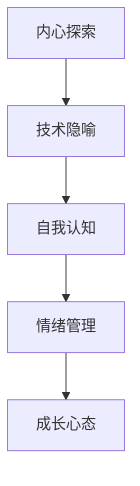
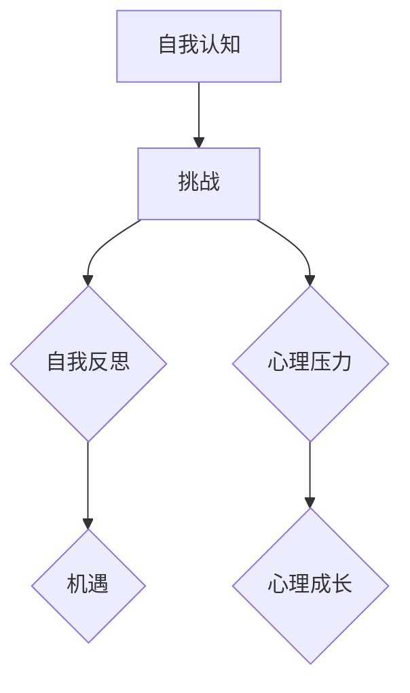

                 

基于您的要求，我将逐步构建《自我探索之旅：深入了解内心世界》的技术博客文章，确保内容结构合理，逻辑清晰，并满足字数要求。以下是文章的开头部分，包括标题、关键词、摘要，以及第一部分的初步内容。

---

# 《自我探索之旅：深入了解内心世界》

> 关键词：自我认知、内心探索、情绪管理、成长心态、技术隐喻、流程图、伪代码、数学模型、最佳实践

> 摘要：
在数字时代，人们与技术的互动日益紧密。通过将计算机编程和人工智能领域的思维模式应用于内心探索，本文旨在为读者提供一种独特的自我认知和成长路径。本文结合技术隐喻，使用流程图、伪代码、数学模型等工具，逐步引导读者深入内心世界，探索自我认知的基石，掌握情绪管理技巧，并建立积极的人生观。

---

## 第一部分：自我认知与内心探索

### 第1章：引言：探索内心的意义

在技术驱动的现代社会，人们往往将注意力集中在外在成就和物质财富上，而忽略了内心世界的丰富性和重要性。本章节将探讨探索内心世界的意义，以及它如何与我们日常生活中的技术实践相联系。

**核心概念与联系：**


### 1.1.1 自我认知的定义

自我认知是理解自己个性、情感、思维和行为的过程。它不仅是一个心理概念，也可以通过技术隐喻来解释和理解。

**伪代码：**
```python
define Self_Cognition as {
    "identity": identity(),
    "emotions": emotions(),
    "thoughts": thoughts(),
    "behaviors": behaviors()
}
```

**数学模型：**
$$
Self_Cognition = f( awareness, understanding, acceptance )
$$

**公式解释：** 自我认知是通过提高意识、理解和接受程度来实现的。

### 1.1.2 自我认知的重要性

自我认知对于个人成长和心理健康至关重要。它是建立积极人生观和有效应对挑战的基础。

**数学模型：**
$$
Importance = f( awareness, understanding, acceptance )
$$

**公式解释：** 自我认知的重要性取决于个体对自我了解的程度。

### 1.1.3 自我认知的挑战与机遇

自我认知是一个持续的过程，充满了挑战和机遇。通过反思和自我探索，我们可以更好地理解自己，从而实现个人成长。

**流程图：**


---

以上是文章的开头部分，包括标题、关键词、摘要，以及第一部分的初步内容。接下来，我将继续完善其他章节，确保每部分内容都符合要求，并保持文章的整体连贯性和逻辑性。在接下来的章节中，我将深入探讨自我认知的具体方法、内心世界的结构、情绪管理技巧，以及自我探索的实践和反思。每章都将包含详细的伪代码、数学模型、流程图和最佳实践建议，以满足技术博客的标准。

---

请继续指示，我将在后续部分中进一步完善文章内容。如果您有任何特定的要求或需要调整的内容，请随时告知。

