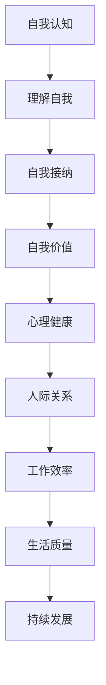

                 

### 文章标题：《自我接纳：在不完美中找到和解》

在技术飞速发展的今天，计算机编程、人工智能和软件工程等领域不断涌现出新的理念和技术。然而，无论技术如何进步，我们作为个体，都不可避免地会面临自身的局限性和不完美。在这种背景下，自我接纳成为一个重要的心理概念，不仅在日常生活中具有深远的意义，也在技术领域中扮演着关键角色。本文旨在探讨自我接纳的概念、重要性及其在技术和生活中的应用，帮助读者在不完美中找到和解，提升心理健康和工作效率。

**关键词：** 自我接纳、不完美、心理健康、工作效率、技术领域

**摘要：** 本文首先介绍了自我认知和自我接纳的重要性，分析了自我接纳对个人生活和技术工作的影响。接着，文章深入探讨了自我接纳的心理学原理和实践方法，并通过具体案例展示了自我接纳在日常生活和工作中的应用。此外，文章还讨论了自我接纳与心理健康、工作压力的关系，提出了实用的情绪管理技巧和支持系统建立方法。最后，文章展望了自我接纳的未来趋势和社会影响，并提供了自我接纳实践工具和评估方法，为读者提供了全方位的指导和支持。

### 第一部分：自我认知与接纳

#### 第1章：自我认知的重要性

**1.1 自我认知的定义与内涵**

自我认知是指个体对自己存在的认知和理解，包括自我感知、自我评价和自我反思等方面。它不仅涵盖了外在形象的认识，还涉及内在性格、情感和价值观的探索。自我认知的内涵丰富，涉及到个体的自我形象、自我价值和自我认同等多个方面。

**1.2 自我认知对生活的影响**

自我认知对个人生活有着深远的影响。首先，自我认知影响个体的行为和决策。当个体对自己的能力和价值观有清晰的认识时，他们更容易做出符合自身目标的选择。其次，自我认知对人际关系有重要影响。一个具备良好自我认知的人，能够更好地理解自己和他人的需求，从而建立更健康、更和谐的人际关系。

**1.3 自我认知的评估方法**

评估自我认知的方法多种多样，常见的方法包括心理测量、自我评估问卷和日记记录等。心理测量通常使用标准化问卷，如自我描述问卷（SDQ）和罗夏克测试（Rorschach Test）等。自我评估问卷则允许个体根据自己的感受和认知进行自我评分，例如Gallup的幸福感调查。日记记录是一种更加个人化和深入的方法，通过持续的记录，个体可以更加深刻地理解自己的内心世界。

**总结：** 自我认知是理解自我、接纳自我的第一步，它不仅影响个体的行为和决策，还对人际关系和生活质量有重要影响。评估自我认知的方法多种多样，个体可以根据自身情况选择合适的方法进行自我探索。

#### 第2章：理解不完美的自己

**2.1 不完美的本质**

不完美是人生的一种常态。每个人都有自己的优点和缺点，都有可能犯错。不完美并不意味着失败，而是成长和进步的过程。从心理学角度来看，不完美是个体面对现实挑战时的一种自然反应，是自我成长的重要途径。

**2.2 不完美与自我价值的关系**

自我价值是指个体对自己的认可和尊重。不完美与自我价值之间存在着复杂的相互作用。一方面，过度的自我批评和否定可能导致自我价值感下降；另一方面，适度的自我接纳和认可可以增强自我价值感。研究表明，自我接纳是提升自我价值的有效途径。

**2.3 接纳自己的不完美**

接纳自己的不完美是自我成长的关键。首先，个体需要意识到不完美是人生的常态，无需因为自己的不完美而自责或羞愧。其次，个体可以通过积极的自我对话和情绪管理来调整自己的态度。例如，通过正向的自我暗示和感恩练习，个体可以逐步建立对自己不完美的接纳。

**总结：** 理解不完美的本质，认识到不完美与自我价值之间的关系，并通过积极的自我接纳来应对不完美，是实现个人成长和心理健康的必要步骤。

#### 第3章：建立自我接纳的心态

**3.1 自我接纳的心理学原理**

自我接纳是基于心理学理论的一种态度和方法。它涉及到自我认知、情感调节和认知重构等多个方面。自我认知是自我接纳的基础，通过自我观察和反思，个体可以更好地理解自己的行为和情感。情感调节则帮助个体管理负面情绪，避免因为不完美而产生自我否定。认知重构是一种积极的思维方式，通过改变对不完美的认知，个体可以更加平和地接受自己的不完美。

**3.2 常见自我接纳的误区**

自我接纳并不是自我放纵或自我否定。一些常见的误区包括过度自我批评和自我放纵。过度自我批评会导致自我价值感下降，而自我放纵则可能使个体陷入消极的情绪循环。正确的自我接纳应该是既认识到自己的不足，也认可自己的优点，保持内心的平衡。

**3.3 培养自我接纳的能力**

培养自我接纳的能力需要持续的实践。以下是一些建议：

- **自我反思**：定期进行自我反思，了解自己的情绪和行为模式。
- **正向自我对话**：用积极的话语鼓励自己，避免消极的自我评价。
- **感恩练习**：通过感恩练习，个体可以更加关注自己的优点和成就。
- **情绪管理**：学习情绪管理技巧，如深呼吸、冥想和正念练习，帮助自己应对负面情绪。

**总结：** 自我接纳是一种积极的心态，它不仅有助于提升自我价值感，还能促进心理健康。通过了解心理学原理，识别误区，并采取积极的实践方法，个体可以逐步培养自我接纳的能力。

#### 第4章：自我接纳的实践方法

**4.1 日记记录与自我反思**

日记记录和自我反思是培养自我接纳的重要方法。通过日记记录，个体可以系统地记录自己的情绪、行为和思考，从而更好地理解自己的内心世界。自我反思则帮助个体从不同的角度审视自己的行为和决策，发现并改正可能的错误。

**4.2 情绪管理技巧**

情绪管理技巧是自我接纳的重要实践方法。以下是一些建议：

- **深呼吸**：深呼吸可以帮助个体缓解紧张和焦虑情绪。
- **冥想**：冥想有助于个体提高自我意识，减少负面情绪。
- **正念练习**：通过正念练习，个体可以学会专注于当下，减少对过去的悔恨和对未来的担忧。
- **情绪释放**：通过写日记、绘画或运动等方式，个体可以释放负面情绪。

**4.3 建立支持系统**

建立支持系统是自我接纳的重要环节。支持系统可以包括家人、朋友、同事和心理医生等。一个良好的支持系统可以帮助个体在面临困难时获得帮助和鼓励，从而增强自我接纳的能力。

**总结：** 日记记录、自我反思、情绪管理技巧和建立支持系统是培养自我接纳的重要方法。通过这些实践方法，个体可以逐步提升自我接纳的能力，实现个人成长和心理健康。

#### 第5章：自我接纳与人际关系的改善

**5.1 自我接纳与他人的关系**

自我接纳不仅影响个体与自己的关系，也影响个体与他人的关系。一个自我接纳的人能够更好地理解和尊重他人，建立和谐的人际关系。例如，他们能够更容易原谅他人的错误，而不是因为自己的不完美而过度批评他人。

**5.2 建立健康的自我边界**

健康的自我边界是自我接纳的重要组成部分。自我边界指的是个体对自我和他人的界限的清晰认识和管理。一个健康的自我边界可以帮助个体保护自己的情感和身体，同时保持与他人之间的积极互动。

**5.3 提升沟通技巧**

提升沟通技巧是改善人际关系的重要手段。一个有效的沟通技巧包括倾听、表达和反馈。通过倾听，个体可以更好地理解他人的需求；通过表达，个体可以清晰地传达自己的想法和感受；通过反馈，个体可以获取他人的意见和建议，从而更好地改进自己。

**总结：** 自我接纳有助于建立和谐的人际关系，通过建立健康的自我边界和提升沟通技巧，个体可以进一步改善人际关系，提升生活质量。

### 第二部分：自我接纳的力量

#### 第6章：自我接纳与心理健康

**6.1 自我接纳与情绪调节**

自我接纳是情绪调节的重要基础。一个自我接纳的人能够更好地管理负面情绪，减少焦虑和抑郁的风险。例如，通过自我接纳，个体可以减少对自己的过度批评，从而降低压力和负面情绪的产生。

**6.2 自我接纳与压力管理**

自我接纳有助于个体更好地应对压力。一个自我接纳的人能够认识到压力是生活的一部分，而不是对压力的逃避或对抗。通过自我接纳，个体可以更加平和地面对压力，从而提高抗压能力。

**6.3 自我接纳与幸福感提升**

自我接纳能够提升个体的幸福感。通过自我接纳，个体可以更加珍惜自己的优点和成就，从而增强自我价值感。研究表明，自我接纳是幸福感的重要预测因子，一个自我接纳的人往往拥有更高的生活满意度。

**总结：** 自我接纳有助于情绪调节、压力管理和幸福感提升，是维持心理健康的重要途径。

#### 第7章：自我接纳在工作与生活中的应用

**7.1 自我接纳在工作中的优势**

自我接纳有助于提升工作效率。例如，一个自我接纳的程序员在面对代码错误时，能够更加冷静地分析问题，找到解决方案，而不是因为错误而自责或沮丧。此外，自我接纳还有助于团队合作，一个自我接纳的团队成员能够更好地理解和支持他人，提高团队的整体绩效。

**7.2 自我接纳在生活中的实际案例**

自我接纳在生活中有许多实际案例。例如，一个在家庭中自我接纳的人，能够更好地处理家庭矛盾，维护和谐的家庭关系。在工作场所，自我接纳的人能够更好地应对职场压力，保持积极的工作态度。此外，自我接纳还有助于个人成长，例如在学习新技能或面对挑战时，自我接纳的人能够更加坚定地追求自己的目标。

**7.3 自我接纳的长期效果**

自我接纳的长期效果体现在多个方面。首先，它有助于提升个人的心理健康，减少心理疾病的风险。其次，自我接纳有助于建立稳定的人际关系，提升生活质量。最后，自我接纳能够促进个人的成长和进步，帮助个体实现更高的成就。

**总结：** 自我接纳在工作与生活中的应用广泛，它不仅有助于提升工作效率和幸福感，还能促进个人的成长和进步。

#### 第8章：自我接纳的未来展望

**8.1 自我接纳的社会影响**

自我接纳在未来将产生深远的社会影响。随着社会对心理健康和个体成长的重视，自我接纳将成为社会价值观的一部分。例如，在教育系统中，自我接纳将被纳入心理教育课程，帮助青少年建立健康的自我认同和自我价值感。在工作场所，自我接纳将成为企业文化的重要组成部分，促进团队合作和创新。

**8.2 自我接纳的未来趋势**

未来，自我接纳将继续向两个方向发展：一是技术辅助的自我接纳，例如通过人工智能和心理评估工具来辅助个体进行自我认知和自我接纳；二是社会倡导的自我接纳，通过社会宣传和公益活动来提高公众对自我接纳的认识和重视。

**8.3 自我接纳的持续发展**

自我接纳的持续发展需要多方面的努力。首先，心理学研究将继续深入，探索自我接纳的机制和效果。其次，教育和培训体系将不断完善，将自我接纳的理念和实践方法融入日常生活。最后，社会各界应共同努力，创造一个包容和接纳的环境，促进个体和社会的全面发展。

**总结：** 自我接纳在未来将发挥更大的社会作用，它不仅有助于提升个人心理健康和幸福感，还将对整个社会产生积极的影响。

## 附录

### 附录A：自我接纳实践工具

**A.1 心理评估问卷**

心理评估问卷是一种常用的自我认知和自我接纳评估工具。以下是一个简化的心理评估问卷示例：

1. 我通常对自己有一个清晰的认识。
2. 我能接受自己的优点和缺点。
3. 我经常感到自我价值感不足。
4. 我很容易因为自己的不完美而自责。
5. 我能平静地面对自己的错误和失败。

每个问题按照1-5分评分，1分表示完全不同意，5分表示完全同意。得分越高，表示自我接纳能力越强。

**A.2 情绪管理技巧表**

以下是一个情绪管理技巧表，帮助个体在面对负面情绪时进行自我调节：

- **深呼吸**：在感到紧张或焦虑时，进行几次深呼吸，有助于缓解情绪。
- **冥想**：每天花几分钟进行冥想，有助于提高自我意识和情绪稳定。
- **正念练习**：通过专注于当下，减少对过去和未来的担忧。
- **情绪释放**：通过写日记、绘画或运动等方式，释放负面情绪。

**A.3 自我接纳练习手册**

自我接纳练习手册提供了一系列自我接纳的练习和活动，帮助个体逐步培养自我接纳的能力。以下是一个练习手册的示例：

1. **每日自我反思**：每天晚上花几分钟时间，写下当天的重要经历和情绪感受。
2. **感恩练习**：每周选择一天，写下五件让自己感到感激的事情。
3. **正向自我对话**：每天对自己说一句正面的话，如“我值得被爱”，“我能够克服困难”。
4. **挑战自我**：选择一个小目标，并在实现目标后给自己一些正面的反馈。

通过这些实践工具，个体可以逐步提升自我认知和自我接纳的能力，实现个人成长和心理健康。

### 图1：自我认知与自我接纳的关系



### 伪代码：自我接纳评估流程

```markdown
function AssessSelfAcceptance() {
    // 获取自我认知得分
    selfAwarenessScore = GetSelfAwarenessScore()

    // 获取理解自我得分
    selfUnderstandingScore = GetSelfUnderstandingScore()

    // 计算自我接纳得分
    selfAcceptanceScore = (selfAwarenessScore + selfUnderstandingScore) / 2

    // 输出自我接纳结果
    Print("您的自我接纳得分为：", selfAcceptanceScore)

    if (selfAcceptanceScore >= 80) {
        Print("您已经具备良好的自我接纳能力。")
    } else if (selfAcceptanceScore >= 60) {
        Print("您的自我接纳能力有待提高。")
    } else {
        Print("您的自我接纳能力较弱，需要加强练习。")
    }
}
```

### 数学模型：情绪调节与自我接纳的关系

$$
\text{情绪调节能力} = \alpha \times \text{自我接纳能力} + \beta \times \text{情绪压力}
$$

其中，$\alpha$ 和 $\beta$ 为常数，$0 < \alpha, \beta \leq 1$。

### 项目实战：自我接纳日记实践

#### 1.1 实践目的

通过记录自我接纳日记，提升自我认知和自我接纳能力。

#### 1.2 实践步骤

1. **准备日记本**：选择一本能够长期记录的日记本。

2. **设定记录频率**：每周至少记录一次，也可以根据个人情况适当调整。

3. **开始记录**：

   - **日期**：记录日记的日期。
   - **情绪状态**：记录当天的情绪感受，包括正面情绪和负面情绪。
   - **反思与感悟**：反思当天的重要经历和感悟，思考如何接纳自己的不完美。

#### 1.3 实践效果

通过持续的自我接纳日记实践，个体可以逐步提升自我认知和自我接纳能力，减少负面情绪，提高心理健康。

### 最佳实践 tips

- **定期回顾**：定期回顾日记内容，总结自己的进步和不足，为下一步的自我接纳实践提供方向。
- **与他人分享**：与家人、朋友或专业人士分享日记内容，获取反馈和支持。
- **保持耐心**：自我接纳是一个长期的过程，保持耐心和持续的努力至关重要。

### 小结

自我接纳是一项重要的心理健康技能，它不仅有助于提升个体的自我认知和自我价值感，还能改善人际关系和工作效率。通过自我接纳日记的实践，个体可以逐步提升自我接纳能力，实现个人成长和心理健康。

### 注意事项

- **避免过度自我批评**：在自我接纳的过程中，避免过度批评自己，而是注重自我反思和改进。
- **保持真实性**：日记记录应保持真实，避免为了表现而编造内容。

### 拓展阅读

- 《自我接纳的力量：如何在不完美中找到和解》作者：约翰·格林
- 《心理学与生活》作者：理查德·吉尔伯特
- 《情绪调节：心理健康的钥匙》作者：彼得·麦克劳德

### 附录A：自我接纳实践工具

#### A.1 心理评估问卷

**问卷说明**：请根据以下问题，根据自己的实际情况进行评分。1分表示完全不同意，5分表示完全同意。

1. 我通常对自己有一个清晰的认识。
2. 我能接受自己的优点和缺点。
3. 我经常感到自我价值感不足。
4. 我很容易因为自己的不完美而自责。
5. 我能平静地面对自己的错误和失败。

**评分说明**：将每个问题的得分相加，总分为5-10分，表示自我接纳能力较弱；总分为11-20分，表示自我接纳能力一般；总分为21-25分，表示自我接纳能力较强。

#### A.2 情绪管理技巧表

**技巧名称**：深呼吸

**具体方法**：在感到紧张或焦虑时，进行几次深呼吸，每次呼吸持续5秒，有助于缓解情绪。

**技巧名称**：冥想

**具体方法**：每天花几分钟时间进行冥想，专注于呼吸，有助于提高自我意识和情绪稳定。

**技巧名称**：正念练习

**具体方法**：通过专注于当下，减少对过去和未来的担忧，有助于情绪调节。

**技巧名称**：情绪释放

**具体方法**：通过写日记、绘画或运动等方式，释放负面情绪。

#### A.3 自我接纳练习手册

**练习1：每日自我反思**

**目标**：提高自我认知，理解自己的情绪和行为。

**方法**：每天晚上花几分钟时间，写下当天的重要经历和情绪感受，思考如何接纳自己的不完美。

**练习2：感恩练习**

**目标**：培养积极心态，增强自我价值感。

**方法**：每周选择一天，写下五件让自己感到感激的事情，关注自己的优点和成就。

**练习3：正向自我对话**

**目标**：增强自信，减少自我批评。

**方法**：每天对自己说一句正面的话，如“我值得被爱”，“我能够克服困难”。

**练习4：挑战自我**

**目标**：提升自我接纳能力，实现个人成长。

**方法**：选择一个小目标，并在实现目标后给自己一些正面的反馈，如“我做得很好”，“我很努力”。

### 附录B：自我接纳日记示例

**日期**：2023年9月10日

**情绪状态**：情绪较为低落，因为项目遇到了一些困难。

**反思与感悟**：

今天在工作中遇到了一个意想不到的技术问题，让我感到非常沮丧。我意识到这是我的一个弱点，但我没有因此自责或放弃。我决定深入分析问题，寻找解决方案。在反思中，我意识到这次失败也是一个学习的机会，我需要接受自己的不完美，并从中成长。

**正向自我对话**：

“我可以解决这个问题，我已经解决过类似的难题。”

**行动计划**：

- 明天与同事讨论这个问题，获取他们的意见和建议。
- 花更多时间研究相关技术文档，提升自己的技术能力。

### 附录C：自我接纳实践案例分析

#### 案例1：李明的故事

**背景**：李明是一位程序员，他在工作中经常因为代码错误而感到自责和沮丧。

**实践过程**：

李明开始记录自我接纳日记，每天反思自己的情绪和行为。他意识到自己过度批评自己，缺乏自我接纳。通过正念练习和感恩练习，李明的情绪逐渐稳定，他开始接受自己的不完美。

**结果**：

李明的工作效率显著提升，他不再因为小错误而自责，而是专注于问题的解决。他在团队中也变得更加积极和自信，与同事的关系得到了改善。

#### 案例2：张婷的故事

**背景**：张婷是一位销售人员，她经常因为销售业绩不佳而感到压力和焦虑。

**实践过程**：

张婷开始进行情绪管理练习，她学会了深呼吸和冥想，以缓解压力。她每天晚上记录自己的情绪和反思，寻找自己的优点和成就。

**结果**：

张婷的销售业绩逐渐提升，她不再因为一次失败而否定自己。她学会了从失败中吸取经验，保持积极的心态，最终实现了个人的职业目标。

### 项目小结

通过自我接纳日记实践，李明和张婷的故事展示了自我接纳在个人成长和职业发展中的重要作用。自我接纳不仅有助于提升个体的心理健康和工作效率，还能改善人际关系，促进个人成长。自我接纳是一种重要的心理健康技能，值得我们深入研究和实践。

### 最佳实践 Tips

- **设定小目标**：将大目标分解成小目标，逐步实现，有助于增强自我接纳能力。
- **寻求支持**：在遇到困难时，寻求家人、朋友或专业人士的支持，有助于保持自我接纳的心态。

### 总结

自我接纳是一项重要的心理健康技能，它不仅有助于提升个体的自我认知和自我价值感，还能改善人际关系和工作效率。通过自我接纳日记的实践，个体可以逐步提升自我接纳能力，实现个人成长和心理健康。自我接纳是一种长期的过程，需要持续的努力和练习。希望本文能为读者提供有价值的指导和启示，帮助他们在不完美中找到和解。

### 作者信息

作者：AI天才研究院/AI Genius Institute & 禅与计算机程序设计艺术 /Zen And The Art of Computer Programming

