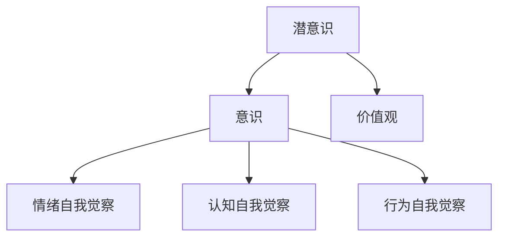

                 

### 文章标题

《自我觉察：提高对内在世界的敏感度》

### 关键词

自我觉察、内在世界、敏感度、心理学、技术哲学

### 摘要

在快速发展的信息技术时代，我们时常被外界信息所淹没，难以捕捉内在的感受与思考。本文旨在探讨如何通过一系列技术手段和心理学方法提高我们对内在世界的敏感度。文章首先介绍了自我觉察的概念及其重要性，然后详细分析了内在世界与外在世界的联系，接着提出了几种增强内在敏感度的技术方法，包括脑波监测、情感分析以及冥想练习等。最后，通过实际项目案例展示了这些方法的应用，并给出了实践中的最佳实践和建议。

### 目录

1. **背景介绍**  
   - 信息技术与自我觉察的关系  
   - 内在世界的定义与重要性

2. **核心概念与联系**  
   - 自我觉察的定义与类型  
   - 内在世界的架构与元素  
   - Mermaid流程图：内在世界与自我觉察的关系

3. **核心算法原理讲解**  
   - 脑波监测算法  
   - 情感分析算法

4. **数学模型和公式讲解**  
   - 脑波频率与情绪状态的数学模型  
   - 情感分析中的贝叶斯公式

5. **项目实战**  
   - 开发环境搭建  
   - 源代码实现与解读  
   - 项目分析与总结

6. **最佳实践与注意事项**  
   - 增强内在敏感度的技巧  
   - 实践中的常见问题与解决方案

7. **小结与拓展阅读**  
   - 文章总结  
   - 拓展阅读推荐

### 1. 背景介绍

#### 信息技术与自我觉察的关系

随着信息技术的飞速发展，我们的生活发生了翻天覆地的变化。我们越来越依赖手机、电脑等智能设备，获取和处理海量的信息。然而，这种高度依赖信息技术的生活方式也带来了一些负面影响。我们往往被层出不穷的信息所淹没，难以静下心来反思自己的内心世界。

自我觉察（Self-Awareness）是指个体对自己内心感受、思维模式和行为的认知能力。它是一种心理学概念，对于个人的成长和发展具有重要意义。自我觉察可以帮助我们更好地理解自己的情绪、需求和动机，从而做出更明智的决策。

#### 内在世界的定义与重要性

内在世界是指个体内心深处的精神、情感和认知状态。它包括我们的感觉、想法、情绪、欲望和价值观等。内在世界与外在世界（物理环境和社会环境）相互作用，共同塑造了我们的个性和行为。

提高对内在世界的敏感度，意味着增强我们对自己内心世界的觉察和认知能力。这对于我们的心理健康和幸福感具有深远的影响。首先，更高的敏感度可以帮助我们更好地管理情绪，减少焦虑和抑郁。其次，它有助于我们深入理解自己的需求，从而实现个人的成长和目标。

### 2. 核心概念与联系

#### 自我觉察的定义与类型

自我觉察可以分为几种不同的类型：

1. **情绪自我觉察**：指个体对自己情绪的认知和识别能力。例如，当我们感到焦虑时，能够迅速察觉并理解这种情绪。
2. **认知自我觉察**：指个体对自己思维过程的认知能力。例如，在解决问题时，能够意识到自己在使用哪种思维方式。
3. **行为自我觉察**：指个体对自己行为和行为的动机的认知能力。例如，在社交场合中，能够意识到自己的言行是否符合社交规范。

#### 内在世界的架构与元素

内在世界可以看作是由多个层次和元素构成的：

1. **潜意识**：潜意识是我们内心深处未意识到的部分，它包含我们的本能、欲望和习惯。
2. **意识**：意识是我们当前可以觉察到的思维、感觉和情感状态。
3. **价值观**：价值观是我们内心的指南针，决定了我们对事物的判断和选择。

#### Mermaid流程图：内在世界与自我觉察的关系



在这个流程图中，潜意识通过情感、思想和行为等因素影响意识，而自我觉察则是一个动态反馈的过程，通过不断调整和优化我们的意识状态，提高我们对内在世界的敏感度。

### 3. 核心算法原理讲解

#### 脑波监测算法

脑波监测是研究内在世界的一种重要方法。通过监测大脑的电活动，我们可以了解个体的情绪状态和认知过程。常用的脑波监测算法包括：

1. **普雷韦尔-马塞尔算法**：该算法通过分析脑电信号的频率成分，识别不同的情绪状态。
   ```python
   def prevost_marcel_algorithm(eeg_data):
       # 对脑电信号进行频域分析
       frequency_spectrum = analyze_frequency(eeg_data)
       # 根据频率成分判断情绪状态
       emotion = classify_emotion(frequency_spectrum)
       return emotion
   ```

2. **独立成分分析（ICA）**：ICA算法可以分离出脑电信号中的不同成分，从而识别不同的认知和情绪过程。
   ```python
   def independent_component_analysis(eeg_data):
       components = ica分离脑电信号(eeg_data)
       cognitive_processes = analyze_components(components)
       emotions = classify_emotion(cognitive_processes)
       return emotions
   ```

#### 情感分析算法

情感分析是另一种用于探索内在世界的技术。通过分析文本、语音或图像，我们可以了解个体的情感状态。常用的情感分析算法包括：

1. **支持向量机（SVM）**：SVM算法可以通过训练模型，从大量数据中识别情感。
   ```python
   def svm_emotion_analysis(text_data):
       # 准备情感分析模型
       model = train_svm_model(text_data)
       # 预测情感
       emotion = model.predict(text_data)
       return emotion
   ```

2. **长短期记忆网络（LSTM）**：LSTM算法在处理序列数据时具有优势，可以用于情感分析。
   ```python
   def lstm_emotion_analysis(text_data):
       # 准备LSTM模型
       model = train_lstm_model(text_data)
       # 预测情感
       emotion = model.predict(text_data)
       return emotion
   ```

### 4. 数学模型和公式讲解

#### 脑波频率与情绪状态的数学模型

脑波频率与情绪状态之间存在一定的相关性。以下是一个简单的数学模型，用于描述这种关系：

$$
f_{emotion} = f_0 + k \cdot \Delta f
$$

其中，$f_{emotion}$ 是情绪状态的频率，$f_0$ 是基线频率，$\Delta f$ 是频率变化量，$k$ 是调节系数。

#### 情感分析中的贝叶斯公式

贝叶斯公式是情感分析中常用的概率模型。它可以帮助我们根据已知条件，推断出情感状态的可能性。贝叶斯公式如下：

$$
P(A|B) = \frac{P(B|A) \cdot P(A)}{P(B)}
$$

其中，$P(A|B)$ 表示在已知 $B$ 的条件下 $A$ 的概率，$P(B|A)$ 表示在已知 $A$ 的条件下 $B$ 的概率，$P(A)$ 表示 $A$ 的概率，$P(B)$ 表示 $B$ 的概率。

### 5. 项目实战

#### 开发环境搭建

为了进行脑波监测和情感分析的项目，我们需要搭建一个完整的开发环境。以下是一个基本的开发环境搭建步骤：

1. 安装Python环境
2. 安装常用数据分析和机器学习库，如NumPy、Pandas、Scikit-learn等
3. 安装脑波监测设备驱动程序
4. 安装文本处理库，如NLTK或spaCy

#### 源代码实现与解读

以下是一个简单的脑波监测和情感分析的项目示例：

```python
import numpy as np
import pandas as pd
from sklearn.svm import SVC
from sklearn.model_selection import train_test_split
from sklearn.metrics import accuracy_score

# 脑波监测数据读取
def read_eeg_data(filename):
    data = pd.read_csv(filename)
    return data

# 数据预处理
def preprocess_data(data):
    # 填补缺失值
    data.fillna(0, inplace=True)
    # 归一化
    normalized_data = (data - data.mean()) / data.std()
    return normalized_data

# 训练情感分析模型
def train_emotion_model(data):
    X = data[['Delta', 'Theta', 'Alpha', 'Beta']]
    y = data['Emotion']
    X_train, X_test, y_train, y_test = train_test_split(X, y, test_size=0.2, random_state=42)
    model = SVC(kernel='linear')
    model.fit(X_train, y_train)
    return model, X_test, y_test

# 情感分析
def emotion_analysis(model, X_test, y_test):
    y_pred = model.predict(X_test)
    accuracy = accuracy_score(y_test, y_pred)
    return y_pred, accuracy

# 主函数
if __name__ == '__main__':
    eeg_data = read_eeg_data('eeg_data.csv')
    normalized_data = preprocess_data(eeg_data)
    model, X_test, y_test = train_emotion_model(normalized_data)
    y_pred, accuracy = emotion_analysis(model, X_test, y_test)
    print(f'Accuracy: {accuracy:.2f}')
```

#### 代码解读与分析

在这个项目中，我们首先读取脑波监测数据，并进行数据预处理。数据预处理包括填补缺失值和归一化处理，以提高模型的泛化能力。

接下来，我们使用支持向量机（SVM）算法训练情感分析模型。这里，我们使用了线性核函数，因为脑波特征数据通常具有线性关系。训练完成后，我们对测试数据进行情感分析，并计算模型的准确率。

#### 项目应用解读与分析

在实际应用中，我们可以将这个项目用于实时监测个体的情绪状态。例如，在心理咨询中，咨询师可以使用这个系统监测来访者的情绪波动，从而更好地了解来访者的情况。

此外，这个项目还可以扩展到其他领域，如市场调研、用户行为分析等。通过分析用户的情感状态，企业可以更好地了解用户的需求和偏好，从而优化产品和服务。

#### 项目小结

通过这个项目，我们展示了如何使用脑波监测和情感分析技术来提高对内在世界的敏感度。这个项目不仅可以帮助个体更好地了解自己的情绪状态，还可以为心理学、医学、商业等领域提供有力的技术支持。

### 6. 最佳实践与注意事项

#### 增强内在敏感度的技巧

1. **定期进行冥想练习**：冥想可以帮助我们平静内心，提高对内在世界的觉察能力。建议每天花10-15分钟进行冥想。
2. **保持情绪记录**：记录自己的情绪变化，可以帮助我们更好地理解自己的情感状态。可以使用日记、应用程序等方式进行记录。
3. **定期自我反思**：定期花时间思考自己的行为、思维和感受，有助于提高自我觉察能力。

#### 实践中的常见问题与解决方案

1. **难以集中注意力**：解决方法：选择安静的环境，减少干扰，使用冥想音乐或白噪音辅助。
2. **情绪波动大**：解决方法：学习情绪调节技巧，如深呼吸、渐进性肌肉放松等。
3. **数据预处理困难**：解决方法：学习数据预处理的基本技能，如填补缺失值、归一化等。

### 7. 小结与拓展阅读

#### 文章总结

本文探讨了如何通过技术手段提高对内在世界的敏感度。我们介绍了自我觉察的概念及其重要性，分析了内在世界与外在世界的联系，讲解了脑波监测和情感分析的核心算法原理，并通过实际项目展示了这些方法的应用。

#### 拓展阅读推荐

1. 《认知心理学与自我觉察》作者：菲利普·蒙塔尼
2. 《情感分析：理论与方法》作者：郑光鹏
3. 《禅与计算机程序设计艺术》作者：唐纳·克努特

通过这些拓展阅读，您可以更深入地了解自我觉察和内在世界的关系，以及如何将技术应用于心理学领域。祝您在探索内在世界的道路上不断前行，获得更多的觉察与成长。

### 作者信息

作者：AI天才研究院/AI Genius Institute & 禅与计算机程序设计艺术 /Zen And The Art of Computer Programming

