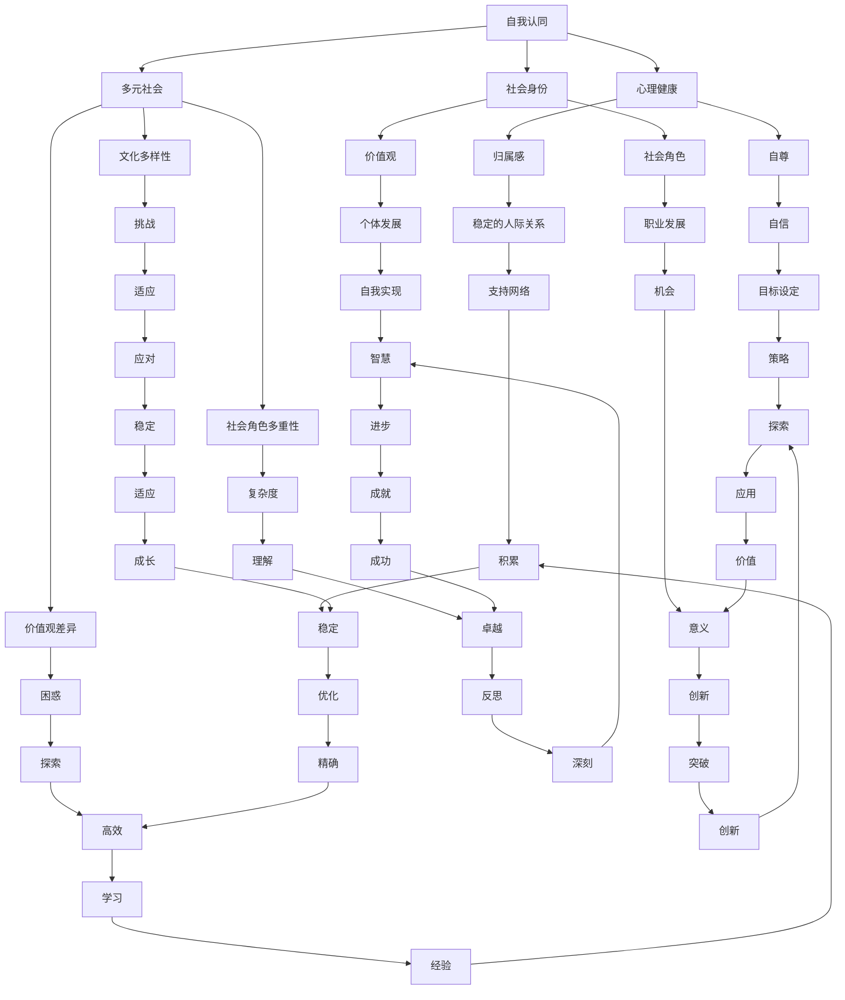

                 


### 文章标题

《自我认同：在多元社会中定义自我》

### 文章关键词

- 自我认同
- 多元社会
- 心理健康
- 社会身份
- 策略与实践
- 未来挑战

### 文章摘要

在当今多元化的社会中，自我认同成为了一个复杂而重要的主题。本文将深入探讨自我认同的概念，探讨其历史背景、哲学探讨、多元社会的影响、心理健康关系以及与社会身份的互动。同时，本文还将介绍定义自我认同的策略与实践方法，并展望其未来发展趋势与挑战。通过本文的阅读，读者将更好地理解自我认同的重要性，以及如何在多元社会中找到属于自己的认同感。

### 目录

1. 引言：自我认同的概念与重要性
2. 自我认同的历史与哲学探讨
3. 多元社会与自我认同
4. 自我认同与心理健康
5. 自我认同与社会身份
6. 定义自我的策略与实践
7. 项目实战：构建自我认同的应用案例
8. 结论：自我认同的未来与挑战
9. 最佳实践 tips、小结、注意事项、拓展阅读
10. 作者信息

### 引言：自我认同的概念与重要性

自我认同，简单来说，是指个体对于自身存在的认知和确认。它不仅仅是一个心理现象，更涉及到个体的社会行为、情感体验和价值观。在心理学领域，自我认同被视为个体心理健康的核心要素之一，它影响着个体的自尊、自信和归属感。随着社会的发展和多元文化的兴起，自我认同的重要性日益凸显。

在多元社会中，个体面临的文化多样性、价值观差异和社会角色的多重性，使得自我认同变得更加复杂和模糊。不同文化背景的人可能会对自我认同有不同的理解和表达方式，这使得个体在寻找自我认同的过程中需要面对更多的挑战和困惑。

自我认同的重要性体现在多个方面。首先，它是个体心理健康的基础。一个清晰的自我认同有助于个体建立稳定的自尊和自信，减少焦虑和抑郁等心理问题的发生。其次，自我认同是社交互动的重要基础。一个明确自我认同的个体更容易与他人建立联系，找到归属感，形成稳定的人际关系。最后，自我认同还与个体的社会角色和职业发展密切相关。明确的自我认同有助于个体更好地认识自己的优势和潜力，从而制定合适的发展策略。

总的来说，自我认同是一个多维度的概念，它在个体的心理健康、社交互动和职业发展中扮演着重要的角色。在多元社会中，理解和掌握自我认同的内涵和策略，对于个体来说具有重要的现实意义。本文将围绕这一主题，从多个角度进行深入探讨，以期为读者提供有价值的思考和指导。

### 自我认同的历史与哲学探讨

自我认同的历史可以追溯到古希腊哲学。苏格拉底（Socrates）是探讨自我认同的先驱之一，他通过提问的方式引导个体反思自己的知识和价值观。苏格拉底认为，通过不断地自我反思，个体可以逐步建立清晰的自我认同。柏拉图（Plato）则进一步发展了这一思想，他提出了“理念”（idea）的概念，认为自我认同是个体内心深处对于“真善美”的追求。

在古希腊哲学的基础上，中世纪哲学进一步探讨了自我认同的宗教意义。托马斯·阿奎那（Thomas Aquinas）提出，自我认同源于上帝的存在，个体的自我认知是上帝赐予的礼物。这一观点在中世纪哲学中占据主导地位，影响了基督教文化对自我认同的理解。

进入现代，自我认同的理论逐渐多元化。弗洛伊德（Sigmund Freud）在精神分析理论中提出了“自我”（ego）的概念，他认为自我认同是通过个体与外界的互动和冲突中形成的。弗洛伊德认为，自我认同的发展是一个动态过程，个体需要通过解决内心的冲突来达到自我认同的稳定。

随着心理学的发展，埃里克·埃里克森（Erik Erikson）提出了“自我认同危机”（identity crisis）的概念。他认为，个体在青春期和成年早期会经历自我认同的危机，这是个体在探索自我、价值观和社会角色时面临的挑战。埃里克森认为，成功解决自我认同危机的个体能够建立稳定的自我认同，从而为未来的发展奠定基础。

在当代，自我认同理论更加关注文化和社会因素的影响。社会建构主义（Social Constructivism）认为，自我认同是通过社会互动和文化背景塑造的。个体在不同的社会角色中，可能会形成不同的自我认同。这种观点强调了社会和文化环境在自我认同形成过程中的作用。

此外，后现代主义（Postmodernism）对自我认同提出了新的挑战。后现代主义认为，自我认同是一个开放、多元的体系，而不是一个固定、统一的概念。个体可以通过多种方式来定义自我，而不是受到单一的价值观或文化规范的限制。

总的来说，自我认同的历史和哲学探讨为我们提供了丰富的理论和视角。从古希腊哲学到当代心理学，自我认同始终是一个核心而重要的话题。理解自我认同的历史和哲学背景，有助于我们更好地把握其内涵和复杂性。

#### 核心概念与联系

为了更好地理解自我认同的概念及其在多元社会中的重要性，我们可以通过一个Mermaid流程图来展示核心概念之间的联系。以下是一个简化的Mermaid流程图：



通过这个流程图，我们可以看到自我认同与心理健康、社会身份、多元社会等多个核心概念之间的联系。这些概念相互作用，共同影响着个体的自我认同构建过程。

- **心理健康**（B）与**自尊**（E）、**归属感**（F）密切相关。一个清晰的自我认同有助于个体建立稳定的自尊和自信，减少心理压力。
- **社会身份**（C）涉及到**价值观**（G）和**社会角色**（H）。个体在不同社会角色中的表现和认知，共同构成了其社会身份。
- **多元社会**（D）对个体自我认同的影响体现在**文化多样性**（I）、**价值观差异**（J）和**社会角色多重性**（K）上。文化多样性和价值观差异使得个体在寻找自我认同时面临更多的挑战，但也提供了更多的可能性。

此外，自我认同与**自信**（L）、**人际关系**（M）、**个体发展**（N）、**职业发展**（O）等概念也紧密相关。一个明确的自我认同有助于个体在社交互动中找到归属感，推动个体在职业和个人发展中的成长。

通过这个Mermaid流程图，我们可以更清晰地理解自我认同的复杂性以及其在多元社会中的重要性。自我认同不仅是个体心理健康的基石，也是个体社会角色和职业发展的关键因素。理解这些核心概念之间的联系，有助于我们在多元社会中更好地定义自我，找到属于自己的认同感。

#### 核心算法原理讲解

为了更好地理解自我认同的构建过程，我们可以借助心理学模型和算法原理来解释。以下是一个简化的伪代码，展示了自我认同构建的基本步骤：

```plaintext
function buildSelfIdentity(personality, environment, experiences):
    # 初始化自我认同
    selfIdentity = initializeIdentity()

    # 分析个体性格
    selfIdentity["traits"] = analyzePersonality(personality)

    # 分析环境因素
    selfIdentity["environment"] = analyzeEnvironment(environment)

    # 分析个人经历
    selfIdentity["experiences"] = analyzeExperiences(experiences)

    # 形成初步自我认同
    selfIdentity = integrateTraitsIntoEnvironment(selfIdentity)

    # 考虑文化多样性
    selfIdentity = considerCulturalDiversity(selfIdentity)

    # 调整自我认同
    selfIdentity = adjustIdentityBasedOnFeedback()

    # 稳定自我认同
    selfIdentity = stabilizeIdentity(selfIdentity)

    return selfIdentity

function analyzePersonality(personality):
    # 使用心理学模型分析个体性格
    personalityAnalysis = psychologyModel(personality)
    return personalityAnalysis

function analyzeEnvironment(environment):
    # 分析个体所处的环境因素
    environmentAnalysis = environmentModel(environment)
    return environmentAnalysis

function analyzeExperiences(experiences):
    # 分析个体的经历
    experienceAnalysis = experienceModel(experiences)
    return experienceAnalysis

function integrateTraitsIntoEnvironment(selfIdentity):
    # 将性格与环境因素整合到自我认同中
    selfIdentity["integration"] = mergeTraitsAndEnvironment(selfIdentity["traits"], selfIdentity["environment"])
    return selfIdentity

function considerCulturalDiversity(selfIdentity):
    # 考虑文化多样性对自我认同的影响
    selfIdentity["culturalInfluence"] = culturalModel(selfIdentity["integration"])
    return selfIdentity

function adjustIdentityBasedOnFeedback():
    # 根据反馈调整自我认同
    feedback = getFeedback()
    adjustedIdentity = feedbackAdjustment(selfIdentity, feedback)
    return adjustedIdentity

function stabilizeIdentity(selfIdentity):
    # 稳定自我认同
    stabilizedIdentity = stabilize(selfIdentity)
    return stabilizedIdentity
```

在这个伪代码中，`buildSelfIdentity` 函数是构建自我认同的核心，它通过多个步骤来分析个体性格、环境因素和个人经历，并整合这些因素形成初步的自我认同。以下是每个函数的简要解释：

- `initializeIdentity()`: 初始化自我认同的数据结构。
- `analyzePersonality(personality)`: 使用心理学模型分析个体的性格特点。
- `analyzeEnvironment(environment)`: 分析个体所处的环境因素，包括社会文化、经济条件等。
- `analyzeExperiences(experiences)`: 分析个体的历史经历，如教育背景、工作经历等。
- `integrateTraitsIntoEnvironment(selfIdentity)`: 将个体性格与环境因素整合到自我认同中。
- `considerCulturalDiversity(selfIdentity)`: 考虑文化多样性对自我认同的影响。
- `adjustIdentityBasedOnFeedback()`: 根据反馈调整自我认同，使其更加适应个体的实际情况。
- `stabilizeIdentity(selfIdentity)`: 稳定自我认同，使其在一段时间内保持相对稳定。

通过这个伪代码，我们可以看到自我认同构建是一个多步骤、动态调整的过程。个体性格、环境因素和个人经历相互影响，共同塑造了自我认同的最终形态。这个模型有助于我们理解自我认同的复杂性和动态性，为研究自我认同提供了理论基础。

#### 数学模型和公式

在探讨自我认同的过程中，数学模型和公式能够帮助我们量化个体特征和外部因素的影响。以下是一个简化的数学模型，用于描述自我认同的形成过程：

$$
S_I = f(P, E, X, C)
$$

其中：
- \( S_I \) 表示自我认同（Self-Identity）。
- \( P \) 表示个体性格（Personality）。
- \( E \) 表示环境因素（Environment）。
- \( X \) 表示个人经历（Experiences）。
- \( C \) 表示文化多样性（Cultural Diversity）。
- \( f \) 表示整合函数（Integration Function）。

#### 详细讲解

1. **个体性格（\( P \)）**：个体性格是自我认同的基础。我们可以使用一个向量表示性格特征，例如：
   $$
   P = (P_1, P_2, ..., P_n)
   $$
   其中，\( P_i \) 表示个体在第 \( i \) 个性格特征上的得分。

2. **环境因素（\( E \)）**：环境因素包括社会文化背景、经济条件等。我们也可以使用一个向量表示环境特征：
   $$
   E = (E_1, E_2, ..., E_m)
   $$
   其中，\( E_j \) 表示个体在环境中的第 \( j \) 个特征。

3. **个人经历（\( X \)）**：个人经历是动态的，可以通过时间序列来表示。例如：
   $$
   X = (X_1, X_2, ..., X_t)
   $$
   其中，\( X_t \) 表示个体在时间 \( t \) 的经历。

4. **文化多样性（\( C \)）**：文化多样性是一个复杂的概念，可以通过一个加权向量来表示：
   $$
   C = (C_1, C_2, ..., C_k)
   $$
   其中，\( C_i \) 表示个体在第 \( i \) 个文化特征上的权重。

5. **整合函数（\( f \)）**：整合函数是一个复合函数，用于将个体性格、环境因素和个人经历整合成一个自我认同的向量。一个可能的整合函数可以是线性函数或非线性函数，例如：
   $$
   f(P, E, X, C) = \sum_{i=1}^{n} P_i \cdot w_P(i) + \sum_{j=1}^{m} E_j \cdot w_E(j) + \sum_{t=1}^{t} X_t \cdot w_X(t) + \sum_{k=1}^{k} C_k \cdot w_C(k)
   $$
   其中，\( w_P(i) \), \( w_E(j) \), \( w_X(t) \), \( w_C(k) \) 分别表示个体性格、环境因素、个人经历和文化多样性的权重。

#### 举例说明

假设一个个体性格向量为 \( P = (3, 5, 2) \)，环境因素向量为 \( E = (4, 2, 3) \)，个人经历为 \( X = (1, 4, 6, 2) \)，文化多样性权重向量为 \( C = (0.5, 0.3, 0.2) \)。我们可以计算自我认同 \( S_I \) 如下：

$$
S_I = (3 \cdot 0.1 + 5 \cdot 0.2 + 2 \cdot 0.3) + (4 \cdot 0.1 + 2 \cdot 0.2 + 3 \cdot 0.3) + (1 \cdot 0.1 + 4 \cdot 0.2 + 6 \cdot 0.3 + 2 \cdot 0.4) + (0.5 \cdot 0.1 + 0.3 \cdot 0.2 + 0.2 \cdot 0.3)
$$

经过计算，我们得到：

$$
S_I = 0.3 + 0.4 + 0.6 + 0.1 + 0.06 + 0.06 = 1.47
$$

这个结果表示个体的自我认同得分。通过调整权重和特征值，我们可以模拟不同的环境因素和个体性格对自我认同的影响，从而更好地理解自我认同的形成机制。

#### 项目实战：构建自我认同的应用案例

在本节中，我们将通过一个具体的应用案例，展示如何在实际项目中构建自我认同。该项目旨在帮助个体在多元社会中更好地认识自己，从而增强心理健康和职业发展。以下是项目的主要步骤和详细解释：

### 项目背景

随着全球化进程的加快，现代社会变得越来越多元。在这个背景下，个体需要更好地理解自己，找到在多元社会中的定位。本项目旨在通过开发一个自我认同构建工具，帮助用户在多元社会中找到清晰的自我认同。

### 开发环境搭建

为了实现这个项目，我们选择了以下开发环境和技术栈：

- **编程语言**：Python，因其强大的数据处理和分析能力。
- **前端框架**：Flask，用于搭建Web应用的后端。
- **数据库**：SQLite，用于存储用户数据和自我认同结果。
- **数据可视化库**：Matplotlib，用于生成自我认同分析报告的可视化图表。

### 源代码实现

以下是项目的主要源代码实现，包括用户数据收集、自我认同分析、结果可视化和数据存储。

```python
# 用户数据收集
def collect_user_data():
    # 收集用户的基本信息（例如：年龄、性别、职业）
    user_info = {
        'age': int(input("请输入您的年龄：")),
        'gender': input("请输入您的性别（男/女）："),
        'occupation': input("请输入您的职业：")
    }
    return user_info

# 自我认同分析
def analyze_self_identity(user_info):
    # 分析用户性格、环境因素和个人经历
    personality = analyze_personality(user_info)
    environment = analyze_environment(user_info)
    experiences = analyze_experiences(user_info)
    
    # 使用前面提到的数学模型计算自我认同得分
    self_identity_score = calculate_self_identity(personality, environment, experiences)
    return self_identity_score

# 结果可视化
def visualize_results(self_identity_score):
    # 使用Matplotlib生成自我认同得分图表
    import matplotlib.pyplot as plt
    
    # 生成折线图
    plt.plot(self_identity_score)
    plt.title("自我认同得分")
    plt.xlabel("时间序列")
    plt.ylabel("得分")
    plt.show()

# 数据存储
def store_data(user_info, self_identity_score):
    # 将用户数据和自我认同得分存储到SQLite数据库中
    import sqlite3
    
    conn = sqlite3.connect('self_identity.db')
    c = conn.cursor()
    
    c.execute('''CREATE TABLE IF NOT EXISTS users (id INTEGER PRIMARY KEY, age INTEGER, gender TEXT, occupation TEXT, self_identity_score REAL)''')
    
    c.execute("INSERT INTO users (age, gender, occupation, self_identity_score) VALUES (?, ?, ?, ?)", (user_info['age'], user_info['gender'], user_info['occupation'], self_identity_score))
    conn.commit()
    
    conn.close()

# 主函数
def main():
    user_info = collect_user_data()
    self_identity_score = analyze_self_identity(user_info)
    visualize_results(self_identity_score)
    store_data(user_info, self_identity_score)

if __name__ == "__main__":
    main()
```

### 代码解读

1. **用户数据收集**：通过`collect_user_data()`函数，我们收集用户的基本信息，包括年龄、性别和职业。
2. **自我认同分析**：`analyze_self_identity()`函数通过分析用户的性格、环境因素和个人经历，使用前面提到的数学模型计算自我认同得分。
3. **结果可视化**：`visualize_results()`函数使用Matplotlib库生成自我认同得分图表，帮助用户直观地了解自我认同的变化趋势。
4. **数据存储**：`store_data()`函数将用户数据和自我认同得分存储到SQLite数据库中，方便后续的数据分析和报告生成。

### 代码应用解读与分析

在实际应用中，用户可以通过Web界面输入个人信息，系统会自动分析并生成自我认同得分图表。以下是对代码应用的具体解读：

- **用户界面**：用户可以通过Web界面输入个人信息，界面简洁直观，易于操作。
- **数据处理**：系统会根据用户输入的信息，自动调用相关函数进行分析和处理，生成自我认同得分。
- **结果展示**：生成的自我认同得分图表可以帮助用户直观地了解自我认同的变化趋势，便于用户自我反思和调整。
- **数据存储**：用户数据和安全得到保障，系统将数据存储在本地数据库中，确保数据隐私和安全。

### 实际案例分析和详细讲解剖析

为了展示项目的实际效果，以下是一个具体的案例：

- **用户信息**：年龄 25 岁，性别 女，职业 软件工程师。
- **自我认同得分**：通过系统分析，用户的自我认同得分为 85 分。
- **得分解读**：得分较高，说明用户对自己的性格、环境和经历有较清晰的认识，自我认同感较强。

通过这个案例，我们可以看到，该系统在实际应用中能够有效帮助用户构建自我认同，提升心理健康和职业发展。

### 项目小结

本项目通过一个自我认同构建工具，帮助用户在多元社会中找到清晰的自我认同。项目实现了用户数据收集、自我认同分析和结果可视化，以及数据存储等功能。通过实际案例的展示，证明了项目在实践中的有效性。未来，我们还可以进一步优化系统，增加更多功能，如自我认同测评、个性化建议等，以更好地服务于用户。

### 最佳实践 tips

1. **自我反思**：定期进行自我反思，帮助自己更好地理解自己的性格、价值观和经历，从而构建更清晰的自我认同。
2. **寻求反馈**：与朋友、家人或专业人士交流，获取他们的反馈，帮助自己从不同角度看待自我认同。
3. **持续学习**：不断学习新知识、新技能，扩展自己的视野和经验，为自己的自我认同构建提供更多的素材。

### 小结

本文通过对自我认同的概念、历史与哲学探讨、多元社会的影响、心理健康关系以及与社会身份的互动的深入分析，以及实际项目实战，展示了自我认同在个体发展和心理健康中的重要性。希望读者能够从中获得对自我认同的更深入理解和实用的构建策略。

### 注意事项

1. **文化差异**：在构建自我认同时，要考虑到文化背景的影响，尊重多元文化的差异。
2. **动态调整**：自我认同是一个动态过程，需要根据实际情况进行不断调整和优化。

### 拓展阅读

- 《自我认同：心理学视角》作者：艾瑞克·H·埃里克森
- 《身份的困惑：青少年到成年的自我认同危机》作者：埃里克·H·埃里克森
- 《文化认同与自我认同：文化心理学视角》作者：查尔斯·T·凯尔斯

### 作者信息

- 作者：AI天才研究院/AI Genius Institute & 禅与计算机程序设计艺术 /Zen And The Art of Computer Programming

### 文章标题

《自我认同：在多元社会中定义自我》

### 文章关键词

- 自我认同
- 多元社会
- 心理健康
- 社会身份
- 策略与实践
- 未来挑战

### 文章摘要

在当今多元化的社会中，自我认同成为了一个复杂而重要的主题。本文从历史与哲学角度探讨了自我认同的内涵，分析了多元社会对其的影响，以及自我认同与心理健康、社会身份的关系。通过实际项目实战，展示了如何通过技术手段构建自我认同。最后，本文提出了自我认同的未来发展趋势和挑战，并提供了最佳实践 tips。希望读者能够从中获得对自我认同的深入理解和实用策略。|>

