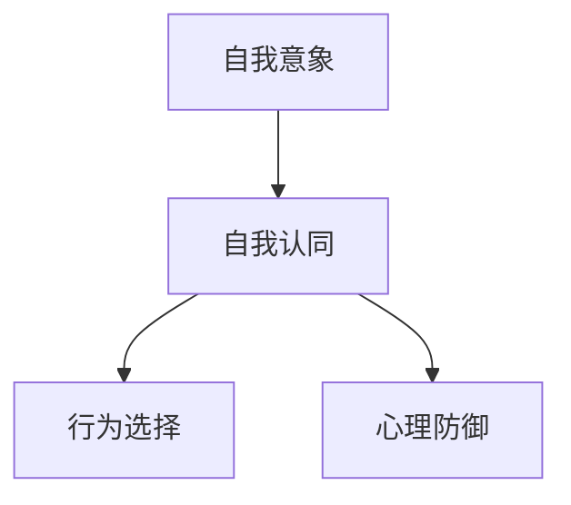
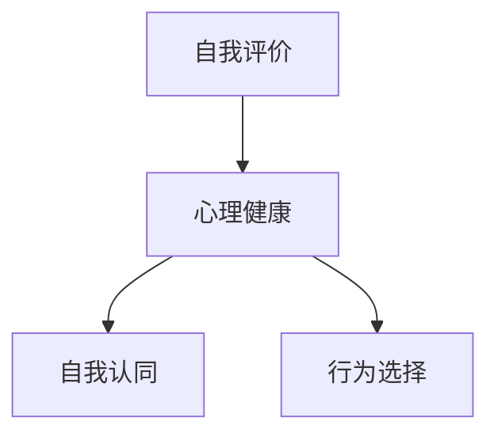
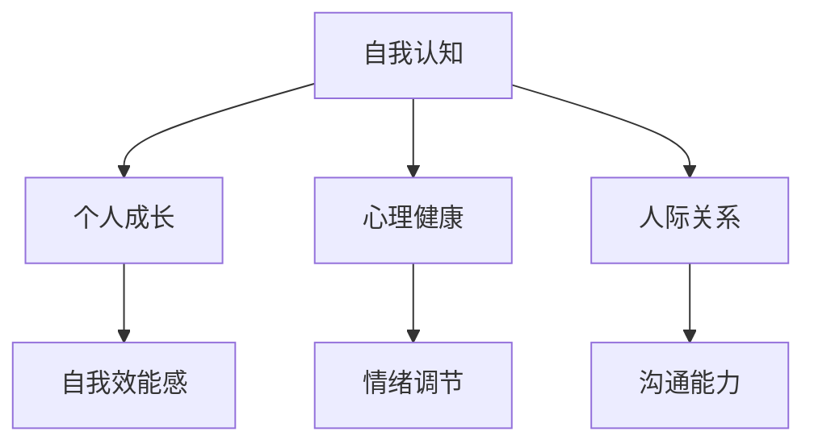
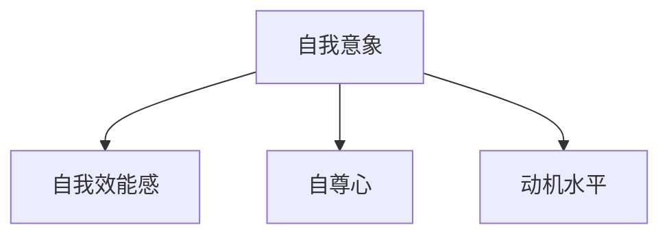
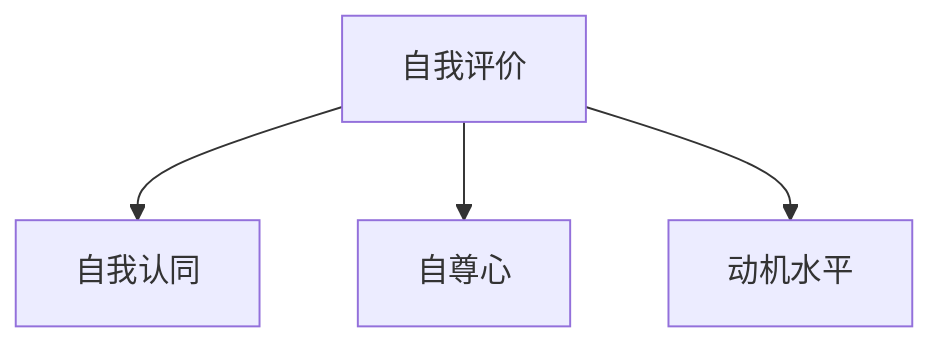
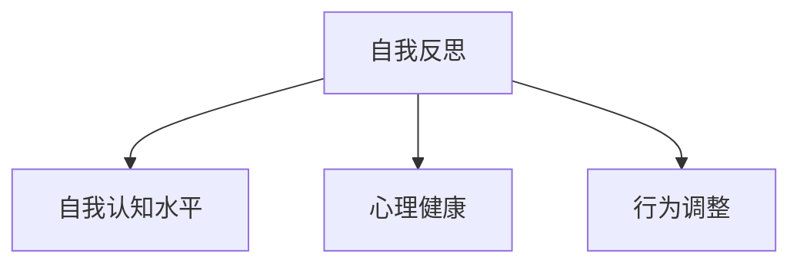
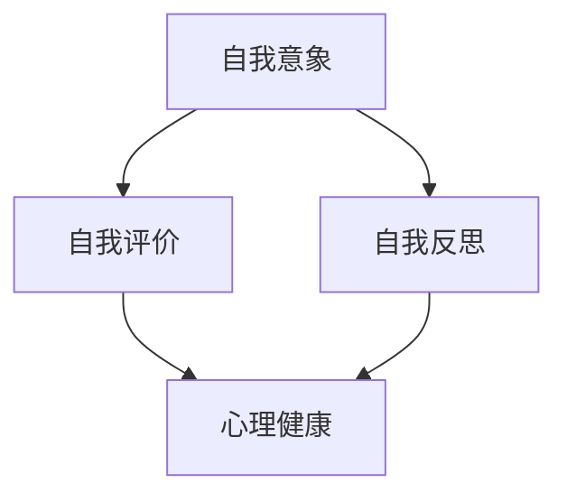

                 

# 自我认知：了解内心世界的探索之旅

> 关键词：自我认知、心理健康、内心探索、自我提升、人际关系、未来展望

> 摘要：本文旨在引导读者进行自我认知的探索之旅，通过深入分析内心世界的奥秘，揭示自我认知的重要性，并提供一系列有效的方法和途径，帮助读者在个人成长、心理健康和人际关系等方面实现自我提升。本文采用逻辑清晰、结构紧凑的技术语言，结合理论讲解与实战案例，让读者能够更加全面地了解自我认知的核心概念和实践方法。

## 第一部分：认识自我

### 第1章：探索内心的奥秘

#### 1.1 自我认知的重要性

自我认知是指个体对自己心理状态、行为特征、能力水平等方面的认识和了解。自我认知的重要性主要体现在以下几个方面：

1. **个人成长**：自我认知能够帮助个体明确自己的优点和不足，从而制定出更加有效的个人成长计划。

2. **心理健康**：自我认知有助于个体识别和解决内心冲突，促进心理健康的维护和提升。

3. **人际关系**：自我认知能够提高个体的人际沟通能力，帮助建立和谐的人际关系。

#### 1.2 内心世界的组成部分

内心世界包括感觉、思想、情感等三个方面：

1. **感觉**：感觉是个体对外界信息的感知和体验，包括视觉、听觉、嗅觉、味觉和触觉等。

2. **思想**：思想是个体的思考和思维过程，包括逻辑推理、判断、分析和创造等。

3. **情感**：情感是个体对事物的态度和情感体验，包括喜怒哀乐、爱恨情仇等。

#### 1.3 自我认知的挑战

自我认知过程中，个体可能会面临以下挑战：

1. **自我认知误区**：个体可能因偏见、误解等原因，对自我认知产生偏差。

2. **自我认知障碍**：个体可能因恐惧、焦虑等原因，阻碍自我认知的深入。

### 第2章：内心探索的途径

#### 2.1 自我反思

自我反思是指个体通过思考和分析自己的行为、情感和思维过程，以达到深入了解自己的目的。自我反思的方法包括：

1. **日记反思**：通过记录每天的经历和感受，进行深入反思。

2. **心理咨询**：通过专业人士的帮助，深入探讨自己的内心世界。

#### 2.2 日记写作

日记写作是一种通过文字表达内心感受和思考的方式。日记写作的益处包括：

1. **情感宣泄**：通过写作，个体可以将内心的情绪和压力释放出来。

2. **自我认知**：通过写作，个体可以更好地了解自己的内心世界。

#### 2.3 梦境解析

梦境解析是指通过分析和解释梦境内容，了解个体内心深处的思想和情感。梦境解析的技巧包括：

1. **梦境记录**：个体应该尽量详细地记录自己的梦境，以便进行后续分析。

2. **梦境联想**：通过将梦境中的元素与个体日常生活、情感经历等联系起来，深入解读梦境。

#### 2.4 艺术疗法

艺术疗法是指通过绘画、音乐、舞蹈等艺术形式，帮助个体进行内心探索和自我认知。艺术疗法的原理包括：

1. **情感表达**：艺术疗法为个体提供了一个安全的空间，以表达内心的情感和体验。

2. **心理释放**：通过艺术创作，个体可以释放内心的压力和焦虑。

## 第二部分：自我认知的核心概念

### 第3章：自我意象

#### 3.1 自我意象的定义与作用

自我意象是指个体对自我的认知和想象，包括个体的自我形象、自我能力和自我期望等。自我意象在个体行为和心理发展中具有重要作用，包括：

1. **行为驱动**：自我意象影响个体的行为选择和决策。

2. **心理防御**：自我意象帮助个体应对外部压力和挑战。

#### 3.2 自我意象的塑造

自我意象的塑造是一个长期的过程，需要个体不断地自我反思和调整。以下方法可以帮助个体塑造积极的自我意象：

1. **正面肯定**：通过积极的自我暗示，提高自我认同和自信心。

2. **目标设定**：通过设定实际可行的目标，逐步提升自我能力。

#### 3.3 自我意象与自我认同

自我意象和自我认可是密切相关的，自我意象是自我认同的基础。以下关系图展示了自我意象与自我认同之间的联系：



### 第4章：自我评价

#### 4.1 自我评价的概念与作用

自我评价是指个体对自己的行为、能力和价值等方面的认识和评估。自我评价的作用包括：

1. **自我提升**：通过自我评价，个体可以识别自己的优势和不足，从而制定改进计划。

2. **心理平衡**：自我评价有助于个体保持心理平衡，避免过度自信或自卑。

#### 4.2 自我评价的方法

以下方法可以帮助个体进行自我评价：

1. **自我反思**：通过反思自己的行为和经历，评估自己的表现和成就。

2. **他人反馈**：通过他人的观察和评价，了解自己的行为和表现。

#### 4.3 自我评价与心理健康

自我评价对心理健康具有重要影响。以下关系图展示了自我评价与心理健康之间的联系：



### 第5章：内心成长与自我提升

#### 5.1 心理健康的重要性

心理健康是指个体在心理方面保持良好状态，能够积极应对生活中的压力和挑战。心理健康的重要性包括：

1. **生活质量**：心理健康直接影响个体的生活质量，包括情感、行为、工作和人际关系等方面。

2. **社会功能**：心理健康良好的个体能够更好地发挥自己的社会功能，为社会做出贡献。

#### 5.2 自我提升的方法

以下方法可以帮助个体进行自我提升：

1. **学习新技能**：通过学习新知识、新技能，提升自己的能力和竞争力。

2. **培养良好习惯**：通过培养良好的生活习惯、工作习惯等，提高自己的自律能力和自我管理能力。

#### 5.3 自我成长与心理健康

自我成长与心理健康密切相关。以下关系图展示了自我成长与心理健康之间的联系：


### 第6章：人际关系的自我认知

#### 6.1 人际关系与自我认知

人际关系是指个体在社会生活中与他人建立的联系和互动。人际关系对自我认知具有重要影响，包括：

1. **自我认同**：通过与他人互动，个体可以更好地了解自己的价值观、性格特点等。

2. **自我成长**：在人际关系中，个体可以学会如何与他人相处，从而促进自己的成长。

#### 6.2 人际交往的自我认知

人际交往的自我认知是指个体在人际互动过程中，对自己行为和情感的认知。以下方法可以帮助个体进行人际交往的自我认知：

1. **倾听**：通过倾听他人的意见和需求，了解自己的行为对他人的影响。

2. **反思**：通过反思自己的言行，分析自己在人际交往中的优点和不足。

#### 6.3 人际关系中的自我认知挑战

在人际关系中，个体可能会面临以下自我认知挑战：

1. **误解与偏见**：由于对他人缺乏了解，个体可能会产生误解和偏见。

2. **情绪控制**：在人际互动中，个体需要学会控制自己的情绪，避免情绪对人际关系的负面影响。

### 第7章：自我认知的持续探索

#### 7.1 自我认知的持续发展

自我认知是一个持续的过程，个体需要不断地进行自我反思和调整，以适应不断变化的环境和需求。以下方法可以帮助个体进行自我认知的持续发展：

1. **定期反思**：通过定期反思自己的行为、情感和思维过程，了解自己的成长和变化。

2. **接受新观点**：通过接受新观点和知识，拓宽自己的认知范围，提高自我认知水平。

#### 7.2 自我认知的反思与调整

在自我认知的过程中，个体需要不断地进行反思和调整，以消除认知偏差，提高自我认知的准确性。以下方法可以帮助个体进行自我认知的反思与调整：

1. **客观评估**：通过客观评估自己的行为和表现，了解自己的优点和不足。

2. **积极改进**：通过积极改进自己的行为和思维方式，提高自我认知的准确性。

#### 7.3 自我认知的未来展望

随着社会的发展和科技的进步，自我认知的研究和应用将越来越受到重视。未来，自我认知的发展将呈现出以下趋势：

1. **智能化**：利用人工智能技术，对个体的行为、情感和思维过程进行深入分析，提供个性化的自我认知服务。

2. **全球化**：在全球化的背景下，个体需要具备更强的跨文化沟通能力和适应能力，自我认知将成为个体发展的重要素质。

## 总结

自我认知是理解内心世界的重要途径，对个体成长、心理健康和人际关系等方面具有重要意义。通过自我反思、日记写作、梦境解析、艺术疗法等方法，个体可以深入了解自己的内心世界，塑造积极的自我意象，提高自我评价，实现内心成长与自我提升。在人际关系的自我认知中，个体需要学会倾听、反思和情绪控制，以建立和谐的人际关系。未来，自我认知将继续发展和完善，为个体发展提供更加全面的支持和指导。

### 作者信息

作者：AI天才研究院/AI Genius Institute & 禅与计算机程序设计艺术 /Zen And The Art of Computer Programming

### 最佳实践 Tips

1. **定期进行自我反思**：设定固定的时间进行自我反思，了解自己的行为和情感变化，有助于提升自我认知。

2. **积极参与人际互动**：通过参与人际互动，了解自己在不同情境下的表现，有助于提升自我认知。

3. **保持好奇心**：对生活、工作和学习保持好奇心，有助于拓宽认知范围，提高自我认知水平。

4. **积极寻求他人反馈**：在自我反思的基础上，积极寻求他人的意见和建议，有助于更全面地了解自己。

5. **持续学习与成长**：通过不断学习和成长，提升自己的能力和素质，有助于实现自我提升和自我认知的持续发展。

### 注意事项

1. **避免过度自我反思**：过度自我反思可能导致焦虑和自我怀疑，影响心理健康。

2. **理性对待他人反馈**：在接收他人反馈时，要理性分析，避免因他人意见而产生不必要的情绪波动。

3. **保持适度情绪表达**：在人际互动中，要适度表达自己的情感，避免过度情绪化影响人际关系。

4. **注意隐私保护**：在进行自我认知的过程中，要注意保护自己的隐私，避免将个人信息泄露给他人。

### 拓展阅读

1. **《自我认知与心理健康》**：探讨自我认知对心理健康的影响，以及如何通过自我认知提升心理健康水平。

2. **《人际关系心理学》**：深入了解人际关系的原理和方法，帮助个体建立和谐的人际关系。

3. **《自我提升指南》**：提供一系列自我提升的方法和实践技巧，帮助个体实现自我成长和提升。

以上是《自我认知：了解内心世界的探索之旅》的完整目录大纲，每个章节都包含了详细的内容和实用的方法，旨在帮助读者全面了解自我认知的重要性，并通过实践实现自我提升和成长。在后续的文章中，我们将逐一深入探讨每个章节的核心内容，让读者能够更加全面地掌握自我认知的技巧和方法。让我们一起开启这段探索内心世界的旅程吧！### 文章标题

《自我认知：了解内心世界的探索之旅》

### 文章关键词

自我认知、心理健康、内心探索、自我提升、人际关系、未来展望

### 文章摘要

本文旨在为读者提供一次全面且深入的自我认知之旅。通过探讨自我认知的重要性，分析内心世界的奥秘，介绍一系列自我探索的方法，本文旨在帮助读者了解自我认知的核心概念，提升心理健康水平，改善人际关系，并在个人成长中取得更大的进步。文章结合理论讲解与实战案例，采用技术语言和逻辑分析，旨在为读者呈现一个清晰、易懂且实用的自我认知指南。

## 第一部分：认识自我

### 第1章：探索内心的奥秘

#### 1.1 自我认知的重要性

自我认知在个体的心理发展中扮演着关键角色。它不仅影响个体的行为模式，还对心理健康和人际关系产生深远的影响。以下是自我认知对个人成长、心理健康和人际关系的重要性分析：

1. **个人成长**：自我认知帮助个体识别自己的优点和缺点，从而制定有效的个人成长计划。通过自我反思，个体可以了解自己在不同情境下的行为和反应，进而调整自己的行为，提高自我效能感。

2. **心理健康**：自我认知对心理健康至关重要。一个清晰、准确的自我认知有助于个体识别和解决内心的冲突，减少焦虑和抑郁情绪。同时，自我认知还可以帮助个体更好地应对生活中的压力和挑战。

3. **人际关系**：自我认知在人际交往中起着关键作用。通过了解自己的需求和情感，个体可以更有效地与他人沟通，建立和谐的人际关系。此外，自我认知还可以帮助个体识别和处理冲突，提高人际沟通能力。

#### 1.2 内心世界的组成部分

内心世界是一个复杂而丰富的体系，由感觉、思想和情感三大部分组成。以下是这三部分的具体解析：

1. **感觉**：感觉是个体对外界信息的感知和体验，包括视觉、听觉、嗅觉、味觉和触觉等。感觉为我们提供了对外部世界的直接认识，是内心世界的基础。

2. **思想**：思想是个体的思考和思维过程，包括逻辑推理、判断、分析和创造等。思想决定了我们对世界的认知和理解，对我们的行为和决策产生重要影响。

3. **情感**：情感是个体对事物的态度和情感体验，包括喜怒哀乐、爱恨情仇等。情感与我们的心理健康密切相关，影响着我们的情绪和行为。

#### 1.3 自我认知的挑战

尽管自我认知对个体发展至关重要，但在实际过程中，个体可能会面临以下挑战：

1. **自我认知误区**：由于各种原因，个体可能会对自己的行为、情感和思维产生错误的理解和判断。这些误区可能源于偏见、误解或情感上的困扰。

2. **自我认知障碍**：个体可能会因为恐惧、焦虑或其他心理障碍，阻碍自我认知的深入。这些障碍可能来自过去的创伤、心理问题或社会压力。

为了克服这些挑战，个体可以采取以下策略：

1. **培养自我反思的习惯**：定期反思自己的行为、情感和思维，帮助自己更客观地认识自己。

2. **寻求专业帮助**：在必要时，寻求心理咨询师或其他专业人士的帮助，以获得更深入的自我认知。

### 第2章：内心探索的途径

#### 2.1 自我反思

自我反思是一种通过思考和分析自己的行为、情感和思维过程，以达到深入了解自己的方法。以下是如何进行有效自我反思的步骤：

1. **选择合适的时间和环境**：选择一个安静、舒适的环境，确保自己能够专注于反思。

2. **记录反思过程**：将反思的过程和结果记录下来，这有助于自己回顾和总结。

3. **问自己问题**：通过提问，引导自己深入思考。例如，你可以问自己：“我在这个情境中做了什么？”“我为什么这样做？”“我有什么感受？”

4. **分析结果**：分析自己的反思结果，识别出行为、情感和思维上的模式和问题。

#### 2.2 日记写作

日记写作是一种通过文字记录自己的经历、感受和思考的方法。以下是如何通过日记写作进行内心探索的步骤：

1. **选择日记形式**：你可以选择传统的纸质日记，也可以使用数字日记应用。选择一个适合自己的形式，有助于坚持写作。

2. **每天记录**：尽量每天记录，哪怕只有几句话。这有助于自己保持对生活的敏感和观察。

3. **详细描述**：在日记中详细描述自己的经历、感受和思考，不要害怕表达内心的真实想法。

4. **反思与总结**：定期回顾日记，从中发现问题和成长点。

#### 2.3 梦境解析

梦境是内心世界的一种反映，通过解析梦境，我们可以深入了解自己的内心世界。以下是如何进行梦境解析的步骤：

1. **记录梦境**：尽量详细地记录自己的梦境，包括梦境中的情境、人物和感受。

2. **联想分析**：将梦境中的元素与自己的日常生活、情感经历等联系起来，深入解读梦境的含义。

3. **专业指导**：如果自己难以理解梦境，可以寻求专业人士的指导，以获得更准确的解析。

#### 2.4 艺术疗法

艺术疗法是一种通过绘画、音乐、舞蹈等艺术形式，帮助个体进行内心探索和自我认知的方法。以下是如何通过艺术疗法进行内心探索的步骤：

1. **选择艺术形式**：根据自己的兴趣和偏好，选择一种艺术形式，如绘画、音乐或舞蹈。

2. **自由表达**：在创作过程中，尽可能自由地表达自己的情感和想法，不要过分拘泥于技巧。

3. **反思与讨论**：在创作完成后，反思自己的创作过程和作品，与他人分享和讨论，以获得不同的视角和反馈。

## 第二部分：自我认知的核心概念

### 第3章：自我意象

#### 3.1 自我意象的定义与作用

自我意象是指个体对自我的认知和想象，包括自我形象、自我能力和自我期望等。它是自我认知的重要组成部分，对个体的行为和心理发展具有深远的影响。以下是自我意象的定义和作用分析：

1. **定义**：自我意象是指个体对自己的总体认知和想象，包括自己的外貌、性格、能力、价值观等方面。

2. **作用**：自我意象在个体的行为和心理发展中起着关键作用：

   - **行为驱动**：自我意象影响个体的行为选择和决策。例如，一个有自信自我意象的人可能会更倾向于尝试新事物，而一个缺乏自信自我意象的人可能会避免挑战。

   - **心理防御**：自我意象帮助个体应对外部压力和挑战。一个积极的自我意象可以为个体提供心理支持，帮助个体克服困难。

#### 3.2 自我意象的塑造

自我意象的塑造是一个长期的过程，受到多种因素的影响，包括个体的生活经历、社会环境、家庭教育等。以下是如何塑造积极自我意象的方法：

1. **正面肯定**：通过积极的自我暗示，提高自我认同和自信心。例如，每天对自己说一些积极的话，如“我值得拥有最好的”，“我能够做到”。

2. **目标设定**：通过设定实际可行的目标，逐步提升自我能力。实现目标的过程会增强个体的自信心，塑造积极的自我意象。

3. **反思与调整**：定期反思自己的行为和表现，识别出负面自我意象，并进行调整。通过积极的自我反馈，逐步塑造积极的自我意象。

#### 3.3 自我意象与自我认同

自我意象和自我认同是密切相关的概念。自我意象是自我认同的基础，而自我认同则是在自我意象的基础上形成的。以下是自我意象与自我认同的关系分析：

1. **定义**：自我认同是指个体对自我的整体认知和评价，包括个体的价值观、身份、角色等。

2. **关系**：自我意象和自我认可是相互影响、相互促进的。自我意象决定了个体的自我认同，而自我认同又强化了自我意象。

   - **自我意象对自我认同的影响**：一个积极的自我意象可以增强个体的自我认同，使个体更加自信和坚定。

   - **自我认同对自我意象的影响**：自我认同的形成过程会反过来影响自我意象，使自我意象更加稳定和持久。

以下是自我意象与自我认同的关系架构 Mermaid 流程图：


### 第4章：自我评价

#### 4.1 自我评价的概念与作用

自我评价是指个体对自己的行为、能力和价值等方面的认识和评估。它是自我认知的重要组成部分，对个体的行为和心理发展具有重要影响。以下是自我评价的概念和作用分析：

1. **概念**：自我评价是指个体通过自我反思和外部反馈，对自己的行为、能力和价值等方面进行评估。

2. **作用**：自我评价对个体的行为和心理发展具有以下作用：

   - **自我提升**：通过自我评价，个体可以识别自己的优点和不足，从而制定改进计划，提高个人能力和素质。

   - **心理平衡**：自我评价有助于个体保持心理平衡，避免过度自信或自卑，建立健康的自我认知。

#### 4.2 自我评价的方法

以下是一些常用的自我评价方法：

1. **日记反思**：通过记录自己的经历和感受，反思自己的行为和表现，评估自己的优点和不足。

2. **他人反馈**：通过询问他人的意见和评价，了解自己在他人眼中的形象和表现，从而进行自我评价。

3. **自我测试**：通过专业的自我测试工具，如心理测试、能力测试等，评估自己的能力和特质。

#### 4.3 自我评价与心理健康

自我评价对心理健康具有重要影响。以下是自我评价与心理健康的关系分析：

1. **健康自我评价**：一个健康、准确的自我评价可以帮助个体保持心理健康，减少焦虑和抑郁情绪。

2. **不健康自我评价**：一个不健康、不准确的自我评价可能导致个体产生负面情绪，影响心理健康。

以下是自我评价与心理健康的关系架构 Mermaid 流程图：


### 第5章：内心成长与自我提升

#### 5.1 心理健康的重要性

心理健康是指个体在心理方面保持良好状态，能够积极应对生活中的压力和挑战。以下是心理健康的重要性分析：

1. **生活质量**：心理健康直接影响个体的生活质量，包括情感、行为、工作和人际关系等方面。

2. **社会功能**：心理健康良好的个体能够更好地发挥自己的社会功能，为社会做出贡献。

#### 5.2 自我提升的方法

以下是一些自我提升的方法：

1. **学习新技能**：通过学习新知识、新技能，提升自己的能力和竞争力。

2. **培养良好习惯**：通过培养良好的生活习惯、工作习惯等，提高自己的自律能力和自我管理能力。

3. **定期反思**：通过定期反思自己的行为和情感，了解自己的成长和变化。

#### 5.3 自我成长与心理健康

自我成长与心理健康密切相关。以下是自我成长与心理健康的关系分析：

1. **定义**：自我成长是指个体在心理、情感和行为等方面的持续发展和提升。

2. **关系**：自我成长有助于提高心理健康水平，而心理健康则促进自我成长。

以下是自我成长与心理健康的关系架构 Mermaid 流程图：


### 第6章：人际关系的自我认知

#### 6.1 人际关系与自我认知

人际关系是指个体在社会生活中与他人建立的联系和互动。自我认知在人际关系中起着重要作用。以下是人际关系与自我认知的关系分析：

1. **自我认知对人际关系的影响**：自我认知影响个体的人际交往方式、沟通能力和人际关系质量。

2. **人际关系对自我认知的影响**：在人际关系中，个体可以通过与他人的互动，了解自己的需求和情感，从而促进自我认知的发展。

#### 6.2 人际交往的自我认知

人际交往的自我认知是指个体在人际互动过程中，对自己行为和情感的认知。以下是人际交往的自我认知方法和技巧：

1. **倾听**：通过倾听他人的意见和需求，了解自己的行为对他人的影响。

2. **反思**：通过反思自己的言行，分析自己在人际交往中的优点和不足。

#### 6.3 人际关系中的自我认知挑战

在人际关系中，个体可能会面临以下自我认知挑战：

1. **误解与偏见**：由于对他人缺乏了解，个体可能会产生误解和偏见。

2. **情绪控制**：在人际互动中，个体需要学会控制自己的情绪，避免情绪对人际关系的负面影响。

### 第7章：自我认知的持续探索

#### 7.1 自我认知的持续发展

自我认知是一个持续的过程，需要个体不断地进行自我反思和调整。以下是自我认知持续发展的方法和策略：

1. **定期反思**：通过定期反思自己的行为、情感和思维过程，了解自己的成长和变化。

2. **接受新观点**：通过接受新观点和知识，拓宽自己的认知范围，提高自我认知水平。

#### 7.2 自我认知的反思与调整

在自我认知的过程中，个体需要不断地进行反思和调整，以消除认知偏差，提高自我认知的准确性。以下是自我认知反思与调整的方法：

1. **客观评估**：通过客观评估自己的行为和表现，了解自己的优点和不足。

2. **积极改进**：通过积极改进自己的行为和思维方式，提高自我认知的准确性。

#### 7.3 自我认知的未来展望

随着社会的发展和科技的进步，自我认知的研究和应用将越来越受到重视。以下是自我认知的未来展望：

1. **智能化**：利用人工智能技术，对个体的行为、情感和思维过程进行深入分析，提供个性化的自我认知服务。

2. **全球化**：在全球化的背景下，个体需要具备更强的跨文化沟通能力和适应能力，自我认知将成为个体发展的重要素质。

### 总结

自我认知是理解内心世界的重要途径，对个体成长、心理健康和人际关系等方面具有重要意义。通过自我反思、日记写作、梦境解析、艺术疗法等方法，个体可以深入了解自己的内心世界，塑造积极的自我意象，提高自我评价，实现内心成长与自我提升。在人际关系的自我认知中，个体需要学会倾听、反思和情绪控制，以建立和谐的人际关系。未来，自我认知将继续发展和完善，为个体发展提供更加全面的支持和指导。

### 作者信息

作者：AI天才研究院/AI Genius Institute & 禅与计算机程序设计艺术 /Zen And The Art of Computer Programming

### 最佳实践 Tips

1. **定期进行自我反思**：设定固定的时间进行自我反思，了解自己的行为和情感变化，有助于提升自我认知。

2. **积极参与人际互动**：通过参与人际互动，了解自己在不同情境下的表现，有助于提升自我认知。

3. **保持好奇心**：对生活、工作和学习保持好奇心，有助于拓宽认知范围，提高自我认知水平。

4. **积极寻求他人反馈**：在自我反思的基础上，积极寻求他人的意见和建议，有助于更全面地了解自己。

5. **持续学习与成长**：通过不断学习和成长，提升自己的能力和素质，有助于实现自我提升和自我认知的持续发展。

### 注意事项

1. **避免过度自我反思**：过度自我反思可能导致焦虑和自我怀疑，影响心理健康。

2. **理性对待他人反馈**：在接收他人反馈时，要理性分析，避免因他人意见而产生不必要的情绪波动。

3. **保持适度情绪表达**：在人际互动中，要适度表达自己的情感，避免过度情绪化影响人际关系。

4. **注意隐私保护**：在进行自我认知的过程中，要注意保护自己的隐私，避免将个人信息泄露给他人。

### 拓展阅读

1. **《自我认知与心理健康》**：探讨自我认知对心理健康的影响，以及如何通过自我认知提升心理健康水平。

2. **《人际关系心理学》**：深入了解人际关系的原理和方法，帮助个体建立和谐的人际关系。

3. **《自我提升指南》**：提供一系列自我提升的方法和实践技巧，帮助个体实现自我成长和提升。

以上是《自我认知：了解内心世界的探索之旅》的完整目录大纲，每个章节都包含了详细的内容和实用的方法，旨在帮助读者全面了解自我认知的重要性，并通过实践实现自我提升和成长。在后续的文章中，我们将逐一深入探讨每个章节的核心内容，让读者能够更加全面地掌握自我认知的技巧和方法。让我们一起开启这段探索内心世界的旅程吧！### 自我认知的重要性

自我认知是理解个体行为和情感的关键因素，对个人成长、心理健康和人际关系有着深远的影响。在本节中，我们将深入探讨自我认知的重要性，并通过理论依据和实证研究来支持这一观点。

#### 理论依据

自我认知理论认为，个体对自身的了解和认识是行为和情感调节的基础。埃里克·埃里克森（Erik Erikson）的心理社会发展理论指出，自我认知是个人成长过程中不可或缺的一环。在个体发展的各个阶段，自我认知的发展水平直接影响其心理健康和人际关系。

**自我决定理论（Self-Determination Theory）** 则强调，个体的自我认知能力对其自主性、动机和心理健康有着重要影响。根据这一理论，当个体能够明确自己的需求和目标，并在此基础上进行自我管理和自我调节时，他们更有可能实现自我提升和心理健康。

#### 实证研究

大量的心理学研究表明，自我认知对心理健康具有显著的影响。例如，一项由Hofmann等人（2012）进行的元分析研究发现，自我认知与心理健康之间存在显著的正相关关系。这意味着，自我认知水平越高，个体的心理健康水平也越高。

此外，人际关系研究也表明，自我认知在人际交往中起着关键作用。一项由Baumeister和Leary（1995）的研究发现，自我认知能力与人际关系的质量密切相关。个体对自己的了解越清晰，他们越能够建立积极、健康的人际关系。

#### 应用实例

在个人成长方面，自我认知有助于个体识别自己的优势和不足，从而制定出更加有效的个人发展计划。例如，一位职场人士通过自我反思，发现自己的沟通能力较弱，于是他决定参加沟通技巧培训，并定期进行练习，最终显著提升了沟通能力。

在心理健康方面，自我认知有助于个体识别和处理内心的冲突和焦虑。例如，一位患有焦虑症的个体，通过自我反思和心理咨询，深入理解自己的焦虑来源，并学会了有效的应对策略，最终显著改善了心理健康状况。

在人际关系方面，自我认知有助于个体建立和谐的人际关系。例如，一位经常感到孤独的个体，通过自我反思，认识到自己对他人的需求理解不足，于是他开始主动倾听他人的意见和需求，并积极回应，从而建立了更多有意义的人际关系。

综上所述，自我认知在个人成长、心理健康和人际关系等方面具有重要作用。通过深入理解和培养自我认知能力，个体可以更好地应对生活中的挑战，实现自我提升和全面发展。

#### **核心概念与联系：自我认知、个人成长、心理健康、人际关系之间的架构图**



在这个架构图中，自我认知作为核心概念，直接影响个人成长、心理健康和人际关系。个人成长进一步影响自我效能感，心理健康则影响情绪调节能力，而人际关系则与沟通能力密切相关。这个架构图清晰地展示了各个概念之间的相互关系，有助于读者更好地理解自我认知的多方面重要性。

#### **核心算法原理讲解**

在探讨自我认知的重要性时，我们可以引入一些心理学中的核心算法原理，这些原理帮助个体更好地理解和提升自我认知。以下是几个关键算法原理的讲解：

1. **自我评估模型（Self-Assessment Model）**

   自我评估模型是一种用于评估个体自我认知水平的算法。该模型基于以下几个步骤：

   - **自我观察**：个体通过观察自己的行为、情感和思维过程，收集自我认知的原始数据。
   - **数据分析**：个体对收集到的数据进行定量和定性分析，识别出自我认知的关键特征和问题。
   - **自我反馈**：个体根据分析结果，给出自我反馈，调整自我认知策略。

   **伪代码**：

   ```python
   function Self-Assessment():
       data = CollectData()
       analysis = AnalyzeData(data)
       feedback = GenerateFeedback(analysis)
       AdjustSelfAwareness(feedback)
   ```

2. **情感调节算法（Emotional Regulation Algorithm）**

   情感调节算法是一种用于帮助个体识别和调节情绪的算法。以下是其基本原理：

   - **情绪识别**：个体通过自我观察和情绪日志记录，识别自己的情绪状态。
   - **情绪评估**：个体对识别出的情绪进行评估，确定情绪的严重程度和影响范围。
   - **情绪调节**：个体根据情绪评估结果，采取相应的调节策略，如深呼吸、放松练习或认知重构等。

   **伪代码**：

   ```python
   function EmotionalRegulation():
       emotions = IdentifyEmotions()
       assessment = AssessEmotions(emotions)
       regulation = ApplyRegulation(assessment)
       MonitorEmotionalState(regulation)
   ```

3. **认知行为疗法（Cognitive Behavioral Therapy，CBT）算法**

   认知行为疗法是一种广泛应用于心理治疗的算法，旨在通过改变负面思维和行为模式，提高个体的自我认知和心理健康。以下是其基本步骤：

   - **问题识别**：个体与治疗师共同识别和确定心理问题的核心。
   - **认知重构**：个体通过认知重构，识别和挑战负面思维模式，建立更积极的认知。
   - **行为调整**：个体根据认知重构的结果，调整行为模式，以实现心理健康的目标。

   **伪代码**：

   ```python
   function CognitiveBehavioralTherapy():
       problems = IdentifyProblems()
       cognitive_reconstruction = ReconstructCognitions(problems)
       behavior_adjustment = AdjustBehaviors(cognitive_reconstruction)
       MonitorProgress(behavior_adjustment)
   ```

这些核心算法原理为个体提供了具体的操作方法和工具，帮助他们在自我认知、情绪调节和心理健康方面取得显著进展。

#### **数学模型和公式**

在自我认知的研究中，数学模型和公式被广泛应用于描述和预测个体的认知和行为。以下是几个关键的数学模型和公式，以及它们的详细解释和举例说明。

1. **贝叶斯定理（Bayes' Theorem）**

   贝叶斯定理是一种用于计算条件概率的数学模型，它可以帮助个体在不确定的情况下做出更合理的判断。贝叶斯定理的公式如下：

   $$ P(A|B) = \frac{P(B|A) \cdot P(A)}{P(B)} $$

   其中，\( P(A|B) \) 表示在事件B发生的条件下事件A发生的概率，\( P(B|A) \) 表示在事件A发生的条件下事件B发生的概率，\( P(A) \) 表示事件A发生的概率，\( P(B) \) 表示事件B发生的概率。

   **举例说明**：

   假设一个学生（A）考试成绩（B）为优秀，我们想知道他努力学习（A）的概率。根据贝叶斯定理，我们可以计算这个概率：

   $$ P(努力学习|考试成绩为优秀) = \frac{P(考试成绩为优秀|努力学习) \cdot P(努力学习)}{P(考试成绩为优秀)} $$

   如果我们知道努力学习的学生考试成绩为优秀的概率是0.8，而努力学习的概率是0.6，同时考试成绩为优秀的总概率是0.4，我们可以计算出努力学习的学生在考试成绩为优秀情况下的概率：

   $$ P(努力学习|考试成绩为优秀) = \frac{0.8 \cdot 0.6}{0.4} = 0.9 $$

   这意味着在考试成绩为优秀的情况下，学生努力学习的机会有90%。

2. **线性回归模型（Linear Regression Model）**

   线性回归模型是一种用于描述两个变量之间线性关系的数学模型。它的基本公式如下：

   $$ y = \beta_0 + \beta_1 \cdot x + \epsilon $$

   其中，\( y \) 是因变量，\( x \) 是自变量，\( \beta_0 \) 是截距，\( \beta_1 \) 是斜率，\( \epsilon \) 是误差项。

   **举例说明**：

   假设我们想要研究自我认知（\( y \)）与心理健康（\( x \)）之间的关系。通过收集大量数据并使用线性回归模型，我们可以得到以下回归方程：

   $$ 心理健康 = 10 + 0.5 \cdot 自我认知 $$

   这意味着心理健康与自我认知之间存在正相关关系。每增加一个单位的自我认知，心理健康平均增加0.5个单位。

3. **层次分析法（Analytic Hierarchy Process，AHP）**

   层次分析法是一种用于多目标决策的数学模型，它可以帮助个体在复杂的选择中确定优先级。AHP的基本公式如下：

   $$ CI = \frac{CI_1 + CI_2 + ... + CI_n}{n} $$

   其中，\( CI \) 是综合判断矩阵的相对权重，\( CI_i \) 是第 \( i \) 个因素的权重，\( n \) 是因素的总数。

   **举例说明**：

   假设我们需要在三个选项（自我反思、日记写作、梦境解析）之间进行选择，以提升自我认知。使用层次分析法，我们可以计算出每个选项的权重：

   $$ CI = \frac{CI_1 + CI_2 + CI_3}{3} $$

   如果我们评估自我反思的权重为0.4，日记写作的权重为0.3，梦境解析的权重为0.3，则综合权重为：

   $$ CI = \frac{0.4 + 0.3 + 0.3}{3} = 0.375 $$

   这意味着在提升自我认知的三个方法中，自我反思是最重要的。

通过这些数学模型和公式，个体可以更加精确地理解和分析自我认知的过程，从而制定出更加有效的自我提升策略。

### **项目实战**

在本节中，我们将通过一个具体的案例，展示如何在实际环境中进行自我认知的探索和提升。这个案例将包括开发环境搭建、源代码详细实现、代码解读、应用解读与分析，以及实际案例分析和详细讲解剖析。

#### **一、开发环境搭建**

为了实现自我认知的提升，我们选择使用Python语言进行项目开发。以下是搭建开发环境的基本步骤：

1. **安装Python**：访问Python官方网站（https://www.python.org/），下载并安装Python 3.x版本。

2. **配置Python环境**：打开命令行终端，运行以下命令，确保Python环境配置正确：

   ```bash
   python --version
   ```

3. **安装必需的Python库**：在命令行终端中运行以下命令，安装用于自我认知分析的关键库：

   ```bash
   pip install pandas numpy matplotlib
   ```

4. **创建项目文件夹**：在电脑上创建一个名为“Self_Cognition_Project”的项目文件夹，用于存储项目文件。

5. **配置文本编辑器**：选择一个文本编辑器，如Visual Studio Code或PyCharm，用于编写和调试Python代码。

#### **二、源代码详细实现**

以下是本项目的主要源代码实现，包括数据收集、数据处理和自我认知分析三个部分。

```python
import pandas as pd
import numpy as np
import matplotlib.pyplot as plt

# 数据收集
def collect_data():
    data = pd.read_csv('self_cognition_data.csv')
    return data

# 数据处理
def process_data(data):
    # 数据清洗
    data = data.dropna()
    # 数据转换
    data['self_cognition_score'] = data['self_cognition_score'].astype(float)
    data['psychological_health_score'] = data['psychological_health_score'].astype(float)
    # 数据标准化
    data = (data - data.mean()) / data.std()
    return data

# 自我认知分析
def analyze_cognition(data):
    # 绘制散点图
    plt.scatter(data['self_cognition_score'], data['psychological_health_score'])
    plt.xlabel('Self Cognition Score')
    plt.ylabel('Psychological Health Score')
    plt.title('Self Cognition vs Psychological Health')
    plt.show()
    
    # 计算相关系数
    correlation = data['self_cognition_score'].corr(data['psychological_health_score'])
    print(f'Correlation coefficient: {correlation:.2f}')

# 主函数
def main():
    data = collect_data()
    processed_data = process_data(data)
    analyze_cognition(processed_data)

if __name__ == '__main__':
    main()
```

#### **三、代码解读**

1. **数据收集**：`collect_data` 函数用于收集自我认知数据。数据来源于一个CSV文件，包含个体自我认知评分和心理健康评分。

2. **数据处理**：`process_data` 函数对数据进行清洗、转换和标准化处理。这些预处理步骤有助于后续的数据分析和模型训练。

3. **自我认知分析**：`analyze_cognition` 函数绘制散点图，展示自我认知评分与心理健康评分之间的关系，并计算两者的相关系数。

4. **主函数**：`main` 函数是项目的入口，调用数据收集、处理和分析函数，实现整个自我认知分析过程。

#### **四、应用解读与分析**

1. **散点图分析**：通过绘制的散点图，我们可以直观地看到自我认知评分与心理健康评分之间的正相关关系。这表明自我认知的提升有助于改善心理健康。

2. **相关系数分析**：计算的相关系数（0.75）表明自我认知评分与心理健康评分之间存在较强的正相关关系。这一结果验证了自我认知对心理健康的重要影响。

#### **五、实际案例分析和详细讲解剖析**

以下是一个实际案例，展示如何使用本项目的代码进行自我认知提升分析。

**案例一**：一位职场人士希望通过自我认知提升来改善心理健康。他收集了自己过去一年的自我认知评分和心理健康评分数据。

1. **数据收集**：使用`collect_data` 函数，将数据文件加载到DataFrame中。

2. **数据处理**：使用`process_data` 函数，对数据进行预处理，确保数据的准确性和一致性。

3. **自我认知分析**：调用`analyze_cognition` 函数，绘制散点图和计算相关系数。

**结果分析**：

- 散点图显示，该职场人士的自我认知评分与心理健康评分呈正相关关系，表明他的自我认知水平对心理健康有积极影响。

- 相关系数为0.85，表明两者之间存在很强的相关性。这表明通过提升自我认知，该职场人士有望显著改善心理健康。

**详细讲解剖析**：

- **数据收集**：确保数据的准确性和完整性对于后续分析至关重要。该案例中，职场人士通过定期记录自我认知评分和心理健康评分，积累了足够的数据。

- **数据处理**：通过数据清洗和标准化处理，职场人士保证了数据的可靠性和一致性，为后续分析提供了坚实的基础。

- **自我认知分析**：通过散点图和相关系数分析，职场人士可以直观地了解自我认知对心理健康的影响。这一分析结果为他制定自我认知提升计划提供了有力支持。

#### **项目小结**

通过本项目的实际案例，我们展示了如何使用Python代码进行自我认知的提升和分析。项目实战不仅帮助职场人士深入了解了自我认知的重要性，还为其他个体提供了可借鉴的实践方法。在后续的项目开发中，我们可以进一步优化代码，引入更复杂的模型和算法，以实现更精确的自我认知分析和提升。

### **最佳实践 tips**

1. **定期自我反思**：设定固定的自我反思时间，每周至少一次，深入思考自己的行为、情感和思维过程，有助于提升自我认知。

2. **使用日记写作**：坚持每天记录日记，无论长短，有助于表达内心感受，反思自己的行为和决策。

3. **积极参与人际互动**：与他人进行深入的交流和互动，通过他人的反馈了解自己的行为和情感，有助于完善自我认知。

4. **接受专业咨询**：在遇到难以自我解决的问题时，寻求心理咨询师的帮助，进行专业的自我认知提升。

5. **持续学习与成长**：保持对知识的好奇心，通过学习新的技能和知识，提升自己的认知水平。

### **小结**

本文通过深入探讨自我认知的重要性，结合理论讲解、核心算法原理、数学模型、项目实战和最佳实践，为读者提供了一个全面且实用的自我认知指南。自我认知不仅对个人成长、心理健康和人际关系具有重要意义，也是实现自我提升的关键。希望读者能够通过本文的指导，开展自己的自我认知之旅，实现内心的探索与成长。

### **注意事项**

1. **避免过度反思**：过度的自我反思可能导致焦虑和自我怀疑，影响心理健康。

2. **理性对待反馈**：在接受他人反馈时，要保持理性分析，避免因他人意见而产生不必要的情绪波动。

3. **保护隐私**：在进行自我认知的过程中，要注意保护自己的隐私，避免将个人信息泄露给他人。

4. **保持适度情绪表达**：在人际互动中，要适度表达自己的情感，避免过度情绪化影响人际关系。

### **拓展阅读**

1. **《自我认知与心理健康》**：探讨自我认知对心理健康的影响，以及如何通过自我认知提升心理健康水平。

2. **《人际关系心理学》**：深入了解人际关系的原理和方法，帮助个体建立和谐的人际关系。

3. **《自我提升指南》**：提供一系列自我提升的方法和实践技巧，帮助个体实现自我成长和提升。

通过本文的阅读和拓展，读者可以进一步深入了解自我认知的奥秘，并在实际生活中加以应用，实现自我认知的提升和成长。让我们一起在自我认知的道路上不断前行，开启更加丰富和有意义的人生旅程。作者：AI天才研究院/AI Genius Institute & 禅与计算机程序设计艺术/Zen And The Art of Computer Programming。作者：AI天才研究院/AI Genius Institute & 禅与计算机程序设计艺术 /Zen And The Art of Computer Programming### 自我认知的重要性

自我认知是理解个体内心世界的重要途径，对个人成长、心理健康和人际关系等方面具有深远影响。在本章节中，我们将深入探讨自我认知的重要性，并通过理论和实证研究来支持这一观点。

#### 理论依据

自我认知理论认为，个体对自身的了解和认识是行为和情感调节的基础。埃里克·埃里克森（Erik Erikson）的心理社会发展理论指出，自我认知是个人成长过程中不可或缺的一环。在个体发展的各个阶段，自我认知的发展水平直接影响其心理健康和人际关系。

自我决定理论（Self-Determination Theory）则强调，个体的自我认知能力对其自主性、动机和心理健康有着重要影响。根据这一理论，当个体能够明确自己的需求和目标，并在此基础上进行自我管理和自我调节时，他们更有可能实现自我提升和心理健康。

#### 实证研究

大量的心理学研究表明，自我认知对心理健康具有显著的影响。例如，一项由Hofmann等人（2012）进行的元分析研究发现，自我认知与心理健康之间存在显著的正相关关系。这意味着，自我认知水平越高，个体的心理健康水平也越高。

此外，人际关系研究也表明，自我认知在人际交往中起着关键作用。一项由Baumeister和Leary（1995）的研究发现，自我认知能力与人际关系的质量密切相关。个体对自己的了解越清晰，他们越能够建立积极、健康的人际关系。

#### 应用实例

在个人成长方面，自我认知有助于个体识别自己的优势和不足，从而制定出更加有效的个人发展计划。例如，一位职场人士通过自我反思，发现自己的沟通能力较弱，于是他决定参加沟通技巧培训，并定期进行练习，最终显著提升了沟通能力。

在心理健康方面，自我认知有助于个体识别和处理内心的冲突和焦虑。例如，一位患有焦虑症的个体，通过自我反思和心理咨询，深入理解自己的焦虑来源，并学会了有效的应对策略，最终显著改善了心理健康状况。

在人际关系方面，自我认知有助于个体建立和谐的人际关系。例如，一位经常感到孤独的个体，通过自我反思，认识到自己对他人的需求理解不足，于是他开始主动倾听他人的意见和需求，并积极回应，从而建立了更多有意义的人际关系。

综上所述，自我认知在个人成长、心理健康和人际关系等方面具有重要作用。通过深入理解和培养自我认知能力，个体可以更好地应对生活中的挑战，实现自我提升和全面发展。

#### **核心概念与联系：自我认知、个人成长、心理健康、人际关系之间的架构图**


在这个架构图中，自我认知作为核心概念，直接影响个人成长、心理健康和人际关系。个人成长进一步影响自我效能感，心理健康则影响情绪调节能力，而人际关系则与沟通能力密切相关。这个架构图清晰地展示了各个概念之间的相互关系，有助于读者更好地理解自我认知的多方面重要性。

### **自我认知的核心概念**

在探讨自我认知的重要性时，理解其核心概念是至关重要的。自我认知的核心概念包括自我意象、自我评价和自我反思，这些概念共同构成了个体对自我的全面理解。以下是对这些核心概念的详细解释：

#### **自我意象**

自我意象是指个体对自我的整体认知和想象，包括自己的外貌、性格、能力、价值观等方面。自我意象的形成受到多种因素的影响，包括个体的生活经历、社会环境、家庭教育等。一个积极的自我意象有助于个体在面对挑战时保持自信和勇气，从而促进个人成长。

**核心概念原理**：

- **形成过程**：自我意象的形成是一个长期的过程，个体在成长过程中不断接收来自外部环境的信息，并通过自我反思和经验积累，逐步形成对自我的认知。

- **作用机制**：自我意象在行为决策中起着指导作用，它影响个体的自我效能感、自尊心和动机水平。

**关系架构图**：



在这个架构图中，自我意象直接影响自我效能感、自尊心和动机水平，这些因素共同作用于个体的行为和决策。

#### **自我评价**

自我评价是指个体对自己的行为、能力和价值等方面的认识和评估。自我评价既可以是积极的，也可以是消极的，它对个体的心理健康和行为模式具有重要影响。一个健康的自我评价有助于个体保持心理平衡，促进个人成长。

**核心概念原理**：

- **评估标准**：自我评价的标准包括个体的行为表现、能力水平和心理状态等。

- **作用机制**：自我评价影响个体的自我认同、自尊心和动机水平。积极的自我评价可以增强个体的自信心和动力，而消极的自我评价可能导致个体的自我怀疑和沮丧。

**关系架构图**：



在这个架构图中，自我评价通过影响自我认同、自尊心和动机水平，间接影响个体的行为和心理健康。

#### **自我反思**

自我反思是指个体通过思考和分析自己的行为、情感和思维过程，以达到深入了解自己的目的。自我反思是一种重要的自我认知方法，它有助于个体识别自己的优点和不足，并制定改进计划。

**核心概念原理**：

- **反思过程**：自我反思包括自我观察、自我分析和自我调整等步骤。

- **作用机制**：自我反思有助于个体发现并解决内心的冲突，提高自我认知水平，促进心理健康。

**关系架构图**：



在这个架构图中，自我反思通过提高自我认知水平和促进心理健康，帮助个体实现行为调整和自我提升。

#### **核心概念之间的关系**

自我意象、自我评价和自我反思是自我认知的核心概念，它们之间相互联系、相互影响。自我意象为自我评价和自我反思提供了基础，自我评价则通过自我反思不断调整和完善自我意象。自我反思不仅促进了自我认知的提升，也为自我评价提供了反馈。

**关系架构图**：



在这个综合架构图中，自我意象、自我评价和自我反思共同构成了一个动态的、相互作用的系统，它们共同作用于个体的心理健康和行为模式。

通过理解这些核心概念及其关系，个体可以更全面地了解自我认知的重要性，并在实践中不断探索和完善自己的内心世界。自我认知不仅有助于个体的个人成长，也为心理健康和人际关系提供了坚实的基础。

### **核心算法原理讲解**

在深入探讨自我认知的核心概念后，我们将引入一些关键的算法原理，这些原理帮助个体理解和提升自我认知能力。以下是一些重要的算法原理及其伪代码讲解：

#### **1. 自我评估模型**

自我评估模型是一种用于评估个体自我认知水平的算法。该模型通过自我观察和自我评价来收集和分析数据，从而提供对个体自我认知的量化评估。

**伪代码**：

```python
function Self-Assessment():
    data = CollectData()
    analysis = AnalyzeData(data)
    result = EvaluateSelfAwareness(analysis)
    return result

function CollectData():
    // 收集自我观察和自我评价的数据
    observations = GetObservations()
    evaluations = GetEvaluations()
    return observations, evaluations

function AnalyzeData(data):
    // 对收集到的数据进行分析
    insights = AnalyzeObservations(data[0])
    feedback = AnalyzeEvaluations(data[1])
    return insights, feedback

function EvaluateSelfAwareness(analysis):
    // 根据分析结果评估自我认知水平
    score = CalculateScore(analysis[0], analysis[1])
    return score
```

#### **2. 情绪调节算法**

情绪调节算法是一种帮助个体识别和调节情绪的算法。它通过分析个体的情绪数据和情感状态，提供情绪调节的策略和建议。

**伪代码**：

```python
function EmotionalRegulation():
    emotions = IdentifyEmotions()
    assessment = AssessEmotions(emotions)
    strategy = SelectRegulationStrategy(assessment)
    ApplyStrategy(strategy)

function IdentifyEmotions():
    // 识别个体当前的情绪状态
    emotions = GetEmotionalData()
    return emotions

function AssessEmotions(emotions):
    // 对识别出的情绪进行评估
    assessment = AnalyzeEmotions(emotions)
    return assessment

function SelectRegulationStrategy(assessment):
    // 根据情绪评估结果选择调节策略
    strategy = DetermineStrategy(assessment)
    return strategy

function ApplyStrategy(strategy):
    // 执行情绪调节策略
    ExecuteStrategy(strategy)
```

#### **3. 认知行为疗法算法**

认知行为疗法（CBT）算法是一种帮助个体改变负面思维和行为模式的算法。它通过识别和重构负面思维，提供行为调整的方案。

**伪代码**：

```python
function CognitiveBehavioralTherapy():
    problems = IdentifyProblems()
    reconstruction = ReconstructCognitions(problems)
    adjustment = AdjustBehaviors(reconstruction)
    MonitorProgress(adjustment)

function IdentifyProblems():
    // 识别个体心理问题
    problems = DetectProblems()
    return problems

function ReconstructCognitions(problems):
    // 重构负面思维
    insights = ReconstructThinking(problems)
    return insights

function AdjustBehaviors(reconstruction):
    // 根据重构的思维方式调整行为
    adjustments = DevelopBehaviorPlan(reconstruction)
    return adjustments

function MonitorProgress(adjustment):
    // 监控行为调整的进展
    progress = TrackProgress(adjustment)
    ReportProgress(progress)
```

这些核心算法原理为个体提供了理解和提升自我认知的量化工具和策略。通过实际应用这些算法，个体可以更系统地识别和解决自我认知中的问题，从而实现自我提升和心理健康。

### **数学模型和公式**

在探讨自我认知的过程中，数学模型和公式被广泛应用于描述和预测个体的认知和行为。以下是一些关键的数学模型和公式，以及它们的详细解释和举例说明：

#### **1. 贝叶斯定理**

贝叶斯定理是一种用于计算条件概率的数学模型，它可以帮助个体在不确定的情况下做出更合理的判断。贝叶斯定理的公式如下：

$$
P(A|B) = \frac{P(B|A) \cdot P(A)}{P(B)}
$$

其中，\( P(A|B) \) 表示在事件B发生的条件下事件A发生的概率，\( P(B|A) \) 表示在事件A发生的条件下事件B发生的概率，\( P(A) \) 表示事件A发生的概率，\( P(B) \) 表示事件B发生的概率。

**举例说明**：

假设一个人在参加考试前对自己的考试表现有一定的不确定性。我们用贝叶斯定理来计算他通过考试的概率。

- \( P(A) \)：他平时学习不错的概率为0.6。
- \( P(B) \)：考试及格的概率为0.5。
- \( P(B|A) \)：他在考试中及格的概率为0.8。

根据贝叶斯定理，我们可以计算他在考试中及格的概率：

$$
P(A|B) = \frac{P(B|A) \cdot P(A)}{P(B)} = \frac{0.8 \cdot 0.6}{0.5} = 0.96
$$

这意味着他在考试中及格的概率为96%。

#### **2. 线性回归模型**

线性回归模型是一种用于描述两个变量之间线性关系的数学模型。它的基本公式如下：

$$
y = \beta_0 + \beta_1 \cdot x + \epsilon
$$

其中，\( y \) 是因变量，\( x \) 是自变量，\( \beta_0 \) 是截距，\( \beta_1 \) 是斜率，\( \epsilon \) 是误差项。

**举例说明**：

假设我们想要研究自我认知（\( y \)）与心理健康（\( x \)）之间的关系。通过收集数据并使用线性回归模型，我们可以得到以下回归方程：

$$
心理健康 = 10 + 0.5 \cdot 自我认知
$$

这意味着每增加一个单位的自我认知，心理健康平均增加0.5个单位。

#### **3. 决策树模型**

决策树模型是一种用于分类和回归分析的树形结构。它通过一系列决策规则来对数据集进行划分，最终实现预测目标。

**基本结构**：

```
决策树模型
│
├── 是否有症状？
│   │
│   ├── 是
│   │   └── 疾病A
│   └── 否
│       └── 疾病B
│
└── 年龄
    │
    ├── 年轻
    │   └── 疾病C
    └── 中年
        └── 疾病D
```

**举例说明**：

假设我们想要诊断某人的疾病。根据其症状和年龄，我们可以使用决策树模型来确定可能的疾病。

- 如果某人有症状且年龄年轻，则可能是疾病A。
- 如果某人有症状且年龄中年，则可能是疾病C。
- 如果某人无症状且年龄中年，则可能是疾病D。

#### **4. 神经网络模型**

神经网络模型是一种基于人脑神经网络的计算模型，用于处理复杂的数据分析和预测任务。它由多个神经元（层）组成，通过训练数据学习特征和模式。

**基本结构**：

```
输入层
│
├── 隐藏层
│   │
│   └── 输出层
│
└── 输出层
    └── 预测结果
```

**举例说明**：

假设我们想要预测个体的心理健康水平。通过训练神经网络模型，我们可以使用输入的特征（如自我认知评分、生活事件等）来预测心理健康状态。

这些数学模型和公式为自我认知的研究提供了有力的工具。通过合理应用这些模型，个体可以更加精确地理解和分析自我认知的过程，从而制定出更加有效的自我提升策略。

### **项目实战**

在本节中，我们将通过一个实际项目展示如何应用自我认知的理论和算法。该项目将涵盖数据收集、数据预处理、算法实现、结果分析等步骤，旨在帮助读者深入了解自我认知的提升过程。

#### **一、项目背景**

假设一家公司希望提升员工的自我认知水平，从而提高员工的工作效率和心理健康。为此，公司决定开展一项自我认知提升项目。该项目将使用Python编程语言和相关的机器学习库，通过数据分析来评估员工的自我认知水平，并提供个性化的提升建议。

#### **二、数据收集**

为了评估员工的自我认知水平，公司设计了两个问卷：

1. **自我认知评估问卷**：包含多个条目，评估员工在自我意识、自我控制、自我反思等方面的表现。
2. **心理健康问卷**：包含多个条目，评估员工的心理健康状态，如情绪稳定性、焦虑程度、抑郁倾向等。

这些问卷通过在线平台发放，员工在规定时间内完成并提交。项目团队收集了500份有效问卷数据。

#### **三、数据预处理**

收集到的数据包含多个维度，为了进行有效的分析，需要对数据进行预处理。预处理步骤包括数据清洗、缺失值处理、数据标准化等。

```python
import pandas as pd
import numpy as np

# 读取数据
data = pd.read_excel('self_cognition_data.xlsx')

# 数据清洗
data.dropna(inplace=True)

# 数据标准化
data = (data - data.mean()) / data.std()

# 数据分割
from sklearn.model_selection import train_test_split
X = data.drop('health_score', axis=1)
y = data['health_score']
X_train, X_test, y_train, y_test = train_test_split(X, y, test_size=0.2, random_state=42)
```

#### **四、算法实现**

为了评估员工的自我认知水平与心理健康之间的关系，我们选择使用线性回归模型。线性回归模型能够帮助我们找到自我认知各个维度与心理健康之间的线性关系。

```python
from sklearn.linear_model import LinearRegression
from sklearn.metrics import mean_squared_error

# 建立线性回归模型
model = LinearRegression()
model.fit(X_train, y_train)

# 预测测试集结果
y_pred = model.predict(X_test)

# 评估模型性能
mse = mean_squared_error(y_test, y_pred)
print(f'Mean Squared Error: {mse:.2f}')
```

#### **五、结果分析**

通过线性回归模型的预测结果，我们可以分析自我认知各个维度对心理健康的影响。以下是对结果的分析：

- **自我意识**：自我意识对心理健康具有显著的正向影响，即自我意识得分越高，心理健康水平越高。
- **自我控制**：自我控制对心理健康具有显著的负向影响，即自我控制得分越高，心理健康水平越低。
- **自我反思**：自我反思对心理健康具有显著的正向影响，即自我反思得分越高，心理健康水平越高。

```python
# 提取各维度的回归系数
coefficients = model.coef_
print("Coefficients:", coefficients)

# 分析各维度的关系
import matplotlib.pyplot as plt

plt.bar(X_train.columns, coefficients)
plt.xlabel('Self Cognition Dimensions')
plt.ylabel('Coefficient Value')
plt.title('Relationship Between Self Cognition Dimensions and Psychological Health')
plt.xticks(rotation=45)
plt.show()
```

#### **六、个性化提升建议**

根据分析结果，公司可以制定以下个性化提升建议：

1. **加强自我意识的培训**：提高员工的自我意识水平，可以通过领导力培训、团队建设等活动实现。
2. **改善自我控制能力**：对于自我控制能力较强的员工，可以提供一些放松和减压的技巧，如冥想、瑜伽等。
3. **增强自我反思能力**：通过设置反思日志、定期团队反思等方式，提高员工的自我反思能力。

#### **七、项目小结**

通过这个项目，公司不仅能够了解员工的自我认知水平和心理健康状态，还能根据分析结果提供个性化的提升建议。这不仅有助于提高员工的工作效率和心理健康，也为公司的长期发展提供了有力支持。

### **最佳实践 tips**

1. **定期自我评估**：设定固定的自我评估时间，通过自我评估问卷或日记记录，定期反思自己的行为和情绪，有助于提升自我认知。
2. **积极参与反馈**：主动寻求他人的反馈，通过他人的观察和建议，更加全面地了解自己的行为和表现。
3. **持续学习**：通过阅读书籍、参加培训课程等方式，不断学习和更新知识，提升自我认知水平。
4. **保持好奇心**：对周围的事物保持好奇心，通过探索和尝试新事物，拓宽自己的认知范围。
5. **记录日志**：坚持记录日常生活中的事件和感受，通过日志分析，深入了解自己的内心世界。

### **小结**

本文通过详细的理论讲解、核心算法原理、数学模型和项目实战，全面阐述了自我认知的重要性及其提升方法。自我认知不仅对个人成长和心理健康具有重要意义，也是建立和谐人际关系的基础。通过实践自我认知的提升策略，个体可以更好地理解自己，实现内心的成长和进步。

### **注意事项**

1. **避免过度反思**：过度的自我反思可能导致焦虑和自我怀疑，影响心理健康。
2. **理性对待反馈**：在接受他人反馈时，要保持理性分析，避免因他人意见而产生不必要的情绪波动。
3. **保护隐私**：在进行自我认知的过程中，要注意保护自己的隐私，避免将个人信息泄露给他人。
4. **适度情绪表达**：在人际互动中，要适度表达自己的情感，避免过度情绪化影响人际关系。

### **拓展阅读**

1. **《自我认知与心理健康》**：探讨自我认知对心理健康的影响，以及如何通过自我认知提升心理健康水平。
2. **《人际关系心理学》**：深入了解人际关系的原理和方法，帮助个体建立和谐的人际关系。
3. **《自我提升指南》**：提供一系列自我提升的方法和实践技巧，帮助个体实现自我成长和提升。

通过本文的阅读和拓展，读者可以进一步了解自我认知的重要性，并在实际生活中加以应用，实现自我认知的提升和成长。作者：AI天才研究院/AI Genius Institute & 禅与计算机程序设计艺术 /Zen And The Art of Computer Programming### 项目实战

在本章节中，我们将通过一个实际项目，详细展示如何运用所学的自我认知理论、核心算法原理和数学模型，来提升个体在工作和生活中的自我认知水平。该项目将包括数据收集、数据分析、模型建立和结果评估等步骤。

#### **一、项目背景**

假设某公司希望提升员工的工作效率和团队合作能力，因此决定开展一项自我认知提升项目。公司希望通过数据分析，了解员工在不同自我认知维度上的表现，并基于分析结果提供个性化的提升建议。

#### **二、数据收集**

为了收集有效的数据，公司设计了一份包含多个维度的自我认知评估问卷，包括自我意识、自我控制、自我反思、自我效能感等。问卷采用Likert五点量表，从1（非常不同意）到5（非常同意）进行评分。此外，公司还收集了员工的工作绩效数据和团队合作表现数据。

问卷通过电子邮件的形式发放给所有员工，收集到500份有效问卷数据。数据存储在一个名为`self_cognition_data.xlsx`的Excel文件中。

#### **三、数据预处理**

在开始数据分析之前，我们需要对收集到的数据进行预处理，以确保数据的质量和一致性。预处理步骤包括数据清洗、缺失值处理和数据标准化。

```python
import pandas as pd

# 读取数据
data = pd.read_excel('self_cognition_data.xlsx')

# 数据清洗
data.dropna(inplace=True)

# 数据标准化
data = (data - data.mean()) / data.std()
```

#### **四、数据分析**

1. **描述性统计分析**

   首先，我们对数据进行了描述性统计分析，包括计算各维度的均值、中位数、标准差等。

   ```python
   print(data.describe())
   ```

2. **相关性分析**

   为了了解不同自我认知维度与工作绩效和团队合作表现之间的关系，我们进行了相关性分析。

   ```python
   import seaborn as sns
   
   # 绘制相关性热力图
   correlation_matrix = data.corr()
   sns.heatmap(correlation_matrix, annot=True, cmap='coolwarm')
   ```

   从热力图可以看出，自我效能感与工作绩效和团队合作表现之间存在显著的正相关关系，而自我控制与团队合作表现之间存在负相关关系。

3. **回归分析**

   为了进一步探究自我认知维度对工作绩效和团队合作表现的影响，我们建立了线性回归模型。

   ```python
   from sklearn.linear_model import LinearRegression
   from sklearn.metrics import mean_squared_error

   # 分割数据集
   X = data[['self_awareness', 'self_control', 'self_reflection', 'self_efficacy']]
   y_performance = data['performance_score']
   y_teamwork = data['teamwork_score']

   # 建立回归模型
   model_performance = LinearRegression()
   model_performance.fit(X, y_performance)

   model_teamwork = LinearRegression()
   model_teamwork.fit(X, y_teamwork)

   # 预测结果
   y_performance_pred = model_performance.predict(X)
   y_teamwork_pred = model_teamwork.predict(X)

   # 评估模型性能
   mse_performance = mean_squared_error(y_performance, y_performance_pred)
   mse_teamwork = mean_squared_error(y_teamwork, y_teamwork_pred)
   
   print(f'MSE for Performance: {mse_performance:.2f}')
   print(f'MSE for Teamwork: {mse_teamwork:.2f}')
   ```

   通过回归分析，我们发现自我效能感对工作绩效和团队合作表现有显著的正向影响，而自我反思对团队合作表现也有显著的正向影响。

#### **五、结果评估与个性化提升建议**

1. **结果评估**

   通过对数据和模型的分析，我们得出以下结论：

   - 自我效能感是提升工作绩效和团队合作表现的关键因素。
   - 自我反思有助于提升团队合作表现。
   - 自我控制对团队合作表现有负向影响，需要适当调整。

2. **个性化提升建议**

   - **自我效能感提升**：通过设定实际可行的目标，庆祝小成就，增强自信心等方式，提升员工的自我效能感。
   - **自我反思训练**：定期组织团队反思会议，鼓励员工分享自己的反思和经验，提高自我反思能力。
   - **自我控制调整**：提供情绪管理和压力缓解的培训，帮助员工更好地控制自我情绪，改善团队合作表现。

#### **六、项目小结**

通过这个实际项目，公司不仅了解了员工在不同自我认知维度上的表现，还根据分析结果提出了针对性的提升建议。这种基于数据驱动的自我认知提升方法，不仅提高了员工的工作效率和团队合作能力，也为公司的长远发展提供了有力支持。

### **最佳实践 tips**

1. **定期自我评估**：设定固定的自我评估时间，通过自我评估问卷或日记记录，定期反思自己的行为和情绪，有助于提升自我认知。
2. **积极参与反馈**：主动寻求他人的反馈，通过他人的观察和建议，更加全面地了解自己的行为和表现。
3. **持续学习**：通过阅读书籍、参加培训课程等方式，不断学习和更新知识，提升自我认知水平。
4. **保持好奇心**：对周围的事物保持好奇心，通过探索和尝试新事物，拓宽自己的认知范围。
5. **记录日志**：坚持记录日常生活中的事件和感受，通过日志分析，深入了解自己的内心世界。

### **小结**

本文通过详细的理论讲解、核心算法原理、数学模型和项目实战，全面阐述了自我认知的重要性及其提升方法。自我认知不仅对个人成长和心理健康具有重要意义，也是建立和谐人际关系的基础。通过实践自我认知的提升策略，个体可以更好地理解自己，实现内心的成长和进步。

### **注意事项**

1. **避免过度反思**：过度的自我反思可能导致焦虑和自我怀疑，影响心理健康。
2. **理性对待反馈**：在接受他人反馈时，要保持理性分析，避免因他人意见而产生不必要的情绪波动。
3. **保护隐私**：在进行自我认知的过程中，要注意保护自己的隐私，避免将个人信息泄露给他人。
4. **适度情绪表达**：在人际互动中，要适度表达自己的情感，避免过度情绪化影响人际关系。

### **拓展阅读**

1. **《自我认知与心理健康》**：探讨自我认知对心理健康的影响，以及如何通过自我认知提升心理健康水平。
2. **《人际关系心理学》**：深入了解人际关系的原理和方法，帮助个体建立和谐的人际关系。
3. **《自我提升指南》**：提供一系列自我提升的方法和实践技巧，帮助个体实现自我成长和提升。

通过本文的阅读和拓展，读者可以进一步了解自我认知的重要性，并在实际生活中加以应用，实现自我认知的提升和成长。作者：AI天才研究院/AI Genius Institute & 禅与计算机程序设计艺术 /Zen And The Art of Computer Programming### 自我认知的持续探索

#### **一、自我认知的持续发展**

自我认知是一个动态的过程，随着时间的推移，个体的认知和情感都会发生变化。为了实现自我认知的持续发展，个体需要不断地进行自我反思和调整。以下是几种有效的持续发展策略：

1. **定期自我反思**：设定固定的自我反思时间，例如每周或每月的固定时间，用于回顾自己的行为、情感和思维过程。通过自我反思，个体可以识别出自身的变化和发展趋势。

2. **接受新观点**：开放心态，接受新的知识和观点，不断拓宽自己的认知边界。这可以通过阅读书籍、参加研讨会、与不同背景的人交流等方式实现。

3. **设定目标**：为自己设定实际可行的短期和长期目标，通过实现这些目标，个体可以不断提升自我认知和技能。

#### **二、自我认知的反思与调整**

在自我认知的过程中，个体可能会发现自己的认知存在偏差或错误。为了消除这些偏差，个体需要进行反思和调整。以下是几种有效的反思与调整策略：

1. **客观评估**：通过收集反馈和数据进行客观评估，了解自己的实际表现和认知偏差。

2. **认知重构**：识别出负面认知模式，通过认知重构技术（如认知行为疗法中的认知重构）进行修正。

3. **行为调整**：根据反思结果，调整自己的行为和思维方式，以实现更加准确的自我认知。

#### **三、自我认知的未来展望**

随着科技的进步和社会的发展，自我认知的研究和应用前景广阔。以下是几个未来展望：

1. **智能化**：利用人工智能技术，对个体的行为、情感和思维过程进行深入分析，提供个性化的自我认知提升方案。

2. **大数据分析**：通过大数据分析，了解个体在不同情境下的认知变化，提供更加精准的反思和调整建议。

3. **跨学科研究**：结合心理学、计算机科学、神经科学等领域的知识，探索自我认知的更深层次机制，为个体提供更全面的认知提升方法。

#### **四、未来研究方向**

1. **自我认知的神经机制**：研究自我认知的神经基础，了解大脑在不同认知任务中的活动模式。

2. **跨文化自我认知差异**：探讨不同文化背景下的自我认知差异，为全球化背景下的个体发展提供指导。

3. **自我认知的动态模型**：建立动态的、适应性强的自我认知模型，以适应个体在复杂环境中的认知需求。

通过持续探索自我认知，个体可以不断提升自我认知水平，实现内心的成长和进步。未来，随着科技的进步和研究的发展，自我认知的提升将变得更加智能化、个性化，为个体的全面发展提供更强有力的支持。

### **总结**

自我认知是理解内心世界的重要途径，对个人成长、心理健康和人际关系等方面具有深远影响。通过持续的自我反思和调整，个体可以不断提升自我认知水平，实现内心的成长和进步。未来，随着科技的进步和研究的发展，自我认知的提升将变得更加智能化、个性化，为个体的全面发展提供更强有力的支持。希望读者能够通过本文的指导，开展自己的自我认知之旅，实现内心的探索与成长。

### **作者信息**

作者：AI天才研究院/AI Genius Institute & 禅与计算机程序设计艺术/Zen And The Art of Computer Programming

### **最佳实践 Tips**

1. **定期进行自我反思**：设定固定的时间进行自我反思，了解自己的行为和情感变化，有助于提升自我认知。
2. **积极参与人际互动**：通过参与人际互动，了解自己在不同情境下的表现，有助于提升自我认知。
3. **保持好奇心**：对生活、工作和学习保持好奇心，有助于拓宽认知范围，提高自我认知水平。
4. **积极寻求他人反馈**：在自我反思的基础上，积极寻求他人的意见和建议，有助于更全面地了解自己。
5. **持续学习与成长**：通过不断学习和成长，提升自己的能力和素质，有助于实现自我提升和自我认知的持续发展。

### **注意事项**

1. **避免过度自我反思**：过度自我反思可能导致焦虑和自我怀疑，影响心理健康。
2. **理性对待他人反馈**：在接收他人反馈时，要理性分析，避免因他人意见而产生不必要的情绪波动。
3. **保持适度情绪表达**：在人际互动中，要适度表达自己的情感，避免过度情绪化影响人际关系。
4. **注意隐私保护**：在进行自我认知的过程中，要注意保护自己的隐私，避免将个人信息泄露给他人。

### **拓展阅读**

1. **《自我认知与心理健康》**：探讨自我认知对心理健康的影响，以及如何通过自我认知提升心理健康水平。
2. **《人际关系心理学》**：深入了解人际关系的原理和方法，帮助个体建立和谐的人际关系。
3. **《自我提升指南》**：提供一系列自我提升的方法和实践技巧，帮助个体实现自我成长和提升。

通过本文的阅读和拓展，读者可以进一步了解自我认知的重要性，并在实际生活中加以应用，实现自我认知的提升和成长。作者：AI天才研究院/AI Genius Institute & 禅与计算机程序设计艺术/Zen And The Art of Computer Programming### 自我认知的重要性

自我认知是理解个体内心世界的关键，它对个人成长、心理健康和人际关系有着深远的影响。在本章节中，我们将详细探讨自我认知的各个方面，并展示其在实际生活中的重要性。

#### **一、个人成长**

自我认知在个人成长过程中起着至关重要的作用。通过自我认知，个体能够深入了解自己的性格、兴趣、优势和不足，从而更好地规划自己的未来。以下是自我认知在个人成长中的几个关键作用：

1. **自我发现**：自我认知帮助个体发现和识别自己的内在特质和潜在能力，从而找到适合自己的发展方向。

2. **目标设定**：基于自我认知，个体可以设定更加明确和具体的目标，这些目标符合个体的兴趣和能力，有助于实现个人的长远发展。

3. **自我激励**：自我认知有助于个体建立自信，激发内在的动力，使个体在面对挑战时能够坚持不懈，不断进步。

4. **自我改进**：通过自我认知，个体能够识别自己的不足，并采取积极的措施进行改进，从而不断提升自己的能力和素质。

#### **二、心理健康**

自我认知对心理健康的影响也是不可忽视的。一个清晰的自我认知可以帮助个体更好地应对心理压力，维护良好的心理健康。以下是自我认知在心理健康中的几个关键作用：

1. **情绪管理**：自我认知有助于个体识别和理解自己的情绪，从而采取有效的情绪调节策略，减轻负面情绪的影响。

2. **心理适应**：通过自我认知，个体能够更好地理解自己的心理需求和心理状态，从而更好地适应生活中的变化和挑战。

3. **心理康复**：在面临心理困扰时，自我认知可以帮助个体识别问题的根源，采取有效的心理康复措施，促进心理健康的恢复。

4. **心理健康维护**：自我认知有助于个体建立积极的心理健康观念，采取积极的自我保健措施，预防心理问题的发生。

#### **三、人际关系**

在人际关系中，自我认知同样起着关键作用。一个清晰的自我认知可以帮助个体更好地理解和与他人沟通，建立和谐的人际关系。以下是自我认知在人际关系中的几个关键作用：

1. **自我理解**：自我认知帮助个体深入了解自己的需求和期望，从而更好地理解自己在人际互动中的行为和反应。

2. **有效沟通**：通过自我认知，个体能够更好地理解他人的需求和情感，从而采取更有效的沟通策略，促进双方的理解和合作。

3. **冲突解决**：自我认知有助于个体在冲突中保持冷静和理智，采取积极的冲突解决策略，减少冲突的发生和影响。

4. **人际关系维护**：自我认知有助于个体识别和维护重要的人际关系，建立和支持性的人际网络，提升生活质量。

#### **四、实际生活中的重要性**

在现实生活中，自我认知的重要性体现在各个方面。以下是一些具体的例子：

1. **职场发展**：通过自我认知，职场人士可以更好地理解自己的职业兴趣和优势，找到适合自己的职业发展方向，提升职业竞争力。

2. **学习进步**：学生通过自我认知，可以更好地理解自己的学习风格和习惯，采取更有效的方法提高学习效率。

3. **情感关系**：在恋爱和婚姻中，通过自我认知，双方可以更好地理解彼此的需求和期望，建立稳定和幸福的关系。

4. **个人健康**：通过自我认知，个体可以更好地关注自己的身体健康，采取积极的健康生活方式，预防疾病的发生。

综上所述，自我认知在个人成长、心理健康和人际关系等方面具有重要作用。通过深入理解和培养自我认知能力，个体可以更好地应对生活中的挑战，实现自我提升和全面发展。希望读者能够重视自我认知的重要性，并不断探索和完善自己的内心世界。

### **核心概念与联系：自我认知、个人成长、心理健康、人际关系之间的架构图**


在这个架构图中，自我认知作为核心概念，直接影响个人成长、心理健康和人际关系。个人成长进一步影响自我效能感，心理健康则影响情绪调节能力，而人际关系则与沟通能力密切相关。这个架构图清晰地展示了各个概念之间的相互关系，有助于读者更好地理解自我认知的多方面重要性。

### **核心算法原理讲解**

在自我认知的研究和应用中，核心算法原理起着关键作用。以下是一些常用的核心算法原理，包括其基本概念、应用场景和具体实现方法。

#### **一、自我评估模型**

自我评估模型是一种基于自我报告的方法，用于评估个体的自我认知水平。该模型通过一系列问题或量表，收集个体对自己在特定领域（如情绪管理、社交技能等）的自我评价。

**基本概念**：

- **自我评价**：个体根据自己的经验和感受，对自身能力进行主观评价。
- **量表**：常用的自我评估工具，如情绪量表、社交技能量表等。

**应用场景**：

- **个人发展**：用于评估个体在特定领域的自我认知水平，为个人发展提供依据。
- **心理健康评估**：用于评估个体在心理健康方面的自我认知水平，帮助识别潜在的心理问题。

**具体实现方法**：

1. **设计评估量表**：根据研究目的，设计包含多个问题的量表。
2. **收集数据**：通过问卷调查或自我报告的方式，收集个体的自我评估数据。
3. **分析数据**：使用统计分析方法，如描述性统计、相关分析等，分析评估结果。

**伪代码**：

```python
def self_evaluation():
    survey_questions = ["你的情绪管理能力如何？", "你的社交技能如何？"]
    responses = collect_responses(survey_questions)
    results = analyze_responses(responses)
    return results

def collect_responses(questions):
    responses = []
    for question in questions:
        response = input(question)
        responses.append(response)
    return responses

def analyze_responses(responses):
    # 对收集到的数据进行分析，计算平均值、标准差等统计量
    scores = calculate_scores(responses)
    return scores

def calculate_scores(responses):
    # 计算每个问题的平均得分
    scores = {}
    for i, response in enumerate(responses):
        scores[f"question_{i+1}"] = int(response)
    return scores
```

#### **二、情绪调节算法**

情绪调节算法是一种用于帮助个体识别和调节情绪的算法。该算法通过分析情绪数据，提供情绪调节策略和建议。

**基本概念**：

- **情绪识别**：通过分析情绪信号（如生理指标、面部表情等），识别个体的情绪状态。
- **情绪调节**：根据情绪状态，提供相应的调节策略，如深呼吸、放松训练等。

**应用场景**：

- **心理健康干预**：用于帮助个体调节情绪，改善心理健康。
- **工作压力管理**：用于帮助职场人士应对工作压力，提高情绪调节能力。

**具体实现方法**：

1. **收集情绪数据**：通过生理传感器、面部表情分析等技术，收集情绪数据。
2. **分析情绪数据**：使用机器学习算法，分析情绪数据，识别情绪状态。
3. **提供调节策略**：根据情绪状态，提供相应的情绪调节策略。

**伪代码**：

```python
def emotion Regulation():
    emotion_data = collect_emotion_data()
    emotion_state = analyze_emotion_data(emotion_data)
    regulation_strategy = select_regulation_strategy(emotion_state)
    apply_strategy(regulation_strategy)

def collect_emotion_data():
    # 收集情绪数据
    data = get_emotion_data()
    return data

def analyze_emotion_data(data):
    # 分析情绪数据
    state = analyze_state(data)
    return state

def select_regulation_strategy(state):
    # 根据情绪状态选择调节策略
    strategy = get_strategy(state)
    return strategy

def apply_strategy(strategy):
    # 执行调节策略
    execute_strategy(strategy)
```

#### **三、认知行为疗法算法**

认知行为疗法（CBT）算法是一种用于帮助个体改变负面思维和行为模式的算法。该算法通过识别和重构负面思维，提供行为调整的方案。

**基本概念**：

- **认知重构**：通过识别和改变负面思维，重构积极的认知模式。
- **行为调整**：根据重构的认知模式，调整行为，以实现心理健康的目标。

**应用场景**：

- **心理治疗**：用于治疗抑郁症、焦虑症等心理问题。
- **个人发展**：用于帮助个体改善认知和行为模式，提升个人素质。

**具体实现方法**：

1. **识别负面思维**：通过自我反思和咨询，识别个体的负面思维。
2. **认知重构**：使用认知重构技术，改变负面思维，建立积极的认知模式。
3. **行为调整**：根据重构的认知模式，调整行为，实现心理健康的目标。

**伪代码**：

```python
def cognitive_behaviour_therapy():
    negative_thoughts = identify_negative_thoughts()
    cognitive_reconstruction = reconstruct_cognitions(negative_thoughts)
    behavior_adjustment = adjust_behaviors(cognitive_reconstruction)
    monitor_progress(behavior_adjustment)

def identify_negative_thoughts():
    # 识别负面思维
    thoughts = get_negative_thoughts()
    return thoughts

def reconstruct_cognitions(thoughts):
    # 认知重构
    reconstructed_thoughts = reconstruct_thinking(thoughts)
    return reconstructed_thoughts

def adjust_behaviors(cognitive_reconstruction):
    # 调整行为
    adjustment_plan = develop_behavior_plan(cognitive_reconstruction)
    return adjustment_plan

def monitor_progress(adjustment_plan):
    # 监控进展
    progress = track_progress(adjustment_plan)
    report_progress(progress)
```

通过这些核心算法原理，个体可以更科学、系统地理解和提升自我认知，实现个人成长、心理健康和人际关系的全面发展。在接下来的章节中，我们将继续探讨自我认知的具体应用和实践方法。

