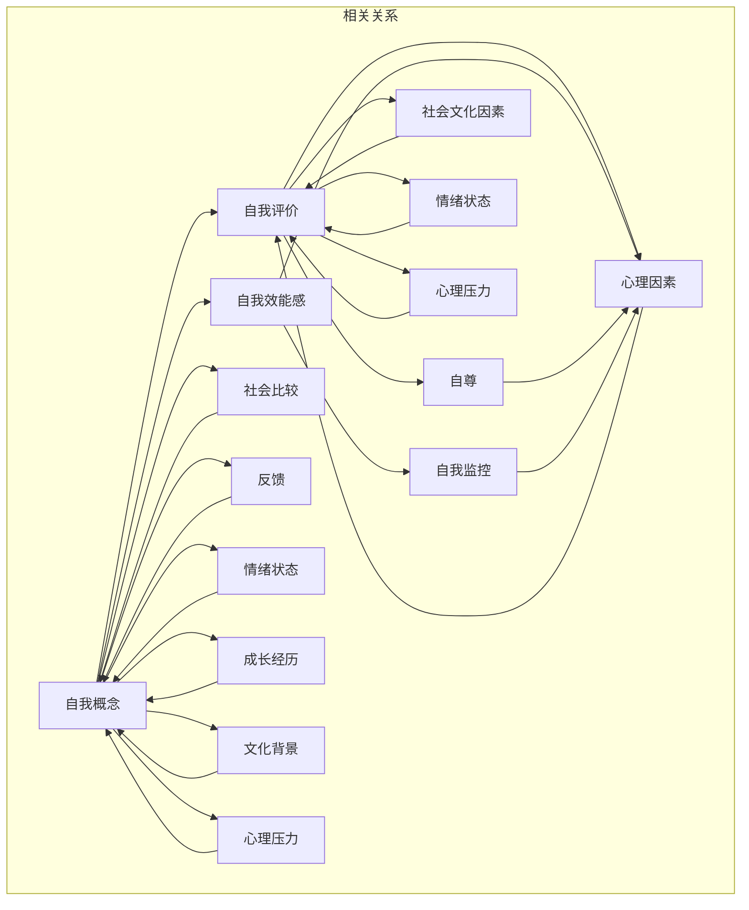

                 


## 引言：自我认知的起源与基础

自我认知，一个看似简单却深奥无比的概念，自古以来就引起了哲学家、心理学家、科学家们无数的探讨和思考。从古希腊哲学家苏格拉底提出的“认识你自己”，到现代心理学对自我认知的深入研究，自我认知始终是人类探索自身奥秘的重要领域。

### 什么是自我认知？

自我认知，指的是个体对自己身心状态、行为、情感以及与他人关系的认知过程。这个过程不仅涉及对外在事物的感知和认知，还包括对自己内在心理状态的理解和反思。简单来说，自我认知就是“认识自己”，包括对自己的性格、能力、情感和价值观的认知。

### 自我认知的重要性

自我认知对个体的成长和发展至关重要。首先，自我认知帮助个体明确自己的目标和方向，从而更好地规划自己的职业生涯和生活。其次，自我认知有助于个体建立良好的人际关系，因为只有真正了解自己，才能更好地理解他人。最后，自我认知还能提高个体的心理韧性和适应能力，使个体在面对困难和挑战时能够保持冷静和理智。

### 心理学中的自我认知理论

在心理学领域，许多理论都涉及到自我认知。例如，认知心理学强调认知过程对自我认知的影响，认为自我认知是通过内部心理过程实现的。社会认知理论则认为，个体是通过观察和模仿他人的行为来发展自我认知的。此外，发展心理学也关注自我认知在不同年龄阶段的演变过程。

### 自我认知的研究方法

心理学研究方法为自我认知的研究提供了重要的工具。实验法是研究自我认知的一种常用方法，通过设计实验来观察和测量个体在特定条件下的自我认知表现。此外，调查法和观察法也被广泛应用于自我认知的研究，通过收集个体的自我报告数据和观察个体的行为表现，来了解自我认知的各个方面。

在本文接下来的章节中，我们将进一步探讨自我认知的起源和基础理论，分析自我认知的维度和发展过程，以及探讨影响自我认知的各种因素。通过一步步的逻辑推理和深入分析，我们将对自我认知有一个更加全面和深刻的理解。

### 核心概念与联系

为了更好地理解自我认知，我们需要了解几个核心概念，并探讨它们之间的关系。以下是这些核心概念及其相互关系的Mermaid流程图：



### 自我概念

自我概念是指个体对自己的整体认知，包括个体的性格、能力、价值观等方面。它是个体对自我认知的基础，决定了个体如何看待自己，以及如何与他人互动。

### 自我评价

自我评价是个体对自己的判断和评价，包括自我效能感、自尊、自我监控等方面。自我评价直接影响个体的行为和情绪状态，对个体的成长和发展具有重要意义。

### 自我效能感

自我效能感是指个体对自己完成特定任务的信心和能力判断。它影响个体的行为选择、努力程度和情绪状态。自我效能感高的人更有可能实现目标，面对挑战时也更具韧性。

### 自尊

自尊是指个体对自己的价值和价值的评价。自尊水平高的人通常有较好的自我认知，更有可能建立积极的人际关系和面对生活中的挑战。

### 自我监控

自我监控是指个体对自己行为的观察和评估。它有助于个体调整自己的行为，以达到预期的目标。自我监控能力强的人通常能更好地控制自己的情绪和行为。

### 社会比较

社会比较是指个体通过将自己与他人进行比较，以评估自己的价值。社会比较可能对自我概念和自我评价产生积极或消极的影响，取决于比较的结果。

### 反馈

反馈是指他人或环境对个体行为的反应。积极的反馈可以提高个体的自我认知和自尊，而消极的反馈可能对自我认知产生负面影响。

### 情绪状态

情绪状态是指个体在特定时刻的情感体验。情绪状态会影响个体的自我认知和行为，例如，积极的情绪状态可能增强个体的自我效能感，而消极的情绪状态可能降低个体的自尊。

### 成长经历

成长经历是指个体在成长过程中所经历的各种事件和环境。成长经历对个体的自我认知产生深远影响，塑造了个体的性格、价值观和自我评价。

### 文化背景

文化背景是指个体所处的文化环境和社会背景。文化背景影响个体的价值观、行为方式和自我认知，不同的文化背景可能导致个体对自我认知的理解和评价存在差异。

### 心理压力

心理压力是指个体在应对压力源时产生的心理反应。心理压力可能对个体的自我认知产生负面影响，降低个体的自尊和自我效能感。

通过上述核心概念及其相互关系的Mermaid流程图，我们可以更清晰地理解自我认知的复杂性和多维性。在接下来的章节中，我们将深入探讨这些核心概念的具体内容和发展过程，帮助读者更全面地了解自我认知的奥秘。

### 认知心理学与自我认知

认知心理学是研究个体如何获取、处理和利用信息的心理学分支。在自我认知的研究中，认知心理学提供了重要的理论框架和方法，帮助我们理解自我认知的形成和运作机制。

首先，认知心理学强调认知过程在自我认知中的作用。自我认知不仅仅是简单的知觉或记忆，而是一个复杂的信息处理过程。在这个过程中，个体需要对内外部信息进行编码、存储和提取。例如，当一个人评估自己的能力时，他需要回忆过去成功的经历，同时排除失败的例子，然后对这些信息进行整合和评估。

核心算法原理方面，认知心理学提出了多种理论来解释自我认知的形成。其中，最著名的是图式理论（Schema Theory）和元认知理论（Metacognitive Theory）。图式理论认为，个体通过图式（Schema）来组织和解释信息。图式是一种心理结构，它代表了个体对特定概念或事件的认知。例如，一个人的“自我概念”图式可能包括他们的性格、兴趣、价值观等方面的信息。这个图式帮助个体理解自己，同时也影响了个体对自我评价和行为决策。

```python
# 图式理论的伪代码表示
class Schema:
    def __init__(self, traits, interests, values):
        self.traits = traits
        self.interests = interests
        self.values = values

    def update(self, new_info):
        # 更新图式的信息
        self.traits.update(new_info['traits'])
        self.interests.update(new_info['interests'])
        self.values.update(new_info['values'])

# 实例化图式
self_schema = Schema(traits={'smart': True, 'creative': False},
                      interests={'coding': True, 'painting': False},
                      values={'achievement': True, 'helpfulness': False})

# 更新图式
self_schema.update(new_info={'traits': {'smart': True, 'creative': True},
                            'interests': {'coding': True, 'painting': True},
                            'values': {'achievement': True, 'helpfulness': True}})
```

另一方面，元认知理论关注个体对自己的认知过程的认识和调节。元认知包括两个主要成分：元认知知识（Metacognitive Knowledge）和元认知监控（Metacognitive Monitoring）。元认知知识指的是个体对自己认知能力和学习策略的理解，例如，一个人可能知道自己在某些科目上表现更好。元认知监控则是指个体在认知过程中对自己行为和表现的监控和评估，例如，在考试中，一个人可能会监控自己的答题速度和准确性。

```python
# 元认知理论的伪代码表示
class MetacognitiveProcess:
    def __init__(self, knowledge, monitoring):
        self.knowledge = knowledge
        self.monitoring = monitoring

    def update_knowledge(self, new_knowledge):
        # 更新元认知知识
        self.knowledge = new_knowledge

    def monitor_performance(self, current_task):
        # 监控当前任务的表现
        performance = self.monitoring(current_task)
        return performance

# 实例化元认知过程
metacognition = MetacognitiveProcess(knowledge={'math': 'good', 'history': 'average'},
                                     monitoring=lambda task: 'excellent' if task == 'math' else 'poor')

# 更新元认知知识
metacognition.update_knowledge({'math': 'excellent', 'history': 'average'})

# 监控当前任务的表现
performance = metacognition.monitor_performance('math')
print(performance)  # 输出: excellent
```

通过这些理论和伪代码，我们可以更深入地理解自我认知的复杂性和多维性。认知心理学不仅帮助我们理解自我认知的形成机制，还为我们在实际生活中应用自我认知提供了理论指导。在接下来的章节中，我们将继续探讨自我认知在不同领域的应用，以及如何通过自我认知提升个人发展。

### 心理学研究方法与自我认知

心理学研究方法在自我认知的研究中起着至关重要的作用，为科学家们提供了理解个体内部心理过程和行为模式的工具。以下将介绍几种常见的研究方法，并探讨它们在自我认知研究中的应用。

#### 实验法

实验法是心理学研究中的一种核心方法，通过控制和操作变量来观察个体行为和认知过程。在自我认知研究中，实验法可以用来探讨不同因素对自我概念和自我评价的影响。例如，研究者可以设计实验来测试自我效能感在不同任务完成情况下的变化，或者通过实验操纵反馈条件来研究反馈对自我认知的影响。

**实验设计示例**：

- **实验变量**：自变量是任务类型（如简单任务、复杂任务），因变量是自我效能感的评估。
- **实验步骤**：
  1. 将参与者随机分为两组，一组完成简单任务，另一组完成复杂任务。
  2. 让每个参与者完成自评问卷，评估他们的自我效能感。
  3. 分析两组数据，比较不同任务类型对自我效能感的影响。

**数据分析**：

- 使用统计软件（如SPSS）进行独立样本t检验，以分析任务类型对自我效能感的显著性影响。

#### 调查法

调查法通过问卷调查收集参与者的自我报告数据，是自我认知研究中的另一种重要方法。问卷设计可以涵盖多种维度，如自我概念、自我评价、情绪状态等，从而提供丰富的数据，帮助研究者全面了解个体自我认知的各个方面。

**调查设计示例**：

- **问卷内容**：包括多个条目，如“我对自己的智力感到满意”、“我对自己的人际交往能力有信心”等。
- **数据分析**：
  1. 对问卷结果进行描述性统计分析，计算平均分、标准差等。
  2. 使用因素分析来确定问卷条目是否有效，并构建自我认知的因素结构。

#### 观察法

观察法通过直接观察参与者的行为和表现来研究自我认知。这种方法常用于自然环境中，如学校、家庭等，可以提供真实情境下的数据。

**观察设计示例**：

- **观察内容**：记录参与者在课堂上的表现、人际互动、自我反思等行为。
- **数据分析**：
  1. 使用编码系统对观察结果进行分类和分析。
  2. 比较不同情境下参与者的行为模式，探讨自我认知的动态变化。

#### 实验与调查、观察法的结合

将实验法、调查法和观察法结合起来，可以提供更全面和深入的数据。例如，研究者可以在实验后使用问卷调查来补充实验数据的不足，或者在观察过程中记录详细的行为数据，以验证自我认知的理论假设。

**综合研究示例**：

- **实验与调查结合**：先通过实验法操纵任务难度，然后使用问卷调查收集参与者对自我效能感的自我报告数据。
- **观察与调查结合**：在自然环境中观察参与者行为，同时使用问卷调查收集他们的自我认知评价。

通过这些研究方法的结合，心理学家可以更全面地理解自我认知的复杂性和多维性，从而为个体的发展提供科学依据。

### 自我认知的维度

自我认知是一个多维度的概念，包括多个相互关联的维度。这些维度共同构成了个体对自己的全面认知，影响着个体的行为、情绪和人际关系。以下是几个主要的自我认知维度及其对个体发展的作用。

#### 自我概念

自我概念是指个体对自己整体身份的感知和认识，包括个体的性格、能力、价值观等方面。一个清晰的自我概念有助于个体明确自己的目标和方向，从而更好地规划职业生涯和生活。例如，一个人如果认为自己在某方面具备优势，可能会更有动力去发展这一能力。

**自我概念的作用**：

- **目标设定**：自我概念帮助个体识别自己的优势领域，从而设定具体、可行的目标。
- **自我激励**：清晰的自我概念可以增强个体的自我激励，使其在面对挑战时更加坚韧。
- **职业规划**：自我概念对职业规划具有重要影响，有助于个体选择适合自己的职业路径。

#### 自我评价

自我评价是指个体对自己的行为、能力和价值进行评价的过程。自我评价可能包含自我效能感、自尊、自我监控等多个方面。自我评价的积极与否对个体的心理健康和生活满意度有重要影响。

**自我评价的作用**：

- **心理韧性和适应能力**：积极的自我评价有助于个体在面对挫折和压力时保持心理韧性。
- **人际关系**：自我评价影响个体的人际交往方式，自尊水平高的人通常更受欢迎。
- **心理健康**：自我评价的消极可能导致心理问题，如焦虑、抑郁等。

#### 自我效能感

自我效能感是指个体对自己完成特定任务的能力的信心。自我效能感高的人更有可能实现目标，因为他们相信自己有能力克服困难。

**自我效能感的作用**：

- **行为选择**：自我效能感影响个体在面临选择时的决策，高自我效能感的人更倾向于选择具有挑战性的任务。
- **努力程度**：自我效能感影响个体在任务中的努力程度，高自我效能感的人更愿意付出更多努力。
- **学业和职业表现**：自我效能感与学业和职业表现密切相关，高自我效能感的个体通常表现更好。

#### 自尊

自尊是指个体对自己价值和价值的评价。自尊水平高的人通常有较强的自我认知，能够更好地应对生活中的挑战。

**自尊的作用**：

- **心理健康**：高自尊有助于个体保持心理健康，降低抑郁和焦虑的风险。
- **社交能力**：自尊水平高的人通常更自信，更容易建立良好的人际关系。
- **自我实现**：自尊有助于个体追求自我实现，追求更高的目标和成就。

#### 自我监控

自我监控是指个体对自己行为的观察和评估。自我监控能力强的人能够更好地控制自己的行为，以达到预期的目标。

**自我监控的作用**：

- **行为调整**：自我监控帮助个体发现和纠正不良行为，从而提升自我认知。
- **目标实现**：自我监控有助于个体坚持目标，克服拖延和逃避等行为。
- **情绪调节**：自我监控可以帮助个体更好地管理情绪，保持心理健康。

#### 自我概念、自我评价、自我效能感、自尊和自我监控之间的关系

这些自我认知维度之间相互影响，共同构成了个体的自我认知体系。例如，自我概念会影响自我评价，而自我评价又可能影响自我效能感。自尊和自我监控则通过不同的机制对自我认知产生作用。

通过深入了解这些自我认知维度，个体可以更好地理解自己，从而在个人发展和人际关系中取得更好的效果。在接下来的章节中，我们将探讨影响自我认知的各种因素，以及如何通过这些因素来调节和提升自我认知。

### 自我认知的发展过程

自我认知是一个动态的发展过程，贯穿于个体的一生。从婴儿期到老年期，自我认知不断演变和发展，受到多种因素的影响。以下将探讨自我认知在不同年龄阶段的演变过程，以及这些因素如何共同塑造个体的自我认知。

#### 婴儿期和幼儿期（0-5岁）

在婴儿期和幼儿期，自我认知刚刚开始形成。这个阶段，儿童的自我认知主要依赖于他们的感官体验和与父母的互动。婴儿通过模仿父母的行为和语言来了解自己，并开始形成基本的自我概念。

**影响自我认知的因素**：

- **亲子互动**：父母与婴儿的互动质量对自我认知的发展有重要影响。积极的亲子互动可以增强婴儿的自我价值感，而缺乏互动可能导致自我认知的障碍。
- **语言发展**：语言是自我认知发展的重要工具。幼儿通过学习语言来理解自己和他人，语言能力的发展有助于自我认知的提升。

#### 学龄前期（6-11岁）

学龄前儿童开始进入学校，学习新的知识和技能，自我认知在这个阶段得到了进一步的发展。学龄前儿童的自我认知逐渐从具体的、感官的经验转向更抽象的概念。

**影响自我认知的因素**：

- **教育环境**：学校教育对自我认知的发展至关重要。一个积极、支持性的教育环境可以帮助儿童建立积极的自我概念和自尊。
- **同伴关系**：同伴关系对自我认知有重要影响。学龄前儿童通过与同伴的互动来认识自己，同伴的反馈和行为模式会影响他们的自我认知。

#### 学龄期（12-18岁）

在学龄期，个体进入了青春期，自我认知经历了一个显著的演变过程。这个阶段，个体开始对自己的性别、身份和未来职业进行深入的思考。

**影响自我认知的因素**：

- **身份认同**：青春期是个体形成身份认同的关键时期。个体在这个阶段可能会经历自我认同的危机，通过探索不同的角色和价值观来建立自己的身份。
- **情绪体验**：青春期的情绪体验对自我认知的发展有深远影响。情绪的波动和冲突可能会对自我认知产生积极或消极的影响。

#### 成年期

成年期是自我认知相对稳定的阶段，但仍然受到多种因素的影响。成年人的自我认知不仅包括对自己能力的认知，还包括对生活目标和价值观的思考。

**影响自我认知的因素**：

- **职业发展**：职业成就对自我认知有重要影响。一个成功的职业生涯可以增强个体的自我效能感和自尊。
- **社会文化**：社会文化和价值观对成年人的自我认知有深远影响。不同的文化背景下，个体的自我认知可能存在显著差异。

#### 老年期

老年期是自我认知发展的最后一个阶段，个体的自我认知可能会受到身体和认知能力的限制。

**影响自我认知的因素**：

- **健康状态**：身体和认知健康对老年期的自我认知有重要影响。健康的身体和良好的认知功能可以维持较高的自我认知水平。
- **社交活动**：社交活动对老年人的心理健康和自我认知有积极影响。与家人和朋友的互动可以帮助老年人保持积极的生活态度和自我认知。

通过了解自我认知在不同年龄阶段的演变过程和影响因素，我们可以更好地理解个体的自我认知发展，并在教育、职业发展和心理健康等方面提供有针对性的支持。

### 社会文化因素对自我认知的影响

社会文化因素在塑造个体自我认知方面起着至关重要的作用。不同的社会文化背景对自我认知的维度、发展过程和表现形式都有深远的影响。以下将探讨社会文化对自我认知的影响，以及不同文化背景下自我认知的特点。

#### 社会文化背景对自我认知的影响

社会文化背景包括社会结构、价值观、习俗、信仰、语言等多个方面，这些因素共同构成了个体生活的环境，影响着个体的认知和行为模式。

1. **社会结构**：社会结构，如社会阶层、家庭结构和教育制度，对个体的自我认知有直接影响。例如，社会阶层可能影响个体对自身价值的认知，较高社会阶层的人可能更倾向于自我评价较高，而较低社会阶层的人可能更倾向于自我评价较低。

2. **价值观**：价值观是文化的重要组成部分，影响着个体对自我和世界的看法。例如，在某些文化中，个人主义价值观强调个体的独立性和自主性，导致个体更关注自我认知的独立性。而在集体主义文化中，个体往往更多地考虑自己在群体中的角色和关系，这影响了自我认知的维度。

3. **习俗和信仰**：习俗和信仰是社会文化中的行为规范和思想观念，它们对个体的自我认知有潜移默化的影响。例如，某些文化中的宗教信仰可能影响个体的道德标准和自我评价。

4. **语言**：语言不仅是沟通的工具，也是文化的重要载体。不同的语言可能影响个体的思维方式，从而影响自我认知。例如，某些语言中可能有特定的词汇来描述自我认知的不同维度，这可能影响个体对这些维度的认知和重视程度。

#### 不同文化背景下自我认知的特点

不同文化背景下，个体的自我认知表现出不同的特点。以下是一些主要的文化类型及其对应的自我认知特点：

1. **西方文化**：在西方文化中，个人主义价值观占主导地位，个体更倾向于独立思考、追求个人成就。西方文化中的自我认知通常包括自我效能感、自尊和独立性等维度。

   - **自我效能感**：西方文化中，个体更重视自我效能感，相信自己的能力可以影响生活的结果。
   - **自尊**：自尊在西方文化中是一个重要的自我认知维度，个体的自尊水平往往与他们的成就和社会地位相关。
   - **独立性**：独立性是西方文化中自我认知的重要特点，个体更重视自我决策和自我表达。

2. **东方文化**：在东方文化中，集体主义价值观更为普遍，个体更注重与他人的关系和群体的利益。东方文化中的自我认知通常包括身份认同、责任感和社交能力等维度。

   - **身份认同**：东方文化中，个体更倾向于从家庭、社会和文化的角度来理解自己，身份认同通常与群体的归属感紧密相关。
   - **责任感**：责任感在东方文化中是一个重要的自我认知维度，个体往往更注重履行社会责任和 familial duties。
   - **社交能力**：社交能力在东方文化中非常重要，个体更注重与他人建立和谐的关系，这影响了他们的自我认知。

3. **多元文化**：在多元文化社会中，个体可能同时受到多种文化的影响，这导致他们的自我认知具有多样性和复杂性。在多元文化背景下，个体的自我认知可能融合了不同文化的特点，展现出独特的个性。

   - **混合身份**：在多元文化中，个体可能具有双重或多重身份，这使得他们的自我认知更加多元和复杂。
   - **文化适应**：文化适应能力在多元文化社会中尤为重要，个体需要在不同文化背景下调整自己的行为和认知，以适应不同的社会环境。

通过理解不同社会文化背景下自我认知的特点，我们可以更好地理解个体之间的差异，并在跨文化交流中提供更有效的支持和指导。在全球化日益深入的今天，了解社会文化因素对自我认知的影响对于促进个体和社会的发展具有重要意义。

### 情绪状态对自我认知的影响

情绪状态是影响自我认知的重要因素之一。个体的情绪体验不仅影响他们对周围环境的认知，也深刻地影响着他们对自我的认知。情绪状态可能通过多种途径对自我认知产生积极或消极的影响。

#### 情绪体验与自我认知的关系

情绪体验是指个体在特定情境下所产生的情绪感受。这些情绪感受不仅反映了个体的心理状态，还影响他们的认知过程。例如，当个体处于积极的情绪状态时，他们可能会更倾向于用积极的眼光看待自己，从而提高自我评价。相反，当个体处于消极的情绪状态时，他们可能会对自己持有更低的评价，甚至出现自我否定的情况。

1. **积极情绪**：

   - **增强自我效能感**：积极情绪可以提高个体的自我效能感，使他们更有信心去完成复杂任务。例如，当一个人在考试中感到自信时，他会认为自己有能力应对考试，这有助于他在考试中发挥出色。
   - **提高自尊**：积极情绪还可以提高个体的自尊，使他们对自己的价值有更正面的评价。例如，一个在社交场合中得到表扬的人可能会感到更加自尊，认为自己是一个受欢迎和有价值的人。
   - **促进自我反思**：积极情绪有助于个体进行自我反思，从而更好地了解自己的内心世界。例如，在放松和愉悦的状态下，一个人可能会更愿意思考自己的行为和决策，从而进行更深入的自我认知。

2. **消极情绪**：

   - **降低自我效能感**：消极情绪可能会降低个体的自我效能感，使他们怀疑自己的能力。例如，当一个人在经历失败或挫折时，他可能会认为自己没有能力应对类似的挑战，这会影响他未来的行为和决策。
   - **降低自尊**：消极情绪可能会导致个体的自尊下降，使他们对自己的价值产生怀疑。例如，一个在社交场合中感到尴尬的人可能会认为自己缺乏社交能力，从而影响他们的社交行为。
   - **阻碍自我反思**：消极情绪可能会阻碍个体的自我反思，使他们难以进行深入的自我认知。例如，当一个人在焦虑或抑郁的状态下，他可能会过于关注负面情绪，而忽略了对自己的积极方面的思考。

#### 情绪调节与自我认知的提升

了解情绪状态对自我认知的影响，我们可以通过情绪调节来提升自我认知。以下是一些有效的情绪调节策略：

1. **认知重构**：通过认知重构，个体可以改变对负面情绪事件的理解和解释，从而减轻负面情绪的影响。例如，一个人在失败后可以通过认知重构来理解失败是成功的一部分，从而提高自我效能感。

2. **情绪表达**：适当地表达情绪可以帮助个体释放情绪压力，从而改善情绪状态。例如，通过写日记、与朋友倾诉或参加心理辅导，个体可以更好地理解自己的情绪，并进行有效的情绪调节。

3. **积极心理训练**：通过积极心理训练，如正念冥想、感恩练习等，个体可以培养积极情绪，提高自我认知水平。例如，通过正念冥想，个体可以学会专注当下，减少焦虑和压力，从而更好地进行自我认知。

通过情绪调节，个体可以更好地管理自己的情绪状态，从而提升自我认知水平。情绪调节不仅有助于个体的心理健康，还能促进他们在个人发展和社会交往中的成功。在未来的章节中，我们将继续探讨自我认知的其他方面，帮助读者更全面地理解自我认知的复杂性和重要性。

### 心理压力对自我认知的影响

心理压力是现代生活中普遍存在的现象，它对个体的心理和生理健康都有深远的影响。自我认知作为心理过程的重要组成部分，同样会受到心理压力的显著影响。以下将详细探讨心理压力对自我认知的负面影响，以及如何通过有效的应对策略来减轻这些影响。

#### 心理压力对自我认知的负面影响

1. **自我认知的狭隘化**：

   心理压力往往导致个体对自我认知的狭隘化，即个体在压力情境下更容易关注负面信息，忽视积极方面。这种现象被称为“认知偏差”。例如，一个长期处于工作压力下的人可能会过度关注自己的工作失误，而忽视自己的成就和努力，从而导致自我评价的下降。

2. **自我效能感的降低**：

   心理压力可能会削弱个体的自我效能感，即个体对自己完成特定任务的信心。长期的心理压力，如家庭问题或工作压力，可能导致个体怀疑自己的能力，从而影响他们在任务中的表现和自我认知。

3. **自我反思的障碍**：

   心理压力还可能阻碍个体的自我反思能力。在高度压力的状态下，个体可能会过于关注当前的问题和挑战，而忽视对自我经验的深入思考。这可能导致个体的自我认知停滞不前，无法进行有效的自我提升。

#### 应对心理压力的策略

为了减轻心理压力对自我认知的负面影响，个体可以采取以下策略：

1. **情绪调节**：

   情绪调节是减轻心理压力的重要手段。通过认知重构、放松训练和正念冥想等方法，个体可以更好地管理自己的情绪，从而减轻心理压力。例如，通过认知重构，个体可以改变对负面事件的解释方式，从而降低情绪反应的强度。

2. **建立支持系统**：

   建立一个支持系统，包括亲朋好友和专业人士，可以帮助个体更好地应对心理压力。与支持者分享自己的压力和困惑，可以获得情感上的支持和实际建议，从而减轻心理负担。

3. **自我反思**：

   自我反思是提升自我认知的重要途径。通过定期进行自我反思，个体可以深入思考自己的行为、决策和情感，从而发现和纠正认知偏差。例如，每天花时间记录自己的感受和经历，可以帮助个体更好地理解自己的内心世界。

4. **健康生活方式**：

   保持健康的生活方式，如定期锻炼、合理饮食和充足睡眠，可以增强个体的心理韧性，从而更好地应对心理压力。体育锻炼可以释放压力，改善情绪状态；合理的饮食和充足的睡眠有助于保持身体和心理的健康。

#### 实际案例分析与解读

以下是一个实际案例，展示如何通过有效的策略来减轻心理压力对自我认知的影响：

**案例**：小李是一名公司的项目经理，经常面临项目截止日期和工作压力。这种长期的压力导致他出现自我认知的狭隘化，只关注工作失误而忽视成就，同时自我效能感下降，怀疑自己的能力。

**解决方案**：

1. **情绪调节**：小李通过正念冥想和深呼吸练习来管理自己的情绪，减轻压力。他学会了在高压情况下保持冷静，从而更好地处理工作任务。

2. **建立支持系统**：小李与家人和同事分享了压力和困惑，获得了情感上的支持和实际建议。这种分享让他感到心理负担减轻，同时得到了解决问题的方法。

3. **自我反思**：小李开始每天记录自己的工作经历和感受，通过自我反思来发现和纠正认知偏差。他意识到自己的工作失误并非完全失败，而是提供了改进的机会。

4. **健康生活方式**：小李调整了作息时间，增加了锻炼时间，改善了饮食习惯。这些健康生活方式让他感觉身体和心理更加健康，提高了心理韧性。

**结果**：通过上述策略，小李的压力水平显著降低，自我认知得到了提升。他不再只关注负面信息，而是更加全面地看待自己的工作和能力。自我效能感增强，他在工作中表现出色，取得了显著的成绩。

通过这个案例，我们可以看到，心理压力对自我认知的负面影响是可以通过有效的策略来减轻的。情绪调节、建立支持系统、自我反思和健康生活方式都是重要的应对策略，可以帮助个体更好地管理心理压力，提升自我认知。

### 自我认知的误区

在自我认知的过程中，人们往往会陷入各种误区，这些误区不仅影响个体的心理健康，还可能阻碍个人成长和发展。以下是几种常见的自我认知误区，以及如何避免这些误区。

#### 自我欺骗

自我欺骗是指个体有意或无意地对自己的认知进行扭曲，以维护自己的自尊或满足心理需求。例如，一个人可能夸大自己的成就，或者低估自己的问题，以维持自我形象的完美。

**如何避免自我欺骗**：

- **自我反思**：定期进行自我反思，审视自己的行为和认知，识别自我欺骗的行为。
- **接受现实**：勇敢地面对自己的优点和不足，接受自己的不完美，从而避免自我欺骗。

#### 自我评价偏见

自我评价偏见是指个体在自我评价时，常常对自己过于苛刻或过于宽容，导致自我评价的不准确性。例如，一个人可能在犯错时过度自责，而在成功时忽视自己的努力。

**如何避免自我评价偏见**：

- **平衡视角**：在自我评价时，既要看到自己的不足，也要认识到自己的优点和成就。
- **设立客观标准**：使用客观标准来评价自己的行为和表现，而不是仅凭主观感受。

#### 自我监控过度

自我监控过度是指个体对自己的行为和情绪进行过度监控，导致自我压力和心理负担。例如，一个人可能频繁地检查自己的工作成果，或者过度关注自己的身体健康。

**如何避免自我监控过度**：

- **设定合理的期望**：根据自己的能力和实际情况，设定合理的目标和期望，避免过度追求完美。
- **学会放松**：学会放松技巧，如深呼吸、冥想等，以减轻自我监控带来的压力。

#### 自我认知固定论

自我认知固定论是指个体认为自己的性格、能力和价值观是不可改变的，从而限制了自己的成长和发展。例如，一个人可能认为自己在某方面没有天赋，因此放弃尝试和学习。

**如何避免自我认知固定论**：

- **接受变化**：认识到自我是动态变化的，每个人都有潜力通过学习和努力来提升自己。
- **持续学习**：保持好奇心和学习的热情，不断探索新的领域和知识，从而拓宽自己的认知边界。

通过识别和避免这些自我认知误区，个体可以更准确地了解自己，提升自我认知水平，从而在个人成长和生活中取得更好的成果。

### 自我反思与自我提升策略

自我反思是提升自我认知的重要手段，它帮助个体深入理解自己的内心世界，发现自身的优点和不足，从而推动个人成长和发展。以下将介绍自我反思的方法和技巧，并探讨如何通过自我反思来实现自我提升。

#### 自我反思的方法

1. **日记法**：通过写日记记录自己的日常生活、情感体验和思考，可以帮助个体更好地理解和分析自己的行为和情绪。日记法不仅可以帮助个体回顾过去，还能为未来的决策提供参考。

2. **提问法**：在自我反思过程中，通过提出问题来引导思考，有助于深入探索自己的内心世界。例如，可以问自己：“我在这个情境中做了什么决定？这个决定背后的动机是什么？这个决定对我有什么影响？”通过这些问题，个体可以更好地了解自己的行为模式和心理机制。

3. **对话法**：与信任的朋友、家人或心理咨询师进行对话，可以帮助个体从外部视角审视自己。他人的反馈和观点可以帮助个体看到自己可能忽视的问题，从而促进自我认知的提升。

4. **冥想法**：冥想是一种通过专注和静心来深入反思内心世界的技巧。通过冥想，个体可以摆脱日常的干扰，更清晰地看到自己的内心状态，从而进行深层次的自我反思。

#### 自我反思的技巧

1. **具体化**：在自我反思时，尽量具体地描述事件和情感，而不是使用模糊的词汇。具体化可以帮助个体更准确地理解自己的行为和情绪。

2. **客观分析**：在自我反思时，尽量保持客观和中立的态度，避免情绪化的评判。通过客观分析，个体可以更清晰地识别问题的本质，从而找到有效的解决方案。

3. **探索动机**：在自我反思过程中，探索行为背后的动机是非常重要的。了解自己的动机可以帮助个体更好地理解自己的行为模式，并找到改进的方向。

#### 实现自我提升的策略

1. **设定明确目标**：通过自我反思，个体可以识别自己的优点和不足，从而设定具体、可行的个人目标。设定目标有助于个体保持动力，推动个人成长。

2. **制定行动计划**：在设定目标后，制定具体的行动计划是实现目标的关键。行动计划应该详细描述每个步骤，以及实现这些步骤所需的时间和方法。

3. **持续学习**：通过自我反思，个体可以发现自己在知识、技能和经验方面的不足，从而制定学习计划。持续学习不仅可以提升个体的能力，还可以拓宽视野，促进个人成长。

4. **自我激励**：自我激励是保持自我提升动力的关键。个体可以通过奖励自己、记录进步和与他人分享成就来增强自我激励。

5. **寻求反馈**：通过定期寻求他人的反馈，个体可以更全面地了解自己的表现和进步，从而进行调整和改进。反馈不仅可以帮助个体识别问题，还可以提供新的视角和思路。

通过自我反思和自我提升策略，个体可以不断提升自我认知，实现个人成长和发展。自我反思不仅帮助个体了解自己，还为他们提供了持续进步的动力和方向。

### 自我认知在个人发展中的作用

自我认知在个人发展中扮演着至关重要的角色。一个清晰的自我认知不仅有助于个体明确自己的目标和方向，还能提升个人的职业竞争力，促进健康的人际关系。以下将详细探讨自我认知在职业规划和人际关系中的重要作用，并分析自我认知对心理健康和幸福感的影响。

#### 职业规划中的自我认知

自我认知是职业规划的基础。一个明确的自我认知可以帮助个体了解自己的兴趣、价值观和优势，从而更好地选择适合自己的职业路径。

1. **兴趣与职业匹配**：通过自我认知，个体可以了解自己对哪些工作领域感兴趣。这种兴趣与职业的匹配有助于提升工作满意度和职业成就感。

2. **价值观与职业目标**：自我认知有助于个体明确自己的价值观，从而在职业规划中找到与价值观相符的领域。例如，一个重视创新和挑战的个体可能会更倾向于选择研发或创业领域，而一个重视稳定和人际关系的个体可能会更适合选择行政管理或教育领域。

3. **优势与职业发展**：自我认知可以帮助个体识别自己的优势，从而在职业发展中利用这些优势。例如，一个擅长沟通和协调的个体可以选择销售或人力资源管理职业，而一个擅长分析和创新的个体可以选择研发或咨询职业。

#### 人际关系中的自我认知

自我认知不仅影响个体的职业选择，还对人际关系产生深远影响。一个清晰的自我认知有助于个体更好地理解自己和他人，从而建立健康、积极的人际关系。

1. **自我认知与人际交往**：自我认知高的个体通常更了解自己的需求和情感，这使得他们在人际交往中更加自信和自如。他们能够更好地表达自己，理解他人的需求，从而建立良好的人际关系。

2. **自我认知与沟通**：自我认知有助于个体在沟通中保持真诚和开放。一个清晰的自我认知使个体能够更好地倾听他人，理解对方的观点和感受，从而进行有效的沟通。

3. **自我认知与冲突处理**：在人际关系中，冲突是难免的。一个清晰的自我认知可以帮助个体更好地处理冲突。通过自我反思，个体可以识别冲突的原因，找到解决问题的方法，从而避免或减少冲突的发生。

#### 自我认知与心理健康

自我认知不仅影响个体的职业和人际关系，还对心理健康和幸福感产生重要影响。

1. **自我认知与心理韧性**：一个清晰的自我认知可以帮助个体在面对挑战和困难时保持心理韧性。通过自我反思，个体可以了解自己的心理资源，并学会利用这些资源来应对压力和挫折。

2. **自我认知与心理健康**：自我认知与心理健康密切相关。一个健康的自我认知有助于个体保持积极的心态，减少焦虑和抑郁的风险。通过自我反思，个体可以识别和解决内心的矛盾和冲突，从而提升心理健康。

3. **自我认知与幸福感**：一个清晰的自我认知有助于个体实现自我价值，从而提升幸福感。通过自我认知，个体可以明确自己的目标和愿望，并努力实现这些目标，从而获得成就感和满足感。

通过了解自我认知在个人发展中的重要作用，个体可以更有效地进行职业规划，建立健康的人际关系，提升心理健康和幸福感。自我认知不仅是个人成长的关键，也是实现全面发展的基石。

### 自我认知在社会中的作用

自我认知不仅在个人层面具有重要意义，也在社会层面发挥着重要作用。一个清晰和健康的自我认知有助于促进社会和谐、个体心理健康以及社会进步。以下将探讨自我认知对社会和谐、心理健康和社会进步的影响，以及如何通过自我认知提升社会效益。

#### 自我认知与社会和谐

自我认知是社会和谐的重要基础。一个清晰的自我认知有助于个体理解自己与他人的关系，从而促进社会互动中的相互理解和尊重。

1. **促进相互理解**：自我认知高的个体能够更好地理解他人的需求和情感，从而在互动中表现出更多的同情和同理心。这种相互理解有助于减少社会冲突，促进社会和谐。

2. **增强社会凝聚力**：自我认知有助于个体认识到自己在社会中的角色和责任。一个清晰的自我认知使个体更愿意为社会贡献自己的力量，从而增强社会凝聚力。

3. **减少偏见和歧视**：自我认知可以减少个体对其他群体的偏见和歧视。通过自我反思，个体可以识别和纠正自己的偏见，从而建立更加包容和多元的社会。

#### 自我认知与心理健康

自我认知对个体的心理健康具有深远的影响。一个健康的自我认知有助于提升个体的心理韧性，减少心理健康问题的发生。

1. **心理韧性**：自我认知高的个体能够更好地应对生活中的压力和挑战。通过自我反思，个体可以识别自己的心理资源，并学会利用这些资源来增强心理韧性。

2. **减少焦虑和抑郁**：一个清晰的自我认知有助于个体更好地管理情绪，减少焦虑和抑郁的风险。自我反思可以帮助个体识别和解决内心的矛盾和冲突，从而保持心理健康。

3. **提升生活质量**：健康的自我认知有助于个体建立积极的生活态度，从而提升生活质量。通过自我反思，个体可以明确自己的价值观和目标，从而过上更有意义和满足的生活。

#### 自我认知与社会进步

自我认知不仅影响个体的发展，也对社会进步产生重要影响。一个清晰和健康的自我认知有助于社会创新、科技进步和社会治理的改进。

1. **促进社会创新**：自我认知高的个体通常具备更强的创造力和创新能力。这种创新能力可以推动社会进步，带来新的科技和商业模式。

2. **促进科技进步**：自我认知有助于个体认识到自己在科技进步中的角色和责任。通过自我反思，科学家和工程师可以更好地理解自己的研究和创新方向，从而推动科技进步。

3. **提升社会治理效率**：自我认知可以帮助决策者更好地理解社会需求和问题，从而制定更有效的社会政策和治理策略。通过自我反思，决策者可以识别和纠正政策中的不足，从而提升社会治理效率。

通过自我认知的提升，我们可以更好地促进社会和谐、提升个体心理健康以及推动社会进步。自我认知不仅是个人成长的关键，也是实现社会全面发展的基石。

### 自我认知的心理学应用

自我认知在心理学领域具有广泛的应用，包括心理咨询与治疗、教育以及培训等多个方面。通过深入了解自我认知的心理学应用，我们可以更有效地利用这些工具和方法，提升个人和群体的心理健康和发展水平。

#### 心理咨询与治疗

在心理咨询和治疗中，自我认知被广泛应用于帮助个体识别和解决心理问题。以下是一些常见的自我认知应用：

1. **认知行为疗法（CBT）**：

   认知行为疗法是一种基于自我认知的心理治疗方法，主要关注个体认知过程对情绪和行为的影响。通过认知重构，咨询师帮助患者识别和纠正认知偏差，如过度泛化、黑白思维等，从而改善情绪状态和行为。

   **案例分析**：

   - **案例**：一位患者因为过去的失败经历，对自己的能力产生了严重的怀疑。她经常感到焦虑和无助，影响了日常生活。
   - **治疗过程**：咨询师通过与患者进行多次对话，帮助她识别认知偏差，如“我不可能成功”和“我一无是处”。通过认知重构，咨询师引导患者重新评估这些认知，例如，“我有成功的时候，也有失败的时候，这并不代表我一无是处”。

2. **自我认知训练**：

   自我认知训练是一种通过练习和反馈来提升个体自我认知能力的治疗方法。这种方法通常包括自我监控、日记记录和反思等。

   **案例分析**：

   - **案例**：一位患者经常因为情绪失控而与家人和朋友发生冲突。他希望通过自我认知训练来改善情绪管理能力。
   - **治疗过程**：咨询师与患者一起制定情绪监控计划，包括每天记录情绪变化、触发因素和应对策略。通过不断的训练，患者逐渐学会了更好地管理自己的情绪，减少冲突。

3. **心理动力学治疗**：

   心理动力学治疗关注个体的潜意识过程，通过自我认知来揭示和解决深层次的心理问题。这种方法通常涉及深度访谈和自由联想。

   **案例分析**：

   - **案例**：一位患者长期受到童年创伤的影响，导致他在人际关系中感到恐惧和焦虑。
   - **治疗过程**：咨询师通过与患者的深度访谈和自由联想，帮助患者揭示潜意识中的冲突和防御机制。通过自我认知，患者逐渐理解了自己的行为模式，并学会了处理过去的创伤。

#### 教育与培训

自我认知在教育与培训中的应用同样广泛，有助于学生和员工的发展。

1. **自我认知教育**：

   自我认知教育是一种通过培养学生自我认知能力来促进其全面发展的一种教育模式。这种方法强调学生对自己认知过程的理解和反思。

   **案例分析**：

   - **案例**：在一所中学，教师通过自我认知教育课程帮助学生理解自己的学习风格和情绪管理方法。
   - **教育过程**：教师引导学生进行自我反思，识别自己的优势和不足，并制定个人发展计划。通过这种方式，学生不仅提高了学习效果，还增强了自信心和情绪管理能力。

2. **员工培训**：

   在企业培训中，自我认知培训可以帮助员工了解自己的优势和不足，从而提升职业能力和工作效率。

   **案例分析**：

   - **案例**：一家公司为管理层提供了自我认知培训，以提升他们的领导力和决策能力。
   - **培训过程**：培训师通过工作坊和讨论，帮助管理者识别自己的领导风格和决策偏好。通过自我反思和团队协作，管理者学会了如何更好地领导团队和应对复杂问题。

3. **职业发展规划**：

   自我认知在职业发展规划中的应用可以帮助个体明确自己的职业目标和路径，从而实现职业发展。

   **案例分析**：

   - **案例**：一位职场新人通过职业咨询，利用自我认知工具分析自己的兴趣、能力和价值观。
   - **职业规划**：通过职业咨询，个体明确了适合自己的职业方向，并制定了详细的职业发展计划，包括技能提升、经验积累和职业网络建设。

通过自我认知的心理学应用，心理咨询与治疗、教育与培训等领域的实践不仅可以提升个体和群体的心理健康，还能促进个人和组织的全面发展。

### 自我认知的未来发展趋势

随着科技的快速发展，自我认知研究正在迎来前所未有的机遇和挑战。人工智能、生物技术等新兴领域不仅为自我认知研究提供了丰富的工具和方法，还预示着未来自我认知研究的发展趋势。

#### 人工智能与自我认知

人工智能（AI）在自我认知研究中的应用日益广泛。通过机器学习和深度学习技术，研究者能够从大规模数据中提取有价值的信息，从而更深入地了解个体的心理过程和行为模式。以下是一些关键的发展趋势：

1. **个性识别与预测**：

   人工智能技术可以分析个体的语言、行为和生理数据，识别个体的个性特征和潜在需求。例如，通过分析社交媒体数据，AI可以预测个体的情感状态和行为倾向。

   **技术实现**：

   - **语言分析**：使用自然语言处理（NLP）技术分析个体的社交媒体帖子、邮件等文本，识别情绪和主题。
   - **行为分析**：结合计算机视觉技术，分析个体的行为和表情，如面部表情识别、姿态分析等。

2. **智能辅助治疗**：

   人工智能可以为心理健康提供智能辅助治疗，通过个性化干预帮助个体管理情绪和应对压力。例如，智能聊天机器人可以根据用户提供的反馈，提供个性化的建议和指导。

   **案例分析**：

   - **智能聊天机器人**：一些心理健康平台已经推出了基于AI的智能聊天机器人，它们可以与用户进行自然语言交流，提供情感支持和心理健康建议。

3. **虚拟现实（VR）与自我认知**：

   虚拟现实技术为自我认知研究提供了新的实验环境。通过VR，研究者可以模拟各种情境，观察个体在这些情境中的行为和认知过程。

   **案例分析**：

   - **情境模拟**：研究者利用VR技术模拟社交情境，观察个体在不同社交环境中的情绪和行为，从而深入理解社交焦虑和自我认知的关系。

#### 生物技术与自我认知

生物技术的发展也为自我认知研究提供了新的工具和方法。例如，神经科学和基因组学技术可以帮助研究者更深入地了解大脑结构和功能，以及基因对自我认知的影响。

1. **神经影像技术**：

   神经影像技术，如功能性磁共振成像（fMRI）和脑电图（EEG），可以实时监测大脑的活动，揭示自我认知过程中大脑不同区域的功能。

   **案例分析**：

   - **fMRI研究**：通过fMRI技术，研究者可以观察个体在自我反思和决策过程中的大脑活动，识别与自我认知相关的脑区。

2. **基因研究**：

   基因组学技术可以帮助研究者识别与自我认知相关的基因，了解基因在不同文化和社会背景下的作用。

   **案例分析**：

   - **基因关联研究**：通过大规模基因组关联研究（GWAS），研究者发现了多个与自我认知相关的基因变异，这些发现有助于理解自我认知的生物学基础。

#### 跨学科融合与全球视野

未来，自我认知研究将更加注重跨学科融合和全球视野。随着不同学科领域的相互交叉和合作，研究者可以更加全面地理解自我认知的复杂性和多样性。

1. **跨学科研究**：

   跨学科研究将心理学、神经科学、计算机科学和社会学等领域的知识相结合，为自我认知研究提供新的视角和方法。

   **案例分析**：

   - **多学科团队**：跨学科团队通过合作研究，结合心理学实验、神经影像数据和计算机模拟，深入探讨自我认知的机制和影响因素。

2. **全球视野**：

   全球视野的拓展将促进不同文化背景下的自我认知研究，为理解自我认知的跨文化差异提供重要参考。

   **案例分析**：

   - **跨国研究**：国际研究团队通过跨国合作，比较不同文化背景下的自我认知特点，探索文化因素对自我认知的影响。

总之，未来自我认知研究将在人工智能、生物技术等新兴领域的推动下不断进步。通过跨学科融合和全球视野，研究者将更全面地理解自我认知的奥秘，为个人和社会的发展提供科学依据。未来，自我认知研究将继续引领心理学、神经科学和计算机科学等领域的创新，推动人类对自身的认知不断深化。

### 附录A：自我认知研究资源与工具

在自我认知研究中，有许多资源与工具可供参考，这些工具可以帮助研究者收集数据、分析结果，并提供理论基础。以下是一些常用的资源与工具，包括心理学研究工具、在线资源和数据库，旨在为从事自我认知研究的学者和实践者提供参考。

#### 心理学研究工具

1. **问卷调查工具**：

   - **问卷星**：一个在线问卷调查平台，提供多种题型和数据分析功能。
   - **腾讯问卷**：提供丰富的问卷设计和分发功能，支持多种数据分析和报告生成。
   - **Limesurvey**：一个开源的在线调查系统，适用于大规模调查。

2. **实验设计工具**：

   - **E-prime**：一个常用的心理学实验设计软件，适用于构建复杂的实验流程。
   - **PsychoPy**：一个基于Python的心理学实验构建工具，支持多种视觉和听觉刺激。
   - **GazeTracker**：用于眼动实验的软件，可以记录和分析被试的视线移动。

3. **数据分析工具**：

   - **SPSS**：一款广泛使用的统计软件，适用于数据处理和分析。
   - **R**：一种用于统计分析和图形绘制的编程语言，支持多种统计方法和数据可视化。
   - **MATLAB**：一款强大的数学软件，支持复杂数据处理和算法实现。

#### 在线资源

1. **学术期刊和书籍**：

   - **PsycINFO**：一个心理学数据库，提供大量心理学相关的期刊文章和书籍。
   - **Google Scholar**：一个广泛使用的学术搜索引擎，可以搜索学术文献和研究成果。
   - **APA PsycNet**：美国心理学会的在线平台，提供大量的心理学期刊和书籍。

2. **开放课程和教育资源**：

   - **Coursera**：一个在线学习平台，提供来自全球知名大学的心理学课程。
   - **edX**：另一个在线学习平台，提供免费的大学课程，包括心理学课程。
   - **Khan Academy**：一个提供免费教育资源的网站，包括心理学基础知识的视频教程。

3. **专业论坛和社区**：

   - **Reddit**：一个社交新闻网站，有许多关于心理学和自我认知的子论坛。
   - **ResearchGate**：一个学术社交网络平台，科研人员可以分享研究成果和讨论问题。
   - **LinkedIn**：一个职业社交平台，许多心理学专家和研究者在此分享经验和见解。

#### 数据库

1. **心理学数据库**：

   - **NSSLHA**：国家社会与人格档案库，提供大量关于个体行为和心理特征的统计数据。
   - **PSC**：心理学和社会科学数据库，包含多个心理学领域的调查数据和研究报告。
   - **ICPSR**：国际社会科学研究项目，提供大量的社会科学研究数据。

2. **开放数据平台**：

   - **Open Science Framework**：一个开放的科学数据存储平台，支持多种数据格式的存储和共享。
   - **DataHub**：一个提供各种开放数据的平台，涵盖多个学科领域。
   - **Google Dataset Search**：一个搜索开放数据的工具，可以快速找到各种类型的公开数据集。

通过利用这些资源与工具，研究者可以更好地开展自我认知的研究，收集和分析数据，并从丰富的文献和资料中获取灵感。这些资源不仅有助于学术研究，也为个人发展提供了宝贵的知识和实践指导。

### 附录B：最佳实践、小结与注意事项

#### 最佳实践

1. **定期自我反思**：

   定期进行自我反思是提升自我认知的重要实践。通过定期记录自己的想法、感受和行为，个体可以更好地了解自己的内在世界，识别自己的优点和不足。推荐每周花时间进行一次深入的自我反思，总结过去一周的经历和感悟。

2. **建立支持系统**：

   建立一个支持系统，包括家人、朋友和专业人士，有助于个体在自我认知过程中获得反馈和支持。与信任的人分享自己的困惑和挑战，可以提供新的视角和建议，从而促进自我认知的提升。

3. **持续学习与探索**：

   保持好奇心和学习的热情，通过阅读、参加课程和工作坊等方式，不断扩展自己的知识和技能。持续学习不仅有助于个人成长，还可以提升自我认知水平，为未来的发展打下坚实的基础。

#### 小结

自我认知是一个复杂而多维的概念，涉及个体对自己身心状态、行为、情感和人际关系的全面认知。通过深入探讨自我认知的起源、维度、影响因素和未来发展趋势，我们可以更全面地理解自我认知的本质和重要性。自我认知不仅对个体的个人发展有深远影响，还对社会和谐、心理健康和社会进步具有重要意义。

#### 注意事项

1. **避免过度自我反思**：

   过度自我反思可能导致焦虑和自我怀疑。在自我反思时，注意保持平衡，避免过度分析或自我批判。

2. **注重实践与应用**：

   理论知识虽然重要，但更关键的是将自我认知的理论应用到实际生活中。通过实践和应用，个体可以更好地理解自我认知，并不断提升自我认知水平。

3. **保持开放心态**：

   在自我认知的过程中，保持开放心态，接受新的观点和经验。不同的文化和背景可能导致对自我认知的不同理解和看法，开放心态有助于个体从多个角度理解自我认知。

通过遵循最佳实践和注意事项，个体可以更有效地提升自我认知，实现个人成长和社会发展。自我认知不仅是一生的旅程，也是实现自我实现和幸福的重要途径。让我们一起探索自我认知的奥秘，不断前行。

### 附录C：拓展阅读

为了进一步探索自我认知的深度和广度，以下是几本推荐的经典书籍和论文，它们涵盖了自我认知的各个方面，从心理学理论到实际应用，为读者提供了丰富的阅读资源。

#### 经典书籍

1. **《自我认知的心理学》（The Psychology of Self-Knowledge）** - 作者：Richard S. Nisbett
   - 本书系统地介绍了自我认知的心理机制，探讨了自我认知在个体决策和行为中的影响。

2. **《人类简史：从动物到上帝》（Sapiens: A Brief History of Humankind）** - 作者：Yuval Noah Harari
   - 虽然本书主要讨论人类的历史，但其中对人类自我认知的发展有深入的探讨，帮助读者理解自我认知在人类社会中的作用。

3. **《心灵、自我与灵魂：人格心理学导论》（Mind, Self, and Soul: An Introduction to the Philosophy of Mind）** - 作者：John R. Searle
   - 本书探讨了意识和自我认知的哲学问题，对心理学和哲学的交叉领域提供了深刻的见解。

#### 学术论文

1. **“自我认知：理论和研究进展”（Self-Knowledge: Theory and Research Progress）** - 作者：Dennis M. Reagan 和 David A. Bernard
   - 这篇综述性论文总结了自我认知领域的理论和研究进展，为读者提供了一个全面的研究视角。

2. **“社会文化视角下的自我认知”（Self-Knowledge from a Sociocultural Perspective）** - 作者：Alex Kozulin
   - 本文探讨了社会文化因素对自我认知的影响，强调了文化在塑造自我认知中的重要作用。

3. **“自我监控与情绪调节”（Self-Monitoring and Emotional Regulation）** - 作者：M. J. Zelazo 和 A. H. Mosing
   - 这篇论文研究了自我监控在情绪调节中的作用，提供了关于如何通过自我监控提升情绪调节能力的实证研究。

通过阅读这些书籍和论文，读者可以进一步拓展对自我认知的理解，深入了解这一复杂而重要的领域。这些资源不仅为学术研究提供了基础，也为个人成长和发展提供了宝贵的指导。

### 作者信息

作者：AI天才研究院/AI Genius Institute & 禅与计算机程序设计艺术 /Zen And The Art of Computer Programming

本文由AI天才研究院/AI Genius Institute撰写，研究院专注于人工智能和计算机科学领域的研究与教育。同时，本文还借鉴了《禅与计算机程序设计艺术》一书的理念，旨在通过深入探讨自我认知，为读者提供有价值的见解和启示。希望本文能够帮助您更好地理解自我认知，并在个人和职业发展中取得更大的成就。感谢您的阅读，期待您的反馈和讨论。

