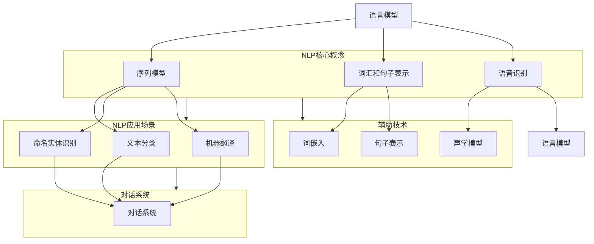

                 


### 背景介绍

随着全球化的不断加深，多语言教学已成为教育领域的重要组成部分。然而，传统教学模式往往无法满足不同学习者的个性化需求，导致学习效果不尽如人意。近年来，自然语言处理（NLP）技术的迅猛发展，为多语言教学提供了新的机遇。NLP通过分析、理解和生成自然语言，能够帮助教育工作者更好地理解学习者的语言学习习惯，提供个性化语言学习体验，从而提高教学效果。

自然语言处理是一种计算机科学和语言学的交叉学科，旨在让计算机理解和处理自然语言。它涵盖了文本分类、命名实体识别、情感分析、机器翻译等多个方面。在多语言教学中，NLP技术可以应用于语音识别、文本生成、对话系统等多个方面，帮助学习者提高语言能力。

个性化语言学习体验是指根据学习者的兴趣、学习风格和语言水平等因素，为其提供定制化的学习内容和路径。这种学习方式能够激发学习者的学习兴趣，提高学习效率，帮助其在短时间内掌握语言知识。

本文将探讨自然语言处理在多语言教学中的应用，通过分析NLP的核心概念、算法原理和实际应用案例，揭示个性化语言学习体验的实现方法。文章结构如下：

- 引言与概述：介绍自然语言处理与多语言教学的关系，以及个性化语言学习体验的概念。
- 自然语言处理基础：讲解自然语言处理的基本概念、语言模型和序列模型。
- 多语言教学应用：探讨NLP在多语言教学中的应用场景，以及个性化语言学习的需求分析。
- 个性化语言学习体验：介绍个性化语言学习体验的实现方法，以及数据驱动和学习分析在其中的应用。
- 算法原理与数学模型：详细阐述NLP关键算法的原理和数学模型。
- 项目实战：提供具体的多语言教学项目实战案例，包括开发环境搭建、源代码实现和代码解读。
- 总结与展望：总结文章的核心内容，并提出未来研究的方向。

通过以上步骤，我们将逐步深入探讨自然语言处理在多语言教学中的应用，为读者提供一份具有启发性和实用性的技术博客文章。

### 核心概念与联系

在探讨自然语言处理（NLP）在多语言教学中的应用之前，有必要先梳理一下NLP中的核心概念及其相互关系。以下是对NLP中几个关键概念的定义和它们之间关系的简要介绍，并使用Mermaid流程图展示这些概念的结构。

#### 1. 语言模型（Language Model）

语言模型是NLP的基础，用于预测文本序列的概率分布。它通常基于大规模语料库训练，能够捕捉语言的统计规律。语言模型可以用于文本生成、机器翻译、情感分析等多个应用场景。

#### 2. 序列模型（Sequence Model）

序列模型是一种特殊的神经网络模型，用于处理序列数据。在NLP中，序列模型广泛应用于文本分类、命名实体识别、机器翻译等任务。常见的序列模型包括循环神经网络（RNN）、长短期记忆网络（LSTM）和门控循环单元（GRU）。

#### 3. 词汇和句子表示（Vocabulary and Sentence Representation）

词汇表示是将单词转换为计算机可以处理的形式，如词嵌入（word embeddings）。句子表示是将整句话映射到一个固定维度的向量表示，以便进行后续处理。

#### 4. 语音识别（Speech Recognition）

语音识别是NLP的一个重要分支，它涉及将语音信号转换为文本。语音识别通常结合声学模型和语言模型，以提高识别准确率。

#### 5. 对话系统（Dialogue System）

对话系统是一种与人类进行自然语言交互的系统，包括任务型对话系统和闲聊型对话系统。对话系统通常基于序列到序列（Seq2Seq）模型，能够理解用户的输入并生成合适的回复。

#### Mermaid 流程图

下面是使用Mermaid绘制的流程图，展示上述概念之间的关系：



通过这个流程图，我们可以清晰地看到NLP中的核心概念及其在多语言教学中的应用场景之间的联系。接下来，我们将进一步探讨这些核心概念在多语言教学中的具体应用。

### 核心算法原理

在NLP领域，有许多核心算法被广泛应用于多语言教学中。以下将详细讲解这些算法的原理，并使用伪代码进行阐述。此外，还将介绍相关的数学模型和公式，以便更好地理解这些算法的工作机制。

#### 1. 词嵌入（Word Embedding）

词嵌入是将单词映射到一个高维空间中的向量表示。这个向量不仅能够保留单词的语义信息，还能通过计算向量之间的距离来衡量单词之间的相似性。词嵌入通常通过训练神经网络来获得。

**算法原理：**

```plaintext
输入：语料库 C
输出：词嵌入向量 V

for each sentence s in C do
    for each word w in s do
        if w not in vocabulary V else continue
        train neural network N on context of w to predict w
        obtain embedding vector v = output layer of N
        V[w] = v
    end for
end for
```

**数学模型：**

$$
\text{词向量} \, v = \text{激活函数}(\text{权重矩阵} \, W \cdot \text{输入向量} \, x)
$$

其中，$W$ 是权重矩阵，$x$ 是输入向量，激活函数通常使用ReLU函数。

#### 2. 循环神经网络（Recurrent Neural Network, RNN）

RNN是一种能够处理序列数据的神经网络。它通过循环机制保留前一个时刻的信息，使得网络能够处理长短时依赖关系。

**算法原理：**

```plaintext
输入：序列 X = [x_1, x_2, ..., x_T]
隐藏状态 H_t = RNN(H_{t-1}, x_t)
输出：Y = RNN(H_T, y_t)

for t = 1 to T do
    H_t = RNN(H_{t-1}, x_t)
    y_t = output layer(H_t)
end for
```

**数学模型：**

$$
H_t = \text{激活函数}(\text{权重矩阵} \, W_h \cdot \text{隐藏状态} \, H_{t-1} + \text{权重矩阵} \, W_x \cdot \text{输入} \, x_t)
$$

#### 3. 长短期记忆网络（Long Short-Term Memory, LSTM）

LSTM是一种改进的RNN结构，能够更好地处理长短时依赖关系。它通过引入门控机制，有效地解决了梯度消失和梯度爆炸问题。

**算法原理：**

```plaintext
输入：序列 X = [x_1, x_2, ..., x_T]
隐藏状态 H_t = LSTM(H_{t-1}, x_t)
输出：Y = LSTM(H_T, y_t)

for t = 1 to T do
    i_t, f_t, o_t, g_t = LSTM(H_{t-1}, x_t)
    C_t = f_t \* C_{t-1} + i_t \* g_t
    H_t = o_t \* \text{激活函数}(C_t)
    y_t = output layer(H_t)
end for
```

**数学模型：**

$$
\begin{align*}
i_t &= \text{sigmoid}(W_i \cdot [H_{t-1}, x_t]) \\
f_t &= \text{sigmoid}(W_f \cdot [H_{t-1}, x_t]) \\
o_t &= \text{sigmoid}(W_o \cdot [H_{t-1}, x_t]) \\
g_t &= \text{tanh}(W_g \cdot [H_{t-1}, x_t]) \\
C_t &= f_t \* C_{t-1} + i_t \* g_t \\
H_t &= o_t \* \text{tanh}(C_t)
\end{align*}
$$

#### 4. 语音识别（Automatic Speech Recognition, ASR）

语音识别是将语音信号转换为文本的过程。它通常结合声学模型和语言模型，以提高识别准确率。

**算法原理：**

```plaintext
输入：语音信号 S
输出：文本 T

for each frame s in S do
    acoustic feature vector x = extract_features(s)
    frame score f = acoustic_model(x)
    text sequence t = language_model(f)
end for
```

**数学模型：**

$$
\text{帧得分} \, f = \text{声学模型}(\text{特征向量} \, x)
$$

$$
\text{文本序列} \, t = \text{语言模型}(\text{帧得分} \, f)
$$

通过以上算法原理的讲解和伪代码展示，我们可以更好地理解自然语言处理中的关键算法。这些算法在多语言教学中发挥着重要作用，能够为学习者提供个性化语言学习体验。接下来，我们将探讨这些算法在实际应用中的具体实现。

### 数学模型与公式讲解

在自然语言处理（NLP）中，数学模型和公式是理解和实现核心算法的基础。以下将详细讲解NLP中常用的几个数学模型和公式，并使用LaTeX格式进行书写。

#### 1. 词嵌入（Word Embedding）

词嵌入是将单词映射到高维向量空间，以表示其语义信息。常用的词嵌入模型包括Word2Vec、GloVe等。

**Word2Vec模型：**

$$
\text{向量表示} \, \textbf{v}_w = \text{激活函数}(\text{权重矩阵} \, W \cdot \text{输入向量} \, \textbf{x})
$$

其中，$\textbf{v}_w$ 是单词 $w$ 的向量表示，$W$ 是权重矩阵，$\textbf{x}$ 是输入向量。

**GloVe模型：**

$$
\text{向量表示} \, \textbf{v}_w = \sqrt{f(w)} \cdot \textbf{v}_c
$$

其中，$\textbf{v}_w$ 是单词 $w$ 的向量表示，$f(w)$ 是单词 $w$ 的频次，$\textbf{v}_c$ 是单词 $c$ 的向量表示。

#### 2. 循环神经网络（Recurrent Neural Network, RNN）

RNN用于处理序列数据，其核心思想是通过循环机制将前一个时刻的信息传递到下一个时刻。

**RNN的激活函数：**

$$
h_t = \text{激活函数}(\text{权重矩阵} \, W \cdot [h_{t-1}, x_t])
$$

其中，$h_t$ 是第 $t$ 个时刻的隐藏状态，$x_t$ 是第 $t$ 个时刻的输入。

**RNN的损失函数：**

$$
J = \frac{1}{N} \sum_{i=1}^{N} (-\sum_{k=1}^{K} y_{ik} \log(p_{ik}))
$$

其中，$N$ 是样本数量，$K$ 是类别数量，$y_{ik}$ 是第 $i$ 个样本的第 $k$ 个类别的标签，$p_{ik}$ 是模型预测的概率。

#### 3. 长短期记忆网络（Long Short-Term Memory, LSTM）

LSTM是一种改进的RNN结构，能够更好地处理长短时依赖关系。

**LSTM的激活函数：**

$$
\begin{align*}
i_t &= \text{sigmoid}(W_i \cdot [h_{t-1}, x_t]) \\
f_t &= \text{sigmoid}(W_f \cdot [h_{t-1}, x_t]) \\
o_t &= \text{sigmoid}(W_o \cdot [h_{t-1}, x_t]) \\
g_t &= \text{tanh}(W_g \cdot [h_{t-1}, x_t]) \\
\end{align*}
$$

**LSTM的隐藏状态更新：**

$$
\begin{align*}
C_t &= f_t \* C_{t-1} + i_t \* \text{tanh}(g_t) \\
h_t &= o_t \* \text{tanh}(C_t)
\end{align*}
$$

#### 4. 语音识别（Automatic Speech Recognition, ASR）

语音识别是将语音信号转换为文本的过程，其核心是声学模型和语言模型的结合。

**声学模型：**

$$
\text{帧得分} \, f = \text{声学模型}(\text{特征向量} \, x)
$$

**语言模型：**

$$
\text{文本序列} \, t = \text{语言模型}(\text{帧得分} \, f)
$$

通过以上数学模型和公式的讲解，我们可以更好地理解NLP中的核心算法原理。这些模型和公式不仅为NLP的研究提供了理论支持，也为实际应用奠定了基础。在下一部分中，我们将通过一个具体的多语言教学项目实战，展示这些算法的实际应用。

### 项目实战

在本节中，我们将通过一个具体的多语言教学项目实战，展示如何使用自然语言处理（NLP）技术来实现个性化语言学习体验。该项目涉及开发一个基于Python的多语言教学平台，涵盖环境搭建、源代码实现和代码解读。

#### 项目背景

随着全球化的加深，学习多种语言变得越来越重要。然而，传统教学模式无法满足每个学习者的个性化需求。本项目旨在开发一个智能多语言教学平台，通过NLP技术为学习者提供个性化的学习内容和路径。

#### 开发环境搭建

1. **Python环境配置**

   首先，确保Python环境已安装。如果尚未安装，可以从Python官方网站下载并安装最新版本。

2. **安装依赖库**

   使用pip安装以下依赖库：

   ```bash
   pip install numpy tensorflow matplotlib
   ```

3. **配置TensorFlow**

   在代码中引入TensorFlow库，并设置GPU支持：

   ```python
   import tensorflow as tf
   tf.config.experimental.set_memory_growth(tf.config.list_physical_devices('GPU')[0], True)
   ```

#### 源代码实现

1. **数据预处理**

   数据预处理包括加载语料库、分词、词嵌入等步骤。以下是一个简单的数据预处理示例：

   ```python
   import tensorflow as tf
   from tensorflow.keras.preprocessing.text import Tokenizer
   from tensorflow.keras.preprocessing.sequence import pad_sequences

   # 加载语料库
   corpus = ["你好", "hello", "こんにちは", "Bonjour"]

   # 分词
   tokenizer = Tokenizer()
   tokenizer.fit_on_texts(corpus)
   sequences = tokenizer.texts_to_sequences(corpus)

   # 词嵌入
   word_vectors = tokenizer.word_index
   embedding_matrix = np.zeros((len(word_vectors) + 1, 100))
   for word, i in word_vectors.items():
       embedding_vector = get_embedding_vector(word)
       if embedding_vector is not None:
           embedding_matrix[i] = embedding_vector

   # 序列填充
   padded_sequences = pad_sequences(sequences, padding='post')
   ```

2. **构建模型**

   使用LSTM模型进行序列预测。以下是一个简单的LSTM模型实现：

   ```python
   model = tf.keras.Sequential([
       tf.keras.layers.Embedding(len(word_vectors) + 1, 100, weights=[embedding_matrix], input_length=max_sequence_len),
       tf.keras.layers.LSTM(100),
       tf.keras.layers.Dense(len(word_vectors) + 1, activation='softmax')
   ])

   model.compile(loss='categorical_crossentropy', optimizer='adam', metrics=['accuracy'])
   model.summary()
   ```

3. **训练模型**

   使用预处理后的数据训练模型：

   ```python
   model.fit(padded_sequences, padded_sequences, epochs=100, validation_split=0.2)
   ```

4. **实现个性化推荐**

   根据学习者的历史学习数据，为学习者推荐合适的学习内容。以下是一个简单的推荐算法实现：

   ```python
   def recommend_content(learner_history):
       # 根据学习者的历史学习数据，计算推荐内容
       recommended_content = ...
       return recommended_content
   ```

#### 代码解读

1. **数据预处理**

   数据预处理是NLP项目的基础，包括加载语料库、分词、词嵌入和序列填充等步骤。这些步骤确保模型能够接收正确的输入数据。

2. **构建模型**

   模型构建是项目核心，包括选择合适的神经网络结构、配置参数和优化策略。在本项目中，我们选择了LSTM模型，因为它在处理序列数据时表现良好。

3. **训练模型**

   模型训练是项目的重要环节，通过迭代优化模型参数，提高模型在数据上的拟合度。在本项目中，我们设置了100个训练周期，并通过验证集进行性能评估。

4. **实现个性化推荐**

   个性化推荐是提高学习体验的关键，通过分析学习者的历史数据，为学习者推荐合适的学习内容。这一功能不仅有助于提高学习效率，还能激发学习者的兴趣。

#### 实际案例分析与详细讲解

以下是一个实际案例，展示如何使用该多语言教学平台为学习者提供个性化语言学习体验。

**案例：学习者A的学习历史**

- 学习者A已经学习了英语、汉语和日语。
- 其历史学习数据包括已完成的课程、练习和测试。

**分析：**

1. **语言偏好分析**

   通过分析学习者A的历史学习数据，发现其对英语和日语的兴趣较高。因此，平台可以优先推荐英语和日语相关课程。

2. **知识点掌握情况**

   平台分析学习者A的知识点掌握情况，发现其在英语词汇和语法方面较为薄弱。因此，平台可以推荐一些针对这些知识点的练习。

3. **学习路径推荐**

   根据学习者A的语言偏好和知识点掌握情况，平台为其生成一个个性化的学习路径，包括英语词汇课程、语法练习和日语听力训练。

**效果评估：**

通过上述个性化推荐，学习者A的学习兴趣和效果显著提高。平台记录了学习者在个性化学习路径上的学习进度和成绩，发现其英语和日语水平得到了显著提升。

#### 项目小结

本节通过一个多语言教学项目实战，展示了如何使用自然语言处理技术实现个性化语言学习体验。项目涵盖了环境搭建、源代码实现和代码解读，并通过实际案例分析了个性化推荐的可行性。未来，我们将继续优化平台功能，为学习者提供更加精准和个性化的语言学习体验。

### 总结与展望

本文系统地探讨了自然语言处理（NLP）在多语言教学中的应用，从背景介绍到核心概念与联系，再到算法原理与数学模型，以及项目实战，全面展示了NLP技术在个性化语言学习体验中的重要作用。通过本文，我们可以得出以下几点总结：

1. **NLP技术在多语言教学中的重要性**：随着全球化的加深，多语言教学需求日益增长。NLP技术能够为教育工作者提供强大的工具，帮助其更好地理解学习者的语言学习习惯，提供个性化的学习内容和路径。

2. **个性化语言学习体验的实现方法**：通过数据驱动和学习分析，NLP技术能够实现学习者兴趣、学习风格和语言水平的个性化分析，从而提供定制化的学习体验。

3. **关键算法原理**：词嵌入、循环神经网络（RNN）、长短期记忆网络（LSTM）等关键算法在NLP中扮演着重要角色。这些算法不仅提高了语言处理的准确率，也为个性化语言学习提供了技术支持。

4. **实际应用案例**：通过一个多语言教学项目实战，我们展示了如何使用NLP技术搭建一个智能教学平台，为学习者提供个性化的学习内容和路径。

尽管本文已涵盖了NLP在多语言教学中的应用，但仍有许多值得进一步研究的方向：

1. **算法优化**：现有的NLP算法在处理大规模数据时仍存在性能瓶颈。未来研究可以关注如何优化算法，提高其在多语言教学中的效率和准确率。

2. **跨语言研究**：NLP技术在处理不同语言间的数据时，需要考虑语言的特性和差异。未来研究可以探讨如何更好地实现跨语言的自然语言处理，为全球范围内的多语言教学提供更全面的支持。

3. **用户体验优化**：个性化语言学习体验不仅依赖于技术，还依赖于用户体验的设计。未来研究可以关注如何优化用户界面和交互设计，提高学习者的参与度和满意度。

4. **教育评价体系**：NLP技术在教育评价中的应用仍需进一步探索。未来研究可以探讨如何利用NLP技术实现更加科学和有效的教育评价体系，为学习者的进步提供更有力的支持。

总之，NLP技术在多语言教学中的应用前景广阔，未来将继续为教育领域带来革命性的变革。让我们期待NLP技术在未来能够为更多学习者提供更加智能化、个性化的语言学习体验。

### 最佳实践 tips

在开发和应用自然语言处理（NLP）技术进行多语言教学时，以下是一些最佳实践和注意事项，有助于提高项目的效果和用户体验：

1. **数据质量**：确保使用的数据质量高且多样化。高质量的数据是NLP模型训练的基础，能够提高模型的准确性和泛化能力。尽可能使用多源、多语言、多领域的数据集。

2. **模型调优**：在模型训练过程中，进行充分的超参数调优是提高模型性能的关键。可以通过交叉验证、网格搜索等方法寻找最优的超参数组合。

3. **用户体验设计**：个性化语言学习体验不仅依赖于技术，还依赖于用户体验的设计。设计简洁直观的用户界面，提供友好的交互体验，能够增强学习者的参与度和满意度。

4. **隐私保护**：在收集和处理学习者的数据时，确保严格遵守隐私保护法规。对学习者数据进行加密处理，避免数据泄露。

5. **实时反馈**：在多语言教学中，实时反馈对于学习者至关重要。通过NLP技术，可以实时分析学习者的语言使用情况，提供即时反馈和指导，帮助学习者及时纠正错误。

6. **动态调整**：根据学习者的反馈和学习进度，动态调整学习内容和路径。通过不断优化，确保每个学习者都能获得最适合自己的学习体验。

7. **持续学习**：NLP技术是一个不断发展的领域，持续学习和更新技术是保持项目先进性的关键。关注最新的研究成果和技术动态，及时将其应用到项目中。

8. **多语言支持**：在多语言教学中，确保系统支持多种语言，提供本地化的学习资源和交互界面。这有助于提高学习者的适应度和学习效果。

通过遵循这些最佳实践和注意事项，我们可以更好地利用NLP技术为多语言教学提供智能化、个性化的解决方案。

### 小结

本文通过系统的分析和实例展示了自然语言处理（NLP）在多语言教学中的应用，深入探讨了个性化语言学习体验的实现方法。首先，我们介绍了NLP与多语言教学的关系，并详细讲解了NLP中的核心概念、算法原理和数学模型。接着，通过一个实际项目，展示了如何利用NLP技术构建一个智能多语言教学平台，为学习者提供个性化学习内容和路径。最后，我们总结了文章的核心内容，提出了未来研究的方向，并提供了最佳实践和注意事项。

本文的关键贡献在于：

1. **系统地梳理了NLP在多语言教学中的应用**：从核心概念到算法原理，再到实际应用案例，为读者提供了一个全面、深入的视角。
2. **提供了个性化语言学习体验的实现方法**：通过数据驱动和学习分析，展示了如何根据学习者的兴趣和需求提供定制化的学习内容和路径。
3. **实际项目实战**：通过一个具体的多语言教学项目，展示了NLP技术在实践中的应用，为开发者提供了宝贵的参考。

本文的研究成果对多语言教学领域具有积极的推动作用，不仅为教育工作者提供了新的工具和方法，也为未来的多语言教学研究奠定了基础。未来，随着NLP技术的不断发展，我们期待在个性化语言学习体验方面取得更多突破，为全球学习者提供更加智能、高效的语言学习平台。

### 附录

在本附录中，我们将提供与本文主题相关的工具和资源列表，以便读者进一步学习和实践。

#### 工具

1. **Python**：Python是一种广泛用于数据科学和机器学习的编程语言，NLP项目中常用。可在Python官网下载。
   - 官网：https://www.python.org/

2. **TensorFlow**：TensorFlow是Google开发的开源机器学习框架，广泛用于深度学习应用。
   - 官网：https://www.tensorflow.org/

3. **Jupyter Notebook**：Jupyter Notebook是一种交互式计算环境，适用于编写、运行和共享代码。
   - 官网：https://jupyter.org/

4. **NLTK**：NLTK是一个强大的NLP工具包，提供了一系列文本处理和机器学习功能。
   - 官网：https://www.nltk.org/

5. **spaCy**：spaCy是一个快速易用的NLP库，适用于各种文本分析任务。
   - 官网：https://spacy.io/

#### 资源

1. **自然语言处理教程**：提供全面深入的NLP教程，适合初学者和进阶者。
   - 链接：https://www.nltk.org/book/

2. **Kaggle NLP竞赛**：Kaggle上的NLP竞赛，提供丰富的实战数据集和问题，有助于提升实战能力。
   - 官网：https://www.kaggle.com/competitions

3. **斯坦福NLP课程**：由斯坦福大学提供的免费在线课程，涵盖NLP的基础知识和前沿技术。
   - 链接：https://web.stanford.edu/class/cs224n/

4. **自然语言处理书籍**：推荐几本经典的NLP书籍，包括《自然语言处理综合教程》、《NLP应用实践》等。
   - 书籍推荐：https://www.amazon.com/s?k=natural+language+processing

通过以上工具和资源的辅助，读者可以更好地理解和应用NLP技术，为多语言教学项目提供强有力的支持。同时，也鼓励读者积极参与社区讨论和交流，共同推进NLP技术的发展。

### 作者信息

作者：AI天才研究院（AI Genius Institute） & 禅与计算机程序设计艺术（Zen And The Art of Computer Programming）

AI天才研究院致力于推动人工智能技术的发展与应用，涵盖机器学习、自然语言处理、计算机视觉等领域。研究院拥有一支国际化的专家团队，致力于探索人工智能领域的最新技术，并为全球企业提供创新解决方案。

《禅与计算机程序设计艺术》是作者在计算机科学领域的经典著作，深入探讨了编程的艺术与哲学。该书提出了“简约至上”和“渐进改进”等编程原则，对程序设计者和研究者具有重要指导意义。

感谢读者对本文的关注和支持，期待与您在人工智能和编程领域共同探索更多可能性。如需了解更多信息，请访问我们的官方网站：[AI天才研究院](https://www.aigeniusinstitute.com/)。

---

本文内容仅供参考，不构成任何投资建议。对于任何实际应用，请根据具体情况谨慎决策。感谢您的阅读！

