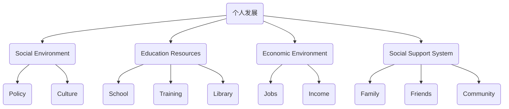

                 

### 文章标题：营造有利于个人发展的环境：外部条件优化

### 关键词：个人发展、环境优化、外部条件、社会环境、教育资源、经济环境

### 摘要：
本文旨在探讨如何通过优化外部条件来营造有利于个人发展的环境。我们将深入分析影响个人发展的各种外部因素，如社会环境、教育资源、经济环境和社会支持系统，并提出相应的优化策略。通过具体案例和实际操作指导，帮助读者理解并实践如何改善外部条件，促进个人成长。

## 1. 引言

个人发展是每个个体追求的目标，而外部条件在很大程度上决定了个人发展的可能性。外部条件优化，即通过改善社会环境、教育资源、经济环境和社会支持系统，为个人发展创造有利条件。本文将围绕这一主题展开讨论，旨在为读者提供系统化的指导和实用的建议。

### 1.1 书籍背景与目标

随着社会的发展，个人发展的重要性日益凸显。然而，许多人在追求个人成长的过程中，常常受限于外部条件的不足。因此，本书旨在为广大读者提供一本关于外部条件优化的实用指南，帮助读者认清自身发展的制约因素，并找到有效的解决方案。

### 1.2 个人发展的意义与挑战

个人发展不仅关系到个体的幸福感和成就感，更是社会进步的重要动力。然而，个人发展面临着诸多挑战，如资源有限、竞争激烈、信息不对称等。通过优化外部条件，可以降低这些挑战的难度，为个人发展提供更好的支持。

### 1.3 外部条件对个人发展的影响

外部条件对个人发展的影响是多方面的。良好的社会环境可以激发个体的创造力和积极性；优质的教育资源为个人提供知识储备和技能培训；经济环境则决定了个人发展的物质基础；而社会支持系统则提供了心理和社会层面的保障。这些外部条件的优化，对个人发展具有深远的影响。

## 2. 核心概念与联系

### 2.1 个人发展的理论基础

个人发展理论强调个体成长的过程性、动态性和多元化。个人发展不仅包括知识技能的积累，还涉及情感、态度、价值观等方面的提升。本文将结合心理学、教育学等领域的理论，探讨个人发展的本质和影响因素。

### 2.2 外部条件的分类与作用

外部条件可以分为社会环境、教育资源、经济环境和社会支持系统四个主要类别。社会环境包括政策、法律、文化等，教育资源包括学校、培训机构、图书馆等，经济环境涉及就业、收入、财富等，社会支持系统包括家庭、朋友、社区等。这些外部条件相互作用，共同影响个人发展。

### 2.3 Mermaid流程图：外部条件与个人发展的关联

## 3. 外部条件分析

### 3.1 社会环境分析

社会环境对个人发展具有重要影响。政策环境、法律环境和文化环境是影响个人发展的关键因素。政策环境决定了个人发展的机会和限制，法律环境提供了保障和支持，文化环境则塑造了个体的价值观和行为模式。

### 3.2 教育资源分析

教育资源是个人发展的基础。学校教育、职业培训、图书馆资源等都是重要的教育资源。优化教育资源，需要提高教育质量、公平分配教育资源、鼓励终身学习。

### 3.3 经济环境分析

经济环境是个人发展的物质基础。就业环境、收入水平和财富积累等因素对个人发展具有重要影响。优化经济环境，需要促进经济发展、提高就业率、提高工资水平和完善社会保障体系。

### 3.4 社会支持系统分析

社会支持系统提供了心理和社会层面的保障。家庭、朋友和社区等社会支持系统为个人发展提供了重要的支持和资源。优化社会支持系统，需要加强家庭建设、培育友好的人际关系、提升社区服务水平。

## 4. 优化策略与方法

### 4.1 改善社会环境的策略

改善社会环境需要从政策、法律和文化等多个方面进行优化。政策方面，需要制定有利于个人发展的政策措施；法律方面，需要完善法律体系，保障个人权益；文化方面，需要营造积极向上的文化氛围。

### 4.2 提升教育资源的方法

提升教育资源需要从教育质量、教育资源分配和终身学习等方面进行优化。提高教育质量，需要加强师资培训、改善教学设施；公平分配教育资源，需要打破地域、城乡和教育阶段的差异；鼓励终身学习，需要提供多样化的学习机会和资源。

### 4.3 经济环境优化策略

优化经济环境需要从就业、收入和社会保障等方面进行改善。促进就业，需要加强职业培训、优化就业市场；提高收入，需要增加工资水平、完善税收政策；完善社会保障体系，需要提供全面的社会保障服务。

### 4.4 社会支持系统建设

建设社会支持系统需要从家庭、朋友和社区等方面进行优化。加强家庭建设，需要提升家庭功能和亲子关系；培育友好的人际关系，需要提高人际沟通技巧、建立良好的人际网络；提升社区服务水平，需要完善社区基础设施、丰富社区活动。

## 5. 案例分析

### 5.1 成功案例分析

成功案例可以提供宝贵的经验和启示。通过分析成功案例，我们可以了解外部条件优化对个人发展的重要性，并学习到具体的实施策略。

### 5.2 失败案例分析

失败案例同样具有重要的教育意义。通过分析失败案例，我们可以认识到外部条件不足对个人发展的制约，并从中吸取教训，避免重复错误。

### 5.3 案例启示与反思

案例分析和启示，可以帮助我们更好地理解外部条件优化的重要性，并找到适合自己的发展路径。同时，我们也需要反思自身在发展过程中的不足，不断提升自我。

## 6. 实际操作

### 6.1 制定个人发展计划

制定个人发展计划，需要明确个人目标、评估自身优势和劣势、制定具体的行动计划。个人发展计划是实现个人发展的重要工具。

### 6.2 实施外部条件优化策略

实施外部条件优化策略，需要根据自身实际情况，选择合适的优化方法。例如，通过参加培训提升技能、通过社交网络扩大人脉、通过公益活动提升社会影响力等。

### 6.3 监测与调整

监测与调整是个人发展过程中不可或缺的环节。通过定期评估自身发展状况，及时调整计划和方法，可以更好地实现个人发展目标。

## 7. 结论与展望

### 7.1 个人发展的外部条件总结

外部条件对个人发展具有重要影响。通过优化外部条件，可以为个人发展创造有利环境。

### 7.2 未来发展趋势与展望

未来，随着科技的进步和社会的发展，个人发展将面临新的机遇和挑战。我们需要不断优化外部条件，为个人发展提供更好的支持。

### 7.3 作者寄语

希望本文能为大家提供关于外部条件优化的启示和帮助。让我们一起努力，创造有利于个人发展的环境，实现自我价值。

### 作者信息

作者：AI天才研究院/AI Genius Institute & 禅与计算机程序设计艺术 /Zen And The Art of Computer Programming

本文为作者原创内容，未经授权不得转载。如需转载，请联系作者获取授权。感谢您的关注与支持！

