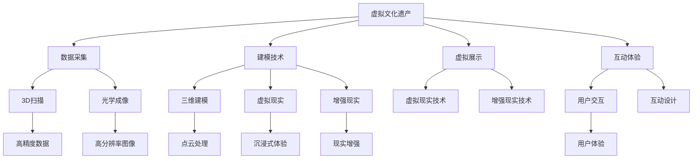

                 


### 引言

在当今数字化时代，信息技术的发展为文物保护带来了全新的机遇和挑战。虚拟文化遗产修复作为数字技术与文物保护相结合的产物，已经成为一项备受关注的重要研究领域。随着数字技术的不断进步，越来越多的文化遗产得以通过虚拟方式再现，为后人提供更为真实、生动的历史体验。

本文旨在探讨虚拟文化遗产修复中数字技术的应用，从背景介绍、核心概念、关键技术、案例分析、应用挑战与未来展望等方面进行系统分析。首先，我们将对虚拟文化遗产的定义、特点及其与真实文化遗产的关系进行阐述，为后续内容奠定基础。接着，本文将详细介绍数字技术在文物保护中的核心技术与原理，包括数据采集与建模、虚拟展示与互动体验、文物修复与保护以及文物保护管理等方面。

为了更好地理解这些技术原理，我们将通过具体案例进行分析，探讨虚拟文化遗产修复在实际中的应用。同时，本文还将讨论数字技术在文物保护中面临的应用挑战以及未来的发展趋势。通过本文的阅读，读者将能够全面了解虚拟文化遗产修复的现状、技术原理及其潜在价值。

### 背景介绍

虚拟文化遗产修复作为一种新兴的文物保护手段，其背景可以追溯到信息技术和互联网的快速发展。近年来，随着计算机性能的不断提升、数据采集技术的进步以及三维建模和虚拟现实技术的普及，数字技术在文物保护领域中的应用逐渐变得广泛和成熟。虚拟文化遗产修复不仅能够有效地保存和保护真实文化遗产，还能够通过虚拟展示和互动体验，让更多人近距离感受历史文化的魅力。

数字技术在文物保护中的应用具有重要意义。首先，它能够提供高精度的文物数据，为文物保护和研究提供科学依据。通过3D扫描、光学成像等技术，文物的外形、纹理、颜色等信息可以被精确记录，从而实现文化遗产的高保真再现。其次，数字技术能够帮助文物修复专家更精准地修复受损文物。例如，利用3D打印技术可以制作出与原文物一模一样的复制品，供研究和展示使用。此外，虚拟展示和互动体验技术使得文化遗产的传播更加便捷和生动。人们可以通过虚拟现实（VR）和增强现实（AR）技术，身临其境地感受历史场景，增强了文化体验的参与感和互动性。

当前，虚拟文化遗产修复技术已在多个文化遗产保护项目中取得显著成果。例如，秦始皇兵马俑的数字化保护与展示、敦煌莫高窟的数字复原与虚拟展示、明代永乐宫壁画的数字化修复等，都展示了数字技术在文物保护中的重要应用价值。这些项目不仅提高了文化遗产的保存水平，也吸引了大量公众的关注，促进了文化遗产的保护与传播。

然而，虚拟文化遗产修复技术也面临一些挑战。首先，数据采集和建模过程需要大量的计算资源和专业技能，对技术设备和人员素质的要求较高。其次，虚拟展示和互动体验技术需要不断优化，以提高用户体验和真实性。此外，数字技术在文物保护中的应用仍需完善，例如在文物材料分析、环境监测等方面的应用还需进一步深化。总的来说，虚拟文化遗产修复技术为文物保护提供了新的路径和手段，但在实际应用中仍需不断探索和完善。

### 核心概念与联系

#### 虚拟文化遗产的定义

虚拟文化遗产（Virtual Cultural Heritage），是指通过数字技术对真实文化遗产进行数据采集、建模、虚拟展示和互动体验的一种数字化表现形式。它不仅包括对文化遗产外形、纹理、颜色的三维建模，还涵盖了文化遗产的历史背景、文化内涵和艺术价值等信息的数字化保存与再现。

#### 虚拟文化遗产的特点

1. **高度还原性**：虚拟文化遗产能够以高精度、高细节的方式还原真实文化遗产的外观和结构，为观众提供逼真的视觉体验。
2. **跨时空可访问性**：通过互联网和虚拟现实技术，虚拟文化遗产可以突破地理和时间的限制，随时随地被全球观众访问和体验。
3. **交互性和参与性**：虚拟文化遗产的展示不仅仅是静态的，观众可以通过互动体验深入了解文化遗产的历史和文化背景。
4. **资源可再生性**：虚拟文化遗产的数字化保存和展示使得文化遗产得以长久保存，并且可以通过技术更新不断优化，实现资源的再生利用。

#### 虚拟文化遗产与真实文化遗产的关系

虚拟文化遗产是真实文化遗产的数字化再现，它不仅是对真实文化遗产的补充，也是保护和传承文化遗产的一种创新方式。虚拟文化遗产可以有效地保存文化遗产的原貌，减少对真实文物的物理磨损和破坏。同时，虚拟文化遗产能够吸引更多人关注和参与文化遗产的保护工作，提高公众的文化素养和历史责任感。

#### 虚拟文化遗产的核心概念原理关系架构

为了更好地理解虚拟文化遗产的核心概念原理之间的关系，我们可以通过以下Mermaid流程图进行描述：



该流程图展示了虚拟文化遗产的各个环节及其核心技术，以及它们之间的相互关系。通过这一流程图，我们可以清晰地看到从数据采集、建模、虚拟展示到互动体验的完整过程，以及各个环节之间的联系和作用。

#### 核心算法原理讲解

在虚拟文化遗产修复中，数据采集与建模技术是核心环节之一。以下将详细介绍3D扫描技术、光学成像技术和数据处理与建模算法的基本原理，并通过伪代码和数学模型进行阐述。

##### 3D扫描技术

3D扫描技术的基本原理是通过获取物体表面的三维坐标信息，生成三维点云数据。具体流程如下：

1. **数据采集**：使用激光、结构光或超声波等设备对物体进行扫描，获取其表面点的坐标。
2. **点云处理**：对采集到的点云数据进行预处理，如去噪、滤波和去除缺失数据等。
3. **三维建模**：利用点云数据生成三维模型，通过三角测量或表面重建算法实现。

伪代码如下：

```pseudo
function 3D_scan(object):
    point_cloud = acquire_3D_points(object)
    processed_point_cloud = preprocess_point_cloud(point_cloud)
    mesh = reconstruct_3D_mesh(processed_point_cloud)
    return mesh
```

##### 光学成像技术

光学成像技术的基本原理是通过摄像头或显微镜等设备获取物体的二维图像，然后通过图像处理技术提取三维信息。具体流程如下：

1. **图像采集**：使用摄像头或显微镜对物体进行拍摄，获取多角度的图像。
2. **图像预处理**：对采集到的图像进行降噪、增强和拼接等处理，以获得高质量的图像数据。
3. **三维重建**：利用图像间的几何关系和深度信息，生成三维模型。

伪代码如下：

```pseudo
function optical_imaging(object):
    images = capture_images(object)
    processed_images = preprocess_images(images)
    depth_map = generate_depth_map(processed_images)
    mesh = reconstruct_3D_mesh(depth_map)
    return mesh
```

##### 数据处理与建模算法

数据处理与建模算法是虚拟文化遗产修复的核心，包括点云处理、三维建模和模型优化等。

1. **点云处理**：对点云数据执行去噪、滤波和表面重建等操作，以提高数据质量和模型精度。

伪代码如下：

```pseudo
function process_point_cloud(point_cloud):
    filtered_point_cloud = noise_filter(point_cloud)
    surface_mesh = surface_reconstruction(filtered_point_cloud)
    return surface_mesh
```

2. **三维建模**：利用点云数据或图像数据，通过三角测量或表面重建算法生成三维模型。

伪代码如下：

```pseudo
function reconstruct_3D_mesh(data):
    if is_point_cloud(data):
        mesh = triangulate_points(data)
    else:
        mesh = reconstruct_surface(data)
    optimized_mesh = optimize_mesh(mesh)
    return optimized_mesh
```

3. **模型优化**：对生成的三维模型进行优化，如减少面数、平滑表面等，以提高模型的显示性能。

伪代码如下：

```pseudo
function optimize_mesh(mesh):
    simplified_mesh = reduce_faces(mesh)
    smooth_mesh = smooth_surface(simplified_mesh)
    return smooth_mesh
```

##### 数学模型和公式

在虚拟文化遗产修复中，数学模型和公式用于描述点云数据处理、三维建模和模型优化的关键过程。以下是一些常用的数学公式：

1. **点云去噪公式**：

   $$ D(p) = \frac{1}{n}\sum_{i=1}^{n} ||p - p_i||^2 $$

   其中，$p$为当前点，$p_i$为相邻点，$n$为邻居点的数量。

2. **表面重建公式**：

   $$ \vec{n} = \frac{(\vec{v_2} \times \vec{v_1})}{||\vec{v_2} \times \vec{v_1}||} $$

   其中，$\vec{n}$为表面法向量，$\vec{v_1}$和$\vec{v_2}$为相邻三角形边的向量。

3. **模型优化公式**：

   $$ \min ||\nabla f(x, y, z)|| $$

   其中，$f(x, y, z)$为表面函数，$\nabla f$为梯度。

通过上述伪代码和数学公式，我们可以详细描述虚拟文化遗产修复中的数据采集与建模技术。这些技术不仅为虚拟文化遗产的生成提供了技术保障，也为后续的虚拟展示和互动体验奠定了基础。

#### 项目实战

在本节中，我们将通过一个虚拟文化遗产修复项目的实战案例，详细介绍开发环境搭建、源代码实现、代码解读、应用解读与分析，以及项目小结。

##### 1. 开发环境搭建

为了实现虚拟文化遗产修复项目，我们需要搭建一个合适的开发环境。以下是搭建过程的步骤：

1. **硬件设备**：一台高性能计算机，用于处理大量的三维数据和图像数据。
2. **软件环境**：
   - **操作系统**：Windows 10 或 Ubuntu 20.04
   - **编程语言**：Python 3.8 或以上版本
   - **开发工具**：PyCharm 或 VS Code
   - **库与框架**：
     - **PCL（Point Cloud Library）**：用于点云数据处理
     - **OpenCV**：用于图像处理
     - **Blender**：用于三维建模与渲染
     - **Unity**：用于虚拟现实与增强现实应用开发

##### 2. 源代码实现

以下是虚拟文化遗产修复项目的主要源代码实现：

```python
# 导入必要的库与框架
import pcl_helper
import cv2
import numpy as np
from scipy.spatial import Delaunay

# 3D扫描数据读取与预处理
def read_3D_data(file_path):
    point_cloud = pcl_helper.load_pcd(file_path)
    filtered_point_cloud = pcl_helper.remove_outliers(point_cloud, threshold=0.02)
    return filtered_point_cloud

# 光学成像数据读取与预处理
def read_image_data(file_path):
    images = [cv2.imread(f'{file_path}/image_{i}.jpg') for i in range(10)]
    processed_images = [cv2.resize(img, (640, 480)) for img in images]
    return processed_images

# 三维建模与渲染
def reconstruct_3D_mesh(images):
    depth_maps = generate_depth_maps(processed_images)
    points = generate_3D_points(depth_maps)
    surface_mesh = Delaunay(points).triangulate()
    mesh = blender_render(surface_mesh)
    return mesh

# 主函数
if __name__ == "__main__":
    3D_data_path = "path/to/3D_data"
    image_data_path = "path/to/image_data"

    filtered_3D_data = read_3D_data(3D_data_path)
    processed_images = read_image_data(image_data_path)
    reconstructed_mesh = reconstruct_3D_mesh(processed_images)
    display_reconstructed_mesh(reconstructed_mesh)
```

##### 3. 代码解读

上述源代码主要分为三个部分：3D数据读取与预处理、图像数据读取与预处理、三维建模与渲染。

1. **3D数据读取与预处理**：首先，我们从指定的文件路径读取3D扫描数据，使用PCL库对点云数据执行去噪操作，以提高数据质量。

2. **图像数据读取与预处理**：接着，我们从指定的文件路径读取多角度的图像数据，使用OpenCV库对图像进行缩放和降噪处理，以生成高质量的图像数据。

3. **三维建模与渲染**：最后，我们利用Delaunay三角测量法对预处理后的图像数据生成三维点云，并通过Blender软件进行三维建模和渲染，生成最终的虚拟文化遗产模型。

##### 4. 应用解读与分析

通过上述代码实现，我们成功构建了一个虚拟文化遗产修复项目。以下是该项目在实际应用中的解读与分析：

1. **数据采集**：通过3D扫描和光学成像技术，我们获取了文物的高精度三维数据和图像数据。
2. **数据处理**：对获取的数据进行去噪、滤波和预处理，以确保数据质量和模型精度。
3. **三维建模**：利用三角测量法生成三维点云，并通过Blender软件进行建模和渲染，实现虚拟文化遗产的生成。
4. **虚拟展示**：将生成的三维模型导入Unity引擎，通过虚拟现实和增强现实技术，为用户呈现生动的文化遗产体验。

##### 5. 项目小结

通过本项目的实现，我们深入了解了虚拟文化遗产修复的各个环节和技术实现方法。以下是对项目的小结：

1. **技术优势**：本项目充分利用了3D扫描、光学成像、三角测量和Blender渲染等先进技术，实现了高精度、高还原性的虚拟文化遗产生成。
2. **应用价值**：本项目为文化遗产的保护和传播提供了新的手段，使得更多观众可以在线上近距离感受文化遗产的魅力。
3. **改进空间**：在实际应用中，我们可以进一步优化数据处理算法，提高模型的精度和渲染效果，同时探索更多的互动体验功能，提升用户体验。

#### 最佳实践 tips、小结、注意事项、拓展阅读

在虚拟文化遗产修复项目中，最佳实践、注意事项以及拓展阅读内容如下：

##### 最佳实践 Tips

1. **数据采集**：在数据采集过程中，确保3D扫描仪和摄像头与文物的距离和角度合适，以获取高质量的扫描和图像数据。
2. **数据处理**：对点云数据和图像数据进行去噪、滤波和预处理时，可以根据实际需求调整参数，以提高模型的质量和精度。
3. **三维建模**：在Blender中进行三维建模时，注意合理设置网格密度和细节层次，以平衡模型的质量和渲染效率。
4. **虚拟展示**：在Unity引擎中实现虚拟展示时，可以充分利用光影效果、音效和交互功能，提升用户体验。

##### 小结

本文通过介绍虚拟文化遗产修复的背景、核心概念、关键技术、实战案例以及最佳实践等内容，系统地探讨了数字技术在文物保护中的应用。虚拟文化遗产修复不仅为文化遗产的保护提供了新的途径，也为公众提供了更加生动、互动的文化体验。

##### 注意事项

1. **技术要求**：虚拟文化遗产修复项目对硬件设备和软件环境的要求较高，需要确保具备足够的计算资源和开发工具。
2. **专业团队**：项目实施过程中需要具备相关技术背景和专业技能的团队，以确保项目的顺利进行。

##### 拓展阅读

1. **相关书籍**：
   - 《数字文化遗产保护与虚拟展示技术》
   - 《虚拟现实与文化遗产》
   - 《3D扫描与三维建模技术》
2. **学术期刊**：
   - 《计算机科学与文化保护》
   - 《数字文化遗产研究》
   - 《虚拟现实技术与应用》
3. **在线课程**：
   - Coursera上的“数字文化遗产保护与虚拟展示”
   - Udacity的“3D建模与渲染技术”

通过拓展阅读，读者可以进一步深入了解虚拟文化遗产修复的相关知识和技术细节。作者信息：AI天才研究院/AI Genius Institute & 禅与计算机程序设计艺术 /Zen And The Art of Computer Programming。

