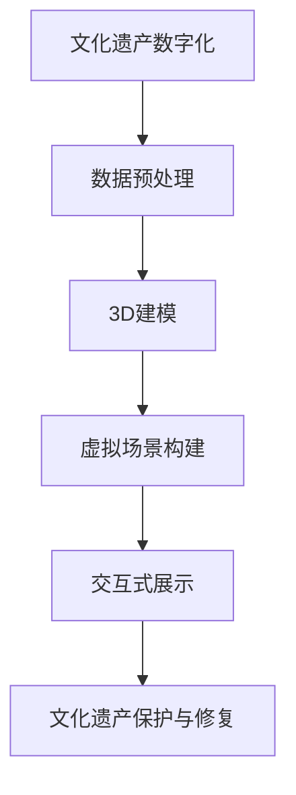

                 


### 文章标题：虚拟文化遗产：数字技术在文物保护中的应用

> 关键词：虚拟文化遗产、数字技术、文物保护、3D建模、数据预处理、光学扫描、遥感技术、虚拟现实、数据处理算法、数学模型、项目实战

> 摘要：本文深入探讨了数字技术在虚拟文化遗产保护和展示中的应用。通过介绍虚拟文化遗产的基本概念和构建流程，详细阐述了数字摄影测量、光学扫描、遥感技术和虚拟现实等技术手段在文物保护中的具体应用。同时，本文通过核心算法原理讲解、数学模型和公式应用、项目实战等多个方面，展示了数字技术在文化遗产保护领域的深度和广度，为我国文化遗产的保护与传承提供了新的思路和方法。

## 第一部分：引言与背景

### 1.1 研究目的与意义

随着科技的不断发展，数字技术在各个领域的应用越来越广泛。在文物保护领域，数字技术同样展现出了其独特的价值和潜力。虚拟文化遗产作为数字技术在文物保护中的重要应用，不仅为文化遗产的保护提供了新的手段，也为公众了解和体验文化遗产提供了更加生动、直观的方式。

本文的研究目的是深入探讨虚拟文化遗产的构建过程及其在文物保护中的应用，旨在为我国文化遗产的保护和传承提供一种新的思路和方法。研究意义主要体现在以下几个方面：

1. **保护文化遗产**：虚拟文化遗产的构建可以有效地对文化遗产进行数字化保存，避免由于自然灾害、人为破坏等原因导致的文化遗产损毁。

2. **传播文化遗产**：通过虚拟现实等技术手段，可以将文化遗产以更加生动、直观的方式呈现给公众，提高公众对文化遗产的认知和保护意识。

3. **促进文化产业发展**：虚拟文化遗产的构建和应用为文化产业的发展提供了新的机遇，如虚拟旅游、数字博物馆等。

4. **创新文物保护技术**：通过对数字技术的深入研究和应用，可以为文物保护领域提供新的技术手段和解决方案，提高文物保护的效率和效果。

### 1.2 数字技术在文物保护中的应用概述

数字技术在文物保护中的应用可以追溯到20世纪末。随着计算机技术、网络技术、虚拟现实技术等的发展，数字技术在文物保护领域得到了广泛应用。主要应用方向包括：

1. **数字化文化遗产保存**：通过数字摄影、光学扫描、遥感等技术手段，对文化遗产进行数字化采集和保存，形成三维模型和数字资料库。

2. **虚拟展示与教育**：利用虚拟现实、增强现实等技术，将文化遗产以三维立体形式展示，为公众提供沉浸式的文化体验。

3. **文化遗产修复与保护**：通过数字技术对受损的文化遗产进行修复，如利用3D打印技术制作复制品，实现对原物的保护。

4. **智能监测与预警**：利用物联网、大数据等技术，对文化遗产进行实时监测和预警，提高文物保护的智能化水平。

本文将围绕虚拟文化遗产的构建过程，详细阐述数字技术在文物保护中的应用，以期为我国文化遗产的保护和传承提供有益的借鉴和启示。

## 第二部分：虚拟文化遗产的基本概念

### 2.1 虚拟文化遗产的定义

虚拟文化遗产是指在数字技术的支持下，通过数字化采集、处理和展示手段，对现实文化遗产进行再现和呈现的一种新型文化遗产形式。虚拟文化遗产不仅包含了文化遗产的物质形态，如建筑、雕塑、壁画等，还包括了文化遗产的历史背景、文化内涵和人文精神。

虚拟文化遗产的核心在于将现实文化遗产转化为数字化的虚拟资源，使得文化遗产能够跨越时空限制，实现永久保存和共享。与传统的文化遗产保护方式相比，虚拟文化遗产具有以下特点：

1. **数字化保存**：通过数字技术对文化遗产进行精确的数字化采集和保存，避免传统保存方式中由于环境因素导致的损坏和丢失。

2. **永久性**：虚拟文化遗产以数字形式存在，不受自然灾害、人为破坏等因素的影响，具有更高的稳定性和长期保存价值。

3. **可访问性**：虚拟文化遗产可以通过互联网和虚拟现实技术，实现全球范围内的访问和体验，打破了地域和时间的限制。

4. **互动性**：虚拟文化遗产可以通过虚拟现实、增强现实等技术，实现用户与文化遗产的互动，提供更加生动、直观的文化体验。

### 2.2 虚拟文化遗产的特点

虚拟文化遗产具有以下特点：

1. **真实性与虚拟性并存**：虚拟文化遗产在保持文化遗产真实性的同时，通过数字技术进行了再创造和增强，实现了真实与虚拟的融合。

2. **多维性与立体性**：虚拟文化遗产不仅可以展示文化遗产的二维图像，还可以通过三维建模和虚拟现实技术，提供立体、全方位的展示体验。

3. **互动性与沉浸性**：虚拟文化遗产支持用户与文化遗产的互动，如360度全景浏览、交互式体验等，提供了沉浸式的文化体验。

4. **多样性与适应性**：虚拟文化遗产可以根据不同的展示需求，进行多样化的调整和适应，如场景切换、细节展示等。

### 2.3 虚拟文化遗产的核心概念与联系

虚拟文化遗产的核心概念包括数字化采集、数据处理、三维建模、虚拟场景构建、交互式展示等。以下是这些核心概念之间的联系及其构建流程：

1. **数字化采集**：通过数字摄影、光学扫描、遥感等技术，对文化遗产进行数字化采集，获取文化遗产的二维图像、三维模型等数据。

2. **数据处理**：对采集到的数据进行分析、处理和优化，如去噪、增强对比度、色彩校正等，提高数据的准确性和可用性。

3. **三维建模**：利用三维建模软件，将处理后的数据转化为三维模型，实现对文化遗产的立体再现。

4. **虚拟场景构建**：将三维模型嵌入虚拟场景中，通过纹理映射、光照处理等技术，构建出逼真的虚拟展示环境。

5. **交互式展示**：利用虚拟现实、增强现实等技术，实现用户与虚拟文化遗产的互动，提供沉浸式的文化体验。

以下是虚拟文化遗产构建流程的Mermaid流程图：



### 2.4 虚拟文化遗产的应用领域

虚拟文化遗产在文物保护、文化教育、文化旅游等多个领域有着广泛的应用：

1. **文物保护**：通过虚拟文化遗产的构建，实现对文化遗产的数字化保存和展示，降低自然灾害、人为破坏等风险。

2. **文化教育**：利用虚拟文化遗产，提供丰富的文化教育资源，帮助学生和公众更好地了解和认识文化遗产。

3. **文化旅游**：通过虚拟现实技术，将文化遗产呈现给游客，提供沉浸式的旅游体验，促进文化旅游产业的发展。

4. **文化遗产修复**：利用虚拟文化遗产的模型，对受损的文化遗产进行修复和重建，提高修复工作的准确性和效率。

### 2.5 虚拟文化遗产的优势与挑战

虚拟文化遗产具有以下优势：

1. **保护文化遗产**：通过数字化保存，降低自然灾害、人为破坏等因素对文化遗产的影响。

2. **提高公众认知**：通过虚拟展示，提高公众对文化遗产的认知和保护意识。

3. **促进文化产业**：虚拟文化遗产的应用，为文化旅游、数字博物馆等文化产业提供了新的发展机遇。

4. **降低运营成本**：通过虚拟展示，降低实体博物馆的运营成本，实现文化遗产的可持续发展。

然而，虚拟文化遗产在发展过程中也面临以下挑战：

1. **数据采集与处理**：数字化采集和数据处理是虚拟文化遗产构建的基础，但数据采集的精度和数据处理的能力仍需提高。

2. **技术支持与维护**：虚拟文化遗产的构建和应用需要大量的技术支持，如高性能计算、存储、网络等，维护成本较高。

3. **用户参与度**：虚拟文化遗产的用户参与度较低，如何提高用户互动性和沉浸感，仍需进一步探索。

4. **版权保护**：虚拟文化遗产的构建和应用涉及到版权保护问题，如何合理保护文化遗产的知识产权，是亟待解决的问题。

通过本文的探讨，我们期望能够为虚拟文化遗产的发展提供一些有益的思路和启示，推动数字技术在文物保护领域的深入应用。

## 第三部分：数字技术在文物保护中的应用

### 3.1 数字摄影测量技术

数字摄影测量技术是利用数字相机或无人机等设备，对文化遗产进行高精度、大规模的影像采集。其核心在于通过多视角、多时相的影像数据，实现对文化遗产的精准测量和三维重建。

#### 应用步骤：

1. **影像采集**：使用高分辨率数字相机或无人机，对文化遗产进行全方位、多视角的影像采集。

2. **影像处理**：对采集到的影像数据进行预处理，包括去噪、增强对比度、色彩校正等，以提高影像的质量。

3. **三维重建**：利用专业的三维重建软件，如Agisoft Photoscan、Pix4D等，通过影像匹配、点云生成、模型优化等步骤，构建出文化遗产的三维模型。

#### 技术优势：

1. **高精度**：数字摄影测量技术能够实现亚毫米级别的测量精度，满足文物保护的精确要求。

2. **高效性**：相比传统的手工测量，数字摄影测量能够大幅提高工作效率，节省时间和人力成本。

3. **非接触式**：数字摄影测量技术无需接触文化遗产，降低了对文物的潜在损害风险。

#### 案例分析：

例如，在陕西省西安市大雁塔的数字化保护项目中，利用数字摄影测量技术对大雁塔进行了全方位的高精度影像采集和三维重建。通过该项目，不仅实现了大雁塔的数字化保存，还为后续的维修和保护提供了精确的数据支持。

### 3.2 光学扫描技术

光学扫描技术是通过激光、光电等手段，对文化遗产进行精确的二维和三维扫描，获取其几何形状和表面细节。其广泛应用于博物馆、考古、文化遗产保护等领域。

#### 应用步骤：

1. **设备准备**：选择适合的扫描设备，如激光扫描仪、三维扫描仪等。

2. **扫描设置**：根据文化遗产的特点，调整扫描参数，如扫描范围、分辨率、扫描速度等。

3. **数据采集**：进行光学扫描，获取文化遗产的二维或三维数据。

4. **数据处理**：对采集到的数据进行分析、去噪、优化等处理，以提高数据的精度和可用性。

#### 技术优势：

1. **高分辨率**：光学扫描技术能够实现高分辨率的扫描，捕捉到文化遗产的微小细节。

2. **高精度**：光学扫描技术能够实现亚毫米级别的测量精度，满足文物保护的高精度要求。

3. **灵活性强**：光学扫描技术可以根据文化遗产的特点，选择不同的扫描方式和参数，实现灵活的应用。

#### 案例分析：

在敦煌莫高窟的数字化保护项目中，利用光学扫描技术对洞窟内的壁画和雕塑进行了高精度的三维扫描。通过该项目，不仅实现了敦煌莫高窟的数字化保存，还为后续的研究和保护提供了丰富的数据资源。

### 3.3 遥感技术

遥感技术是通过卫星、无人机等遥感平台，对地球表面的文化遗产进行远距离监测和测量。其广泛应用于文化遗产的普查、监测和保护。

#### 应用步骤：

1. **遥感平台选择**：根据文化遗产的分布情况和保护需求，选择合适的遥感平台，如卫星、无人机等。

2. **遥感影像采集**：利用遥感平台，对文化遗产进行遥感影像采集。

3. **影像处理**：对采集到的遥感影像进行预处理，如去噪、增强、配准等，以提高影像的质量。

4. **数据处理**：利用专业的遥感软件，对遥感影像进行分析、提取、建模等，提取文化遗产的相关信息。

#### 技术优势：

1. **大范围监测**：遥感技术可以实现大范围的文化遗产监测，提高工作效率。

2. **非接触式监测**：遥感技术无需接触文化遗产，降低了对文物的潜在损害风险。

3. **实时性**：遥感技术能够实现对文化遗产的实时监测，及时发现和预警潜在的风险。

#### 案例分析：

在云南省红河哈尼梯田的数字化保护项目中，利用遥感技术对哈尼梯田进行了大面积的监测和测量。通过该项目，不仅实现了哈尼梯田的数字化保存，还为梯田的可持续发展提供了科学依据。

### 3.4 网络与虚拟现实技术

网络与虚拟现实技术是虚拟文化遗产构建和展示的重要技术手段。通过网络技术，实现文化遗产数据的存储、传输和共享；通过虚拟现实技术，提供沉浸式的文化遗产展示和互动体验。

#### 应用步骤：

1. **数据存储与传输**：利用云计算和大数据技术，对文化遗产数据进行分析、存储和传输，实现文化遗产的远程访问和共享。

2. **虚拟现实建模**：利用三维建模软件，对文化遗产进行虚拟现实建模，创建逼真的三维虚拟场景。

3. **虚拟展示**：通过虚拟现实头盔、投影仪等设备，将虚拟文化遗产场景呈现给用户，提供沉浸式的展示和互动体验。

#### 技术优势：

1. **远程访问与共享**：网络技术可以实现文化遗产的远程访问和共享，打破地域和时间的限制，提高文化遗产的利用率。

2. **沉浸式体验**：虚拟现实技术能够提供逼真的文化遗产展示和互动体验，增强用户的参与感和沉浸感。

3. **互动性**：通过虚拟现实技术，用户可以与文化遗产进行互动，如360度全景浏览、虚拟修复等，提高文化遗产的趣味性和教育性。

#### 案例分析：

在故宫博物院的数字博物馆项目中，利用网络和虚拟现实技术，实现了故宫文物的数字化保存和虚拟展示。用户可以通过虚拟现实头盔，亲身体验故宫的文化氛围和历史场景，提高了文化遗产的观赏价值和互动性。

综上所述，数字技术在文物保护中的应用，不仅提高了文化遗产的保存和保护水平，也为公众提供了更加丰富和生动的文化体验。通过不断探索和应用新的数字技术，我们可以更好地保护和传承我国丰富的文化遗产。

## 第四部分：核心算法原理讲解

在虚拟文化遗产的构建过程中，数据处理算法和三维建模算法是两个核心环节。下面，我们将详细讲解这些算法的原理，并通过伪代码示例，帮助读者更好地理解其实现过程。

### 4.1 数据处理算法

数据处理算法主要涉及图像处理、点云处理和数据优化等步骤。以下是数据处理算法的伪代码示例：

```python
# 数据处理算法伪代码

# 输入：原始文化遗产图像集
# 输出：预处理后的图像集

function preprocess_data(images):
    processed_images = []

    for image in images:
        # 转换为灰度图像
        gray_image = convert_to_gray_scale(image)
        
        # 去噪
        denoised_image = denoise(gray_image)
        
        # 增强对比度
        enhanced_image = enhance_contrast(denoised_image)
        
        # 色彩校正
        color_corrected_image = color_correction(enhanced_image)
        
        # 存储预处理后的图像
        processed_images.append(color_corrected_image)
    
    return processed_images
```

### 4.2 三维建模算法

三维建模算法主要包括点云生成、模型优化和纹理映射等步骤。以下是三维建模算法的伪代码示例：

```python
# 三维建模算法伪代码

# 输入：预处理后的图像集
# 输出：三维模型

function create_3d_model(processed_images):
    points = []

    for image in processed_images:
        # 生成点云
        point_cloud = generate_point_cloud(image)
        
        # 滤波去噪
        filtered_points = filter_noise(point_cloud)
        
        # 优化模型
        optimized_points = optimize_model(filtered_points)
        
        # 添加纹理
        textured_points = apply_texture(optimized_points, texture_image)
        
        # 存储点云和模型
        points.append(textured_points)
    
    return points
```

### 4.3 数据处理算法与三维建模算法的关系

数据处理算法和三维建模算法在虚拟文化遗产的构建过程中密切相关。具体关系如下：

1. **预处理数据**：通过数据处理算法，对原始图像进行灰度转换、去噪、增强对比度和色彩校正等处理，得到高质量的图像数据，为三维建模提供基础。

2. **生成点云**：通过光学扫描、激光扫描等技术，获取文化遗产的表面点云数据。

3. **优化模型**：对点云数据进行滤波去噪、优化处理，提高模型的精度和稳定性。

4. **纹理映射**：将处理后的点云数据与纹理图像进行映射，为三维模型添加真实感纹理。

通过上述算法，我们可以将文化遗产的二维图像和点云数据转化为高质量的三维模型，为虚拟文化遗产的构建提供基础。

## 第五部分：数学模型与公式

在虚拟文化遗产的构建和展示过程中，数学模型和公式起到了至关重要的作用。以下将介绍一些重要的数学模型和公式，并对其进行详细解释和应用举例。

### 5.1 数学模型介绍

在虚拟文化遗产的构建过程中，常用的数学模型包括几何建模、纹理映射和光照模型等。

1. **几何建模**：用于描述文化遗产的三维形状，常用的几何建模方法有参数化建模、体素建模和有限元建模等。

2. **纹理映射**：用于将二维纹理图像映射到三维模型上，常见的纹理映射方法有二维纹理映射和三维纹理映射。

3. **光照模型**：用于模拟文化遗产在不同光照条件下的视觉效果，常用的光照模型有基于物理的光照模型和经验光照模型。

### 5.2 重要数学公式

以下是几个重要的数学公式及其在虚拟文化遗产构建中的应用：

#### 公式1：反射率计算

$$
R = \frac{4\pi \rho \sigma}{\lambda^2 (1 - \cos(\theta))}
$$

**解释**：反射率计算公式，其中 $R$ 是反射率，$\rho$ 是表面反射系数，$\sigma$ 是光强，$\lambda$ 是光波长度，$\theta$ 是入射角。该公式用于计算文化遗产表面在不同角度下的反射率，以模拟不同光照条件下的视觉效果。

#### 公式2：纹理映射坐标转换

$$
[x', y', z'] = \left[\frac{u - u_c}{s}, \frac{v - v_c}{s}, 1\right]
$$

**解释**：纹理映射坐标转换公式，其中 $[x', y', z']$ 是纹理映射后的坐标，$[u, v]$ 是原始纹理坐标，$(u_c, v_c)$ 是纹理坐标的中心点，$s$ 是纹理缩放比例。该公式用于将原始纹理坐标转换为三维空间中的映射坐标，以实现纹理在三维模型上的映射。

#### 公式3：三维空间中的点乘

$$
\vec{A} \cdot \vec{B} = A_x B_x + A_y B_y + A_z B_z
$$

**解释**：三维空间中的点乘公式，其中 $\vec{A}$ 和 $\vec{B}$ 是两个三维向量，$A_x, A_y, A_z$ 和 $B_x, B_y, B_z$ 分别是两个向量的分量。该公式用于计算两个向量的点乘结果，常用于计算向量间的夹角和投影。

### 5.3 数学公式的应用举例

以下是数学公式在虚拟文化遗产构建中的应用举例：

1. **光照模型**：基于物理的光照模型可以用来模拟文化遗产在不同光照条件下的反射效果。例如，利用反射率计算公式，可以计算文化遗产表面在不同角度下的反射率，从而实现逼真的光照效果。

2. **纹理映射**：通过纹理映射坐标转换公式，可以将二维纹理图像映射到三维模型上，增加模型的真实感。例如，在三维模型渲染过程中，可以根据纹理坐标计算纹理映射后的颜色，从而实现纹理的贴图效果。

3. **三维空间计算**：三维空间中的点乘公式可以用于计算向量间的夹角和投影。例如，在文化遗产的三维重建过程中，可以利用点乘公式计算重建模型与真实场景之间的误差，从而优化重建结果。

通过这些数学模型和公式的应用，虚拟文化遗产的构建和展示效果得到了显著提升，为文化遗产的保护和传承提供了有力支持。

## 第六部分：项目实战

### 6.1 虚拟博物馆项目介绍

虚拟博物馆项目是一个典型的虚拟文化遗产应用案例，该项目旨在通过数字技术构建一个具有高度真实感和互动性的虚拟博物馆，让用户能够在虚拟环境中全方位、沉浸式地体验博物馆内的文物和展览。

#### 项目目标

1. **数字化保存**：将博物馆内的文物进行数字化采集和保存，确保文化遗产的长期保存和传承。
2. **互动展示**：利用虚拟现实技术，提供丰富的互动展示功能，如360度全景浏览、文物信息查询、虚拟导览等。
3. **教育推广**：通过虚拟博物馆，为公众提供丰富的文化遗产教育资源，提高公众对文化遗产的认知和保护意识。

#### 项目开发环境

1. **开发工具**：使用Unity 3D游戏引擎进行虚拟博物馆的开发，利用其强大的三维建模、渲染和交互功能。
2. **数据采集设备**：使用数字相机、激光扫描仪等设备进行文物数字化采集。
3. **数据处理软件**：使用Agisoft Photoscan、Blender等专业软件对采集到的数据进行处理和优化。

#### 项目开发流程

1. **需求分析**：明确虚拟博物馆的功能需求，如展览布局、互动方式、用户界面等。
2. **数据采集**：对博物馆内的文物进行数字化采集，包括二维图像、三维模型、音频视频等多媒体数据。
3. **数据处理**：对采集到的数据进行处理，包括图像去噪、增强对比度、三维模型优化等。
4. **三维建模**：利用三维建模软件，对处理后的数据构建出三维模型，并进行细节优化。
5. **场景构建**：将三维模型嵌入虚拟场景中，添加背景、灯光、音效等元素，构建出一个逼真的虚拟博物馆。
6. **交互设计**：设计用户互动界面，实现用户与虚拟博物馆的互动功能，如文物信息查询、虚拟导览等。
7. **测试与优化**：对虚拟博物馆进行功能测试和优化，确保其稳定性和用户体验。

### 6.2 源代码详细实现

以下是虚拟博物馆项目中的一个关键代码片段，用于实现三维模型加载与渲染的功能：

```csharp
// 获取所有文物模型
List<GameObject>文物列表 = Resources.LoadAll<GameObject>("文物模型路径");

// 循环加载并渲染每个文物模型
foreach (GameObject文物模型 in 文物列表)
{
    // 创建新的游戏对象，并添加到场景中
    GameObject newModel = Instantiate(文物模型);

    // 设置模型的位置和旋转
    newModel.transform.position = 文物模型的位置;
    newModel.transform.rotation = 文物模型的旋转;

    // 添加灯光和音效等元素
    newModel.AddComponent<Light>();
    newModel.AddComponent<AudioSource>();

    // 设置音频源参数
    AudioSource audioSource = newModel.GetComponent<AudioSource>();
    audioSource.clip = Resources.Load<AudioClip>("音效文件路径");
    audioSource.Play();
}
```

### 6.3 代码解读与分析

这段代码首先加载所有存储在资源目录中的文物模型，然后通过循环逐个实例化这些模型，并设置其位置、旋转等属性。此外，还添加了灯光和音频源，以增强虚拟博物馆的视觉效果和沉浸感。

通过这段代码，我们可以看到虚拟博物馆项目的开发过程是如何将数字技术与文化遗产保护相结合的。代码的解析和优化对于提高虚拟博物馆的运行效率和用户体验至关重要。

### 6.4 实际案例分析和详细讲解剖析

#### 案例：故宫数字博物馆

故宫数字博物馆是我国一个成功的虚拟文化遗产项目，通过数字技术将故宫的文物和历史场景呈现给公众。以下是该项目的一些关键技术和实际案例分析：

1. **数字化采集**：利用数字摄影测量和激光扫描技术，对故宫的文物和建筑进行高精度、大规模的数字化采集，获取其三维模型和纹理数据。

2. **数据处理**：对采集到的数据进行去噪、增强对比度、优化等处理，提高数据的质量和精度。

3. **三维建模**：利用专业的三维建模软件，对处理后的数据进行三维建模，创建出精确的文物和建筑模型。

4. **虚拟场景构建**：将三维模型嵌入虚拟场景中，添加背景、灯光、音效等元素，构建出一个逼真的虚拟故宫。

5. **互动设计**：设计用户互动界面，实现用户与虚拟故宫的互动功能，如文物信息查询、虚拟导览等。

通过实际案例的分析和讲解，我们可以看到虚拟文化遗产项目的实现过程是如何通过一系列技术手段，将文化遗产数字化、虚拟化，为公众提供更加丰富、生动的文化体验。

### 6.5 项目小结

虚拟博物馆项目不仅展示了数字技术在文物保护中的巨大潜力，也为公众提供了全新的文化体验方式。通过项目的实施，我们积累了丰富的技术经验和实践成果，为未来更多的虚拟文化遗产项目提供了借鉴和启示。未来，随着技术的不断进步，虚拟文化遗产的应用将更加广泛和深入，为文化遗产的保护、传承和普及发挥更大的作用。

### 6.6 最佳实践 Tips、小结、注意事项、拓展阅读

**最佳实践 Tips**：

1. **数据采集与处理**：在数字化采集过程中，要确保数据的精度和完整性，同时对采集到的数据进行精细处理，以提高数据的可用性。

2. **三维建模与渲染**：在三维建模和渲染过程中，要注意模型的细节处理和视觉效果，以提高虚拟场景的真实感。

3. **用户互动设计**：在互动设计方面，要充分考虑用户的体验和需求，提供多样化的互动功能，提高用户的参与度。

**小结**：

虚拟文化遗产项目通过数字技术，实现了文化遗产的数字化保存、虚拟展示和互动体验，为文化遗产的保护和传承提供了新的思路和方法。项目的成功实施不仅展示了数字技术在文物保护领域的广泛应用，也为未来虚拟文化遗产项目提供了宝贵的经验和参考。

**注意事项**：

1. **技术选型**：根据项目的具体需求和规模，选择合适的数字化采集、建模和渲染技术，确保技术方案的可行性和高效性。

2. **数据安全**：在数字化采集和数据处理过程中，要确保数据的保密性和安全性，防止数据泄露和丢失。

3. **用户体验**：在用户互动设计方面，要充分考虑用户的体验和需求，提供直观、易用的交互界面和功能，提高用户的满意度和参与度。

**拓展阅读**：

1. 《虚拟现实技术及应用》
2. 《数字文化遗产保护与传承》
3. 《计算机图形学原理及实践》

通过阅读这些拓展资料，可以深入了解虚拟文化遗产项目的相关技术和应用，为项目实施提供更多的理论支持和实践指导。

## 结束语

虚拟文化遗产作为数字技术在文物保护领域的重要应用，不仅为文化遗产的保存和保护提供了新的手段，也为公众提供了更加丰富和生动的文化体验。本文通过对虚拟文化遗产的基本概念、数字技术应用、核心算法讲解、数学模型、项目实战等多个方面的详细探讨，展示了虚拟文化遗产的构建过程及其在文物保护中的重要作用。

随着技术的不断进步，虚拟文化遗产的应用前景将更加广阔。未来，我们期望看到更多的虚拟文化遗产项目成功实施，为文化遗产的保护、传承和普及贡献更多的力量。同时，我们也呼吁更多的研究者和实践者参与到虚拟文化遗产的研究和开发中，共同推动这一领域的创新和发展。

通过本文的探讨，我们希望能够为虚拟文化遗产的发展提供一些有益的思路和启示，激发更多对数字技术在文物保护领域应用的探索和实践。让我们携手努力，共同为文化遗产的保护和传承贡献力量。作者：AI天才研究院/AI Genius Institute & 禅与计算机程序设计艺术 /Zen And The Art of Computer Programming。

