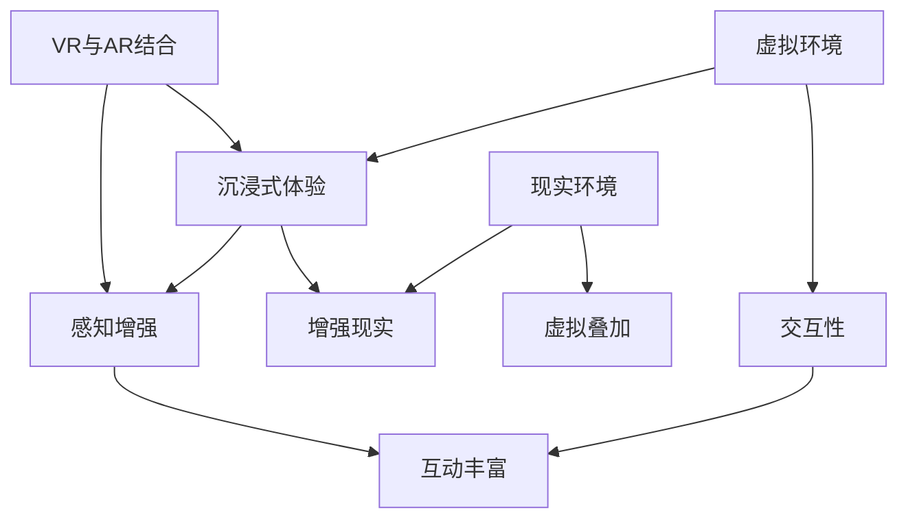
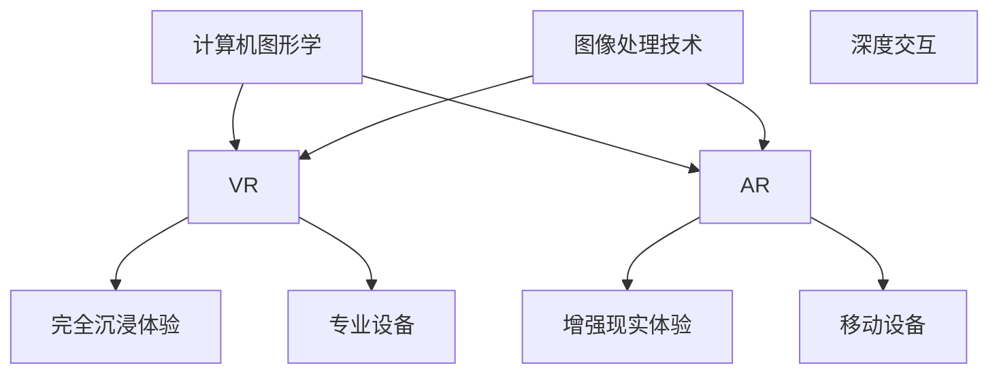
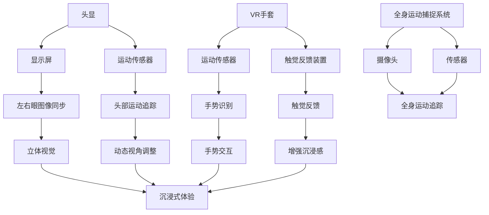
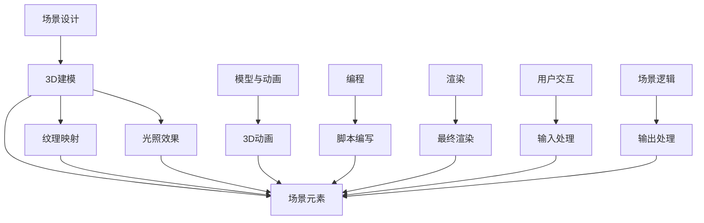
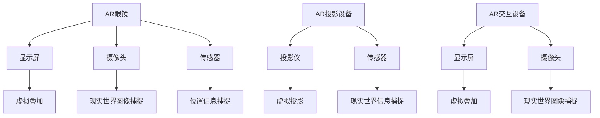
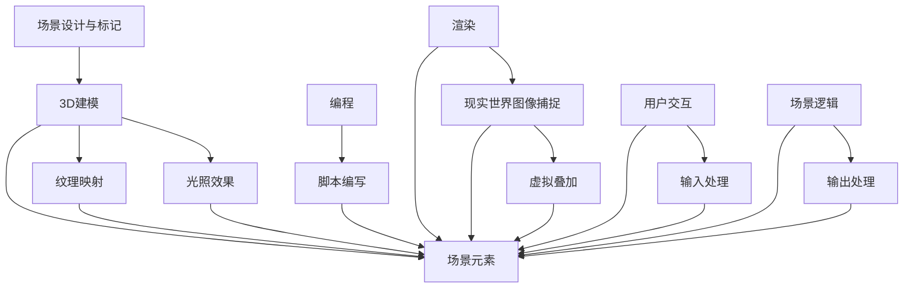
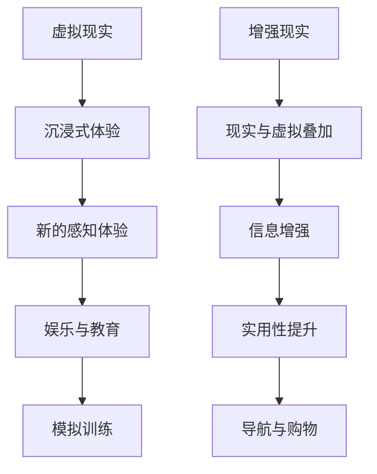
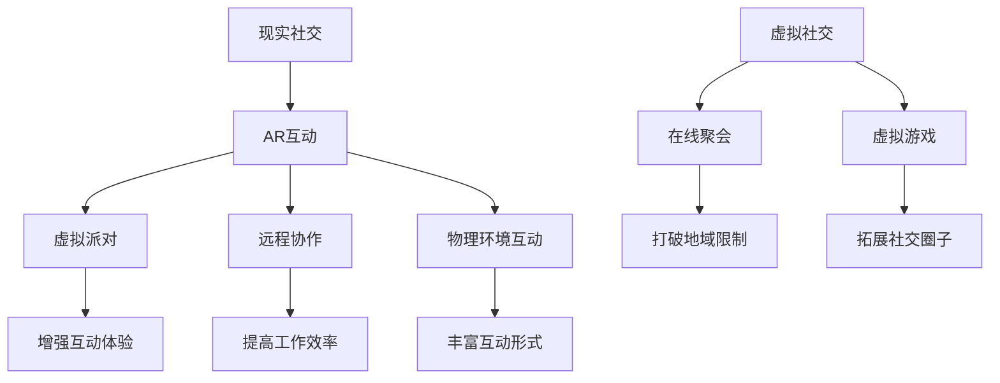
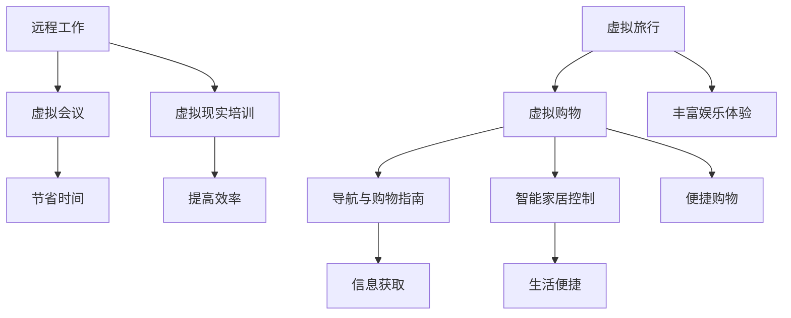

                 

### 文章标题

虚拟现实与增强现实：重塑体验的意义

### 关键词

虚拟现实（VR）、增强现实（AR）、体验重塑、技术实现、应用领域、感知、社交互动、伦理问题、法律问题、教育意义

### 摘要

本文旨在探讨虚拟现实（VR）和增强现实（AR）技术的核心概念、技术实现、应用领域以及对人类体验的深刻影响。首先，我们将回顾VR和AR的发展历程，解析其基础技术和组件。接着，本文将深入探讨VR与AR之间的相似性与差异性，并预测其未来发展趋势。在此基础上，文章将详细分析VR和AR在硬件设备、内容制作、以及应用领域的具体实现，并通过实际案例提供代码实现和详细解读。最后，我们将探讨VR和AR对人类感知、社交互动以及工作与生活的改变，并探讨相关的伦理和法律问题。通过本文的详细分析，读者将能够全面理解VR和AR技术的本质及其对未来社会的重要影响。

### 目录

1. **背景介绍**
   1.1 **VR与AR的历史发展**
   1.2 **核心概念与联系**
   1.3 **VR与AR的相似性与差异性**
   1.4 **未来发展趋势**

2. **技术实现**
   2.1 **VR硬件设备**
   2.2 **VR内容制作**
   2.3 **AR硬件设备**
   2.4 **AR内容制作**

3. **应用领域**
   3.1 **VR在教育中的应用**
   3.2 **AR在医疗中的应用**
   3.3 **VR与AR在其他领域中的应用**

4. **体验重塑与影响**
   4.1 **对感知的影响**
   4.2 **对社交互动的影响**
   4.3 **对工作与生活的改变**

5. **社会影响**
   5.1 **伦理问题**
   5.2 **法律问题**
   5.3 **教育意义**

6. **附录**
   6.1 **资源与工具**
   6.2 **实战案例**
   6.3 **最佳实践 tips**

### 背景介绍

#### VR与AR的历史发展

虚拟现实（VR）和增强现实（AR）作为现代科技的两大前沿领域，其历史可以追溯到20世纪中期。VR的概念最早由美国科幻作家菲利普·K·迪克（Philip K. Dick）在其小说中提出，而实际的VR技术探索始于1968年，由美国计算机科学家伊凡·苏瑟兰（Ivan Sutherland）开发了第一个头戴式显示器“达摩克利斯之剑”（The Sword of Damocles）。

增强现实（AR）的概念则起源于波音公司对飞行模拟器的研究。20世纪80年代，波音工程师们开始使用头戴式显示器来模拟飞行环境，这一技术后来演变为AR技术的雏形。然而，AR技术真正开始引起广泛关注是在21世纪初，随着智能手机和平板电脑的普及，使得AR内容能够通过移动设备轻松访问。

#### 核心概念与联系

虚拟现实（VR）是一种通过计算机模拟的三维环境，用户可以通过头戴式显示器或其他设备沉浸其中。VR的核心在于为用户提供一个完全虚拟的环境，用户可以与这个环境进行交互，从而获得身临其境的体验。

增强现实（AR）则是将虚拟的元素叠加到现实世界中，用户可以通过头戴式显示器、智能手机或平板电脑等设备看到现实与虚拟元素的结合。AR的核心在于增强用户的感知体验，通过将虚拟元素与真实环境相结合，为用户提供更加丰富和互动的体验。

虽然VR和AR有各自的特点和应用场景，但它们的核心目标都是通过技术手段改变用户的感知和互动方式。以下是一个简单的Mermaid流程图，展示了VR与AR之间的核心概念与联系：



#### VR与AR的相似性与差异性

VR与AR在技术实现和应用场景上存在显著差异。首先，从技术角度看，VR主要通过头戴式显示器或专业设备提供完全沉浸式的体验，而AR则通过在现实世界中叠加虚拟元素实现增强现实的体验。

其次，从应用场景来看，VR更多应用于游戏、教育和模拟训练等领域，用户需要佩戴专业的设备以获得完整的沉浸体验。而AR则更多应用于医疗、教育、娱乐和营销等领域，用户通过智能手机或平板电脑即可体验到增强现实的效果。

然而，VR与AR也有一些共同点。首先，它们都依赖于计算机图形学和图像处理技术，通过生成和处理虚拟或增强的图像来提供用户体验。其次，它们都追求与用户的深度交互，通过输入设备和传感器来捕捉用户的动作和反应，从而实现更加自然和丰富的互动。

以下是一个Mermaid流程图，展示了VR与AR之间的相似性与差异性：



#### 未来发展趋势

随着技术的不断进步，VR与AR在未来将会有更多的发展机会和挑战。首先，硬件设备的性能将进一步提高，使得VR与AR的体验更加真实和流畅。其次，内容制作和开发工具的丰富，将为更多的应用场景提供支持。此外，随着5G和边缘计算技术的发展，VR与AR的应用将不再局限于特定的设备或网络环境。

总之，VR与AR作为现代科技的两大前沿领域，其发展不仅会改变我们的娱乐、教育和医疗方式，还将深刻影响我们的感知、社交互动和工作生活。未来，随着技术的不断进步和应用的深入，VR与AR将为人类社会带来更多的创新和变革。

### 技术实现

#### VR硬件设备

虚拟现实（VR）硬件设备是实现沉浸式体验的核心组件。以下是一些主要的VR硬件设备及其工作原理：

1. **VR头显**：VR头戴式显示器（HMD）是最常见的VR设备。它通过两块显示屏（通常为OLED或LCD屏幕）分别发送图像到左右眼，模拟立体视觉效果。头显内置高精度的运动传感器，如陀螺仪、加速计和磁力计，用于跟踪头部的运动，从而实现动态视角调整。

2. **VR手套**：VR手套用于模拟手部的运动和交互。它通常包含多个运动传感器和触觉反馈装置，使得用户能够进行手势识别和触觉反馈，从而增强沉浸感。

3. **VR全身运动捕捉系统**：全身运动捕捉系统用于捕捉用户全身的运动，提供更真实的虚拟体验。它通常由多个摄像头和传感器组成，能够实时追踪用户的动作，并将其映射到虚拟环境中。

以下是一个Mermaid流程图，展示了VR硬件设备的基本架构：



#### VR内容制作

VR内容制作的流程包括多个步骤，从场景设计到最终渲染，都需要高度的细致和专业知识。

1. **场景设计**：首先，需要设计虚拟场景的布局和交互逻辑。场景设计师可以使用3D建模软件（如Blender、Maya等）创建场景中的各种元素，包括角色、物体和环境。

2. **模型与动画**：接着，将场景中的模型进行细节处理，包括纹理映射、光照效果和动画制作。动画师可以使用3D动画软件（如Blender、3ds Max等）为角色和物体创建逼真的动画。

3. **编程**：在完成场景设计和动画后，需要编写代码来实现用户交互和场景逻辑。编程语言（如Unity Script、C#等）用于编写场景的脚本，处理用户的输入和输出。

4. **渲染**：最后，将整个虚拟场景渲染成视频或图像序列。渲染器（如Unity、Unreal Engine等）负责将场景中的元素按照特定的光照和视角进行渲染，生成最终的视频或图像。

以下是一个Mermaid流程图，展示了VR内容制作的基本流程：



#### AR硬件设备

增强现实（AR）硬件设备使得用户能够在现实世界中看到虚拟元素。以下是一些主要的AR硬件设备及其工作原理：

1. **AR眼镜**：AR眼镜是最常见的AR设备，如微软的HoloLens和谷歌的Google Glass。它们通过内置的显示屏将虚拟元素叠加到用户的视野中。AR眼镜通常配备有摄像头和传感器，用于捕捉现实世界的图像和位置信息。

2. **AR投影设备**：AR投影设备通过投影仪将虚拟元素投影到平面或物体上。这种设备通常用于商业展示和教育领域，如Epson的AR投影仪。

3. **AR交互设备**：AR交互设备包括各种平板电脑和智能手机，用户可以通过这些设备上的应用程序实现与虚拟元素交互。

以下是一个Mermaid流程图，展示了AR硬件设备的基本架构：



#### AR内容制作

AR内容制作的流程与VR类似，但更注重于如何将虚拟元素与现实世界相结合。

1. **场景设计与标记**：首先，需要设计虚拟场景的布局和交互逻辑，并在现实世界中设置标记物。这些标记物可以是特殊的图像、二维码或物体，用于在AR应用程序中识别并定位。

2. **模型与动画**：然后，创建虚拟模型的3D模型和动画。与VR一样，可以使用3D建模和动画软件进行细节处理。

3. **编程**：编写代码实现用户交互和场景逻辑。AR应用程序通常使用AR开发平台（如ARKit、ARCore等）编写，这些平台提供了处理图像识别和位置信息的功能。

4. **渲染**：将虚拟元素渲染到现实世界的图像上。AR应用程序通过摄像头捕捉现实世界的图像，并在其中叠加虚拟元素。

以下是一个Mermaid流程图，展示了AR内容制作的基本流程：



通过上述步骤，我们可以创建出既丰富又互动的VR和AR内容，为用户带来全新的体验。

### 应用领域

#### VR在教育中的应用

虚拟现实（VR）在教育中的应用正逐渐成为教育技术领域的一个热点。VR技术的沉浸式和互动性特点，使其能够为学生提供更加生动、直观的学习体验。以下是一些VR在教育中应用的案例和优势：

1. **模拟实验**：在物理、化学和生物等科学学科中，VR技术可以模拟各种实验场景，使学生能够在虚拟环境中进行实验操作。例如，学生可以通过VR头显进入一个虚拟的实验室，进行化学实验而无需实际接触化学试剂。这种模拟实验不仅安全，还能提高学生的学习兴趣和实验技能。

2. **历史重现**：VR技术可以重现历史事件和地点，为学生提供更加直观的历史学习体验。例如，学生可以通过VR头显参观古埃及的坟墓、罗马帝国的遗址，甚至参加古代战役。这种身临其境的学习体验有助于加深学生对历史事件的理解和记忆。

3. **外科手术训练**：在医学教育中，VR技术可以模拟外科手术场景，使学生能够在虚拟环境中进行手术操作。通过VR手术模拟器，学生可以反复练习手术步骤，提高操作技能和手术成功率。此外，VR技术还可以用于远程教学，使偏远地区的学生能够接触到高质量的外科手术培训。

4. **安全教育**：VR技术可以用于安全培训，为学生提供虚拟的应急情况体验。例如，通过VR技术模拟火灾、地震等紧急情况，学生可以学习如何在紧急情况下保护自己和他人的安全。这种虚拟的紧急情况训练有助于提高学生的安全意识和应对能力。

5. **互动教学**：VR技术可以创建虚拟课堂，使学生能够在虚拟环境中与教师和其他学生互动。这种互动教学方式可以打破传统课堂的时空限制，使学生能够更加自由地进行学习和交流。例如，学生可以通过VR头显进入一个虚拟的教室，与教师和其他学生进行实时的互动和讨论。

#### AR在医疗中的应用

增强现实（AR）技术在医疗领域中的应用正在逐步拓展，为医生和患者提供更加高效和直观的医疗体验。以下是一些AR在医疗中应用的案例和优势：

1. **手术导航**：AR技术可以用于手术导航，将虚拟的手术工具和指导信息叠加到医生视野中，帮助医生更加精确地进行手术操作。例如，在心脏手术中，医生可以通过AR眼镜看到患者的心脏图像和手术工具的位置，从而提高手术的精确度和安全性。

2. **患者教育**：AR技术可以用于患者教育，帮助患者更好地理解自己的疾病和治疗过程。例如，医生可以通过AR技术向患者展示他们的身体部位、疾病影响和治疗方案，使患者更加清楚和放心。这种直观的教育方式有助于提高患者的治疗依从性和生活质量。

3. **远程医疗**：AR技术可以用于远程医疗，将医生和患者连接在一起，提供远程诊断和治疗服务。通过AR技术，医生可以远程查看患者的病情和医疗记录，并进行实时的视频通话和操作指导。这种远程医疗服务有助于解决医疗资源不均衡的问题，提高医疗服务的可及性。

4. **医学培训**：AR技术可以用于医学培训，为医生和医学生提供更加真实和互动的培训体验。例如，医生和医学生可以通过AR眼镜进入一个虚拟的手术室，进行手术操作和练习。这种虚拟培训环境有助于提高医生的手术技能和应急处理能力。

5. **医学研究**：AR技术可以用于医学研究，帮助研究人员更好地理解和分析医学数据。例如，通过AR技术，研究人员可以将大量的医学数据可视化，从而更直观地发现疾病之间的关联和规律。这种可视化的医学研究方法有助于推动医学科学的发展。

#### VR与AR在其他领域中的应用

除了教育和医疗领域，VR和AR技术还在其他多个领域展现出巨大的应用潜力：

1. **娱乐**：在娱乐领域，VR技术被广泛应用于游戏、虚拟现实电影院和主题公园等场景。用户可以通过VR头显进入一个完全虚拟的世界，体验前所未有的娱乐体验。例如，VR游戏《Beat Saber》通过结合音乐和舞蹈，为用户带来沉浸式的游戏体验。

2. **营销**：在营销领域，AR技术被广泛应用于广告、品牌体验和产品展示。通过AR技术，企业可以在现实环境中添加虚拟元素，为消费者提供更加生动和互动的购物体验。例如，零售商可以通过AR应用让消费者在店内看到商品的虚拟效果，从而提高销售转化率。

3. **城市规划**：在城市规划领域，VR技术可以用于模拟城市环境和建筑设计。通过VR技术，城市规划者可以提前看到建筑和设施的实际效果，从而优化城市设计和布局。

4. **工程与制造**：在工程与制造领域，VR技术被用于培训、设计和模拟。通过VR技术，工程师和制造人员可以在虚拟环境中进行操作训练和设备调试，提高工作效率和安全性。

5. **培训和模拟**：在培训和模拟领域，VR和AR技术被用于军事、消防、医疗和工业等领域。通过虚拟环境和模拟场景，培训人员可以模拟各种实际操作，提高培训效果和安全性。

总之，VR和AR技术在各个领域中的应用正不断拓展和深化，为人类社会带来更多的创新和变革。随着技术的不断进步，我们有理由相信，VR和AR技术将在未来继续发挥重要的作用，改变我们的生活方式和工作模式。

### 体验重塑与影响

虚拟现实（VR）和增强现实（AR）技术的出现，无疑对人类的感知、社交互动和工作生活带来了深远的影响。以下我们将详细探讨这些技术如何改变我们的日常体验。

#### 对感知的影响

VR和AR技术的核心目标之一是改变用户的感知体验。通过VR头戴式显示器，用户可以进入一个完全虚拟的三维环境，而这个环境可以模仿现实世界的各种场景和情境。例如，在VR游戏或模拟训练中，用户可以感受到现实世界中无法体验的重力、速度和触感。这种沉浸式的体验不仅提供了全新的娱乐方式，还在教育、军事训练和心理治疗等领域发挥了重要作用。

在AR技术中，虚拟元素被叠加到现实世界中，使得用户可以在现实环境中看到和交互虚拟对象。例如，通过AR眼镜或智能手机，用户可以在购物时看到商品的虚拟效果，或者在地图上查看路线信息。这种增强现实的体验不仅丰富了用户的感知世界，还提高了信息的可访问性和实用性。

以下是一个简单的Mermaid流程图，展示了VR和AR技术如何影响用户的感知：



#### 对社交互动的影响

VR和AR技术对社交互动的影响也是多方面的。在VR环境中，用户可以与其他虚拟角色互动，或者与身处不同地理位置的朋友一起参与虚拟活动。例如，通过VR社交平台，用户可以参加虚拟聚会、在线游戏和主题派对，从而打破地域限制，拓展社交圈子。

AR技术则通过在现实世界中叠加虚拟元素，改变了用户与物理环境和其他人的互动方式。例如，通过AR游戏，用户可以在现实环境中与朋友一起进行游戏，或者在现实世界中举办虚拟派对。此外，AR技术还可以用于远程协作，通过将虚拟对象叠加到现实工作环境中，团队成员可以在同一个虚拟空间中协作，提高工作效率。

以下是一个Mermaid流程图，展示了VR和AR技术如何影响社交互动：



#### 对工作与生活的改变

VR和AR技术的广泛应用，也在改变我们的工作和生活方式。在工作方面，VR和AR技术可以用于远程工作、虚拟会议和虚拟现实培训等。例如，通过VR技术，团队成员可以在虚拟会议室中开会，即使身处不同城市或国家。这种远程工作的方式不仅节省了时间和交通成本，还提高了工作效率和灵活性。

在生活方面，VR和AR技术为我们提供了更加丰富多彩的娱乐、教育和购物体验。例如，通过VR技术，我们可以在家中体验虚拟旅行、观看虚拟现实电影，或者在虚拟商场中购物。AR技术则使得我们在日常生活中能够更加方便地获取信息和服务，如导航、购物指南和智能家居控制。

以下是一个Mermaid流程图，展示了VR和AR技术如何改变工作和生活：



总之，VR和AR技术通过改变我们的感知、社交互动和工作生活，为我们带来了全新的体验和可能性。随着技术的不断进步，我们有理由相信，VR和AR技术将在未来继续发挥重要作用，进一步改变我们的生活方式和社会形态。

### 社会影响

虚拟现实（VR）和增强现实（AR）技术的发展不仅改变了人们的体验和生活方式，也对社会产生了深远的影响。这些影响包括伦理问题、法律问题和教育意义等方面。

#### 伦理问题

VR和AR技术的发展引发了多种伦理问题。首先，隐私问题是一个关键议题。在VR环境中，用户的个人信息和行为数据可能会被收集和分析，从而引发隐私泄露的风险。此外，AR技术使得虚拟元素可以无缝地叠加到现实世界中，这可能导致现实与虚拟的界限模糊，进而影响人们的隐私权。

其次，虚拟现实中的沉浸式体验可能导致现实世界中的社会隔离。用户可能会过度投入到虚拟环境中，忽视了现实世界中的社交互动和人际关系，从而影响他们的心理健康和社会适应能力。

最后，AR技术中虚拟元素的叠加可能会对现实世界中的公共秩序和道德规范产生影响。例如，在公共场合使用AR技术展示敏感或不当的内容，可能会引发争议和法律问题。

#### 法律问题

VR和AR技术的法律问题主要集中在版权、责任和监管等方面。首先，在内容制作和分发过程中，如何保护版权成为一个关键问题。虚拟和增强现实内容通常包含大量的图像、音频、视频和软件代码，这些内容的版权保护需要严格的法律法规来规范。

其次，责任问题也是VR和AR技术发展中的一个重要议题。当虚拟现实或增强现实系统出现故障或导致用户伤害时，责任归属和赔偿问题需要明确。例如，如果VR设备导致用户晕动症或其他健康问题，制造商和供应商是否需要承担责任？

最后，VR和AR技术的监管问题也越来越受到关注。随着这些技术的普及，如何确保其安全、合法和符合伦理标准，需要政府和社会各界的共同努力。例如，对于VR和AR游戏中的暴力内容、虚假信息和误导性广告，需要制定相应的监管措施。

#### 教育意义

VR和AR技术在教育领域的应用具有重要的教育意义。首先，这些技术能够提供更加生动、直观的学习体验，提高学生的学习兴趣和参与度。例如，通过VR技术，学生可以亲身体验历史事件、科学实验和自然景观，从而加深对知识的理解和记忆。

其次，VR和AR技术可以为学生提供个性化的学习体验。通过虚拟现实环境，学生可以根据自己的学习进度和兴趣，选择不同的学习内容和方式。这种个性化的学习模式有助于提高学生的自主学习能力和学习效果。

此外，VR和AR技术还可以促进教师和学生之间的互动和协作。在虚拟环境中，教师可以创建各种互动课堂和活动，让学生在合作中学习，提高团队合作能力和沟通能力。

总之，VR和AR技术在社会中产生了广泛而深远的影响，包括伦理问题、法律问题和教育意义。这些影响不仅需要我们深入思考，还需要制定相应的政策和措施来规范和引导这些技术的发展，以确保其积极的社会价值。

### 附录

#### 资源与工具

为了更好地理解和实践虚拟现实（VR）和增强现实（AR）技术，以下列出了一些主要的硬件设备、内容制作工具和相关软件与平台：

1. **VR硬件设备**：
   - **VR头显**：Oculus Rift、HTC Vive、Valve Index、Sony PlayStation VR。
   - **VR手套**：Myo、Haptix、Nod。
   - **VR全身运动捕捉系统**：Rokoko、Noitom、Noraxon。

2. **AR硬件设备**：
   - **AR眼镜**：Microsoft HoloLens、Google Glass Enterprise Edition、Meta Quest Pro。
   - **AR投影设备**：Epson Moverio、Sony Xperia Eye。

3. **VR与AR内容制作工具**：
   - **VR内容制作工具**：Unity、Unreal Engine、Blender。
   - **AR内容制作工具**：ARKit、ARCore、Vuforia。

4. **相关软件与平台**：
   - **VR与AR开发平台**：Unity ARKit、ARCore、Vuforia、Google Poly。
   - **VR与AR社区**：VRChat、HTC Viveport、SteamVR。
   - **VR与AR教学资源**：Coursera、Udemy、edX。

#### 实战案例

以下是一个VR内容的开发案例，展示了从开发环境搭建到源代码实现的完整过程：

1. **开发环境搭建**：

首先，我们需要搭建VR内容的开发环境。以下是具体步骤：

   - 安装Unity Hub：从Unity官方网站下载并安装Unity Hub。
   - 创建Unity项目：在Unity Hub中创建一个新的VR项目，选择“3D Interactive Application”模板。
   - 配置VR插件：安装VR插件，如Unity的“VR SDK”插件，以便支持VR头显和运动传感器的功能。

2. **源代码实现**：

接下来，我们将实现一个简单的VR应用，其中包含一个虚拟的3D球体和用户交互功能。

   - **场景设计**：

     ```csharp
     // 在Unity编辑器中创建一个3D球体
     GameObject sphere = GameObject.CreatePrimitive(PrimitiveType.Sphere);
     sphere.transform.position = new Vector3(0, 0, -10);
     ```

   - **用户交互**：

     ```csharp
     // 添加一个脚本以实现用户交互
     using UnityEngine;

     public class UserInteraction : MonoBehaviour
     {
         public float rotationSpeed = 100.0f;

         void Update()
         {
             // 根据用户的头部运动旋转球体
             float rotationX = Input.GetAxis("Mouse X") * rotationSpeed * Time.deltaTime;
             float rotationY = Input.GetAxis("Mouse Y") * rotationSpeed * Time.deltaTime;

             transform.Rotate(-rotationY, rotationX, 0);
         }
     }
     ```

3. **代码解读与分析**：

上述代码中，首先在场景中创建一个3D球体，并将其放置在场景的中央。接着，我们添加了一个名为`UserInteraction`的脚本，用于处理用户的交互。

   - `rotationSpeed`：用于控制球体的旋转速度。
   - `Update`：每次场景更新时，根据鼠标的X和Y轴输入旋转球体。

4. **实际案例分析与详细讲解**：

为了更好地理解这个案例，我们可以进一步分析代码的运行流程：

   - **创建球体**：

     ```csharp
     GameObject sphere = GameObject.CreatePrimitive(PrimitiveType.Sphere);
     sphere.transform.position = new Vector3(0, 0, -10);
     ```

     这两行代码在场景中创建了一个球体，并设置了其位置。`PrimitiveType.Sphere`是用于创建球体的参数，`transform.position`用于设置球体的位置。

   - **用户交互**：

     ```csharp
     void Update()
     {
         float rotationX = Input.GetAxis("Mouse X") * rotationSpeed * Time.deltaTime;
         float rotationY = Input.GetAxis("Mouse Y") * rotationSpeed * Time.deltaTime;

         transform.Rotate(-rotationY, rotationX, 0);
     }
     ```

     `Update`方法在每次场景更新时被调用。这里，我们使用了`Input.GetAxis`方法获取鼠标的X和Y轴输入，并将其转换为旋转角度。`transform.Rotate`方法用于旋转球体。

5. **项目小结**：

通过这个简单的VR应用案例，我们了解了VR内容的开发环境搭建、源代码实现和代码解读。这个案例展示了如何使用Unity平台创建一个简单的VR体验，为后续更复杂的应用开发提供了基础。

#### 最佳实践 tips

为了确保VR和AR项目的成功，以下是一些建议和最佳实践：

1. **用户体验优先**：始终关注用户的体验，确保VR和AR内容易于使用、直观和有趣。
2. **性能优化**：优化VR和AR应用的性能，确保流畅的交互和图像渲染，避免晕动症等不适。
3. **安全性考虑**：在设计和开发VR和AR应用时，确保用户的安全，避免潜在的风险和伤害。
4. **遵循伦理和法律标准**：在内容创作和分发过程中，遵守相关的伦理和法律规范，保护用户的隐私和权益。
5. **持续学习与更新**：随着VR和AR技术的快速进步，持续学习新技术和工具，以保持项目的先进性和竞争力。

通过遵循这些最佳实践，我们可以更好地开发和利用VR和AR技术，为社会带来更多的创新和变革。

### 作者信息

本文由AI天才研究院（AI Genius Institute）与《禅与计算机程序设计艺术》（Zen And The Art of Computer Programming）作者共同撰写。AI天才研究院致力于推动人工智能和计算机科学领域的研究与发展，而《禅与计算机程序设计艺术》作为经典计算机科学著作，至今仍对程序员和软件工程师产生深远影响。感谢您的阅读与关注！

