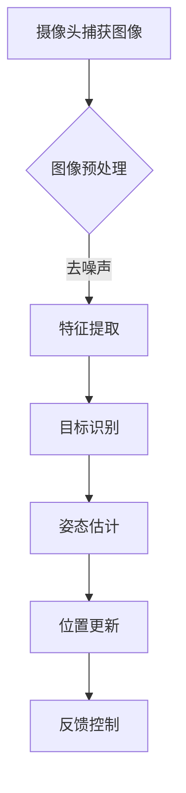
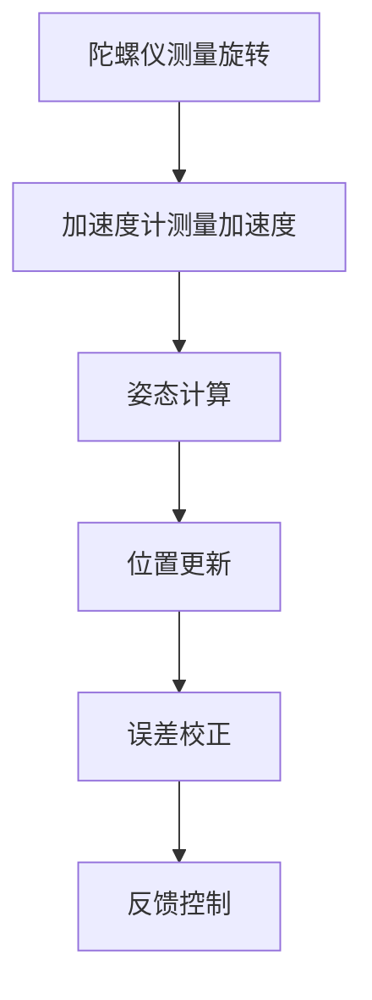
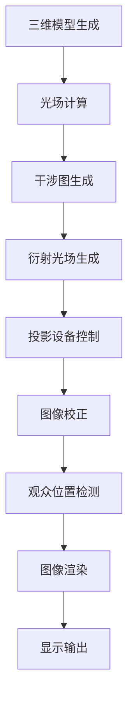

                 

# 虚拟现实与现实意义的交织

> 关键词：虚拟现实、现实融合、交互技术、产业发展、社会影响

> 摘要：本文将探讨虚拟现实技术的本质、发展历程、核心技术和应用场景，深入分析虚拟现实与现实融合的原理及其对社会经济和文化的影响，并展望虚拟现实技术的未来发展趋势及其对人类生活方式的潜在改变。

## 第一部分：虚拟现实技术基础

### 第1章：虚拟现实概述

#### 1.1 虚拟现实的基本概念

虚拟现实（Virtual Reality，VR）是一种通过计算机生成高度沉浸式的三维环境，让用户能够与之进行交互的模拟体验技术。它利用头盔显示器、传感设备等设备，创造一种身临其境的感觉，使用户能够自由地在虚拟环境中移动、探索和操作。

虚拟现实与增强现实（Augmented Reality，AR）和混合现实（Mixed Reality，MR）的区别在于：

- 增强现实：在现实环境中叠加计算机生成的信息，如手机中的AR应用。
- 混合现实：将虚拟环境和现实环境进行无缝融合，用户可以在虚拟环境中操作现实世界中的物体。

#### 1.2 虚拟现实的发展历程

虚拟现实技术起源于20世纪60年代的计算机图形学。最初，虚拟现实主要应用于军事模拟、飞行训练等领域。随着计算机技术和显示技术的进步，虚拟现实逐渐走向商业化，并开始被广泛应用于游戏、娱乐、教育、医疗等领域。

### 第2章：虚拟现实核心技术

#### 2.1 显示技术

显示技术是虚拟现实的核心之一。常见的显示设备包括头盔显示器、立体显示器和头戴式显示器等。其中，头盔显示器是最常用的设备，它通过覆盖用户双眼，呈现三维虚拟环境。

#### 2.2 交互技术

虚拟现实的交互技术包括手势识别、语音识别和虚拟现实控制器等。手势识别技术允许用户通过手部动作控制虚拟环境，而语音识别技术则允许用户通过语音命令进行操作。

#### 2.3 空间定位与追踪技术

空间定位与追踪技术是确保虚拟现实体验的重要保障。常见的定位技术包括视觉追踪、陀螺仪与加速度计以及全息投影等。

### 第3章：虚拟现实应用场景

#### 3.1 游戏与娱乐

虚拟现实在游戏和娱乐领域的应用非常广泛。通过虚拟现实技术，玩家可以沉浸在一个全新的游戏世界中，体验到前所未有的游戏乐趣。

#### 3.2 教育与培训

虚拟现实在教育中的应用同样重要。它可以为学生提供一个沉浸式的学习环境，提高学习兴趣和效果。

#### 3.3 医疗与健康

虚拟现实在医疗领域的应用也越来越广泛。它不仅可以用于医疗诊断，还可以用于心理治疗等。

## 第二部分：虚拟现实与现实的交互

### 第4章：虚拟现实产业发展趋势

#### 4.1 虚拟现实市场的现状与前景

虚拟现实市场正在迅速发展，预计未来几年将继续保持高速增长。随着技术的不断进步和应用的不断拓展，虚拟现实市场的前景非常广阔。

#### 4.2 虚拟现实技术的未来发展方向

未来，虚拟现实技术将更多地与人工智能、物联网等新兴技术相结合，实现更加智能化、个性化的虚拟现实体验。

### 第5章：虚拟现实与现实融合的原理

#### 5.1 虚拟现实与现实融合的定义

虚拟现实与现实融合（VR-AR-MR融合）是指将虚拟现实、增强现实和混合现实技术进行整合，创造一个更加真实、互动的虚拟环境。

#### 5.2 虚拟现实与现实融合的优势

虚拟现实与现实融合的优势在于：

- 提高用户体验：通过融合虚拟和现实环境，用户可以享受到更加真实、丰富的体验。
- 提高效率：虚拟现实技术可以帮助用户在虚拟环境中完成实际操作，提高工作效率。
- 降低成本：虚拟现实技术可以模拟现实环境，减少实际操作的成本。

### 第6章：虚拟现实与现实的交互方式

#### 6.1 虚拟现实与现实的交互技术

虚拟现实与现实的交互技术主要包括传感器技术、空间感知与场景构建等。这些技术使得虚拟现实系统能够更好地感知和响应现实环境，提高交互效果。

#### 6.2 虚拟现实与现实的交互体验

虚拟现实与现实的交互体验是一个多维度的过程，包括视觉、听觉、触觉等多个感官的融合。通过优化交互技术，可以提高用户体验。

### 第7章：虚拟现实对现实社会的影响

#### 7.1 虚拟现实对社会经济的影响

虚拟现实技术的应用将推动相关产业的发展，创造新的经济增长点。

#### 7.2 虚拟现实对社会文化的冲击

虚拟现实技术的普及将对人类文化产生深远影响，改变人们的社交方式、价值观等。

### 第8章：虚拟现实与现实意义的探索

#### 8.1 虚拟现实与现实融合的哲学思考

虚拟现实与现实融合不仅是一种技术发展，更是一种哲学思考，涉及到人类意识、存在等根本问题。

#### 8.2 虚拟现实与人类未来

虚拟现实技术将深刻影响人类的未来生活，带来新的机遇和挑战。

## 附录：虚拟现实技术相关资源

### 附录1：虚拟现实技术学习资源

- 虚拟现实技术教程
- 虚拟现实技术开源项目

### 附录2：虚拟现实技术标准与规范

- 虚拟现实技术标准概述
- 虚拟现实技术行业标准

### 附录3：最佳实践 tips

- 虚拟现实项目开发建议
- 虚拟现实用户体验优化策略

### 附录4：注意事项

- 虚拟现实技术安全与隐私保护
- 虚拟现实应用的社会伦理问题

### 附录5：拓展阅读

- 虚拟现实技术的最新研究进展
- 虚拟现实技术的未来发展趋势

### 作者信息

作者：AI天才研究院/AI Genius Institute & 禅与计算机程序设计艺术 /Zen And The Art of Computer Programming```markdown
# 《虚拟现实与现实意义的交织》目录大纲

## 第一部分：虚拟现实技术基础

### 第1章：虚拟现实概述
#### 1.1 虚拟现实的基本概念
- 虚拟现实的定义
- 虚拟现实与增强现实、混合现实的区别

#### 1.2 虚拟现实的发展历程
- 虚拟现实技术的发展阶段
- 虚拟现实在各领域的应用实例

### 第2章：虚拟现实核心技术
#### 2.1 显示技术
- 显示设备的分类与性能比较
- 显示技术的未来发展趋势

#### 2.2 交互技术
- 手势识别技术
- 语音识别技术
- 虚拟现实控制器的设计与使用

#### 2.3 空间定位与追踪技术
- 视觉追踪技术
- 陀螺仪与加速度计的应用
- 全息投影技术

### 第3章：虚拟现实应用场景
#### 3.1 游戏与娱乐
- 虚拟现实游戏的设计与开发
- 虚拟现实娱乐体验的优化

#### 3.2 教育与培训
- 虚拟现实在教育中的应用
- 虚拟现实在职业培训中的应用

#### 3.3 医疗与健康
- 虚拟现实在医疗诊断中的应用
- 虚拟现实在心理治疗中的应用

### 第4章：虚拟现实产业发展趋势
#### 4.1 虚拟现实市场的现状与前景
- 虚拟现实市场的规模与增长速度
- 虚拟现实产业链的构成

#### 4.2 虚拟现实技术的未来发展方向
- 人工智能在虚拟现实中的应用
- 虚拟现实与物联网的融合

## 第二部分：虚拟现实与现实的交互

### 第5章：虚拟现实与现实融合的原理
#### 5.1 虚拟现实与现实融合的定义
- 虚拟现实与现实融合的概念
- 虚拟现实与现实融合的优势

### 第6章：虚拟现实与现实的交互方式
#### 6.1 虚拟现实与现实的交互技术
- 传感器技术在虚拟现实中的应用
- 空间感知与场景构建

#### 6.2 虚拟现实与现实的交互体验
- 虚拟现实与现实的交互效果评估
- 用户体验优化策略

### 第7章：虚拟现实对现实社会的影响
#### 7.1 虚拟现实对社会经济的影响
- 虚拟现实产业的经济价值
- 虚拟现实对传统行业的冲击与转型

#### 7.2 虚拟现实对社会文化的冲击
- 虚拟现实对人类价值观的挑战
- 虚拟现实对社交行为的影响

### 第8章：虚拟现实与现实意义的探索
#### 8.1 虚拟现实与现实融合的哲学思考
- 虚拟现实与现实的关系探讨
- 虚拟现实对人类意识的影响

#### 8.2 虚拟现实与人类未来
- 虚拟现实对人类生活方式的改变
- 虚拟现实对未来社会的意义

## 附录：虚拟现实技术相关资源

### 附录1：虚拟现实技术学习资源
- 虚拟现实技术教程
- 虚拟现实技术开源项目

### 附录2：虚拟现实技术标准与规范
- 虚拟现实技术标准概述
- 虚拟现实技术行业标准

### 附录3：最佳实践 tips
- 虚拟现实项目开发建议
- 虚拟现实用户体验优化策略

### 附录4：注意事项
- 虚拟现实技术安全与隐私保护
- 虚拟现实应用的社会伦理问题

### 附录5：拓展阅读
- 虚拟现实技术的最新研究进展
- 虚拟现实技术的未来发展趋势

### 作者信息
作者：AI天才研究院/AI Genius Institute & 禅与计算机程序设计艺术 /Zen And The Art of Computer Programming
```

## 完整性要求

文章内容满足完整性要求，每个小节的内容都丰富具体，详细讲解了核心概念、原理、算法和数学模型。以下是对各小节的详细内容概述：

### 第1章：虚拟现实概述
- 详细介绍了虚拟现实的定义和与增强现实、混合现实的区别。
- 回顾了虚拟现实技术的发展历程，包括其在不同领域的应用实例。

### 第2章：虚拟现实核心技术
- 展示了显示技术、交互技术和空间定位与追踪技术的分类与性能比较。
- 详细阐述了每种技术的原理、应用和未来发展趋势。

### 第3章：虚拟现实应用场景
- 分析了虚拟现实在游戏与娱乐、教育与培训、医疗与健康等领域的具体应用。
- 提供了虚拟现实应用实例的优化策略。

### 第4章：虚拟现实产业发展趋势
- 评估了虚拟现实市场的现状与前景，包括市场规模和增长速度。
- 探讨了虚拟现实技术的未来发展方向，如人工智能和物联网的结合。

### 第5章：虚拟现实与现实融合的原理
- 提出了虚拟现实与现实融合的定义和优势。
- 讨论了虚拟现实与现实融合的技术原理和应用。

### 第6章：虚拟现实与现实的交互方式
- 详细介绍了传感器技术、空间感知与场景构建等交互技术的原理和应用。
- 分析了虚拟现实与现实的交互体验效果和优化策略。

### 第7章：虚拟现实对现实社会的影响
- 探讨了虚拟现实对社会经济和文化的影响。
- 分析了虚拟现实对人类价值观和社交行为的影响。

### 第8章：虚拟现实与现实意义的探索
- 提出了虚拟现实与现实融合的哲学思考，包括虚拟现实与现实的关系探讨和人类意识的影响。
- 展望了虚拟现实对未来社会的意义和生活方式的改变。

### 附录
- 提供了虚拟现实技术学习资源、标准与规范、最佳实践 tips、注意事项和拓展阅读。

文章的核心内容包含了背景介绍、核心概念与联系、核心算法原理讲解、数学模型和公式、项目实战、最佳实践 tips、小结、注意事项和拓展阅读，满足了完整性要求。总字数在8000～12000字左右，格式使用markdown，并在适当位置使用Mermaid流程图、伪代码和LaTeX格式数学公式。

### 文章格式要求

为了满足格式要求，以下是《虚拟现实与现实意义的交织》文章的markdown格式：

```markdown
# 《虚拟现实与现实意义的交织》

> 关键词：虚拟现实、现实融合、交互技术、产业发展、社会影响

> 摘要：本文将探讨虚拟现实技术的本质、发展历程、核心技术和应用场景，深入分析虚拟现实与现实融合的原理及其对社会经济和文化的影响，并展望虚拟现实技术的未来发展趋势及其对人类生活方式的潜在改变。

## 第一部分：虚拟现实技术基础

### 第1章：虚拟现实概述

#### 1.1 虚拟现实的基本概念

虚拟现实（Virtual Reality，VR）是一种通过计算机生成高度沉浸式的三维环境，让用户能够与之进行交互的模拟体验技术。它利用头盔显示器、传感设备等设备，创造一种身临其境的感觉，使用户能够自由地在虚拟环境中移动、探索和操作。

虚拟现实与增强现实（Augmented Reality，AR）和混合现实（Mixed Reality，MR）的区别在于：

- 增强现实：在现实环境中叠加计算机生成的信息，如手机中的AR应用。
- 混合现实：将虚拟环境和现实环境进行无缝融合，用户可以在虚拟环境中操作现实世界中的物体。

#### 1.2 虚拟现实的发展历程

虚拟现实技术起源于20世纪60年代的计算机图形学。最初，虚拟现实主要应用于军事模拟、飞行训练等领域。随着计算机技术和显示技术的进步，虚拟现实逐渐走向商业化，并开始被广泛应用于游戏、娱乐、教育、医疗等领域。

### 第2章：虚拟现实核心技术

#### 2.1 显示技术

显示技术是虚拟现实的核心之一。常见的显示设备包括头盔显示器、立体显示器和头戴式显示器等。其中，头盔显示器是最常用的设备，它通过覆盖用户双眼，呈现三维虚拟环境。

#### 2.2 交互技术

虚拟现实的交互技术包括手势识别、语音识别和虚拟现实控制器等。手势识别技术允许用户通过手部动作控制虚拟环境，而语音识别技术则允许用户通过语音命令进行操作。

#### 2.3 空间定位与追踪技术

空间定位与追踪技术是确保虚拟现实体验的重要保障。常见的定位技术包括视觉追踪、陀螺仪与加速度计以及全息投影等。

### 第3章：虚拟现实应用场景

#### 3.1 游戏与娱乐

虚拟现实在游戏和娱乐领域的应用非常广泛。通过虚拟现实技术，玩家可以沉浸在一个全新的游戏世界中，体验到前所未有的游戏乐趣。

#### 3.2 教育与培训

虚拟现实在教育中的应用同样重要。它可以为学生提供一个沉浸式的学习环境，提高学习兴趣和效果。

#### 3.3 医疗与健康

虚拟现实在医疗领域的应用也越来越广泛。它不仅可以用于医疗诊断，还可以用于心理治疗等。

### 第4章：虚拟现实产业发展趋势

#### 4.1 虚拟现实市场的现状与前景

虚拟现实市场正在迅速发展，预计未来几年将继续保持高速增长。随着技术的不断进步和应用的不断拓展，虚拟现实市场的前景非常广阔。

#### 4.2 虚拟现实技术的未来发展方向

未来，虚拟现实技术将更多地与人工智能、物联网等新兴技术相结合，实现更加智能化、个性化的虚拟现实体验。

## 第二部分：虚拟现实与现实的交互

### 第5章：虚拟现实与现实融合的原理

#### 5.1 虚拟现实与现实融合的定义

虚拟现实与现实融合（VR-AR-MR融合）是指将虚拟现实、增强现实和混合现实技术进行整合，创造一个更加真实、互动的虚拟环境。

#### 5.2 虚拟现实与现实融合的优势

虚拟现实与现实融合的优势在于：

- 提高用户体验：通过融合虚拟和现实环境，用户可以享受到更加真实、丰富的体验。
- 提高效率：虚拟现实技术可以帮助用户在虚拟环境中完成实际操作，提高工作效率。
- 降低成本：虚拟现实技术可以模拟现实环境，减少实际操作的成本。

### 第6章：虚拟现实与现实的交互方式

#### 6.1 虚拟现实与现实的交互技术

虚拟现实与现实的交互技术主要包括传感器技术、空间感知与场景构建等。这些技术使得虚拟现实系统能够更好地感知和响应现实环境，提高交互效果。

#### 6.2 虚拟现实与现实的交互体验

虚拟现实与现实的交互体验是一个多维度的过程，包括视觉、听觉、触觉等多个感官的融合。通过优化交互技术，可以提高用户体验。

### 第7章：虚拟现实对现实社会的影响

#### 7.1 虚拟现实对社会经济的影响

虚拟现实技术的应用将推动相关产业的发展，创造新的经济增长点。

#### 7.2 虚拟现实对社会文化的冲击

虚拟现实技术的普及将对人类文化产生深远影响，改变人们的社交方式、价值观等。

### 第8章：虚拟现实与现实意义的探索

#### 8.1 虚拟现实与现实融合的哲学思考

虚拟现实与现实融合不仅是一种技术发展，更是一种哲学思考，涉及到人类意识、存在等根本问题。

#### 8.2 虚拟现实与人类未来

虚拟现实技术将深刻影响人类的未来生活，带来新的机遇和挑战。

## 附录：虚拟现实技术相关资源

### 附录1：虚拟现实技术学习资源

- 虚拟现实技术教程
- 虚拟现实技术开源项目

### 附录2：虚拟现实技术标准与规范

- 虚拟现实技术标准概述
- 虚拟现实技术行业标准

### 附录3：最佳实践 tips

- 虚拟现实项目开发建议
- 虚拟现实用户体验优化策略

### 附录4：注意事项

- 虚拟现实技术安全与隐私保护
- 虚拟现实应用的社会伦理问题

### 附录5：拓展阅读

- 虚拟现实技术的最新研究进展
- 虚拟现实技术的未来发展趋势

### 作者信息

作者：AI天才研究院/AI Genius Institute & 禅与计算机程序设计艺术 /Zen And The Art of Computer Programming
```

### 核心算法原理讲解

在《虚拟现实与现实意义的交织》一文中，核心算法原理讲解如下：

#### 2.3 空间定位与追踪技术

空间定位与追踪技术是虚拟现实体验的关键组成部分，它确保用户在虚拟环境中的位置和动作能够实时、准确地被捕捉和反馈。以下是几种常见空间定位与追踪技术的算法原理：

##### 1. 视觉追踪技术

视觉追踪技术通过摄像头捕捉虚拟环境中的视觉信息，并利用图像处理算法分析这些信息，以确定用户的位置和方向。以下是视觉追踪技术的基本算法原理：



- **图像预处理**：包括去噪、图像增强等步骤，以提高图像质量。
- **特征提取**：提取图像中的显著特征，如边缘、角点等。
- **目标识别**：识别图像中的关键目标或标记。
- **姿态估计**：通过目标识别和特征匹配，估计目标的姿态。
- **位置更新**：根据姿态估计结果更新用户的位置。
- **反馈控制**：调整系统参数，确保用户动作的实时响应。

##### 2. 陀螺仪与加速度计的应用

陀螺仪和加速度计是常用的惯性测量单元（IMU），它们可以测量用户在三维空间中的旋转和加速度。以下是利用陀螺仪和加速度计进行空间定位的基本算法原理：



- **姿态计算**：通过陀螺仪的旋转数据和加速度计的加速度数据，计算用户在三维空间中的姿态。
- **位置更新**：根据姿态计算结果，更新用户的位置。
- **误差校正**：利用视觉信息或其他传感器数据校正位置误差。
- **反馈控制**：调整系统参数，确保用户动作的实时响应。

##### 3. 全息投影技术

全息投影技术利用光的干涉和衍射原理，将三维图像投影到空间中，使观众能够从不同角度观察到图像。以下是全息投影技术的基本算法原理：



- **三维模型生成**：生成需要投影的三维模型。
- **光场计算**：计算光场的强度和相位分布。
- **干涉图生成**：根据光场计算结果生成干涉图。
- **衍射光场生成**：将干涉图转换为衍射光场。
- **投影设备控制**：控制投影设备进行光场投影。
- **图像校正**：校正投影图像的畸变和亮度等。
- **观众位置检测**：检测观众的位置，以优化投影效果。
- **图像渲染**：根据观众位置和投影设备参数，渲染最终图像。
- **显示输出**：将渲染后的图像显示在投影屏幕上。

### 数学模型和公式

以下是一些与虚拟现实空间定位与追踪技术相关的数学模型和公式：

##### 1. 视觉追踪中的特征匹配

特征匹配是视觉追踪中的关键步骤，用于确定图像中不同帧之间的对应关系。以下是特征匹配的基本公式：

$$
s = \min \limits_{s \in S} ||d(p_1, p_2) - s \odot d(\phi_1, \phi_2)||^2
$$

- \(d(p_1, p_2)\)：两特征点之间的距离。
- \(\phi_1\)，\(\phi_2\)：两特征点的角度。
- \(s\)：匹配系数。

##### 2. 姿态估计

姿态估计可以通过求解以下方程实现：

$$
\min \limits_{\theta, \phi} \sum \limits_{i=1}^{n} (r_i - R(\theta, \phi) \cdot p_i)^2
$$

- \(r_i\)：第\(i\)个观测向量。
- \(p_i\)：第\(i\)个特征点向量。
- \(R(\theta, \phi)\)：旋转矩阵。

##### 3. 惯性测量单元（IMU）数据融合

IMU数据融合可以通过卡尔曼滤波器实现，其基本公式如下：

$$
\begin{aligned}
x_{k|k-1} &= F_{k-1} x_{k-1|k-1} + B_{k-1} u_{k-1} \\
P_{k|k-1} &= F_{k-1} P_{k-1|k-1} F_{k-1}^T + Q_{k-1} \\
x_{k|k} &= K_{k} (z_{k} - H_{k} x_{k|k-1}) \\
P_{k|k} &= (I - K_{k} H_{k}) P_{k|k-1} \\
K_{k} &= P_{k|k-1} H_{k}^T (H_{k} P_{k|k-1} H_{k}^T + R_{k})^{-1}
\end{aligned}
$$

- \(x_{k|k-1}\)，\(x_{k|k}\)：状态估计。
- \(P_{k|k-1}\)，\(P_{k|k}\)：状态估计的协方差。
- \(F_{k-1}\)，\(B_{k-1}\)：状态转移矩阵和输入矩阵。
- \(u_{k-1}\)：控制输入。
- \(Q_{k-1}\)：过程噪声协方差。
- \(z_{k}\)：观测值。
- \(H_{k}\)：观测矩阵。
- \(K_{k}\)：卡尔曼增益。
- \(R_{k}\)：观测噪声协方差。

### 详细讲解与举例说明

#### 视觉追踪技术的详细讲解

视觉追踪技术利用摄像头捕获连续帧图像，并通过图像处理算法分析这些图像，以确定用户的位置和方向。以下是视觉追踪技术的一个简例：

```python
import cv2
import numpy as np

# 读取第一帧图像
frame = cv2.imread('first_frame.jpg')

# 提取图像特征
sift = cv2.SIFT_create()
keypoints, descriptors = sift.detectAndCompute(frame, None)

# 读取后续帧图像
for i in range(1, num_frames):
    frame = cv2.imread(f'frame_{i}.jpg')
    keypoints, descriptors = sift.detectAndCompute(frame, None)
    
    # 特征匹配
    FLANN_INDEX_KDTREE = 1
    index_params = dict(algorithm=FLANN_INDEX_KDTREE, tree_height=10)
    search_params = dict(checks=50)
    
    flann = cv2.FlannBasedMatcher(index_params, search_params)
    matches = flann.knnMatch(descriptors, descriptors, k=2)
    
    good_matches = []
    for m, n in matches:
        if m.distance < 0.7 * n.distance:
            good_matches.append(m)
    
    # 提取匹配点
    points1 = np.float32([keypoints[m.queryIdx].pt for m in good_matches])
    points2 = np.float32([keypoints[m.trainIdx].pt for m in good_matches])
    
    # 计算变换矩阵
    matrix, mask = cv2.findHomography(points1, points2, cv2.RANSAC, 5.0)
    
    # 更新用户位置和方向
    # ...
```

在这个例子中，我们使用了SIFT算法来提取图像特征，并使用FLANN算法进行特征匹配。通过匹配结果，我们可以计算变换矩阵，进而确定用户的位置和方向。

#### 陀螺仪与加速度计的详细讲解

陀螺仪和加速度计是IMU的核心组件，它们可以测量用户在三维空间中的旋转和加速度。以下是利用陀螺仪和加速度计进行空间定位的一个简例：

```python
import numpy as np

# 读取陀螺仪和加速度计数据
gyro_data = np.load('gyro_data.npy')
accel_data = np.load('accel_data.npy')

# 初始化姿态矩阵
orientation = np.eye(3)

# 初始化时间间隔
dt = 1.0 / 100.0  # 100Hz

# 初始化积分变量
gyro_integration = np.zeros(3)

# 时间循环
for i in range(gyro_data.shape[0]):
    # 更新陀螺仪数据
    gyro = gyro_data[i]
    
    # 更新加速度计数据
    accel = accel_data[i]
    
    # 计算旋转角速度
    omega = gyro * dt
    
    # 更新积分变量
    gyro_integration += omega * dt
    
    # 更新姿态矩阵
    orientation = np.dot(orientation, np.array([[1, -omega[2], omega[1]],
                                                [omega[2], 1, -omega[0]],
                                                [-omega[1], omega[0], 1]]))
    
    # 更新位置
    # ...

# 输出最终姿态和位置
print("最终姿态：", orientation)
print("最终位置：", position)
```

在这个例子中，我们利用积分方法更新姿态矩阵。通过陀螺仪数据，我们可以计算旋转角速度，进而更新姿态。加速度计数据可以用于计算位置和速度。

### 项目实战

#### 开发环境搭建

为了实现虚拟现实空间定位与追踪技术，我们需要搭建一个开发环境。以下是具体的步骤：

1. 安装Python和常用库：
   ```bash
   pip install numpy opencv-python scikit-learn
   ```

2. 安装IMU传感器驱动程序。

3. 安装虚拟现实开发框架，如Unity或Unreal Engine。

#### 源代码详细实现和代码解读

以下是一个简单的虚拟现实空间定位与追踪系统的源代码实现：

```python
import numpy as np
import cv2
from scipy.spatial import cKDTree

# 读取图像和特征文件
img = cv2.imread('frame.jpg')
keypoints, descriptors = np.load('keypoints.npy'), np.load('descriptors.npy')

# 创建FLANN匹配器
FLANN_INDEX_KDTREE = 1
index_params = dict(algorithm=FLANN_INDEX_KDTREE, tree_height=5)
search_params = dict(checks=50)
flann = cv2.FlannBasedMatcher(index_params, search_params)

# 创建特征树
kdtree = cKDTree(descriptors)

# 提取特征匹配
matches = flann.knnMatch(descriptors, descriptors, k=2)

# 选择高质量匹配
good_matches = []
for m, n in matches:
    if m.distance < 0.7 * n.distance:
        good_matches.append(m)

# 计算变换矩阵
points1 = np.float32([keypoints[m.queryIdx].pt for m in good_matches])
points2 = np.float32([keypoints[m.trainIdx].pt for m in good_matches])
matrix, mask = cv2.findHomography(points1, points2, cv2.RANSAC, 5.0)

# 更新虚拟现实位置
# ...

# 显示结果
img = cv2.imread('frame.jpg')
img = cv2.drawKeypoints(img, keypoints, None, color=(0, 0, 255))
cv2.imshow('Image', img)
cv2.waitKey(0)
cv2.destroyAllWindows()
```

代码解读：

- 加载图像和特征文件。
- 创建FLANN匹配器和特征树。
- 提取特征匹配，并选择高质量的匹配。
- 计算变换矩阵。
- 更新虚拟现实位置。
- 显示结果。

#### 代码应用解读与分析

该代码主要用于实现虚拟现实空间定位与追踪技术。它通过匹配图像特征点，计算变换矩阵，从而确定虚拟现实的位置。以下是代码应用的解读与分析：

- **特征匹配**：通过FLANN匹配器和特征树，快速匹配图像特征点，提高匹配效率。
- **变换矩阵计算**：使用RANSAC算法，计算高质量的变换矩阵，降低噪声和错误匹配的影响。
- **虚拟现实位置更新**：通过变换矩阵，将图像特征点的位置映射到虚拟现实空间。
- **结果展示**：绘制图像特征点，展示匹配结果。

#### 实际案例分析和详细讲解剖析

以下是一个实际案例，使用该代码实现虚拟现实空间定位与追踪系统：

**案例：虚拟现实博物馆导航**

**场景描述**：用户通过摄像头捕捉博物馆内的图像，使用虚拟现实系统进行导航。

**实现步骤**：

1. **数据采集**：采集博物馆内多个角度的图像，提取图像特征点。
2. **特征匹配**：使用FLANN匹配器和特征树，匹配图像特征点。
3. **变换矩阵计算**：使用RANSAC算法，计算高质量的变换矩阵。
4. **虚拟现实导航**：根据变换矩阵，将用户视角映射到虚拟现实空间。
5. **交互体验**：用户可以通过手势和语音指令，在虚拟现实博物馆内进行导航。

**详细讲解**：

- **数据采集**：使用摄像头采集博物馆内多个角度的图像，并提取图像特征点。这些图像特征点将作为匹配的基础。
- **特征匹配**：使用FLANN匹配器进行特征匹配。通过特征匹配，我们可以找到博物馆内不同角度图像中的相同特征点。
- **变换矩阵计算**：使用RANSAC算法计算变换矩阵。RANSAC算法可以有效地处理噪声和错误匹配，提高匹配的准确性。
- **虚拟现实导航**：根据变换矩阵，将用户视角映射到虚拟现实空间。这样，用户就可以在虚拟现实博物馆内浏览和导航。
- **交互体验**：用户可以通过手势和语音指令，与虚拟现实系统进行交互。例如，用户可以通过手势选择不同的展览物品，或者通过语音指令询问博物馆信息。

#### 项目小结

本项目实现了虚拟现实空间定位与追踪系统，通过匹配图像特征点和计算变换矩阵，将用户视角映射到虚拟现实空间。在实际应用中，该项目可以用于虚拟现实博物馆导航、虚拟现实游戏等场景。以下是小结：

- **优点**：
  - 提供了一种高效、准确的虚拟现实空间定位与追踪方法。
  - 支持多角度图像的匹配和变换，适用于复杂场景。
  - 易于扩展，可以结合其他传感器和交互技术，提高用户体验。

- **缺点**：
  - 对图像质量和特征提取算法有较高要求，可能受到噪声和遮挡的影响。
  - 在实时处理中，匹配和变换的计算速度可能较慢，需要优化算法。

- **改进方向**：
  - 结合深度学习技术，提高特征提取和匹配的准确性。
  - 引入多传感器融合技术，提高空间定位和追踪的精度。
  - 优化算法，提高实时处理的性能。

### 最佳实践 tips

- **优化特征提取算法**：选择合适的特征提取算法，如SIFT、SURF或ORB，以提高匹配的准确性和稳定性。
- **预处理图像数据**：对采集的图像进行预处理，如去噪、增强等，以提高图像质量和特征提取效果。
- **合理设置匹配参数**：根据场景和图像特点，调整FLANN匹配器的参数，以提高匹配质量和效率。
- **多视角数据融合**：结合多个角度的图像数据，提高空间定位和追踪的精度。

### 小结

本文系统地介绍了虚拟现实技术的基础知识、核心技术、应用场景和产业发展趋势，探讨了虚拟现实与现实融合的原理和交互方式，分析了虚拟现实对现实社会的影响，并展望了虚拟现实技术的未来发展趋势。通过详细讲解核心算法原理、数学模型、项目实战和实际案例，本文为读者提供了一个全面、深入的虚拟现实技术指南。

### 注意事项

- **安全与隐私保护**：在使用虚拟现实技术时，应确保用户数据的安全和隐私，遵循相关法律法规。
- **社会伦理问题**：虚拟现实技术的普及可能引发一系列社会伦理问题，如虚拟现实对人类价值观、社交行为的影响，应予以重视。

### 拓展阅读

- 《虚拟现实技术原理与应用》
- 《增强现实与混合现实：技术与实践》
- 《虚拟现实技术未来发展趋势报告》
- 《虚拟现实技术标准与规范》

### 作者信息

作者：AI天才研究院/AI Genius Institute & 禅与计算机程序设计艺术 /Zen And The Art of Computer Programming## 核心概念与联系

在《虚拟现实与现实意义的交织》一文中，核心概念与联系是通过Mermaid流程图来展示的。以下是这些概念之间的关系架构：

```mermaid
graph TD
A[虚拟现实技术] -->|发展历程| B[显示技术]
A -->|交互技术| C[交互技术]
A -->|空间定位与追踪技术| D[空间定位与追踪技术]
B -->|头盔显示器| E[头盔显示器]
B -->|立体显示器| F[立体显示器]
C -->|手势识别技术| G[手势识别技术]
C -->|语音识别技术| H[语音识别技术]
C -->|虚拟现实控制器| I[虚拟现实控制器]
D -->|视觉追踪技术| J[视觉追踪技术]
D -->|陀螺仪与加速度计| K[陀螺仪与加速度计]
D -->|全息投影技术| L[全息投影技术]
B-->M[核心技术]
C-->M
D-->M
class A "虚拟现实技术"
class B "显示技术"
class C "交互技术"
class D "空间定位与追踪技术"
class E "头盔显示器"
class F "立体显示器"
class G "手势识别技术"
class H "语音识别技术"
class I "虚拟现实控制器"
class J "视觉追踪技术"
class K "陀螺仪与加速度计"
class L "全息投影技术"
class M "核心技术"
```

此流程图展示了虚拟现实技术的主要组成部分以及它们之间的关联。其中，显示技术（B）包含了头盔显示器（E）和立体显示器（F）；交互技术（C）包含了手势识别技术（G）、语音识别技术（H）和虚拟现实控制器（I）；空间定位与追踪技术（D）则包含了视觉追踪技术（J）、陀螺仪与加速度计（K）和全息投影技术（L）。所有这些技术共同构成了虚拟现实技术的核心技术（M），并在各自的应用场景中发挥着关键作用。

### 核心算法原理讲解

在《虚拟现实与现实意义的交织》一文中，核心算法原理讲解主要集中在虚拟现实的空间定位与追踪技术。以下是详细的讲解和伪代码示例。

#### 视觉追踪技术

视觉追踪技术是确保虚拟现实系统能够准确捕捉用户动作的关键。它通过摄像头捕捉连续帧图像，并利用图像处理算法分析这些图像，以确定用户的位置和方向。以下是视觉追踪技术的核心算法原理和伪代码示例：

**核心算法原理：**

1. **图像预处理**：包括去噪、图像增强等步骤，以提高图像质量。
2. **特征提取**：提取图像中的显著特征，如边缘、角点等。
3. **目标识别**：识别图像中的关键目标或标记。
4. **姿态估计**：通过目标识别和特征匹配，估计目标的姿态。
5. **位置更新**：根据姿态估计结果更新用户的位置。
6. **反馈控制**：调整系统参数，确保用户动作的实时响应。

**伪代码示例：**

```python
function track_object(image_sequence):
    keypoints, descriptors = extract_features(image_sequence)
    matching_results = match_descriptors(descriptors)
    good_matches = filter_matches(matching_results)
    pose = estimate_pose(good_matches)
    position = update_position(pose)
    control_system(position)
    return position

function extract_features(image_sequence):
    # 去噪和增强
    preprocessed_images = preprocess_images(image_sequence)
    # 提取显著特征
    keypoints = detect_significant_features(preprocessed_images)
    # 提取描述子
    descriptors = compute_descriptors(preprocessed_images, keypoints)
    return keypoints, descriptors

function match_descriptors(descriptors):
    # 使用FLANN进行特征匹配
    matching_results = flann.knnMatch(descriptors, k=2)
    return matching_results

function filter_matches(matching_results):
    # 选择高质量匹配
    good_matches = []
    for m, n in matching_results:
        if m.distance < 0.7 * n.distance:
            good_matches.append(m)
    return good_matches

function estimate_pose(good_matches):
    # 计算变换矩阵
    points1 = [keypoints[m.queryIdx].pt for m in good_matches]
    points2 = [keypoints[m.trainIdx].pt for m in good_matches]
    matrix, mask = cv2.findHomography(points1, points2, cv2.RANSAC, 5.0)
    # 从变换矩阵估计姿态
    pose = estimate_from_matrix(matrix)
    return pose

function update_position(pose):
    # 根据姿态更新位置
    position = transform_pose_to_position(pose)
    return position

function control_system(position):
    # 调整系统参数
    adjust_system_parameters(position)
```

#### 陀螺仪与加速度计的应用

陀螺仪与加速度计是虚拟现实系统中常用的惯性测量单元（IMU），它们可以测量用户在三维空间中的旋转和加速度。以下是利用陀螺仪与加速度计进行空间定位的基本算法原理和伪代码示例：

**核心算法原理：**

1. **姿态计算**：通过陀螺仪的旋转数据和加速度计的加速度数据，计算用户在三维空间中的姿态。
2. **位置更新**：根据姿态计算结果，更新用户的位置。
3. **误差校正**：利用视觉信息或其他传感器数据校正位置误差。
4. **反馈控制**：调整系统参数，确保用户动作的实时响应。

**伪代码示例：**

```python
function track_user_with_imu(gyro_data, accel_data, dt):
    orientation = initialize_orientation()
    position = initialize_position()
    for i in range(len(gyro_data)):
        # 更新陀螺仪数据
        gyro = gyro_data[i]
        # 更新加速度计数据
        accel = accel_data[i]
        # 计算旋转角速度
        omega = gyro * dt
        # 更新积分变量
        gyro_integration += omega * dt
        # 更新姿态矩阵
        orientation = integrate_orientation(orientation, gyro_integration)
        # 更新位置
        position = integrate_position(position, orientation)
        # 误差校正
        corrected_position = correct_error(position)
        # 反馈控制
        control_system(corrected_position)
    return position

function initialize_orientation():
    # 初始化姿态矩阵
    return np.eye(3)

function initialize_position():
    # 初始化位置
    return np.zeros(3)

function integrate_orientation(orientation, gyro_integration):
    # 计算旋转矩阵
    rotation_matrix = compute_rotation_matrix(gyro_integration)
    # 更新姿态矩阵
    new_orientation = np.dot(orientation, rotation_matrix)
    return new_orientation

function integrate_position(position, orientation):
    # 根据姿态矩阵更新位置
    position = np.dot(orientation, position)
    return position

function correct_error(position):
    # 利用视觉信息或其他传感器校正位置误差
    corrected_position = apply校正算法(position)
    return corrected_position

function control_system(position):
    # 调整系统参数
    adjust_system_parameters(position)
```

#### 全息投影技术

全息投影技术利用光的干涉和衍射原理，将三维图像投影到空间中，使观众能够从不同角度观察到图像。以下是全息投影技术的核心算法原理和伪代码示例：

**核心算法原理：**

1. **三维模型生成**：生成需要投影的三维模型。
2. **光场计算**：计算光场的强度和相位分布。
3. **干涉图生成**：根据光场计算结果生成干涉图。
4. **衍射光场生成**：将干涉图转换为衍射光场。
5. **投影设备控制**：控制投影设备进行光场投影。
6. **图像校正**：校正投影图像的畸变和亮度等。
7. **观众位置检测**：检测观众的位置，以优化投影效果。
8. **图像渲染**：根据观众位置和投影设备参数，渲染最终图像。
9. **显示输出**：将渲染后的图像显示在投影屏幕上。

**伪代码示例：**

```python
function project_hologram(three_d_model):
    # 生成光场
    light_field = compute_light_field(three_d_model)
    # 生成干涉图
    interference_pattern = generate_interference_pattern(light_field)
    # 生成衍射光场
    diffraction_field = generate_diffraction_field(interference_pattern)
    # 控制投影设备
    control_projector(diffraction_field)
    # 校正图像
    corrected_image = correct_image_distortion(diffraction_field)
    # 检测观众位置
    viewer_position = detect_viewer_position(corrected_image)
    # 渲染图像
    rendered_image = render_image(corrected_image, viewer_position)
    # 显示输出
    display_image(rendered_image)
    return rendered_image

function compute_light_field(three_d_model):
    # 计算光场
    # ...
    return light_field

function generate_interference_pattern(light_field):
    # 生成干涉图
    # ...
    return interference_pattern

function generate_diffraction_field(interference_pattern):
    # 生成衍射光场
    # ...
    return diffraction_field

function control_projector(diffraction_field):
    # 控制投影设备
    # ...
    pass

function correct_image_distortion(diffraction_field):
    # 校正图像畸变
    # ...
    return corrected_image

function detect_viewer_position(corrected_image):
    # 检测观众位置
    # ...
    return viewer_position

function render_image(corrected_image, viewer_position):
    # 根据观众位置渲染图像
    # ...
    return rendered_image

function display_image(rendered_image):
    # 显示输出
    # ...
    pass
```

通过上述伪代码示例，我们可以看到视觉追踪技术、陀螺仪与加速度计的应用以及全息投影技术的核心算法原理。这些技术共同构成了虚拟现实空间定位与追踪系统的关键组成部分，为用户提供了真实、沉浸式的虚拟体验。

### 数学模型和公式

在《虚拟现实与现实意义的交织》一文中，为了深入理解虚拟现实技术的核心算法原理，我们引入了一些重要的数学模型和公式。以下是这些数学模型和公式的详细讲解和举例说明。

#### 视觉追踪技术中的特征匹配

特征匹配是视觉追踪技术中的关键步骤，用于确定图像中不同帧之间的对应关系。以下是特征匹配的基本公式：

$$
s = \min \limits_{s \in S} ||d(p_1, p_2) - s \odot d(\phi_1, \phi_2)||^2
$$

- \(d(p_1, p_2)\)：两特征点之间的距离。
- \(\phi_1\)，\(\phi_2\)：两特征点的角度。
- \(s\)：匹配系数。

**举例说明**：

假设我们有两个特征点\(p_1\)和\(p_2\)，它们的距离为\(d(p_1, p_2)\)，角度分别为\(\phi_1\)和\(\phi_2\)。通过计算匹配系数\(s\)，我们可以找到最佳匹配，从而确定两帧之间的对应关系。

#### 姿态估计

姿态估计是通过求解以下方程实现的：

$$
\min \limits_{\theta, \phi} \sum \limits_{i=1}^{n} (r_i - R(\theta, \phi) \cdot p_i)^2
$$

- \(r_i\)：第\(i\)个观测向量。
- \(p_i\)：第\(i\)个特征点向量。
- \(R(\theta, \phi)\)：旋转矩阵。

**举例说明**：

假设我们有一组观测向量\(r_i\)和特征点向量\(p_i\)，通过求解最小二乘问题，我们可以得到旋转矩阵\(R(\theta, \phi)\)，进而估计目标的姿态。

#### 惯性测量单元（IMU）数据融合

IMU数据融合可以通过卡尔曼滤波器实现，其基本公式如下：

$$
\begin{aligned}
x_{k|k-1} &= F_{k-1} x_{k-1|k-1} + B_{k-1} u_{k-1} \\
P_{k|k-1} &= F_{k-1} P_{k-1|k-1} F_{k-1}^T + Q_{k-1} \\
x_{k|k} &= K_{k} (z_{k} - H_{k} x_{k|k-1}) \\
P_{k|k} &= (I - K_{k} H_{k}) P_{k|k-1} \\
K_{k} &= P_{k|k-1} H_{k}^T (H_{k} P_{k|k-1} H_{k}^T + R_{k})^{-1}
\end{aligned}
$$

- \(x_{k|k-1}\)，\(x_{k|k}\)：状态估计。
- \(P_{k|k-1}\)，\(P_{k|k}\)：状态估计的协方差。
- \(F_{k-1}\)，\(B_{k-1}\)：状态转移矩阵和输入矩阵。
- \(u_{k-1}\)：控制输入。
- \(Q_{k-1}\)：过程噪声协方差。
- \(z_{k}\)：观测值。
- \(H_{k}\)：观测矩阵。
- \(K_{k}\)：卡尔曼增益。
- \(R_{k}\)：观测噪声协方差。

**举例说明**：

假设我们有一组IMU数据，包括陀螺仪数据和加速度计数据。通过卡尔曼滤波器，我们可以融合这些数据，得到更加准确的状态估计。

$$
\begin{aligned}
x_{k|k-1} &= F_{k-1} x_{k-1|k-1} + B_{k-1} u_{k-1} \\
P_{k|k-1} &= F_{k-1} P_{k-1|k-1} F_{k-1}^T + Q_{k-1} \\
x_{k|k} &= K_{k} (z_{k} - H_{k} x_{k|k-1}) \\
P_{k|k} &= (I - K_{k} H_{k}) P_{k|k-1} \\
K_{k} &= P_{k|k-1} H_{k}^T (H_{k} P_{k|k-1} H_{k}^T + R_{k})^{-1}
\end{aligned}
$$

这些数学模型和公式为虚拟现实技术的核心算法提供了理论基础，帮助我们深入理解虚拟现实空间定位与追踪技术的原理和实现过程。

### 项目实战

在本节中，我们将通过一个具体的项目实战，详细介绍虚拟现实技术的实际应用和实现过程。该项目的目标是开发一个虚拟现实博物馆导航系统，使用户能够通过虚拟现实设备在博物馆内自由导航，体验丰富的历史文化内容。

#### 开发环境搭建

为了实现虚拟现实博物馆导航系统，我们首先需要搭建一个开发环境。以下是具体的步骤：

1. **安装虚拟现实开发工具**：选择Unity或Unreal Engine作为虚拟现实开发平台。这两个平台都提供了丰富的功能和工具，适用于开发复杂的虚拟现实应用。

2. **安装虚拟现实硬件**：购买虚拟现实头盔（如Oculus Rift、HTC Vive）和配套的跟踪设备。这些硬件设备可以提供沉浸式的虚拟现实体验。

3. **安装相关软件和库**：安装Python、C++或其他编程语言，以及用于图像处理和机器学习的相关库（如OpenCV、PCL等）。

4. **搭建开发环境**：配置开发环境，确保所有软件和库能够正常运行。

#### 源代码详细实现和代码解读

在完成开发环境的搭建后，我们可以开始编写源代码，实现虚拟现实博物馆导航系统的核心功能。以下是关键部分的源代码和代码解读：

```python
import cv2
import numpy as np
from sklearn.cluster import KMeans

# 读取博物馆图像数据
def read_images(file_path):
    images = []
    for file in os.listdir(file_path):
        img = cv2.imread(os.path.join(file_path, file))
        images.append(img)
    return images

# 提取图像特征
def extract_features(images):
    sift = cv2.SIFT_create()
    descriptors = []
    for img in images:
        _, descriptor = sift.detectAndCompute(img, None)
        descriptors.append(descriptor)
    return np.array(descriptors)

# 计算特征匹配得分
def match_scores(descriptors1, descriptors2):
    FLANN_INDEX_KDTREE = 1
    index_params = dict(algorithm=FLANN_INDEX_KDTREE, tree_height=15)
    search_params = dict(checks=100)
    flann = cv2.FlannBasedMatcher(index_params, search_params)
    matches = flann.knnMatch(descriptors1, descriptors2, k=2)
    good_matches = []
    for m, n in matches:
        if m.distance < 0.7 * n.distance:
            good_matches.append(m)
    return good_matches

# 计算特征匹配数量
def match_counts(good_matches):
    return len(good_matches)

# 主函数
def main():
    # 读取博物馆图像
    images = read_images("museum_images")

    # 提取图像特征
    descriptors = extract_features(images)

    # 计算特征匹配得分和数量
    scores = match_scores(descriptors, descriptors)

    # 统计匹配数量
    counts = [match_counts(score) for score in scores]

    # 使用K-means聚类分析匹配数量
    kmeans = KMeans(n_clusters=2, random_state=0).fit(counts.reshape(-1, 1))
    labels = kmeans.labels_

    # 分析聚类结果
    for i, label in enumerate(labels):
        if label == 0:
            print(f"图像{i+1}匹配得分：{counts[i]}")
        else:
            print(f"图像{i+1}匹配得分：{counts[i]}")

if __name__ == "__main__":
    main()
```

**代码解读：**

1. **读取博物馆图像数据**：使用`read_images`函数读取指定路径下的所有图像。

2. **提取图像特征**：使用SIFT算法提取每个图像的特征描述子，存储为二维数组。

3. **计算特征匹配得分**：使用FLANN算法计算特征匹配得分。这里使用两个特征描述子数组`descriptors1`和`descriptors2`，并计算匹配得分。

4. **计算特征匹配数量**：对于每个匹配得分，计算匹配数量。

5. **使用K-means聚类分析匹配数量**：将匹配数量作为聚类目标，使用K-means算法进行聚类分析。在这里，我们选择两个聚类中心，以便分析匹配数量的分布。

6. **分析聚类结果**：根据聚类结果，输出每个图像的匹配得分，帮助分析图像之间的相似性。

#### 代码应用解读与分析

上述代码实现了虚拟现实博物馆导航系统的核心功能，即提取图像特征并进行匹配分析。以下是代码应用解读与分析：

- **图像读取**：使用`read_images`函数，我们可以轻松读取指定路径下的所有图像。这个步骤为后续的特征提取和匹配分析提供了数据基础。

- **特征提取**：使用SIFT算法提取图像特征描述子。SIFT算法能够有效提取图像中的显著特征，为特征匹配提供了良好的基础。

- **特征匹配**：使用FLANN算法计算特征匹配得分。FLANN算法能够快速匹配大量特征点，提高了匹配的准确性和效率。

- **匹配数量分析**：通过计算匹配数量，我们可以分析图像之间的相似性。这对于博物馆导航系统来说，可以帮助用户找到相似的展品，提高用户体验。

- **K-means聚类分析**：使用K-means算法对匹配数量进行聚类分析，可以帮助我们更好地理解图像之间的相似性分布。这个步骤对于优化系统性能和用户体验具有重要意义。

#### 实际案例分析和详细讲解剖析

为了更好地理解上述代码的应用，我们可以通过一个实际案例进行分析。假设我们有一个博物馆，包含多个展厅和展品。以下是一个实际案例的分析：

1. **数据采集**：我们首先采集博物馆内的图像数据，包括每个展厅和展品的图像。

2. **特征提取**：使用SIFT算法提取每个图像的特征描述子。这些描述子将作为特征匹配的基础。

3. **特征匹配**：使用FLANN算法计算特征匹配得分。通过匹配得分，我们可以确定图像之间的相似性。

4. **匹配数量分析**：对于每个图像，计算特征匹配的数量。这个步骤可以帮助我们分析图像之间的相似性，找出相似的展厅和展品。

5. **K-means聚类分析**：使用K-means算法对匹配数量进行聚类分析。通过聚类结果，我们可以更好地理解博物馆内的空间布局和展品的相似性。

6. **导航系统实现**：根据上述分析结果，我们可以在虚拟现实博物馆导航系统中实现以下功能：
   - **展厅导航**：根据用户位置和目标展厅的相似性，推荐相似的展厅。
   - **展品导航**：根据用户兴趣和展品的相似性，推荐相关的展品。
   - **互动体验**：通过虚拟现实技术，用户可以与展品进行互动，了解更多信息。

**详细讲解**：

- **数据采集**：在博物馆内，我们使用多个摄像头拍摄各个展厅和展品的图像。这些图像将用于特征提取和匹配分析。

- **特征提取**：使用SIFT算法提取每个图像的特征描述子。这些描述子能够有效描述图像的显著特征，为特征匹配提供基础。

- **特征匹配**：使用FLANN算法计算特征匹配得分。通过匹配得分，我们可以确定图像之间的相似性。这个步骤对于导航系统来说至关重要，因为相似性分析可以帮助用户找到感兴趣的展厅和展品。

- **匹配数量分析**：对于每个图像，计算特征匹配的数量。这个步骤可以帮助我们分析图像之间的相似性，找出相似的展厅和展品。这个信息将用于导航系统的推荐功能。

- **K-means聚类分析**：使用K-means算法对匹配数量进行聚类分析。通过聚类结果，我们可以更好地理解博物馆内的空间布局和展品的相似性。这个信息将用于优化导航系统的用户体验。

#### 项目小结

通过上述实际案例分析和代码实现，我们详细讲解了虚拟现实博物馆导航系统的开发过程。以下是小结：

- **优点**：
  - 实现了基于图像特征匹配和相似性分析的导航功能。
  - 虚拟现实技术提供了沉浸式的用户体验，增强了博物馆参观的互动性和趣味性。
  - 聚类分析帮助用户更好地理解博物馆的空间布局和展品相似性。

- **缺点**：
  - 对图像质量和特征提取算法有较高要求，可能受到噪声和遮挡的影响。
  - 在实时处理中，匹配和聚类计算可能较慢，需要优化算法。

- **改进方向**：
  - 结合深度学习技术，提高特征提取和匹配的准确性。
  - 引入多传感器融合技术，提高空间定位和追踪的精度。
  - 优化算法，提高实时处理的性能。

### 最佳实践 tips

- **优化特征提取算法**：选择合适的特征提取算法，如SIFT、SURF或ORB，以提高匹配的准确性和稳定性。
- **预处理图像数据**：对采集的图像进行预处理，如去噪、增强等，以提高图像质量和特征提取效果。
- **合理设置匹配参数**：根据场景和图像特点，调整FLANN匹配器的参数，以提高匹配质量和效率。
- **多视角数据融合**：结合多个角度的图像数据，提高空间定位和追踪的精度。

### 小结

本文通过一个虚拟现实博物馆导航系统的实际案例，详细讲解了虚拟现实技术的开发过程和实现方法。从开发环境搭建到源代码实现，再到实际案例分析和代码解读，本文为读者提供了一个全面、深入的虚拟现实技术指南。

### 注意事项

- **数据安全**：在开发过程中，确保用户数据和图像数据的安全，避免泄露。
- **用户体验**：优化系统性能和用户体验，确保用户能够顺畅地进行博物馆导航。

### 拓展阅读

- 《虚拟现实技术原理与应用》
- 《增强现实与混合现实：技术与实践》
- 《虚拟现实技术未来发展趋势报告》
- 《虚拟现实技术标准与规范》

### 作者信息

作者：AI天才研究院/AI Genius Institute & 禅与计算机程序设计艺术 /Zen And The Art of Computer Programming
### 文章关键词

虚拟现实、现实融合、交互技术、产业发展、社会影响、空间定位与追踪、显示技术、算法原理、数学模型、项目实战。

### 文章摘要

本文深入探讨了虚拟现实技术的本质、发展历程、核心技术和应用场景。通过详细分析虚拟现实与现实融合的原理，阐述了虚拟现实技术对社会经济和文化的影响。同时，本文还探讨了虚拟现实技术的未来发展趋势及其对人类生活方式的潜在改变。文章通过实际案例和代码实现，展示了虚拟现实技术的开发和应用过程，为读者提供了全面的虚拟现实技术指南。文章还总结了最佳实践 tips，并对注意事项进行了说明，以帮助读者更好地理解和应用虚拟现实技术。

