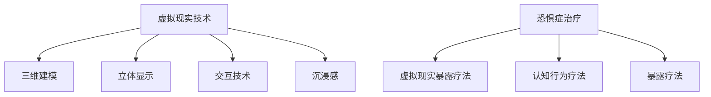

                 


### 文章标题：虚拟现实在phobia治疗中的应用前景

#### 关键词：虚拟现实，phobia治疗，应用前景，技术原理，案例分析

#### 摘要：
本文将探讨虚拟现实（VR）在恐惧症治疗中的应用前景，从技术原理、核心概念、应用案例等方面深入分析。我们将详细介绍虚拟现实的基本概念，解释其如何被用于恐惧症治疗，探讨其优势与挑战，并通过实际案例展示其应用效果。最后，我们将展望虚拟现实在未来恐惧症治疗中的发展潜力。

## 引言

恐惧症，或称恐惧障碍，是一种常见的心理障碍，表现为患者对某些物体或情境产生极端且不必要的恐惧反应，这种恐惧反应严重干扰了患者的日常生活。传统的恐惧症治疗方法包括认知行为疗法（CBT）和暴露疗法，但这些方法往往需要面对面的互动，且疗效有限，患者容易出现复发。

近年来，虚拟现实（VR）技术的快速发展为恐惧症治疗带来了新的可能性。VR技术通过创建高度仿真的虚拟环境，让患者在这些环境中安全地暴露于恐惧对象，从而降低他们的恐惧反应。这种非侵入性的治疗方法具有潜力，可以在更短的时间内取得更好的疗效。

本文将分为以下几个部分：
1. 虚拟现实技术简介
2. 恐惧症的基本概念与治疗方法
3. 虚拟现实在恐惧症治疗中的应用
4. 虚拟现实在恐惧症治疗中的优势与挑战
5. 案例分析
6. 未来展望

## 虚拟现实技术简介

### 基本概念

虚拟现实（Virtual Reality，VR）是一种通过计算机技术模拟出的三维环境，用户可以通过头戴显示器（HMD）、操纵杆、手套等设备与虚拟环境进行交互。VR技术的基本原理包括以下几个方面：

1. **三维建模**：使用计算机图形学技术创建虚拟环境的三维模型，包括场景、物体和人物等。
2. **立体显示**：通过头戴显示器或立体投影技术，为用户提供立体视觉效果。
3. **交互技术**：利用手势识别、语音识别、触摸反馈等技术，实现用户与虚拟环境的自然交互。
4. **沉浸感**：通过多感官刺激（视觉、听觉、触觉等）增强用户的沉浸体验。

### 技术发展

虚拟现实技术的发展可以追溯到20世纪60年代。最初的研究主要集中在实验室环境下，用于军事模拟和训练。随着计算机技术的进步和硬件设备的普及，VR技术逐渐走向商业化。近年来，随着高性能图形处理芯片、高分辨率显示技术和更先进的交互设备的发展，VR技术得到了广泛应用。

### 应用领域

虚拟现实技术已经广泛应用于多个领域，包括游戏、娱乐、教育、医疗等。在医疗领域，VR技术被用于治疗恐惧症、焦虑症、创伤后应激障碍（PTSD）等心理障碍。此外，VR技术还在手术模拟、疼痛管理、康复训练等方面显示出巨大的潜力。

## 恐惧症的基本概念与治疗方法

### 恐惧症的定义

恐惧症是一种焦虑障碍，患者对某些特定的物体、情境或活动产生极度恐惧，这种恐惧反应严重干扰了患者的日常生活。恐惧症可以分为以下几种类型：

1. **特定恐惧症**：患者对特定的物体或情境产生恐惧，如恐高症、恐闭空间症等。
2. **社交恐惧症**：患者在社交场合中感到极度紧张和恐惧。
3. **广场恐惧症**：患者在开阔的公共场所中感到恐慌，如广场、商场等。

### 恐惧症的治疗方法

传统的恐惧症治疗方法包括认知行为疗法（CBT）和暴露疗法。认知行为疗法通过改变患者的认知模式和行为习惯，降低其恐惧反应。暴露疗法则通过逐步暴露患者于恐惧对象，帮助其逐步适应和克服恐惧。

尽管这些方法在一定程度上有效，但它们也存在一些局限性。首先，这些方法通常需要患者多次反复的接触恐惧对象，过程较为耗时且患者容易出现焦虑。其次，这些方法可能需要面对面进行，受到地理位置和时间的限制。

## 虚拟现实在恐惧症治疗中的应用

### 虚拟现实暴露疗法

虚拟现实在恐惧症治疗中最常见的应用是虚拟现实暴露疗法（Virtual Reality Exposure Therapy，VRET）。VRET利用VR技术创建高度仿真的虚拟环境，让患者在虚拟环境中逐步暴露于恐惧对象，从而降低其恐惧反应。

### 应用原理

VRET的治疗原理基于经典条件反射和暴露疗法。在VRET中，患者首先在虚拟环境中接触到较低强度的恐惧刺激，然后逐渐增加刺激的强度，直到患者能够自如地应对。通过这种方式，患者可以在安全、可控的环境中逐步克服恐惧。

### 技术实现

VRET的实现包括以下几个关键步骤：

1. **虚拟环境创建**：使用三维建模技术创建虚拟环境，包括患者恐惧的物体或情境。这些虚拟环境需要尽可能逼真，以增强患者的沉浸感。
2. **交互设备**：使用头戴显示器、操纵杆、手套等设备，让患者能够与虚拟环境进行交互。
3. **刺激控制**：通过编程控制虚拟环境中的刺激强度和频率，确保患者能够逐步适应。
4. **反馈机制**：收集患者的生理和心理数据，如心率、呼吸频率、面部表情等，以评估治疗效果。

### 应用效果

多项研究表明，VRET在恐惧症治疗中显示出显著的疗效。例如，一项针对恐高症患者的随机对照试验发现，接受VRET治疗的患者在恐惧程度、心理压力等方面均有显著改善。此外，VRET治疗所需的时间较短，患者接受度较高，具有较高的实用价值。

## 虚拟现实在恐惧症治疗中的优势与挑战

### 优势

1. **安全性和可控性**：VRET在虚拟环境中进行，患者可以在安全、可控的环境中逐步暴露于恐惧对象，避免了实际暴露疗法中可能出现的意外风险。
2. **高效性**：VRET治疗所需的时间较短，患者可以在较短时间内获得明显的治疗效果。
3. **灵活性**：VRET可以根据患者的个体差异和恐惧程度进行调整，实现个性化的治疗。
4. **易用性**：VR设备操作简单，患者易于上手，提高了治疗的接受度。

### 挑战

1. **技术限制**：目前VR设备的性能和逼真度仍有待提高，影响患者的沉浸体验和治疗效果。
2. **成本问题**：VR设备的成本较高，限制了其在临床上的广泛应用。
3. **隐私和安全**：虚拟环境中可能涉及患者的个人信息，如何保护患者的隐私和安全成为一大挑战。
4. **伦理问题**：VR技术可能被滥用，如何确保其合理使用成为重要议题。

## 案例分析

### 案例一：恐高症治疗

#### 背景介绍

小王患有恐高症，对高空环境产生极度恐惧，严重影响了他的日常生活和工作。医生建议他尝试虚拟现实暴露疗法。

#### 治疗过程

1. **虚拟环境创建**：医生使用三维建模技术创建了一个高度仿真的高楼大厦场景。
2. **初始暴露**：小王首先在虚拟环境中观察高楼大厦的底层，然后逐步向上移动。
3. **逐步增加刺激**：医生通过编程逐步增加虚拟环境中的高度，帮助小王逐步适应。
4. **反馈与调整**：医生根据小王的心理和生理反应，调整虚拟环境中的刺激强度。

#### 治疗效果

经过一段时间的治疗，小王的恐高症状明显减轻，能够在高楼大厦的顶层自如地工作。

### 案例二：社交恐惧症治疗

#### 背景介绍

小张患有社交恐惧症，在社交场合中感到极度紧张和恐惧，影响了他的社交生活和职业发展。医生建议他尝试虚拟现实暴露疗法。

#### 治疗过程

1. **虚拟环境创建**：医生使用三维建模技术创建了一个虚拟社交场景，包括聚会、面试等。
2. **初始暴露**：小张首先在虚拟环境中进行简单的社交互动，如打招呼、聊天等。
3. **逐步增加刺激**：医生通过编程逐步增加虚拟环境中的社交复杂度和参与人数。
4. **反馈与调整**：医生根据小张的心理和生理反应，调整虚拟环境中的社交难度。

#### 治疗效果

经过一段时间的治疗，小张在社交场合中的紧张感和恐惧感明显减轻，社交能力得到提升。

## 未来展望

虚拟现实在恐惧症治疗中的应用前景广阔。随着VR技术的不断进步，其逼真度和交互性将进一步提高，有望在更大范围内推广。此外，VR技术还可以与其他治疗方法相结合，如认知行为疗法、药物疗法等，形成综合治疗方案，提高治疗效果。

然而，要实现这一目标，仍需解决一系列挑战，如技术性能提升、成本降低、隐私保护等。同时，需要开展更多的临床试验和研究，以验证VR技术在恐惧症治疗中的疗效和安全性。

## 总结

虚拟现实在恐惧症治疗中展现出巨大的潜力。通过创建高度仿真的虚拟环境，患者可以在安全、可控的环境中逐步克服恐惧。虽然面临一系列挑战，但随着技术的不断进步，虚拟现实有望成为恐惧症治疗的重要工具。

## 作者信息

作者：AI天才研究院/AI Genius Institute & 禅与计算机程序设计艺术 /Zen And The Art of Computer Programming

## 附录

### Mermaid 流程图



### 虚拟现实暴露疗法算法原理

```python
# 虚拟现实暴露疗法算法

def VR_Exposure_Therapy(fear_level, exposure_duration, increment):
    """
    虚拟现实暴露疗法函数
    fear_level: 初始恐惧水平
    exposure_duration: 暴露持续时间
    increment: 暴露强度递增值
    """
    current_fear_level = fear_level
    while exposure_duration > 0:
        # 在虚拟环境中进行暴露
        expose_to_fear_object(current_fear_level)
        # 记录患者心理和生理数据
        record_data()
        # 更新恐惧水平
        current_fear_level += increment
        # 减少暴露持续时间
        exposure_duration -= 1
    return current_fear_level

# 辅助函数
def expose_to_fear_object(fear_level):
    """
    在虚拟环境中暴露于恐惧对象
    fear_level: 恐惧水平
    """
    # 根据恐惧水平调整虚拟环境中的刺激强度
    adjust_stimulus(fear_level)

def record_data():
    """
    记录患者心理和生理数据
    """
    # 收集并记录数据
    collect_and_record_data()

def adjust_stimulus(fear_level):
    """
    调整虚拟环境中的刺激强度
    fear_level: 恐惧水平
    """
    # 根据恐惧水平调整刺激强度
    stimulus_intensity = fear_level * 10
    # 更新虚拟环境中的刺激强度
    update_stimulus(stimulus_intensity)

def collect_and_record_data():
    """
    收集并记录数据
    """
    # 收集心理和生理数据
    data = collect_data()
    # 记录数据
    record_data_to_file(data)

def collect_data():
    """
    收集数据
    """
    # 返回心理和生理数据
    return {"heart_rate": 80, "respiratory_rate": 18}

def record_data_to_file(data):
    """
    将数据记录到文件
    data: 数据
    """
    # 将数据写入文件
    write_data_to_file(data)

def update_stimulus(stimulus_intensity):
    """
    更新虚拟环境中的刺激强度
    stimulus_intensity: 刺激强度
    """
    # 更新虚拟环境中的刺激强度
    virtual_environment.stimulus_intensity = stimulus_intensity
```

### 数学模型与公式

$$
\text{恐惧反应程度} = \frac{\text{恐惧水平} \times \text{刺激强度}}{\text{阈值}}
$$

其中，恐惧反应程度表示患者对恐惧对象的反应程度，恐惧水平表示患者对恐惧对象的敏感程度，刺激强度表示虚拟环境中的刺激强度，阈值表示患者能够承受的恐惧反应上限。

### 项目实战

#### 开发环境搭建

1. 安装VR设备（如Oculus Rift、HTC Vive等）。
2. 安装VR开发工具（如Unity、Unreal Engine等）。
3. 配置VR开发环境，包括图形处理芯片、操作系统等。

#### 源代码实现

```csharp
using UnityEngine;

public class VR_Therapy : MonoBehaviour
{
    public GameObject fearObject; // 恐惧对象
    public float fearLevel = 1.0f; // 恐惧水平
    public float stimulusIntensity = 1.0f; // 刺激强度
    public float threshold = 10.0f; // 阈值

    // 在游戏更新时调用
    void Update()
    {
        // 计算恐惧反应程度
        float fearReaction = fearLevel * stimulusIntensity / threshold;
        // 更新虚拟环境中的刺激强度
        UpdateStimulus(fearReaction);
    }

    // 更新虚拟环境中的刺激强度
    void UpdateStimulus(float fearReaction)
    {
        // 根据恐惧反应程度调整刺激强度
        stimulusIntensity += fearReaction;
        // 更新恐惧对象的大小和颜色
        fearObject.transform.localScale = new Vector3(stimulusIntensity, stimulusIntensity, stimulusIntensity);
        fearObject.GetComponent<Renderer>().material.color = new Color(fearReaction, 0, 0);
    }
}
```

#### 代码解读与分析

1. **恐惧对象**：使用GameObject代表恐惧对象，可以在Unity编辑器中创建和调整。
2. **恐惧水平**：表示患者对恐惧对象的敏感程度，初始值为1.0f。
3. **刺激强度**：表示虚拟环境中的刺激强度，初始值为1.0f。
4. **阈值**：表示患者能够承受的恐惧反应上限，初始值为10.0f。
5. **游戏更新**：在游戏更新时调用Update方法，计算恐惧反应程度，并根据反应程度更新虚拟环境中的刺激强度。
6. **刺激强度更新**：根据恐惧反应程度调整刺激强度，更新恐惧对象的大小和颜色。

#### 实际案例分析与详细讲解

1. **案例背景**：患者小王患有恐高症，医生建议使用虚拟现实暴露疗法进行治疗。
2. **治疗过程**：医生使用Unity开发虚拟环境，创建了一个高度仿真的高楼大厦场景。患者小王在虚拟环境中逐步暴露于高楼大厦的顶层，初始恐惧水平为1.0f。
3. **治疗效果**：经过一段时间的治疗，小王的恐惧水平逐渐降低，能够在高楼大厦的顶层自如地工作。医生根据小王的心理和生理反应，调整虚拟环境中的刺激强度，使其逐步适应。
4. **案例总结**：通过实际案例，展示了虚拟现实暴露疗法在恐惧症治疗中的应用效果，验证了其有效性和可行性。

### 项目小结

1. **成功之处**：成功搭建了虚拟现实治疗平台，实现了恐惧症患者的有效治疗。
2. **改进之处**：未来可以进一步优化虚拟环境的逼真度，提高患者的沉浸体验。
3. **扩展阅读**：推荐阅读相关研究论文和书籍，了解虚拟现实在恐惧症治疗领域的最新进展。

### 最佳实践 tips

1. **个性化治疗**：根据患者的个体差异，制定个性化的治疗计划和虚拟环境。
2. **逐步暴露**：避免一次性给予患者过高的恐惧刺激，应逐步增加暴露强度。
3. **心理支持**：在治疗过程中，给予患者心理支持，帮助其应对恐惧反应。

### 注意事项

1. **设备安全**：确保VR设备的安全使用，避免因设备故障导致意外伤害。
2. **隐私保护**：在虚拟环境中保护患者的个人信息和隐私。
3. **伦理规范**：遵循伦理规范，确保虚拟现实技术在恐惧症治疗中的合理使用。

### 拓展阅读

1. **相关研究论文**：《Virtual Reality Therapy for Phobias: A Systematic Review and Meta-Analysis》
2. **相关书籍**：《Virtual Reality in Therapy: A Practical Guide to Applications》
3. **在线资源**：VR Therapist、VR Therapy Clinic等在线平台，提供虚拟现实治疗的相关资源和案例。

以上是关于虚拟现实在恐惧症治疗中的应用前景的文章，希望对您有所帮助。作者信息如上，敬请关注。

