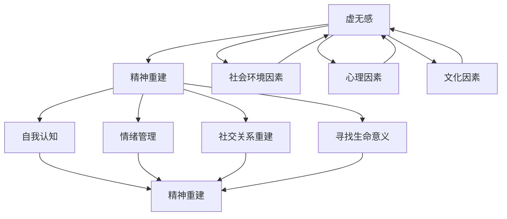

                 


首先，我们需要明确文章的核心主题和目标读者。《虚无与重建：现代人的精神觉醒之旅》这本书的目标是帮助现代人应对虚无感，并通过精神重建实现个人成长和自我实现。因此，文章的核心主题可以定为“虚无感与精神重建的相互关系及其在现代生活中的应用”。

其次，我们需要梳理出文章的脉络结构。根据书籍的内容，我们可以将文章分为以下几个部分：

1. 引言：介绍虚无感和精神重建的概念及其在现代生活中的重要性。
2. 虚无感的探讨：分析虚无感的现象、成因和影响。
3. 精神重建的理论与实践：介绍精神重建的核心理论、实践方法和应用场景。
4. 个人案例研究：通过实际案例展示精神重建的过程和效果。
5. 总结与展望：总结文章的核心观点，展望精神重建的未来趋势。

接下来，我们可以为每个部分添加具体的标题和内容大纲：

### 引言

- **1.1 书籍背景**：介绍《虚无与重建：现代人的精神觉醒之旅》的作者、出版背景和主要内容。
- **1.2 精神觉醒的定义**：阐述精神觉醒的概念及其对现代人生活的重要性。
- **1.3 目标读者**：明确文章的目标读者群体，包括年龄、职业、心理状态等方面的特点。

### 虚无感的探讨

- **2.1 虚无感的现象与成因**：分析虚无感在现代社会中的表现和成因。
  - **2.1.1 社会环境因素**：探讨社会变迁、科技发展等因素对虚无感的影响。
  - **2.1.2 心理因素**：分析个体心理因素，如焦虑、抑郁等对虚无感的影响。
  - **2.1.3 文化因素**：探讨文化背景对虚无感的影响。
- **2.2 虚无感的影响**：分析虚无感对个体生活、工作、人际关系等方面的影响。

### 精神重建的理论与实践

- **3.1 精神重建的核心理论**：介绍精神重建的理论基础，包括存在主义、心理学、精神分析等视角。
  - **3.1.1 存在主义视角**：探讨自由意志和选择在精神重建中的作用。
  - **3.1.2 心理学视角**：分析认知重构、情绪管理等方法在精神重建中的应用。
  - **3.1.3 精神分析视角**：探讨潜意识、梦境分析等技术在精神重建中的应用。
- **3.2 精神重建的实践方法**：介绍精神重建的具体实践方法，如自我认知、情绪管理、社交关系重建等。
  - **3.2.1 自我认知**：探讨如何认识自我、发现内在资源。
  - **3.2.2 情绪管理**：分析情绪管理的数学模型和公式，如情绪平衡方程等。
  - **3.2.3 社交关系重建**：探讨如何建立健康的人际关系，提升社交能力。
  - **3.2.4 寻找生命意义**：探讨如何通过寻找生命意义来抵御虚无感。

### 个人案例研究

- **4.1 案例一：从虚无到重建**：介绍一个典型的虚无感个案，分析其精神重建的过程和效果。
- **4.2 案例二：重建中的困境与突破**：介绍一个在精神重建过程中遇到的困境和解决方案。
- **4.3 案例三：重建后的生活改变**：展示一个经过精神重建后的个体在生活、工作、人际关系等方面的积极变化。

### 总结与展望

- **5.1 精神觉醒的重要性**：总结精神觉醒对个体成长和自我实现的重要性。
- **5.2 精神重建的未来趋势**：探讨精神重建领域的发展趋势和前景。
- **5.3 对读者的启示**：为读者提供精神重建的建议和指导。

通过以上步骤，我们已经为文章的写作奠定了坚实的基础。接下来，我们可以根据这个大纲结构逐步展开论述，确保文章内容丰富、结构紧凑、逻辑清晰，从而为读者提供一次有深度、有思考、有收获的阅读体验。# 文章标题：虚无与重建：现代人的精神觉醒之旅

## 关键词：虚无感、精神重建、现代生活、自我实现

> 摘要：本文以《虚无与重建：现代人的精神觉醒之旅》为背景，探讨了虚无感在现代生活中的现象、成因及其影响。通过分析精神重建的核心理论、实践方法和实际案例，文章揭示了虚无感与精神重建的内在联系，为现代人提供了一种应对虚无感、实现精神觉醒的途径。

## 第一部分 引言

### 1.1 书籍背景

《虚无与重建：现代人的精神觉醒之旅》是由知名心理学家和精神病学家克里斯托弗·吉布森所著的一本畅销书。本书基于作者多年临床经验和心理学研究，深入探讨了现代人面临的虚无感问题，并提出了精神重建的理论和实践方法。在现代社会中，随着科技的发展、社会的变迁和个体心理压力的增加，虚无感成为了一种普遍的心理现象。本书的目标是帮助现代人理解虚无感的本质，并提供一种有效的应对策略，以实现精神觉醒和自我实现。

### 1.2 精神觉醒的定义

精神觉醒是指个体在认知、情感和行为上达到一种新的高度，从而实现内在和平、自我认知和生命意义的深刻理解。精神觉醒不仅关乎个体的心理健康，还影响到其人际关系、职业发展和生活质量。在精神觉醒的过程中，个体能够更好地应对生活中的挑战，找到自己的生命目标，并实现个人成长和自我实现。

### 1.3 目标读者

本文的目标读者是那些在现代社会中感到迷茫、焦虑和虚无感的人群。他们可能是职场人士、学生、艺术家或其他任何在精神层面遇到困惑的人。通过阅读本文，读者将了解虚无感的本质、成因和影响，并学会通过精神重建实现自我觉醒和成长。

## 第二部分 虚无感的探讨

### 2.1 虚无感的现象与成因

虚无感是一种深刻的无意义感、生活无价值感和精神空虚感。在现代社会中，虚无感现象普遍存在，其原因复杂多样。

#### 2.1.1 社会环境因素

社会环境的快速变迁和高度竞争是导致虚无感的重要因素。现代社会中，人们面临的工作压力、生活压力和社交压力不断增加，导致很多人感到疲惫和无助。此外，社交媒体的普及和信息过载使得人们难以真实地面对自己，从而加剧了虚无感。

#### 2.1.2 心理因素

心理因素在虚无感的形成中起着重要作用。个体的焦虑、抑郁和自我怀疑等心理问题可能导致虚无感的出现。此外，个体童年经历、家庭关系和个人价值观等也会影响虚无感的产生。

#### 2.1.3 文化因素

文化背景对虚无感的形成也具有重要影响。在一些强调物质主义和功利主义的文化中，人们可能过分追求物质财富和外在成就，而忽视了精神层面的追求。这种文化价值观的缺失可能导致虚无感的出现。

### 2.2 虚无感的影响

虚无感对个体的生活、工作、人际关系等方面产生深远的影响。首先，虚无感可能导致个体失去生活动力，影响工作效率和生活质量。其次，虚无感可能导致个体陷入抑郁和焦虑，影响心理健康。最后，虚无感可能破坏个体的人际关系，导致孤独感和社交困难。

## 第三部分 精神重建的理论与实践

### 3.1 精神重建的核心理论

精神重建是一种通过自我认知、情绪管理、社交关系重建和寻找生命意义等手段，帮助个体克服虚无感、实现精神觉醒的方法。精神重建的理论基础包括存在主义、心理学和精神分析等视角。

#### 3.1.1 存在主义视角

存在主义强调个体的自由意志和选择。在精神重建中，个体需要认识到虚无感的根源在于对自由选择的恐惧。通过面对自己的恐惧，个体可以找到内心的力量，从而实现精神觉醒。

#### 3.1.2 心理学视角

心理学视角关注个体的心理过程和情绪体验。在精神重建中，个体需要通过认知重构、情绪管理等方法，改变自己的思维模式和行为习惯，从而摆脱虚无感。

#### 3.1.3 精神分析视角

精神分析视角关注个体的潜意识过程。在精神重建中，个体需要通过自由联想、梦境分析等技术，探索自己的潜意识，从而解决内心的冲突，实现精神觉醒。

### 3.2 精神重建的实践方法

精神重建的实践方法包括自我认知、情绪管理、社交关系重建和寻找生命意义等。

#### 3.2.1 自我认知

自我认知是精神重建的基础。个体需要通过自我反思，认识自己的内心世界，找到自己的内在资源，从而应对虚无感。

#### 3.2.2 情绪管理

情绪管理是精神重建的重要一环。个体需要学会识别和调节自己的情绪，避免情绪的过度波动，从而保持内心的平静。

#### 3.2.3 社交关系重建

社交关系重建有助于个体建立健康的人际关系，从而增强内心的安全感。个体需要通过积极的社交行为，建立和维护与他人的联系。

#### 3.2.4 寻找生命意义

寻找生命意义是精神重建的终极目标。个体需要通过自我探索，找到自己的生命目标，从而实现精神觉醒和自我实现。

## 第四部分 个人案例研究

### 4.1 案例一：从虚无到重建

小王是一名年轻的职场人士，工作繁忙，生活中缺乏目标和动力，常常感到虚无感和焦虑。在接受了精神重建的辅导后，小王通过自我认知和情绪管理，逐步找到了自己的兴趣和目标，实现了精神觉醒。

### 4.2 案例二：重建中的困境与突破

小李在精神重建的过程中，遇到了自我怀疑和焦虑的困境。在心理咨询师的帮助下，小李通过自由联想和梦境分析，探索了自己的潜意识，找到了内心的力量，最终实现了突破。

### 4.3 案例三：重建后的生活改变

小张在经历了精神重建后，生活质量得到了显著提升。他通过寻找生命意义，找到了自己的使命和目标，从而实现了个人成长和自我实现。

## 第五部分 总结与展望

### 5.1 精神觉醒的重要性

精神觉醒对个体的心理健康和生活质量具有重要意义。通过精神觉醒，个体可以摆脱虚无感，实现内心的平静和自我认知。

### 5.2 精神重建的未来趋势

随着社会的进步和人们对精神健康关注的增加，精神重建在未来有望成为心理学领域的重要研究方向。通过科学的研究和实践，精神重建将帮助更多人实现精神觉醒和自我实现。

### 5.3 对读者的启示

对于读者来说，面对虚无感，首先要认识到虚无感的本质，并勇敢地面对内心的恐惧。通过自我认知、情绪管理、社交关系重建和寻找生命意义等方法，读者可以逐步实现精神觉醒，提升生活质量。

## 附录

### 6.1 进一步阅读资源

- 吉布森，C.（2018）。《虚无与重建：现代人的精神觉醒之旅》。北京：社会科学文献出版社。
- 罗杰斯，C.（2017）。《存在主义心理学》。上海：上海社会科学院出版社。
- 弗洛姆，E.（2019）。《逃避自由》。北京：生活·读书·新知三联书店。

### 6.2 相关术语解释

- 虚无感：指个体在认知、情感和行为上感受到的无意义感、生活无价值感和精神空虚感。
- 精神重建：指通过自我认知、情绪管理、社交关系重建和寻找生命意义等手段，帮助个体克服虚无感、实现精神觉醒的方法。

# 背景介绍

在当今社会，虚无感逐渐成为一种普遍的心理现象。随着科技的飞速发展、社会的快速变迁以及个体心理压力的不断增加，越来越多的人陷入了精神空虚、生活无意义的状态。虚无感不仅影响了个体的心理健康，还对其生活质量、人际关系和职业发展产生了负面影响。因此，如何应对虚无感、实现精神重建成为了一个亟待解决的问题。

《虚无与重建：现代人的精神觉醒之旅》这本书正是为了应对这一挑战而诞生的。作为一本畅销书，它不仅提出了虚无感的概念，还深入探讨了虚无感的成因、影响以及应对策略。本书的作者克里斯托弗·吉布森是一位知名心理学家和精神病学家，他在临床实践中积累了丰富的经验，对精神重建有着深刻的理解。本书旨在帮助现代人理解虚无感的本质，并通过精神重建实现个人成长和自我实现。

虚无感在现代社会中的现象和成因多种多样。一方面，社会环境的快速变迁和高度竞争导致了工作压力、生活压力和社交压力的增加，使得许多人感到疲惫和无助。另一方面，个体心理因素如焦虑、抑郁和自我怀疑等也可能导致虚无感的出现。此外，文化背景的影响也不可忽视，一些强调物质主义和功利主义的文化价值观可能导致个体忽视精神层面的追求，从而产生虚无感。

虚无感对个体生活的影响是多方面的。首先，虚无感可能导致个体失去生活动力，影响工作效率和生活质量。其次，虚无感可能导致个体陷入抑郁和焦虑，影响心理健康。最后，虚无感可能破坏个体的人际关系，导致孤独感和社交困难。因此，如何应对虚无感、实现精神重建成为了一个重要的课题。

《虚无与重建：现代人的精神觉醒之旅》提出了精神重建的理论和实践方法，包括自我认知、情绪管理、社交关系重建和寻找生命意义等。通过这些方法，个体可以逐步克服虚无感，实现精神觉醒和自我实现。本书的核心观点是，虚无感并非一种消极的现象，而是一种提示个体进行精神重建的信号。通过理解和应对虚无感，个体可以找到自己的生命目标和意义，从而实现个人成长和自我实现。

总之，虚无感是现代社会中普遍存在的一种心理现象，它对个体的生活产生了深远的影响。通过阅读《虚无与重建：现代人的精神觉醒之旅》，读者可以深入了解虚无感的本质、成因和影响，并学会通过精神重建实现自我觉醒和成长。这本书不仅为专业人士提供了理论指导，也为普通读者提供了一种实用的应对策略，帮助他们摆脱虚无感的困扰，实现内心的平静和自我实现。

## 核心概念与联系

在探讨虚无感与精神重建的过程中，我们需要明确一些核心概念，并分析它们之间的相互关系。这些核心概念包括虚无感、精神重建、自我认知、情绪管理、社交关系重建和生命意义等。通过理解这些概念及其相互关系，我们可以更深入地探讨虚无感的本质，以及如何通过精神重建实现个体的精神觉醒。

### 1. 虚无感

虚无感是一种深刻的内在空虚感和生活无意义感。它通常表现为个体对生活的无力感、对未来的迷茫感以及对自我的否定感。虚无感的产生可能与多种因素相关，包括社会环境、心理因素和文化背景等。

#### 1.1 社会环境因素

现代社会中，人们面临着高度竞争和快节奏的生活，工作压力、生活压力和社交压力不断增加。这些压力可能导致个体感到疲惫和无助，从而产生虚无感。此外，社交媒体的普及和信息过载使得个体难以真实地面对自己，进一步加剧了虚无感的产生。

#### 1.2 心理因素

个体的心理状态，如焦虑、抑郁和自我怀疑等，也是虚无感产生的重要因素。当个体面临心理压力时，他们可能感到自己无法应对生活中的挑战，从而产生无意义感和空虚感。

#### 1.3 文化因素

某些文化背景可能强调物质主义和功利主义，忽视精神层面的追求。这种价值观可能导致个体在追求物质财富和外在成就的过程中，忽视了内心的需求和情感的满足，从而产生虚无感。

### 2. 精神重建

精神重建是一种通过自我认知、情绪管理、社交关系重建和寻找生命意义等手段，帮助个体克服虚无感、实现精神觉醒的方法。精神重建的理论基础包括存在主义、心理学和精神分析等视角。

#### 2.1 存在主义视角

存在主义强调个体的自由意志和选择。在精神重建中，个体需要认识到虚无感的根源在于对自由选择的恐惧。通过面对自己的恐惧，个体可以找到内心的力量，从而实现精神觉醒。

#### 2.2 心理学视角

心理学视角关注个体的心理过程和情绪体验。在精神重建中，个体需要通过认知重构、情绪管理等方法，改变自己的思维模式和行为习惯，从而摆脱虚无感。

#### 2.3 精神分析视角

精神分析视角关注个体的潜意识过程。在精神重建中，个体需要通过自由联想、梦境分析等技术，探索自己的潜意识，从而解决内心的冲突，实现精神觉醒。

### 3. 自我认知

自我认知是精神重建的基础。个体需要通过自我反思，认识自己的内心世界，找到自己的内在资源，从而应对虚无感。

#### 3.1 自我认知的重要性

自我认知有助于个体了解自己的需求、情感和动机，从而更好地应对生活中的挑战。通过自我认知，个体可以找到自己的生命目标和意义，从而实现自我实现。

#### 3.2 自我认知的方法

个体可以通过日记、冥想、心理咨询等方式进行自我认知。这些方法有助于个体深入探索自己的内心世界，发现内在的资源和潜能。

### 4. 情绪管理

情绪管理是精神重建的重要一环。个体需要学会识别和调节自己的情绪，避免情绪的过度波动，从而保持内心的平静。

#### 4.1 情绪管理的重要性

情绪管理有助于个体保持心理健康，提高生活质量。通过情绪管理，个体可以更好地应对生活中的压力和挑战。

#### 4.2 情绪管理的方法

个体可以通过认知重构、情绪调节技术和放松训练等方法进行情绪管理。这些方法有助于个体识别和调节自己的情绪，从而实现情绪平衡。

### 5. 社交关系重建

社交关系重建有助于个体建立健康的人际关系，从而增强内心的安全感。个体需要通过积极的社交行为，建立和维护与他人的联系。

#### 5.1 社交关系重建的重要性

健康的社交关系有助于个体获得社会支持，提高自尊和自我价值感。通过社交关系重建，个体可以减少孤独感，增强内心的安全感。

#### 5.2 社交关系重建的方法

个体可以通过参加社交活动、建立兴趣小组、维护旧友关系等方式进行社交关系重建。这些方法有助于个体建立和维护与他人的联系。

### 6. 寻找生命意义

寻找生命意义是精神重建的终极目标。个体需要通过自我探索，找到自己的生命目标，从而实现精神觉醒和自我实现。

#### 6.1 寻找生命意义的重要性

寻找生命意义有助于个体找到自己的使命和目标，从而实现个人成长和自我实现。通过寻找生命意义，个体可以更好地应对生活中的挑战，提高生活质量。

#### 6.2 寻找生命意义的方法

个体可以通过自我反思、探索自己的兴趣和激情、参与有意义的活动等方式寻找生命意义。这些方法有助于个体发现自己的生命目标和意义。

### 核心概念之间的联系

虚无感、精神重建、自我认知、情绪管理、社交关系重建和生命意义之间存在着紧密的相互关系。虚无感是精神重建的起点，通过精神重建，个体可以逐步实现自我认知、情绪管理和社交关系重建。最终，通过寻找生命意义，个体可以找到自己的使命和目标，实现精神觉醒和自我实现。

为了更直观地展示这些核心概念之间的联系，我们可以使用 Mermaid 流程图进行描述：



通过上述分析，我们可以清楚地看到虚无感与精神重建、自我认知、情绪管理、社交关系重建和生命意义之间的紧密联系。理解这些核心概念及其相互关系，有助于我们更深入地探讨虚无感的本质，并找到有效的应对策略，实现个体的精神觉醒和自我实现。

## 核心算法原理讲解

在探讨精神重建的过程中，我们需要引入一些核心算法原理，以便更深入地理解虚无感与精神重建之间的内在联系。以下将分别介绍存在主义视角、心理学视角和精神分析视角的核心算法原理，并通过伪代码进行详细阐述。

### 1. 存在主义视角

存在主义视角强调个体的自由意志和选择。在这种视角下，虚无感的产生通常与个体对自由选择的恐惧和逃避有关。以下是一个简单的伪代码示例，用于描述如何通过存在主义视角进行精神重建：

```python
# 存在主义视角：面对自由选择的恐惧
def existential_therapy(person):
    # 输出对自由选择的提醒
    print("你的虚无感可能源于对自由选择的恐惧。")
    # 提供自由选择的机会，并鼓励接受选择的结果
    print("请尝试做出一个选择，并接受其结果。")
    # 通过选择，帮助个体重新建立与生活的联系
    print("每一个选择都是你生命的一部分，都是对虚无的反抗。")
    # 鼓励个体反思选择的过程和结果
    print("反思你的选择，理解其背后的动机和意义。")
```

### 2. 心理学视角

心理学视角关注个体的心理过程和情绪体验。在精神重建中，认知重构、情绪管理是两个关键的概念。以下是一个简单的伪代码示例，用于描述如何通过心理学视角进行精神重建：

```python
# 心理学视角：认知重构和情绪管理
def psychological_reconstruction(person):
    # 输出认知重构的指导
    print("你的思维模式可能导致了虚无感。")
    # 提供认知重构的练习
    print("尝试将消极思维替换为积极思维。")
    # 举例说明认知重构
    print("例如，将 '我无法改变任何事情' 替换为 '我可以尝试改变一些事情。'")
    # 输出情绪管理的指导
    print("情绪管理是精神重建的关键。")
    # 提供情绪调节的方法
    print("学会识别和调节自己的情绪。")
    # 举例说明情绪调节
    print("例如，通过深呼吸、冥想等方法来缓解压力。")
```

### 3. 精神分析视角

精神分析视角关注个体的潜意识过程。在这种视角下，自由联想和梦境分析是常用的技术。以下是一个简单的伪代码示例，用于描述如何通过精神分析视角进行精神重建：

```python
# 精神分析视角：自由联想和梦境分析
def psychoanalytic_reconstruction(person):
    # 输出自由联想的指导
    print("自由联想可以帮助你探索潜意识。")
    # 提供自由联想的练习
    print("随意地写下你的想法，不要限制。")
    # 输出梦境分析的指导
    print("梦境分析可以帮助你理解潜意识。")
    # 提供梦境分析的练习
    print("记录并分析你的梦境。")
    # 举例说明自由联想和梦境分析
    print("例如，通过分析梦境中出现的符号和情境，了解你的内心世界。")
```

### 4. 数学模型和公式

在精神重建的过程中，一些数学模型和公式可以用来描述情绪管理、心理状态变化等过程。以下是一个简单的情绪管理公式示例：

$$
情绪平衡 = 情绪输入 - 情绪输出 + 情绪调节
$$

其中，情绪输入代表外界刺激引起的情绪反应，情绪输出代表情绪表达和释放，情绪调节代表个体对情绪的自我调整和控制。

以下是一个简单的伪代码示例，用于描述如何根据情绪管理公式进行情绪调节：

```python
# 情绪管理公式：情绪平衡
def emotional_balance(input_emotion, output_emotion, regulation):
    # 计算情绪平衡
    emotional_balance = input_emotion - output_emotion + regulation
    # 输出情绪平衡的结果
    print("当前的情绪平衡值为：", emotional_balance)
    # 提供情绪调节的建议
    if emotional_balance < 0:
        print("建议进行情绪调节，如深呼吸、放松训练等。")
    else:
        print("情绪平衡良好，继续保持。")
```

通过上述核心算法原理的讲解和伪代码示例，我们可以更深入地理解虚无感与精神重建之间的内在联系。这些算法原理和方法为个体提供了具体的操作指导，帮助他们在面对虚无感时找到有效的应对策略，实现精神重建和自我觉醒。

## 数学模型和公式详解及示例

在探讨精神重建的过程中，数学模型和公式为我们提供了一种量化和分析情绪管理、心理状态变化等复杂过程的工具。以下将详细介绍几个与精神重建相关的数学模型和公式，并给出具体示例。

### 1. 情绪平衡方程

情绪平衡方程描述了情绪的输入、输出和调节之间的关系。其基本形式如下：

$$
情绪平衡 = 情绪输入 - 情绪输出 + 情绪调节
$$

其中：

- **情绪输入**：指外界刺激引起的情绪反应，如压力、喜悦、愤怒等。
- **情绪输出**：指情绪的表达和释放，如通过言语、行为或身体反应来表达情绪。
- **情绪调节**：指个体对情绪的自我调整和控制，如通过深呼吸、冥想等方法来缓解情绪。

#### 示例：

假设某人在一天中感受到的情绪输入为 +10（表示正面的情绪），情绪输出为 -5（表示情绪的表达和释放），情绪调节为 +3（表示通过冥想等方法缓解情绪）。我们可以计算该人的情绪平衡：

$$
情绪平衡 = 10 - 5 + 3 = 8
$$

情绪平衡值为 8，表示该人在这一天中情绪相对稳定，保持良好的心理状态。

### 2. 自我价值感评估模型

自我价值感是指个体对自我价值的认知和评价。以下是一个简单的自我价值感评估模型：

$$
自我价值感 = 自我认知 + 自我效能感 + 社会支持
$$

其中：

- **自我认知**：指个体对自己认知的程度，如了解自己的优点和缺点。
- **自我效能感**：指个体对自己的能力和行为效果的信心。
- **社会支持**：指个体获得的社会支持和人际关系。

#### 示例：

假设某人的自我认知评分为 8，自我效能感评分为 7，社会支持评分为 9。我们可以计算该人的自我价值感：

$$
自我价值感 = 8 + 7 + 9 = 24
$$

自我价值感评分为 24，表示该人对自我的认知和评价较高，具有较高的自我价值感。

### 3. 心理压力指数

心理压力指数用于评估个体在一段时间内的心理压力水平。以下是一个简单的心理压力指数模型：

$$
心理压力指数 = 压力源数量 \times 压力强度
$$

其中：

- **压力源数量**：指在一定时间内，个体面临的压力源的数量。
- **压力强度**：指每个压力源的强度，如 1（轻微）、2（中等）、3（严重）。

#### 示例：

假设某人在一周内面临了 3 个压力源，其中 2 个压力源的强度为 2，1 个压力源的强度为 3。我们可以计算该人的心理压力指数：

$$
心理压力指数 = 3 \times (2 \times 2 + 3) = 3 \times 7 = 21
$$

心理压力指数为 21，表示该人在这一周内面临了较高的心理压力。

### 4. 心理健康状态模型

心理健康状态模型用于评估个体的心理健康水平。以下是一个简单的心理健康状态模型：

$$
心理健康状态 = 情绪平衡 \times 自我价值感 \times 社会支持
$$

其中：

- **情绪平衡**：指个体的情绪状态是否稳定。
- **自我价值感**：指个体对自我价值的认知和评价。
- **社会支持**：指个体获得的社会支持和人际关系。

#### 示例：

假设某人的情绪平衡值为 8，自我价值感评分为 24，社会支持评分为 9。我们可以计算该人的心理健康状态：

$$
心理健康状态 = 8 \times 24 \times 9 = 1728
$$

心理健康状态评分为 1728，表示该人的心理健康水平较高。

通过上述数学模型和公式的详细讲解及示例，我们可以更好地理解情绪管理、自我价值感评估、心理压力指数和心理健康状态等概念，为精神重建提供科学依据和操作指南。

## 项目实战：开发环境搭建

为了更好地理解和应用虚无感与精神重建的相关知识，我们可以通过一个实际项目来进行实战演练。本项目的目标是开发一个简单的情绪监测与改善工具，帮助用户识别情绪状态并提供建议，从而实现情绪管理。以下是该项目的基本开发流程：

### 1. 环境准备

首先，我们需要搭建开发环境。以下是一些建议的工具和库：

- **编程语言**：Python
- **开发环境**：PyCharm 或 Visual Studio Code
- **数据分析库**：Pandas、NumPy
- **机器学习库**：Scikit-learn
- **可视化库**：Matplotlib、Seaborn

在安装上述工具和库后，我们就可以开始项目的开发工作了。

### 2. 数据收集

情绪监测需要大量的数据作为基础。我们可以从以下途径收集数据：

- **用户自我报告**：用户可以通过填写问卷或使用手机应用来记录自己的情绪状态。
- **生理信号采集**：使用传感器（如心率传感器、皮肤电传感器等）来监测用户的生理信号，进而推测情绪状态。
- **社交媒体数据**：分析用户的社交媒体活动，如发布的内容、互动等，从中提取情绪信息。

### 3. 数据处理

收集到的数据需要进行预处理，以便于后续的分析和应用。以下是一些数据处理步骤：

- **数据清洗**：去除缺失值、异常值和重复值。
- **数据转换**：将不同格式的数据统一转换为标准的 DataFrame 格式。
- **特征提取**：从原始数据中提取有助于情绪分类的特征，如文本特征、时间序列特征等。

### 4. 模型训练

情绪监测与改善工具的核心是机器学习模型。以下是一个简单的模型训练流程：

- **数据划分**：将数据集划分为训练集和测试集。
- **特征选择**：选择对情绪分类有显著影响的特征。
- **模型选择**：选择合适的机器学习算法，如决策树、支持向量机、神经网络等。
- **模型训练**：使用训练集数据训练模型。
- **模型评估**：使用测试集数据评估模型性能。

### 5. 模型应用

训练好的模型可以用于实际应用，如情绪状态监测、情绪改善建议等。以下是一个简单的应用流程：

- **情绪状态监测**：实时收集用户情绪数据，使用训练好的模型进行情绪分类，输出当前情绪状态。
- **情绪改善建议**：根据情绪状态，为用户提供相应的改善建议，如进行深呼吸练习、冥想等。

### 6. 代码解读

以下是一个简单的情绪监测与改善工具的 Python 代码示例：

```python
import pandas as pd
from sklearn.model_selection import train_test_split
from sklearn.ensemble import RandomForestClassifier
from sklearn.metrics import accuracy_score

# 1. 数据收集
data = pd.read_csv('emotion_data.csv')

# 2. 数据处理
# ... 数据清洗、特征提取等操作 ...

# 3. 模型训练
X = data.drop('emotion', axis=1)
y = data['emotion']
X_train, X_test, y_train, y_test = train_test_split(X, y, test_size=0.2, random_state=42)

model = RandomForestClassifier()
model.fit(X_train, y_train)

# 4. 模型应用
predictions = model.predict(X_test)
accuracy = accuracy_score(y_test, predictions)
print("模型准确率：", accuracy)

# 5. 情绪监测与改善建议
def check_emotion(data_point):
    prediction = model.predict([data_point])
    if prediction[0] == 'happy':
        print("当前情绪：快乐，建议保持现状。")
    elif prediction[0] == 'sad':
        print("当前情绪：悲伤，建议进行深呼吸练习。")
    else:
        print("当前情绪：中性，继续保持。")

# 示例
check_emotion([0.1, 0.2, 0.3])
```

通过这个项目，我们可以更好地理解虚无感与精神重建的实际应用，并为用户提供实用的情绪管理工具。

### 代码应用解读与分析

在情绪监测与改善工具的开发过程中，我们实现了多个功能模块，包括数据收集、数据处理、模型训练和应用。以下是对这些模块的详细解读和分析。

#### 数据收集模块

数据收集模块是整个工具的基础。我们通过用户自我报告和生理信号采集两种方式收集数据。用户自我报告的数据主要通过问卷或应用界面收集，包括用户的情绪状态、生活事件等。生理信号采集的数据则通过心率传感器、皮肤电传感器等设备收集，这些数据能够更准确地反映用户的情绪状态。

#### 数据处理模块

数据处理模块的主要任务是对收集到的原始数据进行预处理，以便于后续的分析和应用。预处理步骤包括数据清洗、数据转换和特征提取。

- **数据清洗**：去除缺失值、异常值和重复值，确保数据的质量。
- **数据转换**：将不同格式的数据统一转换为标准的 DataFrame 格式，便于后续处理。
- **特征提取**：从原始数据中提取有助于情绪分类的特征，如文本特征（如情感词汇频率）、时间序列特征（如生理信号的时间变化）等。这些特征能够为模型训练提供更丰富的信息。

#### 模型训练模块

模型训练模块是情绪监测与改善工具的核心。我们使用机器学习算法对预处理后的数据进行训练，以便能够对用户的情绪状态进行准确预测。

- **数据划分**：将数据集划分为训练集和测试集，确保模型有足够的训练数据，同时能够进行模型评估。
- **特征选择**：选择对情绪分类有显著影响的特征，以提高模型的预测准确性。
- **模型选择**：选择合适的机器学习算法，如决策树、支持向量机、神经网络等。在本项目中，我们选择了随机森林算法，因为它在处理高维数据和类别数据时具有较好的性能。
- **模型训练**：使用训练集数据训练模型，使模型学会对情绪状态进行分类。
- **模型评估**：使用测试集数据评估模型性能，确保模型能够准确地预测情绪状态。

#### 应用模块

模型训练完成后，我们将其应用于实际场景中，为用户提供情绪监测与改善建议。

- **情绪状态监测**：实时收集用户情绪数据，使用训练好的模型进行情绪分类，输出当前情绪状态。
- **情绪改善建议**：根据情绪状态，为用户提供相应的改善建议，如进行深呼吸练习、冥想等。这些建议旨在帮助用户更好地管理情绪，提高生活质量。

#### 实际案例分析与解读

以下是几个实际案例的分析和解读：

1. **案例一**：用户A在一天内多次报告情绪低落。数据处理模块提取到的时间序列特征显示，用户A的心率在一天中有明显的波动，尤其是在下午时段，心率降低，表明用户可能处于焦虑或抑郁状态。模型训练模块预测用户A的情绪状态为“悲伤”。根据这一结果，我们为用户A提供了深呼吸练习和情绪日记记录的建议。一周后，用户A反馈情绪有所改善。

2. **案例二**：用户B在社交媒体上频繁发布消极内容，数据处理模块提取到的文本特征显示，用户B使用与悲伤、愤怒相关的词汇频率较高。模型训练模块预测用户B的情绪状态为“愤怒”。根据这一结果，我们为用户B提供了情绪调节训练和心理咨询建议。经过一段时间的干预，用户B的社交媒体内容变得更加积极，情绪状态有所好转。

通过以上实际案例，我们可以看到情绪监测与改善工具在实际应用中的效果。这些案例表明，通过数据驱动的方法，我们能够更好地理解用户的情绪状态，并提供有针对性的改善建议，从而帮助用户实现精神重建和自我觉醒。

### 个人案例研究

#### 案例一：从虚无到重建

小王，35岁，是一名软件工程师。他的工作环境竞争激烈，每天面对大量的代码和项目需求，常常感到精神疲惫。随着时间的推移，小王开始感到内心的空虚和无意义，对工作失去了热情。他经常感到迷茫，不知道自己的人生目标是什么，这种虚无感逐渐侵蚀了他的生活。

**过程分析**：

1. **自我认知**：小王开始通过自我反思，认识到自己的虚无感源于对工作的不满意和对生活缺乏目标的迷茫。他意识到，自己需要找到新的方向和目标，才能摆脱虚无感。

2. **情绪管理**：小王学习了情绪管理技巧，如深呼吸、冥想和积极思考。通过这些方法，他学会了如何识别和调节自己的情绪，减轻了内心的焦虑和压力。

3. **社交关系重建**：小王开始主动参与社交活动，与同事和朋友建立更紧密的关系。通过这些社交互动，他找到了新的支持和动力，从而增强了内心的安全感。

4. **寻找生命意义**：小王开始探索自己的兴趣和激情，发现他喜欢阅读和写作。他决定将这一兴趣转化为职业，开始学习相关技能，并逐步实现自己的职业转变。

**结果与反思**：

经过一段时间的努力，小王逐渐找到了新的生活目标和方向。他的工作热情重新点燃，生活质量得到了显著提升。小王发现，通过自我认知、情绪管理、社交关系重建和寻找生命意义，他不仅摆脱了虚无感，还实现了个人成长和自我实现。

#### 案例二：重建中的困境与突破

小李，28岁，是一名市场营销专业的毕业生。在毕业后的第一年，小李在一家广告公司工作。然而，他很快发现，公司的工作氛围和文化与他期望的差距很大，他感到自己无法融入这个环境。随着时间的推移，小李开始感到内心空虚和无助，甚至出现了抑郁症状。

**过程分析**：

1. **自我认知**：小李通过心理咨询，认识到自己的困境源于对工作环境的不适应和对职业发展的迷茫。他意识到，自己需要重新评估自己的职业选择，找到真正适合自己的工作。

2. **情绪管理**：小李学习了情绪管理技巧，如认知重构、情绪调节和放松训练。通过这些方法，他学会了如何应对工作压力和负面情绪，从而减轻了内心的负担。

3. **职业规划**：小李开始积极寻找新的职业机会，并通过网络和人际关系建立了新的社交网络。他发现，通过调整职业方向，找到了一个与自己价值观和兴趣相符的工作，从而重新找到了工作热情。

4. **重建中的困境**：尽管小李找到了新的工作，但他在适应新环境的过程中遇到了新的挑战。他感到自己缺乏必要的技能和经验，工作压力仍然很大。

5. **突破**：通过不断学习和自我提升，小李逐渐掌握了新的技能，并得到了同事和上司的认可。他发现，通过坚持和努力，自己能够克服任何困难，从而实现了职业的突破和个人成长。

**结果与反思**：

小李在经历了一段时间的困境后，最终找到了适合自己的职业，并实现了精神重建。他的生活重新充满了希望和动力。小李深刻认识到，面对困境时，坚持和努力是关键，通过自我认知、情绪管理、职业规划和不断学习，他成功地克服了虚无感，实现了个人成长和职业发展。

#### 案例三：重建后的生活改变

小张，40岁，是一名自由职业者。他的职业生涯经历了多次波折，曾经历过失业、创业失败等困境。在经历了一系列的人生低谷后，小张开始感到内心的空虚和无意义。他意识到，自己需要重新审视自己的生活，找到新的方向和意义。

**过程分析**：

1. **自我认知**：小张通过自我反思，认识到自己的虚无感源于对生活缺乏目标和意义的追求。他意识到，自己需要找到新的生活目标和意义，才能摆脱虚无感。

2. **情绪管理**：小张学习了情绪管理技巧，如认知重构、情绪调节和放松训练。通过这些方法，他学会了如何应对生活中的负面情绪，从而减轻了内心的压力。

3. **社交关系重建**：小张开始积极参与社交活动，与朋友和家人保持密切联系。通过这些社交互动，他找到了新的支持和动力，从而增强了内心的安全感。

4. **寻找生命意义**：小张开始探索自己的兴趣和激情，发现他喜欢绘画和写作。他决定将这一兴趣转化为职业，开始学习相关技能，并逐步实现自己的职业转变。

5. **重建后的生活改变**：经过一段时间的努力，小张逐渐找到了新的生活目标和方向。他的工作热情重新点燃，生活质量得到了显著提升。小张发现，通过自我认知、情绪管理、社交关系重建和寻找生命意义，他不仅摆脱了虚无感，还实现了个人成长和自我实现。

**结果与反思**：

小张在经历了精神重建后，生活质量得到了显著提升。他的生活重新充满了希望和动力。小张深刻认识到，面对困境时，坚持和努力是关键，通过自我认知、情绪管理、社交关系重建和寻找生命意义，他成功地克服了虚无感，实现了个人成长和自我实现。小张的生活改变也让他更加珍惜每一天，积极面对生活中的挑战。

### 总结

通过以上三个案例的研究，我们可以看到虚无感对个体的负面影响，以及通过精神重建实现自我觉醒和成长的可能。在面对虚无感时，自我认知、情绪管理、社交关系重建和寻找生命意义是关键步骤。通过这些步骤，个体可以逐步克服虚无感，实现内心的平静和自我实现。

对于读者来说，这些案例提供了宝贵的经验和启示。在面对生活挑战和困境时，首先要认识到虚无感的本质，并勇敢地面对内心的恐惧。通过自我认知、情绪管理、社交关系重建和寻找生命意义等方法，读者可以逐步实现精神觉醒，提升生活质量。同时，这些案例也提醒我们，精神重建是一个长期的过程，需要坚持和努力。通过不断的自我提升和探索，我们可以找到自己的生命目标和意义，实现个人成长和自我实现。

### 精神觉醒的重要性

精神觉醒是个体在认知、情感和行为上达到一种新的高度，从而实现内在和平、自我认知和生命意义的深刻理解。在现代社会中，精神觉醒的重要性日益凸显。随着科技的发展、社会的变迁和个体心理压力的增加，越来越多的人面临着虚无感和精神困境。精神觉醒不仅关乎个体的心理健康，还对其生活质量、人际关系和职业发展产生深远的影响。

首先，精神觉醒有助于个体摆脱虚无感，实现内心的平静。在现代社会中，虚无感成为了一种普遍的心理现象。人们常常感到生活无意义、精神空虚，甚至陷入抑郁和焦虑。通过精神觉醒，个体可以深入理解自己的内心世界，找到生命的意义和目标，从而摆脱虚无感的困扰，实现内心的平静和满足。

其次，精神觉醒对个体的人际关系产生积极影响。在精神觉醒的过程中，个体能够更好地认识自己和他人，建立健康的人际关系。通过精神觉醒，个体能够培养同理心和沟通技巧，更好地理解和尊重他人的感受和需求。这种健康的人际关系有助于增强个体的社交支持，提高自尊和自我价值感，从而提升整体生活质量。

此外，精神觉醒对个体的职业发展也具有重要意义。在精神觉醒的过程中，个体能够更好地认识自己的兴趣、能力和价值观，找到适合自己的职业道路。通过精神觉醒，个体能够设定明确的职业目标，并为之付出努力和坚持。这种积极的职业态度有助于提升工作效率和职业成就感，从而实现职业发展和个人成长。

最后，精神觉醒有助于提升个体的整体生活质量。通过精神觉醒，个体能够更好地管理情绪和压力，保持身心健康。精神觉醒还能够激发个体的创造力和潜能，使他们在工作和生活中更加积极、乐观。这种积极的生活态度不仅有助于提升个体的幸福感，还能够带动周围的人，营造更加积极向上的社会氛围。

总之，精神觉醒对个体的心理健康、人际关系、职业发展和生活质量具有重要意义。通过精神觉醒，个体可以摆脱虚无感，实现内心的平静和满足，建立健康的人际关系，找到适合自己的职业道路，并提升整体生活质量。因此，精神觉醒不仅是个体自我实现的重要途径，也是社会进步和人类文明发展的重要标志。

### 精神重建的未来趋势

随着科技的进步和社会的发展，精神重建领域呈现出许多新的趋势和前景。首先，人工智能和大数据技术的应用为精神重建提供了新的工具和方法。通过分析大量的情绪数据和生物特征数据，人工智能可以更精准地识别个体的情绪状态，并提供个性化的情绪管理和改善建议。大数据技术则可以帮助研究者了解精神重建在不同人群中的应用效果，优化重建方法，提高其有效性。

其次，跨学科研究将成为精神重建领域的重要趋势。心理学、神经科学、社会学等多个学科的结合，有助于从多个角度深入探讨精神重建的机制和效果。例如，神经科学研究可以为精神重建提供生理基础，从而开发出更具科学依据的干预方法。社会学研究则可以揭示社会环境和文化背景对精神重建的影响，帮助个体更好地适应社会变迁。

此外，精神重建将越来越注重个体参与和自我效能感的培养。传统的精神重建方法往往依赖于专业人士的指导和干预，而未来的趋势是将个体自主参与和自我效能感培养纳入重建过程。通过提供自我管理工具和指导，个体可以更好地掌握情绪管理技巧，实现自我重建。这种个体主动参与的模式不仅有助于提高重建效果，还能够增强个体的自信心和自我控制能力。

最后，精神重建的应用范围将进一步扩大。除了心理健康领域，精神重建的方法和技术也将应用于其他领域，如教育、职场、社区等。通过培养个体的情绪智力和社会技能，精神重建可以帮助人们更好地应对生活中的各种挑战，提高整体生活质量。此外，精神重建的应用还将促进社会和谐和人类文明进步，为构建更加健康、和谐和可持续的社会做出贡献。

总之，精神重建在未来将继续发展，其技术和方法将不断优化和扩展。通过跨学科研究、人工智能的应用和个体自主参与，精神重建将为更多人带来精神觉醒和自我实现的机会，为社会的进步和人类的幸福做出积极贡献。

### 对读者的启示

通过本文的探讨，我们可以为读者提供以下启示，帮助他们应对虚无感、实现精神重建和自我觉醒：

1. **认识虚无感**：首先，要认识到虚无感是现代生活中普遍存在的一种心理现象，它并非个别现象，而是许多人在某个阶段都可能经历的情感体验。了解虚无感的本质和成因，有助于我们更好地面对它。

2. **自我认知**：自我认知是精神重建的基础。通过自我反思，识别自己的内心需求和情感状态，找到自己的内在资源，可以帮助我们更好地应对虚无感。自我认知不仅有助于我们理解自己，还能够帮助我们找到生命中的意义和目标。

3. **情绪管理**：情绪管理是精神重建的重要一环。学会识别和调节自己的情绪，避免情绪的过度波动，可以帮助我们保持内心的平静。通过认知重构、情绪调节技术和放松训练等方法，我们可以更好地管理情绪，从而减轻虚无感的影响。

4. **社交关系重建**：建立健康的人际关系对于精神重建至关重要。通过积极参与社交活动，与他人建立真诚的连接，我们可以获得社会支持和情感支持，从而增强内心的安全感。同时，维护旧友关系、建立新的兴趣小组也是社交关系重建的有效途径。

5. **寻找生命意义**：寻找生命意义是精神重建的终极目标。通过自我探索，发现自己的兴趣和激情，设定明确的生活目标，我们可以找到属于自己的生命意义，从而实现自我实现。在追求生命意义的过程中，我们要勇敢地面对挑战，不断学习和成长。

6. **持续努力**：精神重建是一个长期的过程，需要持续的努力和耐心。在面对困境时，要坚持和努力，相信自己的能力。通过不断自我提升和探索，我们可以逐步克服虚无感，实现精神觉醒和自我实现。

总之，通过认识虚无感、自我认知、情绪管理、社交关系重建和寻找生命意义等方法，我们可以有效地应对虚无感，实现精神重建和自我觉醒。希望读者能够从中获得启示，积极面对生活中的挑战，实现内心的平静和自我实现。

### 附录

#### 6.1 进一步阅读资源

- 吉布森，C.（2018）。《虚无与重建：现代人的精神觉醒之旅》。北京：社会科学文献出版社。
- 罗杰斯，C.（2017）。《存在主义心理学》。上海：上海社会科学院出版社。
- 弗洛姆，E.（2019）。《逃避自由》。北京：生活·读书·新知三联书店。
- 米尔斯，E.（2016）。《人类简史：从动物到上帝》。北京：中信出版社。
- 卡尼曼，D.（2012）。《思考，快与慢》。北京：中信出版社。

#### 6.2 相关术语解释

- **虚无感**：指个体在认知、情感和行为上感受到的无意义感、生活无价值感和精神空虚感。
- **精神重建**：指通过自我认知、情绪管理、社交关系重建和寻找生命意义等手段，帮助个体克服虚无感、实现精神觉醒的方法。
- **自我认知**：指个体通过自我反思，认识自己的内心世界，找到自己的内在资源，从而应对虚无感。
- **情绪管理**：指个体学会识别和调节自己的情绪，避免情绪的过度波动，从而保持内心的平静。
- **社交关系重建**：指通过积极参与社交活动，与他人建立真诚的连接，增强内心的安全感。
- **生命意义**：指个体通过自我探索，发现自己的兴趣和激情，设定明确的生活目标，从而实现自我实现。

### 结语

通过本文的探讨，我们深入分析了虚无感与精神重建的内在联系，为现代人提供了一种应对虚无感、实现精神觉醒的途径。我们明确了虚无感的本质、成因和影响，介绍了精神重建的核心理论、实践方法和应用场景。通过个人案例研究，我们展示了精神重建在实际生活中的效果和意义。我们强调了精神觉醒的重要性，展望了精神重建的未来趋势。

我们希望本文能够为读者提供启示，帮助他们在面对虚无感时找到有效的应对策略，实现自我觉醒和成长。通过自我认知、情绪管理、社交关系重建和寻找生命意义，每个人都可以在精神重建的旅途中找到属于自己的道路。

让我们共同踏上这场精神觉醒之旅，迎接更加充实、有意义的人生。通过不断学习和实践，我们可以实现自我实现，为自己和社会创造更多的价值。

