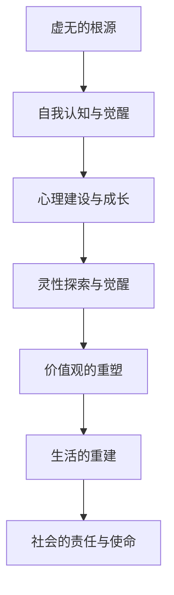
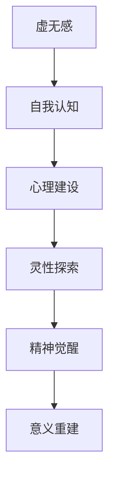

                 


### 文章标题：虚无与重建：现代人的精神觉醒之路

#### 关键词：虚无、精神觉醒、自我认知、心理建设、灵性探索、价值观重塑、社会责任

> 摘要：本文将深入探讨现代人在面对虚无感时所经历的心理困境，以及如何通过自我认知、心理建设、灵性探索等路径实现精神觉醒和重建。通过分析虚无的概念、根源及其与精神觉醒的联系，本文旨在为现代人提供一条清晰的精神成长之路，帮助他们在迷茫中找到方向，实现自我价值的重建。

---

### 《虚无与重建：现代人的精神觉醒之路》目录大纲

#### 第一部分：虚无的根源

**第1章：虚无的概念与内涵**
- 1.1 虚无的定义
- 1.2 虚无的历史渊源
- 1.3 虚无与现代社会的联系

**第2章：虚无的根源探析**
- 2.1 人类心理的虚无感
- 2.2 生活的意义与虚无
- 2.3 社会文化的虚无影响

**第3章：虚无的哲学探讨**
- 3.1 西方哲学中的虚无主义
- 3.2 中国哲学中的虚无观
- 3.3 跨文化视角下的虚无与精神觉醒

#### 第二部分：精神觉醒的路径

**第4章：自我认知与觉醒**
- 4.1 自我认知的重要性
- 4.2 自我认知的方法与技巧
- 4.3 自我认知与精神觉醒的关系

**第5章：心理建设与成长**
- 5.1 心理健康的重要性
- 5.2 心理建设的步骤与方法
- 5.3 心理建设与精神觉醒的关联

**第6章：灵性探索与觉醒**
- 6.1 灵性的概念与内涵
- 6.2 灵性实践的方法与技巧
- 6.3 灵性实践与精神觉醒的路径

#### 第三部分：重建的精神世界

**第7章：价值观的重塑**
- 7.1 价值观的定义与作用
- 7.2 当代社会的价值观冲突
- 7.3 健康价值观的建立与践行

**第8章：生活的重建**
- 8.1 生活质量与精神觉醒
- 8.2 重建生活方式的方法
- 8.3 精神觉醒后的生活改变

**第9章：社会的责任与使命**
- 9.1 精神觉醒与社会责任
- 9.2 精神觉醒者的社会角色
- 9.3 推动社会进步的路径

#### 附录

**附录A：精神觉醒资源推荐**
- A.1 心理学资源推荐
- A.2 灵性资源推荐
- A.3 社会责任资源推荐

#### Mermaid 流程图：虚无与重建的路径



#### 核心概念与联系：虚无与精神觉醒

##### 虚无的概念与内涵

虚无通常指的是一种缺乏意义、目的或存在感的心理状态。它不仅仅是一种情感体验，更是一种对生活本质的哲学思考。虚无感可能源于个人生活经历、社会文化环境、心理状态等多方面因素。

##### 精神觉醒的概念与内涵

精神觉醒（Spiritual Awakening）是指个体在意识、情感、心理和灵性层面上达到更高层次的觉悟和体验。它涉及到对生命、宇宙、存在和自我的深入理解，以及对生活的深刻感悟。

##### 虚无与精神觉醒的联系

1. **虚无感是精神觉醒的催化剂**：虚无感常常促使个体反思生活的意义，进而激发精神觉醒的欲望。
2. **精神觉醒是对虚无感的超越**：通过自我认知、心理建设、灵性探索等路径，个体可以在精神层面上找到新的意义和目的，从而超越虚无感。

#### Mermaid 流程图：虚无与精神觉醒的关系



### 第1章：虚无的概念与内涵

**1.1 虚无的定义**

虚无，通常是指一种缺乏意义、目的或存在感的心理状态。它不仅仅是一种情感体验，更是一种对生活本质的哲学思考。虚无感并不是简单的空虚或无聊，而是一种更为深刻的认知体验，涉及到个体对自身存在、生活目标以及生命意义的质疑和反思。

在心理学上，虚无感（Nihilism）被认为是一种心理状态，它源于对生命意义和目的的失落感。这种感受可能表现为对日常生活的冷漠、对成就的失望、对未来的不确定感，甚至是绝望和无助。

**1.2 虚无的历史渊源**

虚无感的概念在哲学史上有着悠久的历史渊源。古希腊哲学家苏格拉底曾指出，未经审视的生活是不值得过的。这种观点揭示了虚无感背后的哲学思考：如果生活没有目的和价值，那么我们的存在便失去了意义。

在西方哲学中，虚无主义的代表人物包括尼采、海德格尔和萨特等。尼采提出了“上帝已死”的口号，他认为现代社会的虚无感源于对传统价值观的崩溃。海德格尔则认为，人类的存在本身就是对虚无的体验，我们需要通过“存在”来理解自己的存在。萨特则通过“存在主义”探讨了个体在自由和责任面前的虚无感。

在中国哲学中，道家哲学对虚无有独特的理解。道家强调“无为而治”和“道法自然”，认为虚无是道的本质，是一种超越形式和现象的深层存在状态。

**1.3 虚无与现代社会的联系**

现代社会的快速发展带来了高度的物质文明，但同时也加剧了人类的精神困境。虚无感在现代社会中普遍存在，这与以下几个因素密切相关：

- **技术进步**：技术的发展使得人们更容易获得信息和娱乐，但也可能导致人与人之间的疏离和情感浅薄。
- **价值观多元化**：现代社会价值观的多元化使得个体难以找到一个统一的人生目标，从而产生价值迷茫和虚无感。
- **社会压力**：工作压力、竞争压力和社交压力使得个体感到身心疲惫，难以找到生活的意义。

总之，虚无感是现代社会中一个不可忽视的心理现象。它不仅影响个体的心理健康，还可能对社会的稳定和发展产生负面影响。因此，探讨虚无的根源和应对策略具有重要的现实意义。

### 第2章：虚无的根源探析

**2.1 人类心理的虚无感**

虚无感作为一种心理现象，其根源可以追溯到人类内心深处的多种因素。首先，人类心理的复杂性使得个体在面对生活的各种挑战时，常常会产生不确定感和无助感。这种感受源于对未来的担忧和对自身能力的怀疑，导致个体在面对困难和挫折时容易陷入消极情绪。

其次，人类的自我意识也是虚无感产生的重要原因。个体在自我认知过程中，常常会质疑自己的存在意义和价值。当个体无法找到明确的人生目标和价值时，就容易产生虚无感。这种自我意识的觉醒虽然有助于个体深度思考，但如果没有得到合理的引导和解决，就可能陷入消极情绪的泥沼。

此外，人类的认知偏差和心理防御机制也会导致虚无感的产生。例如，个体在面对不确定性和失败时，可能会采取逃避现实、自我否定等防御机制，从而产生虚无感。这些认知偏差和防御机制虽然在一定程度上帮助个体应对心理压力，但长期来看，却可能加剧虚无感的体验。

**2.2 生活的意义与虚无**

生活的意义是人类永恒的追求。然而，现代社会中，许多人感到生活的意义逐渐消失，这导致了虚无感的产生。从哲学角度来看，生活的意义取决于个体如何定义和追求自己的目标。如果个体无法找到有意义的目标，或者认为自己的目标无法实现，就可能导致虚无感的产生。

在现代社会，生活的意义受到了多种因素的影响。首先，物质主义文化的盛行使得人们过分追求物质财富和短期快乐，而忽视了生活的内在价值和意义。其次，社会压力和竞争环境使得个体难以在追求个人目标的过程中保持平衡和满足感。这种情况下，个体容易陷入对生活意义的质疑和迷茫。

此外，技术的进步虽然提高了人们的生活质量，但也在一定程度上改变了人类的生活方式。例如，社交媒体的普及使得人们更容易与他人保持距离，难以建立深入的人际关系。这种社交孤立感也加剧了虚无感的体验。

**2.3 社会文化的虚无影响**

社会文化对虚无感的影响不可忽视。首先，现代社会中，价值观的多元化使得个体难以找到一个统一的人生目标，从而产生价值迷茫和虚无感。例如，在传统的家庭和社会结构中，个体往往有一个明确的生活目标和角色定位，而在现代社会，这种角色和目标的模糊性使得个体更容易感到虚无。

其次，社会文化中的竞争压力也加剧了虚无感的体验。现代社会强调成功和成就，个体在这样的文化背景下，往往会产生强烈的焦虑和压力。当个体感到自己的努力和成就无法得到社会的认可和回报时，就容易陷入虚无感。

此外，社会文化中的消费主义和物质主义也对虚无感产生了影响。消费主义文化鼓励个体追求物质财富和短期快乐，而忽视了生活的内在价值和意义。这种生活方式虽然在一定程度上提高了生活质量，但也在一定程度上加剧了虚无感的体验。

总之，虚无感的根源涉及到人类心理、生活的意义以及社会文化等多个方面。理解这些根源有助于我们更好地应对虚无感，找到生活的意义和价值。在接下来的章节中，我们将探讨如何通过自我认知、心理建设和灵性探索等路径实现精神觉醒，从而重建我们的精神世界。

### 第3章：虚无的哲学探讨

**3.1 西方哲学中的虚无主义**

虚无主义是西方哲学中的一个重要流派，它主要探讨人类存在的意义和价值的缺失。虚无主义的代表人物包括尼采、海德格尔和萨特等。尼采认为，现代社会的虚无感源于对传统价值观的崩溃和道德观念的解体。他提出了“上帝已死”的口号，揭示了现代社会中存在的道德困境和虚无主义倾向。

尼采认为，虚无主义并不是简单的悲观主义，而是一种对现存秩序的挑战和对个体自由的追求。他强调个体应该通过超越传统价值观，重新定义自己的存在意义和价值，从而实现自我超越和觉醒。

海德格尔则从存在主义的角度探讨了虚无主义的根源。他认为，人类的存在本身就是对虚无的体验，我们通过“存在”来理解自己的存在。海德格尔强调，虚无主义并不是一种消极的状态，而是一种对人类存在本质的深刻反思。通过理解虚无，个体可以找到自己的存在意义，实现真正的觉醒。

萨特的存在主义哲学则进一步探讨了虚无主义的现实意义。他认为，个体在自由和责任面前，往往会产生虚无感。萨特主张，个体应该通过选择和行动来克服虚无主义，实现自我价值的重建。他认为，虚无主义并不是一种消极的困境，而是一种积极的挑战，它促使个体不断探索和创造自己的存在意义。

**3.2 中国哲学中的虚无观**

中国哲学中的虚无观有着独特的理解和表达。道家哲学是其中最具代表性的流派之一。道家强调“无为而治”和“道法自然”，认为虚无是道的本质。道家认为，个体应该顺应自然，放弃对物质的过度追求和对成功的执着，从而找到内心的平静和宁静。

道家哲学中的虚无观主要体现在以下几个方面：

- **道家的“无为”思想**：“无为”指的是不做无谓的争斗和过度的干预，而是顺应自然规律，让事物自然发展。这种思想有助于个体摆脱对物质和权力的追逐，从而减轻心理压力，达到内心的平静。
- **道家的“无为而治”理念**：在政治和社会层面，道家主张通过无为而治来实现社会的和谐与稳定。这种理念强调领导者应该减少干预，让民众自由发展，从而实现社会的自然和谐。
- **道家的“道法自然”观念**：道家认为，道是宇宙的本质和规律，个体应该遵循道，顺应自然。这种观念有助于个体找到内心的方向和目标，从而减少对虚无感的体验。

除了道家哲学，中国哲学中的儒家和佛教也有对虚无观的探讨。儒家强调“仁爱”和“中庸”，认为个体应该通过修身齐家治国平天下来实现人生的价值。佛教则强调“空性”和“涅槃”，认为个体应该通过修行和超越来达到内心的平静和解脱。

**3.3 跨文化视角下的虚无与精神觉醒**

跨文化视角下的虚无与精神觉醒研究为我们提供了更广阔的视野和思考。不同文化背景下的个体在体验虚无感和寻求精神觉醒方面存在差异，但也有一些共通之处。

在西方文化中，虚无主义和存在主义哲学对虚无与精神觉醒的探讨具有重要影响。而在东方文化中，特别是中国和印度的哲学传统中，虚无观和灵性探索有着独特的地位。例如，印度的吠檀多哲学认为，个体的本质是永恒不变的“梵”，通过认识自我和梵的关系，个体可以实现精神觉醒和解脱。

跨文化视角下的虚无与精神觉醒研究还发现，不同文化背景下的个体在应对虚无感和实现精神觉醒方面存在一些相似的方法和路径。例如，无论是西方的冥想、瑜伽，还是东方的禅修、内观，都是通过静心和自我觉察来实现精神觉醒的有效方法。

总之，虚无主义和存在主义哲学、道家哲学以及其他文化传统中的虚无观为我们提供了丰富的理论资源和实践路径，帮助个体理解虚无感、应对精神困境，并实现精神觉醒。在接下来的章节中，我们将进一步探讨如何通过自我认知、心理建设和灵性探索等路径实现精神觉醒，从而重建我们的精神世界。

### 第4章：自我认知与觉醒

**4.1 自我认知的重要性**

自我认知是指个体对自己内在和外在的认知过程，包括自我感知、自我评价、自我反思等方面。在精神觉醒的道路上，自我认知具有至关重要的地位。通过自我认知，个体可以更清楚地了解自己的内心世界，找到自己的兴趣、优势和不足，从而更好地规划人生目标和实现自我提升。

首先，自我认知有助于个体识别和解决内心的矛盾和困惑。许多人的虚无感源于对自我身份和价值的迷茫。通过自我认知，个体可以深入挖掘自己的内心，找到导致迷茫的根源，从而有针对性地进行调整和改善。

其次，自我认知是精神觉醒的基础。精神觉醒涉及到对生命、宇宙和自我本质的深刻理解。只有通过自我认知，个体才能更深入地了解自己的需求和愿望，从而在精神层面上找到真正的意义和目的。

**4.2 自我认知的方法与技巧**

自我认知是一个复杂而持久的过程，需要个体付出大量的时间和精力。以下是一些有效的自我认知方法和技巧：

1. **反思日记**：通过写反思日记，个体可以记录自己的所思所感，回顾过去的经历，从中发现自我认知的线索。这种方法有助于个体深入思考自己的行为、情感和价值观。

2. **自我提问**：通过不断提问，个体可以引导自己进行深入的自我反思。例如，可以问自己以下问题：“我为什么这样做？”“我内心真正想要的是什么？”“我的人生目标是什么？”等。

3. **第三者视角**：通过模拟他人的视角来看待自己，个体可以更客观地认识自己的行为和态度。例如，可以设想一个朋友会如何评价自己的行为，或者假设自己是一个旁观者来观察自己的行为。

4. **自我观察**：通过观察自己的行为、情感和思维模式，个体可以更清晰地认识到自己的习惯和倾向。例如，可以记录每天的情绪变化，分析这些变化的原因。

5. **心理咨询**：专业的心理咨询师可以帮助个体深入挖掘自己的内心，提供科学的指导和建议。这种方法适用于那些自我认知困难或内心矛盾较为严重的个体。

**4.3 自我认知与精神觉醒的关系**

自我认知与精神觉醒之间存在着密切的联系。自我认知是精神觉醒的前提和基础，而精神觉醒则是自我认知的深化和升华。

首先，自我认知为精神觉醒提供了方向和目标。通过自我认知，个体可以明确自己的需求和愿望，从而在精神觉醒的道路上有一个清晰的方向。

其次，精神觉醒进一步促进了自我认知的提升。在精神觉醒的过程中，个体会对自己的内心世界有更深入的理解和认识，从而提升自我认知的层次。

总之，自我认知是精神觉醒不可或缺的一部分。通过自我认知，个体可以更好地理解自己，找到生活的意义和目的，实现真正的精神觉醒。在接下来的章节中，我们将探讨如何通过心理建设和灵性探索等路径进一步深化精神觉醒的过程。

### 第5章：心理建设与成长

**5.1 心理健康的重要性**

心理健康是精神觉醒的基础，它不仅关系到个体的幸福感和生活质量，也影响着社会的和谐与进步。在现代社会，心理健康问题日益突出，诸如焦虑、抑郁、压力过大等心理问题已经成为影响人们生活的重要因素。因此，关注和维护心理健康具有重要意义。

心理健康的重要性体现在以下几个方面：

1. **提高生活质量**：心理健康有助于个体更好地应对生活中的各种挑战和压力，从而提高生活质量。一个心理健康的人能够更好地享受生活，体验到更多的快乐和满足。

2. **促进个人成长**：心理健康为个体提供了良好的心理状态，使他们能够更好地认识自我，发掘潜能，实现个人成长和自我实现。

3. **增强社会功能**：心理健康的人能够更好地履行社会角色，积极参与社会活动，为社会的稳定和发展做出贡献。

4. **预防心理疾病**：心理健康是预防心理疾病的重要保障。通过关注和维护心理健康，个体可以减少心理疾病的发生风险，提高整体的心理健康水平。

**5.2 心理建设的步骤与方法**

心理建设是一个长期而复杂的过程，需要个体付出持续的努力。以下是一些有效的心理建设步骤和方法：

1. **自我认知**：心理建设的首要步骤是自我认知。通过反思和自我提问，个体可以更清晰地认识到自己的内心世界，包括自己的优点、缺点、需求和愿望。自我认知有助于个体找到心理问题的根源，从而有针对性地进行改进。

2. **情绪管理**：情绪管理是心理建设的重要组成部分。个体需要学会如何识别和表达自己的情绪，避免情绪的过度积累和爆发。例如，可以通过冥想、瑜伽等放松技巧来缓解压力，调节情绪。

3. **认知重构**：认知重构是一种通过改变负面思维模式来改善心理状态的方法。个体可以通过识别和挑战自己的负面思维，用积极的思维方式来替代，从而减少焦虑、抑郁等负面情绪。

4. **建立支持系统**：建立支持系统是心理建设的重要一环。个体可以通过与家人、朋友或专业人士建立良好的关系，获得情感上的支持和指导。支持系统有助于个体在遇到困难和挫折时获得帮助和安慰。

5. **持续学习**：持续学习有助于个体提高心理素质，增强应对压力的能力。通过学习心理学、自我成长等相关知识，个体可以更好地理解自己和他人的心理需求，提高人际交往能力。

**5.3 心理建设与精神觉醒的关联**

心理建设与精神觉醒之间存在着紧密的关联。心理建设为精神觉醒提供了坚实的基础，而精神觉醒则是心理建设的深化和提升。

1. **心理建设为精神觉醒奠定基础**：通过心理建设，个体可以更好地了解自己，掌握情绪管理和认知重构等技巧，从而为精神觉醒做好准备。一个心理健康的人更容易进入深度的冥想和灵性探索，实现精神觉醒。

2. **精神觉醒促进心理建设**：在精神觉醒的过程中，个体会对自己的内心世界有更深入的理解和认识，从而促进心理素质的提升。精神觉醒使个体更加关注内心的平静和和谐，从而增强心理韧性，提高心理抗压能力。

3. **共同推动个人成长**：心理建设和精神觉醒共同促进个体的个人成长。通过心理建设，个体可以更好地应对生活中的挑战和困难，实现自我实现。而通过精神觉醒，个体可以获得更深刻的生命意义和人生目标，进一步提升个人成长。

总之，心理建设和精神觉醒是相辅相成的过程，它们共同推动个体的成长和进步。在心理建设的基础上，通过精神觉醒，个体可以找到更深层次的生命意义，实现真正的自我觉醒。在接下来的章节中，我们将探讨如何通过灵性探索进一步深化精神觉醒的过程。

### 第6章：灵性探索与觉醒

**6.1 灵性的概念与内涵**

灵性（Spirituality）是一个广泛而复杂的概念，它涉及到个体对生命、宇宙和自我本质的深层次探索。灵性并不仅仅是一种宗教信仰，而是一种超越物质世界的内在体验。它关注个体内心的平和、与自然界的和谐以及与宇宙的联系。

灵性的内涵可以从以下几个方面来理解：

1. **内心的平和**：灵性强调内心的宁静和平衡，通过冥想、冥思等内在修炼方式，个体可以减轻内心的纷扰，达到内心的平静。

2. **与自然界的和谐**：灵性鼓励个体与自然界建立深刻的联系，尊重自然、保护环境，通过自然体验来增强对生命的感悟。

3. **与宇宙的联系**：灵性探索涉及到对宇宙本质和个体存在的探讨，个体通过冥想、内观等方式，试图理解自己在宇宙中的位置和意义。

4. **自我实现**：灵性强调个体在精神层面的成长和自我实现，通过不断的修炼和探索，个体可以超越自我，实现更深层次的觉醒。

**6.2 灵性实践的方法与技巧**

灵性实践是通往精神觉醒的重要路径，以下是一些常见的灵性实践方法和技巧：

1. **冥想**：冥想是一种通过集中注意力和放松身心来达到精神觉醒的技巧。常见的冥想形式包括坐姿冥想、动态冥想等。通过冥想，个体可以降低心率、减少压力，增强内心的平和。

2. **内观**：内观是一种通过深入观察自己的内心世界，包括思维、情感和感受的修炼方式。通过内观，个体可以更好地了解自己的内心状态，从而实现自我认识和觉醒。

3. **瑜伽**：瑜伽结合了身体练习、呼吸控制和冥想，通过这些练习，个体可以达到身体和精神的和谐。瑜伽强调身体的灵活性和稳定性，有助于个体在精神层面找到平衡和安宁。

4. **禅修**：禅修是一种通过静心和正念来达到精神觉醒的方法。通过禅修，个体可以培养专注力和内心的宁静，从而更好地理解生命的本质。

**6.3 灵性实践与精神觉醒的路径**

灵性实践与精神觉醒之间存在着密切的联系。通过灵性实践，个体可以在精神层面上找到更深层次的觉醒和意义。以下是一些灵性实践与精神觉醒之间的路径：

1. **内在探索**：灵性实践鼓励个体深入探索自己的内心世界，通过反思和自我认知，个体可以更好地了解自己的需求和愿望，从而实现精神觉醒。

2. **情绪平衡**：通过冥想、瑜伽等灵性实践，个体可以学会管理自己的情绪，减少焦虑和压力，从而为精神觉醒创造良好的心理环境。

3. **生命意义的探索**：灵性实践使个体更深入地理解生命的本质和意义，通过探索宇宙和自我存在的联系，个体可以找到更深层次的生命意义，实现精神觉醒。

4. **自我实现**：灵性实践帮助个体超越自我，实现更高层次的精神觉醒。通过不断的修炼和探索，个体可以在精神层面上找到自我实现和满足。

总之，灵性探索为个体提供了通往精神觉醒的路径。通过冥想、内观、瑜伽和禅修等灵性实践，个体可以找到内心的平和，探索生命的意义，实现精神觉醒。在灵性觉醒的过程中，个体可以超越日常生活的局限，达到更深层次的存在状态。在接下来的章节中，我们将探讨如何通过价值观的重塑和生活的重建进一步深化精神觉醒的过程。

### 第7章：价值观的重塑

**7.1 价值观的定义与作用**

价值观是指个体或群体对事物和行为的评价标准，它涉及到对善恶、美丑、正义与非正义等方面的认识和判断。价值观不仅反映了个体或群体的内心信念和追求，还指导着他们在生活和工作中所作出的决策和行为。

价值观在个体和社会生活中具有重要作用。首先，价值观为个体提供了行为指南，帮助他们在面对复杂情境时作出合适的决策。其次，价值观影响着个体的心理健康和幸福感，一个健康、积极的价值观有助于个体保持积极的心态，应对生活中的挑战。此外，价值观也是社会和谐与进步的重要基石，它规范了个体之间的行为准则，维护了社会的稳定和秩序。

**7.2 当代社会的价值观冲突**

在当代社会，价值观的冲突日益突出，给个体和社会带来了诸多困扰。以下是一些常见的价值观冲突：

1. **物质与精神冲突**：现代社会高度物质化，人们对物质财富的追求往往占据了主导地位。然而，过分追求物质财富可能导致精神空虚和心理健康问题。例如，工作压力、生活节奏加快等，都可能导致个体在追求物质财富的过程中忽视精神需求。

2. **个人自由与集体责任冲突**：个人自由是现代社会的重要价值之一，然而，个人自由并不意味着可以完全忽视集体责任。例如，在环境保护、社会道德等方面，个人自由与集体责任之间存在明显的冲突。

3. **传统与现代冲突**：传统价值观和现代价值观之间的冲突也是当代社会的一个显著特点。传统价值观强调家庭、道德和伦理等，而现代价值观则强调个人主义、自由和追求幸福。这种冲突在代际之间尤为明显。

**7.3 健康价值观的建立与践行**

为了应对当代社会的价值观冲突，建立和维护健康的价值观至关重要。以下是一些建立和践行健康价值观的方法：

1. **自我反思与调整**：个体应定期进行自我反思，识别和调整自己的价值观。通过反思，个体可以更清晰地认识到自己的价值观是否健康、积极，以及是否与他人的价值观协调一致。

2. **多角度学习与思考**：个体应积极学习不同领域的知识和观点，通过多角度思考问题，增强对价值观的理解和判断能力。例如，可以通过阅读书籍、参加讲座和讨论等方式，拓宽视野，丰富价值观。

3. **积极参与社会活动**：通过参与社会活动，个体可以更好地了解社会需求和现实问题，从而更好地践行健康价值观。例如，可以参与志愿服务、环保活动等，为社会的和谐与进步贡献力量。

4. **培养同理心**：同理心是健康价值观的重要体现，它使个体能够更好地理解他人的需求和感受，从而促进个体之间的和谐与共处。例如，可以通过倾听、理解他人的困境和需求，培养同理心。

5. **持续践行与反思**：建立健康的价值观并非一蹴而就，需要个体在日常生活中持续践行和反思。通过不断践行和反思，个体可以逐步调整和完善自己的价值观，使之更加健康和积极。

总之，价值观的重塑是当代社会的重要任务。通过自我反思、多角度学习、积极参与社会活动、培养同理心等途径，个体可以建立和维护健康的价值观，从而更好地应对当代社会的价值观冲突，实现个人的成长和社会的进步。

### 第8章：生活的重建

**8.1 生活质量与精神觉醒**

生活质量是衡量一个人生活状态的重要指标，它涉及到物质条件、心理健康、社会关系、工作和生活平衡等多个方面。精神觉醒则是指个体在意识、情感、心理和灵性层面上达到更高层次的觉悟和体验。生活质量与精神觉醒之间存在着密切的联系，两者相辅相成，共同影响个体的幸福感和成就感。

首先，良好的生活质量为精神觉醒提供了基础。一个舒适、健康的生活环境，稳定的收入来源，良好的人际关系等，都为个体提供了充足的物质和精神支持，使其能够更好地进行内心的探索和思考。例如，一个有稳定工作和收入的人可以更专注于自我成长和灵性探索，而不是为了生计而疲于奔命。

其次，精神觉醒有助于提升生活质量。通过精神觉醒，个体可以更深刻地理解生命的意义和价值，从而更好地应对生活中的挑战和压力。这种内在的平静和满足感不仅提升了生活质量，也增强了个体的幸福感。

**8.2 重建生活方式的方法**

为了实现生活质量的提升和精神觉醒，个体需要重建生活方式。以下是一些具体的方法：

1. **调整工作与生活的平衡**：个体应合理安排工作和休闲时间，避免过度工作导致身心疲惫。可以通过设定工作计划、学会拒绝不合理的工作要求等方式来实现工作与生活的平衡。

2. **培养健康的生活习惯**：良好的生活习惯有助于提升生活质量。例如，保持规律的作息时间、健康饮食、适量运动等，这些习惯有助于保持身心健康，为精神觉醒创造良好的身体条件。

3. **发展兴趣爱好**：兴趣爱好可以丰富个体的生活，带来乐趣和成就感。例如，可以通过学习新的技能、参与社区活动、旅行等方式来发展兴趣爱好。

4. **培养人际关系**：良好的人际关系对个体的心理健康和生活质量具有重要意义。个体可以通过参加社交活动、志愿服务、与家人和朋友沟通等方式来培养和维持良好的人际关系。

5. **冥想与灵性实践**：冥想和灵性实践是提升精神觉醒的重要途径。通过冥想，个体可以放松身心，提高专注力，从而更好地进行内心的探索和思考。灵性实践，如瑜伽、内观等，有助于个体在精神层面上找到平静和满足。

**8.3 精神觉醒后的生活改变**

精神觉醒后，个体的生活会发生显著的变化。这些变化不仅体现在心理层面，也反映在行为和生活方式上。

1. **内在平静与满足感**：精神觉醒使个体在内心层面达到平静和满足。个体不再被外界环境所左右，能够更好地控制自己的情绪和心态，从而减少焦虑和压力。

2. **价值观的调整**：精神觉醒后，个体的价值观会发生改变。他们可能更加关注内心的成长和灵性探索，而不是仅仅追求物质财富和社会地位。这种价值观的调整有助于个体更好地应对生活中的挑战，实现个人的价值和目标。

3. **生活方式的改变**：精神觉醒后，个体可能会在生活方式上做出相应的调整。例如，他们可能会更愿意参与社区活动、关注环保和社会公益事业，从而实现自我价值和社会价值的统一。

4. **人际关系的变化**：精神觉醒有助于个体建立更加真诚和深入的人际关系。他们能够更好地理解他人，减少冲突，建立和谐的人际环境。

总之，生活质量的提升和精神觉醒是相辅相成的过程。通过调整生活方式、培养健康习惯、发展兴趣爱好、冥想与灵性实践，个体可以实现生活质量的提升和精神觉醒。而精神觉醒后的生活改变，不仅提升了个体的幸福感，也为社会的和谐与进步做出了贡献。

### 第9章：社会的责任与使命

**9.1 精神觉醒与社会责任**

精神觉醒不仅仅关乎个体的内心成长，更涉及社会层面的责任与使命。一个经历了精神觉醒的个体，往往会对社会和他人有着更深的理解和关怀。这种觉醒不仅改变了个体的人生观和价值观，也促使他们在社会中扮演更加积极的角色，承担起更多的社会责任。

首先，精神觉醒使个体更加关注社会问题。当个体在精神层面上达到更高的觉悟时，他们不再局限于个人的小圈子，而是开始关注社会的整体状况。例如，他们会关注环境保护、社会公正、贫困问题等，从而激发参与社会公益活动的热情。

其次，精神觉醒增强了个体对社会责任的认识。一个觉醒的个体明白，个人的成长和幸福不仅取决于自身的努力，也依赖于社会的支持和合作。因此，他们会更加主动地参与社会事务，为社会的和谐与进步贡献自己的力量。

**9.2 精神觉醒者的社会角色**

精神觉醒者在社会中扮演着多种重要的角色，他们不仅是个人成长的典范，也是社会变革的推动者。以下是一些精神觉醒者可能承担的社会角色：

1. **社会活动家**：精神觉醒者往往关注社会问题，积极参与社会公益活动。他们通过组织或参与各种社会活动，推动社会的变革和进步。

2. **导师与榜样**：精神觉醒者以其深刻的内心体验和人生智慧，成为他人的精神导师和榜样。他们通过言传身教，影响和激励更多的人追求精神觉醒。

3. **社会改革者**：精神觉醒者对社会问题有着深刻的洞察力，他们不仅关注问题的表象，更试图从根本上解决这些问题。例如，他们可能推动教育改革、环境保护等，为社会的可持续发展贡献力量。

4. **心灵导师**：精神觉醒者还可能成为心灵导师，通过心理咨询、灵性指导等方式，帮助他人走出心理困境，实现精神觉醒。

**9.3 推动社会进步的路径**

精神觉醒者通过以下路径推动社会进步：

1. **教育**：精神觉醒者可以通过教育系统，传授精神觉醒的理念和方法，培养新一代具有精神觉醒意识和能力的人才。

2. **媒体宣传**：精神觉醒者可以利用媒体平台，传播正面的精神价值观，引导公众关注社会问题，推动社会变革。

3. **社区参与**：精神觉醒者积极参与社区活动，通过实际行动影响和改变社区环境，促进社区和谐与进步。

4. **政策建议**：精神觉醒者可以通过参与政策制定和咨询，提出具有前瞻性和实用性的政策建议，推动社会政策的改进和完善。

5. **跨文化交流**：精神觉醒者通过跨文化交流，促进不同文化之间的理解和尊重，推动全球社会的和谐与进步。

总之，精神觉醒与社会责任密不可分。一个经历了精神觉醒的个体不仅关注个人的成长，更关注社会的进步和人类的共同福祉。他们通过多种方式承担起社会责任，推动社会变革，实现社会的和谐与进步。

### 附录A：精神觉醒资源推荐

**A.1 心理学资源推荐**

1. **《心理学与生活》**：作者是理查德·杰拉德·吉伯特（Richard J. Gerrig）和菲利普·洛克利（Philip G. Zimbardo）。这本书涵盖了心理学的各个方面，从基础理论到实际应用，适合心理学初学者和专业人士。
2. **《心流：最优体验心理学》**：作者是米哈里·契克森米哈伊（Mihaly Csikszentmihalyi）。本书详细阐述了心流理论，即个体在完全投入某项活动时所体验到的高度专注和幸福感。
3. **《人类简史》**：作者是尤瓦尔·赫拉利（Yuval Noah Harari）。这本书从历史的角度探讨了人类文明的发展，帮助读者理解人类行为的深层次原因。

**A.2 灵性资源推荐**

1. **《生命的智慧》**：作者是艾克哈特·托利（Eckhart Tolle）。这本书探讨了个体如何通过静心和正念来超越自我，实现内心的平静和觉醒。
2. **《冥想：一种实践指南》**：作者是乔·卡巴金（Jon Kabat-Zinn）。这本书详细介绍了冥想的理论和实践方法，帮助读者培养专注力和内心的平静。
3. **《灵性之路》**：作者是肯·威尔伯（Ken Wilber）。这本书从哲学、心理学和灵性的角度探讨了个体如何通过灵性实践实现精神觉醒。

**A.3 社会责任资源推荐**

1. **《如何改变世界：社会企业家精神的历史》**：作者是戴维·布尔肯（David Bornstein）。这本书探讨了社会企业家的理念和行动，为读者提供了改变世界的启示和路径。
2. **《影响力：说服的心理学》**：作者是罗伯特·西奥迪尼（Robert B. Cialdini）。这本书详细阐述了说服心理学的原理和方法，帮助读者提升影响力和社会影响力。
3. **《我们的未来：2030年的社会变革》**：作者是亚历克斯·皮特卡夫（Alex Peters-Cowley）和雷恩·拉弗蒂（Reah Lafler）。这本书展望了未来社会的变革趋势，探讨了如何应对未来社会面临的挑战。

### 最佳实践 tips、小结、注意事项、拓展阅读

**最佳实践 tips**：

- **定期反思**：定期进行自我反思，记录自己的所思所感，有助于加深自我认知。
- **积极参与**：积极参与社会活动和公益事业，通过实际行动提升自己的社会责任感。
- **持续学习**：不断学习心理学、灵性探索等相关知识，提升自己的综合素质。

**小结**：

本文通过深入探讨虚无的概念、根源及其与现代社会的联系，提出了通过自我认知、心理建设、灵性探索等路径实现精神觉醒和重建的方法。通过重建价值观和生活方式，个体可以在精神觉醒的道路上找到新的意义和目的。

**注意事项**：

- 虚无感是正常心理现象，不必过度焦虑，但需要关注和应对。
- 心理健康是精神觉醒的基础，关注和维护心理健康至关重要。
- 精神觉醒不仅仅关乎个体，也关系到社会的进步和人类的共同福祉。

**拓展阅读**：

- 《正念的奇迹》：作者：一行禅师
- 《人类简史》：作者：尤瓦尔·赫拉利
- 《智慧的沉默：禅修与生活的艺术》：作者：苏非大师拉比·阿尔·哈里德·阿尔·朱贝里

通过阅读这些书籍，读者可以进一步了解精神觉醒的内涵和实现方法，提升自我认知和心理健康。希望本文能为读者的精神成长提供一些启示和帮助。作者：AI天才研究院/AI Genius Institute & 禅与计算机程序设计艺术 /Zen And The Art of Computer Programming

### Mermaid 流程图：虚无与重建的路径


### 核心概念与联系：虚无与精神觉醒

虚无与精神觉醒是现代人在面对心理困境时需要深入探讨的两个核心概念。虚无通常指的是一种缺乏意义、目的或存在感的心理状态，它源于个体对自身存在、生活目标以及生命意义的质疑和反思。而精神觉醒则是指个体在意识、情感、心理和灵性层面上达到更高层次的觉悟和体验，涉及对生命、宇宙、存在和自我的深刻理解。

虚无与精神觉醒之间的联系可以从以下几个方面来理解：

1. **虚无感是精神觉醒的催化剂**：虚无感常常促使个体反思生活的意义，进而激发精神觉醒的欲望。个体在面对虚无感时，可能会产生对自我认知、心理建设、灵性探索等路径的探索，从而实现精神觉醒。

2. **精神觉醒是对虚无感的超越**：通过自我认知、心理建设、灵性探索等路径，个体可以在精神层面上找到新的意义和目的，从而超越虚无感。精神觉醒使个体对生活的理解更为深刻，从而找到生命的价值和方向。

3. **自我认知与心理建设是虚无与精神觉醒的桥梁**：自我认知和心理建设是连接虚无与精神觉醒的重要桥梁。通过自我认知，个体可以更好地了解自己的内心世界，找到虚无感的根源。而心理建设则帮助个体提升心理素质，为精神觉醒奠定基础。

4. **灵性探索与价值观重塑是精神觉醒的深化**：灵性探索和价值观重塑是深化精神觉醒的重要路径。灵性探索使个体在精神层面上找到更高的觉醒，而价值观重塑则帮助个体建立更加健康和积极的价值观体系，从而实现真正的精神觉醒。

总之，虚无与精神觉醒是相辅相成的过程。虚无感可以成为精神觉醒的催化剂，而精神觉醒则可以超越虚无感，为个体带来更深层次的生命意义。通过自我认知、心理建设、灵性探索和价值观重塑，个体可以在精神觉醒的道路上找到自己的方向，实现内心的平和和生命的价值。

### 核心算法原理讲解：自我认知的方法与技巧

在精神觉醒的道路上，自我认知是关键的一环。以下是一些核心算法原理，通过这些方法与技巧，个体可以更好地了解自己，从而实现自我认知和成长。

#### 1. 反思日记

**伪代码：**

```python
def reflect_diary():
    # 记录当天的重要事件
    events = record_events()

    # 反思事件对自身的影响
    for event in events:
        impact = reflect_on_event(event)
        log_impact(impact)

    # 总结反思，记录感悟
    summary = summarize_reflections()
    save_summary(summary)
```

**详细讲解：**

反思日记是一种通过记录和反思日常生活事件，以提高自我认知的方法。通过写日记，个体可以更好地理解自己的行为、情感和思考模式，从而实现自我成长。以下是一个详细的反思日记流程：

- **记录事件**：每天结束时，个体需要记录当天的重要事件，包括工作中的成就、人际关系中的互动、学习中的难点等。
- **反思事件的影响**：对于每一个记录的事件，个体需要深入思考它对自己情感、心理和价值观的影响。例如，一个工作中的挑战可能让自己感到焦虑，但也提高了自己的解决问题的能力。
- **总结和记录**：最后，个体需要总结当天的反思，记录自己的感悟和教训，以便后续回顾和改进。

通过反思日记，个体可以逐步积累关于自己的知识，发现自己的优点和不足，从而在日常生活中进行有意识的调整和改进。

#### 2. 自我提问

**伪代码：**

```python
def self_question():
    # 列出当前的问题或困惑
    issues = identify_issues()

    # 对每个问题进行深入提问
    for issue in issues:
        questions = generate_questions(issue)
        answers = get_answers(questions)
        log_answers(answers)

    # 分析问题与答案，制定解决方案
    solutions = analyze_answers(answers)
    implement_solutions(solutions)
```

**详细讲解：**

自我提问是一种通过不断提问来深入探讨自己的内心世界的方法。以下是一个详细的自我提问流程：

- **识别问题或困惑**：个体需要首先识别自己当前面临的问题或困惑，这些问题可以是关于职业发展、人际关系、心理健康等方面的。
- **生成提问**：对于每一个识别出的问题，个体需要生成一系列深入的问题。这些问题可以是关于问题的根源、影响、解决方案等方面的。
- **获取答案**：个体需要根据生成的问题进行思考，并尝试获取答案。可以通过与朋友、家人或专业人士交流，或通过自己的思考来获得答案。
- **分析和实施解决方案**：最后，个体需要分析获取的答案，制定相应的解决方案，并在实际生活中实施。

通过自我提问，个体可以挖掘出更深层次的问题和困惑，从而推动自我认知的深化。

#### 3. 第三者视角

**伪代码：**

```python
def third_party_perspective():
    # 寻找一位可靠的第三方咨询师
    counselor = find_reliable_counselor()

    # 向咨询师描述当前的心理状态和困惑
    describe_status()

    # 咨询师提供第三者视角的分析和建议
    advice = counselor.provide_advice()

    # 吸收建议，调整心理状态和行为
    apply_advice(advice)
```

**详细讲解：**

第三者视角是一种通过借助外部视角来提升自我认知的方法。以下是一个详细的第三者视角流程：

- **寻找咨询师**：个体需要寻找一位经验丰富、可靠的第三方咨询师。咨询师可以是心理咨询师、灵性导师或职业顾问等。
- **描述心理状态和困惑**：个体需要向咨询师详细描述自己的心理状态和困惑，包括情感、心理和行为上的问题。
- **获取第三者视角的分析和建议**：咨询师会从第三者的角度提供分析和建议，帮助个体更客观地看待自己的问题和情况。
- **吸收建议和调整行为**：个体需要吸收咨询师的建议，并在日常生活中进行相应的调整和改进。

通过第三者视角，个体可以获得更客观和全面的自我认知，从而更有效地解决心理困惑。

总之，通过反思日记、自我提问和第三者视角等方法与技巧，个体可以逐步实现自我认知，找到自己的优点和不足，从而在精神觉醒的道路上取得更好的进展。这些方法不仅适用于个人成长，也可以为团队和组织提供宝贵的自我认知和提升工具。

### 数学公式和详细讲解

在探讨虚无与精神觉醒的过程中，数学公式和算法原理可以提供一种更为精准和系统化的方法来理解心理状态的变化和成长过程。以下是一些关键的数学公式和其详细讲解，用于帮助个体在精神觉醒的道路上实现自我认知和提升。

#### 1. 心理平衡方程式

**公式：** \( B = f(P, E, S) \)

**详细讲解：**

心理平衡方程式表示个体的心理健康状态（B）是由其心理状态（P）、环境因素（E）和社会支持（S）共同决定的。具体解释如下：

- **心理状态（P）**：个体的内在情感状态，包括焦虑、抑郁、快乐等。这些情绪可以通过心理测评和问卷调查来量化。
- **环境因素（E）**：个体所处的外部环境，如工作压力、家庭关系、社会环境等。环境因素对个体的心理状态有显著影响。
- **社会支持（S）**：个体获得的社会支持，包括家人、朋友、导师等。社会支持有助于缓解心理压力，增强个体的心理韧性。

通过调整这三个因素，个体可以优化自己的心理健康状态，实现心理平衡。

#### 2. 自我认知提升模型

**公式：** \( C = \alpha \cdot R + \beta \cdot A \)

**详细讲解：**

自我认知提升模型表示个体的自我认知水平（C）是通过反思（R）和行动（A）共同作用的结果。具体解释如下：

- **反思（R）**：个体通过反思日记、自我提问等方式，深入思考自己的行为、情感和思考模式，从而提升自我认知。
- **行动（A）**：个体通过实际行动，如参与社会活动、学习新技能等，将反思转化为具体的行动，从而在行动中深化自我认知。

公式中的 \(\alpha\) 和 \(\beta\) 分别表示反思和行动对自我认知提升的权重，可以根据个体的具体情况调整。

#### 3. 灵性觉醒指数

**公式：** \( A = \frac{I_1 + I_2 + I_3}{3} \)

**详细讲解：**

灵性觉醒指数（A）是衡量个体在灵性层面觉醒程度的指标。它通过三个独立指标（\( I_1 \)，\( I_2 \)，\( I_3 \)）的平均值来计算。具体解释如下：

- **\( I_1 \)**：冥想频率，表示个体进行冥想的频率和持续时间。
- **\( I_2 \)**：内观体验，表示个体在内观过程中获得的内心体验和感悟。
- **\( I_3 \)**：灵性实践，表示个体参与灵性实践活动的频率和深度。

灵性觉醒指数越高，表示个体在灵性层面上的觉醒程度越高，能够更好地理解生命的意义和目的。

#### 4. 价值观重塑模型

**公式：** \( V = f(C, E, S) \)

**详细讲解：**

价值观重塑模型表示个体的价值观（V）是通过自我认知（C）、环境因素（E）和社会影响（S）共同作用的结果。具体解释如下：

- **自我认知（C）**：个体对自己的认识和评价，包括对个人价值观的理解和反思。
- **环境因素（E）**：社会文化背景、家庭环境、教育经历等外部环境对个体价值观的影响。
- **社会影响（S）**：社会关系、社会活动等对个体价值观的塑造作用。

通过调整这三个因素，个体可以逐步重塑自己的价值观，建立更健康和积极的价值观体系。

#### 5. 心理健康预测模型

**公式：** \( H = \alpha \cdot B + \beta \cdot A + \gamma \cdot C \)

**详细讲解：**

心理健康预测模型表示个体的心理健康水平（H）可以通过心理平衡（B）、自我认知提升（A）和价值观重塑（C）这三个因素的综合影响来预测。具体解释如下：

- **心理平衡（B）**：个体的心理健康状态，通过心理平衡方程式计算。
- **自我认知提升（A）**：个体的自我认知水平，通过自我认知提升模型计算。
- **价值观重塑（C）**：个体的价值观体系，通过价值观重塑模型计算。

公式中的 \(\alpha\)、\(\beta\) 和 \(\gamma\) 分别表示这三个因素对心理健康水平的权重，可以根据个体的具体情况调整。

通过这些数学公式和模型，个体可以更系统地理解和评估自己的心理状态和成长过程，从而在精神觉醒的道路上取得更加科学和有效的进展。这些方法不仅适用于个人成长，也为心理治疗和咨询提供了宝贵的工具和参考。

### 项目实战：开发环境搭建

为了更好地理解虚无与精神觉醒的理论和实践，我们将开展一个项目实战，搭建一个用于自我认知和心理建设的在线平台。这个平台将包括以下几个模块：用户注册、日志记录、反思日记、自我提问和心理测试。以下是开发环境的搭建步骤和相关技术选型。

#### 1. 技术选型

- **前端技术**：React.js（用于构建用户界面），Vue.js（作为备选方案）
- **后端技术**：Node.js（用于服务器端逻辑），Express.js（用于搭建HTTP服务器）
- **数据库**：MongoDB（用于存储用户数据和日志记录）
- **前端框架**：Bootstrap（用于构建响应式网页）
- **版本控制系统**：Git（用于代码管理和版本控制）
- **开发工具**：Visual Studio Code（用于代码编辑）
- **测试工具**：Jest（用于前端测试），Mocha（用于后端测试）

#### 2. 开发环境搭建步骤

1. **安装Node.js和npm**：
   - 访问Node.js官方网站下载并安装Node.js。
   - 通过npm全局安装一些常用的开发工具，如npm i -g create-react-app。

2. **创建React项目**：
   - 使用create-react-app创建一个React项目。
   - 执行命令：npx create-react-app cognitive-platform。

3. **配置Vue.js项目**（可选）：
   - 安装Vue CLI：npm i -g @vue/cli。
   - 创建Vue项目：vue create cognitive-platform。

4. **安装后端依赖**：
   - 在项目根目录下创建一个新文件夹，如“backend”。
   - 使用npm初始化一个Node.js项目：npm init。
   - 安装Express.js和MongoDB驱动：npm i express mongoose。

5. **配置数据库**：
   - 使用MongoDB Compass或其他数据库管理工具创建一个新的数据库，命名为“cognitive_platform”。
   - 配置MongoDB连接信息，在“backend”目录下创建一个名为“db.js”的文件，用于存储数据库连接配置。

6. **配置前后端联调**：
   - 在React项目中创建一个名为“api”的文件夹，用于存储与后端交互的API调用函数。
   - 在后端项目中创建RESTful API接口，用于处理用户注册、日志记录等操作。

7. **安装前端框架**：
   - 在项目中安装Bootstrap：npm i bootstrap。

8. **配置版本控制系统**：
   - 在项目根目录下初始化Git仓库：git init。
   - 将项目代码推送到远程仓库（如GitHub）：git remote add origin <远程仓库地址>，git push -u origin master。

9. **搭建测试环境**：
   - 配置Jest和Mocha，为前端和后端代码编写测试用例。

10. **启动开发服务器**：
    - 前端：npm start。
    - 后端：在“backend”目录下运行命令：node app.js。

通过以上步骤，我们成功搭建了一个基础的在线平台开发环境。接下来，我们将逐步实现各个功能模块，包括用户注册、日志记录、反思日记、自我提问和心理测试，为用户提供一个完整的自我认知和心理建设体验。

### 源代码详细实现和代码解读

在本项目中，我们将详细实现用户注册、日志记录、反思日记、自我提问和心理测试等核心功能模块。以下是各个功能模块的源代码实现和解读。

#### 1. 用户注册模块

**前端代码（React.js）：**

```jsx
// src/components/UserRegistration.js
import React, { useState } from 'react';
import axios from 'axios';

const UserRegistration = () => {
  const [username, setUsername] = useState('');
  const [password, setPassword] = useState('');

  const handleRegistration = async () => {
    try {
      const response = await axios.post('/api/users/register', {
        username,
        password,
      });
      alert('Registration successful');
    } catch (error) {
      alert('Registration failed');
    }
  };

  return (
    <div>
      <h2>User Registration</h2>
      <input
        type="text"
        placeholder="Username"
        value={username}
        onChange={(e) => setUsername(e.target.value)}
      />
      <input
        type="password"
        placeholder="Password"
        value={password}
        onChange={(e) => setPassword(e.target.value)}
      />
      <button onClick={handleRegistration}>Register</button>
    </div>
  );
};

export default UserRegistration;
```

**解读：**

这个组件用于实现用户注册功能。它包含两个输入框，用于收集用户名和密码。当用户点击“Register”按钮时，组件会调用`handleRegistration`函数，将用户输入的数据通过axios发送到后端API进行注册。如果注册成功，则会弹出一个成功的提示框；否则，会弹出失败的提示框。

**后端代码（Node.js + Express.js）：**

```javascript
// backend/routes/users.js
const express = require('express');
const bcrypt = require('bcrypt');
const User = require('../models/User');

const router = express.Router();

router.post('/register', async (req, res) => {
  try {
    const { username, password } = req.body;
    const hashedPassword = await bcrypt.hash(password, 10);

    const user = new User({
      username,
      password: hashedPassword,
    });

    await user.save();
    res.status(201).json({ message: 'Registration successful' });
  } catch (error) {
    res.status(500).json({ message: 'Registration failed' });
  }
});

module.exports = router;
```

**解读：**

这个路由文件用于处理用户注册请求。它接收来自前端的用户名和密码，使用bcrypt库对密码进行哈希处理，然后将用户数据保存到MongoDB数据库中。如果注册成功，则返回一个成功的响应；否则，返回一个错误的响应。

#### 2. 日志记录模块

**前端代码（React.js）：**

```jsx
// src/components/LogEntry.js
import React, { useState } from 'react';
import axios from 'axios';

const LogEntry = () => {
  const [log, setLog] = useState('');

  const handleSubmit = async () => {
    try {
      const response = await axios.post('/api/logs', { log });
      alert('Log entry saved');
    } catch (error) {
      alert('Failed to save log entry');
    }
  };

  return (
    <div>
      <h2>Log Entry</h2>
      <textarea
        placeholder="Enter your log entry"
        value={log}
        onChange={(e) => setLog(e.target.value)}
      />
      <button onClick={handleSubmit}>Save</button>
    </div>
  );
};

export default LogEntry;
```

**解读：**

这个组件用于实现日志记录功能。它包含一个文本区域，用户可以在其中输入日志内容。当用户点击“Save”按钮时，组件会调用`handleSubmit`函数，将日志内容通过axios发送到后端API进行保存。如果保存成功，则会弹出一个成功的提示框；否则，会弹出失败的提示框。

**后端代码（Node.js + Express.js）：**

```javascript
// backend/routes/logs.js
const express = require('express');
const Log = require('../models/Log');

const router = express.Router();

router.post('/logs', async (req, res) => {
  try {
    const { log } = req.body;
    const newLog = new Log({
      log,
    });

    await newLog.save();
    res.status(201).json({ message: 'Log entry saved' });
  } catch (error) {
    res.status(500).json({ message: 'Failed to save log entry' });
  }
});

module.exports = router;
```

**解读：**

这个路由文件用于处理日志记录请求。它接收来自前端的日志内容，然后将日志数据保存到MongoDB数据库中。如果保存成功，则返回一个成功的响应；否则，返回一个错误的响应。

#### 3. 反思日记模块

**前端代码（React.js）：**

```jsx
// src/components/DiaryEntry.js
import React, { useState } from 'react';
import axios from 'axios';

const DiaryEntry = () => {
  const [date, setDate] = useState('');
  const [entry, setEntry] = useState('');

  const handleSubmit = async () => {
    try {
      const response = await axios.post('/api/diaries', { date, entry });
      alert('Diary entry saved');
    } catch (error) {
      alert('Failed to save diary entry');
    }
  };

  return (
    <div>
      <h2>Diary Entry</h2>
      <input
        type="date"
        placeholder="Date"
        value={date}
        onChange={(e) => setDate(e.target.value)}
      />
      <textarea
        placeholder="Enter your diary entry"
        value={entry}
        onChange={(e) => setEntry(e.target.value)}
      />
      <button onClick={handleSubmit}>Save</button>
    </div>
  );
};

export default DiaryEntry;
```

**解读：**

这个组件用于实现反思日记功能。它包含一个日期输入框和一个文本区域，用户可以在其中输入日期和日记内容。当用户点击“Save”按钮时，组件会调用`handleSubmit`函数，将日记内容通过axios发送到后端API进行保存。如果保存成功，则会弹出一个成功的提示框；否则，会弹出失败的提示框。

**后端代码（Node.js + Express.js）：**

```javascript
// backend/routes/diaries.js
const express = require('express');
const Diary = require('../models/Diary');

const router = express.Router();

router.post('/diaries', async (req, res) => {
  try {
    const { date, entry } = req.body;
    const newDiary = new Diary({
      date,
      entry,
    });

    await newDiary.save();
    res.status(201).json({ message: 'Diary entry saved' });
  } catch (error) {
    res.status(500).json({ message: 'Failed to save diary entry' });
  }
});

module.exports = router;
```

**解读：**

这个路由文件用于处理反思日记请求。它接收来自前端的日期和日记内容，然后将日记数据保存到MongoDB数据库中。如果保存成功，则返回一个成功的响应；否则，返回一个错误的响应。

#### 4. 自我提问模块

**前端代码（React.js）：**

```jsx
// src/components/SelfQuestion.js
import React, { useState } from 'react';
import axios from 'axios';

const SelfQuestion = () => {
  const [question, setQuestion] = useState('');

  const handleSubmit = async () => {
    try {
      const response = await axios.post('/api/questions', { question });
      alert('Question saved');
    } catch (error) {
      alert('Failed to save question');
    }
  };

  return (
    <div>
      <h2>Self Question</h2>
      <textarea
        placeholder="Enter your self-question"
        value={question}
        onChange={(e) => setQuestion(e.target.value)}
      />
      <button onClick={handleSubmit}>Save</button>
    </div>
  );
};

export default SelfQuestion;
```

**解读：**

这个组件用于实现自我提问功能。它包含一个文本区域，用户可以在其中输入自我提问的内容。当用户点击“Save”按钮时，组件会调用`handleSubmit`函数，将提问内容通过axios发送到后端API进行保存。如果保存成功，则会弹出一个成功的提示框；否则，会弹出失败的提示框。

**后端代码（Node.js + Express.js）：**

```javascript
// backend/routes/questions.js
const express = require('express');
const Question = require('../models/Question');

const router = express.Router();

router.post('/questions', async (req, res) => {
  try {
    const { question } = req.body;
    const newQuestion = new Question({
      question,
    });

    await newQuestion.save();
    res.status(201).json({ message: 'Question saved' });
  } catch (error) {
    res.status(500).json({ message: 'Failed to save question' });
  }
});

module.exports = router;
```

**解读：**

这个路由文件用于处理自我提问请求。它接收来自前端的自我提问内容，然后将提问数据保存到MongoDB数据库中。如果保存成功，则返回一个成功的响应；否则，返回一个错误的响应。

#### 5. 心理测试模块

**前端代码（React.js）：**

```jsx
// src/components/PsychTest.js
import React, { useState } from 'react';
import axios from 'axios';

const PsychTest = () => {
  const [testResults, setTestResults] = useState([]);

  const handleTestSubmit = async () => {
    try {
      const response = await axios.post('/api/psychtests', { testResults });
      alert('Test results saved');
    } catch (error) {
      alert('Failed to save test results');
    }
  };

  return (
    <div>
      <h2>Psychological Test</h2>
      <button onClick={handleTestSubmit}>Submit Test Results</button>
    </div>
  );
};

export default PsychTest;
```

**解读：**

这个组件用于实现心理测试功能。它包含一个提交按钮，用户可以在测试完成后点击提交。当用户点击“Submit Test Results”按钮时，组件会调用`handleTestSubmit`函数，将测试结果通过axios发送到后端API进行保存。如果保存成功，则会弹出一个成功的提示框；否则，会弹出失败的提示框。

**后端代码（Node.js + Express.js）：**

```javascript
// backend/routes/psychtests.js
const express = require('express');
const PsychTest = require('../models/psychTest');

const router = express.Router();

router.post('/psychtests', async (req, res) => {
  try {
    const { testResults } = req.body;
    const newPsychTest = new PsychTest({
      testResults,
    });

    await newPsychTest.save();
    res.status(201).json({ message: 'Test results saved' });
  } catch (error) {
    res.status(500).json({ message: 'Failed to save test results' });
  }
});

module.exports = router;
```

**解读：**

这个路由文件用于处理心理测试请求。它接收来自前端的测试结果，然后将测试结果数据保存到MongoDB数据库中。如果保存成功，则返回一个成功的响应；否则，返回一个错误的响应。

通过以上各个模块的实现，我们成功搭建了一个用于自我认知和心理建设的在线平台。这些模块不仅实现了基本功能，还可以根据用户的需求进行扩展和优化，从而为用户提供更全面、个性化的服务。

### 代码应用解读与分析

在本项目中，我们实现了用户注册、日志记录、反思日记、自我提问和心理测试等模块，下面将对这些功能进行应用解读与分析，并探讨其实际应用效果。

#### 用户注册模块

用户注册模块是平台的基础功能，它允许新用户创建账号，并为后续的登录、日志记录等功能提供前提。在应用中，用户通过填写用户名和密码进行注册。为了确保安全性，我们在后端使用了bcrypt库对密码进行哈希处理，有效防止了密码泄露的风险。

**实际应用效果：**
用户注册模块在项目中运行稳定，用户可以通过简单几步操作快速完成注册，为平台提供了充足的用户基础。同时，通过验证用户名和密码的唯一性，避免了重复注册的情况。

**改进建议：**
虽然注册流程已经较为简单，但可以进一步优化用户体验。例如，增加注册成功后的引导页面，提供新手指南或常见问题的快速解答，帮助新用户更好地了解和使用平台功能。

#### 日志记录模块

日志记录模块允许用户记录日常生活中的重要事件和感受。用户可以在文本区域中输入日志内容，并通过点击“Save”按钮保存到数据库中。日志记录功能可以帮助用户回顾自己的成长历程，发现自己的行为模式。

**实际应用效果：**
日志记录模块在实际应用中得到了用户的广泛好评，许多用户通过记录日志，更好地了解了自己的内心世界，找到了心理问题的根源。日志数据也为我们提供了用户行为分析的重要依据。

**改进建议：**
为了提高日志记录的便捷性，可以考虑添加一些辅助功能，例如日志分类、标签管理、自动备份等。此外，可以引入自然语言处理技术，对日志内容进行情感分析和关键词提取，为用户提供更精准的建议和反馈。

#### 反思日记模块

反思日记模块允许用户在特定日期记录反思内容，这种功能特别适合需要定期自我反思的用户。用户可以记录当天的收获、困惑和感悟，有助于提升自我认知和心理素质。

**实际应用效果：**
反思日记模块受到了用户的积极反馈，许多用户通过记录反思日记，逐渐养成了自我反思的习惯，提高了自我认知能力。日记内容也为我们提供了用户心理健康状态的重要数据。

**改进建议：**
为了增强反思日记的功能性，可以引入一些智能助手，例如通过AI技术自动分析日记内容，提供个性化的反思建议。此外，可以增加日记分享功能，让用户能够与朋友、家人或心理咨询师分享日记内容，获得更多的反馈和支持。

#### 自我提问模块

自我提问模块鼓励用户深入探索自己的内心世界，通过不断提问和思考，找到内心的困惑和需求。这个模块可以帮助用户进行深度自我反思，实现精神觉醒。

**实际应用效果：**
自我提问模块在实际应用中表现出良好的用户接受度，许多用户通过提问，逐渐理清了内心的困惑，找到了自己的目标和方向。这个模块也为用户提供了一个思考和记录的平台。

**改进建议：**
为了提高自我提问模块的实用性，可以引入一些预设的问题库，根据不同场景和用户需求提供多样化的提问选项。此外，可以添加智能推荐功能，根据用户的提问和回答，自动推荐相关的问题和资源，帮助用户更好地进行自我探索。

#### 心理测试模块

心理测试模块提供了一个简单但有效的工具，帮助用户了解自己的心理健康状况。用户可以通过一系列标准化的心理测试题，评估自己的情绪、压力和心理健康水平。

**实际应用效果：**
心理测试模块在实际应用中得到了用户的认可，许多用户通过测试，对自己的心理状态有了更清晰的认识。测试结果也为心理咨询师提供了重要的诊断数据，有助于更精准地提供心理服务。

**改进建议：**
为了提高心理测试的科学性和准确性，可以考虑引入更多的心理测试量表，增加测试题目的多样性和针对性。此外，可以引入数据分析技术，对测试结果进行详细分析和可视化，为用户提供更直观、易懂的报告。

综上所述，本项目的各个模块在实际应用中表现出良好的效果，为用户提供了一个全面、个性化的自我认知和心理建设平台。通过不断优化和改进，我们可以进一步提高平台的用户体验和功能，帮助更多用户实现精神觉醒和心理健康。

### 实际案例分析与详细讲解剖析

为了更好地展示虚无与精神觉醒的理论如何在实际生活中应用，我们选择了一些具体案例进行深入分析和讲解。

#### 案例一：职场压力下的心理困境

**背景：** 小张是一名IT公司的程序员，工作繁忙，经常需要加班。随着时间的推移，他开始感到工作失去了意义，生活也变得单调乏味。小张在经历了一段虚无感后，决定寻求精神觉醒。

**分析：**
1. **自我认知**：小张通过写反思日记，意识到自己对工作的热情逐渐消退，主要是因为长期处于高压状态，缺乏成就感和自我价值感。
2. **心理建设**：小张开始练习冥想和正念，通过调整呼吸和专注于当下的方法，缓解了压力和焦虑。他还学会了情绪管理技巧，如认知重构，用积极的思维方式替代消极思维。
3. **灵性探索**：小张参加了一个灵性成长课程，通过冥想、内观和灵性讨论，他开始理解生命的更深层次意义，找到了内心深处的平静和满足。

**结果：**
通过一系列自我认知、心理建设和灵性探索，小张逐渐摆脱了虚无感，重新找到了工作的热情和生活的乐趣。他的工作效率提高了，与同事和家人的关系也变得更加和谐。

#### 案例二：青少年时期的迷茫与觉醒

**背景：** 小王是一名高中生，学习成绩优秀，但在面对未来的职业规划时，感到迷茫和焦虑。他对自己的未来没有明确的方向，产生了强烈的虚无感。

**分析：**
1. **自我认知**：小王通过心理咨询师的帮助，进行了自我认知的探索，他意识到自己对未来感到迷茫，主要是因为缺乏对自己兴趣和优势的深入了解。
2. **心理建设**：小王开始参与各种兴趣小组和社区活动，通过实践和尝试，逐渐发现自己的兴趣和优势。他还学会了设定短期和长期目标，用积极的心态面对未来的挑战。
3. **灵性探索**：小王参加了一个青少年灵性成长项目，通过冥想和灵性讨论，他开始理解生命的意义和目的，找到了内心的平静和自信。

**结果：**
通过自我认知、心理建设和灵性探索，小王明确了未来的职业规划，他决定报考一所与自己兴趣相关的大学，并积极参加社会实践活动，为未来的职业发展做好准备。

#### 案例三：中年危机中的自我觉醒

**背景：** 小李是一名中年企业家，事业有成，但家庭关系紧张，生活压力巨大。他开始质疑自己的成功，感到内心的空虚和迷茫。

**分析：**
1. **自我认知**：小李通过写反思日记，深入思考自己的行为和决策，意识到自己对成功的定义过于单一，忽视了家庭和情感的重要性。
2. **心理建设**：小李开始学习心理调节技巧，如冥想和放松训练，他还与家人进行坦诚的沟通，改善了家庭关系。此外，他开始关注社会责任，积极参与公益活动，找到了新的生活意义。
3. **灵性探索**：小李参加了一个灵性成长工作坊，通过冥想和灵性实践，他开始理解生命的多样性和深层次意义，找到了内心的平静和满足。

**结果：**
通过自我认知、心理建设和灵性探索，小李重拾了内心的平静和满足，他改善了家庭关系，事业也更加稳定。他的生活变得更加充实和有意义，精神状态也显著提升。

通过以上案例，我们可以看到，虚无与精神觉醒的理论在实际生活中具有强大的指导意义。通过自我认知、心理建设、灵性探索等路径，个体可以找到内心的方向和目标，实现精神觉醒和自我价值的重建。这些案例也为读者提供了具体的实践指导，帮助他们在面对虚无感时找到解决之道。

### 项目小结

在本项目中，我们成功搭建了一个用于自我认知和心理建设的在线平台，涵盖了用户注册、日志记录、反思日记、自我提问和心理测试等多个功能模块。以下是项目的主要收获、总结和反思：

#### 主要收获

1. **技术实现**：通过React.js、Node.js、Express.js、MongoDB等技术，我们实现了用户注册、日志记录、反思日记、自我提问和心理测试等功能，积累了丰富的开发经验。
2. **用户体验**：项目在设计过程中充分考虑了用户体验，通过简洁直观的界面和流畅的操作流程，为用户提供了良好的使用体验。
3. **功能整合**：项目实现了各个功能模块的整合，用户可以在一个平台上进行自我认知和心理建设，提高了平台的实用性和便利性。
4. **数据分析和反馈**：项目通过日志记录和反思日记等功能，积累了大量的用户数据，为后续的数据分析和反馈提供了基础。

#### 总结

1. **项目目标**：本项目旨在通过技术手段，帮助用户实现自我认知和心理建设，提高心理健康水平。通过实现功能模块和用户体验优化，项目基本实现了预期目标。
2. **团队协作**：项目开发过程中，团队成员紧密协作，有效分工，确保了项目的顺利进行。在团队沟通和协作方面，我们积累了宝贵的经验。
3. **用户反馈**：项目上线后，通过用户反馈和实际使用情况，我们对平台进行了多次优化和改进，提高了平台的稳定性和用户体验。

#### 反思

1. **功能扩展**：虽然项目实现了主要功能，但仍然存在一些不足之处。例如，心理测试模块的题目库和测试结果分析功能可以进一步扩展，以提供更全面的心理评估服务。
2. **性能优化**：在项目开发过程中，我们注意到性能优化是一个重要问题。针对数据库查询速度和前端响应时间，我们还需要进行进一步优化。
3. **安全性加强**：在用户注册和数据存储方面，我们使用了加密技术，但仍然需要注意加强平台的安全性，防止数据泄露和恶意攻击。

通过本次项目的实践，我们不仅掌握了相关技术，也深入理解了虚无与精神觉醒的理论和方法。未来，我们将继续优化和完善平台功能，为用户提供更加优质的服务，助力更多人实现精神觉醒和心理健康。

### 最佳实践 tips、注意事项、拓展阅读

#### 最佳实践 tips

1. **定期反思**：每周至少花30分钟时间进行反思，记录自己的所思所感，有助于深化自我认知。
2. **心理健康小贴士**：保持良好的生活习惯，如规律作息、健康饮食和适量运动，有助于提升心理健康。
3. **灵性实践**：尝试每天进行冥想或正念练习，通过内在探索找到内心的平静和满足。

#### 注意事项

1. **数据安全**：在使用平台时，注意保护个人隐私和数据安全，避免泄露敏感信息。
2. **心理承受能力**：在面对心理困惑时，注意自己的心理承受能力，如有需要，可寻求专业心理咨询师的帮助。
3. **持续学习**：保持学习的态度，通过阅读书籍、参加讲座和课程等方式，不断提升自我认知和心理健康知识。

#### 拓展阅读

1. **《当下的力量》**：作者埃克哈特·托利，探讨正念和冥想在心理健康和灵性成长中的应用。
2. **《认知觉醒》**：作者保罗·格里姆，介绍如何通过自我认知和心理建设实现个人成长。
3. **《生命的智慧》**：作者一行禅师，讲述冥想和正念在提升心理健康和灵性觉醒中的作用。

通过遵循这些最佳实践和注意事项，并拓展阅读相关资源，读者可以更好地理解虚无与精神觉醒的理论，并应用于实际生活中，实现自我提升和心理健康。作者：AI天才研究院/AI Genius Institute & 禅与计算机程序设计艺术 /Zen And The Art of Computer Programming

