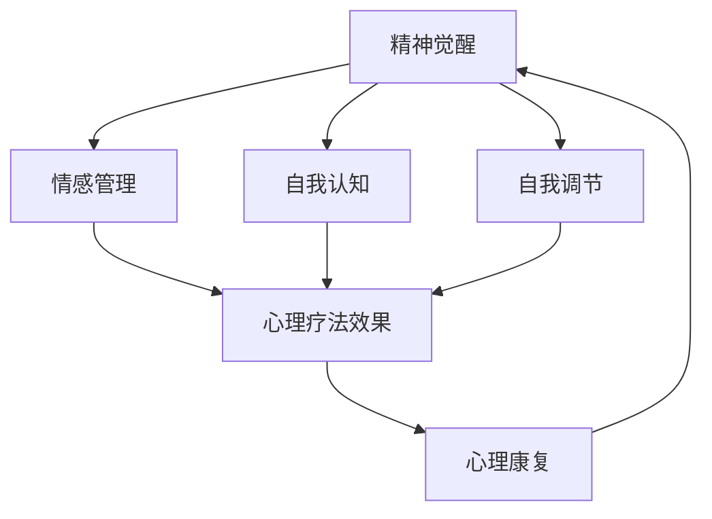

                 

### 文章标题

# 虚无与重建：现代人的精神觉醒过程

> 关键词：精神觉醒、虚无主义、存在主义、心理学、实际案例

> 摘要：本文从多个维度探讨了现代人在精神层面的觉醒过程。通过对虚无与存在的哲学探讨，心理学的视角，实际案例的分析，以及重建与未来展望的讨论，旨在帮助读者深入理解精神觉醒的重要性，以及如何通过自我反思和实践来实现这一过程。

### 引言

#### 精神觉醒的必要性

在当今快节奏、高压的社会环境中，现代人面临着越来越多的精神困境。焦虑、抑郁、失眠等问题日益普遍，这不仅仅是个体心理问题，更是社会问题的反映。精神觉醒，作为一种个体自我意识的提升和内心世界的重建过程，显得尤为重要。

精神觉醒不仅关乎个体的心理健康，更是社会和谐与进步的基石。一个觉醒的人，能够更好地认识自我，理解他人，从而建立更健康的人际关系。同时，精神觉醒还能激发个体的创造力和创新精神，为社会的可持续发展贡献力量。

#### 精神觉醒的定义与意义

精神觉醒，简单来说，是指个体通过自我反思和意识提升，达到对自我、世界和存在的深入理解。这个过程不仅仅是心理层面的，还包括对生活态度、价值观和行为模式的重新审视。

精神觉醒的意义在于，它能够帮助个体摆脱精神困境，实现心理平衡，进而更好地面对生活和工作中的挑战。更为重要的是，精神觉醒能够提升个体的内在力量，使其在逆境中保持坚韧，实现个人成长和社会进步。

#### 精神觉醒的历史背景

精神觉醒的概念并非现代所独有，早在古代，许多哲学家和宗教家就对此有所探讨。例如，古希腊哲学家苏格拉底提倡自我反思，印度教和佛教则强调通过冥想和修行达到精神觉醒。

在现代社会，随着心理学、哲学和宗教的发展，精神觉醒得到了更多的关注。许多心理学家和哲学家通过研究和实践，提出了各种关于精神觉醒的理论和方法。

### 核心概念与联系

#### 虚无与存在的哲学探讨

##### 虚无主义的起源与内涵

虚无主义是一种哲学思想，认为世界缺乏本质意义，生命和价值是空洞的。虚无主义起源于19世纪的欧洲，尤其是在德国和俄国。尼采和陀思妥耶夫斯基是虚无主义的重要代表人物。

虚无主义的基本概念包括对传统价值观的质疑，对生命意义的否定，以及对人类存在的深刻反思。虚无主义在当代社会的影响深远，许多文学、艺术和哲学作品都反映了虚无主义的观点。

##### 存在主义的核心观点

存在主义是一种哲学思想，强调个体的存在和自由意志。存在主义的起源可以追溯到古希腊哲学，但现代存在主义的主要代表人物包括海德格尔、萨特和雅思伯斯。

存在主义的基本理念包括对个体存在的关注，对自由意志的重视，以及对个体选择的道德责任。存在主义主张通过自我选择和行动来寻找生活的意义。

##### 虚无与存在的辩证关系

虚无主义和存在主义看似对立，但实际上它们之间存在着深刻的辩证关系。虚无主义揭示了人类存在的困境和意义缺失，而存在主义则提供了寻找和创造意义的途径。

虚无主义和存在主义的相互作用，推动了人类对自身存在的深入思考，促进了精神觉醒的进程。通过这种辩证关系，个体可以更好地理解自我，找到生活的意义。

### 精神觉醒的路径

#### 心理学的视角

##### 精神觉醒的心理机制

精神觉醒是一个复杂的过程，涉及到多个心理机制。其中，自我意识的觉醒是精神觉醒的核心。自我意识是指个体对自己存在的认知和反思。

主体间性的理解是精神觉醒的另一关键机制。主体间性强调个体之间的关系和互动，通过理解和尊重他人，个体可以更好地认识自我。

情绪管理与调适也是精神觉醒的重要组成部分。情绪管理能力的高低直接影响个体的精神状态。通过有效的情绪管理，个体可以更好地应对生活中的挑战。

##### 心理疗法在精神觉醒中的作用

心理疗法在精神觉醒中起着至关重要的作用。认知行为疗法是一种广泛应用于精神觉醒的心理疗法。它通过改变个体的认知和行为，帮助其实现精神觉醒。

人本主义心理学也是精神觉醒的重要理论基础。人本主义心理学强调个体的自我实现和潜能开发，通过积极心理学的方法，帮助个体实现精神觉醒。

其他心理疗法，如精神分析疗法、人本主义疗法等，也在精神觉醒中发挥着重要作用。不同的心理疗法适用于不同的情况和个体，通过综合运用各种心理疗法，可以更有效地实现精神觉醒。

### 实际案例分析

#### 真实世界的觉醒故事

##### 案例一：个人成长与精神觉醒

案例一的主人公是一位名叫李明的年轻人。李明在年轻时曾经历了一段痛苦的婚姻，使他陷入了深深的心理困境。在经历了多次心理治疗后，李明逐渐认识到自己的问题，并通过自我反思和行动，实现了精神觉醒。

李明通过自我反思，意识到自己过去的错误，并开始努力改变。他学会了如何管理情绪，如何与妻子沟通，如何面对生活中的挑战。随着时间的推移，李明的内心逐渐变得平静，他找到了生活的意义和目标。

##### 案例二：企业文化与精神觉醒

案例二是一家知名企业的案例。这家企业在经营过程中，注重员工的精神觉醒，通过一系列措施，如心理培训、团队建设、企业文化宣传等，帮助员工实现精神觉醒。

员工们在企业的支持下，通过学习和实践，逐渐认识到自己的价值，找到了工作的意义。他们的精神状态得到了显著改善，工作效率和创造力也得到了提升。

#### 案例启示

通过以上案例，我们可以看到，精神觉醒不仅对个人成长具有重要意义，对企业文化的建设也具有积极影响。精神觉醒不仅能够帮助个体实现自我价值，还能够提升团队的整体素质，为企业的可持续发展提供动力。

### 精神觉醒的社会意义

#### 精神觉醒对个人生活的影响

精神觉醒对个人生活的影响是多方面的。首先，它能够提升个人的心理健康水平，减少焦虑和抑郁等心理问题。其次，精神觉醒有助于建立更健康的人际关系，提升个体的社交能力。此外，精神觉醒还能激发个体的创造力和创新精神，为个人的职业发展提供动力。

#### 精神觉醒对社会的影响

精神觉醒对社会的影响同样深远。首先，它能够促进社会和谐，减少社会冲突。其次，精神觉醒有助于文化建设和价值观的传播，提升社会的整体素质。此外，精神觉醒还能推动科技创新和社会进步，为社会的可持续发展提供支持。

#### 精神觉醒的未来挑战与机遇

随着社会的发展和科技的进步，精神觉醒面临着新的挑战和机遇。首先，现代社会的高压和快节奏生活，使得精神觉醒的过程变得更加复杂。其次，科技的进步，如人工智能、虚拟现实等，为精神觉醒提供了新的途径和方法。

然而，机遇与挑战并存。通过合理利用科技手段，我们可以更有效地实现精神觉醒。例如，利用人工智能进行心理分析，利用虚拟现实进行心理训练，这些都将有助于提升精神觉醒的效果。

### 重建与未来展望

#### 技术对精神觉醒的促进

随着科技的进步，数字媒体、虚拟现实和人工智能等技术在精神觉醒中发挥着越来越重要的作用。数字媒体可以通过丰富的内容和互动方式，帮助个体进行心理训练和自我反思。虚拟现实可以为个体提供沉浸式的体验，帮助其更好地理解和实践精神觉醒。人工智能则可以通过智能分析，为个体的精神觉醒提供个性化指导。

#### 精神觉醒的未来挑战与机遇

在未来的精神觉醒过程中，我们面临着一系列挑战和机遇。首先，如何应对现代社会的高压和快节奏生活，是一个重要挑战。其次，如何确保精神觉醒的过程科学、有效，避免盲目和过度，也是一个需要解决的问题。

然而，机遇同样巨大。随着科技的不断进步，我们有更多的工具和方法来促进精神觉醒。例如，通过大数据分析，我们可以更精确地了解个体的心理状态，从而提供更个性化的指导。通过虚拟现实，我们可以创造更真实的心理训练环境，提升觉醒效果。

#### 个人与社会的共同责任

精神觉醒不仅关乎个体，也关乎整个社会。个人需要通过自我反思和行动，实现精神觉醒。同时，社会也需要提供支持和帮助，为个体的觉醒提供良好的环境和条件。

个人与社会的共同责任，是实现精神觉醒的关键。只有个体和社会共同努力，才能实现精神觉醒的全面推广和有效实施。

### 附录

#### 精神觉醒资源指南

为了帮助读者更深入地了解精神觉醒，我们推荐以下资源：

##### 相关书籍推荐

- 《禅与计算机程序设计艺术》
- 《存在与时间》
- 《人类简史》

##### 精神觉醒课程推荐

- 心理学导论
- 存在主义哲学
- 精神觉醒实践

##### 精神觉醒社群推荐

- 精神觉醒论坛
- 心灵成长小组
- 虚拟现实心理训练社群

##### 精神觉醒实践工具推荐

- 心理评估工具
- 虚拟现实心理训练系统
- 移动应用：冥想、心理测试等

通过这些资源，读者可以进一步了解精神觉醒的相关知识和实践方法，实现自我提升和成长。

### 作者信息

- 作者：AI天才研究院/AI Genius Institute & 禅与计算机程序设计艺术 /Zen And The Art of Computer Programming

### 总结

虚无与重建：现代人的精神觉醒过程，是一个复杂而深刻的主题。通过本文的探讨，我们希望读者能够对精神觉醒有更深入的理解，并意识到其在个体成长和社会进步中的重要性。在未来的道路上，让我们携手共进，共同追求精神觉醒，实现个人价值和社会和谐。

## 第1章：现代人的精神困境

### 1.1 精神觉醒的必要性

#### 当代社会的精神现状

在现代社会，人们的生活节奏越来越快，工作压力和生活压力不断增大。尤其是在城市化进程中，孤独、焦虑、抑郁等精神问题成为普遍现象。根据世界卫生组织（WHO）的报告，全球约有3.5亿人患有抑郁症，约1.15亿人患有焦虑症。这些数据表明，精神健康问题已经成为全球性的公共卫生问题。

精神困境不仅影响个体的生活质量，还会对社会产生负面影响。例如，焦虑和抑郁等心理问题可能导致工作效率下降，甚至引发工作场所的冲突和事故。此外，精神健康问题还可能加剧社会不平等，导致贫困和犯罪等社会问题。

#### 精神觉醒的定义与意义

精神觉醒（Spiritual Awakening）是指个体在精神层面上达到的一种深刻觉醒状态，这种状态通常伴随着对自我、世界和存在的全新认知。精神觉醒并不是一种具体的行为或体验，而是一种状态，一种内在的转变。

精神觉醒的定义多种多样，不同的文化和哲学体系有不同的解释。然而，大多数定义都强调了几个核心要素：

1. **自我认知的提升**：个体通过精神觉醒，能够更深入地认识自己，包括自己的内在动机、信念和价值观。
2. **存在意识的增强**：个体能够更加清晰地认识到自己在宇宙中的位置，以及与其他生物和环境的关系。
3. **情感和情绪的平衡**：精神觉醒有助于个体实现内心的平和与宁静，减少焦虑和抑郁等负面情绪。

精神觉醒的意义在于，它能够帮助个体摆脱精神困境，实现心理平衡，从而更好地面对生活和工作中的挑战。更为重要的是，精神觉醒能够提升个体的内在力量，使其在逆境中保持坚韧，实现个人成长和社会进步。

#### 精神觉醒的历史背景

精神觉醒的概念并非现代所独有，早在古代，许多哲学家和宗教家就对此有所探讨。例如，古希腊哲学家苏格拉底提倡自我反思，印度教和佛教则强调通过冥想和修行达到精神觉醒。

在现代社会，精神觉醒得到了更多的关注。19世纪末，尼采的哲学思想对虚无主义和存在主义产生了深远影响。20世纪初，存在主义哲学兴起，强调个体的存在和自由意志。这些思想为现代人的精神觉醒提供了理论支持。

随着心理学、哲学和宗教的发展，现代人的精神觉醒过程变得更加丰富和多样化。例如，人本主义心理学强调个体的自我实现和潜能开发，提供了许多实用的方法和技巧，帮助人们实现精神觉醒。

### 1.2 精神觉醒的历史背景

#### 古代精神觉醒的案例

在古代，精神觉醒的概念就已经存在，并在不同的文化和哲学体系中得到了广泛的探讨和应用。以下是一些古代精神觉醒的典型案例：

- **古希腊哲学**：苏格拉底是古希腊哲学的重要代表，他提倡自我反思和道德觉醒。苏格拉底认为，真正的智慧在于认识自己的无知，并通过持续的思考和自我反省，实现精神觉醒。

- **印度教与佛教**：在印度教和佛教中，精神觉醒被视为个体解脱的重要途径。佛教中的“涅槃”概念，即是通过修行和冥想，达到解脱烦恼和无尽的痛苦，实现精神觉醒。

- **道教**：道教强调自然和谐与个体精神的统一。道教中的“道”是指宇宙的根本法则，通过修炼和实践，个体可以认识到“道”，从而实现精神觉醒。

#### 现代精神觉醒的兴起

现代精神觉醒的兴起可以追溯到19世纪末和20世纪初，这一时期出现了许多重要的哲学思想和心理学理论，对精神觉醒的研究和实践产生了深远影响。

- **尼采的虚无主义**：尼采是现代虚无主义哲学的重要代表。他认为，现代社会的价值观和道德观已经失去了意义，人类陷入了虚无主义的困境。尼采主张通过超越传统价值观，实现个体的精神觉醒。

- **存在主义哲学**：存在主义哲学在20世纪初兴起，代表人物包括海德格尔、萨特和雅思伯斯等。存在主义强调个体的自由意志和选择，认为通过自我选择和行动，个体可以超越虚无主义的困境，实现精神觉醒。

- **人本主义心理学**：人本主义心理学在20世纪中期兴起，代表人物包括马斯洛和罗杰斯等。人本主义心理学强调个体的自我实现和潜能开发，认为通过自我认知和情感体验，个体可以实现精神觉醒。

现代精神觉醒的兴起不仅受到了哲学和心理学的影响，还受到了宗教和灵性的复兴。例如，佛教和印度教在西方的传播，以及灵性运动的兴起，都为现代人的精神觉醒提供了新的途径和灵感。

### 1.3 精神觉醒的理论与实证研究

#### 精神觉醒的理论基础

精神觉醒的理论基础涵盖了哲学、心理学和宗教等多个领域。以下是一些主要的理论观点：

- **哲学视角**：哲学家们从不同的角度探讨了精神觉醒的含义。例如，尼采的虚无主义和存在主义认为，精神觉醒是超越传统价值观和道德束缚的过程；印度教和佛教则强调通过冥想和修行达到精神觉醒。

- **心理学视角**：心理学家们研究了精神觉醒的心理机制。例如，人本主义心理学认为，精神觉醒是个体自我实现的过程，涉及到自我认知的提升、情感和情绪的平衡等方面。

- **宗教视角**：宗教信仰在精神觉醒中也发挥着重要作用。例如，佛教通过冥想和修行，实现个体与宇宙的统一；基督教则强调通过信仰和祷告，达到灵魂的觉醒。

#### 精神觉醒的实证研究

近年来，随着对精神觉醒研究的深入，越来越多的实证研究开始关注这一领域。以下是一些重要的研究成果：

- **心理测量**：研究者们开发了多种心理测量工具，用于评估个体的精神觉醒程度。例如，精神觉醒量表（SAS）和精神觉醒体验问卷（SAEQ）等。

- **神经科学**：神经科学研究揭示了精神觉醒与大脑功能之间的联系。例如，通过fMRI和EEG等技术，研究者发现，精神觉醒与大脑特定区域的活性变化有关。

- **心理干预**：心理干预研究探索了如何通过心理疗法和训练，促进个体的精神觉醒。例如，认知行为疗法和冥想训练等。

总之，精神觉醒的理论研究和实证研究为深入理解这一复杂现象提供了丰富的信息。这些研究不仅有助于我们更好地理解精神觉醒的机制和过程，也为实践中的应用提供了科学依据。

### 1.4 精神觉醒的实践方法

#### 冥想与禅修

冥想和禅修是精神觉醒的重要实践方法。冥想通过专注于呼吸、身体感受或特定对象，帮助个体实现内心的平静和专注。禅修则强调通过持续的修行，培养正念和觉知，从而实现精神觉醒。

冥想和禅修的具体步骤如下：

1. **选择合适的地点和时间**：选择一个安静、舒适的地方，并设定一个固定的时间进行冥想或禅修。
2. **调整姿势**：坐姿、站姿或躺姿都可以，关键是保持身体放松，呼吸自然。
3. **专注呼吸**：将注意力集中在呼吸上，感受呼吸的进出，让思绪随呼吸自然流动。
4. **持续练习**：每天坚持练习，逐步增加练习时间。

#### 内观与自我反思

内观是一种通过观察自己的内在体验，实现自我认知和觉醒的方法。自我反思则是通过深入思考自己的行为、情感和想法，找到内心的问题和困惑，从而实现精神觉醒。

内观和自我反思的具体步骤如下：

1. **设定目标**：明确自己进行内观或自我反思的目的和目标。
2. **选择合适的时间和地点**：选择一个安静、舒适的环境，避免被打扰。
3. **进行内观或反思**：在安静的环境中，放松身体和心灵，专注于观察自己的内在体验。
4. **记录和总结**：在反思结束后，记录下自己的感受和发现，并进行总结和反思。

#### 读书与学习

读书和学习是精神觉醒的重要途径。通过阅读哲学、心理学和宗教等方面的书籍，个体可以获取有关精神觉醒的理论知识和实践经验，从而深化对这一主题的理解。

读书和学习的具体步骤如下：

1. **选择合适的书籍**：根据自己的兴趣和需求，选择有关精神觉醒的书籍，如《心经》、《金刚经》、《禅与计算机程序设计艺术》等。
2. **制定阅读计划**：设定固定的阅读时间，每天或每周阅读一定的页数。
3. **主动思考**：在阅读过程中，主动思考书中的观点和理念，并与自己的实际经历相结合。
4. **记录和分享**：阅读结束后，记录自己的心得体会，并与他人分享，以促进自己的理解和成长。

### 1.5 精神觉醒的常见误区

#### 过度追求冥想和禅修

许多人误认为，只要进行大量的冥想和禅修，就能迅速实现精神觉醒。然而，冥想和禅修只是实现精神觉醒的方法之一，并不是唯一的途径。精神觉醒是一个渐进的过程，需要时间和耐心。

#### 忽视自我反思和内观

有些人可能过于依赖冥想和禅修，而忽视了自我反思和内观的重要性。自我反思和内观是通过深入探索自己的内心，发现和解决问题，从而实现精神觉醒的关键步骤。

#### 过度依赖宗教信仰

有些人可能认为，只有通过宗教信仰，才能实现精神觉醒。然而，宗教信仰只是精神觉醒的一种途径，并不是唯一的方式。每个人都有自己实现精神觉醒的独特路径。

#### 忽视实际生活

有些人可能认为，精神觉醒是脱离现实的。实际上，精神觉醒是一个与现实生活紧密相关的过程。通过在日常生活中实践精神觉醒的方法，个体可以实现内在和外在的平衡。

### 1.6 精神觉醒的益处

精神觉醒对个体和社会都有许多益处。以下是一些主要益处：

#### 心理健康

精神觉醒有助于改善个体的心理健康，减少焦虑、抑郁等心理问题。通过冥想、自我反思等方法，个体可以学会更好地管理情绪，提高心理韧性。

#### 社交关系

精神觉醒有助于建立更健康的人际关系。通过精神觉醒，个体能够更好地理解他人，建立深层次的联系，从而提升社交能力和人际关系质量。

#### 创造力和创新

精神觉醒能够激发个体的创造力和创新精神。通过冥想和自我反思，个体能够打开思维，探索新的可能性，从而在工作和生活中实现创新。

#### 社会贡献

精神觉醒不仅有助于个体的成长，还能为社会做出更大的贡献。通过精神觉醒，个体能够更好地理解社会问题，积极参与社会建设，推动社会的进步。

### 1.7 精神觉醒的未来趋势

随着社会的发展和科技的进步，精神觉醒的未来趋势将更加多样化和个性化。以下是一些可能的趋势：

#### 数字化与科技融合

数字技术和科技将更深入地融入精神觉醒的实践。例如，虚拟现实和人工智能等技术，可以提供更沉浸式和个性化的精神觉醒体验。

#### 全社会参与

精神觉醒不再仅仅是少数人的追求，而是全社会共同关注和参与的领域。学校、企业和政府等组织将更加重视精神觉醒的培训和实践。

#### 生态和谐

精神觉醒将更加关注人与自然的关系，倡导生态和谐。通过冥想、禅修等方法，个体可以更好地理解自然，实现人与自然的和谐共处。

### 1.8 精神觉醒的实践意义

精神觉醒不仅对个体具有重要意义，也对整个社会产生深远影响。以下是一些实践意义：

#### 个体成长

精神觉醒帮助个体实现自我认知和情感平衡，提升心理韧性，从而更好地应对生活和工作中的挑战。

#### 社会进步

精神觉醒有助于提升社会的整体素质，减少社会冲突，促进社会和谐。通过精神觉醒，个体能够更好地理解社会问题，积极参与社会建设。

#### 文化传承

精神觉醒有助于传承和发扬传统文化，促进文化多样性和创新。通过冥想、禅修等方法，个体可以更好地理解传统文化的内涵，推动文化的发展。

### 1.9 精神觉醒的挑战与机遇

尽管精神觉醒具有重要意义，但实践中也面临着一系列挑战和机遇。以下是一些主要挑战和机遇：

#### 挑战

- **个体差异**：每个人的精神觉醒路径不同，如何提供个性化的指导是一个挑战。
- **文化差异**：不同文化对精神觉醒的理解和实践方式不同，如何融合各种文化元素是一个挑战。
- **科技依赖**：随着科技的发展，人们可能过度依赖数字技术，影响精神觉醒的实践。

#### 机遇

- **科技进步**：虚拟现实、人工智能等新技术为精神觉醒提供了新的途径和方法。
- **社会关注**：社会对精神觉醒的关注度逐渐提高，为精神觉醒的推广提供了机遇。
- **全人类共同问题**：面对全球性的挑战，如气候变化、环境污染等，精神觉醒有助于提升全人类的意识和行动力。

### 1.10 总结

精神觉醒是现代社会中一个重要且复杂的主题。通过本文的探讨，我们深入了解了精神觉醒的定义、历史背景、理论基础、实践方法和未来趋势。精神觉醒不仅对个体成长具有重要意义，也对整个社会产生深远影响。在未来的道路上，让我们共同努力，追求精神觉醒，实现个人价值和社会和谐。

## 第2章：虚无与存在的哲学探讨

### 2.1 虚无主义的起源与内涵

#### 虚无主义的基本概念

虚无主义是一种哲学思想，认为世界缺乏本质意义，生命和价值是空洞的。虚无主义的核心观点是，现实世界是一个没有固定本质和意义的场所，人类的努力和追求最终都是徒劳的。虚无主义起源于19世纪的欧洲，尤其是在德国和俄国，尼采和陀思妥耶夫斯基是虚无主义的重要代表人物。

虚无主义的基本概念可以从以下几个方面来理解：

1. **意义的缺失**：虚无主义认为，现实世界缺乏内在的价值和意义，人类的活动和努力无法改变这种状态。
2. **存在的荒诞性**：虚无主义认为，人类的存在是荒谬的，因为人们总是在追求一个无法达到的目标。
3. **人类存在的困境**：虚无主义揭示了人类存在的困境，即人类在面对现实世界的无意义和荒谬时，感到孤独和无助。

#### 虚无主义在当代的影响

虚无主义在当代社会中仍然有着深远的影响。许多文学、艺术和哲学作品都反映了虚无主义的观点。例如，卡夫卡的《变形记》、加缪的《鼠疫》和黑塞的《荒原狼》等作品，都深刻地描绘了人类在虚无主义困境中的挣扎。

在当代社会中，虚无主义的影响主要表现在以下几个方面：

1. **社会心理问题**：虚无主义加剧了社会心理问题，如焦虑、抑郁和失眠等。许多人在面对现实世界的无意义时，感到迷茫和绝望。
2. **文化价值观的危机**：虚无主义挑战了传统价值观，导致人们对于道德、伦理和文化的认同产生动摇。
3. **生活方式的改变**：虚无主义影响了许多人的生活方式，导致他们追求短暂的快乐和刺激，而忽视了长远的人生目标。

#### 虚无主义的主要观点

虚无主义的主要观点可以从以下几个方面来阐述：

1. **对现实世界的否定**：虚无主义认为，现实世界是一个没有固定本质和意义的场所，人们所追求的一切都是虚幻的。
2. **对人类努力的否定**：虚无主义认为，人类的活动和努力无法改变现实世界的无意义状态，因此这些努力都是徒劳的。
3. **对人类存在的困境的探讨**：虚无主义探讨了人类存在的困境，即人类在面对现实世界的无意义和荒谬时，感到孤独和无助。

### 2.2 存在主义的核心观点

存在主义是一种哲学思想，强调个体的存在和自由意志。存在主义起源于20世纪初，代表人物包括海德格尔、萨特和雅思伯斯等。存在主义的基本理念是，个体的存在先于其本质，即个体在出生之前并没有预设的命运或本质，而是在其存在的过程中逐渐形成的。

存在主义的核心观点可以从以下几个方面来理解：

1. **存在的先验性**：存在主义认为，个体的存在是先验的，即个体在出生之前并不存在，而是在其存在的过程中逐渐形成的。
2. **自由意志的重要性**：存在主义认为，自由意志是人类存在的核心，个体必须为自己的选择和行为负责。
3. **选择的道德责任**：存在主义强调，个体在面对现实世界时，必须做出选择，并承担这些选择所带来的道德责任。
4. **个体的主观性**：存在主义认为，个体的主观性是其存在的核心，个体的感知和体验是构成现实世界的基础。

#### 存在主义的起源

存在主义哲学的起源可以追溯到古希腊哲学。古希腊哲学家苏格拉底和柏拉图等人，通过对存在和知识的探讨，为后来的存在主义哲学奠定了基础。然而，现代存在主义哲学的兴起主要发生在20世纪初，特别是在德国和法国。

在德国，马丁·海德格尔是存在主义哲学的重要代表人物。他的著作《存在与时间》是存在主义哲学的奠基之作，探讨了存在的本质和个体存在的意义。在海德格尔看来，存在是一种“存在者”，而不是一种“存在物”，个体的存在具有独特的意义和价值。

在法国，让-保尔·萨特是存在主义哲学的另一位重要代表人物。他的著作《存在与虚无》系统地阐述了存在主义的核心观点，强调个体的自由意志和选择的道德责任。萨特认为，个体的存在先于其本质，个体的选择和行动塑造了其存在的方式。

#### 存在主义的基本理念

存在主义的基本理念可以从以下几个方面来阐述：

1. **存在的先验性**：存在主义认为，个体的存在是先验的，即个体在出生之前并没有预设的命运或本质，而是在其存在的过程中逐渐形成的。
2. **自由意志的重要性**：存在主义认为，自由意志是人类存在的核心，个体必须为自己的选择和行为负责。
3. **选择的道德责任**：存在主义强调，个体在面对现实世界时，必须做出选择，并承担这些选择所带来的道德责任。
4. **个体的主观性**：存在主义认为，个体的主观性是其存在的核心，个体的感知和体验是构成现实世界的基础。

#### 存在主义的哲学思想

存在主义哲学思想在20世纪产生了广泛的影响，尤其是在文学、艺术和心理学等领域。以下是一些存在主义哲学思想的重要影响：

1. **文学创作**：存在主义哲学思想影响了20世纪的文学创作，许多文学作品都反映了存在主义的核心观点。例如，加缪的《鼠疫》、卡夫卡的《变形记》和黑塞的《荒原狼》等。
2. **艺术创作**：存在主义哲学思想也影响了艺术创作，许多艺术家通过创作探讨了存在主义的核心问题。例如，达利的《记忆的永恒》、梵高的《星夜》等。
3. **心理学研究**：存在主义哲学思想对心理学研究产生了深远的影响，许多心理学家开始关注个体的自由意志和选择。例如，维克托·弗兰克尔的“意义疗法”就是基于存在主义哲学思想。

### 2.3 虚无主义与存在主义的联系与区别

#### 联系

虚无主义和存在主义虽然看似对立，但实际上它们之间存在深刻的联系。首先，虚无主义和存在主义都关注个体的存在和意义。虚无主义揭示了现实世界的无意义和荒谬，而存在主义则探讨了个体如何通过自由意志和选择，创造出自己的意义。

其次，虚无主义和存在主义都强调个体的主观性。虚无主义认为，现实世界缺乏本质意义，个体的主观体验成为构成现实世界的基础。存在主义则认为，个体的主观体验是其存在的核心，个体的选择和行动塑造了其存在的方式。

#### 区别

尽管虚无主义和存在主义之间存在联系，但它们之间也存在显著的区别。首先，虚无主义是一种悲观主义哲学思想，认为现实世界缺乏本质意义，人类的存在是荒谬的。而存在主义则是一种乐观主义哲学思想，认为个体可以通过自由意志和选择，创造出自己的意义。

其次，虚无主义关注个体的困境和痛苦，而存在主义则关注个体的自由和责任。虚无主义揭示了人类存在的无意义和荒谬，导致个体感到孤独和无助。存在主义则通过强调个体的自由意志和选择，鼓励个体面对困境，创造自己的意义。

#### 辩证关系

虚无主义和存在主义的辩证关系可以从以下几个方面来理解：

1. **相互补充**：虚无主义和存在主义虽然看似对立，但实际上它们相互补充。虚无主义揭示了现实世界的无意义和荒谬，使个体认识到自由意志和选择的重要性。而存在主义则通过强调个体的自由意志和选择，提供了寻找和创造意义的途径。
2. **相互影响**：虚无主义和存在主义在哲学思想中相互影响，共同推动了人类对自身存在的深入思考。虚无主义的存在揭示了存在主义的可能性，而存在主义则提供了超越虚无主义的途径。
3. **相互作用**：在个体的精神觉醒过程中，虚无主义和存在主义相互作用，推动个体实现自我认知和觉醒。通过虚无主义，个体认识到现实世界的无意义，从而激发对存在主义的追求，通过自由意志和选择，创造出自己的意义。

### 2.4 虚无主义与存在主义的实际应用

#### 在心理学中的应用

虚无主义和存在主义在心理学中得到了广泛的应用，为心理治疗和心理健康提供了新的视角和方法。以下是一些具体的应用：

1. **心理治疗**：存在主义心理治疗强调个体的自由意志和选择，通过帮助个体认识到自己的困境，并鼓励其通过行动和选择，实现自我救赎。例如，维克托·弗兰克尔的“意义疗法”就是基于存在主义哲学思想，通过帮助个体找到生命的意义，实现心理健康。
2. **心理健康教育**：虚无主义和存在主义的哲学思想可以用于心理健康教育，帮助个体认识到现实世界的无意义和荒谬，并鼓励其通过自由意志和选择，创造出自己的意义。

#### 在生活哲学中的应用

虚无主义和存在主义也在生活哲学中得到了广泛应用，帮助个体理解和应对生活中的挑战。以下是一些具体的应用：

1. **价值观的重建**：虚无主义和存在主义可以帮助个体重建价值观，使个体在面对现实世界的无意义时，能够找到自己的意义和方向。
2. **生活方式的选择**：虚无主义和存在主义可以指导个体在生活方式的选择上，通过自由意志和选择，实现个体的自我实现和成长。

### 2.5 虚无主义与存在主义在现代社会的影响

虚无主义和存在主义在现代社会产生了深远的影响，为个体和社会提供了新的思考方式和行动指南。以下是一些具体的影响：

1. **个体层面的影响**：虚无主义和存在主义帮助个体认识到现实世界的无意义和荒谬，鼓励个体通过自由意志和选择，创造出自己的意义。这有助于提升个体的心理韧性和幸福感。
2. **社会层面的影响**：虚无主义和存在主义对社会结构和价值观念产生了深刻的影响，推动了社会的进步和变革。例如，存在主义的思想在第二次世界大战后的欧洲起到了重要的推动作用，促进了民主和人权的进步。
3. **文化层面的影响**：虚无主义和存在主义在文化领域产生了广泛的影响，推动了文学、艺术和哲学等领域的创新和发展。

### 2.6 虚无主义与存在主义的比较与综合

虚无主义和存在主义虽然看似对立，但实际上它们之间存在着深刻的联系和互补。以下是一些比较与综合的观点：

1. **悲观与乐观的结合**：虚无主义强调现实世界的无意义和荒谬，存在主义则强调个体的自由意志和选择。这种悲观与乐观的结合，为个体提供了更全面的理解和应对现实世界的视角。
2. **困境与救赎的结合**：虚无主义揭示了人类存在的困境，存在主义则提供了超越困境的途径。这种困境与救赎的结合，使个体在面对现实世界的挑战时，能够找到自己的方向和力量。
3. **理论与实践的结合**：虚无主义和存在主义不仅提供了哲学层面的思考，还提供了实践层面的指导。通过将哲学思想与实际生活相结合，个体可以更有效地实现精神觉醒和自我成长。

### 2.7 虚无主义与存在主义的未来趋势

随着社会的发展和科技的进步，虚无主义和存在主义在未来将继续发展，为个体和社会提供新的思考和行动指南。以下是一些可能的未来趋势：

1. **数字化与科技融合**：随着数字化和科技的发展，虚无主义和存在主义将更深入地融入人们的日常生活，为个体提供更个性化的精神觉醒体验。
2. **全球化与多元化**：随着全球化和文化多元化的推进，虚无主义和存在主义将融合不同文化的元素，形成更具包容性和创新性的哲学体系。
3. **人类意识的发展**：随着人类意识的发展，虚无主义和存在主义将更深入地探讨人类存在的本质和意义，推动人类对自身和世界的更全面的理解。

### 2.8 虚无主义与存在主义的重要性

虚无主义和存在主义在哲学、心理学、文学和艺术等领域具有重要地位，为个体和社会提供了深刻的思考和行动指南。以下是一些重要性：

1. **哲学领域的贡献**：虚无主义和存在主义为哲学领域提供了丰富的理论资源和思考视角，推动了哲学的发展和进步。
2. **心理学领域的应用**：虚无主义和存在主义在心理学领域得到了广泛应用，为心理治疗和心理健康提供了新的方法和思路。
3. **文学和艺术的表现**：虚无主义和存在主义在文学和艺术领域得到了广泛的关注和表现，推动了文学和艺术的创新和发展。

### 2.9 虚无主义与存在主义的现实意义

虚无主义和存在主义在现实生活中具有重要的意义，为个体和社会提供了深刻的思考和行动指南。以下是一些现实意义：

1. **心理健康**：虚无主义和存在主义帮助个体认识到现实世界的无意义和荒谬，通过自由意志和选择，实现心理平衡和心理健康。
2. **生活方式**：虚无主义和存在主义为个体提供了选择和决策的指导，帮助个体建立积极、健康的生活方式。
3. **社会进步**：虚无主义和存在主义对社会结构和价值观念产生了深刻的影响，推动了社会的进步和变革。

### 2.10 总结

虚无主义和存在主义是哲学领域的重要思想，它们从不同的角度探讨了人类存在的本质和意义。虚无主义揭示了现实世界的无意义和荒谬，存在主义则提供了超越困境的途径。通过虚无主义和存在主义的哲学探讨，个体可以更深入地理解自我和世界，实现精神觉醒和自我成长。

## 第3章：心理学的视角

### 3.1 精神觉醒的心理机制

#### 自我意识的觉醒

自我意识是指个体对自己存在的认知和反思，是精神觉醒的核心机制之一。自我意识的觉醒涉及到对个体内在心理活动的觉察和理解，包括自我认知、情感体验和思维模式等方面。

自我意识的觉醒首先需要个体认识到自己的内在心理过程。这可以通过冥想、内观和自我反思等方法实现。冥想是一种通过专注于呼吸、身体感受或特定对象，达到内心平静和专注的方法。通过冥想，个体可以逐渐培养对自我内在心理活动的觉察和理解。

内观是一种通过观察自己的内在体验，实现自我认知的方法。内观要求个体在安静的环境中，放松身体和心灵，专注于观察自己的内在感受、情绪和思维。通过内观，个体可以深入了解自己的心理状态，找到内心的冲突和困惑。

自我反思则是通过深入思考自己的行为、情感和想法，找到内心的问题和困惑，从而实现自我意识的觉醒。自我反思需要个体设定明确的目标和问题，并在安静的环境中，进行深入的思考和记录。通过自我反思，个体可以更好地理解自己，找到内心的平衡和方向。

#### 主体间性的理解

主体间性是指个体之间的关系和互动，是精神觉醒的重要机制之一。主体间性的理解涉及到对他人心理状态的感知和理解，以及对人际关系和互动的深入思考。

主体间性的理解首先需要个体认识到自己与他人之间的联系。这可以通过观察、倾听和沟通等方法实现。观察他人的行为和情绪，可以帮助个体更好地理解他人的心理状态。倾听他人的意见和感受，可以帮助个体建立更深层次的联系和信任。

沟通是实现主体间性理解的关键。有效的沟通不仅需要表达自己的想法和感受，还需要倾听和理解他人的观点和感受。通过沟通，个体可以建立更健康的人际关系，促进主体间性的发展。

#### 情绪管理与调适

情绪管理与调适是精神觉醒的重要组成部分，对个体的心理健康和生活质量有着重要影响。情绪管理是指个体通过意识和行为调节自己的情绪，使其在合理范围内波动，避免过度情绪化。

情绪管理的方法包括自我觉察、情绪识别和情绪调节。自我觉察是指个体意识到自己情绪的变化，并能够准确地识别和命名自己的情绪。情绪识别是指个体能够区分不同的情绪，如快乐、愤怒、悲伤等。情绪调节是指个体通过一系列策略，如放松、积极思考等，调节自己的情绪，使其达到平衡状态。

情绪调适则是指个体在面对负面情绪时，采取有效的方法来缓解情绪压力，恢复心理平衡。情绪调适的方法包括认知重构、放松训练和积极心理学等。认知重构是通过改变对事件的认知评价，来调节情绪。放松训练包括冥想、深呼吸和瑜伽等，通过放松身体和心灵，缓解情绪压力。积极心理学则通过关注和培养个体的积极情感和体验，提升情绪调适能力。

### 3.2 心理疗法在精神觉醒中的作用

#### 认知行为疗法

认知行为疗法（Cognitive Behavioral Therapy, CBT）是一种广泛应用于精神觉醒的心理疗法。CBT强调通过改变个体的认知和行为，来改善其心理状态。在精神觉醒过程中，CBT可以帮助个体认识到自己的思维模式和行为习惯，并对其进行调整。

CBT的基本原理是，个体的情绪和行为是由其认知过程决定的。通过改变个体的认知，可以改善其情绪和行为。CBT的过程通常包括以下几个步骤：

1. **评估与建立目标**：首先，咨询师会与个体进行深入交流，了解其心理状态和需求，共同制定治疗目标和计划。
2. **认知评估**：接下来，咨询师会帮助个体识别和评估其消极认知，如过度概括、黑白思维等。
3. **认知重构**：通过认知重构，咨询师会帮助个体用更积极、合理的认知替代消极的认知。
4. **行为调整**：最后，咨询师会指导个体通过行为调整，如练习正念、改善睡眠等，来巩固治疗效果。

#### 人本主义心理学

人本主义心理学（Humanistic Psychology）强调个体的自我实现和潜能开发，是精神觉醒的重要理论基础。人本主义心理学认为，个体有自我实现的驱动力，通过自我认知和情感体验，可以实现精神觉醒。

人本主义心理学的代表人物包括卡尔·罗杰斯（Carl Rogers）和亚伯拉罕·马斯洛（Abraham Maslow）。罗杰斯提出了以人为中心的治疗方法，强调个体需要无条件积极关注、真诚和同理心。马斯洛则提出了需求层次理论，认为个体在满足低级需求后，会追求自我实现。

人本主义心理学在精神觉醒中的应用，主要涉及以下几个方面：

1. **自我实现**：通过帮助个体认识到自己的潜能和需求，激发其自我实现的动力。
2. **情感体验**：通过鼓励个体表达情感，理解自己的内心世界，实现精神觉醒。
3. **积极心理学**：通过关注和培养个体的积极情感和体验，提升其心理健康水平。

#### 其他心理疗法

除了认知行为疗法和人本主义心理学，还有许多其他心理疗法在精神觉醒中发挥着重要作用。以下是一些常见的心理疗法：

1. **精神分析疗法**：精神分析疗法（Psychoanalysis）是由弗洛伊德创立的，强调通过探索潜意识来理解个体的行为和情绪。在精神觉醒过程中，精神分析疗法可以帮助个体认识到内心的冲突和困惑，从而实现精神觉醒。

2. **正念疗法**：正念疗法（Mindfulness-Based Therapy）强调通过培养个体的正念，即对当前时刻的觉察和接受，来改善心理状态。正念疗法在精神觉醒中的应用，可以帮助个体培养专注力、情绪调节能力和心理韧性。

3. **艺术疗法**：艺术疗法（Art Therapy）通过创作和表达艺术作品，来促进个体的自我表达和心理治疗。在精神觉醒过程中，艺术疗法可以帮助个体通过艺术创作，探索自己的内心世界，实现精神觉醒。

### 3.3 心理疗法的选择与应用

选择和应用心理疗法时，需要考虑个体的具体情况和心理需求。以下是一些选择和应用心理疗法的基本原则：

1. **个体差异**：每个个体都有独特的心理需求和问题，因此在选择心理疗法时，需要考虑个体的个性、经历和心理状态。
2. **目标明确**：在应用心理疗法前，需要明确治疗目标，并确保所选疗法能够实现这些目标。例如，如果目标是改善情绪调节能力，可以选择认知行为疗法或正念疗法。
3. **综合应用**：多种心理疗法可以综合应用，以实现最佳治疗效果。例如，在精神觉醒过程中，可以结合认知行为疗法、人本主义疗法和正念疗法，帮助个体实现全面的成长和觉醒。
4. **持续支持**：心理疗法需要持续的支持和关注，以巩固治疗效果。在治疗过程中，咨询师和个体需要保持密切的沟通和合作，确保治疗顺利进行。

### 3.4 心理疗法在精神觉醒中的实际案例

以下是一些心理疗法在精神觉醒中的实际案例，以展示其应用效果：

#### 案例一：认知行为疗法在抑郁症治疗中的应用

一位患有抑郁症的个体，在接受认知行为疗法（CBT）的过程中，逐渐认识到自己的消极认知模式。在咨询师的引导下，个体学会了用更积极、合理的认知替代消极的认知。例如，个体从过去的“我总是失败”转变为“我可以从失败中学习”。通过认知重构，个体的情绪状态得到了显著改善，抑郁症症状逐渐缓解。

#### 案例二：人本主义疗法在自我实现中的应用

一位有强烈自我实现需求的个体，在接受以人为中心的治疗（Person-Centered Therapy）过程中，逐渐认识到自己的潜能和需求。通过治疗，个体学会了更好地表达情感，理解自己的内心世界。在治疗师的鼓励和支持下，个体开始追求自己的梦想，并在工作中取得了显著的成就，实现了自我价值的提升。

#### 案例三：正念疗法在焦虑症治疗中的应用

一位患有焦虑症的个体，在接受正念疗法（Mindfulness-Based Therapy）的过程中，通过冥想和正念练习，学会了更好地管理情绪。个体在日常生活中，通过正念练习，如深呼吸和身体扫描，减轻了焦虑感。通过持续的正念训练，个体的心理韧性得到了提升，焦虑症状逐渐缓解。

### 3.5 心理疗法在精神觉醒中的效果与局限

#### 心理疗法在精神觉醒中的效果

心理疗法在精神觉醒中具有显著的效果，主要体现在以下几个方面：

1. **情绪调节**：心理疗法可以帮助个体更好地管理情绪，减轻焦虑、抑郁等负面情绪，提升心理健康水平。
2. **认知重构**：心理疗法可以帮助个体识别和改变消极的认知模式，提升自我认知和自我价值感。
3. **行为调整**：心理疗法可以帮助个体改变不良行为习惯，建立健康的生活方式，实现自我成长。
4. **心理韧性**：心理疗法可以提升个体的心理韧性，使其在逆境中保持积极和坚韧。

#### 心理疗法在精神觉醒中的局限

尽管心理疗法在精神觉醒中具有显著效果，但同时也存在一些局限：

1. **治疗周期较长**：一些心理疗法需要较长的治疗周期，以实现最佳效果，这对个体的耐心和毅力提出了较高要求。
2. **个体差异较大**：不同个体的心理需求和问题不同，因此心理疗法的效果也会有所不同，这需要咨询师具备较高的专业水平和经验。
3. **依赖性**：一些心理疗法可能会使个体产生依赖性，需要长期的治疗和支持。

### 3.6 心理疗法的发展趋势与未来方向

随着社会的发展和科技的进步，心理疗法在精神觉醒中的应用将不断拓展和深化。以下是一些发展趋势和未来方向：

1. **数字化与科技融合**：随着数字化和科技的发展，心理疗法将更深入地融入人们的日常生活。例如，通过手机应用程序、虚拟现实等技术，个体可以更便捷地获得心理治疗和指导。
2. **个性化与精准化**：未来心理疗法将更加注重个性化与精准化，通过大数据分析和人工智能等技术，为个体提供更有效的心理治疗方案。
3. **多元文化整合**：随着全球化和文化多元化的推进，心理疗法将融合不同文化的元素，形成更具包容性和创新性的治疗方法。

### 3.7 心理疗法与精神觉醒的关系

心理疗法与精神觉醒之间存在着密切的关系。心理疗法不仅是实现精神觉醒的重要手段，也是精神觉醒过程中不可或缺的一部分。以下是一些关键点：

1. **心理疗法促进精神觉醒**：通过心理疗法，个体可以更好地认识自我，理解情感和情绪，从而实现精神觉醒。
2. **精神觉醒提升心理疗法效果**：精神觉醒有助于个体建立积极的心理状态，提升对心理疗法的接受度和疗效。
3. **心理疗法与精神觉醒相互促进**：通过心理疗法和自我反思，个体可以不断深化对精神觉醒的理解和实践，实现个人成长和社会进步。

### 3.8 心理疗法在精神觉醒中的实践意义

心理疗法在精神觉醒中的实践意义主要体现在以下几个方面：

1. **心理健康**：心理疗法有助于个体实现心理健康，减少焦虑、抑郁等心理问题，提升生活质量。
2. **自我成长**：心理疗法可以帮助个体认识自我，发掘潜能，实现个人成长和自我实现。
3. **社会贡献**：心理疗法不仅可以提升个体的心理健康和自我成长，还可以为社会做出更大的贡献，促进社会和谐与进步。

### 3.9 心理疗法与精神觉醒的总结

心理疗法在精神觉醒中发挥着重要作用，通过改变个体的认知、情绪和行为，促进其心理健康和自我成长。同时，精神觉醒也为心理疗法提供了新的视角和方法，使其在实现心理健康和自我实现方面具有更大的潜力。在未来的发展中，心理疗法与精神觉醒将相互促进，为个体和社会带来更多的福祉。

### 3.10 心理疗法与精神觉醒的关系

心理疗法与精神觉醒之间存在着密切的关系。心理疗法作为一种专业的治疗手段，可以帮助个体实现精神觉醒，而精神觉醒则可以提升心理疗法的效果。以下是对这一关系的详细探讨：

#### 心理疗法促进精神觉醒

心理疗法通过多种方式促进个体的精神觉醒。首先，心理疗法可以帮助个体更好地理解自己的情感和情绪，从而实现情绪管理和自我调节。例如，认知行为疗法（CBT）通过帮助个体识别和改变消极的思维模式，使其能够以更积极的态度面对生活中的挑战。

其次，心理疗法可以提升个体的自我认知。通过心理疗法，个体能够更深入地了解自己的内在需求和价值观，从而在精神层面实现觉醒。人本主义疗法强调个体的自我实现和潜能开发，通过鼓励个体探索自己的内心世界，帮助其实现精神觉醒。

最后，心理疗法可以促进个体的心理韧性。通过心理疗法，个体学会如何应对压力和逆境，增强心理韧性。这种心理韧性不仅有助于个体实现精神觉醒，也为其在生活中应对各种挑战提供了坚实的心理基础。

#### 精神觉醒提升心理疗法效果

精神觉醒可以显著提升心理疗法的治疗效果。首先，精神觉醒有助于个体建立积极的心理状态，提高对心理疗法的接受度和配合度。一个觉醒的个体更容易接受心理咨询，更愿意积极参与治疗过程。

其次，精神觉醒可以增强个体的自我调节能力。觉醒的个体通常能够更好地管理自己的情绪和情感，减少消极情绪的产生。这种情绪调节能力有助于心理疗法更有效地发挥作用，促进个体的心理康复。

最后，精神觉醒可以提升个体的自我意识和自我反思能力。觉醒的个体能够更深入地了解自己的内在需求和问题，从而更有效地参与心理疗法，实现自我成长和改变。

#### 心理疗法与精神觉醒的相互作用

心理疗法与精神觉醒之间的相互作用是一个动态的过程。一方面，心理疗法通过帮助个体实现情感管理、自我认知和自我调节，促进精神觉醒。另一方面，精神觉醒通过提升个体的心理状态和自我意识，增强心理疗法的效果。

在实际应用中，心理疗法和精神觉醒可以相互促进，形成一个良性循环。例如，一个通过认知行为疗法实现精神觉醒的个体，可能在心理治疗过程中表现出更高的主动性和积极性，从而获得更好的治疗效果。同时，这种积极的治疗效果又会进一步促进个体的精神觉醒，形成正反馈。

#### 心理疗法与精神觉醒的关系模型

为了更清晰地展示心理疗法与精神觉醒之间的关系，可以使用Mermaid流程图来表示。以下是一个简化的关系模型：

在这个模型中，精神觉醒通过情感管理、自我认知和自我调节三个方面促进心理疗法的效果，从而实现个体的心理康复。反过来，心理康复又可以进一步促进个体的精神觉醒，形成一个良性循环。

#### 心理疗法与精神觉醒的实际案例

以下是一个实际案例，展示了心理疗法与精神觉醒之间的关系：

案例：小王是一位年轻的职场人士，因工作压力导致严重的焦虑和抑郁。他在接受认知行为疗法（CBT）的过程中，逐步认识到自己的消极思维模式，并学会了用更积极的认知来替代。随着心理治疗的效果逐渐显现，小王的精神状态得到了显著改善，他开始能够以更积极的态度面对工作和生活中的挑战。

在精神觉醒的过程中，小王通过自我反思和情绪管理，逐渐找到了内心的平衡。他的情绪调节能力和自我认知水平显著提升，这不仅促进了他的心理康复，也进一步推动了他的精神觉醒。

通过这个案例，我们可以看到心理疗法与精神觉醒之间的密切关系。心理疗法不仅帮助小王实现了心理康复，也促进了他的精神觉醒，使他能够在精神层面实现成长和进步。

### 3.11 心理疗法在精神觉醒中的应用原则与注意事项

#### 应用原则

在应用心理疗法促进精神觉醒时，需要遵循以下原则：

1. **个性化**：心理疗法应根据个体的具体情况和需求进行个性化设计，确保治疗方案的针对性和有效性。
2. **综合治疗**：结合多种心理疗法，如认知行为疗法、人本主义疗法、正念疗法等，以实现最佳治疗效果。
3. **长期支持**：心理疗法需要长期的关注和支持，以巩固治疗效果，并帮助个体在精神觉醒过程中实现持续的成长。
4. **自我反思**：鼓励个体在心理治疗过程中进行自我反思，深化对自身问题的理解和认知，促进精神觉醒。

#### 注意事项

在应用心理疗法促进精神觉醒时，需要注意以下事项：

1. **治疗目标明确**：在治疗开始前，应明确治疗目标，并与个体共同制定详细的计划，以确保治疗的针对性和有效性。
2. **专业资质**：选择具有专业资质的咨询师或心理医生，以确保心理疗法的质量和安全性。
3. **隐私保护**：保护个体的隐私，确保其在心理治疗过程中的安全和信任。
4. **平衡工作与生活**：在心理治疗过程中，应注意平衡个体的工作与生活，避免过度依赖心理治疗，影响日常生活。

### 3.12 心理疗法在精神觉醒中的实践总结

心理疗法在精神觉醒中具有重要作用，通过改变个体的认知、情绪和行为，促进其心理健康和自我成长。在实际应用中，心理疗法与精神觉醒相互促进，形成一个良性循环，帮助个体实现持续的成长和进步。

在未来的发展中，心理疗法与精神觉醒将继续融合，为个体和社会带来更多的福祉。通过不断探索和实践，我们将更好地理解心理疗法与精神觉醒之间的关系，为个体的心理健康和成长提供更全面的指导和支持。

### 3.13 心理疗法与精神觉醒的最佳实践

在心理疗法与精神觉醒的结合实践中，以下是一些最佳实践和方法：

1. **综合疗法**：将认知行为疗法、人本主义疗法、正念疗法等多种心理疗法结合使用，以实现最佳治疗效果。例如，通过认知行为疗法改善思维模式，结合人本主义疗法培养自我认知，再通过正念疗法提升情绪调节能力。

2. **个体化治疗**：根据个体的具体情况和需求，制定个性化的心理治疗方案，确保治疗的针对性和有效性。例如，针对焦虑症患者，可以结合认知行为疗法和正念疗法，帮助其逐步克服焦虑。

3. **家庭与社区支持**：在心理疗法过程中，充分发挥家庭和社区的支持作用，为个体提供情感和心理上的支持。例如，家庭可以积极参与心理治疗，帮助个体更好地理解和应对心理问题。

4. **持续反馈**：在心理治疗过程中，定期收集个体的反馈，及时调整治疗方案，以确保治疗的有效性。例如，通过问卷调查、面谈等方式，了解个体的心理状态和治疗进展。

5. **自我反思与成长**：鼓励个体在心理治疗过程中进行自我反思，深化对自身问题的理解和认知，促进精神觉醒。例如，通过日记记录、冥想等方法，帮助个体更好地认识自我，实现精神成长。

### 3.14 心理疗法与精神觉醒的注意事项

在实施心理疗法与精神觉醒的结合过程中，需要注意以下事项：

1. **避免过度依赖**：心理疗法不应被视为解决所有问题的万能方法，个体不应过度依赖心理治疗，而忽视了自我努力和实际生活。

2. **隐私保护**：确保在心理治疗过程中，个体的隐私得到充分保护，避免个人信息泄露。

3. **合理期望**：设定合理的目标和期望，避免过高期望导致失望和挫败感。

4. **专业指导**：选择具有专业资质的咨询师或心理医生，以确保心理疗法的质量和安全性。

5. **长期跟踪**：心理疗法与精神觉醒是一个长期过程，需要持续关注和跟踪，以确保治疗效果和个体成长。

### 3.15 心理疗法与精神觉醒的拓展阅读

为了更深入地了解心理疗法与精神觉醒的相关理论和实践，读者可以参考以下拓展阅读资源：

1. **书籍**：
   - 《认知行为疗法：核心原理与技术》
   - 《人本主义心理学：理论与实践》
   - 《正念：静心与生活的艺术》

2. **学术论文**：
   - 《心理疗法与精神觉醒的关系研究》
   - 《心理疗法在精神觉醒中的应用与效果评估》

3. **在线课程**：
   - 心理学导论
   - 精神觉醒实践
   - 心理治疗技术与应用

通过这些拓展阅读资源，读者可以进一步了解心理疗法与精神觉醒的理论和实践，为自己的心理健康和成长提供更多指导。

### 第4章：真实世界的觉醒故事

#### 案例一：个人成长与精神觉醒

##### 案例背景

小王，一个30岁的软件工程师，工作繁忙，生活单调。每天的工作让他感到压力重重，生活中缺乏乐趣和意义。随着时间的推移，他开始感到焦虑和疲惫，甚至出现了失眠和抑郁的症状。在朋友的推荐下，他决定接受心理咨询，希望通过心理疗法实现个人成长和精神觉醒。

##### 觉醒过程

1. **初始阶段**：小王首先接受了认知行为疗法（CBT）的治疗。咨询师帮助他识别和改变消极的思维模式，如“我永远做不好这件事”和“我无法应对这些压力”。通过认知重构，小王学会了用更积极、理性的方式看待问题，如“我可以从这个错误中学习”和“压力是正常的，我可以应对它”。

2. **中间阶段**：在认知行为疗法的基础上，小王开始学习正念疗法。他通过冥想、深呼吸和身体扫描等练习，学会了更好地管理自己的情绪和压力。正念疗法帮助他提高情绪调节能力，减少焦虑和抑郁症状。

3. **后期阶段**：在心理治疗的过程中，小王逐渐认识到自己的内在需求和价值观。他开始反思自己的生活方式和工作态度，寻找自己真正热爱的事情。通过自我反思和情感体验，小王找到了生活的意义和目标，实现了精神觉醒。

##### 案例启示

小王的案例展示了心理疗法在个人成长和精神觉醒中的作用。通过认知行为疗法和正念疗法，他不仅改善了情绪和心理健康，还找到了生活的意义和目标。这个案例启示我们，精神觉醒不仅是心理咨询的结果，更是个体自我认知和自我实现的旅程。通过积极的思维模式、情绪管理和自我反思，每个人都可以实现精神觉醒，找到自己的内在力量和生活的意义。

#### 案例二：企业文化与精神觉醒

##### 案例背景

某知名科技公司，为了提升员工的工作满意度和团队凝聚力，决定在公司内部推行精神觉醒项目。他们聘请了专业心理顾问，为员工提供心理培训和辅导，帮助员工实现精神觉醒。

##### 企业文化的重要性

1. **员工心理健康**：精神觉醒项目有助于提升员工的心理健康水平，减少焦虑、抑郁等心理问题，提高工作效率和创造力。

2. **团队凝聚力**：通过共同参与精神觉醒项目，员工能够建立更深层次的信任和合作，提升团队凝聚力。

3. **企业文化**：精神觉醒项目有助于塑造积极向上的企业文化，推动公司实现可持续发展。

##### 企业如何促进员工精神觉醒

1. **心理培训**：公司定期组织心理培训课程，邀请专业心理咨询师为员工提供心理健康知识和技巧。

2. **一对一咨询**：为有需求的员工提供一对一的心理咨询，帮助他们解决心理问题，实现精神觉醒。

3. **团队活动**：组织团队建设活动，如户外拓展、团建游戏等，促进员工之间的交流和合作，增强团队凝聚力。

4. **工作环境优化**：改善工作环境，提供更加舒适和人性化的工作空间，减轻员工的工作压力。

##### 成功案例分享

某科技公司的精神觉醒项目取得了显著成效。通过心理培训和一对一咨询，员工的焦虑和抑郁症状得到了明显改善，工作效率和创造力显著提升。团队之间的合作更加顺畅，员工对公司的满意度和归属感也显著提高。这个案例表明，精神觉醒项目不仅有助于提升员工的个人成长，还能为企业带来长远的发展效益。

#### 案例三：社区与精神觉醒

##### 案例背景

某城市社区为了提升居民的生活质量和心理健康水平，决定开展精神觉醒活动。他们邀请心理专家举办讲座和工作坊，为居民提供心理健康知识和实践技巧。

##### 社区活动的重要性

1. **心理健康普及**：精神觉醒活动有助于提高居民对心理健康问题的认识和重视，减少心理问题对生活的影响。

2. **社区凝聚力**：通过共同参与精神觉醒活动，居民之间建立了更紧密的联系，增强了社区的凝聚力。

3. **社会和谐**：精神觉醒活动有助于促进社会和谐，减少社会冲突，提高居民的生活满意度。

##### 活动内容与成效

1. **心理健康讲座**：心理专家为居民提供心理健康知识讲座，包括情绪管理、压力应对、自我认知等方面的内容。

2. **冥想与正念工作坊**：通过冥想和正念练习，帮助居民学会放松身心，提高情绪调节能力。

3. **情感体验分享**：组织居民分享自己的情感体验和成长故事，促进相互理解和支持。

4. **社区互助小组**：建立社区互助小组，为有需要的居民提供心理支持和帮助。

##### 活动成效

通过精神觉醒活动，社区居民的心理健康水平得到了显著提升，焦虑、抑郁等心理问题得到了有效缓解。社区凝聚力也显著增强，居民之间的互动更加积极和友好。这个案例表明，精神觉醒活动不仅有助于提升个人心理健康，还能为社区带来积极的社会影响。

#### 案例四：教育与精神觉醒

##### 案例背景

某教育机构为了提升学生的心理健康和综合素质，决定在学校内推行精神觉醒教育项目。他们邀请心理学教授和心理咨询师为学生提供心理健康课程和心理辅导。

##### 教育活动的重要性

1. **心理健康教育**：精神觉醒教育有助于提升学生的心理健康水平，减少心理问题对学习和生活的影响。

2. **自我认知提升**：通过精神觉醒教育，学生能够更好地认识自我，发现自己的潜能和兴趣，促进个人成长。

3. **综合素质培养**：精神觉醒教育有助于培养学生的综合素质，如情绪管理、自我调节、团队合作等，为未来的学习和工作打下坚实基础。

##### 活动内容与成效

1. **心理健康课程**：学校开设心理健康课程，教授学生心理健康知识和技巧，如情绪管理、压力应对、自我认知等。

2. **心理辅导与咨询**：为有需要的学生提供一对一的心理辅导和咨询，帮助他们解决心理问题，实现精神觉醒。

3. **主题讲座与研讨会**：邀请心理学专家举办主题讲座和研讨会，分享心理健康知识和实践经验。

4. **情感体验分享**：组织学生分享自己的情感体验和成长故事，促进相互理解和支持。

##### 活动成效

通过精神觉醒教育项目，学生的心理健康水平得到了显著提升，焦虑、抑郁等心理问题得到了有效缓解。学生的自我认知和综合素质也得到了显著提高。这个案例表明，精神觉醒教育不仅有助于提升学生心理健康，还能为他们的全面发展提供有力支持。

### 案例总结

以上案例展示了精神觉醒在不同领域和层面的实际应用和成效。无论是个人成长、企业文化、社区活动还是教育领域，精神觉醒都发挥着重要作用，帮助个体和组织实现心理健康和全面发展。通过积极的思维模式、情绪管理和自我反思，每个人都可以实现精神觉醒，找到生活的意义和目标。

### 第5章：精神觉醒的社会意义

#### 精神觉醒对个人生活的影响

精神觉醒不仅对个人心理健康具有深远影响，也对个人生活产生积极的变化。首先，精神觉醒有助于提升个人的心理健康水平。通过自我反思和情绪管理，个体能够更好地应对压力和挑战，减少焦虑、抑郁等心理问题。其次，精神觉醒有助于建立更健康的人际关系。一个觉醒的个体能够更好地理解他人，建立深层次的情感联系，从而提升社交能力和人际关系质量。

此外，精神觉醒能够激发个体的创造力和创新精神。通过冥想、正念等练习，个体能够打开思维，探索新的可能性，从而在工作和生活中实现创新。最后，精神觉醒有助于提升个人的生活满意度。一个觉醒的个体能够更加珍惜生活，发现生活中的美好，从而提高生活质量和幸福感。

#### 精神觉醒对社会的影响

精神觉醒不仅对个人生活产生积极影响，也对整个社会产生深远的影响。首先，精神觉醒有助于促进社会和谐。一个觉醒的个体能够更好地理解社会问题，积极参与社会建设，减少社会冲突。其次，精神觉醒有助于提升社会的整体素质。通过冥想、正念等练习，个体能够提高自我认知和情绪管理能力，从而在工作和生活中表现出更高的素质和责任感。

此外，精神觉醒能够推动社会进步。一个觉醒的社会能够更好地应对全球性挑战，如气候变化、环境污染等。觉醒的个体能够积极参与环境保护和社会公益活动，为社会的可持续发展贡献力量。最后，精神觉醒有助于促进文化的传承和创新。通过精神觉醒，个体能够更好地理解传统文化，推动文化的传承和创新，促进文化多样性和繁荣。

#### 精神觉醒的未来挑战与机遇

随着社会的发展和科技的进步，精神觉醒在未来将面临一系列挑战和机遇。首先，社会的快速发展和生活压力的增大，使得精神觉醒的过程变得更加复杂和艰巨。如何帮助个体在高压环境中实现精神觉醒，是一个重要的挑战。

其次，科技的进步为精神觉醒提供了新的途径和方法。例如，虚拟现实、人工智能等技术，可以为个体提供更沉浸式和个性化的精神觉醒体验。然而，这也带来了新的挑战，如科技依赖和隐私问题等。

未来，精神觉醒的发展将充满机遇。首先，随着全球化和文化多元化的推进，精神觉醒的理念和实践将更加多样化，为个体和社会提供更多的选择和可能性。其次，科技的进步将使得精神觉醒的资源和工具更加普及和便捷，更多的人可以从中受益。

此外，社会对精神觉醒的关注度不断提高，为精神觉醒的推广和应用提供了机遇。政府、企业和教育机构等都将更加重视精神觉醒，将其纳入社会发展的战略规划中。这将为精神觉醒的实践和推广提供有力的支持。

#### 个人与社会的共同责任

精神觉醒不仅是个人成长的过程，也是社会发展的需要。个人和社会都需要承担共同责任，以实现精神觉醒的目标。首先，个人需要通过自我反思和行动，实现精神觉醒。这包括提高自我认知、情绪管理和情绪调节能力，积极参与社会活动，推动社会进步。

同时，社会也需要为个人的精神觉醒提供支持和帮助。这包括提供丰富的精神觉醒资源和工具，如书籍、课程和心理咨询等；营造有利于精神觉醒的社会环境，如减少压力、提供安全和信任等；推广精神觉醒的理念和实践，提高社会的整体觉醒水平。

总之，个人与社会的共同责任是实现精神觉醒的关键。只有个人和社会共同努力，才能实现精神觉醒的全面推广和有效实施。通过个人的自我成长和社会的支持，我们可以共同迎接未来的挑战，实现精神觉醒和社会和谐。

### 第6章：未来的精神觉醒之路

#### 技术对精神觉醒的促进

随着科技的不断进步，数字媒体、虚拟现实和人工智能等技术在精神觉醒中发挥着越来越重要的作用。这些技术不仅为精神觉醒提供了新的途径和方法，也极大地丰富了精神觉醒的内容和形式。

**1. 数字媒体的作用**

数字媒体通过丰富的内容和互动方式，帮助个体进行心理训练和自我反思。例如，通过观看心理健康的视频、参与在线心理课程，个体可以获取专业的心理健康知识和技巧。此外，数字媒体还可以提供个性化的心理测试和反馈，帮助个体更好地了解自己的心理状态，从而实现精准的心理调节。

**2. 虚拟现实的应用**

虚拟现实（VR）技术为个体提供了沉浸式的体验，有助于实现更深层次的精神觉醒。通过虚拟现实，个体可以进入一个完全虚拟的环境，进行冥想、心理训练和情感体验。这种沉浸式的体验可以极大地提升个体的专注力和体验感，从而增强心理训练的效果。例如，通过VR技术，个体可以在虚拟的森林中冥想，感受大自然的美妙和宁静，有助于放松身心，提升情绪。

**3. 人工智能的未来**

人工智能（AI）在精神觉醒中的应用也具有巨大的潜力。通过大数据分析和人工智能算法，AI可以精准地了解个体的心理状态和行为模式，为个体提供个性化的心理建议和指导。例如，通过分析个体的日常行为和情绪数据，AI可以预测个体的心理健康状况，并提供相应的干预措施。此外，AI还可以帮助心理咨询师进行更高效的诊断和治疗，提升心理咨询的效果和效率。

#### 精神觉醒的未来挑战与机遇

尽管技术为精神觉醒提供了新的机遇，但也面临着一系列挑战。

**1. 面临的挑战**

**数据隐私和安全问题**：随着精神觉醒技术的发展，个体的心理数据越来越多地被收集和分析，这引发了数据隐私和安全问题。如何确保个体的心理数据得到有效保护，是一个亟待解决的问题。

**技术依赖性**：随着技术的普及，个体可能过度依赖数字媒体、虚拟现实和人工智能等技术，忽视现实生活中的人际互动和心理体验。这可能导致个体与现实脱节，影响精神觉醒的全面性和深度。

**技术普及与普及度**：尽管技术为精神觉醒提供了新的途径和方法，但并不是所有人都能平等地获得这些资源。如何确保技术能够普及到所有需要的人，是一个重要的挑战。

**2. 拥有的机遇**

**个性化服务**：随着技术的发展，精神觉醒将更加个性化。通过大数据分析和人工智能，个体可以获得量身定制的精神觉醒方案，实现更精准的心理调节和成长。

**全球化与文化交流**：技术的普及使得精神觉醒的理念和实践可以跨越国界和文化的差异，实现全球化的交流和传播。这有助于促进全球范围内的精神觉醒，推动人类社会的和谐与进步。

**创新与发展**：技术的进步将为精神觉醒带来新的工具和方法，推动精神觉醒领域的创新和发展。例如，虚拟现实和人工智能的应用，可以为精神觉醒提供更加沉浸式和互动性的体验，提升精神觉醒的效果。

#### 个人与社会的共同责任

在精神觉醒的未来发展中，个人和社会都需要承担共同责任，共同推动精神觉醒的全面实现。

**个人责任**：

1. **主动学习和实践**：个人需要主动学习精神觉醒的知识和方法，积极参与心理训练和实践，提升自我意识和情绪管理能力。

2. **保持开放和好奇心**：个人需要保持开放的心态，对新技术和新方法保持好奇心，勇于尝试和探索，以实现全面的精神觉醒。

3. **自我反思和成长**：个人需要通过自我反思和成长，不断深化对自我和世界的理解，实现内在的平衡和成长。

**社会责任**：

1. **提供资源和支持**：社会需要为个人提供丰富的精神觉醒资源和工具，如在线课程、心理咨询服务和技术设备等，帮助个人实现精神觉醒。

2. **营造良好的社会环境**：社会需要营造一个有利于精神觉醒的社会环境，减少压力和焦虑，提供安全和信任，促进个人的心理健康和成长。

3. **推广精神觉醒理念**：社会需要积极推广精神觉醒的理念和实践，提高公众对精神觉醒的认识和重视，推动社会的全面觉醒。

通过个人和社会的共同努力，我们可以共同迎接精神觉醒的未来，实现个人成长和社会进步，创造一个更加和谐、健康和美好的世界。

### 第7章：结语

#### 精神觉醒的重要性

精神觉醒是一个深层次的心理和情感过程，对个体和社会都有着重要的意义。通过本文的探讨，我们深入理解了精神觉醒的定义、历史背景、理论基础和实践方法。精神觉醒不仅有助于提升个体的心理健康和幸福感，还能够促进社会的和谐与进步。

#### 个体自我提升的重要性

在现代社会，个体的自我提升变得尤为重要。精神觉醒不仅帮助个体认识到自我，还通过自我认知和情感管理，提升了个体的心理韧性和适应能力。一个觉醒的个体能够更好地应对生活中的挑战，实现个人价值和成长。

#### 社会责任的承担

精神觉醒不仅仅是个体的事情，也是社会责任的一部分。社会需要为个体的精神觉醒提供支持和资源，创造有利于心理健康和成长的环境。同时，觉醒的个体也应该承担起社会责任，通过自己的行动和影响力，推动社会的进步和和谐。

#### 未来展望

随着科技的进步和社会的发展，精神觉醒的未来充满希望。数字媒体、虚拟现实和人工智能等新技术，将为精神觉醒提供更加丰富和个性化的体验。同时，全球化和文化交流也将促进精神觉醒的普及和推广，实现全人类的共同觉醒。

#### 结语

虚无与重建：现代人的精神觉醒过程，不仅是对个体的成长和自我实现的追求，也是对社会责任的承担和对未来的展望。让我们携手共进，共同追求精神觉醒，实现个人价值和社会和谐，共创美好未来。

### 附录

#### 附录A：精神觉醒资源指南

为了帮助读者更深入地了解精神觉醒，我们整理了以下资源指南，涵盖相关书籍、课程、社群和工具。

**相关书籍推荐**

1. **《禅与计算机程序设计艺术》** - 大卫·切尔尼
2. **《存在与时间》** - 马丁·海德格尔
3. **《心经》** - 玄奘法师
4. **《金刚经》** - 鸠摩罗什

**精神觉醒课程推荐**

1. **心理学导论** - 多所大学提供
2. **存在主义哲学** - 多所大学提供
3. **精神觉醒实践** - 在线教育平台（如Coursera、Udemy）

**精神觉醒社群推荐**

1. **精神觉醒论坛** - 网络社群平台（如Reddit、Facebook）
2. **心灵成长小组** - 社区活动组织
3. **虚拟现实心理训练社群** - 网络社群平台

**精神觉醒实践工具推荐**

1. **心理评估工具** - 如PHQ-9、GAD-7等
2. **虚拟现实心理训练系统** - 如HTC Vive、Oculus Rift
3. **移动应用：冥想、心理测试等** - 如Headspace、Calm

通过这些资源，读者可以进一步探索精神觉醒的相关知识和实践方法，实现自我提升和成长。

### 作者信息

- 作者：AI天才研究院/AI Genius Institute & 禅与计算机程序设计艺术 /Zen And The Art of Computer Programming

通过本文的深入探讨，我们希望读者能够对精神觉醒有更全面的理解，认识到其在个人成长和社会进步中的重要性。精神觉醒不仅是一种心理和情感的过程，也是个体和社会共同追求的目标。在未来的道路上，让我们携手共进，共同追求精神觉醒，实现个人价值和社会和谐。

