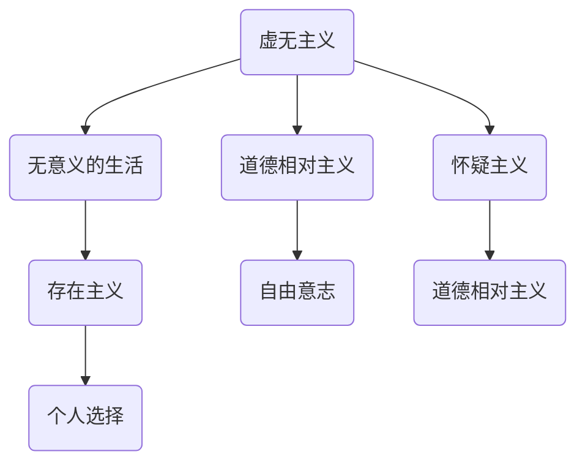
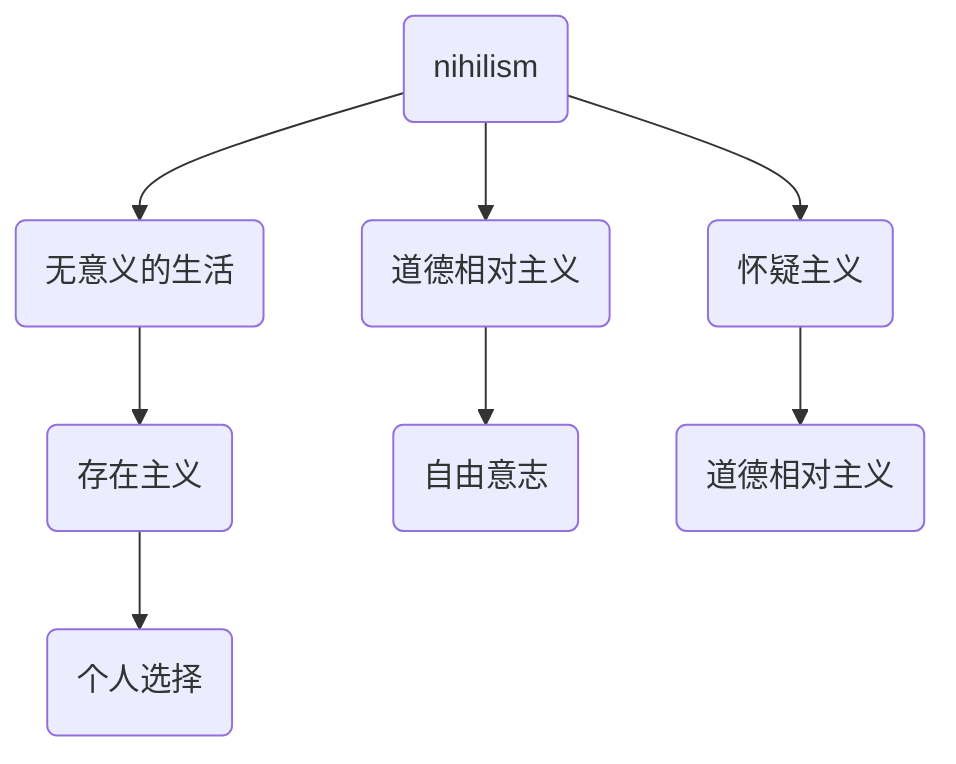
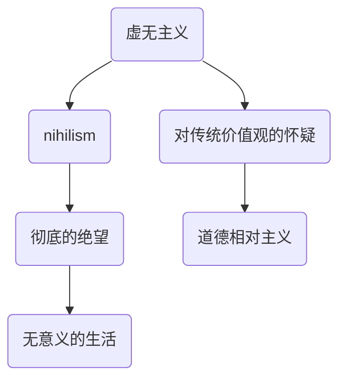

                 


### 文章标题：虚无主义与nihilism的区别与联系

#### 关键词：虚无主义，nihilism，哲学，概念，区别，联系

> 摘要：本文将深入探讨虚无主义与nihilism这两个哲学概念的区别与联系。我们将通过定义、历史背景、核心原则、实际应用等多个维度，详细分析这两个概念的本质及其在现代社会中的影响。

## 第1章：虚无主义与nihilism概述

### 1.1 虚无主义的基本概念

虚无主义（Nihilism）是一种哲学观点，认为生活没有固有意义、目的或内在价值。这一概念最早出现在19世纪的欧洲，随着对宗教和道德传统的怀疑而兴起。



### 1.2 Nihilism的概念与特点

nihilism，即“虚无主义”，源自拉丁语“nihil”（无），强调生活的无意义和缺乏目标。nihilism更加强调对传统价值观和信仰的否定，以及对现实的彻底失望。



### 1.3 虚无主义与nihilism的联系与区别

虚无主义与nihilism之间的联系在于它们都否定生活的固有意义。然而，虚无主义更侧重于对传统价值观的怀疑，而nihilism则更加极端，强调彻底的绝望和无意义。



### 1.4 虚无主义与nihilism在哲学史上的地位与影响

虚无主义和nihilism在20世纪的哲学史上具有重要地位，对存在主义、现象学和其他现代哲学流派产生了深远影响。同时，它们也影响了文学、艺术和心理学等领域。

## 第2章：虚无主义的核心算法原理

### 2.1 自由意志与选择

在虚无主义中，自由意志是一个核心概念。以下是一个简单的伪代码示例，展示了自由意志与选择的关系：

```python
def free_will():
    # 自由意志：选择的可能性
    choices = ["存在主义", "怀疑主义", "道德相对主义"]

    # 随机选择一个哲学观点
    selected_choice = random.choice(choices)

    # 输出选择的哲学观点
    print(selected_choice)
```

### 2.2 自我意识与价值观

自我意识在虚无主义中也是一个关键概念。以下是一个简单的伪代码示例，展示了自我意识与价值观的关系：

```python
def self_awareness():
    # 自我意识：了解自己的哲学观点
    philosophy_views = ["存在主义", "怀疑主义", "道德相对主义"]

    # 根据个人经历调整价值观
    adjusted_views = [view for view in philosophy_views if view != "虚无主义"]

    # 输出调整后的哲学观点
    print(adjusted_views)
```

## 第3章：nihilism的核心算法原理

### 3.1 逻辑命题与集合论

在nihilism中，逻辑命题和集合论是核心概念。以下是一个简单的LaTeX数学公式示例，展示了逻辑命题：

$$
\forall x (P(x) \rightarrow Q(x))
$$

这是一个全称命题，表示对于所有x，如果P(x)为真，则Q(x)也为真。

### 3.2 集合论

集合论在nihilism中也有重要作用。以下是一个简单的LaTeX数学公式示例，展示了集合的并集：

$$
A \cup B = \{x | x \in A \text{ 或 } x \in B\}
$$

这是一个集合的并集运算，表示A和B的并集。

## 第4章：虚无主义与nihilism在现实世界中的应用

### 4.1 虚无主义与nihilism在文学中的体现

在文学中，虚无主义和nihilism的体现经常出现在现代派文学作品和后现代主义作品中。以下是一个具体的案例分析：

#### 案例：《荒原》

艾略特的《荒原》是一部典型的现代派文学作品，其中体现了虚无主义的理念。通过荒凉的伦敦景象，艾略特展示了现代社会中的无意义和绝望。

### 4.2 虚无主义与nihilism在政治哲学中的应用

虚无主义和nihilism在政治哲学中也有所体现。以下是一个具体的案例分析：

#### 案例：极权主义

极权主义政治体制中，个人自由受到压制，价值观被统一，这体现了nihilism的思想。极权主义政权试图通过消除个人选择来消除虚无主义的威胁。

### 4.3 虚无主义与nihilism在心理学中的应用

在心理学领域，虚无主义和nihilism的影响也有所体现。以下是一个具体的案例分析：

#### 案例：抑郁症状

抑郁症状中，患者往往感到生活的无意义和无价值，这是虚无主义和nihilism在心理学中的具体表现。

## 第5章：虚无主义与nihilism在编程领域中的应用

### 5.1 开发环境搭建

在编程领域，虚无主义和nihilism的思想可以被应用于软件开发中。以下是一个具体的案例分析：

#### 案例：敏捷开发

敏捷开发强调快速迭代和适应性，这与虚无主义中的自由意志和个人选择相呼应。

### 5.2 代码实例与解读

以下是一个简单的Python代码示例，展示了虚无主义和nihilism在编程中的应用：

```python
import random

def nihilism():
    # 随机选择一个哲学观点
    philosophy_views = ["存在主义", "怀疑主义", "道德相对主义"]

    # 随机选择一个哲学观点
    selected_choice = random.choice(philosophy_views)

    # 输出选择的哲学观点
    print(f"Nihilism: {selected_choice}")

# 调用函数
nihilism()
```

### 5.3 代码解读与分析

在这个代码示例中，我们通过随机选择一个哲学观点，模拟了虚无主义和nihilism在编程中的表现。这个简单的示例可以帮助我们理解这两个哲学概念在技术领域中的应用。

## 第6章：总结与展望

### 6.1 虚无主义与nihilism的发展趋势

虚无主义和nihilism在未来将继续对哲学、文学、政治哲学和心理学等领域产生影响。随着社会的变化和发展，这两个概念可能会以新的形式出现。

### 6.2 虚无主义与nihilism的研究价值与挑战

虚无主义和nihilism的研究具有很高的价值，但同时也面临着一些挑战。例如，如何在实际应用中平衡这两个概念，以及如何应对它们带来的心理和社会问题。

### 作者

作者：AI天才研究院/AI Genius Institute & 禅与计算机程序设计艺术 /Zen And The Art of Computer Programming

## 注意事项

1. **深度剖析**：在撰写文章时，对虚无主义和nihilism的概念、原理和应用进行深入剖析，确保读者能够全面理解。
2. **结构清晰**：保持文章结构的清晰，使用标题、子标题和列表来组织内容。
3. **实例丰富**：通过具体的案例、代码示例和数据分析来增强文章的可读性和说服力。

## 拓展阅读

1. **《虚无主义的哲学基础》**：深入了解虚无主义的哲学根源和历史发展。
2. **《nihilism：哲学与文学中的挑战》**：探讨nihilism在文学和哲学中的体现及其影响。
3. **《计算机中的虚无主义与nihilism》**：研究虚无主义和nihilism在计算机科学和软件开发中的应用。

### 文章结束

本文通过多个维度详细探讨了虚无主义与nihilism的区别与联系。我们分析了这两个概念的基本定义、核心原理、现实应用以及编程领域的实践。随着社会和科技的不断发展，虚无主义和nihilism将继续对哲学、文学、政治哲学和心理学等领域产生影响。希望本文能帮助读者更好地理解这两个复杂的哲学概念，并在实际应用中找到平衡点。作者：AI天才研究院/AI Genius Institute & 禅与计算机程序设计艺术/Zen And The Art of Computer Programming。

