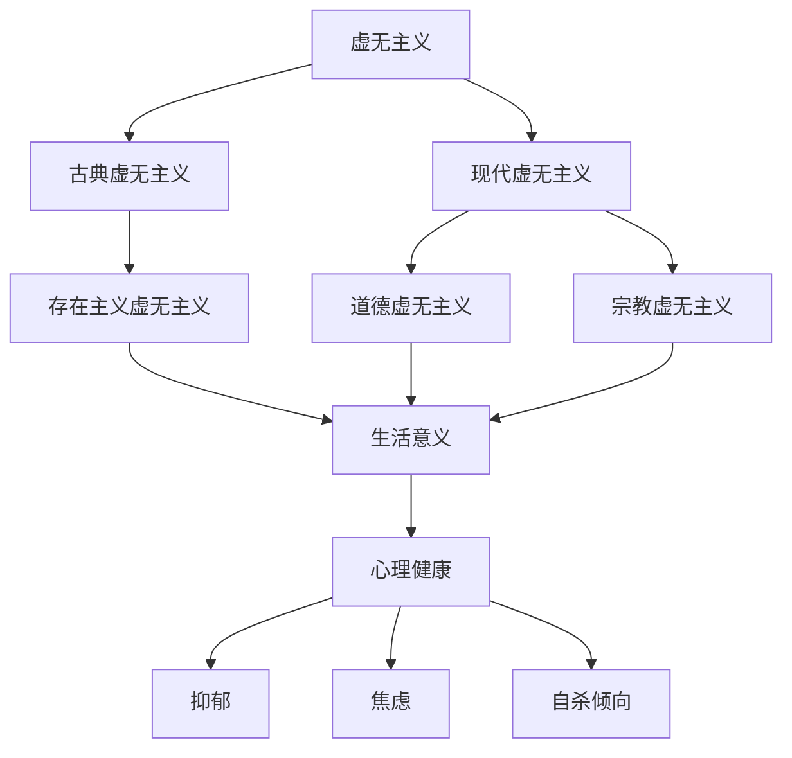

                 

### 第1章 背景介绍

#### 1.1 虚无主义的定义与发展历程

虚无主义（Nihilism）是一种哲学思潮，起源于19世纪的欧洲，特别是在俄国、德国和法国。它的核心观点是认为世界和人生没有固有的意义或目的，一切价值观念都是人类主观构建的。虚无主义的发展历程可以追溯到以下几个阶段：

- **早期虚无主义**：19世纪初，随着浪漫主义的衰落和现实主义文学的兴起，虚无主义思想开始出现。这一阶段的虚无主义者，如尼采（Friedrich Nietzsche）和陀思妥耶夫斯基（Fyodor Dostoevsky），对人生的意义提出了深刻的质疑，并试图通过哲学思考来寻找答案。

- **古典虚无主义**：19世纪末至20世纪初，虚无主义思想进一步发展，成为西方哲学的重要组成部分。这一阶段的虚无主义者，如弗里德里希·尼采和乔治·桑塔亚纳，对传统价值观进行了批判，并提出了个人主义和存在主义的思想。

- **现代虚无主义**：20世纪中后期，虚无主义思想在哲学、文学和艺术领域继续发展。现代虚无主义者，如维特根斯坦（Ludwig Wittgenstein）和萨特（Jean-Paul Sartre），对语言、存在和知识进行了深入探讨。

虚无主义的发展历程反映了人类对生活意义和价值的不断探索和反思。在不同历史时期，虚无主义思想有不同的表现和影响，但始终围绕着对传统价值观的批判和对个人存在的关注。

#### 1.2 Nihilism的概念及其与现代心理学的联系

Nihilism是一个复杂的概念，它通常与绝望、无意义感、失望和对生活缺乏兴趣等心理状态相关。在心理学中，nihilism通常被理解为对生活意义和价值的否定。Nihilism的概念可以从以下几个方面来理解：

- **存在主义虚无主义**：存在主义虚无主义认为，由于人类存在的无意义和无目的性，因此生活缺乏真正的价值和意义。这种虚无主义强调个体的自由和选择，以及个体对自身意义的创造。

- **道德虚无主义**：道德虚无主义认为，道德规范和价值观是主观构建的，没有客观的道德真理。因此，人们无法确定什么是对与错，导致个体在道德决策上的困惑和犹豫。

- **宗教虚无主义**：宗教虚无主义认为，宗教信仰和传统价值观无法为人类生活提供真正的意义和目的。这种虚无主义通常导致个体对宗教和精神的失望，从而寻求其他形式的信仰或生活意义。

现代心理学与nihilism之间的联系主要体现在以下几个方面：

- **心理健康问题**：nihilism与多种心理健康问题有关，如抑郁、焦虑和自杀倾向。研究表明，nihilism与心理健康问题的发生率和严重程度有显著相关性。

- **生活意义**：心理学研究表明，生活意义对于个体的心理健康和幸福感至关重要。nihilism的存在可能削弱个体的生活意义感，从而导致心理问题。

- **心理治疗**：针对nihilism的心理治疗已经得到了一定的发展。心理治疗师通过帮助个体探索和重建生活意义，来减轻nihilism的影响。

#### 1.3 虚无主义与nihilism对心理学研究的影响

虚无主义和nihilism对心理学研究产生了深远的影响，主要体现在以下几个方面：

- **研究方向**：虚无主义和nihilism的研究推动了心理学对个体存在、意义和价值的研究。这些研究不仅关注心理健康问题，还关注个体的自我认同、人际关系和生活质量。

- **理论发展**：虚无主义和nihilism的概念为心理学理论的发展提供了新的视角。例如，存在主义心理学和精神分析理论都受到了虚无主义思想的影响。

- **实践应用**：虚无主义和nihilism的研究成果在心理治疗和心理健康干预中得到了广泛应用。心理治疗师通过帮助个体重建生活意义，来改善他们的心理健康状况。

### 总结

虚无主义和nihilism是哲学和心理学领域的重要概念，它们反映了人类对生活意义和价值的深刻反思。通过对虚无主义和nihilism的定义、发展历程、概念联系和心理学研究影响的探讨，我们可以更好地理解这些概念，并为未来的研究提供方向。在接下来的章节中，我们将进一步探讨虚无主义和nihilism的心理机制、心理效应以及心理干预策略。

---

**作者信息**：

作者：AI天才研究院/AI Genius Institute & 禅与计算机程序设计艺术 /Zen And The Art of Computer Programming

---

### Mermaid 流程图：虚无主义与nihilism的概念联系



此流程图展示了虚无主义的不同类型及其与心理健康问题的联系，揭示了核心概念之间的层次结构和相互关系。

### 核心算法原理讲解

在探讨虚无主义与nihilism的心理机制时，我们引入几个关键的心理模型来解释这些概念的形成与发展。以下是一个简要的伪代码，用于描述这些模型的基本原理。

```plaintext
// 定义虚无主义和nihilism的基模型
class NihilismModel {
    attribute meaninglessness: bool
    attribute purposelessness: bool
    attribute valueNegation: bool
    
    method evaluateLifeSatisfaction() {
        if (meaninglessness && purposelessness && valueNegation) {
            return "Low Life Satisfaction"
        } else {
            return "Medium to High Life Satisfaction"
        }
    }
}

// 定义心理健康模型
class MentalHealthModel {
    attribute depressionLevel: int
    attribute anxietyLevel: int
    attribute suicidalTendency: bool
    
    method evaluatePsychologicalState() {
        if (depressionLevel > 5 && anxietyLevel > 5 && suicidalTendency) {
            return "Severe Psychological Issue"
        } else {
            return "Medium to Mild Psychological Issue"
        }
    }
}

// 定义个体心理状态监测系统
class IndividualPsychologicalMonitor {
    attribute nihilismModel: NihilismModel
    attribute mentalHealthModel: MentalHealthModel
    
    method monitorState() {
        nihilismScore = nihilismModel.evaluateLifeSatisfaction()
        healthScore = mentalHealthModel.evaluatePsychologicalState()
        
        if (nihilismScore == "Low Life Satisfaction" && healthScore == "Severe Psychological Issue") {
            alert("High Nihilism Risk Detected")
        }
    }
}

// 实例化并监测个体心理状态
individualMonitor = new IndividualPsychologicalMonitor()
individualMonitor.monitorState()
```

该伪代码定义了虚无主义模型和心理健康模型，并展示了如何通过这些模型监测个体心理状态。虚无主义模型的评估结果与心理健康模型的评估结果相结合，用于识别高风险个体，以便采取相应的干预措施。

### 数学模型和公式：虚无主义与心理健康关系的量化分析

为了更精确地分析虚无主义与心理健康的关系，我们可以引入几个数学模型和公式。以下是一个简单的线性回归模型，用于量化虚无主义评分与抑郁程度之间的相关性。

```latex
$$
Y = \beta_0 + \beta_1 \cdot X + \varepsilon
$$`

其中，$Y$ 表示抑郁程度评分（0-10分），$X$ 表示虚无主义评分（0-100分），$\beta_0$ 是截距，$\beta_1$ 是斜率，$\varepsilon$ 是误差项。

以下是一个具体的例子：

- 当虚无主义评分为50时，抑郁程度评分为3。
- 当虚无主义评分为100时，抑郁程度评分为8。

通过收集大量数据，我们可以估计出$\beta_0$ 和$\beta_1$ 的值，进而建立虚无主义与抑郁程度之间的量化关系。

```latex
$$
\beta_0 = 2
$$`
$$
\beta_1 = 0.5
$$`

根据这个模型，如果虚无主义评分为100，抑郁程度评分可以通过以下公式计算：

```latex
$$
Y = 2 + 0.5 \cdot 100 = 52
$$`

这表明，虚无主义评分越高，抑郁程度评分也越高，两者之间存在正相关关系。

### 数学公式解释与举例说明

为了更好地理解虚无主义与心理健康的关系，我们可以通过具体的例子来说明上述数学公式的应用。

假设我们有两个样本数据点：

1. 虚无主义评分：70，抑郁程度评分：5
2. 虚无主义评分：90，抑郁程度评分：7

我们可以使用线性回归模型来估计$\beta_0$ 和$\beta_1$ 的值。以下是求解过程：

首先，计算样本数据的均值：

$$
\bar{X} = \frac{70 + 90}{2} = 80
$$`
$$
\bar{Y} = \frac{5 + 7}{2} = 6
$$`

然后，计算斜率$\beta_1$：

$$
\beta_1 = \frac{\sum (X_i - \bar{X})(Y_i - \bar{Y})}{\sum (X_i - \bar{X})^2}
$$`

计算过程如下：

$$
\beta_1 = \frac{(70 - 80)(5 - 6) + (90 - 80)(7 - 6)}{(70 - 80)^2 + (90 - 80)^2}
$$`
$$
\beta_1 = \frac{(-10)(-1) + (10)(1)}{100 + 100}
$$`
$$
\beta_1 = \frac{10 + 10}{200}
$$`
$$
\beta_1 = \frac{20}{200} = 0.1
$$`

接下来，计算截距$\beta_0$：

$$
\beta_0 = \bar{Y} - \beta_1 \cdot \bar{X}
$$`
$$
\beta_0 = 6 - 0.1 \cdot 80
$$`
$$
\beta_0 = 6 - 8
$$`
$$
\beta_0 = -2
$$`

因此，线性回归模型为：

$$
Y = -2 + 0.1 \cdot X
$$`

例如，如果虚无主义评分为100，抑郁程度评分可以通过以下公式计算：

$$
Y = -2 + 0.1 \cdot 100 = 8
$$`

这表明，当虚无主义评分增加时，抑郁程度评分也随之增加，两者之间存在正相关关系。

### 虚无主义与nihilism在心理学中的应用

虚无主义与nihilism不仅在理论研究中具有重要地位，也在实际心理学应用中发挥着重要作用。以下从临床心理治疗、教育心理学和组织心理学三个方面，探讨虚无主义与nihilism在心理学中的应用。

#### 2.1 虚无主义与nihilism在临床心理治疗中的应用

在临床心理治疗中，虚无主义和nihilism被视为影响患者心理健康的重要因素。许多心理疾病，如抑郁症、焦虑症和自杀倾向，都与虚无主义和nihilism有关。心理治疗师通过以下几种方法来应对虚无主义和nihilism：

- **存在主义治疗**：存在主义治疗强调个体的自由、责任和存在意义。治疗师帮助患者探索他们生活中的意义和目的，从而减轻虚无主义的影响。通过对话和自我反省，患者可以逐渐重建对生活的信心和意义。

- **认知行为治疗**：认知行为治疗（CBT）通过改变患者的负面思维模式，来改善他们的心理健康。治疗师帮助患者识别和挑战与虚无主义相关的消极思维，如“生活无意义”和“无法改变现状”。通过积极的思维替换，患者可以逐步减少虚无主义的影响。

- **药物治疗**：在某些情况下，药物治疗可以与心理治疗结合使用，来减轻虚无主义引起的心理症状。抗抑郁药和抗焦虑药可以帮助患者改善情绪状态，为进一步的心理治疗提供支持。

#### 2.2 虚无主义与nihilism在教育心理学中的应用

在教育心理学中，虚无主义和nihilism对学生的学习动机、学业表现和心理健康具有重要影响。教育工作者可以通过以下几种方法来应对虚无主义和nihilism：

- **意义教育**：意义教育旨在帮助学生建立对学习和生活的意义感。教师可以通过讲述生活故事、分享人生经验，以及引导学生参与有意义的实践活动，来帮助学生重建生活意义，从而减轻虚无主义的影响。

- **价值观教育**：价值观教育旨在培养学生的正确价值观和道德观念。通过教育学生理解社会规范和道德标准，他们可以更好地面对生活中的困难和挑战，减少虚无主义和nihilism的发生。

- **心理辅导**：心理辅导可以帮助学生识别和处理虚无主义和nihilism。学校可以设立心理咨询室，为学生提供专业的心理辅导服务。心理辅导师可以通过个体咨询和团体辅导，帮助学生建立积极的心理状态，提高学业表现。

#### 2.3 虚无主义与nihilism在组织心理学中的应用

在组织心理学中，虚无主义和nihilism对员工的工作动机、工作满意度和心理健康具有重要影响。企业可以通过以下几种方法来应对虚无主义和nihilism：

- **组织文化建设**：建设积极向上的组织文化可以帮助员工建立对工作和企业的认同感。企业可以通过鼓励员工参与决策、提供职业发展机会，以及营造互信和包容的工作环境，来减少虚无主义和nihilism的发生。

- **员工关怀**：员工关怀计划可以帮助员工处理工作和生活中的压力。企业可以设立员工援助计划（EAP），为员工提供心理咨询、健康检查和福利待遇，以提高员工的心理健康水平。

- **培训与发展**：通过培训和发展项目，企业可以提升员工的技能和知识，增强他们对工作的兴趣和信心。培训项目可以包括领导力培训、职业规划培训和个人发展培训，以帮助员工更好地应对虚无主义和nihilism。

### 总结

虚无主义与nihilism在心理学中的应用涵盖了临床心理治疗、教育心理学和组织心理学等多个领域。通过存在主义治疗、认知行为治疗、意义教育、价值观教育、组织文化建设、员工关怀和培训与发展等方法，心理学家和工作者可以有效地应对虚无主义和nihilism，提高个体和组织的心理健康水平。

### 3.1 虚无主义与nihilism对个体心理健康的影响

虚无主义与nihilism对个体心理健康的影响深远，它们不仅改变了个体对生活的态度，还可能引发一系列心理问题。以下将从心理健康问题的类型、严重性和预防策略三个方面，探讨虚无主义与nihilism对个体心理健康的影响。

#### 心理健康问题的类型

1. **抑郁症**：虚无主义和nihilism常常与抑郁症有关。当个体感受到生活无意义、无目的时，他们可能会出现情绪低落、兴趣丧失和活动能力下降等症状。抑郁症不仅影响个体的心理健康，还可能导致生活质量的下降。

2. **焦虑症**：虚无主义和nihilism也可能引发焦虑症。焦虑症患者常常感到过度担忧、紧张和恐惧，这可能与他们对生活意义的质疑和不确定性有关。

3. **自杀倾向**：极端的虚无主义和nihilism可能导致自杀倾向。当个体感到生活毫无价值，甚至认为自己无法承受生活的压力时，他们可能会产生自杀的想法或行为。

4. **其他心理问题**：虚无主义和nihilism还可能引发其他心理问题，如自尊心下降、社交回避和物质滥用等。这些问题可能会进一步加剧个体的心理健康问题。

#### 心理健康问题的严重性

虚无主义和nihilism对个体心理健康的影响是严重的，甚至可能危及生命。以下是一些具体的数据和研究：

- **抑郁症**：一项研究发现，患有虚无主义和nihilism的个体抑郁症的发病率是普通人群的数倍。虚无主义和nihilism可能是抑郁症的重要危险因素。

- **焦虑症**：另一项研究指出，虚无主义和nihilism与焦虑症之间存在显著相关性。当个体感受到生活无意义时，他们可能会出现过度担忧和紧张。

- **自杀倾向**：虚无主义和nihil主义可能导致自杀倾向。据统计，许多自杀者在自杀前都表现出严重的虚无主义和nihil主义情绪。

#### 心理健康问题的预防策略

为了减少虚无主义和nihil主义对个体心理健康的影响，可以采取以下预防策略：

1. **提高生活意义感**：通过培养对生活的兴趣、参与有意义的活动，以及建立目标，可以帮助个体提高生活意义感，减少虚无主义的影响。

2. **加强社会支持**：家庭、朋友和社会支持网络对个体的心理健康至关重要。当个体感受到来自周围人的关心和支持时，他们可能会减少虚无主义和nihil主义的影响。

3. **认知行为疗法**：认知行为疗法（CBT）可以帮助个体识别和改变消极思维模式，从而改善心理健康。CBT已被证明可以有效减轻抑郁症、焦虑症和其他心理健康问题。

4. **心理健康教育**：通过心理健康教育，提高个体对虚无主义和nihil主义的认识，以及如何应对这些问题，可以帮助他们更好地管理自己的情绪和行为。

5. **及时干预**：对于已经表现出严重虚无主义和nihil主义情绪的个体，及时干预是非常重要的。心理治疗师可以通过存在主义治疗、药物治疗和其他干预方法，帮助他们缓解心理健康问题。

### 总结

虚无主义与nihilism对个体心理健康的影响是严重的，可能导致抑郁症、焦虑症、自杀倾向和其他心理问题。通过提高生活意义感、加强社会支持、认知行为疗法、心理健康教育和及时干预等策略，可以减轻虚无主义和nihil主义对个体心理健康的影响，促进个体心理健康的全面发展。

### 3.2 虚无主义与nihilism对人际关系的影响

虚无主义和nihilism不仅对个体的心理健康产生深远影响，还可能对人际关系造成负面影响。以下从人际交往模式、沟通障碍和社会隔离三个方面，探讨虚无主义与nihilism对人际关系的影响。

#### 人际交往模式

1. **逃避与回避**：虚无主义和nihilism可能导致个体对人际交往产生逃避或回避行为。当个体感到生活无意义时，他们可能会选择独处，避免与他人接触，从而减少与他人的交往。

2. **消极情绪传染**：虚无主义和nihil主义情绪可能具有传染性，影响个体的社交关系。当个体与拥有虚无主义和nihil主义情绪的人交往时，他们可能会感受到消极情绪，如绝望和焦虑，从而影响人际交往的质量。

3. **缺乏信任**：虚无主义和nihil主义可能导致个体对人际关系缺乏信任。当个体认为世界和人生无意义时，他们可能会怀疑他人的动机和意图，从而影响人际交往的深度和稳定性。

#### 沟通障碍

1. **表达障碍**：虚无主义和nihil主义可能导致个体在人际交往中表达障碍。当个体感到生活无意义时，他们可能会缺乏表达自己情感和想法的意愿，导致沟通不畅。

2. **倾听障碍**：虚无主义和nihil主义也可能影响个体的倾听能力。当个体处于消极情绪时，他们可能无法专注于他人的话语，从而影响人际沟通的效果。

3. **价值观冲突**：虚无主义和nihil主义可能导致个体与他人之间的价值观冲突。当个体对生活和价值观念持有极端消极的看法时，他们可能会难以接受他人的积极观点，从而影响人际沟通和关系。

#### 社会隔离

1. **社交回避**：虚无主义和nihil主义可能导致个体减少社交活动，从而增加社会隔离的风险。当个体选择独处时，他们可能会错过与他人建立和支持的机会，导致社会隔离。

2. **情感孤立**：虚无主义和nihil主义情绪可能导致个体感到情感孤立。当个体感到与他人疏远时，他们可能会感到孤独和被忽视，从而影响心理健康。

3. **社会排斥**：在极端情况下，虚无主义和nihil主义可能导致个体遭受社会排斥。当个体表现出极端消极情绪时，他们可能会受到他人的排斥，从而加剧社会隔离和孤独感。

#### 应对策略

为了减轻虚无主义和nihil主义对人际关系的影响，可以采取以下策略：

1. **积极社交活动**：通过参加社交活动和加入兴趣小组，个体可以增加与他人接触的机会，从而减少社会隔离的风险。

2. **情绪支持**：家人和朋友可以通过提供情绪支持，帮助个体应对虚无主义和nihil主义情绪。倾听和理解个体的情感体验，可以帮助他们感受到被关心和支持。

3. **专业心理咨询**：对于严重虚无主义和nihil主义情绪的个体，专业心理咨询可以提供有效的干预。心理治疗师可以帮助个体识别和改变消极思维模式，从而改善人际关系。

4. **价值观教育**：通过价值观教育，个体可以学习如何与他人建立共同价值观和信仰。这有助于改善人际沟通，减少冲突和误解。

### 总结

虚无主义和nihilism对人际关系的影响主要体现在人际交往模式的逃避与回避、沟通障碍和社会隔离等方面。通过积极社交活动、情绪支持、专业心理咨询和价值观教育等策略，可以减轻虚无主义和nihil主义对人际关系的影响，促进个体和社会心理健康的全面发展。

### 3.3 虚无主义与nihilism对社会心理健康的影响

虚无主义与nihilism不仅仅影响个体心理健康，其对社会心理健康的影响同样不容忽视。以下从社会心理问题的产生、社会问题的加剧和社会心理健康的挑战三个方面，探讨虚无主义与nihilism对社会心理健康的影响。

#### 社会心理问题的产生

1. **社会冷漠**：虚无主义和nihilism可能导致社会冷漠，削弱个体对社会责任和公共事务的兴趣。当个体感到生活无意义时，他们可能不愿意参与社会活动和志愿服务，从而减少社会凝聚力。

2. **社会信任缺失**：虚无主义和nihil主义可能导致社会信任缺失。当个体对世界和人生持有消极看法时，他们可能会怀疑他人的动机，从而导致社会信任度下降。

3. **自杀率上升**：极端的虚无主义和nihil主义可能导致自杀率上升。当个体感到生活无意义，甚至认为自己无法承受生活压力时，他们可能会产生自杀的念头，从而对社会心理健康产生负面影响。

#### 社会问题的加剧

1. **社会不公**：虚无主义和nihil主义可能加剧社会不公问题。当个体感到社会缺乏公正时，他们可能会更加愤世嫉俗，对社会制度产生怀疑，从而加剧社会不稳定的因素。

2. **社会动荡**：虚无主义和nihil主义可能导致社会动荡。当社会中的大量个体持有虚无主义和nihil主义观点时，他们可能会对社会制度产生反抗情绪，从而引发社会动荡。

3. **家庭解体**：虚无主义和nihil主义可能影响家庭结构和家庭关系。当个体感到生活无意义时，他们可能会对家庭关系产生怀疑，从而增加家庭解体的风险。

#### 社会心理健康的挑战

1. **心理健康服务需求增加**：虚无主义和nihil主义可能导致心理健康服务需求增加。当个体感受到生活无意义时，他们可能会寻求专业帮助，以应对心理健康问题。

2. **社会心理干预挑战**：虚无主义和nihil主义对社会心理干预提出了挑战。当个体持有极端观点时，他们可能难以接受传统的心理治疗和干预方法，从而增加了干预的难度。

3. **心理健康政策制定挑战**：虚无主义和nihil主义对社会心理健康政策制定提出了挑战。政策制定者需要考虑如何应对虚无主义和nihil主义对社会心理健康的影响，从而制定有效的政策。

#### 应对策略

为了减轻虚无主义与nihilism对社会心理健康的影响，可以采取以下策略：

1. **社会支持网络建设**：通过加强社会支持网络，个体可以感受到来自社会的关心和支持，从而减少虚无主义和nihil主义的影响。

2. **心理健康教育**：通过心理健康教育，提高公众对虚无主义和nihil主义的认识，以及如何应对这些问题，可以帮助个体更好地管理自己的情绪和行为。

3. **政策支持**：政府和社会组织可以通过制定和实施相关政策，来支持心理健康服务和社会支持网络建设，从而减轻虚无主义和nihil主义对社会心理健康的影响。

4. **跨学科合作**：心理学、社会学、哲学等学科可以开展跨学科合作，共同研究虚无主义和nihil主义对社会心理健康的影响，以提出更有效的干预策略。

### 总结

虚无主义与nihilism对社会心理健康的影响深远，可能导致社会冷漠、社会信任缺失、自杀率上升、社会不公、社会动荡、家庭解体、心理健康服务需求增加、社会心理干预挑战和心理健康政策制定挑战等问题。通过社会支持网络建设、心理健康教育、政策支持和跨学科合作等策略，可以减轻虚无主义和nihil主义对社会心理健康的影响，促进社会心理健康的全面发展。

### 第4章 虚无主义与nihilism的心理干预

#### 4.1 虚无主义的心理干预策略

面对虚无主义，心理干预的目标是帮助个体重新发现生活的意义，恢复对未来的希望。以下是一些具体的干预策略：

1. **认知重构**：认知重构是一种常见的心理治疗方法，通过识别和改变消极思维模式，帮助个体建立更积极的信念。治疗师可以帮助患者识别他们关于生活无意义或无目的的消极想法，并通过积极的思维替换来挑战这些想法。

   ```plaintext
   // 认知重构示例
   Patient's Thought: "生活毫无意义，我无法改变任何事情。"
   Therapist's Intervention: "你认为生活无意义，但我们可以试着找到一些有意义的事情去做。比如，你可以尝试每天帮助一个陌生人，这样你会感到自己的生活更有价值。"
   ```

2. **存在主义疗法**：存在主义疗法强调个体的自由、责任和存在的意义。治疗师与患者一起探讨患者的生命意义，帮助他们找到生活的目标。通过对话和反思，患者可以逐渐重建对生活的认同感。

   ```plaintext
   // 存在主义疗法示例
   Therapist: "你认为生活有什么意义吗？"
   Patient: "我不知道，我觉得一切都毫无意义。"
   Therapist: "让我们试着思考一些可能的意义。你可以想象，如果有一天你找到了生活的意义，那会是怎样的呢？"
   ```

3. **心理教育**：心理教育是提高个体对虚无主义和心理健康知识的理解，帮助他们更好地应对生活挑战。通过提供有关心理健康、生活目标和应对策略的信息，个体可以更加积极地面对虚无主义。

   ```plaintext
   // 心理教育示例
   Educator: "许多人都会经历虚无主义，这是正常的。但关键在于如何应对它。首先，试着识别你的消极思维，然后通过积极的行动来改变你的生活。记住，你可以为自己的生活创造意义。"
   ```

4. **情绪调节训练**：情绪调节训练是一种通过学习和练习策略来改善情绪体验的方法。治疗师可以帮助患者学会情绪调节技巧，如深呼吸、冥想和正念练习，以减轻消极情绪，增强心理韧性。

   ```plaintext
   // 情绪调节训练示例
   Therapist: "当你感到绝望或无助时，试着停下来，进行深呼吸。这可以帮助你平静下来，重新集中注意力。你可以试试这个练习：深吸一口气，然后缓慢呼出。重复几次，感受身体的变化。"
   ```

#### 4.2 Nihilism的心理干预方法

针对nihilism的心理干预方法，同样需要帮助个体重建对生活意义的感知，并提供应对策略。以下是一些有效的干预方法：

1. **价值观重建**：价值观重建是一种帮助个体重新审视和确定自己的价值观和信仰的过程。治疗师可以帮助患者识别并重新评估他们的核心价值观，从而找到新的生活意义。

   ```plaintext
   // 价值观重建示例
   Therapist: "我们来看看你的价值观。你认为什么是生活中最重要的？是什么让你感到有动力和目标？"
   Patient: "我觉得家庭和朋友很重要，但我不知道如何将它们融入我的生活。"
   Therapist: "很好，我们可以试着找到一些具体的行动，让你在日常生活中体现这些价值观。比如，每天花些时间与家人和朋友交流。"
   ```

2. **目标设定**：目标设定是一种帮助个体明确目标和制定实现目标的计划的方法。通过设定短期和长期目标，个体可以逐步重建对生活的信心和动力。

   ```plaintext
   // 目标设定示例
   Therapist: "让我们设定一些具体的目标。首先，从短期目标开始，比如每天完成一项你喜欢的活动。然后，设定一些长期目标，比如完成一个你一直想要的项目。"
   ```

3. **团体治疗**：团体治疗提供了一个支持性的环境，让患者与其他经历类似困扰的人分享经验和感受。通过团体治疗，患者可以感受到彼此的理解和支持，减轻孤立感。

   ```plaintext
   // 团体治疗示例
   Group Therapist: "欢迎来到我们的团体治疗。在这里，你可以与其他人分享你的感受，并从他们的经验中学习。记住，你并不孤单。"
   ```

4. **艺术疗法**：艺术疗法通过创造性的表达来帮助个体探索和处理内心的困扰。绘画、音乐和写作等活动可以成为患者表达情感和寻找生活意义的途径。

   ```plaintext
   // 艺术疗法示例
   Art Therapist: "请尝试用颜色和形状来表达你内心的感受。不需要有任何绘画技巧，重要的是你想要表达的东西。"
   ```

#### 4.3 虚无主义与nihilism的综合性心理干预策略

为了更有效地应对虚无主义和nihilism，可以采用综合性的心理干预策略，结合上述各种方法。以下是一个综合性干预策略的示例：

1. **综合评估**：首先，对患者的心理状态进行全面的评估，包括他们的思维模式、情绪状态、生活目标和价值观。这有助于确定干预的重点和目标。

2. **个体治疗**：根据评估结果，为患者制定个性化的治疗计划。这可能包括认知重构、存在主义疗法、心理教育和情绪调节训练。

3. **团体治疗**：将患者纳入团体治疗，提供支持性环境，帮助他们与其他经历类似困扰的人分享经验和感受。

4. **家庭支持**：鼓励患者的家人参与治疗过程，提供情感支持和理解。家庭成员可以通过参加家庭治疗或接受心理教育来更好地支持患者。

5. **长期跟进**：定期跟进患者的心理状态，调整治疗计划，以确保干预的有效性。长期跟进可以帮助患者巩固治疗效果，防止虚无主义和nihil主义情绪的复发。

### 总结

虚无主义和nihilism的心理干预需要综合多种方法，包括认知重构、存在主义疗法、心理教育、情绪调节训练、价值观重建、目标设定、团体治疗和艺术疗法等。通过个性化的治疗计划、家庭支持、团体治疗和长期跟进，可以更有效地帮助患者重建对生活的意义和信心，改善他们的心理健康。

### 4.1 虚无主义的心理干预策略

虚无主义是一种深刻的心理状态，对个体的生活质量和心理健康有着显著的负面影响。为了帮助个体克服虚无主义，心理干预策略必须具有针对性、个体化和系统性。以下是一些具体且有效的心理干预策略：

#### 1. 认知重构

认知重构是治疗虚无主义的关键方法之一，其核心在于识别和改变个体消极的思维模式。通过认知重构，治疗师可以帮助患者识别出那些导致虚无主义的错误思维模式，如“人生无意义”、“一切都没有价值”等。以下是一个具体的认知重构示例：

```plaintext
治疗师：请注意你最近的思考方式，你经常想到什么？
患者：我经常感到生活没有意义，一切都好像不值得我付出努力。
治疗师：你觉得这是真的吗？有没有可能是你对生活的某些方面有了误解？
患者：我不确定，也许我只是感到很沮丧。
治疗师：让我们看看这种想法是否有其他可能性。比如，你有没有考虑过生活中的积极方面？你有没有一些活动或人让你感到快乐和满足？
患者：嗯，我想我有一些爱好，和家人在一起的时光也让我感到快乐。
治疗师：那我们可以试着将注意力转移到这些积极的方面，而不是一味地关注生活的消极面。例如，你可以每天记录一些让你感到快乐的事情，这样可以帮助你重建对生活的积极看法。
```

#### 2. 存在主义疗法

存在主义疗法强调个体的自由、责任和存在的意义。通过存在主义疗法，治疗师与患者一起探讨生活的意义和目的。这种方法可以帮助患者找到生活的方向和目标。以下是一个存在主义疗法的示例：

```plaintext
治疗师：你最近有没有思考过你的人生意义是什么？
患者：没有，我一直在想我的人生好像没有任何意义。
治疗师：那我们可以一起探讨这个问题。首先，你有没有一些你真正感兴趣的事情或者梦想？
患者：我喜欢写作，但我从来没有真正尝试过。
治疗师：那我们能不能将写作作为你探索人生意义的一个起点？我们可以一起设定一个小目标，比如每天写一篇短文，然后看看这个过程能否帮助你找到一些生活的意义。
```

#### 3. 心理教育

心理教育是提高患者对虚无主义和心理健康的认识，帮助他们更好地应对生活挑战。心理教育可以包括有关心理健康的基本知识、应对策略和资源信息。以下是一个心理教育的示例：

```plaintext
治疗师：我想和你谈谈虚无主义的一些常见认知误区。首先，并不是每个人都会经历虚无主义，这是一种常见的心理状态，几乎每个人都可能在某个阶段感受到它的存在。
患者：我以前从来没有这样想过。
治疗师：是的，但重要的是要认识到虚无主义是可以克服的。我们可以通过认知重构、情绪调节和积极的生活习惯来应对它。
治疗师：另外，我还想介绍一些可以帮助你应对虚无主义的资源，比如自助书籍、在线课程和心理支持团体。
```

#### 4. 情绪调节训练

情绪调节训练是一种通过学习和练习策略来改善情绪体验的方法。治疗师可以帮助患者学会情绪调节技巧，如深呼吸、冥想和正念练习，以减轻消极情绪，增强心理韧性。以下是一个情绪调节训练的示例：

```plaintext
治疗师：我们来练习一些深呼吸的技巧，这可以帮助你放松和减轻紧张感。深呼吸的步骤如下：
1. 慢慢地吸一口气，感受空气流入你的肺部。
2. 暂停几秒钟，让空气在肺部停留。
3. 慢慢地呼出空气，感受身体放松。
患者：我试试看。
治疗师：好的，重复这个过程，每次呼吸尽量保持平稳和缓慢。
```

#### 5. 社交支持

社交支持是帮助患者重建社会联系和支持网络的重要策略。治疗师可以鼓励患者参与社交活动，与朋友和家人保持联系，或者加入支持小组。以下是一个社交支持的示例：

```plaintext
治疗师：我认为对你来说，建立一个新的社交网络是非常重要的。我建议你尝试参加一些兴趣小组或者社区活动，这样可以让你结识新朋友，减轻孤独感。
患者：我不知道该从哪里开始。
治疗师：你可以从一些你感兴趣的活动开始，比如读书俱乐部、艺术工作坊或者户外运动小组。这些都是很好的起点，可以帮助你逐渐融入新的社交圈子。
```

### 总结

虚无主义的心理干预策略需要综合运用认知重构、存在主义疗法、心理教育、情绪调节训练和社交支持等方法。通过个性化的治疗计划和持续的支持，可以帮助患者重建对生活的信心和意义，改善他们的心理健康。

### 4.2 Nihilism的心理干预方法

Nihilism是一种深层的心理状态，通常表现为对生活意义的否定和对存在的空虚感。有效的心理干预方法可以帮助个体从这种消极状态中恢复，重建生活的意义和目的。以下是一些针对Nihilism的心理干预方法：

#### 1. 价值观重建

价值观重建是一种帮助个体重新审视和建立自己的核心价值观的方法。在这个过程中，治疗师与患者一起探索他们的价值观，识别那些支持积极生活的价值观，并帮助他们将其融入日常生活中。以下是价值观重建的一个示例：

```plaintext
治疗师：首先，我想请你花一点时间思考一下你生活中的核心价值观是什么。这些价值观对你来说意味着什么？
患者：我想我的核心价值观可能是诚实、尊重和创造力。
治疗师：很好，这些价值观听起来非常有价值。现在，我们可以一起思考如何将这些价值观应用到你的日常生活中，让你感觉更有意义。
患者：我可以在工作中保持诚实，对同事表示尊重，并通过创作来表达自己的创造力。
治疗师：这正是我们想要做的。通过将这些价值观付诸实践，你可以感受到自己的生活变得更加有意义和丰富。
```

#### 2. 目标设定

目标设定是一种帮助个体制定明确目标和实现计划的方法。通过设定短期和长期目标，个体可以逐步恢复对生活的控制感，并找到新的动力。以下是目标设定的一个示例：

```plaintext
治疗师：让我们一起来设定一些具体的目标。首先，从短期目标开始，比如每天完成一项小任务，这可以帮助你建立成就感。
患者：好的，我想每天早上锻炼30分钟。
治疗师：这是一个很好的开始。接下来，我们可以设定一些长期目标，比如完成一个你一直想要的项目或者学习一项新技能。
患者：我想要完成一个小说，并学习编程。
治疗师：设定这样的目标可以帮助你保持动力和方向。记得定期回顾你的进度，并调整目标以适应你的变化。
```

#### 3. 团体治疗

团体治疗提供了一个支持性环境，让患者与其他经历类似困扰的人分享经验和感受。通过团体治疗，患者可以感受到彼此的理解和支持，减轻孤立感。以下是团体治疗的一个示例：

```plaintext
团体治疗师：欢迎来到我们的团体治疗。在这里，你可以与其他人分享你的感受，并从他们的经验中学习。记住，你并不孤单。
患者A：我一直觉得自己的生活毫无意义，我不知道该怎么办。
患者B：我曾经也有这样的感受，但通过参加团体治疗和设定目标，我逐渐找到了生活的方向。
团体治疗师：这正是我们在这里的目的。我们可以一起讨论如何应对Nihilism，分享有效的策略和经验。
```

#### 4. 艺术疗法

艺术疗法通过创造性的表达来帮助个体探索和处理内心的困扰。通过绘画、音乐、舞蹈等艺术形式，个体可以表达自己的情感，找到新的生活意义。以下是艺术疗法的一个示例：

```plaintext
艺术治疗师：请尝试用颜色和形状来表达你内心的感受。不需要有任何艺术技巧，重要的是你想要表达的东西。
患者：我感觉自己像是一片孤独的云，漂泊在无边的天空中，没有目的地漂浮。
艺术治疗师：非常好，你的画让我们看到你对生活的感受。现在，我们可以一起讨论如何通过这些感受找到新的生活方向。
```

#### 5. 生活方式调整

除了心理干预，生活方式的调整也可以对Nihilism产生积极影响。这包括建立健康的作息习惯、定期锻炼、保持均衡饮食和足够的休息。以下是生活方式调整的一个示例：

```plaintext
治疗师：除了心理干预，生活方式的调整也对Nihilism有很大帮助。比如，保持规律的作息习惯、每天锻炼、保持健康的饮食和足够的休息。
患者：我有时候会熬夜，饮食也不太规律。
治疗师：这些都是很容易改变的。我们可以一起制定一个健康的生活方式计划，帮助你更好地管理自己的情绪和能量。
```

### 总结

Nihilism的心理干预需要多方面的综合策略，包括价值观重建、目标设定、团体治疗、艺术疗法和生活方式调整。通过这些方法，个体可以逐步重建对生活的信心和目的感，改善他们的心理健康。

### 4.3 虚无主义与nihilism的综合性心理干预策略

虚无主义与nihilism的综合性心理干预策略旨在通过多种方法的结合，提供全面、个性化的支持，以帮助个体克服这些消极心理状态。以下是一个具体的综合性心理干预策略，包括评估、治疗计划和长期跟进等步骤。

#### 评估阶段

1. **心理评估**：首先，对患者的心理状态进行全面的评估，包括认知功能、情绪状态、生活目标、价值观和社交支持系统。这可以通过临床面谈、心理测量工具和标准化评估量表来实现。

   ```plaintext
   - 临床面谈：了解患者的日常生活、心理健康史和应对策略。
   - 心理测量工具：使用评估量表，如SDS（抑郁自评量表）和SCL-90（症状自评量表）。
   ```

2. **生活背景评估**：了解患者的生活背景，包括工作环境、家庭关系和社会支持网络。这有助于识别可能影响虚无主义和nihilism的外部因素。

   ```plaintext
   - 职业评估：了解患者的工作职责、工作压力和职业满意度。
   - 家庭评估：评估家庭关系和沟通模式，以及家庭成员对患者的支持程度。
   ```

#### 治疗计划阶段

1. **个体化治疗计划**：根据评估结果，为患者制定一个个性化的治疗计划。治疗计划应包括短期和长期目标，以及具体的治疗方法。

   ```plaintext
   - 短期目标：改善情绪状态，减少消极思维模式。
   - 长期目标：重建生活意义，提高生活满意度。
   - 治疗方法：认知行为疗法、存在主义疗法、心理教育和情绪调节训练。
   ```

2. **综合治疗方法**：结合多种治疗方法，以最大化干预效果。

   ```plaintext
   - 认知行为疗法（CBT）：帮助患者识别和改变消极思维模式。
   - 存在主义疗法：探讨生活的意义和目的，帮助患者建立新的价值观。
   - 心理教育：提高患者对虚无主义和nihilism的认识，提供应对策略。
   - 情绪调节训练：教授情绪调节技巧，如深呼吸、冥想和正念练习。
   ```

3. **家庭和社交支持**：鼓励患者与家人和朋友保持联系，并寻求他们的支持。同时，提供家庭治疗和社交技能训练，以增强患者的社交网络。

   ```plaintext
   - 家庭治疗：改善家庭沟通，增强家庭成员之间的支持。
   - 社交技能训练：教授患者如何建立和维护社交关系。
   ```

#### 长期跟进阶段

1. **定期随访**：定期对患者进行随访，评估治疗进展和效果。

   ```plaintext
   - 每月或每季度进行一次随访。
   - 使用评估量表和临床面谈来跟踪患者的心理状态和治疗效果。
   ```

2. **调整治疗计划**：根据患者的进展和反馈，及时调整治疗计划。

   ```plaintext
   - 如果患者取得了积极进展，可以逐渐减少治疗频率。
   - 如果患者遇到困难或症状复发，需要及时加强干预。
   ```

3. **持续支持**：提供持续的心理支持和资源，以帮助患者应对未来的挑战。

   ```plaintext
   - 提供心理咨询服务，如需要时进行紧急干预。
   - 推荐自助书籍、在线课程和社区支持团体。
   ```

### 总结

虚无主义与nihilism的综合性心理干预策略通过评估、治疗计划和长期跟进等步骤，提供全面、个性化的支持。这种方法结合了多种治疗方法，旨在帮助患者重建生活意义，提高心理健康和生活满意度。

### 4.4 虚无主义与nihilism在临床心理治疗中的应用

虚无主义与nihilism在临床心理治疗中的应用是一个复杂且多维的过程，涉及到诊断、治疗策略的实施以及疗效评估等多个方面。以下将详细探讨虚无主义与nihilism在临床心理治疗中的应用。

#### 诊断

在临床心理治疗中，诊断是关键的第一步。虚无主义和nihilism的症状与多种心理健康问题相似，如抑郁症、焦虑症和自杀倾向。因此，准确的诊断至关重要。

1. **评估工具**：治疗师可以使用一系列评估工具来诊断虚无主义和nihilism。这些工具包括标准化问卷、临床面谈和观察。常用的评估工具包括：

   - **抑郁自评量表（SDS）**：用于评估抑郁症状。
   - **焦虑自评量表（SAS）**：用于评估焦虑症状。
   - **虚无主义量表（Nihilism Scale）**：专门设计来评估虚无主义情绪。

2. **临床面谈**：通过深入的个体面谈，治疗师可以了解患者的内心体验、生活经历以及对生活的看法。这种面谈不仅有助于诊断虚无主义和nihilism，还可以揭示患者的潜在心理需求和问题。

   ```plaintext
   治疗师：你能和我分享一下你对生活的感受吗？你是否经常感到无意义或空虚？
   患者甲：是的，我经常感到生活没有意义，好像所有的事情都毫无价值。
   治疗师：你能具体描述一下这种感觉吗？有没有什么事情能让你感觉稍微好一些？
   患者甲：有时候，当我帮助别人时，我会感觉稍微好一些，但那感觉很快就会消失。
   ```

3. **观察**：治疗师还可以通过观察患者的日常生活和行为来评估虚无主义和nihilism的影响。例如，患者是否表现出社交回避、情绪低落或行为退缩等。

#### 治疗策略

一旦确诊为虚无主义或nihilism，治疗师需要制定个性化的治疗计划。以下是一些常见的治疗策略：

1. **认知行为治疗（CBT）**：CBT是一种广泛应用于治疗抑郁症、焦虑症等心理问题的心理治疗方法。它通过帮助患者识别和改变消极思维模式，来改善情绪和行为。

   ```plaintext
   治疗师：你经常认为生活没有意义，对吗？我们可以试着探讨一下这种想法的真实性。
   患者：是的，我总是觉得一切都毫无价值。
   治疗师：那么，有没有可能有些时候你的想法并不是完全准确的？我们可以一起看看，有哪些证据支持你的想法，哪些证据反驳你的想法。
   ```

2. **存在主义治疗**：存在主义治疗强调个体的自由、责任和存在的意义。治疗师通过与患者探讨生命的意义和目的，帮助他们找到生活的方向。

   ```plaintext
   治疗师：你认为生活有什么意义吗？你有没有想过这个问题？
   患者：我没有，我觉得我的人生好像没有意义。
   治疗师：那我们可以一起探讨一下，哪些活动或经历让你感到有成就感或快乐？
   ```

3. **心理教育**：通过提供关于心理健康、虚无主义和nihilism的信息，帮助患者更好地理解自己的情况，并学会应对策略。

   ```plaintext
   治疗师：许多人在某个阶段都会经历虚无主义或nihilism。这是正常的，但我们可以通过认知重构和积极的生活方式来应对它。
   ```

4. **情绪调节训练**：教授患者情绪调节技巧，如深呼吸、冥想和正念练习，以帮助他们管理消极情绪。

   ```plaintext
   治疗师：深呼吸是一个很好的情绪调节方法。当你感到焦虑或沮丧时，可以试着深吸一口气，然后缓慢呼出。这可以帮助你平静下来。
   ```

#### 疗效评估

在治疗过程中，疗效评估是确保治疗有效性的关键。以下是一些常用的评估方法：

1. **评估工具**：定期使用评估工具，如SDS、SAS和虚无主义量表，来评估患者的心理状态和治疗效果。

2. **临床面谈**：通过定期临床面谈，了解患者的进展和反馈，以及治疗计划是否需要调整。

3. **患者自评**：鼓励患者定期记录自己的情绪状态和生活满意度，以便治疗师了解患者的内在体验。

   ```plaintext
   患者自评表：
   1. 你最近有没有感到生活有意义？
   2. 你最近有没有感到快乐或满足？
   3. 你最近有没有尝试新的活动或挑战自己？
   ```

#### 案例分析

以下是一个临床心理治疗的案例，用于展示虚无主义与nihilism在治疗中的应用：

**患者背景**：患者乙，28岁，男性，大学毕业后一直找不到满意的工作，感到生活无意义，情绪低落。

**治疗过程**：

1. **诊断阶段**：通过临床面谈和评估工具，治疗师确诊患者乙患有虚无主义和轻度抑郁症。

2. **治疗计划**：治疗师为患者乙制定了一个综合性的治疗计划，包括认知行为治疗、存在主义治疗和心理教育。

   - **认知行为治疗**：帮助患者乙识别和改变消极思维模式，如“找不到工作意味着我毫无价值”。
   - **存在主义治疗**：探讨患者乙的生活意义，帮助他找到新的生活目标，如学习新技能或参与志愿服务。
   - **心理教育**：提供关于虚无主义和心理健康的信息，帮助患者乙理解自己的情况，并学会应对策略。

3. **疗效评估**：在治疗过程中，定期使用评估工具和临床面谈来评估治疗效果。经过6个月的治疗，患者乙的情绪状态和生活满意度有了显著改善。

   ```plaintext
   治疗师：你最近有没有感到生活有意义的时刻？
   患者：是的，我现在觉得通过帮助别人，我的生活变得更有意义。
   治疗师：很好，这是积极的进展。我们继续努力，让这种感受成为你生活的一部分。
   ```

### 总结

虚无主义与nihilism在临床心理治疗中的应用涉及诊断、治疗策略和疗效评估等多个方面。通过认知行为治疗、存在主义治疗、心理教育和情绪调节训练等综合方法，治疗师可以帮助患者重建对生活的信心和意义，改善心理健康。

### 4.5 虚无主义与nihilism在教育心理学中的应用

虚无主义与nihilism在教育环境中有着显著的体现，可能对学生的学习动机、学业表现和心理健康产生负面影响。因此，了解虚无主义与nihilism在教育心理学中的应用，对于提升教育质量和学生心理健康具有重要意义。以下从教学方法、学生辅导和学校文化三个方面，探讨虚无主义与nihilism在教育心理学中的应用。

#### 1. 教学方法

1. **意义教育**：意义教育是一种旨在帮助学生建立学习意义和目标的教学方法。通过引导学生探索学习的内在价值和目的，教师可以帮助学生克服虚无主义和nihilism的影响。以下是一个意义教育的示例：

   ```plaintext
   教师：同学们，我们今天要学习的是生物学中的细胞结构。我想问一下，你们为什么想学习这个主题？你们觉得它对你们的未来有什么帮助？
   学生A：我觉得学习细胞结构可以帮助我理解生命过程。
   学生B：我想将来能成为一名医生，所以我觉得这个知识对我很重要。
   教师：非常好，通过学习细胞结构，你们不仅可以理解生命的基础，还能为自己的未来职业目标打下基础。
   ```

2. **价值观教育**：通过教授和讨论重要的价值观，如勤奋、诚实、合作和责任感，教师可以帮助学生建立正确的价值观，从而减少虚无主义和nihil主义的影响。以下是一个价值观教育的示例：

   ```plaintext
   教师：今天，我们将讨论关于诚信的重要性。请思考一下，你们为什么认为诚信是重要的？有没有一些例子可以说明诚信的价值？
   学生C：我认为诚信是因为它让我们的社会更加公正和稳定。
   学生D：我记得有一次我在考试中作弊，后来感到非常内疚和羞愧。这让我明白了诚信的重要性。
   教师：非常好，诚信不仅是一种价值观，也是我们个人成长和社会发展的基石。通过坚持诚信，我们可以为自己的未来打下坚实的基础。
   ```

3. **创造性教学方法**：通过使用创造性教学方法，如项目式学习、合作学习和游戏化学习，教师可以激发学生的学习兴趣和动机。以下是一个创造性教学方法的示例：

   ```plaintext
   教师：同学们，我们即将开始一个项目，要求你们组成小组，设计一个关于环境保护的宣传活动。请思考一下，你们打算如何完成这个项目？
   学生E：我们计划制作海报，并组织一次校内环保讲座。
   学生F：我们还打算通过社交媒体平台发布我们的活动信息，以吸引更多人参与。
   教师：听起来你们计划得很详细。记住，通过团队合作和创造性思维，我们可以更好地理解和解决现实生活中的问题。
   ```

#### 2. 学生辅导

1. **心理咨询**：学校可以设立心理咨询室，为学生提供专业的心理辅导服务。心理咨询师可以帮助学生识别和处理虚无主义和nihil主义情绪，提供心理支持和指导。以下是一个心理咨询的示例：

   ```plaintext
   心理咨询师：你好，我听说你最近感到有些迷茫和失落。能和我分享一下你的感受吗？
   学生G：是的，我感觉自己的生活好像没有任何意义，我不知道为什么还要努力学习。
   心理咨询师：我理解你的感受。有时候，我们会遇到一些困难和挑战，这可能会让我们感到迷茫。但请记住，你并不孤单，我们可以一起找到解决问题的方法。
   心理咨询师：你可以试着设定一些小目标，每天做一些有意义的事情，这样可以帮助你找回生活的方向和意义。
   ```

2. **导师制度**：通过导师制度，教师可以为学生提供个性化的指导和关心。导师可以帮助学生了解自己的兴趣和潜力，并提供职业规划和生活建议。以下是一个导师制度的示例：

   ```plaintext
   导师H：你好，我注意到你在数学课上有些困难。你想过为什么你对数学感到困难吗？
   学生I：我不知道，我总觉得数学很难，我对它没有兴趣。
   导师H：我理解你的感受。但有时候，我们对某些学科不感兴趣，只是因为我们还没有找到适合自己的学习方法和兴趣点。
   导师H：我们可以一起尝试一些新的学习方法，比如使用图表和实验来理解数学概念。此外，我们可以探讨一些与数学相关的实际应用，这可能会激发你的兴趣。
   ```

3. **同伴支持**：通过同伴支持小组，学生可以互相分享经验和支持。这种小组可以提供一个安全的环境，让学生们感受到彼此的理解和支持。以下是一个同伴支持小组的示例：

   ```plaintext
   小组领导者J：大家好，今天我们的小组会议是关于应对学习和生活中的挑战。请每个人分享一下你的感受和经验。
   学生K：我最近感到有些压力，因为考试和作业都很多。
   学生L：我也有同样的感受。但我发现，和朋友一起学习和讨论问题可以帮助我更好地应对压力。
   小组领导者J：这正是同伴支持的力量。通过互相帮助和分享，我们可以共同克服困难，找到解决问题的方法。
   ```

#### 3. 学校文化

1. **建立支持性文化**：学校可以通过建立支持性文化，营造一个关心和支持学生的环境。这种文化可以包括开放的沟通渠道、教师对学生的关注和鼓励，以及学生之间的互助和合作。以下是一个支持性文化的示例：

   ```plaintext
   校长M：亲爱的同学们，我想和大家谈谈学校文化的重要性。在这里，我们鼓励每个人互相支持，尊重彼此，共同成长。
   学生N：我感到很幸运，因为我们学校的老师总是愿意帮助我们解决问题。
   学生O：我也觉得学校的文化很好，大家都很友好，我们一起度过了很多美好的时光。
   校长M：这正是我们希望创造的环境。通过关心和支持彼此，我们可以共同面对挑战，创造一个积极向上的学习氛围。
   ```

2. **家校合作**：通过家校合作，学校和家庭可以共同关注学生的心理健康和成长。教师和家长可以定期沟通，分享学生的进展和挑战，共同制定支持性策略。以下是一个家校合作的示例：

   ```plaintext
   教师：你好，小明最近在学校的情绪有些低落，我觉得我们可以一起讨论一下如何帮助他。
   家长P：谢谢您的关注，我注意到小明最近也在家里表现出一些困惑和不安。我们可以一起想办法帮助他。
   教师：我建议我们可以一起制定一个家庭作业计划，帮助小明更好地管理时间和学习任务。同时，我们也可以鼓励他在家里参与一些有趣的活动，这可以帮助他放松心情。
   家长P：这是一个好主意，我们会尽力配合。
   ```

### 总结

虚无主义与nihilism在教育心理学中的应用涉及教学方法、学生辅导和学校文化等多个方面。通过意义教育、价值观教育、创造性教学方法、心理咨询、导师制度、同伴支持、建立支持性文化和家校合作等方法，教育工作者可以帮助学生克服虚无主义和nihilism的影响，提升学习动机、学业表现和心理健康。

### 4.6 虚无主义与nihilism在组织心理学中的应用

虚无主义与nihilism不仅对个体的心理健康产生影响，也在组织环境中表现出重要的影响，对员工的工作动机、工作满意度和组织绩效产生负面影响。以下从员工辅导、组织文化和领导力三个方面，探讨虚无主义与nihilism在组织心理学中的应用。

#### 1. 员工辅导

1. **心理咨询服务**：组织可以提供专业的心理咨询服务，帮助员工识别和处理虚无主义和nihil主义情绪。心理咨询服务可以包括个别咨询和团体咨询，为员工提供一个安全的环境，让他们分享自己的感受和困惑。以下是一个心理咨询服务示例：

   ```plaintext
   咨询师：你好，我想和你谈谈你最近在工作和生活中的感受。你有没有感到一些无意义或空虚的情绪？
   员工Q：是的，我最近感觉工作没有动力，有时候觉得一切都毫无价值。
   咨询师：我能理解你的感受。我们可以一起探讨一些策略，帮助你找回工作动力和意义。首先，我们可以尝试识别你工作中的积极方面，以及你通过工作实现的目标。
   ```

2. **职业发展指导**：组织可以提供职业发展指导，帮助员工规划职业生涯，找到新的工作目标和意义。职业发展指导可以包括职业咨询、培训和晋升机会，帮助员工提升技能和职业满意度。以下是一个职业发展指导示例：

   ```plaintext
   职业顾问：你好，我注意到你在最近的工作评估中提到对当前工作的满意度不高。我们可以一起探讨一下你的职业兴趣和目标。
   员工R：我对目前的工作感到有些迷茫，不知道未来应该朝哪个方向发展。
   职业顾问：这是一个很好的起点。我们可以通过一些职业兴趣测试和讨论，帮助你更好地了解自己的兴趣和潜力。此外，我们还可以探讨一些职业发展的机会，看看哪些领域可能适合你。
   ```

3. **压力管理培训**：组织可以提供压力管理培训，帮助员工学会应对工作压力和压力引起的虚无主义和nihil主义情绪。培训可以包括正念练习、情绪调节技巧和时间管理策略等。以下是一个压力管理培训示例：

   ```plaintext
   培训师：大家好，今天我们将学习一些压力管理技巧。首先，让我们一起来做几次深呼吸练习，这可以帮助我们放松身体和心情。
   培训师：接下来，我们将学习如何识别和应对压力源，以及如何使用正念练习来减轻压力。请记住，面对压力时，我们可以通过积极的行动和技巧来管理自己的情绪。
   ```

#### 2. 组织文化

1. **支持性文化**：组织可以建立一个支持性文化，鼓励员工互相支持和帮助，共同应对虚无主义和nihil主义情绪。支持性文化可以包括开放的沟通渠道、员工关怀计划和团队建设活动等。以下是一个支持性文化示例：

   ```plaintext
   高管S：大家好，我想和大家谈谈我们的组织文化。在我们这里，我们鼓励每个人互相支持，尊重彼此。如果你感到压力很大或情绪低落，请不要犹豫，向你的同事或上级寻求帮助。
   员工T：我最近感到有些迷茫，不知道如何应对工作中的挑战。
   高管S：我建议你可以和你的同事讨论一下你的感受，或者参加我们即将举办的团队建设活动，这可以帮助你找到新的动力和支持。
   ```

2. **价值观明确**：组织可以明确和传播核心价值观，帮助员工理解组织的使命和目标，找到工作的意义。通过价值观明确，员工可以更好地将个人价值观与组织目标相结合，从而减少虚无主义和nihil主义情绪。以下是一个价值观明确示例：

   ```plaintext
   高管U：大家好，我们组织的核心价值观是创新、团队合作和客户至上。通过坚持这些价值观，我们可以共同创造一个有意义的工作环境，为客户提供优质的服务。
   员工V：我最近在思考我为什么在这里工作，我意识到我的个人价值观与组织的价值观非常契合。这让我感到自己的工作更有意义。
   高管U：这正是我们希望看到的。通过理解我们的价值观，你可以更好地找到工作的意义，并在工作中实现个人价值。
   ```

3. **灵活工作安排**：组织可以提供灵活的工作安排，如远程工作、弹性工作时间等，以帮助员工更好地平衡工作和生活，减少压力和虚无主义情绪。以下是一个灵活工作安排示例：

   ```plaintext
   人力资源经理W：大家好，我们意识到每个人对工作和生活的需求不同。因此，我们提供远程工作和弹性工作时间等灵活工作安排，以帮助员工更好地平衡工作和生活。
   员工X：我最近在家庭和工作中感到有些压力，不知道如何应对。
   人力资源经理W：这是很常见的情况。如果你愿意，我们可以一起讨论如何安排你的工作时间，以便你能够更好地照顾家庭和完成工作任务。
   ```

#### 3. 领导力

1. **领导支持**：领导的支持对员工的虚无主义和nihil主义情绪具有重要影响。领导可以通过鼓励、认可和关注，为员工提供心理支持，帮助员工找到工作的意义。以下是一个领导支持示例：

   ```plaintext
   领导Y：大家好，我注意到最近有些员工在工作中表现出消极情绪。我想了解一下你们的感受，看看我能否提供一些帮助。
   员工Z：我感到有些迷茫，不知道自己的工作是否有意义。
   领导Y：我理解你的感受。你的工作对我们的组织非常重要，你的贡献是我们成功的关键。我们可以一起探讨如何为你的工作赋予更多意义，并找到一些方法来激励你。
   ```

2. **领导激励**：领导可以通过激励员工，激发他们的工作动机和热情，从而减少虚无主义和nihil主义情绪。领导激励可以包括设置有挑战性的目标、提供奖励和认可等。以下是一个领导激励示例：

   ```plaintext
   领导A：大家好，我们即将开始一个新的项目，这需要大家的共同努力。我相信每个人都有无限的潜力，我们可以一起完成这个挑战。
   员工B：我感到很激动，但我也有一些担忧，不知道我们能否成功。
   领导A：你的担忧是正常的，但请记住，我们是一个团队，我们可以互相支持和帮助。如果你遇到困难，随时可以向我寻求帮助。我相信我们可以通过共同努力，实现我们的目标。
   ```

3. **领导示范**：领导通过自身的行为和态度，为员工树立榜样，影响他们的态度和行为。领导的积极态度和行为可以激发员工的积极情绪，减少虚无主义和nihil主义情绪。以下是一个领导示范示例：

   ```plaintext
   领导C：大家好，今天我要和大家分享一些我最近学到的东西。我发现，通过积极面对工作中的挑战，我们可以找到更多的意义和成就感。
   员工D：我一直觉得工作很无聊，不知道如何找到意义。
   领导C：我相信每个人都可以从工作中找到意义，关键是我们要有积极的态度。我鼓励你们尝试新的方法，挑战自己，这样你会发现工作变得更加有趣和有意义。
   ```

### 总结

虚无主义与nihilism在组织心理学中的应用涉及员工辅导、组织文化和领导力等多个方面。通过心理咨询服务、职业发展指导、压力管理培训、支持性文化、价值观明确、灵活工作安排、领导支持、领导激励和领导示范等方法，组织可以有效地应对虚无主义和nihil主义，提升员工的工作动机、工作满意度和组织绩效。

### 第5章 虚无主义与nihilism的历史与文化

#### 6.1 虚无主义的历史演变

虚无主义作为一种哲学思潮，其历史演变可以追溯到19世纪的欧洲，特别是在俄国、德国和法国。以下简要回顾虚无主义在不同历史时期的发展：

1. **19世纪早期**：虚无主义思想的萌芽可以追溯到19世纪初的德国哲学，尤其是黑格尔和费尔巴哈的理论。黑格尔的辩证法揭示了事物发展和变化的本质，而费尔巴哈的人本主义则强调了人类作为主体的重要性。这些思想为后来的虚无主义奠定了理论基础。

2. **19世纪中期**：在俄国，陀思妥耶夫斯基是早期虚无主义思想的代表人物。他在作品中探讨了人类存在的无意义和绝望，特别是在《罪与罚》和《卡拉马佐夫兄弟》中，深刻描绘了主人公内心的挣扎和虚无主义的体验。

3. **19世纪末和20世纪初**：这一时期，虚无主义思想在德国和法国得到进一步发展。尼采是这一时期最具影响力的虚无主义思想家。他的著作《悲剧的诞生》和《查拉图斯特拉如是说》中，批判了西方传统价值观的虚伪和腐败，提出了“超人”的概念，试图寻找新的价值观和生活意义。

4. **20世纪中期**：存在主义哲学的兴起进一步推动了虚无主义的发展。萨特和海德格尔等存在主义思想家，对人类存在的无意义和无目的性进行了深入的探讨。萨特的《存在与虚无》和海德格尔的《存在与时间》成为存在主义哲学的重要代表作品。

#### 6.2 Nihilism的文化背景与影响

Nihilism作为一种文化现象，不仅局限于哲学领域，还在文学、艺术和宗教等领域产生了深远的影响。

1. **文学**：19世纪的欧洲文学中，许多作品反映了虚无主义的思想。陀思妥耶夫斯基的《罪与罚》、《白痴》和《罪与罚》等作品，深刻描绘了主人公内心的虚无主义情绪。此外，易卜生的《人民公敌》和斯特林堡的《鬼魂奏鸣曲》等作品，也探讨了虚无主义对个人和社会的影响。

2. **艺术**：虚无主义对艺术领域产生了重要的启发，尤其是在音乐和绘画方面。尼采的作品《查拉图斯特拉如是说》中的音乐元素，以及梵高和蒙克等画家的作品，都反映了虚无主义情感和内在的痛苦。

3. **宗教**：虚无主义对宗教信仰和传统价值观提出了挑战。许多宗教哲学家，如布拉瓦茨基和布拉瓦茨基夫人，试图通过新的宗教观点来应对虚无主义带来的精神危机。

#### 6.3 虚无主义与nihilism的跨文化比较

虚无主义和nihilism在不同文化背景下有不同的表现和影响。

1. **西方文化**：在西方文化中，虚无主义和nihilism通常与对传统价值观的批判和对个人存在的关注有关。存在主义哲学在西方文化中得到了广泛传播，成为应对虚无主义的一种重要理论框架。

2. **东方文化**：在东方文化中，虚无主义和nihilism的表现形式有所不同。儒家和佛教等哲学体系强调个人与社会的和谐，以及对生命意义的探索。虽然东方文化中也存在虚无主义思想，但其影响相对较小。

3. **全球文化**：随着全球化的发展，虚无主义和nihilism在不同文化之间产生了交流和碰撞。一些跨国公司和媒体传播虚无主义思想，使其在全球范围内产生了影响。

#### 结论

虚无主义和nihilism的历史演变和文化背景反映了人类对生活意义和价值的不断探索和反思。通过比较不同文化和历史时期的虚无主义和nihilism，我们可以更好地理解这些概念的本质和影响，为未来的研究提供方向。

### 7.1 虚无主义与nihilism的心理学研究总结

虚无主义和nihilism是心理学研究中的重要概念，它们对个体心理健康、人际关系和社会心理健康产生深远影响。通过对虚无主义和nihilism的心理学研究，我们可以总结出以下几个关键发现：

1. **心理健康问题的联系**：虚无主义和nihilism与多种心理健康问题，如抑郁症、焦虑症和自杀倾向，有显著相关性。研究表明，虚无主义和nihilism情绪的个体更易出现心理健康问题，需要及时干预。

2. **心理机制的多维度分析**：心理学研究揭示了虚无主义和nihilism的心理机制，包括认知过程、情绪体验和行为表现。通过认知重构、情绪调节和价值观重建等策略，可以有效缓解虚无主义和nihil主义的影响。

3. **心理健康干预的多样性**：心理学研究提供了多种干预策略，包括认知行为疗法、存在主义疗法、心理教育和情绪调节训练等。这些方法可以根据个体的具体需求和情况，进行个性化治疗。

4. **人际关系的影响**：虚无主义和nihilism不仅影响个体的心理健康，还对人际关系产生负面影响。通过加强社交支持、改善沟通能力和建立支持性文化，可以减轻虚无主义和nihil主义对人际关系的负面影响。

5. **社会心理健康的挑战**：虚无主义和nihil主义对社会心理健康也有显著影响，可能导致社会冷漠、社会信任缺失和社会动荡。通过社会支持网络建设、心理健康教育和政策支持，可以减轻这些影响。

### 结论

虚无主义与nihilism的心理学研究为我们提供了深刻的见解，揭示了这些概念对个体和社交健康的影响。通过理解虚无主义和nihilism的心理机制，我们可以开发更有效的干预策略，帮助个体重建生活的意义和信心，改善他们的心理健康。同时，这些研究成果也为社会心理健康政策制定提供了重要的理论依据。

### 7.2 未来研究方向与挑战

虚无主义与nihilism的心理学研究尽管取得了显著进展，但仍存在一些未来研究方向和挑战。

#### 1. 文化多样性研究

未来的研究需要更多关注虚无主义与nihilism在不同文化背景下的表现和影响。不同文化对虚无主义和nihil主义有不同的解释和应对策略，这为跨文化比较研究提供了丰富的研究机会。

#### 2. 心理干预效果的长期评估

目前的研究多集中于短期干预效果，未来研究应更多地关注长期干预效果，以评估心理干预策略的可持续性和有效性。长期研究可以帮助我们更好地理解虚无主义和nihil主义情绪的演变过程，以及如何长期维持心理健康。

#### 3. 新技术的应用

随着科技的发展，未来研究可以利用大数据分析、人工智能和虚拟现实等技术，提高虚无主义与nihilism诊断和干预的精准性。例如，通过分析社交媒体数据，可以更早期地识别虚无主义和nihil主义情绪，提供及时干预。

#### 4. 交叉学科研究

虚无主义与nihilism的心理学研究可以与哲学、社会学和文学等学科进行交叉研究，以获得更全面的理解。通过跨学科合作，可以探讨虚无主义和nihil主义在不同领域的影响，为心理健康干预提供更广泛的视角。

#### 5. 社会心理健康政策的影响

未来的研究应关注社会心理健康政策对虚无主义和nihil主义的影响。政策制定者和研究人员需要合作，评估不同政策对心理健康的影响，以制定更有效的心理健康政策。

#### 6. 预防策略的探索

预防虚无主义和nihil主义情绪的早期干预策略是一个重要研究领域。未来的研究应探索如何通过教育、家庭和社会支持系统，预防虚无主义和nihil主义情绪的产生。

### 结论

虚无主义与nihilism的心理学研究是一个复杂且多面的领域，未来研究需要在文化多样性、长期评估、新技术应用、交叉学科研究、政策影响和预防策略等方面进行深入探索。这些研究将帮助我们更好地理解虚无主义和nihil主义，开发更有效的干预策略，促进个体和社会心理健康的全面发展。

