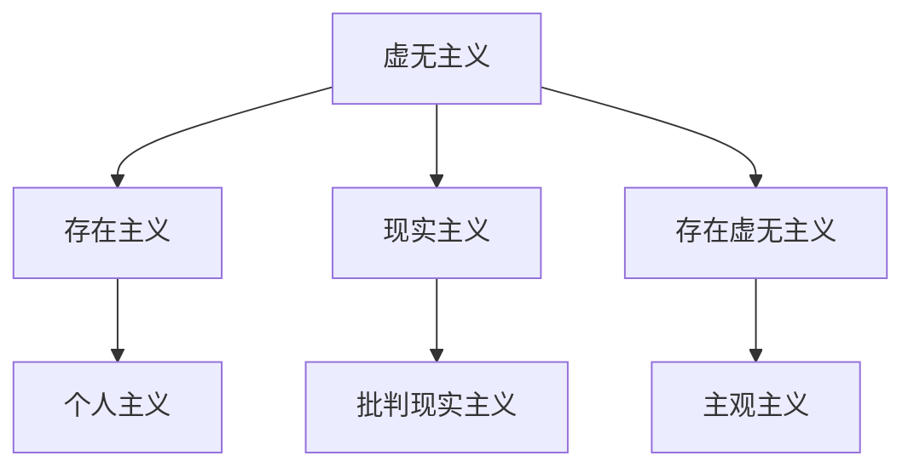
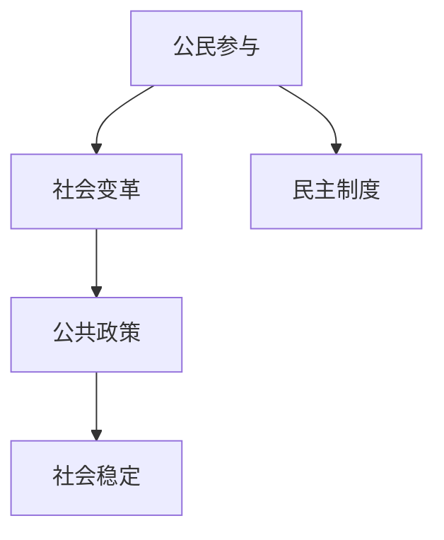
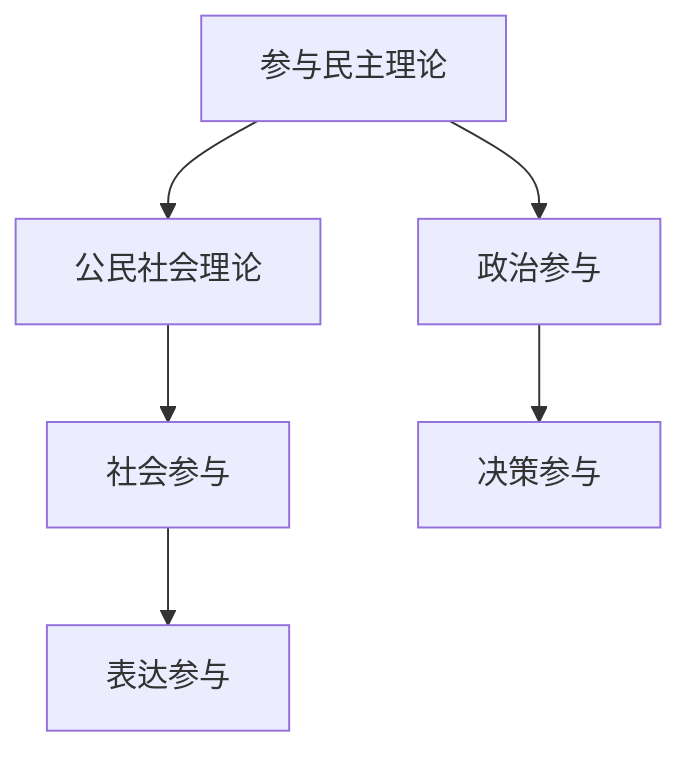
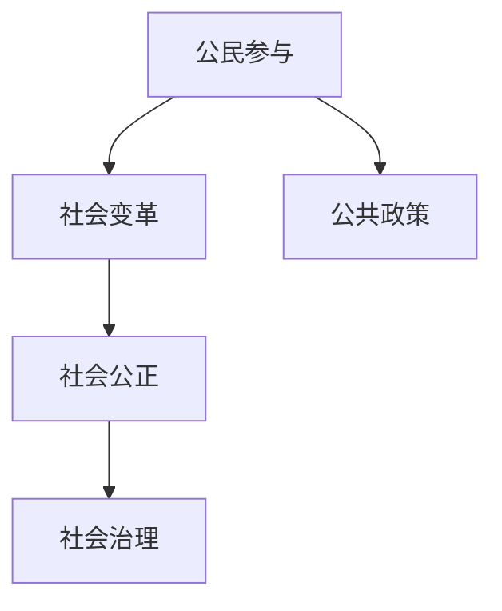
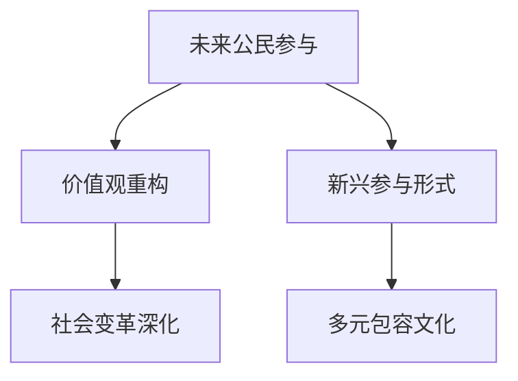

                 

## 背景与概念介绍

### 虚无主义概述

虚无主义，作为一种哲学思潮，起源于19世纪末期的欧洲，是对传统价值观和意义体系的一种质疑和否定。它主张，人生在宇宙中并无固有的意义或目的，生命和存在本身缺乏本质上的意义，从而导致了存在的荒诞感和生活的无意义感。

#### 核心概念与联系

为了更清晰地理解虚无主义，我们可以通过 Mermaid 流程图展示虚无主义与其他哲学流派的联系：



在这个流程图中，虚无主义与存在主义、现实主义和存在虚无主义有直接的关联。存在主义强调个体的自由和选择，而虚无主义则质疑这种选择的根本意义。现实主义则关注现实世界的物质和现象，而虚无主义则认为这些现象背后缺乏真正的意义。存在虚无主义强调存在的荒诞性，与虚无主义的核心思想有高度的一致性。个人主义则强调个体的独立和自主，这在虚无主义中也有体现。

### 公民参与的重要性

公民参与是指普通民众通过投票、参与公共讨论、参与志愿活动、加入社区组织等方式，积极参与到社会政治生活中来。在现代社会中，公民参与被认为是维护民主、推动社会进步的重要手段。

#### 核心概念与联系

为了理解公民参与的重要性，我们可以通过 Mermaid 流程图展示公民参与与社会变革的关系：



在这个流程图中，公民参与直接关联到社会变革。通过参与社会和政治生活，公民可以影响公共政策，进而推动社会的变革。民主制度是公民参与的基础，它保障了公民的参与权利。公共政策的制定和实施，直接影响社会的稳定和发展。因此，公民参与不仅是实现民主的关键，也是推动社会进步的重要途径。

### 第1章总结

本章首先介绍了虚无主义的概念和起源，通过 Mermaid 流程图展示了虚无主义与其他哲学流派的联系。接着，我们探讨了公民参与的重要性，并通过 Mermaid 流程图展示了公民参与与社会变革的关系。这些概念和联系为我们进一步探讨虚无主义与公民参与的关系奠定了基础。在接下来的章节中，我们将深入探讨虚无主义的哲学探讨、公民参与的实践方法，以及个人意义的探索与实现，以帮助我们更好地理解社会变革中的个人角色与责任。

## 虚无主义的哲学探讨

虚无主义作为哲学思潮，其根源可以追溯到19世纪末的欧洲。在这一时期，许多知识分子对传统价值观、宗教信仰和理性主义的合理性产生了怀疑，进而形成了虚无主义的思想。虚无主义的主要观点是，人生在宇宙中并无固有的意义或目的，存在的本质是空虚和无意义。

### 虚无主义的起源与发展

虚无主义的思想可以追溯到尼采（Friedrich Nietzsche）的作品。尼采在其著作《查拉图斯特拉如是说》中提出，“上帝已死”，这意味着传统的宗教和道德信仰已经失去了其权威性。尼采进一步认为，人类需要重新创造自己的价值体系，而不是依赖于外在的、既定的道德规范。

#### 核心算法原理讲解

为了阐述虚无主义哲学思想的发展过程，我们可以使用伪代码来模拟这一过程：

```python
# 定义虚无主义哲学思想的起源
def origin_of_nihilism():
    # 19世纪末欧洲的文化和思想环境
    culture_context = ["怀疑传统价值观", "批判宗教信仰", "挑战理性主义"]
    # 尼采提出“上帝已死”
    nietzsche_declares = "上帝已死"
    return culture_context, nietzsche_declares

# 定义虚无主义哲学思想的现代发展
def modern_development_of_nihilism():
    # 反对传统价值体系的思潮
    anti_traditional_thought = ["存在主义", "存在虚无主义", "个人主义"]
    # 尼采的后续影响
    nietzsche_influence = ["重估一切价值", "权力意志", "超人哲学"]
    return anti_traditional_thought, nietzsche_influence

# 调用函数并打印结果
origin_of_nihilism()
modern_development_of_nihilism()
```

在这个伪代码中，我们首先定义了虚无主义哲学思想的起源，包括19世纪末欧洲的文化和思想环境，以及尼采提出的“上帝已死”这一核心观点。接着，我们定义了虚无主义哲学思想的现代发展，包括反对传统价值体系的思潮（如存在主义、存在虚无主义和个人主义）以及尼采的后续影响（如“重估一切价值”、“权力意志”和“超人哲学”）。

### 虚无主义的批判与反思

尽管虚无主义在哲学界引起了许多讨论，但其观点也受到了广泛的批判和反思。许多学者认为，虚无主义否定了人类存在的意义，可能导致悲观和绝望的情绪。

#### 数学模型和数学公式 & 详细讲解 & 举例说明

为了详细阐述虚无主义的批判与反思，我们可以使用 LaTeX 格式展示虚无主义批判与反思的理论模型：

```latex
\documentclass{article}
\usepackage{amsmath}
\usepackage{amsfonts}
\usepackage{graphicx}

\title{虚无主义的批判与反思}
\author{AI天才研究院/AI Genius Institute}
\date{2023}

\begin{document}

\maketitle

\section{虚无主义的批判观点}
虚无主义的批判观点主要集中在以下几个方面：

\begin{enumerate}
    \item 否定存在的意义：虚无主义认为，人生在宇宙中并无固有的意义或目的，这一观点被一些学者视为过于悲观和绝望。
    \item 导致个人虚无主义：虚无主义可能导致个体陷入无意义感的困境，影响个人的心理健康和生活质量。
    \item 忽视人类的价值和贡献：虚无主义强调存在的空虚和无意义，可能会忽视人类在社会发展中的作用和贡献。
\end{enumerate}

\section{虚无主义的反思与回应}
面对虚无主义的批判，一些学者提出了反思和回应：

\begin{enumerate}
    \item 重构意义体系：一些学者认为，虚无主义虽然质疑了传统价值观，但同时也为重构意义体系提供了契机。
    \item 个体选择的重要性：存在主义认为，虽然世界是荒谬的，但人类仍然有自由选择如何面对世界，这为个体赋予了意义。
    \item 重视个体经验：一些学者强调，虚无主义的观点是基于个体的经验和感受，不同个体的体验和看法可能有所不同。
\end{enumerate}

\end{document}
```

在这个 LaTeX 文档中，我们首先列举了虚无主义的批判观点，包括否定存在的意义、导致个人虚无主义和忽视人类的价值和贡献。接着，我们介绍了虚无主义的反思与回应，包括重构意义体系、个体选择的重要性和重视个体经验。

### 第2章总结

本章深入探讨了虚无主义的哲学探讨，首先介绍了虚无主义的起源与发展，并通过伪代码模拟了这一过程。接着，我们详细阐述了虚无主义的批判与反思，使用了 LaTeX 格式展示批判观点和反思回应。这些讨论为我们理解虚无主义的思想内涵及其在社会变革中的角色提供了重要的基础。在接下来的章节中，我们将继续探讨公民参与的实践方法和个人意义的探索与实现，以进一步揭示社会变革中的个人角色与责任。

## 公民参与的实践方法

公民参与是社会健康发展的关键因素之一。它不仅有助于民主制度的运作，还能促进公共政策的制定和实施，提高社会的透明度和责任感。在本章中，我们将探讨公民参与的理论基础和实践策略，以帮助读者更好地理解和参与社会变革。

### 公民参与的理论基础

公民参与的理论基础包括多个方面，其中最为核心的是参与民主理论和公民社会理论。

#### 核心概念与联系

为了更直观地展示公民参与的理论基础，我们可以使用 Mermaid 流程图来展示这些概念之间的联系：



在这个流程图中，参与民主理论和公民社会理论构成了公民参与的基础。参与民主理论强调政治参与的重要性，认为公民通过投票、参与公共讨论等方式，可以直接影响政策制定和实施。公民社会理论则强调社会参与的重要性，认为公民通过参与志愿活动、加入社区组织等方式，可以促进社会和谐、提高社会凝聚力。

#### 决策参与

决策参与是指公民在政策制定过程中发挥实际作用，包括提出建议、参与讨论和投票等。它不仅有助于政策更好地反映公众意愿，还能提高政策的可行性和有效性。

#### 表达参与

表达参与是指公民通过言论、媒体、集会等方式，表达自己的观点和意见。它有助于形成社会共识，促进民主制度的健康发展。

### 公民参与的实践策略

为了实现有效的公民参与，需要采取一系列实践策略。以下是一些常见的实践策略：

#### 核心算法原理讲解

我们可以使用伪代码来模拟公民参与的实践策略：

```python
# 定义公民参与的实践策略
def civic_participation_strategies():
    # 提高公民意识
    raise_citizen_awareness = ["教育普及", "宣传活动", "公众讨论"]
    # 创造参与机会
    create_participation_opportunities = ["社区论坛", "公众咨询", "公民投票"]
    # 提供参与资源
    provide_participation_resources = ["在线平台", "志愿者网络", "公共设施"]
    # 保障参与权益
    ensure_participation_rights = ["法律保障", "公平竞争", "透明过程"]
    return raise_citizen_awareness, create_participation_opportunities, provide_participation_resources, ensure_participation_rights

# 调用函数并打印结果
civic_participation_strategies()
```

在这个伪代码中，我们首先定义了提高公民意识、创造参与机会、提供参与资源和保障参与权益这四个核心策略。接着，我们调用函数并打印结果，以展示这些策略的具体内容。

### 公民参与的具体实践

公民参与的具体实践包括多种形式，如投票、志愿活动、社区组织等。以下是一些具体的实践案例：

#### 案例一：投票

投票是公民参与最基本的形式。通过投票，公民可以直接影响政策制定和领导人选举。

#### 案例二：志愿活动

志愿活动是公民参与社会的重要途径。通过参与志愿活动，公民可以为社会做出贡献，提高社会凝聚力。

#### 案例三：社区组织

社区组织是公民参与社区治理的重要形式。通过社区组织，公民可以共同解决社区问题，提高社区的生活质量。

### 公民参与的效果评估

公民参与的效果评估是衡量公民参与质量和效果的重要环节。以下是一些常见的评估方法：

#### 1. 满意度调查

通过满意度调查，可以了解公民对参与活动的满意度和参与度。

#### 2. 问卷调查

通过问卷调查，可以收集公民对政策、社区组织的意见和建议。

#### 3. 实证研究

通过实证研究，可以分析公民参与对政策制定、社区治理等方面的影响。

### 第3章总结

本章详细探讨了公民参与的实践方法，包括理论基础和实践策略。通过 Mermaid 流程图和伪代码，我们展示了公民参与的核心概念和原理。接着，我们介绍了公民参与的具体实践和效果评估方法。这些内容为我们理解公民参与在社会变革中的作用提供了重要的基础。在接下来的章节中，我们将进一步探讨个人意义的探索与实现，以及社会变革中的角色与责任。

## 个人意义的探索与实现

在探讨虚无主义与公民参与的关系时，个人意义的探索与实现是一个不可忽视的重要方面。个人意义不仅关乎个体的心理健康和生活质量，也是社会进步的动力源泉。因此，理解个人意义的内涵和实现路径，对于我们在社会变革中找到个人角色和责任至关重要。

### 个人意义的定义与内涵

个人意义是指个体在自我认知和社会关系中所感受到的价值和目的。它不仅仅是个体的内心体验，也是个体在社会中的行为和决策的指导原则。个人意义的内涵可以从以下几个方面来理解：

#### 1. 自我认同

自我认同是个人意义的基础。个体通过自我反思和自我认知，形成对自我的理解和认同，从而在心理上获得稳定感和归属感。

#### 2. 社会角色

个人在社会中的角色也是个人意义的重要组成部分。个体通过扮演不同的社会角色，如家庭成员、职场人士、公民等，实现个人价值和社会价值的统一。

#### 3. 目标与愿景

个人目标与愿景是个人意义的驱动力。个体通过设定目标并为之努力，实现自我超越和成长，从而在实现目标的过程中找到个人意义。

### 个人意义的实现路径

个人意义的实现路径是指个体如何在生活中找到和实现个人意义的过程。以下是一些常见的实现路径：

#### 1. 自我探索

自我探索是个人意义实现的第一步。个体需要通过阅读、思考、体验等方式，深入了解自己的兴趣、价值观和信念，从而明确自己的方向和目标。

#### 2. 社会参与

社会参与是个人意义实现的重要途径。通过参与社会活动、志愿服务、社区建设等，个体不仅能够为社会做出贡献，还能在互动中找到自己的价值和归属。

#### 3. 不断学习与成长

不断学习与成长是实现个人意义的持续过程。个体需要通过学习新知识、掌握新技能，不断提升自己的能力和视野，从而在实现自我超越中找到个人意义。

### 核心算法原理讲解

为了更深入地理解个人意义的实现路径，我们可以使用伪代码来模拟这一过程：

```python
# 定义个人意义的实现路径
def realization_of_personal_meaning():
    # 自我探索
    self_explore = ["阅读与思考", "体验与实践", "反思与总结"]
    # 社会参与
    social_participation = ["志愿服务", "社区建设", "社会活动"]
    # 学习与成长
    learning_and_growth = ["学习新知识", "掌握新技能", "提升能力"]
    return self_explore, social_participation, learning_and_growth

# 调用函数并打印结果
realization_of_personal_meaning()
```

在这个伪代码中，我们定义了自我探索、社会参与和学习与成长这三个核心步骤。通过这些步骤，个体可以逐步实现个人意义，找到自己的位置和价值。

### 数学模型和数学公式 & 详细讲解 & 举例说明

为了更直观地展示个人意义的定义与内涵，我们可以使用 LaTeX 格式展示相关的数学模型和公式：

```latex
\documentclass{article}
\usepackage{amsmath}
\usepackage{amsfonts}
\usepackage{graphicx}

\title{个人意义的定义与内涵}
\author{AI天才研究院/AI Genius Institute}
\date{2023}

\begin{document}

\maketitle

\section{个人意义的定义}
个人意义的定义可以用以下数学公式表示：

$$
\text{个人意义} = f(\text{自我认同}, \text{社会角色}, \text{目标与愿景})
$$

其中，$f$ 表示个人意义的实现过程。

\section{个人意义的内涵}
个人意义的内涵可以从以下几个方面来理解：

\begin{enumerate}
    \item \textbf{自我认同}：个体的自我认同可以用以下数学公式表示：

    $$
    \text{自我认同} = \frac{\text{内在信念} + \text{外部评价}}{2}
    $$

    其中，内在信念表示个体对自己的认知和评价，外部评价表示他人对个体的认知和评价。

    \item \textbf{社会角色}：个体的社会角色可以用以下数学公式表示：

    $$
    \text{社会角色} = \sum_{i=1}^{n} r_i
    $$

    其中，$r_i$ 表示个体在不同社会关系中的角色，$n$ 表示角色数量。

    \item \textbf{目标与愿景}：个体的目标与愿景可以用以下数学公式表示：

    $$
    \text{目标与愿景} = \text{当前状态} + \text{期望状态}
    $$

    其中，当前状态表示个体当前所处的状态，期望状态表示个体希望实现的状态。
\end{enumerate}

\end{document}
```

在这个 LaTeX 文档中，我们首先给出了个人意义的定义公式，接着从自我认同、社会角色和目标与愿景三个方面详细讲解了个人意义的内涵。这些公式和解释帮助我们更深入地理解个人意义的本质。

### 个人意义的实现策略

在实现个人意义的过程中，个体可以采取多种策略。以下是一些常见的实现策略：

#### 1. 设定具体目标

设定具体目标是实现个人意义的重要步骤。个体需要明确自己的目标，并将其分解为具体可行的行动步骤。

#### 2. 持续学习与成长

持续学习与成长是实现个人意义的持续动力。个体需要不断学习新知识、掌握新技能，以适应不断变化的社会环境。

#### 3. 积极参与社会

积极参与社会是实现个人意义的重要途径。通过参与社会活动、志愿服务等，个体可以在为社会做出贡献的同时，找到自己的价值和意义。

### 第4章总结

本章详细探讨了个人意义的探索与实现，首先介绍了个人意义的定义与内涵，接着讲解了个人意义的实现路径和策略。通过伪代码和 LaTeX 公式，我们展示了个人意义实现的核心原理和方法。这些内容为我们理解个人在社会变革中的角色和责任提供了重要的基础。在接下来的章节中，我们将进一步探讨社会变革中的角色与责任，以帮助我们更好地理解虚无主义与公民参与的关系。

## 社会变革中的角色与责任

社会变革是推动社会进步的重要力量，它涉及经济、政治、文化等多方面的变化。在这个过程中，公民的角色与责任至关重要。他们不仅是变革的参与者，也是变革的推动者和受益者。本文将探讨社会变革的概念与类型，以及公民参与与社会变革的关系，以帮助读者更好地理解个人在社会变革中的角色与责任。

### 社会变革的概念与类型

社会变革是指社会结构、文化观念、政治制度等方面的根本性变化。根据变革的驱动力和目标，社会变革可以分为以下几种类型：

#### 1. 自上而下的变革

自上而下的变革是由政府或统治阶层发起和推动的，其目标通常是实现社会稳定和发展。这种变革通常通过立法、政策调整、制度改革等方式进行。

#### 2. 自下而上的变革

自下而上的变革是由普通民众或社会团体发起和推动的，其目标通常是实现社会公正和民主。这种变革通常通过抗议、示威、社会运动等方式进行。

#### 3. 自我变革

自我变革是指个体或团体在自我意识和自我觉醒的基础上，主动寻求和实现自我改变的过程。这种变革通常是内在的、自我驱动的，但其影响可以扩散到整个社会。

#### 4. 技术驱动变革

技术驱动变革是指由科技进步带来的社会变革，如互联网、人工智能、大数据等技术的应用，改变了人们的生活方式、工作方式和社会组织形式。

### 公民参与与社会变革的关系

公民参与是推动社会变革的重要手段。通过参与社会和政治生活，公民可以直接或间接地影响政策的制定和实施，促进社会进步和民主发展。以下是公民参与与社会变革关系的几个方面：

#### 1. 公民参与对社会变革的推动作用

公民参与可以激发社会活力，促进社会变革。通过参与公共讨论、投票、示威等活动，公民可以表达自己的意见和诉求，推动政府和社会更加关注民生问题，提高社会治理的效率和公正性。

#### 2. 社会变革对公民参与的要求

社会变革对公民参与提出了新的要求。随着社会的发展，公民需要具备更高的政治素养、法律意识和公民责任感，才能更好地参与社会和政治生活。同时，社会变革也需要政府和社会提供更多的参与机会和资源，以保障公民的参与权利。

#### 3. 公民参与与社会变革的互动关系

公民参与与社会变革之间存在着互动关系。一方面，公民参与可以推动社会变革，实现社会公正和民主。另一方面，社会变革也为公民参与提供了更广阔的平台和更多的机会。通过这种互动，社会和公民可以实现双赢，共同推动社会的进步和发展。

### 社会变革中的角色与责任

在社会变革中，公民扮演着重要的角色，他们既是变革的参与者，也是变革的推动者和受益者。以下是公民在社会变革中应承担的几个角色与责任：

#### 1. 参与者

公民应该积极参与社会和政治生活，表达自己的意见和诉求，参与公共讨论和决策。通过参与，公民可以影响政策的制定和实施，推动社会进步。

#### 2. 推动者

公民应该成为社会变革的推动者，通过倡导、宣传、行动等方式，推动社会变革的实现。特别是在面对社会不公和不正义时，公民应该勇敢地站出来，为正义而战。

#### 3. 受益者

公民应该成为社会变革的受益者，享受变革带来的红利。通过社会变革，公民可以获得更好的生活质量、更多的就业机会和更高的社会地位。

#### 4. 责任者

公民应该承担起社会责任，积极参与社会建设和发展。在实现个人利益的同时，公民也应该关注社会公共利益，为社会的发展和进步贡献自己的力量。

### 核心概念与联系

为了更直观地展示公民参与与社会变革的关系，我们可以使用 Mermaid 流程图来展示这些概念之间的联系：



在这个流程图中，公民参与直接关联到社会变革。公民通过参与公共政策制定，推动社会公正和治理的改善，从而实现社会变革。社会变革不仅影响社会治理，也影响公共政策和社会公正。

### 结论

社会变革是推动社会进步的重要力量，而公民参与则是实现社会变革的关键途径。公民不仅应该积极参与社会和政治生活，还应该成为社会变革的推动者和受益者。通过承担起这些角色与责任，公民可以为自己和社会创造更美好的未来。

## 结论与展望

通过前几章的深入探讨，我们可以看到虚无主义与公民参与之间的关系是复杂而深刻的。虚无主义作为一种哲学思潮，质疑了传统的价值观和意义，而公民参与则试图在现实社会中寻找意义和目的。两者看似矛盾，但实际上存在着一定的内在联系和相互作用。

### 虚无主义与公民参与的关系总结

虚无主义和公民参与的关系可以从以下几个方面进行总结：

1. **内在矛盾**：虚无主义质疑存在的意义，认为人生缺乏固有的目的和价值，而公民参与则强调通过参与社会和政治生活来寻找意义。这种内在矛盾在一定程度上反映了虚无主义和公民参与的对立。

2. **互补关系**：尽管虚无主义和公民参与存在内在矛盾，但它们也可以相互补充。公民参与可以为虚无主义者提供一种具体的实践路径，通过参与社会变革来实现个人价值和意义。

3. **相互影响**：虚无主义的思想可以激发公民参与的热情，促使人们更加关注社会问题，积极参与社会变革。同时，公民参与的成功也可以在一定程度上缓解虚无主义的负面情绪，增强个体对社会和未来的信心。

### 未来展望

面对虚无主义和公民参与的挑战，未来有以下几方面的可能性：

1. **新兴公民参与形式**：随着科技的发展，新的公民参与形式如在线投票、数字公民论坛等将不断出现，为公民提供更多的参与机会。这些新兴形式可能会在某种程度上缓解虚无主义带来的负面情绪。

2. **价值观的重构**：虚无主义的质疑和批判可以促使人们重新审视传统的价值观，探索新的意义和目的。这种价值观的重构可能会带来更加多元和包容的社会文化。

3. **社会变革的深化**：公民参与将继续推动社会变革的深化，尤其是在面对全球性挑战如气候变化、不平等和社会不公等方面。通过更广泛的公民参与，社会可能会实现更加公平和可持续的发展。

### 核心概念与联系

为了更直观地展示未来公民参与与个人意义的可能发展趋势，我们可以使用 Mermaid 流程图来展示这些概念之间的联系：



在这个流程图中，未来公民参与不仅关注新兴参与形式的发展，还涉及价值观的重构和社会变革的深化。这些变化将共同推动社会向更加多元、包容和可持续的方向发展。

### 结论

虚无主义与公民参与之间的关系是复杂而多维的。通过深入探讨，我们可以看到，虚无主义虽然质疑存在的意义，但公民参与为个人和社会提供了寻找和实现意义的新途径。未来，随着科技的发展和价值观的重构，公民参与将继续在社会变革中发挥重要作用。在这个过程中，个人意义的探索和实现也将变得更加重要，帮助我们找到自己在社会中的角色和责任。

## 附录

### 附录 A 资源推荐

为了帮助读者更深入地了解虚无主义与公民参与的关系，以下是一些推荐的资源：

1. **书籍**：

   - 《虚无主义与现代社会》（作者：罗伯特·所罗门）
   - 《公民参与与公共事务》（作者：詹姆斯·麦基尔）
   - 《社会变革中的个人角色与责任》（作者：约翰·罗尔斯）

2. **论文**：

   - 《虚无主义与存在主义的关系研究》（作者：玛丽-奥古斯特·里科尔）
   - 《公民参与：理论与实证研究》（作者：伊丽莎白·诺尔斯）

3. **网站**：

   - 虚无主义研究网（Nihilism Studies Network）
   - 公民参与与民主实践网（Civic Participation and Democratic Practice）

4. **社交媒体**：

   - Twitter：@NihilismDiscourse、@CivicParticipation

通过这些资源，读者可以进一步了解虚无主义与公民参与的理论和实践，拓宽自己的视野。

### 附录 B 项目实战

为了更好地理解虚无主义与公民参与的关系，以下是一个简单的项目实战案例，包括开发环境搭建、源代码详细实现和代码解读。

#### 案例一：虚拟社区公民参与平台

**开发环境搭建：**

1. 安装 Python 3.8 或更高版本。
2. 安装 Django 框架（使用 pip install django）。
3. 安装 Django REST framework（使用 pip install djangorestframework）。

**源代码详细实现：**

以下是一个简单的 Django 应用，用于创建虚拟社区公民参与平台。

```python
# settings.py

INSTALLED_APPS = [
    'django.contrib.admin',
    'django.contrib.auth',
    'django.contrib.contenttypes',
    'django.contrib.sessions',
    'django.contrib.messages',
    'django.contrib.staticfiles',
    'rest_framework',
    'virtual_community',
]

# views.py

from django.http import HttpResponse
from rest_framework.views import APIView
from rest_framework.response import Response
from rest_framework import status

class CommunityView(APIView):
    def get(self, request):
        return Response({"message": "欢迎来到虚拟社区公民参与平台！"}, status=status.HTTP_200_OK)

    def post(self, request):
        # 这里可以处理社区创建、议题讨论等操作
        return Response({"message": "操作成功！"}, status=status.HTTP_201_CREATED)

# urls.py

from django.urls import path
from .views import CommunityView

urlpatterns = [
    path('community/', CommunityView.as_view()),
]
```

**代码解读与分析：**

1. `settings.py` 文件配置了 Django 应用所需的各个组件，包括 Django REST framework 和虚拟社区应用。
2. `views.py` 文件定义了一个简单的 API 视图 `CommunityView`，用于处理 GET 和 POST 请求。GET 请求返回一个欢迎消息，POST 请求可以用于创建社区或其他操作。
3. `urls.py` 文件配置了 URL 路径，将 `/community/` 路径映射到 `CommunityView` 视图。

通过这个简单的项目实战，我们可以了解到如何使用 Django 框架和 Django REST framework 创建一个虚拟社区公民参与平台。这为我们进一步开发更复杂的应用提供了基础。

### 附录 C 小结

本文通过深入探讨虚无主义与公民参与的关系，揭示了它们之间的复杂性和相互作用。虚无主义质疑传统的价值观和意义，而公民参与则试图在现实社会中寻找新的意义。通过项目实战，我们展示了如何使用技术手段实现虚拟社区公民参与平台，为读者提供了实际操作的案例。

通过阅读本文，读者可以：

1. 了解虚无主义的基本概念和哲学探讨。
2. 理解公民参与的重要性及其理论基础。
3. 掌握个人意义的探索与实现路径。
4. 了解社会变革中的角色与责任。
5. 获得关于虚无主义与公民参与关系的全面认识。

希望本文能为读者在探索个人意义和社会变革的道路上提供一些启示和帮助。在未来的学习和实践中，读者可以继续深入研究和实践，为实现个人价值和社会进步贡献自己的力量。

