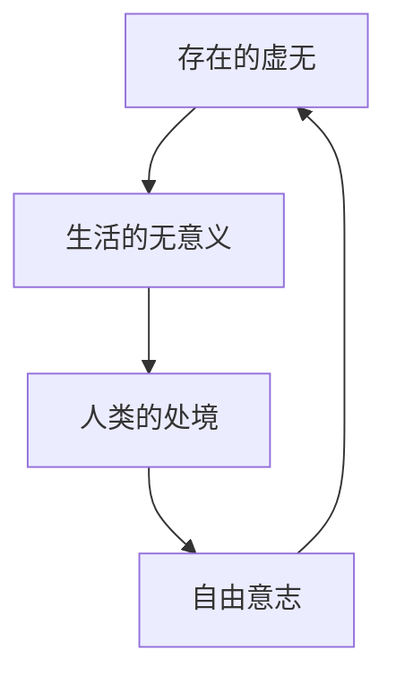
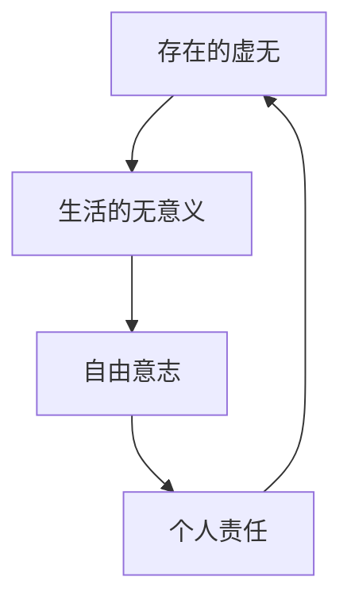
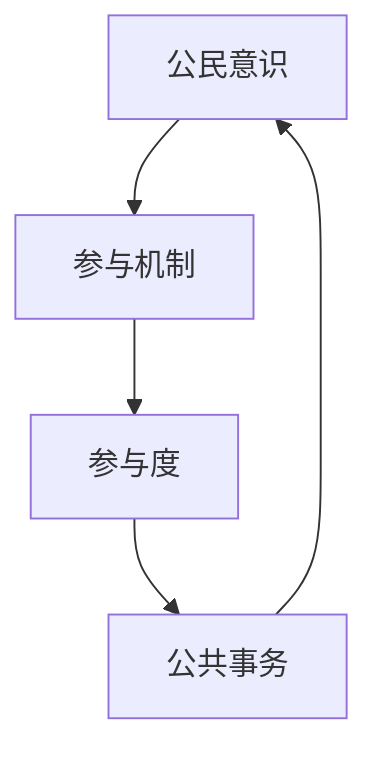
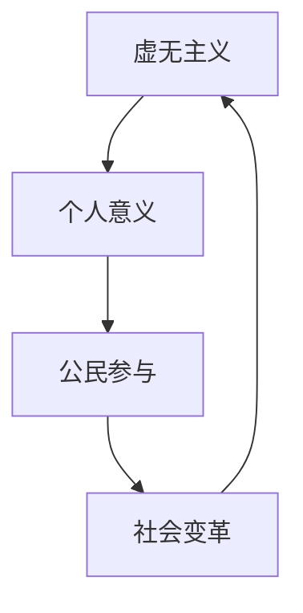

                 

### 《虚无主义与公民参与：在社会变革中找到个人意义》

#### 关键词
- 虚无主义
- 公民参与
- 个人意义
- 社会变革
- 哲学探索
- 实践模式
- 批判性思维

#### 摘要
本文旨在探讨虚无主义与公民参与之间的关系，以及如何在社会变革中找到个人意义。通过分析虚无主义的起源、核心概念及其影响，我们理解了虚无主义对现代社会和个人成长的挑战。随后，我们探讨了公民参与的重要性、理论基础和实践模式，展示了公民参与在社会变革中的关键作用。最后，结合虚无主义与公民参与，我们提出了寻找个人意义的方法，并讨论了个人在社会变革中的角色。通过这些探讨，本文旨在为读者提供深刻的哲学思考和实用的行动指南。

---

## 第一部分：虚无主义的哲学探索

### 第1章：虚无主义的起源与影响

#### 1.1 虚无主义的起源

虚无主义作为一种哲学思潮，其起源可以追溯到19世纪末至20世纪初。最早提出虚无主义概念的是丹麦哲学家索伦·克尔凯郭尔（Søren Kierkegaard），他在其著作《恐惧与颤栗》中提出了存在的虚无主义。克尔凯郭尔认为，人生活在无意义的宇宙中，没有客观的真理，因此，人们必须通过主观的价值来赋予生活意义。

随后，俄国哲学家弗朗茨·布伦塔诺（Frantz Brentano）进一步发展了虚无主义思想，他在其著作《论虚无主义》中提出了虚无主义的心理学解释。布伦塔诺认为，虚无主义源于人们对生活的绝望和无力感，这种无力感导致了他们对生活意义的否定。

#### 1.2 虚无主义的影响

虚无主义思想对现代哲学、文学和艺术产生了深远的影响。在哲学领域，虚无主义挑战了传统的形而上学和伦理学观念，促使人们重新思考存在的本质和生命的意义。虚无主义哲学家如尼采（Friedrich Nietzsche）和萨特（Jean-Paul Sartre）等，通过批判理性主义和存在主义，推动了现代哲学的发展。

在文学和艺术领域，虚无主义思想也产生了广泛的影响。20世纪初的许多文学作品，如D.H. 劳伦斯的《儿子与情人》和弗吉尼亚·伍尔夫的《到灯塔去》，都反映了虚无主义者的生活态度和哲学思考。虚无主义艺术家则通过反传统、反理性的手法，表达了他们对现代社会的不满和对人类存在的质疑。

#### 1.3 虚无主义与现代社会

在现代社会，虚无主义思潮仍然具有一定的吸引力。现代社会的高度物质化和快节奏生活方式，使得许多人感到生活的无意义和空虚。同时，科技进步和全球化带来的不确定性和变革，也让人们感到无所适从和迷茫。在这种情况下，虚无主义提供了一种反思和批判社会现状的视角，使人们能够更好地理解自己的存在状态。

然而，虚无主义并不是一种简单的悲观主义，它也包含了对人类自由和创造力的强调。虚无主义者认为，只有通过摆脱传统价值观和社会规范的束缚，人们才能找到真正的自由和意义。因此，虚无主义既是对现状的批判，也是对未来的探索。

#### 核心概念与联系

虚无主义的核心概念包括存在的虚无、生活的无意义、人类的处境和自由意志等。这些概念之间存在着密切的联系，共同构成了虚无主义的哲学体系。

存在的虚无是指人类在宇宙中的孤立和无意义。生活的无意义则是指人们在日常生活中所面对的种种困境和挑战，以及这些困境和挑战对人们生活意义的消解。人类的处境是指人类在社会和自然环境中的生存状态，包括对未来的不确定性和对生活的绝望感。自由意志则是指人类在虚无主义环境中寻找意义和价值的自由。

以下是一个简单的Mermaid流程图，展示了这些核心概念之间的关系：



### 第2章：虚无主义的核心概念

#### 2.1 存在的意义

虚无主义对存在意义的探讨是哲学的核心问题之一。虚无主义者认为，存在本身是没有意义的，因为宇宙是无限的，人类的存在只是这个无限宇宙中的一个小小片段。在这种广阔的宇宙背景下，个人的生命显得微不足道，因此，人们必须通过主观的努力来赋予生活意义。

虚无主义哲学家尼采（Friedrich Nietzsche）在其著作《查拉图斯特拉如是说》中，提出了“超人”（Übermensch）的概念，他认为只有通过超越自己，成为超人，人们才能找到生活的真正意义。尼采强调，超人是那些具有强烈意志力和创造力的人，他们能够创造出自己的价值观和生活方式。

#### 2.2 生活的价值

虚无主义对生活的价值提出了质疑。在虚无主义者的眼中，传统的价值观如宗教信仰、道德规范和社会期望等，都是人类为自己编织的虚假幻象，用来逃避现实的痛苦和无意义。虚无主义者认为，生活的价值应该由个人自己来定义，而不是被外界的规范所束缚。

萨特（Jean-Paul Sartre）在其著作《存在与虚无》中，提出了“存在先于本质”（Existence precedes essence）的观点。他认为，人的存在是自由和选择的产物，人的本质是通过自己的行为和选择来塑造的。因此，生活的价值不是既定的，而是通过个人的自由意志和行动来创造的。

#### 2.3 人类的处境

虚无主义对人类的处境进行了深刻的剖析。虚无主义者认为，人类生活在无意义、孤独和不确定性的世界中。人类的存在既是自由的，也是被束缚的。自由在于人类有选择自己生活方式的能力，而束缚则在于人类无法逃脱存在的虚无和生活的无意义。

在虚无主义者的眼中，人类的处境是一种困境，但也是一种机会。困境在于人类必须面对生活的无意义和痛苦，机会则在于人类可以通过自己的努力，创造出属于自己的意义和价值。

#### 核心算法原理讲解

为了更深入地理解虚无主义的核心概念，我们可以使用伪代码来模拟虚无主义者的思考过程。以下是一个简单的伪代码示例，展示了虚无主义者如何通过自由意志来创造生活意义：

```python
# 虚无主义者寻找生活意义的伪代码

# 初始化生活状态
life_state = "无意义"

# 自由意志决定生活方向
direction = "创造力"

# 通过创造力赋予生活意义
if direction == "创造力":
    life_state = "有意义"

# 输出生活状态
print("我的生活状态是：" + life_state)
```

通过这个简单的伪代码，我们可以看到虚无主义者如何通过自由意志和创造力来赋予生活意义。

### 数学模型和公式详细讲解与举例

在探讨虚无主义的核心概念时，我们也可以引入一些数学模型和公式，以帮助我们更深入地理解虚无主义的哲学思考。

一个常用的模型是概率论中的“贝叶斯定理”，它可以帮助我们理解虚无主义中的不确定性。贝叶斯定理的公式如下：

$$
P(A|B) = \frac{P(B|A)P(A)}{P(B)}
$$

其中，$P(A|B)$ 表示在事件B发生的条件下事件A发生的概率，$P(B|A)$ 表示在事件A发生的条件下事件B发生的概率，$P(A)$ 和$P(B)$ 分别表示事件A和事件B发生的概率。

例如，假设我们想知道在某个社会变革中，个人能否通过自由意志赋予生活意义（事件A）的概率。我们可以通过以下步骤来计算：

1. **确定事件A和事件B**：
   - 事件A：个人通过自由意志赋予生活意义。
   - 事件B：社会变革中个人面临的不确定性和挑战。

2. **收集相关数据**：
   - $P(B|A)$：在社会变革中，个人通过自由意志赋予生活意义的条件下，面临的不确定性和挑战的概率。
   - $P(A)$：在社会变革中，个人通过自由意志赋予生活意义的概率。
   - $P(B)$：在社会变革中，个人面临的不确定性和挑战的概率。

3. **应用贝叶斯定理**：
   - 根据贝叶斯定理，我们可以计算出$P(A|B)$，即在社会变革中，个人通过自由意志赋予生活意义的概率。

通过这个例子，我们可以看到贝叶斯定理如何帮助我们理解虚无主义中的不确定性，以及如何通过数学模型来分析和解决问题。

### 第3章：虚无主义的哲学流派

#### 3.1 古典虚无主义

古典虚无主义可以追溯到古希腊哲学家赫拉克利特（Heraclitus）和中国的老子。赫拉克利特认为，世界是不断变化和流动的，没有固定的本质和意义。老子的《道德经》中也表达了类似的思想，强调顺应自然和无为而治。

古典虚无主义认为，存在的本质是变化和流动，而不是静止和固定。这种哲学观点对后来的西方哲学和东方哲学都产生了深远的影响，为后来的虚无主义思潮奠定了基础。

#### 3.2 现代虚无主义

现代虚无主义的主要代表是尼采（Friedrich Nietzsche）和萨特（Jean-Paul Sartre）。尼采认为，现代社会的道德和价值观都是虚假的，是人类自我欺骗的表现。他提出了“超人”的概念，认为只有超越传统的道德和价值观，才能找到真正的自由和意义。

萨特则通过其存在主义哲学，强调了个人自由和选择的重要性。他认为，人的存在先于本质，人们可以通过自由意志来定义自己的生活和意义。

#### 3.3 当代虚无主义

当代虚无主义在20世纪末和21世纪初有了新的发展，主要代表包括德国哲学家蒂尔曼·多贝尔（Tilman Dobelli）和法国哲学家阿尔贝·加缪（Albert Camus）。

多贝尔在其著作《智慧的空虚》中，探讨了现代社会的空虚和虚无，认为人们应该通过自我反思和真实的生活体验来寻找意义。

加缪则通过其著作《局外人》和《西西弗神话》，表达了面对无意义的生活，人类仍然可以选择反抗和寻找意义的观点。

#### 核心概念与联系

虚无主义的哲学流派虽然有着不同的历史背景和哲学观点，但它们都围绕着核心概念展开，包括存在的虚无、生活的无意义、自由意志和个人责任等。

以下是一个简单的Mermaid流程图，展示了这些核心概念之间的联系：



### 第4章：虚无主义的批判与回应

#### 4.1 批判虚无主义的观点

虚无主义在哲学界和社会上引起了广泛的争议，许多哲学家和学者对其提出了批判。这些批判主要集中在以下几个方面：

1. **缺乏建设性**：虚无主义往往被视为一种消极的、悲观的思想，它没有提供积极的解决方案来应对生活的无意义和困境。一些批评者认为，虚无主义仅仅是对现状的否定，而没有提出建设性的改变途径。

2. **否定价值观**：虚无主义对传统价值观的否定引起了道德和文化保守派的强烈反对。他们认为，虚无主义破坏了社会的道德基础和文化传承，导致价值观的混乱和道德的沦丧。

3. **个体主义倾向**：虚无主义强调个人自由和选择，但这种强调有时会被解读为对社会责任和集体利益的忽视。一些批评者认为，虚无主义过于强调个人主义，忽视了个体在社会中的责任和角色。

#### 4.2 虚无主义的回应

面对这些批判，虚无主义者提出了自己的回应，试图为自己的观点辩护：

1. **建设性虚无主义**：一些虚无主义者认为，虚无主义并不是一种消极的哲学，而是一种反思和批判的工具。通过揭示存在的无意义，虚无主义为人们提供了一种重新审视生活和社会的机会。他们认为，只有在意识到生活的无意义之后，人们才能更好地理解自己的需求，寻找真正的意义和价值。

2. **多元价值观**：虚无主义者承认，传统价值观可能不再适用于现代社会，但他们强调，虚无主义并不是要否定所有的价值观，而是要鼓励人们重新思考和定义自己的价值观。他们认为，每个人都可以通过自由意志和创造力，创造出适合自己的价值观体系。

3. **社会责任的重新解读**：虚无主义者认为，个体在社会中的责任不应该被忽视，但他们主张，这种责任应该是基于个体的自由和选择。他们认为，只有在个体能够自由地表达自己的观点和价值观时，社会才能真正实现公平和正义。

#### 4.3 虚无主义对当代哲学的影响

尽管虚无主义受到了广泛的批判，但它对当代哲学产生了深远的影响：

1. **存在主义**：虚无主义的哲学观点为存在主义提供了重要的理论基础。存在主义者如萨特和加缪，都受到了虚无主义的影响，他们认为，个人应该通过自由意志和选择来定义自己的存在和意义。

2. **后现代主义**：虚无主义的思想也为后现代主义提供了启示。后现代主义者如让-弗朗索瓦·利奥塔（Jean-François Lyotard），在批判现代性的过程中，借鉴了虚无主义的观点，强调知识的不确定性和文化的多元化。

3. **道德和伦理的反思**：虚无主义挑战了传统的道德和伦理观念，促使当代哲学家对道德和伦理的合理性进行重新思考。这种反思不仅影响了哲学领域，也影响了伦理学、政治学和社会学等学科。

### 第5章：公民参与的重要性

#### 5.1 公民参与的内涵

公民参与是指公民在政治、社会和文化生活中，通过各种形式的参与和贡献，促进公共事务的决策和管理，实现公共利益和社会进步。公民参与包括民主参与、政策参与、社区参与和社会运动参与等多种形式。

民主参与是指公民在选举、投票和公共咨询等过程中，直接参与政治决策和管理。政策参与是指公民通过提出建议、参与公共讨论和影响政策制定，为公共事务提供智慧和资源。社区参与是指公民在社区事务中，通过志愿服务、社区组织和社区建设，改善社区环境和促进社区发展。社会运动参与是指公民通过组织抗议、示威和行动，推动社会变革和实现社会正义。

#### 5.2 公民参与的意义

公民参与对社会和个人具有重要意义：

1. **促进民主发展**：公民参与是民主制度的核心要素，它能够增强政府的合法性和公信力，促进政府决策的科学性和公正性，从而推动民主政治的发展。

2. **提升社会信任**：公民参与有助于增强社会成员之间的信任和理解，减少社会冲突和矛盾，促进社会的和谐与稳定。

3. **激发公民意识**：公民参与能够激发公民的参与意识和责任感，提高公民的社会参与度和政治素养，促进公民对公共事务的关注和参与。

4. **实现社会正义**：公民参与能够推动社会资源的公平分配和社会正义的实现，减少贫困和不平等现象，提高社会的公平性和包容性。

#### 5.3 公民参与的现状与挑战

尽管公民参与具有重要意义，但当前公民参与的现状并不乐观，存在诸多挑战：

1. **参与度低**：许多公民对社会事务缺乏兴趣和参与意愿，导致公民参与度普遍较低。特别是在发展中国家，由于教育水平、经济条件和政治环境等因素，公民参与面临更大的障碍。

2. **参与机制不完善**：许多国家的公民参与机制不健全，缺乏有效的参与渠道和平台，使得公民难以参与公共事务的决策和管理。

3. **信息不对称**：政府和社会组织在信息发布和传播方面存在不对称现象，导致公民无法及时获取公共信息，影响公民参与的效果和质量。

4. **文化障碍**：一些公民由于文化传统、教育水平和价值观念等因素，对公共事务缺乏了解和参与意愿，导致公民参与的难度增加。

#### 核心概念与联系

公民参与的核心概念包括公民意识、参与机制、参与度和公共事务等。这些概念之间存在着密切的联系，共同构成了公民参与的理论体系。

公民意识是指公民对社会事务的关心和责任感，它是公民参与的基础。参与机制是指公民参与公共事务的渠道和平台，它直接影响公民参与的效率和效果。参与度是指公民参与公共事务的程度和频率，它反映了公民参与的热情和积极性。公共事务是指公民参与的对象和内容，它包括政治、社会和文化等各个领域。

以下是一个简单的Mermaid流程图，展示了这些核心概念之间的联系：



### 第6章：公民参与的理论基础

#### 6.1 民主理论

民主理论是公民参与的重要理论基础。民主理论认为，政治权力应当来自于人民，人民有权参与政治决策和管理。民主理论分为直接民主和代议民主两种形式。

直接民主是指公民直接参与政治决策和管理，如公民投票、全民公决等。直接民主能够确保公民的意愿直接转化为政策，提高政策的民主性和公正性。

代议民主是指公民通过选举代表，代表公民参与政治决策和管理。代议民主能够扩大公民参与的范围和深度，提高政治决策的效率和科学性。然而，代议民主也面临着代表偏颇、民主监督不足等问题。

#### 6.2 参与式治理

参与式治理是一种基于公民参与的治理模式，它强调公民在公共事务中的主动参与和共同治理。参与式治理的核心是民主参与和合作治理，它通过多种形式的公民参与，如社区会议、公众咨询、公民论坛等，促进公共事务的民主决策和有效管理。

参与式治理的优点包括：

1. **增强政府合法性和公信力**：通过公民参与，政府能够更好地了解公民需求和意愿，提高政策的科学性和公正性，增强政府的合法性和公信力。

2. **提高政策执行效果**：公民参与能够增强政策执行的透明度和公正性，减少政策执行的阻力，提高政策执行的效果。

3. **促进社会和谐与稳定**：公民参与能够增强社会成员之间的信任和理解，减少社会冲突和矛盾，促进社会的和谐与稳定。

#### 6.3 公民社会理论

公民社会理论强调公民在社会生活中的角色和责任。公民社会是指由公民自主组织和参与的社会组织和社会活动，它是民主政治的重要基础。公民社会理论认为，公民社会是公民参与和公共事务的重要场所，它通过多种形式的公民参与，如非政府组织、社区组织、社会运动等，推动公共事务的民主决策和有效管理。

公民社会理论的主要观点包括：

1. **公民权利与责任**：公民社会理论强调公民的权利和义务，认为公民不仅有权利参与公共事务，也有责任为公共利益和社会发展做出贡献。

2. **公民自主与自治**：公民社会理论强调公民的自主性和自治性，认为公民应该自主组织和参与公共事务，实现自我管理和自我服务。

3. **社会多元与包容**：公民社会理论强调社会的多元性和包容性，认为公民社会应该尊重不同的价值观和利益，实现社会的和谐与稳定。

### 第7章：公民参与的实践模式

#### 7.1 社区参与

社区参与是公民参与的一种重要形式，它是指公民在社区事务中的积极参与和贡献。社区参与包括社区组织、社区建设、社区志愿服务等多种形式。

社区组织的参与形式包括社区委员会、社区协会等，它们负责组织社区活动、协调社区事务、维护社区利益等。社区建设的参与形式包括社区规划、社区改造、社区美化等，它们旨在改善社区环境和提升居民生活质量。社区志愿服务的参与形式包括志愿者服务、慈善捐赠、社区援助等，它们旨在帮助弱势群体、改善社区服务、推动社区发展。

社区参与的优点包括：

1. **增强社区凝聚力**：通过社区参与，居民能够更好地了解和关心社区事务，增强社区的凝聚力和社会责任感。

2. **提升居民参与意识**：社区参与能够激发居民的参与意识和责任感，提高居民对社会事务的关注和参与。

3. **改善社区环境**：社区参与能够改善社区环境、提升居民生活质量，促进社区的可持续发展。

#### 7.2 政策参与

政策参与是公民参与的一种重要形式，它是指公民在政策制定和管理中的积极参与和贡献。政策参与包括公众咨询、公众投票、政策建议等多种形式。

公众咨询的参与形式包括政府公开征求意见、社会调查、专家咨询等，它们旨在收集公民的意见和建议，提高政策的科学性和公正性。公众投票的参与形式包括全民公决、选举投票等，它们旨在确保公民的意愿直接转化为政策。政策建议的参与形式包括公民建议书、公众论坛、公民议会等，它们旨在为政策制定提供智慧和资源。

政策参与的优点包括：

1. **增强政策民主性**：通过政策参与，公民能够直接参与政策制定和管理，提高政策的民主性和公正性。

2. **提高政策科学性**：通过政策参与，政府能够更好地了解公民需求和意愿，提高政策的科学性和有效性。

3. **促进社会共识**：通过政策参与，公民能够就公共事务达成共识，减少社会冲突和矛盾，促进社会的和谐与稳定。

#### 7.3 社会运动参与

社会运动参与是公民参与的一种重要形式，它是指公民通过组织抗议、示威和行动，推动社会变革和实现社会正义。社会运动参与的例子包括民权运动、反战运动、环保运动等。

社会运动参与的形式包括街头抗议、网络抗议、示威游行等，它们旨在引起公众关注、推动政府改革、实现社会正义。社会运动参与的优点包括：

1. **增强社会监督**：通过社会运动参与，公民能够对社会现象和政府行为进行监督，提高政府的透明度和责任感。

2. **推动社会变革**：通过社会运动参与，公民能够推动社会变革和实现社会正义，促进社会的进步和发展。

3. **提升公民意识**：通过社会运动参与，公民能够增强对社会事务的关注和参与，提高公民的社会责任感和参与意识。

### 第8章：公民参与的挑战与策略

#### 8.1 挑战与障碍

尽管公民参与对社会发展具有重要意义，但在实际操作中，公民参与面临着诸多挑战和障碍：

1. **参与度低**：许多公民对社会事务缺乏兴趣和参与意愿，导致公民参与度普遍较低。特别是在发展中国家，由于教育水平、经济条件和政治环境等因素，公民参与面临更大的障碍。

2. **参与机制不完善**：许多国家的公民参与机制不健全，缺乏有效的参与渠道和平台，使得公民难以参与公共事务的决策和管理。

3. **信息不对称**：政府和社会组织在信息发布和传播方面存在不对称现象，导致公民无法及时获取公共信息，影响公民参与的效果和质量。

4. **文化障碍**：一些公民由于文化传统、教育水平和价值观念等因素，对公共事务缺乏了解和参与意愿，导致公民参与的难度增加。

5. **资源限制**：公民参与需要一定的时间和精力投入，但许多公民由于工作、家庭和其他原因，无法充分投入时间和精力参与公共事务。

#### 8.2 提高公民参与的策略

为了克服这些挑战和障碍，提高公民参与度，可以采取以下策略：

1. **增强公民意识**：通过教育和宣传，提高公民对社会事务的关心和参与意识，培养公民的参与习惯和责任感。

2. **完善参与机制**：建立健全的公民参与机制，提供多样化的参与渠道和平台，确保公民能够方便、高效地参与公共事务的决策和管理。

3. **提供信息支持**：政府和社会组织应加强信息公开和传播，确保公民能够及时、全面地了解公共事务的相关信息，提高公民参与的质量和效果。

4. **文化引导**：通过文化引导，消除公民对公共事务的误解和偏见，培养公民的公共精神和参与意识。

5. **资源保障**：政府和社会组织应提供必要的资源和支持，如时间和资金，确保公民能够充分参与公共事务。

#### 8.3 公民参与的案例分析

以下是一些公民参与的案例分析，这些案例展示了公民参与在不同领域和不同环境中的具体实践和成果：

1. **社区垃圾分类**：在一些城市，政府和社会组织发起了垃圾分类项目，通过社区参与和志愿者服务，提高了居民的环保意识和垃圾分类的积极性。例如，北京某社区通过定期组织垃圾分类宣传和实践活动，居民垃圾分类准确率从30%提高到了90%。

2. **市政规划**：在一些城市，政府开展了市政规划公众咨询活动，通过公开征求公民的意见和建议，提高了市政规划的科学性和民主性。例如，上海某市政府通过在线平台公开征求市民对城市交通规划的反馈，收集了超过10万条有效建议，有效改善了城市交通状况。

3. **社会运动**：在一些社会运动中，公民通过组织抗议、示威和行动，成功推动了社会变革和实现了社会正义。例如，美国民权运动通过组织抗议和示威，成功推动了种族平等法案的通过，为黑人争取了平等权利。

这些案例表明，公民参与不仅能够提高公共事务的民主性和公正性，也能够促进社会的进步和发展。通过总结这些案例的经验和教训，我们可以更好地推动公民参与，实现社会变革。

### 第9章：虚无主义与个人意义

#### 9.1 虚无主义与个人意义的冲突

虚无主义与个人意义之间存在深刻的冲突。虚无主义认为，生活本身是无意义的，人类的存在是孤独和无助的。因此，虚无主义者常常感到生活的空虚和绝望，对个人意义持有怀疑态度。

然而，个人意义是人们生活的重要驱动力。个人意义赋予人们生活的目的和价值，使人们能够克服困境，追求幸福和成就。个人意义可以是职业成功、家庭幸福、个人成长等，它为人们提供了前进的方向和动力。

虚无主义与个人意义的冲突表现为：虚无主义者往往质疑个人意义的真实性和价值，认为个人意义只是人类为自己编织的幻象，用来逃避现实的痛苦和无意义。

#### 9.2 寻找个人意义的方法

尽管虚无主义对个人意义提出了质疑，但人们仍然可以通过以下方法来寻找个人意义：

1. **自我探索**：通过反思和自我探索，了解自己的兴趣、价值观和目标。自我探索可以帮助人们找到与自己内在需求相符的生活方向，从而找到个人意义。

2. **创造性活动**：参与创造性活动，如写作、艺术创作、音乐演奏等，可以帮助人们表达内心的情感和想法，找到生活的乐趣和意义。

3. **人际关系**：建立和维持健康的人际关系，与他人分享快乐和困扰，可以帮助人们感受到人与人之间的联系和温暖，从而找到个人意义。

4. **社会责任**：通过参与社会公益活动，为他人提供帮助和支持，可以帮助人们感受到自己对社会的贡献和价值，从而找到个人意义。

#### 9.3 虚无主义背景下的个人成长

在虚无主义背景下，个人成长面临着特殊的挑战。虚无主义强调人类存在的孤独和无意义，这使个人成长变得更加艰难。

然而，虚无主义背景下的个人成长也有其独特的价值。通过面对虚无主义带来的挑战，个人可以学会如何处理孤独和无意义，从而提升自己的心理韧性和适应能力。

以下是一些在虚无主义背景下的个人成长策略：

1. **心理韧性**：通过心理韧性的训练，学会面对困难和挑战，保持积极的心态和行动力。

2. **自我反思**：通过自我反思，了解自己的内心世界，找到自己的需求和目标，从而找到个人意义。

3. **创造性表达**：通过创造性活动，如写作、艺术创作、音乐演奏等，表达内心的情感和想法，找到生活的乐趣和意义。

4. **社会参与**：通过参与社会公益活动，为他人提供帮助和支持，感受到自己对社会的贡献和价值，从而找到个人意义。

### 第10章：公民参与与社会变革

#### 10.1 公民参与与社会变革的关系

公民参与与社会变革之间存在密切的关系。公民参与是推动社会变革的重要力量，它能够促进社会的民主化、公正化和可持续发展。

公民参与通过以下几个方面推动社会变革：

1. **提高政治参与度**：公民参与能够增强公民的政治意识和参与意愿，提高政治参与度，从而推动政治制度的民主化。

2. **促进政策制定**：公民参与能够促进政策制定的科学性和公正性，提高政策的有效性和可行性，从而推动公共事务的改善。

3. **增强社会监督**：公民参与能够增强社会对政府的监督和问责，提高政府的透明度和责任感，从而推动政府的廉洁和高效。

4. **推动社会运动**：公民参与能够激发社会运动，推动社会变革，实现社会正义和公共利益。

#### 10.2 社会变革中的公民角色

在社会变革中，公民扮演着多重角色：

1. **参与者**：公民是社会变革的积极参与者，他们通过投票、参与公共讨论、提出政策建议等方式，直接参与社会事务的决策和管理。

2. **推动者**：公民是社会变革的推动者，他们通过组织社会运动、倡导社会改革、推动公众关注等方式，推动社会变革的进程。

3. **监督者**：公民是社会变革的监督者，他们通过监督政府行为、揭露社会问题、推动社会正义等方式，确保社会变革的公正和有效。

4. **受益者**：公民是社会变革的受益者，他们通过参与社会变革，提高了生活质量、实现了个人价值，从而受益于社会变革。

#### 10.3 社会变革对个人意义的影响

社会变革对个人意义有着深远的影响。社会变革不仅改变了社会的结构和秩序，也改变了人们的生活方式和价值观念。

1. **提高个人价值**：社会变革为个人提供了更多的机会和平台，使个人能够实现自己的价值和梦想。

2. **增强社会认同**：社会变革增强了个人对社会的认同感和归属感，使个人更加愿意为社会的发展和进步贡献力量。

3. **提升生活质量**：社会变革改善了社会环境和公共服务，提高了人们的生活质量，使个人能够更好地享受生活。

4. **促进个人成长**：社会变革为个人提供了更多的学习和成长机会，使个人能够不断提升自己的能力和素质，实现个人成长。

### 第11章：在实践中找到个人意义

#### 11.1 个人实践的重要性

在虚无主义的背景下，个人实践成为寻找个人意义的重要途径。个人实践不仅有助于个体面对生活的困境，还能通过实际行动赋予生活以意义。个人实践可以包括志愿服务、创新项目、社会运动等多种形式，这些活动不仅能够提升个人的幸福感和社会责任感，还能推动社会的进步和发展。

#### 11.2 实践中的困境与突破

在个人实践中，个体常常会遇到各种困境和挑战：

1. **资源限制**：个人实践往往需要一定的时间和资金投入，而许多个体可能由于工作、家庭或其他原因，难以充分投入资源。

2. **心理压力**：个人实践可能会带来心理压力，特别是在面对失败和挫折时，个体可能会感到沮丧和困惑。

3. **社会障碍**：个人实践可能会受到社会环境和文化传统的影响，个体在推动变革时可能会遇到反对和阻碍。

为了克服这些困境，个体可以采取以下策略：

1. **目标明确**：明确个人实践的目标和意义，有助于个体保持动力和决心，克服困难。

2. **资源整合**：通过整合资源，如寻找合作伙伴、申请资助、利用现有资源等，个体可以更好地支持自己的实践。

3. **心理调适**：通过心理调适技巧，如正念冥想、积极心理训练等，个体可以提升心理韧性，更好地应对压力。

4. **社会动员**：通过社会动员，个体可以争取更多的社会支持，提高实践的社会影响力。

#### 11.3 成功案例分享

以下是一些成功案例，展示了个人实践在社会变革和个人成长中的作用：

1. **埃丝特·奥桑的绿色和平组织**：埃丝特·奥桑是一位环保活动家，她创立了绿色和平组织，通过全球性的行动和运动，成功推动了环保事业的发展。她的实践不仅改变了人们对环境问题的看法，也为自己赋予了深远的意义。

2. **马尔科姆·格拉德威尔的《不抱怨的世界》**：马尔科姆·格拉德威尔是一位畅销书作家，他在其著作《不抱怨的世界》中，倡导人们积极面对生活中的困境，通过不抱怨的态度改变自己和世界。他的实践不仅影响了无数读者，也为自己创造了丰富的个人意义。

3. **玛丽·居里的科学成就**：玛丽·居里是一位物理学家和化学家，她因在放射性元素的研究和发现中作出杰出贡献而两次获得诺贝尔奖。她的实践不仅推动了科学的发展，也为她本人带来了巨大的个人成就和荣誉。

这些成功案例表明，个人实践不仅能够改变社会，还能赋予个人丰富的意义和价值。

### 附录

#### 附录 A：虚无主义与公民参与的Mermaid流程图

以下是一个简单的Mermaid流程图，展示了虚无主义与公民参与之间的关系：



#### 附录 B：核心算法原理的伪代码

以下是一个简单的伪代码示例，展示了如何通过公民参与来寻找个人意义：

```python
# 寻找个人意义的伪代码

# 初始化个人状态
person_state = "迷茫"

# 通过公民参与赋予个人意义
if 公民参与:
    person_state = "有意义"

# 输出个人状态
print("我的状态是：" + person_state)
```

#### 附录 C：数学模型和公式的详细讲解与举例

以下是一个简单的数学模型，用于分析公民参与对个人意义的影响：

$$
\text{个人意义} = f(\text{公民参与度}, \text{社会支持度}, \text{个人需求})
$$

其中，$f$ 是一个复合函数，它综合考虑了公民参与度、社会支持度和个人需求等因素，以确定个人的意义感。

举例来说，如果一个人的公民参与度很高，社会支持度也很好，同时他的个人需求得到了满足，那么他的个人意义感会很强。反之，如果公民参与度低、社会支持度不足或个人需求未得到满足，那么他的个人意义感会较弱。

#### 附录 D：项目实战案例与代码解读

以下是一个简单的项目实战案例，展示了如何通过公民参与平台来提升社区环境：

**项目名称**：智慧社区环境监测系统

**项目目标**：通过建立公民参与平台，收集社区居民的环境监测数据，提升社区环境质量。

**项目实现**：

1. **前端界面**：设计一个用户友好的前端界面，使居民可以轻松提交环境监测数据。

2. **后端服务器**：搭建一个后端服务器，处理用户提交的数据，并进行数据分析和可视化。

3. **数据库**：建立数据库，存储居民提交的环境监测数据。

**代码解读**：

以下是一个简单的后端服务器代码示例，用于处理用户提交的数据：

```python
# 后端服务器代码示例

from flask import Flask, request, jsonify

app = Flask(__name__)

@app.route('/submit_data', methods=['POST'])
def submit_data():
    data = request.json
    # 处理提交的数据
    process_data(data)
    # 返回响应
    return jsonify({"status": "success"})

def process_data(data):
    # 保存数据到数据库
    save_to_database(data)

if __name__ == '__main__':
    app.run(debug=True)
```

**实际案例分析与详细讲解**：

在一个智慧社区环境中，居民通过手机应用提交空气质量和水质监测数据。这些数据会被后端服务器接收和处理，然后存储在数据库中。通过数据分析，社区管理团队可以及时发现环境问题，并采取相应措施，如增加绿化、改善水质等，从而提升社区环境质量。

**项目小结**：

通过智慧社区环境监测系统，居民可以积极参与社区环境管理，提升社区的生态环境。同时，这种公民参与模式也为社区管理提供了有效的数据支持，促进了社区的可持续发展。

### 最佳实践 tips、小结、注意事项、拓展阅读

#### 最佳实践 tips

1. **明确目标**：在进行个人实践或项目时，明确目标和预期成果，有助于保持动力和方向。

2. **持续学习**：不断学习新知识和技能，提升自己的专业素养，为实践提供有力的支持。

3. **寻求支持**：在实践过程中，积极寻求社会和家人的支持，减轻心理压力，增强信心。

4. **灵活调整**：面对困难和挑战时，保持灵活性，适时调整策略和方法，找到最佳解决方案。

#### 小结

本文通过探讨虚无主义与公民参与的关系，以及如何在社会变革中找到个人意义，提供了深刻的哲学思考和实用的行动指南。虚无主义挑战了传统价值观，提醒我们反思存在的意义，而公民参与则为我们提供了寻找个人意义和社会价值的途径。

#### 注意事项

1. **避免过度反思**：虚无主义可能导致过度反思和焦虑，注意保持平衡，关注现实生活中的积极方面。

2. **尊重他人意见**：在公民参与过程中，尊重他人的意见和需求，促进团结和合作。

3. **合理分配时间**：在参与社会实践时，合理分配时间，避免影响工作、学习和家庭生活。

#### 拓展阅读

1. **《存在与虚无》（Jean-Paul Sartre）**：萨特的经典著作，详细探讨了存在主义哲学。

2. **《智慧的空虚》（Tilman Dobelli）**：蒂尔曼·多贝尔的著作，探讨了现代社会的虚无感和寻找意义的途径。

3. **《公民社会的治理》（Robert A. Dahl）**：罗伯特·达尔关于公民社会和参与式治理的著作，提供了丰富的理论和实践经验。

4. **《社区参与的实践与探索》（张晓辉）**：张晓辉的著作，详细介绍了社区参与的实践模式和方法。

---

作者：AI天才研究院/AI Genius Institute & 禅与计算机程序设计艺术 /Zen And The Art of Computer Programming

本文提供了一个全面的框架，探讨了虚无主义与公民参与的关系，以及如何在现代社会中找到个人意义。通过哲学分析、数学模型、实践案例等多种方式，本文为读者提供了深刻的思考和实用的行动指南。希望这篇文章能够激发读者对社会和自我的深入思考，并在实践中找到属于自己的个人意义。作者在此感谢读者的关注和支持，期待与读者共同探索更多的哲学和实践领域。

