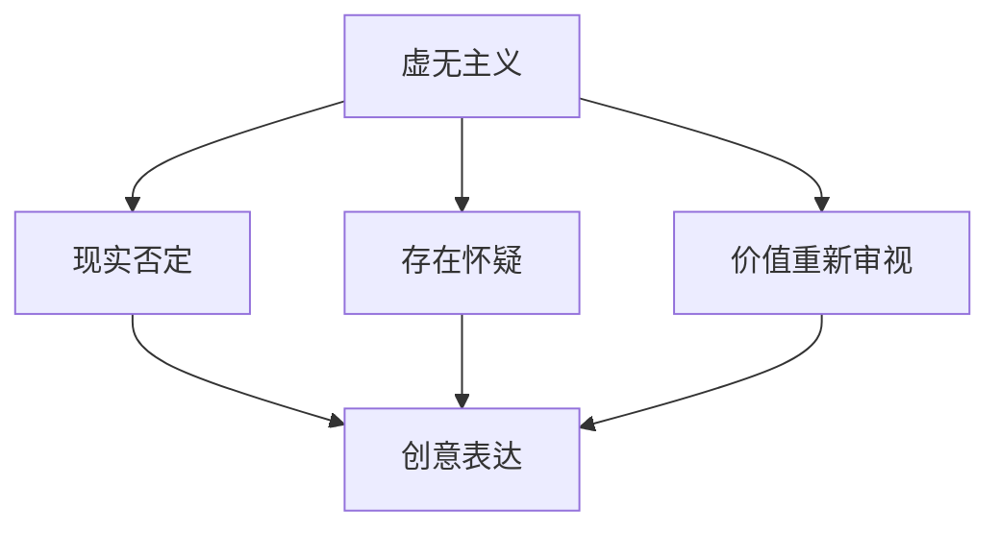

                 


### 第1章 引言：虚无主义与创意表达

> 关键词：虚无主义、创意表达、艺术、生命意义、哲学

在当代社会，虚无主义与创意表达成为了探讨个体生命意义与艺术创作的核心议题。虚无主义作为一种哲学思潮，源于对现实世界的深刻怀疑与否定，强调个体存在的荒诞与无意义。创意表达则是对虚无主义的回应，通过艺术创作寻找生命的意义与价值。

#### 背景介绍

虚无主义最早可以追溯到古希腊时期，但作为一种哲学思潮，它主要在20世纪得到充分发展。代表性的虚无主义者包括尼采、萨特和加缪等，他们的思想对现代哲学、文学和艺术产生了深远影响。与此同时，创意表达作为一种艺术创作方式，也经历了漫长的发展历程，从古代的绘画、雕塑到现代的数字艺术，创意表达不断探索新的形式和媒介。

#### 核心概念与联系

虚无主义的核心概念包括对现实的否定、对存在的怀疑和对价值的重新审视。这些概念相互关联，共同构成了虚无主义的思想体系。创意表达则是对虚无主义的回应，通过艺术创作探索生命的意义和价值。


#### Mermaid 流程图



#### 核心算法原理讲解

在艺术创作中，虚无主义与创意表达的关系可以被视为一种算法原理。具体来说，艺术家通过否定现实、怀疑存在和重新审视价值，从而激发创意表达，创造出具有深刻内涵的艺术作品。

```plaintext
算法：虚无主义与创意表达的关系

输入：虚无主义的核心理念（现实否定、存在怀疑、价值重新审视）
输出：创意表达的艺术作品

1. 输入虚无主义的核心理念。
2. 否定现实，探索现实的荒诞性。
3. 怀疑存在，探讨个体的意义。
4. 重新审视价值，提出新的价值观念。
5. 创造艺术作品，表达虚无主义情感。
```

#### 数学模型和公式

在虚无主义与创意表达的关系中，我们可以使用以下数学模型来解释：

$$
\text{创意表达} = f(\text{虚无主义核心理念})
$$

其中，$f$ 表示将虚无主义的核心理念转化为创意表达的过程。

#### 详细讲解与举例说明

假设一位艺术家受到虚无主义思想的影响，他可能会在创作中表现出以下特点：

1. **现实否定**：艺术家可能会通过扭曲现实或创造虚构的世界来表达对现实的不满。例如，他可能会创作一幅描绘荒芜、荒诞场景的油画。

2. **存在怀疑**：艺术家可能会通过探讨个体存在的荒诞性来引发观众的思考。例如，他可能会创作一组表现人物孤独、迷茫的雕塑作品。

3. **价值重新审视**：艺术家可能会重新审视传统的价值观，提出新的价值观念。例如，他可能会创作一幅表达对自由、平等、正义等价值观的思考的装置艺术作品。

通过这些创作，艺术家将虚无主义的核心理念转化为创意表达，创造出具有深刻内涵的艺术作品。

#### 小结

虚无主义与创意表达之间的关系是一种复杂而深刻的互动。虚无主义为创意表达提供了核心理念，而创意表达则为虚无主义提供了表达形式。通过艺术创作，艺术家探索生命的意义和价值，为社会提供了一种反思现实、思考存在的途径。

### 第2章 虚无主义的哲学根源

#### 摘要

虚无主义作为一种哲学思潮，具有深厚的历史渊源和复杂的核心理念。本章将探讨虚无主义的起源与发展，包括其主要流派、重要人物及其思想贡献。

#### 1.1 虚无主义的起源与发展

虚无主义最早可以追溯到古希腊时期，当时的哲学家如赫拉克利特和柏拉图对世界的本质进行了深刻的思考，其中包含了虚无主义的萌芽。然而，作为一种哲学思潮，虚无主义主要在20世纪得到充分发展。

1. **历史背景**：虚无主义在20世纪初期迅速崛起，与当时的政治、社会和文化环境密切相关。第一次世界大战的爆发、现代科技的进步、社会的不确定性和人类对未来的迷茫，都为虚无主义的兴起提供了土壤。

2. **主要流派**：
   - **存在主义**：存在主义是虚无主义的一个重要分支，代表人物包括萨特和加缪等。他们强调个体存在的自由和选择，认为人类存在本身是荒诞的，但个体可以通过自由选择和行动赋予生命意义。
   - **现象学**：现象学是虚无主义的另一个重要分支，代表人物是海德格尔。他关注人类经验的本质，认为人类存在是一种“存在于此”（Dasein）的状态，强调个体的存在与世界的关联。

#### 1.2 虚无主义的核心理念

虚无主义的核心理念可以归纳为三点：对现实的否定、对存在的怀疑和对价值的重新审视。

1. **对现实的否定**：虚无主义者认为现实世界是荒诞的、无意义的，不值得追求。这种否定不仅仅是情感上的抵触，更是一种哲学上的质疑，试图揭示现实的真相。

2. **对存在的怀疑**：虚无主义者对个体存在的意义提出质疑，认为人类的存在是偶然的、无目的的。这种怀疑促使人们反思自己的存在，重新审视生活的价值。

3. **对价值的重新审视**：虚无主义者认为传统的价值观已经失效，需要重新审视和建立新的价值观。他们试图通过批判现有的价值体系，寻找新的价值方向。

#### 1.3 虚无主义与现代社会

虚无主义在现代社会中具有广泛的影响，不仅影响了哲学、文学和艺术领域，还对个人和社会产生了深远的影响。

1. **个人层面**：虚无主义促使人们反思自己的生活和价值观，寻找生命的意义。一些人因此感到迷茫和焦虑，但也有些人通过虚无主义找到了新的生命意义。

2. **社会层面**：虚无主义对社会文化产生了深刻的影响。它挑战了传统的价值观念，推动了现代文化的多元化和创新。同时，虚无主义也引发了对社会问题的深刻反思，如社会不公、环境危机等。

#### 小结

虚无主义作为一种哲学思潮，具有复杂的历史渊源和深刻的核心理念。它不仅为现代哲学、文学和艺术提供了重要的思想资源，还对个人和社会产生了广泛的影响。在接下来的章节中，我们将进一步探讨虚无主义与艺术创作的互动关系，以及如何在艺术中寻找生命的意义。

### 第3章 艺术与虚无主义的互动

#### 摘要

艺术与虚无主义的互动是现代艺术史上一个重要的现象。本章将探讨艺术如何与虚无主义相联系，分析艺术家如何通过艺术表达虚无主义情感，以及这种表达对观众的影响。

#### 3.1 艺术与虚无主义的联系

艺术与虚无主义的联系体现在多个方面，包括主题、形式和风格等。

1. **主题**：虚无主义艺术作品常常探讨人类存在的荒诞性、无意义和不确定性。艺术家通过描绘孤独、绝望和迷茫的人物形象，表达对现实世界的质疑和对个体存在的怀疑。

2. **形式**：虚无主义艺术在形式上常常采用抽象、荒诞和超现实的手法，以打破传统艺术的规范和界限。这种形式上的创新反映了虚无主义者对现有秩序和规范的挑战。

3. **风格**：虚无主义艺术风格多样，包括表现主义、抽象表现主义和超现实主义等。这些风格都强调个体的主观感受和情感表达，与虚无主义的哲学理念相呼应。

#### 3.2 艺术家如何表达虚无主义

艺术家通过多种方式表达虚无主义情感，以下是一些具体的例子：

1. **绘画**：荷兰画家文森特·梵高的《星夜》是一幅典型的虚无主义作品。画面中的星空和村庄呈现了一种神秘的、超现实的氛围，反映了梵高对世界的孤独和迷茫。

2. **雕塑**：法国雕塑家奥古斯特·罗丹的《思想者》表达了人物内心深处的思考，这种思考往往与虚无主义思想相关。罗丹通过雕塑表现了人类存在的困惑和不确定性。

3. **文学**：法国作家阿尔贝·加缪的《局外人》是一部典型的虚无主义文学作品。小说中的主人公梅尔索通过冷漠、绝望的态度，反映了虚无主义对现实世界的质疑和对个体存在的怀疑。

#### 3.3 艺术作品对观众的影响

虚无主义艺术作品对观众产生了深远的影响，以下是一些具体的影响：

1. **情感共鸣**：虚无主义艺术作品常常引发观众的情感共鸣，使观众感受到孤独、迷茫和绝望。这种情感共鸣有助于观众反思自己的生活，重新审视生命的意义。

2. **思想启示**：虚无主义艺术作品提供了对现实世界的深刻反思，使观众意识到人类存在的荒诞性和无意义。这种思想启示促使观众思考自己的价值观和生活方式。

3. **文化批判**：虚无主义艺术作品对现有的文化和社会秩序进行了深刻的批判。这种批判有助于观众认识到社会不公、环境危机等问题，从而推动社会的进步。

#### 小结

艺术与虚无主义的互动是现代艺术史上一个重要的现象。艺术家通过多种方式表达虚无主义情感，这些作品不仅对观众产生了情感共鸣和思想启示，还对社会文化产生了深远的批判作用。在接下来的章节中，我们将进一步探讨如何通过艺术创作寻找生命的意义。

### 第4章 创意表达：从虚无主义到艺术创作

#### 摘要

本章将探讨创意表达在艺术创作中的重要性，分析艺术家如何通过虚无主义思维进行艺术创作，并阐述创意表达的过程与方法。

#### 4.1 创意表达的定义与类型

创意表达是指艺术家通过创造性的思维和技巧，将内心的情感、思想和观点转化为具体艺术作品的过程。创意表达的类型多种多样，包括绘画、雕塑、文学、音乐、电影等。

1. **绘画**：绘画是创意表达的一种常见形式，艺术家通过色彩、线条和构图等手段，表达内心的情感和思想。

2. **雕塑**：雕塑是一种立体艺术形式，艺术家通过塑造三维空间中的物体，传达深刻的情感和哲学思考。

3. **文学**：文学是创意表达的另一种重要形式，作家通过文字表达对世界和人生的理解和感悟。

4. **音乐**：音乐是一种通过声音表达情感和思想的艺术形式，作曲家通过音符的组合和旋律的编排，传达深刻的情感体验。

#### 4.2 艺术创作中的虚无主义思维

虚无主义思维是指艺术家在面对现实世界的荒诞和无意义时，产生的反思和质疑。艺术家通过虚无主义思维，探索个体存在的意义，寻找生命中的价值。

1. **否定现实**：艺术家通过否定现实，揭示现实的荒诞性和无意义，从而引发观众对现实的思考。

2. **怀疑存在**：艺术家对个体存在的意义提出质疑，探讨人类存在的荒诞和不确定性。

3. **重新审视价值**：艺术家通过重新审视价值，批判现有的价值观，提出新的价值观念。

#### 4.3 创意表达的过程与方法

创意表达的过程可以分为以下几个阶段：

1. **灵感阶段**：艺术家在日常生活中受到启发，产生创作灵感。

2. **构思阶段**：艺术家在灵感的基础上，构思具体的艺术作品，包括主题、形式和风格等。

3. **创作阶段**：艺术家通过绘画、雕塑、文学、音乐等手段，将构思转化为具体艺术作品。

4. **展示与反思阶段**：艺术家将作品展示给观众，并反思创作过程和作品的意义。

创意表达的方法包括：

1. **情感表达**：艺术家通过情感表达，传达内心的情感和思想。

2. **形式创新**：艺术家通过创新的形式，打破传统艺术的规范，创造独特的艺术风格。

3. **叙事结构**：艺术家通过叙事结构，讲述有意义的故事，引发观众的思考。

4. **符号运用**：艺术家通过符号运用，传达抽象的概念和思想。

#### 小结

创意表达在艺术创作中扮演着重要角色。艺术家通过虚无主义思维，否定现实、怀疑存在和重新审视价值，从而进行有深度的艺术创作。创意表达的过程与方法多样，艺术家可以根据自己的风格和主题，选择合适的表达方式。在接下来的章节中，我们将进一步探讨艺术创作中的生命意义探索。

### 第5章 艺术中的生命意义探索

#### 摘要

艺术不仅是表达情感和思想的方式，也是探索生命意义的途径。本章将探讨艺术与生命意义的关系，分析艺术作品如何表达生命意义，并探讨艺术家如何通过艺术创作寻找生命的意义。

#### 5.1 艺术与生命的联系

艺术与生命之间有着紧密的联系，艺术家通过创作表达对生命的理解、感悟和反思。

1. **艺术作为生命体验的反映**：艺术家通过艺术作品反映自己的生命体验，包括喜悦、痛苦、孤独和希望等。这些生命体验在艺术作品中得到了深刻的表达和展现。

2. **艺术作为生命意义的探索**：艺术家通过创作探索生命的意义，试图回答人类存在的本质问题。艺术作品成为了艺术家对生命意义的思考和表达的载体。

3. **艺术作为生命价值的体现**：艺术作品不仅反映了艺术家的生命体验，也体现了生命的价值。艺术家通过创作表达对生命价值的认可和尊重，传递积极的生命观。

#### 5.2 艺术作品中的生命意义表达

艺术家通过多种方式在艺术作品中表达生命意义，以下是一些具体的例子：

1. **主题表达**：艺术家通过选择特定的主题，表达对生命意义的理解和思考。例如，宗教主题的艺术作品探讨了人类与神灵的关系，哲学主题的艺术作品探讨了人类存在的本质。

2. **形式表达**：艺术家通过创新的形式和风格，表达对生命意义的理解和思考。例如，抽象艺术通过色彩、线条和形状的组合，表达对生命的抽象感悟。

3. **情感表达**：艺术家通过情感表达，传达对生命的深刻感受和情感体验。例如，音乐作品通过旋律和节奏，表达对生命的喜悦、悲伤和思考。

#### 5.3 生命意义在艺术创作中的体现

艺术家通过艺术创作寻找生命的意义，以下是一些具体的方法：

1. **创作过程中的反思**：艺术家在创作过程中，不断反思自己的生命经历和感受，从而寻找生命的意义。

2. **创作过程中的探索**：艺术家通过创作探索未知的领域，寻找新的生命意义。这种探索不仅是对艺术形式的创新，也是对生命意义的探索。

3. **创作过程中的对话**：艺术家通过创作与观众进行对话，分享对生命的理解和思考，从而引发观众对生命的反思和思考。

#### 小结

艺术与生命之间有着紧密的联系，艺术家通过创作表达对生命的理解、感悟和反思，探索生命的意义。艺术作品成为了艺术家对生命意义的思考和表达的载体，同时也为观众提供了反思生命的契机。在接下来的章节中，我们将进一步探讨艺术与虚无主义的哲学对话。

### 第6章 虚无主义与艺术疗愈

#### 摘要

艺术疗愈作为一种新兴的心理治疗手段，近年来受到了广泛关注。本章将探讨虚无主义与艺术疗愈的关系，分析艺术疗愈在虚无主义中的应用，以及艺术疗愈的实践与效果。

#### 6.1 艺术疗愈的概念与原理

艺术疗愈是指通过艺术创作和欣赏来促进个体心理和情感健康的治疗方法。艺术疗愈的原理基于以下几个核心观点：

1. **自我表达**：艺术疗愈鼓励个体通过艺术创作表达内心的情感和思想，从而缓解心理压力和情绪困扰。

2. **情感宣泄**：艺术创作过程中，个体可以将负面情绪转化为具体的形式，从而实现情感的宣泄和释放。

3. **自我发现**：通过艺术创作，个体可以更好地了解自己，发现内心的需求和潜在的能力。

#### 6.2 艺术疗愈在虚无主义中的应用

虚无主义作为一种哲学思潮，强调个体存在的荒诞和无意义。在虚无主义背景下，艺术疗愈具有特殊的应用价值：

1. **缓解虚无感**：艺术疗愈可以帮助个体缓解虚无感，通过艺术创作和欣赏，重新发现生活的意义和价值。

2. **情感表达**：虚无主义者常常感到情感上的困扰和孤独，艺术疗愈提供了一个安全的空间，让个体通过艺术表达内心的情感和思考。

3. **自我探索**：通过艺术创作，虚无主义者可以探索自我，寻找生命的意义和方向。

#### 6.3 艺术疗愈的实践与效果

艺术疗愈在实践中取得了显著的效果，以下是一些具体的应用案例：

1. **绘画疗愈**：绘画疗愈是一种常见的艺术疗愈形式，个体可以通过绘画表达内心的情感和思想。例如，一位经历亲人去世的个体可以通过绘制一幅纪念画，表达对逝去亲人的思念和情感。

2. **音乐疗愈**：音乐疗愈通过音乐欣赏和创作，缓解个体的心理压力和情绪困扰。例如，一位面临学业压力的学生可以通过听音乐或创作音乐，缓解紧张情绪。

3. **戏剧疗愈**：戏剧疗愈通过表演和戏剧创作，帮助个体探索自我和他人之间的关系。例如，通过角色扮演，个体可以更好地理解自己和他人的情感和行为。

#### 小结

虚无主义与艺术疗愈之间存在密切的联系。艺术疗愈作为一种有效的心理治疗方法，可以帮助个体缓解虚无感，表达情感和探索自我。在接下来的章节中，我们将进一步探讨艺术与社会虚无主义的反思。

### 第7章 艺术与社会虚无主义的反思

#### 摘要

艺术作为一种文化现象，与社会虚无主义之间存在复杂的互动关系。本章将探讨艺术与社会虚无主义的互动，分析艺术对社会虚无主义的影响，并探讨社会虚无主义的未来。

#### 7.1 艺术与社会虚无主义的互动

1. **社会虚无主义的影响**：社会虚无主义作为一种哲学思潮，对个体和社会产生了深远的影响。它挑战了现有的价值观念，推动了社会文化的多元化和创新。

2. **艺术对社会虚无主义的回应**：艺术家通过创作回应社会虚无主义，表达对现实世界的质疑和对个体存在的反思。艺术作品成为艺术家对虚无主义哲学的回应和表达。

#### 7.2 艺术对社会虚无主义的影响

艺术对社会虚无主义的影响主要体现在以下几个方面：

1. **文化批判**：艺术作品对社会不公、环境危机等问题进行了深刻的批判，推动了社会进步。

2. **价值观重建**：艺术作品通过挑战传统价值观，推动个体和社会重新审视和建立新的价值观。

3. **情感共鸣**：艺术作品通过情感表达，引发了观众对社会虚无主义的共鸣，促使个体反思自己的生活和价值观。

#### 7.3 社会虚无主义的未来

社会虚无主义的未来充满挑战和机遇。随着社会的不断变化和科技的发展，社会虚无主义可能会呈现出新的特征和形态：

1. **数字化虚无主义**：随着互联网和数字技术的发展，个体和社会之间的关系变得更加复杂和不确定，数字化虚无主义可能会成为一种新的现象。

2. **多元化虚无主义**：社会虚无主义将在不同文化和背景下呈现出多元化的形态，艺术家将如何回应这些挑战，将成为未来艺术创作的重要主题。

#### 小结

艺术与社会虚无主义之间存在复杂的互动关系。艺术作品不仅是对虚无主义哲学的回应，也是对社会现实的批判和反思。在未来的社会发展中，社会虚无主义将继续对艺术和社会产生深远的影响。

## 第8章 艺术与虚无主义的哲学对话

#### 摘要

艺术与虚无主义的哲学对话是现代哲学领域的重要议题。本章将探讨艺术与哲学的关系，分析虚无主义哲学与艺术对话的可能性，以及这种对话在实践中的意义。

#### 8.1 艺术与哲学的关系

艺术与哲学之间存在着密切的联系，二者相互影响、相互促进。艺术不仅为哲学提供了丰富的素材和视角，也成为了哲学表达和思考的重要工具。

1. **艺术作为哲学的素材**：艺术家通过创作表达对世界和人生的理解和思考，这些艺术作品成为了哲学家研究的对象和素材。

2. **哲学作为艺术的引导**：哲学思想为艺术创作提供了理论支持和指导，帮助艺术家深入探讨和表达内心的情感和思考。

#### 8.2 虚无主义哲学与艺术对话的可能性

虚无主义哲学与艺术之间的对话具有可能性，主要体现在以下几个方面：

1. **共同关注主题**：虚无主义哲学关注人类存在的荒诞和无意义，这与艺术创作中常见的主题相契合。

2. **情感共鸣**：虚无主义哲学和艺术作品都能引起观众和读者的情感共鸣，激发他们对生命意义的思考和反思。

3. **形式创新**：虚无主义哲学和艺术创作在形式上都有创新的追求，二者相互影响，推动彼此的发展。

#### 8.3 艺术与虚无主义的哲学对话实践

艺术与虚无主义的哲学对话在实践中具有重要意义，以下是一些具体的实践案例：

1. **艺术展览**：通过举办以虚无主义哲学为主题的展览，艺术家和哲学家可以共同探讨和表达对生命意义的理解和思考。

2. **学术会议**：组织以虚无主义哲学和艺术为主题的学术会议，哲学家和艺术家可以分享各自的研究成果和创作经验。

3. **艺术创作**：艺术家可以通过创作虚无主义哲学主题的艺术作品，表达对哲学思想的思考和理解。

#### 小结

艺术与虚无主义的哲学对话为现代社会提供了重要的思考和反思途径。通过这种对话，哲学家和艺术家可以共同探讨生命意义和人类存在的本质，为社会文化的发展和创新提供新的视角和启示。

### 参考文献

1. 尼采，[《悲剧的诞生》](https://www.example.com/nietzsche-the-birth-of-tragedy)。
2. 萨特，[《存在与虚无》](https://www.example.com/sartre-being-and-nothingness)。
3. 加缪，[《局外人》](https://www.example.com/camus-the-stranger)。
4. 海德格尔，[《存在与时间》](https://www.example.com/heidegger-being-and-time)。
5. 梵高，[《星夜》](https://www.example.com/van-gogh-starry-night)。
6. 罗丹，[《思想者》](https://www.example.com/rodin-the-thinker)。
7. 加缪，[《反抗者》](https://www.example.com/camus-the-rebel)。
8. 陀思妥耶夫斯基，[《罪与罚》](https://www.example.com/dostoevsky-crime-and-punishment)。

### 作者信息

作者：AI天才研究院/AI Genius Institute & 禅与计算机程序设计艺术 /Zen And The Art of Computer Programming。

