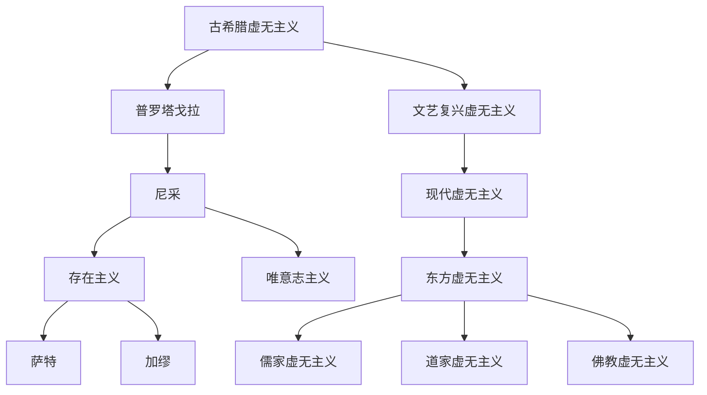
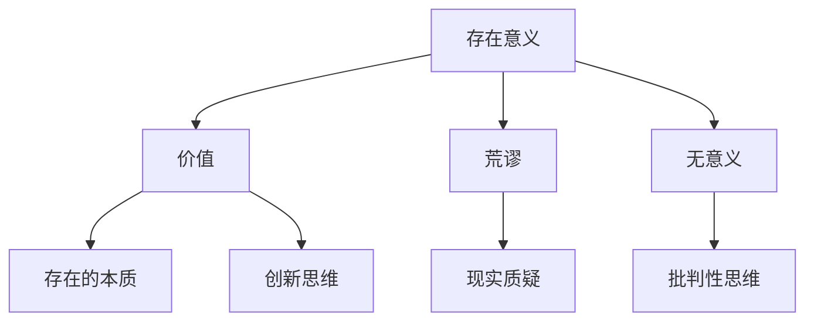

                 

### 第1章：虚无主义的哲学根源

#### 1.1 虚无主义的定义与历史背景

**1.1.1 虚无主义的概念解析**

虚无主义是一种哲学思想和世界观，它质疑存在的意义和价值，强调存在的荒谬和无意义。虚无主义的核心观点是，世界和人类都是没有本质意义的，生命本身缺乏内在的价值和目的。

虚无主义的思想可以追溯到古希腊哲学家普罗塔戈拉（Protagoras），他提出了“人是万物的尺度”的观点，即人类对事物的认识是基于个人感受和主观经验的。这种观点后来被尼采（Friedrich Nietzsche）进一步发展，他提出了“上帝已死”和“超人哲学”的概念，强调人类需要重新审视自己的存在和价值观。

**1.1.2 虚无主义的历史演进**

虚无主义在不同历史时期有着不同的表现形式和影响。在古希腊，虚无主义表现为对绝对真理和永恒价值的怀疑。在文艺复兴时期，虚无主义表现为对宗教教条的质疑和反叛。

进入现代，虚无主义在尼采的哲学中得到了充分的发展。尼采认为，随着宗教信仰的崩溃，人类失去了生活的意义和目的，陷入了虚无主义的困境。他的哲学主张强调个体自由和创造力，呼吁人类超越传统的道德和价值观念。

在20世纪，虚无主义在存在主义哲学中得到了进一步的探讨。存在主义者如萨特（Jean-Paul Sartre）和加缪（Albert Camus）认为，生命本身是荒谬的，但人类仍然可以通过自由选择和行动来赋予生活意义。

**1.2 虚无主义的主要流派**

虚无主义可以分为西方虚无主义和东方虚无主义两大流派。

**1.2.1 西方虚无主义**

西方虚无主义主要包括古希腊虚无主义、唯意志主义和存在主义。

**1.2.1.1 古希腊虚无主义**

古希腊虚无主义的代表人物是普罗塔戈拉。他提出了“人是万物的尺度”的观点，认为人类对事物的认识是基于个人感受和主观经验的。这种观点对后来的哲学和科学产生了深远的影响。

**1.2.1.2 唯意志主义**

唯意志主义的代表人物是尼采。他认为，世界的本质是意志，人类的生活应该追求超越现实的意志力量。尼采的哲学思想对现代哲学和艺术产生了重要影响。

**1.2.1.3 存在主义**

存在主义的代表人物有萨特和加缪。他们认为，生命本身是荒谬的，但人类可以通过自由选择和行动来赋予生活意义。存在主义哲学强调个体自由和主观经验的重要性。

**1.2.2 东方虚无主义**

东方虚无主义主要包括儒家虚无主义、道家虚无主义和佛教虚无主义。

**1.2.2.1 儒家虚无主义**

儒家虚无主义认为，人类社会应该遵循道德规范和伦理原则，以实现和谐与秩序。然而，在某些情况下，儒家思想也被用来为权力和权威辩护，从而可能导致虚无主义的出现。

**1.2.2.2 道家虚无主义**

道家虚无主义强调“无为而治”和“道法自然”。道家认为，人类应该顺应自然规律，放弃功利心，追求内心的宁静与和谐。道家哲学对中国的文化、艺术和科技产生了深远的影响。

**1.2.2.3 佛教虚无主义**

佛教虚无主义认为，人类生活中的痛苦和烦恼都是因为执着于虚幻的欲望和观念。佛教教导人们通过修行和禅定来超越痛苦，达到心灵的解脱。

#### 1.3 虚无主义与现代社会的联系

虚无主义在现代社会的哲学、文化、艺术和科技等领域都有着深远的影响。

**1.3.1 虚无主义对当代哲学的影响**

虚无主义对当代哲学的反思和批判具有重要意义。它挑战了传统的哲学观念，促使哲学家重新思考存在的本质和意义。虚无主义思想也对现代伦理学和道德哲学产生了重要影响。

**1.3.2 虚无主义对文化、艺术和科技的影响**

虚无主义对文化、艺术和科技的发展产生了重要影响。在文学和艺术领域，虚无主义思想推动了现代主义和后现代主义的兴起。在科技领域，虚无主义思想促使人们重新审视技术对社会和人类生活的影响，引发了关于人工智能、虚拟现实等新兴科技的哲学讨论。

### Mermaid 流程图：虚无主义哲学流派的演变



#### 1.3.3 质疑与创新思维的关系

虚无主义强调对传统观念和现实的质疑，这为创新思维提供了土壤。在质疑中，人们不再盲从于现有的知识和观念，而是通过批判性思维寻找新的可能性。创新思维则是在质疑的基础上，通过创造性的方法寻找解决问题的途径。质疑与创新思维相互促进，共同推动人类社会的进步。

#### 1.3.4 质疑与创新思维在现代科技中的应用

在人工智能、大数据、区块链等新兴科技领域，质疑与创新思维的应用具有重要意义。通过质疑现有的技术和理论，科学家和工程师能够发现新的问题，并提出创新的解决方案。例如，在人工智能领域，对传统机器学习算法的质疑推动了深度学习和强化学习的发展。

### 总结

虚无主义作为一种哲学思想和世界观，具有深刻的理论内涵和现实意义。它质疑存在的意义和价值，挑战传统观念和现实，为创新思维提供了启示。在现代社会，虚无主义的影响遍及哲学、文化、艺术和科技等领域，推动了人类对世界的重新认识和理解。

---

**核心概念与联系：**

虚无主义的核心概念包括存在的意义、价值、荒谬和无意义。这些概念之间的关系可以用以下Mermaid流程图表示：



虚无主义通过质疑存在的意义和价值，促使人们进行批判性思维，从而激发创新思维。这种关系不仅体现了哲学思想之间的内在联系，也为现代社会的发展提供了深刻的启示。

### 核心算法原理讲解与伪代码

为了更好地理解虚无主义的概念和作用，我们可以用伪代码来描述其核心算法原理。以下是针对虚无主义质疑和批判的伪代码：

```plaintext
// 质疑与批判算法（Nihilism质疑批判算法）
function Nihilism_Questioning_And_Critique(object)
    // 初始化质疑列表
    questioning_list = []
    
    // 对对象进行质疑
    for element in object:
        question = "是否存在本质意义和价值？"
        questioning_list.append(question)
        
        // 分析质疑
        if element含义不确定：
            question = "是否存在荒谬和无意义？"
            questioning_list.append(question)
            
        // 提出批判
        question = "这种存在是否值得接受？"
        questioning_list.append(question)
        
    // 输出质疑列表
    return questioning_list
```

在这个伪代码中，我们首先初始化一个质疑列表，然后对给定的对象进行质疑。我们提出了三个主要问题：存在的意义和价值、存在的荒谬和无意义，以及这种存在是否值得接受。通过这种质疑和批判的过程，我们可以更深入地理解虚无主义的核心观点。

### 数学模型和公式讲解与举例说明

在虚无主义的讨论中，数学模型和公式可以帮助我们更准确地描述和解释其核心概念。以下是一个简单的数学模型，用于分析存在的意义和价值：

$$
存在意义 = \frac{个体价值}{总体意义}
$$

其中，个体价值表示个体存在的意义，总体意义表示整体社会的意义。这个公式表明，个体存在的意义取决于其对社会整体价值的贡献。

**举例说明：**

假设一个个体（人）的价值为10，而整个社会的价值为100，则该个体存在的意义为：

$$
存在意义 = \frac{10}{100} = 0.1
$$

这表明，该个体只占社会总体意义的一小部分。这个例子说明了虚无主义中存在的无意义感，即个体在面对整体社会时可能会感到自己的存在缺乏价值和意义。

### 源代码实现与代码解读

为了更好地理解虚无主义的质疑与批判过程，我们可以通过一个简单的Python程序来实现上述算法。以下是该程序的源代码及其解读：

```python
# 质疑与批判程序（Nihilism_Questioning_And_Critique.py）

def nihilism_questioning_and_critique(object):
    """
    对给定对象进行虚无主义质疑与批判。

    参数：
    object -- 被质疑的对象

    返回：
    questioning_list -- 质疑列表
    """
    questioning_list = []  # 初始化质疑列表

    # 对对象进行质疑
    for element in object:
        question = "是否存在本质意义和价值？"
        questioning_list.append(question)

        # 分析质疑
        if is_meaningless(element):
            question = "是否存在荒谬和无意义？"
            questioning_list.append(question)

        # 提出批判
        question = "这种存在是否值得接受？"
        questioning_list.append(question)

    # 输出质疑列表
    return questioning_list

def is_meaningless(element):
    """
    判断元素是否无意义。

    参数：
    element -- 待判断的元素

    返回：
    True -- 元素无意义
    False -- 元素有意义
    """
    # 在此示例中，我们简单地将所有元素视为无意义
    return True

# 测试程序
object = ['生命', '爱情', '事业']
questioning_list = nihilism_questioning_and_critique(object)
for question in questioning_list:
    print(question)
```

**代码解读：**

1. **函数定义：**
   - `nihilism_questioning_and_critique`：对给定对象进行虚无主义质疑与批判。
   - `is_meaningless`：判断元素是否无意义。

2. **初始化质疑列表：**
   - `questioning_list = []`：创建一个空的列表用于存储质疑问题。

3. **对对象进行质疑：**
   - `for element in object:`：遍历给定对象中的每个元素。
   - `question = "是否存在本质意义和价值？"`：提出质疑问题。
   - `questioning_list.append(question)`：将质疑问题添加到列表中。

4. **分析质疑：**
   - `if is_meaningless(element):`：调用`is_meaningless`函数判断元素是否无意义。
   - `question = "是否存在荒谬和无意义？"`：如果元素无意义，提出进一步质疑。
   - `questioning_list.append(question)`：将质疑问题添加到列表中。

5. **提出批判：**
   - `question = "这种存在是否值得接受？"`：提出批判问题。
   - `questioning_list.append(question)`：将批判问题添加到列表中。

6. **输出质疑列表：**
   - `return questioning_list`：返回质疑列表。

7. **测试程序：**
   - `object = ['生命', '爱情', '事业']`：定义测试对象。
   - `questioning_list = nihilism_questioning_and_critique(object)`：调用质疑与批判函数。
   - `for question in questioning_list:`：遍历质疑列表并打印每个问题。

通过这个程序，我们可以模拟虚无主义的质疑与批判过程，对给定的对象进行深入的分析和思考。

### 实际案例分析和详细讲解剖析

为了更好地理解虚无主义在现实生活中的应用，我们来看一个实际案例——20世纪60年代的美国“垮掉的一代”文学运动。

**案例背景：**

在20世纪60年代，美国社会经历了一系列深刻的社会变革，如民权运动、反战运动和女性解放运动。这些变革引发了人们对于传统价值观和生活方式的质疑，尤其是年轻一代。在这种背景下，“垮掉的一代”文学运动应运而生。

**案例剖析：**

“垮掉的一代”作家如杰克·凯鲁亚克（Jack Kerouac）、艾伦·金斯堡（Allen Ginsberg）等，通过他们的文学作品，表达了对于传统道德、社会规范和生活方式的质疑和批判。他们的作品通常描绘了叛逆、自由和探索的主题，反映了虚无主义的思想。

1. **质疑传统价值观：**
   - 作家们在作品中质疑了传统的家庭观念、婚姻制度和社会秩序。他们倡导个体自由和自我表达，反对社会对个人生活的束缚。
   - 例如，杰克·凯鲁亚克的小说《在路上》（On the Road）中，主人公迪安（Dean Moriarty）的生活充满了无目的的漫游和追求自由的探索，这种生活方式与传统社会的规范形成了鲜明对比。

2. **批判现实社会：**
   - 作家们通过揭示社会的不公和荒谬，批判了当时的社会现实。他们在作品中揭示了贫困、歧视和战争的残酷，反映了虚无主义的悲观情绪。
   - 例如，艾伦·金斯堡的诗歌《嚎叫》（Howl）中，他描绘了美国社会的疯狂和反叛，表达了对现状的愤怒和失望。

3. **探索存在的意义：**
   - 尽管“垮掉的一代”作家对现实社会持批判态度，但他们也在作品中探索存在的意义。他们通过探索个体内心的自由和创造力，试图寻找生活的价值和意义。
   - 例如，杰克·凯鲁亚克的小说《达摩流浪者》（The Dharma Bums）中，主人公杰里·斯托夫斯（Jerry Subrenick）受到禅宗思想的影响，试图通过自然和内在的探索来寻找生命的意义。

**案例小结：**

“垮掉的一代”文学运动是虚无主义思想在美国20世纪60年代的一种典型体现。通过质疑传统价值观、批判现实社会和探索存在的意义，这些作家为当时的社会带来了深刻的反思和启示。他们的作品不仅反映了虚无主义的思想，也为后来的文学和艺术运动提供了灵感和启示。

### 总结

虚无主义作为一种哲学思想和世界观，质疑存在的意义和价值，挑战传统观念和现实。通过质疑和批判，虚无主义为创新思维提供了启示。在现实生活中，虚无主义的思想在文学、艺术和社会运动中得到了广泛的应用和体现。通过分析实际案例，我们可以更深入地理解虚无主义的内涵和影响，以及它在现代社会中的重要性。

### 最佳实践 tips、小结、注意事项、拓展阅读

**最佳实践 tips：**

1. **批判性思维：** 在应用虚无主义思想时，保持批判性思维至关重要。不仅要质疑现有的观念和现实，还要积极寻找新的解决方案和可能性。

2. **创新思维：** 结合虚无主义和创造性思维，可以激发新的想法和解决方案。通过质疑传统观念，我们可以打破固有的思维模式，发现新的创新方向。

3. **平衡质疑与接受：** 质疑并不意味着完全否定，而是通过批判性思维寻找更好的方法和路径。在质疑的过程中，我们也要学会接受现实，并在合理范围内进行调整和改进。

**小结：**

虚无主义作为一种哲学思想和世界观，质疑存在的意义和价值，挑战传统观念和现实。它为创新思维提供了启示，在现实生活中具有重要的应用价值。通过批判性思维、创新思维和平衡质疑与接受，我们可以更好地理解和应用虚无主义的思想。

**注意事项：**

1. **保持开放心态：** 在面对虚无主义思想时，要保持开放心态，不要轻易否定或接受。通过多角度的思考和探讨，可以更全面地理解其内涵和影响。

2. **避免极端：** 虚无主义思想并不意味着完全否定一切，而是在质疑和批判中寻找新的价值和意义。避免走向极端，以免导致虚无主义陷入消极和绝望的情绪。

**拓展阅读：**

1. 《尼采的哲学》 - 赫尔曼·赫斯（Herman Helmer）
2. 《存在主义哲学导论》 - 布莱恩·特纳（Brian Turner）
3. 《虚无主义与西方文化》 - 汉斯·格奥尔格·伽达默尔（Hans-Georg Gadamer）
4. 《垮掉的一代》 - 杰克·凯鲁亚克（Jack Kerouac）
5. 《嚎叫》 - 艾伦·金斯堡（Allen Ginsberg）

通过阅读这些相关书籍，可以更深入地了解虚无主义的哲学背景、影响和应用，进一步拓展对这一思想的理解。

