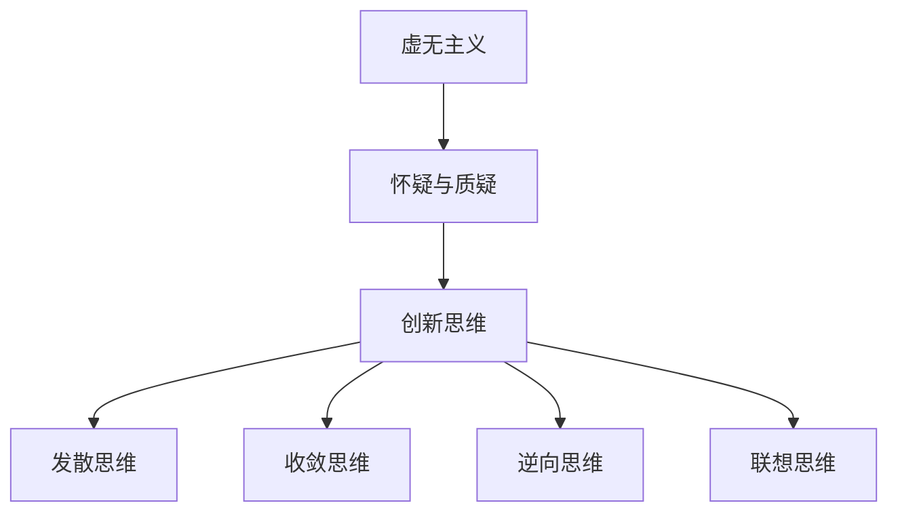

                 

### 《虚无主义与创新思维：在质疑中寻找突破和可能性》

> **关键词：**虚无主义，创新思维，质疑，突破，可能性

> **摘要：**本文探讨了虚无主义在激发创新思维中的重要作用，通过历史背景、哲学观点、方法论等方面的深入分析，揭示了虚无主义如何在质疑中寻找突破和可能性，并提出了培养创新思维的方法和实践建议。

---

#### 引言

**1.1 虚无主义与创新思维的碰撞**

虚无主义是一种哲学思想，主要特征是对现实的怀疑、对存在的否定。而创新思维则是一种在问题解决和知识创造过程中，能够提出独特、新颖想法和方案的能力。这两者的碰撞，激发出了许多富有启示性的思想和实践。

**1.2 书籍结构概览**

本文将分为以下章节：

- **第1章** 虚无主义：哲学与文化的探讨
- **第2章** 创新思维：本质与价值
- **第3章** 虚无主义与创新思维的关系
- **第4章** 培养创新思维的方法
- **第5章** 虚无主义与创新思维的项目实战
- **第6章** 虚无主义与创新思维的数学模型与公式
- **第7章** 结论与展望

#### 第1章 虚无主义：哲学与文化的探讨

**2.1 虚无主义的起源与发展**

虚无主义的历史可以追溯到古希腊时期，但真正的发展是在20世纪，特别是在西方哲学中得到了广泛的关注。虚无主义的主要思想是对现实世界的怀疑、对人类存在的否定，以及对意义和价值的质疑。

**2.2 虚无主义的哲学观点**

虚无主义有多种哲学观点，包括：

- **存在主义的虚无主义**：以海德格尔为代表，强调人的存在先于本质，人类在世的本质是一种自由的存在，但这种自由同时也是一种无意义的存在。
- **神秘主义的虚无主义**：以尼采为代表，认为世界的本质是一种“永恒回归”的循环，人类在这种循环中失去了自我和意义。
- **后现代主义的虚无主义**：以福柯为代表，认为现代社会中存在着一种“话语权力”的压制，个体在这种压制下无法获得真正的自由和意义。

**2.3 虚无主义在文化中的影响**

虚无主义在文化领域产生了深远的影响，包括艺术、文学、电影等。例如，现代艺术中的抽象主义、表现主义，文学中的荒诞派、黑色幽默，电影中的反乌托邦、末日题材，都体现了虚无主义的哲学思想。

#### 第2章 创新思维：本质与价值

**3.1 创新思维的定义与类型**

创新思维是指在面对问题时，能够从不同的角度、以独特的方式思考，提出新颖的解决方案的思维过程。创新思维可以分为以下几种类型：

- **发散思维**：从多个角度思考问题，寻找多种可能的解决方案。
- **收敛思维**：从特定的角度思考问题，将多个解决方案集中到一个最优解。
- **逆向思维**：从问题的反面思考，找到创新的解决方案。
- **联想思维**：通过联想，将看似不相关的事物联系起来，产生新的想法。

**3.2 创新思维的价值**

创新思维具有重要的价值，它能够：

- **推动社会进步**：创新思维能够推动技术、科学、经济、文化等各个领域的进步。
- **提升竞争力**：创新思维能够帮助企业在激烈的市场竞争中脱颖而出。
- **激发个人潜能**：创新思维能够激发个人的创造力和潜能，实现自我价值的提升。

#### 第3章 虚无主义与创新思维的关系

**4.1 虚无主义如何激发创新思维**

虚无主义对现实的怀疑和否定，促使人们不断质疑现状，寻找新的可能性。这种质疑精神是创新思维的重要动力。例如，许多科技巨头如乔布斯、盖茨等，都在他们的成功过程中体现了虚无主义的精神。

**4.2 创新思维在虚无主义背景下的应用**

在虚无主义的背景下，创新思维能够帮助人们：

- **突破思维定势**：通过创新思维，人们能够突破传统的思维模式，寻找新的解决方案。
- **发现潜在需求**：创新思维能够帮助人们发现隐藏在现实中的潜在需求，创造出新的产品和服务。
- **应对不确定性**：在虚无主义的世界中，不确定性是常态，创新思维能够帮助人们更好地应对这种不确定性。

**4.3 虚无主义与创新思维的 Mermaid 流程图**

#### 第4章 培养创新思维的方法

**5.1 创新思维的定义与类型**

创新思维是指在面对问题时，能够从不同的角度、以独特的方式思考，提出新颖的解决方案的思维过程。创新思维可以分为以下几种类型：

- **发散思维**：从多个角度思考问题，寻找多种可能的解决方案。
- **收敛思维**：从特定的角度思考问题，将多个解决方案集中到一个最优解。
- **逆向思维**：从问题的反面思考，找到创新的解决方案。
- **联想思维**：通过联想，将看似不相关的事物联系起来，产生新的想法。

**5.2 创新思维培养的方法与实践**

- **多角度思考**：在面对问题时，尝试从不同的角度思考，寻找新的解决方案。
- **跨学科学习**：通过跨学科的学习，拓宽知识面，提高创新能力。
- **定期思考**：定期进行思维训练，如头脑风暴、思维导图等，提高思维的灵活性。
- **实践与反馈**：通过实际操作，将创新思维转化为具体的成果，并从反馈中不断改进。

#### 第5章 虚无主义与创新思维的项目实战

**6.1 虚无主义背景下的创新项目**

以“虚拟现实社交平台”为例，这是一个在虚无主义背景下诞生的创新项目。该项目旨在通过虚拟现实技术，创造一个与现实生活相似的社交平台，让用户可以在虚拟世界中建立联系、互动和分享。

**6.2 项目实战案例分析**

- **需求分析**：在虚无主义背景下，人们对于现实世界的信任度下降，对虚拟世界的需求增加。因此，虚拟现实社交平台能够满足用户对虚拟社交的需求。
- **技术实现**：该项目采用了虚拟现实技术、人工智能技术等，实现了用户在虚拟世界中的互动、交流、分享等功能。
- **挑战与解决方法**：在项目开发过程中，面临的主要挑战包括虚拟现实技术的成熟度、用户隐私保护等问题。通过不断优化技术方案、加强用户隐私保护措施，项目得以顺利推进。

**6.3 项目实战中的挑战与解决方法**

- **技术挑战**：虚拟现实技术的发展还不够成熟，项目需要不断优化技术方案，以提高用户体验。
- **用户隐私保护**：虚拟现实社交平台涉及用户的隐私数据，需要加强用户隐私保护措施，防止数据泄露。
- **市场需求分析**：需要对市场需求进行深入分析，确保项目的可行性和市场竞争力。

**6.4 项目小结**

虚拟现实社交平台项目在虚无主义背景下诞生，通过创新思维和技术手段，解决了现实世界中存在的问题。该项目不仅为用户提供了新的社交方式，也为虚拟现实技术的发展提供了新的应用场景。

#### 第6章 虚无主义与创新思维的数学模型与公式

**7.1 数学模型在虚无主义与创新思维中的应用**

在虚无主义背景下，数学模型能够帮助人们更好地理解现实、预测未来，从而在创新思维中找到突破点。以下是一些常见的数学模型：

- **贝叶斯网络**：用于表示不确定性知识和推理，可以帮助人们从不同的角度分析问题。
- **线性回归**：用于预测变量之间的关系，可以帮助人们发现潜在的需求和趋势。
- **神经网络**：用于模拟人脑的神经网络结构，可以帮助人们进行复杂的问题求解。

**7.2 虚无主义与创新思维中的关键数学公式**

- **贝叶斯定理**：用于计算后验概率，可以帮助人们从不确定性中找到确定性。
- **梯度下降法**：用于优化参数，可以帮助人们在复杂问题中找到最优解。
- **相关系数**：用于衡量变量之间的相关性，可以帮助人们发现潜在的联系。

**7.3 数学模型与公式的示例说明**

- **贝叶斯定理**：假设我们有一个事件 A，我们想要计算 P(A|B)，即在已知事件 B 发生的条件下，事件 A 发生的概率。根据贝叶斯定理，我们有：

  $$P(A|B) = \frac{P(B|A)P(A)}{P(B)}$$

  其中，P(A) 是事件 A 的先验概率，P(B|A) 是在事件 A 发生的条件下，事件 B 发生的概率，P(B) 是事件 B 的先验概率。

- **线性回归**：假设我们有两个变量 X 和 Y，我们想要找到它们之间的关系。线性回归模型可以用以下公式表示：

  $$Y = \beta_0 + \beta_1X + \epsilon$$

  其中，$\beta_0$ 和 $\beta_1$ 是模型的参数，$\epsilon$ 是误差项。

#### 第7章 结论与展望

**8.1 全书总结**

本文从虚无主义和创新思维的角度，探讨了在质疑中寻找突破和可能性的方法。通过历史背景、哲学观点、方法论等方面的深入分析，揭示了虚无主义在激发创新思维中的重要作用，并提出了培养创新思维的方法和实践建议。

**8.2 对未来虚无主义与创新思维发展的展望**

随着社会的发展，虚无主义和创新思维将继续相互影响、相互促进。未来，我们可以期待：

- **更深入的交叉研究**：虚无主义与创新思维的交叉研究将不断深入，产生更多的理论成果和实践应用。
- **更多的创新项目**：在虚无主义背景下，将涌现出更多的创新项目，为社会发展带来新的动力。
- **更高效的问题解决方法**：通过结合虚无主义和创新思维，我们将找到更高效的问题解决方法，提高生活质量。

**8.3 研究局限与未来研究方向**

本文的研究存在一定的局限，主要包括：

- **理论模型的局限性**：本文所使用的理论模型可能无法完全解释现实中的复杂问题。
- **实践应用的局限性**：本文所提出的实践方法可能无法直接应用于所有场景。

未来研究方向包括：

- **更深入的理论研究**：对虚无主义和创新思维进行更深入的理论研究，探索其内在机制和作用机理。
- **更多的实证研究**：通过实证研究，验证虚无主义和创新思维在实际应用中的效果和影响。

### 参考文献

1. 海德格尔，(1927). 《存在与时间》。
2. 尼采，(1882). 《善恶的彼岸》。
3. 福柯，(1975). 《话语的秩序》。
4. 乔布斯，(2005). 《活着就为改变世界》。
5. 盖茨，(2008). 《站在巨人的肩膀上》。
6. 罗伯特·弗里特，(2013). 《人工智能：一种现代方法》。

### 附录

附录中可以包括：

- **数学公式表**：列出文中使用的主要数学公式。
- **代码示例**：提供文中提到的关键代码示例。
- **流程图**：提供文中提到的关键流程图。

---

**作者：**AI天才研究院/AI Genius Institute & 禅与计算机程序设计艺术 /Zen And The Art of Computer Programming

