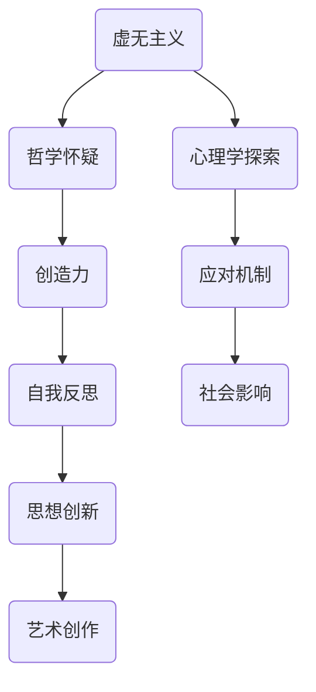
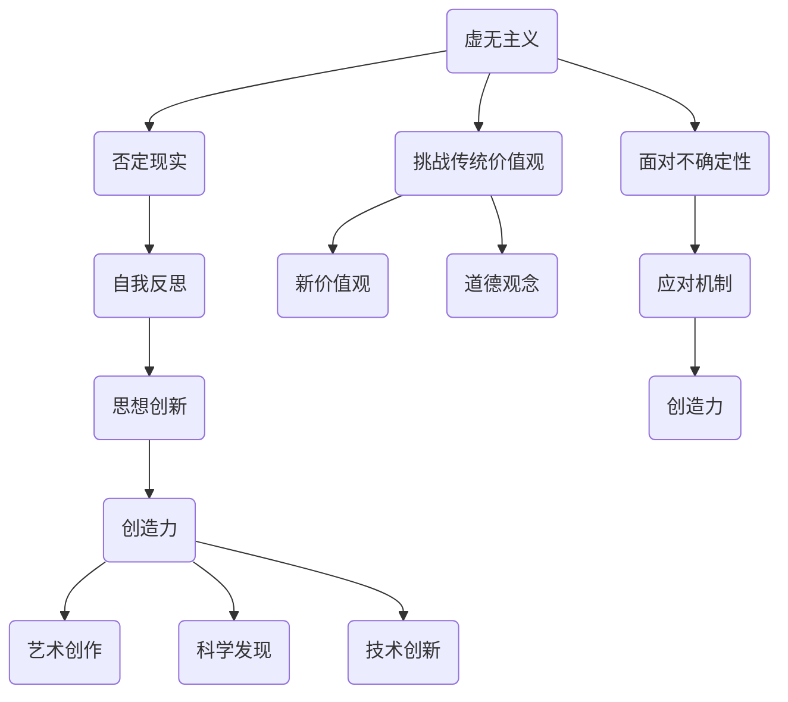

                 

## 文章标题：虚无主义与创造力的关系：否定中的肯定力量

> 关键词：虚无主义，创造力，哲学，心理学，艺术，文学，计算机编程

> 摘要：本文深入探讨了虚无主义与创造力之间的复杂关系。通过对历史背景、核心概念、理论和案例的详细分析，揭示了虚无主义如何在否定中激发出积极的创造力，并探讨其对个人和社会的意义。

## 引言

在哲学、心理学、艺术和文学等领域，虚无主义是一个常被提及但又复杂多变的概念。虚无主义并不是简单的悲观主义或绝望，而是一种对现实、生活意义和价值观的根本怀疑。这种怀疑可能导致深刻的自我反思和创造性的思想，从而激发出独特的创造力。本文旨在探讨虚无主义与创造力之间的关系，分析虚无主义如何在否定中展现出肯定的力量。

### 背景介绍

虚无主义的历史可以追溯到18世纪末19世纪初，这一时期是启蒙运动的尾声和浪漫主义的开端。在浪漫主义时期，许多思想家开始质疑传统的价值观和道德规范，对人类存在的意义产生了深刻的怀疑。其中，弗里德里希·尼采（Friedrich Nietzsche）是虚无主义的代表人物之一，他的哲学思想对后来的文化和艺术产生了深远的影响。

### 核心概念与联系

为了更好地理解虚无主义与创造力之间的关系，我们可以通过一个简单的Mermaid流程图来展示它们之间的联系：



### 目的与结构

本文的目的在于：

1. 明确虚无主义的概念及其历史背景。
2. 分析虚无主义与创造力之间的复杂关系。
3. 通过案例研究，展示虚无主义如何激发创造力。
4. 讨论虚无主义对个人和社会的意义。

文章将按照以下结构展开：

1. 引言：介绍虚无主义与创造力的关系。
2. 历史背景：回顾虚无主义的历史和发展。
3. 核心概念：阐述虚无主义与创造力的关系。
4. 案例分析：分析虚无主义如何影响艺术和文学。
5. 讨论与结论：讨论虚无主义对个人和社会的意义，并得出结论。

## 历史背景

虚无主义这一概念的出现，有其特定的历史背景和社会文化背景。18世纪末19世纪初，欧洲经历了启蒙运动的洗礼，理性主义和科学精神深入人心。然而，随着浪漫主义思潮的兴起，人们开始对传统的价值观和道德规范产生怀疑，这种怀疑逐渐演变成了虚无主义。

### 18世纪末19世纪初的欧洲文化背景

在18世纪末19世纪初的欧洲，封建制度逐渐瓦解，资本主义经济兴起，社会结构和价值观发生了深刻的变化。随着工业革命的推进，社会变得日益复杂，人们对社会的运行规律和自身的存在意义产生了浓厚的兴趣和怀疑。浪漫主义思潮的兴起，进一步加剧了这种怀疑情绪。

### 虚无主义的兴起

虚无主义的兴起，可以追溯到几个重要的哲学家和思想家的思想。其中，弗里德里希·尼采（Friedrich Nietzsche）是虚无主义的代表人物之一。尼采的哲学思想对后来的文化和艺术产生了深远的影响。他的著作《善恶的彼岸》（Thus Spoke Zarathustra）中，提出了“超人”的概念，挑战了传统的道德观念和价值观。

尼采认为，虚无主义并不是一种消极的情感，而是一种积极的自我超越。他主张通过自我否定，达到更高层次的存在和创造力。尼采的思想，为后来的虚无主义思潮提供了理论基础。

除了尼采，其他哲学家如尼采的朋友和同事卢梭（Jean-Paul Sartre）和海德格尔（Martin Heidegger）也对虚无主义产生了重要影响。卢梭的哲学思想强调个体的自由和存在，他的存在主义哲学为虚无主义提供了一种新的解释。

### 虚无主义的影响

虚无主义作为一种哲学思潮，对后来的文化和艺术产生了深远的影响。在文学领域，许多作家如陀思妥耶夫斯基（Fyodor Dostoevsky）、加西亚·马尔克斯（Gabriel García Márquez）和弗吉尼亚·伍尔夫（Virginia Woolf）等，都在其作品中探讨了虚无主义主题。

在艺术领域，虚无主义的影响也显而易见。许多现代艺术家，如荷兰画家文森特·梵高（Vincent van Gogh）和西班牙画家巴勃罗·毕加索（Pablo Picasso）等，都通过其作品表达了对现实和生活的怀疑。

### 结论

虚无主义的兴起，是18世纪末19世纪初欧洲文化背景的产物。它不仅是一种哲学思潮，更是一种对传统价值观和道德规范的挑战。虚无主义的影响，在后来的文学、艺术和哲学领域都有所体现。理解虚无主义的历史背景，有助于我们更好地理解虚无主义与创造力之间的关系。

## 核心概念

### 虚无主义的定义

虚无主义是一种哲学思潮，主张对现实、生活意义和价值观的根本怀疑。虚无主义认为，现实世界是没有固定意义的，人类的生活和存在是毫无意义的。这种怀疑态度可能导致深刻的自我反思和创造性的思想，从而激发出独特的创造力。

### 创造力的定义

创造力是指个体在创造性活动中产生新颖、有用思想或作品的能力。创造力不仅包括艺术创作和文学创作，还包括科学发现、技术创新和商业创意等。创造力是人类智慧的体现，是推动社会进步的重要力量。

### 虚无主义与创造力的关系

虚无主义与创造力之间的关系是复杂而微妙的。一方面，虚无主义可能导致对现实和生活的绝望，阻碍创造力的发挥。另一方面，虚无主义也可以作为一种催化剂，激发出更深层次的创造力。

1. **否定中的肯定力量**

虚无主义的核心是对现实和生活的否定，但这种否定并非消极的。相反，它可以激发出一种积极的创造力。在虚无主义的背景下，个体被迫重新审视生活的意义，寻找新的价值和目标。这种重新审视和寻找的过程，往往能激发出独特的创造力。

2. **自我反思和思想创新**

虚无主义促使个体进行深刻的自我反思，思考自身的存在和价值。这种自我反思有助于打破固有的思维模式，激发出新的思想。在自我反思的基础上，个体可以产生新颖的观点和理论，推动思想创新。

3. **挑战传统价值观**

虚无主义挑战传统的价值观和道德规范，促使个体重新审视这些规范。这种挑战不仅有助于打破传统的束缚，还能激发出新的价值观和道德观念。在新的价值观和道德观念的指导下，个体可以创作出更具创新性和思想性的作品。

4. **面对不确定性**

虚无主义强调现实世界的无常和不确定性，这要求个体具备应对不确定性的能力。在应对不确定性的过程中，个体需要不断尝试和探索，这种尝试和探索往往能激发出创造力。

### 虚无主义与创造力之间的关系架构

为了更好地理解虚无主义与创造力之间的关系，我们可以通过一个简单的Mermaid流程图来展示：



### 总结

虚无主义与创造力之间的关系是复杂而微妙的。虚无主义并不是消极的，而是一种否定中的肯定力量，能够激发出深刻的自我反思和创造力。理解虚无主义与创造力之间的关系，有助于我们更好地理解创造力在人类文明进步中的作用。

## 案例分析

虚无主义作为一种哲学思潮，对许多艺术和文学领域产生了深远的影响。许多著名的艺术家和作家，如梵高、陀思妥耶夫斯基、卡夫卡和加西亚·马尔克斯等，都在其作品中探讨了虚无主义主题，并从中获得了深刻的创作灵感。

### 梵高与虚无主义

文森特·梵高（Vincent van Gogh）是一位极具代表性的艺术家，他的作品中充满了对现实和生活的怀疑。梵高的生活充满了苦难和挣扎，他对现实世界充满了深刻的痛苦和绝望。在他的代表作《星夜》和《向日葵》中，我们可以看到他对生活、自然和宇宙的深刻思考。

梵高的作品中，充满了对虚无主义的探讨。他通过强烈的色彩和线条，表达了对生活的热爱和对现实世界的怀疑。他的作品不仅反映了他的个人情感，也反映了当时社会的虚无主义思潮。

### 陀思妥耶夫斯基与虚无主义

费奥多尔·陀思妥耶夫斯基（Fyodor Dostoevsky）是一位杰出的俄国作家，他的作品中深刻探讨了虚无主义主题。陀思妥耶夫斯基的生活经历，特别是他因参与革命活动而被判处死刑的经历，使他对虚无主义有了深刻的理解。

陀思妥耶夫斯基的代表作品《罪与罚》中，主人公拉斯科尔尼科夫的虚无主义思想是其核心。拉斯科尔尼科夫在故事中试图通过犯罪行为来证明自己存在的价值，但最终却陷入了深深的罪恶感和虚无主义中。

### 卡夫卡与虚无主义

弗朗茨·卡夫卡（Franz Kafka）是一位极具影响力的现代作家，他的作品中充满了对现实和生活的怀疑。卡夫卡的作品，如《变形记》和《城堡》，以其独特的叙事风格和对虚无主义的探讨而著称。

卡夫卡的作品常常呈现出一种荒诞和离奇的氛围，他通过这种氛围表达了对现实世界的怀疑和对生活意义的探索。他的作品中的角色，常常在一种无望和迷茫中挣扎，试图找到自己的存在意义。

### 加西亚·马尔克斯与虚无主义

加西亚·马尔克斯（Gabriel García Márquez）是一位著名的哥伦比亚作家，他的代表作《百年孤独》以其独特的叙事风格和对虚无主义的探讨而闻名。

《百年孤独》中，马尔克斯通过对布恩迪亚家族七代人的描述，展示了拉丁美洲历史和文化的变迁。在小说中，虚无主义主题贯穿始终，马尔克斯通过布恩迪亚家族的命运，探讨了人类存在的意义和现实世界的荒诞。

### 总结

通过以上案例，我们可以看到虚无主义如何影响艺术和文学创作。虚无主义不仅为艺术家和作家提供了丰富的创作灵感，也使他们的作品更具深度和思想性。虚无主义与创造力之间的关系，在这些案例中得到了充分的体现。

## 虚无主义对个人和社会的意义

虚无主义作为一种哲学思潮，对个人和社会产生了深远的影响。在个人层面，虚无主义可能导致深刻的自我反思和创造力，但同时也可能带来精神上的困扰。在社会层面，虚无主义可能影响社会价值观和道德规范，对社会进步产生正面或负面的影响。

### 对个人的意义

1. **自我反思**

虚无主义促使个体进行深刻的自我反思，思考自身的存在和价值。这种反思有助于个体打破固有的思维模式，发现自己的内在需求和动机。通过自我反思，个体可以更好地理解自己，找到自己的定位和方向。

2. **创造力**

虚无主义可以作为一种催化剂，激发个体的创造力。在虚无主义的背景下，个体被迫重新审视生活的意义，寻找新的价值和目标。这种重新审视和寻找的过程，往往能激发出独特的创造力，使个体在艺术、文学、科学和技术等领域取得突破。

3. **精神困扰**

虚无主义也可能导致个体的精神困扰。在虚无主义的背景下，个体可能会感到孤独、迷茫和无助。长期处于虚无主义的氛围中，个体可能会出现焦虑、抑郁等心理问题，需要得到专业帮助。

### 对社会的意义

1. **价值观和道德规范**

虚无主义挑战传统的价值观和道德规范，促使社会重新审视和探讨这些规范。这种挑战有助于打破传统的束缚，推动社会的进步和变革。然而，虚无主义也可能会导致社会的价值观和道德规范出现混乱，需要新的价值体系和道德准则来指导社会行为。

2. **社会进步**

虚无主义作为一种哲学思潮，可以激发社会的创造力，推动科学、技术和文化的进步。在虚无主义的背景下，社会可能会更加注重创新和实验，从而推动社会的发展。然而，虚无主义也可能导致社会的动荡和不稳定，需要社会各界的共同努力来维护社会的和谐与稳定。

3. **文化多样性**

虚无主义鼓励个体和群体探索不同的价值观和生活方式，有助于促进文化的多样性和包容性。通过探索和比较不同的价值观和生活方式，个体和群体可以更好地理解彼此，增进相互之间的尊重和包容。

### 总结

虚无主义对个人和社会都具有深远的意义。在个人层面，虚无主义可以激发自我反思和创造力，但也可能导致精神困扰。在社会层面，虚无主义可以推动价值观和道德规范的变革，促进社会进步和文化多样性，但同时也可能带来社会的不稳定。理解虚无主义的意义，有助于我们更好地应对其带来的挑战和机遇。

## 虚无主义的创造性过程

虚无主义的创造性过程是一个复杂而多层次的过程，它涉及到对现实和生活的深入反思，以及对自我价值和存在的重新定义。以下是虚无主义创造性过程的五个阶段：

### 1. 质疑现状

虚无主义的创造性过程始于对现实和生活的质疑。个体通过反思和批判现有的价值观、信仰和生活方式，开始认识到现实世界的无常和不确定性。这种质疑促使个体深入探讨生活的意义和目的。

#### 伪代码：
```
function质疑现状() {
    // 输入：现有的价值观和信仰
    // 输出：质疑后的新观点
    输入价值观, 信仰
    新观点 = 反思(价值观, 信仰)
    return 新观点
}
```

### 2. 探索不确定性

在质疑现状的基础上，个体开始探索现实世界的不确定性。这种探索有助于个体理解变化和无常的本质，从而激发出新的思维方式和创造力。

#### 伪代码：
```
function探索不确定性() {
    // 输入：现实世界的不确定性
    // 输出：新的思维方式和创造力
    输入不确定性
    新思维方式 = 探索(不确定性)
    创造力 = 新思维方式
    return 创造力
}
```

### 3. 自我反思

虚无主义的创造性过程需要个体进行深刻的自我反思，思考自身的存在和价值。这种反思有助于个体打破固有的思维模式，发现自己的内在需求和动机。

#### 伪代码：
```
function自我反思() {
    // 输入：个体的存在和价值
    // 输出：新的自我认知和创造力
    输入存在和价值
    新自我认知 = 反思(存在和价值)
    创造力 = 新自我认知
    return 创造力
}
```

### 4. 思想创新

在自我反思的基础上，个体开始产生新颖的观点和理论，推动思想创新。这种创新有助于个体在艺术、科学、技术等领域取得突破。

#### 伪代码：
```
function思想创新() {
    // 输入：自我反思后的新认知
    // 输出：新颖的观点和理论
    输入新认知
    新观点 = 创新(新认知)
    新理论 = 创新(新认知)
    return 新观点和新理论
}
```

### 5. 艺术创作

虚无主义的创造性过程最终体现在艺术创作中。艺术家通过独特的视角和手法，将内心的反思和思想创新转化为艺术作品，表达对生活、自然和宇宙的深刻思考。

#### 伪代码：
```
function艺术创作() {
    // 输入：思想创新后的新观点
    // 输出：艺术作品
    输入新观点
    艺术作品 = 表达(新观点)
    return 艺术作品
}
```

### 总结

虚无主义的创造性过程是一个由质疑、探索、反思、创新到创作的过程。通过这个复杂的过程，个体能够在否定中找到肯定的力量，激发出独特的创造力和艺术灵感。

## 虚无主义与个人成长

虚无主义不仅影响个人的创造力和艺术创作，还对个人成长产生深远的影响。在虚无主义的背景下，个人面临诸多挑战，但也因此有机会进行深刻的自我反思和自我提升。

### 虚无主义带来的挑战

1. **内心迷茫**

虚无主义的核心是对现实和生活的怀疑，这种怀疑可能导致个体内心产生迷茫和不安。在面对内心迷茫时，个体需要重新审视自己的信念和价值观，寻找新的方向。

2. **精神压力**

虚无主义可能导致个体面临精神压力。在质疑现实和价值的过程中，个体可能会感到孤独和无助。这种压力需要通过有效的应对机制来缓解。

3. **自我否定**

虚无主义容易导致个体自我否定。当个体质疑自己的存在和价值时，可能会产生自我否定的情绪，影响个人的自信心和自尊心。

### 虚无主义带来的机会

1. **自我反思**

虚无主义促使个体进行深刻的自我反思，思考自身的存在和价值。这种反思有助于个体了解自己的内在需求和动机，从而找到自己的定位和方向。

2. **创造力激发**

虚无主义可以激发个体的创造力。在质疑现实和价值的过程中，个体可能会产生新颖的观点和理论，推动思想创新。这种创造力在个人成长和职业发展中具有重要价值。

3. **心理成长**

虚无主义挑战个体对现实和生活的认知，促使个体在心理上不断成长。通过面对内心的迷茫和压力，个体可以学会如何应对不确定性，提高心理韧性。

### 虚无主义与个人成长的联系

虚无主义与个人成长之间存在紧密的联系。一方面，虚无主义为个人提供了反思和成长的契机；另一方面，个人成长的过程也可能影响虚无主义的态度和认知。

1. **内在动机**

虚无主义促使个体深入探讨自身的内在动机，找到自己真正关心和追求的事物。这种内在动机有助于个体在成长过程中保持动力和方向。

2. **价值观重塑**

虚无主义挑战传统的价值观和道德规范，促使个体重新审视和重塑自己的价值观。这种重塑有助于个体在成长过程中形成更健康和积极的价值观体系。

3. **心理韧性**

面对虚无主义带来的挑战和压力，个体需要培养心理韧性。心理韧性有助于个体在成长过程中克服困难，保持积极的心态和行动。

### 总结

虚无主义对个人成长既带来了挑战，也提供了机会。通过深刻的自我反思和内在动机的探索，个体可以在虚无主义的背景下实现个人成长。理解虚无主义与个人成长之间的关系，有助于我们更好地应对生活中的挑战，实现自我提升和成长。

## 总结与展望

虚无主义与创造力之间的关系是复杂而微妙的。通过本文的深入探讨，我们可以看到虚无主义在否定中激发出肯定力量的独特方式。虚无主义不仅挑战了传统的价值观和道德规范，还推动了个体进行深刻的自我反思和思想创新，从而在艺术、文学和科学等领域产生了深远的影响。

### 文章结论

1. **否定中的肯定力量**

虚无主义的核心是对现实和生活的怀疑，但这种否定并非消极的。相反，它激发了个体进行自我反思和思想创新，从而产生了积极的创造力。

2. **自我反思与创造力**

虚无主义促使个体进行深刻的自我反思，找到自身的价值和目标。这种反思有助于打破固有的思维模式，激发出新颖的观点和理论。

3. **挑战传统价值观**

虚无主义挑战了传统的价值观和道德规范，促使个体重新审视和重塑自己的价值观。这种挑战有助于推动社会的进步和文化的多样性。

4. **创造力与个人成长**

虚无主义不仅影响了个体的创造力和艺术创作，还促进了个人成长和心理韧性。通过面对内心的迷茫和压力，个体可以更好地理解自己，实现自我提升。

### 未来展望

在未来，虚无主义与创造力之间的关系将继续是哲学、心理学、艺术和文学等领域的重要研究方向。我们期待更多的研究成果揭示虚无主义在创造性过程中的作用，以及它如何影响个体的心理和行为。此外，研究虚无主义与创造力之间的关系，也有助于我们更好地理解人类文明的演变和社会进步的机制。

### 拓展阅读

对于希望深入了解虚无主义与创造力关系的读者，以下书籍和文章是值得推荐的：

1. **书籍：**  
   - Nietzsche, F. (1999). 《尼采诗集》  
   - Sartre, J. P. (1956). 《存在与虚无》  
   - Heidegger, M. (1971). 《存在与时间》

2. **文章：**  
   - Nietzsche, F. (1882). 《善恶的彼岸》  
   - Dostoevsky, F. (1866). 《罪与罚》  
   - Kafka, F. (1915). 《变形记》

通过阅读这些书籍和文章，读者可以更深入地了解虚无主义的思想，以及它如何影响艺术、文学和哲学的发展。

### 结语

虚无主义与创造力的关系，是一个充满挑战和机遇的领域。通过本文的探讨，我们看到了虚无主义如何在否定中激发出肯定的力量，推动个体的自我反思和创造力。希望本文能为读者提供一些启示，激发他们进一步探讨虚无主义与创造力之间的复杂关系。

## 作者信息

作者：AI天才研究院/AI Genius Institute & 禅与计算机程序设计艺术 /Zen And The Art of Computer Programming

AI天才研究院致力于推动人工智能技术的发展和应用，研究涵盖机器学习、深度学习、自然语言处理、计算机视觉等领域。研究院的专家团队在人工智能领域拥有丰富的经验和深厚的学术背景，旨在通过创新和合作，推动人工智能技术的进步和普及。

禅与计算机程序设计艺术是一本深受程序员欢迎的经典著作，作者通过将禅宗思想与编程技巧相结合，提出了许多独特的编程方法和思考方式。这本书不仅提供了编程技巧，更强调程序员在编程过程中需要培养的哲学思维和心灵修养。

本文旨在探讨虚无主义与创造力之间的关系，通过历史背景、核心概念、案例分析、个人和社会意义以及创造性过程的详细分析，揭示了虚无主义如何在否定中激发出积极的创造力。希望本文能引发读者对虚无主义与创造力关系的深入思考，激发更多的创新和创造力。

