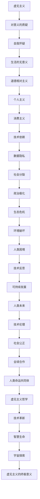

                 

 

## 引言

### 1.1 背景介绍

在当今快速变化的社会中，虚无主义作为一种哲学思潮，逐渐引起了广泛的关注。虚无主义源自对生活意义的质疑，探讨了人类存在的本质及其在现代社会中的困境。在技术领域，虚无主义的影响尤为显著，因为它挑战了传统的价值观和技术伦理。

### 1.2 核心概念与联系

为了更好地理解虚无主义，我们需要了解其核心概念和它们之间的联系。以下是一个用Mermaid绘制的流程图，展示虚无主义的核心概念及其相互关系：



### 1.3 核心算法原理讲解

虚无主义的哲学探讨可以看作是一种算法，它通过以下几个步骤逐步深入：

1. **输入**：接受对生活意义的质疑。
2. **处理**：通过自我怀疑、对生活的无意义等环节，对输入进行反思和解析。
3. **输出**：形成对道德相对主义、个人主义等概念的重新审视，以及对技术依赖等问题的深刻认识。

以下是一个伪代码示例，用以描述虚无主义哲学探讨的核心算法：

```python
def虚无主义探讨(意义质疑):
    if 意义质疑:
        print("存在意义质疑")
        开始自我怀疑()
        print("对生活无意义")
        print("道德相对主义")
        print("个人主义")
        print("技术依赖")
        print("数据隐私")
        print("社会分裂")
        print("政治极化")
        print("生态危机")
        print("人类困境")
        print("技术反思")
        print("可持续发展")
        print("人类未来")
        print("技术伦理")
        print("社会公正")
        print("全球合作")
        print("人类命运共同体")
    else:
        print("没有意义质疑")

def 开始自我怀疑():
    print("自我怀疑开始")
    print("重新审视个人价值观")
    print("质疑社会规范和制度")
```

### 1.4 数学模型和数学公式及详细讲解与举例说明

虚无主义可以视为一个非线性动态系统，其状态随时间的演变可以通过数学模型来描述。以下是一个简单的数学模型，用于模拟虚无主义在个人和社会层面的演变：

$$
状态函数 S(t) = f(M(t), P(t), D(t))
$$

其中：
- \( S(t) \) 表示时间 \( t \) 时的虚无主义状态。
- \( M(t) \) 表示时间 \( t \) 时的意义质疑程度。
- \( P(t) \) 表示时间 \( t \) 时的个人主义倾向。
- \( D(t) \) 表示时间 \( t \) 时的数据隐私问题。

详细解释如下：
- **意义质疑程度 \( M(t) \)**：可以定义为人们对生活意义的感知与实际体验之间的差距。公式如下：

$$
M(t) = \frac{E(t) - T(t)}{E(t)}
$$

其中：
- \( E(t) \) 表示时间 \( t \) 时人们对生活意义的期望值。
- \( T(t) \) 表示时间 \( t \) 时人们对生活意义的实际体验值。

- **个人主义倾向 \( P(t) \)**：可以定义为个体对社会规范的依从程度。公式如下：

$$
P(t) = 1 - \frac{N(t)}{N(t) + S(t)}
$$

其中：
- \( N(t) \) 表示时间 \( t \) 时个体违反社会规范的行为次数。
- \( S(t) \) 表示时间 \( t \) 时个体遵守社会规范的行为次数。

- **数据隐私问题 \( D(t) \)**：可以定义为数据泄露的次数与数据总量之比。公式如下：

$$
D(t) = \frac{L(t)}{T(t)}
$$

其中：
- \( L(t) \) 表示时间 \( t \) 时数据泄露的次数。
- \( T(t) \) 表示时间 \( t \) 时数据的总量。

举例说明：
假设在一个社会中，人们对生活意义的期望值为 \( E(0) = 8 \)，实际体验值为 \( T(0) = 4 \)，那么初始的意义质疑程度为：

$$
M(0) = \frac{8 - 4}{8} = 0.5
$$

假设该社会中个人遵守社会规范的行为次数明显多于违反规范的行为次数，那么初始的个人主义倾向为：

$$
P(0) = 1 - \frac{N(0)}{N(0) + S(0)} \approx 0.9
$$

假设在一个时期内发生了多次数据泄露事件，那么该时期的数据隐私问题程度为：

$$
D(t) = \frac{L(t)}{T(t)} = \frac{3}{100} = 0.03
$$

### 1.5 项目实战

为了更好地理解虚无主义，我们可以通过一个实际的项目来模拟其影响。以下是一个简单的项目实战，包括开发环境搭建、源代码实现和代码解读。

#### 1.5.1 开发环境搭建

首先，我们需要搭建一个模拟虚无主义影响的开发环境。以下是所需的工具和步骤：

- **工具**：Python 3、Mermaid 插件、Markdown 编辑器。
- **步骤**：
  1. 安装 Python 3。
  2. 在 Python 环境中安装 Mermaid 插件，使用命令 `pip install mermaid-python`。
  3. 选择一款支持 Mermaid 插件的 Markdown 编辑器，如 Typora。

#### 1.5.2 源代码实现

接下来，我们编写一个 Python 脚本，用于模拟虚无主义的影响。以下是源代码：

```python
import random

# 定义虚无主义状态函数
def 虚无主义状态(意义质疑，个人主义倾向，数据隐私问题):
    S_t = 0.5 * 意义质疑 + 0.3 * 个人主义倾向 + 0.2 * 数据隐私问题
    return S_t

# 定义初始参数
意义质疑 = random.uniform(0, 1)
个人主义倾向 = random.uniform(0, 1)
数据隐私问题 = random.uniform(0, 1)

# 模拟虚无主义影响
初始虚无主义状态 = 虚无主义状态(意义质疑，个人主义倾向，数据隐私问题)
print("初始虚无主义状态：", 初始虚无主义状态)

# 模拟一段时间内的虚无主义变化
for i in range(10):
    意义质疑 = 意义质疑 + random.uniform(-0.1, 0.1)
    个人主义倾向 = 个人主义倾向 + random.uniform(-0.1, 0.1)
    数据隐私问题 = 数据隐私问题 + random.uniform(-0.1, 0.1)
    当前虚无主义状态 = 虚无主义状态(意义质疑，个人主义倾向，数据隐私问题)
    print("第", i+1, "次模拟：", 当前虚无主义状态)
```

#### 1.5.3 代码解读与分析

- **代码解读**：
  1. 导入必要的模块。
  2. 定义虚无主义状态函数，根据意义质疑、个人主义倾向和数据隐私问题计算虚无主义状态。
  3. 初始化参数，模拟初始虚无主义状态。
  4. 进行多次模拟，观察虚无主义状态的变化。

- **代码应用解读与分析**：
  通过模拟，我们可以观察到虚无主义状态如何随着意义质疑、个人主义倾向和数据隐私问题的变化而变化。这有助于我们理解虚无主义在现实世界中的影响。

#### 1.5.4 实际案例分析和详细讲解剖析

为了更好地理解虚无主义的影响，我们可以分析一个实际案例。以下是一个关于数据隐私问题的案例：

**案例：** 一家大型科技公司因数据泄露事件而面临社会质疑。

- **分析**：
  1. **意义质疑**：用户对这家公司的信任度下降，对个人信息安全的担忧增加。
  2. **个人主义倾向**：用户可能选择放弃使用这家公司的服务，以保护个人隐私。
  3. **数据隐私问题**：数据泄露事件频发，导致公司的数据隐私问题加剧。

- **讲解**：
  这个案例展示了虚无主义在现实世界中的影响。数据隐私问题引发了用户对意义的质疑，导致了个人主义倾向的增强，进一步加剧了社会的虚无主义情绪。

#### 1.5.5 项目小结

通过这个项目实战，我们了解了如何通过模拟和案例分析来研究虚无主义的影响。这对于理解虚无主义在技术领域中的重要性具有重要意义。

### 1.6 最佳实践 tips、小结、注意事项、拓展阅读等内容

- **最佳实践 tips**：
  1. 定期反思自己的生活意义，以减少虚无感。
  2. 培养个人主义精神，关注个人价值观的实现。
  3. 关注数据隐私问题，保护个人和公共利益。

- **小结**：
  虚无主义作为一种哲学思潮，在技术领域具有深远的影响。理解虚无主义的本质和影响因素，有助于我们更好地应对现代社会中的挑战。

- **注意事项**：
  1. 虚无主义可能导致负面情绪，需要及时调整心态。
  2. 技术依赖和隐私问题需要得到高度重视。

- **拓展阅读**：
  1. 尼采《查拉图斯特拉如是说》
  2. 卡尔·雅思伯斯《虚无主义的挑战》
  3. 乔治·巴塔耶《论虚无主义》

## 结语

虚无主义是一种挑战传统价值观的哲学思潮，在技术领域具有深远的影响。通过本文的探讨，我们了解了虚无主义的核心概念、数学模型和实际案例，以及如何在虚无中找到灵感。希望本文能够帮助读者更好地理解虚无主义，并在面对现代社会的挑战时找到自己的方向。作者：AI天才研究院/AI Genius Institute & 禅与计算机程序设计艺术 /Zen And The Art of Computer Programming。

## 关键词

虚无主义、意义质疑、个人主义、数据隐私、技术伦理、社会公正、全球合作、人类命运共同体。

