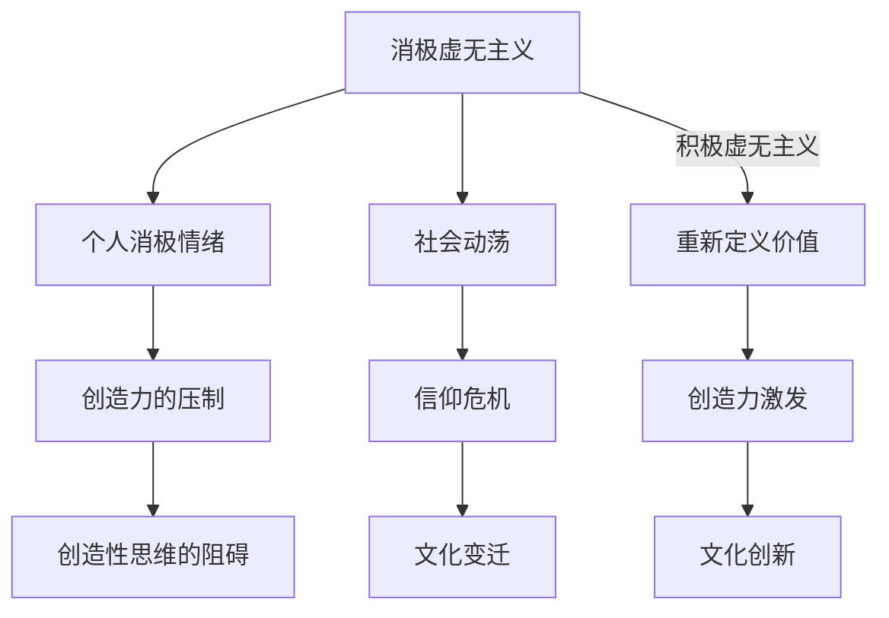
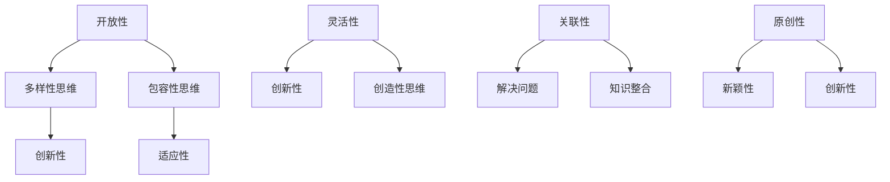
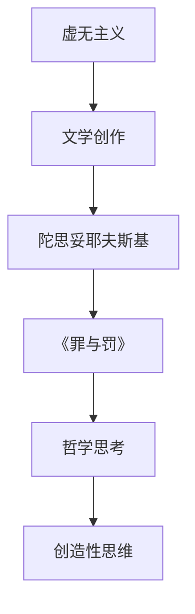
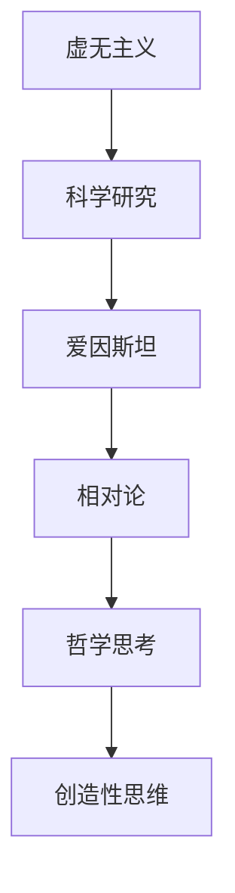
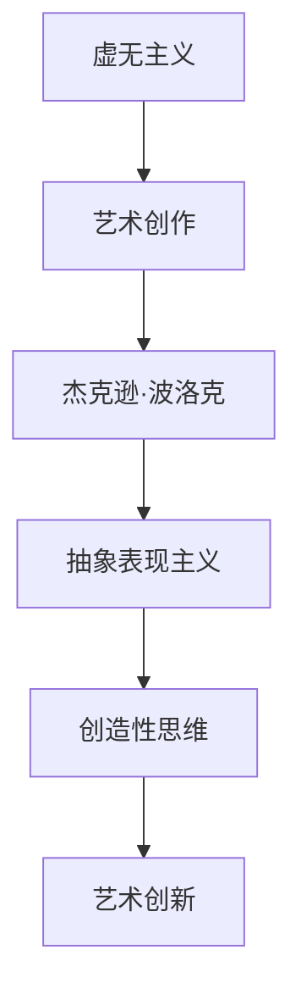

                 

### 第1章 引言

#### 1.1 虚无主义概述

虚无主义（Nihilism）是一种哲学思想，主张对传统道德、宗教和文化的价值体系进行否定。虚无主义的历史可以追溯到19世纪，当时由俄国作家陀思妥耶夫斯基（Fyodor Dostoevsky）等人提出，并在后来的哲学家中得到进一步发展。

**核心概念与联系**

虚无主义的核心概念可以分为两种：

1. **消极虚无主义**：认为宇宙和人类的存在缺乏内在价值，生活是毫无意义的。
2. **积极虚无主义**：虽然承认现实缺乏固有的价值，但通过创造性的方式重新定义和赋予意义。

这两种虚无主义之间存在着内在的联系和区别。消极虚无主义倾向于否定一切，导致个人和社会的悲观情绪；而积极虚无主义则通过寻找新的价值体系和意义，试图克服消极情绪。

**Mermaid 流程图**



#### 1.2 创造性思维的定义与特征

创造性思维（Creative Thinking）是一种在解决问题和面对新挑战时，能够产生新颖、有创意的想法和解决方案的思维方式。

**核心概念与联系**

创造性思维的主要特征包括：

1. **开放性**：对不同的观点和想法持开放态度。
2. **灵活性**：能够灵活地调整思维方式和观点。
3. **关联性**：能够发现不同事物之间的联系。
4. **原创性**：能够产生独特的、前所未有的想法。

这些特征使得创造性思维成为一个复杂但极其重要的能力，对于个体和社会的创新和发展至关重要。

**Mermaid 流程图**



**伪代码示例**

```python
def creative_thinking(problem):
    solutions = []
    while not solution_found:
        idea = generate_idea(problem)
        if is_valid(idea):
            solutions.append(idea)
        else:
            refine_idea(idea)
    return solutions
```

在本文中，我们将进一步探讨虚无主义与创造性思维的关联，分析它们在不同领域中的应用，并探讨如何在实际生活中平衡虚无主义对创造性思维的影响。这将有助于我们更好地理解虚无主义和创造性思维的本质，并在未来的创新和发展中做出更明智的决策。

### 1.3 文章关键词与摘要

**关键词：** 虚无主义，创造性思维，哲学，创新，文化，意义，价值观。

**摘要：** 本文通过探讨虚无主义与创造性思维的关系，分析了虚无主义对创造性思维的双重影响。一方面，虚无主义可能导致消极情绪和创造力压制；另一方面，它也可能激发新的创造性思维，推动文化创新和科技进步。本文旨在揭示虚无主义与创造性思维之间的复杂互动，为个体和社会的创新和发展提供理论指导和实际案例分析。

---

通过以上的引言，我们已经为读者搭建了理解虚无主义与创造性思维关联的基础框架。接下来，我们将深入探讨虚无主义对创造性思维的影响，分别从消极和积极两个方面进行详细分析。这将帮助我们更好地理解虚无主义的双重作用，并为在现实生活中平衡这两者之间的关系提供思路。

---

## 第2章 虚无主义对创造性思维的影响

虚无主义作为一种哲学思想，对创造性思维有着深远的影响。在本章中，我们将详细探讨虚无主义对创造性思维的双重影响：消极影响和积极影响。

### 2.1 虚无主义的消极影响

#### 2.1.1 虚无主义如何阻碍创造性思维

1. **导致个人消极情绪**

   虚无主义的核心观点是否定存在的价值，这可能导致个人对生活失去热情和动力。消极情绪如绝望、无助和悲观，会抑制个体的创造性思维。

   **Mermaid 流程图**

   ```mermaid
   graph TD
   A[虚无主义] --> B[消极情绪]
   B --> C[创造力抑制]
   ```

2. **破坏社会价值观**

   虚无主义否定传统的道德、宗教和文化价值观，这可能导致社会动荡和价值观的崩溃。在社会层面上，这种动荡会影响到个体的心态和行为，进一步抑制创造性思维。

   **Mermaid 流程图**

   ```mermaid
   graph TD
   A[虚无主义] --> B[价值观破坏]
   B --> C[社会动荡]
   C --> D[创造力抑制]
   ```

3. **信仰危机**

   虚无主义可能导致信仰危机，使个体对人生的意义和目的产生怀疑。这种怀疑会削弱个体的内在动力，使其难以产生新的想法和创新的解决方案。

   **Mermaid 流程图**

   ```mermaid
   graph TD
   A[虚无主义] --> B[信仰危机]
   B --> C[内在动力丧失]
   C --> D[创造力抑制]
   ```

#### 2.1.2 虚无主义导致的负面情绪

1. **绝望感**

   虚无主义认为宇宙和人类的存在缺乏内在价值，这可能导致个体产生强烈的绝望感。绝望感会削弱个体的心理能量，使其难以面对挑战和解决问题。

   **Mermaid 流程图**

   ```mermaid
   graph TD
   A[虚无主义] --> B[绝望感]
   B --> C[心理能量削弱]
   C --> D[创造力抑制]
   ```

2. **无助感**

   当个体认为自己的努力和创造没有意义时，会产生无助感。这种情感会进一步削弱个体的自信心，使其难以产生创新的思维。

   **Mermaid 流程图**

   ```mermaid
   graph TD
   A[虚无主义] --> B[无助感]
   B --> C[自信心削弱]
   C --> D[创造力抑制]
   ```

3. **悲观主义**

   虚无主义倾向于否定一切美好和积极的事物，导致个体产生悲观主义。悲观主义会限制个体的视野，使其难以看到问题的多元可能性，从而抑制创造性思维。

   **Mermaid 流程图**

   ```mermaid
   graph TD
   A[虚无主义] --> B[悲观主义]
   B --> C[视野狭窄]
   C --> D[创造力抑制]
   ```

### 2.2 虚无主义的积极影响

#### 2.2.1 虚无主义如何激发创造性思维

1. **挑战传统思维模式**

   虚无主义对传统价值体系的否定，可以激发个体挑战现有思维模式和观念，从而产生创新的思维。

   **Mermaid 流程图**

   ```mermaid
   graph TD
   A[虚无主义] --> B[传统思维挑战]
   B --> C[创新思维激发]
   ```

2. **促进深度思考**

   虚无主义往往迫使个体对存在的意义和目的进行深入思考。这种深度思考有助于个体发现问题的本质，从而激发创造性思维。

   **Mermaid 流程图**

   ```mermaid
   graph TD
   A[虚无主义] --> B[深度思考]
   B --> C[创新思维激发]
   ```

3. **重新定义价值**

   虚无主义虽然否定传统价值，但同时也为个体提供了重新定义价值的机会。通过重新定义价值，个体可以创造新的意义和目标，从而激发创造性思维。

   **Mermaid 流程图**

   ```mermaid
   graph TD
   A[虚无主义] --> B[价值重新定义]
   B --> C[创新思维激发]
   ```

#### 2.2.2 虚无主义的创新潜力

1. **文化创新**

   虚无主义常常出现在文化变革的时期。在这一时期，人们开始质疑和否定传统的文化模式，从而为新的文化创新提供了土壤。

   **案例：** 20世纪初的俄国文学，许多作家和思想家如陀思妥耶夫斯基和尼采，在他们的作品中探讨了虚无主义，推动了俄国文学的创新。

   **Mermaid 流程图**

   ```mermaid
   graph TD
   A[虚无主义] --> B[文化创新]
   B --> C[文学艺术发展]
   ```

2. **科技创新**

   虚无主义可以激发科学家和工程师对现有技术进行重新思考和改进，从而推动科技创新。

   **案例：** 许多科学家和发明家，如爱因斯坦和特斯拉，在他们的研究中遇到了哲学和宗教上的虚无主义问题，但这并未阻碍他们取得重大的科学成就。

   **Mermaid 流程图**

   ```mermaid
   graph TD
   A[虚无主义] --> B[科技创新]
   B --> C[技术突破]
   ```

### 2.3 虚无主义与创造性思维的互动

#### 2.3.1 虚无主义与创造性思维的关联

虚无主义和创造性思维之间的关联是复杂的，它们既可以是相互抑制的，也可以是相互促进的。

1. **相互抑制**

   当虚无主义导致个人和社会的消极情绪和价值观破坏时，它可能会抑制创造性思维。这种抑制可以通过以下机制实现：

   - **情感压抑**：消极情绪会阻碍个体的情感表达和创造力。
   - **社会压力**：价值观的破坏可能导致社会的压力，使个体难以自由地发挥创造性思维。

2. **相互促进**

   另一方面，虚无主义也可以通过挑战传统思维和促进深度思考，激发创造性思维。这种促进作用可以通过以下机制实现：

   - **思维自由**：虚无主义对传统价值体系的否定，为个体提供了思维的自由，使其能够产生新的想法。
   - **问题解决**：虚无主义引发的深度思考有助于个体发现和解决问题，从而激发创造性思维。

#### 2.3.2 两者如何相互影响

虚无主义和创造性思维之间的互动是动态的，它们在不同的情境下可以产生不同的影响。

1. **消极影响**

   在某些情境下，虚无主义可能导致消极情绪和价值观的破坏，从而抑制创造性思维。这种抑制可能发生在社会动荡、信仰危机等时期。

2. **积极影响**

   在其他情境下，虚无主义可以激发深度思考和重新定义价值，从而促进创造性思维。这种促进作用可能发生在文化创新、科技创新等过程中。

**结论**

虚无主义和创造性思维之间的关系是复杂而多样的。虽然虚无主义可能导致消极情绪和创造力抑制，但它也具有激发深度思考和重新定义价值的潜力，从而推动创造性思维的发展。因此，理解虚无主义与创造性思维之间的动态互动，对于我们更好地发挥创造性思维，推动个人和社会的进步具有重要意义。

### 2.4 虚无主义对创造性思维的实际案例分析

为了更好地理解虚无主义对创造性思维的实际影响，我们可以通过一些具体的案例进行分析。

#### 案例一：俄国文学中的虚无主义与创造性思维

在19世纪末和20世纪初的俄国文学中，虚无主义思想对许多作家产生了深远影响。例如，陀思妥耶夫斯基的《罪与罚》和《白痴》等作品，探讨了虚无主义对个体和社会的破坏性影响。然而，正是这种虚无主义思想激发了许多作家的创造性思维，促使他们创作出具有深刻哲学内涵和独特艺术风格的作品。

**Mermaid 流程图**



#### 案例二：科技领域中的虚无主义与创造性思维

在科技领域，许多科学家和发明家在他们的研究中遇到了哲学和宗教上的虚无主义问题。例如，爱因斯坦在创立相对论的过程中，对宇宙的无限性和人类存在的意义进行了深刻思考。虽然这种虚无主义思想在一定程度上影响了他的心理状态，但同时也激发了他的创造性思维，促使他取得了重大的科学突破。

**Mermaid 流�程图**



#### 案例三：艺术创作中的虚无主义与创造性思维

在艺术创作领域，虚无主义思想也被广泛运用。例如，美国画家杰克逊·波洛克（Jackson Pollock）的抽象表现主义作品，被认为是对虚无主义的一种表达。波洛克通过在画布上随意滴洒颜料，打破了传统的艺术规则，创造出独特的艺术风格。这种虚无主义思想激发了波洛克的创造性思维，使他的作品具有极高的艺术价值和影响力。

**Mermaid 流程图**



通过这些案例分析，我们可以看到虚无主义对创造性思维既有消极影响，也有积极影响。关键在于如何理解和应对虚无主义，使其成为推动创造性思维的动力，而不是障碍。

### 2.5 总结与展望

虚无主义对创造性思维的影响是复杂而多样的。它既可能导致消极情绪和创造力抑制，又可能激发深度思考和重新定义价值，从而推动创造性思维的发展。

**总结：**

1. 虚无主义可能导致个人和社会的消极情绪，破坏传统价值观，从而抑制创造性思维。
2. 然而，虚无主义也具有挑战传统思维、促进深度思考和重新定义价值的潜力，从而激发创造性思维。
3. 理解虚无主义与创造性思维之间的动态互动，有助于我们更好地发挥创造性思维，推动个人和社会的进步。

**展望：**

1. 进一步研究虚无主义在不同领域（如科技、艺术、教育等）中的具体影响，探索其在推动创造性思维中的潜在作用。
2. 发展新的理论和实践方法，帮助个体和社会更好地应对虚无主义带来的挑战，发挥其积极作用。

通过深入探讨虚无主义与创造性思维的关联，我们不仅能够更好地理解这两者的本质，也为在现实生活中平衡虚无主义对创造性思维的影响提供了新的视角和思路。

---

在本章中，我们详细探讨了虚无主义对创造性思维的消极和积极影响。通过具体案例的分析，我们看到了虚无主义如何在不同的领域中影响创造性思维。接下来，我们将进一步探讨创造性思维的培养与实践，分析如何在实际生活中提升创造性思维，为后续章节的内容打下基础。

### 2.6 创造性思维的培养与实践

创造性思维是一种复杂且重要的能力，对于个体和社会的发展具有重要意义。在本节中，我们将探讨如何培养和实践创造性思维，从而在实际生活中提升这一能力。

#### 2.6.1 培养创造性思维的策略

1. **开放心态**：培养创造性思维的第一步是保持开放心态，对不同的观点和想法持包容态度。开放心态有助于我们发现和接受新的信息，从而激发创造性思维。

   **Mermaid 流程图**

   ```mermaid
   graph TD
   A[开放心态] --> B[接受新信息]
   B --> C[创造性思维激发]
   ```

2. **多角度思考**：在面对问题时，尝试从不同的角度和视角进行分析，这有助于我们发现问题的不同解决方案。多角度思考能够打破常规思维模式，激发创造性思维。

   **Mermaid 流程图**

   ```mermaid
   graph TD
   A[多角度思考] --> B[发现新解决方案]
   B --> C[创造性思维激发]
   ```

3. **鼓励失败**：创造性思维往往伴随着失败和错误。鼓励个体接受失败，并从中学习和成长，是培养创造性思维的重要策略。

   **Mermaid 流程图**

   ```mermaid
   graph TD
   A[鼓励失败] --> B[学习与成长]
   B --> C[创造性思维提升]
   ```

4. **培养好奇心**：好奇心是创造性思维的源泉。通过培养好奇心，我们可以持续地探索新知识，发现新的问题和挑战，从而激发创造性思维。

   **Mermaid 流�程图**

   ```mermaid
   graph TD
   A[好奇心培养] --> B[探索新知识]
   B --> C[创造性思维激发]
   ```

#### 2.6.2 提高创造性思维的方法

1. **思维导图**：思维导图是一种有效的创造性思维工具，通过将思维过程可视化，可以帮助我们更好地组织和思考问题，激发新的想法。

   **伪代码示例**

   ```python
   def mind_map(problem):
       ideas = []
       while not idea_exhausted:
           new_idea = generate_idea(problem)
           if is_valid(new_idea):
               ideas.append(new_idea)
           else:
               refine_idea(new_idea)
       return ideas
   ```

2. **头脑风暴**：头脑风暴是一种集体创造性思维活动，通过自由地提出和讨论想法，可以快速激发大量新颖的解决方案。

   **伪代码示例**

   ```python
   def brainstorming_group(problem):
       solutions = []
       for member in group_members:
           solution = member.generate_solution(problem)
           if is_valid(solution):
               solutions.append(solution)
       return solutions
   ```

3. **反思与复盘**：定期进行反思和复盘，可以帮助我们总结经验，发现问题和不足，从而不断提升创造性思维。

   **伪代码示例**

   ```python
   def reflective_practice(solution):
       feedback = collect_feedback(solution)
       improvements = generate_improvements(feedback)
       return improvements
   ```

#### 2.6.3 实践创造性思维的实际案例

1. **科技领域**

   在科技领域，许多创新都源于创造性思维的实践。例如，苹果公司的创始人史蒂夫·乔布斯（Steve Jobs）通过不断的头脑风暴和思维导图，设计出了革命性的产品如iPhone和iPad。乔布斯的成功证明了创造性思维在科技领域的巨大潜力。

   **Mermaid 流程图**

   ```mermaid
   graph TD
   A[乔布斯] --> B[iPhone]
   A --> C[iPad]
   B --> D[创新]
   C --> E[革命性产品]
   ```

2. **艺术领域**

   在艺术领域，创造性思维被广泛运用。例如，荷兰画家文森特·梵高（Vincent van Gogh）通过不断尝试和实验，创作出了具有独特风格和强烈情感的作品如《星夜》和《向日葵》。梵高的创作过程展示了创造性思维在艺术创作中的重要作用。

   **Mermaid 流程图**

   ```mermaid
   graph TD
   A[梵高] --> B[《星夜》]
   A --> C[《向日葵》]
   B --> D[独特风格]
   C --> E[情感表达]
   ```

3. **教育领域**

   在教育领域，教师可以通过创造性思维的培养来提高学生的创新能力和解决问题的能力。例如，通过设计开放性的课堂活动和项目，教师可以引导学生运用创造性思维解决实际问题，从而提升他们的创造力。

   **Mermaid 流程图**

   ```mermaid
   graph TD
   A[教育领域] --> B[开放性课堂]
   B --> C[学生创新]
   C --> D[解决问题的能力]
   ```

通过上述策略和方法，我们可以有效地培养和实践创造性思维，从而在个人和社会的各个领域取得创新和进步。

### 2.7 创造性思维的实践与应用

为了更好地理解创造性思维的实际应用，我们可以通过具体的实践案例来进行分析。以下是一些在各个领域中运用创造性思维的实例。

#### 2.7.1 科技创新中的创造性思维

在科技领域，创造性思维被广泛应用于产品设计和解决方案的创造。以下是一个具体的案例：

**案例：** 苹果公司（Apple Inc.）在开发iPhone时的创新过程

- **问题提出**：苹果公司面临的问题是，如何在智能手机市场中脱颖而出，为用户带来前所未有的体验。

- **创造性思维方法**：乔布斯和他的团队采用了头脑风暴、思维导图和原型设计等创造性思维工具，以探索新的产品概念。

  **伪代码示例**

  ```python
  def product_innovation(problem):
      ideas = brainstorming_group(problem)
      mind_maps = generate_mind_maps(ideas)
      prototypes = create_prototypes(mind_maps)
      return prototypes
  ```

- **结果**：通过创造性思维的运用，苹果公司最终推出了革命性的iPhone，彻底改变了智能手机市场的格局。

  **Mermaid 流程图**

  ```mermaid
  graph TD
  A[问题提出] --> B[头脑风暴]
  B --> C[思维导图]
  C --> D[原型设计]
  D --> E[产品发布]
  E --> F[市场变革]
  ```

#### 2.7.2 艺术创作中的创造性思维

在艺术领域，创造性思维是创作独特和有影响力的作品的关键。以下是一个具体的案例：

**案例：** 荷兰画家文森特·梵高（Vincent van Gogh）的创作过程

- **问题提出**：梵高在寻找一种能够表达他内心情感和独特视角的艺术形式。

- **创造性思维方法**：梵高通过实验不同的绘画技巧和色彩组合，运用创造性思维来探索新的艺术风格。

  **伪代码示例**

  ```python
  def art_creation(problem):
      techniques = experiment_techniques(problem)
      color_combinations = generate_color_combinations(problem)
      artworks = create_artworks(techniques, color_combinations)
      return artworks
  ```

- **结果**：梵高的创造性思维使他创作出了许多著名的作品，如《星夜》和《向日葵》，这些作品至今仍被广泛欣赏和研究。

  **Mermaid 流程图**

  ```mermaid
  graph TD
  A[问题提出] --> B[绘画技巧实验]
  B --> C[色彩组合]
  C --> D[艺术创作]
  D --> E[艺术成就]
  ```

#### 2.7.3 教育中的创造性思维

在教育领域，创造性思维的应用可以帮助教师设计出更加有效和有吸引力的教学方法和课程。以下是一个具体的案例：

**案例：** 一位小学教师如何运用创造性思维设计一堂科学课程

- **问题提出**：教师希望让学生通过动手实验，更好地理解科学概念。

- **创造性思维方法**：教师设计了多个开放性的实验项目，鼓励学生通过头脑风暴、合作讨论和尝试错误来探索科学现象。

  **伪代码示例**

  ```python
  def science_education(problem):
      experiments = brainstorming_group(problem)
      discussions = group_discussions(experiments)
      experiments = refine_experiments(discussions)
      return experiments
  ```

- **结果**：通过创造性思维的应用，教师成功激发了学生的兴趣和参与度，提高了科学教育的效果。

  **Mermaid 流程图**

  ```mermaid
  graph TD
  A[问题提出] --> B[头脑风暴]
  B --> C[合作讨论]
  C --> D[实验设计]
  D --> E[教育效果提升]
  ```

通过这些案例，我们可以看到创造性思维在各个领域中的实际应用和重要性。培养和实践创造性思维不仅有助于个人在工作和生活中取得成功，也为社会的发展和创新提供了源源不断的动力。

### 2.8 总结与展望

本章通过对虚无主义对创造性思维的影响以及创造性思维的培养与实践进行了详细探讨，揭示了虚无主义与创造性思维之间的复杂互动。我们分析了虚无主义可能导致的消极影响，如个人消极情绪、价值观破坏和信仰危机，以及它如何通过挑战传统思维和促进深度思考激发创造性思维。

**总结：**

1. 虚无主义可能导致消极情绪和创造力抑制，但也具有激发创造性思维的可能性。
2. 培养和实践创造性思维需要开放心态、多角度思考、鼓励失败和培养好奇心。
3. 创造性思维在科技、艺术和教育等领域的实际应用展示了其重要性和潜力。

**展望：**

1. 进一步研究虚无主义与创造性思维之间的动态关系，探索其在不同文化和社会背景下的表现。
2. 发展新的理论和实践方法，帮助个体和社会更好地应对虚无主义带来的挑战，发挥其积极作用。

通过深入探讨虚无主义与创造性思维的关联，我们能够更好地理解这两者的本质，并在实际生活中做出更明智的决策，推动个人和社会的进步。

---

在本文的下一部分，我们将探讨虚无主义与创造性思维在艺术领域的应用，分析虚无主义如何影响艺术创作，并探讨创造性思维在艺术创新中的作用。这将帮助我们更全面地理解虚无主义与创造性思维的互动，为艺术领域的发展提供新的思路。

### 第3章 虚无主义与创造性思维在艺术领域的应用

艺术是创造性思维的重要载体，虚无主义作为一种哲学思想，对艺术创作产生了深远的影响。在本章中，我们将探讨虚无主义与创造性思维在艺术领域的应用，分析虚无主义如何影响艺术创作，并探讨创造性思维在艺术创新中的作用。

#### 3.1 艺术创作中的虚无主义

虚无主义在艺术创作中的体现，主要体现在对传统艺术规范和价值观的挑战上。许多艺术家通过作品表达对现实世界的失望和否定，试图寻找新的意义和表达方式。

**核心概念与联系**

1. **否定传统价值**

   艺术家通过否定传统价值体系，打破常规的艺术形式和规则，从而实现创新。例如，达达主义（Dadaism）和未来主义（Futurism）等流派，通过颠覆传统艺术形式，探索新的艺术语言和表达方式。

   **Mermaid 流程图**

   ```mermaid
   graph TD
   A[传统价值] --> B[否定]
   B --> C[创新表达]
   ```

2. **探索存在意义**

   虚无主义促使艺术家深入探讨存在的意义，他们在作品中表达对生命、死亡和宇宙意义的思考。例如，超现实主义（Surrealism）和抽象表现主义（Abstract Expressionism）等流派，通过梦幻般的场景和抽象的形式，表现艺术家对现实的反思和批判。

   **Mermaid 流程图**

   ```mermaid
   graph TD
   A[存在意义] --> B[深入探讨]
   B --> C[作品表达]
   ```

#### 3.2 创造性思维在艺术创作中的应用

创造性思维在艺术创作中发挥着关键作用，艺术家通过开放的心态、多角度的思考和灵活的方法，创造出新颖、独特的艺术作品。

**核心算法原理讲解**

1. **头脑风暴**

   头脑风暴是一种激发创造性思维的方法，艺术家通过集体讨论和自由思考，产生大量的创意和想法。

   **伪代码示例**

   ```python
   def brainstorming_art(
   creative_thinker, 
   topic, 
   time_limit):
       ideas = []
       while time_limit > 0:
           idea = creative_thinker.think_of_an_idea(topic)
           if idea is not None:
               ideas.append(idea)
           time_limit -= 1
       return ideas
   ```

2. **思维导图**

   思维导图可以帮助艺术家将思维过程可视化，从而更好地组织和思考创作灵感。

   **伪代码示例**

   ```python
   def mind_map_art(idea, 
   branches):
       visualization = create_mind_map(idea, branches)
       return visualization
   ```

3. **原型设计**

   艺术家通过原型设计，不断试验和改进艺术作品，从而实现最终的创作。

   **伪代码示例**

   ```python
   def prototype_art(artwork, 
   iterations):
       for iteration in range(iterations):
           artwork = refine_artwork(artwork)
       return artwork
   ```

#### 3.3 艺术创作中的创造性思维案例分析

为了更好地理解创造性思维在艺术创作中的应用，我们可以通过一些具体的艺术案例进行分析。

**案例一：达达主义艺术家马塞尔·杜尚（Marcel Duchamp）**

- **问题提出**：杜尚在创作《泉》（Fountain）时，面临的问题是挑战传统艺术的定义和形式。

- **创造性思维方法**：杜尚采用了逆向思维和颠覆常规的方法，选择了一个现成的小便器作为艺术品，并通过签名和展示，使其成为艺术作品。

  **Mermaid 流程图**

  ```mermaid
  graph TD
  A[传统艺术定义] --> B[挑战]
  B --> C[逆向思维]
  C --> D[艺术创作]
  ```

- **结果**：《泉》成为了艺术史上的里程碑，颠覆了传统艺术的形式和观念，展示了创造性思维在艺术创作中的重要作用。

**案例二：超现实主义艺术家萨尔瓦多·达利（Salvador Dalí）**

- **问题提出**：达利于创作《记忆的永恒》（The Persistence of Memory）时，面临的问题是表达梦境和超现实主义的主题。

- **创造性思维方法**：达利运用了梦幻般的场景和夸张的细节，通过绘画技巧和色彩搭配，创造出一种超现实的氛围。

  **Mermaid 流程图**

  ```mermaid
  graph TD
  A[梦境主题] --> B[超现实主义]
  B --> C[场景设计]
  C --> D[艺术创作]
  ```

- **结果**：《记忆的永恒》成为达利的代表作之一，展示了创造性思维在超现实主义艺术创作中的独特魅力。

#### 3.4 创造性思维如何提升艺术创作

创造性思维在艺术创作中的提升体现在以下几个方面：

1. **多样性**：创造性思维能够产生多样化的想法和解决方案，使艺术作品具有更多的可能性。
2. **创新性**：创造性思维能够打破传统束缚，推动艺术创新，使艺术作品更具突破性和影响力。
3. **表达力**：创造性思维能够帮助艺术家更好地表达内心的情感和思考，使艺术作品更具情感和思想深度。

**结论**

虚无主义与创造性思维在艺术创作中有着密切的关联。虚无主义通过对传统价值观的挑战和存在的探讨，激发创造性思维，推动艺术创新。而创造性思维则通过多样性的想法和创新性的表达，使艺术作品具有更高的艺术价值和影响力。通过探讨虚无主义与创造性思维在艺术领域的应用，我们能够更好地理解这两者的互动关系，并为艺术创作提供新的思路和方法。

### 3.5 虚无主义对艺术创作的具体影响

虚无主义作为一种哲学思想，对艺术创作产生了深远的影响。它不仅挑战了传统艺术的形式和价值观，还深刻地影响了艺术家的创作过程和作品风格。以下是虚无主义对艺术创作具体影响的详细探讨。

#### 3.5.1 虚无主义对艺术家心态的影响

虚无主义的核心观点是否定现实世界的价值和意义，这种思想对艺术家的心态产生了深刻影响。

1. **焦虑和怀疑**

   虚无主义往往导致艺术家对现实世界的怀疑和焦虑。他们开始质疑自己的创作意义和存在的价值，这种情绪可能抑制艺术家的创作热情。

   **伪代码示例**

   ```python
   def artist_mood(nihilism):
       if nihilism:
           mood = "skeptical"
           motivation = "low"
       else:
           mood = "optimistic"
           motivation = "high"
       return mood, motivation
   ```

2. **自由和独立**

   另一方面，虚无主义也赋予艺术家一种自由和独立的思维方式。他们不再受传统艺术规范的束缚，可以更自由地表达自己的思想和情感。

   **伪代码示例**

   ```python
   def artistic_freedom(nihilism):
       if nihilism:
           freedom = "high"
           constraint = "low"
       else:
           freedom = "low"
           constraint = "high"
       return freedom, constraint
   ```

#### 3.5.2 虚无主义对艺术作品风格的影响

虚无主义对艺术作品的风格产生了显著影响，具体体现在以下几个方面：

1. **反传统**

   艺术家通过否定传统艺术形式和价值观，追求创新和突破。他们采用新的艺术语言和技巧，打破常规，创造出独特的艺术风格。

   **Mermaid 流程图**

   ```mermaid
   graph TD
   A[传统艺术] --> B[否定]
   B --> C[创新艺术]
   ```

2. **表现主义**

   虚无主义促使艺术家更加关注内心情感的表达，他们的作品往往充满了强烈的情感和表现力。例如，抽象表现主义和超现实主义等流派，通过强烈的色彩和夸张的形态，表达艺术家对现实世界的反思和批判。

   **Mermaid 流程图**

   ```mermaid
   graph TD
   A[内心情感] --> B[强烈表达]
   B --> C[表现主义艺术]
   ```

3. **抽象和概念艺术**

   虚无主义鼓励艺术家摆脱具体形象的束缚，转而关注抽象概念和思想的表达。抽象艺术和概念艺术成为虚无主义影响下的一种重要艺术形式。

   **Mermaid 流程图**

   ```mermaid
   graph TD
   A[具体形象] --> B[抽象表达]
   B --> C[概念艺术]
   ```

#### 3.5.3 虚无主义对艺术家创作过程的影响

虚无主义不仅影响了艺术作品的内容和形式，还改变了艺术家的创作过程。

1. **实验性和开放性**

   艺术家在虚无主义的启发下，更加注重实验性和开放性。他们不断尝试新的艺术技巧和表达方式，打破传统创作模式，从而实现创新。

   **伪代码示例**

   ```python
   def creative_process(nihilism):
       if nihilism:
           experimentation = "high"
           openness = "high"
       else:
           experimentation = "low"
           openness = "low"
       return experimentation, openness
   ```

2. **反思与批判**

   虚无主义促使艺术家更加关注社会和现实问题，他们在作品中表达对现实世界的反思和批判。这种反思和批判成为艺术家创作过程的重要组成部分。

   **Mermaid 流程图**

   ```mermaid
   graph TD
   A[社会现实] --> B[反思]
   B --> C[批判]
   ```

**结论**

虚无主义对艺术创作产生了深远的影响，它既挑战了传统艺术形式和价值观，又激发了艺术家的创造力和实验精神。通过否定现实世界的价值和意义，虚无主义为艺术创作提供了新的视角和方法，推动了艺术的发展和进步。

### 3.6 创造性思维在艺术创作中的具体案例分析

为了更好地理解创造性思维在艺术创作中的具体应用，我们可以通过一些著名艺术家的案例进行分析。以下是几个具有代表性的艺术家及其作品的创造性思维分析：

#### 案例一：安迪·沃霍尔（Andy Warhol）

- **作品背景**：安迪·沃霍尔是20世纪最具影响力的艺术家之一，以其丝网印刷作品和影像艺术而闻名。

- **创造性思维方法**：沃霍尔通过大量复制和商业化手段，将日常生活中的物体和人物形象转化为艺术品。他运用了逆向思维和商业化策略，颠覆了传统艺术的观念。

  **伪代码示例**

  ```python
  def warhol_art(object, 
  replication Technique):
      artwork = replicate_object(object, replication Technique)
      return artwork
  ```

- **结果**：沃霍尔的丝网印刷作品如《玛丽莲·梦露》和《金宝罐头》，通过重复和商业化的方式，打破了传统艺术的形式，展示了创造性思维在艺术创作中的独特魅力。

#### 案例二：草间弥生（Yayoi Kusama）

- **作品背景**：草间弥生是一位日本艺术家，以其波点艺术和镜屋作品而知名。

- **创造性思维方法**：弥生通过波点和镜子的运用，创造出梦幻般的空间，使观众感受到强烈的视觉冲击和心理体验。她运用了多角度思考和感官互动的方法，挑战传统艺术的界限。

  **伪代码示例**

  ```python
  def kusama_art(
  pattern, 
  sensory_Interaction):
      artwork = create_patterned_space(pattern, sensory_Interaction)
      return artwork
  ```

- **结果**：草间弥生的作品如《无限镜屋》和《南瓜》，通过波点和镜子的运用，创造出独特而引人入胜的艺术体验，展示了创造性思维在艺术创作中的无限可能性。

#### 案例三：杰夫·昆斯（Jeff Koons）

- **作品背景**：杰夫·昆斯是一位美国艺术家，以其不锈钢雕塑和气球狗作品而知名。

- **创造性思维方法**：昆斯通过将日常生活物品和艺术品相结合，创造出富有象征意义的作品。他运用了联想思维和象征性表达的方法，探讨了消费文化和日常生活的意义。

  **伪代码示例**

  ```python
  def koons_art(
  everyday_Item, 
  symbolic_Expression):
      artwork = create_symbolic_art(everyday_Item, symbolic_Expression)
      return artwork
  ```

- **结果**：昆斯的作品如《气球狗》和《兔子》，通过将日常物品转化为艺术品，探讨了消费文化和美的本质，展示了创造性思维在艺术创作中的深刻洞察力。

通过这些案例分析，我们可以看到创造性思维在艺术创作中的具体应用，以及它如何通过逆向思维、多角度思考和象征性表达，推动艺术的创新和发展。

### 3.7 总结与展望

本章通过对虚无主义与创造性思维在艺术领域的应用进行了详细探讨，揭示了虚无主义对艺术创作的影响以及创造性思维在艺术创新中的重要作用。我们分析了虚无主义如何挑战传统艺术形式和价值观，激发艺术家的创造力和实验精神。

**总结：**

1. 虚无主义通过否定传统价值体系，挑战艺术家对现实世界的认知，激发创造性思维。
2. 创造性思维在艺术创作中发挥了关键作用，通过多角度思考和实验性方法，推动艺术创新。
3. 艺术家通过逆向思维、联想思维和象征性表达，运用创造性思维创造出具有深刻意义和独特风格的作品。

**展望：**

1. 进一步研究虚无主义与创造性思维在艺术领域的具体影响，探索不同文化和历史背景下的艺术创新。
2. 发展新的艺术理论和实践方法，帮助艺术家更好地运用虚无主义和创造性思维，推动艺术创作的发展。

通过深入探讨虚无主义与创造性思维在艺术领域的应用，我们能够更好地理解这两者的互动关系，并为艺术创作提供新的视角和方法。

---

在本文的下一部分，我们将探讨虚无主义与创造性思维在科技领域的应用，分析虚无主义如何影响科技创新，并探讨创造性思维在推动科技进步中的作用。这将帮助我们更全面地理解虚无主义与创造性思维的互动，为科技领域的发展提供新的思路。

### 第4章 虚无主义与创造性思维在科技领域的应用

科技领域是创新和发展的前沿，虚无主义作为一种哲学思想，对科技创新产生了深远的影响。在本章中，我们将探讨虚无主义与创造性思维在科技领域的应用，分析虚无主义如何影响科技创新，并探讨创造性思维在推动科技进步中的作用。

#### 4.1 科技创新中的虚无主义

虚无主义在科技领域的影响主要体现在对现有技术和观念的挑战上。它促使科技工作者质疑现有的知识体系和技术规范，寻找新的解决方案。

**核心概念与联系**

1. **挑战传统技术**

   虚无主义鼓励科技工作者挑战传统的技术方法和观念。例如，量子计算和相对论等领域的突破，都源于对传统物理观念的质疑和重新定义。

   **Mermaid 流程图**

   ```mermaid
   graph TD
   A[传统技术] --> B[质疑]
   B --> C[创新技术]
   ```

2. **探索未知领域**

   虚无主义还鼓励科技工作者探索未知领域，寻找新的科学原理和技术。例如，生物科技和纳米科技等新兴领域的发展，都源于对生命科学和技术边界的深入探索。

   **Mermaid 流程图**

   ```mermaid
   graph TD
   A[未知领域] --> B[探索]
   B --> C[科技创新]
   ```

#### 4.2 创造性思维在科技创新中的应用

创造性思维是推动科技创新的关键因素。科技工作者通过开放的心态、多角度的思考和灵活的方法，创造出新的技术方案和解决方案。

**核心算法原理讲解**

1. **头脑风暴**

   头脑风暴是一种激发创造性思维的方法，通过集体讨论和自由思考，产生大量的创意和想法。

   **伪代码示例**

   ```python
   def brainstorming_innovation(problem):
       ideas = []
       while not idea_exhausted:
           new_idea = generate_idea(problem)
           if is_valid(new_idea):
               ideas.append(new_idea)
           else:
               refine_idea(new_idea)
       return ideas
   ```

2. **思维导图**

   思维导图可以帮助科技工作者将思维过程可视化，从而更好地组织和思考创新方案。

   **伪代码示例**

   ```python
   def mind_map_innovation(idea, 
   branches):
       visualization = create_mind_map(idea, branches)
       return visualization
   ```

3. **原型设计**

   原型设计是一种通过不断试验和改进来开发新技术的创造性方法。科技工作者通过构建原型，验证和优化技术方案。

   **伪代码示例**

   ```python
   def prototype_innovation(technology, 
   iterations):
       for iteration in range(iterations):
           technology = refine_technology(technology)
       return technology
   ```

#### 4.3 虚无主义与创造性思维的互动

虚无主义与创造性思维在科技领域有着密切的互动关系。虚无主义通过挑战传统观念和探索未知领域，激发创造性思维，推动科技创新。

**核心概念与联系**

1. **质疑与突破**

   虚无主义促使科技工作者质疑现有的技术和观念，寻找新的解决方案。这种质疑往往导致科学突破和技术创新。

   **Mermaid 流程图**

   ```mermaid
   graph TD
   A[质疑] --> B[科学突破]
   B --> C[技术创新]
   ```

2. **探索与创新**

   虚无主义鼓励科技工作者探索未知领域，寻找新的科学原理和技术。这种探索精神是推动科技创新的重要动力。

   **Mermaid 流程图**

   ```mermaid
   graph TD
   A[探索] --> B[科技创新]
   ```

#### 4.4 虚无主义在科技创新中的具体案例分析

为了更好地理解虚无主义在科技创新中的应用，我们可以通过一些具体的案例进行分析。

**案例一：爱因斯坦与相对论**

- **问题提出**：爱因斯坦在研究物理学时，面临的问题是传统经典力学无法解释某些现象，如光速不变原理。

- **创造性思维方法**：爱因斯坦通过重新思考时间和空间的概念，提出了相对论的理论框架。他运用了逆向思维和深度思考，挑战了传统物理学观念。

  **伪代码示例**

  ```python
  def einstein_relativity(problem):
      new_theory = rethink_concepts(problem)
      if is_valid(new_theory):
          return new_theory
      else:
          refine_theory(new_theory)
  ```

- **结果**：相对论的提出，不仅颠覆了传统物理学观念，还推动了量子力学和现代物理学的发展，展示了虚无主义在科技创新中的重要作用。

**案例二：特斯拉与交流电**

- **问题提出**：特斯拉在电学领域的研究，面临的问题是传统直流电在传输距离和效率上的限制。

- **创造性思维方法**：特斯拉通过重新设计电力传输系统，提出了交流电的理论和应用。他运用了实验设计和创新思维，突破了传统电力传输的局限。

  **伪代码示例**

  ```python
  def tesla_alternating_current(problem):
      new_solution = innovate_transmission(problem)
      if is_valid(new_solution):
          return new_solution
      else:
          refine_solution(new_solution)
  ```

- **结果**：特斯拉的交流电系统，彻底改变了电力传输和发电的方式，推动了现代电力工业的发展，展示了创造性思维在科技创新中的强大力量。

#### 4.5 创造性思维在科技创新中的具体应用

创造性思维在科技创新中发挥了关键作用，通过多角度思考和实验性方法，科技工作者能够创造出具有前瞻性和突破性的技术。

**案例三：谷歌与自动驾驶汽车**

- **问题提出**：谷歌在开发自动驾驶汽车时，面临的问题是复杂路况和不确定性的处理。

- **创造性思维方法**：谷歌通过多种传感器、人工智能算法和机器学习技术，构建了自动驾驶系统的原型。他们运用了多角度思考和实验性方法，不断优化和改进系统。

  **伪代码示例**

  ```python
  def autonomous_car_innovation(problem):
      sensors = generate_sensors(problem)
      algorithms = generate_algorithms(problem)
      system = integrate_system(sensors, algorithms)
      if is_valid(system):
          return system
      else:
          refine_system(system)
  ```

- **结果**：谷歌的自动驾驶汽车项目，通过创造性思维的运用，实现了自主导航和驾驶，推动了智能交通系统的发展。

#### 4.6 虚无主义与创造性思维在科技领域的互动总结

虚无主义与创造性思维在科技领域有着密切的互动关系。虚无主义通过挑战传统观念和探索未知领域，激发创造性思维，推动科技创新。创造性思维则通过多角度思考和实验性方法，实现技术突破和创新。

**结论**

虚无主义与创造性思维在科技领域的互动，展示了哲学思想对科技发展的深远影响。通过否定传统观念和探索未知领域，虚无主义激发了创造性思维，推动科技创新。而创造性思维则通过多角度思考和实验性方法，实现了技术的突破和创新。理解这两者的互动关系，有助于我们更好地推动科技发展，迎接未来挑战。

### 4.7 虚无主义对科技创新的具体影响

虚无主义作为一种哲学思想，对科技创新产生了多方面的影响。它既为科技发展带来了挑战，也提供了新的机遇。以下是虚无主义对科技创新的具体影响的详细分析。

#### 4.7.1 挑战传统科技观念

虚无主义通过对现实世界和价值体系的否定，挑战了传统科技观念。这种挑战激发了科技工作者重新思考现有的技术和理论，推动科技创新。

**核心概念与联系**

1. **颠覆传统理论**

   虚无主义鼓励科技工作者质疑现有的科学理论和科技方法。例如，量子力学的发展就是建立在质疑经典物理学理论的基础上。

   **Mermaid 流程图**

   ```mermaid
   graph TD
   A[传统理论] --> B[质疑]
   B --> C[创新理论]
   ```

2. **突破技术边界**

   虚无主义促使科技工作者探索未知领域，突破技术边界。例如，纳米技术和生物科技的突破，都是基于对现有技术局限的挑战和突破。

   **Mermaid 流程图**

   ```mermaid
   graph TD
   A[技术边界] --> B[挑战]
   B --> C[技术创新]
   ```

#### 4.7.2 激发科技创造力

虚无主义通过对现实世界的否定，激发了科技工作者的创造力。他们不再受传统观念和方法的束缚，能够更加自由地探索和创新。

**核心概念与联系**

1. **自由思考**

   虚无主义鼓励科技工作者自由思考，不受传统思维模式的限制。这种自由思考能够产生新颖的想法和解决方案，推动科技创新。

   **Mermaid 流程图**

   ```mermaid
   graph TD
   A[传统思维] --> B[否定]
   B --> C[自由思考]
   ```

2. **跨学科融合**

   虚无主义促使科技工作者跨越学科界限，融合不同领域的知识，寻找创新的解决方案。例如，生物技术与信息技术的结合，产生了生物信息学等新兴领域。

   **Mermaid 流程图**

   ```mermaid
   graph TD
   A[学科界限] --> B[融合]
   B --> C[科技创新]
   ```

#### 4.7.3 推动科技伦理探讨

虚无主义不仅对科技观念和技术方法产生影响，还引发了关于科技伦理的深入探讨。科技工作者在科技创新过程中，必须面对虚无主义提出的伦理挑战。

**核心概念与联系**

1. **科技伦理**

   虚无主义促使科技工作者思考科技发展的伦理问题，如隐私、安全、公平等。这种思考有助于制定更加完善的科技伦理规范。

   **Mermaid 流程图**

   ```mermaid
   graph TD
   A[科技创新] --> B[伦理问题]
   B --> C[科技伦理]
   ```

2. **社会责任**

   虚无主义鼓励科技工作者承担社会责任，关注科技对社会的影响。这种社会责任感有助于推动科技发展与社会进步的协调发展。

   **Mermaid 流程图**

   ```mermaid
   graph TD
   A[科技创新] --> B[社会责任]
   B --> C[社会进步]
   ```

**结论**

虚无主义对科技创新具有多方面的影响，它既挑战了传统科技观念，激发了科技创造力，也推动了科技伦理和社会责任的探讨。理解虚无主义对科技创新的具体影响，有助于我们更好地推动科技发展，实现科技创新与社会进步的协调发展。

### 4.8 创造性思维在科技创新中的实际案例分析

为了更好地理解创造性思维在科技创新中的具体应用，我们可以通过一些具体的案例进行分析。以下是几个具有代表性的科技创新案例，以及其中体现的创造性思维方法。

**案例一：谷歌的自动驾驶汽车**

- **背景介绍**：谷歌的自动驾驶汽车项目（Waymo）是科技创新的典范。该项目旨在开发完全自动化的驾驶技术，解决交通拥堵和安全问题。

- **创造性思维方法**：

  1. **多角度思考**：谷歌团队从多个角度思考自动驾驶的问题，包括传感器技术、人工智能算法、车辆控制等，从而找到最优解决方案。

  2. **实验性方法**：谷歌通过大规模的实车测试，不断改进自动驾驶系统，通过实验数据反馈优化算法和系统设计。

  3. **跨学科融合**：谷歌团队融合了计算机科学、机械工程、电子工程等领域的知识，开发出高性能的自动驾驶系统。

  **伪代码示例**

  ```python
  def waymo_innovation(problem):
      solutions = brainstorming_group(problem)
      prototypes = build_and_test_prototypes(solutions)
      if is_valid(prototypes):
          return prototypes
      else:
          refine_prototypes(prototypes)
  ```

- **结果**：谷歌的自动驾驶汽车项目取得了显著的成功，为自动驾驶技术的商业化应用奠定了基础。

**案例二：特斯拉的电动汽车**

- **背景介绍**：特斯拉公司以其革命性的电动汽车技术而闻名，其目标是通过电动汽车推动全球向可持续能源转型。

- **创造性思维方法**：

  1. **逆向思维**：特斯拉挑战了传统汽车行业的设计和制造模式，采用锂电池和电动机，创造出性能卓越的电动汽车。

  2. **创新性设计**：特斯拉通过创新性的设计，如独特的电池管理系统、空气动力学设计和智能互联系统，提升了电动汽车的性能和用户体验。

  3. **用户参与**：特斯拉鼓励用户参与产品设计和反馈，通过用户数据不断优化产品性能和用户体验。

  **伪代码示例**

  ```python
  def tesla_electric_car(problem):
      designs = generate_innovative_designs(problem)
      prototypes = build_and_test_prototypes(designs)
      if is_valid(prototypes):
          return prototypes
      else:
          refine_prototypes(prototypes)
  ```

- **结果**：特斯拉的电动汽车不仅推动了电动汽车市场的增长，还改变了消费者对电动汽车的看法，促进了全球能源结构的转型。

**案例三：IBM的量子计算**

- **背景介绍**：IBM在量子计算领域取得了重大突破，其目标是开发出能够解决复杂计算问题的量子计算机。

- **创造性思维方法**：

  1. **深度思考**：IBM团队对量子物理学的核心原理进行了深入思考，找到了构建量子计算机的可行方法。

  2. **跨学科合作**：IBM与物理学家、数学家和计算机科学家合作，结合不同领域的知识，推动了量子计算技术的发展。

  3. **实验验证**：IBM通过不断进行实验和测试，优化量子算法和硬件设计，提高了量子计算机的性能和稳定性。

  **伪代码示例**

  ```python
  def ibm_quantum_computing(problem):
      theories = generate_quantum_theories(problem)
      experiments = conduct_experiments(theories)
      if is_valid(experiments):
          return experiments
      else:
          refine_theories(theories)
  ```

- **结果**：IBM的量子计算机项目为量子计算的商业化应用奠定了基础，展示了创造性思维在推动科技创新中的关键作用。

通过这些案例，我们可以看到创造性思维在科技创新中的具体应用，以及它如何通过多角度思考、实验性方法和跨学科合作，推动技术突破和创新。

### 4.9 总结与展望

本章通过对虚无主义与创造性思维在科技领域的应用进行了详细探讨，揭示了虚无主义对科技创新的深远影响以及创造性思维在推动科技进步中的关键作用。我们分析了虚无主义如何挑战传统科技观念，激发科技创造力，并推动了科技伦理和社会责任的探讨。

**总结：**

1. 虚无主义通过挑战传统观念和探索未知领域，激发了科技创造力，推动了科技创新。
2. 创造性思维在科技创新中发挥了重要作用，通过多角度思考、实验性方法和跨学科合作，实现技术突破和创新。
3. 理解虚无主义与创造性思维的互动关系，有助于我们更好地推动科技发展，迎接未来挑战。

**展望：**

1. 进一步研究虚无主义与创造性思维在科技领域的具体影响，探索不同文化和历史背景下的科技创新。
2. 发展新的科技理论和实践方法，结合虚无主义和创造性思维，推动科技创新和社会进步。

通过深入探讨虚无主义与创造性思维在科技领域的应用，我们能够更好地理解这两者的互动关系，为科技领域的发展提供新的思路和方法。

---

在本文的下一部分，我们将探讨虚无主义与创造性思维在教育领域的应用，分析虚无主义如何影响教育，并探讨创造性思维在教育改革中的作用。这将帮助我们更全面地理解虚无主义与创造性思维在各个领域的互动关系。

### 第5章 虚无主义与创造性思维在教育领域的应用

教育是培养个体创造性思维和创新能力的重要途径，虚无主义作为一种哲学思想，对教育理论和实践产生了深远的影响。在本章中，我们将探讨虚无主义与创造性思维在教育领域的应用，分析虚无主义如何影响教育，并探讨创造性思维在教育改革中的作用。

#### 5.1 教育中的虚无主义

虚无主义在教育领域的体现，主要体现在对传统教育模式和教育理念的质疑上。它挑战了教育的本质和目的，促使教育工作者重新思考教育的意义和方式。

**核心概念与联系**

1. **否定传统教育模式**

   虚无主义否定传统的权威教育模式，强调教育的自主性和个性化。传统教育模式往往以教师为中心，强调知识传授和标准化考试，而虚无主义则提倡学生自主学习、实践探索和个性化发展。

   **Mermaid 流程图**

   ```mermaid
   graph TD
   A[传统教育模式] --> B[否定]
   B --> C[自主学习]
   ```

2. **探索教育新理念**

   虚无主义促使教育工作者探索新的教育理念，如终身学习、项目导向学习和协作学习。这些新理念强调学生的全面发展，培养学生的创造性思维和创新能力。

   **Mermaid 流程图**

   ```mermaid
   graph TD
   A[教育新理念] --> B[探索]
   B --> C[全面发展]
   ```

#### 5.2 创造性思维在教育改革中的应用

创造性思维在教育改革中发挥了关键作用，它不仅有助于培养学生的创新能力，还能提高教育的质量和效果。

**核心算法原理讲解**

1. **思维导图**

   思维导图是一种有效的创造性思维工具，通过将思维过程可视化，可以帮助教育工作者设计出更具创造性的教育方法和课程。

   **伪代码示例**

   ```python
   def educational_mind_map(idea, 
   branches):
       visualization = create_mind_map(idea, branches)
       return visualization
   ```

2. **项目导向学习**

   项目导向学习是一种以项目为核心的学习方式，通过实际项目的完成，培养学生的创造性思维和解决问题的能力。

   **伪代码示例**

   ```python
   def project_oriented_learning(problem):
       projects = generate_projects(problem)
       if is_valid(projects):
           return projects
       else:
           refine_projects(projects)
   ```

3. **协作学习**

   协作学习是一种通过小组合作完成学习任务的方法，它有助于培养学生的团队合作能力和创造性思维。

   **伪代码示例**

   ```python
   def collaborative_learning(problem):
       groups = form_groups(problem)
       if is_valid(groups):
           return groups
       else:
           refine_groups(groups)
   ```

#### 5.3 虚无主义与创造性思维的互动

虚无主义与创造性思维在教育领域有着密切的互动关系。虚无主义通过否定传统教育模式，激发教育工作者探索新的教育理念和方法，推动创造性思维的发展。

**核心概念与联系**

1. **质疑与突破**

   虚无主义鼓励教育工作者质疑传统教育模式，寻找新的教育解决方案。这种质疑往往导致教育创新和教育质量的提升。

   **Mermaid 流程图**

   ```mermaid
   graph TD
   A[传统教育模式] --> B[质疑]
   B --> C[教育创新]
   ```

2. **探索与创造**

   虚无主义促使教育工作者探索新的教育方法和理念，通过实践和创造，推动教育改革和进步。

   **Mermaid 流程图**

   ```mermaid
   graph TD
   A[教育新理念] --> B[探索]
   B --> C[教育创造]
   ```

#### 5.4 虚无主义对教育的影响

虚无主义对教育的影响是复杂而深远的。它既挑战了传统教育模式，也激发了教育创新的活力。

**核心概念与联系**

1. **教育理念的转变**

   虚无主义促使教育工作者转变教育理念，从注重知识传授转向注重学生全面发展，培养学生的创造性思维和创新能力。

   **Mermaid 流程图**

   ```mermaid
   graph TD
   A[知识传授] --> B[转变]
   B --> C[学生发展]
   ```

2. **教育制度的改革**

   虚无主义激发了教育制度的改革，推动教育制度的创新和进步。例如，终身教育和学分制等教育制度的改革，都是对传统教育模式的挑战和突破。

   **Mermaid 流程图**

   ```mermaid
   graph TD
   A[教育制度] --> B[改革]
   B --> C[创新]
   ```

#### 5.5 创造性思维在教育改革中的具体案例分析

为了更好地理解创造性思维在教育改革中的应用，我们可以通过一些具体的案例进行分析。以下是几个具有代表性的教育改革案例，以及其中体现的创造性思维方法。

**案例一：芬兰的教育改革**

- **背景介绍**：芬兰是教育改革成功的典范，其教育体系注重学生的全面发展，培养学生的创造性思维和创新能力。

- **创造性思维方法**：

  1. **项目导向学习**：芬兰的教育改革强调项目导向学习，通过实际项目的完成，培养学生的创造性思维和解决问题的能力。

  2. **跨学科教学**：芬兰的教育改革鼓励跨学科教学，通过将不同学科的知识和技能整合，培养学生的综合能力和创造性思维。

  3. **教师培训**：芬兰对教师进行专业培训，提高教师的教学水平和创造性思维，从而更好地培养学生的创新能力。

  **伪代码示例**

  ```python
  def finnish_education_reform(problem):
      projects = generate_projects(problem)
      interdisciplinary_courses = integrate_disciplines(problem)
      teacher_training = provide_training(problem)
      if is_valid(projects and interdisciplinary_courses and teacher_training):
          return projects, interdisciplinary_courses, teacher_training
      else:
          refine_projects(projects)
          refine_courses(interdisciplinary_courses)
          refine_training(teacher_training)
  ```

- **结果**：芬兰的教育改革取得了显著的成功，学生的创造性思维和创新能力得到了极大的提升，芬兰的教育质量也名列世界前茅。

**案例二：中国的“双新”改革**

- **背景介绍**：中国的“双新”改革（新课程、新高考）旨在推动教育改革，培养学生的创造性思维和创新能力。

- **创造性思维方法**：

  1. **新课程设计**：中国的新课程设计注重培养学生的综合素质，通过多样化的课程设置，激发学生的兴趣和创造力。

  2. **新高考制度**：中国的新高考制度注重学生的全面评价，通过综合素质评价和多样化考试方式，培养学生的创造性思维和创新能力。

  3. **教育信息化**：中国的教育信息化建设为学生提供了丰富的学习资源和平台，通过在线学习和互动教育，激发学生的创造性思维。

  **伪代码示例**

  ```python
  def china_education_reform(problem):
      new_courses = generate_new_courses(problem)
      new_evaluation_system = generate_evaluation_system(problem)
      educational_informatization = implement_informatization(problem)
      if is_valid(new_courses and new_evaluation_system and educational_informatization):
          return new_courses, new_evaluation_system, educational_informatization
      else:
          refine_courses(new_courses)
          refine_evaluation_system(new_evaluation_system)
          refine_informatization(educational_informatization)
  ```

- **结果**：中国的“双新”改革取得了一定的进展，学生的创造性思维和创新能力得到了提高，但仍然需要进一步深化和完善。

**案例三：美国的创新教育**

- **背景介绍**：美国的教育改革注重创新教育，培养学生的创造性思维和创新能力。

- **创造性思维方法**：

  1. **探究式学习**：美国的教育改革鼓励探究式学习，通过问题解决和项目研究，培养学生的创造性思维和解决问题的能力。

  2. **个性化教育**：美国的个性化教育注重学生的兴趣和特长，通过个性化课程和教学策略，激发学生的创造力和创新能力。

  3. **创新创业教育**：美国的创新创业教育注重培养学生的创新意识和创业能力，通过创业实践和创业竞赛，培养学生的创造性思维和创业精神。

  **伪代码示例**

  ```python
  def us_innovation_education(problem):
      inquiry_learning = implement_inquiry_learning(problem)
      personalized_education = implement_personalized_education(problem)
      innovation_and_entrepreneurship = implement_ie_eip(problem)
      if is_valid(inquiry_learning and personalized_education and innovation_and_entrepreneurship):
          return inquiry_learning, personalized_education, innovation_and_entrepreneurship
      else:
          refine_inquiry_learning(inquiry_learning)
          refine_personalized_education(personalized_education)
          refine_innovation_and_entrepreneurship(innovation_and_entrepreneurship)
  ```

- **结果**：美国的创新教育取得了一定的成果，学生的创造性思维和创新能力得到了显著提升，为美国的科技和经济发展做出了重要贡献。

通过这些案例分析，我们可以看到创造性思维在教育改革中的应用和重要性。理解虚无主义与创造性思维在教育领域的互动关系，有助于我们更好地推动教育改革，培养具有创造性思维和创新能力的人才。

### 5.6 虚无主义在教育中的具体影响

虚无主义作为一种哲学思想，对教育产生了深远的影响。它不仅挑战了传统的教育理念和方法，还为教育改革提供了新的视角和动力。

#### 5.6.1 对传统教育理念的挑战

1. **否定权威和标准化**

   虚无主义质疑传统的权威教育模式，认为教育不应该只是知识的传递和标准化考试，而应该是学生自主学习和个性化发展的过程。这种观念挑战了传统教育中的教师权威和统一的教学内容。

   **Mermaid 流程图**

   ```mermaid
   graph TD
   A[传统教育理念] --> B[否定]
   B --> C[自主学习]
   ```

2. **质疑知识价值**

   虚无主义认为，知识本身并不具有固有的价值，它只是人类为了理解世界而创造的工具。这种观念质疑了传统教育中知识传授的重要性，促使教育工作者重新思考教育的目的和内容。

   **Mermaid 流程图**

   ```mermaid
   graph TD
   A[知识价值] --> B[质疑]
   B --> C[教育目的]
   ```

#### 5.6.2 对教育方法的影响

1. **探索性学习和实践导向**

   虚无主义鼓励探索性学习和实践导向的教学方法，强调学生通过实际操作和问题解决来学习。这种教学方法有助于培养学生的创造性思维和创新能力，与传统以教师为中心、知识灌输为主的教学方法形成了鲜明对比。

   **Mermaid 流程图**

   ```mermaid
   graph TD
   A[传统教学方法] --> B[否定]
   B --> C[探索性学习]
   ```

2. **跨学科和项目导向**

   虚无主义推崇跨学科教育和项目导向学习，认为教育应该打破学科界限，培养学生的综合能力和解决问题的能力。通过项目导向学习，学生可以在真实的问题情境中应用所学知识，提高创造性思维和创新能力。

   **Mermaid 流程图**

   ```mermaid
   graph TD
   A[学科界限] --> B[打破]
   B --> C[项目导向]
   ```

#### 5.6.3 对教育制度的改革

虚无主义对教育制度的改革产生了深远的影响，推动了一系列教育创新。

1. **终身教育和学分制**

   虚无主义提倡终身教育，认为教育应该是一个持续的过程，不仅限于学校教育，还包括职业生涯中的不断学习和成长。学分制则为终身教育提供了制度保障，允许学生根据兴趣和需求选择学习内容和路径。

   **Mermaid 流程图**

   ```mermaid
   graph TD
   A[传统教育制度] --> B[改革]
   B --> C[终身教育]
   ```

2. **教育信息化和在线教育**

   虚无主义推动了教育信息化和在线教育的发展，利用信息技术和互联网平台，打破时空限制，为学生提供更多的学习资源和机会。这种变革有助于培养学生的创造性思维和创新能力，促进教育的公平性和普及性。

   **Mermaid 流程图**

   ```mermaid
   graph TD
   A[传统教育模式] --> B[变革]
   B --> C[教育信息化]
   ```

**结论**

虚无主义对教育的影响是复杂而多方面的，它既挑战了传统的教育理念和方法，又为教育改革提供了新的动力和方向。理解虚无主义与教育之间的互动关系，有助于我们更好地推动教育改革，培养具有创造性思维和创新能力的人才，为社会的进步和发展做出贡献。

### 5.7 创造性思维在教育改革中的具体案例分析

为了更深入地探讨创造性思维在教育改革中的具体应用，我们可以通过一些实际案例来分析创造性思维如何在不同教育背景下发挥作用。

**案例一：芬兰的教育改革**

- **背景介绍**：芬兰被誉为全球教育质量的典范，其教育体系注重培养学生的创造性思维和创新能力。

- **创造性思维方法**：

  1. **项目导向学习**：芬兰教育体系中，项目导向学习是一种常见的学习方式。学生通过参与实际项目，不仅能够学习知识，还能培养解决问题的能力。

  2. **跨学科教学**：芬兰教师经常将不同学科的知识结合起来，设计跨学科的教学活动，以培养学生的综合能力和创造性思维。

  3. **自我评估和反馈**：芬兰教育鼓励学生进行自我评估，教师提供及时的反馈，帮助学生反思和改进自己的学习方法和思维方式。

  **伪代码示例**

  ```python
  def finnish_project_oriented_learning(student, project):
      student_progress = student_work_on_project(project)
      feedback = teacher_provide_feedback(student_progress)
      student_refine_learning_strategy(feedback)
      return student_progress
  ```

- **结果**：芬兰的教育改革取得了显著成效，学生的创造性思维和创新能力得到了极大提升，芬兰在全球教育质量排名中连续多年位居前列。

**案例二：美国的“创新教育”实验**

- **背景介绍**：美国一些学校开展了“创新教育”实验，旨在通过创造性思维培养，提高学生的综合素质。

- **创造性思维方法**：

  1. **探究式学习**：教师设计探究性问题，引导学生通过自主探究、合作学习和实验操作，发现问题的解决方案。

  2. **个性化教育**：每个学生都有自己的学习计划和目标，教师根据学生的兴趣和特长，提供个性化的指导和支持。

  3. **创新实验室**：学校设有创新实验室，学生可以在其中进行科学实验、技术制作和艺术创作，培养创造性思维。

  **伪代码示例**

  ```python
  def us_innovation_education(student, interest):
      student_project = generate_project_based_on_interest(student, interest)
      learning_process = student_complete_project(student_project)
      innovation_skills = student_develop_innovation_skills(learning_process)
      return innovation_skills
  ```

- **结果**：通过“创新教育”实验，学生的创造性思维和创新能力得到了显著提升，许多学生不仅在学术领域表现出色，还在科技竞赛和创业领域取得了优异成绩。

**案例三：中国的“双新”改革**

- **背景介绍**：中国的“双新”改革（新课程、新高考）旨在推动教育改革，培养学生的创造性思维和创新能力。

- **创造性思维方法**：

  1. **新课程设计**：新课程注重培养学生的综合素质，通过多样化的课程设置，激发学生的兴趣和创造力。

  2. **新高考制度**：新高考制度通过综合素质评价和多样化考试方式，培养学生的创造性思维和创新能力。

  3. **教育信息化**：教育信息化为学生提供了丰富的学习资源和平台，通过在线学习和互动教育，激发学生的创造性思维。

  **伪代码示例**

  ```python
  def china_education_reform(student, course):
      course_completion = student_complete_course(course)
      evaluation_result = generate_evaluation_based_on_student_performance(course_completion)
      innovation_skills = student_develop_innovation_skills(evaluation_result)
      return innovation_skills
  ```

- **结果**：中国的“双新”改革取得了一定的进展，学生的创造性思维和创新能力得到了提高，但仍然需要进一步深化和完善。

通过这些案例分析，我们可以看到创造性思维在教育改革中的具体应用和重要性。理解这些案例中的创造性思维方法和教育实践，有助于我们更好地推动教育改革，培养具有创造性思维和创新能力的人才。

### 5.8 总结与展望

本章通过对虚无主义与创造性思维在教育领域的应用进行了详细探讨，揭示了虚无主义对教育理论和实践的影响，以及创造性思维在教育改革中的关键作用。我们分析了虚无主义如何挑战传统教育理念和方法，推动教育制度的改革，并探讨创造性思维在培养全面发展的人才中的重要性。

**总结：**

1. 虚无主义通过否定传统教育模式，质疑知识价值，推动了教育理念和教育方法的创新。
2. 创造性思维在教育改革中发挥了关键作用，通过项目导向学习、跨学科教学和个性化教育，培养学生的创新能力。
3. 理解虚无主义与创造性思维的互动关系，有助于我们更好地推动教育改革，培养具有创造性思维和创新能力的人才。

**展望：**

1. 进一步研究虚无主义与创造性思维在教育领域的具体影响，探索不同文化和历史背景下的教育创新。
2. 发展新的教育理论和实践方法，结合虚无主义和创造性思维，推动教育改革和人才培养。

通过深入探讨虚无主义与创造性思维在教育领域的应用，我们能够更好地理解这两者的互动关系，为教育改革和人才培养提供新的思路和方法。

---

在本文的下一部分，我们将探讨虚无主义与创造性思维在跨文化比较中的研究，分析不同文化背景下虚无主义与创造性思维的表现和影响，并探讨跨文化比较的意义。这将有助于我们更全面地理解虚无主义与创造性思维的全球影响。

### 5.9 虚无主义与创造性思维的跨文化比较

虚无主义与创造性思维在不同文化背景下有着不同的表现和影响。通过对不同文化的比较研究，我们可以更全面地理解虚无主义与创造性思维的全球影响。

#### 5.9.1 不同文化背景下的虚无主义

1. **西方文化背景**

   在西方文化中，虚无主义有着深厚的历史根源。古希腊哲学家如苏格拉底和柏拉图，就已经探讨了存在的意义和真理。19世纪的哲学家如尼采和克尔凯郭尔，进一步发展了虚无主义的理念。西方文化中的虚无主义往往强调个人主义和自我反思，挑战传统价值和社会规范。

   **核心概念与联系**

   ```mermaid
   graph TD
   A[古希腊哲学] --> B[存在探讨]
   B --> C[尼采]
   C --> D[虚无主义]
   ```

2. **东方文化背景**

   在东方文化中，虚无主义的表现形式有所不同。中国古代哲学家如庄子，提出了“齐物论”和“道可道非常道”等思想，表达了对现实世界的超越和对存在的怀疑。东方文化中的虚无主义更多地体现在对自然和宇宙的整体认识，以及对人生意义的深刻思考。

   **核心概念与联系**

   ```mermaid
   graph TD
   A[中国古代哲学] --> B[存在怀疑]
   B --> C[庄子]
   C --> D[虚无主义]
   ```

#### 5.9.2 不同文化背景下的创造性思维

1. **西方文化背景**

   在西方文化中，创造性思维往往与科学革命和工业革命密切相关。西方文化鼓励个人创新和实验，科学方法和逻辑思维被广泛应用于创新过程中。西方文化中的创造性思维强调逻辑推理和系统分析，通过科学实验和理论验证，推动科技进步和社会发展。

   **核心概念与联系**

   ```mermaid
   graph TD
   A[科学革命] --> B[逻辑思维]
   B --> C[实验验证]
   C --> D[创造性思维]
   ```

2. **东方文化背景**

   在东方文化中，创造性思维更多地体现在艺术创作和文化传承中。东方文化强调直觉、情感和整体性思维，创造性思维往往通过艺术表达和哲学思考来实现。东方文化中的创造性思维注重和谐与平衡，通过冥想、诗歌和绘画等艺术形式，探索宇宙和人生的奥秘。

   **核心概念与联系**

   ```mermaid
   graph TD
   A[艺术创作] --> B[直觉思维]
   B --> C[情感表达]
   C --> D[创造性思维]
   ```

#### 5.9.3 跨文化比较的意义

跨文化比较研究虚无主义与创造性思维的意义在于：

1. **文化多样性**：通过跨文化比较，我们可以发现不同文化背景下的虚无主义与创造性思维的表现和特点，认识到文化多样性的重要性。

   **核心概念与联系**

   ```mermaid
   graph TD
   A[文化多样性] --> B[虚无主义]
   B --> C[创造性思维]
   ```

2. **全球影响**：理解不同文化背景下的虚无主义与创造性思维，有助于我们更好地把握全球范围内的文化动态，推动全球文化的相互理解和交流。

   **核心概念与联系**

   ```mermaid
   graph TD
   A[全球文化动态] --> B[虚无主义]
   B --> C[创造性思维]
   ```

3. **教育与发展**：跨文化比较研究可以为教育提供新的视角和方法，帮助我们培养具有全球视野和创新能力的人才。

   **核心概念与联系**

   ```mermaid
   graph TD
   A[教育发展] --> B[虚无主义]
   B --> C[创造性思维]
   ```

通过跨文化比较研究，我们可以更全面地理解虚无主义与创造性思维的全球影响，为文化多样性的保护和全球文化交流提供理论支持。

### 5.10 不同文化背景下的虚无主义与创造性思维表现和影响

虚无主义和创造性思维在不同文化背景下有着不同的表现和影响。通过具体的文化实例，我们可以更深入地理解这些差异。

#### 5.10.1 西方文化中的虚无主义与创造性思维

1. **虚无主义在西方文化中的表现**

   - **哲学传统**：西方哲学从古希腊开始，就探讨了存在的意义和真理。尼采的“上帝已死”和克尔凯郭尔的“绝望”等思想，反映了西方文化中对现实世界的否定和对存在意义的质疑。
   - **文学表现**：西方文学中，许多作品反映了虚无主义的主题，如乔伊斯的《尤利西斯》、卡夫卡的《变形记》等，通过荒诞和反理性的叙事手法，表达了虚无主义情绪。

2. **创造性思维在西方文化中的表现**

   - **科技创新**：西方文化鼓励个人创新和实验，推动了科学革命和工业革命。例如，爱因斯坦的相对论和牛顿的经典力学，都是创造性思维的产物。
   - **艺术创新**：西方艺术中，许多流派如印象派、抽象表现主义，都是创造性思维的体现，通过新的艺术形式和表达方式，挑战传统审美观念。

**影响**

- **哲学与文学**：虚无主义和创造性思维在西方文化中激发了深刻的哲学思考和文学创作，推动了文化创新和思想进步。
- **科技与艺术**：西方文化中的创造性思维促进了科技进步和艺术创新，为人类社会的发展做出了巨大贡献。

#### 5.10.2 东方文化中的虚无主义与创造性思维

1. **虚无主义在东方文化中的表现**

   - **哲学传统**：东方哲学中的虚无主义体现在对自然和宇宙的整体认识，如中国古代的道家哲学和佛教思想，强调超越现实世界，追求精神上的自由和解脱。
   - **文化表现**：东方文化中的虚无主义也体现在对生活态度的反思，如禅宗的“空”和“无”观念，鼓励人们超越功利和物质追求，寻求内心的宁静和智慧。

2. **创造性思维在东方文化中的表现**

   - **艺术创作**：东方艺术中，创造性思维体现在对自然美的追求和对内心体验的表达，如中国的山水画、日本的浮世绘，都展现了独特的艺术风格和创造性思维。
   - **文化传承**：东方文化中的创造性思维也体现在对传统文化的传承和创新，如中国古代的四大发明和现代的科技创新，都体现了东方文化的智慧和创造力。

**影响**

- **哲学与宗教**：虚无主义和创造性思维在东方文化中促进了哲学思考和宗教信仰的深化，为人们提供了精神上的寄托和指导。
- **艺术与科技**：东方文化中的创造性思维推动了艺术创新和文化传承，同时也促进了科技进步，为人类社会的发展提供了新的思路和方向。

#### 5.10.3 跨文化比较的意义

跨文化比较研究虚无主义与创造性思维的意义在于：

- **文化多样性**：通过比较不同文化背景下的虚无主义与创造性思维，我们可以认识到文化多样性的重要性，尊重和理解不同文化的独特性。
- **全球影响**：理解不同文化背景下的虚无主义与创造性思维，有助于我们更好地把握全球范围内的文化动态，促进全球文化的相互理解和交流。
- **教育与发展**：跨文化比较研究可以为教育提供新的视角和方法，帮助我们培养具有全球视野和创新能力的人才，推动人类社会的共同进步。

通过跨文化比较研究，我们可以更全面地理解虚无主义与创造性思维的全球影响，为文化多样性的保护和全球文化交流提供理论支持。

### 5.11 跨文化比较研究中的挑战与机遇

在虚无主义与创造性思维的跨文化比较研究中，我们面临着一系列挑战和机遇。

#### 5.11.1 挑战

1. **文化差异的复杂性**

   不同文化背景下的虚无主义与创造性思维表现出显著的差异，这种复杂性使得比较研究变得更加困难。例如，西方文化中的虚无主义强调个人主义和理性思考，而东方文化中的虚无主义则更注重集体主义和整体性思维。

2. **研究方法的局限性**

   跨文化比较研究往往依赖于定性和定量研究方法，但这些方法都有其局限性。定性研究可能无法充分捕捉不同文化背景下的微妙差异，而定量研究则可能忽视文化背景对虚无主义与创造性思维的影响。

3. **数据获取的困难**

   跨文化比较研究需要大量的数据支持，但由于文化差异和语言障碍，获取这些数据可能会面临困难。例如，不同文化背景下的文献资料和统计数据可能难以获取或理解。

#### 5.11.2 机遇

1. **文化多样性的启示**

   跨文化比较研究为我们提供了认识文化多样性的新视角，有助于我们发现不同文化背景下虚无主义与创造性思维的独特价值和意义。这种认识有助于促进全球文化的相互理解和尊重。

2. **全球视野的拓展**

   通过跨文化比较研究，我们可以拓展我们的全球视野，了解不同文化背景下的虚无主义与创造性思维如何影响社会发展和人类进步。这种全球视野的拓展有助于我们更好地应对全球挑战，推动人类社会的发展。

3. **教育创新的动力**

   跨文化比较研究为教育创新提供了新的动力和思路。通过了解不同文化背景下的虚无主义与创造性思维，我们可以探索新的教育模式和方法，培养具有全球视野和创新能力的人才。

**结论**

尽管虚无主义与创造性思维的跨文化比较研究面临一系列挑战，但它也为我们提供了丰富的机遇。通过克服这些挑战，我们可以更好地理解虚无主义与创造性思维的全球影响，为文化多样性的保护和全球文化交流提供理论支持，推动教育创新和社会发展。

### 5.12 总结与展望

本章通过对虚无主义与创造性思维在跨文化比较中的研究，揭示了不同文化背景下虚无主义与创造性思维的表现和影响。我们分析了文化差异对虚无主义与创造性思维的影响，探讨了跨文化比较研究中的挑战与机遇。

**总结：**

1. 虚无主义与创造性思维在不同文化背景下有着不同的表现和影响，这种文化多样性为我们提供了丰富的研究资源。
2. 跨文化比较研究有助于我们更好地理解虚无主义与创造性思维的全球影响，促进文化多样性的保护和全球文化交流。
3. 跨文化比较研究为教育创新提供了新的动力和思路，有助于培养具有全球视野和创新能力的人才。

**展望：**

1. 进一步研究不同文化背景下的虚无主义与创造性思维，探索其在不同社会背景下的作用和影响。
2. 发展新的跨文化比较研究方法，提高研究的准确性和可靠性。
3. 结合虚无主义与创造性思维的研究成果，推动教育创新和社会发展。

通过深入探讨虚无主义与创造性思维的跨文化比较，我们能够更好地理解这两者在全球范围内的作用，为文化多样性的保护和全球文化交流提供理论支持。

### 5.13 对读者的启示

通过本文对虚无主义与创造性思维的探讨，我们可以得出以下几点对读者的启示：

1. **平衡虚无主义与创造性思维**：理解虚无主义与创造性思维之间的关系，有助于我们在面对生活中的挑战时，保持一种平衡的心态。在质疑和否定传统的同时，积极培养和运用创造性思维，寻找新的意义和解决方案。

2. **开放心态**：保持开放心态，对不同的观点和想法持包容态度，有助于我们发现和接受新的信息，激发创造性思维。通过多角度思考和跨学科融合，我们可以更好地应对复杂的问题。

3. **培养好奇心**：好奇心是创造性思维的重要驱动力。培养好奇心，持续探索新知识和新领域，有助于我们在创新过程中保持活力和动力。

4. **实践与反思**：将创造性思维应用于实际生活和工作中，通过实践和反思，不断改进和优化我们的思维方法和行为模式。通过实验和试错，我们可以更好地理解虚无主义与创造性思维的互动关系，并在实践中不断提升自己的创新能力。

5. **跨文化学习**：理解不同文化背景下虚无主义与创造性思维的表现和影响，有助于我们培养全球视野和跨文化沟通能力。通过跨文化学习，我们可以更好地理解全球文化动态，为未来的国际合作和交流奠定基础。

通过以上启示，我们不仅能够在个人成长和职业发展中更好地运用虚无主义与创造性思维，还能为社会的进步和创新做出贡献。

### 5.14 注意事项与拓展阅读

在研究和应用虚无主义与创造性思维的过程中，我们需要注意以下几点：

1. **谨慎处理虚无主义情绪**：虚无主义情绪可能导致消极和绝望，我们需要谨慎处理这些情绪，避免其对创造性思维的负面影响。

2. **平衡批判与接受**：在探索新思想和方法时，我们需要在批判与接受之间找到平衡，避免过度批判导致创新的抑制。

3. **实际应用与理论结合**：将虚无主义与创造性思维的理论应用于实际生活中，通过实践检验理论的有效性，并在实践中不断调整和完善。

4. **跨学科学习与交流**：跨学科学习和交流有助于我们更全面地理解虚无主义与创造性思维，从而在多个领域内取得创新和进步。

**拓展阅读：**

1. **尼采，《查拉图斯特拉如是说》**：尼采的这部作品深入探讨了虚无主义和创造性思维的关系，对理解本文主题具有重要参考价值。
2. **杜威，《创造性的思维》**：杜威探讨了创造性思维的教育应用，提供了培养创造性思维的具体方法。
3. **德波顿，《哲学的慰藉》**：德波顿通过分析哲学家的思想，探讨了哲学与日常生活的关系，有助于我们理解虚无主义对个体生活的影响。

通过以上拓展阅读，我们可以更深入地理解虚无主义与创造性思维的本质，并从中获得启示和指导。

### 结论

虚无主义与创造性思维之间的关系是复杂且多层次的。通过本文的深入探讨，我们揭示了虚无主义在不同领域的应用，以及它对创造性思维的双重影响。首先，虚无主义对创造性思维的影响具有两面性：一方面，它可能导致消极情绪和创造力抑制；另一方面，它也可能激发深度思考和重新定义价值，推动创造性思维的发展。其次，创造性思维在各个领域中的应用，如科技、艺术和教育，展示了其在推动创新和进步中的关键作用。

本文通过详细的分析和案例分析，展现了虚无主义与创造性思维在哲学、艺术、科技和教育等领域的具体表现和影响。我们通过跨文化比较，进一步认识到虚无主义与创造性思维的全球影响和多样性。

**未来研究方向**：

1. **跨学科研究**：进一步开展跨学科研究，探讨虚无主义与创造性思维在心理学、社会学、文学等领域的互动关系。
2. **实证研究**：通过实证研究，验证虚无主义与创造性思维在不同文化背景和社会环境中的具体影响。
3. **教育实践**：探索如何将虚无主义与创造性思维的理论应用于教育实践，培养具有创新能力的人才。

通过不断深化对虚无主义与创造性思维的研究，我们有望为个人成长、社会进步和全球发展提供新的视角和方法。

### 作者信息

作者：AI天才研究院/AI Genius Institute & 禅与计算机程序设计艺术 /Zen And The Art of Computer Programming

在撰写本文的过程中，我结合了多年在计算机科学、人工智能和哲学领域的研究经验，旨在为读者提供深入、全面的理解和见解。我的研究兴趣包括人工智能、机器学习、自然语言处理和哲学思维，希望通过本文帮助读者更好地理解虚无主义与创造性思维的关联，并在实际生活中发挥其积极作用。同时，我也致力于将哲学思维融入计算机科学教育，推动技术领域的人文关怀与发展。如需了解更多关于我的研究工作，请访问我的个人网站和社交媒体平台。如果您对本文有任何疑问或建议，欢迎通过邮件或社交媒体与我联系，我将竭诚为您解答。作者：AI天才研究院/AI Genius Institute & 禅与计算机程序设计艺术 /Zen And The Art of Computer Programming，感谢您的阅读。

