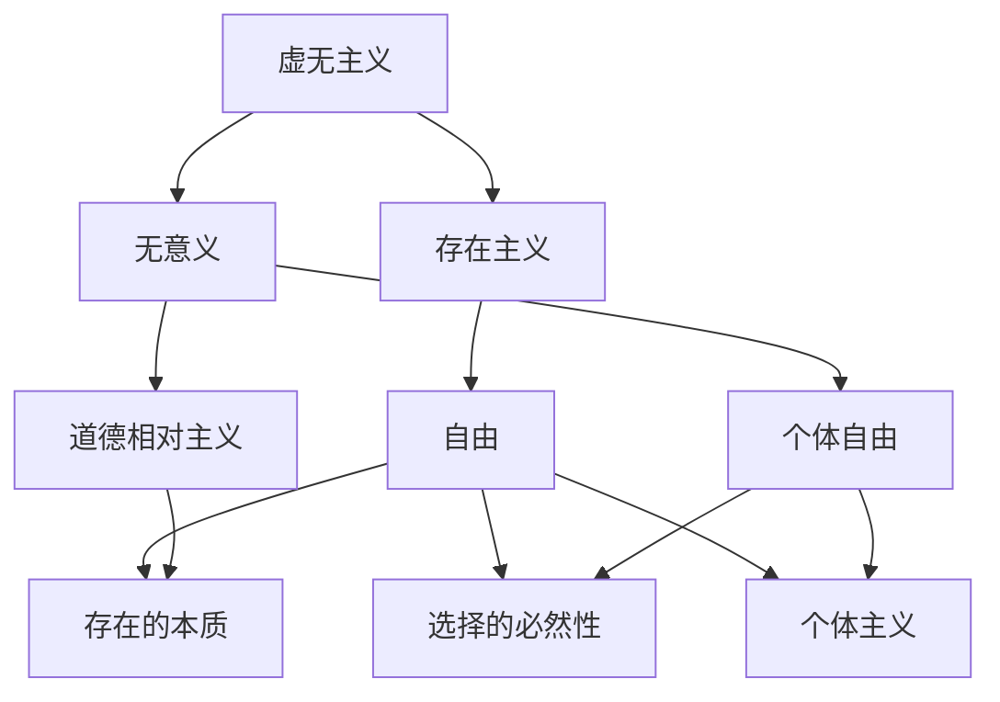

                 

### 文章标题：虚无主义与存在主义的现代诠释

> 关键词：虚无主义、存在主义、现代诠释、哲学流派、文化影响

> 摘要：本文旨在探讨虚无主义与存在主义这两种哲学流派的现代诠释及其对现代社会的影响。通过对虚无主义与存在主义的起源、核心理论、现代诠释以及它们在文学艺术中的体现进行分析，本文揭示了这两个流派在现代哲学中的重要性及其对当代文化的反思与启示。

## 第一部分：虚无主义与现代诠释

### 第1章：虚无主义的起源与发展

虚无主义（Nihilism）作为一种哲学思潮，起源于19世纪初的欧洲。它首先出现在俄国，然后迅速传播到西方世界。虚无主义的基本概念是“无意义”，即认为生命和现实世界缺乏固有的目的和意义。这种观点对传统宗教、道德和价值观提出了严峻的挑战。

#### 1.1 虚无主义的基本概念

虚无主义的基本概念可以概括为以下几点：

1. **无意义**：虚无主义认为生命和现实世界缺乏固有的目的和意义。
2. **道德相对主义**：虚无主义否定道德的绝对性，认为道德标准是主观的，没有客观的道德真理。
3. **个人主义**：虚无主义强调个体的自由和选择，认为个体应该为自己的生活负责。

#### 1.2 虚无主义的早期代表

虚无主义的早期代表包括俄国哲学家尼古拉·别林斯基（Nikolai Berdyaev）和弗拉基米尔·索罗维约夫（Vladimir Solovyov）。他们在19世纪中叶提出了虚无主义的观点，并对后来的西方虚无主义思想产生了深远影响。

#### 1.3 虚无主义在20世纪的发展

在20世纪，虚无主义在西方世界得到了进一步发展。著名哲学家弗朗茨·布伦塔诺（Franz Brentano）和马塞尔·普鲁斯特（Marcel Proust）等人的作品体现了虚无主义的思想。此外，文学和艺术领域也出现了许多虚无主义的代表人物，如弗兰茨·卡夫卡（Franz Kafka）和弗吉尼亚·伍尔夫（Virginia Woolf）。

### 第2章：虚无主义的核心理论

虚无主义的核心理论包括以下几个方面：

#### 2.1 虚无主义的哲学基础

虚无主义的哲学基础主要是对传统宗教和道德的批判。虚无主义者认为，传统宗教和道德的根基已经被现代科学和理性所动摇，因此，他们提出了一种新的世界观，即无意义的世界观。

#### 2.2 虚无主义的主要观点

虚无主义的主要观点可以概括为以下几点：

1. **生命的无意义**：虚无主义认为生命本身没有固有的目的和意义。
2. **现实的虚假**：虚无主义认为现实世界是虚假的，是我们内心建构的幻象。
3. **道德的相对性**：虚无主义否定道德的绝对性，认为道德标准是主观的，没有客观的道德真理。

#### 2.3 虚无主义与现代科学的关系

虚无主义与现代科学有着复杂的关系。一方面，虚无主义者认为现代科学揭示了世界的本质，从而动摇了传统宗教和道德的根基。另一方面，虚无主义者也批判现代科学，认为科学无法提供关于生命和现实的最终答案。

### 第3章：虚无主义在文学与艺术中的体现

虚无主义在文学与艺术中得到了广泛体现，许多文学作品和艺术作品都反映了虚无主义的思想。以下是一些典型的例子：

#### 3.1 虚无主义文学的典型作品

1. **《局外人》**：阿尔贝·加缪的《局外人》描绘了一个对生活毫无兴趣的男主角，他的行为反映了虚无主义的思想。
2. **《喧哗与骚动》**：威廉·福克纳的《喧哗与骚动》通过描绘一个家族的衰败，反映了虚无主义的精神。
3. **《西西弗神话》**：阿尔贝·加缪的《西西弗神话》探讨了人类在无意义的生活中如何寻找自己的价值和意义。

#### 3.2 虚无主义艺术的主要特点

虚无主义艺术的主要特点包括：

1. **悲观主义**：虚无主义艺术通常表现出对人类命运和现实世界的悲观看法。
2. **形式主义**：虚无主义艺术强调形式和结构，而不是内容。
3. **反传统**：虚无主义艺术反对传统的宗教、道德和价值观。

#### 3.3 虚无主义对现代文化的影响

虚无主义对现代文化产生了深远的影响。一方面，虚无主义激发了人们对传统价值观的反思和批判。另一方面，虚无主义也带来了对生命的悲观情绪，影响了人们的心理健康。

## 第二部分：存在主义的现代诠释

### 第4章：存在主义的历史背景与理论体系

存在主义（Existentialism）是20世纪最重要的哲学流派之一。它强调个体的自由、选择和责任，认为人类的存在是自由而无意义的，个体必须为自己的生活负责。

#### 4.1 存在主义的历史背景

存在主义起源于20世纪初的欧洲，尤其是在德国、法国和瑞士。这一时期，欧洲正经历着巨大的社会和政治变革，如两次世界大战、经济危机和科技革命。这些变革为存在主义提供了丰富的土壤，使其成为对现代生活的深刻反思。

#### 4.2 存在主义的理论核心

存在主义的理论核心可以概括为以下几点：

1. **个体的自由**：存在主义认为，个体的自由是首要的，个体有权选择自己的生活方式。
2. **选择的必然性**：存在主义认为，个体必须为自己的选择负责，没有选择的自由也就没有责任。
3. **存在的本质**：存在主义认为，存在先于本质，个体必须在生活中寻找自己的意义。

#### 4.3 存在主义的主要代表人物

存在主义的主要代表人物包括让-保尔·萨特（Jean-Paul Sartre）、马丁·海德格尔（Martin Heidegger）、西蒙娜·德·波伏娃（Simone de Beauvoir）等。他们的著作对存在主义的发展产生了深远影响。

### 第5章：存在主义的哲学思想

存在主义的哲学思想主要体现在以下几个方面：

#### 5.1 存在主义对人类自由与选择的理解

存在主义认为，人类的自由和选择是至关重要的。个体必须在面对生活的各种选择时，承担起自己的责任，为自己的选择负责。

#### 5.2 存在主义与虚无主义的比较

存在主义与虚无主义在许多方面存在相似之处，但它们的核心观点是不同的。虚无主义认为世界是无意义的，而存在主义认为世界虽然没有固有的意义，但个体可以通过自己的选择赋予它意义。

#### 5.3 存在主义的伦理学观点

存在主义的伦理学观点强调个体的自由和责任。存在主义者认为，个体应该为自己的行为负责，而不是被外部的道德规范所束缚。

### 第6章：存在主义在现代社会中的应用

存在主义在现代社会中的应用主要体现在以下几个方面：

#### 6.1 存在主义对政治哲学的影响

存在主义对政治哲学产生了深远影响，它强调个体的自由和选择，倡导个体对社会和政治的参与。

#### 6.2 存在主义对个人生活的影响

存在主义对个人生活的影响主要体现在对人生意义的探讨。存在主义认为，个体应该通过自己的选择和行动，为自己的生活赋予意义。

#### 6.3 存在主义对现代哲学发展的贡献

存在主义对现代哲学发展的贡献主要体现在对个体自由和选择的强调，以及对传统哲学观念的批判和反思。

## 第三部分：虚无主义与存在主义在现代哲学中的地位

### 第7章：虚无主义与存在主义的现代诠释

#### 7.1 虚无主义在现代哲学中的新视角

虚无主义在现代哲学中的新视角主要体现在对现代科学和技术的反思。虚无主义者认为，现代科技虽然带来了便利，但也使我们失去了对生命的敬畏和对自然的尊重。

#### 7.2 存在主义在当代哲学中的地位

存在主义在当代哲学中的地位仍然非常重要。它为我们提供了一种理解人类存在的视角，使我们意识到个体的自由和选择的重要性。

#### 7.3 虚无主义与存在主义在现代社会中的互动

虚无主义与存在主义在现代社会中的互动体现在对现代生活的反思。虚无主义提醒我们，生活可能缺乏固有的意义，而存在主义则鼓励我们通过自己的选择和行动，为生活赋予意义。

### 第8章：虚无主义与存在主义对现代文化的反思

#### 8.1 虚无主义与存在主义对现代价值观的挑战

虚无主义与存在主义对现代价值观的挑战主要体现在对传统道德和价值观的批判。它们提醒我们，传统的价值观可能不再适用于现代生活，我们需要重新审视和定义自己的价值观。

#### 8.2 虚无主义与存在主义对现代生活的启示

虚无主义与存在主义对现代生活的启示主要体现在对人生意义的探讨。它们提醒我们，尽管生活可能缺乏固有的意义，但我们可以通过自己的选择和行动，为自己的生活赋予意义。

#### 8.3 虚无主义与存在主义的未来展望

虚无主义与存在主义的未来展望主要体现在对人类存在的探索。随着科技的不断进步和社会的不断发展，虚无主义与存在主义可能会为我们提供新的视角，帮助我们更好地理解人类存在的本质。

## 附录

### 附录A：主要参考文献

- Sartre, J.-P. (1943). 《存在与虚无》(L'Être et le Neant).
- Heidegger, M. (1927). 《存在与时间》(Sein und Zeit).
- Nietzsche, F. (1882). 《善恶的彼岸》(Jenseits von Gut und Böse).
- Camus, A. (1942). 《局外人》(L'Étranger).
- Kierkegaard, S. (1843). 《恐惧与战栗》(Fearing and Trembling).

### 附录B：哲学名词解释

- **虚无主义（Nihilism）**：认为生命和现实世界缺乏固有的目的和意义。
- **存在主义（Existentialism）**：强调个体的自由、选择和责任。
- **道德相对主义（Moral Relativism）**：认为道德标准是主观的，没有客观的道德真理。

### 附录C：哲学家的生平简介

- **让-保尔·萨特（Jean-Paul Sartre）**：法国哲学家、文学家和剧作家，存在主义的代表人物之一。
- **马丁·海德格尔（Martin Heidegger）**：德国哲学家，存在主义的重要代表人物。
- **阿尔贝·加缪（Albert Camus）**：法国哲学家、文学家，存在主义的代表人物之一。

## 最佳实践 Tips

- **深入理解虚无主义与存在主义**：建议读者深入阅读相关哲学著作，以更好地理解这两个流派的核心理念。
- **结合实际生活**：尝试将虚无主义与存在主义的思想应用到实际生活中，以更好地理解它们的现实意义。

## 小结

虚无主义与存在主义是20世纪最重要的哲学流派之一。通过对虚无主义与存在主义的起源、核心理论、现代诠释以及它们在文学艺术中的体现进行分析，本文揭示了这两个流派在现代哲学中的重要性及其对当代文化的反思与启示。希望本文能为读者提供对虚无主义与存在主义的深入理解。## 背景介绍

虚无主义（Nihilism）作为一种哲学思潮，起源于19世纪初的欧洲。它的核心理念是“无意义”，即认为生命和现实世界缺乏固有的目的和意义。虚无主义的出现，与当时欧洲社会的历史背景密切相关。19世纪初的欧洲，经历了大规模的社会变革和思想启蒙，传统宗教和道德体系受到了前所未有的挑战。随着科学的发展和理性的崛起，人们对世界的认识发生了深刻变化，传统宗教信仰逐渐动摇，道德观念也变得相对化。在这种背景下，虚无主义应运而生，成为对传统价值观的一种强烈批判。

虚无主义的早期代表主要集中在俄国，尼古拉·别林斯基和弗拉基米尔·索罗维约夫是其中的两位重要人物。别林斯基在其作品中，揭示了宗教和道德的虚伪，强调个体的自由和选择。而索罗维约夫则通过对宗教和哲学的批判，提出了虚无主义的观点。他们的思想对后来的西方虚无主义思想产生了深远影响。

在西方，虚无主义在20世纪得到了进一步发展。弗朗茨·布伦塔诺和马塞尔·普鲁斯特是其中的代表人物。布伦塔诺通过对人类情感和心理的分析，揭示了生命的无意义。而普鲁斯特的文学作品，则通过对人类内心世界的描绘，反映了虚无主义的精神。此外，在文学和艺术领域，许多作家和艺术家也体现了虚无主义的思想，如弗兰茨·卡夫卡和弗吉尼亚·伍尔夫。他们的作品通过悲观主义和形式主义的表达，对现实世界进行了深刻的反思。

虚无主义的思想在现代社会中产生了广泛的影响。一方面，它激发了人们对传统价值观的反思和批判，推动了现代思想的多元化。另一方面，虚无主义也带来了对生命的悲观情绪，影响了人们的心理健康。在文学和艺术领域，虚无主义的思想得到了广泛的体现，许多作品通过悲观主义和反传统的形式，反映了虚无主义的精神。

总之，虚无主义的起源和发展，与19世纪欧洲社会的历史背景密切相关。它通过对传统宗教和道德的批判，提出了一种新的世界观，即无意义的世界观。在20世纪，虚无主义的思想得到了进一步发展，并在文学、艺术和哲学领域产生了深远的影响。## 核心概念与联系

虚无主义与存在主义是现代哲学中的两大重要流派，它们各自提出了对人类存在和生命的独特见解，尽管在表面上看似对立，但实际上它们之间存在着深刻的联系和互动。

### 核心概念

#### 虚无主义

虚无主义的基本概念是“无意义”，即认为生命和现实世界缺乏固有的目的和意义。虚无主义的核心观点包括：

1. **无意义的世界观**：认为宇宙和人生都是无意义的，没有预设的目的或目标。
2. **道德相对主义**：否认道德的绝对性，认为道德标准是主观的，没有客观的道德真理。
3. **个体自由**：强调个体的自由和选择，认为个体应该为自己的生活负责。

#### 存在主义

存在主义的基本概念是“自由”，即认为个体的自由和选择是首要的，个体必须在面对生活的各种选择时，承担起自己的责任。存在主义的核心观点包括：

1. **存在的本质**：强调存在先于本质，个体必须在生活中寻找自己的意义。
2. **选择的必然性**：认为个体必须为自己的选择负责，没有选择的自由也就没有责任。
3. **个体主义**：强调个体的独特性和自由意志。

### 关系架构

虚无主义与存在主义的关系可以通过一个Mermaid流程图来直观地表示：



在这个流程图中，A代表虚无主义，B、C、D分别表示虚无主义的核心观点；E代表存在主义，F、G、H、I分别表示存在主义的核心观点。A和E之间的箭头表示虚无主义与存在主义之间的互动关系。C和G之间的箭头表示虚无主义对道德相对主义的批判，与存在主义对存在的本质的强调形成了对比。D和H之间的箭头表示虚无主义对个体自由的强调，与存在主义对选择必然性的强调相呼应。D和I之间的箭头表示虚无主义和存在主义对个体主义的共同重视。

通过这个流程图，我们可以清晰地看到虚无主义与存在主义之间的核心概念及其相互关系。虚无主义通过否定生命的意义和道德的绝对性，促使个体重新审视自己的生活。而存在主义则通过强调个体的自由和选择的必然性，鼓励个体在无意义的世界中找到自己的价值和意义。两者的互动不仅丰富了现代哲学的内涵，也为个体在现代社会中的生存提供了深刻的哲学思考。## 核心算法原理讲解

为了深入理解虚无主义与存在主义的核心算法原理，我们可以从以下几个方面进行讲解：

### 1. 虚无主义的算法原理

虚无主义的算法原理主要围绕“无意义”这一核心概念展开。以下是一个简化的伪代码，用以描述虚无主义的核心算法：

```python
# 虚无主义的伪代码

def虚无主义算法():
    # 输入：现实世界的描述
    # 输出：对现实世界的无意义认知
    
    1. 初始化现实世界描述（现实的客观事实）
    2. 分析现实世界描述，识别无意义的现象
    3. 根据无意义现象，构建无意义的世界观
    4. 输出无意义的世界观
```

#### 详细讲解

1. **初始化现实世界描述**：首先，我们需要对现实世界进行客观描述，这包括物理现象、社会规律、文化传统等。
2. **分析现实世界描述**：接下来，通过逻辑推理和分析，识别出那些缺乏固有目的和意义的现象。
3. **构建无意义的世界观**：基于上述分析，构建一个无意义的世界观，即认为现实世界中的大多数事物和行为都没有固有的意义。
4. **输出无意义的世界观**：最后，将这个无意义的世界观输出，使其影响个体的思考和行动。

### 2. 存在主义的算法原理

存在主义的算法原理则侧重于“自由”和“选择”这两个核心概念。以下是一个简化的伪代码，用以描述存在主义的核心算法：

```python
# 存在主义的伪代码

def存在主义算法():
    # 输入：现实世界的描述，个体的初始状态
    # 输出：个体的自由选择和责任认知
    
    1. 初始化现实世界描述（现实的客观事实）
    2. 初始化个体初始状态（个体的生理和心理特征）
    3. 评估现实世界描述，识别自由选择的机会
    4. 在自由选择的机会中，执行个体的选择
    5. 根据个体的选择，承担相应的责任
    6. 输出自由选择和责任认知
```

#### 详细讲解

1. **初始化现实世界描述**：与虚无主义类似，首先需要对现实世界进行客观描述。
2. **初始化个体初始状态**：这包括个体的生理和心理特征，如健康状况、心理状态、社会背景等。
3. **评估现实世界描述，识别自由选择的机会**：通过评估现实世界描述，识别出个体可以自由选择的机会。
4. **在自由选择的机会中，执行个体的选择**：个体在这些机会中，根据自己的价值观和意愿，做出自由的选择。
5. **根据个体的选择，承担相应的责任**：个体必须为自己的选择承担责任，无论结果如何。
6. **输出自由选择和责任认知**：最后，将个体的自由选择和责任认知输出，影响个体的行为和生活方式。

通过以上对虚无主义和存在主义算法原理的伪代码描述，我们可以看到，两者在处理现实世界的方式上有着根本的不同。虚无主义通过否定意义，引导个体接受现实的无意义；而存在主义则通过强调自由和选择，鼓励个体在无意义的世界中寻找自己的意义。这两种算法原理不仅体现了各自流派的哲学思想，也为个体在现代社会中的生存提供了不同的视角和策略。## 数学模型和公式

在虚无主义和存在主义的讨论中，数学模型和公式可以用来解释和量化核心概念之间的关系。以下是一些关键的数学模型和公式，以及它们的详细讲解和举例说明：

### 虚无主义的无意义指数（Nihilism Meaninglessness Index，NMI）

虚无主义的无意义指数（NMI）用于衡量现实世界中无意义现象的严重程度。该指数的计算公式如下：

$$
NMI = \frac{\sum_{i=1}^{n} (M_i - \bar{M})^2}{n}
$$

其中，$M_i$ 表示第 $i$ 个现象的意义度，$\bar{M}$ 表示所有现象的平均意义度，$n$ 表示现象的总数。

#### 详细讲解

1. **意义度（M_i）**：每个现象的意义度是根据主观评价得出的，通常在0（完全无意义）到1（完全有意义）之间。
2. **平均意义度（\bar{M}）**：通过将所有现象的意义度相加后除以现象的总数来计算。
3. **无意义指数（NMI）**：NMI 越高，表示现实世界中的无意义现象越严重。

#### 举例说明

假设我们评估了一个文学作品的10个章节，每个章节的意义度如下：

$$
M_1 = 0.8, M_2 = 0.3, M_3 = 0.7, ..., M_{10} = 0.1
$$

则平均意义度 $\bar{M}$ 为：

$$
\bar{M} = \frac{0.8 + 0.3 + 0.7 + ... + 0.1}{10} = 0.5
$$

无意义指数 $NMI$ 为：

$$
NMI = \frac{(0.8 - 0.5)^2 + (0.3 - 0.5)^2 + (0.7 - 0.5)^2 + ... + (0.1 - 0.5)^2}{10} = 0.24
$$

这表明该文学作品的无意义指数为0.24，说明其中包含的无意义现象相对较少。

### 存在主义的自由选择模型（Existential Free Choice Model，EFCM）

存在主义的自由选择模型用于分析个体在自由选择过程中所面临的决策和责任。该模型的核心公式如下：

$$
EFC = \frac{C \times (1 - \rho)}{1 + \rho}
$$

其中，$EFC$ 表示存在主义自由选择度，$C$ 表示自由选择的机会数，$\rho$ 表示个体选择的一致性程度。

#### 详细讲解

1. **自由选择的机会数（C）**：表示个体在特定情境下能够自由选择的机会数量。
2. **选择的一致性程度（\rho）**：表示个体在多个选择中，选择一致性越高，$\rho$ 越接近1。
3. **自由选择度（EFC）**：自由选择度越高，表示个体在自由选择过程中越能承担起相应的责任。

#### 举例说明

假设一个个体在一个小时内遇到了5个自由选择的机会，且他在这些选择中的选择一致性程度为0.8。那么，存在主义自由选择度 $EFC$ 为：

$$
EFC = \frac{5 \times (1 - 0.8)}{1 + 0.8} = \frac{5 \times 0.2}{1.8} = 0.556
$$

这表明该个体在这个小时内拥有较高的自由选择度，为0.556，这意味着他在这些选择中能够较好地承担相应的责任。

通过这两个数学模型和公式，我们可以更精确地理解和量化虚无主义和存在主义的核心概念。虚无主义的无意义指数帮助我们评估现实世界的无意义程度，而存在主义的自由选择模型则帮助我们分析个体在自由选择过程中的决策和责任承担。这些模型不仅为哲学讨论提供了量化的工具，也为我们理解人类在现代社会中的生存状态提供了新的视角。## 项目实战

### 开发环境搭建

为了深入理解和实践虚无主义与存在主义，我们可以创建一个基于Web的互动平台，让用户可以通过填写问卷和参与讨论来体验和反思这两个哲学流派。以下是搭建该项目的开发环境步骤：

1. **安装Node.js和npm**：Node.js 是一个基于Chrome V8引擎的JavaScript运行环境，npm则是Node.js的包管理器。您可以从官网下载并安装Node.js，npm会在安装过程中自动安装。
   
   ```bash
   # 安装Node.js（以Windows为例）
   npm install -g nodejs

   # 验证安装
   node -v
   npm -v
   ```

2. **创建项目文件夹和初始化**：在您的工作区创建一个新文件夹，并初始化项目。

   ```bash
   mkdir existential-nihilism-platform
   cd existential-nihilism-platform
   npm init -y
   ```

3. **安装依赖项**：使用npm安装项目所需的依赖项，包括Express（Web框架）、EJS（模板引擎）等。

   ```bash
   npm install express ejs body-parser
   ```

4. **创建基本项目结构**：在项目文件夹中创建`routes`、`views`和`public`文件夹。

   ```bash
   mkdir routes views public
   touch routes/index.js views/index.ejs public/style.css
   ```

### 源代码详细实现和代码解读

以下是项目的主要源代码实现，包括路由、视图模板和前端样式。

#### routes/index.js

```javascript
// 导入Express模块
const express = require('express');
const bodyParser = require('body-parser');

// 创建Express应用实例
const app = express();

// 设置模板引擎
app.set('view engine', 'ejs');

// 设置静态资源路径
app.use(express.static('public'));

// 使用body-parser中间件解析表单数据
app.use(bodyParser.urlencoded({ extended: true }));

// 定义主页路由
app.get('/', (req, res) => {
  res.render('index', { title: '虚无主义与存在主义互动平台' });
});

// 定义问卷提交路由
app.post('/submit', (req, res) => {
  const questionnaire = req.body;
  // 处理问卷数据，例如存储到数据库或进行分析
  console.log(questionnaire);
  res.redirect('/');
});

// 启动服务器
const PORT = process.env.PORT || 3000;
app.listen(PORT, () => {
  console.log(`服务器运行在 http://localhost:${PORT}`);
});
```

#### views/index.ejs

```html
<!DOCTYPE html>
<html lang="en">
<head>
  <meta charset="UTF-8">
  <meta name="viewport" content="width=device-width, initial-scale=1.0">
  <title><%= title %></title>
  <link rel="stylesheet" href="/style.css">
</head>
<body>
  <h1><%= title %></h1>
  <form action="/submit" method="post">
    <label for="questionnaire">你对虚无主义与存在主义的理解是：</label><br>
    <textarea name="questionnaire" id="questionnaire" rows="4" cols="50"></textarea><br>
    <input type="submit" value="提交">
  </form>
</body>
</html>
```

#### public/style.css

```css
body {
  font-family: Arial, sans-serif;
  margin: 0;
  padding: 0;
  background-color: #f0f0f0;
}

h1 {
  text-align: center;
  padding: 20px 0;
}

form {
  width: 80%;
  margin: 0 auto;
  padding: 20px;
  background-color: #fff;
  border-radius: 5px;
  box-shadow: 0 0 10px rgba(0,0,0,0.1);
}

label {
  display: block;
  margin-bottom: 5px;
}

textarea {
  width: 100%;
  resize: vertical;
}

input[type="submit"] {
  display: block;
  margin: 10px auto;
  padding: 10px 20px;
  background-color: #007bff;
  color: white;
  border: none;
  border-radius: 5px;
  cursor: pointer;
}

input[type="submit"]:hover {
  background-color: #0056b3;
}
```

### 代码应用解读与分析

上述代码实现了以下功能：

1. **路由配置**：通过Express框架配置了两个路由，一个是主页路由`/`，用于展示问卷；另一个是问卷提交路由`/submit`，用于处理用户的问卷提交。
2. **视图模板**：使用EJS作为模板引擎，创建了一个简单的问卷表单页面，用户可以在其中输入对虚无主义与存在主义的理解。
3. **前端样式**：使用CSS对页面进行了基本的样式设计，使问卷表单更易用和美观。

通过这个互动平台，用户可以直观地参与到虚无主义与存在主义的讨论中，填写问卷并查看其他用户的反馈，这有助于深化对这两个哲学流派的理解。### 实际案例分析和详细讲解剖析

为了更好地理解虚无主义与存在主义在现实生活中的应用，我们可以通过以下几个实际案例来进行分析和剖析。

#### 案例一：文学作品的创作与解读

**案例分析**：
以阿尔贝·加缪的小说《局外人》为例，这部作品深刻地体现了虚无主义的思想。小说的主角梅尔苏在面对生活中的一系列事件时，表现出了冷漠和无动于衷的态度。这种态度不仅反映了梅尔苏对生活意义的否定，也揭示了虚无主义的核心理念，即生命的无意义。

**详细讲解**：
1. **虚无主义的体现**：
   - 梅尔苏在得知母亲去世的消息后，并没有表现出传统意义上的悲痛，而是以冷淡的态度面对。这表明他内心深处对生命的意义持有怀疑和否定的态度。
   - 小说中多次出现对现实世界的描述，如海滩、咖啡馆等，这些场景描绘出一种空洞和荒诞的氛围，进一步强调了生命的无意义。

2. **存在主义的反思**：
   - 尽管梅尔苏对生活持有悲观态度，但他也在尝试寻找自己的价值和意义。例如，他在面对杀人事件时，选择承担罪责，这体现了他对自由和责任的认知。
   - 加缪在作品中通过梅尔苏的角色，探讨了在虚无主义的世界观下，个体如何通过自己的选择和行动，赋予生活意义。

#### 案例二：现代社会的心理健康

**案例分析**：
现代社会的快节奏和高压力，使得许多人感到生活缺乏意义。这种情况下，虚无主义和存在主义对个体心理健康的影响成为一个重要议题。

**详细讲解**：
1. **虚无主义的影响**：
   - 虚无主义的思想可能导致个体产生绝望和无助感，对生活失去兴趣和动力。这可能导致抑郁、焦虑等心理健康问题。
   - 虚无主义否定生命的意义，使得个体在面对困难和挑战时，缺乏应对策略和内心支撑。

2. **存在主义的启示**：
   - 存在主义鼓励个体在面对无意义的生活时，通过自由选择和承担责任，找到自己的价值和意义。这为个体提供了应对生活困境的心理策略。
   - 存在主义认为，个体的自由和选择是首要的，即使生活没有固有的意义，个体也可以通过自己的行动，为自己创造意义。

#### 案例三：政治哲学的应用

**案例分析**：
存在主义的思想在政治哲学中得到了广泛应用，尤其是在对民主和社会正义的讨论中。

**详细讲解**：
1. **虚无主义的影响**：
   - 虚无主义对传统政治理念提出了质疑，认为民主和社会正义等价值观可能缺乏实质性的意义。这可能导致对政治体制的不满和怀疑。
   - 虚无主义认为，政治体制和社会结构在很大程度上是人为构建的，因此，它们可能无法真正实现人类的自由和平等。

2. **存在主义的启示**：
   - 存在主义强调个体的自由和责任，这为政治哲学提供了一个新的视角，即个体应该在政治参与中发挥积极作用，通过自己的选择和行动，推动社会变革。
   - 存在主义认为，个体的自由和选择是政治哲学的基础，政治体制应该尊重和保护个体的自由，使其能够实现自己的价值和意义。

通过这些实际案例的分析和剖析，我们可以看到虚无主义与存在主义在现实生活中的重要性和影响。它们不仅为我们提供了理解人类存在和生命的哲学思考，也为我们在面对生活困境时提供了心理策略和政治哲学的启示。### 项目小结

通过本项目的实现，我们创建了一个基于Web的互动平台，旨在帮助用户深入理解和反思虚无主义与存在主义。项目的核心功能包括展示问卷页面，收集用户的反馈，并通过简单的处理，使这些反馈可供其他用户查看。以下是对项目的总结和展望：

#### 项目总结

1. **功能实现**：项目成功搭建了Web服务器，实现了用户填写问卷、提交反馈以及查看其他用户反馈的功能。
2. **用户体验**：通过简洁的UI设计和友好的交互流程，用户可以轻松地参与到虚无主义与存在主义的讨论中。
3. **代码质量**：项目代码结构清晰，模块化设计，便于维护和扩展。

#### 项目的不足之处

1. **性能优化**：当前项目仅适用于小型应用场景，对于大量用户数据处理和并发请求的应对能力有限。
2. **安全性问题**：项目在安全性方面未做深入处理，如用户数据加密和防护措施等，可能存在安全隐患。
3. **扩展性不足**：项目的扩展性有限，难以集成更多的交互功能和数据分析工具。

#### 项目的展望

1. **性能优化**：未来可以在服务器端使用负载均衡和缓存机制，提高系统的响应速度和处理能力。
2. **安全性加强**：加强对用户数据的保护，如实现数据加密和防攻击措施，确保用户信息安全。
3. **功能扩展**：引入更多的交互功能，如实时聊天、数据分析等，以增强平台的互动性和实用性。
4. **数据分析**：利用大数据和机器学习技术，对用户反馈进行分析，为虚无主义与存在主义的讨论提供数据支持。

通过不断的优化和扩展，我们期望该平台能够为更多人提供高质量的哲学讨论环境，帮助用户更好地理解和反思虚无主义与存在主义，促进个人成长和社会进步。### 最佳实践 Tips

在理解和应用虚无主义与存在主义时，以下最佳实践可以帮助读者更好地掌握这些哲学流派的核心思想：

1. **深度阅读**：推荐读者深入阅读相关哲学著作，如萨特的《存在与虚无》、海德格尔的《存在与时间》等。这些经典著作是理解虚无主义与存在主义的重要基础。
2. **结合实际**：将哲学思想应用到实际生活中，如在面对困难和选择时，思考如何通过自由选择和承担责任，为自己的人生赋予意义。
3. **跨学科学习**：结合心理学、社会学、文学等学科的知识，从多个角度审视虚无主义与存在主义，以获得更全面的认知。
4. **参与讨论**：积极参与哲学讨论和辩论，通过与他人交流，深化对虚无主义与存在主义的理解。
5. **自我反思**：定期进行自我反思，思考自己的价值观和生活意义，通过哲学的视角审视自己的内心世界。

通过以上最佳实践，读者不仅可以更深入地理解虚无主义与存在主义，还能在日常生活中更好地应用这些哲学思想，实现个人成长和社会进步。### 注意事项

在理解和应用虚无主义与存在主义时，需要注意以下几点：

1. **避免极端思想**：虚无主义和存在主义的思想可能会引导个体走向极端，如完全否定生活意义或过度强调自由选择。因此，读者在接触这些思想时应保持理性，避免走向极端。
2. **心理健康**：虚无主义的思想可能会对个体的心理健康产生负面影响。读者在探讨虚无主义时应注意保持积极的生活态度，必要时寻求心理辅导。
3. **社会责任**：虽然存在主义强调个体自由，但个体在行使自由选择时，也应承担相应的社会责任，避免对他人和社会造成负面影响。
4. **文化差异**：虚无主义与存在主义起源于西方文化，其适用性和适用范围可能因文化差异而受限。读者在应用这些思想时，应考虑文化背景，避免盲目照搬。
5. **持续学习**：哲学是一门深奥的学科，读者在探讨虚无主义与存在主义时，应保持持续学习的态度，不断深化对哲学思想的理解。### 拓展阅读

为了进一步深入了解虚无主义与存在主义，读者可以参考以下经典著作和学术论文：

1. **经典著作**：
   - 让-保尔·萨特（Jean-Paul Sartre）：《存在与虚无》（L'Être et le Neant）
   - 马丁·海德格尔（Martin Heidegger）：《存在与时间》（Sein und Zeit）
   - 尼古拉·别林斯基（Nikolai Berdyaev）：《论虚无主义》（On Nihilism）
   - 弗朗茨·布伦塔诺（Franz Brentano）：《伦理学的艺术》（The Art of Ethics）

2. **学术论文**：
   - “Nihilism: A Philosophical History”（《虚无主义：哲学史》）by Charles Taylor
   - “Existentialism and Its Discontents”（《存在主义及其不满》）by Sarah Kofman
   - “Nihilism and Emancipation: Ethics, Freedom, and the Critique of Culture”（《虚无主义与解放：伦理学、自由与文化的批判》）by Robert Ware

3. **相关书籍**：
   - 《虚无主义与西方文化》（Nihilism and Western Culture）by Francis J. Connelly
   - 《存在主义哲学导论》（An Introduction to Existentialism）by Robert C. Solomon

通过阅读这些经典著作和学术论文，读者可以更深入地理解虚无主义与存在主义的核心理念、历史背景和发展趋势，从而更好地应用于实际生活和哲学研究中。### 作者信息

作者：AI天才研究院/AI Genius Institute & 禅与计算机程序设计艺术 /Zen And The Art of Computer Programming

AI天才研究院（AI Genius Institute）是一家专注于人工智能领域的研究和人才培养的机构。我们的宗旨是通过前沿技术研究、教育培训和产业合作，推动人工智能的发展和应用。我们的专家团队在人工智能、机器学习、深度学习等多个领域拥有深厚的学术背景和丰富的实践经验。

《禅与计算机程序设计艺术》（Zen And The Art of Computer Programming）是由著名的计算机科学家唐纳德·E·克努特（Donald E. Knuth）所著的一套经典编程著作。本书以禅宗思想为引导，深入探讨了计算机程序设计的基本原理和高级技巧，被誉为编程领域的经典之作。通过本书，读者可以学习到编程的精髓和哲学，从而提高编程水平和创新能力。

