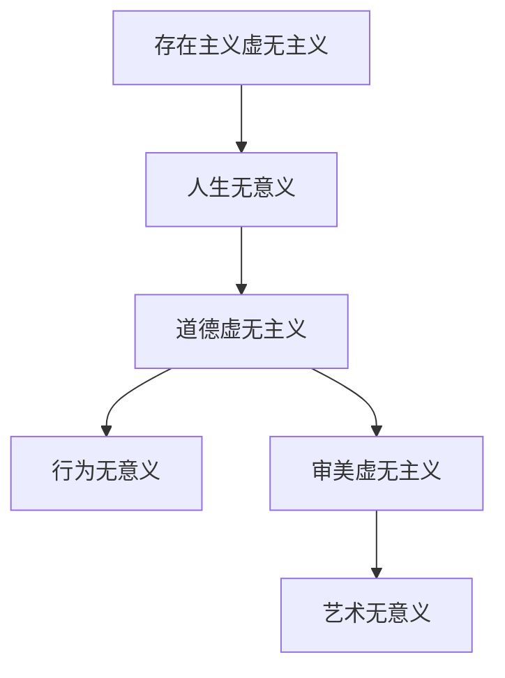

                 

### 文章标题：虚无主义与政治参与：在社会变革中找到意义

#### 关键词：虚无主义、政治参与、社会变革、意义感、个人成长

#### 摘要：
在现代社会，虚无主义思潮的兴起对人们的价值观和身份认同造成了深远影响。本文从虚无主义的概念和历史背景出发，分析其对现代社会价值观的冲击，探讨政治参与在这一背景下的作用和意义。文章旨在通过详细的分析和逻辑推理，帮助读者理解虚无主义与政治参与之间的复杂关系，并探讨如何在社会变革中找到个人意义。

## 目录

### 第1章：虚无主义的概念与历史背景

#### 1.1 虚无主义的定义

虚无主义是一种哲学思想，主张宇宙和人生都没有意义和价值。它起源于19世纪，是对传统价值观和宗教信仰的挑战。

#### 1.2 虚无主义的起源与发展

虚无主义起源于欧洲，与19世纪末20世纪初的哲学思潮密切相关。它的影响逐渐扩散，成为现代社会的流行文化现象。

#### 1.3 虚无主义的主要流派

虚无主义有多种流派，包括存在主义虚无主义、道德虚无主义和审美虚无主义等。

#### 1.4 虚无主义的逻辑架构

#### 1.5 虚无主义的影响

虚无主义对社会和个人产生了深远的影响，包括社会价值观的动摇、个人身份认同的危机以及生活意义的缺失。

### 第2章：虚无主义对现代社会的冲击

#### 2.1 虚无主义对社会价值观的影响

虚无主义挑战了传统的社会价值观，如道德、宗教和共同体意识。它导致了个人主义和个体价值的崛起，同时也带来了社会信任的下降。

#### 2.2 虚无主义对个人身份认同的挑战

虚无主义使个人感到迷茫和不确定，影响了他们的自我认同。人们开始质疑自己的存在意义，寻找新的身份认同。

#### 2.3 虚无主义与消费主义的关系

虚无主义与消费主义之间存在复杂的关系，消费主义有时被视为虚无主义的一种表现形式。人们通过消费来寻找意义和满足感，但消费主义往往导致短暂的满足感，无法解决内心的虚无。

### 第3章：政治参与的理论与实践

#### 3.1 政治参与的定义与类型

政治参与是指公民通过各种方式影响政治决策的行为。它包括投票、参与政治讨论、示威抗议等多种形式。

#### 3.2 政治参与的障碍与挑战

政治参与的障碍包括政治冷漠、社会经济不平等和政治制度的缺陷。这些障碍限制了公民参与政治的积极性和能力。

#### 3.3 政治参与的积极作用

政治参与有助于提升公民意识、促进社会公平和民主发展。它使公民能够更好地理解社会问题和政治议题，并采取行动解决这些问题。

### 第4章：虚无主义背景下的政治参与

#### 4.1 虚无主义对政治参与的影响

虚无主义可能导致政治冷漠和逃避政治。然而，政治参与也可以成为虚无主义者寻找意义和归属感的一种途径。

#### 4.2 虚无主义者如何参与政治

虚无主义者可以通过非传统的政治参与方式，如抗议和街头运动，来表达自己的观点。他们也可以通过参与社区活动和社会组织，与他人建立联系和合作。

#### 4.3 政治参与如何缓解虚无主义情绪

政治参与有助于虚无主义者找到自己的社会角色和意义。通过参与政治活动，他们可以为自己的价值观和信仰发声，并为社会变革做出贡献。

### 第5章：意义感的缺失与重建

#### 5.1 意义感的定义与重要性

意义感是指个体对生活目的和意义的感知。它对个人的心理健康和生活满意度至关重要。

#### 5.2 社会变革中的意义缺失

社会变革可能导致意义感的缺失。人们可能感到迷茫和不安，不知道自己的位置和价值。

#### 5.3 如何重建意义感

通过个人成长和社会参与，个体可以重建意义感。这包括建立积极的自我认同、寻找新的目标和价值观，以及与他人建立联系和合作。

### 第6章：社会变革中的政治参与与个人成长

#### 6.1 政治参与与个人成长的互动关系

政治参与与个人成长相互促进。通过参与政治活动，个人可以学习新知识、提高自己的能力和信心。

#### 6.2 跨越虚无主义的政治参与

政治参与可以帮助个体跨越虚无主义，找到新的生活意义和方向。它使个人成为社会变革的一部分，为社会的进步和发展做出贡献。

#### 6.3 政治参与在个人成长中的意义

政治参与不仅是个人成长的一种方式，也是社会参与和公民责任的一部分。它使个人成为社会的积极参与者，推动社会的进步和发展。

### 第7章：结论与展望

#### 7.1 虚无主义与政治参与的关系总结

虚无主义与政治参与之间存在复杂的关系。政治参与可以是虚无主义者寻找意义和归属感的一种途径，同时也有助于缓解虚无主义情绪。

#### 7.2 未来社会变革中的政治参与趋势

随着社会的不断发展，政治参与的趋势将更加多元化和个性化。公民将更加积极参与政治决策，推动社会的进步和发展。

#### 7.3 对读者的寄语与建议

在虚无主义的时代背景下，政治参与和个人成长成为寻找意义的重要途径。通过积极参与政治活动，个体可以为自己的价值观和信仰发声，为社会变革做出贡献。同时，个人成长也是实现社会变革的重要基石。让我们在政治参与和个人成长的道路上，共同为社会的发展和进步而努力。

### 作者信息

作者：AI天才研究院/AI Genius Institute & 禅与计算机程序设计艺术 /Zen And The Art of Computer Programming

### 结论

虚无主义与政治参与之间的关系复杂而深远。虚无主义对社会和个人产生了负面影响，而政治参与则成为寻找意义和归属感的重要途径。通过积极参与政治活动，个体可以为自己的价值观和信仰发声，为社会变革做出贡献。同时，个人成长也是实现社会变革的重要基石。让我们在政治参与和个人成长的道路上，共同为社会的发展和进步而努力。

