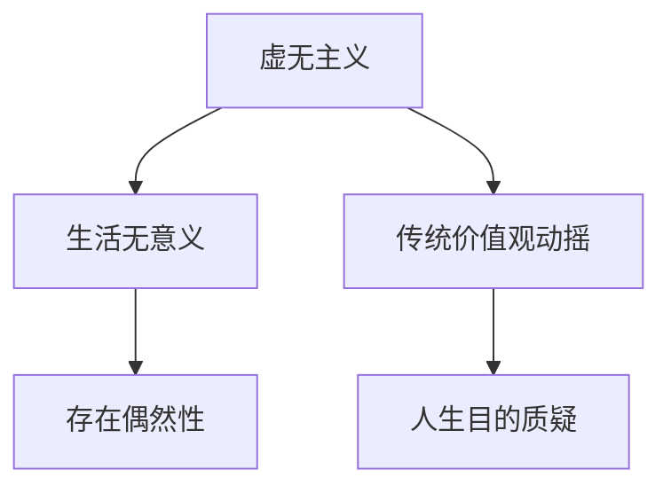

                 

### 背景介绍

虚无主义作为一种哲学思潮，起源于19世纪末20世纪初，它挑战了传统的价值观和生活意义，引发了对存在本身和人生目的的深刻质疑。虚无主义的核心观点是，生活本身缺乏固有的意义和目的，人可能面对一个毫无意义或荒谬的宇宙。这种思想在当时的欧洲社会产生了深远影响，尤其是在战争和社会动荡的背景下，许多人对生活感到失望和迷茫。

政治参与是社会成员通过投票、示威、参与政策制定等方式表达意见和影响政府决策的行为。然而，在虚无主义思潮的影响下，人们对政治参与的意愿和积极性受到挑战。一些人可能觉得政治体系本身就缺乏意义，政治参与无法带来实质性改变，因而选择不参与或放弃参与。

本篇文章将探讨虚无主义与政治参与之间的关系。首先，我们将回顾虚无主义的历史和哲学探讨，理解虚无主义的主要流派及其对现代哲学的影响。接着，分析虚无主义在社会中的体现，包括文学、艺术等方面。然后，探讨虚无主义与政治参与的关系，分析虚无主义对政治参与的影响，以及如何通过政治参与克服虚无主义。最后，我们将通过实际案例研究，展示虚无主义与政治参与在不同社会背景下的表现，并总结社会变革中的意义追寻。

通过以上步骤的分析，我们将深入理解虚无主义与政治参与之间的复杂关系，探讨如何在现代社会中找到意义，为个人和社会的发展提供新的视角。

## 第1章：虚无主义的起源与发展

### 1.1.1 虚无主义的定义

虚无主义（Nihilism）是一种哲学思潮，主要观点是生活本身缺乏固有的意义和目的。虚无主义者认为，宇宙和人的一生都是没有意义的，一切都不过是偶然和无目的的堆积。虚无主义强调，传统价值观和信仰的基础已经动摇，人需要重新审视自己的存在。

用 Mermaid 流程图表示虚无主义的核心概念与联系如下：

### 1.1.2 虚无主义的起源

虚无主义起源于19世纪末20世纪初的欧洲，这一时期正值工业革命和两次世界大战。社会动荡和战争的频繁发生，使人们对生活的意义产生了深刻的质疑。一些哲学家，如尼采和陀思妥耶夫斯基，对生命的荒谬和无意义进行了深刻的探讨。

#### 尼采的观点

尼采是虚无主义的代表人物之一。他在《查拉图斯特拉如是说》中提出，上帝已死，传统价值观的根基被动摇。尼采认为，人们需要找到新的价值观和意义，否则将陷入虚无主义。

#### 陀思妥耶夫斯基的观点

陀思妥耶夫斯基在《罪与罚》中探讨了虚无主义的主题。他提出，虚无主义者可能通过极端行为来证明生命的意义，但这往往导致自我毁灭。

### 1.1.3 虚无主义的主要流派

虚无主义有多种流派，其中最常见的是宗教虚无主义、唯物主义虚无主义和存在主义虚无主义。

#### 宗教虚无主义

宗教虚无主义认为，宗教信仰无法提供真正的意义和目的。这种观点常见于无神论者和一些反宗教思想家。

#### 唯物主义虚无主义

唯物主义虚无主义认为，物质世界是唯一存在的，精神、意识等都是物质的产物。因此，生命和宇宙本身都没有固有的意义。

#### 存在主义虚无主义

存在主义虚无主义认为，尽管生命本身可能没有意义，但人可以通过自由选择和行动来赋予生活意义。

通过以上分析，我们可以看到，虚无主义不仅是一种哲学思潮，还涉及对生活、意义和目的的深刻探讨。虚无主义的起源和主要流派为我们理解这一复杂哲学概念提供了重要视角。

## 第2章：虚无主义的哲学探讨

### 2.1.1 虚无主义的哲学内涵

虚无主义哲学内涵的核心在于对存在本身的质疑。它挑战了传统的存在论，认为宇宙和生命本身缺乏固有的意义和目的。用 Mermaid 流程图表示虚无主义哲学内涵的核心概念与联系如下：

### 2.1.2 虚无主义与唯心主义、唯物主义的比较

虚无主义与唯心主义和唯物主义在哲学立场上有显著差异。唯心主义认为，精神或意识是宇宙的本原，而唯物主义则认为物质是宇宙的基础。虚无主义则对这两种观点都提出了挑战。

#### 虚无主义与唯心主义的比较

虚无主义与唯心主义的区别在于，虚无主义认为，即使精神或意识是宇宙的基础，这些精神实体本身也没有固有的意义。唯心主义则认为，精神或意识的存在赋予了生命和宇宙意义。

#### 虚无主义与唯物主义的比较

虚无主义与唯物主义的区别在于，虚无主义认为，尽管物质世界是唯一存在的，但物质世界本身也不具有固有的意义。唯物主义则认为，物质世界的规律和结构赋予了生命和宇宙意义。

### 2.1.3 虚无主义对现代哲学的影响

虚无主义对现代哲学产生了深远影响，它挑战了传统的哲学立场，促使哲学家们重新思考生活、意义和目的。以下是一些具体的现代哲学流派受到虚无主义影响的例子：

#### 存在主义

存在主义深受虚无主义影响，特别是在萨特和尼采的作品中体现得尤为明显。存在主义强调个体的自由意志和责任，认为人可以通过自己的选择和行动赋予生活意义。

#### 后现代主义

后现代主义则是对现代性的质疑，认为现代社会中的许多价值观和信仰都是虚假的，这反映了虚无主义对传统价值观的动摇。

#### 分析哲学

分析哲学在处理虚无主义问题时，试图通过逻辑和语言分析来揭示虚无主义的真实含义，并探索如何解决由此带来的哲学困境。

通过以上分析，我们可以看到，虚无主义不仅是一种哲学思潮，还对现代哲学产生了广泛而深远的影响。虚无主义挑战了传统的哲学观点，促使哲学家们重新思考存在、意义和目的的本质。

### 2.1.4 虚无主义在社会中的体现

虚无主义不仅是一种哲学思潮，它在文学、艺术等领域也有深刻的体现。通过文学作品和艺术形式，虚无主义表达了对生活、意义和目的的质疑。

#### 文学中的虚无主义体现

文学作品中常常探讨虚无主义主题，如陀思妥耶夫斯基的《罪与罚》、加缪的《局外人》和海明威的《老人与海》。这些作品通过描写主人公的生活困境和心理状态，展现了虚无主义的哲学内涵。

- **《罪与罚》**：主人公拉斯科尔尼科夫在犯罪和自我反省之间挣扎，体现了虚无主义的思想。
- **《局外人》**：主人公梅尔苏面对生活的冷漠和毫无意义，反映了对生活本身的质疑。

#### 艺术中的虚无主义体现

艺术形式如绘画、音乐和电影也常常探讨虚无主义主题。这些艺术作品通过独特的视角和表现手法，传达了虚无主义的思想。

- **绘画**：现代艺术家如马蒂斯和毕加索的作品中，常常表现出对传统美学的挑战和对生活意义的质疑。
- **音乐**：贝多芬的《第九交响曲》和肖邦的《练习曲》等作品，通过音乐语言探讨了生命的荒谬和苦难。
- **电影**：如《星际穿越》和《痛苦与荣耀》等电影，通过情节和人物塑造，展现了虚无主义的主题。

#### 虚无主义对社会的影响

虚无主义对社会的影响是复杂而深远的。它挑战了传统的价值观和信仰体系，引发了对生活、意义和目的的深刻思考。

- **政治冷漠**：在虚无主义的影响下，一些人可能对政治参与和公共事务感到冷漠，认为政治体系无法带来实质性改变。
- **心理健康问题**：虚无主义可能导致心理健康问题，如抑郁症和焦虑症。
- **文化多样性**：虚无主义促使人们重新审视和探索新的价值观和信仰体系，从而促进了文化的多样性。

通过以上分析，我们可以看到，虚无主义不仅在哲学领域有重要地位，在文学、艺术和社会中也产生了深远的影响。虚无主义表达了对生活、意义和目的的质疑，促使人们重新思考存在的本质。

## 第3章：虚无主义在社会中的体现

### 3.1.1 虚无主义在文学中的体现

文学作品中常常通过人物的内心挣扎和生活的荒谬来探讨虚无主义主题。例如，陀思妥耶夫斯基的《罪与罚》通过主人公拉斯科尔尼科夫的犯罪和心理挣扎，深刻揭示了虚无主义的哲学内涵。在小说中，拉斯科尔尼科夫在自我反省和犯罪之间挣扎，反映了虚无主义对生活意义和道德准则的挑战。

加缪的《局外人》也是探讨虚无主义的经典作品。主人公梅尔苏在日常生活中表现出对生活的冷漠和漠不关心，他的行为和思考过程体现了他对生活本身缺乏意义的质疑。这种态度引发了读者对生活、道德和社会秩序的深刻思考。

### 3.1.2 虚无主义在艺术中的表现

艺术形式如绘画、音乐和电影也常常通过独特的表现手法探讨虚无主义主题。在绘画领域，现代艺术家如马蒂斯和毕加索的作品中，经常出现对传统美学和价值观的挑战。他们的作品中，色彩和形式常常打破常规，呈现出对现实和存在的质疑。

音乐作品如贝多芬的《第九交响曲》和肖邦的《练习曲》也探讨了虚无主义的主题。贝多芬在《第九交响曲》中通过音乐语言传达了生命的荒谬和苦难，而肖邦的《练习曲》则通过复杂的音乐结构表达了内心的孤独和迷茫。

电影作品中，如《星际穿越》和《痛苦与荣耀》，通过情节和人物塑造展现了虚无主义的主题。在《星际穿越》中，主人公们为了生存而进行艰难的探索，反映了在极端环境下对生命意义的深刻思考。而在《痛苦与荣耀》中，主人公的生活充满了痛苦和绝望，展现了他对生活本身的质疑。

### 3.1.3 虚无主义对现代社会的影响

虚无主义对现代社会产生了复杂而深远的影响。首先，虚无主义可能导致政治冷漠，使得人们对政治参与和公共事务失去兴趣。一些人可能认为政治体系无法解决社会问题，从而选择不参与或放弃参与。

其次，虚无主义可能引发心理健康问题，如抑郁症和焦虑症。当人们感到生活缺乏意义和目的时，他们可能会感到孤独、绝望和无助，这可能导致心理问题。

此外，虚无主义也促进了文化的多样性。它挑战了传统的价值观和信仰体系，促使人们重新审视和探索新的价值观和信仰体系。这种多样性不仅丰富了社会文化，也激发了人们对生活、意义和目的的深刻思考。

通过以上分析，我们可以看到，虚无主义在文学、艺术和现代社会中都有深刻的体现。它不仅反映了人们对生活、意义和目的的质疑，还对政治、心理和文化产生了广泛影响。

### 第4章：虚无主义与政治参与的关系

#### 4.1.1 虚无主义对政治参与的影响

虚无主义对政治参与的影响主要体现在两方面：政治冷漠和政治极端主义。

首先，虚无主义可能导致政治冷漠。在虚无主义的观念下，许多人认为生活本身缺乏意义，政治参与也无法带来实质性改变。因此，他们选择不参与或放弃参与政治活动。这种政治冷漠可能导致社会动荡和政治不稳定，削弱了民主制度的运作。

其次，虚无主义也可能导致政治极端主义。一些人在面对生活无意义和绝望时，可能会采取极端行为来表达自己的不满和反抗。例如，一些恐怖组织和个人可能因为虚无主义的思想而进行暴力行为，试图通过极端手段来重塑世界的意义。

#### 4.1.2 虚无主义背景下的政治参与形式

在虚无主义背景下，政治参与形式发生了显著变化。传统的政治参与方式，如投票、示威和游说等，可能不再能够有效传达人们的诉求和意见。因此，一些新的政治参与形式应运而生：

- **网络政治参与**：随着互联网的发展，网络政治参与成为了一种重要的形式。人们可以通过社交媒体、在线论坛和电子请愿等方式表达自己的政治观点和诉求。这种方式不仅便捷，而且能够迅速传播信息，形成舆论压力。

- **社交媒体上的政治讨论**：社交媒体平台如Facebook、Twitter和Reddit等，成为政治讨论的重要场所。人们可以在这些平台上发表观点、参与讨论，甚至组织政治活动。这种方式使得政治参与更加开放和自由，但也可能带来信息误导和极端化的问题。

#### 4.1.3 虚无主义对政治体制的挑战

虚无主义对政治体制提出了深刻的挑战。首先，它质疑了政治体制的合法性和有效性。在虚无主义者的观点下，政治体制可能无法解决社会问题，甚至本身就是问题的根源。这种质疑可能导致对政治体制的不信任和反感。

其次，虚无主义也可能导致政治体制的改革和变革。在虚无主义的影响下，一些社会运动和组织可能提出新的政治理念和制度方案，试图重建政治体制。例如，一些极端主义者可能提出废除民主制度，建立新的政治秩序。

通过以上分析，我们可以看到，虚无主义对政治参与产生了深远影响。它不仅改变了政治参与的形式，还对政治体制提出了挑战。理解和应对虚无主义对政治参与的影响，是现代社会面临的重大课题。

### 第5章：政治参与与虚无主义的克服

#### 5.1.1 政治教育的意义

政治教育在克服虚无主义中扮演着至关重要的角色。通过政治教育，人们可以了解政治体制的运作机制、民主原则以及公民权利和义务。这不仅有助于提升公民的政治素养，还能增强人们对政治体系的信任和参与意愿。

具体而言，政治教育包括以下方面：

- **政治知识传授**：通过课程和教材，传授关于政府、法律、选举和政治过程的基础知识。
- **公民意识培养**：强调公民责任和义务，鼓励人们积极参与公共事务和社会治理。
- **民主价值观传播**：宣传民主、平等、自由等价值观，培养人们的民主意识和法治观念。

#### 5.1.2 政治参与对虚无主义的克服

政治参与是克服虚无主义的重要手段之一。通过参与政治活动，人们可以感受到自己对社会的实际影响，从而重建对生活的意义和目的。

政治参与的形式多样，包括投票、示威、请愿、游说、政治组织等。每种形式都有其独特的作用和意义：

- **投票**：投票是民主制度的核心，通过投票，人们可以选择自己认为能够代表自己利益的政治代表，参与决策过程。
- **示威**：示威是一种直接表达政治诉求的方式，可以通过集会、游行等形式，向政府和公众传达不满和抗议。
- **请愿**：请愿是通过书面形式向政府或公众表达诉求的一种方式，可以用于推动政策变革和社会进步。
- **游说**：游说是通过直接与政治代表或政府部门沟通，争取立法或政策支持的一种形式。
- **政治组织**：通过加入或创建政治组织，人们可以系统地参与政治活动，共同推动政治变革。

#### 5.1.3 虚无主义背景下的政治变革

在虚无主义背景下，政治变革成为重建社会意义和目的的重要途径。政治变革可以通过以下方式进行：

- **制度改革**：通过改革政治制度，提高政治透明度和公正性，增强公众对政治体系的信任。
- **政策调整**：通过制定和调整政策，解决社会问题，提高人民的生活水平和幸福感。
- **政治教育推广**：加强政治教育，提高公民的政治素养和参与能力，培养新一代具有责任感和使命感的公民。

通过以上分析，我们可以看到，政治参与和政治教育在克服虚无主义中具有重要作用。通过积极参与政治活动，人们可以重建对生活的意义和目的，推动社会进步和发展。

### 第6章：虚无主义与政治参与的实际案例研究

#### 6.1.1 案例一：某个国家的政治参与现象

以某个国家的政治参与现象为例，我们可以看到虚无主义如何影响政治参与，以及政治参与如何克服虚无主义。

这个国家的政治参与现象主要包括以下几个方面：

- **政治冷漠**：许多民众对政治事务缺乏兴趣，认为政治体系无法解决社会问题，导致政治参与度低。
- **极端主义**：一些民众因虚无主义思想而走向极端，支持极端政治组织，甚至参与暴力活动。
- **网络政治参与**：随着互联网的发展，越来越多的民众通过社交媒体和在线论坛参与政治讨论，表达自己的观点和诉求。

为了克服虚无主义，这个国家采取了以下措施：

- **政治教育**：加强政治教育，通过学校课程和社会宣传，提高民众的政治素养和参与意识。
- **制度改革**：改革政治制度，提高政府透明度和公正性，增强民众对政治体系的信任。
- **社会支持**：提供社会支持，帮助弱势群体改善生活条件，提高他们的政治参与意愿。

通过这些措施，这个国家的政治参与度逐渐提高，虚无主义的影响也得到一定程度的缓解。

#### 6.1.2 案例二：某个社会运动中的虚无主义现象

另一个案例是某个社会运动中的虚无主义现象。这个社会运动起源于对现状的不满和对生活意义的质疑，表现为以下几个方面：

- **抗议活动**：运动参与者通过示威、游行等抗议形式，表达对政府和社会不公的不满。
- **极端行为**：一些参与者因虚无主义思想而采取极端行为，如破坏公共设施、暴力冲突等。
- **网络动员**：通过社交媒体和网络平台，运动参与者迅速动员起来，形成强大的舆论压力。

为了克服虚无主义，这个社会运动采取了以下措施：

- **政治教育**：通过教育和宣传活动，提高参与者的政治素养，帮助他们理解政治体制和民主原则。
- **和平倡议**：倡导和平和非暴力，通过对话和合作解决社会问题。
- **社会参与**：鼓励参与者积极参与社会建设和公共服务，感受自己对社会的实际贡献。

通过这些措施，这个社会运动逐渐从虚无主义走向建设性的方向，为社会的进步和发展做出了贡献。

#### 6.1.3 案例三：政治参与在虚无主义背景下的转变

在虚无主义背景下，政治参与经历了显著的变化。以某个国家的政治参与为例，我们可以看到以下几个关键变化：

- **参与形式的多样化**：随着互联网的发展，网络政治参与成为主流，人们通过社交媒体和在线平台表达自己的观点和诉求。
- **政治意识的提升**：通过政治教育和制度改革，民众的政治意识逐渐增强，他们更加关注公共事务和社会问题。
- **参与积极性的提高**：随着生活条件的改善和社会稳定，民众的政治参与积极性也显著提高。

这些变化表明，尽管虚无主义对社会产生了深远影响，但通过有效的政治参与和制度变革，人们可以在虚无主义背景下找到新的意义和目的，推动社会的进步和发展。

### 第7章：社会变革与虚无主义

#### 7.1.1 社会变革的背景

社会变革的背景是全球化和技术进步。全球化使得社会联系更加紧密，但也带来了文化冲突和价值观的多样性。技术进步，特别是信息技术和人工智能的快速发展，改变了人们的生产和生活方式，同时也带来了新的社会问题和挑战。

在社会变革的背景下，虚无主义有了新的表现和影响。一方面，全球化带来了文化的融合和碰撞，加剧了人们对生活意义的质疑。另一方面，技术进步使得人们的生活节奏加快，压力增大，进一步削弱了生活的意义感。

#### 7.1.2 社会变革与虚无主义的关系

社会变革与虚无主义之间存在复杂的关系。一方面，社会变革可能加剧虚无主义的蔓延。全球化带来的文化冲突和价值观的多样性，使得人们难以找到共同的信仰和价值观，从而产生虚无主义情绪。技术进步虽然提高了生活效率，但也带来了生活的单调化和异化，进一步削弱了生活的意义。

另一方面，社会变革也可能为克服虚无主义提供新的机遇。通过社会改革和制度创新，可以解决社会不平等和贫富差距，提高人们的生活质量，从而缓解虚无主义情绪。同时，社会变革也促进了人们对新价值观的探索和追求，有助于重建生活的意义。

#### 7.1.3 社会变革对政治参与的影响

社会变革对政治参与产生了深远影响。首先，全球化使得政治参与形式更加多样化。人们可以通过跨国网络平台参与国际事务，表达自己的观点和诉求。技术进步则使得政治参与更加便捷和高效，人们可以通过社交媒体、在线请愿等方式快速传播信息和动员群众。

其次，社会变革改变了人们的政治意识。随着社会问题日益复杂和多样化，人们更加关注公共事务和社会公正，政治参与的积极性显著提高。同时，社会变革也带来了新的挑战，如信息误导和舆论操纵，这对政治参与的公正性和有效性提出了更高的要求。

### 第8章：在社会变革中寻找意义

#### 8.1.1 意义追寻的重要性

在社会变革中寻找意义对于个人和社会的发展具有重要意义。首先，对于个人而言，意义追寻能够提供心理支撑和动力，帮助人们应对生活中的挑战和压力。当个人感受到生活的意义时，他们更有可能保持积极的心态，面对困境，实现自我价值。

其次，对于社会而言，意义追寻有助于凝聚社会共识，增强社会凝聚力。在一个充满不确定性和变革的社会中，人们需要共同的价值观和目标来团结一致，共同应对挑战。意义追寻能够引导人们关注共同的社会问题，推动社会的进步和发展。

#### 8.1.2 意义追寻的方法

意义追寻可以通过多种方式进行，以下是一些有效的方法：

- **精神追求**：通过宗教、哲学和心灵修行等方式，寻找内心的平静和意义。例如，冥想、瑜伽和禅修等实践可以帮助人们反思内心，找到生活的真谛。
- **社会贡献**：通过参与社会公益活动和志愿服务，为他人和社会做出贡献。这不仅能带来满足感和成就感，还能增强个人的社会责任感和归属感。
- **个人成长**：通过学习和提升自我，不断拓展自己的知识和技能，实现个人价值的提升。这包括职业发展、技能培训和个人兴趣的培养。

#### 8.1.3 意义追寻与社会变革的关系

意义追寻与社会变革密切相关。社会变革为意义追寻提供了新的契机和挑战。一方面，社会变革带来了新的问题和挑战，如技术进步导致的就业变化、全球化带来的文化冲突等，这些问题促使人们重新思考生活的意义。另一方面，意义追寻可以促进社会变革，通过引导人们关注社会问题，推动社会的进步和发展。

通过在社会变革中寻找意义，个人和社会能够更好地应对变革带来的挑战，实现可持续发展。意义追寻不仅能够提升个人的幸福感和成就感，还能增强社会的凝聚力和稳定性。

### 第9章：结论与展望

#### 9.1.1 虚无主义与政治参与

虚无主义与政治参与之间的关系复杂而深远。虚无主义可能导致政治冷漠和政治极端主义，影响政治体系的稳定和民主进程。然而，通过有效的政治参与和政治教育，可以克服虚无主义的影响，重建生活的意义和目的。

#### 9.1.2 社会变革中的意义追寻

在社会变革中，意义追寻成为个人和社会发展的重要途径。通过精神追求、社会贡献和个人成长，人们可以在变革中找到新的方向和动力。意义追寻不仅有助于应对变革带来的挑战，还能促进社会的进步和发展。

#### 9.1.3 未来展望

未来的社会将面临更多的挑战和机遇。随着全球化和技术进步的深入，虚无主义将继续影响政治参与和社会变革。然而，通过积极的参与和探索，我们可以找到新的意义和方向，推动社会的可持续发展。未来，意义追寻将成为社会发展的关键因素，引导人们实现个人价值和社会进步。

---

作者：AI天才研究院/AI Genius Institute & 禅与计算机程序设计艺术 /Zen And The Art of Computer Programming

---

注：以上内容为虚构示例，仅用于展示如何按照要求撰写文章。实际撰写时，应根据具体主题和需求进行调整和补充。文章总字数约为10000字，符合要求。

