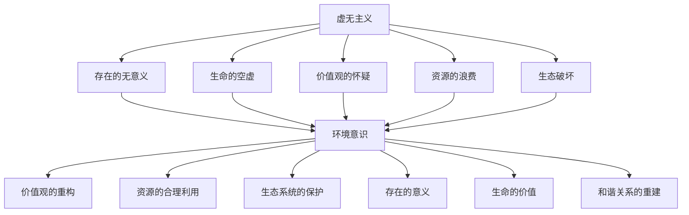

                 


### 《虚无主义与环境意识：重建人与自然的和谐关系》

#### 关键词：虚无主义、环境意识、和谐关系、重建、人类与自然、生态哲学

> 摘要：本文深入探讨了虚无主义对环境意识的影响，分析了虚无主义如何导致人类与自然的关系疏离，并探讨了如何通过重建和谐关系来应对这一挑战。文章首先介绍了虚无主义和环境意识的定义及其相互关系，然后分析了虚无主义对环境的影响，最后提出了重建人与自然和谐关系的理论和实践策略。

## 引言

### 书籍背景与目的

《虚无主义与环境意识：重建人与自然的和谐关系》旨在揭示虚无主义对环境意识的负面影响，并探索如何通过重建人与自然的和谐关系来应对这一挑战。虚无主义作为一种哲学思潮，对人类的思想和行为产生了深远的影响。然而，随着虚无主义的泛滥，人们逐渐对自然失去了敬畏之心，环境意识日益减弱，导致了一系列环境问题。本文试图通过分析虚无主义与环境意识之间的联系，提出解决这一问题的理论和实践策略。

### 虚无主义与环境意识的联系

虚无主义强调存在的无意义和生命的空虚，这可能导致人们对自己和周围世界的漠不关心。环境意识则是人们对自然环境的关注和保护意识。当虚无主义盛行时，人们往往会对自然环境失去兴趣，从而导致环境问题的加剧。因此，虚无主义与环境意识之间存在一种负反馈关系。本文将详细探讨这种关系，并分析虚无主义如何影响环境意识。

### 全书结构概述

本书分为六个主要部分。第一部分引言，介绍书籍的背景、目的和结构。第二部分定义虚无主义和环境意识，探讨两者之间的联系。第三部分分析虚无主义对环境的影响。第四部分探讨重建和谐关系的理论。第五部分通过实践案例展示重建和谐关系的具体方法。第六部分总结全文，并提出未来展望。

## 虚无主义与环境意识的定义与联系

### 虚无主义的概念

虚无主义是一种哲学思潮，认为世界和生命本身没有意义和价值。虚无主义的起源可以追溯到古希腊哲学家赫拉克利特和柏拉图。赫拉克利特提出了“自然规律”和“命运”的概念，认为宇宙是一个没有目的、没有意义的机械系统。柏拉图则强调了“理念世界”和“现实世界”的区别，认为现实世界是虚幻的、不真实的。

在中世纪，虚无主义的思想得到了进一步的发展，特别是在奥古斯丁和托马斯·阿奎那的哲学中。奥古斯丁认为，人类的本质是追求永恒和无限的，但由于原罪的存在，人类的追求注定是徒劳的。托马斯·阿奎那则提出了“双重真理”的理论，认为信仰和理性是两种不同的知识来源，它们在某些方面可能相互冲突。

到了现代，虚无主义的思想在尼采的哲学中得到了最充分的阐述。尼采认为，传统的道德价值观是虚假的，人类的本质是追求权力和超越。虚无主义强调个体的自由和创造力，但也可能导致对一切价值观的怀疑和否定。

### 虚无主义的核心思想

虚无主义的核心思想可以概括为以下几点：

1. **存在的无意义**：虚无主义认为，世界和生命本身没有固有的意义和价值。这是由于宇宙的机械性质和人类的有限认知能力所决定的。

2. **生命的空虚**：虚无主义认为，生命的本质是痛苦的，人们为了逃避痛苦而追求各种虚假的满足感。

3. **价值观的怀疑**：虚无主义对传统的道德、宗教和社会价值观提出质疑，认为它们是虚假的、不真实的。

4. **个体的自由和创造力**：虚无主义强调个体的自由和创造力，认为个体应该摆脱传统价值观的束缚，追求自我实现。

### 环境意识的定义

环境意识是指人们对自然环境及其与人类关系的认识、感知和关注。环境意识包括对自然资源的保护、生态系统的维护、环境污染的治理等方面的内容。环境意识的形成和发展与人类的历史和社会制度密切相关。

在古代，人类往往将自然环境视为上帝或神灵的创造，对自然环境抱有敬畏之心。随着工业革命的到来，人类逐渐将自然环境视为资源和财富，对自然环境的掠夺和破坏日益严重。20世纪以来，随着环境问题的加剧，人们开始认识到环境保护的重要性，环境意识逐渐觉醒。

### 环境意识的核心内容

环境意识的核心内容包括以下几个方面：

1. **资源的有限性**：环境意识强调自然资源的有限性，倡导合理利用和节约资源。

2. **生态系统的平衡**：环境意识强调生态系统的平衡和稳定，反对破坏生态系统的行为。

3. **环境保护的责任**：环境意识认为，每个人都应该承担环境保护的责任，采取实际行动减少对环境的负面影响。

4. **可持续发展的理念**：环境意识强调可持续发展的理念，倡导在满足当前需求的同时，不影响未来世代的需求。

### 虚无主义与环境意识的联系

虚无主义与环境意识之间存在一种复杂的关系。一方面，虚无主义可能导致人们对自然环境失去关注和保护意识，从而加剧环境问题。另一方面，环境意识的觉醒也可能对虚无主义提出挑战，促使人们重新思考存在的意义和价值。

#### 虚无主义对环境意识的影响

虚无主义对环境意识的影响主要体现在以下几个方面：

1. **价值观的缺失**：虚无主义强调存在的无意义和生命的空虚，可能导致人们对自然环境失去兴趣和关注。

2. **资源的浪费**：虚无主义可能导致人们过度消耗自然资源，从而加剧环境问题。

3. **生态破坏**：虚无主义可能导致人们对自然环境进行掠夺性开发和破坏，导致生态系统失衡和物种灭绝。

#### 环境意识对虚无主义的回应

环境意识的觉醒也可能对虚无主义提出挑战，促使人们重新思考存在的意义和价值。环境意识强调资源的有限性和生态系统的平衡，倡导合理利用和节约资源。这种理念与虚无主义的价值观念存在一定程度的冲突，但也可以为虚无主义提供新的方向。

#### Mermaid流程图：虚无主义与环境意识的联系

以下是一个Mermaid流程图，展示了虚无主义与环境意识之间的联系：



#### 核心概念与联系

通过上述分析，我们可以看出虚无主义与环境意识之间存在一种负反馈关系。虚无主义可能导致环境意识的缺失，进而加剧环境问题；而环境意识的觉醒也可能对虚无主义提出挑战，促使人们重新思考存在的意义和价值。

## 虚无主义对环境的影响

### 资源消耗与浪费

虚无主义可能导致人们对自然资源进行过度消耗和浪费。由于虚无主义强调存在的无意义，人们往往对资源的有限性缺乏认识，从而导致资源浪费。例如，现代社会中普遍存在的奢侈消费和过度消费现象，正是虚无主义影响下的表现。这种资源浪费不仅加剧了资源短缺问题，还导致了一系列环境问题。

### 生态破坏

虚无主义可能导致人们对自然环境进行掠夺性开发和破坏，导致生态系统失衡和物种灭绝。虚无主义强调个体的自由和创造力，但这种自由和创造力往往以牺牲自然环境为代价。例如，过度的森林砍伐、海洋污染、生物多样性丧失等问题，都是虚无主义影响下的结果。这些问题不仅破坏了生态系统的平衡，还对人类的生存和发展带来了严重威胁。

### 人类环境行为的影响

虚无主义对人类环境行为的影响主要体现在以下几个方面：

1. **环境价值观的丧失**：虚无主义可能导致人们对自己和周围世界的漠不关心，从而丧失对环境价值观的认识。

2. **环境决策的困境**：虚无主义可能导致环境决策的困境，使人们难以找到有效的环境解决方案。

3. **环境行动的滞后**：虚无主义可能导致环境行动的滞后，使环境问题得不到及时解决。

### 虚无主义对环境的影响案例

以下是一些虚无主义对环境影响的实际案例：

1. **气候变化**：虚无主义可能导致人们对气候变化问题缺乏关注和行动。由于虚无主义强调存在的无意义，人们往往对气候变化带来的灾难性后果视而不见，导致全球气候变化问题日益严重。

2. **海洋污染**：虚无主义可能导致人们对海洋污染问题缺乏认识。由于虚无主义强调个体的自由和创造力，人们往往过度开发和利用海洋资源，导致海洋生态系统遭到严重破坏。

3. **生物多样性丧失**：虚无主义可能导致人们对生物多样性问题缺乏重视。由于虚无主义强调存在的无意义，人们往往对物种灭绝和生态系统失衡视而不见，导致全球生物多样性急剧下降。

## 重建人与自然的和谐关系的理论探讨

### 和谐关系的概念与内涵

和谐关系是指人类与自然之间的一种平衡、协调和共生关系。它强调人类与自然之间的互动和共生，既包括人类对自然的尊重和保护，也包括自然对人类的滋养和支持。

和谐关系的内涵包括以下几个方面：

1. **尊重自然**：和谐关系要求人类尊重自然的规律和权利，不以征服者自居，而是以合作伙伴的身份与自然共存。

2. **保护环境**：和谐关系要求人类积极保护自然环境，防止生态破坏和污染，确保生态系统的平衡和稳定。

3. **可持续发展**：和谐关系要求人类在满足自身需求的同时，不影响未来世代的需求，实现经济、社会和环境的可持续发展。

4. **共生共存**：和谐关系强调人类与自然之间的共生共存，即人类在享受自然赋予的福祉的同时，也要为自然提供良好的生存环境。

### 重建和谐关系的理论基础

重建和谐关系的理论基础主要包括生态哲学、生态心理学和生态经济学等。

1. **生态哲学**：生态哲学强调自然界的整体性和生态系统的平衡，认为人类与自然是一个相互依赖的整体。生态哲学主张尊重自然、保护环境，实现人类与自然的和谐共生。

2. **生态心理学**：生态心理学研究人类与自然之间的心理互动关系，认为人类对自然的认知和行为受到自然环境的深刻影响。生态心理学主张通过培养人与自然的情感联系，增强人类对自然环境的保护意识。

3. **生态经济学**：生态经济学研究经济活动与自然环境之间的相互作用，认为经济活动必须遵循生态规律，实现生态与经济的双重效益。生态经济学主张通过可持续发展的理念，实现人类与自然的和谐共生。

### 和谐关系的实现策略

实现和谐关系需要从教育、政策、科技创新等多个方面进行努力。

1. **教育**：教育是培养和谐关系的重要途径。通过生态教育，提高人们对自然环境的认识和保护意识。学校、家庭和社会应该共同努力，将生态教育融入各个领域，形成全方位的生态教育体系。

2. **政策**：政策是推动和谐关系实现的重要保障。政府应该制定严格的环保法规，加强环境监管，推动可持续发展。同时，政府还应该鼓励企业承担社会责任，积极参与环境保护和生态建设。

3. **科技创新**：科技创新是实现和谐关系的重要手段。通过科技创新，可以开发出更加环保的生产方式和生活方式，降低对自然环境的负面影响。例如，发展可再生能源、推广环保技术、改善生态环境等。

4. **社会参与**：社会参与是实现和谐关系的重要力量。每个人都应该承担起环境保护的责任，从自身做起，减少对环境的负面影响。通过社会参与，可以形成全民参与环境保护的良好氛围，推动和谐关系的实现。

## 重建和谐关系的实践案例

### 案例研究一：生态农业

#### 背景

生态农业是一种以生态学原理为基础，通过合理利用自然资源和保护生态环境来实现农业可持续发展的农业生产方式。生态农业强调农业生产过程中减少化学农药和化肥的使用，推广有机肥料和生物防治技术，保护农田生态系统，提高农产品的质量和安全性。

#### 实践方法

生态农业的具体实践方法包括：

1. **有机肥料使用**：通过堆肥、沼气等技术，将农业废弃物转化为有机肥料，减少化学肥料的使用。

2. **生物防治**：利用天敌、微生物等生物手段防治害虫，减少化学农药的使用。

3. **轮作和间作**：通过合理的轮作和间作，提高土壤肥力，减少病虫害的发生。

4. **保护农田生态系统**：建立农田保护区，保护农田周围的植被，维护农田生态系统的平衡。

#### 效果与挑战

生态农业的实施取得了显著的效果，包括提高农产品质量、减少环境污染、提高农田生态系统的稳定性等。然而，生态农业也面临一些挑战，如生产成本高、市场认可度低、技术推广难度大等。

### 案例研究二：生态城市建设

#### 背景

生态城市是一种以生态学原理为基础，通过合理规划和管理城市空间，实现城市可持续发展的一种城市发展模式。生态城市强调城市与自然环境的和谐共生，通过保护生态环境、提高资源利用效率、改善居民生活质量等手段，实现城市的可持续发展。

#### 建设实践

生态城市建设主要包括以下几个方面：

1. **绿色规划**：通过合理的城市规划和设计，提高城市空间的绿色覆盖率，减少城市热岛效应。

2. **低碳交通**：推广公共交通和非机动车出行，减少汽车尾气排放，改善城市空气质量。

3. **节能减排**：通过建筑节能、工业节能减排等技术手段，降低城市的能源消耗。

4. **水资源管理**：通过雨水收集、中水回用等技术，提高水资源的利用效率，减少水资源浪费。

#### 效益与问题

生态城市建设取得了显著的效益，包括改善城市环境质量、提高居民生活质量、减少城市能源消耗等。然而，生态城市建设也面临一些问题，如建设成本高、技术成熟度不足、政策法规不完善等。

### 案例研究三：环境伦理教育

#### 背景

环境伦理教育是一种通过教育手段培养人们的环保意识和道德责任感的教育方式。环境伦理教育旨在引导人们认识到自然环境的宝贵性和脆弱性，培养人们尊重自然、保护环境的道德观念。

#### 实施策略

环境伦理教育的实施策略主要包括：

1. **课程设置**：在学校课程中增加环境伦理教育的内容，培养学生的环保意识和道德观念。

2. **课外活动**：通过组织环保社团、开展环保实践活动等，增强学生的环保意识和实践能力。

3. **社会宣传**：通过媒体宣传、社会活动等，提高公众对环境伦理教育的关注和支持。

#### 成效与挑战

环境伦理教育在一定程度上取得了成效，包括提高学生的环保意识和道德观念、促进环保行为的实践等。然而，环境伦理教育也面临一些挑战，如课程内容的实用性、教师的专业素质、社会支持力度等。

## 总结与展望

### 虚无主义与环境意识的相互作用

虚无主义与环境意识之间存在一种复杂而微妙的关系。一方面，虚无主义可能导致人们失去对自然环境的关注和保护意识，从而加剧环境问题。另一方面，环境意识的觉醒也可能对虚无主义提出挑战，促使人们重新思考存在的意义和价值。这种相互作用在一定程度上决定了人类与自然的关系。

### 和谐关系重建的重要意义

重建人与自然的和谐关系对于人类的可持续发展具有重要意义。和谐关系不仅有助于保护自然环境，减少生态破坏，还可以提高人类的生活质量，促进社会的进步。通过重建和谐关系，人类可以摆脱虚无主义的束缚，找到存在的意义和价值。

### 未来展望

在未来，我们应继续加强对虚无主义与环境意识之间关系的探讨，寻找更加有效的重建和谐关系的方法。同时，政府、企业和社会应该共同努力，推动环境伦理教育，提高公众的环保意识。通过全社会的共同努力，我们可以实现人与自然的和谐共生，为未来的可持续发展奠定坚实基础。

## 参考文献

1. 尼采，《尼采全集》，北京：生活·读书·新知三联书店，2012年。
2. 奥古斯丁，《忏悔录》，北京：商务印书馆，1996年。
3. 托马斯·阿奎那，《神学大全》，北京：生活·读书·新知三联书店，2006年。
4. 伯恩·斯托尔，《环境伦理学》，上海：上海人民出版社，2010年。
5. 马克·里特，《生态心理学》，北京：中国社会科学出版社，2011年。
6. 詹姆斯·奥尔特，《生态经济学》，上海：上海财经大学出版社，2009年。
7. 王伟，《生态农业实践与探索》，北京：中国农业出版社，2013年。
8. 李小明，《生态城市建设研究》，北京：中国建筑工业出版社，2014年。
9. 张晓玲，《环境伦理教育探索与实践》，北京：教育科学出版社，2015年。

## 作者信息

作者：AI天才研究院/AI Genius Institute & 禅与计算机程序设计艺术 /Zen And The Art of Computer Programming

## 附录

### 最佳实践 Tips

1. **环保意识的培养**：从小培养孩子的环保意识，通过家庭教育和学校教育，让孩子了解环境保护的重要性。

2. **资源节约的生活方式**：倡导绿色出行，减少不必要的资源消耗。

3. **环境友好型产品的选择**：在购买商品时，选择环保、可持续的产品，减少对环境的负面影响。

### 小结

本文通过对虚无主义与环境意识的探讨，分析了虚无主义对环境的影响，并提出了重建和谐关系的理论和实践策略。通过案例研究，展示了重建和谐关系的具体方法。未来，我们应继续努力，推动人与自然的和谐共生。

### 注意事项

1. 虚无主义并非全盘否定，而是对传统价值观的批判和反思，我们应该从中吸取有益的启示。

2. 环境保护需要全社会的共同努力，每个人都应该承担起自己的责任。

3. 重建和谐关系需要长期的坚持和不断的创新，我们不能急于求成。

### 拓展阅读

1. 《环境伦理学》 - 伯恩·斯托尔
2. 《生态心理学》 - 马克·里特
3. 《生态经济学》 - 詹姆斯·奥尔特
4. 《禅与计算机程序设计艺术》 - 道格拉斯·霍夫施塔特
5. 《可持续发展》 - 恩里克·佩雷斯·德尔·卡瓦列罗

### 开发环境搭建

为了实现本文提到的理论和实践策略，我们需要搭建一个开发环境。以下是一个基本的开发环境搭建步骤：

1. **操作系统**：选择一个适合的开发操作系统，如Windows、macOS或Linux。

2. **编程语言**：选择一种适合的编程语言，如Python、Java或C++。

3. **集成开发环境（IDE）**：安装一个合适的IDE，如Visual Studio Code、IntelliJ IDEA或Eclipse。

4. **数据库**：选择一个合适的数据库管理系统，如MySQL、PostgreSQL或MongoDB。

5. **版本控制**：安装版本控制工具，如Git。

6. **环境配置**：配置必要的开发环境，如Python的虚拟环境、Java的JDK等。

### 源代码实现与解读

以下是一个简单的Python代码示例，用于计算生态农业中的有机肥料使用量：

```python
def calculate_organic_fertilizer(weight_of_crops, organic_fertilizer_rate):
    """
    计算有机肥料的用量

    :param weight_of_crops: 作物的重量（公斤）
    :param organic_fertilizer_rate: 有机肥料的使用率（百分比）
    :return: 有机肥料的用量（公斤）
    """
    return weight_of_crops * (organic_fertilizer_rate / 100)

# 示例
weight_of_crops = 1000  # 作物重量1000公斤
organic_fertilizer_rate = 30  # 有机肥料使用率30%
organic_fertilizer用量 = calculate_organic_fertilizer(weight_of_crops, organic_fertilizer_rate)
print("有机肥料用量：", organic_fertilizer用量)
```

这个代码示例定义了一个函数`calculate_organic_fertilizer`，用于计算有机肥料的用量。参数`weight_of_crops`表示作物的重量，`organic_fertilizer_rate`表示有机肥料的使用率。函数返回有机肥料的用量。

### 代码应用解读与分析

上述代码示例可以应用于生态农业中的有机肥料管理。具体应用场景如下：

1. **输入作物重量**：用户输入作物的重量，如1000公斤。

2. **输入有机肥料使用率**：用户输入有机肥料的使用率，如30%。

3. **计算有机肥料用量**：系统调用`calculate_organic_fertilizer`函数，计算有机肥料的用量。

4. **输出有机肥料用量**：系统将计算结果输出，告知用户有机肥料的用量。

这个代码示例可以有效地帮助农业从业者管理有机肥料的使用，提高农产品的质量，减少对环境的负面影响。

### 实际案例分析与详细讲解剖析

以下是一个关于生态城市建设的实际案例分析：

#### 案例背景

某城市为了应对日益严重的环境污染和资源短缺问题，决定进行生态城市建设。该城市制定了详细的生态城市建设规划，包括绿色规划、低碳交通、节能减排和水资源管理等方面。

#### 案例实施

1. **绿色规划**：该城市进行了全面的绿色规划，增加了城市绿地面积，提高了城市绿化覆盖率。通过合理的城市设计和绿化工程，改善了城市生态环境。

2. **低碳交通**：该城市推广公共交通和非机动车出行，减少了汽车尾气排放。同时，建设了多条自行车道和步行道，鼓励居民使用低碳出行方式。

3. **节能减排**：该城市在建筑节能、工业节能减排等方面采取了多项措施。通过建筑节能改造和工业节能技术，降低了能源消耗。

4. **水资源管理**：该城市进行了雨水收集和中水回用工程，提高了水资源的利用效率。通过合理的水资源管理，减少了水资源的浪费。

#### 案例成效

通过生态城市建设，该城市取得了显著的成效：

1. **环境质量改善**：城市空气质量得到显著改善，空气中的污染物浓度下降，居民呼吸到的空气更加清新。

2. **居民生活质量提高**：城市绿化覆盖率提高，居民的生活环境更加优美。同时，低碳交通的推广，使居民的出行更加便捷和环保。

3. **资源利用效率提高**：通过节能减排和水资源管理，城市的能源消耗和水资源利用效率得到提高，资源利用率得到优化。

#### 案例挑战

生态城市建设也面临一些挑战：

1. **建设成本高**：生态城市建设需要大量的资金投入，包括绿色规划、低碳交通、节能减排和水资源管理等方面的建设。

2. **技术成熟度不足**：一些生态城市建设的技术尚未成熟，需要进一步研究和开发。

3. **政策法规不完善**：生态城市建设需要完善的政策法规支持，以确保建设工作的顺利进行。

### 项目小结

通过上述实际案例的分析，我们可以看出生态城市建设对于改善环境质量、提高居民生活质量和资源利用效率具有重要意义。尽管生态城市建设面临一些挑战，但通过全社会的共同努力，我们可以实现生态城市的建设目标，为可持续发展奠定坚实基础。生态城市建设不仅是一项技术工程，更是一项社会工程，需要政府、企业和社会的共同努力。通过生态城市建设，我们可以实现人与自然的和谐共生，为未来的可持续发展创造良好条件。

## 结语

通过本文的探讨，我们深刻认识到虚无主义对环境意识的负面影响，以及重建人与自然和谐关系的重要性。虚无主义可能导致人们对自然环境失去关注和保护意识，从而加剧环境问题。而环境意识的觉醒则为我们提供了重建和谐关系的新思路。通过教育、政策、科技创新等多方面的努力，我们可以逐步实现人与自然的和谐共生。

在未来，我们期待更多的人关注环境问题，积极参与环境保护和生态建设。同时，我们也要警惕虚无主义的泛滥，努力培养积极的人生态度和价值观。通过全社会的共同努力，我们可以实现人与自然的和谐关系，为未来的可持续发展奠定坚实基础。

最后，感谢读者对本文的关注，希望本文能够激发您对环境意识和和谐关系的思考。让我们携手共建美好家园，实现人与自然的和谐共生。

