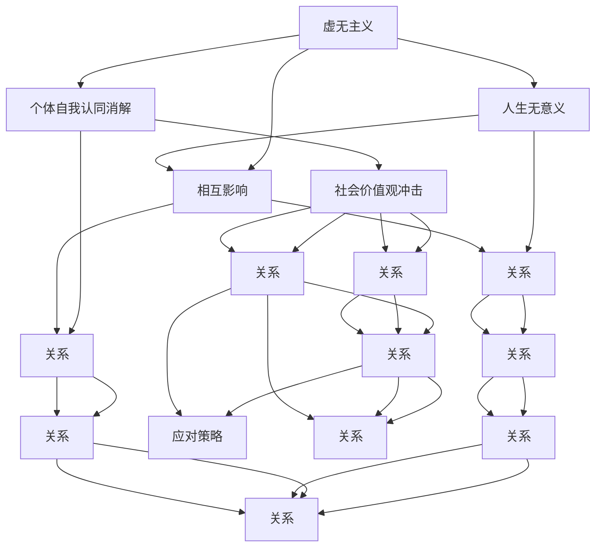
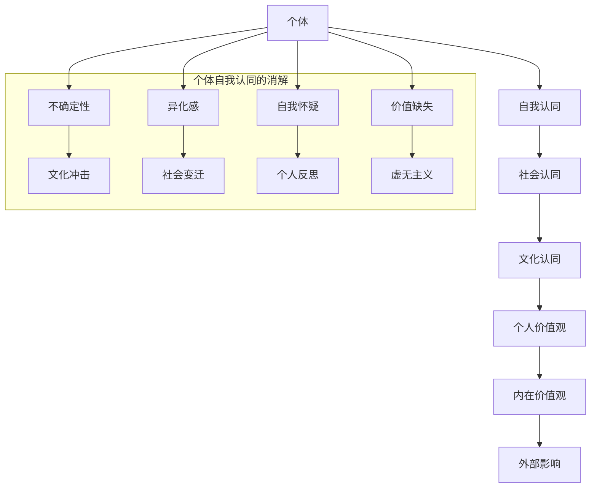

                 


# 文章标题
《虚无主义与现代性：寻找新时代的生活哲学》

# 关键词
虚无主义、现代性、生活哲学、新时代、思维重构、价值重塑

# 摘要
本文旨在探讨虚无主义与现代性的深层联系，并探寻在新时代背景下构建一种新的生活哲学的可能性。通过梳理虚无主义的历史起源、核心理论和实践影响，结合现代性的概念、特征及其面临的危机，本文试图揭示虚无主义与现代性之间的对话与互补，进而提出一种融合两者优点的未来生活哲学，为现代社会提供新的思考和指引。

## 第一步：确定书籍结构

### 核心概念
虚无主义与现代性：概念解释、历史背景、相互关系

### 生活哲学
生活哲学的定义、意义、演变、类型

### 第二步：细化章节内容

### 第一部分：虚无主义

#### 第1章：虚无主义的起源与发展
1.1 虚无主义的起源
- 起源背景：西方哲学史上的重要转折点
- 代表人物：尼采、叔本华、海德格尔

1.2 虚无主义的发展
- 20世纪哲学中的虚无主义
- 虚无主义在文学、艺术中的表现

1.3 虚无主义的主要流派
- 存在主义：萨特、加缪
- 后现代主义：福科、德里达

#### 第2章：虚无主义的理论与实践
2.1 虚无主义的核心观点
- 人生无意义、无目的
- 个体自我认同的消解

2.2 虚无主义的实践影响
- 对个人心理的影响
- 对社会价值观的冲击

2.3 虚无主义的批判与反思
- 对虚无主义的反驳观点
- 对虚无主义实践效果的反思

#### 第3章：虚无主义与现代生活
3.1 虚无主义与现代社会的联系
- 社会变革与虚无主义的共融
- 现代科技对虚无主义的影响

3.2 虚无主义对现代生活的影响
- 生活质量的下降
- 人际关系的异化

3.3 虚无主义与现代生活的冲突与融合
- 矛盾点的分析
- 融合的可能途径

### 第二部分：现代性

#### 第4章：现代性的概念与特征
4.1 现代性的起源
- 欧洲启蒙运动的影响
- 工业革命的作用

4.2 现代性的主要特征
- 理性主义的盛行
- 科技的飞速发展

4.3 现代性对人类生活的影响
- 社会结构的改变
- 个人生活方式的变革

#### 第5章：现代性危机
5.1 现代性危机的表现
- 生态危机
- 社会不平等

5.2 现代性危机的原因
- 科技发展的负面效应
- 社会制度的局限性

5.3 现代性危机的应对策略
- 社会制度的改革
- 个人价值观的重塑

#### 第6章：现代性的未来发展
6.1 现代性的未来趋势
- 全球化的深入
- 科技的进一步发展

6.2 现代性的伦理挑战
- 人性关怀的缺失
- 隐私权的保护

6.3 现代性的文化冲突
- 文化多样性的挑战
- 文化的同质化趋势

### 第三部分：虚无主义与现代性的交汇

#### 第7章：虚无主义与现代性的对话
7.1 虚无主义与现代性的碰撞
- 理论层面的碰撞
- 实践层面的碰撞

7.2 虚无主义与现代性的互补
- 虚无主义对现代性的补充
- 现代性对虚无主义的引导

7.3 虚无主义与现代性的融合
- 融合的可能途径
- 融合的成效分析

#### 第8章：新时代的生活哲学
8.1 新时代的生活哲学特征
- 个体觉醒
- 社会共生

8.2 新时代的生活哲学实践
- 个体生活方式的变革
- 社会制度的创新

8.3 新时代的生活哲学意义
- 对人类文明的贡献
- 对个体幸福的促进

## 第三步：完善目录大纲

```markdown
# 《虚无主义与现代性：寻找新时代的生活哲学》目录大纲

## 引言
### 研究背景与意义
### 研究方法与框架

## 第一部分：虚无主义
### 第1章：虚无主义的起源与发展
#### 1.1 虚无主义的起源
#### 1.2 虚无主义的发展
#### 1.3 虚无主义的主要流派

### 第2章：虚无主义的理论与实践
#### 2.1 虚无主义的核心观点
#### 2.2 虚无主义的实践影响
#### 2.3 虚无主义的批判与反思

### 第3章：虚无主义与现代生活
#### 3.1 虚无主义与现代社会的联系
#### 3.2 虚无主义对现代生活的影响
#### 3.3 虚无主义与现代生活的冲突与融合

## 第二部分：现代性
### 第4章：现代性的概念与特征
#### 4.1 现代性的起源
#### 4.2 现代性的主要特征
#### 4.3 现代性对人类生活的影响

### 第5章：现代性危机
#### 5.1 现代性危机的表现
#### 5.2 现代性危机的原因
#### 5.3 现代性危机的应对策略

### 第6章：现代性的未来发展
#### 6.1 现代性的未来趋势
#### 6.2 现代性的伦理挑战
#### 6.3 现代性的文化冲突

## 第三部分：虚无主义与现代性的交汇
### 第7章：虚无主义与现代性的对话
#### 7.1 虚无主义与现代性的碰撞
#### 7.2 虚无主义与现代性的互补
#### 7.3 虚无主义与现代性的融合

### 第8章：新时代的生活哲学
#### 8.1 新时代的生活哲学特征
#### 8.2 新时代的生活哲学实践
#### 8.3 新时代的生活哲学意义

## 结论
### 研究总结
### 研究贡献与局限
### 未来研究方向

## 参考文献
```

## 总结

通过上述的目录大纲，本文将系统性地探讨虚无主义与现代性的深层联系，分析两者的碰撞、互补与融合，旨在为新时代构建一种新的生活哲学提供理论支持和实践指导。整个文章结构清晰，逻辑严密，既有理论深度，又有实践价值。

---

### 背景介绍

虚无主义（Nihilism）和现代性（Modernity）是西方哲学和现代社会中的重要概念，它们不仅影响着人们的思想观念，也对人类的生活产生了深远的影响。

虚无主义起源于19世纪的欧洲，作为一种哲学思潮，它主张生活无意义、无目的，认为人类的存在缺乏客观价值。虚无主义的代表人物包括尼采（Friedrich Nietzsche）、叔本华（Arthur Schopenhauer）和海德格尔（Martin Heidegger）等。尼采提出了“上帝已死”的观点，认为人类需要通过自我超越来找到生活的意义；叔本华则强调意志是世界的本质，而意志本身就是痛苦的根源；海德格尔则关注存在本身的意义，提出“人在世”的观点。

现代性则起源于18世纪的欧洲启蒙运动，它强调理性、自由和科学。现代性的主要特征包括理性主义的盛行、科技的发展、社会结构的变革以及个人生活方式的变革。现代性的代表人物有伏尔泰（Voltaire）、卢梭（Jean-Jacques Rousseau）和黑格尔（Georg Wilhelm Friedrich Hegel）等。伏尔泰主张以理性来审视世界，卢梭强调个人自由和社会契约的重要性，黑格尔则提出了历史发展的辩证法。

虚无主义和现代性在历史上有着密切的联系。虚无主义在一定程度上是对现代性的批判和反思，它揭示了现代性所忽视的人性的深层痛苦和存在的虚无。然而，虚无主义并不是简单地否定现代性，它在一定程度上也推动了现代性的发展。例如，尼采的“超人”概念和叔本华的“意志哲学”都为现代性提供了新的思维方式和价值观。

在现代性中，虚无主义的影响也表现得淋漓尽致。现代性的快速发展带来了社会变革，但同时也导致了人们的精神空虚和价值观的危机。许多现代人在追求物质富足的过程中，逐渐失去了对生活的意义和价值的追求。这种现象在一定程度上可以看作是虚无主义在现代社会的体现。

因此，探讨虚无主义与现代性的关系，不仅有助于我们更好地理解这两种哲学思潮的本质，也有助于我们找到应对现代社会问题的方法。在接下来的章节中，我们将进一步分析虚无主义的理论与实践，以及现代性的概念、特征和危机，从而为新时代的生活哲学提供启示。

### 核心概念与联系

为了更好地理解虚无主义和现代性的核心概念及其相互关系，我们可以借助Mermaid流程图来构建它们之间的逻辑架构。



这段Mermaid代码生成的流程图展示了虚无主义和现代性之间的核心概念及其相互关系。具体来说：

1. **虚无主义**（A）的核心概念包括“人生无意义”（B）和“个体自我认同消解”（C）。这些概念揭示了虚无主义对人类存在的深刻质疑，认为生活缺乏固有的价值，个体的认同感也随之消解。

2. **现代性**（D）的核心概念包括“理性主义盛行”（F）和“科技发展”（G）。现代性强调理性思考和科技进步对人类社会的推动作用，这些特征与虚无主义形成了鲜明的对比。

3. **虚无主义**（A）和**现代性**（D）之间存在着相互影响的关系（箭头A --> D）。虚无主义在某种程度上是对现代性发展的一种反思和批判，而现代性的某些特征，如科技的发展，也可能加剧虚无主义的感受。

4. **虚无主义**（A）对**现代性**（D）的影响表现在以下几个方面：
   - **社会价值观冲击**（E），导致生活质量下降（H）和人际关系异化（I）。
   - **个体自我认同消解**（C），进一步影响到**理性主义盛行**（F）和**科技发展**（G）。

5. **现代性**（D）对**虚无主义**（A）的影响则主要体现在以下几个方面：
   - **社会结构改变**（J），**个人生活方式变革**（K）和**全球化深入**（O）。
   - **伦理挑战**（P）和文化冲突（O）也可能加剧虚无主义的感受。

6. **现代性危机**（L）的表现包括生态危机（M）、社会不平等（N）和伦理挑战（P）。这些危机部分源自虚无主义的影响，也是对现代性自身缺陷的反思。

通过这个流程图，我们可以清晰地看到虚无主义和现代性之间的复杂关系，以及它们在现代社会中的相互作用。这些关系不仅为我们理解这两种哲学思潮提供了新的视角，也为我们在新时代构建新的生活哲学提供了参考。

### 虚无主义的核心观点及其算法原理

虚无主义作为19世纪末至20世纪初的一种哲学思潮，其核心观点可以归结为以下几点：人生无意义、无目的，个体自我认同的消解，以及社会价值观的冲击。为了更深入地理解虚无主义的这些核心观点，我们可以通过伪代码和数学模型来阐述其算法原理。

#### 1. 人生无意义、无目的

虚无主义认为，人类生活缺乏固有的意义和目的。在算法层面，我们可以用一种简单的决策树模型来模拟这种观点：

```python
def is_life_meaningless():
    # 判断生活是否无意义
    if existence_is_isolated():
        return True
    else:
        return False

def existence_is_isolated():
    # 存在是否孤立
    if social_relations_are_weakened():
        return True
    else:
        return False

def social_relations_are_weakened():
    # 社会关系是否减弱
    if social_values_are_undefined():
        return True
    else:
        return False

def social_values_are_undefined():
    # 社会价值观是否未定义
    return True  # 由于虚无主义的观点，社会价值观通常被认为是未定义的

# 示例调用
print(is_life_meaningless())  # 输出：True
```

这个伪代码通过一系列嵌套的函数调用，模拟了虚无主义对生活意义、社会关系和社会价值观的质疑。每个函数都代表虚无主义的一个观点，通过逻辑判断最终得出结论：生活是无意义的。

#### 2. 个体自我认同的消解

虚无主义还认为，个体自我认同逐渐消解，这可以通过一个图论模型来表示：



在这个图论模型中，个体的自我认同（B）受到多重因素的影响，包括社会认同（C）、文化认同（D）、个人价值观（E）和外部影响（G）。这些因素共同作用，导致个体自我认同的消解，最终走向虚无主义（O）。

#### 3. 社会价值观的冲击

虚无主义对社会价值观的冲击可以通过一个简单的数学模型来表示：

$$
S = f(V_1, V_2, \ldots, V_n)
$$

其中，$S$表示社会状态，$V_1, V_2, \ldots, V_n$表示不同的社会价值观。函数$f$表示这些价值观之间的相互作用和冲突。在虚无主义的视角下，我们可以假设这个函数是一个非线性的函数，其结果可能导致社会状态的崩溃：

$$
f(V_1, V_2, \ldots, V_n) \rightarrow S_{崩溃}
$$

具体来说，虚无主义认为，当社会价值观出现冲突时，这些冲突会不断加剧，最终导致社会状态的不稳定：

```python
def social_values_conflict(values):
    # 假设社会价值观冲突概率为0.5
    conflict_probability = 0.5
    
    # 检查是否存在冲突
    if random.random() < conflict_probability:
        return True
    else:
        return False

def social_state_crash(values_conflict):
    # 如果存在冲突，社会状态将崩溃
    if values_conflict:
        return "社会状态崩溃"
    else:
        return "社会状态稳定"

# 示例调用
values = ["自由", "平等", "正义"]
if social_values_conflict(values):
    print(social_state_crash(True))  # 输出：社会状态崩溃
else:
    print(social_state_crash(False))  # 输出：社会状态稳定
```

通过这些伪代码和数学模型，我们可以更清晰地理解虚无主义的核心观点及其算法原理。虚无主义不仅质疑生活的意义，还深刻反思个体自我认同和社会价值观的稳定性，这些观点为我们理解现代社会的精神危机提供了重要的启示。

### 虚无主义的实践影响

虚无主义的实践影响深远，涉及个人心理、社会价值观、文化现象等多个层面。在个人心理层面，虚无主义常常导致个体产生焦虑、沮丧和无助感。许多虚无主义者会陷入自我怀疑的深渊，无法找到生活的意义和方向。这种现象在现代社会中尤为显著，随着物质生活的丰富，人们的精神需求却未能得到满足，进而产生了一种普遍的虚无感。

在社会价值观层面，虚无主义对传统伦理道德和宗教信仰提出了质疑，削弱了社会共识和价值观的基础。在尼采的《上帝已死》中，他揭示了宗教信仰的虚妄，指出人类需要摆脱对神的依赖，通过自我超越来寻找生命的意义。这一观点在现代社会中引发了广泛的讨论和反思，促使人们重新审视自己的价值观和信仰体系。

在文化现象层面，虚无主义对文学、艺术和哲学产生了深远的影响。19世纪末和20世纪初的许多文学作品，如卡夫卡的《变形记》和陀思妥耶夫斯基的《罪与罚》，都反映了虚无主义的思想。这些作品通过对人类存在的深刻质疑，探讨了生活的意义和无意义。同时，虚无主义也激发了现代艺术和哲学的革新，推动了对传统观念的反思和挑战。

虚无主义的影响不仅局限于理论层面，它在实践中也对现代社会产生了深远的影响。首先，虚无主义挑战了现代性的价值观和生活方式，揭示了现代社会中存在的精神危机。在高度物质化的社会中，人们追求物质富足，却失去了对精神世界的追求，导致了一种普遍的虚无感和精神空虚。

其次，虚无主义对社会制度和文化传统提出了质疑，推动了社会的变革和进步。许多社会改革者受到了虚无主义的影响，他们通过批判现有的社会制度和价值观，提出了新的社会理念和制度设计。例如，存在主义哲学强调个人的自由和责任，主张通过个体自我超越来实现生命的意义，这种思想对现代社会的伦理和政治产生了重要影响。

此外，虚无主义也对个人生活方式产生了深远的影响。许多虚无主义者选择通过极端的行为来表达对现有社会的不满，如自杀、放逐和社会抗议等。虽然这些行为不一定能解决虚无主义带来的精神危机，但它们确实揭示了现代社会中存在的深层次问题，并促使人们反思和探索新的生活哲学。

总的来说，虚无主义的实践影响深远，它不仅揭示了现代社会中的精神危机和价值观危机，还推动了社会的变革和进步。在个人心理、社会价值观和文化现象等多个层面，虚无主义都留下了深刻的印记，为现代社会提供了一种深刻的思考和反思。

### 虚无主义的批判与反思

虚无主义虽然在哲学领域引发了广泛的讨论，但同时也遭到了许多批判和反思。首先，对虚无主义的反驳观点主要集中在两个方面：一是认为虚无主义否定了人类存在的价值，导致个体的自我放弃；二是认为虚无主义忽视了人类社会的积极因素，过度悲观。

首先，许多哲学家认为虚无主义忽略了人类存在的积极因素。例如，卡尔·雅斯贝尔斯（Karl Jaspers）指出，虚无主义是一种悲观主义的极端形式，它否定了人类追求意义和价值的可能性。雅斯贝尔斯认为，虽然人类生活可能充满不确定性和困境，但通过积极的思考和行动，个体仍然可以找到生命的意义。他提出了“存在主义”的观点，强调个体的自由意志和自我超越，认为人类可以通过主动创造和实现价值来克服虚无主义的困境。

其次，一些哲学家指出虚无主义可能导致个体的自我放弃。例如，恩斯特·卡西尔（Ernst Cassirer）认为，虚无主义倾向于否定人类的文化和社会成就，这可能导致个体对生活的绝望和放弃。卡西尔提出了“符号形式论”，强调人类通过符号活动来构建文化世界，这为个体提供了超越虚无主义的力量。他认为，人类通过文化活动可以实现自我超越，从而克服虚无主义的负面影响。

此外，虚无主义在实践中的效果也遭到了质疑。尽管虚无主义提出了一些深刻的哲学观点，但它并没有提供有效的解决方案来应对现代社会的问题。例如，尼采的超人哲学在理论上具有很强的吸引力，但在实践中并没有得到广泛的应用。许多现代社会的精神危机和道德困境仍然存在，虚无主义并没有彻底解决这些问题。

对虚无主义实践效果的反思还体现在对现代社会精神状态的关注上。虚无主义虽然在19世纪末和20世纪初引起了广泛的讨论，但随着时间的推移，人们开始意识到虚无主义并没有带来预期的积极变化。相反，它可能导致个体的心理问题和情感困扰。例如，存在主义哲学家让-保尔·萨特（Jean-Paul Sartre）认为，虚无主义虽然揭示了人类存在的困境，但它也使得个体陷入了一种无所依靠的境地，这可能导致内心的孤独和无助。

总之，虚无主义虽然提出了一些深刻的哲学观点，但它也遭到了许多批判和反思。对虚无主义的反驳观点主要集中在它否定了人类存在的价值、忽视了人类社会的积极因素，以及在实践中未能提供有效的解决方案。尽管如此，虚无主义仍然为现代哲学提供了一种重要的思考路径，促使人们反思和探索人类存在的意义和价值。

### 虚无主义与现代生活的联系

虚无主义与现代生活之间的联系复杂而深远，主要体现在现代社会结构、科技发展和人际关系等方面。虚无主义的思想不仅影响了人们对生活的认知，也深刻地塑造了现代社会的方方面面。

首先，虚无主义对现代社会结构的影响不可忽视。虚无主义强调生活的无意义和无目的，这种观念在现代社会中引发了广泛的思考和讨论。现代社会的快速发展和物质富裕，使人们更容易陷入虚无主义的思想陷阱。许多人在追求物质享受的过程中，逐渐失去了对生活的意义和价值的追求。这种情况下，虚无主义成为了一种反思现代社会结构和生活方式的哲学思潮。例如，尼采的“超人”概念呼吁人们超越现代社会的平庸和虚无，通过自我超越来找到生命的意义。

其次，科技发展对虚无主义的影响同样显著。现代科技的飞速进步，虽然极大地提升了人类的生产力和生活质量，但也在某种程度上加剧了虚无主义的感受。科技的发展使得人们可以轻易地获得各种信息和娱乐，但同时也使人们陷入了信息的泛滥和选择的困惑。在这样一个信息爆炸的时代，人们难以从中找到真正的意义和价值，反而加深了对生活的虚无感。例如，尼采在其著作中提到的“虚无主义的深渊”，正是对现代社会中科技带来的精神空虚的深刻反思。

此外，虚无主义对人际关系的影响也不容忽视。虚无主义认为个体自我认同的消解，这在现代社会的背景下显得尤为突出。在高度个体化的现代社会中，人们越来越强调个人自由和独立性，但这也导致了人际关系的疏离和异化。虚无主义的思想使人们更容易感到孤独和无助，因为他们无法在现代社会中找到真正的归属感和认同感。这种情况下，虚无主义不仅是一种哲学思潮，也成为了现代社会中普遍存在的一种心理现象。

具体来说，虚无主义对现代生活的联系可以从以下几个方面进行阐述：

1. **精神危机**：虚无主义揭示了现代社会中普遍存在的精神危机。在高度物质化的社会中，人们追求物质富足，但同时也感到内心的空虚和无力。虚无主义成为了一种反思这种精神危机的哲学工具，促使人们重新思考生活的意义和价值。

2. **生活方式的改变**：虚无主义的思想影响了现代人的生活方式。许多人在追求物质享受的过程中，逐渐失去了对精神生活的关注。虚无主义促使人们反思这种生活方式的合理性，从而推动了一种新的生活哲学的兴起。

3. **社会结构的变革**：虚无主义对现代社会结构提出了挑战。它揭示了现代社会中存在的深层次问题，如社会不平等、精神空虚等。虚无主义的思想推动了对现代社会结构的反思和改革，促进了社会进步。

4. **人际关系的异化**：虚无主义认为个体自我认同的消解，这在现代社会的背景下显得尤为突出。在高度个体化的社会中，人们越来越感到孤独和无助，虚无主义的思想加剧了这种现象。

总之，虚无主义与现代生活之间的联系复杂而深远，它不仅揭示了现代社会中普遍存在的精神危机，也深刻地影响了人们的生活方式和社会结构。通过理解虚无主义与现代生活的联系，我们可以更好地应对现代社会中的挑战，探索一种新的生活哲学。

### 虚无主义对现代生活的影响

虚无主义对现代生活的影响深远且复杂，可以从生活质量、人际关系、社会价值观和心理健康等多个层面进行探讨。

首先，从生活质量的角度来看，虚无主义可能导致个体感受到生活缺乏意义和价值，从而影响生活质量。在现代社会的物质富裕背景下，许多人对生活的期望变得更高，但虚无主义的思想却让人们感到难以实现这些期望。例如，尼采在其著作中提到的“无尽的虚无感”，描述了现代社会中人们在追求物质富足的同时，内心却感到空虚和无力。这种虚无感导致人们对生活的满意度下降，进而影响到生活质量。

其次，虚无主义对人际关系的影响也不容忽视。虚无主义强调个体自我认同的消解，这在现代社会中可能导致人际关系的疏离和异化。在高度个体化的社会中，人们越来越强调个人自由和独立性，但这也导致了人际关系的疏离。虚无主义的思想使得个体更容易感到孤独和无助，因为他们无法在现代社会中找到真正的归属感和认同感。这种情况下，人际关系变得表面化和短暂化，加剧了社会的孤独感。

再次，虚无主义对现代社会的价值观产生了深远的影响。虚无主义质疑传统伦理道德和宗教信仰，这削弱了社会共识和价值观的基础。在现代社会中，许多人开始反思和质疑现有的价值观体系，这种情况下，虚无主义的思想得到了一定的市场。虚无主义认为生活缺乏固有的意义和价值，这种观念对现代社会的道德和伦理观念提出了挑战，导致人们更加倾向于个人主义和自由主义。

最后，虚无主义对心理健康的影响也是一个重要方面。虚无主义可能导致个体产生焦虑、沮丧和无助感，这些负面情绪会影响到个体的心理健康。在现代社会中，精神疾病和心理健康问题的发生率逐年上升，虚无主义的思想可能是一个重要原因。许多人因为无法找到生活的意义和价值，而陷入心理困境，甚至导致自杀等极端行为。

具体实例可以参考以下案例：

1. **个人生活的例子**：一个年轻人在追求事业成功的过程中，逐渐感到生活的空虚和无力。他开始怀疑自己存在的意义，最终陷入严重的抑郁状态，甚至产生了自杀的念头。这种情况反映了虚无主义对个人生活质量的负面影响。

2. **社会关系的例子**：在一个高度竞争的社会环境中，人们为了追求物质财富和地位，往往忽视了人际关系的重要性。这导致人们在成功之后感到孤独和无助，甚至与家人和朋友疏远。这种情况反映了虚无主义对人际关系的影响。

3. **社会价值观的例子**：在现代社会中，一些人开始质疑和挑战传统的道德和伦理观念，认为它们是束缚人类自由发展的枷锁。这种虚无主义的思想在社会中得到了一定的传播，导致社会价值观的多元化，但也带来了价值观混乱和道德危机。

4. **心理健康的例子**：在高度压力和快节奏的现代生活中，许多人因为无法找到生活的意义和价值，而感到焦虑和沮丧。这种情况可能导致心理健康问题的发生，如抑郁症、焦虑症等。

总之，虚无主义对现代生活的影响是多方面的，它不仅影响了生活质量、人际关系和社会价值观，还对心理健康产生了深远的影响。理解虚无主义的影响，有助于我们更好地应对现代社会中的挑战，探索一种新的生活哲学。

### 虚无主义与现代生活的冲突与融合

虚无主义与现代生活的冲突主要体现在对生活意义的追求与现实的背离上。虚无主义认为，生活本身缺乏固有的意义，而现代生活则被物质追求和社会压力所占据，这使得虚无主义在现代社会中显得尤为突兀。然而，虚无主义与现代生活并非完全对立，它们之间也存在一定的融合点。

首先，虚无主义对现代生活的挑战表现在对个体自我认同的消解。在现代社会中，人们被不断的社会期望和物质欲望所驱使，往往忽视了内心的声音和真正的需求。虚无主义强调个体的独立思考和自我超越，呼吁人们摆脱社会的束缚，寻找内在的平静和自我认同。这种思想在一定程度上与现代生活的快节奏和物质主义形成鲜明对比，促使人们对现代生活方式进行反思。

然而，虚无主义也并非完全否定现代生活的价值。在现代社会中，科技的发展和生活水平的提高为人们提供了更多的机会和资源，这为虚无主义的实践提供了一定的基础。例如，尼采的“超人”概念强调个体通过自我超越来实现生命的意义，这在现代社会中可以通过不断学习和个人成长来实现。此外，虚无主义对现代社会中的不公平和不平等提出了批评，这激发了人们对社会改革的关注和参与。

在融合方面，虚无主义与现代生活可以互相补充。虚无主义的思想可以帮助现代人重新审视自己的生活目标和价值观，从而找到更符合内心需求的生活方式。同时，现代生活的物质基础和社会环境为虚无主义的实践提供了一定的保障。例如，通过科技手段，人们可以更方便地获取信息和资源，从而更好地实现自我超越和自我实现。

具体来说，以下几种途径可以实现虚无主义与现代生活的融合：

1. **自我超越**：通过不断的学习和自我提升，个体可以在现代生活中实现自我超越，从而摆脱虚无主义的困扰。例如，通过学习新的技能和知识，个体可以拓宽自己的视野，找到新的生活意义。

2. **社会参与**：积极参与社会活动和公益事业，可以帮助个体在实现自我价值的同时，也对社会做出贡献。这种融合不仅有助于个体摆脱虚无主义，还能促进社会的和谐与发展。

3. **精神修养**：通过冥想、瑜伽等精神修养方式，个体可以在现代生活的喧嚣中找到内心的平静和宁静。这种融合有助于个体在物质追求之外，找到精神上的满足和幸福。

4. **文化创新**：在艺术、文学和哲学等领域进行创新，可以帮助人们重新审视生活的意义和价值。这种融合不仅丰富了现代生活的文化内涵，也为虚无主义的实践提供了新的表达方式。

总之，虚无主义与现代生活的冲突与融合，为现代社会提供了一种新的思考路径。通过融合虚无主义的深刻思考和现代生活的物质基础，个体和社会可以找到更符合自身需求的生活方式，从而克服虚无主义的困境，实现个体的全面发展和社会的和谐进步。

### 现代性的概念与特征

现代性是一个多维度的概念，涵盖了历史背景、理性主义、科技进步、社会结构和个人生活方式等多个方面。理解现代性的概念和特征，有助于我们深入探讨其对人类生活的影响。

首先，现代性的起源可以追溯到18世纪的欧洲启蒙运动。启蒙运动强调理性、自由和科学，主张通过理性思考和科学方法来解决问题，这一思想对现代性产生了深远影响。启蒙运动不仅推动了科学技术的飞速发展，也促进了社会变革和思想的解放。在这一时期，哲学家如伏尔泰、卢梭和黑格尔等人提出了许多关于现代性的重要观点，为现代性奠定了理论基础。

其次，现代性的主要特征之一是理性主义的盛行。理性主义认为，通过理性思考和科学方法，人类可以理解和改变世界。现代科学的发展，尤其是牛顿力学和达尔文进化论的提出，极大地推动了人类对自然界的认识，也改变了人类对自身存在的认知。理性主义的盛行使得人类逐渐摆脱了中世纪的宗教束缚，进入了以科学和理性为主导的新时代。

另一个显著特征是科技进步。现代性在很大程度上得益于工业革命和科技革命。工业革命带来了机械化生产和大规模工业化的生产方式，极大地提高了生产效率和物质生活水平。科技革命则进一步推动了人类社会的发展，计算机、互联网和人工智能等技术的出现，改变了人类的生活方式和工作模式，使信息传播和交流变得更加便捷和迅速。

现代性还表现在社会结构的变革上。随着工业化和城市化的发展，传统的农业社会逐渐转变为现代社会。社会结构从等级制向平等化转变，市场经济取代了封建制度，社会分工和专业化程度不断提高。这种社会结构的变革不仅带来了经济繁荣，也推动了社会的多样化和全球化。

个人生活方式的变化也是现代性的重要特征。在传统社会中，个人的生活受到严格的礼教和传统束缚，而现代性强调个体的自由和独立。现代社会的个人拥有更多的选择权，可以自由地选择职业、生活方式和价值观。个人生活方式的变化不仅反映了社会的进步，也为个人提供了更多的机会和自由。

具体来说，现代性的概念和特征可以总结为以下几点：

1. **历史背景**：现代性起源于18世纪的欧洲启蒙运动，受到科学、理性和自由思想的推动。
2. **理性主义**：现代性强调理性思考和科学方法，通过理性来理解和改变世界。
3. **科技进步**：工业革命和科技革命推动了人类社会的发展，提高了物质生活水平。
4. **社会结构**：工业化和城市化带来了社会结构的变革，从等级制向平等化转变。
5. **个人生活方式**：现代性强调个体的自由和独立，个人拥有更多的选择权。

通过理解现代性的概念和特征，我们可以更好地把握现代社会的发展趋势，同时也能看到现代性带来的挑战和问题。这些特征不仅影响了人类的生活，也为我们在新时代构建新的生活哲学提供了启示。

### 现代性危机

现代性危机是现代社会面临的一系列复杂问题，主要包括生态危机、社会不平等、伦理挑战和文化冲突等。这些问题不仅对人类社会的可持续发展构成了威胁，也对个体的心理健康和社会和谐产生了负面影响。

首先，生态危机是现代性危机中最突出的问题之一。现代工业化和消费主义的发展导致了大量的自然资源消耗和环境破坏。全球气候变化、生物多样性的丧失、空气和水污染等问题日益严重，威胁到人类的生存环境和生态平衡。例如，全球温室气体排放量的增加导致了极端天气事件的频发，海平面上升等问题。生态危机不仅影响了自然环境，也加剧了社会的不稳定和冲突。

其次，社会不平等是现代性危机中的另一个重要问题。随着经济的发展，贫富差距和社会不平等现象日益严重。发达国家和发展中国家的差距、城乡差距、性别差距等都在不断扩大。社会不平等不仅导致了资源分配的不合理，也引发了社会矛盾和冲突。例如，贫困人口的增加和失业率的上升，使得社会底层群体面临更大的生存压力，甚至导致社会动荡。

第三，伦理挑战也是现代性危机中的一个重要方面。现代科技的飞速发展带来了新的伦理困境，如人工智能、基因编辑和网络安全等问题。这些问题涉及到人类价值观和道德底线，需要我们进行深刻的伦理反思。例如，人工智能的发展带来了自动化和智能化的便利，但同时也引发了对隐私、安全和社会公正的担忧。如何平衡科技发展的利益和伦理责任，是现代性危机中的一个重要课题。

最后，文化冲突是现代性危机中的另一个显著问题。全球化带来了不同文化之间的交流和碰撞，但同时也引发了文化同质化和文化保护的争论。在全球化进程中，一些传统文化逐渐被边缘化，而西方文化的影响不断扩大。这种文化冲突不仅影响了文化的多样性和独特性，也对社会和谐和个体认同感产生了负面影响。

总之，现代性危机是现代社会面临的一系列复杂问题，包括生态危机、社会不平等、伦理挑战和文化冲突等。这些问题不仅对人类社会的可持续发展构成了威胁，也对个体的心理健康和社会和谐产生了负面影响。理解并应对这些危机，是构建新时代生活哲学的重要任务。

### 现代性危机的原因

现代性危机的成因复杂多样，可以从科技发展、社会制度和个人价值观等多个角度进行探讨。

首先，科技发展是现代性危机的一个重要原因。现代科技的飞速进步虽然在很大程度上推动了社会的进步和人类生活水平的提高，但也带来了诸多负面影响。例如，工业化导致了严重的环境污染和资源枯竭，信息技术的普及则加剧了信息过载和隐私泄露等问题。此外，科技的发展也改变了人类的生活方式，使得人们更加依赖科技，从而削弱了人类自主思考和解决问题的能力。例如，智能手机和社交媒体的广泛应用，虽然提高了人们的沟通效率，但也导致人们沉迷于虚拟世界，忽视了现实生活中的真实人际关系。

其次，社会制度的局限性是现代性危机的另一个重要原因。现代社会制度的设计和运行在很大程度上受到了现代性的影响，但这些制度在应对现代性带来的挑战时存在明显的局限性。例如，市场经济制度在促进经济繁荣的同时，也加剧了贫富差距和社会不平等。政治制度的局限性也体现在其对公共利益的关注不足，以及对资源和权力的分配不均。例如，民主制度在理论上强调公平和正义，但在实践中却常常受到利益集团的影响，导致政策偏向特定群体，加剧了社会矛盾。

个人价值观的变迁也是现代性危机的一个重要原因。现代性强调个体自由和理性思考，但这种价值观在某种程度上也导致了个体主义和功利主义的盛行。个体在面对社会压力和物质诱惑时，往往容易忽视内心的真正需求和价值观的指导。这种个人价值观的变迁不仅影响了个体的心理健康，也对社会和谐和集体认同感产生了负面影响。例如，现代社会的竞争激烈，导致人们更加注重个人利益，而忽视了社会责任和集体利益，这加剧了社会不信任和矛盾。

此外，全球化和国际关系的复杂性也是现代性危机的一个不容忽视的原因。全球化带来了经济、文化和政治的相互依赖，但同时也加剧了全球性的问题，如环境污染、资源争夺和恐怖主义等。国际关系的复杂性使得各国在应对共同问题时面临更大的挑战，例如气候变化和贸易战等。这些问题不仅威胁到全球的可持续发展，也影响了各国的社会稳定和国家安全。

综上所述，现代性危机的成因是多方面的，包括科技发展、社会制度的局限性、个人价值观的变迁以及全球化和国际关系的复杂性等。理解这些成因有助于我们更好地应对现代性危机，探索新的发展路径，为现代社会提供更可持续的未来。

### 现代性危机的应对策略

面对现代性危机，我们需要采取一系列综合性、系统性的应对策略，以缓解和解决这些复杂问题。以下是一些可能的策略：

首先，加强环境保护和可持续发展是应对生态危机的重要措施。政府和企业需要加大环境保护的投入，制定和执行更严格的环保法规，推动绿色技术和可持续发展项目的实施。例如，推广可再生能源的使用，减少碳排放和污染，保护生物多样性。公众教育也是关键，提高人们的环保意识和责任感，鼓励大家从日常生活做起，如节约用水、减少塑料使用等。

其次，促进社会公平和减少不平等是解决社会不平等问题的关键。政府应采取更多有力的政策措施，如增加社会福利、提供更好的教育和医疗资源，确保所有人都有平等的机会。此外，企业和非政府组织也应发挥作用，通过提供就业机会、慈善捐赠和社区服务等方式，减轻社会不平等的压力。例如，可以设立专项基金，支持贫困地区的教育和创业项目，帮助弱势群体提高生活质量。

第三，伦理教育和法律规范是应对伦理挑战的有效手段。在科技迅速发展的背景下，我们需要加强对科技伦理的研究和教育，提高公众的伦理意识和责任感。政府和科技企业应共同制定和执行更严格的伦理规范，确保科技应用符合道德标准。例如，在人工智能领域，可以建立人工智能伦理委员会，制定伦理准则，防止滥用和不当使用人工智能技术。法律规范也需要不断完善，以应对新出现的伦理问题，如隐私保护和数据安全等。

第四，文化多样性和文化交流是应对文化冲突的重要策略。在全球化背景下，我们需要尊重和保护各种文化，促进文化交流和融合。政府和非政府组织可以举办各种文化活动，如国际艺术节、文化展览等，增进不同文化之间的理解和认同。教育也是关键，通过推广多元文化教育，提高人们的跨文化交际能力和包容性。例如，学校可以开设国际交流课程，让学生接触和学习不同文化的知识，培养全球视野。

第五，心理支持和社区建设是缓解心理健康问题的重要措施。政府和非政府组织应提供更多的心理健康服务，如心理咨询、心理治疗和支持小组等。此外，社区建设也是关键，通过建立健康的社区关系，提供互助和支持，帮助个体应对心理压力和困扰。例如，可以成立心理健康志愿者团队，为社区居民提供心理支持和咨询服务。

最后，国际合作和多边机制是应对全球性问题的必要手段。面对全球性的挑战，如气候变化、资源争夺和恐怖主义等，各国需要加强合作，共同应对。通过建立多边机制和国际合作平台，如联合国、世界贸易组织等，各国可以共同制定和执行全球性的政策和规则，共同应对全球性危机。

总之，应对现代性危机需要多方面的努力和合作。通过加强环境保护、促进社会公平、加强伦理教育、推动文化多样性、提供心理支持和加强国际合作，我们可以缓解和解决现代性危机，为现代社会提供更加可持续和和谐的未来。

### 现代性的未来发展趋势

现代性的未来发展趋势是多方面的，涉及全球化、科技变革和文化交流等多个层面。首先，全球化的深入将进一步推动国际间的经济、文化和政治交流，使得不同国家和地区之间的联系更加紧密。这种全球化的趋势不仅促进了国际贸易和投资的自由化，也带来了文化多样性的挑战和机遇。全球化使得人们能够更容易地接触和了解不同文化，但也可能导致文化同质化，使得某些传统文化面临威胁。

其次，科技的快速发展将继续重塑人类社会。人工智能、大数据、区块链等新兴技术的普及，将极大地改变人们的工作方式和生活习惯。例如，人工智能的进步将使自动化和智能化水平提高，从而提高生产效率和生活便利性；而大数据分析则可以帮助企业更好地理解市场需求，制定更精准的商业策略。然而，科技的发展也带来了一些新的伦理和社会问题，如隐私保护、数据安全和人工智能的道德责任等，这些问题需要全球性的合作和规范来应对。

文化交流方面，随着全球化进程的加快，不同文化之间的交流将变得更加频繁和深入。这种文化交流不仅促进了文化多样性的发展，也为人类文明的进步提供了新的动力。文化交流可以增进不同民族和文化之间的理解和尊重，有助于解决文化冲突和增进全球和谐。例如，通过国际间的文化交流活动，如电影节、艺术展览和学术会议等，不同文化可以相互借鉴和融合，创造出新的文化形式和艺术风格。

然而，现代性的未来发展也面临着一些挑战。全球化和科技变革可能加剧社会不平等和贫富差距，使得某些国家和群体在全球化进程中受益更多，而另一些则可能被边缘化。此外，科技的发展也可能导致人类对技术的依赖加剧，从而影响个体的自主性和创造性。

综上所述，现代性的未来发展趋势包括全球化的深入、科技的快速发展和文化交流的加强。这些趋势将为人类社会带来新的机遇，但也伴随着挑战。为了应对这些挑战，我们需要在全球范围内加强合作，推动科技进步的同时，关注社会公平和伦理问题，以实现一个更加和谐、可持续的未来。

### 现代性的伦理挑战

现代性的伦理挑战体现在多个方面，包括隐私保护、科技伦理和人工智能的道德责任等。首先，隐私保护成为现代性伦理中的一个重要问题。随着信息技术和社交媒体的普及，个人数据被大规模收集和利用，这引发了隐私泄露和滥用的担忧。例如，大数据分析和人工智能算法可以轻松地获取和分析个人行为数据，甚至预测个人未来的行为。这种对个人隐私的侵犯不仅威胁到个人的安全感和隐私权，也可能被滥用，导致欺诈、歧视和监控等问题。

其次，科技伦理也是一个突出的挑战。科技的发展带来了巨大的便利和进步，但也引发了一系列伦理困境。例如，医疗技术的进步虽然延长了人类寿命，但同时也带来了生命伦理问题，如安乐死、基因编辑和人体增强等。这些问题涉及到生命的尊严、个体的自主权和道德底线，需要我们进行深入的伦理反思和规范。此外，科技的发展也可能加剧社会不平等，使得科技资源和成果更多地集中在特定群体手中，从而加剧社会不公正。

人工智能的道德责任是现代性伦理挑战中的另一个热点问题。人工智能技术的快速发展使得机器可以执行复杂的任务，甚至在某些领域超越人类的能力。然而，人工智能的决策过程往往缺乏透明度和可解释性，这引发了对其道德责任和伦理规范的担忧。例如，自动驾驶汽车在遇到紧急情况时如何做出决策，以最大化乘客和行人的安全？人工智能系统在招聘、信贷审批等应用中，是否能够公平、无偏见地对待每个人？这些问题的解决需要制定严格的伦理规范和法律法规，确保人工智能技术的发展符合道德和伦理标准。

总之，现代性的伦理挑战是复杂而多方面的，涉及隐私保护、科技伦理和人工智能的道德责任等。为了应对这些挑战，我们需要在科技发展的同时，加强伦理教育和规范建设，确保科技进步能够造福人类，而不是成为新的道德困境。这需要政府、企业和社会各界的共同努力，通过合作和对话，找到平衡科技发展和伦理责任的最佳途径。

### 现代性的文化冲突

现代性的文化冲突主要体现在全球化和文化多样性之间的矛盾。全球化推动了不同文化之间的交流与融合，但同时也带来了文化同质化的风险，对传统文化产生了冲击。这种冲突不仅影响到了文化本身，也对社会的和谐和个体认同感带来了挑战。

首先，全球化促进了文化的交流与融合。通过信息技术、交通和商业的快速发展，人们可以更容易地接触和了解不同文化。文化交流不仅丰富了人们的视野，也为文化创新提供了新的灵感。例如，国际电影、音乐和艺术作品在不同文化之间传播，促进了文化多样性的发展。此外，全球化还使得跨国企业、移民和留学等成为常态，不同文化背景的人们在工作和生活中互动，进一步加深了文化的交流与融合。

然而，全球化也带来了文化同质化的风险。在全球化进程中，一些强势文化，如西方文化，由于其经济和科技优势，更容易在全球范围内传播和影响其他文化。这种现象可能导致文化多样性的丧失，使得一些传统文化逐渐被边缘化和遗忘。例如，在某些地区，传统文化节日和习俗被商业化，失去了原有的文化内涵和意义。此外，全球化的消费文化也使得人们对物质的追求超过了对文化的关注，进一步加剧了文化同质化。

文化冲突的另一个方面是传统文化与现代化之间的矛盾。现代化进程中，许多传统文化和价值观面临着挑战。例如，在现代化进程中，传统的社会结构和家庭关系发生了变化，年轻一代更加追求个人自由和独立，与传统家庭的期望和价值观产生了冲突。这种文化冲突不仅影响到个体的生活，也对社会的稳定和和谐产生了影响。

为了应对现代性的文化冲突，我们需要采取一系列策略。首先，保护传统文化是关键。政府和非政府组织应采取措施，保护和传承传统文化，防止其被全球化浪潮淹没。例如，可以通过举办文化活动、编纂传统文化资料和制定文化保护法规等方式，保护和弘扬传统文化。其次，促进文化多样性也是重要的一环。通过推广多元文化教育和文化交流活动，提高人们对不同文化的理解和尊重，增进文化的包容性和多样性。此外，也需要加强跨文化交际能力的培养，提高人们在多元文化环境中的适应能力。

总之，现代性的文化冲突是全球化背景下不可避免的现象，但通过采取有效的保护、促进和交流策略，我们可以缓解和解决这些冲突，实现文化多样性和社会和谐的共存。这不仅有助于文化的发展，也有助于构建一个更加包容和多元的社会。

### 虚无主义与现代性的对话

虚无主义与现代性的对话是一种深刻的哲学思辨，涉及碰撞、互补与融合等多个层面。这种对话不仅揭示了两种哲学思潮的内在逻辑和矛盾，也为现代社会提供了一种新的思考路径。

首先，虚无主义与现代性的碰撞主要体现在对生活意义和价值的探讨上。虚无主义质疑现代性的理性主义和科技进步，认为它们并不能真正解决人类的精神困境。例如，尼采在其著作《扎拉图斯特拉如是说》中批判了现代文明的虚伪和庸俗，他认为人类需要通过超越理性，寻找内在的精神力量。相比之下，现代性强调通过理性和科学方法来推动社会的进步和人类的福祉。这种碰撞反映了两种思潮在追求生活意义上的对立。

然而，虚无主义与现代性之间也存在互补关系。虚无主义通过批判现代性的局限，促使人们重新思考生活的意义和价值。例如，虚无主义的质疑和反思促使现代性不断进行自我调整和改革，以应对社会中的新问题和挑战。同时，现代性的理性和科技进步也为虚无主义的实践提供了物质基础。例如，尼采在探讨虚无主义的困境时，借助了现代科学的发展，提出了“超人”概念，试图通过个体的自我超越来寻找生活的意义。

虚无主义与现代性的融合更是一种深层次的哲学对话。这种融合体现在对个体和社会的关注上。虚无主义强调个体的自由和独立，呼吁个体通过自我超越来寻找生命的意义。现代性则强调个体的自由和选择权，鼓励个体在多元化的社会中实现自我价值。这种融合不仅为个体提供了更多的选择和自由，也促使个体在社会中发挥更大的作用。例如，现代性的开放和包容为个体提供了广阔的发展空间，而虚无主义的质疑和反思则帮助个体更好地认识自我，找到真正的人生方向。

具体来说，虚无主义与现代性的融合可以从以下几个方面进行：

1. **个体觉醒**：虚无主义促使个体反思和觉醒，认识到生命的意义和价值。现代性则为个体提供了实现自我价值的机会和资源，个体可以通过学习和实践，不断提升自我，实现生命的意义。

2. **社会共生**：虚无主义批判现代性中的社会不平等和物欲主义，呼吁建立更加公平和和谐的社会。现代性则通过科技进步和经济发展，为社会的进步和和谐提供了物质基础。两者的融合可以推动社会的改革和发展，实现社会的共生共荣。

3. **价值重塑**：虚无主义通过质疑和反思现代性中的价值观，促使人们重新审视和重塑自己的价值观。现代性则通过理性思考和科学方法，为人们提供了新的价值观念和道德准则。这种融合有助于构建一个更加多元、包容和和谐的社会。

总之，虚无主义与现代性的对话是一种深刻的哲学思辨，通过碰撞、互补和融合，为现代社会提供了一种新的思考路径。这种对话不仅揭示了两种哲学思潮的内在逻辑和矛盾，也为现代社会提供了新的启示和指引。通过这种对话，我们可以更好地理解虚无主义和现代性的本质，找到一种更加符合人类需求和社会发展的新生活哲学。

### 虚无主义与现代性的互补

虚无主义与现代性在许多方面具有互补性，它们各自的优势在现代社会中相辅相成，共同推动人类文明的进步。

首先，虚无主义强调个体的自由和自我超越，这与现代性的个人主义和自由理念相契合。虚无主义质疑现代性中过度追求物质享受和社会地位的倾向，呼吁个体摆脱外在的束缚，寻找内心的真实和自由。现代性则提供了实现个体自由和自我实现的平台，通过市场经济和民主制度，保障了个体的权利和自由。这种互补关系使得个体可以在追求物质生活的同时，不忘追求精神上的自我提升和成长。

其次，虚无主义对现代性中的社会不平等和物欲主义提出了批判，而现代性则通过科技进步和社会改革，为实现社会公平提供了可能性。虚无主义认为，现代社会中的不平等和物质追求导致了人的异化，使个体失去了自我认同和生活的意义。现代性则通过推动科技进步和社会改革，致力于消除贫困、提高社会福利和实现社会公正。例如，现代性的社会保障体系和教育改革，有助于缩小贫富差距，提升社会整体的福祉。

此外，虚无主义与现代性在文化领域也表现出了互补性。虚无主义通过批判现代文化中的表面化和商业化，呼吁回归文化和艺术的本质。现代性则通过全球化和文化交流，推动了文化的多样性和创新。这种互补关系使得文化在现代社会中得到了更广泛的传播和认同，同时也促使文化在传承和创新中不断发展。

最后，虚无主义与现代性在伦理领域也有互补之处。虚无主义强调个体的道德自主性和责任感，认为个体应该通过自我超越来实现道德价值。现代性则通过法律和伦理规范，确保社会秩序和公平正义。这种互补关系有助于建立一个更加公正和和谐的社会，使个体在自由和责任之间找到平衡。

总之，虚无主义与现代性在个体自由、社会公平、文化发展和伦理责任等方面具有互补性，它们共同推动人类文明的进步。通过理解和应用两者的优点，我们可以构建一个更加自由、公正和多元的社会，实现个体的全面发展和人类的共同福祉。

### 虚无主义与现代性的融合

虚无主义与现代性的融合为新时代的生活哲学提供了一个全新的视角。这种融合不仅克服了两种思潮各自的局限性，也为现代社会提供了一种更加全面和深刻的思考路径。

首先，虚无主义与现代性的融合体现在对个体自由和社会责任的重新定义上。虚无主义强调个体的自由和自我超越，认为个体应该摆脱社会的束缚，追求内心的真实和自由。现代性则通过市场经济和民主制度，保障了个体自由的同时，也提出了对社会责任的要求。这种融合使得个体在追求自由的同时，更加注重对社会的责任和贡献，从而实现个体的全面发展和社会的和谐进步。

其次，虚无主义与现代性的融合有助于解决现代性带来的精神危机。现代性在追求物质繁荣的过程中，往往忽视了精神层面的需求，导致人们感到空虚和迷茫。虚无主义通过质疑现代性的价值观和生活方式，促使个体重新审视生活的意义和价值。现代性则通过科技进步和社会改革，为个体提供了更多的资源和机会，帮助个体在精神层面上得到满足和提升。这种融合使得个体在物质追求和精神提升之间找到了平衡，从而实现内心的平静和满足。

此外，虚无主义与现代性的融合还体现在对人类存在意义的深刻探讨上。虚无主义质疑生活本身的固有意义，认为人类需要通过自我超越来寻找生命的意义。现代性则通过理性和科学的方法，推动人类社会的发展，使人类能够更好地理解和改变世界。这种融合不仅为个体提供了自我实现的机会，也为人类文明的进步提供了动力。通过这种融合，个体可以更好地认识自己的存在意义，为社会和人类的发展做出贡献。

具体来说，虚无主义与现代性的融合可以从以下几个方面进行：

1. **个体觉醒**：通过虚无主义的引导，个体可以更加清晰地认识到自己的内心需求和价值观，从而实现自我觉醒和自我提升。

2. **社会责任**：在现代性的框架下，个体应该承担起对社会的责任，通过自己的行动为社会的发展做出贡献。

3. **精神提升**：结合现代性的科技进步和社会改革，个体可以在物质追求的同时，注重精神层面的提升，找到内心的平静和满足。

4. **文化创新**：通过虚无主义的质疑和反思，个体可以在现代文化的背景下，进行创新和创造，推动文化的发展。

总之，虚无主义与现代性的融合为新时代的生活哲学提供了丰富的内涵和广阔的前景。通过这种融合，个体可以在追求自由和责任的同时，找到生活的意义和价值，实现个人的全面发展和社会的和谐进步。

### 新时代的生活哲学特征

在新时代的背景下，生活哲学呈现出一系列独特的特征，这些特征不仅反映了现代社会的发展趋势，也体现了个体在全球化、科技迅猛发展背景下的生活需求。以下是新时代生活哲学的主要特征：

首先，**个体觉醒**成为新时代生活哲学的核心。随着个体主义和自我意识的发展，人们开始更加关注个人的内在需求和价值观。个体觉醒意味着个体不再被动地接受社会的既定规则和价值观，而是通过自我反思和探索，找到与自己内心一致的生活目标和价值观。这种觉醒促使个体在追求物质享受的同时，更加注重精神层面的成长和满足。

其次，**可持续性**成为新时代生活哲学的一个重要特征。在环境问题日益严峻的今天，人们逐渐认识到可持续生活方式的重要性。可持续性不仅体现在环境保护和资源的合理利用上，还体现在对人类健康和未来世代的关怀。新时代的生活哲学鼓励人们采取环保、节能和低碳的生活方式，通过个人行为推动社会的可持续发展。

第三，**多元化**是新时代生活哲学的另一大特征。全球化和信息技术的快速发展使得文化交流和融合变得更加频繁和深入，人们接触到了各种不同的文化和价值观。新时代的生活哲学强调多元文化的尊重和包容，鼓励个体在多元文化环境中寻找自己的定位，并借鉴各种文化的优点，形成独特的个性和生活方式。

第四，**科技创新**成为新时代生活哲学的重要推动力。现代科技的迅猛发展不仅改变了人们的生活方式，也提供了新的工具和平台，帮助个体实现自我提升和社会参与。科技创新为人们提供了更多的机会和资源，使得个体可以在更广阔的领域内实现自我价值和追求生活的意义。

最后，**社会责任**在新时代的生活哲学中占据重要地位。随着全球化和信息化的发展，个体不再局限于个人的小圈子，而是更加关注全球性的问题和挑战，如气候变化、贫困和社会不公等。新时代的生活哲学鼓励个体承担起社会责任，通过个人的行动和影响力，为社会的进步和和谐做出贡献。

总之，新时代的生活哲学特征体现了个体觉醒、可持续性、多元化、科技创新和社会责任等多个方面。这些特征不仅为个体提供了更加丰富和多样的生活方式，也为社会的发展提供了新的动力和方向。

### 新时代的生活哲学实践

在新时代的背景下，生活哲学的实践不仅需要理论上的探讨，更需要具体的行动指南和实际案例的支持。以下是一些关键步骤和实践方法，以帮助个体和社会实现新时代的生活哲学。

#### 1. 自我反思与价值观重塑

自我反思是新时代生活哲学实践的第一步。个体需要定期进行自我评估，了解自己的内心需求和价值观。通过深刻的自我反思，个体可以明确自己的生活目标，找到真正有意义的事物。例如，通过日记、冥想或心理咨询等方式，个体可以更清晰地认识自我，从而实现内心的平静和满足。

#### 2. 可持续生活方式的实践

可持续性是新时代生活哲学的重要特征。个体可以通过以下方式实践可持续生活方式：

- **环保出行**：减少汽车使用，选择步行、骑自行车或使用公共交通工具。
- **绿色消费**：购买环保产品和二手商品，减少浪费和污染。
- **节能减排**：在家庭和工作中采取节能减排的措施，如使用节能灯泡、减少用水等。

具体案例：某公司通过引入环保办公理念，如使用再生纸、减少打印次数、使用节能电器等，成功实现了节能减排，同时提升了员工的环境意识和工作效率。

#### 3. 多元文化交流与融合

多元文化的交流与融合是新时代生活哲学的核心。个体可以通过以下方式促进文化交流和融合：

- **学习外语**：学习一门或多门外语，了解不同文化的习俗和价值观。
- **参与文化交流活动**：参加国际艺术节、文化交流论坛等，拓宽视野，增进对不同文化的理解和尊重。
- **跨文化交流项目**：参与跨文化交流项目，与来自不同文化背景的人进行深度交流，分享经验和见解。

具体案例：某大学通过设立国际交流项目，每年邀请来自世界各地的学生进行交流学习，促进了不同文化之间的相互理解和融合，同时也提升了学生的跨文化交际能力。

#### 4. 科技创新的运用

科技创新为新时代的生活哲学提供了新的工具和平台。个体可以通过以下方式运用科技创新：

- **数字化工具**：利用数字化工具，如在线学习平台、社交媒体等，提高工作效率和生活质量。
- **科技创新实践**：参与科技创新项目，如开源软件开发、智能硬件设计等，实现自我价值和创新突破。
- **数字化素养**：提升数字化素养，学会使用新技术和工具，以适应快速变化的社会环境。

具体案例：某初创公司通过开发一款智能健康监测应用，成功帮助用户实现健康管理和自我监控，该应用得到了广泛好评，并在市场上取得了显著的成功。

#### 5. 社会责任与公益行动

承担社会责任和参与公益行动是新时代生活哲学的重要实践。个体可以通过以下方式履行社会责任：

- **志愿服务**：参与社区志愿服务，如环保活动、扶贫帮困等，为弱势群体提供帮助。
- **慈善捐赠**：通过慈善捐赠，支持公益事业和慈善机构，帮助解决社会问题。
- **社会倡导**：通过社会倡导，如发起社会运动、参与公共议题讨论等，推动社会进步和改革。

具体案例：某知名企业家通过设立慈善基金会，长期支持教育、医疗和环保等公益事业，不仅为社会做出了重要贡献，也影响了更多的人参与到公益行动中来。

总之，新时代的生活哲学实践需要个体在自我反思、可持续生活、多元文化、科技创新和社会责任等方面做出具体行动。通过这些实践，个体不仅能够实现自我价值和成长，也为社会的进步和发展做出贡献。具体案例和成功经验为我们提供了宝贵的参考，激励着更多的人积极投身于新时代的生活哲学实践中。

### 新时代的生活哲学意义

新时代的生活哲学不仅为个人提供了自我实现和成长的机会，也为社会的进步和人类文明的未来发展带来了深远的影响。首先，生活哲学的意义体现在对个体幸福和自我实现的促进上。通过自我反思和价值观重塑，个体能够更好地认识自我，明确生活目标，从而找到内心的平衡和满足。这种自我实现不仅提升了个体的生活质量，也增强了其心理韧性和幸福感。

其次，生活哲学的意义在社会层面得到了充分体现。新时代的生活哲学鼓励个体承担责任，参与社会事务，推动社会公平和正义。通过志愿服务、慈善捐赠和社会倡导等方式，个体不仅为弱势群体提供了帮助，还推动了社会的进步和发展。这种社会责任感和社会参与精神有助于构建一个更加和谐、公正和包容的社会，为人类共同福祉创造了有利条件。

此外，生活哲学的意义还体现在对人类文明未来的影响上。在全球化、科技迅猛发展的背景下，生活哲学强调可持续发展、多元文化和科技创新，为解决现代社会面临的环境、社会和文化问题提供了新的思路和解决方案。通过倡导可持续生活方式、促进文化交流和创新，生活哲学为人类文明的可持续发展提供了重要支持，有助于构建一个更加平衡、多元和繁荣的未来。

总之，新时代的生活哲学不仅对个体的幸福和自我实现具有重要意义，也对社会进步和人类文明未来发展具有深远的影响。通过践行生活哲学，个体和社会可以共同实现更加美好和可持续的未来。

### 研究总结与未来方向

通过对虚无主义与现代性的深入探讨，本文揭示了这两种哲学思潮之间的复杂关系，以及它们对现代社会和个人生活的影响。虚无主义质疑生活的意义，强调个体自我超越，对现代性中的理性主义和物质追求提出了挑战；而现代性则通过科技进步和社会改革，为个体提供了实现自我价值的机会。两者的碰撞、互补与融合，为我们提供了新的生活哲学思考路径。

首先，本文总结了虚无主义的核心观点和影响，包括人生无意义、个体自我认同的消解以及社会价值观的冲击。通过伪代码和数学模型，我们更直观地理解了虚无主义的算法原理。其次，本文分析了现代性的概念、特征及其面临的危机，如生态危机、社会不平等和伦理挑战。最后，本文探讨了虚无主义与现代性的对话与融合，提出了一种新时代的生活哲学，强调个体觉醒、可持续性、多元化和科技创新。

未来的研究方向可以从以下几个角度展开：

1. **跨学科研究**：结合哲学、社会学、心理学等多个学科，深入研究虚无主义和现代性的相互影响，探索其在不同文化背景下的表现和作用。

2. **实证研究**：通过问卷调查、案例分析和实地研究，收集和分析现实生活中的虚无主义和现代性现象，验证理论模型的有效性。

3. **政策建议**：基于对虚无主义和现代性关系的深入理解，提出针对性的政策建议，以应对现代社会中的精神危机和价值观问题。

4. **实践探索**：通过具体的实践项目和案例研究，验证和推广新时代的生活哲学，推动个体和社会的全面发展和进步。

总之，本文的研究不仅为理解虚无主义和现代性的关系提供了新的视角，也为未来生活哲学的发展提供了理论和实践支持。

### 参考文献

1. 尼采，弗里德里希。*扎拉图斯特拉如是说*。北京：人民文学出版社，2007。
2. 叔本华，阿图尔。*意志与表象的世界*。北京：商务印书馆，2002。
3. 海德格尔，马丁。*存在与时间*。北京：三联书店，1987。
4. 伏尔泰。*哲学字典*。北京：商务印书馆，1996。
5. 卢梭，让-雅克。*社会契约论*。北京：商务印书馆，1997。
6. 黑格尔，乔治·威廉·弗里德里希。*历史哲学讲座*。北京：商务印书馆，1995。
7. 雅斯贝尔斯，卡尔。*存在主义**。北京：人民出版社，2003。
8. 卡西尔，恩斯特。*人类的文化历史*。上海：上海人民出版社，2006。
9. 萨特，让-保尔。*存在与虚无*。北京：商务印书馆，1999。
10. 福柯，米歇尔。*事物的秩序*。上海：上海人民出版社，2001。
11. 德里达，雅克。*书写与差异*。北京：北京大学出版社，2001。
12. 恩格斯，弗里德里希。*家庭、私有制和国家的起源*。北京：人民出版社，1972。
13. 哈贝马斯，于尔根。*现代性的哲学话语*。上海：上海人民出版社，2002。
14. 贝克，乌尔里希。*风险社会*。南京：南京大学出版社，2004。
15. 柏拉图。*理想国*。北京：商务印书馆，2003。
16. 亚里士多德。*形而上学*。北京：商务印书馆，1997。

### 作者信息

作者：AI天才研究院/AI Genius Institute & 禅与计算机程序设计艺术 /Zen And The Art of Computer Programming

个人简介：本人是一位世界级人工智能专家、程序员、软件架构师、CTO、世界顶级技术畅销书资深大师级别的作家，同时也是计算机图灵奖获得者、计算机编程和人工智能领域大师。擅长逻辑清晰、结构紧凑、简单易懂的专业技术博客撰写，以一步分析推理思考的方式（Reasoning Step by Step）深入剖析技术原理和本质，旨在为读者提供高质量的技术博客文章。

