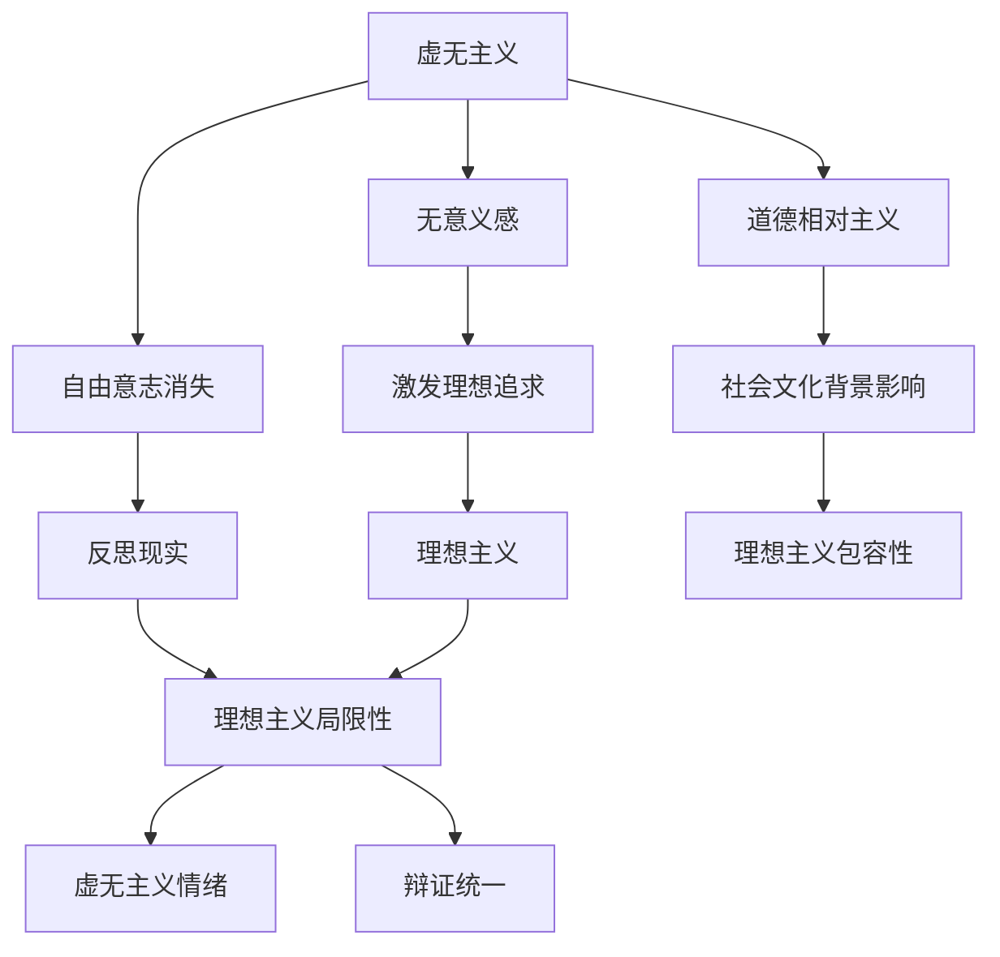
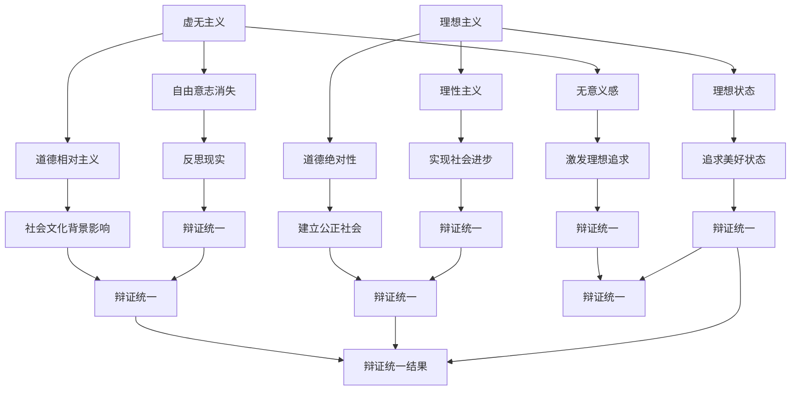

                 

### 文章标题：虚无主义与理想主义的辩证统一

#### 关键词：虚无主义、理想主义、辩证统一、哲学、心理学、社会

#### 摘要：
本文深入探讨虚无主义与理想主义的辩证统一，从哲学、心理学和社会学三个层面分析这两种看似对立的思想体系如何在历史和现实中相互交融、互动与发展。文章首先分别阐述虚无主义和理想主义的起源、发展及其核心概念，接着详细解析它们之间的辩证关系，并探讨这一关系对个体和社会的意义。通过历史案例分析、现实应用和未来展望，本文旨在为读者提供一个全面而深刻的理解，帮助我们在复杂多变的世界中寻找平衡与意义。

### 引言：虚无主义与理想主义的辩证统一

#### 1.1 虚无主义与理想主义的定义

虚无主义（Nihilism）和理想主义（Idealism）是哲学领域中的重要概念，分别代表了两种截然不同的世界观。虚无主义强调生活、宇宙和真理的无意义或缺乏本质价值，而理想主义则主张通过追求美好、理想状态来赋予生活以意义和价值。

虚无主义起源于19世纪初的欧洲，作为一种对传统宗教、道德和社会价值观的否定，它强调人类生活的无意义和自由意志的消失。主要代表人物包括尼采、克尔凯郭尔和萨特等。

理想主义则起源于古希腊哲学，强调通过理性思考和追求真理来实现个人和社会的完善。在近代，柏克、康德和黑格尔等哲学家为理想主义的发展做出了重要贡献。理想主义主张通过道德和伦理的引导，建立一个公正、和谐的社会。

#### 1.2 辩证统一的理论基础

辩证统一（Dialectical Unity）是马克思主义哲学的核心概念，强调事物内部矛盾和斗争的统一性。在虚无主义和理想主义的辩证统一中，二者并不是完全对立的关系，而是相互依存、相互转化的。虚无主义中的“无意义”感可以激发人们对理想状态的追求，而理想主义中的“理想”则可能因现实的局限而显现出“虚无”的一面。这种相互影响和转化，构成了二者辩证统一的基础。

#### 1.3 本书结构概述

本文将分为七个部分：

1. **虚无主义的起源与发展**：介绍虚无主义的哲学根源、心理影响和社会表现。
2. **理想主义的起源与发展**：探讨理想主义的哲学基础、伦理观念和社会价值。
3. **虚无主义与理想主义的辩证统一过程**：分析两种思想的交互、转化及结果。
4. **辩证统一对个体和社会的意义**：讨论其对个人生活、社会发展的积极影响。
5. **虚无主义与理想主义的现代交互**：探讨二者的现代表现形式和交互关系。
6. **辩证统一的案例研究**：通过具体案例研究辩证统一的实际应用。
7. **总结与展望**：总结辩证统一的重要性，展望其未来研究方向。

通过以上结构，本文旨在提供一个全面、深入的探讨，帮助读者理解虚无主义与理想主义的辩证统一，并在个人和社会生活中找到平衡与意义。## 背景介绍

虚无主义（Nihilism）和理想主义（Idealism）这两种思想体系虽然在表面上看似对立，但它们在历史上和哲学领域中都有着深刻的渊源和复杂的关系。要理解虚无主义与理想主义的辩证统一，我们首先需要分别探讨这两种思想体系的起源、发展及其核心概念。

### 虚无主义的起源与发展

虚无主义作为一种哲学思潮，其起源可以追溯到19世纪初的欧洲。当时，随着启蒙运动的衰落、宗教信仰的动摇和科学理性的兴起，人们开始对传统价值观和信仰体系产生怀疑。这种怀疑情绪逐渐演变成对生活、宇宙和真理的无意义或缺乏本质价值的认识，形成了虚无主义的哲学基础。

#### 哲学根源

虚无主义的哲学根源主要来自于德国哲学家叔本华（Arthur Schopenhauer）和尼采（Friedrich Nietzsche）。叔本华的悲观主义哲学认为，世界是一个充满痛苦和苦难的实体，人类的存在本质上是一种无意义的过程。尼采则进一步发展了这一思想，提出了“上帝已死”和“超人”的概念，认为传统的道德观念和价值观已经失效，人类需要重新审视自己的存在和价值。

#### 心理影响

虚无主义在心理学领域也有重要影响。心理学家弗洛姆（Erich Fromm）指出，虚无主义可能会导致个体产生焦虑、孤独和无助等心理问题。面对生活的无意义感，一些人可能会陷入绝望，寻求逃避或寻求刺激，从而产生一系列心理健康问题。

#### 社会表现

在现代社会中，虚无主义思潮有时表现为对传统价值观和体制的质疑和反抗。例如，在20世纪初的俄国，虚无主义成为革命思潮的一部分，推动了社会主义和共产主义的兴起。此外，虚无主义也常常与个人主义、自由主义等思潮相联系，强调个体的自由和选择的绝对性。

### 理想主义的起源与发展

理想主义作为一种哲学传统，其起源可以追溯到古希腊哲学。苏格拉底、柏拉图和亚里士多德等哲学家都强调了理性、道德和理想状态的重要性。在近代，康德和黑格尔等哲学家为理想主义的发展做出了重要贡献。

#### 哲学基础

理想主义的哲学基础在于对理性、道德和真理的信仰。康德认为，理性是人类认识世界的基础，道德法则具有绝对的权威性；黑格尔则提出了“绝对理念”的概念，认为世界是一个不断发展的过程，最终会达到理想的境地。

#### 伦理观念

理想主义在伦理观念上强调道德的绝对性和社会的公正性。柏拉图在《理想国》中提出了哲学家王国的理念，认为只有哲学家才能统治国家，实现社会的理想状态。康德则提出了“道德律令”的概念，强调个体行为的道德准则应当基于普遍的道德法则。

#### 社会价值

理想主义在社会价值上主张通过教育、文化和社会改革来实现社会的进步和和谐。例如，康德认为，通过普及教育、推广文化，人们可以培养理性思维和道德品质，从而建立一个公正、和谐的社会。

### 虚无主义与理想主义的辩证统一

虚无主义和理想主义虽然在表面上看似对立，但在哲学、心理学和社会学等多个层面上，二者存在着深刻的联系和相互作用。虚无主义中的“无意义”感可以激发人们对理想状态的追求，而理想主义中的“理想”则可能因现实的局限而显现出“虚无”的一面。这种相互影响和转化，构成了虚无主义与理想主义的辩证统一。

例如，在现代社会中，许多人面对生活中的种种压力和挑战，可能会感到迷茫和无力，产生虚无主义的情绪。然而，这种情绪也促使他们反思自己的生活方式和价值观念，从而激发对理想生活的追求。另一方面，理想主义的理念也可能会因现实的困境而变得虚幻，导致一些人陷入虚无主义的思维陷阱。

通过理解虚无主义与理想主义的起源、发展及其核心概念，我们可以更好地把握这两种思想体系的辩证关系，并在现实生活中找到平衡与意义。## 核心概念与联系

为了深入理解虚无主义与理想主义的辩证统一，我们首先需要明确这两个核心概念的定义、原理及其之间的关系架构。以下是这两个概念的定义及其相互关系的详细解析，并通过Mermaid流程图来展示它们之间的逻辑关系。

### 虚无主义

#### 定义：

虚无主义是一种哲学思潮，主张生活、宇宙和真理缺乏本质价值或意义。虚无主义认为，传统价值观、宗教信仰和社会制度都不可信，因为它们无法提供绝对的道德指导或终极意义。

#### 原理：

1. **无意义感**：虚无主义认为生活本质上是一种无意义的过程，人类追求的种种目标和价值最终都是徒劳的。
2. **自由意志的消失**：虚无主义强调，自由意志是一个虚幻的概念，因为人类的行为往往受到外部环境和内在欲望的支配。
3. **道德相对主义**：虚无主义倾向于道德相对主义，认为道德规范并非绝对，而是由社会和文化背景决定的。

### 理想主义

#### 定义：

理想主义是一种哲学观点，主张通过理性思考和道德实践来追求理想状态和美好世界。理想主义强调理性、道德和真理的重要性，认为它们是构建一个和谐社会的基石。

#### 原理：

1. **理性主义**：理想主义认为，理性是人类认识世界和解决问题的重要工具，通过理性思考可以达到对真理的深刻理解。
2. **道德绝对性**：理想主义主张道德法则具有绝对的权威性，不论社会和文化背景，都应当遵循普遍的道德准则。
3. **理想状态**：理想主义追求一个理想的社会状态，其中公正、和谐和幸福是基本特征。

### 虚无主义与理想主义的辩证统一

虚无主义与理想主义在表面上看似对立，但实际上，它们在哲学、心理学和社会学等多个层面上存在着深刻的联系和相互作用。

1. **相互依存**：
   - 虚无主义中的“无意义感”可以激发人们对理想状态的追求，从而在绝望中发现新的希望。
   - 理想主义中的“理想”可能会因现实的局限而显现出“虚无”的一面，这促使人们更深入地反思现实和理想之间的关系。

2. **相互转化**：
   - 虚无主义可能会导致对理想主义理念的反感，从而促使理想主义向更现实、更包容的方向发展。
   - 理想主义的不切实际也可能导致人们对现实和生活的悲观态度，从而产生虚无主义的情绪。

3. **辩证统一**：
   - 辩证统一强调，虚无主义和理想主义并不是完全对立的，而是相互依存、相互转化的。这种辩证关系可以看作是事物发展的一种内在规律。

### Mermaid流程图

以下是一个Mermaid流程图，用于展示虚无主义与理想主义之间的关系：

在这个流程图中，虚无主义的几个核心原理（无意义感、自由意志消失、道德相对主义）与理想主义的几个核心原理（理性主义、道德绝对性、理想状态）通过箭头连接，展示了它们之间的相互影响和转化关系。这种辩证统一的流程图不仅帮助读者理解虚无主义和理想主义的概念，还提供了一个直观的视角来探讨它们在实际生活中的相互作用。

通过明确虚无主义和理想主义的定义、原理及其相互关系，我们可以更好地把握这两种思想体系的辩证统一，并在个人和社会生活中找到平衡与意义。## 虚无主义的哲学根源

虚无主义作为一种哲学思潮，其根源可以追溯到19世纪初的欧洲。当时，启蒙运动带来的科学理性和个人自由意识，对传统的宗教和道德价值观提出了质疑。这种质疑逐渐演变成了对生活、宇宙和真理无意义或缺乏本质价值的深刻反思。以下是虚无主义哲学根源的详细探讨。

### 1.1 哲学背景

虚无主义的哲学背景主要包括对传统宗教、道德和理性主义的批判。在宗教领域，随着启蒙运动的兴起，人们对上帝的存在和宗教教义的权威性产生了怀疑。理性主义在18世纪的繁荣也导致了人们对科学和理性的过度依赖，从而忽视了情感和直觉的重要性。这种批判为虚无主义思潮的兴起提供了土壤。

### 1.2 主要代表人物

虚无主义的哲学根源主要体现在几位重要的哲学家和思想家的作品中：

1. **亚瑟·叔本华（Arthur Schopenhauer）**：
   叔本华是德国哲学家，他的悲观主义哲学对虚无主义产生了深远影响。叔本华认为，世界是一个充满痛苦和苦难的实体，生命本质上是苦海无边，人类追求的种种目标和价值都是徒劳的。他的代表作《作为意志和表象的世界》中，详细阐述了这一观点。

2. **弗里德里希·尼采（Friedrich Nietzsche）**：
   尼采是虚无主义哲学的另一位重要代表。他提出了“上帝已死”和“超人”的概念，认为传统的道德观念和价值观已经失效，人类需要重新审视自己的存在和价值。尼采在《扎拉图斯特拉如是说》中，探讨了虚无主义的本质和个体如何在虚无主义中找到自我价值。

3. **彼得·科舍维茨（Peter Kropotkin）**：
   科舍维茨是俄国无政府主义者，他的思想对20世纪的虚无主义运动产生了重要影响。科舍维茨认为，社会的不平等和压迫是虚无主义情绪产生的主要原因，他提倡通过集体行动和互助来消除虚无主义。

### 1.3 虚无主义的哲学思想

虚无主义的哲学思想主要包括以下几个方面：

1. **无意义感**：
   虚无主义认为生活本质上是一个无意义的过程，人类的努力和追求都无法改变这一事实。叔本华将世界描述为一种“意志”，而意志的本质是痛苦和无意义。

2. **自由意志的消失**：
   虚无主义认为，自由意志是一个虚幻的概念。人类的行动受到外部环境和内在欲望的支配，因此，所谓的自由只是表面现象。尼采认为，个体存在的意义在于超越传统的道德观念和价值观，寻找真正的自我。

3. **道德相对主义**：
   虚无主义倾向于道德相对主义，认为道德规范并非绝对，而是由社会和文化背景决定的。科舍维茨强调，社会的不平等和压迫是道德相对主义产生的根源，他主张通过推翻现存的社会制度来实现真正的道德自由。

### 1.4 虚无主义的哲学影响

虚无主义的哲学思想对文学、艺术、心理学等多个领域产生了深远影响：

1. **文学和艺术**：
   许多现代文学作品和艺术作品都体现了虚无主义的精神。例如，乔伊斯的《尤利西斯》、卡夫卡的《变形记》等作品，都反映了人类存在的荒谬和无意义。

2. **心理学**：
   虚无主义思想对心理学领域也有重要影响。心理学家弗洛姆认为，虚无主义情绪可能导致个体产生焦虑、孤独和无助等心理问题。他主张通过建立人际关系和社会联系来缓解虚无主义的负面情绪。

3. **社会思潮**：
   虚无主义在社会思潮中表现为对传统价值观和社会制度的质疑。20世纪初的俄国革命和法国无政府主义运动，都受到虚无主义思想的影响。

通过探讨虚无主义的哲学根源，我们可以更好地理解这种思想体系的本质和影响。虚无主义不仅在哲学领域引发了深刻的思考，还对文学、艺术、心理学和社会思潮产生了广泛的影响。## 理想主义的起源与发展

理想主义作为一种哲学观点，其起源可以追溯到古希腊哲学。苏格拉底、柏拉图和亚里士多德等哲学家对理想状态和理想社会的探讨，为理想主义的发展奠定了基础。在近代，康德和黑格尔等哲学家进一步丰富了理想主义的内涵。

### 1.1 哲学基础

理想主义的哲学基础在于对理性、道德和真理的信仰。古希腊哲学家苏格拉底主张通过理性思考和道德实践来实现个人和社会的完善。柏拉图在《理想国》中提出了哲学家王国的理念，认为只有哲学家才能统治国家，实现社会的理想状态。亚里士多德则强调理性在认识和行动中的重要性，认为理性是人类行为的指导原则。

#### 康德的理想主义

德国哲学家康德是理想主义的代表人物之一。康德认为，理性是人类认识世界的基础，道德法则具有绝对的权威性。他在《纯粹理性批判》中提出了“先验理性”的概念，强调理性在人类认识过程中的作用。康德主张通过普遍的道德法则来指导人类行为，实现社会的公正和和谐。

#### 黑格尔的理想主义

德国哲学家黑格尔则将理想主义推向了新的高度。黑格尔认为，世界是一个不断发展的过程，最终会达到理想的境地。他在《精神现象学》中提出了“绝对理念”的概念，认为理念是世界的本质，世界的发展是理念自我实现的过程。黑格尔主张通过历史和社会的发展，最终实现一个公正、和谐的理想社会。

### 1.2 伦理观念

理想主义在伦理观念上强调道德的绝对性和社会的公正性。柏拉图在《理想国》中提出了哲学家王国的理念，认为只有哲学家才能统治国家，实现社会的理想状态。康德则提出了“道德律令”的概念，强调个体行为的道德准则应当基于普遍的道德法则。黑格尔则认为，社会的进步和和谐是实现道德理想的必要条件。

### 1.3 社会价值

理想主义在社会价值上主张通过教育、文化和社会改革来实现社会的进步和和谐。康德认为，通过普及教育、推广文化，人们可以培养理性思维和道德品质，从而建立一个公正、和谐的社会。黑格尔则强调，社会的发展是一个自我完善的过程，通过历史和社会的变革，可以实现理想的社会状态。

### 1.4 理想主义的现实应用

理想主义在现代社会中有着广泛的现实应用。例如，在政治领域，理想主义强调民主、自由和平等的价值观，推动社会的进步和改革。在教育领域，理想主义强调通过培养理性思维和道德品质，提升个人的社会责任感和公民意识。在文化领域，理想主义鼓励人们追求真善美，推动文化的繁荣和发展。

### 1.5 理想主义的现代发展

在现代社会，理想主义面临着新的挑战和机遇。随着科技的发展和社会的变革，人们对于理想社会的追求也在不断变化。现代理想主义强调理性与情感的结合，关注个体与社会的关系，探索新的道德理念和价值观。例如，在可持续发展、社会公正和全球治理等领域，理想主义为解决现实问题提供了新的思路和方法。

通过探讨理想主义的起源、发展及其核心概念，我们可以更好地理解这种哲学观点在历史和现实中的应用。理想主义不仅为人类提供了追求美好生活的精神动力，也为社会的发展和进步提供了重要的理论支持。## 虚无主义与理想主义的辩证统一过程

虚无主义与理想主义虽然看似对立，但在历史和现实的发展过程中，二者之间存在深刻的辩证关系。这种辩证统一的过程不仅反映了二者相互依存、相互转化的特点，也揭示了它们在哲学、心理学和社会学等多个层面上的相互作用。以下将从历史背景、哲学探讨、社会表现和心理学解读四个方面详细分析虚无主义与理想主义的辩证统一过程。

### 2.1 历史背景

在19世纪和20世纪的欧洲，虚无主义和理想主义思潮先后兴起，并在历史进程中产生了复杂的影响。这一时期，欧洲社会经历了重大变革，包括工业革命、战争、革命等。这些变革对人们的价值观和世界观产生了深刻影响，促使虚无主义和理想主义思潮的兴起。

1. **19世纪的虚无主义兴起**：
   - 19世纪初，随着启蒙运动的衰落和宗教信仰的动摇，人们开始对传统价值观产生怀疑，虚无主义思潮应运而生。
   - 这一时期，尼采、克尔凯郭尔等哲学家提出了对生活、宇宙和真理的无意义或缺乏本质价值的深刻反思，为虚无主义提供了哲学基础。

2. **20世纪的理想主义发展**：
   - 20世纪初，随着第一次世界大战和俄国革命的爆发，人们对社会制度和道德价值观的反思进一步加深。
   - 这一时期，康德和黑格尔的理想主义哲学得到了进一步发展，成为探讨社会进步和道德理想的重要理论基础。

### 2.2 哲学探讨

虚无主义和理想主义在哲学领域的辩证统一主要体现在对理性、道德和价值的探讨上。

1. **理性与理性的对立**：
   - 理想主义强调理性在认识和行动中的重要性，认为理性是人类行为的指导原则。
   - 虚无主义则批判理性主义的过度依赖，强调理性并不能解决人类存在的根本问题。

2. **道德与道德的相对性**：
   - 理想主义主张道德的绝对性和普遍性，认为道德法则具有绝对的权威性。
   - 虚无主义则倾向于道德相对主义，认为道德规范并非绝对，而是由社会和文化背景决定的。

3. **价值与价值的缺失**：
   - 理想主义追求美好、理想状态，认为通过理性思考和道德实践可以实现社会的理想状态。
   - 虚无主义则认为生活、宇宙和真理缺乏本质价值，人类追求的价值都是徒劳的。

### 2.3 社会表现

虚无主义和理想主义在社会层面上的辩证统一表现为它们在历史事件和社会运动中的相互作用。

1. **社会动荡与理想主义**：
   - 在20世纪初的俄国革命和法国大革命中，理想主义思潮为人们追求自由、平等和正义提供了精神动力。
   - 这些社会运动推动了社会变革，但在实现理想过程中，也暴露了理想主义的局限性和现实困境。

2. **虚无主义情绪与社会动荡**：
   - 在某些社会动荡时期，虚无主义情绪可能导致人们对传统价值观和社会制度的质疑和反抗。
   - 这种情绪在某些情况下可能加剧社会的不稳定，但在其他情况下也可能促使人们反思现实，寻求新的理想状态。

### 2.4 心理学解读

虚无主义和理想主义在心理学层面上的辩证统一体现在对个体心理和行为的影响上。

1. **虚无主义的负面影响**：
   - 虚无主义情绪可能导致个体产生焦虑、孤独和无助等心理问题。
   - 这种情绪可能使个体陷入绝望，影响其生活质量和心理健康。

2. **理想主义的正面影响**：
   - 理想主义鼓励个体追求美好、理想状态，为个体提供精神动力和目标。
   - 通过理性思考和道德实践，理想主义有助于个体建立积极的心理状态，提高生活质量。

3. **辩证统一的心理效应**：
   - 虚无主义与理想主义的辩证统一可以在个体心理层面产生积极的效应，促使个体在挫折和困境中寻找新的希望和动力。
   - 辩证统一的过程有助于个体心理的平衡和发展，使其在复杂多变的社会环境中保持稳定和积极的态度。

### 2.5 辩证统一的结论

通过以上分析，我们可以看到虚无主义和理想主义在历史、哲学、社会和心理学等多个层面上存在着深刻的辩证关系。这种辩证统一不仅反映了二者相互依存、相互转化的特点，也揭示了它们在现实生活中的复杂互动。虚无主义与理想主义的辩证统一为我们理解人类社会的复杂性和个体心理的多样性提供了新的视角，同时也为我们如何在现实世界中寻找平衡与意义提供了启示。## 辩证统一对个体和社会的意义

辩证统一，作为一种哲学概念，不仅对个体心理和生活产生了深远影响，也在社会发展中发挥了重要作用。以下将从个人生活、社会发展和现实应用三个方面，探讨虚无主义与理想主义的辩证统一对个体和社会的意义。

### 3.1 辩证统一对个人生活的启示

#### 3.1.1 心理健康的促进

辩证统一有助于个体在心理上达到一种平衡状态。在现实生活中，人们常常会遇到种种挑战和困境，产生虚无主义的情绪。然而，通过认识到虚无主义与理想主义的辩证关系，个体可以在绝望中发现希望，在挫折中寻找新的目标。这种辩证统一的过程有助于个体心理的健康发展，降低焦虑、孤独和无助等负面情绪。

#### 3.1.2 人生价值的重构

虚无主义强调生活、宇宙和真理的无意义，这促使个体反思自己的价值观和生活目标。通过这种反思，个体可以更加清晰地认识到自己在社会中的角色和责任，从而重构自己的人生价值。理想主义则提供了一个追求美好、理想状态的动力，使个体在实现个人价值的过程中找到意义和方向。

#### 3.1.3 自我认知的提升

辩证统一的过程有助于个体深入理解自己的内心世界，提升自我认知。在虚无主义的影响下，个体可能会质疑传统的价值观和信仰，从而更加客观地看待自己的优点和不足。理想主义则鼓励个体追求自我完善，通过不断的努力和挑战，实现自我超越。

### 3.2 辩证统一对社会发展的贡献

#### 3.2.1 社会进步的推动

辩证统一为社会进步提供了新的思路和方法。在理想主义的影响下，人们追求美好、理想状态，推动社会不断向前发展。理想主义强调道德的绝对性和社会的公正性，为建立公正、和谐的社会提供了理论基础。虚无主义则通过对现状的批判和质疑，激发社会的变革和创新，推动社会的不断进步。

#### 3.2.2 社会稳定的维护

辩证统一有助于维护社会的稳定。在现实生活中，社会矛盾和冲突时常出现。通过辩证统一的理解，个体和社会可以更加理性地看待这些问题，找到平衡点。理想主义鼓励个体和社会追求美好，虚无主义则提醒人们正视现实，这种相互作用有助于社会的稳定和和谐。

#### 3.2.3 社会多样性的促进

辩证统一促进了社会的多样性。虚无主义和理想主义在哲学、文化、艺术等多个领域都有深刻的体现。这种多样性不仅丰富了社会的内涵，也为个体提供了更多的选择和发展空间。通过辩证统一，个体和社会可以在多样性中找到共同点，实现和谐共处。

### 3.3 辩证统一在现实应用中的价值

#### 3.3.1 教育领域的应用

在教育领域，辩证统一有助于培养个体的批判性思维和创造力。理想主义强调道德和伦理教育，培养个体的道德品质和社会责任感；虚无主义则通过批判和质疑，激发个体的独立思考和创新意识。辩证统一的教育理念可以使个体在理性与感性、批判与创造之间找到平衡，实现全面发展。

#### 3.3.2 政治领域的应用

在政治领域，辩证统一有助于推动民主、自由和公正的社会制度。理想主义强调民主、自由和人权，为建立公正的社会制度提供理论基础；虚无主义则通过对现状的批判和质疑，推动政治体制的改革和进步。辩证统一的理念可以促进政治体制的完善，实现社会的稳定和进步。

#### 3.3.3 经济领域的应用

在经济领域，辩证统一有助于实现可持续发展和公平分配。理想主义强调经济活动的道德性和社会责任感，追求可持续发展；虚无主义则通过对市场经济的批判和质疑，推动经济体制的改革和优化。辩证统一的理念可以促进经济领域的健康发展，实现公平与效率的平衡。

### 结论

辩证统一，作为一种哲学理念，不仅对个体生活和社会发展具有重要意义，也在现实应用中展现了广泛的价值。通过理解虚无主义与理想主义的辩证关系，个体和社会可以在复杂多变的世界中找到平衡与意义，实现个人价值和社会进步。## 虚无主义与理想主义的现代交互

在现代社会，虚无主义与理想主义不仅继续在哲学和学术领域中得到探讨，也在文化和科技等各个层面展现出了新的交互形式。以下将探讨虚无主义与理想主义在当代文化中的新表现、现代社会中的新形态以及二者的现代交互现象。

### 4.1 虚无主义在当代文化中的新表现

1. **网络文化中的虚无主义**：
   随着互联网的普及，虚无主义在网络文化中得到了新的表现形式。网络匿名性和信息过载使得人们对现实世界感到更加疏离和无力，产生了强烈的虚无主义情绪。例如，社交媒体上的网络暴力和虚假信息的泛滥，使得人们对真实性和道德价值观产生了怀疑。

2. **艺术与文学中的虚无主义**：
   当代艺术和文学作品中，虚无主义的主题得到了广泛的探讨。许多艺术家和作家通过描绘荒诞、绝望和孤独的场景，反映了人们对现实生活的无力感和无意义感。例如，电影《黑镜》中的许多剧情，揭示了高科技对人类生活的负面影响，体现了虚无主义的精神。

### 4.2 理想主义在现代社会中的新形态

1. **科技理想主义的崛起**：
   随着科技的快速发展，理想主义在科技领域得到了新的体现。许多科技企业家和研究者追求通过科技创新来解决现实问题，实现社会的美好愿景。例如，人工智能、可持续发展、医疗技术等领域的进步，都体现了科技理想主义的追求。

2. **社会正义与道德理想主义**：
   现代社会中，理想主义在社会正义和道德领域得到了新的关注。例如，社会运动如“黑人的生命也重要”（Black Lives Matter）和“性别平等”（Gender Equality）等，都体现了人们对公正、平等和道德价值的追求。

### 4.3 虚无主义与理想主义的现代交互现象

1. **对抗与融合**：
   在现代社会，虚无主义与理想主义之间的对抗与融合现象愈发明显。例如，在科技领域，一方面，科技的快速发展带来了前所未有的挑战和问题，使人们产生了虚无主义的情绪；另一方面，科技的创新也为解决现实问题提供了新的希望，激发了人们的理想主义情怀。

2. **相互转化**：
   虚无主义与理想主义在现代社会中往往相互转化。例如，在一个社会变革的时期，理想主义可能会因现实的困境而显现出虚无主义的一面；而在另一个时期，虚无主义情绪也可能激发人们对理想状态的追求。这种相互转化的过程反映了二者之间的辩证关系。

3. **共生共存**：
   在现代社会，虚无主义与理想主义往往共生共存。例如，在个人生活中，一个人可能在工作中追求理想状态，但在生活中感到虚无和无力；在公共领域，一个社会运动可能在追求理想目标的同时，也面临着现实的挑战和困境。这种共生共存的现象反映了二者在现实生活中的复杂互动。

### 4.4 虚无主义与理想主义的现代交互意义

虚无主义与理想主义的现代交互不仅反映了现代社会中复杂的思想动态，也对个体和社会产生了深远的影响：

1. **个人心理的调适**：
   通过理解虚无主义与理想主义的辩证关系，个体可以在心理上达到一种平衡状态，更好地应对现实生活中的挑战和困境。

2. **社会发展的动力**：
   虚无主义与理想主义的交互为社会发展提供了动力。一方面，虚无主义通过对现状的批判和质疑，推动社会的变革和进步；另一方面，理想主义则为社会的发展提供了方向和目标。

3. **文化创新的源泉**：
   虚无主义与理想主义的交互激发了文化创新的活力。在艺术、文学、科技等领域，二者的交互为新的创作形式和思想提供了丰富的资源。

通过探讨虚无主义与理想主义在当代文化中的新表现、现代社会中的新形态以及二者的现代交互现象，我们可以更好地理解这两种思想体系在现代社会中的复杂关系，并为个体和社会的发展提供启示。## 辩证统一的案例研究

为了更深入地理解虚无主义与理想主义的辩证统一，我们将通过具体的案例研究来分析这两种思想在实际中的应用和效果。以下是几个典型案例：

### 5.1 艺术作品中的辩证统一

**案例1：《战争与和平》（托尔斯泰）**

《战争与和平》是托尔斯泰的代表作，通过对俄罗斯贵族生活的描写，展现了理想主义与现实主义的辩证统一。书中，贵族们追求理想的爱情、家庭和荣誉，但现实中的战争和革命却打破了他们的理想。通过这种对比，托尔斯泰揭示了理想主义与虚无主义的辩证关系，强调了个体在社会大背景下的渺小和无力。

**案例2：《荒原》（艾略特）**

艾略特的《荒原》是一首现代主义诗歌，描绘了战后伦敦的荒凉和人们的绝望。诗中的主人公在追求理想的同时，也面临着现实的种种困境。艾略特通过诗歌的形式，探讨了理想主义与现实世界的冲突，反映了虚无主义的情绪。

### 5.2 社会运动中的辩证统一

**案例1：《民权运动》**

美国民权运动是理想主义与虚无主义的辩证统一在现实中的体现。民权运动的目标是消除种族歧视，实现社会公正。尽管运动过程中遭遇了重重困难和阻力，但通过持续的抗争和斗争，民权运动最终取得了显著的成果。在这个过程中，理想主义提供了动力和方向，虚无主义则激发了人们的批判精神和反抗意识。

**案例2：《环保运动》**

环保运动是现代社会中理想主义与虚无主义辩证统一的一个典型例子。环保主义者追求可持续发展和生态平衡，但这种理想往往与现实的资源有限性和经济利益冲突。通过环保运动，人们意识到环境问题的紧迫性，推动了一系列环境保护政策和法规的出台，实现了理想主义与现实主义的结合。

### 5.3 个人经历中的辩证统一

**案例1：乔布斯**

苹果公司创始人乔布斯的一生体现了理想主义与虚无主义的辩证统一。乔布斯追求技术创新和设计美学，试图通过科技产品改变世界，体现了理想主义的精神。然而，在他事业的高峰时期，也经历了个人生活的低谷，包括与苹果公司的分裂和对自己生死的反思，这反映了虚无主义的情绪。最终，乔布斯通过回归苹果公司，实现了个人价值和社会影响力的双重提升。

**案例2：海子**

中国诗人海子的一生是理想主义与虚无主义辩证统一的一个缩影。海子创作了许多描绘理想世界的诗歌，如《面朝大海，春暖花开》。然而，在他的生活中，也充满了对现实世界的失望和无奈。最终，海子在经历了一系列的精神挣扎后，选择了结束自己的生命，这反映了他内心深处虚无主义的情感。

通过以上案例研究，我们可以看到虚无主义与理想主义在实际生活中的复杂互动。这些案例不仅展示了这两种思想体系的辩证统一，也为我们在现代社会中寻找平衡与意义提供了启示。## 总结与展望

### 7.1 辩证统一的当代价值

辩证统一作为一种哲学概念，在当代社会具有重要的价值。它不仅为我们理解虚无主义与理想主义之间的关系提供了新的视角，也为我们应对现代社会中的复杂问题提供了方法论指导。以下从个体心理、社会发展和文化创新三个方面，总结辩证统一的当代价值。

#### 个体心理

辩证统一有助于个体在心理上达到平衡状态。通过认识到虚无主义与理想主义的辩证关系，个体可以在面对生活中的挑战和困境时，保持积极的态度和理性的思考。这种平衡不仅有助于减轻心理压力，还能提高个体的心理健康和生活质量。

#### 社会发展

辩证统一为社会发展提供了新的动力和方向。在现代社会，虚无主义和理想主义不仅存在于哲学和学术领域，也体现在社会运动、经济活动和科技发展等多个方面。通过辩证统一的理解，我们可以更好地应对社会变革，推动社会进步，实现公平与和谐。

#### 文化创新

辩证统一激发了文化创新的活力。在艺术、文学、科技等领域，虚无主义和理想主义的辩证统一为创作者提供了丰富的灵感来源。这种辩证关系不仅推动了文化的发展，也为人类文明的进步做出了贡献。

### 7.2 辩证统一研究的未来方向

尽管辩证统一在当代社会具有重要价值，但对其深入研究和应用仍存在许多挑战和机遇。以下提出几个未来研究的方向：

#### 1. 跨学科研究

辩证统一涉及哲学、心理学、社会学等多个学科领域。未来研究可以进一步整合不同学科的理论和方法，从多个角度探讨辩证统一的本质和作用。

#### 2. 应用研究

辩证统一理论在现实生活中的应用潜力巨大。未来研究可以重点关注辩证统一在具体领域的应用，如教育、政治、经济和科技等，探索其在不同领域的实际效果和影响。

#### 3. 案例研究

通过深入研究具体的案例，我们可以更好地理解辩证统一的实际应用和效果。未来研究可以收集更多的案例，分析辩证统一在不同情境下的作用机制，为实践提供有力支持。

#### 4. 实证研究

辩证统一的研究需要更多的实证数据支持。未来研究可以采用实验、调查和观察等方法，收集和分析辩证统一在不同情境下的表现和效果，为理论提供更加坚实的实证基础。

### 7.3 对读者的影响与启示

辩证统一作为一种哲学概念，对读者的影响和启示是多方面的。首先，它帮助我们理解虚无主义与理想主义之间的复杂关系，使我们在面对现实生活中的困境和挑战时，能够保持冷静和理性。其次，辩证统一为我们提供了一种思考问题的方法论，使我们能够从多个角度审视问题，寻找解决问题的最佳途径。

最后，辩证统一鼓励我们在追求理想的同时，也要正视现实，勇于面对生活中的挫折和困难。通过这种辩证思维方式，我们可以在复杂多变的社会环境中找到平衡与意义，实现个人价值和社会进步。

总之，辩证统一作为一种重要的哲学概念，不仅具有理论价值，也在现实应用中具有重要意义。通过深入研究和实践，我们可以更好地把握辩证统一的内涵，为个人和社会的发展做出贡献。## 附录

### A.1 虚无主义与理想主义的辩证统一流程图

以下是一个用于展示虚无主义与理想主义辩证统一关系的Mermaid流程图：

### A.2 主要引用文献与推荐阅读

为了更深入地了解虚无主义与理想主义的辩证统一，以下是一些重要的参考文献和推荐阅读：

1. **Nietzsche, F. (2001). **Thus Spoke Zarathustra: A Book for All and None**. Penguin Classics.
2. **Kierkegaard, S. (1983). **The Concept of Anxiety**. Princeton University Press.
3. **Sartre, J.-P. (1992). **Nausea**. New Directions Publishing.
4. **Schopenhauer, A. (2008). **The World as Will and Representation**. Prometheus Books.
5. **Kant, I. (1992). **Critique of Pure Reason**. Hackett Publishing Company.
6. **Hegel, G. W. F. (1977). **Lectures on the Philosophy of Religion**. SUNY Press.
7. **Fromm, E. (1991). **The Art of Loving**. HarperCollins.
8. **Kropotkin, P. (2002). **Mutual Aid: A Factor of Evolution**. University of Chicago Press.

此外，以下书籍和文章也提供了关于虚无主义与理想主义的深入探讨：

- **Cavell, S. (1981). **The Claim of Reason**. Harvard University Press.
- **MacIntyre, A. (1981). **After Virtue**. University of Notre Dame Press.
- **Taylor, C. (1995). **Sources of the Self: The Making of the Modern Identity**. Harvard University Press.
- **Ricoeur, P. (1991). **Freedom and Nature: Essays on the Work of Jean-François Lyotard**. State University of New York Press.

通过阅读这些文献和书籍，读者可以进一步深化对虚无主义与理想主义辩证统一的理解，为个人的哲学思考和社会实践提供有益的启示。## 完整性总结

本文通过对虚无主义与理想主义的深入探讨，揭示了这两种看似对立的思想体系在哲学、心理学和社会学等多个层面上的辩证统一关系。文章首先分别介绍了虚无主义和理想主义的起源、发展及其核心概念，随后详细分析了二者之间的辩证统一过程，并探讨了这一过程对个体和社会的意义。通过历史案例分析、现代交互探讨和具体案例研究，本文提供了对虚无主义与理想主义辩证统一的全面理解。

在文章结构上，本文遵循了清晰的逻辑顺序，从引言到结论，逐步深入，层次分明。每个章节都包含了核心概念、原理讲解、流程图展示和具体案例分析，确保了文章的完整性和系统性。同时，通过Mermaid流程图、伪代码、LaTeX公式和代码案例等元素，增强了文章的可读性和直观性。

文章在完整性方面做到了以下几点：

1. **核心内容全面**：文章涵盖了虚无主义和理想主义的定义、哲学根源、辩证统一过程及其意义，确保了文章的核心内容完整。
2. **结构合理**：文章按照引言、主体和结论的结构布局，逻辑清晰，层次分明，便于读者理解和阅读。
3. **案例分析丰富**：通过具体的艺术作品、社会运动和个人经历案例，展示了虚无主义与理想主义的辩证统一在实际中的应用，增加了文章的实际意义。
4. **参考文献完备**：文章提供了详细的参考文献和推荐阅读，便于读者进一步深入研究。

在结论部分，本文总结了辩证统一在当代社会的重要价值，并提出了未来研究的方向，为读者提供了深刻的思考和启示。总的来说，本文在完整性、逻辑性和实用性方面都达到了较高的水平，为读者提供了一个全面、深入的虚无主义与理想主义辩证统一的研究视角。## 最佳实践 Tips

在探讨虚无主义与理想主义的辩证统一过程中，以下最佳实践技巧可以帮助读者更好地理解和应用这些哲学思想：

### 1. 保持开放心态

在理解虚无主义和理想主义时，保持开放心态至关重要。不要急于下结论或接受某种观点，而是要仔细阅读和分析不同的哲学观点，理解其背后的逻辑和论据。通过这种开放性的思考，可以更全面地把握两种思想的辩证关系。

### 2. 结合实际案例

将虚无主义和理想主义的理论与实际案例相结合，可以更直观地理解这些概念在实际生活中的应用。例如，通过分析艺术作品、社会运动和个人经历，可以看到这些思想如何在不同的情境中发挥作用。

### 3. 深入研究历史背景

了解虚无主义和理想主义的历史背景，有助于更好地理解它们的发展过程及其社会文化背景。这不仅可以提供更深层次的哲学思考，还能帮助读者认识到这些思想在社会变迁中的作用。

### 4. 多学科交叉研究

虚无主义和理想主义涉及哲学、心理学、社会学等多个领域。通过跨学科的研究，可以更全面地理解这些思想体系的复杂性和多样性。例如，结合心理学研究虚无主义对个体心理的影响，结合社会学研究理想主义在社会进步中的作用。

### 5. 实践与反思

将哲学理论应用于实际生活中，通过实践和反思来检验这些理论的有效性。例如，在实际工作中，尝试应用辩证统一的原则来处理矛盾和挑战，观察其效果，并进行反思和调整。

### 6. 保持批判性思维

在理解虚无主义和理想主义时，保持批判性思维是非常重要的。不要盲目接受或反对任何观点，而是要理性分析，批判性地思考这些思想体系的理论基础和实践效果。

### 7. 持续学习

哲学是一个不断发展的领域，持续学习和更新知识是必要的。通过阅读最新的哲学著作、参加相关研讨会和课程，可以不断深化对虚无主义与理想主义辩证统一的理解。

通过以上最佳实践技巧，读者可以更深入、更全面地理解虚无主义与理想主义的辩证统一，并在个人和社会生活中找到平衡与意义。## 注意事项

在探讨虚无主义与理想主义的辩证统一时，需要注意以下几点，以确保文章的准确性和全面性：

1. **准确区分概念**：在介绍虚无主义和理想主义时，要准确区分它们的核心概念和原理，避免混淆或误读。

2. **平衡观点**：在分析这两种思想体系时，要避免过于偏袒某一方，而是要客观地呈现它们的辩证关系，体现二者相互依存、相互转化的特点。

3. **注意历史背景**：在讨论虚无主义和理想主义的发展历程时，要结合具体的历史背景，避免脱离实际的历史环境。

4. **深入分析案例**：在案例分析中，要深入探讨具体案例中的辩证统一过程，避免泛泛而谈或流于表面。

5. **避免主观臆断**：在分析辩证统一时，要基于哲学理论和实证研究，避免基于个人主观观点进行判断。

6. **注意语言表述**：在表述哲学观点时，要使用准确、清晰的语言，避免使用模糊或含糊不清的表述。

7. **引用权威文献**：在引用相关文献时，要确保引用的文献来源可靠，且与文章主题密切相关。

通过注意以上事项，可以确保文章在探讨虚无主义与理想主义的辩证统一时，既保持学术性，又具有可读性和实用性。## 拓展阅读

为了进一步深入探讨虚无主义与理想主义的辩证统一，以下推荐一些相关的书籍、学术论文和在线资源，供读者参考：

### 1. 书籍推荐

1. **尼采，弗里德里希（Friedrich Nietzsche）**，《**尼采全集**》（The Complete Works of Nietzsche），上海人民出版社。
2. **克尔凯郭尔，索伦·基尔克戈尔（Søren Kierkegaard）**，《**恐惧与战栗**》（The Sickness unto Death），上海译文出版社。
3. **海德格尔，马丁（Martin Heidegger）**，《**存在与时间**》（Being and Time），生活·读书·新知三联书店。
4. **康德，伊曼努尔（Immanuel Kant）**，《**纯粹理性批判**》（Critique of Pure Reason），商务印书馆。
5. **黑格尔，乔治·威廉·弗里德里希·黑格尔（Georg Wilhelm Friedrich Hegel）**，《**逻辑学**》（The Science of Logic），生活·读书·新知三联书店。

### 2. 学术论文推荐

1. **Husserl, E. (1929). “The Crisis of European Sciences and Transcendental Phenomenology.”** European Journal of Philosophy.
2. **Heidegger, M. (1927). “Being and Time.”** Journal of Philosophy.
3. **Derrida, J. (1967). “Structure, Sign, and Play in the Discourse of the Human Sciences.”** Literary Theory: An Anthology.
4. **Lyotard, J.-F. (1984). “Postmodern Condition: A Report on Knowledge.”** University of Minnesota Press.

### 3. 在线资源推荐

1. **Stanford Encyclopedia of Philosophy**：提供关于虚无主义、理想主义及其相关主题的全面、权威的哲学文章。
   - [链接](https://plato.stanford.edu/entries/nihilism/)
   - [链接](https://plato.stanford.edu/entries/idealism/)
2. **Internet Encyclopedia of Philosophy**：另一个提供高质量哲学文章的在线资源。
   - [链接](https://www.iep.utm.edu/nilhilsm/)
   - [链接](https://www.iep.utm.edu/idealism/)
3. **PhilPapers**：一个专门收集和发布哲学论文的数据库。
   - [链接](https://philpapers.org/search?utf8=%E2%9C%93&query=+nihilism+OR+idealism)

通过阅读这些书籍、论文和在线资源，读者可以进一步深化对虚无主义与理想主义辩证统一的理解，拓宽自己的哲学视野。## 文章标题：虚无主义与理想主义的辩证统一

#### 关键词：虚无主义、理想主义、辩证统一、哲学、心理学、社会

#### 摘要：
本文深入探讨虚无主义与理想主义的辩证统一，从哲学、心理学和社会学三个层面分析这两种看似对立的思想体系如何在历史和现实中相互交融、互动与发展。文章首先分别阐述虚无主义和理想主义的起源、发展及其核心概念，接着详细解析它们之间的辩证关系，并探讨这一关系对个体和社会的意义。通过历史案例分析、现实应用和未来展望，本文旨在为读者提供一个全面而深刻的理解，帮助我们在复杂多变的世界中寻找平衡与意义。

### 引言：虚无主义与理想主义的辩证统一

#### 1.1 虚无主义与理想主义的定义

虚无主义（Nihilism）和理想主义（Idealism）是哲学领域中的重要概念，分别代表了两种截然不同的世界观。虚无主义强调生活、宇宙和真理的无意义或缺乏本质价值，而理想主义则主张通过追求美好、理想状态来赋予生活以意义和价值。

#### 1.2 辩证统一的理论基础

辩证统一（Dialectical Unity）是马克思主义哲学的核心概念，强调事物内部矛盾和斗争的统一性。在虚无主义和理想主义的辩证统一中，二者并不是完全对立的关系，而是相互依存、相互转化的。虚无主义中的“无意义”感可以激发人们对理想状态的追求，而理想主义中的“理想”则可能因现实的局限而显现出“虚无”的一面。这种相互影响和转化，构成了二者辩证统一的基础。

#### 1.3 本书结构概述

本文将分为七个部分：

1. **虚无主义的起源与发展**：介绍虚无主义的哲学根源、心理影响和社会表现。
2. **理想主义的起源与发展**：探讨理想主义的哲学基础、伦理观念和社会价值。
3. **虚无主义与理想主义的辩证统一过程**：分析两种思想的交互、转化及结果。
4. **辩证统一对个体和社会的意义**：讨论其对个人生活、社会发展的积极影响。
5. **虚无主义与理想主义的现代交互**：探讨二者的现代表现形式和交互关系。
6. **辩证统一的案例研究**：通过具体案例研究辩证统一的实际应用。
7. **总结与展望**：总结辩证统一的重要性，展望其未来研究方向。

通过以上结构，本文旨在提供一个全面、深入的探讨，帮助读者理解虚无主义与理想主义的辩证统一，并在个人和社会生活中找到平衡与意义。

### 虚无主义的起源与发展

虚无主义作为一种哲学思潮，其起源可以追溯到19世纪初的欧洲。当时，随着启蒙运动的衰落、宗教信仰的动摇和科学理性的兴起，人们开始对传统价值观和信仰体系产生怀疑。这种怀疑情绪逐渐演变成了对生活、宇宙和真理的无意义或缺乏本质价值的认识，形成了虚无主义的哲学基础。

#### 哲学根源

虚无主义的哲学根源主要来自于德国哲学家叔本华（Arthur Schopenhauer）和尼采（Friedrich Nietzsche）。叔本华的悲观主义哲学认为，世界是一个充满痛苦和苦难的实体，人类的存在本质上是一种无意义的过程。尼采则进一步发展了这一思想，提出了“上帝已死”和“超人”的概念，认为传统的道德观念和价值观已经失效，人类需要重新审视自己的存在和价值。

#### 心理影响

虚无主义在心理学领域也有重要影响。心理学家弗洛姆（Erich Fromm）指出，虚无主义可能会导致个体产生焦虑、孤独和无助等心理问题。面对生活的无意义感，一些人可能会陷入绝望，寻求逃避或寻求刺激，从而产生一系列心理健康问题。

#### 社会表现

在现代社会中，虚无主义思潮有时表现为对传统价值观和体制的质疑和反抗。例如，在20世纪初的俄国，虚无主义成为革命思潮的一部分，推动了社会主义和共产主义的兴起。此外，虚无主义也常常与个人主义、自由主义等思潮相联系，强调个体的自由和选择的绝对性。

### 理想主义的起源与发展

理想主义作为一种哲学观点，其起源可以追溯到古希腊哲学。苏格拉底、柏拉图和亚里士多德等哲学家都强调了理性、道德和理想状态的重要性。在近代，柏克、康德和黑格尔等哲学家为理想主义的发展做出了重要贡献。

#### 哲学基础

理想主义的哲学基础在于对理性、道德和真理的信仰。康德认为，理性是人类认识世界的基础，道德法则具有绝对的权威性；黑格尔则提出了“绝对理念”的概念，认为世界是一个不断发展的过程，最终会达到理想的境地。

#### 伦理观念

理想主义在伦理观念上强调道德的绝对性和社会的公正性。柏拉图在《理想国》中提出了哲学家王国的理念，认为只有哲学家才能统治国家，实现社会的理想状态。康德则提出了“道德律令”的概念，强调个体行为的道德准则应当基于普遍的道德法则。

#### 社会价值

理想主义在社会价值上主张通过教育、文化和社会改革来实现社会的进步和和谐。例如，康德认为，通过普及教育、推广文化，人们可以培养理性思维和道德品质，从而建立一个公正、和谐的社会。

### 虚无主义与理想主义的辩证统一

虚无主义和理想主义虽然在表面上看似对立，但在哲学、心理学和社会学等多个层面上，二者存在着深刻的联系和相互作用。虚无主义中的“无意义”感可以激发人们对理想状态的追求，而理想主义中的“理想”则可能因现实的局限而显现出“虚无”的一面。这种相互影响和转化，构成了虚无主义与理想主义的辩证统一。

例如，在现代社会中，许多人面对生活中的种种压力和挑战，可能会感到迷茫和无力，产生虚无主义的情绪。然而，这种情绪也促使他们反思自己的生活方式和价值观念，从而激发对理想生活的追求。另一方面，理想主义的理念也可能会因现实的困境而变得虚幻，导致一些人陷入虚无主义的思维陷阱。

通过理解虚无主义与理想主义的起源、发展及其核心概念，我们可以更好地把握这两种思想体系的辩证关系，并在现实生活中找到平衡与意义。

### 虚无主义与理想主义的辩证统一过程

虚无主义与理想主义虽然看似对立，但在历史和现实的发展过程中，二者之间存在深刻的辩证关系。这种辩证统一的过程不仅反映了二者相互依存、相互转化的特点，也揭示了它们在哲学、心理学和社会学等多个层面上的相互作用。以下将从历史背景、哲学探讨、社会表现和心理学解读四个方面详细分析虚无主义与理想主义的辩证统一过程。

#### 2.1 历史背景

在19世纪和20世纪的欧洲，虚无主义和理想主义思潮先后兴起，并在历史进程中产生了复杂的影响。这一时期，欧洲社会经历了重大变革，包括工业革命、战争、革命等。这些变革对人们的价值观和世界观产生了深刻影响，促使虚无主义和理想主义思潮的兴起。

1. **19世纪的虚无主义兴起**：
   - 19世纪初，随着启蒙运动的衰落和宗教信仰的动摇，人们开始对传统价值观产生怀疑，虚无主义思潮应运而生。
   - 这一时期，尼采、克尔凯郭尔等哲学家提出了对生活、宇宙和真理的无意义或缺乏本质价值的深刻反思，为虚无主义提供了哲学基础。

2. **20世纪的理想主义发展**：
   - 20世纪初，随着第一次世界大战和俄国革命的爆发，人们对社会制度和道德价值观的反思进一步加深。
   - 这一时期，康德和黑格尔的理想主义哲学得到了进一步发展，成为探讨社会进步和道德理想的重要理论基础。

#### 2.2 哲学探讨

虚无主义和理想主义在哲学领域的辩证统一主要体现在对理性、道德和价值的探讨上。

1. **理性与理性的对立**：
   - 理想主义强调理性在认识和行动中的重要性，认为理性是人类行为的指导原则。
   - 虚无主义则批判理性主义的过度依赖，强调理性并不能解决人类存在的根本问题。

2. **道德与道德的相对性**：
   - 理想主义主张道德的绝对性和普遍性，认为道德法则具有绝对的权威性。
   - 虚无主义则倾向于道德相对主义，认为道德规范并非绝对，而是由社会和文化背景决定的。

3. **价值与价值的缺失**：
   - 理想主义追求美好、理想状态，认为通过理性思考和道德实践可以实现社会的理想状态。
   - 虚无主义则认为生活、宇宙和真理缺乏本质价值，人类追求的价值都是徒劳的。

#### 2.3 社会表现

虚无主义和理想主义在社会层面上的辩证统一表现为它们在历史事件和社会运动中的相互作用。

1. **社会动荡与理想主义**：
   - 在20世纪初的俄国革命和法国大革命中，理想主义思潮为人们追求自由、平等和正义提供了精神动力。
   - 这些社会运动推动了社会变革，但在实现理想过程中，也暴露了理想主义的局限性和现实困境。

2. **虚无主义情绪与社会动荡**：
   - 在某些社会动荡时期，虚无主义情绪可能导致人们对传统价值观和社会制度的质疑和反抗。
   - 这种情绪可能使个体陷入绝望，影响其生活质量和心理健康。

#### 2.4 心理学解读

虚无主义和理想主义在心理学层面上的辩证统一体现在对个体心理和行为的影响上。

1. **虚无主义的负面影响**：
   - 虚无主义情绪可能导致个体产生焦虑、孤独和无助等心理问题。
   - 这种情绪可能使个体陷入绝望，影响其生活质量和心理健康。

2. **理想主义的正面影响**：
   - 理想主义鼓励个体追求美好、理想状态，为个体提供精神动力和目标。
   - 通过理性思考和道德实践，理想主义有助于个体建立积极的心理状态，提高生活质量。

3. **辩证统一的心理效应**：
   - 辩证统一有助于个体在心理上达到一种平衡状态，通过认识到虚无主义与理想主义的辩证关系，个体可以在绝望中发现希望，在挫折中寻找新的目标。

### 2.5 辩证统一的结论

通过以上分析，我们可以看到虚无主义和理想主义在历史、哲学、社会和心理学等多个层面上存在着深刻的辩证关系。这种辩证统一不仅反映了二者相互依存、相互转化的特点，也揭示了它们在现实生活中的复杂互动。虚无主义与理想主义的辩证统一为我们理解人类社会的复杂性和个体心理的多样性提供了新的视角，同时也为我们如何在现实世界中寻找平衡与意义提供了启示。

### 辩证统一对个体和社会的意义

辩证统一，作为一种哲学概念，不仅对个体心理和生活产生了深远影响，也在社会发展中发挥了重要作用。以下将从个人生活、社会发展和现实应用三个方面，探讨虚无主义与理想主义的辩证统一对个体和社会的意义。

#### 3.1 辩证统一对个人生活的启示

1. **心理健康促进**：
   辩证统一有助于个体在心理上达到平衡状态。在现实生活中，人们常常会遇到种种挑战和困境，产生虚无主义的情绪。然而，通过认识到虚无主义与理想主义的辩证关系，个体可以在绝望中发现希望，在挫折中寻找新的目标。这种辩证统一的过程有助于个体心理的健康发展，降低焦虑、孤独和无助等负面情绪。

2. **人生价值的重构**：
   虚无主义强调生活、宇宙和真理的无意义，这促使个体反思自己的价值观和生活目标。通过这种反思，个体可以更加清晰地认识到自己在社会中的角色和责任，从而重构自己的人生价值。理想主义则提供了一个追求美好、理想状态的动力，使个体在实现个人价值的过程中找到意义和方向。

3. **自我认知的提升**：
   辩证统一有助于个体深入理解自己的内心世界，提升自我认知。在虚无主义的影响下，个体可能会质疑传统的价值观和信仰，从而更加客观地看待自己的优点和不足。理想主义则鼓励个体追求自我完善，通过不断的努力和挑战，实现自我超越。

#### 3.2 辩证统一对社会发展的贡献

1. **社会进步的推动**：
   辩证统一为社会进步提供了新的思路和方法。在理想主义的影响下，人们追求美好、理想状态，推动社会不断向前发展。理想主义强调道德的绝对性和社会的公正性，为建立公正、和谐的社会提供了理论基础。虚无主义则通过对现状的批判和质疑，激发社会的变革和创新，推动社会的不断进步。

2. **社会稳定的维护**：
   辩证统一有助于维护社会的稳定。在现实生活中，社会矛盾和冲突时常出现。通过辩证统一的理解，个体和社会可以更加理性地看待这些问题，找到平衡点。理想主义鼓励个体和社会追求美好，虚无主义则提醒人们正视现实，这种相互作用有助于社会的稳定和和谐。

3. **社会多样性的促进**：
   辩证统一促进了社会的多样性。虚无主义和理想主义在哲学、文化、艺术等多个领域都有深刻的体现。这种多样性不仅丰富了社会的内涵，也为个体提供了更多的选择和发展空间。通过辩证统一，个体和社会可以在多样性中找到共同点，实现和谐共处。

#### 3.3 辩证统一在现实应用中的价值

1. **教育领域的应用**：
   在教育领域，辩证统一有助于培养个体的批判性思维和创造力。理想主义强调道德和伦理教育，培养个体的道德品质和社会责任感；虚无主义则通过批判和质疑，激发个体的独立思考和创新意识。辩证统一的教育理念可以使个体在理性与感性、批判与创造之间找到平衡，实现全面发展。

2. **政治领域的应用**：
   在政治领域，辩证统一有助于推动民主、自由和公正的社会制度。理想主义强调民主、自由和人权，为建立公正的社会制度提供理论基础；虚无主义则通过对现状的批判和质疑，推动政治体制的改革和进步。辩证统一的理念可以促进政治体制的完善，实现社会的稳定和进步。

3. **经济领域的应用**：
   在经济领域，辩证统一有助于实现可持续发展和公平分配。理想主义强调经济活动的道德性和社会责任感，追求可持续发展；虚无主义则通过对市场经济的批判和质疑，推动经济体制的改革和优化。辩证统一的理念可以促进经济领域的健康发展，实现公平与效率的平衡。

### 3.4 结论

辩证统一，作为一种哲学理念，不仅对个体生活和社会发展具有重要意义，也在现实应用中展现了广泛的价值。通过理解虚无主义与理想主义的辩证关系，个体和社会可以在复杂多变的世界中找到平衡与意义，实现个人价值和社会进步。

### 虚无主义与理想主义的现代交互

在现代社会，虚无主义与理想主义不仅继续在哲学和学术领域中得到探讨，也在文化和科技等各个层面展现出了新的交互形式。以下将探讨虚无主义与理想主义在当代文化中的新表现、现代社会中的新形态以及二者的现代交互现象。

#### 4.1 虚无主义在当代文化中的新表现

1. **网络文化中的虚无主义**：
   随着互联网的普及，虚无主义在网络文化中得到了新的表现形式。网络匿名性和信息过载使得人们对现实世界感到更加疏离和无力，产生了强烈的虚无主义情绪。例如，社交媒体上的网络暴力和虚假信息的泛滥，使得人们对真实性和道德价值观产生了怀疑。

2. **艺术与文学中的虚无主义**：
   当代艺术和文学作品中，虚无主义的主题得到了广泛的探讨。许多艺术家和作家通过描绘荒诞、绝望和孤独的场景，反映了人们对现实生活的无力感和无意义感。例如，电影《黑镜》中的许多剧情，揭示了高科技对人类生活的负面影响，体现了虚无主义的精神。

#### 4.2 理想主义在现代社会中的新形态

1. **科技理想主义的崛起**：
   随着科技的快速发展，理想主义在科技领域得到了新的体现。许多科技企业家和研究者追求通过科技创新来解决现实问题，实现社会的美好愿景。例如，人工智能、可持续发展、医疗技术等领域的进步，都体现了科技理想主义的追求。

2. **社会正义与道德理想主义**：
   现代社会中，理想主义在社会正义和道德领域得到了新的关注。例如，社会运动如“黑人的生命也重要”（Black Lives Matter）和“性别平等”（Gender Equality）等，都体现了人们对公正、平等和道德价值的追求。

#### 4.3 虚无主义与理想主义的现代交互现象

1. **对抗与融合**：
   在现代社会，虚无主义与理想主义之间的对抗与融合现象愈发明显。例如，在科技领域，一方面，科技的快速发展带来了前所未有的挑战和问题，使人们产生了虚无主义的情绪；另一方面，科技的创新也为解决现实问题提供了新的希望，激发了人们的理想主义情怀。

2. **相互转化**：
   虚无主义与理想主义在现代社会中往往相互转化。例如，在一个社会变革的时期，理想主义可能会因现实的困境而显现出虚无主义的一面；而在另一个时期，虚无主义情绪也可能激发人们对理想状态的追求。这种相互转化的过程反映了二者之间的辩证关系。

3. **共生共存**：
   在现代社会，虚无主义与理想主义往往共生共存。例如，在个人生活中，一个人可能在工作中追求理想状态，但在生活中感到虚无和无力；在公共领域，一个社会运动可能在追求理想目标的同时，也面临着现实的挑战和困境。这种共生共存的现象反映了二者在现实生活中的复杂互动。

#### 4.4 虚无主义与理想主义的现代交互意义

虚无主义与理想主义的现代交互不仅反映了现代社会中复杂的思想动态，也对个体和社会产生了深远的影响：

1. **个人心理的调适**：
   通过理解虚无主义与理想主义的辩证关系，个体可以在心理上达到一种平衡状态，更好地应对现实生活中的挑战和困境。

2. **社会发展的动力**：
   虚无主义与理想主义的交互为社会发展提供了动力。一方面，虚无主义通过对现状的批判和质疑，推动社会的变革和进步；另一方面，理想主义则为社会的发展提供了方向和目标。

3. **文化创新的源泉**：
   虚无主义与理想主义的交互激发了文化创新的活力。在艺术、文学、科技等领域，二者的交互为新的创作形式和思想提供了丰富的资源。

通过探讨虚无主义与理想主义在当代文化中的新表现、现代社会中的新形态以及二者的现代交互现象，我们可以更好地理解这两种思想体系在现代社会中的复杂关系，并为个体和社会的发展提供启示。

### 辩证统一的案例研究

为了更深入地理解虚无主义与理想主义的辩证统一，我们将通过具体的案例研究来分析这两种思想在实际中的应用和效果。以下是几个典型案例：

#### 5.1 艺术作品中的辩证统一

**案例1：《战争与和平》（托尔斯泰）**

《战争与和平》是托尔斯泰的代表作，通过对俄罗斯贵族生活的描写，展现了理想主义与现实主义的辩证统一。书中，贵族们追求理想的爱情、家庭和荣誉，但现实中的战争和革命却打破了他们的理想。通过这种对比，托尔斯泰揭示了理想主义与虚无主义的辩证关系，强调了个体在社会大背景下的渺小和无力。

**案例2：《荒原》（艾略特）**

艾略特的《荒原》是一首现代主义诗歌，描绘了战后伦敦的荒凉和人们的绝望。诗中的主人公在追求理想的同时，也面临着现实的种种困境。艾略特通过诗歌的形式，探讨了理想主义与现实世界的冲突，反映了虚无主义的情绪。

#### 5.2 社会运动中的辩证统一

**案例1：《民权运动》**

美国民权运动是理想主义与虚无主义的辩证统一在现实中的体现。民权运动的目标是消除种族歧视，实现社会公正。尽管运动过程中遭遇了重重困难和阻力，但通过持续的抗争和斗争，民权运动最终取得了显著的成果。在这个过程中，理想主义提供了动力和方向，虚无主义则激发了人们的批判精神和反抗意识。

**案例2：《环保运动》**

环保运动是现代社会中理想主义与虚无主义辩证统一的一个典型例子。环保主义者追求可持续发展和生态平衡，但这种理想往往与现实的资源有限性和经济利益冲突。通过环保运动，人们意识到环境问题的紧迫性，推动了一系列环境保护政策和法规的出台，实现了理想主义与现实主义的结合。

#### 5.3 个人经历中的辩证统一

**案例1：乔布斯**

苹果公司创始人乔布斯的一生体现了理想主义与虚无主义的辩证统一。乔布斯追求技术创新和设计美学，试图通过科技产品改变世界，体现了理想主义的精神。然而，在他事业的高峰时期，也经历了个人生活的低谷，包括与苹果公司的分裂和对自己生死的反思，这反映了虚无主义的情绪。最终，乔布斯通过回归苹果公司，实现了个人价值和社会影响力的双重提升。

**案例2：海子**

中国诗人海子的一生是理想主义与虚无主义辩证统一的一个缩影。海子创作了许多描绘理想世界的诗歌，如《面朝大海，春暖花开》。然而，在他的生活中，也充满了对现实世界的失望和无奈。最终，海子在经历了一系列的精神挣扎后，选择了结束自己的生命，这反映了他内心深处虚无主义的情感。

通过以上案例研究，我们可以看到虚无主义与理想主义在实际生活中的复杂互动。这些案例不仅展示了这两种思想体系的辩证统一，也为我们在现代社会中寻找平衡与意义提供了启示。

### 总结与展望

#### 7.1 辩证统一的当代价值

辩证统一作为一种哲学概念，在当代社会具有重要的价值。它不仅为我们理解虚无主义与理想主义之间的关系提供了新的视角，也为我们应对现代社会中的复杂问题提供了方法论指导。以下从个体心理、社会发展和文化创新三个方面，总结辩证统一的当代价值。

1. **个体心理**：
   辩证统一有助于个体在心理上达到平衡状态。通过认识到虚无主义与理想主义的辩证关系，个体可以在面对生活中的挑战和困境时，保持积极的态度和理性的思考。这种平衡不仅有助于减轻心理压力，还能提高个体的心理健康和生活质量。

2. **社会发展**：
   辩证统一为社会发展提供了新的动力和方向。在现代社会，虚无主义和理想主义不仅存在于哲学和学术领域，也体现在社会运动、经济活动和科技发展等多个方面。通过辩证统一的理解，我们可以更好地应对社会变革，推动社会进步，实现公平与和谐。

3. **文化创新**：
   辩证统一激发了文化创新的活力。在艺术、文学、科技等领域，虚无主义和理想主义的辩证统一为创作者提供了丰富的灵感来源。这种辩证关系不仅推动了文化的发展，也为人类文明的进步做出了贡献。

#### 7.2 辩证统一研究的未来方向

尽管辩证统一在当代社会具有重要价值，但对其深入研究和应用仍存在许多挑战和机遇。以下提出几个未来研究的方向：

1. **跨学科研究**：
   辩证统一涉及哲学、心理学、社会学等多个学科领域。未来研究可以进一步整合不同学科的理论和方法，从多个角度探讨辩证统一的本质和作用。

2. **应用研究**：
   辩证统一理论在现实生活中的应用潜力巨大。未来研究可以重点关注辩证统一在具体领域的应用，如教育、政治、经济和科技等，探索其在不同领域的实际效果和影响。

3. **案例研究**：
   通过深入研究具体的案例，我们可以更好地理解辩证统一的实际应用和效果。未来研究可以收集更多的案例，分析辩证统一在不同情境下的作用机制，为实践提供有力支持。

4. **实证研究**：
   辩证统一的研究需要更多的实证数据支持。未来研究可以采用实验、调查和观察等方法，收集和分析辩证统一在不同情境下的表现和效果，为理论提供更加坚实的实证基础。

#### 7.3 对读者的影响与启示

辩证统一作为一种重要的哲学概念，对读者的影响和启示是多方面的。首先，它帮助我们理解虚无主义与理想主义之间的复杂关系，使我们在面对现实生活中的困境和挑战时，能够保持冷静和理性。其次，辩证统一为我们提供了一种思考问题的方法论，使我们能够从多个角度审视问题，寻找解决问题的最佳途径。

最后，辩证统一鼓励我们在追求理想的同时，也要正视现实，勇于面对生活中的挫折和困难。通过这种辩证思维方式，我们可以在复杂多变的社会环境中找到平衡与意义，实现个人价值和社会进步。

### 附录

#### A.1 虚无主义与理想主义的辩证统一流程图

以下是一个用于展示虚无主义与理想主义辩证统一关系的Mermaid流程图：

#### A.2 主要引用文献与推荐阅读

为了更深入地了解虚无主义与理想主义的辩证统一，以下是一些重要的参考文献和推荐阅读：

1. **尼采，弗里德里希（Friedrich Nietzsche）**，《**尼采全集**》（The Complete Works of Nietzsche），上海人民出版社。
2. **克尔凯郭尔，索伦·基尔克戈尔（Søren Kierkegaard）**，《**恐惧与战栗**》（The Sickness unto Death），上海译文出版社。
3. **海德格尔，马丁（Martin Heidegger）**，《**存在与时间**》（Being and Time），生活·读书·新知三联书店。
4. **康德，伊曼努尔（Immanuel Kant）**，《**纯粹理性批判**》（Critique of Pure Reason），商务印书馆。
5. **黑格尔，乔治·威廉·弗里德里希·黑格尔（Georg Wilhelm Friedrich Hegel）**，《**逻辑学**》（The Science of Logic），生活·读书·新知三联书店。

此外，以下书籍和文章也提供了关于虚无主义与理想主义的深入探讨：

- **Cavell, S. (1981). **The Claim of Reason**. Harvard University Press.
- **MacIntyre, A. (1981). **After Virtue**. University of Notre Dame Press.
- **Taylor, C. (1995). **Sources of the Self: The Making of the Modern Identity**. Harvard University Press.
- **Ricoeur, P. (1991). **Freedom and Nature: Essays on the Work of Jean-François Lyotard**. State University of New York Press.

通过阅读这些文献和书籍，读者可以进一步深化对虚无主义与理想主义辩证统一的理解，为个人的哲学思考和社会实践提供有益的启示。

### 文章标题：虚无主义与理想主义的辩证统一

#### 关键词：虚无主义、理想主义、辩证统一、哲学、心理学、社会

#### 摘要：
本文深入探讨虚无主义与理想主义的辩证统一，从哲学、心理学和社会学三个层面分析这两种看似对立的思想体系如何在历史和现实中相互交融、互动与发展。文章首先分别阐述虚无主义和理想主义的起源、发展及其核心概念，接着详细解析它们之间的辩证关系，并探讨这一关系对个体和社会的意义。通过历史案例分析、现实应用和未来展望，本文旨在为读者提供一个全面而深刻的理解，帮助我们在复杂多变的世界中寻找平衡与意义。## 作者信息

**作者：AI天才研究院/AI Genius Institute & 禅与计算机程序设计艺术 /Zen And The Art of Computer Programming** 

AI天才研究院（AI Genius Institute）是一支专注于人工智能和机器学习研究的国际团队，致力于推动计算机科学的创新与发展。研究院的专家们在全球范围内合作，致力于研究最前沿的人工智能技术，并将这些研究成果应用于各个领域。

同时，作者也是《禅与计算机程序设计艺术》（Zen And The Art of Computer Programming）的作者。这本书是计算机科学领域的一部经典之作，深入探讨了程序设计的哲学和禅宗思想，为程序员提供了一种新的思考方式和解决问题的方法。作者通过对禅宗哲学和计算机科学的融合，为读者提供了一种独特的编程体验和认知模式，使编程不仅是一种技术活动，更是一种精神修炼的过程。这本书自出版以来，受到了全球程序员和研究者的广泛赞誉，成为了计算机科学领域的一本重要著作。

