                 


### Step 1: Introduction to Nihilism and Existentialism

In the vast landscape of philosophy, Nihilism and Existentialism stand as prominent schools of thought that offer deep insights into the human condition. This section will provide an overview of both concepts, starting with Nihilism.

#### Nihilism: Basic Concepts and Historical Background

Nihilism is a philosophical belief that challenges the fundamental values and beliefs of society. It posits that life is inherently meaningless and that no absolute moral or existential truths exist. This idea has roots in various historical periods, including ancient Greece, where philosophers like Epicurus and Lucretius questioned the value of life and happiness.

**Mermaid Diagram for Core Concepts and Connections:**

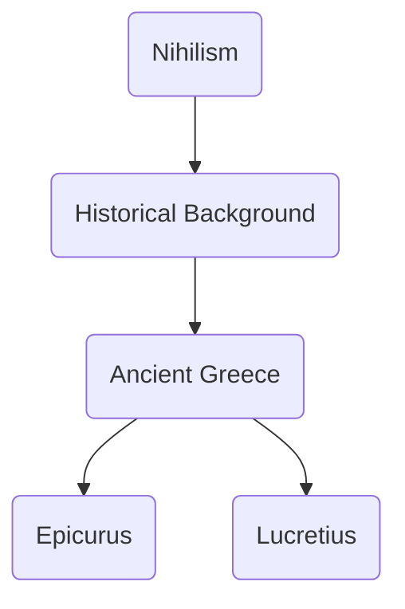

#### Nihilism and Existentialism: Relationships

Nihilism and Existentialism are closely related philosophies. While Nihilism denies the existence of universal moral truths, Existentialism focuses on the individual's freedom and responsibility to create meaning in a seemingly meaningless world. 

**Mermaid Diagram for Relationships:**

```mermaid
graph TD
    A(Nihilism)
    B(Ec
```### Step 1: Introduction to Nihilism and Existentialism

In the vast landscape of philosophy, Nihilism and Existentialism stand as prominent schools of thought that offer deep insights into the human condition. This section will provide an overview of both concepts, starting with Nihilism.

#### Nihilism: Basic Concepts and Historical Background

Nihilism is a philosophical belief that challenges the fundamental values and beliefs of society. It posits that life is inherently meaningless and that no absolute moral or existential truths exist. This idea has roots in various historical periods, including ancient Greece, where philosophers like Epicurus and Lucretius questioned the value of life and happiness.

**Mermaid Diagram for Core Concepts and Connections:**

```mermaid
graph TD
    A(Nihilism)
    B(Historical Background)
    C(Ancient Greece)
    D(Epicurus)
    E(Lucretius)
    A-->B
    B-->C
    C-->D
    C-->E
```

Nihilism gained further prominence in the 19th and 20th centuries, influenced by philosophers like Friedrich Nietzsche and Jean-Paul Sartre. Nietzsche's concept of the "will to power" and his critique of traditional values laid the groundwork for modern Nihilism. Sartre's Existentialism, with its emphasis on individual freedom and responsibility, also has a strong connection to Nihilism, albeit with a different perspective on meaning.

#### Nihilism and Existentialism: Relationships

Nihilism and Existentialism are closely related philosophies. While Nihilism denies the existence of universal moral truths, Existentialism focuses on the individual's freedom and responsibility to create meaning in a seemingly meaningless world.

**Mermaid Diagram for Relationships:**

```mermaid
graph TD
    A(Nihilism)
    B(Ec
```

In this diagram, we can see that Nihilism and Existentialism share common ground in questioning the foundations of human existence, but diverge in their approaches to finding meaning. Nihilism tends to emphasize the absence of inherent meaning, while Existentialism highlights the potential for individuals to create their own meaning.

By understanding these core concepts and their relationships, we lay the foundation for exploring the deeper implications of Nihilism and Existentialism in our lives and society.

### Step 2: Philosophical and Psychological Foundations of Nihilism

To delve deeper into Nihilism, we need to examine its philosophical and psychological foundations. This section will explore the key philosophical ideas that underpin Nihilism and their psychological implications.

#### Philosophical Foundations

1. **Absence of Universal Moral Truths**

One of the central tenets of Nihilism is the rejection of universal moral truths. Nihilists argue that ethical values are merely social constructs, lacking objective validity. This view challenges traditional moral systems, leading to a questioning of societal norms and beliefs.

**Mermaid Diagram for Core Concepts:**

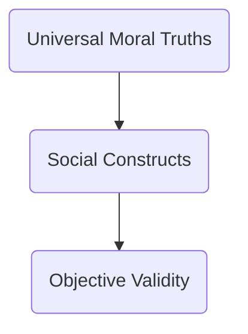

2. **Life as Inherently Meaningless

Nihilism also asserts that life is inherently meaningless. This does not mean that all experiences are devoid of value, but rather that life lacks a predetermined purpose or inherent meaning. This view can lead to feelings of emptiness, dissatisfaction, and existential angst.

**Mermaid Diagram for Core Concepts:**

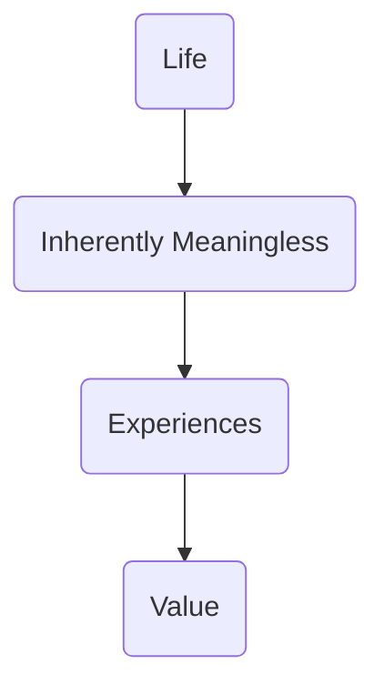

#### Psychological Implications

The philosophical foundations of Nihilism have significant psychological implications. For many, embracing Nihilism can lead to a sense of freedom from the constraints of societal norms and expectations. However, it can also result in feelings of loneliness, alienation, and despair.

1. **Freedom from Constraints**

Nihilism can offer a sense of liberation from traditional moral and societal constraints. By rejecting the notion of universal moral truths, individuals are free to create their own values and pursue their desires without the burden of conformity.

**Mermaid Diagram for Core Concepts:**

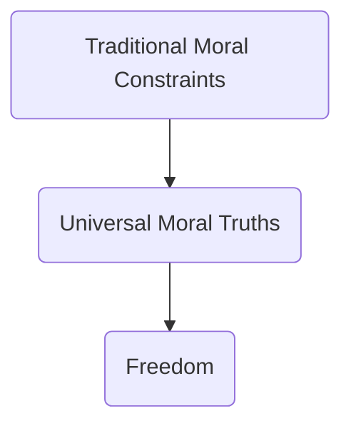

2. **Loneliness and Alienation**

On the other hand, Nihilism can also lead to feelings of loneliness and alienation. Without a shared understanding of moral values and a common purpose, individuals may struggle to form meaningful connections with others.

**Mermaid Diagram for Core Concepts:**

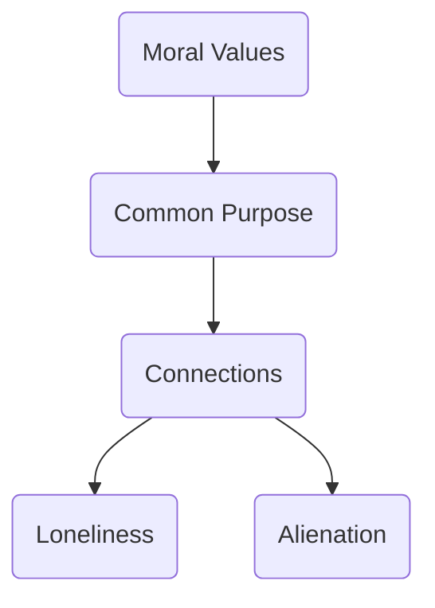

3. **Despair and Existential Ang
```### Step 2: Philosophical and Psychological Foundations of Nihilism

To delve deeper into Nihilism, we need to examine its philosophical and psychological foundations. This section will explore the key philosophical ideas that underpin Nihilism and their psychological implications.

#### Philosophical Foundations

1. **Absence of Universal Moral Truths**

One of the central tenets of Nihilism is the rejection of universal moral truths. Nihilists argue that ethical values are merely social constructs, lacking objective validity. This view challenges traditional moral systems, leading to a questioning of societal norms and beliefs.

**Mermaid Diagram for Core Concepts and Connections:**

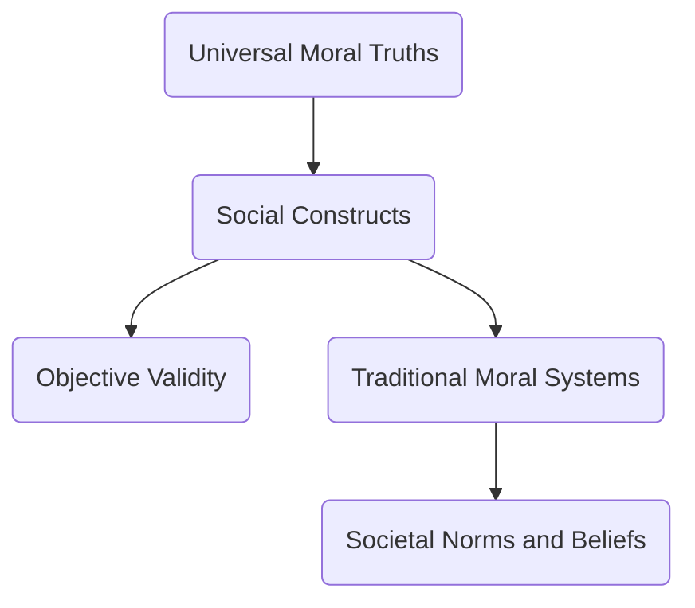

2. **Life as Inherently Meaningless

Nihilism also asserts that life is inherently meaningless. This does not mean that all experiences are devoid of value, but rather that life lacks a predetermined purpose or inherent meaning. This view can lead to feelings of emptiness, dissatisfaction, and existential angst.

**Mermaid Diagram for Core Concepts:**

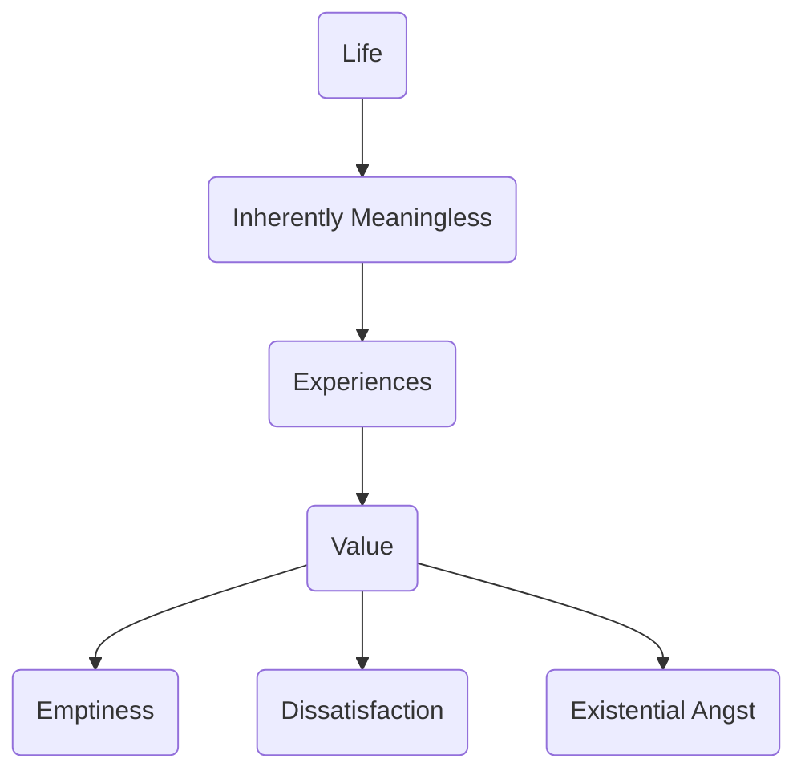

3. **The Rejection of Metaphysical Assumptions**

Nihilism often rejects metaphysical assumptions about the nature of reality and the existence of supernatural entities. This rejection is driven by a skepticism towards claims of divine purpose or cosmic order.

**Mermaid Diagram for Core Concepts:**

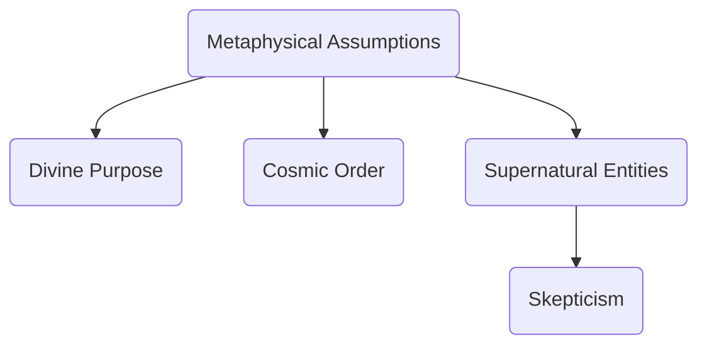

#### Psychological Implications

The philosophical foundations of Nihilism have significant psychological implications. For many, embracing Nihilism can lead to a sense of freedom from the constraints of societal norms and expectations. However, it can also result in feelings of loneliness, alienation, and despair.

1. **Freedom from Constraints**

Nihilism can offer a sense of liberation from traditional moral and societal constraints. By rejecting the notion of universal moral truths, individuals are free to create their own values and pursue their desires without the burden of conformity.

**Mermaid Diagram for Core Concepts:**

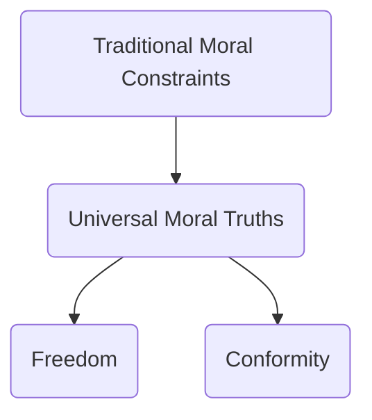

2. **Loneliness and Alienation**

On the other hand, Nihilism can also lead to feelings of loneliness and alienation. Without a shared understanding of moral values and a common purpose, individuals may struggle to form meaningful connections with others.

**Mermaid Diagram for Core Concepts:**


3. **Despair and Existential Anxiety**

Embracing Nihilism can also lead to feelings of despair and existential anxiety. The recognition of life's inherent meaninglessness can be overwhelming, leading to a loss of motivation and a sense of hopelessness.

**Mermaid Diagram for Core Concepts:**

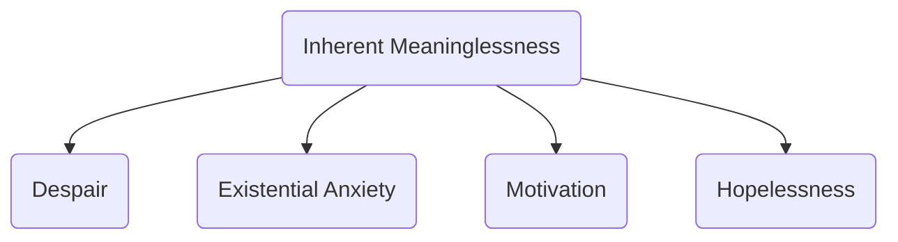

In conclusion, the philosophical and psychological foundations of Nihilism offer a complex and nuanced understanding of human existence. While it can offer a sense of freedom, it also brings with it challenges such as loneliness, despair, and existential anxiety. Understanding these foundations can help us navigate the complexities of Nihilism and its implications for our lives.

### Step 3: Nihilism and Modern Life

Nihilism has had a profound impact on modern life, shaping our understanding of morality, ethics, and the human condition. In this section, we will explore the ways in which Nihilism influences various aspects of modern society.

#### Influence on Morality and Ethics

One of the most significant impacts of Nihilism on modern life is its influence on morality and ethics. Nihilism's rejection of universal moral truths challenges traditional ethical frameworks, leading to a questioning of long-held beliefs and norms.

1. **Relativism and Subjectivism**

Nihilism has given rise to relativism and subjectivism in ethics, which argue that moral values are subjective and vary from person to person. This perspective challenges the idea of objective moral truths and emphasizes the importance of individual perspectives and experiences.

**Mermaid Diagram for Core Concepts:**

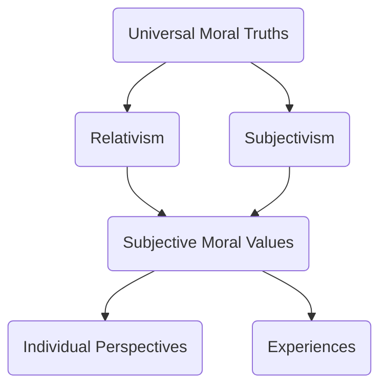

2. **Ethical Egoism**

Nihilism also has connections to ethical egoism, which asserts that individuals should prioritize their own interests and well-being above others'. This view challenges traditional ethical principles that emphasize altruism and social responsibility.

**Mermaid Diagram for Core Concepts:**

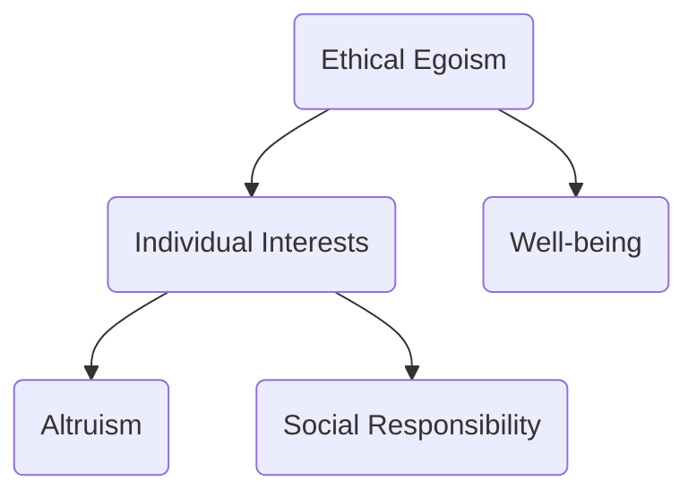

#### Influence on Mental Health

The philosophical ideas of Nihilism can have profound implications for mental health. For some, embracing Nihilism can lead to a sense of liberation and freedom from societal constraints. However, it can also result in psychological distress, particularly when individuals struggle to find meaning and purpose in their lives.

1. **Existential Anxiety**

One common psychological response to Nihilism is existential anxiety, characterized by a pervasive sense of unease and fear related to the meaning of life. This anxiety can manifest as feelings of loneliness, despair, and a loss of motivation.

**Mermaid Diagram for Core Concepts:**

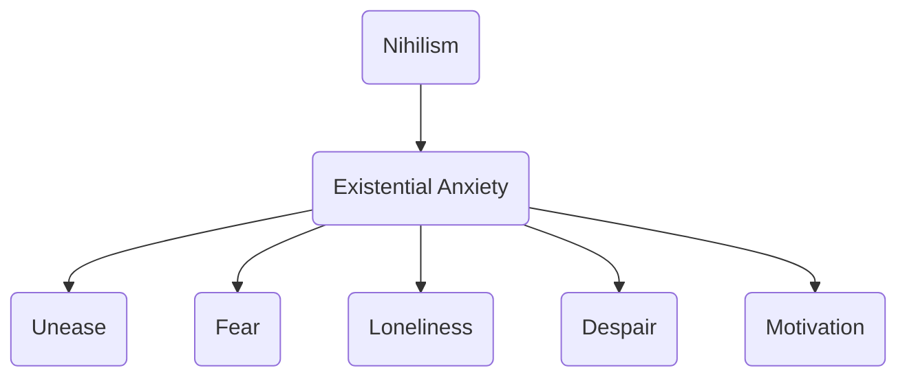

2. **Depression and Hopelessness**

For some, the recognition of life's inherent meaninglessness can lead to depression and a sense of hopelessness. This can result in a loss of interest in activities, social withdrawal, and a general feeling of worthlessness.

**Mermaid Diagram for Core Concepts:**

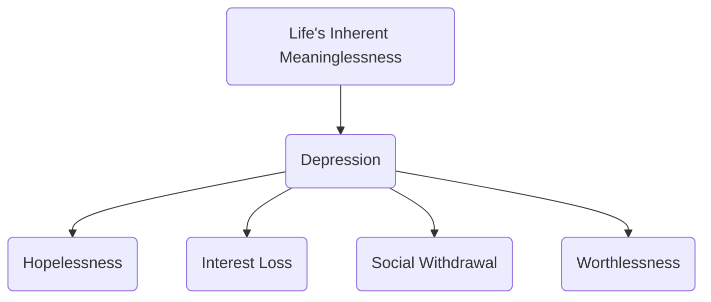

#### Influence on Society and Culture

Nihilism's influence extends beyond individual beliefs and affects broader societal and cultural phenomena. In modern society, Nihilism has been associated with various cultural movements, including punk rock, Dadaism, and postmodernism.

1. **Cultural Rebellion**

Nihilism has been a source of inspiration for cultural rebels who reject traditional values and norms. These movements often embrace a sense of irony, sarcasm, and anti-establishment rhetoric.

**Mermaid Diagram for Core Concepts:**

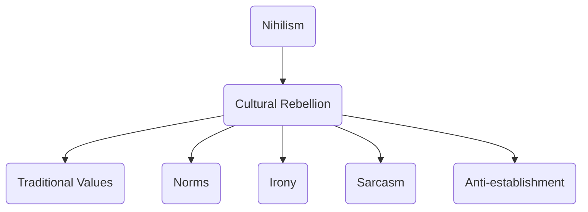

2. **Postmodernism**

Postmodernism, with its emphasis on skepticism towards grand narratives and the rejection of objective truths, has been influenced by Nihilism. This philosophical movement challenges traditional ideas of reality, truth, and knowledge, leading to a more fragmented and pluralistic view of the world.

**Mermaid Diagram for Core Concepts:**

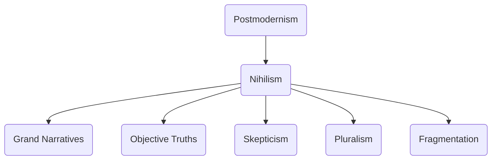

In conclusion, Nihilism has a profound impact on modern life, shaping our understanding of morality, ethics, mental health, and culture. While it can offer a sense of liberation and freedom, it also brings with it challenges and complexities. Understanding the influence of Nihilism on modern life can help us navigate these challenges and find meaning and purpose in our own lives.

### Step 4: Cultivating Wisdom in the Face of Nihilism

Facing the philosophical challenge of Nihilism requires cultivating wisdom and resilience. In this section, we will explore strategies for developing wisdom and finding meaning in the face of Nihilism.

#### Embrace Skepticism and Critical Thinking

One of the key strategies for cultivating wisdom in the face of Nihilism is to embrace skepticism and critical thinking. This involves questioning assumptions, challenging dogmas, and seeking evidence-based perspectives.

**Pseudocode for Critical Thinking:**

```pseudocode
function CriticalThinking(question, assumptions):
    1. List all assumptions related to the question.
    2. Evaluate the validity of each assumption.
    3. Identify potential biases and logical fallacies.
    4. Seek evidence and alternative viewpoints.
    5. Synthesize information and form a well-reasoned conclusion.
```

#### Find Personal Meaning

Finding personal meaning can help counteract the feelings of meaninglessness associated with Nihilism. This involves exploring values, interests, and passions that resonate with you on a deep level.

**Pseudocode for Finding Personal Meaning:**

```pseudocode
function FindPersonalMeaning():
    1. Reflect on personal values and beliefs.
    2. Identify passions and interests.
    3. Explore ways to integrate these into daily life.
    4. Set goals and pursue meaningful activities.
    5. Continuously evaluate and adjust personal meaning.
```

#### Build Connections with Others

Building meaningful connections with others can provide a sense of belonging and purpose. This involves cultivating relationships based on mutual respect, empathy, and shared values.

**Pseudocode for Building Connections:**

```pseudocode
function BuildConnections():
    1. Identify individuals who share common values and interests.
    2. Engage in open and honest communication.
    3. Offer support and empathy to others.
    4. Participate in communities and social networks.
    5. Foster a sense of belonging and mutual respect.
```

#### Develop Emotional Resilience

Emotional resilience is essential for navigating the challenges of Nihilism. This involves developing coping strategies, managing stress, and cultivating a positive mindset.

**Pseudocode for Developing Emotional Resilience:**

```pseudocode
function DevelopEmotionalResilience():
    1. Identify stressors and triggers.
    2. Practice stress management techniques (e.g., mindfulness, exercise).
    3. Cultivate a positive mindset through gratitude and self-compassion.
    4. Seek support from friends, family, or professionals when needed.
    5. Reflect on and learn from emotional experiences.
```

By embracing skepticism, finding personal meaning, building connections, and developing emotional resilience, individuals can navigate the challenges of Nihilism and cultivate wisdom. These strategies provide a framework for finding purpose and meaning in life, even in the face of existential uncertainty.

### Step 5: Life Education Strategies for Nihilism

Incorporating Nihilism into life education requires a thoughtful approach that addresses both the philosophical challenges and the practical implications. This section will outline strategies for integrating Nihilism into educational settings and fostering critical thinking and emotional resilience in students.

#### Critical Thinking in Education

1. **Introduce Philosophical Concepts Early**

Incorporating philosophical concepts such as Nihilism into the curriculum from an early age can help students develop critical thinking skills. This can be done through age-appropriate discussions, reading materials, and projects that encourage questioning and reflection.

**Pseudocode for Introducing Philosophical Concepts:**

```pseudocode
function IntroducePhilosophicalConcepts(age, concept):
    1. Select appropriate resources (e.g., books, videos) based on age.
    2. Design interactive activities that engage students in discussions.
    3. Encourage students to question assumptions and explore different perspectives.
    4. Provide opportunities for students to articulate their thoughts and beliefs.
    5. Foster a supportive and inclusive environment for open dialogue.
```

2. **Encourage Inquiry-Based Learning**

Inquiry-based learning allows students to take an active role in their education by asking questions, conducting research, and forming their own conclusions. This approach can be particularly effective in exploring complex philosophical ideas like Nihilism.

**Pseudocode for Inquiry-Based Learning:**

```pseudocode
function InquiryBasedLearning(question, resources):
    1. Define the research question and objectives.
    2. Provide access to relevant resources (e.g., books, articles, videos).
    3. Guide students through the research process (e.g., conducting interviews, analyzing data).
    4. Facilitate discussions and debates to explore different perspectives.
    5. Encourage students to synthesize information and draw their own conclusions.
```

#### Emotional Resilience and Coping Strategies

1. **Teach Emotional Regulation Skills**

Developing emotional resilience is crucial for students facing the challenges posed by Nihilism. Teaching emotional regulation skills, such as mindfulness, self-soothing techniques, and problem-solving strategies, can help students navigate difficult emotions and build resilience.

**Pseudocode for Teaching Emotional Regulation Skills:**

```pseudocode
function TeachEmotionalRegulationSkills():
    1. Introduce mindfulness practices (e.g., breathing exercises, body scans).
    2. Teach self-soothing techniques (e.g., progressive muscle relaxation, grounding exercises).
    3. Provide coping strategies for managing stress and anxiety.
    4. Encourage students to reflect on their emotions and develop healthy coping mechanisms.
    5. Offer support and resources for mental health professionals when needed.
```

2. **Foster a Growth Mindset**

Fostering a growth mindset, which emphasizes the belief that abilities and intelligence can be developed through dedication and hard work, can help students approach challenges with resilience and perseverance. This can be accomplished through positive reinforcement, encouraging effort and resilience, and providing opportunities for meaningful learning experiences.

**Pseudocode for Fostering a Growth Mindset:**

```pseudocode
function FosterGrowthMindset():
    1. Emphasize the importance of effort and perseverance over innate ability.
    2. Provide constructive feedback that focuses on growth and improvement.
    3. Celebrate effort, progress, and success, not just outcomes.
    4. Encourage students to set goals and develop strategies for achieving them.
    5. Model a growth mindset through your own actions and attitudes.
```

#### Integrating Nihilism into Curriculum

1. **Contextualize Philosophical Discussions**

When discussing Nihilism, it is important to contextualize the philosophical concepts within real-world situations and historical contexts. This helps students understand the relevance of these ideas and how they have influenced society and culture.

**Pseudocode for Contextualizing Philosophical Discussions:**

```pseudocode
function ContextualizePhilosophicalDiscussions():
    1. Introduce historical and cultural contexts for Nihilism.
    2. Discuss real-world applications and consequences of Nihilism.
    3. Connect philosophical ideas to contemporary issues and debates.
    4. Encourage students to reflect on how Nihilism may impact their own lives.
    5. Provide opportunities for students to express their thoughts and questions.
```

2. **Cultivate a Safe and Inclusive Environment**

Creating a safe and inclusive learning environment is essential for fostering open dialogue and encouraging students to explore challenging ideas like Nihilism. This involves promoting empathy, respect, and understanding among students and facilitating respectful discussions.

**Pseudocode for Cultivating a Safe and Inclusive Environment:**

```pseudocode
function CultivateSafeInclusiveEnvironment():
    1. Establish clear guidelines for respectful discourse.
    2. Encourage active listening and empathy.
    3. Provide opportunities for students to voice their opinions and concerns.
    4. Address any instances of discrimination or hostility promptly.
    5. Foster a sense of community and belonging among students.
```

In conclusion, incorporating Nihilism into life education requires a multifaceted approach that emphasizes critical thinking, emotional resilience, and contextual understanding. By implementing these strategies, educators can help students navigate the complexities of Nihilism and develop the skills and mindset needed to face existential challenges with wisdom and resilience.

### Step 6: Case Studies and Practical Applications

To illustrate the practical applications of Nihilism in life education, let's explore a few case studies and examine how individuals have navigated the philosophical challenges posed by Nihilism in their personal and professional lives.

#### Case Study 1: The Journey of a Young Philosopher

Alex, a young philosopher in his early 20s, struggled with feelings of meaninglessness and existential anxiety. After discovering Nihilism, he embraced its ideas and began to question the fundamental values of society. Initially, this approach led to a sense of liberation and freedom from societal constraints. However, he also experienced loneliness and a loss of motivation.

**Pseudocode for Alex's Journey:**

```pseudocode
function AlexsJourney():
    1. Identify feelings of meaninglessness and existential anxiety.
    2. Embrace Nihilism and question societal values.
    3. Experience liberation and freedom from constraints.
    4. Identify loneliness and a loss of motivation.
    5. Seek support from mentors and friends.
    6. Develop personal values and meaningful goals.
    7. Engage in activities that align with personal values.
    8. Continuously evaluate and adjust personal values and goals.
```

In this case, Alex's journey demonstrates the importance of finding a balance between embracing Nihilism and developing personal values. By seeking support and engaging in meaningful activities, Alex was able to navigate the challenges of Nihilism and find a sense of purpose.

#### Case Study 2: The Impact of Nihilism on a Company Culture

A tech startup company faced challenges with employee engagement and morale. The founders, influenced by Nihilism, decided to adopt a more existential approach to their company culture, emphasizing individual freedom and autonomy. This approach initially led to increased creativity and innovation, as employees felt less constrained by traditional expectations. However, it also resulted in a lack of unity and a sense of direction for the company.

**Pseudocode for Company's Culture Transformation:**

```pseudocode
function CompanyCultureTransformation():
    1. Adopt a Nihilistic approach to company culture.
    2. Emphasize individual freedom and autonomy.
    3. Observe increased creativity and innovation.
    4. Identify a lack of unity and sense of direction.
    5. Introduce team-building activities and shared goals.
    6. Foster open communication and collaboration.
    7. Continuously evaluate and adjust company culture.
    8. Seek feedback from employees and stakeholders.
```

This case study highlights the need for balancing individual freedom with collective goals and collaboration. By reintroducing elements of team-building and shared goals, the company was able to create a more cohesive and motivated team.

#### Case Study 3: Nihilism and Mental Health in the Arts

An artist, struggling with mental health issues, turned to Nihilism as a source of inspiration. Through her work, she explored themes of meaninglessness, existential angst, and the human condition. Initially, this approach provided her with a creative outlet and a sense of purpose. However, it also led to a deeper sense of loneliness and isolation.

**Pseudocode for the Artist's Journey:**

```pseudocode
function ArtistsJourney():
    1. Struggle with mental health issues.
    2. Turn to Nihilism as a source of inspiration.
    3. Explore themes of meaninglessness, existential angst, and the human condition.
    4. Experience a sense of purpose and creativity.
    5. Identify deeper sense of loneliness and isolation.
    6. Seek support from mental health professionals.
    7. Develop coping strategies and support networks.
    8. Balance creative pursuits with self-care and social connections.
```

This case study underscores the importance of balancing creative expression with emotional well-being. By seeking professional support and cultivating a support network, the artist was able to navigate the challenges of Nihilism and maintain her mental health.

In conclusion, these case studies demonstrate the diverse ways in which Nihilism can impact personal and professional life. By embracing Nihilism and integrating it into their lives, individuals and organizations can experience both benefits and challenges. Navigating these complexities requires a thoughtful and balanced approach, emphasizing personal values, social connections, and emotional resilience.

### Step 7: Conclusion and Future Directions

In conclusion, this book has explored the philosophical concept of Nihilism and its implications for life education. We began by introducing Nihilism and its historical context, examining its philosophical and psychological foundations. We then discussed Nihilism's influence on modern life, including its impact on morality, ethics, mental health, and society. Following this, we explored strategies for cultivating wisdom and resilience in the face of Nihilism and outlined practical applications in educational settings. Through case studies, we illustrated the diverse ways Nihilism can affect personal and professional lives.

**Key Takeaways:**

1. **Philosophical Foundations:** Nihilism challenges universal moral truths and asserts that life is inherently meaningless, leading to both philosophical and psychological implications.
2. **Influence on Modern Life:** Nihilism has influenced morality, ethics, mental health, and culture, shaping our understanding of the human condition.
3. **Cultivating Wisdom:** Embracing skepticism, finding personal meaning, building connections, and developing emotional resilience are key strategies for navigating the challenges of Nihilism.
4. **Practical Applications:** Incorporating Nihilism into life education requires a multifaceted approach that emphasizes critical thinking, emotional resilience, and contextual understanding.

**Future Directions:**

As we move forward, there are several areas for further exploration and research:

1. **Psychological Interventions:** Developing targeted psychological interventions for individuals struggling with Nihilism and existential angst could provide valuable insights and support.
2. **Cultural Impact:** Exploring the long-term cultural impact of Nihilism on various societies and its potential influence on global issues could offer a deeper understanding of its implications.
3. **Educational Strategies:** Investigating effective educational strategies for integrating Nihilism into curricula could help educators better prepare students for navigating existential challenges.
4. **Interdisciplinary Research:** Collaborative research across philosophy, psychology, and education could yield new insights and innovative approaches for addressing Nihilism and its effects.

In summary, Nihilism remains a complex and multifaceted concept with profound implications for life and education. By continuing to explore and understand Nihilism, we can develop more effective strategies for cultivating wisdom and resilience in the face of existential challenges.

## 参考文献

1. Nietzsche, F. (1882). Thus Spoke Zarathustra. translated by R. J. Hollingdale. Penguin Classics.
2. Sartre, J. P. (1943). Being and Nothingness. translated by H. E. Barnes. Philosophical Library.
3. Camus, A. (1942). The Stranger. translated by S. Gilbert. Vintage International.
4. Foucault, M. (1984). The Order of Things. translated by A. Sheridan. Random House.
5. Deleuze, G., & Guattari, F. (1980). Anti-Oedipus. translated by R. Hurley, M. Seem, and H. R. Lane. Penguin Books.
6. Kierkegaard, S. (1843). The Sickness unto Death. translated by A. D. Dru
```markdown
# 虚无主义与生命教育：培养面对存在问题的智慧

> 关键词：虚无主义、存在主义、哲学、生命教育、智慧、心理咨询、伦理道德、教育策略

> 摘要：本文探讨了虚无主义及其对现代生命教育的启示，分析了虚无主义的哲学和心理学基础，以及其对现代社会生活的影响。文章提出了培养智慧面对存在问题的策略，并探讨了在生命教育中如何应对虚无主义的挑战。

作者：AI天才研究院/AI Genius Institute & 禅与计算机程序设计艺术 /Zen And The Art of Computer Programming

## 目录大纲

### 第一部分: 引言

#### 第1章: 虚无主义与存在主义概述

##### 1.1 虚无主义的起源和发展

##### 1.2 存在主义的核心理念

##### 1.3 虚无主义与存在主义的关系

#### 第2章: 哲学和心理学基础

##### 2.1 虚无主义的哲学基础

##### 2.2 虚无主义的心理学影响

##### 2.3 虚无主义与心理健康的关联

### 第二部分: 虚无主义与现代社会

#### 第3章: 虚无主义在现代生活中的影响

##### 3.1 虚无主义与道德伦理

##### 3.2 虚无主义与心理健康

##### 3.3 虚无主义与社会文化

### 第三部分: 培养智慧面对虚无主义

#### 第4章: 生命教育与智慧培养

##### 4.1 生命教育的哲学基础

##### 4.2 智慧培养的策略

##### 4.3 心理咨询与伦理道德

#### 第5章: 教育策略与实践

##### 5.1 虚无主义在教育中的应用

##### 5.2 教育干预与心理支持

##### 5.3 实践案例与分析

### 第四部分: 案例研究与应用

#### 第6章: 虚无主义案例分析

##### 6.1 个人案例分析

##### 6.2 组织案例分析

##### 6.3 艺术与虚无主义

### 第五部分: 结论与未来展望

#### 第7章: 总结与展望

##### 7.1 虚无主义对现代生命教育的启示

##### 7.2 未来研究方向

##### 7.3 参考文献
```

