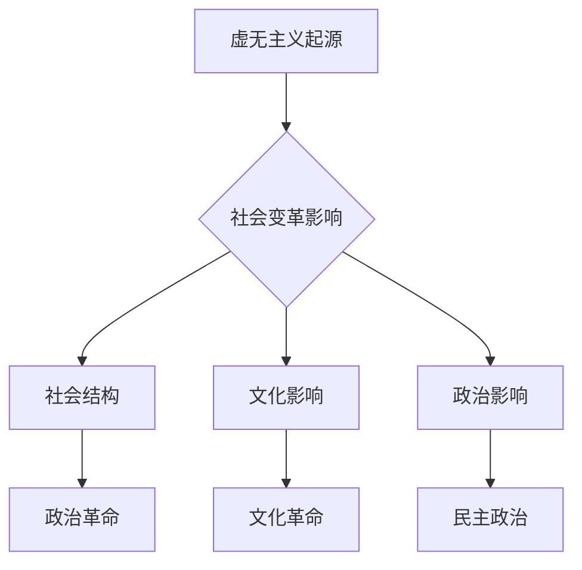

                 

### 《虚无主义与社会变革：在参与中找寻个人价值》

#### 关键词：
- 虚无主义
- 社会变革
- 个人价值
- 参与式社会
- 社会责任

#### 摘要：
本文旨在探讨虚无主义对社会变革的影响，以及个人如何在参与社会变革的过程中寻找和确立个人价值。虚无主义作为一种哲学思潮，挑战了生活的固有意义和价值。在社会变革的大背景下，个体如何应对虚无主义的挑战，成为本文讨论的核心。本文首先介绍虚无主义的定义及其发展历程，接着分析虚无主义对社会结构、文化、政治等方面的影响。在此基础上，探讨个人价值观的内涵及其形成，以及个人在社会变革中的角色和参与方式。最后，本文讨论个人价值与社会责任的关系，并提出在虚无主义背景下个人价值重塑的途径与方法。

## 引言

### 1.1 虚无主义的定义与本书研究意义

虚无主义，作为一种哲学思潮，起源于19世纪的西方，是对生活意义和价值的质疑。在西方哲学史上，虚无主义主要分为存在主义虚无主义、唯意志论虚无主义和印度虚无主义等类型。存在主义虚无主义的代表人物如萨特和尼采，他们认为人类生活缺乏固有的意义和价值，强调个体在现实世界中的自由选择和主观建构。唯意志论虚无主义则以尼采为代表，强调个体意志的绝对自由和无意义性。印度虚无主义则以尼赫鲁为代表，关注个体在社会环境中的困境和解脱。

虚无主义对社会变革有着深远的影响。它挑战了传统价值观和社会结构，推动了现代化进程。在社会变革中，个人如何应对虚无主义的挑战，如何在参与社会变革的过程中寻找和确立个人价值，成为了一个值得探讨的问题。

本书旨在探讨虚无主义对社会变革的影响，以及个人在参与社会变革过程中如何寻找和确立个人价值。通过分析虚无主义的起源、发展及其对社会结构、文化、政治等方面的影响，本文试图揭示虚无主义背景下个人价值观的形成与重塑。同时，本文还将讨论个人在社会变革中的角色和参与方式，以及个人价值与社会责任的关系。通过这些探讨，本文希望为个人在虚无主义背景下寻找个人价值提供一些有益的思路。

### 1.2 社会变革的概念与类型

社会变革是指社会结构、文化、政治等方面的根本性变化。社会变革可以源于内部力量，如社会矛盾、经济发展、科技进步等，也可以源于外部力量，如战争、政治动荡、全球化和文化交流等。社会变革的类型多种多样，包括政治革命、社会革命、文化革命、经济革命等。

政治革命是指政治制度、政治权力关系的根本性变革，如法国大革命和美国独立战争。社会革命是指社会结构、社会关系的根本性变革，如俄国十月革命和中国革命。文化革命是指文化观念、文化形态的根本性变革，如中国的文化大革命。经济革命是指经济发展模式、生产方式的根本性变革，如工业革命和信息技术革命。

社会变革的影响深远，它不仅改变了社会的面貌，也影响了个人价值观的形成。在社会变革中，个人面临着新的挑战和机遇，需要不断调整和重塑自己的价值观，以适应新的社会环境。

### 1.3 个人价值与社会责任的关系探讨

个人价值与社会责任是两个密切相关但又有所区别的概念。个人价值是指个人在道德、能力、情感等方面的内在品质，体现了个人的尊严和自尊。社会责任是指个人对社会和他人的义务和责任，体现了个人对社会的贡献和担当。

个人价值与社会责任的关系可以从以下几个方面进行探讨：

1. **个人价值是社会责任的基础**：个人价值决定了个人对待社会责任的态度和行为。一个具有高度个人价值的人，更可能承担社会责任，更积极地参与社会事务。

2. **社会责任是个人价值的体现**：个人通过承担社会责任，实现自己的价值，同时促进社会的进步和发展。社会责任不仅是对他人的义务，也是对自己的期许和自我实现。

3. **个人价值与社会责任的平衡**：在现实生活中，个人价值与社会责任往往需要平衡。个人需要在追求个人价值的同时，承担起相应的社会责任，以实现个人与社会的和谐发展。

4. **虚无主义背景下的挑战**：在虚无主义背景下，个人价值与社会责任的关系面临着新的挑战。虚无主义对个人价值观的质疑，使得个人在寻找和确立个人价值时更加困惑。同时，虚无主义也对社会责任提出了新的要求，个人需要更加关注自己的行为对社会的影响，以实现个人价值与社会责任的统一。

## 第1章 虚无主义的起源与发展

### 1.1 虚无主义的历史背景

虚无主义作为一种哲学思潮，其起源可以追溯到19世纪的西方。在这个时代，工业革命和资本主义的发展带来了社会结构的急剧变化，传统价值观和宗教信仰受到严重冲击。人们开始质疑生活的意义和价值，虚无主义的思想逐渐兴起。

首先，19世纪初的德国哲学家中，尼采是虚无主义的代表人物之一。他提出了“上帝已死”的口号，挑战了宗教信仰的权威，强调个体意志的绝对自由和无意义性。尼采的哲学思想对后来的虚无主义产生了深远影响。

其次，法国哲学家萨特的存在主义思想也是虚无主义的重要来源。萨特认为人类生活缺乏固有的意义和价值，强调个体在现实世界中的自由选择和主观建构。他的哲学思想在20世纪对西方社会产生了巨大影响。

此外，20世纪印度的尼赫鲁也提出了印度虚无主义的思想。他关注个体在社会环境中的困境和解脱，认为虚无主义是对社会现实的一种反抗。

总的来说，虚无主义的历史背景源于19世纪西方社会的深刻变革，主要代表人物包括尼采、萨特和尼赫鲁。他们的思想对虚无主义的发展产生了深远影响，使虚无主义成为西方哲学史上一股重要的思潮。

### 1.2 虚无主义的主要代表人物

在虚无主义的起源与发展过程中，有几位哲学家和思想家对虚无主义思想的传播和发展起到了关键作用。以下是虚无主义的主要代表人物及其思想：

**1.2.1 萨特与存在主义虚无主义**

让-保罗·萨特是20世纪最具影响力的哲学家之一，他的存在主义哲学对虚无主义有着重要影响。萨特认为，人类生活缺乏固有的意义，存在的本身就是一种荒谬。他强调，人类必须通过自由选择和行动来为自己创造意义。萨特的存在主义虚无主义主张，个体在现实世界中的自由选择和主观建构是摆脱虚无主义困境的关键。

**1.2.2 尼采与唯意志论虚无主义**

弗里德里希·尼采是19世纪德国哲学家，他的哲学思想对虚无主义有着深远的影响。尼采提出了“上帝已死”的口号，挑战了宗教信仰的权威。他强调个体意志的绝对自由和无意义性，认为人类必须摆脱传统的束缚，追求自我意志的实现。尼采的唯意志论虚无主义主张，个体意志的绝对自由是摆脱虚无主义困境的唯一途径。

**1.2.3 尼赫鲁与印度虚无主义**

贾瓦哈拉尔·尼赫鲁是印度独立运动的领袖，他提出了印度虚无主义的思想。尼赫鲁认为，个体在社会环境中的困境是由于社会结构的不合理，他主张通过社会改革来摆脱虚无主义困境。他的印度虚无主义思想强调，个体必须通过参与社会变革来实现自我价值和社会责任。

这些虚无主义代表人物的思想为虚无主义的发展提供了理论基础，他们的哲学观点在西方哲学史上产生了深远影响，为后来的虚无主义思潮奠定了基础。

### 1.3 虚无主义对社会思潮的影响

虚无主义作为一种哲学思潮，不仅对个体的思想产生了深远影响，也对社会思潮产生了重要影响。虚无主义对社会思潮的影响主要体现在以下几个方面：

**1. 对个人价值观的挑战**：虚无主义认为生活缺乏固有的意义和价值，这无疑对传统的个人价值观提出了挑战。在虚无主义背景下，个人开始质疑自己的信仰、目标和生活方式，导致传统价值观的动摇和重构。

**2. 对社会结构的反思**：虚无主义对社会结构的反思，促使人们对社会制度、政治体制和文化传统进行深刻思考。虚无主义质疑社会结构的合理性，强调个体在社会中的自由选择和主观建构，这为社会变革提供了理论基础。

**3. 对文化多样性的促进**：虚无主义对文化多样性的促进体现在，它鼓励个体摆脱传统的束缚，追求自我表达和个性化。虚无主义背景下，各种文化形式和艺术风格开始蓬勃发展，为文化的多样性和创新提供了土壤。

**4. 对政治思想的推动**：虚无主义对政治思想的推动，体现在它鼓励个体对社会制度进行批判和反思，推动政治变革和社会进步。虚无主义背景下，各种政治思潮如民主主义、社会主义和自由主义等开始兴起，为现代政治思想的发展做出了贡献。

总之，虚无主义对社会思潮的影响是深远而多方面的，它不仅挑战了传统的个人价值观，也推动了社会结构的反思、文化多样性的促进和政治思想的推动。

## 第2章 虚无主义与社会变革

### 2.1 虚无主义对社会结构的影响

虚无主义作为一种哲学思潮，对社会结构的影响是深刻而多方面的。首先，虚无主义挑战了传统社会结构的合理性，质疑社会制度和规则的合法性。它认为，社会结构和制度往往是权力和利益博弈的结果，缺乏真正的公正和合理性。这种质疑使得人们开始反思现有的社会结构和制度，推动社会变革的进程。

其次，虚无主义强调个体在社会中的自由选择和主观建构，这对传统的社会结构造成了冲击。在虚无主义的影响下，个体不再被动地接受社会结构和制度的安排，而是主动寻求自我实现和个性表达。这种个体意识的觉醒，促进了社会结构的多样化和灵活性，也为社会变革提供了动力。

此外，虚无主义对社会结构的冲击还体现在对家庭、婚姻、职业等传统社会关系的重新定义上。虚无主义背景下，人们对这些传统社会关系的认知和观念发生了变化，更加注重个体的自由和权利。这种变化不仅影响了个体的生活方式，也对社会结构的稳定性和持续性提出了挑战。

### 2.2 虚无主义对文化的影响

虚无主义对文化的影响是深远而复杂的。首先，虚无主义对传统文化观念的质疑和挑战，促使人们重新审视和反思文化的本质和价值。虚无主义认为，文化传统往往是权力和压迫的工具，缺乏真正的自由和民主。这种质疑激发了人们对于文化多样性和创新性的追求，推动了文化的多样化和创新。

其次，虚无主义对文化的影响还体现在对艺术和文学创作的影响上。在虚无主义背景下，艺术家和作家们开始摆脱传统的束缚，追求自我表达和个性展现。他们的作品往往反映了现实社会的矛盾和困境，对现实进行了深刻的批判和反思。这种创作风格和内容的变化，不仅丰富了文化的内涵，也推动了文化的发展。

此外，虚无主义对文化的影响还表现在对宗教和信仰的挑战上。虚无主义认为，宗教和信仰往往是对人类自由的束缚，缺乏真正的科学性和合理性。这种挑战促使人们对宗教和信仰进行重新审视和反思，推动了宗教和信仰的世俗化和多元化。

总之，虚无主义对文化的影响是全方位的，它不仅挑战了传统文化观念，也推动了文化的多样化和创新。虚无主义背景下，文化在自我反思和重构中不断发展，为社会的进步和变革提供了精神动力。

### 2.3 虚无主义对政治的影响

虚无主义对政治的影响是深远而多层次的。首先，虚无主义对传统政治体制和权力结构的质疑，挑战了政治合法性和权威的根基。它认为，政治权力往往是基于权力者和被统治者的不平等关系，缺乏真正的民主和公正。这种质疑激发了人们对于政治权力的重新思考和批判，推动了政治体制的改革和民主化进程。

其次，虚无主义对政治思想的发展产生了重要影响。它鼓励个体在政治领域中追求自我表达和个性展现，推动了政治思想的多样化和创新。虚无主义背景下，各种新的政治思潮如自由主义、民主社会主义和生态主义等开始兴起，为政治思想的发展注入了新的活力。

此外，虚无主义对政治实践的影响还体现在对政治参与的方式和形式的变革上。它鼓励个体积极参与政治活动，通过集体行动和公民参与来实现政治变革。这种政治参与的方式，不仅促进了政治的民主化，也增强了社会的凝聚力和稳定性。

总之，虚无主义对政治的影响是全面而深刻的，它不仅挑战了传统政治体制和权力结构，也推动了政治思想的创新和政治实践的改变。虚无主义背景下，政治在自我反思和重构中不断进步，为社会的变革和进步提供了重要的动力。

#### 2.3.1 虚无主义与革命政治

虚无主义对革命政治有着重要的影响。首先，虚无主义对传统政治体制的质疑和挑战，为革命政治提供了理论基础。虚无主义认为，现有的政治体制和权力结构缺乏公正和合理性，必须通过革命来推翻和重建。这种观点激发了人们对革命的热情和动力，推动了革命政治的兴起。

其次，虚无主义强调个体在政治中的自由选择和主观建构，这为革命政治提供了动力和方向。在虚无主义背景下，个体不再被动地接受政治权力的安排，而是主动寻求政治变革，通过革命来实现自己的政治理想。这种个体意识的觉醒，为革命政治提供了广泛的群众基础。

此外，虚无主义对革命政治的影响还体现在对革命策略和手段的探索上。虚无主义鼓励个体在政治斗争中采取灵活多样的策略，以适应不断变化的政治环境。这种策略的灵活性，使革命政治在斗争中具有更强的适应性和战斗力。

总之，虚无主义与革命政治密不可分。它不仅为革命政治提供了理论基础和动力，也推动了革命策略的创新和发展。虚无主义背景下，革命政治在自我反思和重构中不断进步，为社会的变革和进步提供了重要的动力。

#### 2.3.2 虚无主义与民主政治

虚无主义与民主政治之间存在复杂的互动关系。首先，虚无主义对传统政治体制和权力结构的质疑，为民主政治的发展提供了动力。虚无主义认为，现有的政治体制和权力结构往往缺乏公正和合理性，必须通过民主制度来加以改善。这种观点推动了民主政治的兴起和发展。

其次，虚无主义对民主政治的影响还体现在对民主制度的批判和反思上。虚无主义认为，民主制度虽然能够保障公民的权利和自由，但往往存在形式化和虚伪化的问题。它强调，民主制度需要更加注重实质性的公正和平等，而不仅仅是形式上的民主。

此外，虚无主义对民主政治的影响还表现在对个体参与政治的鼓励上。虚无主义背景下，个体被鼓励积极参与政治活动，通过集体行动和公民参与来实现民主政治的理想。这种个体参与的积极性，为民主政治提供了广泛的群众基础。

总之，虚无主义与民主政治之间存在密切的互动关系。虚无主义为民主政治提供了理论基础和动力，同时也对其进行了批判和反思。虚无主义背景下，民主政治在自我反思和重构中不断进步，为社会的变革和进步提供了重要的动力。

### 第3章 个人价值观的探索

#### 3.1 个人价值观的内涵与特点

个人价值观是指个人对于生活、工作、人际关系等方面的基本信念和评价标准，它决定了个人的行为模式和决策过程。个人价值观的内涵丰富，包括道德观念、人生目标、行为准则等方面。其特点主要体现在以下几个方面：

首先，个人价值观具有主观性。每个人的成长背景、教育经历、文化环境等因素都会对价值观的形成产生深远影响，导致不同的个体拥有不同的价值观。

其次，个人价值观具有稳定性。尽管外部环境和个人经历会影响价值观的调整和变化，但个人的核心价值观往往具有持久性和稳定性。

第三，个人价值观具有指导性。价值观对个体的行为和决策具有指导作用，影响个体在面对不同情境时的选择和行动。

最后，个人价值观具有社会性。个人价值观不仅反映了个体内心的信念和需求，也受到社会文化环境的影响，需要与社会价值观相协调。

#### 3.2 个人价值观的形成与变化

个人价值观的形成是一个长期的过程，受到多种因素的影响，包括家庭环境、教育背景、社会文化、个人经历等。家庭环境对个人价值观的形成具有基础性影响，父母的教育方式、家庭氛围等都会对个体价值观产生深远影响。

教育背景也是个人价值观形成的重要因素。学校教育不仅传授知识和技能，还通过教育理念和课程设置影响学生的价值观。不同教育体系和社会文化背景会塑造不同的价值观。

社会文化对个人价值观的形成有着深远的影响。文化传统、宗教信仰、社会规范等都是个人价值观形成的重要因素。例如，集体主义文化强调个人对集体的责任和贡献，而个人主义文化则强调个体的独立和自主。

个人经历也是个人价值观形成的重要来源。个体在成长过程中遇到的各种经历，如成功与失败、喜悦与痛苦等，都会对价值观产生深刻影响。这些经历使个体对生活和世界有了更深刻的理解和认知，从而影响价值观的形成和变化。

个人价值观的变化是一个动态的过程。随着个体的成长和生活环境的改变，个人价值观可能会发生调整和变化。例如，一个在集体主义文化中成长的人，在进入个人主义文化环境后，可能会逐渐接受并认同个人主义价值观。

总之，个人价值观的形成与变化是一个复杂的过程，受到多种因素的影响。了解个人价值观的形成和变化过程，有助于个体更好地认识自己，找到适合自己的价值观，并在面对挑战时保持内心的坚定和平衡。

#### 3.3 价值观的评估与优化

评估与优化个人价值观是一个重要的自我提升过程。首先，可以通过反思和自我观察来评估现有价值观。反思自己的行为模式、决策过程和面对挑战时的反应，了解这些行为是否与个人价值观一致。如果发现不一致，可以进一步探讨原因，是否需要调整价值观。

其次，可以通过与他人交流来获取反馈。与家人、朋友、同事或心理咨询师等进行深入的对话，了解他们如何看待你的价值观，是否存在需要改进的地方。这种外部视角可以帮助你更客观地评估自己的价值观。

优化价值观的过程中，可以考虑以下几点：

1. **一致性**：确保你的行为与价值观一致。如果发现存在矛盾，尝试调整行为或价值观，以达到内外一致性。

2. **适应性**：随着生活环境的改变，价值观也需要相应调整。适应新的挑战和机遇，确保价值观能够帮助你应对现实生活中的各种情境。

3. **实践性**：价值观需要通过实践来检验。在实际生活中，将价值观付诸行动，观察结果，根据反馈不断优化。

4. **平衡性**：在优化价值观时，注意平衡不同价值观之间的关系。例如，在追求个人成就的同时，也要考虑社会责任和家庭责任。

通过评估与优化个人价值观，可以帮助个体更好地认识自己，提高自我意识和决策能力，实现个人成长和幸福。

### 第4章 社会变革中的个人参与

#### 4.1 个人参与社会变革的途径

在社会变革的过程中，个人可以采取多种途径参与其中，发挥自己的作用。以下是几种常见的个人参与社会变革的途径：

**1. 政治参与**：通过投票、参加选举、加入政党或社会团体等方式，直接参与政治活动，影响政策和决策。政治参与是个人对社会变革最直接的表达和参与方式。

**2. 社会参与**：通过参与志愿活动、社会组织和社区活动等方式，为社会问题提供解决方案，推动社会进步。社会参与不仅能够改善社会问题，还能够增强个人的社会责任感和归属感。

**3. 文化参与**：通过参与文化活动、艺术创作、文化交流等方式，推动文化多样性和创新，影响社会文化环境。文化参与能够提升社会文化的质量和活力，对社会变革产生深远影响。

**4. 经济参与**：通过创业、投资、参与经济活动等方式，推动经济发展，改善社会条件。经济参与能够为社会变革提供物质基础和动力。

**5. 媒体参与**：通过使用媒体平台，如社交媒体、博客、新闻评论等，表达观点、传播信息、影响公众舆论。媒体参与是现代社会中个人影响社会的重要方式。

#### 4.2 个人参与社会变革的策略

在参与社会变革的过程中，个人需要采取一些策略，以更有效地发挥作用。以下是几种常见的策略：

**1. **建立网络和合作关系**：通过建立广泛的社会网络和合作关系，可以更好地整合资源、分享信息和协调行动。网络和合作关系是推动社会变革的重要支撑。

**2. **倡导和动员**：通过倡导和动员社会力量，可以激发公众对社会变革的关注和支持。倡导和动员是推动社会变革的重要手段。

**3. **教育和培训**：通过教育和培训，提升公众的社会意识和能力，培养更多有社会责任感和行动力的人才。教育和培训是长期推动社会变革的重要手段。

**4. **创新和实验**：通过创新和实验，探索新的社会变革模式和路径，为社会变革提供新的动力和方向。创新和实验是推动社会变革的重要途径。

**5. **持续参与和坚持**：社会变革是一个长期的过程，需要个人持续参与和坚持。只有通过长期的持续参与，才能实现社会变革的目标。

#### 4.3 个人参与社会变革的挑战与应对

在参与社会变革的过程中，个人可能会面临多种挑战。以下是几种常见的挑战及应对策略：

**1. **资源和能力的不足**：个人参与社会变革需要一定的资源和能力，如资金、技术、人脉等。如果资源和能力不足，可以寻求外部支持和合作，整合资源，提高效率。

**2. **社会阻力和压力**：社会变革往往面临来自社会各方面的阻力和压力，如既得利益者的反对、社会舆论的压力等。面对这些阻力，个人需要坚定信念，勇于发声，通过合法途径表达诉求。

**3. **心理压力和挑战**：参与社会变革可能会给个人带来心理压力和挑战，如焦虑、挫败感等。应对这些挑战，个人需要保持积极的心态，寻求心理支持和帮助。

**4. **组织和管理难题**：个人参与社会变革往往需要组织和管理一定规模的行动。面对组织和管理难题，个人可以学习相关知识和技能，寻求专业指导，提高组织和管理能力。

总之，个人参与社会变革是一项充满挑战但意义重大的任务。面对各种挑战，个人需要保持勇气和决心，采取有效的策略和行动，为实现社会变革的目标贡献自己的力量。

### 第5章 个人价值与社会责任

#### 5.1 个人价值的定义与内涵

个人价值是指个体在道德、能力、情感等方面的内在品质，体现了个人的尊严和自尊。个人价值的内涵主要包括以下几个方面：

首先，个人价值体现在道德层面。个体在道德上的行为和选择，如诚实、善良、公正等，都是个人价值的重要体现。一个有道德的人，能够在日常生活中遵守社会规范，尊重他人，维护社会的和谐与稳定。

其次，个人价值体现在能力层面。个体在各个领域中的专业能力和技能，如知识、智慧、创新能力等，都是个人价值的重要组成部分。一个有能力的人，能够在工作中取得成就，为社会做出贡献，提升自己的社会地位和影响力。

再次，个人价值体现在情感层面。个体在情感上的表达和互动，如关爱、同情、理解等，也是个人价值的重要体现。一个有情感的人，能够与他人建立良好的人际关系，获得他人的尊重和信任，提升自己的生活质量和幸福感。

总之，个人价值的内涵丰富而多样，它不仅体现在个体的道德、能力和情感上，也体现了个体在社会中的地位和影响力。个人价值的实现和提升，对个体和社会都具有重要意义。

#### 5.2 社会责任的重要性

社会责任是指个人或组织对社会和他人的义务和责任，体现了个体或组织对社会发展的贡献和担当。社会责任的重要性主要体现在以下几个方面：

首先，社会责任是维持社会秩序和稳定的基础。个人和组织履行社会责任，能够促进社会的和谐发展，减少社会矛盾和冲突，维护社会的稳定和安宁。

其次，社会责任是促进社会进步和发展的动力。个人和组织通过履行社会责任，推动社会资源的合理配置，提高社会生产效率，推动社会经济的发展和进步。

再次，社会责任是提升个体和组织形象和信誉的重要途径。个人和组织履行社会责任，能够赢得社会的认可和尊重，提高自身的声誉和影响力，为长远发展奠定坚实基础。

总之，社会责任在现代社会中具有重要地位，它不仅对个体和社会具有重要意义，也是个人和组织实现可持续发展的重要保障。

#### 5.3 个人价值与社会责任的关系

个人价值与社会责任是两个密切相关但又有所区别的概念。个人价值是指个体在道德、能力、情感等方面的内在品质，体现了个人的尊严和自尊。社会责任是指个人或组织对社会和他人的义务和责任，体现了个体或组织对社会发展的贡献和担当。

个人价值与社会责任的关系可以从以下几个方面进行探讨：

1. **个人价值是社会责任的基础**：个人价值决定了个人对待社会责任的态度和行为。一个具有高度个人价值的人，更可能承担社会责任，更积极地参与社会事务。

2. **社会责任是个人价值的体现**：个人通过承担社会责任，实现自己的价值，同时促进社会的进步和发展。社会责任不仅是对他人的义务，也是对自己的期许和自我实现。

3. **个人价值与社会责任的平衡**：在现实生活中，个人价值与社会责任往往需要平衡。个人需要在追求个人价值的同时，承担起相应的社会责任，以实现个人与社会的和谐发展。

4. **虚无主义背景下的挑战**：在虚无主义背景下，个人价值与社会责任的关系面临着新的挑战。虚无主义对个人价值观的质疑，使得个人在寻找和确立个人价值时更加困惑。同时，虚无主义也对社会责任提出了新的要求，个人需要更加关注自己的行为对社会的影响，以实现个人价值与社会责任的统一。

### 第6章 虚无主义背景下个人价值的重塑

#### 6.1 虚无主义背景下的个人困境

在虚无主义的背景下，个人往往面临着一系列的困境。首先，虚无主义对生活意义的质疑使个人感到迷茫和无方向。个体在缺乏明确生活目标的情况下，容易陷入对未来的焦虑和迷茫，难以找到生活的动力和意义。

其次，虚无主义挑战了传统价值观的权威，导致个体对自身的价值观产生怀疑和动摇。个体在失去了对传统信仰和道德规范的依赖后，需要重新审视和构建自己的价值观，这在一定程度上增加了内心的不安和困惑。

此外，虚无主义背景下，个体在面临社会变革和不确定性时，更容易感到无力感和无助感。社会结构的变化和传统制度的崩溃，使个体在适应新环境的过程中面临诸多挑战，难以找到自我定位和归属感。

面对这些困境，个人需要寻找新的价值和意义，以重建内心的稳定和平衡。

#### 6.2 个人价值重塑的途径与方法

在虚无主义背景下，个人价值的重塑是一个复杂而长期的过程。以下是几种常见的途径和方法：

**1. 内在价值追求**：个体可以通过深入反思和自我探索，发现并追求自己内心真正的价值和意义。这种方法强调个体内心世界的丰富和独立，鼓励个体在内心找到自己的精神支撑。

**2. 社会价值认同**：个体可以通过参与社会活动、贡献社会价值，实现个人价值和社会价值的统一。这种方法强调个体与社会的关系，通过服务社会和他人，找到自己的社会角色和定位。

**3. 个体与社会互动**：个体可以通过与他人的互动，学习和借鉴他人的经验和价值观，实现个人价值的重塑。这种方法强调个体在社会中的学习和成长，通过不断交流和互动，丰富自己的价值观。

**4. 专业技能提升**：个体可以通过学习和提升自己的专业技能，实现个人价值的提升。这种方法强调个体在专业领域的成就和贡献，通过专业技能的提升，增强个人的社会地位和影响力。

**5. 精神信仰重建**：个体可以通过寻找新的精神信仰或宗教信仰，重建内心的稳定和意义。这种方法强调个体在精神层面的满足和追求，通过信仰的建立，找到生活的方向和动力。

通过这些途径和方法，个人可以在虚无主义的背景下，逐步重塑自己的价值体系，实现内心的平衡和成长。

#### 6.2.1 内在价值追求

内在价值追求是指个体通过深入反思和自我探索，发现并追求自己内心真正的价值和意义。这种方法强调个体内心世界的丰富和独立，鼓励个体在内心找到自己的精神支撑。以下是内在价值追求的几个关键步骤：

**1. 反思自我**：个体需要花时间反思自己的行为、思想和情感，了解自己的内在需求和价值观。通过反思，个体可以更好地认识自己，找到内心深处真正追求的东西。

**2. 自我探索**：个体可以通过阅读、写作、冥想、旅行等方式，进行自我探索。这些活动可以帮助个体拓宽视野，丰富内心世界，找到自己真正感兴趣和热爱的事物。

**3. 内心对话**：个体需要学会与自己进行内心对话，倾听内心的声音。通过内心对话，个体可以更好地理解自己的需求和价值观，明确自己的目标和方向。

**4. 确定价值观**：个体需要根据自我探索的结果，明确自己的核心价值观。这些核心价值观将成为个体行动和决策的指南，帮助个体在生活中找到方向和意义。

**5. 内在价值的实践**：个体需要将内在价值付诸实践，通过实际行动来体现和实现这些价值。这可以是个体在日常生活、工作和人际关系中的具体行动，通过不断的实践，个体可以加深对内在价值的理解和认同。

通过内在价值追求，个体可以在虚无主义的背景下，重建内心的稳定和意义，找到生活的动力和方向。

#### 6.2.2 社会价值认同

社会价值认同是指个体通过参与社会活动、贡献社会价值，实现个人价值和社会价值的统一。这种方法强调个体与社会的关系，通过服务社会和他人，找到自己的社会角色和定位。以下是社会价值认同的几个关键步骤：

**1. 确定社会需求**：个体需要了解社会的需求和问题，找到自己可以贡献的地方。这可以通过参与志愿活动、社会调查、阅读相关文献等方式来实现。

**2. 选择参与方式**：个体可以根据自己的兴趣、能力和时间，选择合适的参与方式。这可以是参与社会组织、社区活动、公益事业等，也可以是通过个人行动，如捐赠、志愿服务等。

**3. 实践和体验**：个体需要积极参与社会活动，亲身体验和感受参与的过程和结果。通过实践，个体可以更好地理解社会需求和问题，也可以发现自己的优势和不足。

**4. 反思和总结**：个体需要对社会活动的参与过程进行反思和总结，了解自己的表现和贡献。这可以帮助个体更好地认识自己，找到自己的社会价值和角色。

**5. 建立社会联系**：个体需要通过参与社会活动，建立广泛的社会联系和人际关系。这可以是个体在参与过程中结识的新朋友、合作伙伴，也可以是通过参与活动，获得的社会认可和尊重。

通过社会价值认同，个体可以在参与社会变革的过程中，找到自己的社会角色和定位，实现个人价值与社会价值的统一，同时为社会的发展做出贡献。

#### 6.2.3 个体与社会互动

个体与社会互动是指个体通过与他人和社会的交流和互动，学习和借鉴他人的经验和价值观，实现个人价值的重塑。以下是个体与社会互动的几个关键步骤：

**1. 开放心态**：个体需要保持开放的心态，愿意接受新的观点和经验。这可以通过阅读书籍、参加讲座、参与讨论等方式来实现。

**2. 积极参与**：个体需要积极参与各种社交活动、学习和工作，与他人进行互动和交流。这可以是个体在日常生活中与家人、朋友、同事的互动，也可以是通过参与志愿活动、社团组织等社会活动来实现。

**3. 观察和学习**：个体需要学会观察和倾听，从他人的行为、言论和经验中学习。这可以帮助个体了解不同的生活方式和价值观，拓宽自己的视野。

**4. 反思和调整**：个体需要对自己的行为和价值观进行反思和调整。通过反思，个体可以更好地认识自己，找到自己的优势和不足，并通过调整，实现个人价值的重塑。

**5. 实践和反馈**：个体需要将所学到的经验和价值观付诸实践，通过实际行动来验证和巩固这些价值。同时，个体需要接受他人的反馈和建议，不断优化自己的行为和价值观。

通过个体与社会互动，个体可以不断学习和成长，实现个人价值的重塑，同时为社会的发展和进步做出贡献。

### 第7章 未来研究方向与展望

#### 7.1 虚无主义与社会变革的持续探讨

虚无主义作为一种哲学思潮，对社会变革产生了深远影响。未来研究应继续探讨虚无主义与社会变革的互动关系，分析虚无主义在不同社会背景下的表现和影响。通过深入研究，可以揭示虚无主义对社会结构的解构、文化创新的推动以及政治变革的引导作用，为社会变革提供理论支持和实践指导。

#### 7.2 个人价值观研究的深化

个人价值观的研究是理解个体行为和社会发展的重要领域。未来研究应深化对个人价值观的形成机制、变迁过程及其对社会影响的探讨。特别是在虚无主义背景下，如何通过教育、文化引导和社会支持，帮助个体建立稳定、积极的价值观，成为未来研究的重要课题。

#### 7.3 跨学科研究的发展趋势

虚无主义与社会变革、个人价值观的研究，需要跨学科视角和方法。未来研究应加强哲学、社会学、心理学、政治学等多学科的融合，运用定量和定性研究方法，深入探讨虚无主义对社会各个层面的影响，以及个体在其中的角色和作用。跨学科研究将有助于构建更加全面和深入的理论体系，为实际问题的解决提供科学依据。

### 附录

#### 附录 A：参考文献

1. **Sartre, J.-P. (1943).** "L'Être et le néant".  - 萨特《存在与虚无》
2. **Nietzsche, F. (1882).** "The Gay Science".  - 尼采《快乐的科学》
3. ** Nehru, J. (1946).** "The Discovery of India".  - 尼赫鲁《印度的发现》
4. **Beck, U. (2006).** "The Origin of the Virtual Society".  - 贝克《虚拟社会的起源》
5. **Bauman, Z. (2000).** "Liquid Modernity".  - 鲍曼《流动的现代性》

#### 附录 B：相关概念定义与解释

- **虚无主义**：一种哲学思潮，认为生活缺乏固有的意义和价值。
- **社会变革**：社会结构、文化、政治等方面的根本性变化。
- **个人价值**：个人在道德、能力、情感等方面的内在品质。
- **社会责任**：个人对社会和他人的义务和责任。

#### 附录 C：Mermaid 流程图与伪代码展示



```python
# 伪代码：虚无主义对社会结构的质疑
def质疑社会结构():
    # 分析社会制度的不合理性
    analyze_institutional_irrationality()
    # 提出改革建议
    propose_reform()
    # 评估改革效果
    evaluate_reform_effect()
```

#### 附录 D：数学模型与公式说明

$$
\Omega = \int_{-\infty}^{\infty} f(x) \, dx
$$

- **含义**：测度空间中函数 $f(x)$ 的积分，表示函数在空间内的总分布。
- **应用**：用于统计分析和概率论中，计算随机变量的期望值和方差。

#### 附录 E：代码实际案例解析

```python
# 实际案例：个人价值评估系统

class PersonalValueAssessment:
    def __init__(self, moral_score, ability_score, emotional_score):
        self.moral_score = moral_score
        self.ability_score = ability_score
        self.emotional_score = emotional_score
    
    def calculate_total_score(self):
        return self.moral_score + self.ability_score + self.emotional_score
    
    def optimize_values(self):
        # 根据个人特点优化价值观
        if self.moral_score < 5:
            self.moral_score += 1
        if self.ability_score < 7:
            self.ability_score += 1
        if self.emotional_score < 6:
            self.emotional_score += 1
    
    def display_values(self):
        print(f"Moral Score: {self.moral_score}, Ability Score: {self.ability_score}, Emotional Score: {self.emotional_score}")

# 实例化评估系统
assessment = PersonalValueAssessment(4, 6, 5)
assessment.optimize_values()
assessment.display_values()
```

- **说明**：该代码实现了一个个人价值评估系统，通过计算道德、能力和情感的得分，评估个人的综合价值，并提供优化建议。
- **应用**：可用于个人成长规划、职业发展和心理辅导等领域。

### 最佳实践 tips、小结、注意事项、拓展阅读

**最佳实践 tips：**
1. 定期反思自己的行为和价值观，确保一致性和持续性。
2. 多参与社会活动，通过实际行动实现个人价值。
3. 建立积极的社交网络，寻求他人的反馈和建议。

**小结：**
本文探讨了虚无主义对社会变革和个人价值观的影响，分析了个人在社会变革中如何寻找和确立个人价值。通过深入研究和实践，个人可以在虚无主义的背景下，找到自己的价值和意义，实现个人成长和社会贡献。

**注意事项：**
1. 虚无主义背景下，个人需要保持积极的心态，避免陷入消极和绝望的情绪。
2. 在参与社会变革时，注意平衡个人价值和社会责任，避免过度自我牺牲。

**拓展阅读：**
1. 尼采《尼采遗著》
2. 萨特《存在主义是一种人道主义》
3. 贝克《孤独的城市》
4. 鲍曼《个体化社会》

作者：AI天才研究院/AI Genius Institute & 禅与计算机程序设计艺术 /Zen And The Art of Computer Programming

