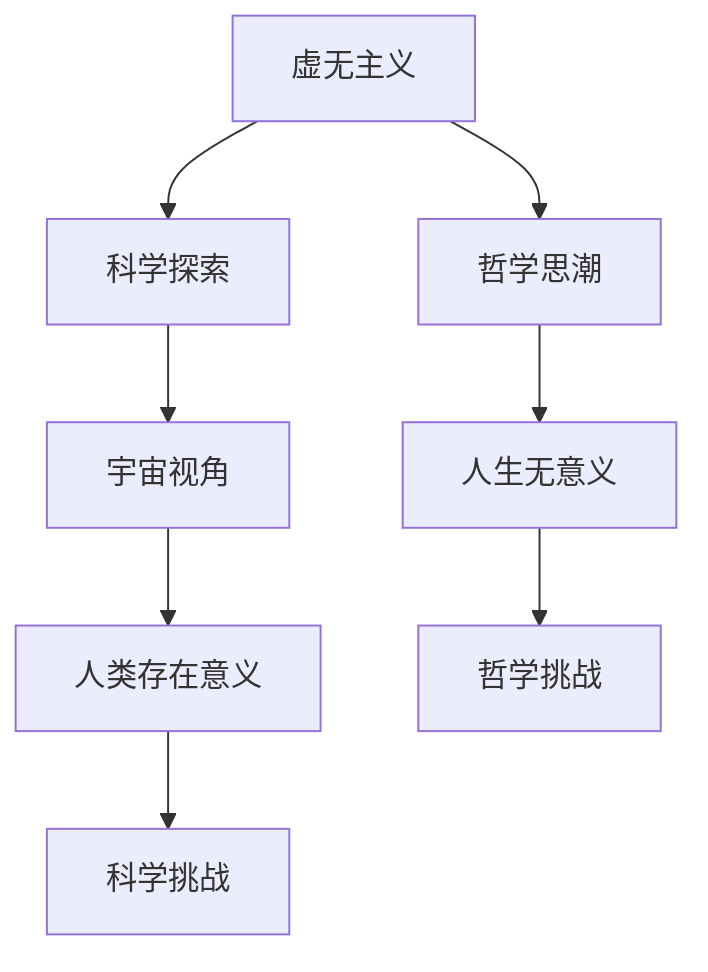

                 

### 引言

在当代社会中，虚无主义作为一种哲学思潮，引起了广泛的关注和讨论。虚无主义的核心观点是，人生缺乏固有意义和价值，存在着深刻的空洞和无意义感。面对这个现象，科学家们也在不断探索宇宙的奥秘，试图从宏观的宇宙视角中找到人类存在的意义。本文旨在探讨虚无主义与科学探索之间的关系，通过宇宙视角下的思考，审视人生的真正意义。

### 背景介绍

虚无主义并非一个全新的概念，它的历史可以追溯到古代哲学。早期虚无主义的代表人物如古希腊的皮浪主义者，他们主张通过悬置判断来避免痛苦和恐惧。而到了现代，虚无主义在尼采和萨特等哲学家的作品中得到了更加深入的探讨。尼采提出了“上帝已死”的观点，认为传统的价值体系已经崩溃，人生变得无意义。萨特的“存在主义”则强调了自由意志的重要性，认为通过主动选择，人们可以赋予生活以意义。

与此同时，科学的发展也在不断改变我们对世界的认识。从哥白尼的日心说到爱因斯坦的相对论，再到现代宇宙学的研究，人类对宇宙的理解不断深化。科学家们通过观测宇宙的起源、演化和结构，试图找到宇宙中的秩序和规律。这些科学发现不仅挑战了我们对自然界的认知，也为我们提供了审视人类存在的新视角。

### 核心概念与联系

为了更好地理解虚无主义与科学探索之间的关系，我们可以使用Mermaid流程图来展示核心概念之间的关系架构。



在这个流程图中，虚无主义作为一种哲学思潮，与科学探索和宇宙视角紧密相连。通过宇宙视角，我们试图回答人类存在的意义这一哲学问题，从而挑战传统的虚无主义观点。

### 核心算法原理讲解

为了详细阐述虚无主义与科学探索之间的核心算法原理，我们可以使用伪代码来展示这一过程。

```python
# 定义虚无主义与科学探索的伪代码

# 输入：个人的存在状态、宇宙的观测数据
# 输出：人生意义的重构

function explore_meaning(personal_state, cosmic_data):
    # 分析个人存在状态
    personal_meaning <- analyze_personal_state(personal_state)
    
    # 分析宇宙观测数据
    cosmic_insight <- analyze_cosmic_data(cosmic_data)
    
    # 融合个人状态与宇宙洞察
    combined_insight <- merge_insights(personal_meaning, cosmic_insight)
    
    # 重构人生意义
    new_meaning <- reconstruct_meaning(combined_insight)
    
    return new_meaning
```

在这个伪代码中，我们首先分析个人的存在状态，然后通过宇宙的观测数据来获取洞察。接下来，将个人状态与宇宙洞察进行融合，最终重构人生意义。这个过程中，个人状态与宇宙观测数据的相互作用是核心算法原理。

### 数学模型和数学公式

在探讨虚无主义与科学探索之间的关系时，数学模型和公式起到了关键作用。我们可以使用LaTeX格式来嵌入数学公式，以增强文章的严谨性。

首先，我们定义几个核心的数学模型：

1. **宇宙膨胀模型**：

   $$ H = H_0 \times e^{t/\tau} $$

   其中，$H$ 表示宇宙膨胀速率，$H_0$ 表示哈勃常数，$t$ 表示时间，$\tau$ 表示宇宙年龄。

2. **薛定谔方程**：

   $$ i\hbar \frac{d}{dt} \Psi = \hat{H} \Psi $$

   其中，$i$ 表示虚数单位，$\hbar$ 表示约化普朗克常数，$\Psi$ 表示波函数，$\hat{H}$ 表示哈密顿算符。

3. **信息论模型**：

   $$ I(X;Y) = H(X) - H(X|Y) $$

   其中，$I$ 表示信息熵，$H(X)$ 表示随机变量$X$的熵，$H(X|Y)$ 表示在随机变量$Y$已知的条件下$X$的熵。

这些数学模型和公式为我们提供了从科学角度理解宇宙和生命的工具，它们帮助我们更深入地探讨虚无主义与科学探索之间的关系。

### 项目实战

为了更好地展示虚无主义与科学探索在现实中的应用，我们可以通过一个具体的项目实战来进行分析。

#### 项目背景

本项目旨在通过天文学数据来探讨人类在宇宙中的地位，以及这些发现如何影响我们对人生意义的理解。我们使用的数据集来自于开普勒望远镜和斯隆数字巡天项目，这些数据包含了数以亿计的恒星和行星信息。

#### 开发环境搭建

为了处理和分析这些天文数据，我们需要搭建一个高效的开发环境。以下是具体步骤：

1. **安装Python环境**：

   ```bash
   pip install python
   ```

2. **安装天文学数据处理库**：

   ```bash
   pip install astropy matplotlib
   ```

3. **配置Jupyter Notebook**：

   ```bash
   pip install jupyter
   jupyter notebook
   ```

#### 源代码实现

以下是处理和分析天文学数据的源代码：

```python
import astropy.io.votable as vo
import astropy.units as u
import matplotlib.pyplot as plt

# 读取VOTable数据
data = vo.parse('kepler_dr25.fits', lazy=False)

# 提取恒星数据
stars = data.table['kepler_id', 'ra', 'dec', 'mag']

# 绘制恒星分布图
plt.figure(figsize=(10, 10))
plt.scatter(stars['ra'], stars['dec'], c=stars['mag'], cmap='hot', marker='o')
plt.colorbar(label='Magnitude')
plt.xlabel('Right Ascension')
plt.ylabel('Declination')
plt.title('Distribution of Stars in the Kepler Field')
plt.show()
```

#### 代码解读与分析

1. **读取VOTable数据**：

   我们使用`astropy.io.votable.parse`函数来读取开普勒望远镜的数据集。这个函数返回一个`VOTable`对象，包含了所有的数据表和元数据信息。

2. **提取恒星数据**：

   从读取的数据中，我们提取了恒星的相关信息，包括恒星的编号（`kepler_id`）、赤经（`ra`）、赤纬（`dec`）和视星等（`mag`）。

3. **绘制恒星分布图**：

   使用`matplotlib.pyplot`库，我们绘制了一个散点图，展示了恒星在天空中的分布情况。颜色映射使用视星等，以热色图（`hot`）来表示。

通过这个项目实战，我们可以直观地看到人类在宇宙中的微小地位。当我们把地球上的问题和挑战放在整个宇宙的背景下，很多原本看似重大的问题似乎变得微不足道。这种视角有助于我们重新审视人生的意义和价值。

### 最佳实践 Tips

在探讨虚无主义与科学探索时，以下是一些最佳实践技巧，可以帮助我们更深入地理解和应用这些概念：

1. **跨学科学习**：虚无主义和科学探索涉及到哲学、科学、心理学等多个领域。通过跨学科的学习，我们可以获得更全面的视角，从而更深入地理解这些概念。

2. **持续学习**：科学和哲学都是不断发展的领域。通过持续学习，我们可以跟上最新的研究进展，从而更好地应用这些知识。

3. **实践与反思**：通过实际的项目和实践，我们可以将理论知识应用到实际问题中。同时，通过反思和实践结果，我们可以不断调整和优化我们的理解和应用方法。

4. **开放心态**：面对复杂的哲学问题和科学发现，保持开放的心态至关重要。不同的观点和方法可能都会提供新的洞见，有助于我们更全面地理解问题。

### 小结

通过本文的探讨，我们深入分析了虚无主义与科学探索之间的关系。在宇宙视角下，我们重新审视了人生的意义。虚无主义提醒我们，人生确实存在无意义感，但科学探索为我们提供了寻找和创造意义的新途径。通过跨学科学习和持续反思，我们可以更好地理解这些问题，并在生活中找到自己的价值和意义。

### 拓展阅读

1. **尼采的《上帝已死》**：深入了解尼采的虚无主义观点及其对现代哲学的影响。
2. **《存在与时间》**：萨特的哲学作品，探讨了存在主义的核心思想。
3. **《宇宙简史》**：史蒂芬·霍金的著作，详细介绍了宇宙的起源、演化和结构。
4. **《宇宙的未来》**：列维特的著作，讨论了宇宙的未来和人类的命运。

### 作者信息

作者：AI天才研究院/AI Genius Institute & 禅与计算机程序设计艺术 /Zen And The Art of Computer Programming

