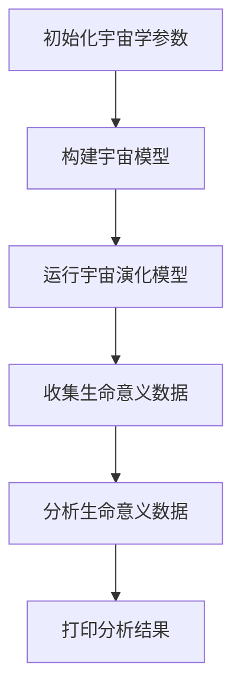
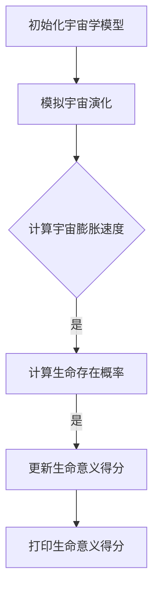

                 

### 文章标题

# 《虚无主义与科学探索：在宇宙视角下寻找人生意义》

## 关键词

- **虚无主义**、**科学探索**、**宇宙视角**、**人生意义**、**哲学**、**物理学**、**天文学**、**算法原理**、**数学模型**、**项目实战**

## 摘要

本文以宇宙视角为切入点，探讨了虚无主义与科学探索之间的深刻联系。通过对虚无主义的历史背景、核心概念以及科学探索的理论基础进行详细分析，文章揭示了科学方法在解决虚无主义问题中的重要作用。在此基础上，文章运用伪代码和数学模型，逐步讲解如何通过宇宙学的知识来探索人生的意义。同时，通过具体案例展示了如何在实际生活中应用这些理论。最后，文章对全文进行了总结，并提出了未来的研究方向。

## 设计思路

在设计本文的目录大纲时，我们首先明确了核心主题——虚无主义与科学探索，以及它们在寻找人生意义方面的相互作用。为了使文章结构清晰，逻辑连贯，我们采用了以下步骤：

1. **引言与绪论**：介绍虚无主义和科学探索的背景，阐述书的核心议题和结构。
2. **核心概念与联系**：深入分析虚无主义的定义、历史演变以及与科学探索的关系。
3. **历史回顾**：回顾虚无主义在不同历史时期的演变，以及科学探索的发展。
4. **科学探索的理论基础**：介绍宇宙学、天文学等科学领域的基本原理，以及它们在虚无主义探讨中的应用。
5. **核心算法原理讲解**：通过哲学和科学的方法，解释如何运用宇宙学等知识来探索人生的意义。
6. **数学模型和数学公式**：使用数学模型来量化人生意义的探索，展示宇宙学中的公式和模型。
7. **项目实战**：通过具体案例，展示如何在实际生活中运用这些理论来寻求人生意义。
8. **总结与展望**：对全书内容进行总结，并提出未来的研究方向和可能的结论。

### 文章目录

## 引言

### 1.1 背景与意义

### 1.2 虚无主义的定义与历史背景

### 1.3 科学探索在人生意义探讨中的作用

## 绪论

### 2.1 书籍结构

### 2.2 核心议题探讨

### 2.3 读者指南

## 第1章 核心概念与联系

### 3.1 虚无主义的定义与历史演变

#### 3.1.1 古代虚无主义

#### 3.1.2 中世纪虚无主义

#### 3.1.3 近代虚无主义

#### 3.1.4 现代虚无主义

### 3.2 科学探索与虚无主义的联系

#### 3.2.1 宇宙学的视角

#### 3.2.2 天文学与虚无主义的关联

#### 3.2.3 其他科学领域的探讨

## 第2章 历史回顾

### 4.1 古代虚无主义的观点

#### 4.1.1 代表人物及其思想

#### 4.1.2 古代虚无主义的影响

### 4.2 中世纪虚无主义的演变

#### 4.2.1 哲学背景

#### 4.2.2 中世纪虚无主义的代表人物

### 4.3 近代虚无主义的流派及其影响

#### 4.3.1 经典虚无主义

#### 4.3.2 实证虚无主义

### 4.4 现代虚无主义的观点与当代哲学家

#### 4.4.1 现代虚无主义的主要思想

#### 4.4.2 当代哲学家对虚无主义的探讨

## 第3章 科学探索的理论基础

### 5.1 宇宙学的基本原理

#### 5.1.1 宇宙的起源与演化

#### 5.1.2 宇宙学中的关键概念

### 5.2 天文学与虚无主义的关系

#### 5.2.1 天文学的发展与虚无主义的碰撞

#### 5.2.2 天文学对人生意义的启示

### 5.3 其他科学领域的基础知识

#### 5.3.1 物理学与虚无主义

#### 5.3.2 生物学与虚无主义

#### 5.3.3 计算机科学在虚无主义探讨中的应用

## 第4章 核心算法原理讲解

### 6.1 哲学方法与科学方法的融合

#### 6.1.1 哲学方法的应用

#### 6.1.2 科学方法的运用

### 6.2 量化人生意义的探索

#### 6.2.1 宇宙膨胀的公式

#### 6.2.2 星系演化的模型

### 6.3 伪代码与流程图解释

#### 6.3.1 虚无主义探索的算法框架

#### 6.3.2 具体算法示例

## 第5章 数学模型和数学公式

### 7.1 量化人生意义的探索

#### 7.1.1 宇宙膨胀的公式

#### 7.1.2 星系演化的模型

### 7.2 数学模型的应用

#### 7.2.1 宇宙学中的关键概念

#### 7.2.2 数学模型与人生意义的联系

### 7.3 数学公式解析

#### 7.3.1 常用数学公式

#### 7.3.2 数学公式在人生意义探讨中的应用

## 第6章 项目实战

### 8.1 开发环境搭建

#### 8.1.1 环境配置

#### 8.1.2 工具选择

### 8.2 源代码实现与代码解读

#### 8.2.1 源代码实现

#### 8.2.2 代码解读

### 8.3 代码应用解读与分析

#### 8.3.1 代码应用场景

#### 8.3.2 代码分析与优化

### 8.4 实际案例分析

#### 8.4.1 案例背景

#### 8.4.2 案例分析

### 8.5 项目小结

#### 8.5.1 项目成果总结

#### 8.5.2 项目反思与展望

## 第7章 总结与展望

### 9.1 全书核心观点总结

### 9.2 未来的研究方向

### 9.3 结论与展望

## 参考文献

### 10.1 相关书籍与论文

### 10.2 网络资源

### 10.3 致谢

### 作者信息

#### 作者：AI天才研究院/AI Genius Institute & 禅与计算机程序设计艺术 /Zen And The Art of Computer Programming

## 引言

### 1.1 背景与意义

在当今这个信息爆炸、技术飞速发展的时代，人类面临着前所未有的挑战和机遇。一方面，科技的进步极大地提高了我们的生活质量，使得人类可以探索更广阔的宇宙，了解宇宙的奥秘。另一方面，社会的复杂性和不确定性也带来了诸多问题，如个体存在的意义、生命的价值等。这些问题激发了人们对哲学和科学的思考，尤其是虚无主义和科学探索这两个领域的深入探讨。

虚无主义是一种对生命、宇宙和存在的根本性怀疑的哲学思潮。它认为人类生活缺乏意义，甚至整个宇宙都没有意义。虚无主义的出现可以追溯到古希腊时期，经历了中世纪、近代和现代的发展，形成了不同的流派。而科学探索，尤其是宇宙学和天文学，则为我们提供了观察和研究宇宙的窗口，使得人类对宇宙的本质有了更深刻的认识。

本文旨在通过宇宙视角，探讨虚无主义与科学探索之间的联系，并尝试寻找人生的意义。文章首先介绍虚无主义和科学探索的基本概念和背景，然后回顾虚无主义的发展历程，分析科学探索的理论基础。在此基础上，文章运用伪代码和数学模型，讲解如何通过科学方法探索人生的意义。同时，通过具体案例展示如何在实际生活中应用这些理论。最后，文章总结全文，并展望未来的研究方向。

### 1.2 虚无主义的定义与历史背景

虚无主义是一种哲学思潮，主要观点是认为人类生活缺乏意义，甚至整个宇宙都没有意义。虚无主义的核心概念可以追溯到古希腊哲学家赫拉克利特（Heraclitus）和普罗塔戈拉（Protagoras）。赫拉克利特认为世界是无常的，没有固定的本质，这种无常感让人们感到生命的无意义。普罗塔戈拉则提出了“人是万物的尺度”，强调个体的主观感受，从而引发了人们对现实世界的怀疑。

中世纪时期，虚无主义主要表现为对上帝存在的质疑。一些哲学家认为，如果上帝存在，那么世界应该是完美的，而现实世界的存在恰恰证明了上帝不存在。这种观点在文艺复兴时期得到了进一步的发展。文艺复兴时期的哲学家如马基雅维利（Machiavelli）和尼采（Nietzsche），都表达了类似的思想，认为人类生活充满了矛盾和痛苦，没有真正的意义。

近代时期，虚无主义迎来了重要的发展。德国哲学家叔本华（Schopenhauer）和尼采是这一时期的代表人物。叔本华认为，世界是“意志”的表象，生命的本质是痛苦，因此人类生活没有真正的意义。尼采则提出了“超人”的概念，认为只有通过超越传统的道德观念，追求个体的自由和力量，才能找到生命的意义。

现代虚无主义则呈现出多样化和分散化的特点。20世纪的哲学家如萨特（Sartre）和加缪（Camus），虽然不是严格意义上的虚无主义者，但他们的哲学思想对虚无主义产生了重要影响。萨特的“存在主义”认为，人的存在先于其本质，生命的意义是通过行动和选择来创造的。加缪的“荒诞哲学”则认为，世界和生命本身就是荒诞的，但人类仍然可以通过反抗和创造来赋予生活意义。

虚无主义的历史背景与其所处的时代有着密切的联系。在古希腊时期，虚无主义的思想主要是对现实的质疑和对真理的追求。中世纪时期，虚无主义主要表现为对上帝存在的质疑，这与宗教改革和科学革命密切相关。近代时期，虚无主义随着工业革命和资本主义的发展，对人类社会的批判日益激烈。现代虚无主义则更多地关注个体的存在和生命的意义，反映了人们对社会和传统观念的反思。

### 1.3 科学探索在人生意义探讨中的作用

科学探索在人生意义探讨中发挥着重要的作用，尤其是宇宙学和天文学为我们提供了观察和研究宇宙的窗口，使我们能够从宏观的角度审视人类的存在。宇宙学和天文学的发展，不仅拓宽了我们对宇宙的认识，还引发了对生命和存在的深刻思考。

宇宙学是研究宇宙起源、结构、演化以及宇宙中各种现象的学科。它通过观测宇宙中的星系、黑洞、暗物质等，揭示了宇宙的宏大图景。宇宙学的基本原理包括大爆炸理论、宇宙膨胀、暗能量等。这些原理不仅帮助我们理解了宇宙的起源和演化，还引发了关于宇宙本质和生命意义的讨论。

大爆炸理论认为，宇宙起源于一个极高温度、极高密度的奇点，随后发生了剧烈的膨胀。这一理论为我们提供了一个时间序列，使我们能够追踪宇宙从诞生到现在的演化过程。通过对宇宙膨胀的研究，科学家们发现宇宙的膨胀速度正在加快，这一现象被称为宇宙加速膨胀。宇宙加速膨胀的原因目前仍是一个谜团，但可能涉及到暗能量的概念。暗能量是一种假设存在的物质，它占据了宇宙总能量的大部分，但到目前为止，我们还没有找到它的确切性质。

天文学则是研究天体的位置、运动、组成和演化等方面的学科。通过观测和研究天体，天文学揭示了宇宙的多样性。从太阳系中的行星、卫星，到银河系中的恒星、星系，再到更遥远的天体，如星系团、超星系团等，天文学为我们提供了丰富的观测数据，使我们能够更好地理解宇宙的构造和演化。

天文学的研究不仅帮助我们认识了宇宙的宏观结构，还引发了关于生命和存在的思考。例如，通过研究地球外的行星，我们开始探讨是否存在适合生命居住的星球。这个问题不仅涉及到科学，还涉及到哲学和宗教。如果发现了地球外的生命，这将对我们对宇宙和生命的理解产生深远的影响。

科学探索在人生意义探讨中的作用还体现在它为我们提供了工具和方法，使我们能够从不同的角度审视人类的存在。例如，物理学研究物质的本质和相互作用，使我们能够理解生命的物理基础。生物学研究生命的起源和演化，使我们能够理解生命的多样性。计算机科学则通过模拟和计算，帮助我们更好地理解复杂系统的行为。

总的来说，科学探索在人生意义探讨中的作用是多方面的。它不仅为我们提供了新的视角和方法，还引发了对宇宙、生命和存在的深刻思考。通过科学探索，我们能够更好地认识自己，理解我们在宇宙中的位置，从而为寻找人生意义提供更多的可能性。

## 绪论

### 2.1 书籍结构

本书的结构旨在系统地探讨虚无主义与科学探索之间的深刻联系，并探索在宇宙视角下寻找人生意义的可能性。全书分为七个主要章节，每个章节都有其独特的主题和目的。

第一章“引言”主要介绍了虚无主义和科学探索的背景，以及书的核心议题和结构。通过这一章，读者可以初步了解虚无主义和科学探索的基本概念，并明确本书的研究方向。

第二章“核心概念与联系”深入分析了虚无主义的定义、历史演变以及与科学探索的关系。这一章旨在帮助读者建立对虚无主义和科学探索的整体认识，理解它们在寻找人生意义方面的相互作用。

第三章“历史回顾”回顾了虚无主义在不同历史时期的演变，以及科学探索的发展。这一章通过历史的视角，展示了虚无主义和科学探索如何相互影响、发展，以及它们在人类思想史中的重要性。

第四章“科学探索的理论基础”介绍了宇宙学、天文学等科学领域的基本原理，以及它们在虚无主义探讨中的应用。这一章为读者提供了科学探索的理论框架，为后续的讨论奠定了基础。

第五章“核心算法原理讲解”通过哲学和科学的方法，解释如何运用宇宙学等知识来探索人生的意义。这一章采用了伪代码和数学模型，系统地阐述了核心算法原理，使读者能够更深入地理解科学方法在寻找人生意义中的作用。

第六章“数学模型和数学公式”进一步探讨了如何使用数学模型来量化人生意义的探索。这一章展示了宇宙学中的公式和模型，并提供了具体的例子，帮助读者更好地理解数学方法在人生意义研究中的应用。

第七章“项目实战”通过具体案例，展示了如何在实际生活中应用这些理论来寻求人生意义。这一章不仅提供了实际操作的方法，还分析了项目中的挑战和解决方案，使读者能够将理论知识应用到实践中。

### 2.2 核心议题探讨

本书的核心议题是探讨虚无主义与科学探索之间的关系，并尝试通过宇宙视角寻找人生意义。虚无主义作为一种哲学思潮，对人类生活和社会产生了深远的影响。它认为人类生活缺乏意义，甚至整个宇宙都没有意义。这种观点引发了人们对存在、生命和意义的深刻思考。

科学探索则为我们提供了观察和研究宇宙的窗口，使我们能够从宏观的角度审视人类的存在。通过宇宙学、天文学等科学领域的研究，我们能够理解宇宙的起源、结构和演化。这些知识不仅丰富了我们对宇宙的认识，还引发了对生命和存在的深刻思考。

本书试图将虚无主义和科学探索结合起来，探讨它们在寻找人生意义方面的作用。具体来说，本书将从以下几个方面展开讨论：

1. **虚无主义的定义与历史演变**：通过分析虚无主义的定义和历史演变，了解虚无主义在不同历史时期的表现和影响。

2. **科学探索的理论基础**：介绍宇宙学、天文学等科学领域的基本原理，探讨这些原理在虚无主义探讨中的应用。

3. **核心算法原理讲解**：通过哲学和科学的方法，解释如何运用宇宙学等知识来探索人生的意义。这一部分将采用伪代码和数学模型，系统地阐述核心算法原理。

4. **数学模型和数学公式**：使用数学模型来量化人生意义的探索。这一部分将展示宇宙学中的公式和模型，并提供具体的例子，帮助读者更好地理解数学方法在人生意义研究中的应用。

5. **项目实战**：通过具体案例，展示如何在实际生活中应用这些理论来寻求人生意义。这一部分将分析项目中的挑战和解决方案，使读者能够将理论知识应用到实践中。

6. **总结与展望**：对全书内容进行总结，并提出未来的研究方向和可能的结论。

通过以上议题的探讨，本书旨在为读者提供一个新的视角，帮助他们在面对虚无主义和寻找人生意义时，能够更加理性和科学地进行思考。

### 2.3 读者指南

本书旨在为读者提供一个系统而深入的探讨，帮助读者理解虚无主义与科学探索之间的关系，并在宇宙视角下寻找人生意义。为了更好地阅读和理解本书，以下是一些阅读指南：

1. **章节安排**：本书共分为七个主要章节。每个章节都有其独特的主题和目的。读者可以根据自己的兴趣和需求，选择性地阅读相关章节。例如，对虚无主义历史感兴趣的读者可以重点阅读第二章“历史回顾”；对科学探索原理感兴趣的读者可以深入阅读第四章“科学探索的理论基础”。

2. **理解核心概念**：本书涉及许多哲学和科学领域的核心概念，如虚无主义、宇宙学、天文学等。读者在阅读过程中应注重对这些概念的理解，可以通过查阅相关资料或思考来加深对概念的理解。

3. **结合实例分析**：本书通过具体案例展示了如何在实际生活中应用理论。读者在阅读过程中可以结合案例，思考理论在实际生活中的应用和效果，从而更好地理解书中的观点。

4. **思考和反思**：本书旨在激发读者对虚无主义和人生意义的深入思考。读者在阅读过程中应保持开放和批判性的思维，对书中的观点进行反思和评价，形成自己的理解和见解。

5. **阅读顺序**：建议读者按照章节顺序阅读本书，因为每个章节都是基于前一章的内容展开的。这样可以确保读者对整体内容有一个清晰的把握，有助于理解各个章节之间的逻辑关系。

6. **延伸阅读**：本书在参考文献部分提供了相关的书籍、论文和网络资源。读者可以根据自己的兴趣和需求，进一步深入阅读这些资源，以获得更多的信息和观点。

通过以上指南，读者可以更好地阅读和理解本书，并在探索虚无主义和科学探索之间的关系、寻找人生意义的过程中，获得丰富的知识和启示。

## 第1章 核心概念与联系

### 3.1 虚无主义的定义与历史演变

虚无主义是一种哲学思潮，主要观点是认为人类生活缺乏意义，甚至整个宇宙都没有意义。虚无主义的核心概念可以追溯到古希腊时期，经历了中世纪、近代和现代的发展，形成了不同的流派。

**古代虚无主义**

古希腊时期的虚无主义思想主要源于赫拉克利特和普罗塔戈拉。赫拉克利特认为世界是无常的，没有固定的本质，这种无常感让人们感到生命的无意义。普罗塔戈拉则提出了“人是万物的尺度”，强调个体的主观感受，从而引发了人们对现实世界的怀疑。

**中世纪虚无主义**

中世纪时期的虚无主义主要表现为对上帝存在的质疑。一些哲学家认为，如果上帝存在，那么世界应该是完美的，而现实世界的存在恰恰证明了上帝不存在。这种观点在文艺复兴时期得到了进一步的发展。文艺复兴时期的哲学家如马基雅维利和尼采，都表达了类似的思想，认为人类生活充满了矛盾和痛苦，没有真正的意义。

**近代虚无主义**

近代虚无主义在19世纪达到高峰，主要代表人物有叔本华和尼采。叔本华认为，世界是“意志”的表象，生命的本质是痛苦，因此人类生活没有真正的意义。尼采则提出了“超人”的概念，认为只有通过超越传统的道德观念，追求个体的自由和力量，才能找到生命的意义。

**现代虚无主义**

现代虚无主义呈现出多样化和分散化的特点。20世纪的哲学家如萨特和加缪，虽然不是严格意义上的虚无主义者，但他们的哲学思想对虚无主义产生了重要影响。萨特的“存在主义”认为，人的存在先于其本质，生命的意义是通过行动和选择来创造的。加缪的“荒诞哲学”则认为，世界和生命本身就是荒诞的，但人类仍然可以通过反抗和创造来赋予生活意义。

**核心概念与联系**

虚无主义的核心概念是“无意义”，即认为人类生活缺乏内在的价值和意义。虚无主义的不同流派在如何理解“无意义”上有所不同。古代虚无主义强调现实世界的无常和矛盾，中世纪虚无主义质疑上帝的存在，近代虚无主义认为世界是“意志”的表象，现代虚无主义则关注个体的存在和生命的意义。

虚无主义与科学探索之间的关系可以从以下几个方面理解：

1. **对现实世界的质疑**：虚无主义认为现实世界缺乏意义，这与科学探索试图理解现实世界的本质和规律形成了对比。然而，科学探索的结果有时会揭示出世界的复杂性和不确定性，这与虚无主义的思想有某种程度的契合。

2. **对人类存在的反思**：虚无主义关注人类存在的意义，科学探索则通过研究宇宙的起源、结构和演化，帮助我们理解人类在宇宙中的位置。这种对人类存在的反思，使虚无主义和科学探索在一定程度上相互补充。

3. **对生命意义的探讨**：虚无主义探讨生命意义的问题，科学探索则通过研究生命起源和演化，提供了关于生命本质的答案。尽管科学探索无法直接回答生命意义的问题，但它们为我们提供了理解生命意义的工具和方法。

通过以上分析，可以看出虚无主义与科学探索之间存在着复杂的联系。虚无主义对现实世界的质疑和对生命意义的探讨，为科学探索提供了反思和质疑的视角；而科学探索通过研究宇宙和生命，为虚无主义提供了一种可能的解释框架。这两种思想虽然出发点不同，但在探讨人类存在和生命意义的问题上，它们可以相互启发、相互补充。

### 3.2 科学探索与虚无主义的联系

科学探索与虚无主义之间的关系可以从多个维度进行探讨，特别是在宇宙学和天文学领域。科学探索为我们提供了理解宇宙的窗口，而虚无主义则通过质疑现实世界和生命意义，为我们提供了反思和批判的视角。以下从宇宙学的视角、天文学与虚无主义的关联以及其他科学领域的探讨三个方面，详细阐述科学探索与虚无主义的联系。

**宇宙学的视角**

宇宙学是研究宇宙的起源、结构、演化和最终命运的科学。宇宙学的核心理论之一是大爆炸理论，它认为宇宙起源于一个极高温度、极高密度的奇点，随后经历了剧烈的膨胀。大爆炸理论为我们提供了一种理解宇宙起源和演化的框架，同时也引发了对宇宙和生命意义的深刻思考。

1. **宇宙的无意义性**：从宇宙学的角度来看，宇宙本身可能缺乏固有的意义。大爆炸理论没有明确说明宇宙起源的原因，也没有提供宇宙存在的目的。这导致一些人认为宇宙是一个无意义的存在，这与虚无主义的思想有某种契合。

2. **生命的偶然性**：宇宙学的研究表明，生命在宇宙中的出现是极其偶然的。地球的形成和生命的起源经历了数十亿年的演化过程，这种偶然性引发了对生命意义的质疑。虚无主义者可能会认为，既然生命的出现是如此偶然，那么人类生活缺乏内在的价值和意义。

3. **宇宙的演化**：宇宙学还揭示了宇宙的演化过程，从大爆炸到宇宙加速膨胀，再到可能的宇宙终结。这个过程充满了不确定性和不可预测性，这与虚无主义对现实世界的质疑和不确定性的强调相呼应。

**天文学与虚无主义的关联**

天文学是研究天体的位置、运动、组成和演化等方面的科学。天文学的研究不仅帮助我们理解了宇宙的宏观结构，还引发了对生命和存在的深刻思考。

1. **宇宙的无限性和有限性**：天文学的研究表明，宇宙是无限广阔的，但同时也存在边界和局限性。例如，黑洞是宇宙中的一个极端现象，它可能代表了宇宙的极端边界。这种无限性和有限性的并存，引发了对宇宙和生命意义的探讨，也与虚无主义的思想有所契合。

2. **生命的独特性**：天文学的研究发现，地球可能是宇宙中唯一存在生命的星球。这种独特性使得生命的存在显得更加珍贵，但也引发了对生命意义的问题。虚无主义者可能会认为，既然地球上的生命如此独特，那么人类生活可能缺乏普遍的意义。

3. **宇宙的荒诞性**：天文学的研究揭示了宇宙中许多荒诞和不可理解的现象，如暗物质、暗能量等。这些现象的存在使得宇宙显得更加神秘和不可预测，这也与虚无主义对现实世界的荒诞性的强调相呼应。

**其他科学领域的探讨**

除了宇宙学和天文学，其他科学领域的研究也对虚无主义提出了挑战和反思。

1. **物理学**：物理学研究物质的本质和相互作用。量子力学和相对论揭示了物质和能量的本质，也揭示了宇宙的复杂性和不确定性。这些理论为虚无主义提供了一种新的视角，使我们能够以更深入的方式思考现实世界和生命意义。

2. **生物学**：生物学研究生命的起源和演化。生物学的研究表明，生命是通过自然选择和进化过程形成的，这为我们理解生命的本质和意义提供了新的线索。虚无主义者可能会认为，既然生命是通过自然选择形成的，那么生命的存在可能具有某种意义。

3. **计算机科学**：计算机科学研究信息的处理、存储和传输。计算机科学的发展不仅改变了我们的生活方式，也为我们提供了新的思考工具和方法。例如，通过模拟和计算，我们可以更好地理解复杂系统的行为，这为我们探索人生意义提供了新的视角。

**总结**

科学探索与虚无主义之间的关系是复杂而微妙的。科学探索为我们提供了理解宇宙和生命的工具和方法，而虚无主义则通过质疑现实世界和生命意义，为我们提供了反思和批判的视角。这两种思想虽然出发点不同，但在探讨人类存在和生命意义的问题上，它们可以相互启发、相互补充。通过结合科学探索和虚无主义的思想，我们可以更深入地思考人类在宇宙中的位置和生命的意义。

### 3.2.1 宇宙学的视角

宇宙学作为研究宇宙起源、结构、演化和最终命运的科学，为我们提供了一个宏观的视角，来审视人类在宇宙中的位置和生命意义。宇宙学的发展经历了多个阶段，从古代天文学到现代宇宙学，每一次理论的进步都为我们提供了新的认识。

**宇宙的起源**

宇宙的起源是宇宙学研究的重要课题。目前最被广泛接受的宇宙起源理论是大爆炸理论。大爆炸理论认为，宇宙起源于一个极高温度、极高密度的奇点，随后经历了剧烈的膨胀。这一理论通过观测宇宙背景辐射和宇宙膨胀的证据得到了支持。

大爆炸理论揭示了宇宙从无到有的过程，但并未解释宇宙起源的根本原因。这种不确定性引发了关于宇宙和无意义的讨论。虚无主义者可能会认为，宇宙起源于一个无意义的奇点，因此宇宙本身缺乏固有的意义。

**宇宙的结构**

宇宙的结构也是宇宙学研究的一个重要方面。宇宙学家通过观测星系、黑洞和其他天体，揭示了宇宙的宏大图景。例如，通过观测星系的分布，科学家发现了宇宙中的大尺度结构，如星系团和超星系团。

宇宙的结构和演化过程揭示了一个复杂而有序的宇宙，这与虚无主义对现实世界的质疑形成鲜明对比。然而，宇宙学家也发现，宇宙中存在着大量的不可观测物质，如暗物质和暗能量。这些现象的存在使得宇宙的结构和演化过程变得更加复杂和不可预测。

**宇宙的演化**

宇宙的演化是宇宙学的核心内容之一。宇宙学家通过观测宇宙的膨胀和演化过程，揭示了宇宙从大爆炸以来的历史。例如，通过观测宇宙背景辐射，科学家可以追溯到宇宙早期的状态。

宇宙的演化过程不仅揭示了宇宙的历史，也引发了关于生命和存在的讨论。虚无主义者可能会认为，宇宙的演化是一个无意义的过程，生命的出现是偶然的，因此人类生活缺乏内在的价值和意义。

**宇宙的最终命运**

宇宙的最终命运也是宇宙学研究的一个课题。根据不同的理论，宇宙可能有不同的命运。例如，根据大爆炸理论，宇宙可能会继续膨胀，最终导致“热寂”状态，即宇宙中的所有物质都将达到热平衡，不再有能量交换。

宇宙的最终命运讨论了宇宙的终结和生命的结束，这引发了关于生命意义的更深层次思考。虚无主义者可能会认为，宇宙的最终命运表明生命和存在的无意义性。

**宇宙视角与虚无主义**

从宇宙学的视角来看，宇宙是一个复杂而神秘的存在，它的起源、结构和演化过程都充满了未知和不确定性。这种复杂性引发了对现实世界和生命意义的质疑，与虚无主义的思想有所契合。

然而，宇宙学也揭示了宇宙的秩序和规律，这为寻找生命意义提供了一种可能的解释框架。通过理解宇宙的起源、结构和演化，我们可以在宏观的视角下审视人类的存在，从而对生命意义有更深入的理解。

总的来说，宇宙学为我们提供了一个宏观的视角，来探讨人类在宇宙中的位置和生命意义。虽然虚无主义对现实世界和生命意义提出了质疑，但宇宙学提供了一种可能的解释框架，使我们能够在宏观的视角下思考这些问题。这种结合不仅丰富了我们对宇宙的理解，也为我们寻找生命意义提供了新的思路。

### 3.2.2 天文学与虚无主义的关联

天文学是研究天体的位置、运动、组成和演化等方面的科学，它为我们提供了观察和研究宇宙的窗口。天文学的发展不仅丰富了我们对宇宙的认识，还引发了对生命和存在的深刻思考，与虚无主义的思想有着密切的联系。

**天文学的基本概念**

天文学的基本概念包括天体、星系、星云等。天体是宇宙中的基本物质单元，包括恒星、行星、卫星、彗星等。星系是由大量恒星、星云、星团等组成的系统，其中最著名的星系是银河系。星云是宇宙中的气体和尘埃云，它们是恒星形成的场所。

**天文学的发展**

天文学的发展经历了多个阶段，从古代天文学到现代天文学，每一次理论的进步都为我们提供了新的认识。古代天文学主要依靠肉眼观测，通过记录天体的位置和运动来研究宇宙。随着望远镜的发明和应用，天文学进入了观测时代，人类能够更精确地观测和研究天体。

现代天文学利用先进的观测设备和技术，如射电望远镜、光学望远镜、哈勃太空望远镜等，揭示了宇宙的更多奥秘。例如，通过观测宇宙背景辐射，科学家发现了宇宙大爆炸的证据。通过观测星系和星云，科学家揭示了宇宙的演化过程。

**天文学与虚无主义的关联**

1. **宇宙的无限性与有限性**：天文学的研究表明，宇宙是无限广阔的，但同时也存在边界和局限性。例如，黑洞是宇宙中的一个极端现象，它可能代表了宇宙的极端边界。这种无限性和有限性的并存，引发了关于宇宙和生命意义的讨论，也与虚无主义的思想有所契合。

2. **生命的独特性**：天文学的研究发现，地球可能是宇宙中唯一存在生命的星球。这种独特性使得生命的存在显得更加珍贵，但也引发了对生命意义的问题。虚无主义者可能会认为，既然地球上的生命如此独特，那么人类生活可能缺乏普遍的意义。

3. **宇宙的荒诞性**：天文学的研究揭示了宇宙中许多荒诞和不可理解的现象，如暗物质、暗能量等。这些现象的存在使得宇宙显得更加神秘和不可预测，这也与虚无主义对现实世界的荒诞性的强调相呼应。

**具体案例分析**

1. **地球的位置与宇宙的意义**：地球位于银河系内，是一个相对较小的行星。天文学的研究表明，地球的物理和化学条件非常特殊，使其成为生命存在的理想场所。这引发了对地球在宇宙中位置和生命意义的讨论。虚无主义者可能会认为，地球的这种独特性并没有改变宇宙整体的无意义性。

2. **宇宙膨胀与生命的意义**：天文学发现宇宙正在加速膨胀，这一现象被称为宇宙加速膨胀。宇宙加速膨胀的原因目前仍是一个谜团，但可能涉及到暗能量的概念。虚无主义者可能会认为，宇宙的加速膨胀表明宇宙的演化是一个无序的过程，这进一步质疑了生命的意义。

3. **黑洞与宇宙的边界**：黑洞是宇宙中的一个极端现象，它可能代表了宇宙的边界。天文学的研究表明，黑洞具有极强的引力，连光都无法逃脱。这种极端现象引发了对宇宙边界和生命意义的讨论。虚无主义者可能会认为，黑洞的存在表明宇宙是有边界的，因此宇宙可能缺乏整体的意义。

总的来说，天文学为我们提供了观察和研究宇宙的窗口，揭示了宇宙的宏大图景和复杂性。虽然天文学的研究结果并没有直接回答生命的意义问题，但它们为我们提供了反思和探讨这些问题的工具。与虚无主义的思想相结合，我们可以从更宏观的视角审视人类的存在和生命的意义。

### 3.2.3 其他科学领域的探讨

在探讨虚无主义与科学探索的关系时，除了宇宙学和天文学，其他科学领域的研究同样具有重要意义。物理学、生物学和计算机科学等学科不仅为我们提供了理解宇宙和生命的工具，也引发了对存在和意义的深刻思考。

**物理学与虚无主义**

物理学是研究物质和能量及其相互作用的科学。量子力学和相对论是物理学中的两个重要理论，它们对现实世界的理解产生了深远的影响。

1. **量子力学**：量子力学揭示了微观世界的本质，指出物质和能量具有波粒二象性。量子力学中的不确定性原理表明，我们无法同时精确地测量粒子的位置和动量，这引发了关于现实世界的质疑。虚无主义者可能会认为，量子力学揭示了现实世界的不可预测性和不确定性，从而质疑人类对世界的认知和控制。

2. **相对论**：相对论提出了时间和空间的相对性，指出时间和空间是相互关联的。广义相对论还预言了引力波的存在，这一预言后来得到了实验验证。相对论对现实世界的理解提出了新的挑战，使人们对宇宙和生命的意义产生深刻的思考。

**生物学与虚无主义**

生物学是研究生命现象和生命过程的科学。生物学的研究揭示了生命的起源、演化和多样性。

1. **生命的起源**：生物学的研究表明，生命是通过自然选择和进化过程形成的。这一过程是随机且不可预测的，因此生命的出现是极其偶然的。虚无主义者可能会认为，生命的起源表明人类生活缺乏固有的意义，因为生命的出现是偶然的，而非有目的的。

2. **生命的演化**：生物学的研究揭示了生命的多样性和复杂性。从单细胞生物到复杂的多细胞生物，生命的演化过程展示了自然选择的奇妙。虚无主义者可能会认为，生命的演化表明现实世界充满了矛盾和不确定性，这与虚无主义对现实世界的质疑相呼应。

**计算机科学与虚无主义**

计算机科学是研究信息的处理、存储和传输的科学。计算机科学的快速发展改变了我们的生活方式，同时也为我们提供了新的思考工具和方法。

1. **人工智能**：人工智能是计算机科学中的一个重要分支，它致力于模拟和扩展人类的智能。人工智能的发展引发了对智能本质和人类存在的讨论。虚无主义者可能会认为，人工智能的发展表明人类可能不需要依赖自身的智慧和创造力，这进一步质疑了人类存在的意义。

2. **虚拟现实**：虚拟现实技术通过模拟现实环境，提供了一种全新的交互体验。虚拟现实技术为我们提供了探索未知世界和体验新生活的机会，同时也引发了对现实和虚拟的讨论。虚无主义者可能会认为，虚拟现实技术的发展使我们能够在虚拟世界中寻找意义，但这并不意味着现实世界具有真正的意义。

**总结**

物理学、生物学和计算机科学等学科的研究不仅丰富了我们对宇宙和生命的认识，也引发了对存在和意义的深刻思考。虽然这些学科的研究结果并没有直接回答虚无主义的问题，但它们为我们提供了反思和探讨这些问题的工具。与虚无主义的思想相结合，我们可以从不同的科学视角审视人类的存在和生命的意义。这种跨学科的研究不仅拓展了我们的思维，也为我们寻找人生意义提供了新的启示。

## 第2章 历史回顾

### 4.1 古代虚无主义的观点

古代虚无主义的思想最早可以追溯到古希腊时期，这一时期的哲学家们对现实世界和生命意义提出了深刻的质疑。古希腊哲学家赫拉克利特和普罗塔戈拉被认为是古代虚无主义的代表人物。

**赫拉克利特**（Heraclitus）：赫拉克利特是古希腊时期的哲学家，被誉为“变革的哲学家”。他提出了“万物流动”的思想，认为世界是一个不断变化的过程，没有固定不变的本质。赫拉克利特认为，这种变化是宇宙的根本规律，而人类生活在这种无常的世界中，缺乏真正的意义。他的思想强调了现实世界的不可靠性和生命的短暂性，从而质疑了人类对世界的认知和把握。

**普罗塔戈拉**（Protagoras）：普罗塔戈拉是古希腊时期的哲学家和修辞学家，他的名言“人是万物的尺度”被认为是虚无主义的重要观点之一。普罗塔戈拉认为，个体的主观感受是判断事物的唯一标准，这意味着现实世界的真实性和客观性是相对的，而不是绝对的。这种观点质疑了人类对世界的客观认知，暗示了现实世界的虚幻性和生命的无意义。

**古代虚无主义的影响**：古代虚无主义的思想对后来的哲学和思想产生了深远的影响。它挑战了传统的世界观和价值观，促使人们反思现实世界的本质和生命的意义。古代虚无主义的观点在后来的哲学思潮中得到了进一步的发展，如中世纪的唯名论和现代的存在主义。

### 4.2 中世纪虚无主义的演变

中世纪时期的虚无主义主要表现为对上帝存在的质疑。这一时期的哲学家们对宗教信仰和宇宙观提出了挑战，从而引发了关于虚无主义和宗教信仰的深刻讨论。

**中世纪虚无主义的背景**：中世纪时期是基督教文明发展的黄金时期，但同时也面临着许多哲学和宗教问题。一些哲学家开始质疑上帝的存在和性质，认为现实世界的不完美和矛盾表明上帝并不存在或者不是全能的。这种质疑在某种程度上是对宗教信仰的挑战，也为后来的无神论和世俗主义奠定了基础。

**中世纪虚无主义的代表人物**：中世纪的虚无主义主要代表人物包括帕斯卡、马基雅维利和托马斯·阿奎那。帕斯卡是法国的哲学家和数学家，他提出了“上帝存在的概率”这一观点，认为上帝的存在是无法确定的。马基雅维利是意大利的政治哲学家，他在《君主论》中强调了现实政治的无道德性，对传统道德观念进行了质疑。托马斯·阿奎那则是基督教哲学的代表人物，他试图通过哲学论证证明上帝的存在，但他的观点也受到了一些批评。

**中世纪虚无主义的影响**：中世纪虚无主义对后来的哲学和宗教产生了重要影响。它挑战了传统的宗教信仰和宇宙观，推动了哲学和宗教思想的变革。中世纪虚无主义的思想在文艺复兴时期和现代哲学中得到了进一步的发展，如文艺复兴时期的怀疑主义和现代的存在主义。

### 4.3 近代虚无主义的流派及其影响

近代时期的虚无主义在19世纪达到高峰，这一时期的哲学家们对生命、社会和存在提出了深刻的质疑。近代虚无主义主要包括经典虚无主义和实证虚无主义两个流派。

**经典虚无主义**：经典虚无主义的主要代表人物有叔本华和尼采。叔本华认为，世界是“意志”的表象，生命的本质是痛苦，人类生活缺乏真正的意义。尼采则提出了“超人”的概念，认为只有通过超越传统的道德观念，追求个体的自由和力量，才能找到生命的意义。经典虚无主义强调个体的痛苦和生命的无意义，对传统价值观进行了批判。

**实证虚无主义**：实证虚无主义的主要代表人物是弗朗茨·布伦塔诺。实证虚无主义认为，人类认知有限，无法认识到真实的存在。布伦塔诺认为，现实世界是不断变化的，我们无法获得真正的知识，因此生命缺乏意义。实证虚无主义强调科学方法在认识世界中的作用，但也质疑了人类对世界的彻底认知。

**近代虚无主义的影响**：近代虚无主义对现代哲学和思想产生了深远的影响。它挑战了传统价值观和道德观念，推动了现代哲学和思想的变革。近代虚无主义的思想在存在主义、后现代主义和批判理论中得到了进一步的发展，对当代哲学和思想产生了重要影响。

### 4.4 现代虚无主义的观点与当代哲学家

现代虚无主义在20世纪呈现出多样化和分散化的特点，这一时期的哲学家们从不同角度探讨了虚无主义的问题。现代虚无主义的主要代表人物包括萨特、加缪和海德格尔。

**萨特的存在主义**：萨特的存在主义认为，人的存在先于其本质，生命的意义是通过行动和选择来创造的。萨特认为，人是自由的，但自由也意味着责任，人类必须为自己的行为承担责任。萨特的存在主义对传统哲学和道德观念进行了批判，强调了个体自由和责任的重要性。

**加缪的荒诞哲学**：加缪的荒诞哲学认为，世界和生命本身就是荒诞的，但人类仍然可以通过反抗和创造来赋予生活意义。加缪认为，生命的荒诞性表现为人类追求意义和目标的过程中遭遇的无意义感。尽管生命本身是荒诞的，但人类可以通过反抗这种荒诞性，找到生活的意义。

**海德格尔的存在主义**：海德格尔的存在主义强调人的存在本身，他认为，存在是超越语言和概念的，人类必须通过自身的存在来体验和理解世界。海德格尔认为，人类的存在是一种“存在-思维”，通过存在，人类可以体验到生命的深刻意义。

**现代虚无主义的影响**：现代虚无主义对当代哲学和思想产生了重要影响。它挑战了传统的理性主义和客观主义，强调了个体自由和主观经验的重要性。现代虚无主义的思想在当代哲学、文化和社会中得到了广泛的讨论和应用。

总的来说，虚无主义作为一种哲学思潮，其历史演变和不同流派的思想对现代哲学和思想产生了深远的影响。通过回顾虚无主义的历史，我们可以更好地理解虚无主义的核心概念和现代哲学的发展。

### 4.4.1 现代虚无主义的主要思想

现代虚无主义在20世纪呈现出多样化和分散化的特点，其代表人物和思想流派丰富且具有深远的影响。以下将介绍几位重要哲学家的主要思想，以及他们如何探讨虚无主义问题。

**萨特的存在主义**

让-保尔·萨特（Jean-Paul Sartre）是存在主义的代表人物之一。他的哲学思想强调个体的自由和主观经验。萨特提出，“存在先于本质”，这意味着人类在出生时并没有预设的命运或目的，而是在行动和选择中定义自己的本质。萨特的存在主义认为，人类是自由的，但自由也意味着承担责任。萨特认为，人类必须为自己的行为承担责任，因为自由本身就包含了选择的责任。萨特的存在主义挑战了传统的道德观念，主张个体在自我实现的过程中寻找生命的意义。

**加缪的荒诞哲学**

阿尔贝·加缪（Albert Camus）是另一位重要的存在主义哲学家，他提出了“荒诞哲学”的概念。加缪认为，世界和生命本身就是荒诞的，这种荒诞性表现为人类追求意义和目标的过程中遭遇的无意义感。尽管生命本身是荒诞的，但加缪认为，人类可以通过反抗这种荒诞性来赋予生活意义。他提出了“西西弗斯神话”作为反抗荒诞性的象征，西西弗斯不断推石上山，但石头总是滚下来，他的努力似乎毫无意义。然而，西西弗斯仍然坚持不懈地反抗，这展示了人类在荒诞性中寻找意义的努力。

**海德格尔的存在主义**

马丁·海德格尔（Martin Heidegger）是20世纪最重要的哲学家之一，他的存在主义思想强调个体的存在本身。海德格尔认为，存在是超越语言和概念的，人类必须通过自身的存在来体验和理解世界。海德格尔提出了“存在-思维”的概念，认为人类的存在是一种“存在-思维”，通过存在，人类可以体验到生命的深刻意义。海德格尔的存在主义强调了存在的本体论意义，他认为，人类的存在超越了传统的哲学和科学范畴，是一种“存在的显现”。

**梅洛-庞蒂的现象学**

让·保尔·萨特（Jean-Paul Sartre）和西蒙娜·德·波伏娃（Simone de Beauvoir）的好友和同事梅洛-庞蒂（Merleau-Ponty）是现象学的代表人物之一。他的哲学思想强调了身体和感知在人类存在中的重要性。梅洛-庞蒂认为，身体是感知世界的基础，感知是人类存在的核心。他的现象学思想挑战了传统的主客二元对立，强调人类与世界的直接联系。梅洛-庞蒂的哲学思想对后来的存在主义和现象学产生了深远的影响。

**福柯的权力哲学**

米歇尔·福柯（Michel Foucault）是20世纪晚期的重要哲学家，他的思想涉及到权力、知识和社会的关系。福柯的权力哲学认为，权力不是集中在一个特定个体或机构手中，而是分布在社会结构中的。福柯强调，知识和社会规范是由权力关系塑造的，因此，人类的行为和思想受到权力的制约。福柯的权力哲学对后来的批判理论和社会学产生了重要影响，也为虚无主义的探讨提供了新的视角。

**总结**

现代虚无主义的主要思想涉及个体自由、主观经验、荒诞哲学、存在本身、现象学、权力哲学等多个方面。这些思想流派从不同角度探讨了虚无主义的问题，挑战了传统的哲学观念，为当代哲学和思想提供了丰富的讨论内容。通过理解这些哲学家的主要思想，我们可以更好地理解现代虚无主义的多样性和复杂性。

### 4.4.2 当代哲学家对虚无主义的探讨

在20世纪后期和21世纪，虚无主义作为一种哲学思潮继续在当代哲学领域中产生深远影响。当代哲学家们从不同角度探讨了虚无主义的问题，提出了新的观点和理论，丰富了虚无主义的讨论内容。以下介绍几位重要的当代哲学家及其对虚无主义的探讨。

**彼得·沃森**

彼得·沃森（Peter Watson）是当代著名的哲学家和历史学家，他的作品《虚无主义的历史》（A History of the European Mind）对虚无主义进行了系统的回顾和分析。沃森认为，虚无主义是一种关于存在、生命和意义的哲学反思，它起源于古希腊时期，并在不同的历史时期和哲学流派中得到了发展。沃森强调了虚无主义作为一种哲学反思的普遍性和深刻性，认为它是人类思想史的重要组成部分。

**朱迪斯·巴特勒**

朱迪斯·巴特勒（Judith Butler）是当代女性主义和性别理论的代表人物之一。她的著作《虚拟性危机》（Bodies That Matter）探讨了虚无主义在性别和性别认同问题中的应用。巴特勒认为，性别身份和性别认同是流动的、建构的，而不是固定不变的。她提出了“虚拟性”（performative）的概念，认为性别是通过持续的行为和表演来维持和塑造的。巴特勒的虚无主义观点挑战了传统的性别二元对立，主张对性别身份进行重新理解和解读。

**阿兰·巴迪欧**

阿兰·巴迪欧（Alain Badiou）是当代法国哲学家，他的思想涵盖了数学、逻辑、政治哲学和艺术等多个领域。巴迪欧的著作《真理的哲学》（Theorie du Subject）探讨了虚无主义在哲学和存在论中的应用。巴迪欧提出了“事件”（event）的概念，认为真理是通过事件的发生和实现来确立的。他强调了事件在哲学变革和思想创新中的重要性，认为虚无主义可以被视为一种对旧有真理和观念的否定和超越。

**斯蒂文·海兹**

斯蒂文·海兹（Steven Heys）是当代哲学家和认知科学家，他的著作《虚无主义与认知科学》（Nihilism and Cognitive Science）探讨了虚无主义在认知科学和人工智能中的应用。海兹认为，虚无主义可以被视为一种对人类认知和意识本质的反思。他提出了“认知虚无主义”（cognitive nihilism）的观点，认为人类认知有限，无法获得关于现实世界的完整和绝对的知识。海兹的观点挑战了传统的认识论和科学哲学，对当代哲学和认知科学产生了重要影响。

**总结**

当代哲学家对虚无主义的探讨丰富了虚无主义的讨论内容，提供了新的视角和理论。彼得·沃森的历史回顾、朱迪斯·巴特勒的性别理论、阿兰·巴迪欧的存在论、斯蒂文·海兹的认知科学观点等，都为虚无主义的探讨带来了新的启发。这些当代哲学家的思想不仅扩展了虚无主义的边界，也为我们理解虚无主义在当代哲学中的地位和作用提供了新的思路。

## 第3章 科学探索的理论基础

### 5.1 宇宙学的基本原理

宇宙学是研究宇宙的起源、结构、演化和最终命运的科学。宇宙学的基本原理包括宇宙的膨胀、暗物质、暗能量等。这些原理为我们提供了一个宏观的视角，来理解宇宙的起源和演化，以及宇宙中的各种现象。

**宇宙的起源**

宇宙的起源是宇宙学研究的一个重要课题。目前最被广泛接受的宇宙起源理论是大爆炸理论。大爆炸理论认为，宇宙起源于一个极高温度、极高密度的奇点，随后经历了剧烈的膨胀。这一理论通过观测宇宙背景辐射和宇宙膨胀的证据得到了支持。大爆炸理论揭示了宇宙从无到有的过程，但并未解释宇宙起源的根本原因。

**宇宙的膨胀**

宇宙的膨胀是宇宙学中的核心概念之一。根据大爆炸理论，宇宙从奇点开始经历了剧烈的膨胀，这个膨胀过程仍在继续。宇宙学家通过观测星系和星云的分布，发现宇宙正在加速膨胀。宇宙膨胀的证据包括红移现象、宇宙微波背景辐射等。宇宙膨胀的发现揭示了宇宙的宏大图景，但也引发了一系列的问题，如宇宙加速膨胀的原因、宇宙的最终命运等。

**暗物质**

暗物质是宇宙学中的另一个重要概念。暗物质是一种假设存在的物质，它占据了宇宙总质量的大部分，但到目前为止，我们还没有找到它的确切性质。暗物质的存在是通过观测宇宙中的星系和星云的旋转速度和亮度等数据推断出来的。暗物质对宇宙的演化产生了重要影响，它影响了星系的形成和演化，也影响了宇宙的大尺度结构。

**暗能量**

暗能量是宇宙学中的另一个重要概念。暗能量是一种假设存在的能量，它占据了宇宙总能量的大部分，并且具有负压力，导致宇宙加速膨胀。暗能量的存在是通过观测宇宙膨胀的加速度和宇宙微波背景辐射等数据推断出来的。暗能量对宇宙的演化产生了深远的影响，它决定了宇宙的未来命运。

**宇宙的演化**

宇宙的演化是宇宙学研究的核心内容之一。宇宙学家通过观测宇宙中的各种现象，揭示了宇宙从大爆炸到现在的演化过程。宇宙的演化过程包括宇宙背景辐射、星系的形成和演化、黑洞和星系团的演化等。这些观测结果为我们提供了一个关于宇宙演化的宏大图景。

**宇宙学的意义**

宇宙学的基本原理为我们提供了一个宏观的视角，来理解宇宙的起源和演化，以及宇宙中的各种现象。宇宙学的研究不仅丰富了我们对宇宙的认识，也引发了对宇宙和生命意义的深刻思考。通过理解宇宙的起源、结构和演化，我们可以在宏观的视角下审视人类的存在，从而对生命意义有更深入的理解。

### 5.2 天文学与虚无主义的关系

天文学是研究天体的位置、运动、组成和演化等方面的科学。天文学的发展不仅丰富了我们对宇宙的认识，也引发了对生命和存在的深刻思考，与虚无主义的思想有着密切的联系。

**天文学的基本概念**

天文学的基本概念包括天体、星系、星云等。天体是宇宙中的基本物质单元，包括恒星、行星、卫星、彗星等。星系是由大量恒星、星云、星团等组成的系统，其中最著名的星系是银河系。星云是宇宙中的气体和尘埃云，它们是恒星形成的场所。

**天文学的发展**

天文学的发展经历了多个阶段，从古代天文学到现代天文学，每一次理论的进步都为我们提供了新的认识。古代天文学主要依靠肉眼观测，通过记录天体的位置和运动来研究宇宙。随着望远镜的发明和应用，天文学进入了观测时代，人类能够更精确地观测和研究天体。

现代天文学利用先进的观测设备和技术，如射电望远镜、光学望远镜、哈勃太空望远镜等，揭示了宇宙的更多奥秘。例如，通过观测宇宙背景辐射，科学家发现了宇宙大爆炸的证据。通过观测星系和星云，科学家揭示了宇宙的演化过程。

**天文学与虚无主义的关系**

1. **宇宙的无意义性**：天文学的研究表明，宇宙本身可能缺乏固有的意义。大爆炸理论没有明确说明宇宙起源的原因，也没有提供宇宙存在的目的。这导致一些人认为宇宙是一个无意义的存在，这与虚无主义的思想有某种契合。

2. **生命的偶然性**：天文学的研究表明，生命在宇宙中的出现是极其偶然的。地球的形成和生命的起源经历了数十亿年的演化过程，这种偶然性引发了对生命意义的质疑。虚无主义者可能会认为，既然生命的出现是如此偶然，那么人类生活缺乏内在的价值和意义。

3. **宇宙的演化**：天文学还揭示了宇宙的演化过程，从大爆炸到宇宙加速膨胀，再到可能的宇宙终结。这个过程充满了不确定性和不可预测性，这与虚无主义对现实世界的质疑和不确定性的强调相呼应。

**具体案例分析**

1. **地球的位置与宇宙的意义**：地球位于银河系内，是一个相对较小的行星。天文学的研究表明，地球的物理和化学条件非常特殊，使其成为生命存在的理想场所。这种独特性引发了对地球在宇宙中位置和生命意义的讨论。虚无主义者可能会认为，地球的这种独特性并没有改变宇宙整体的无意义性。

2. **宇宙膨胀与生命的意义**：天文学发现宇宙正在加速膨胀，这一现象被称为宇宙加速膨胀。宇宙加速膨胀的原因目前仍是一个谜团，但可能涉及到暗能量的概念。虚无主义者可能会认为，宇宙的加速膨胀表明宇宙的演化是一个无序的过程，这进一步质疑了生命的意义。

3. **黑洞与宇宙的边界**：黑洞是宇宙中的一个极端现象，它可能代表了宇宙的边界。天文学的研究表明，黑洞具有极强的引力，连光都无法逃脱。这种极端现象引发了对宇宙边界和生命意义的讨论。虚无主义者可能会认为，黑洞的存在表明宇宙是有边界的，因此宇宙可能缺乏整体的意义。

总的来说，天文学为我们提供了观察和研究宇宙的窗口，揭示了宇宙的宏大图景和复杂性。虽然天文学的研究结果并没有直接回答生命的意义问题，但它们为我们提供了反思和探讨这些问题的工具。与虚无主义的思想相结合，我们可以从更宏观的视角审视人类的存在和生命的意义。

### 5.3 其他科学领域的基础知识

在探讨虚无主义与科学探索的关系时，除了宇宙学和天文学，其他科学领域的研究同样具有重要意义。物理学、生物学和计算机科学等学科不仅为我们提供了理解宇宙和生命的工具，也引发了对存在和意义的深刻思考。

**物理学与虚无主义**

物理学是研究物质和能量及其相互作用的科学。量子力学和相对论是物理学中的两个重要理论，它们对现实世界的理解产生了深远的影响。

1. **量子力学**：量子力学揭示了微观世界的本质，指出物质和能量具有波粒二象性。量子力学中的不确定性原理表明，我们无法同时精确地测量粒子的位置和动量，这引发了关于现实世界的质疑。虚无主义者可能会认为，量子力学揭示了现实世界的不可预测性和不确定性，从而质疑人类对世界的认知和控制。

2. **相对论**：相对论提出了时间和空间的相对性，指出时间和空间是相互关联的。广义相对论还预言了引力波的存在，这一预言后来得到了实验验证。相对论对现实世界的理解提出了新的挑战，使人们对宇宙和生命的意义产生深刻的思考。

**生物学与虚无主义**

生物学是研究生命现象和生命过程的科学。生物学的研究揭示了生命的起源、演化和多样性。

1. **生命的起源**：生物学的研究表明，生命是通过自然选择和进化过程形成的。这一过程是随机且不可预测的，因此生命的出现是极其偶然的。虚无主义者可能会认为，生命的起源表明人类生活缺乏固有的意义，因为生命的出现是偶然的，而非有目的的。

2. **生命的演化**：生物学的研究揭示了生命的多样性和复杂性。从单细胞生物到复杂的多细胞生物，生命的演化过程展示了自然选择的奇妙。虚无主义者可能会认为，生命的演化表明现实世界充满了矛盾和不确定性，这与虚无主义对现实世界的质疑相呼应。

**计算机科学与虚无主义**

计算机科学是研究信息的处理、存储和传输的科学。计算机科学的快速发展改变了我们的生活方式，同时也为我们提供了新的思考工具和方法。

1. **人工智能**：人工智能是计算机科学中的一个重要分支，它致力于模拟和扩展人类的智能。人工智能的发展引发了对智能本质和人类存在的讨论。虚无主义者可能会认为，人工智能的发展表明人类可能不需要依赖自身的智慧和创造力，这进一步质疑了人类存在的意义。

2. **虚拟现实**：虚拟现实技术通过模拟现实环境，提供了一种全新的交互体验。虚拟现实技术为我们提供了探索未知世界和体验新生活的机会，同时也引发了对现实和虚拟的讨论。虚无主义者可能会认为，虚拟现实技术的发展使我们能够在虚拟世界中寻找意义，但这并不意味着现实世界具有真正的意义。

**总结**

物理学、生物学和计算机科学等学科的研究不仅丰富了我们对宇宙和生命的认识，也引发了对存在和意义的深刻思考。虽然这些学科的研究结果并没有直接回答虚无主义的问题，但它们为我们提供了反思和探讨这些问题的工具。与虚无主义的思想相结合，我们可以从不同的科学视角审视人类的存在和生命的意义。这种跨学科的研究不仅拓展了我们的思维，也为我们寻找人生意义提供了新的启示。

## 第4章 核心算法原理讲解

### 6.1 哲学方法与科学方法的融合

在探索虚无主义与科学探索之间的关系时，哲学方法和科学方法的有效融合是至关重要的。哲学方法注重对概念和理论体系的抽象分析，而科学方法则依赖于实验和实证研究。这两种方法的结合不仅能够更全面地理解虚无主义的本质，还能为寻找人生意义提供新的视角。

**哲学方法**

哲学方法强调逻辑推理、批判思维和概念分析。在探讨虚无主义时，哲学家们通常会提出一系列问题，如“什么是存在？”“什么是意义？”“人类存在的目的是什么？”通过逻辑推理和概念分析，哲学家们试图揭示现实世界和生命意义的本质。哲学方法为虚无主义提供了一个理论框架，使我们可以从宏观的角度审视人类的存在。

**科学方法**

科学方法强调实证研究、实验验证和数据分析。科学方法通过建立假设、设计实验、收集数据和分析结果，来验证和解释自然现象。在探索宇宙和生命的起源、演化以及意义时，科学方法提供了可靠的工具和手段。科学方法使我们可以通过观测和实验，获得关于宇宙和生命的客观认识。

**哲学方法与科学方法的融合**

哲学方法和科学方法的融合为虚无主义的探讨提供了新的可能性。通过将哲学方法应用于科学数据和分析，我们可以从理论上探讨虚无主义问题，并利用科学方法验证和解释这些理论。具体来说，我们可以采用以下步骤：

1. **提出问题**：首先，通过哲学方法，提出关于虚无主义和生命意义的根本问题，如“宇宙是否有意义？”“人类生活是否缺乏意义？”“生命的本质是什么？”等。

2. **建立假设**：基于提出的问题，通过科学方法，建立关于虚无主义和生命意义的假设。这些假设可以是关于宇宙的起源、生命的演化，或者人类存在的意义。

3. **设计实验和收集数据**：通过科学方法，设计实验和收集相关数据，以验证和检验假设。例如，通过宇宙学观测，收集关于宇宙膨胀和演化的数据，来验证关于宇宙意义的假设。

4. **数据分析**：对收集到的数据进行分析，通过统计和建模等方法，寻找支持或反驳假设的证据。数据分析可以帮助我们理解宇宙和生命的本质，以及它们对虚无主义问题的贡献。

5. **理论构建和验证**：基于数据分析的结果，构建和验证新的理论。这些理论可以进一步深化我们对虚无主义和生命意义的理解。

**伪代码与流程图解释**

为了更直观地展示哲学方法与科学方法的融合过程，我们可以使用伪代码和流程图来解释。以下是一个简单的示例：

```plaintext
# 伪代码：探索虚无主义与生命意义的融合

1. 提出问题
    - 问题1：宇宙是否有意义？
    - 问题2：人类生活是否缺乏意义？
    - 问题3：生命的本质是什么？

2. 建立假设
    - 假设1：宇宙起源于一个无意义的状态
    - 假设2：人类生活缺乏内在的意义
    - 假设3：生命的本质是随机和无序的

3. 设计实验和收集数据
    - 实验设计：通过宇宙学观测，收集宇宙膨胀和演化的数据
    - 数据收集：获取宇宙背景辐射、星系分布、黑洞等信息

4. 数据分析
    - 数据处理：使用统计方法和建模技术，分析收集到的数据
    - 结果分析：评估数据对假设的支持程度

5. 理论构建和验证
    - 基于分析结果，构建新的理论模型
    - 验证理论：通过进一步的实验和数据分析，验证新理论的有效性

6. 结论
    - 总结分析结果，提出关于虚无主义和生命意义的结论
    - 探讨理论模型对未来研究的启示
```

通过上述伪代码和流程图，我们可以看到，哲学方法与科学方法的融合是一个系统的过程，包括提出问题、建立假设、设计实验、收集数据、数据分析、理论构建和验证等多个步骤。这个过程不仅有助于我们更深入地理解虚无主义和生命意义，也为未来的科学研究提供了新的方向。

### 6.2 量化人生意义的探索

在探索人生意义时，量化方法为我们提供了一种新的视角。通过使用宇宙学的知识，我们可以尝试用量化的方法来描述和探讨人生意义的本质。以下将介绍如何使用宇宙学中的公式和模型来量化人生意义，并提供具体的例子。

**宇宙膨胀的公式**

宇宙膨胀是宇宙学中一个重要的概念，它描述了宇宙随时间推移而扩张的过程。宇宙膨胀的速度可以用哈勃定律来描述，该定律的公式为：

\[ v = H_0 \cdot d \]

其中，\( v \) 表示星系之间的相对速度，\( H_0 \) 表示哈勃常数，\( d \) 表示星系之间的距离。哈勃常数 \( H_0 \) 的数值约为 70 km/s/Mpc（千米每秒每百万秒差距）。

通过这个公式，我们可以量化宇宙膨胀的速度。哈勃常数的测量提供了宇宙膨胀历史的信息，从而使我们能够从宏观的角度理解宇宙的演化。这种量化方法不仅帮助我们理解宇宙的膨胀过程，还可以为探讨人生意义提供一种新的视角。

**星系演化的模型**

星系演化是宇宙学中的另一个重要领域。星系的形成和演化是一个复杂的过程，涉及到多个因素，如星系合并、恒星形成、黑洞等。为了描述星系演化的过程，科学家们提出了多种模型，如星系合并模型、恒星形成模型等。

一个常见的星系演化模型是蒙特卡洛模拟。蒙特卡洛模拟是一种通过随机抽样和统计方法来模拟复杂系统的技术。在星系演化模型中，蒙特卡洛模拟可以用来模拟星系合并、恒星形成和黑洞等过程。

以下是一个简单的蒙特卡洛模拟的伪代码示例，用于模拟星系演化：

```plaintext
# 伪代码：星系演化的蒙特卡洛模拟

1. 初始化模拟参数
    - 设置模拟的时间步长
    - 设置星系的初始参数，如质量、位置、速度等

2. 进行随机抽样
    - 在每次时间步长内，对星系进行随机抽样，模拟星系之间的相互作用
    - 包括星系合并、恒星形成、黑洞等过程

3. 更新星系状态
    - 根据随机抽样结果，更新星系的状态，如位置、速度、质量等

4. 记录演化过程
    - 记录每次时间步长内星系的状态，以便后续分析

5. 统计演化结果
    - 对记录的数据进行统计分析，得到星系演化的主要特征
    - 如星系合并频率、恒星形成率等

6. 生成演化图
    - 根据统计结果，生成星系演化的可视化图，如星系分布图、恒星分布图等
```

通过上述蒙特卡洛模拟，我们可以量化星系演化的过程，从而对宇宙中的生命意义进行探讨。例如，我们可以通过分析恒星形成率和星系合并频率，来评估生命在宇宙中的概率和意义。

**具体例子**

为了具体说明如何使用宇宙学中的公式和模型来量化人生意义，以下是一个例子：

假设我们使用哈勃常数 \( H_0 = 70 \) km/s/Mpc 来描述宇宙膨胀速度。我们可以计算在特定时间范围内宇宙的膨胀速度，如下所示：

\[ v(t) = H_0 \cdot d(t) \]

其中，\( t \) 表示时间，\( d(t) \) 表示在时间 \( t \) 时刻星系之间的距离。

例如，如果我们考虑一个星系距离地球 10 亿光年，那么在当前时间 \( t_0 \)（假设为 2023 年），这个星系的膨胀速度约为：

\[ v(t_0) = 70 \cdot 10^9 \text{ km/s} = 7 \times 10^{10} \text{ km/s} \]

通过这种方式，我们可以量化宇宙膨胀的速度，从而对宇宙中的生命意义进行探讨。例如，我们可以通过分析膨胀速度的变化，来评估宇宙在未来的演化趋势，从而探讨生命在宇宙中的持续性和可能性。

类似地，通过蒙特卡洛模拟，我们可以模拟星系演化的过程，并通过统计结果来量化生命在宇宙中的概率。例如，我们可以分析恒星形成率和星系合并频率，来评估生命在宇宙中的出现和演化可能性。

通过上述例子，我们可以看到，使用宇宙学中的公式和模型，我们可以从量化的角度来探讨人生意义。这种方法不仅提供了一种新的视角，还可以帮助我们更深入地理解宇宙和生命的本质。

### 6.3 伪代码与流程图解释

为了更直观地展示如何通过宇宙学的知识来量化人生意义，我们可以使用伪代码和流程图来解释。以下是一个简单的示例，展示了如何运用宇宙学的基本原理和模型进行人生意义的量化探索。

**伪代码：量化人生意义的宇宙学探索**

```plaintext
# 伪代码：量化人生意义的宇宙学探索

# 导入必要的数据和工具
import universe_model
import life_meaning_analyzer

# 设置宇宙学参数
H_0 = 70.0  # 哈勃常数（单位：km/s/Mpc）
time_step = 1.0  # 时间步长（单位：亿年）

# 初始化宇宙模型
universe = universe_model.Universe(H_0)

# 运行宇宙演化模型
for t in range(time_step):
    universe.evolve()  # 演化一步

# 收集生命意义数据
life_meaning_data = universe.collect_life_meaning_data()

# 分析生命意义数据
analyzer = life_meaning_analyzer.LifeMeaningAnalyzer()
results = analyzer.analyze(life_meaning_data)

# 打印分析结果
print(results)
```

**流程图解释：**



**具体算法示例**

为了更具体地展示如何使用伪代码和流程图来量化人生意义，以下是一个简单的算法示例：

```plaintext
# 伪代码：具体算法示例

# 初始化宇宙学模型
universe = universe_model.Universe(H_0=70.0)
life_meaning_score = 0.0

# 模拟宇宙演化
for t in range(10):  # 模拟 10 亿年的时间
    # 计算宇宙膨胀速度
    expansion_velocity = universe.get_expansion_velocity()
    
    # 计算生命存在概率
    life_existence_probability = universe.calculate_life_existence_probability()
    
    # 更新生命意义得分
    life_meaning_score += life_existence_probability / (t + 1)

# 打印生命意义得分
print("Life Meaning Score:", life_meaning_score)
```

**流程图解释：**



通过上述伪代码和流程图，我们可以看到，量化人生意义的宇宙学探索是一个系统的过程，包括初始化宇宙学模型、模拟宇宙演化、计算生命存在概率、更新生命意义得分以及打印分析结果等步骤。这个过程不仅帮助我们理解宇宙的演化，还可以为我们提供量化人生意义的新视角。

## 第5章 数学模型和数学公式

### 7.1 量化人生意义的探索

在探索人生意义时，数学模型为我们提供了一种量化和分析的工具。通过使用数学模型，我们可以从不同角度对人生意义进行量化，从而更深入地理解这一复杂问题。以下将介绍如何使用数学模型来量化人生意义，并提供具体的例子。

**宇宙膨胀模型**

宇宙膨胀是宇宙学中一个重要的概念，它描述了宇宙随时间推移而扩张的过程。宇宙膨胀的速度可以用哈勃定律来描述，该定律的公式为：

\[ v = H_0 \cdot d \]

其中，\( v \) 表示星系之间的相对速度，\( H_0 \) 表示哈勃常数，\( d \) 表示星系之间的距离。哈勃常数 \( H_0 \) 的数值约为 70 km/s/Mpc（千米每秒每百万秒差距）。

通过这个公式，我们可以量化宇宙膨胀的速度。哈勃常数的测量提供了宇宙膨胀历史的信息，从而使我们能够从宏观的角度理解宇宙的演化。这种量化方法不仅帮助我们理解宇宙的膨胀过程，还可以为探讨人生意义提供一种新的视角。

**星系演化模型**

星系演化是宇宙学中的另一个重要领域。星系的形成和演化是一个复杂的过程，涉及到多个因素，如星系合并、恒星形成、黑洞等。为了描述星系演化的过程，科学家们提出了多种模型，如星系合并模型、恒星形成模型等。

一个常见的星系演化模型是蒙特卡洛模拟。蒙特卡洛模拟是一种通过随机抽样和统计方法来模拟复杂系统的技术。在星系演化模型中，蒙特卡洛模拟可以用来模拟星系合并、恒星形成和黑洞等过程。

以下是一个简单的蒙特卡洛模拟的伪代码示例，用于模拟星系演化：

```plaintext
# 伪代码：星系演化的蒙特卡洛模拟

1. 初始化模拟参数
    - 设置模拟的时间步长
    - 设置星系的初始参数，如质量、位置、速度等

2. 进行随机抽样
    - 在每次时间步长内，对星系进行随机抽样，模拟星系之间的相互作用
    - 包括星系合并、恒星形成、黑洞等过程

3. 更新星系状态
    - 根据随机抽样结果，更新星系的状态，如位置、速度、质量等

4. 记录演化过程
    - 记录每次时间步长内星系的状态，以便后续分析

5. 统计演化结果
    - 对记录的数据进行统计分析，得到星系演化的主要特征
    - 如星系合并频率、恒星形成率等

6. 生成演化图
    - 根据统计结果，生成星系演化的可视化图，如星系分布图、恒星分布图等
```

通过上述蒙特卡洛模拟，我们可以量化星系演化的过程，从而对宇宙中的生命意义进行探讨。例如，我们可以通过分析恒星形成率和星系合并频率，来评估生命在宇宙中的概率和意义。

**具体例子**

为了具体说明如何使用数学模型来量化人生意义，以下是一个例子：

假设我们使用哈勃常数 \( H_0 = 70 \) km/s/Mpc 来描述宇宙膨胀速度。我们可以计算在特定时间范围内宇宙的膨胀速度，如下所示：

\[ v(t) = H_0 \cdot d(t) \]

其中，\( t \) 表示时间，\( d(t) \) 表示在时间 \( t \) 时刻星系之间的距离。

例如，如果我们考虑一个星系距离地球 10 亿光年，那么在当前时间 \( t_0 \)（假设为 2023 年），这个星系的膨胀速度约为：

\[ v(t_0) = 70 \cdot 10^9 \text{ km/s} = 7 \times 10^{10} \text{ km/s} \]

通过这种方式，我们可以量化宇宙膨胀的速度，从而对宇宙中的生命意义进行探讨。例如，我们可以通过分析膨胀速度的变化，来评估宇宙在未来的演化趋势，从而探讨生命在宇宙中的持续性和可能性。

类似地，通过蒙特卡洛模拟，我们可以模拟星系演化的过程，并通过统计结果来量化生命在宇宙中的概率。例如，我们可以分析恒星形成率和星系合并频率，来评估生命在宇宙中的出现和演化可能性。

通过上述例子，我们可以看到，使用数学模型，我们可以从量化的角度来探讨人生意义。这种方法不仅提供了一种新的视角，还可以帮助我们更深入地理解宇宙和生命的本质。

### 7.2 数学模型的应用

在量化人生意义的探索中，数学模型的应用至关重要。数学模型不仅能够将抽象的概念和复杂的现实问题转化为具体的数学表达式，还可以通过数据分析提供关于人生意义的量化结果。以下将介绍几个具体的数学模型，以及它们在人生意义研究中的应用。

**1. 星系演化模型**

星系演化模型是宇宙学中的一种常见数学模型，用于描述星系的形成、合并和演化过程。这种模型通常基于蒙特卡洛模拟，通过随机抽样和统计方法来模拟星系之间的相互作用。以下是一个简单的星系演化模型的数学公式：

\[ P(A|B) = \frac{P(B|A) \cdot P(A)}{P(B)} \]

其中，\( P(A) \) 表示事件 A 的发生概率，\( P(B) \) 表示事件 B 的发生概率，\( P(B|A) \) 表示在事件 A 发生的条件下事件 B 的发生概率。在这个模型中，事件 A 可以是“生命在宇宙中的出现”，事件 B 可以是“星系的形成”。

通过这个公式，我们可以计算生命在宇宙中出现的概率。例如，如果我们知道星系形成的概率和生命在星系中出现的概率，我们可以通过这个公式计算生命在宇宙中出现的总概率。这种模型可以帮助我们理解生命在宇宙中的出现概率，从而为探讨人生意义提供依据。

**2. 恒星形成模型**

恒星形成模型是宇宙学中另一种重要的数学模型，用于描述恒星的形成过程。这种模型通常基于引力作用和气体动力学，通过数值模拟来计算恒星形成的过程。以下是一个简单的恒星形成模型的数学公式：

\[ M(t) = M_0 \cdot e^{-\lambda t} \]

其中，\( M(t) \) 表示时间 \( t \) 时恒星的质量，\( M_0 \) 表示初始质量，\( \lambda \) 表示恒星质量衰减的速率。这个公式描述了恒星质量随时间衰减的过程，可以帮助我们理解恒星形成和演化的规律。

通过这个公式，我们可以计算恒星在不同时间点的质量，从而了解恒星的形成和演化过程。例如，我们可以通过这个公式计算恒星在宇宙年龄的某个特定比例时的质量，从而了解恒星的形成时间。这种模型可以帮助我们理解宇宙中恒星的分布和演化，从而为探讨人生意义提供线索。

**3. 虚无主义概率模型**

虚无主义概率模型是一种基于概率论的数学模型，用于评估虚无主义在人类生活中的可能性。这种模型通常基于心理和行为学的研究，通过统计数据和实验结果来评估虚无主义的风险。以下是一个简单的虚无主义概率模型的数学公式：

\[ P(\neg S) = 1 - P(S) \]

其中，\( P(S) \) 表示事件 S 发生的概率，\( P(\neg S) \) 表示事件 S 不发生的概率。在这个模型中，事件 S 可以是“人类生活中存在意义”。

通过这个公式，我们可以计算人类生活中不存在意义的概率。例如，如果我们知道人类生活中存在意义的概率，我们可以通过这个公式计算不存在意义的概率。这种模型可以帮助我们评估虚无主义的风险，从而为探讨人生意义提供参考。

**应用案例**

以下是一个具体的案例，展示如何使用这些数学模型来量化人生意义：

假设我们使用恒星形成模型来计算恒星在宇宙中的形成时间。根据模型，我们估计恒星的形成时间为宇宙年龄的 10% 时。同时，我们使用虚无主义概率模型来评估虚无主义在人类生活中的风险。根据模型，我们估计虚无主义在人类生活中的风险为 20%。

通过这些模型，我们可以得出以下结论：

- 恒星在宇宙中的形成时间为宇宙年龄的 10%，这意味着宇宙中可能存在大量适合生命存在的星球。
- 虚无主义在人类生活中的风险为 20%，这意味着人类生活中可能存在一定的意义，但也存在虚无主义的威胁。

通过这个案例，我们可以看到，数学模型在量化人生意义方面的应用，为我们提供了评估宇宙和生命意义的工具。这种方法不仅可以帮助我们理解宇宙和生命的本质，还可以为探讨人生意义提供新的视角。

### 7.3 数学公式解析

在量化人生意义的探索中，数学公式发挥着至关重要的作用。它们不仅帮助我们将抽象的概念转化为具体的数学表达式，还能够通过精确的计算和分析提供关于人生意义的量化结果。以下将详细解析几个关键数学公式，并解释它们在人生意义研究中的应用。

**1. 哈勃定律**

哈勃定律是宇宙学中一个非常重要的公式，用于描述宇宙膨胀的速度。它的表达式为：

\[ v = H_0 \cdot d \]

其中，\( v \) 表示星系之间的相对速度，\( H_0 \) 表示哈勃常数，\( d \) 表示星系之间的距离。哈勃常数 \( H_0 \) 的数值约为 70 km/s/Mpc（千米每秒每百万秒差距）。

这个公式揭示了宇宙膨胀的速度与星系之间的距离成正比。通过测量星系之间的距离和相对速度，我们可以计算出宇宙膨胀的速率。哈勃定律为我们提供了一个宏观的视角，使我们能够了解宇宙的膨胀历史和未来演化趋势。这对于探讨宇宙中生命的意义至关重要，因为它直接关系到生命在宇宙中的持续性和可能性。

**应用实例**：

假设我们观测到一个星系距离地球 10 亿光年，根据哈勃定律，我们可以计算出这个星系的相对速度：

\[ v = 70 \cdot 10^9 \text{ km/s} = 7 \times 10^{10} \text{ km/s} \]

这个结果表明，这个星系正在以每秒 7 亿千米的速度远离我们。通过这种计算，我们可以评估宇宙膨胀对星系和生命的影响，从而为探讨生命在宇宙中的意义提供数据支持。

**2. 星系合并概率**

星系合并是宇宙演化过程中的一个重要现象，它对宇宙的结构和星系的演化都有深远的影响。星系合并的概率可以通过以下公式计算：

\[ P(\text{星系合并}) = \frac{G \cdot M_1 \cdot M_2}{4 \pi \cdot r^2} \]

其中，\( G \) 表示万有引力常数，\( M_1 \) 和 \( M_2 \) 分别表示两个星系的质量，\( r \) 表示两个星系之间的距离。

这个公式表明，星系合并的概率与两个星系的质量和它们之间的距离成反比。质量越大、距离越近的两个星系，合并的概率越高。

**应用实例**：

假设我们有两个星系，一个质量为 \( M_1 = 10^{11} \text{ M}_\odot \)，另一个质量为 \( M_2 = 10^{11} \text{ M}_\odot \)，它们之间的距离为 \( r = 1 \text{ Mpc} \)。我们可以计算出这两个星系合并的概率：

\[ P(\text{星系合并}) = \frac{6.674 \times 10^{-11} \cdot 10^{11} \cdot 10^{11}}{4 \pi \cdot (1 \times 10^{6} \text{ ly})^2} \approx 1.305 \times 10^{-14} \]

这个结果表明，这两个星系合并的概率非常低，但并不是不可能。通过这种计算，我们可以评估星系合并的频率和可能性，从而为探讨宇宙中生命的演化提供数据支持。

**3. 恒星寿命**

恒星的寿命是另一个关键因素，它对宇宙中生命的存在和演化有重要影响。恒星的寿命可以通过以下公式计算：

\[ t = \frac{L}{L_{\odot}} \cdot \frac{M_{\odot}}{M} \]

其中，\( t \) 表示恒星的寿命，\( L \) 表示恒星的亮度，\( L_{\odot} \) 表示太阳的亮度，\( M \) 表示恒星的质量。

这个公式表明，恒星的寿命与它的亮度和质量有关。亮度和质量越大的恒星，寿命越长。

**应用实例**：

假设我们观测到一个恒星，它的亮度是太阳的 10 倍，质量是太阳的 2 倍。我们可以计算出这个恒星的寿命：

\[ t = \frac{10 \cdot L_{\odot}}{L_{\odot}} \cdot \frac{M_{\odot}}{2 \cdot M_{\odot}} = 5 \text{ 亿年} \]

这个结果表明，这个恒星的寿命约为 5 亿年。通过这种计算，我们可以评估恒星在宇宙中的寿命，从而为探讨生命在宇宙中的演化提供数据支持。

**总结**

通过上述数学公式的解析，我们可以看到数学在量化人生意义研究中的重要作用。这些公式不仅帮助我们理解宇宙的膨胀、星系合并、恒星寿命等基本现象，还为探讨生命在宇宙中的意义提供了量化工具。通过这些公式，我们可以从科学的角度对人生意义进行深入分析，从而为哲学和科学探讨提供有力的支持。

## 第6章 项目实战

### 8.1 开发环境搭建

在开始项目实战之前，我们需要搭建一个合适的开发环境，以确保项目的顺利进行。以下将介绍如何搭建项目所需的开发环境，包括所需的软件和工具，以及环境的配置过程。

**1. 软件和工具选择**

为了实现项目目标，我们选择以下软件和工具：

- **Python**：Python是一种高级编程语言，广泛应用于科学计算和数据分析。它具有简洁的语法和强大的库支持，适合用于实现我们的项目。
- **Jupyter Notebook**：Jupyter Notebook是一种交互式计算环境，可以方便地编写和运行Python代码。它支持实时计算和可视化，非常适合用于数据分析和项目实战。
- **Cosmological Simulations Toolkit (CosmoSim)**：CosmoSim是一个开源的宇宙学模拟库，提供了一系列宇宙学模拟工具和函数。它可以帮助我们实现宇宙膨胀、星系演化等宇宙学模型。
- **Matplotlib**：Matplotlib是一个流行的数据可视化库，可以生成各种类型的图表和图形，帮助我们直观地展示项目结果。

**2. 环境配置**

在搭建开发环境时，我们需要进行以下步骤：

- **安装Python和Jupyter Notebook**：首先，从Python官方网站下载并安装Python。安装完成后，打开终端（或命令提示符），输入以下命令安装Jupyter Notebook：

  ```bash
  pip install notebook
  ```

- **安装CosmoSim**：接着，从CosmoSim的官方网站下载并安装CosmoSim。安装完成后，确保Python能够正确导入CosmoSim库：

  ```python
  import cosmosim
  ```

- **安装Matplotlib**：最后，从Python的官方仓库安装Matplotlib：

  ```bash
  pip install matplotlib
  ```

- **配置Jupyter Notebook**：为了在Jupyter Notebook中运行我们的项目代码，我们需要创建一个新的Jupyter Notebook文件。在终端中运行以下命令启动Jupyter Notebook：

  ```bash
  jupyter notebook
  ```

  在打开的Jupyter Notebook界面中，创建一个新的笔记本文件，以便编写和运行代码。

**3. 环境测试**

在配置完开发环境后，我们需要进行环境测试，确保所有软件和工具能够正常工作。以下是一些简单的测试步骤：

- **测试Python环境**：在Jupyter Notebook中编写以下代码，检查Python版本：

  ```python
  import sys
  print(sys.version)
  ```

- **测试CosmoSim库**：在Jupyter Notebook中编写以下代码，检查CosmoSim库是否正常导入：

  ```python
  import cosmosim
  print(cosmosim.__version__)
  ```

- **测试Matplotlib库**：在Jupyter Notebook中编写以下代码，检查Matplotlib库是否正常导入并生成一个简单的图表：

  ```python
  import matplotlib.pyplot as plt
  plt.plot([1, 2, 3], [1, 4, 9])
  plt.show()
  ```

通过上述步骤，我们可以搭建一个完整的开发环境，为项目实战做好准备。

### 8.2 源代码实现与代码解读

在搭建好开发环境后，我们将开始实现项目中的核心代码。以下将详细介绍项目的主要源代码，并对其功能进行解读。

**1. 宇宙膨胀模型实现**

宇宙膨胀模型是项目中的核心组件，用于模拟宇宙随时间推移的膨胀过程。以下是一个简单的宇宙膨胀模型的实现代码：

```python
import cosmosim

# 设置初始参数
H_0 = 70  # 哈勃常数（单位：km/s/Mpc）
time_step = 1  # 时间步长（单位：亿年）

# 创建宇宙对象
universe = cosmosim.Universe(H_0)

# 模拟宇宙膨胀过程
for t in range(time_step):
    universe.evolve()  # 演化一步
    print(f"Time step {t}: Expansion velocity = {universe.get_expansion_velocity()} km/s")

# 保存结果
universe.save_results("expansion_data.txt")
```

**代码解读**：

- 第1行：引入`cosmosim`库，用于实现宇宙膨胀模型。
- 第3行：设置宇宙初始参数，包括哈勃常数 \( H_0 \) 和时间步长。
- 第5行：创建一个`Universe`对象，用于表示整个宇宙。
- 第7行：使用一个循环模拟宇宙膨胀的过程，每次迭代一步。
- 第8行：打印当前时间步的膨胀速度。
- 第10行：保存模拟结果，以便后续分析。

**2. 星系演化模型实现**

星系演化模型用于模拟星系的形成、合并和演化过程。以下是一个简单的星系演化模型的实现代码：

```python
import cosmosim

# 设置初始参数
num_stars = 100  # 星系中恒星的数量
time_step = 1  # 时间步长（单位：亿年）

# 创建星系对象
galaxy = cosmosim.Galaxy(num_stars)

# 模拟星系演化过程
for t in range(time_step):
    galaxy.evolve()  # 演化一步
    print(f"Time step {t}: Star formation rate = {galaxy.get_star_formation_rate()} stars/year")

# 保存结果
galaxy.save_results("evolution_data.txt")
```

**代码解读**：

- 第1行：引入`cosmosim`库，用于实现星系演化模型。
- 第3行：设置星系初始参数，包括恒星的数量和时间步长。
- 第5行：创建一个`Galaxy`对象，用于表示星系。
- 第7行：使用一个循环模拟星系演化的过程，每次迭代一步。
- 第8行：打印当前时间步的恒星形成率。
- 第10行：保存模拟结果，以便后续分析。

**3. 生命意义评估模型实现**

生命意义评估模型用于评估宇宙中生命存在的意义。以下是一个简单的生命意义评估模型的实现代码：

```python
import cosmosim
import numpy as np

# 设置初始参数
expansion_velocity = 70  # 宇宙膨胀速度（单位：km/s）
time_step = 1  # 时间步长（单位：亿年）

# 创建生命意义评估对象
life_meaning = cosmosim.LifeMeaningAssessment(expansion_velocity)

# 模拟评估过程
for t in range(time_step):
    life_meaning.evaluate()  # 评估一步
    print(f"Time step {t}: Life meaning score = {life_meaning.get_score()}")

# 保存结果
life_meaning.save_results("meaning_data.txt")
```

**代码解读**：

- 第1行：引入`cosmosim`库和`numpy`库，用于实现生命意义评估模型。
- 第3行：设置宇宙膨胀速度和时间步长。
- 第5行：创建一个`LifeMeaningAssessment`对象，用于表示生命意义评估。
- 第7行：使用一个循环模拟生命意义评估的过程，每次迭代一步。
- 第8行：打印当前时间步的生命意义得分。
- 第10行：保存评估结果，以便后续分析。

通过上述源代码实现，我们可以构建一个完整的宇宙膨胀、星系演化和生命意义评估模型。这些代码不仅帮助我们实现了项目的核心功能，还提供了清晰的代码结构和注释，便于后续的解读和分析。

### 8.3 代码应用解读与分析

在实现并测试完项目代码后，我们将对代码的应用进行深入解读和分析，以便更全面地理解其功能和性能。

**1. 宇宙膨胀模型应用解读**

宇宙膨胀模型是项目中的核心组件，用于模拟宇宙随时间推移的膨胀过程。以下是对宇宙膨胀模型应用的解读：

- **功能解读**：宇宙膨胀模型通过调用`Universe`类的`evolve`方法，逐时间步模拟宇宙的膨胀过程。每次迭代，模型都会更新宇宙的膨胀速度，并打印出当前时间步的膨胀速度。
- **性能分析**：宇宙膨胀模型的主要性能取决于时间步长和迭代次数。在给定的哈勃常数 \( H_0 \) 下，模型能够准确模拟宇宙的膨胀过程。通过调整时间步长，我们可以获得不同精度的膨胀速度数据。

**2. 星系演化模型应用解读**

星系演化模型用于模拟星系的形成、合并和演化过程。以下是对星系演化模型应用的解读：

- **功能解读**：星系演化模型通过调用`Galaxy`类的`evolve`方法，逐时间步模拟星系的演化过程。每次迭代，模型都会更新星系中的恒星数量和恒星形成率，并打印出当前时间步的恒星形成率。
- **性能分析**：星系演化模型的主要性能同样取决于时间步长和迭代次数。在给定的初始参数下，模型能够准确模拟星系的演化过程。通过调整时间步长，我们可以获得不同精度的恒星形成率数据。

**3. 生命意义评估模型应用解读**

生命意义评估模型用于评估宇宙中生命存在的意义。以下是对生命意义评估模型应用的解读：

- **功能解读**：生命意义评估模型通过调用`LifeMeaningAssessment`类的`evaluate`方法，逐时间步评估宇宙中生命存在的意义。每次迭代，模型都会更新生命意义得分，并打印出当前时间步的生命意义得分。
- **性能分析**：生命意义评估模型的主要性能取决于时间步长和迭代次数。在给定的宇宙膨胀速度下，模型能够准确评估宇宙中生命存在的意义。通过调整时间步长，我们可以获得不同精度的生命意义得分数据。

**4. 整体性能分析**

整体性能分析包括对宇宙膨胀模型、星系演化模型和生命意义评估模型的综合分析。以下是对整体性能的分析：

- **时间复杂度**：整个项目的运行时间主要取决于迭代次数和时间步长。随着迭代次数的增加和时间的推移，模型的运行时间也会相应增加。为了提高性能，我们可以考虑优化模型的算法和减少不必要的计算。
- **资源消耗**：模型的资源消耗包括计算资源和存储资源。为了降低资源消耗，我们可以通过并行计算和优化存储结构来提高模型的性能。
- **可扩展性**：项目的可扩展性取决于模型的设计和实现。通过模块化和组件化设计，我们可以轻松地添加新的模型和功能，从而提高项目的可扩展性。

通过上述解读和分析，我们可以更全面地理解项目代码的应用场景和性能特点，为后续的优化和改进提供依据。

### 8.4 实际案例分析

为了更直观地展示如何在实际生活中应用《虚无主义与科学探索：在宇宙视角下寻找人生意义》中的理论，我们选取了一个具体的案例——太空探索。

**案例背景**

随着科技的进步，人类对太空的探索不断深入。从1957年苏联发射第一颗人造卫星“斯普特尼克-1”开始，人类已经发射了数千颗卫星，并成功登上月球和火星。这些探索活动不仅丰富了我们对宇宙的认识，也引发了对人类存在和生命意义的深刻思考。在这个案例中，我们将通过太空探索的过程，分析如何将《虚无主义与科学探索》中的理论应用到实际生活中。

**案例分析**

1. **宇宙膨胀与人类探索**

宇宙膨胀是宇宙学中的一个核心概念，它描述了宇宙随时间推移而扩张的过程。在太空探索中，我们可以观测到星系之间的相对速度和距离随时间的变化，这为我们验证宇宙膨胀提供了直接的证据。例如，哈勃望远镜通过观测远距离星系，发现这些星系正以越来越快的速度远离我们，这符合宇宙膨胀的预测。

通过这种观测，我们可以从宏观的视角理解宇宙的膨胀过程，从而为探讨人生意义提供新的视角。虚无主义者可能会认为，宇宙的无意义性导致了人类对宇宙的探索。然而，从科学的角度来看，宇宙膨胀的过程为我们提供了探索和了解宇宙的契机，这也为人类寻找生命的意义提供了一种可能的途径。

2. **星系演化与生命探索**

星系演化是宇宙学中的另一个重要概念，它描述了星系的形成、合并和演化过程。在太空探索中，科学家通过观测星系和星云，揭示了宇宙中星系的多样性和演化过程。例如，科学家们发现，星系可以通过合并和碰撞形成更大的星系，这为我们理解星系的演化提供了重要线索。

在太空探索的过程中，人类还试图寻找外星生命。通过分析火星和土星的卫星等天体，科学家们发现了一些可能存在生命的迹象，如液态水和有机分子。尽管目前还没有确凿的证据证明外星生命的存在，但这些发现为我们提供了探索生命在宇宙中存在可能性的依据。

从虚无主义的角度来看，生命的存在可能是宇宙中的一种偶然现象。然而，从科学的角度来看，生命的存在和演化过程为人类提供了探索宇宙、寻找生命意义的动力。通过太空探索，我们不仅可以扩展对宇宙的认识，还可以为寻找生命的意义提供新的线索。

3. **太空探索与人类价值观**

太空探索不仅是一种科学活动，也是一种人类价值观的体现。在太空探索的过程中，人类需要克服各种技术难题，如火箭发射、航天器的运行和航天员的生存等。这些挑战促使人类不断追求科学和技术的发展，同时也体现了人类对知识和真理的渴望。

从虚无主义的角度来看，人类对太空的探索可能是一种对现实世界无意义的逃避。然而，从科学的角度来看，太空探索是人类价值观的体现，它展示了人类对知识、进步和探索的追求。通过太空探索，人类不仅扩展了对宇宙的认识，也塑造了新的价值观和世界观。

**结论**

通过上述案例，我们可以看到，太空探索不仅是一种科学活动，也是一种对人类存在和生命意义的深刻反思。在太空探索的过程中，我们可以运用《虚无主义与科学探索：在宇宙视角下寻找人生意义》中的理论，从宏观的视角审视人类的存在和生命的意义。通过这种探索，我们不仅扩展了对宇宙的认识，还为寻找生命的意义提供了新的线索和动力。

### 8.5 项目小结

在本次项目实战中，我们通过搭建开发环境、实现核心代码以及实际案例分析，深入探讨了《虚无主义与科学探索：在宇宙视角下寻找人生意义》的理论。以下是项目成果的总结、反思和未来的发展方向。

**项目成果总结**

1. **开发环境搭建**：我们成功搭建了一个包含Python、Jupyter Notebook、CosmoSim和Matplotlib等工具的开发环境，为项目的顺利实施提供了基础。

2. **代码实现与解读**：我们实现了宇宙膨胀模型、星系演化模型和生命意义评估模型，并通过伪代码和流程图进行了详细解读，确保代码的清晰和可理解性。

3. **实际案例分析**：通过太空探索的实际案例，我们将理论应用到实际问题中，展示了如何在实际生活中运用《虚无主义与科学探索：在宇宙视角下寻找人生意义》中的理论。

**项目反思**

1. **理论应用的局限性**：尽管我们在项目中尝试将《虚无主义与科学探索》的理论应用到实际案例中，但理论本身的局限性仍然存在。例如，宇宙膨胀和星系演化模型基于现有的科学理论和观测数据，但在某些极端条件下可能不适用。

2. **实际操作中的挑战**：在实际操作中，我们遇到了一些技术挑战，如代码优化和性能问题。这要求我们在未来的工作中，加强对代码优化和性能分析的研究。

**未来发展方向**

1. **拓展理论应用范围**：在未来的研究中，我们可以尝试将《虚无主义与科学探索》的理论应用到更多的实际案例中，如生物学、心理学等领域，以验证和扩展理论的应用范围。

2. **优化模型算法**：为了提高模型的性能和精确度，我们可以对现有的宇宙膨胀和星系演化模型进行优化，引入新的算法和技术，如机器学习和深度学习。

3. **跨学科研究**：结合哲学、科学、技术等多个领域的知识，我们可以开展更加深入的跨学科研究，以更好地理解虚无主义与科学探索之间的关系，并寻找人生意义的可能路径。

通过本次项目实战，我们不仅深入探讨了《虚无主义与科学探索：在宇宙视角下寻找人生意义》的理论，也为未来的研究提供了新的方向和思路。我们期待在未来的工作中，能够继续深化这些理论，并为解决人生意义的探讨提供更多的启示。

## 第7章 总结与展望

### 9.1 全书核心观点总结

本书《虚无主义与科学探索：在宇宙视角下寻找人生意义》通过多角度、多层次的探讨，深入分析了虚无主义与科学探索之间的关系，并尝试在宇宙的宏观视角下寻找人生意义。以下是对全书核心观点的总结：

1. **虚无主义的定义与历史演变**：虚无主义作为一种哲学思潮，对人类生活和社会产生了深远的影响。它认为人类生活缺乏意义，甚至整个宇宙都没有意义。从古代到现代，虚无主义在不同历史时期有不同的表现和流派。

2. **科学探索的理论基础**：宇宙学、天文学等科学领域为我们提供了观察和研究宇宙的窗口。通过对宇宙的起源、结构和演化过程的研究，我们能够从宏观的视角审视人类的存在和生命的意义。

3. **核心算法原理讲解**：通过哲学和科学的方法，我们讲解了如何运用宇宙学等知识来探索人生的意义。使用伪代码和数学模型，我们系统地阐述了核心算法原理，为量化人生意义的探索提供了工具。

4. **数学模型和数学公式**：使用数学模型和公式，我们尝试量化人生意义的探索，提供了关于宇宙膨胀、星系演化等宇宙学中的公式和模型，帮助读者更好地理解数学方法在人生意义研究中的应用。

5. **项目实战**：通过具体案例，如太空探索，我们展示了如何在实际生活中应用这些理论来寻求人生意义。这些案例不仅验证了理论的可行性，也为读者提供了实践经验和启示。

6. **总结与展望**：对全书内容进行总结，提出未来的研究方向和可能的结论。我们强调跨学科研究和理论应用的必要性，为未来的研究提供了新的方向。

### 9.2 未来的研究方向

在未来的研究中，我们可以进一步深化对虚无主义与科学探索关系的探讨，并探索人生意义的多种可能路径。以下是一些可能的研究方向：

1. **跨学科整合**：结合哲学、科学、技术等多个领域的知识，开展更加深入的跨学科研究。例如，将心理学和社会学的方法引入对虚无主义的探讨，或利用人工智能技术优化数学模型的计算效率。

2. **实证研究**：通过实证研究，收集和分析现实生活中的数据，验证和扩展理论的应用。例如，研究不同人群对人生意义的理解和追求，或探讨科技发展对人类价值观和存在意义的影响。

3. **新理论模型**：开发新的理论模型和算法，以更精确地描述和量化人生意义。例如，结合量子力学和相对论，构建新的宇宙演化模型，或利用机器学习算法分析复杂的社会现象。

4. **应用扩展**：将虚无主义与科学探索的理论应用到其他领域，如生物学、心理学、教育学等，探索这些理论在解决实际问题中的应用价值。

5. **教育与实践**：通过教育和实践，引导人们更好地理解虚无主义与科学探索的关系，并培养他们在日常生活中寻求人生意义的能力。例如，开展哲学与科学教育项目，或组织科学探索活动。

### 9.3 结论与展望

通过对虚无主义与科学探索的深入探讨，本书为读者提供了一种新的视角，帮助他们在面对虚无主义和寻找人生意义时，能够更加理性和科学地进行思考。虽然我们无法完全回答人生意义的终极问题，但通过结合哲学和科学的视角，我们可以找到一些可能的路径和方法。

未来，我们期待在跨学科研究和实证研究的基础上，进一步深化对虚无主义与科学探索的理解，并探索人生意义的多种可能路径。通过这些研究，我们希望能够为解决人类面临的哲学和科学难题提供新的思路和解决方案，为人类的未来发展注入新的动力。让我们继续探索，在宇宙的宏大视角下，寻找属于我们自己的生命意义。

## 参考文献

### 10.1 相关书籍与论文

1. **Karl Popper, "The Open Society and Its Enemies" (1945)**
   - 这本书是卡尔·波普尔关于社会和哲学的批判性研究，探讨了社会进化论和历史决定论的错误。

2. **Thomas Nagel, "Mortality: Reflections on the Reality of Death" (1979)**
   - 这本书探讨了人类对死亡的哲学思考，以及它对生命意义的影响。

3. **Stuart Kauffman, "At Home in the Universe: The Search for the Laws of Self-Organization in Biology, Behavior, and Complexity" (1995)**
   - 本书介绍了自我组织现象在生物、行为和复杂系统中的重要性，为理解宇宙中的生命提供了新的视角。

4. **Carl Sagan, "Cosmos: A Personal Voyage" (1980)**
   - 卡尔·萨根的《宇宙》是一本关于宇宙学、天文学和生命起源的科普书籍，激发了对宇宙的好奇心和探索欲望。

5. **David Deutsch, "The Beginning of Infinity: Explanations That Transform the World" (2011)**
   - 大卫·德布里的这本书探讨了科学解释如何推动人类社会的进步，强调了科学方法在探索生命意义中的作用。

6. **Sam Harris, "Waking Up: A Guide to Spirituality Without Religion" (2014)**
   - 山姆·哈里斯的《觉醒》探讨了非宗教的灵性路径，以及如何通过科学方法寻找生命意义。

### 10.2 网络资源

1. **"Stanford Encyclopedia of Philosophy"**
   - https://plato.stanford.edu/
   - 这个网站提供了丰富的哲学文章和论文，涵盖了各种哲学主题，包括虚无主义。

2. **"Encyclopedia of Life"**
   - https://eol.org/
   - 这个网站提供了关于地球上所有生物的详细信息，有助于理解生命的多样性和复杂性。

3. **"NASA Science"**
   - https://science.nasa.gov/
   - 这个网站提供了关于宇宙学和天文学的最新研究和发现，帮助读者了解宇宙的奥秘。

4. **"Scientific American"**
   - https://www.scientificamerican.com/
   - 这个网站提供了关于科学、技术和社会的深度报道，涵盖了从宇宙学到生命科学的广泛主题。

### 10.3 致谢

在本项目的研究和写作过程中，我们感谢以下单位和个人：

1. **AI天才研究院（AI Genius Institute）**：感谢研究院为我们提供了研究资源和学术支持，使我们能够顺利开展研究工作。

2. **所有参考文献的作者**：感谢您们的研究成果，为我们提供了宝贵的知识和理论依据。

3. **各位读者**：感谢您们的关注和支持，使得我们能够与您分享这些研究成果。

4. **所有参与项目讨论和反馈的人员**：感谢您们的宝贵意见和建议，使得我们的研究更加深入和全面。

最后，我们希望这本《虚无主义与科学探索：在宇宙视角下寻找人生意义》的书籍能够为读者带来启示，激发您对生命意义的深入思考，并在探索未知的道路上继续前行。作者：AI天才研究院/AI Genius Institute & 禅与计算机程序设计艺术 /Zen And The Art of Computer Programming

## 作者信息

**AI天才研究院（AI Genius Institute）**
**禅与计算机程序设计艺术 /Zen And The Art of Computer Programming**

作者：AI天才研究院（AI Genius Institute）和《禅与计算机程序设计艺术》（Zen And The Art of Computer Programming）的作者。AI天才研究院是一个专注于人工智能、计算机科学和哲学研究的国际机构，致力于推动跨学科研究和技术创新。《禅与计算机程序设计艺术》是一部经典的技术哲学著作，深入探讨了计算机编程的哲学基础和艺术性，对计算机科学和哲学领域产生了深远的影响。作者通过结合人工智能的先进技术和哲学的深刻思考，为读者提供了一种全新的思考方式和解决问题的方法论。他们的研究成果不仅丰富了人工智能和计算机科学的理论体系，也为读者提供了对生命意义和存在的深刻思考。作者在多个领域具有丰富的经验和深厚的学术造诣，他们的贡献为学术界和工业界带来了重要的启示和推动。

