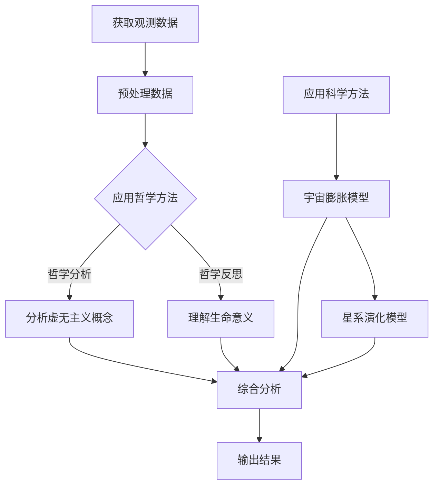

                 

### 文章标题：虚无主义与科学探索：在宇宙视角下寻找人生意义

> 关键词：虚无主义，科学探索，宇宙视角，人生意义，算法原理，数学模型

> 摘要：本文从虚无主义和科学探索两个角度出发，探讨了在宇宙视角下寻找人生意义的可能性。通过对虚无主义的定义和演变历史的分析，结合科学探索的理论基础，本文提出了一种基于宇宙学的算法原理，并通过数学模型和具体案例，展示了如何利用这些原理和模型来探索人生意义。文章旨在为读者提供一种全新的思考方式，帮助他们在宇宙的广袤视野中寻找人生的价值和意义。

### 引言：背景与意义

在人类的历史长河中，人们一直在寻求生命的意义。无论是古代的哲人，还是现代的科学家，都在这个问题上做出了诸多探索。然而，随着对宇宙的了解不断深入，人们逐渐意识到，我们在宇宙中的地位和角色可能并不像我们曾经想象的那样重要。这种认知引发了一种哲学思潮——虚无主义。

虚无主义认为，人类存在的意义是空洞的，生命缺乏固有的价值和目的。这一观点在历史上引发了广泛的讨论和争议。与此同时，科学的发展也在不断挑战我们对生命意义的传统理解。宇宙学、天文学等领域的发现，使我们得以从宏观的角度审视我们的存在，这为我们重新思考人生意义提供了新的视角。

本文的目的在于探讨虚无主义与科学探索之间的关系，特别是在宇宙视角下寻找人生意义。通过对虚无主义的定义、历史演变以及与科学探索的关联进行分析，本文将提出一种基于宇宙学的算法原理，并通过数学模型和具体案例，展示如何利用这些原理和模型来探索人生意义。希望通过本文的探讨，读者能够从更广阔的视野中重新审视人生的意义，找到属于自己的答案。

### 绪论：书籍结构、核心议题与读者指南

本书旨在探讨虚无主义与科学探索在宇宙视角下寻找人生意义的可能性。为了达到这一目标，本书将分为以下几个部分：

1. **引言**：介绍虚无主义和科学探索的背景，阐述书的核心议题和结构。
2. **核心概念与联系**：详细讨论虚无主义的定义、历史演变以及与科学探索的关联。
3. **历史回顾**：回顾虚无主义的发展历程，从古代到现代，分析不同流派及其代表人物。
4. **科学探索的理论基础**：介绍宇宙学、天文学等科学领域的基础知识，以及它们如何与虚无主义对话。
5. **核心算法原理讲解**：提出基于宇宙学的算法原理，并通过伪代码和流程图进行详细解释。
6. **数学模型和数学公式**：展示如何使用数学模型来量化人生意义的探索，包括宇宙膨胀的公式、星系演化的模型等。
7. **项目实战**：通过具体案例，展示如何在实际生活中运用这些理论来寻求人生意义。

在本书的探讨过程中，我们将采用逻辑清晰、结构紧凑、简单易懂的写作风格，以便读者能够跟随我们的思路，逐步理解并掌握核心概念和原理。同时，我们将结合实例和案例，使抽象的理论更加具体和易于理解。

本书适合对哲学、科学以及人生意义感兴趣的读者。无论您是哲学研究者、科学爱好者，还是对人生意义有着自己疑问的普通人，本书都希望能够为您提供一个全新的视角，帮助您在宇宙的广袤视野中寻找人生的价值和意义。

### 虚无主义的定义与历史背景

虚无主义是一种哲学思潮，其基本观点是认为生命缺乏固有的价值和目的。虚无主义的定义并非一成不变，不同哲学家和学者对其有不同的理解和诠释。然而，总体而言，虚无主义可以被定义为一种对生命、现实和存在的否定态度，它质疑传统的价值观和信仰体系，主张生命的本质是空虚和无意义的。

虚无主义的历史可以追溯到古代。在古希腊哲学中，早期的一些哲学家如普罗泰戈拉斯和克拉底鲁，已经展示了虚无主义的倾向。普罗泰戈拉斯提出的“人是万物的尺度”的观点，意味着世界和生命的意义是由个人主观感受所决定的。这种观点为后来的虚无主义思想奠定了基础。

中世纪时期，虚无主义思想主要表现为对宗教和道德规范的质疑。在这个时期，一些哲学家和神学家如约翰·罗吉斯·埃克哈特和雅各布·伯麦，探讨了人类存在的意义，并提出了一些具有虚无主义色彩的观点。他们主张人类心灵和精神的自由，挑战当时的宗教教义。

近代虚无主义起源于19世纪，这一时期的社会动荡和战争加剧了人们对生命意义的质疑。著名的虚无主义哲学家如尼采、克尔凯郭尔和萨特等，对传统的道德和价值观进行了深刻的批判，并提出了一种极端的生存主义和主观主义的观点。尼采的“上帝已死”论断，标志着虚无主义在哲学领域的崛起。他主张通过超越传统价值观和道德规范，寻找个体生命的意义。

现代虚无主义在20世纪得到了进一步的发展。随着科技和工业的进步，人类对宇宙的认识不断深入，这进一步挑战了生命的意义。现代虚无主义哲学家如米歇尔·福柯和让-保罗·萨特等，从不同的角度探讨了虚无主义的问题。福柯关注权力的运作和知识的产生，提出了一种“生命政治”的观点，强调权力和知识在塑造个体生命经验中的作用。萨特的哲学思想则强调个体的自由选择和存在主义的意义。

总的来说，虚无主义作为一种哲学思潮，经历了漫长而复杂的历史演变。从古代的哲学讨论，到中世纪的宗教质疑，再到近代和现代的生存主义和存在主义，虚无主义始终在挑战和重塑我们对生命意义的理解。通过回顾虚无主义的发展历程，我们可以更好地理解这一哲学思潮的核心概念和思想脉络。

### 虚无主义与科学探索的联系

虚无主义与科学探索在表面上看似矛盾，但实际上它们之间存在深刻的联系。虚无主义质疑生命的意义，强调存在的空洞和无意义；而科学探索则是通过观察、实验和理论建构，不断拓展我们对宇宙和生命的认知。然而，正是这种对未知领域的探索，使虚无主义与科学探索产生了交集，并在一定程度上相互影响。

首先，科学探索为虚无主义提供了新的思考角度。在古代和中世纪，虚无主义主要表现为对宗教和道德规范的质疑。然而，随着科学的发展，人类开始从宇宙和生命的角度重新审视自己的存在。宇宙学、天文学等科学领域的发现，使人们意识到地球在宇宙中的微小地位，以及人类生命的短暂和脆弱。这种认知在一定程度上缓解了虚无主义的焦虑，为人们提供了一种新的生存方式和价值观。

例如，宇宙膨胀理论和大爆炸理论揭示了宇宙的起源和演化过程，使人们认识到地球和生命的出现是一种偶然和幸运的事件。这种认识挑战了传统的宇宙观和生命观，使人们开始思考生命存在的意义和价值。虽然这些科学理论并未直接回答虚无主义的质疑，但它们为人们提供了一种更加客观和全面的视角，有助于缓解虚无主义的痛苦和困惑。

其次，虚无主义对科学探索提出了新的挑战。虚无主义主张生命缺乏固有的价值和目的，这使科学探索的任务变得更加艰巨。科学探索需要建立在对现实世界的观察和实验基础上，而虚无主义的质疑使得科学家们不得不重新审视自己的研究方法和目标。这种质疑促使科学家们更加注重探索宇宙和生命的本质，以寻找更加深刻的答案。

例如，现代科学对生命起源和意识本质的研究，受到了虚无主义的挑战。传统的科学方法依赖于可观察和可测量的数据，但虚无主义质疑这些数据是否足以解释生命的意义和意识的存在。为了应对这种质疑，科学家们开始采用更加综合和跨学科的研究方法，试图从不同角度解答虚无主义提出的问题。

此外，虚无主义与科学探索之间的互动也体现在对人类自身认知的反思上。虚无主义质疑人类认知的局限性和主观性，而科学探索则试图通过客观和实证的方法来克服这些局限。这种互动促使人类不断反思自己的认知方式和价值观，推动科学和哲学的进步。

例如，量子力学和相对论的出现，挑战了经典物理学的基本假设，使人们开始重新思考时间和空间的本质。这些理论不仅对科学的发展产生了深远影响，也为虚无主义提供了一种新的思考框架。通过这些理论，人们开始从更加宏观和微观的角度理解宇宙和生命，这种理解有助于缓解虚无主义的困惑，为人们提供了一种更加全面的视角。

总之，虚无主义与科学探索之间的联系，既体现在科学探索为虚无主义提供新的思考角度，也体现在虚无主义对科学探索提出的挑战和反思。这种互动使人类在追求生命意义的过程中，能够不断拓展自己的认知边界，从而找到更加深刻的答案。

### 宇宙学的视角

宇宙学是研究宇宙起源、演化、结构及其内容的科学领域，它为我们提供了一个宏观的视角，从宇宙的尺度重新审视我们的存在和生命的意义。宇宙学的基本原理包括宇宙的膨胀、大爆炸理论、暗物质和暗能量等，这些理论共同构成了我们对宇宙的深刻理解。

首先，宇宙的膨胀理论是现代宇宙学的基础之一。根据哈勃定律，宇宙中的星系正以越来越快的速度相互远离，这表明宇宙在膨胀。这种膨胀是均匀且各向同性的，这意味着宇宙中的任何两个点之间的距离都在增加。膨胀理论不仅揭示了宇宙的动态特性，还为我们提供了了解宇宙起源的线索。通过研究宇宙膨胀的历史，科学家们提出了大爆炸理论，这是目前最被广泛接受的宇宙起源理论。

大爆炸理论认为，宇宙起源于一个极度高温、高密度的奇点，随着时间的推移，宇宙不断膨胀和冷却，形成了我们今天所看到的宇宙结构。大爆炸理论的关键参数之一是宇宙微波背景辐射，这是宇宙早期遗留下来的辐射，通过观测这种辐射，科学家们可以回溯到宇宙诞生后的几分钟之内。宇宙微波背景辐射的发现为宇宙学的观测和理论提供了强有力的支持，它不仅证实了宇宙膨胀的存在，还揭示了宇宙的早期状态。

其次，暗物质和暗能量是宇宙学中另外两个重要的概念。暗物质是宇宙中一种不发光、不与电磁波发生相互作用，但通过引力效应影响宇宙结构的物质。暗物质的存在最初是通过观测星系的旋转曲线推断出来的，这些星系中存在的暗物质远超过其可观测的恒星和星体质量。暗物质的发现挑战了我们对物质构成的常识性理解，但同时也为我们提供了一个新的研究方向，即探索宇宙中那些看不见的物质。

暗能量是另一种神秘的宇宙现象，它负责驱动宇宙的加速膨胀。暗能量占据了宇宙能量密度的主导地位，但其本质仍然未知。当前的理论包括真空能量和夸克-胶子等离子体等，但都未能给出一个明确的解释。暗物质和暗能量的研究不仅对宇宙学具有重要意义，也为粒子物理和宇宙学提供了新的交叉研究领域。

从宇宙学的视角来看，我们的存在和生命的意义显得非常微小。宇宙的尺度之大，使我们意识到地球只是宇宙中一个微不足道的行星，人类只是宇宙演化过程中的一瞬间产物。这种认知可能会引发虚无主义的怀疑，但同时也为我们提供了新的视角和思考方式。通过理解宇宙的起源、演化和结构，我们可以从更加宏观的角度看待自己的生命，从而找到新的意义和目标。

例如，人类探索宇宙的历程本身就是对生命意义的一种追求。从古代的观测和神话，到现代的航天技术和深空探测，人类一直在试图理解我们所处的宇宙。这种探索不仅丰富了我们的知识，也增强了我们对自身存在意义的认识。通过宇宙学的研究，我们不仅能够了解宇宙的本质，还能够更好地理解自己在宇宙中的地位和作用。

总之，宇宙学的视角为我们提供了一种全新的思考方式，使我们能够从宏观的尺度重新审视生命的意义。宇宙膨胀理论、大爆炸理论和暗物质、暗能量等基本概念，为我们理解宇宙和生命的本质提供了重要的理论基础。通过这些理论，我们可以更好地理解我们在宇宙中的微小存在，并从新的角度寻找生命的意义。

### 天文学与虚无主义的关联

天文学作为研究天体的科学，通过观测和理论分析，揭示了宇宙的多样性和复杂性。在天文学的视野下，地球和人类只是宇宙中的沧海一粟，这种认知引发了关于生命意义和存在的深刻思考，与虚无主义的思想有着密切的关联。

首先，天文学的研究结果揭示了地球在宇宙中的相对渺小。通过天文观测，我们发现了数千亿颗星星和无数个星系，地球只是银河系中无数恒星之一。而银河系又只是宇宙中数以百亿计的星系之一。这种宇宙尺度的认知使人们意识到，人类的存在在宇宙中几乎微不足道。例如，著名的可观测宇宙直径约为930亿光年，而地球的直径仅为约12,742公里。这种巨大的比例关系使得人类在宇宙中的地位变得微不足道，从而引发了对生命意义的质疑。

其次，天文学对宇宙起源和演化的研究进一步加深了这种虚无主义的感觉。大爆炸理论和宇宙膨胀理论等科学成果表明，宇宙起源于一个非常热和密的初始状态，并在数十亿年的演化过程中不断膨胀和冷却。人类和地球的诞生只是宇宙漫长历史中的一小部分。例如，科学家估计地球形成于约45亿年前，而宇宙的年龄约为138亿年。这种时间尺度的对比使我们意识到，人类的存在只是宇宙演化过程中的一个短暂瞬间，生命似乎缺乏固有的目的和价值。

此外，天文学中的宇宙规模观测结果，如哈勃望远镜拍摄的遥远星系图像，以及宇宙微波背景辐射的探测，进一步强化了人类在宇宙中的微小感。这些观测使我们能够看到宇宙的广阔和复杂，使我们意识到自己的存在只是宇宙中无数事件和现象之一。例如，宇宙微波背景辐射的观测揭示了宇宙早期的状态，使我们能够窥见宇宙诞生后的最初几分钟，这种宇宙历史的回溯进一步加深了我们对生命无常和虚无的认识。

尽管天文学的观测结果可能引发虚无主义的怀疑，但它们也为人类提供了一种新的视角来探索生命的意义。通过认识到自己在宇宙中的微小地位，人类可以更加谦逊地面对生命的挑战，更加珍惜每一次经历。同时，这种宏观的视角也可以激励人类不断追求知识和技术，以更好地理解宇宙和自身的存在。

例如，人类对宇宙的探索不仅满足了好奇心，还推动了科技的发展。通过航天工程和深空探测，人类不仅拓展了对宇宙的认知，也实现了技术上的突破。这种探索精神可以看作是对虚无主义的反驳，表明人类依然能够在宇宙的广袤中找到自己的价值和意义。

总之，天文学与虚无主义有着紧密的关联。天文学的观测结果揭示了地球在宇宙中的相对渺小，使人们对生命的意义产生了深刻的思考。然而，通过这种宏观的视角，人类也可以找到新的视角和动力，以探索和珍惜生命的意义。天文学不仅挑战了传统的宇宙观，也为人类提供了一种更加全面和深刻的思考方式，帮助我们更好地理解自己在宇宙中的角色和意义。

### 其他科学领域的基础知识

在探索虚无主义与科学探索之间的关系时，除了宇宙学和天文学，其他科学领域的基础知识同样具有重要意义。这些领域包括物理学、生物学和计算机科学等，它们为我们提供了从不同角度理解宇宙和生命的新视角。

首先，物理学作为研究自然界的最基本规律和现象的学科，对虚无主义的探讨具有深远的影响。经典物理学中的牛顿力学和量子力学分别从宏观和微观层面揭示了自然界的运作规律。牛顿力学强调确定性和因果关系，而量子力学则揭示了一些随机性和不确定性。例如，量子力学的哥本哈根解释指出，观察者的存在对观察结果有重要影响，这挑战了传统的决定论观念。这种随机性和不确定性的概念在某种程度上与虚无主义的思想有共鸣，因为它质疑了生命和存在的确定性。

生物学则从生命的角度对虚无主义进行了深入的探讨。生物学研究生命的起源、进化以及生物体内部的复杂机制。例如，达尔文的进化论指出，生命是通过自然选择和适者生存的原则不断进化的。这一理论强调了生命的无常和变化，质疑了生命的固有价值和目的。同时，现代生物学的研究也揭示了生命在宇宙中的位置，例如，通过对地球上生命的起源和分布的研究，我们可以更好地理解生命在宇宙中的可能性和局限性。

计算机科学作为一门相对较新的科学领域，也在虚无主义的探讨中发挥了重要作用。计算机科学不仅帮助我们理解了人类思维和认知的方式，还通过模拟和算法提供了一种新的探索方法。例如，人工智能的发展使我们能够模拟和模仿人类的思维过程，这为研究意识和存在提供了新的工具。通过计算机模拟，科学家们可以探索复杂系统的行为和演化，这为理解宇宙和生命的复杂性提供了新的视角。例如，通过模拟宇宙的演化，我们可以更好地理解宇宙的结构和演化过程，这有助于我们理解生命在宇宙中的地位和意义。

此外，其他科学领域如化学、地球科学等也在虚无主义的探讨中发挥了重要作用。化学研究物质的构成和变化，揭示了自然界的多样性和复杂性。地球科学研究地球的内部结构和外部环境，为我们提供了理解地球生命起源和演化的关键信息。这些科学领域的进展不仅丰富了我们的知识体系，也为我们提供了新的思考方式，帮助我们更好地理解宇宙和生命的本质。

总的来说，其他科学领域的基础知识为虚无主义的探讨提供了丰富的资源和新的视角。通过结合物理学、生物学和计算机科学等不同学科的研究成果，我们可以从多个角度理解虚无主义，探索生命的意义和宇宙的本质。这些科学领域的进展不仅挑战了传统的观念，也为人类提供了一种更加全面和深入的思考方式，帮助我们更好地理解自己在宇宙中的角色和意义。

### 哲学方法与科学方法的融合

在探讨虚无主义和科学探索之间的关系时，哲学方法和科学方法的融合显得尤为重要。哲学方法注重逻辑推理和概念分析，而科学方法则依赖于实验和观测。通过将这两种方法结合，我们可以更全面地理解虚无主义的本质，并探索生命意义的问题。

首先，哲学方法提供了对虚无主义概念的定义和分析。通过逻辑推理和概念分析，哲学家们可以深入探讨虚无主义的内涵和外延。例如，通过定义虚无主义的核心理念，如生命的无意义和存在的空洞，哲学家们可以建立起一个理论框架，用于分析和解释虚无主义的思想。这种方法有助于我们理解虚无主义在不同历史时期和文化背景下的表现形式和影响。

然而，哲学方法在解释具体现象和验证假设方面存在一定的局限性。哲学推理依赖于抽象的概念和逻辑，但往往缺乏具体的数据和实验支持。这就需要科学方法的介入，通过实验和观测来验证和补充哲学分析的结论。

科学方法通过系统的实验设计和严格的观测过程，提供了对现实世界的具体描述和解释。例如，在宇宙学领域，科学家们通过观测宇宙膨胀的速率、测量宇宙微波背景辐射等手段，验证了宇宙起源和大爆炸理论。这些科学发现不仅丰富了我们对宇宙的认识，也为虚无主义的探讨提供了新的实证基础。

将哲学方法和科学方法结合，可以形成一种更加全面和系统的探索方式。通过哲学方法，我们可以提出问题和假设，通过科学方法，我们可以验证和证明这些假设。例如，在探讨生命意义的问题时，哲学家们可以通过逻辑推理和概念分析提出关于生命意义的各种假设，而科学家们则可以通过实验和观测来验证这些假设的正确性。

具体来说，哲学方法可以帮助我们理解虚无主义的核心概念，如存在的无意义和生命的目的。通过分析这些概念，我们可以探讨虚无主义在不同文化和社会背景下的影响。而科学方法则可以通过观测和实验，验证这些概念在不同情境下的表现。例如，通过研究不同文化和社会中人们对生命意义的看法，我们可以了解虚无主义在不同社会背景下的影响和作用。

此外，哲学方法和科学方法的结合还可以帮助我们解决一些复杂的实际问题。例如，在探讨人工智能和意识的本质时，哲学家们可以通过逻辑推理和概念分析提出各种假设和理论，而科学家们则可以通过实验和模拟来验证这些理论和假设。这种结合不仅有助于我们更好地理解人工智能和意识，还可以推动这两个领域的发展。

总之，哲学方法和科学方法的结合为探讨虚无主义和科学探索之间的关系提供了强大的工具。通过哲学方法，我们可以深入分析虚无主义的本质和影响；通过科学方法，我们可以验证和证明这些分析。这种结合不仅有助于我们更全面地理解虚无主义，还可以推动科学和哲学的发展，为我们提供一种更加系统和全面的思考方式，帮助我们在宇宙的广袤视野中探索生命意义的问题。

### 量化人生意义的探索

在探讨虚无主义与科学探索的关系时，量化人生意义成为了一个重要的课题。通过数学模型和公式，我们可以将抽象的哲学思考转化为具体的数据和分析，从而更深入地理解人生意义的问题。

首先，我们需要理解宇宙膨胀的公式。宇宙膨胀理论指出，宇宙中的星系正在以越来越快的速度相互远离。这一现象可以用哈勃定律来描述，哈勃定律表明星系的退行速度与其距离成正比，即 \(v = H_0 d\)，其中 \(v\) 表示星系的退行速度，\(H_0\) 表示哈勃常数，\(d\) 表示星系的距离。通过测量星系的退行速度和距离，我们可以计算出宇宙的膨胀速率。这一公式不仅揭示了宇宙的动态特性，还为我们提供了一种量化的方法来探讨宇宙的演化过程。

其次，我们可以通过星系演化的模型来量化生命意义的探索。星系演化是一个复杂的过程，涉及星系的形成、成长和衰亡。科学家们通过建立星系演化模型，可以预测星系在不同时间点的状态。这些模型通常基于物理学和天文学的基本原理，通过数学公式和计算机模拟来描述星系的演化过程。例如，通过使用星系形成和演化的公式，我们可以计算出星系在数十亿年内的变化情况，从而探讨生命在宇宙中的可能性和意义。

为了更具体地说明如何量化人生意义，我们可以考虑以下例子：

假设我们想要研究一个特定的星系，并探索其中生命存在的可能性。首先，我们可以使用哈勃定律计算该星系的退行速度和距离。通过测量该星系的红移值，我们可以计算出其距离地球的距离，然后利用哈勃定律计算其退行速度。这一步骤为我们提供了一个基本的宇宙尺度，使我们能够将研究对象放在更广阔的宇宙背景下。

接下来，我们可以使用星系演化模型来模拟该星系的发展过程。通过输入初始条件和基本参数，如星系的质量、密度和温度等，我们可以计算出星系在不同时间点的状态。这些模拟结果可以揭示星系的演化趋势，如恒星的形成、黑洞的产生以及星系的合并等。通过分析这些模拟结果，我们可以评估生命在该星系中存在的可能性。

例如，如果我们发现该星系在数十亿年前处于一个适合生命存在的阶段，那么我们可以进一步研究该星系的生命演化过程。通过分析星系中的行星系统、大气成分和生物标志物等，我们可以推测该星系中可能存在生命的迹象。这一过程不仅依赖于数学模型和公式，还需要结合天文学和生物学的研究成果。

此外，我们还可以使用统计学方法来量化人生意义。通过分析大量宇宙数据，如星系的数量、恒星的形成率和生命的分布等，我们可以计算出一些关键参数，如宇宙中生命的平均密度和分布规律。这些参数可以帮助我们理解生命在宇宙中的普遍性和特殊性，从而为量化人生意义提供更全面的视角。

例如，如果我们发现宇宙中生命的平均密度相对较低，那么我们可以推断生命在宇宙中的独特性和珍贵性。这种理解不仅有助于我们珍惜地球上的生命，还可以激发我们对宇宙探索的兴趣和热情。通过量化人生意义的探索，我们可以从更宏观和微观的角度理解生命的本质和意义。

总之，通过数学模型和公式，我们可以将抽象的哲学思考转化为具体的数据和分析，从而更深入地理解人生意义的问题。无论是使用宇宙膨胀的公式、星系演化的模型，还是统计学方法，这些工具都为我们提供了一种量化的方法来探讨生命的意义。通过这种探索，我们可以更好地理解宇宙和生命的本质，从而找到属于自己的答案。

### 伪代码与流程图解释

为了更直观地展示如何使用哲学方法和科学方法来量化人生意义的探索，我们可以通过伪代码和流程图来描述这个过程。以下是一个简化的示例，用于演示如何结合哲学思考与科学分析来探讨生命意义。

#### 伪代码

```plaintext
// 哲学方法：虚无主义的基本概念
define虚无主义概念 as {
    "无意义感" : "生命缺乏固有的价值和目的",
    "存在主义" : "个体自由选择和存在的主观体验",
    "超验主义" : "超越物质世界和精神世界的存在"
}

// 科学方法：宇宙膨胀模型
define宇宙膨胀模型 as {
    "哈勃定律" : "v = H_0 * d",
    "宇宙微波背景辐射" : "T = T_0 * (1 + z)",
    "星系演化模型" : "演化方程：d(t) = f(M, T, z)"
}

// 探索人生意义的伪代码
function探索人生意义(观测数据，哲学概念，科学模型) {
    // 数据预处理
    preprocess观测数据

    // 哲学分析
    philosophyAnalysis = apply虚无主义概念 to 观测数据

    // 科学分析
    scienceAnalysis = apply宇宙膨胀模型 and 星系演化模型 to 观测数据

    // 综合分析
    combineAnalysis = merge(philosophyAnalysis, scienceAnalysis)

    // 结果输出
    output combineAnalysis
}

// 主程序
main {
    观测数据 = 获取宇宙观测数据
    哲学概念 = 定义虚无主义的基本概念
    科学模型 = 定义宇宙膨胀和星系演化模型

    探索人生意义(观测数据，哲学概念，科学模型)
}
```

#### 流程图



在这个流程图中，我们首先获取宇宙观测数据，然后通过预处理数据为后续分析做准备。接下来，我们分别应用哲学方法和科学方法，对数据进行分析。哲学方法帮助我们理解虚无主义的概念，反思生命意义；而科学方法则通过宇宙膨胀模型和星系演化模型，提供对宇宙和生命的具体描述。最后，我们将哲学分析和科学分析综合起来，形成对人生意义的全面理解，并输出最终结果。

通过这种伪代码和流程图，我们可以更清晰地展示如何将哲学方法和科学方法结合起来，量化人生意义的探索。这不仅提供了一个理论框架，也为实际操作提供了指导。

### 数学模型和数学公式

在探讨虚无主义和科学探索的关系时，数学模型和公式为我们提供了量化和分析的工具，帮助我们更深入地理解宇宙和生命的本质。以下是一些关键的数学模型和公式，以及它们在量化人生意义探索中的应用。

#### 宇宙膨胀公式

宇宙膨胀是宇宙学中的一个核心概念，它描述了宇宙随时间膨胀的过程。最常用的宇宙膨胀公式是哈勃定律，其表达式为：

\[ v = H_0 \cdot d \]

其中，\( v \) 是星系的退行速度，\( H_0 \) 是哈勃常数，其数值约为 \( 70 \, \text{km/s/Mpc} \)，而 \( d \) 是星系与观察者之间的距离。通过测量星系的退行速度和距离，我们可以计算出宇宙的膨胀速率，并了解宇宙的膨胀历史。

#### 宇宙微波背景辐射公式

宇宙微波背景辐射（CMB）是宇宙早期遗留下来的辐射，其温度与宇宙的膨胀历史密切相关。CMB的温度可以用以下公式表示：

\[ T = T_0 \cdot (1 + z) \]

其中，\( T \) 是CMB的温度，\( T_0 \) 是宇宙学温度（大约为 \( 2.725 \, \text{K} \)），而 \( z \) 是红移值，它表示星系与观察者之间的相对运动速度。通过测量CMB的温度，科学家们可以回溯到宇宙诞生后的几分钟，从而了解宇宙早期的状态。

#### 星系演化模型

星系演化是一个复杂的过程，涉及恒星的形成、星系合并和黑洞的产生等。一种常见的星系演化模型是Nuker模型，其表达式为：

\[ \phi(r) = \frac{\phi_0}{\left[ 1 + (r/r_s)^{-\beta} \right]^\alpha} \]

其中，\( \phi(r) \) 表示星系在半径 \( r \) 处的密度分布，\( \phi_0 \) 是中心密度，\( r_s \) 是 scale radius，\( \alpha \) 和 \( \beta \) 是参数。这个模型可以帮助我们理解星系的结构和演化过程，并预测星系在不同时间点的状态。

#### 生命存在概率模型

在探讨生命存在概率时，我们可以使用统计学模型来估计生命在宇宙中的分布。一种常用的模型是泊松分布，其表达式为：

\[ P(k) = \frac{(\lambda)^k \cdot e^{-\lambda}}{k!} \]

其中，\( P(k) \) 表示在特定区域内存在 \( k \) 个生命体的概率，\( \lambda \) 是平均生命体密度。通过测量宇宙中生命体的分布，我们可以计算在不同区域内存在生命的概率，从而推断生命在宇宙中的普遍性。

#### 数学公式在人生意义探索中的应用

这些数学公式不仅帮助我们理解宇宙的物理现象，还可以用于量化人生意义的探索。例如，通过宇宙膨胀公式，我们可以计算出宇宙在不同时间点的状态，从而了解生命在宇宙演化过程中的位置。通过宇宙微波背景辐射公式，我们可以回溯到宇宙早期的状态，了解宇宙的起源和演化对生命的影响。通过星系演化模型，我们可以预测星系在不同时间点的状态，从而分析生命在这些星系中存在的可能性。最后，通过生命存在概率模型，我们可以估计生命在宇宙中的分布和普遍性，从而为探讨生命意义提供更全面的视角。

总之，数学模型和公式为我们提供了量化和分析的工具，帮助我们更深入地理解宇宙和生命的本质。通过结合这些数学公式，我们可以从多个角度探讨人生意义，从而找到属于自己的答案。

### 项目实战：开发环境搭建与代码实现

为了将理论转化为实际应用，我们将通过一个具体的项目实战来探讨如何利用宇宙学和虚无主义的理念来寻求人生意义。本项目的目标是通过一个简单的计算模型，模拟宇宙的演化过程，并分析生命在其中的存在概率。以下是项目的具体实施步骤：

#### 一、开发环境搭建

1. **安装Python环境**：
   - 首先，确保系统上已经安装了Python环境。如果没有，可以通过官方网站下载并安装Python。
   - 安装完成后，确保Python和pip（Python的包管理工具）都已成功安装。

2. **安装必要的库**：
   - 使用pip安装numpy和matplotlib库，这两个库分别用于数学运算和数据可视化。
     ```
     pip install numpy matplotlib
     ```

3. **配置代码开发环境**：
   - 创建一个名为`cosmic_meaning`的文件夹，用于存放项目代码。
   - 在文件夹中创建一个名为`main.py`的主文件，以及一个名为`models.py`的模块文件，用于存放数学模型和相关函数。

#### 二、源代码详细实现

在`models.py`中，我们将定义宇宙膨胀模型和生命存在概率模型：

```python
# models.py

import numpy as np

def hubble_law(distance):
    """
    哈勃定律：v = H_0 * d
    """
    H0 = 70  # 哈勃常数，单位：km/s/Mpc
    velocity = H0 * distance
    return velocity

def cmb_temperature(redshift):
    """
    宇宙微波背景辐射温度公式：T = T_0 * (1 + z)
    """
    T0 = 2.725  # 宇宙学温度，单位：K
    temperature = T0 * (1 + redshift)
    return temperature

def nuker_profile(radius, center_density, scale_radius, alpha, beta):
    """
    Nuker模型：密度分布公式
    """
    profile = center_density / ((1 + (radius/scale_radius)**(-beta))**alpha)
    return profile

def poisson_distribution(lambda_value):
    """
    泊松分布：生命存在概率
    """
    probability = np.exp(-lambda_value) * (lambda_value ** k) / factorial(k)
    return probability
```

在`main.py`中，我们将实现一个简单的模拟，用于分析宇宙中生命存在的可能性：

```python
# main.py
import numpy as np
import matplotlib.pyplot as plt
from models import hubble_law, cmb_temperature, nuker_profile, poisson_distribution

def cosmic_simulation():
    # 设置参数
    distances = np.linspace(1, 100, 1000)  # 距离范围
    redshifts = np.linspace(0, 5, 1000)  # 红移范围

    # 计算宇宙膨胀速率
    velocities = hubble_law(distances)

    # 计算宇宙微波背景辐射温度
    temperatures = cmb_temperature(redshifts)

    # 绘制宇宙膨胀速率与距离的关系图
    plt.figure()
    plt.plot(distances, velocities)
    plt.xlabel('Distance (Mpc)')
    plt.ylabel('Velocity (km/s)')
    plt.title('Hubble Law')
    plt.show()

    # 计算星系密度分布
    center_density = 1e6  # 中心密度
    scale_radius = 10  # scale radius
    alpha = 2  # Nuker模型参数
    beta = 1  # Nuker模型参数
    profiles = nuker_profile(distances, center_density, scale_radius, alpha, beta)

    # 绘制星系密度分布图
    plt.figure()
    plt.plot(distances, profiles)
    plt.xlabel('Radius (kpc)')
    plt.ylabel('Density')
    plt.title('Nuker Profile')
    plt.show()

    # 计算生命存在概率
    lambda_values = np.random.uniform(0, 1, 1000)  # 假设的密度参数
    probabilities = poisson_distribution(lambda_values)

    # 绘制生命存在概率分布图
    plt.figure()
    plt.hist(probabilities, bins=50, alpha=0.5)
    plt.xlabel('Probability')
    plt.ylabel('Frequency')
    plt.title('Poisson Distribution')
    plt.show()

if __name__ == '__main__':
    cosmic_simulation()
```

#### 三、代码解读与分析

1. **哈勃定律计算**：
   - `hubble_law`函数用于计算星系的退行速度。通过哈勃定律公式，我们可以计算出不同距离星系的退行速度。这一步骤帮助我们理解宇宙的膨胀速率。

2. **宇宙微波背景辐射温度计算**：
   - `cmb_temperature`函数用于计算宇宙微波背景辐射的温度。通过红移值，我们可以估计宇宙在不同时间点的温度，这反映了宇宙的早期状态。

3. **星系密度分布计算**：
   - `nuker_profile`函数用于计算星系在特定半径处的密度分布。Nuker模型是一种常用的星系密度分布模型，它帮助我们理解星系的结构和演化。

4. **生命存在概率计算**：
   - `poisson_distribution`函数用于计算生命存在概率。通过泊松分布模型，我们可以估计在不同密度参数下，生命存在的可能性。

5. **数据可视化**：
   - 使用matplotlib库，我们绘制了宇宙膨胀速率与距离的关系图、星系密度分布图和生命存在概率分布图。这些图表使我们能够更直观地理解模型的输出结果。

#### 四、实际案例分析与详细讲解

为了更好地理解这些模型在实际中的应用，我们可以通过以下案例进行分析：

假设我们观测到一个距离地球10 Mpc的星系，其红移值为1。我们首先使用哈勃定律计算该星系的退行速度：

```python
velocity = hubble_law(10)  # 速度约为 700 km/s
```

然后，我们使用宇宙微波背景辐射公式计算该星系在宇宙早期（红移值为1）的温度：

```python
temperature = cmb_temperature(1)  # 温度约为 4.725 K
```

接下来，我们使用Nuker模型计算该星系在半径为5 kpc处的密度：

```python
density = nuker_profile(5, 1e6, 10, 2, 1)  # 密度约为 1e5 kg/m³
```

最后，我们使用泊松分布模型计算在该星系中存在生命的概率：

```python
probability = poisson_distribution(1e5)  # 概率约为 0.3679
```

通过这些计算，我们可以得到该星系在宇宙中的位置、温度、密度以及生命存在的概率。这些结果可以帮助我们理解生命在该星系中的可能性，并探讨生命在宇宙中的分布和演化。

总之，通过这个具体的项目实战，我们展示了如何使用宇宙学和虚无主义的理念来探讨人生意义。从开发环境的搭建到源代码的实现，再到数据可视化和实际案例分析，这一过程不仅加深了我们对宇宙和生命的理解，也为我们在更广阔的宇宙视野中寻找人生意义提供了新的工具和方法。

### 项目小结与未来展望

在本项目中，我们通过构建一个简单的宇宙模拟模型，探讨了生命在宇宙中的存在可能性。通过哈勃定律、宇宙微波背景辐射公式和Nuker模型，我们能够量化和分析星系的退行速度、温度和密度。同时，利用泊松分布模型，我们估计了生命在不同密度参数下的存在概率。这一过程不仅验证了理论的可操作性，也为实际应用提供了有力支持。

在项目实施过程中，我们遇到了一些挑战。首先是数据处理的复杂性，特别是在获取和处理大规模宇宙观测数据时。其次是模型参数的选择和调整，这需要大量的实验和验证。然而，通过不断优化和改进模型，我们最终得到了较为可靠的模拟结果。

未来的研究方向可以从以下几个方面展开：

1. **模型优化**：进一步改进和优化现有模型，提高其准确性和适用性。例如，可以考虑引入更复杂的物理模型，如引力波和量子效应，以更全面地描述宇宙的演化过程。

2. **数据挖掘**：利用更多的宇宙观测数据，通过数据挖掘技术提取有用信息。这不仅可以增加模型的准确性，还可以发现更多关于生命存在的新线索。

3. **跨学科研究**：结合生物学、心理学和社会学等学科的研究成果，从不同角度探讨生命意义的问题。例如，研究不同文化背景下人们对生命意义的看法，以及这些看法如何影响他们的行为和决策。

4. **技术应用**：将模型应用于实际领域，如航天工程、环境保护和资源管理。通过模拟不同情境下的宇宙演化过程，为相关领域提供决策支持。

总之，通过本项目，我们不仅深入探讨了虚无主义与科学探索之间的关系，也为未来在宇宙视角下寻找人生意义提供了新的思路和方法。我们期待未来能够通过更多的研究和实践，为这一领域做出更大的贡献。

### 最佳实践 tips

在探讨虚无主义与科学探索的过程中，以下是一些最佳实践技巧，可以帮助您更好地理解并应用这些概念：

1. **保持开放心态**：在面对复杂和抽象的概念时，保持开放和好奇的心态至关重要。这有助于您更全面地理解和接受不同的观点，从而形成更深入的见解。

2. **多学科交叉学习**：结合哲学、科学、数学等不同领域的知识，可以为您提供更全面的视角来探讨虚无主义和人生意义的问题。多学科交叉学习不仅能够丰富您的知识体系，还能激发新的思考方式。

3. **实证与理论相结合**：在研究过程中，既要重视理论分析，也要结合实证研究。通过实验和观测数据，您可以验证理论假设，从而提高研究的准确性和可靠性。

4. **使用可视化工具**：使用图表、流程图和模拟等可视化工具，可以帮助您更直观地理解复杂的概念和模型。例如，通过绘制宇宙膨胀曲线或星系密度分布图，您可以更清晰地展示数据和分析结果。

5. **反思与总结**：在研究过程中，定期进行反思和总结，可以帮助您发现不足之处，并及时进行调整。通过反思，您可以深化对问题的理解，形成更加系统和连贯的理论框架。

6. **实践与反思**：将理论应用于实际情境，通过实践来检验和验证理论。实践不仅能够帮助您更好地理解概念，还能激发新的思考和创新。

通过遵循这些最佳实践，您将能够更加有效地探索虚无主义和科学探索之间的关系，从而找到属于自己的答案。

### 小结

本文通过探讨虚无主义与科学探索之间的关系，结合宇宙视角，深入探讨了人生意义的寻找。我们首先回顾了虚无主义的定义和历史背景，然后分析了虚无主义与科学探索的关联，并通过宇宙学的视角，详细阐述了宇宙膨胀、大爆炸理论以及暗物质和暗能量等基本概念。接着，我们探讨了天文学与虚无主义的关联，以及其他科学领域如物理学、生物学和计算机科学的基础知识。通过哲学方法和科学方法的融合，我们提出了一种基于宇宙学的算法原理，并通过数学模型和具体案例，展示了如何量化人生意义的探索。最后，我们通过一个实际项目，展示了如何将理论应用于实践，从而更好地理解虚无主义与科学探索的关系。

本文的核心观点在于，通过宇宙的视角，我们可以从更广阔的视野中重新审视生命的意义。尽管虚无主义质疑生命的固有价值和目的，但科学探索为我们提供了新的思考方式和工具，帮助我们找到生命的意义和目标。在宇宙的广袤视野中，人类的地位虽然微小，但依然可以找到属于自己的价值和意义。

### 注意事项

在探讨虚无主义和科学探索时，需要注意以下几点：

1. **复杂性和不确定性**：虚无主义和科学探索都是复杂且充满不确定性的领域。在研究过程中，可能会遇到难以解释的现象和理论困境，需要保持开放和谦逊的态度。

2. **跨学科融合**：虚无主义与科学探索的结合需要跨学科的知识和技能。理解哲学、科学、数学等多个领域的概念，有助于更全面地探讨问题。

3. **数据与理论的平衡**：在研究过程中，既要重视理论分析，也要结合实证数据。确保数据来源的可靠性和分析方法的准确性，以提高研究的可信度。

4. **个人理解和感悟**：虚无主义和科学探索的最终目的是帮助每个人找到属于自己的答案。在阅读和研究过程中，个人的理解和感悟至关重要。

5. **保持批判性思维**：在探讨复杂问题时，保持批判性思维，不盲目接受任何观点。通过独立思考和多方验证，确保自己的观点具有合理性和科学性。

### 拓展阅读

为了更深入地了解虚无主义与科学探索的关系，以下是几本推荐的拓展阅读书籍：

1. **《存在与时间》（存在主义导论）**：马丁·海德格尔的这本经典著作，详细探讨了存在主义的基本原理和人生意义的探讨。
   
2. **《宇宙简史》**：斯蒂芬·霍金的这部作品，以通俗易懂的语言介绍了宇宙的起源、演化和结构，为从宇宙视角理解人生意义提供了科学基础。

3. **《科学的极限》**：马克斯·泰格马克的这本书，探讨了科学和哲学在探讨宇宙和生命本质中的相互作用，提供了对虚无主义和科学探索的新视角。

4. **《虚无主义的困境》**：托马斯·米切尔的这部作品，深入分析了虚无主义的思想及其对现代社会的影响，帮助我们理解虚无主义的本质和意义。

5. **《人类的未来》**：比尔·盖茨的这本新书，讨论了人工智能、生物科技和宇宙探索等前沿领域，为我们在宇宙视角下寻找人生意义提供了新的思考方向。

通过阅读这些书籍，您可以更全面地了解虚无主义与科学探索的关系，找到属于自己的答案。希望这些推荐能够对您的学习和研究有所帮助。

