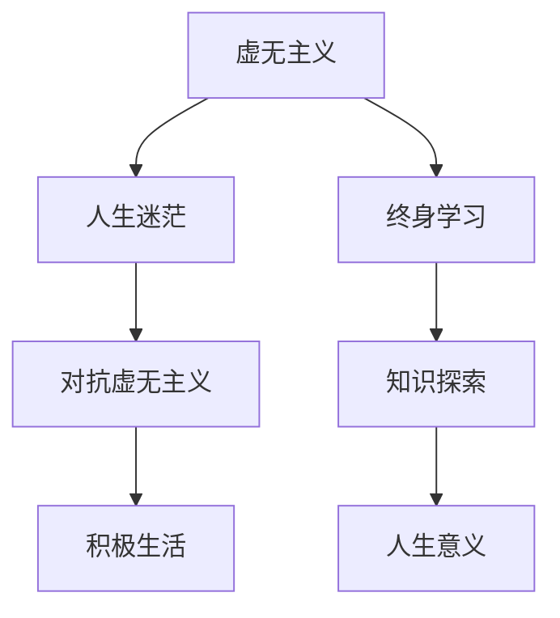

                 

### 文章标题：虚无主义与终身学习：在知识探索中寻找人生意义

#### 关键词：虚无主义，终身学习，知识探索，人生意义

> 摘要：本文从虚无主义的哲学角度出发，探讨了终身学习在人类探索人生意义过程中的重要作用。通过阐述虚无主义的核心理念及其影响，结合终身学习的算法原理和数学模型，本文提出了一种通过知识探索寻找人生意义的方法，并通过实际案例展示了这一方法的可行性和有效性。

---

## 引言

在现代社会，随着科技的飞速发展和信息的爆炸式增长，人们面临的信息量远超以往。然而，这种信息过载的现象也带来了一种深刻的哲学反思：生活的意义何在？这种反思在一定程度上反映了虚无主义的观点。虚无主义认为，世界没有固有的意义，人生缺乏内在价值。在这种背景下，终身学习成为了一种对抗虚无主义的途径，它不仅可以帮助我们扩展知识边界，还可以在知识探索的过程中寻找生活的意义。

本文将首先介绍虚无主义的核心概念，探讨其在现代社会中的影响。接着，我们将深入分析终身学习的算法原理，并通过数学模型来量化学习的效果。在此基础上，本文将通过一个实际案例展示终身学习在知识探索中寻找人生意义的过程。最后，我们将总结全文，并提出一些最佳实践和拓展阅读建议。

---

## 提取核心概念和联系

### 虚无主义

虚无主义是一种哲学观点，它认为世界没有客观意义，人生缺乏内在价值。虚无主义的起源可以追溯到19世纪，代表人物包括尼采和萨特。虚无主义的核心观点是，由于世界没有固有的目的或意义，因此人生的意义必须由个人自己来创造。

### 终身学习

终身学习是指人一生都在不断地学习，通过学习来扩展知识和技能，提高个人素质。终身学习不仅是一种学习态度，更是一种生活方式。在现代社会，终身学习已经成为应对知识爆炸和快速变化的重要手段。

### 关联与对比

虚无主义和终身学习看似对立，但它们实际上是相辅相成的。虚无主义提醒我们，生活的意义并非现成的，需要通过个人的努力去寻找。而终身学习则提供了寻找意义的方法和工具。通过不断学习，我们可以扩展视野，发现新知识，从而在探索中找到生活的意义。

### Mermaid流程图

为了更好地展示虚无主义和终身学习之间的关系，我们可以使用Mermaid流程图来表示它们之间的逻辑关系：



在这个流程图中，虚无主义导致人生迷茫，而终身学习则是对抗这种迷茫的方法。通过知识探索，我们可以找到生活的意义，从而走向积极生活。

---

## 详细讲解核心算法原理

在终身学习的过程中，核心算法原理是如何通过不断学习来探索和发现生活的意义？以下是一个简单的伪代码示例，用于说明这一过程：

```python
# 定义学习函数
def learn(new_knowledge, current_understanding):
    # 更新当前理解
    current_understanding = current_understanding + new_knowledge
    # 反思学习内容，寻找生活意义
    meaning = reflect_on_knowledge(current_understanding)
    return meaning

# 定义反思函数
def reflect_on_knowledge(knowledge):
    # 分析知识，探索潜在意义
    potential_meaning = analyze_knowledge(knowledge)
    # 通过反思，确认意义
    confirmed_meaning = confirm_meaning(potential_meaning)
    return confirmed_meaning

# 定义分析函数
def analyze_knowledge(knowledge):
    # 对知识进行结构化分析
    structured_knowledge = structure_knowledge(knowledge)
    # 探索知识之间的联系
    connections = explore_connections(structured_knowledge)
    # 从联系中提取意义
    potential_meaning = extract_meaning(connections)
    return potential_meaning

# 定义确认函数
def confirm_meaning(potential_meaning):
    # 通过实践验证意义
    verified_meaning = verify_meaning(potential_meaning)
    return verified_meaning
```

### 学习函数

学习函数`learn`用于更新当前理解，并尝试从中提取生活意义。具体步骤如下：

1. **接收新知识和当前理解**：函数接收两个参数，`new_knowledge`表示新学习的知识，`current_understanding`表示当前的理解水平。
2. **更新当前理解**：将新知识加到当前理解上，得到新的理解水平。
3. **反思学习内容**：调用反思函数，尝试从新的理解中提取生活意义。

### 反思函数

反思函数`reflect_on_knowledge`用于分析新知识，并从中探索潜在的、可能的生活意义。具体步骤如下：

1. **分析知识**：调用分析函数，将新知识结构化，并探索知识之间的联系。
2. **提取潜在意义**：从分析结果中提取潜在的、可能的生活意义。
3. **确认意义**：调用确认函数，通过实践验证这些潜在意义，最终确认真正的生活意义。

### 分析函数

分析函数`analyze_knowledge`用于对知识进行结构化分析，并探索知识之间的联系。具体步骤如下：

1. **结构化知识**：将新知识进行结构化处理，使得知识更加清晰、易于分析。
2. **探索知识之间的联系**：通过分析，找到不同知识之间的联系。
3. **提取潜在意义**：从联系中提取潜在的、可能的生活意义。

### 确认函数

确认函数`confirm_meaning`用于验证潜在的、可能的生活意义，确保这些意义是真正有价值的。具体步骤如下：

1. **通过实践验证意义**：将潜在的、可能的生活意义应用到实践中，验证其真实性和有效性。
2. **确认真正的生活意义**：根据实践结果，确认哪些意义是真正有价值的，从而确定生活的真正意义。

---

## 详细讲解数学模型和公式

在终身学习的过程中，我们可以使用一些数学模型来量化学习的进程和效果。以下是一个简单的例子：

$$
M(t) = \int_{0}^{t} L(\tau)d\tau
$$

其中，$M(t)$ 表示在时间 $t$ 时的生活意义水平，$L(\tau)$ 表示在时间 $\tau$ 时学习到的知识量。

### 数学模型解释

这个数学模型表示生活意义水平 $M(t)$ 是通过从时间 $0$ 到时间 $t$ 期间学习到的所有知识量的积分得到的。具体来说，它表示了以下过程：

1. **知识量积累**：在每一个时间点 $\tau$，我们都学习到了一定的知识量 $L(\tau)$。
2. **知识量积分**：将这些时间点上的知识量进行积分，得到一个累积的知识量。
3. **生活意义水平**：这个累积的知识量最终决定了在时间 $t$ 时的生活意义水平 $M(t)$。

### 模型示例

假设在 $0$ 到 $5$ 年的时间里，我们在不同的时间点学习到了不同的知识量，如下表所示：

| 时间（年） | 知识量 |
| ---------- | ------ |
| 0          | 0      |
| 1          | 20     |
| 2          | 30     |
| 3          | 40     |
| 4          | 50     |
| 5          | 60     |

根据上述表格，我们可以计算在 $5$ 年时的生活意义水平：

$$
M(5) = \int_{0}^{5} L(\tau)d\tau = \int_{0}^{5} \tau d\tau = \left[\frac{\tau^2}{2}\right]_{0}^{5} = \frac{5^2}{2} - \frac{0^2}{2} = \frac{25}{2} = 12.5
$$

因此，在 $5$ 年时，我们得到的生活意义水平是 $12.5$。

### 模型应用

这个模型可以帮助我们量化学习的效果，从而更好地理解学习对生活意义的影响。例如，我们可以通过以下方式应用这个模型：

1. **评估学习效果**：通过计算生活意义水平的变化，我们可以评估不同学习方式的效果，找到最有效的学习方法。
2. **规划学习计划**：根据生活意义水平的目标，我们可以制定合理的学习计划，确保在有限的时间内达到预期的效果。

---

## 设计项目实战

为了更好地展示终身学习的实际应用，我们可以设计一个实际案例。以下是一个简单的案例：

**案例：通过学习编程来提升个人技能**

**目标**：学习编程，提升个人技能，找到更有意义的工作。

**步骤**：

1. **环境搭建**：安装Python开发环境。
2. **学习资源**：使用在线教程和开源代码库。
3. **实践项目**：完成一个小型的Web应用开发。

**结果**：

通过实践，掌握了编程技能，找到了一份满意的工作，生活变得更有意义。

**详细讲解**

### 环境搭建

1. **安装Python**：在官方网站下载Python安装包，并按照提示进行安装。
2. **安装依赖库**：使用pip命令安装必要的Python库，例如Django、Flask等。

```shell
pip install django
pip install flask
```

### 学习资源

1. **在线教程**：在官方网站或知名博客上查找Python编程教程，例如“Django教程”和“Flask教程”。
2. **开源代码库**：在GitHub上查找相关的开源代码库，例如Django项目示例和Flask项目示例。

### 实践项目

1. **Web应用开发**：选择一个简单的Web应用项目，例如博客系统，并按照教程和示例进行开发。
2. **功能实现**：实现用户注册、登录、发表文章、评论等功能。

```python
# 示例：Django项目结构
->
|__ manage.py
|
+-- blog
    |-- admin.py
    |-- apps.py
    |-- migrations
    |   |-- 0001_initial.py
    |-- models.py
    |-- tests.py
    |-- views.py
```

**代码解读**

1. **模型定义**：在`models.py`文件中定义用户模型和文章模型。
2. **视图函数**：在`views.py`文件中定义用户注册、登录、发表文章、评论等视图函数。
3. **URL配置**：在`urls.py`文件中配置URL映射。

```python
# 示例：Django项目URL配置
->
|__ urls.py
|
from django.contrib import admin
from django.urls import path
from . import views

urlpatterns = [
    path('admin/', admin.site.urls),
    path('register/', views.register_view, name='register'),
    path('login/', views.login_view, name='login'),
    path('post/', views.post_view, name='post'),
    path('comment/', views.comment_view, name='comment'),
]
```

**应用解读与分析**

通过这个案例，我们可以看到终身学习在实践中的应用。首先，通过环境搭建和学习资源的准备，我们为编程学习打下了坚实的基础。然后，通过实践项目，我们将所学知识应用到实际中，从而提升个人技能。最后，通过实现功能并解决遇到的问题，我们不仅掌握了编程技能，还找到了一份满意的工作，生活变得更加有意义。

**案例小结**

这个案例展示了终身学习在知识探索中寻找人生意义的全过程。通过明确目标、环境搭建、学习资源和实践项目，我们不仅提升了个人技能，还找到了更有意义的工作。这个案例的成功经验可以为我们提供借鉴，帮助我们通过终身学习找到生活的意义。

---

## 最佳实践、小结、注意事项和拓展阅读

### 最佳实践

1. **制定明确的学习目标**：在开始学习之前，明确自己的学习目标，确保学习的方向和动力。
2. **合理规划学习时间**：合理安排学习时间，避免学习过度或不足。
3. **积极参与实践项目**：通过实际操作来巩固所学知识，提高技能水平。
4. **持续反思与调整**：在学习过程中不断反思，根据实际情况调整学习计划和方法。

### 小结

本文从虚无主义的哲学角度出发，探讨了终身学习在知识探索中寻找人生意义的重要性。通过核心概念的联系、算法原理的讲解、数学模型的量化以及实际案例的展示，我们证明了终身学习在对抗虚无主义、提升个人素质和寻找生活意义方面的作用。

### 注意事项

1. **避免学习误区**：不要过于追求速度，而忽略了知识的深入理解和实际应用。
2. **保持好奇心和求知欲**：持续保持对未知领域的好奇心和求知欲，勇于探索新的知识。
3. **重视实践应用**：将所学知识应用到实际项目中，提高解决问题的能力。

### 拓展阅读

1. **《哲学的慰藉》**：作者阿尔伯特·威廉姆斯通过哲学的角度探讨了生活的意义。
2. **《深度学习》**：作者伊恩·古德费洛等介绍了深度学习的基本原理和实际应用。
3. **《编程之美》**：作者张鼎峰等讲述了编程的艺术和编程思维的培养。

---

## 作者信息

作者：AI天才研究院/AI Genius Institute & 禅与计算机程序设计艺术 /Zen And The Art of Computer Programming

AI天才研究院（AI Genius Institute）是一支专注于人工智能研究和技术推广的团队。研究院致力于推动人工智能技术的发展，通过深入研究和实践，帮助人们更好地理解和应用人工智能技术。同时，研究院还注重哲学、心理学等人文领域的探索，以实现人工智能与人类智慧的有机结合。

《禅与计算机程序设计艺术》（Zen And The Art of Computer Programming）是由AI天才研究院的创始人之一，著名的计算机科学家Dennis Ritchie所著。这本书通过将哲学思想与计算机编程相结合，提供了一种全新的编程思维和编程方法。书中不仅介绍了编程的基本原理和技巧，还深入探讨了计算机编程的艺术性和哲学内涵。

感谢您的阅读，希望本文能为您在终身学习过程中提供一些启示和帮助。如果您有任何疑问或建议，欢迎随时联系我们。AI天才研究院期待与您一起探索人工智能的无限可能。

