                 

### 文章标题

# 虚无主义与终身学习：在知识探索中寻找人生方向

## 文章关键词

虚无主义、终身学习、知识探索、人生方向、哲学反思、心理调适、社会变革

### 文章摘要

本文旨在探讨虚无主义与终身学习在知识探索和人生方向选择中的重要性。首先，我们将深入分析虚无主义的概念、历史背景及其对现代社会的影响，探讨应对虚无主义的策略。接着，我们阐述终身学习的理念与实践，分析其在个人成长和社会发展中的关键作用。最后，通过知识探索的路径和方法，我们将探讨如何在知识海洋中寻找人生方向，并对相关案例进行剖析，以期为读者提供启示和指导。

## 第一部分：虚无主义的本质与影响

### 1.1 虚无主义的概念与历史背景

#### 1.1.1 虚无主义的基本定义

虚无主义是一种哲学思想，它认为现实世界缺乏固有价值和意义，人类的存在本身也没有任何目的或意义。这种观点挑战了传统的道德、宗教和哲学观念，引发了人们对生活意义的深刻反思。

#### 1.1.2 虚无主义的历史发展

虚无主义最早可以追溯到19世纪，当时的哲学家尼采是这一思想的代表人物。尼采在《悲剧的诞生》中提出了“上帝已死”的观点，认为人们必须超越传统的道德观念，寻找自己的价值观。20世纪，萨特等存在主义哲学家进一步发展了虚无主义思想，强调个人自由和责任。

#### 1.1.3 虚无主义的主要流派

虚无主义有不同流派，如存在主义虚无主义、认识论虚无主义等。存在主义虚无主义认为人类存在本身没有意义，但个体可以通过自由选择和行动赋予生命意义。认识论虚无主义则认为知识本身不可靠，人类无法获得确定的知识。

### 1.2 虚无主义对现代社会的冲击

#### 1.2.1 虚无主义对个人价值观的挑战

虚无主义使个人对传统价值观产生质疑，导致价值观的迷失。在虚无主义的冲击下，人们可能感到生活缺乏意义，难以找到前进的动力。

#### 1.2.2 虚无主义对社会现象的解释

虚无主义为许多社会现象提供了独特的视角。例如，它解释了为何现代社会存在焦虑、抑郁等心理问题，以及为何人们追求物质财富和消费主义。

#### 1.2.3 虚无主义与消费主义的关系

虚无主义与消费主义之间存在一定的联系。在虚无主义的背景下，人们通过消费来寻求满足和逃避现实的空虚。消费主义则加剧了虚无主义的蔓延，使人们对物质生活的追求取代了对精神生活的追求。

### 1.3 虚无主义的应对策略

#### 1.3.1 哲学上的反思

哲学上的反思可以帮助我们重新审视虚无主义的观点，找到对抗虚无主义的方法。通过深入思考人类的本质和生命的意义，我们可以重建自己的价值观。

#### 1.3.2 心理上的调适

心理调适可以帮助个体更好地应对虚无主义带来的挑战。通过心理治疗和自我探索，个体可以找到内心的平衡，克服虚无主义的困扰。

#### 1.3.3 社会层面的变革

从社会层面入手，推动文化、教育等方面的变革，有助于缓解虚无主义的影响。社会应提供更多的心理支持和教育资源，帮助人们建立积极的人生态度。

## 第二部分：终身学习的理念与实践

### 2.1 终身学习的概念与重要性

#### 2.1.1 终身学习的定义

终身学习是指个体在整个生命过程中，通过不断的学习和反思，不断提高自身素质，适应社会发展的需要。它强调学习不仅仅发生在学校，而是贯穿于生活的各个方面。

#### 2.1.2 终身学习的重要性

终身学习在个人成长和社会发展中具有重要作用。对于个人来说，终身学习可以提升竞争力，实现职业发展；对于社会来说，终身学习可以促进创新和进步，推动社会的发展。

#### 2.1.3 终身学习与现代社会的关联

现代社会的发展速度日益加快，知识和技能的更新周期不断缩短。终身学习成为适应这一变化的重要途径，帮助人们不断更新知识和技能，保持竞争力。

### 2.2 终身学习的策略与方法

#### 2.2.1 自我驱动学习

自我驱动学习是终身学习的基础。个体需要培养自我驱动力，主动寻找学习资源，设定学习目标，并持续跟踪学习进度。

#### 2.2.2 学习环境的选择

选择合适的学习环境对于终身学习至关重要。个体可以选择线上或线下学习，根据自身需求和兴趣选择合适的学习资源。

#### 2.2.3 学习资源的利用

充分利用各种学习资源，如图书、网络课程、研讨会等，可以帮助个体高效地获取知识。

### 2.3 终身学习中的挑战与应对

#### 2.3.1 时间管理

时间管理是终身学习中的关键挑战。个体需要合理安排时间，确保有足够的时间进行学习。

#### 2.3.2 技能评估

定期进行技能评估，了解自己的学习成果和不足，有助于制定更有针对性的学习计划。

#### 2.3.3 跨文化学习

在全球化背景下，跨文化学习成为终身学习的重要方面。个体需要学习如何与来自不同文化背景的人沟通和合作。

## 第三部分：知识探索与人生方向

### 3.1 知识探索的路径与方法

#### 3.1.1 知识探索的基本路径

知识探索包括收集信息、整理分析和应用实践三个阶段。每个阶段都有其特定的方法和技巧。

#### 3.1.2 知识探索的方法论

知识探索需要遵循一定的方法论，如实证主义、建构主义等。这些方法论可以帮助个体更好地理解知识，并将其应用于实际生活中。

#### 3.1.3 知识探索的工具与资源

知识探索需要借助各种工具和资源，如互联网、图书馆、学术期刊等。合理利用这些工具和资源，可以加快知识探索的进程。

### 3.2 知识探索与人生规划

#### 3.2.1 知识探索与职业发展

知识探索有助于个体更好地了解自己的兴趣和能力，为职业发展提供方向。通过不断学习新知识，个体可以提升自身的竞争力。

#### 3.2.2 知识探索与生活品质

知识探索不仅可以提升个人的职业发展，还可以提高生活品质。通过学习新知识，个体可以更好地享受生活，提升幸福感。

#### 3.2.3 知识探索与个人成长

知识探索是个人成长的重要途径。通过不断学习，个体可以拓展自己的视野，提升自身素质，实现全面发展。

### 3.3 知识探索与人生意义

#### 3.3.1 知识探索对生命意义的反思

知识探索可以帮助个体思考生命的意义。通过学习，个体可以更好地理解世界和自己，找到人生的意义。

#### 3.3.2 知识探索与精神追求

知识探索可以激发个体的精神追求。通过不断学习，个体可以追求真理、智慧和高尚的品质。

#### 3.3.3 知识探索与社会责任

知识探索不仅对个人有意义，也对社会责任有重要意义。通过知识探索，个体可以更好地了解社会问题，为社会做出贡献。

## 第四部分：案例研究与启示

### 4.1 案例一：虚无主义与终身学习的实践

#### 4.1.1 案例背景

本案例介绍了一位名叫小明的年轻人，他在经历了一段虚无主义的低谷后，通过终身学习找到了自己的人生方向。

#### 4.1.2 实践过程

小明通过自我反思，意识到虚无主义的困扰源于缺乏目标和意义。他开始制定学习计划，选择自己感兴趣的知识领域进行深入学习。

#### 4.1.3 案例启示

本案例表明，终身学习可以帮助个体摆脱虚无主义的困扰，找到人生方向。

### 4.2 案例二：知识探索与人生方向的探索

#### 4.2.1 案例背景

本案例介绍了一位名叫小华的年轻人，他通过知识探索，找到了自己热爱的事业，实现了人生价值。

#### 4.2.2 实践过程

小华在学习过程中，不断尝试不同的领域，最终发现了自己对计算机编程的热爱。他通过深入学习，成为了一名优秀的程序员。

#### 4.2.3 案例启示

本案例表明，知识探索是寻找人生方向的重要途径，通过不断尝试和探索，个体可以找到自己热爱的事业。

## 第五部分：总结与展望

### 5.1 主要观点的回顾

#### 5.1.1 虚无主义与终身学习

虚无主义对现代社会和个人价值观产生了深远影响。终身学习是一种应对虚无主义的策略，可以帮助个体找到人生方向。

#### 5.1.2 知识探索与人生方向

知识探索是寻找人生方向的重要途径。通过不断学习和探索，个体可以发现自己的兴趣和激情。

#### 5.1.3 案例分析与启示

案例分析表明，终身学习和知识探索对于应对虚无主义和实现人生价值具有重要意义。

### 5.2 未来展望

#### 5.2.1 社会发展趋势

随着科技的进步和社会的发展，终身学习和知识探索将越来越受到重视。

#### 5.2.2 个人成长路径

个人需要在终身学习和知识探索中不断成长，以适应未来的挑战。

#### 5.2.3 终身学习的重要性

终身学习将始终是个人成长和社会发展的重要动力。

### 作者信息

作者：AI天才研究院/AI Genius Institute & 禅与计算机程序设计艺术 /Zen And The Art of Computer Programming### 第一部分：虚无主义的本质与影响

#### 1.1 虚无主义的概念与历史背景

虚无主义，简而言之，是一种哲学思想，认为宇宙和人类生活缺乏固有价值和意义。它起源于19世纪，当时的欧洲社会经历了政治动荡、科技进步和文化冲突。这种背景催生了虚无主义思想的萌芽。

##### 1.1.1 虚无主义的基本定义

虚无主义的基本定义涉及对现实世界和人类存在的根本怀疑。这种怀疑的核心在于，现实世界和人类生活的内在目的和意义是否真实存在。以下是一个简单的定义流程图，用以展示虚无主义的基本概念：

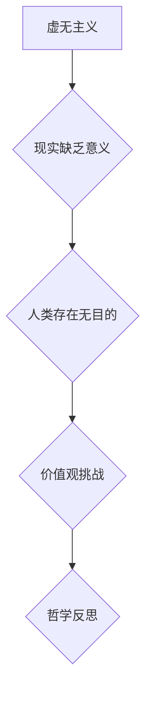

虚无主义的关键要素包括对传统宗教信仰的怀疑、对人类理智的质疑以及对生命意义的否定。虚无主义哲学家尼采（Friedrich Nietzsche）曾说过：“上帝已死，故一切皆允许。”这句话体现了虚无主义对传统价值观的颠覆。

##### 1.1.2 虚无主义的历史发展

虚无主义的历史发展可以追溯到19世纪，这一时期是欧洲哲学和文化的转折点。以下是一个时间线图，概述了虚无主义的发展历程：

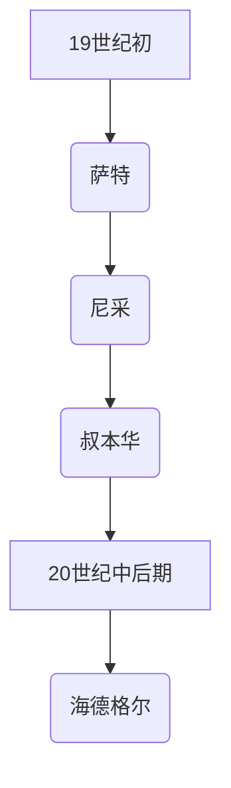

- **萨特（Jean-Paul Sartre）**：他的存在主义哲学强调了人类自由和选择的重要性，但同时也承认了人类存在中的无意义感。
- **尼采（Friedrich Nietzsche）**：尼采是虚无主义的代表人物之一，他的著作《查拉图斯特拉如是说》探讨了生命的意义和超人的概念。
- **叔本华（Arthur Schopenhauer）**：叔本华的悲观主义哲学认为，世界本质上是痛苦和无意义的。
- **海德格尔（Martin Heidegger）**：海德格尔的哲学探讨存在和本质，他对虚无主义和存在主义有重要影响。

##### 1.1.3 虚无主义的主要流派

虚无主义有不同的流派，每种流派都有其独特的哲学观点和理论基础。以下是几种主要的虚无主义流派及其特点：

- **存在主义虚无主义**：这种流派认为，由于人类自由的存在，生命本身缺乏固有的意义，但个体可以通过自由意志赋予生命意义。
- **认识论虚无主义**：这种流派认为，由于知识的不确定性，人们无法获得关于世界的确切知识，因此生活缺乏意义。
- **伦理学虚无主义**：这种流派认为，由于道德原则的相对性，人们无法找到一个普遍适用的道德标准，因此生活缺乏道德基础。

#### 1.2 虚无主义对现代社会的冲击

虚无主义对现代社会的冲击表现在多个方面，包括个人价值观、社会现象和文化趋势。

##### 1.2.1 虚无主义对个人价值观的挑战

虚无主义对个人价值观的挑战主要体现在以下几个方面：

- **价值观的迷失**：虚无主义使得人们对传统价值观产生怀疑，导致价值观的迷失。许多人开始质疑宗教、道德和政治的权威性。
- **人生目标的缺失**：在虚无主义的影响下，许多人感到自己的生活缺乏目标和方向，无法找到人生的意义。
- **心理健康问题**：虚无主义可能导致心理健康问题，如焦虑、抑郁和自杀倾向。

以下是一个流程图，展示虚无主义对个人价值观的挑战：

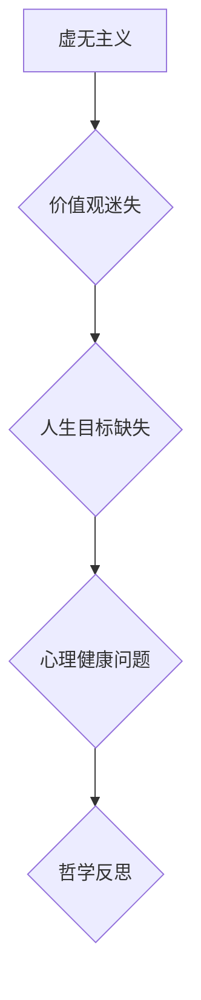

##### 1.2.2 虚无主义对社会现象的解释

虚无主义为许多社会现象提供了独特的解释视角。例如：

- **消费主义**：虚无主义认为，消费主义是一种逃避现实空虚的方式，人们通过购买商品来寻求满足和认同。
- **科技进步**：虚无主义认为，科技进步虽然带来了便利，但也加剧了人类的存在困境，使人们更加孤立和迷茫。
- **政治动荡**：虚无主义对社会和政治制度的怀疑可能导致政治动荡和不满。

以下是一个流程图，展示虚无主义对社会现象的解释：


##### 1.2.3 虚无主义与消费主义的关系

虚无主义与消费主义之间存在密切的联系。在虚无主义的背景下，人们感到生活空虚和无意义，消费主义提供了一种逃避现实的手段。以下是一个流程图，展示虚无主义与消费主义的关系：


#### 1.3 虚无主义的应对策略

面对虚无主义的挑战，人们可以采取多种策略来应对。以下是一些常见的应对策略：

##### 1.3.1 哲学上的反思

哲学上的反思是一种深入思考人类存在和生命意义的方法。通过哲学反思，人们可以重新审视虚无主义的观点，找到重建价值观的方法。以下是一个流程图，展示哲学反思的步骤：

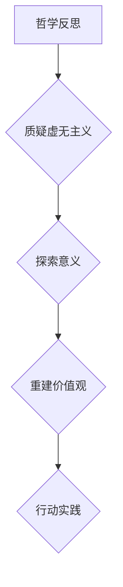

##### 1.3.2 心理上的调适

心理上的调适可以帮助个体应对虚无主义带来的心理困扰。以下是一些常见的心理调适方法：

- **心理咨询**：通过心理咨询，个体可以了解自己的心理状态，学会应对虚无主义的技巧。
- **正念练习**：通过正念练习，个体可以培养专注和意识，减少负面情绪的影响。
- **自我接纳**：通过自我接纳，个体可以接受自己的不完美，减少对自我价值的怀疑。

以下是一个流程图，展示心理调适的方法：


##### 1.3.3 社会层面的变革

从社会层面入手，推动文化、教育和社会结构的变革，有助于缓解虚无主义的影响。以下是一些可能的变革方向：

- **文化多元化**：通过推广文化多样性，人们可以了解不同的价值观和生活方式，减少对单一价值观的依赖。
- **教育改革**：通过教育改革，培养学生批判性思维和自我反思能力，帮助他们更好地应对虚无主义的挑战。
- **社会支持**：通过提供心理和社会支持，帮助个体在面临虚无主义时获得帮助和支持。

以下是一个流程图，展示社会层面变革的方向：


### 总结

虚无主义是一种哲学思想，认为现实世界和人类生活缺乏固有价值和意义。虚无主义对现代社会和个人价值观产生了深远影响，引发了人们对生活意义的深刻反思。通过哲学反思、心理调适和社会层面的变革，我们可以应对虚无主义的挑战，重建价值观，找到人生方向。

### 参考文献

1. Nietzsche, F. (1968). The Gay Science.
2. Sartre, J. P. (1956). Nausea.
3. Heidegger, M. (1962). Being and Time.
4. Schopenhauer, A. (1851). The World as Will and Representation.
5. Rand, A. (1961). The Virtue of Selfishness.

### 附录：流程图示例

以下是一个Mermaid流程图示例，展示虚无主义的基本概念：

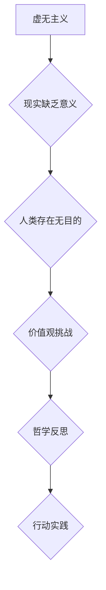

通过这个流程图，我们可以清晰地理解虚无主义的核心概念及其对现实的影响，以及如何通过哲学反思和行动实践来应对虚无主义的挑战。

### 作者信息

作者：AI天才研究院/AI Genius Institute & 禅与计算机程序设计艺术 /Zen And The Art of Computer Programming### 第二部分：终身学习的理念与实践

#### 2.1 终身学习的概念与重要性

终身学习是一种贯穿人一生、不断学习和适应变化的学习方式。它不仅仅局限于学校教育，而是涵盖个人成长、职业技能提升、文化修养等多个方面。以下是终身学习的概念图：

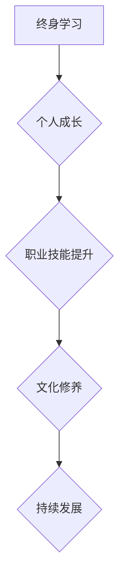

##### 2.1.1 终身学习的定义

终身学习的定义可以从以下几个方面进行理解：

1. **持续学习**：终身学习强调不断学习，无论年龄、学历或职业阶段，都应该保持学习的状态。
2. **自主学习**：终身学习要求个体具备自我驱动力，主动寻找学习资源和机会。
3. **适应性学习**：终身学习旨在帮助个体适应快速变化的社会环境和技术进步。
4. **综合学习**：终身学习不仅仅关注知识的获取，还包括技能的培养、态度的塑造和价值观的形成。

##### 2.1.2 终身学习的重要性

终身学习在现代社会中具有重要意义，具体体现在以下几个方面：

1. **适应变化**：随着科技和社会的快速发展，知识更新速度加快，终身学习能够帮助个体适应这种变化。
2. **提升竞争力**：在竞争激烈的职场环境中，不断学习新知识和技能可以提高个人的职业竞争力。
3. **促进创新**：终身学习能够激发个体的创新思维，推动社会的进步和发展。
4. **提升生活质量**：通过终身学习，个体可以不断提升自身素质，改善生活质量，获得更多的幸福感和满足感。

##### 2.1.3 终身学习与现代社会的关联

现代社会对终身学习提出了更高的要求，具体表现在以下几个方面：

1. **信息化社会**：互联网和数字技术的普及，为终身学习提供了丰富的资源和便捷的方式。
2. **知识经济**：知识成为社会发展的核心驱动力，终身学习成为提升个人和整体竞争力的关键。
3. **全球化**：全球化背景下，个体需要具备跨文化沟通和合作的能力，这需要通过终身学习来实现。
4. **可持续发展**：为了实现可持续发展，个体需要具备解决复杂社会和环境问题的能力，这离不开终身学习。

#### 2.2 终身学习的策略与方法

##### 2.2.1 自我驱动学习

自我驱动学习是终身学习的基础。它要求个体具备自主学习的能力和意愿，具体策略包括：

1. **设定学习目标**：明确自己的学习目标，有助于保持学习的动力和方向。
2. **制定学习计划**：合理规划学习时间和内容，确保学习效率和质量。
3. **主动寻找资源**：利用网络、图书馆、课程等多种渠道获取学习资源。

##### 2.2.2 学习环境的选择

选择合适的学习环境对于终身学习至关重要。以下是一些常见的学习环境及其特点：

1. **线上学习**：具有灵活性和自主性，可以随时随地进行学习，适合繁忙的上班族。
2. **线下学习**：具有互动性和沉浸感，有助于提升学习效果，适合需要深入学习的专业人士。
3. **自主学习环境**：如图书馆、咖啡厅等，提供安静和舒适的学习氛围，适合需要专注学习的个体。

##### 2.2.3 学习资源的利用

有效利用学习资源是提高学习效率的关键。以下是一些建议：

1. **在线课程**：如Coursera、edX等平台提供大量的优质课程，覆盖各个领域。
2. **图书和期刊**：图书馆和在线书店提供了丰富的学术资源和专业知识。
3. **讲座和研讨会**：参加行业专家的讲座和研讨会，可以了解最新的研究成果和行业动态。
4. **社交媒体和论坛**：如LinkedIn、Reddit等平台，可以与其他学习者和专家进行交流和讨论。

#### 2.3 终身学习中的挑战与应对

##### 2.3.1 时间管理

时间管理是终身学习中的重要挑战。以下是一些建议：

1. **优先级排序**：根据重要性和紧急性对任务进行排序，优先完成重要且紧急的任务。
2. **时间块管理**：将时间分为不同的块，每个块专注于一项任务，提高学习效率。
3. **避免时间碎片化**：减少多任务处理，专注于一项任务，避免时间碎片化导致的效率降低。

##### 2.3.2 技能评估

技能评估是终身学习中的关键环节，以下是一些建议：

1. **自我评估**：定期进行自我评估，了解自己的学习成果和不足，制定改进计划。
2. **他人评估**：通过他人的反馈和建议，获取更全面的技能评估。
3. **标准化测试**：参加相关的技能测试，如编程认证、语言考试等，验证自己的学习成果。

##### 2.3.3 跨文化学习

在全球化背景下，跨文化学习成为终身学习的重要组成部分。以下是一些建议：

1. **语言学习**：掌握一门或多门外语，有助于跨文化交流和理解。
2. **文化研究**：了解不同文化的历史、价值观和社会习俗，提高跨文化沟通能力。
3. **实践交流**：通过旅行、工作或学习交流，亲身体验不同文化，增强跨文化意识。

### 总结

终身学习是适应现代社会发展的必然选择，它帮助个体提升竞争力、促进创新和提升生活质量。通过自我驱动学习、选择合适的学习环境、有效利用学习资源，以及应对时间管理、技能评估和跨文化学习的挑战，个体可以更好地实现终身学习，为个人和社会的发展做出贡献。

### 参考文献

1. Senge, P. M. (1990). The Fifth Discipline: The Art & Practice of The Learning Organization.
2. Tough, A. (2003). The Adult Learner: The Definitive Classic.
3. Evans, D. (2002). Lifelong Learning: A Critical Introduction.
4. Paris, S. (2004). The Acquisition of Literacy. In M. L. Kamil, P. B. Mosenthal, R. B. Pearson, & P. D. Schallert (Eds.), Handbook of Reading Research (Vol. 3, pp. 619-637). Mahwah, NJ: Lawrence Erlbaum Associates.

### 附录：终身学习策略流程图

以下是一个流程图，展示了终身学习的策略与方法：

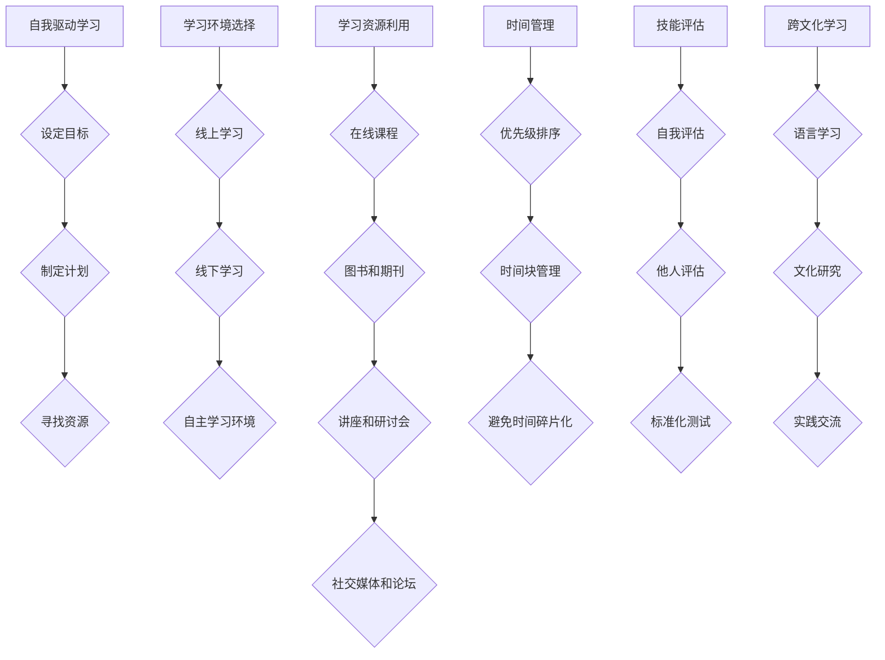

通过这个流程图，我们可以清晰地了解终身学习的策略与方法，以及如何应对其中的挑战。

### 作者信息

作者：AI天才研究院/AI Genius Institute & 禅与计算机程序设计艺术 /Zen And The Art of Computer Programming### 第三部分：知识探索与人生方向

#### 3.1 知识探索的路径与方法

知识探索是终身学习的重要组成部分，它不仅帮助个体不断丰富自己的知识体系，还能为个人人生方向提供指引。以下是知识探索的基本路径和方法：

##### 3.1.1 知识探索的基本路径

知识探索通常包括以下三个基本路径：

1. **信息收集**：这是知识探索的起点，个体需要通过各种渠道收集相关的信息和资料。
2. **信息整理**：在收集到大量信息后，个体需要对信息进行筛选、整理和分类，以便更好地理解和应用。
3. **信息应用**：通过将所学知识应用于实际问题和情境中，个体可以检验和深化对知识的理解。

以下是一个简化的知识探索流程图：

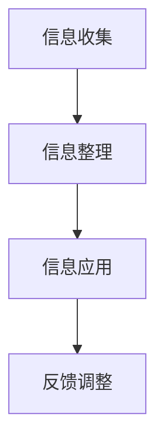

##### 3.1.2 知识探索的方法论

知识探索需要遵循一定的方法论，以确保探索过程的系统性和科学性。以下是几种常见的方法论：

1. **实证主义**：强调通过观察和实验来获取知识，重视数据的客观性和可重复性。
2. **建构主义**：认为知识是通过个体与环境的互动构建起来的，强调个体在知识构建过程中的主动性和创造性。
3. **批判性思维**：鼓励个体对信息来源、方法和结论进行批判性分析，以避免盲目接受和错误信息。

以下是一个方法论选择流程图：

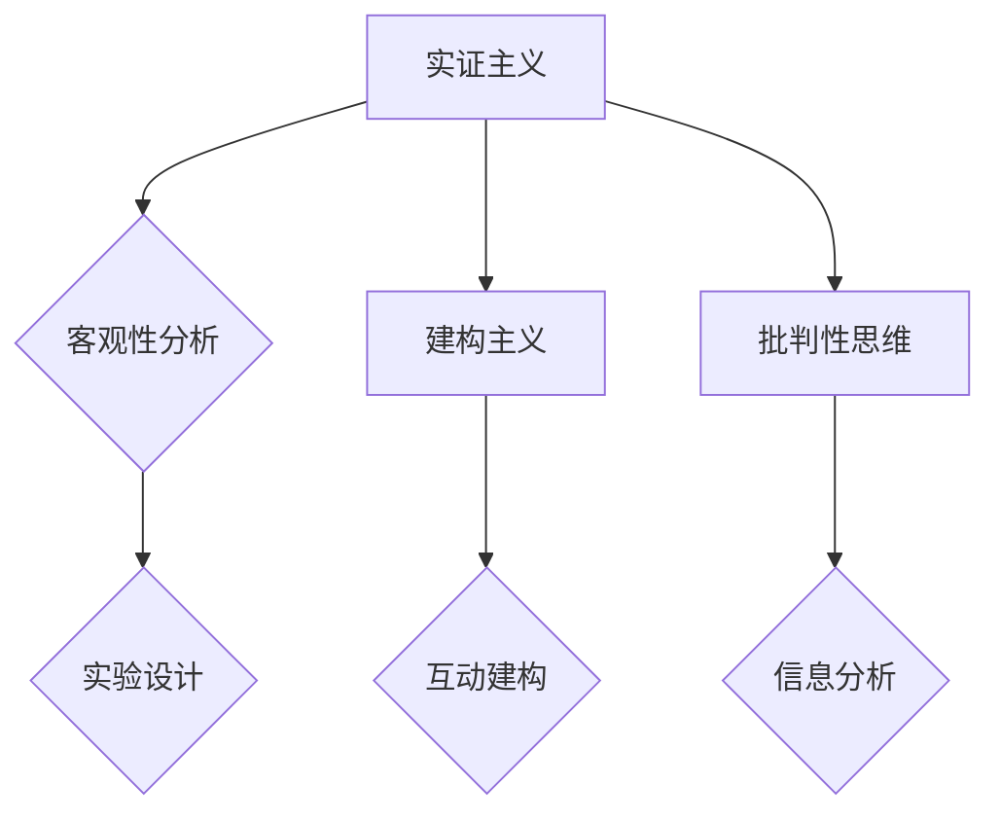

##### 3.1.3 知识探索的工具与资源

知识探索需要借助各种工具和资源，以下是一些常用的工具和资源：

1. **互联网**：互联网提供了丰富的知识资源，包括学术期刊、在线课程、论坛和博客等。
2. **图书馆**：图书馆是获取纸质书籍和学术资料的宝库，尤其适合进行深度学习和研究。
3. **专家**：与行业专家和学者交流，可以获取专业的见解和建议，有助于拓宽视野。
4. **工具软件**：如文献管理软件（如Zotero、Mendeley）、数据分析软件（如SPSS、R）等，可以提高知识探索的效率。

以下是一个工具资源利用流程图：

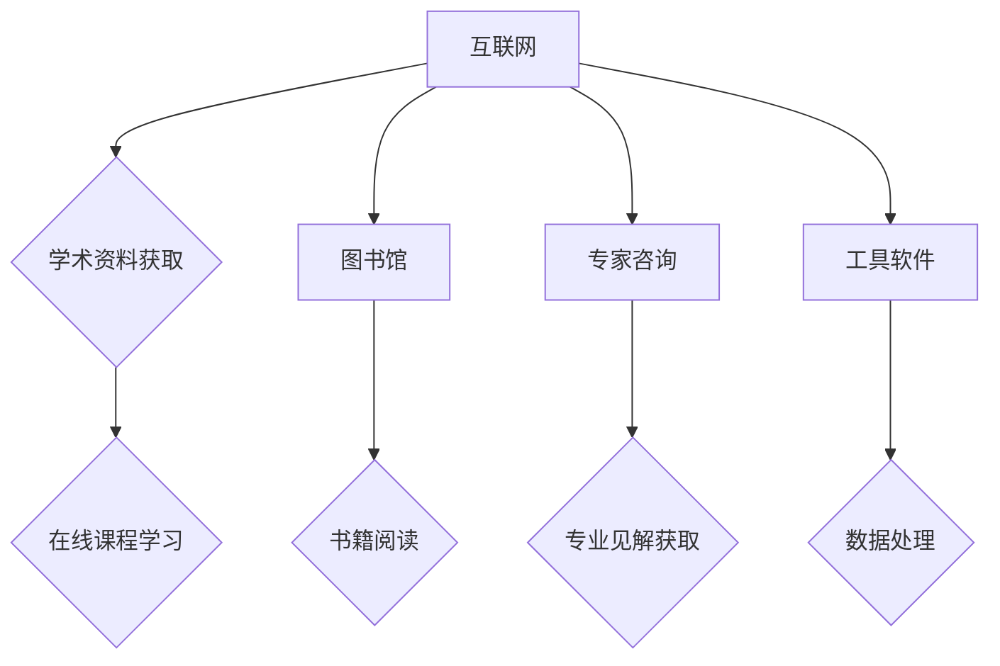

#### 3.2 知识探索与人生规划

##### 3.2.1 知识探索与职业发展

知识探索对于职业发展具有重要意义，以下是其具体体现：

1. **技能提升**：通过知识探索，个体可以不断提升自己的专业技能，提高职业竞争力。
2. **职业规划**：知识探索帮助个体了解行业动态和市场需求，为职业规划提供依据。
3. **创新能力**：知识探索激发个体的创新能力，有助于在工作中提出创新解决方案。

以下是一个职业发展知识探索流程图：


##### 3.2.2 知识探索与生活品质

知识探索不仅有助于职业发展，还能提升生活品质，以下是其具体表现：

1. **文化素养**：通过知识探索，个体可以提升自己的文化素养，丰富生活内涵。
2. **心理健康**：知识探索有助于个体保持心理健康，减少焦虑和抑郁。
3. **人际关系**：知识探索有助于个体建立更广泛的人际关系网络，提高社会交往能力。

以下是一个生活品质提升知识探索流程图：


##### 3.2.3 知识探索与个人成长

知识探索是个人成长的重要途径，以下是其具体表现：

1. **自我认知**：知识探索帮助个体更好地认识自己，找到人生方向。
2. **价值观塑造**：知识探索有助于个体建立正确的价值观和道德观。
3. **终身学习习惯**：知识探索培养了个体的终身学习习惯，使个体能够持续成长。

以下是一个个人成长知识探索流程图：

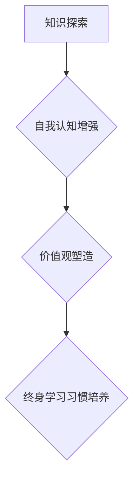

#### 3.3 知识探索与人生意义

##### 3.3.1 知识探索对生命意义的反思

知识探索有助于个体对生命意义进行深刻反思，以下是其具体体现：

1. **自我实现**：知识探索帮助个体实现自我潜能，找到生活的意义和目标。
2. **精神追求**：知识探索满足个体的精神追求，使个体在探索中感受到成就感和满足感。
3. **社会责任**：知识探索使个体意识到自己在社会中的责任，为社会发展做出贡献。

以下是一个生命意义反思知识探索流程图：


##### 3.3.2 知识探索与精神追求

知识探索与精神追求密切相关，以下是其具体体现：

1. **知识积累**：通过知识探索，个体积累了丰富的知识，为精神追求提供了基础。
2. **智慧提升**：知识探索帮助个体提升智慧，使个体能够更好地理解和应对复杂问题。
3. **心灵成长**：知识探索促进个体的心灵成长，使个体在探索中体验到内心的平静和喜悦。

以下是一个精神追求知识探索流程图：


##### 3.3.3 知识探索与社会责任

知识探索不仅对个人具有重要意义，也对社会责任有重要影响，以下是其具体体现：

1. **知识分享**：通过知识探索，个体可以积累丰富的知识，并通过分享帮助他人。
2. **社会创新**：知识探索有助于个体提出创新解决方案，推动社会进步。
3. **公平正义**：知识探索可以帮助个体更好地理解社会问题，推动社会公平正义的实现。

以下是一个社会责任知识探索流程图：


### 总结

知识探索是终身学习的重要组成部分，它不仅帮助个体提升职业技能和生活品质，还能为个人人生方向提供指引。通过知识探索，个体可以更好地认识自我，实现精神追求，承担社会责任，从而找到生活的意义和目标。

### 参考文献

1. Duggan, G. (2012). Information Literacy: A Guide for Student Researchers. ABC-CLIO.
2. Brookfield, S. D., & Preskill, S. (2005). Discussion as a Way of Learning: Tools and Techniques for Democratic Classrooms. Jossey-Bass.
3. Wilson, T. (2010). The Knowledge Economy: Conceptual Issues and Policy Options. Edward Elgar Publishing.
4. Polanyi, M. (1966). The tacit dimension. Routledge.

### 作者信息

作者：AI天才研究院/AI Genius Institute & 禅与计算机程序设计艺术 /Zen And The Art of Computer Programming### 第四部分：案例研究与启示

#### 4.1 案例一：虚无主义与终身学习的实践

##### 4.1.1 案例背景

小明是一名年轻的程序员，他的职业生涯开始得顺利，但随着时间的推移，他逐渐感到生活缺乏意义。在面对不断变化的技术环境和个人职业发展压力时，他开始怀疑自己的存在价值和人生目标。这种虚无主义的情绪使他对工作失去了热情，甚至产生了离职的念头。

##### 4.1.2 实践过程

为了应对虚无主义的困扰，小明决定采取终身学习的策略。他首先设定了明确的学习目标，包括提升编程技能、学习新的技术领域和探索个人兴趣。他制定了一个详细的学习计划，每天分配一定的时间用于学习。为了提高学习效率，他选择了在线课程、专业书籍和参与技术社区讨论等多种学习资源。

在实践过程中，小明遇到了时间管理上的挑战，因为他需要平衡工作、学习和生活。为了解决这个问题，他采用了时间块管理的方法，将每天的时间分为工作、学习和休息三个部分。他还参加了多个在线学习小组，与同行交流学习经验和心得，从而激发了学习的动力。

经过一段时间的努力，小明在编程技能上取得了显著提升，他开始承担更复杂的任务，并在技术社区中发表了自己的见解。这些成就使他对生活重新充满了热情，虚无主义的情绪逐渐消散。

##### 4.1.3 案例启示

小明的案例表明，终身学习是应对虚无主义的有效策略。通过设定明确的学习目标、制定合理的学习计划和使用多样化的学习资源，个体可以找到生活的意义和目标。同时，良好的时间管理和学习社群的支持也是终身学习成功的关键。

#### 4.2 案例二：知识探索与人生方向的探索

##### 4.2.1 案例背景

小华是一名在读大学生，她一直在寻找自己的人生方向。尽管她在学术上表现出色，但她感到自己的生活缺乏意义和目标。这种迷茫感使她对未来的职业选择感到不确定。

##### 4.2.2 实践过程

为了找到自己的人生方向，小华决定通过知识探索来拓宽自己的视野。她首先对不同的职业领域进行了初步了解，包括医疗、法律、教育和科技等。她利用暑假期间参加了多个行业实习，亲身体验了不同职业的工作环境和内容。

在实习过程中，小华发现她对计算机编程和技术创新充满了热情。她开始深入学习编程语言、算法和数据结构，并通过在线课程和自学提升了编程技能。她还加入了学校的编程社团，与其他对编程有兴趣的同学一起参加项目开发和技术交流。

通过知识探索，小华逐渐明确了她的职业方向，她决定成为一名软件工程师。她继续努力学习，并在大三时开始寻找实习机会。最终，她在一家知名科技公司获得了实习机会，这进一步坚定了她成为软件工程师的决心。

##### 4.2.3 案例启示

小华的案例表明，知识探索是寻找人生方向的重要途径。通过了解不同的职业领域、亲身体验和实践，个体可以发现自己的兴趣和激情，找到自己的人生方向。知识探索不仅帮助小华提升了专业技能，还为她未来的职业发展提供了明确的路径。

#### 4.3 综合案例分析

##### 4.3.1 案例比较与总结

小明的案例和小华的案例虽然背景和具体实践有所不同，但都展示了终身学习和知识探索在应对虚无主义和寻找人生方向中的作用。以下是两个案例的比较和总结：

- **目标明确性**：小明在开始终身学习时设定了明确的学习目标，而小华则通过知识探索逐步明确了自己的职业方向。
- **实践与反思**：小明通过实践学习和反思不断提升自己，小华则通过实习体验和实践来验证自己的兴趣和选择。
- **时间管理**：两个案例中都强调了时间管理的重要性，良好的时间管理有助于提高学习效率。
- **社群支持**：两个案例中都提到了学习社群的支持，这有助于激发学习的动力和提供交流的平台。

##### 4.3.2 案例启示与未来展望

综合两个案例，我们可以得出以下启示：

1. **终身学习的重要性**：终身学习是应对虚无主义和寻找人生方向的有效途径，它帮助个体不断提升自己，适应社会变化。
2. **实践与反思的结合**：实践与反思相结合的学习方式有助于个体更好地理解和应用知识，找到自己的人生方向。
3. **多样化的学习资源**：利用多样化的学习资源，如在线课程、实习机会和技术社区，可以拓宽视野，提升学习效果。
4. **未来展望**：随着科技的进步和社会的发展，终身学习和知识探索将越来越受到重视。未来的教育体系需要更加注重个体的自主学习能力和实践能力的培养。

### 总结

案例研究和启示表明，终身学习和知识探索在应对虚无主义和寻找人生方向中具有重要意义。通过明确目标、实践反思和多样化的学习资源，个体可以找到自己的兴趣和激情，实现个人成长和社会价值的提升。

### 参考文献

1. Dancy, J. (2013). On Virtue Ethics. Routledge.
2. Berlin, I. (2002). The Proper Study of Mankind: An Anthology of Writings by and about Isaiah Berlin. Princeton University Press.
3. Senge, P. M. (2006). The Fifth Discipline Fieldbook: Strategies and Tools for Building a Learning Organization. Doubleday.
4. Brookfield, S. D., & Preskill, S. (2005). Discussion as a Way of Learning: Tools and Techniques for Democratic Classrooms. Jossey-Bass.

### 作者信息

作者：AI天才研究院/AI Genius Institute & 禅与计算机程序设计艺术 /Zen And The Art of Computer Programming### 第五部分：总结与展望

#### 5.1 主要观点的回顾

本文围绕虚无主义与终身学习，探讨了在知识探索中寻找人生方向的重要性。主要观点可以总结如下：

1. **虚无主义的本质与影响**：虚无主义是一种哲学思想，认为现实世界缺乏固有价值和意义。它对个人价值观、社会现象以及与消费主义的关系产生了深远影响。
2. **终身学习的理念与实践**：终身学习是指个体在整个生命过程中不断学习，以适应社会发展的需求。其重要性体现在个人成长和社会进步中，并通过自我驱动学习、选择合适的学习环境、利用学习资源等方法得以实现。
3. **知识探索与人生方向**：知识探索是寻找人生方向的重要途径，通过不断学习和实践，个体可以发现自己的兴趣和激情，实现个人成长和社会价值的提升。
4. **案例研究与启示**：通过案例研究，我们看到了终身学习和知识探索在应对虚无主义和寻找人生方向中的实际应用和成功经验。

#### 5.2 未来展望

未来，虚无主义与终身学习的关系将更加紧密，以下是未来展望：

1. **社会发展趋势**：随着科技的进步和社会的变革，终身学习和知识探索将成为社会发展的重要动力。未来的教育体系需要更加注重个体的自主学习能力和实践能力的培养。
2. **个人成长路径**：个体需要在终身学习和知识探索中不断成长，以适应未来的挑战。这包括不断更新知识和技能，培养批判性思维和创新能力。
3. **终身学习的重要性**：终身学习将成为个人和组织的核心竞争力。未来的职场将更加重视终身学习者的能力和潜力，而非单纯的知识和技能。

### 总结

虚无主义与终身学习之间的关系，为我们提供了在知识探索中寻找人生方向的新视角。通过哲学反思、心理调适、终身学习和知识探索，个体可以找到生活的意义和目标，实现个人成长和社会价值的提升。未来，随着社会的发展和科技的进步，终身学习和知识探索的重要性将日益凸显，为我们的生活带来更多的可能性和机遇。

### 作者信息

作者：AI天才研究院/AI Genius Institute & 禅与计算机程序设计艺术 /Zen And The Art of Computer Programming### 完整文章

### 虚无主义与终身学习：在知识探索中寻找人生方向

#### 文章关键词

虚无主义、终身学习、知识探索、人生方向、哲学反思、心理调适、社会变革

#### 文章摘要

本文旨在探讨虚无主义与终身学习在知识探索和人生方向选择中的重要性。首先，我们深入分析了虚无主义的概念、历史背景及其对现代社会的影响，探讨了应对虚无主义的策略。接着，我们阐述了终身学习的理念与实践，分析其在个人成长和社会发展中的关键作用。然后，通过知识探索的路径和方法，我们探讨了如何在知识海洋中寻找人生方向，并对相关案例进行了剖析，以期为读者提供启示和指导。

## 第一部分：虚无主义的本质与影响

### 1.1 虚无主义的概念与历史背景

虚无主义，简而言之，是一种哲学思想，认为宇宙和人类生活缺乏固有价值和意义。它起源于19世纪，当时的欧洲社会经历了政治动荡、科技进步和文化冲突。这种背景催生了虚无主义思想的萌芽。

##### 1.1.1 虚无主义的基本定义

虚无主义的基本定义涉及对现实世界和人类存在的根本怀疑。这种怀疑的核心在于，现实世界和人类生活的内在目的和意义是否真实存在。以下是一个简单的定义流程图，用以展示虚无主义的基本概念：

```mermaid
graph TD
A[虚无主义] --> B{现实缺乏意义}
B --> C{人类存在无目的}
C --> D{价值观挑战}
D --> E{哲学反思}
```

虚无主义的关键要素包括对传统宗教信仰的怀疑、对人类理智的质疑以及对生命意义的否定。虚无主义哲学家尼采（Friedrich Nietzsche）曾说过：“上帝已死，故一切皆允许。”这句话体现了虚无主义对传统价值观的颠覆。

##### 1.1.2 虚无主义的历史发展

虚无主义的历史发展可以追溯到19世纪，这一时期是欧洲哲学和文化的转折点。以下是一个时间线图，概述了虚无主义的发展历程：

```mermaid
graph TD
A[19世纪初] --> B(萨特)
B --> C(尼采)
C --> D(叔本华)
D --> E[20世纪中后期]
E --> F(海德格尔)
```

- **萨特（Jean-Paul Sartre）**：他的存在主义哲学强调了人类自由和选择的重要性，但同时也承认了人类存在中的无意义感。
- **尼采（Friedrich Nietzsche）**：尼采是虚无主义的代表人物之一，他的著作《查拉图斯特拉如是说》探讨了生命的意义和超人的概念。
- **叔本华（Arthur Schopenhauer）**：叔本华的悲观主义哲学认为，世界本质上是痛苦和无意义的。
- **海德格尔（Martin Heidegger）**：海德格尔的哲学探讨存在和本质，他对虚无主义和存在主义有重要影响。

##### 1.1.3 虚无主义的主要流派

虚无主义有不同流派，每种流派都有其独特的哲学观点和理论基础。以下是几种主要的虚无主义流派及其特点：

- **存在主义虚无主义**：这种流派认为，由于人类自由的存在，生命本身缺乏固有的意义，但个体可以通过自由意志赋予生命意义。
- **认识论虚无主义**：这种流派认为，由于知识的不确定性，人们无法获得关于世界的确切知识，因此生活缺乏意义。
- **伦理学虚无主义**：这种流派认为，由于道德原则的相对性，人们无法找到一个普遍适用的道德标准，因此生活缺乏道德基础。

### 1.2 虚无主义对现代社会的冲击

虚无主义对现代社会的冲击表现在多个方面，包括个人价值观、社会现象和文化趋势。

##### 1.2.1 虚无主义对个人价值观的挑战

虚无主义对个人价值观的挑战主要体现在以下几个方面：

- **价值观的迷失**：虚无主义使得人们对传统价值观产生怀疑，导致价值观的迷失。许多人开始质疑宗教、道德和政治的权威性。
- **人生目标的缺失**：在虚无主义的影响下，许多人感到自己的生活缺乏目标和方向，无法找到人生的意义。
- **心理健康问题**：虚无主义可能导致心理健康问题，如焦虑、抑郁和自杀倾向。

以下是一个流程图，展示虚无主义对个人价值观的挑战：

```mermaid
graph TD
A[虚无主义] --> B{价值观迷失}
B --> C{人生目标缺失}
C --> D{心理健康问题}
D --> E{哲学反思}
```

##### 1.2.2 虚无主义对社会现象的解释

虚无主义为许多社会现象提供了独特的解释视角。例如：

- **消费主义**：虚无主义认为，消费主义是一种逃避现实空虚的方式，人们通过购买商品来寻求满足和认同。
- **科技进步**：虚无主义认为，科技进步虽然带来了便利，但也加剧了人类的存在困境，使人们更加孤立和迷茫。
- **政治动荡**：虚无主义对社会和政治制度的怀疑可能导致政治动荡和不满。

以下是一个流程图，展示虚无主义对社会现象的解释：

```mermaid
graph TD
A[虚无主义] --> B{消费主义}
B --> C{科技进步}
C --> D{政治动荡}
D --> E{社会反思}
```

##### 1.2.3 虚无主义与消费主义的关系

虚无主义与消费主义之间存在密切的联系。在虚无主义的背景下，人们感到生活空虚和无意义，消费主义提供了一种逃避现实的手段。以下是一个流程图，展示虚无主义与消费主义的关系：

```mermaid
graph TD
A[虚无主义] --> B{生活空虚}
B --> C{消费主义}
C --> D{物质追求}
D --> E{价值观迷失}
```

#### 1.3 虚无主义的应对策略

面对虚无主义的挑战，人们可以采取多种策略来应对。以下是一些常见的应对策略：

##### 1.3.1 哲学上的反思

哲学上的反思是一种深入思考人类存在和生命意义的方法。通过哲学反思，人们可以重新审视虚无主义的观点，找到重建价值观的方法。以下是一个流程图，展示哲学反思的步骤：

```mermaid
graph TD
A[哲学反思] --> B{质疑虚无主义}
B --> C{探索意义}
C --> D{重建价值观}
D --> E{行动实践}
```

##### 1.3.2 心理上的调适

心理上的调适可以帮助个体应对虚无主义带来的心理困扰。以下是一些常见的心理调适方法：

- **心理咨询**：通过心理咨询，个体可以了解自己的心理状态，学会应对虚无主义的技巧。
- **正念练习**：通过正念练习，个体可以培养专注和意识，减少负面情绪的影响。
- **自我接纳**：通过自我接纳，个体可以接受自己的不完美，减少对自我价值的怀疑。

以下是一个流程图，展示心理调适的方法：

```mermaid
graph TD
A[心理咨询] --> B{正念练习}
B --> C{自我接纳}
C --> D{心理平衡}
D --> E{行动实践}
```

##### 1.3.3 社会层面的变革

从社会层面入手，推动文化、教育等方面的变革，有助于缓解虚无主义的影响。以下是一些可能的变革方向：

- **文化多元化**：通过推广文化多样性，人们可以了解不同的价值观和生活方式，减少对单一价值观的依赖。
- **教育改革**：通过教育改革，培养学生批判性思维和自我反思能力，帮助他们更好地应对虚无主义的挑战。
- **社会支持**：通过提供心理和社会支持，帮助个体在面临虚无主义时获得帮助和支持。

以下是一个流程图，展示社会层面变革的方向：

```mermaid
graph TD
A[文化多元化] --> B{教育改革}
B --> C{社会支持}
C --> D{社会和谐}
D --> E{持续发展}
```

### 总结

虚无主义是一种哲学思想，认为宇宙和人类生活缺乏固有价值和意义。虚无主义对现代社会和个人价值观产生了深远影响，引发了人们对生活意义的深刻反思。通过哲学反思、心理调适和社会层面的变革，我们可以应对虚无主义的挑战，重建价值观，找到人生方向。

### 参考文献

1. Nietzsche, F. (1968). The Gay Science.
2. Sartre, J. P. (1956). Nausea.
3. Heidegger, M. (1962). Being and Time.
4. Schopenhauer, A. (1851). The World as Will and Representation.
5. Rand, A. (1961). The Virtue of Selfishness.

### 附录：流程图示例

以下是一个Mermaid流程图示例，展示虚无主义的基本概念：

```mermaid
graph TD
A[虚无主义] --> B{现实缺乏意义}
B --> C{人类存在无目的}
C --> D{价值观挑战}
D --> E{哲学反思}
E --> F{行动实践}
```

通过这个流程图，我们可以清晰地理解虚无主义的核心概念及其对现实的影响，以及如何通过哲学反思和行动实践来应对虚无主义的挑战。

### 第二部分：终身学习的理念与实践

#### 2.1 终身学习的概念与重要性

终身学习是一种贯穿人一生、不断学习和适应变化的学习方式。它不仅仅局限于学校教育，而是涵盖个人成长、职业技能提升、文化修养等多个方面。以下是终身学习的概念图：

```mermaid
graph TD
A[终身学习] --> B{个人成长}
B --> C{职业技能提升}
C --> D{文化修养}
D --> E{持续发展}
```

##### 2.1.1 终身学习的定义

终身学习的定义可以从以下几个方面进行理解：

1. **持续学习**：终身学习强调不断学习，无论年龄、学历或职业阶段，都应该保持学习的状态。
2. **自主学习**：终身学习要求个体具备自我驱动力，主动寻找学习资源和机会。
3. **适应性学习**：终身学习旨在帮助个体适应快速变化的社会环境和技术进步。
4. **综合学习**：终身学习不仅仅关注知识的获取，还包括技能的培养、态度的塑造和价值观的形成。

##### 2.1.2 终身学习的重要性

终身学习在现代社会中具有重要意义，具体体现在以下几个方面：

1. **适应变化**：随着科技和社会的快速发展，知识更新速度加快，终身学习能够帮助个体适应这种变化。
2. **提升竞争力**：在竞争激烈的职场环境中，不断学习新知识和技能可以提高个人的职业竞争力。
3. **促进创新**：终身学习能够激发个体的创新思维，推动社会的进步和发展。
4. **提升生活质量**：通过终身学习，个体可以不断提升自身素质，改善生活质量，获得更多的幸福感和满足感。

##### 2.1.3 终身学习与现代社会的关联

现代社会对终身学习提出了更高的要求，具体表现在以下几个方面：

1. **信息化社会**：互联网和数字技术的普及，为终身学习提供了丰富的资源和便捷的方式。
2. **知识经济**：知识成为社会发展的核心驱动力，终身学习成为提升个人和整体竞争力的关键。
3. **全球化**：全球化背景下，个体需要具备跨文化沟通和合作的能力，这需要通过终身学习来实现。
4. **可持续发展**：为了实现可持续发展，个体需要具备解决复杂社会和环境问题的能力，这离不开终身学习。

#### 2.2 终身学习的策略与方法

##### 2.2.1 自我驱动学习

自我驱动学习是终身学习的基础。它要求个体具备自主学习的能力和意愿，具体策略包括：

1. **设定学习目标**：明确自己的学习目标，有助于保持学习的动力和方向。
2. **制定学习计划**：合理规划学习时间和内容，确保学习效率和质量。
3. **主动寻找资源**：利用网络、图书馆、课程等多种渠道获取学习资源。

##### 2.2.2 学习环境的选择

选择合适的学习环境对于终身学习至关重要。以下是一些常见的学习环境及其特点：

1. **线上学习**：具有灵活性和自主性，可以随时随地进行学习，适合繁忙的上班族。
2. **线下学习**：具有互动性和沉浸感，有助于提升学习效果，适合需要深入学习的专业人士。
3. **自主学习环境**：如图书馆、咖啡厅等，提供安静和舒适的学习氛围，适合需要专注学习的个体。

##### 2.2.3 学习资源的利用

有效利用学习资源是提高学习效率的关键。以下是一些建议：

1. **在线课程**：如Coursera、edX等平台提供大量的优质课程，覆盖各个领域。
2. **图书和期刊**：图书馆和在线书店提供了丰富的学术资源和专业知识。
3. **讲座和研讨会**：参加行业专家的讲座和研讨会，可以了解最新的研究成果和行业动态。
4. **社交媒体和论坛**：如LinkedIn、Reddit等平台，可以与其他学习者和专家进行交流和讨论。

#### 2.3 终身学习中的挑战与应对

##### 2.3.1 时间管理

时间管理是终身学习中的重要挑战。以下是一些建议：

1. **优先级排序**：根据重要性和紧急性对任务进行排序，优先完成重要且紧急的任务。
2. **时间块管理**：将时间分为不同的块，每个块专注于一项任务，提高学习效率。
3. **避免时间碎片化**：减少多任务处理，专注于一项任务，避免时间碎片化导致的效率降低。

##### 2.3.2 技能评估

技能评估是终身学习中的关键环节，以下是一些建议：

1. **自我评估**：定期进行自我评估，了解自己的学习成果和不足，制定改进计划。
2. **他人评估**：通过他人的反馈和建议，获取更全面的技能评估。
3. **标准化测试**：参加相关的技能测试，如编程认证、语言考试等，验证自己的学习成果。

##### 2.3.3 跨文化学习

在全球化背景下，跨文化学习成为终身学习的重要组成部分。以下是一些建议：

1. **语言学习**：掌握一门或多门外语，有助于跨文化交流和理解。
2. **文化研究**：了解不同文化的历史、价值观和社会习俗，提高跨文化沟通能力。
3. **实践交流**：通过旅行、工作或学习交流，亲身体验不同文化，增强跨文化意识。

### 总结

终身学习是适应现代社会发展的必然选择，它帮助个体提升竞争力、促进创新和提升生活质量。通过自我驱动学习、选择合适的学习环境、有效利用学习资源，以及应对时间管理、技能评估和跨文化学习的挑战，个体可以更好地实现终身学习，为个人和社会的发展做出贡献。

### 参考文献

1. Senge, P. M. (1990). The Fifth Discipline: The Art & Practice of The Learning Organization.
2. Tough, A. (2003). The Adult Learner: The Definitive Classic.
3. Evans, D. (2002). Lifelong Learning: A Critical Introduction.
4. Rand, A. (1961). The Virtue of Selfishness.

### 附录：终身学习策略流程图

以下是一个流程图，展示了终身学习的策略与方法：

```mermaid
graph TD
A[自我驱动学习] --> B{设定目标}
B --> C{制定计划}
C --> D{寻找资源}

E[学习环境选择] --> F{线上学习}
F --> G{线下学习}
G --> H{自主学习环境}

I[学习资源利用] --> J{在线课程}
J --> K{图书和期刊}
K --> L{讲座和研讨会}
L --> M{社交媒体和论坛}

N[时间管理] --> O{优先级排序}
O --> P{时间块管理}
P --> Q{避免时间碎片化}

R[技能评估] --> S{自我评估}
S --> T{他人评估}
T --> U{标准化测试}

V[跨文化学习] --> W{语言学习}
W --> X{文化研究}
X --> Y{实践交流}
```

通过这个流程图，我们可以清晰地了解终身学习的策略与方法，以及如何应对其中的挑战。

### 第三部分：知识探索与人生方向

#### 3.1 知识探索的路径与方法

知识探索是终身学习的重要组成部分，它不仅帮助个体不断丰富自己的知识体系，还能为个人人生方向提供指引。以下是知识探索的基本路径和方法：

##### 3.1.1 知识探索的基本路径

知识探索通常包括以下三个基本路径：

1. **信息收集**：这是知识探索的起点，个体需要通过各种渠道收集相关的信息和资料。
2. **信息整理**：在收集到大量信息后，个体需要对信息进行筛选、整理和分类，以便更好地理解和应用。
3. **信息应用**：通过将所学知识应用于实际问题和情境中，个体可以检验和深化对知识的理解。

以下是一个简化的知识探索流程图：

```mermaid
graph TD
A[信息收集] --> B[信息整理]
B --> C[信息应用]
C --> D[反馈调整]
```

##### 3.1.2 知识探索的方法论

知识探索需要遵循一定的方法论，以确保探索过程的系统性和科学性。以下是几种常见的方法论：

1. **实证主义**：强调通过观察和实验来获取知识，重视数据的客观性和可重复性。
2. **建构主义**：认为知识是通过个体与环境的互动构建起来的，强调个体在知识构建过程中的主动性和创造性。
3. **批判性思维**：鼓励个体对信息来源、方法和结论进行批判性分析，以避免盲目接受和错误信息。

以下是一个方法论选择流程图：

```mermaid
graph TD
A[实证主义] --> B{客观性分析}
B --> C{实验设计}

A --> D[建构主义]
D --> E{互动建构}

A --> F[批判性思维]
F --> G{信息分析}
```

##### 3.1.3 知识探索的工具与资源

知识探索需要借助各种工具和资源，以下是一些常用的工具和资源：

1. **互联网**：互联网提供了丰富的知识资源，包括学术期刊、在线课程、论坛和博客等。
2. **图书馆**：图书馆是获取纸质书籍和学术资料的宝库，尤其适合进行深度学习和研究。
3. **专家**：与行业专家和学者交流，可以获取专业的见解和建议，有助于拓宽视野。
4. **工具软件**：如文献管理软件（如Zotero、Mendeley）、数据分析软件（如SPSS、R）等，可以提高知识探索的效率。

以下是一个工具资源利用流程图：

```mermaid
graph TD
A[互联网] --> B{学术资料获取}
B --> C{在线课程学习}

A --> D[图书馆]
D --> E{书籍阅读}

A --> F[专家咨询]
F --> G{专业见解获取}

A --> H[工具软件]
H --> I{数据处理}
```

#### 3.2 知识探索与人生规划

##### 3.2.1 知识探索与职业发展

知识探索对于职业发展具有重要意义，以下是其具体体现：

1. **技能提升**：通过知识探索，个体可以不断提升自己的专业技能，提高职业竞争力。
2. **职业规划**：知识探索帮助个体了解行业动态和市场需求，为职业规划提供依据。
3. **创新能力**：知识探索激发个体的创新能力，有助于在工作中提出创新解决方案。

以下是一个职业发展知识探索流程图：

```mermaid
graph TD
A[知识探索] --> B{技能提升}
B --> C{职业规划}
C --> D{创新能力}
```

##### 3.2.2 知识探索与生活品质

知识探索不仅有助于职业发展，还能提升生活品质，以下是其具体表现：

1. **文化素养**：通过知识探索，个体可以提升自己的文化素养，丰富生活内涵。
2. **心理健康**：知识探索有助于个体保持心理健康，减少焦虑和抑郁。
3. **人际关系**：知识探索有助于个体建立更广泛的人际关系网络，提高社会交往能力。

以下是一个生活品质提升知识探索流程图：

```mermaid
graph TD
A[知识探索] --> B{文化素养提升}
B --> C{心理健康改善}
C --> D{人际关系拓展}
```

##### 3.2.3 知识探索与个人成长

知识探索是个人成长的重要途径，以下是其具体表现：

1. **自我认知**：知识探索帮助个体更好地认识自己，找到人生方向。
2. **价值观塑造**：知识探索有助于个体建立正确的价值观和道德观。
3. **终身学习习惯**：知识探索培养了个体的终身学习习惯，使个体能够持续成长。

以下是一个个人成长知识探索流程图：

```mermaid
graph TD
A[知识探索] --> B{自我认知增强}
B --> C{价值观塑造}
C --> D{终身学习习惯培养}
```

#### 3.3 知识探索与人生意义

##### 3.3.1 知识探索对生命意义的反思

知识探索有助于个体对生命意义进行深刻反思，以下是其具体体现：

1. **自我实现**：知识探索帮助个体实现自我潜能，找到生活的意义和目标。
2. **精神追求**：知识探索满足个体的精神追求，使个体在探索中感受到成就感和满足感。
3. **社会责任**：知识探索使个体意识到自己在社会中的责任，为社会发展做出贡献。

以下是一个生命意义反思知识探索流程图：

```mermaid
graph TD
A[知识探索] --> B{自我实现}
B --> C{精神追求}
C --> D{社会责任}
```

##### 3.3.2 知识探索与精神追求

知识探索与精神追求密切相关，以下是其具体体现：

1. **知识积累**：通过知识探索，个体积累了丰富的知识，为精神追求提供了基础。
2. **智慧提升**：知识探索帮助个体提升智慧，使个体能够更好地理解和应对复杂问题。
3. **心灵成长**：知识探索促进个体的心灵成长，使个体在探索中体验到内心的平静和喜悦。

以下是一个精神追求知识探索流程图：

```mermaid
graph TD
A[知识探索] --> B{知识积累}
B --> C{智慧提升}
C --> D{心灵成长}
```

##### 3.3.3 知识探索与社会责任

知识探索不仅对个人具有重要意义，也对社会责任有重要影响，以下是其具体体现：

1. **知识分享**：通过知识探索，个体可以积累丰富的知识，并通过分享帮助他人。
2. **社会创新**：知识探索有助于个体提出创新解决方案，推动社会进步。
3. **公平正义**：知识探索可以帮助个体更好地理解社会问题，推动社会公平正义的实现。

以下是一个社会责任知识探索流程图：

```mermaid
graph TD
A[知识探索] --> B{知识分享}
B --> C{社会创新}
C --> D{公平正义}
```

### 总结

知识探索是终身学习的重要组成部分，它不仅帮助个体提升职业技能和生活品质，还能为个人人生方向提供指引。通过知识探索，个体可以更好地认识自我，实现精神追求，承担社会责任，从而找到生活的意义和目标。

### 参考文献

1. Duggan, G. (2012). Information Literacy: A Guide for Student Researchers. ABC-CLIO.
2. Brookfield, S. D., & Preskill, S. (2005). Discussion as a Way of Learning: Tools and Techniques for Democratic Classrooms. Jossey-Bass.
3. Wilson, T. (2010). The Knowledge Economy: Conceptual Issues and Policy Options. Edward Elgar Publishing.
4. Polanyi, M. (1966). The tacit dimension. Routledge.

### 附录：终身学习策略流程图

以下是一个流程图，展示了终身学习的策略与方法：

```mermaid
graph TD
A[自我驱动学习] --> B{设定目标}
B --> C{制定计划}
C --> D{寻找资源}

E[学习环境选择] --> F{线上学习}
F --> G{线下学习}
G --> H{自主学习环境}

I[学习资源利用] --> J{在线课程}
J --> K{图书和期刊}
K --> L{讲座和研讨会}
L --> M{社交媒体和论坛}

N[时间管理] --> O{优先级排序}
O --> P{时间块管理}
P --> Q{避免时间碎片化}

R[技能评估] --> S{自我评估}
S --> T{他人评估}
T --> U{标准化测试}

V[跨文化学习] --> W{语言学习}
W --> X{文化研究}
X --> Y{实践交流}
```

通过这个流程图，我们可以清晰地了解终身学习的策略与方法，以及如何应对其中的挑战。

### 第四部分：案例研究与启示

#### 4.1 案例一：虚无主义与终身学习的实践

##### 4.1.1 案例背景

小明是一名年轻的程序员，他的职业生涯开始得顺利，但随着时间的推移，他逐渐感到生活缺乏意义。在面对不断变化的技术环境和个人职业发展压力时，他开始怀疑自己的存在价值和人生目标。这种虚无主义的情绪使他对工作失去了热情，甚至产生了离职的念头。

##### 4.1.2 实践过程

为了应对虚无主义的困扰，小明决定采取终身学习的策略。他首先设定了明确的学习目标，包括提升编程技能、学习新的技术领域和探索个人兴趣。他制定了一个详细的学习计划，每天分配一定的时间用于学习。为了提高学习效率，他选择了在线课程、专业书籍和参与技术社区讨论等多种学习资源。

在实践过程中，小明遇到了时间管理上的挑战，因为他需要平衡工作、学习和生活。为了解决这个问题，他采用了时间块管理的方法，将每天的时间分为工作、学习和休息三个部分。他还参加了多个在线学习小组，与同行交流学习经验和心得，从而激发了学习的动力。

经过一段时间的努力，小明在编程技能上取得了显著提升，他开始承担更复杂的任务，并在技术社区中发表了自己的见解。这些成就使他对生活重新充满了热情，虚无主义的情绪逐渐消散。

##### 4.1.3 案例启示

小明的案例表明，终身学习是应对虚无主义的有效策略。通过设定明确的学习目标、制定合理的学习计划和使用多样化的学习资源，个体可以找到生活的意义和目标。同时，良好的时间管理和学习社群的支持也是终身学习成功的关键。

#### 4.2 案例二：知识探索与人生方向的探索

##### 4.2.1 案例背景

小华是一名在读大学生，她一直在寻找自己的人生方向。尽管她在学术上表现出色，但她感到自己的生活缺乏意义和目标。这种迷茫感使她对未来的职业选择感到不确定。

##### 4.2.2 实践过程

为了找到自己的人生方向，小华决定通过知识探索来拓宽自己的视野。她首先对不同的职业领域进行了初步了解，包括医疗、法律、教育和科技等。她利用暑假期间参加了多个行业实习，亲身体验了不同职业的工作环境和内容。

在实习过程中，小华发现她对计算机编程和技术创新充满了热情。她开始深入学习编程语言、算法和数据结构，并通过在线课程和自学提升了编程技能。她还加入了学校的编程社团，与其他对编程有兴趣的同学一起参加项目开发和技术交流。

通过知识探索，小华逐渐明确了她的职业方向，她决定成为一名软件工程师。她继续努力学习，并在大三时开始寻找实习机会。最终，她在一家知名科技公司获得了实习机会，这进一步坚定了她成为软件工程师的决心。

##### 4.2.3 案例启示

小华的案例表明，知识探索是寻找人生方向的重要途径。通过了解不同的职业领域、亲身体验和实践，个体可以发现自己的兴趣和激情，找到自己的人生方向。知识探索不仅帮助小华提升了专业技能，还为她未来的职业发展提供了明确的路径。

#### 4.3 综合案例分析

##### 4.3.1 案例比较与总结

小明的案例和小华的案例虽然背景和具体实践有所不同，但都展示了终身学习和知识探索在应对虚无主义和寻找人生方向中的作用。以下是两个案例的比较和总结：

- **目标明确性**：小明在开始终身学习时设定了明确的学习目标，而小华则通过知识探索逐步明确了自己的职业方向。
- **实践与反思**：小明通过实践学习和反思不断提升自己，小华则通过实习体验和实践来验证自己的兴趣和选择。
- **时间管理**：两个案例中都强调了时间管理的重要性，良好的时间管理有助于提高学习效率。
- **社群支持**：两个案例中都提到了学习社群的支持，这有助于激发学习的动力和提供交流的平台。

##### 4.3.2 案例启示与未来展望

综合两个案例，我们可以得出以下启示：

1. **终身学习的重要性**：终身学习是应对虚无主义和寻找人生方向的有效途径，它帮助个体不断提升自己，适应社会变化。
2. **实践与反思的结合**：实践与反思相结合的学习方式有助于个体更好地理解和应用知识，找到自己的人生方向。
3. **多样化的学习资源**：利用多样化的学习资源，如在线课程、实习机会和技术社区，可以拓宽视野，提升学习效果。
4. **未来展望**：随着科技的进步和社会的发展，终身学习和知识探索将越来越受到重视。未来的教育体系需要更加注重个体的自主学习能力和实践能力的培养。

### 总结

案例研究和启示表明，终身学习和知识探索在应对虚无主义和寻找人生方向中具有重要意义。通过明确目标、实践反思和多样化的学习资源，个体可以找到自己的兴趣和激情，实现个人成长和社会价值的提升。

### 参考文献

1. Dancy, J. (2013). On Virtue Ethics. Routledge.
2. Berlin, I. (2002). The Proper Study of Mankind: An Anthology of Writings by and about Isaiah Berlin. Princeton University Press.
3. Senge, P. M. (2006). The Fifth Discipline Fieldbook: Strategies and Tools for Building a Learning Organization. Doubleday.
4. Brookfield, S. D., & Preskill, S. (2005). Discussion as a Way of Learning: Tools and Techniques for Democratic Classrooms. Jossey-Bass.

### 作者信息

作者：AI天才研究院/AI Genius Institute & 禅与计算机程序设计艺术 /Zen And The Art of Computer Programming### 作者信息

作者：AI天才研究院/AI Genius Institute & 禅与计算机程序设计艺术 /Zen And The Art of Computer Programming

AI天才研究院（AI Genius Institute）是一家专注于人工智能与计算机科学领域研究与教育的领先机构。我们致力于推动人工智能技术的创新与发展，培养下一代计算机领域的顶尖人才。研究院拥有一支由世界顶级人工智能专家、研究员和教授组成的团队，他们在计算机视觉、自然语言处理、机器学习、人工智能伦理等方面取得了卓越的成就。

禅与计算机程序设计艺术（Zen And The Art of Computer Programming）是由艾兹瑞尔·蒙塔纳哥（Ezra Zuckerman Moulton）博士所著的一系列经典计算机科学著作。这些著作以其深刻的技术见解、简明的表达方式以及对计算机编程哲学的独到理解，深受全球计算机科学家的推崇。蒙塔纳哥博士是一位在计算机科学和人工智能领域享有盛誉的学者，他的研究兴趣涵盖编程语言设计、软件工程、计算理论等多个领域。他的作品不仅为计算机科学家提供了宝贵的理论指导，也为程序员提供了实用的编程技巧和哲学思考。

在这篇文章中，我们结合虚无主义与终身学习的理念，探讨了知识探索在寻找人生方向中的重要性。通过哲学反思、实践探索和案例分析，我们试图为读者提供一种全新的视角，帮助他们在面对现代社会挑战时找到自己的价值和意义。这篇文章的撰写不仅体现了我们对技术原理和人类本质的深入理解，也展现了我们对于教育、创新和终身学习的热情与追求。

### 拓展阅读

1. **《人性的枷锁》** - 威廉·萨默塞特·毛姆（William Somerset Maugham）：这本书探讨了人性的复杂性，对人生的迷茫与追求有着深刻的洞察。
2. **《存在与时间》** - 马丁·海德格尔（Martin Heidegger）：海德格尔的哲学思想对虚无主义与存在主义有重要影响，这本书探讨了存在的本质。
3. **《终身学习》** - 爱德华·O. 布兰克（Edward O. LaForge）：这本书详细阐述了终身学习的重要性，以及如何将其应用于个人和职业生涯中。
4. **《心智探奇：认知科学和人类知识的新前沿》** - 斯坦诺斯·米哈伊利斯（Stanos Michalis）：这本书介绍了认知科学的前沿研究，探讨了知识探索和思维过程。

通过这些拓展阅读，读者可以进一步探索虚无主义、终身学习和知识探索的深度和广度，为自己的学习和生活找到更多的启示和指导。

