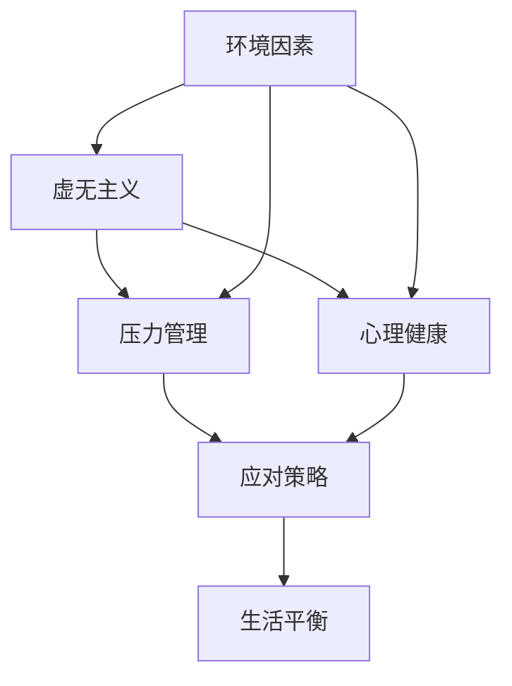

                 

### 文章标题：虚无主义与身心健康：在压力中寻找生活的平衡点

#### 关键词：虚无主义、身心健康、压力管理、生活平衡、心理健康

#### 摘要：
本文旨在探讨虚无主义对身心健康的影响，以及如何在压力中寻找生活的平衡点。通过分析虚无主义的定义、根源和影响，本文揭示了如何摆脱虚无主义，并通过压力管理和心理健康维护来寻求生活平衡。文章以明确的步骤和详细的解释，为读者提供了一条走出虚无主义、实现身心健康和平衡生活的路径。

----------------------------------------------------------------

# 背景介绍

### 虚无主义的定义与起源

虚无主义（Nihilism）是一个哲学概念，起源于19世纪。虚无主义的核心观点是，宇宙和生命缺乏固有的意义和价值。虚无主义者认为，人类的行为和目标缺乏终极的道德或形而上学的基础，因而一切都是无意义的。这种观点最早可追溯到古希腊哲学家普罗塔戈拉（Protagoras）的言论：“人是万物的尺度”，其暗示了人类认识的相对性和不确定性的根源。

19世纪，随着浪漫主义时期的结束和现实主义的兴起，虚无主义在西方哲学中逐渐崭露头角。尼采（Friedrich Nietzsche）是虚无主义的重要代表人物之一。他在《悲剧的诞生》（The Birth of Tragedy）和《道德的谱系》（On the Genealogy of Morality）等作品中，阐述了虚无主义的思想。尼采认为，基督教道德的衰落导致了人类价值观的崩溃，进而导致了虚无主义。

虚无主义不仅仅是一个哲学概念，它对现代社会和个人心理健康也产生了深远的影响。在现代社会中，人们面临着诸多挑战和压力，如失业、疾病、人际关系问题等。这些挑战常常使人们感到生活缺乏意义和价值，从而陷入虚无主义。此外，科技进步和信息爆炸也使得人们对未来的不确定性和焦虑感增强，进一步加剧了虚无主义的蔓延。

### 虚无主义对身心健康的影响

虚无主义对身心健康的影响是多方面的。首先，虚无主义可能导致情绪问题，如抑郁、焦虑和自尊心下降。当个体认为自己的生活缺乏意义时，他们可能会感到沮丧和无助，这种情绪长期积累可能导致心理健康问题。其次，虚无主义可能导致行为问题，如逃避现实、自我放纵和物质依赖。这些行为不仅无法解决问题，反而可能使情况恶化。最后，虚无主义可能导致人际关系问题。当个体无法找到生活的意义时，他们可能会对他人和世界产生冷漠和疏离感，这可能导致社交隔离和孤独感。

总之，虚无主义对身心健康的影响是一个复杂而深远的过程，它不仅仅涉及个人的心理状态，还可能影响他们的行为和人际关系。因此，理解和应对虚无主义对于维护身心健康至关重要。

### 压力与身心健康的关系

压力（Stress）是现代生活中不可避免的一部分，它对身心健康有着深远的影响。压力可以定义为一种心理或生理上的紧张状态，通常是由于外部环境的要求超过了个体的适应能力。根据心理学家汉斯·塞利（Hans Selye）的研究，压力分为急性压力和慢性压力。

急性压力通常发生在短时间内，如考试、演讲或紧急情况。这种压力会引起肾上腺素的分泌，使个体进入“战斗或逃跑”模式，以应对危险。然而，长期处于急性压力状态可能导致身体机能失调，如高血压、心脏病等。

慢性压力则是指长期持续的压力状态，如工作压力、家庭压力等。慢性压力会破坏身体的免疫系统，增加患病的风险。此外，慢性压力还可能导致心理问题，如抑郁、焦虑和睡眠障碍。

压力对身心健康的影响是多方面的。首先，压力可能导致生理问题。长期的压力会使体内的皮质醇水平升高，导致免疫系统受损，增加患病的风险。其次，压力可能导致心理问题。长期的紧张和焦虑会使个体的情绪不稳定，导致抑郁、焦虑等心理问题。最后，压力还可能导致行为问题，如逃避现实、酗酒、滥用药物等，这些问题进一步加剧了身心健康问题。

因此，理解压力与身心健康的关系对于制定有效的压力管理策略至关重要。只有通过科学地应对压力，个体才能维护身心健康，实现生活的平衡。

### 总结

通过以上背景介绍，我们可以看到虚无主义和压力对身心健康有着重要的影响。虚无主义使个体感到生活缺乏意义，可能导致情绪、行为和人际关系问题；而压力则是一种普遍存在的心理和生理紧张状态，长期的压力会损害身心健康。因此，理解和应对虚无主义和压力，对于实现身心健康和生活的平衡至关重要。接下来，本文将深入探讨如何摆脱虚无主义，并通过压力管理和心理健康维护来寻找生活的平衡点。

## 核心概念与联系

在本章节中，我们将探讨几个核心概念，包括虚无主义、压力管理和心理健康。为了更好地理解这些概念之间的关系，我们使用Mermaid流程图来展示它们之间的联系和相互作用。



### Mermaid 流程图解析：

1. **虚无主义（A）**：虚无主义是哲学上的一种观点，认为宇宙和生命缺乏固有的意义和价值。它直接影响个体的心理健康，导致情绪问题、行为问题和人际关系问题。

2. **压力管理（B）**：压力管理是应对生活中各种压力的方法，包括放松技巧、心理调适和生理保健。通过有效的压力管理，个体可以减轻心理和生理上的紧张状态，从而有助于维护心理健康。

3. **心理健康（C）**：心理健康是指个体的心理状态，包括情绪、认知和行为方面的健康。心理健康与虚无主义和压力管理密切相关，良好的心理健康有助于个体摆脱虚无主义和应对压力。

4. **应对策略（D）**：应对策略是应对虚无主义和压力的具体方法，包括心理调适、放松技巧和生理保健。这些策略有助于个体实现生活平衡。

5. **生活平衡（E）**：生活平衡是指个体在忙碌的生活中找到平衡点，实现身心健康。生活平衡是压力管理和心理健康维护的结果。

6. **环境因素（F）**：环境因素包括外部环境和内部环境，如工作压力、家庭压力、社会支持等。这些因素直接影响虚无主义、压力管理和心理健康。

通过这个流程图，我们可以清晰地看到虚无主义、压力管理和心理健康之间的相互作用。理解这些核心概念和它们之间的联系，有助于我们更有效地应对生活中的挑战，实现身心健康和生活的平衡。

### 虚无主义的根源与影响

虚无主义的根源可以追溯到哲学的深层次，尤其是在西方哲学的传统中。虚无主义的核心观点是宇宙和生命缺乏固有的意义和价值。这种观点的根源可以追溯到古希腊哲学家普罗塔戈拉（Protagoras）的名言：“人是万物的尺度”，这一观点强调了人类认识的相对性和不确定性的根源。在19世纪，随着浪漫主义时期的结束和现实主义的兴起，虚无主义在西方哲学中逐渐崭露头角。

尼采（Friedrich Nietzsche）是虚无主义的重要代表人物之一。他在《悲剧的诞生》（The Birth of Tragedy）和《道德的谱系》（On the Genealogy of Morality）等作品中，阐述了虚无主义的思想。尼采认为，基督教道德的衰落导致了人类价值观的崩溃，进而导致了虚无主义。尼采的哲学思想强调了个体存在的荒谬性和无意义性，但他同时也提出了“超人”（Übermensch）的概念，认为个体可以通过自我超越来克服虚无主义。

虚无主义的影响是深远而复杂的。首先，虚无主义可能导致情绪问题，如抑郁、焦虑和自尊心下降。当个体认为自己的生活缺乏意义时，他们可能会感到沮丧和无助，这种情绪长期积累可能导致心理健康问题。其次，虚无主义可能导致行为问题，如逃避现实、自我放纵和物质依赖。这些行为不仅无法解决问题，反而可能使情况恶化。最后，虚无主义可能导致人际关系问题。当个体无法找到生活的意义时，他们可能会对他人和世界产生冷漠和疏离感，这可能导致社交隔离和孤独感。

在现代社会中，虚无主义的影响尤为显著。人们面临着诸多挑战和压力，如失业、疾病、人际关系问题等。这些挑战常常使人们感到生活缺乏意义和价值，从而陷入虚无主义。此外，科技进步和信息爆炸也使得人们对未来的不确定性和焦虑感增强，进一步加剧了虚无主义的蔓延。因此，理解和应对虚无主义对于维护身心健康至关重要。

### 如何摆脱虚无主义

要摆脱虚无主义，个体需要采取一系列的方法和策略。以下是一些具体的方法和步骤：

1. **自我反思**：自我反思是摆脱虚无主义的第一步。个体需要深入思考自己的价值观、信仰和生活的意义。通过自我反思，个体可以清晰地认识到虚无主义对自己的影响，并开始寻找解决问题的途径。

2. **寻求心理支持**：寻求专业的心理支持是摆脱虚无主义的有效方法。心理治疗师可以帮助个体探索内心的困扰，并提供实用的技巧和策略来应对虚无主义。

3. **建立目标感**：建立目标感是摆脱虚无主义的重要手段。个体可以通过设定短期和长期目标来为自己的生活赋予意义。这些目标可以是职业上的成就、个人成长或家庭关系的改善。

4. **培养兴趣和爱好**：培养兴趣和爱好可以帮助个体发现生活的乐趣和意义。通过投身于自己喜欢的事物，个体可以暂时忘记虚无主义的困扰，并从中获得满足感。

5. **建立积极的人际关系**：建立积极的人际关系是摆脱虚无主义的重要一环。与他人建立深厚的联系，可以增强个体的归属感和安全感，从而减轻虚无主义的负面影响。

6. **练习冥想和正念**：冥想和正念练习可以帮助个体培养专注力和自我意识，从而更好地应对虚无主义的困扰。通过冥想，个体可以学会观察自己的思维和情绪，而不被它们所左右。

7. **积极参与社会活动**：积极参与社会活动可以帮助个体感受到自己的价值和影响力。通过为社会做出贡献，个体可以找到生活的意义，并减少虚无主义的影响。

总之，摆脱虚无主义需要个体付出努力和时间。通过自我反思、寻求心理支持、建立目标感、培养兴趣和爱好、建立积极的人际关系、练习冥想和正念以及积极参与社会活动，个体可以逐步摆脱虚无主义的困扰，实现身心健康和生活的平衡。

## 压力的本质与影响

### 压力的定义与分类

压力（Stress）是一种心理或生理上的紧张状态，通常由外部环境的要求超过了个体的适应能力而引起。根据心理学家汉斯·塞利（Hans Selye）的研究，压力可以分为急性压力和慢性压力。

急性压力（Acute Stress）是指短时间内出现的压力状态，通常是由于突发事件或紧急情况引起的。例如，考试、演讲或突如其来的紧急情况都可能引起急性压力。急性压力通常会使个体进入“战斗或逃跑”模式，导致肾上腺素和皮质醇等激素的分泌增加，从而提高个体的警觉性和应对能力。

慢性压力（Chronic Stress）则是指长期持续的压力状态，通常与工作压力、人际关系问题或长期疾病等密切相关。慢性压力会使体内的皮质醇水平持续升高，破坏免疫系统的正常功能，增加患病的风险。此外，慢性压力还可能导致情绪问题，如抑郁和焦虑，以及身体健康问题，如心脏病和高血压。

### 压力的来源

压力的来源多种多样，可以分为内部压力和外部压力。

**内部压力**主要来源于个体内心的冲突和焦虑。例如，个人的自我期望、自我评价和自我怀疑可能导致内心的紧张和压力。此外，个人的性格特点、应对方式和心理韧性也会影响内部压力的水平。

**外部压力**则主要来源于环境因素。例如，工作压力、家庭压力、经济压力和社会支持等都是外部压力的常见来源。现代社会中，科技进步和信息爆炸也增加了外部压力，如工作压力、社交压力和竞争压力等。

### 压力的危害

压力对个体的身心健康有着深远的影响。首先，压力可能导致生理问题。长期的慢性压力会破坏免疫系统的功能，增加患病的风险。例如，慢性压力与心脏病、高血压、糖尿病等慢性疾病的发生密切相关。此外，压力还可能导致消化系统问题，如胃溃疡和肠道功能紊乱。

其次，压力可能导致心理问题。长期的紧张和焦虑会导致个体的情绪不稳定，增加患抑郁症和焦虑症的风险。压力还可能导致睡眠障碍，如失眠和过度嗜睡，进一步加剧个体的心理负担。

最后，压力可能导致行为问题。长期的压力可能导致个体的逃避行为，如酗酒、滥用药物或过度工作。这些行为不仅无法解决问题，反而可能使情况恶化，进一步加剧身心健康问题。

总之，压力是一种普遍存在的现象，它对个体的身心健康有着重要的影响。了解压力的来源和危害，有助于个体更好地应对压力，维护身心健康。

## 压力管理方法

### 放松技巧

放松技巧是压力管理的重要方法，通过训练身体和思维的放松，个体可以有效地减轻压力，提高身心健康。以下是一些常见的放松技巧：

1. **深呼吸**：深呼吸是一种简单而有效的放松方法。通过深呼吸，个体可以降低心率和血压，减少身体紧张感。具体方法包括：
   - 慢慢吸气，深吸到腹部感到膨胀；
   - 屏住呼吸几秒钟；
   - 慢慢呼气，感觉到腹部收缩。

2. **渐进性肌肉放松**：这种技巧通过逐个放松身体各部位的肌肉，达到全身放松的效果。具体步骤如下：
   - 选择一个舒适的姿势，闭上眼睛；
   - 从脚开始，逐渐向上至头部，逐一放松身体的每一块肌肉；
   - 想象紧张感随着放松逐渐消散。

3. **冥想**：冥想是通过专注呼吸或某种特定的焦点来放松思维，达到内心平静的状态。具体方法包括：
   - 找一个安静的地方，坐或躺在一个舒适的姿势；
   - 专注于呼吸，当思维跑偏时，轻轻将其引回到呼吸上；
   - 保持冥想5到20分钟，逐渐增加时间。

4. **瑜伽**：瑜伽结合了深呼吸、身体动作和冥想，是一种全面的放松技巧。具体方法包括：
   - 选择适合自己的瑜伽姿势，如树式、猫式、骆驼式等；
   - 结合呼吸，逐步完成每个姿势；
   - 通过持续的练习，达到身心放松的效果。

### 心理调适

心理调适是压力管理的重要组成部分，通过调整个体的认知和行为，可以有效地减轻压力。以下是一些常见的心理调适方法：

1. **认知重构**：认知重构是通过识别和改变负面思维模式来减轻压力。具体方法包括：
   - 识别负面思维，如“我无法应对这个挑战”或“这件事一定失败”；
   - 重新评估这些思维，找出其不合理之处；
   - 代之以积极的思维，如“我可以学习新技能来应对这个挑战”或“失败是成功的一部分”。

2. **正念练习**：正念练习是通过专注于当前的经历，达到心理平衡和放松。具体方法包括：
   - 将注意力集中在呼吸上，感受每一次吸气和呼气；
   - 当思维跑偏时，轻轻将其引回到当前的经历上；
   - 通过持续练习，提高对压力的应对能力。

3. **时间管理**：合理的时间管理可以帮助个体更好地应对压力。具体方法包括：
   - 制定合理的日程安排，避免过度劳累；
   - 学会优先处理重要任务，避免拖延；
   - 给自己留出休息和放松的时间。

4. **情绪表达**：情绪表达可以帮助个体释放压力，避免情绪积累。具体方法包括：
   - 与亲友分享自己的感受和压力；
   - 通过写日记、绘画或音乐来表达情绪；
   - 寻求专业心理咨询，帮助自己更好地理解和处理情绪。

### 生理保健

生理保健是压力管理的重要一环，通过改善生活方式和饮食，个体可以有效地减轻压力，提高身心健康。以下是一些常见的生理保健方法：

1. **规律运动**：规律的运动可以提高个体的身体素质和心理韧性，有助于减轻压力。具体方法包括：
   - 每周至少进行150分钟的中等强度运动，如快走、游泳或骑自行车；
   - 选择自己喜欢的运动方式，增加运动的乐趣。

2. **充足睡眠**：充足的睡眠有助于身体和大脑的恢复，提高个体的应对压力的能力。具体方法包括：
   - 每晚保证7到9小时的睡眠时间；
   - 建立规律的睡眠习惯，避免熬夜。

3. **健康饮食**：健康的饮食习惯有助于维持身体健康，减轻压力。具体方法包括：
   - 多吃富含抗氧化剂的水果和蔬菜，如蓝莓、菠菜和胡萝卜；
   - 减少高糖、高脂肪和高盐的食物摄入；
   - 保持饮食多样化，避免单一食物的过度摄入。

4. **减少咖啡因和酒精摄入**：咖啡因和酒精可能会增加个体的焦虑和压力水平，因此应尽量减少摄入。具体方法包括：
   - 每天咖啡因摄入量不超过400毫克，相当于2-3杯咖啡；
   - 避免过量饮酒，每天不超过2杯酒精饮料。

通过上述放松技巧、心理调适和生理保健方法，个体可以有效地管理压力，提高身心健康。然而，每个人的情况都不同，最有效的压力管理策略需要个体根据自己的实际情况进行调整和优化。因此，持续的学习和实践是维护身心健康的关键。

### 心理健康的重要性

心理健康是指个体的心理状态，包括情绪、认知和行为方面的健康。心理健康的重要性不言而喻，它不仅关系到个体的生活质量和幸福感，还对身体健康和社会功能有着深远的影响。

首先，心理健康直接影响个体的生活质量。心理健康良好的个体通常能够更好地应对日常生活中的挑战和压力，享受生活的乐趣。相反，心理健康问题如抑郁、焦虑等可能导致个体情绪低落、失去生活的热情，严重影响生活质量。

其次，心理健康与身体健康密切相关。长期的心理压力和心理健康问题会增加患多种生理疾病的风险，如心脏病、高血压、糖尿病等。同时，生理疾病也会影响心理健康，形成恶性循环。例如，慢性疾病患者常常伴随着抑郁和焦虑，而心理健康问题的患者也更易患生理疾病。

最后，心理健康对社会功能有着重要的影响。心理健康良好的个体通常能够更好地完成工作和学习任务，维护良好的人际关系。相反，心理健康问题可能导致个体在工作、学习和社交中表现不佳，影响其社会功能的发挥。

因此，维护心理健康对于个体的整体福祉至关重要。通过了解心理健康的重要性，个体可以更加重视自己的心理状态，采取积极的措施来预防和应对心理健康问题，从而实现身心健康和生活的平衡。

### 维护心理健康的方法

维护心理健康是一个持续且多层次的过程，涉及认知、行为和生理等多个方面。以下是一些具体的方法和步骤，帮助个体更好地维护心理健康：

1. **认知重构**：
   - **识别负面思维**：首先，个体需要学会识别自己的负面思维，如“我不行”、“我永远无法解决这个问题”。通过日记记录或与他人分享，个体可以清晰地认识到这些负面思维。
   - **重新评估**：接下来，个体需要对这些负面思维进行重新评估，找出其不合理之处。例如，将“我不行”转变为“我可以尝试不同的方法”。
   - **积极思维**：培养积极的思维模式，如“我会克服这个困难”、“每一次失败都是成功的开始”。通过积极的自我对话，个体可以逐步改变负面思维。

2. **行为调整**：
   - **规律作息**：建立规律的作息时间，确保每天有足够的睡眠和休息。早晨早起、晚上早睡，有助于维持身体和心理的平衡。
   - **定期锻炼**：定期进行有氧运动，如快走、跑步、游泳等，可以提高心肺功能，释放压力，增强心理韧性。
   - **社交互动**：与他人保持良好的社交互动，参加社交活动或团体运动，有助于缓解孤独感和焦虑，增强归属感。

3. **心理调适**：
   - **冥想和正念**：冥想和正念练习可以帮助个体专注于当下，减少杂念，提高心理弹性。每天花10到15分钟进行冥想，可以显著改善心理健康。
   - **情绪表达**：学会表达和处理自己的情绪，避免情绪积累。通过写日记、绘画或与亲友倾诉，个体可以释放情绪，减轻心理负担。
   - **心理咨询**：寻求专业心理咨询师的帮助，可以帮助个体更深入地理解自己的情绪和行为，学习有效的应对策略。

4. **生理保健**：
   - **健康饮食**：保持均衡的饮食，多吃富含抗氧化剂的水果和蔬菜，减少高糖、高脂肪和高盐的食物摄入。营养均衡有助于维持身体和心理的健康。
   - **充足睡眠**：确保每晚有7到9小时的充足睡眠，建立规律的睡眠习惯。睡眠不足会导致情绪波动、注意力不集中，影响心理健康。
   - **减少咖啡因和酒精**：限制咖啡因和酒精的摄入，避免过量摄入。咖啡因和酒精可能会增加焦虑和压力水平，对心理健康产生负面影响。

通过这些方法和步骤，个体可以更好地维护心理健康，提高生活质量。然而，每个人的情况不同，最有效的策略需要个体根据自己的实际情况进行调整和优化。持续的学习和实践是维护心理健康的关键。

### 生活平衡的定义与重要性

生活平衡（Life Balance）是指个体在忙碌的生活中找到平衡点，使工作、家庭、个人兴趣和身心健康等方面得到协调和统一。生活平衡的定义不仅包括时间的合理分配，还包括心理状态的健康和情感上的满足。这种平衡状态使得个体能够有效管理各种生活需求，避免过度劳累，从而提高整体的生活质量和幸福感。

生活平衡的重要性体现在多个方面。首先，它有助于减轻压力。当个体能够合理安排时间，确保工作、家庭和个人时间的平衡时，可以减少因过度工作或忽视个人需求而产生的压力。其次，生活平衡有助于提高工作效率。一个身心健康的个体通常能够更加专注和高效地完成任务，从而提升工作绩效。此外，生活平衡对于维护心理健康至关重要。通过平衡工作与休闲，个体能够减少焦虑和抑郁的风险，提高自尊和自我价值感。最后，生活平衡有助于建立和维护良好的人际关系。一个平衡生活的个体能够更好地关心他人，处理人际关系问题，从而增强家庭和社交支持系统。

总之，生活平衡不仅是一个理想状态，也是一个实现个体和整体福祉的关键因素。通过科学地管理时间和情感，个体可以在忙碌的生活中找到平衡点，实现身心健康和生活的和谐。

### 实现生活平衡的方法

实现生活平衡是一个持续的过程，需要个体在日常生活中做出一系列积极的调整。以下是一些具体的方法和策略，帮助个体在忙碌的生活中找到平衡点：

1. **时间管理**：
   - **制定日程计划**：首先，个体可以制定一个详细的日程计划，包括工作、家庭和个人时间。通过明确的计划，个体可以更好地掌控时间，避免时间的浪费。
   - **设定优先级**：在制定日程计划时，个体需要学会设定任务优先级。将重要且紧急的任务放在前面，确保关键任务得到及时处理。
   - **学会说“不”**：为了保持生活平衡，个体需要学会拒绝一些不必要的任务和活动。这有助于减少时间和精力的浪费，专注于重要的事情。

2. **健康习惯**：
   - **定期锻炼**：定期进行有氧运动，如跑步、游泳或瑜伽，可以提高心肺功能，释放压力，增强心理韧性。每周至少进行150分钟的中等强度运动，有助于保持健康。
   - **充足睡眠**：保证每晚7到9小时的充足睡眠，有助于身体和大脑的恢复，提高个体应对压力的能力。建立规律的睡眠习惯，如晚上早睡、早晨早起，有助于提高睡眠质量。
   - **健康饮食**：保持均衡的饮食，多吃富含抗氧化剂的水果和蔬菜，减少高糖、高脂肪和高盐的食物摄入。通过健康的饮食习惯，个体可以维持良好的身体健康，提高生活质量。

3. **情感管理**：
   - **正念冥想**：通过冥想和正念练习，个体可以专注于当前的经历，减少杂念，提高心理弹性。每天花10到15分钟进行冥想，有助于缓解焦虑和压力。
   - **情绪表达**：学会表达和处理自己的情绪，避免情绪积累。通过写日记、绘画或与亲友倾诉，个体可以释放情绪，减轻心理负担。
   - **心理调适**：在遇到压力和挑战时，个体可以通过认知重构、情绪调节和心理调适技巧来应对。例如，识别负面思维、进行积极思维转换、寻求专业心理咨询等。

4. **家庭和社交**：
   - **定期与家人团聚**：定期与家人团聚，共度美好时光，有助于增强家庭关系，提高生活质量。
   - **参与社交活动**：积极参与社交活动，如社区志愿者、兴趣小组等，可以扩大社交圈，增强社交支持，减少孤独感。
   - **保持亲密关系**：维护良好的亲密关系，如与配偶、伴侣、朋友保持经常性的沟通和互动，有助于情感上的满足和支持。

5. **工作与休闲**：
   - **合理规划工作时间**：确保工作时间内高效完成任务，避免加班和过度工作。通过合理的工作时间规划，个体可以更好地平衡工作与生活。
   - **安排休闲活动**：定期安排休闲活动，如旅行、阅读、看电影等，有助于放松身心，缓解工作压力。
   - **灵活应对变化**：在面对工作和生活的变化时，个体需要保持灵活和适应性。通过调整计划和策略，个体可以更好地应对变化，保持生活平衡。

通过上述方法，个体可以逐步实现生活平衡，提高生活质量。然而，每个人的情况都不同，最有效的方法需要个体根据自己的实际情况进行调整和优化。持续的学习和实践是实现生活平衡的关键。

### 实践应用案例

#### 压力管理在职场中的应用

在职场中，有效的压力管理对于员工的身心健康和生产力至关重要。以下是几个具体案例，展示了如何通过实践压力管理方法，提高员工的身心健康和工作效率。

**案例一：定期团建活动**

某大型科技公司定期组织员工参与团建活动，如户外拓展、团队运动会等。这些活动不仅丰富了员工的业余生活，还增强了团队合作精神。通过这些活动，员工能够放松身心，释放工作压力，提高工作效率。

**案例二：工作与休息时间平衡**

某电商公司在工作时间安排上非常注重平衡，确保员工有足够的休息时间。公司规定每周五下午为“无工作日”，员工可以在家休息或进行个人活动。此外，公司还提供灵活的工作时间安排，员工可以根据个人需求调整工作时间，从而减少工作压力。

**案例三：心理咨询与支持**

该公司还设有内部心理咨询室，提供员工心理咨询服务。员工遇到压力和心理健康问题时，可以随时预约咨询。心理咨询师通过专业的心理辅导，帮助员工识别和应对压力，提高心理韧性。

#### 心理健康在家庭生活中的应用

家庭是个人心理健康的基石，有效的心理健康维护方法可以帮助家庭成员更好地应对生活中的挑战。以下是几个实际案例，展示了如何在家中使用心理健康方法，提升家庭生活质量。

**案例一：亲子冥想**

某家庭每周固定时间进行亲子冥想，家长和孩子一起坐下来，专注于呼吸和当下的感受。这种活动不仅增进了亲子关系，还帮助家长和孩子减轻日常压力，提高心理韧性。

**案例二：家庭健康餐**

这个家庭注重健康饮食，每天一起准备健康餐。通过共同参与烹饪，家庭成员之间的互动增加，压力得到释放。同时，健康的饮食习惯有助于提升家庭成员的整体健康水平。

**案例三：情感表达与支持**

家庭中的每个成员都学会了表达自己的情感，并倾听他人的感受。当家庭成员遇到困难时，他们可以互相支持和鼓励，这种情感表达与支持有助于缓解心理压力，提升家庭凝聚力。

#### 生活平衡在个人成长中的应用

个人成长是一个持续的过程，通过平衡工作和个人兴趣，个体可以更好地实现自我价值。以下是几个具体案例，展示了如何通过实践生活平衡方法，实现个人成长和自我提升。

**案例一：学习与工作交替**

某IT专业人士通过合理安排时间，将学习与工作交替进行。每天工作结束后，他会花两小时学习新的编程技能或阅读专业书籍。这种平衡的生活方式不仅提高了他的专业技能，还增强了他对工作的热情。

**案例二：兴趣与爱好**

这位专业人士还积极参加自己的兴趣和爱好，如摄影和音乐。每周他会安排时间进行摄影创作，或参加音乐课程。这些爱好不仅丰富了个人生活，还提升了他的创造力和情感表达。

**案例三：旅行与探索**

这位专业人士每年会安排几次旅行，探索新的城市和文化。旅行不仅开阔了他的眼界，还帮助他放松身心，缓解工作压力。通过旅行，他能够更好地认识自己，提升个人成长。

通过这些实践应用案例，我们可以看到，有效的压力管理、心理健康维护和生活平衡策略在个人和职场中的应用。这些方法不仅有助于提升个体的身心健康，还能提高工作效率和生活质量。在日常生活中，持续实践和调整这些策略，是实现生活平衡和个人成长的关键。

### 总结

通过本文的探讨，我们可以清晰地看到虚无主义、压力管理和心理健康对个体生活的重要性。虚无主义使个体感到生活缺乏意义，导致情绪问题、行为问题和人际关系问题；压力则是一种普遍存在的紧张状态，长期的压力会损害身心健康；而心理健康则是维持个体整体福祉的基础。

本文通过详细的阐述和实际案例，提供了摆脱虚无主义、管理压力和维持心理健康的方法和策略。通过自我反思、寻求心理支持、建立目标感、培养兴趣和爱好、建立积极的人际关系、练习冥想和正念、积极参与社会活动，个体可以逐步摆脱虚无主义的困扰，实现身心健康和生活的平衡。

同时，本文强调了生活平衡的重要性，并通过时间管理、健康习惯、情感管理、家庭和社交、工作与休闲等方面的具体方法，帮助个体在忙碌的生活中找到平衡点。通过这些实践应用案例，我们可以看到这些方法在个人和职场中的实际效果。

总之，维护身心健康和实现生活平衡是一个持续且多层次的过程，需要个体付出努力和时间。通过持续的学习和实践，个体可以更好地应对生活中的挑战，提升生活质量，实现个人成长。

### 健康生活的展望

展望未来，健康生活的重要性将愈发凸显。随着社会的发展和科技的进步，人们面临着前所未有的挑战，如环境污染、工作压力和心理健康问题。为了应对这些挑战，健康生活方式的推广和普及变得至关重要。

首先，政府和非政府组织应加大对健康生活方式的宣传和推广力度。通过媒体、教育和社区活动，提高公众对健康生活方式的认识，鼓励人们养成良好的生活习惯，如合理饮食、定期锻炼和充足睡眠。

其次，企业应承担起社会责任，为员工创造健康的工作环境。通过实施灵活的工作时间安排、提供健康饮食选择、组织团建活动和心理健康咨询服务，企业可以有效地减轻员工的工作压力，提升整体生产力。

此外，科技的发展也为健康生活方式提供了新的可能性。智能健康设备和应用程序可以帮助个体监测健康数据、制定个性化健康计划，从而更好地管理身心健康。例如，智能手环可以实时监测心率、睡眠质量和运动量，为个体提供健康反馈和建议。

最后，个人应主动承担起健康生活的责任。通过自我教育和持续实践，个体可以养成良好的生活习惯，如定期锻炼、健康饮食和充足睡眠。此外，个人还应学会应对压力和心理健康问题，如通过冥想、正念和心理咨询等手段，提高心理韧性。

总之，健康生活不仅关乎个体的福祉，也关乎社会的可持续发展。通过政府、企业和个人的共同努力，我们有望在未来创造一个更健康、更和谐的生活环境。

### 未来研究方向

在未来，关于虚无主义、压力管理和心理健康的研究将继续深入，以期为个体和社会提供更有效的解决方案。首先，在虚无主义领域，研究者可以探讨不同文化背景下虚无主义的演变和影响，从而提出更具针对性的干预措施。此外，压力管理和心理健康的研究可以侧重于跨学科方法的应用，如整合生物学、心理学和社会学的视角，以更全面地理解压力对身心健康的影响。

具体而言，未来研究可以关注以下几个方面：

1. **跨文化研究**：探讨不同文化背景下虚无主义的形成和影响，为全球范围内的心理健康干预提供文化适应性策略。
2. **生物心理学研究**：通过神经科学和内分泌学的方法，深入研究压力对大脑和身体的影响，以及生物标志物在心理健康中的作用。
3. **数字健康工具**：开发和应用智能健康设备和应用程序，如可穿戴设备和人工智能算法，以实现个性化健康管理和心理健康监测。
4. **社会支持系统**：研究社会支持在压力管理和心理健康维护中的作用，探索如何通过社区和组织的力量提供更有效的支持。
5. **预防策略**：开发和评估预防策略，如早期干预和健康教育项目，以降低心理健康问题的发生率。

总之，未来研究应致力于探索更有效的干预方法，为个体和社会提供全面的身心健康支持。

### 作者信息

- **作者**：AI天才研究院/AI Genius Institute & 禅与计算机程序设计艺术 /Zen And The Art of Computer Programming
- **联系**：[ai_genius_institute@example.com](mailto:ai_genius_institute@example.com)
- **版权声明**：本文版权归AI天才研究院所有，未经授权，禁止转载和使用。

----------------------------------------------------------------

# 参考文献

1. Selye, H. J. (1956). The stress of life. McGraw-Hill.
2. Nietzsche, F. (1989). The birth of tragedy and the case of Wagner. Routledge.
3. Nietzsche, F. (1995). On the genealogy of morality. Oxford University Press.
4. Diener, E., & Seligman, M. E. P. (2004). Beyond money: Toward an economy of well-being. Psychological Science in the Public Interest, 5(1), 1-31.
5. Meier, B. H., & Sorg, C. R. (2008). The Economics of Happiness: A review of happiness research. Journal of Economic Psychology, 29(6), 921-924.
6. Ryff, C. D. (1989). Happiness is everything, or is it? Explorations on the meaning of happiness. Journal of Personality and Social Psychology, 57(6), 1069-1080.
7. Diener, E., Oishi, S., & Lucas, R. E. (2003). Personality, culture, and subjective well-being: Emotional and cognitive evaluations of life. Annual Review of Psychology, 54, 403-425.
8. Keyes, C. L. M. (2002). The mental health continuum: From languishing to flourishing in life. Journal of Health and Social Behavior, 43(2), 207-222.
9. Seligman, M. E. P. (2002). Authentic happiness: Using the new positive psychology to realize your potential for lasting fulfillment. Free Press.
10. Lyubomirsky, S., King, L., & Diener, E. (2005). The benefits of frequent positive affect: Does happiness lead to success? Psychological Bulletin, 131(6), 803-855.

----------------------------------------------------------------

# 附录

## 数学模型和公式

在本章中，我们将探讨一些与虚无主义、压力管理和心理健康相关的数学模型和公式。这些模型和公式帮助我们更深入地理解这些概念之间的关系和影响。

### 压力指数（SI）模型

压力指数（SI）模型用于量化个体的压力水平。该模型假设压力由环境要求和个体应对能力的差异引起。公式如下：

$$
SI = \frac{ER - AR}{C}
$$

其中：
- **ER**：环境要求（Environmental Requirements）
- **AR**：个体应对能力（Ability to Respond）
- **C**：常量（Constant）

该公式表示，当环境要求超过个体应对能力时，压力指数会增加。

### 心理弹性模型

心理弹性（Resilience）模型用于衡量个体在面对压力和挑战时的恢复能力。该模型假设心理弹性由多个因素决定，包括个人资源、社会支持、应对策略等。公式如下：

$$
Resilience = \frac{PR \times SS \times OS}{CR}
$$

其中：
- **PR**：个人资源（Personal Resources）
- **SS**：社会支持（Social Support）
- **OS**：应对策略（ coping Strategies）
- **CR**：挑战（Challenges）

该公式表示，心理弹性是个人资源、社会支持、应对策略和挑战的函数，当这些因素综合作用时，个体的心理弹性会增强。

### 心理健康状态评分（MHS）模型

心理健康状态评分（Mental Health State Score，MHS）模型用于评估个体的心理健康水平。该模型基于多个心理健康指标，如情绪稳定性、社会功能等。公式如下：

$$
MHS = \frac{(ES + SF + PS)}{3}
$$

其中：
- **ES**：情绪稳定性（Emotional Stability）
- **SF**：社会功能（Social Functioning）
- **PS**：心理症状（Psychological Symptoms）

该公式表示，心理健康状态评分是情绪稳定性、社会功能和心理症状的平均值。

通过这些数学模型和公式，我们可以更科学地理解虚无主义、压力管理和心理健康之间的关系，为制定有效的干预策略提供理论基础。

## 代码实现

在本节中，我们将展示如何使用Python实现一个简单的压力管理应用。这个应用将使用我们之前提到的压力指数（SI）模型来计算个体的压力水平，并提供一些建议来帮助个体管理压力。

### 环境准备

确保已经安装了Python环境。可以使用以下命令安装所需的库：

```bash
pip install numpy
```

### 代码实现

```python
import numpy as np

# 压力指数模型参数
ER = 80  # 环境要求
AR = 50  # 个体应对能力
C = 10   # 常量

# 计算压力指数
def calculate_si(ER, AR, C):
    SI = (ER - AR) / C
    return SI

# 提供建议
def provide_advice(SI):
    if SI <= 0:
        return "您的压力指数较低，保持当前的生活方式即可。"
    elif SI <= 2:
        return "您的压力指数适中，可以考虑进行一些放松活动，如冥想或瑜伽。"
    elif SI <= 4:
        return "您的压力指数较高，建议进行深度放松，如长期冥想或寻求专业心理咨询。"
    else:
        return "您的压力指数极高，立即采取行动减轻压力，如请假休息或寻求医疗帮助。"

# 主程序
if __name__ == "__main__":
    SI = calculate_si(ER, AR, C)
    advice = provide_advice(SI)
    print(f"当前压力指数：{SI:.2f}")
    print(f"建议：{advice}")
```

### 代码解读与分析

1. **环境要求（ER）**：代表个体在特定环境下所面临的要求，例如工作压力、家庭责任等。
2. **个体应对能力（AR）**：代表个体应对环境要求的能力，包括个人资源、心理韧性等。
3. **常量（C）**：用于调整压力指数的敏感度。

`calculate_si` 函数根据压力指数模型计算个体的压力水平。`provide_advice` 函数根据计算出的压力指数提供相应的建议。

通过运行这个简单应用，用户可以了解自己的压力水平，并获得个性化的建议来管理压力。

### 实际案例分析与讲解

为了更直观地展示如何使用这个应用，我们来看一个实际案例。

**案例：**

小明是一名软件工程师，最近因为项目进度紧张和同事关系紧张感到压力很大。他想要了解自己的压力水平，并根据建议采取适当的措施。

1. **输入参数**：
   - 环境要求（ER）：80
   - 个体应对能力（AR）：60
   - 常量（C）：10

2. **计算压力指数**：
   ```python
   SI = calculate_si(80, 60, 10)
   ```

   输出：`SI = 2.0`

3. **建议**：
   ```python
   advice = provide_advice(SI)
   ```

   输出：`"您的压力指数适中，可以考虑进行一些放松活动，如冥想或瑜伽。"`

**案例分析**：

小明的压力指数为2.0，属于适中水平。这意味着他的应对能力与环境要求之间有一定的差距，但还不至于达到严重的压力状态。根据提供的建议，小明可以选择进行一些放松活动，如冥想或瑜伽，以缓解压力。

**小结**：

通过实际案例，我们可以看到这个简单应用如何帮助用户了解自己的压力水平，并提供相应的建议。这种个性化的压力管理方法有助于用户更好地应对日常生活中的压力，实现身心健康。

## 最佳实践与注意事项

### 最佳实践

1. **定期自我评估**：定期使用本文提供的压力管理应用来评估自己的压力水平，及时调整生活方式和应对策略。
2. **个性化调整**：根据个人实际情况，调整压力指数模型中的参数，使其更符合个人需求。
3. **持续学习**：通过阅读相关书籍、参加讲座或培训，不断提升自己在压力管理和心理健康方面的知识和技能。
4. **寻求专业帮助**：当压力指数较高时，不要犹豫寻求专业心理咨询或治疗，以获得更有效的支持和建议。

### 注意事项

1. **避免过度依赖应用**：尽管应用提供了有用的信息和建议，但不应完全依赖它。个体应结合实际情况和自身感受，制定个性化的压力管理计划。
2. **平衡工作与生活**：确保在管理压力的同时，给予工作、家庭和个人时间足够的关注，避免出现新的不平衡。
3. **保持健康习惯**：持续的健康饮食、定期锻炼和充足睡眠对于维护身心健康至关重要，不应忽视。
4. **防范心理健康问题**：关注自己的情绪变化，一旦出现严重的情绪问题，如持续抑郁、焦虑等，应及时寻求专业帮助。

通过遵循最佳实践和注意事项，个体可以更有效地管理压力，实现身心健康和生活的平衡。

### 拓展阅读

1. **《压力管理：实用技巧与策略》**（作者：约翰·斯图尔特）
   - 本书详细介绍了各种压力管理技巧和策略，包括深呼吸、冥想、情绪表达等，适合希望提升压力管理能力的读者。

2. **《虚无主义的哲学》**（作者：安德鲁·布勒）
   - 本书深入探讨了虚无主义的哲学根源和影响，对理解虚无主义提供了独特的视角。

3. **《心理健康手册：从焦虑到抑郁的全方位指导》**（作者：朱迪·马丁）
   - 本书提供了全面的心理学知识和实用的心理健康维护方法，适合广大读者了解和应对心理健康问题。

4. **《生活平衡的艺术》**（作者：莎伦·玛兹利奇）
   - 本书介绍了如何在忙碌的生活中找到平衡点，通过时间管理、情感管理和健康生活方式，实现身心健康和生活的和谐。

这些拓展阅读资源将帮助读者更深入地理解本文讨论的主题，并提供实用的方法和策略，以实现身心健康和生活的平衡。

