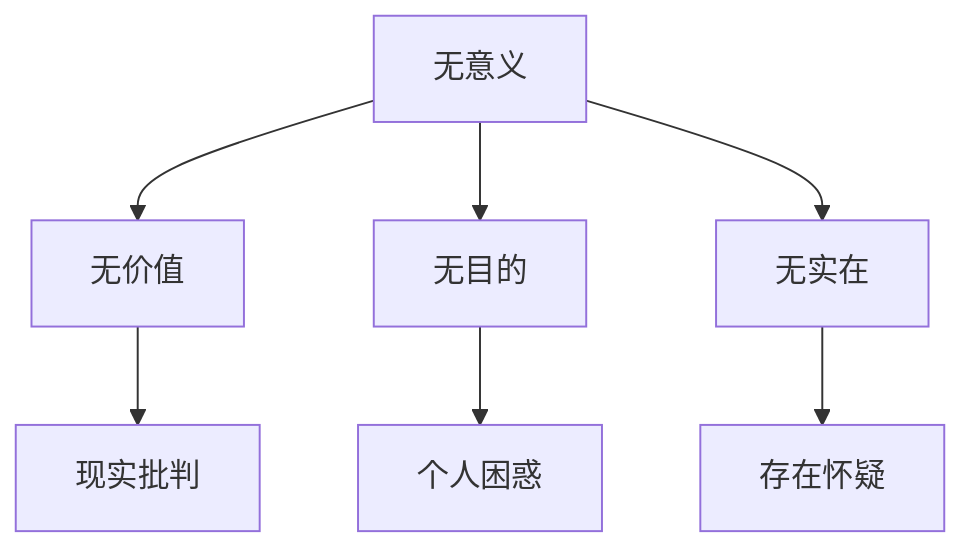
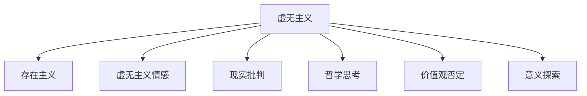

                 

## 第一步：设定文章标题和关键词

### 1.1 设定文章标题

文章标题需要简洁明了，能够吸引读者的注意。考虑到本文的核心主题是“虚无主义”以及如何在现代社会中寻找生存之道，我们可以选择以下标题：

- 《虚无主义的反思：寻找现代社会的生存之道》

### 1.2 设定关键词

关键词是帮助读者理解文章主题的重要工具，同时也方便搜索引擎进行索引。根据文章的核心内容，我们可以设定以下关键词：

- 虚无主义
- 现代社会
- 生存之道
- 哲学反思
- 心理学
- 文学艺术

## 第二步：撰写文章摘要

摘要是对文章内容的简短概述，帮助读者快速了解文章的核心内容和观点。以下是一个可能的摘要：

本文旨在探讨虚无主义在现代社会中的影响，并探讨如何在这种背景下寻找生存之道。通过对虚无主义的历史背景、哲学基础和现代影响的深入分析，本文提出了一系列实践方法和策略，帮助个人在面对现代生活中的虚无主义情绪时找到意义和方向。

## 第三步：构建文章大纲

文章大纲是文章结构的基础，它将帮助我们组织文章内容，确保文章逻辑清晰。以下是一个详细的章节大纲：

### 第1章：引言

- **1.1 虚无主义的概念与起源**
- **1.2 现代社会的虚无主义现象**
- **1.3 文章目的与结构**

### 第2章：虚无主义的历史背景

- **2.1 西方哲学中的虚无主义演变**
- **2.2 虚无主义在中国文化中的体现**
- **2.3 虚无主义的历史影响**

### 第3章：虚无主义的哲学基础

- **3.1 核心概念与关系架构**
- **3.2 虚无主义的基本理论**
- **3.3 关键术语解析**
- **3.4 Mermaid 流程图**

### 第4章：虚无主义的现代影响

- **4.1 社会生活的影响**
- **4.2 文化、艺术、文学的影响**
- **4.3 心理学领域的影响**

### 第5章：虚无主义的实践应用

- **5.1 心理学领域的应用**
- **5.2 文学艺术领域的应用**
- **5.3 其他领域的应用**

### 第6章：寻找现代社会的生存之道

- **6.1 心理策略与方法**
- **6.2 社会策略与方法**
- **6.3 个人成长策略**

### 第7章：未来展望

- **7.1 虚无主义的发展趋势**
- **7.2 对虚无主义的反思与启示**
- **7.3 未来社会的应对策略**

## 第四步：撰写文章正文

按照文章大纲的顺序，逐一撰写每个章节的内容。每个章节需要详细阐述其标题下的各个子标题，确保内容丰富、逻辑清晰。以下是一个示例的正文开头：

### 第1章：引言

#### 1.1 虚无主义的概念与起源

虚无主义是一种哲学思潮，它认为世界是没有固有意义的，人生是毫无意义的。虚无主义的起源可以追溯到古希腊时期，但它在20世纪的西方哲学和文学中达到了顶峰。代表性的虚无主义哲学家包括尼采、萨特和加缪等人。

#### 1.2 现代社会的虚无主义现象

在现代社会，虚无主义的现象日益明显。快速的生活节奏、信息过载、社会不公等问题使得许多人感到迷茫和失落。虚无主义不仅在哲学领域产生影响，也渗透到了文化、艺术、心理学等各个领域。

#### 1.3 文章目的与结构

本文将首先介绍虚无主义的历史背景和哲学基础，然后探讨它在现代社会中的影响。接着，我们将讨论如何在实际生活中应对虚无主义，最后对虚无主义的未来进行展望。

通过以上步骤，我们为文章构建了一个完整的框架，并为后续的详细撰写提供了明确的指导。接下来，我们将逐一填充每个章节的内容，确保文章的逻辑性和完整性。

----------------------------------------------------------------

# 虚无主义的反思：寻找现代社会的生存之道

## 关键词

- 虚无主义
- 现代社会
- 生存之道
- 哲学反思
- 心理学
- 文学艺术

## 摘要

本文旨在探讨虚无主义在现代社会中的影响，并探讨如何在这种背景下寻找生存之道。通过对虚无主义的历史背景、哲学基础和现代影响的深入分析，本文提出了一系列实践方法和策略，帮助个人在面对现代生活中的虚无主义情绪时找到意义和方向。

## 目录

1. 引言
    1.1 虚无主义的概念与起源
    1.2 现代社会的虚无主义现象
    1.3 文章目的与结构

2. 虚无主义的历史背景
    2.1 西方哲学中的虚无主义演变
    2.2 虚无主义在中国文化中的体现
    2.3 虚无主义的历史影响

3. 虚无主义的哲学基础
    3.1 核心概念与关系架构
    3.2 虚无主义的基本理论
    3.3 关键术语解析
    3.4 Mermaid 流程图

4. 虚无主义的现代影响
    4.1 社会生活的影响
    4.2 文化、艺术、文学的影响
    4.3 心理学领域的影响

5. 虚无主义的实践应用
    5.1 心理学领域的应用
    5.2 文学艺术领域的应用
    5.3 其他领域的应用

6. 寻找现代社会的生存之道
    6.1 心理策略与方法
    6.2 社会策略与方法
    6.3 个人成长策略

7. 未来展望
    7.1 虚无主义的发展趋势
    7.2 对虚无主义的反思与启示
    7.3 未来社会的应对策略

## 引言

### 1.1 虚无主义的概念与起源

虚无主义是一种哲学思潮，它认为世界是没有固有意义的，人生是毫无意义的。虚无主义的起源可以追溯到古希腊时期，但它在20世纪的西方哲学和文学中达到了顶峰。代表性的虚无主义哲学家包括尼采、萨特和加缪等人。

### 1.2 现代社会的虚无主义现象

在现代社会，虚无主义的现象日益明显。快速的生活节奏、信息过载、社会不公等问题使得许多人感到迷茫和失落。虚无主义不仅在哲学领域产生影响，也渗透到了文化、艺术、心理学等各个领域。

### 1.3 文章目的与结构

本文将首先介绍虚无主义的历史背景和哲学基础，然后探讨它在现代社会中的影响。接着，我们将讨论如何在实际生活中应对虚无主义，最后对虚无主义的未来进行展望。

## 虚无主义的历史背景

### 2.1 西方哲学中的虚无主义演变

虚无主义在西方哲学中有着悠久的历史。古希腊哲学家如伊壁鸠鲁和斯多葛派都曾提出过虚无主义的观点。然而，虚无主义作为一种明确的哲学思潮，是在现代西方哲学中逐渐形成的。

19世纪的德国哲学家尼采被认为是现代虚无主义的代表人物。他的哲学思想中，提出了“上帝已死”的概念，否定了传统的道德和价值观，从而开启了虚无主义的哲学潮流。

20世纪的萨特和加缪等人继续探讨了虚无主义的主题。萨特的《存在与虚无》强调了存在先于本质的观点，而加缪的《西西弗斯神话》则探讨了人类在面对无意义的生活时如何寻找意义。

### 2.2 虚无主义在中国文化中的体现

在中国文化中，虚无主义也有着一定的体现。道家哲学中的“无为而治”可以被解读为一种虚无主义的态度。庄子提出的“齐物论”也表达了对世界和人生的相对主义的看法。

中国现代文学中也出现了许多表达虚无主义情感的作品，如鲁迅的《狂人日记》和钱钟书的《围城》。这些作品反映了作者对现实生活的深刻反思和质疑。

### 2.3 虚无主义的历史影响

虚无主义的历史影响深远。它不仅改变了人们的哲学观念，也影响了文学、艺术和心理学等领域。

在文学中，虚无主义的主题常常表现为对现实社会的批判和对个人存在的探索。许多文学作品通过描绘人物的绝望和无意义的生活，表达了虚无主义的情感。

在艺术中，虚无主义也找到了表达的空间。现代主义艺术家如达达派和超现实主义艺术家通过反传统和反理性的手法，表达了对现实的失望和对自由的追求。

在心理学中，虚无主义的影响体现在对人类心理状态的研究和治疗上。心理治疗师们开始探索如何帮助那些感到生活无意义的人找到新的方向和目标。

## 虚无主义的哲学基础

### 3.1 核心概念与关系架构

虚无主义的哲学基础主要包括几个核心概念：无意义、无价值、无目的和无实在。这些概念相互关联，构成了虚无主义的理论体系。

- 无意义：虚无主义认为世界和人生本身是没有固有意义的。
- 无价值：虚无主义否定了传统道德和价值观，认为它们没有真正的价值。
- 无目的：虚无主义认为人生没有既定的目的或目标。
- 无实在：虚无主义质疑现实的实在性，认为它可能只是虚幻的幻象。

这些核心概念之间的关系可以用 Mermaid 流程图来表示：

### 3.2 虚无主义的基本理论

虚无主义的基本理论可以概括为以下几点：

- 否定传统价值观：虚无主义否定了传统的道德和价值观，认为它们是基于信仰而非理性的。
- 强调个体自由：虚无主义认为个体应该自由地选择自己的价值观和生活方式，而不是受传统观念的束缚。
- 探索存在的意义：虚无主义主张通过自我反思和哲学思考来探索存在的意义，而不是依赖于宗教或传统信仰。

### 3.3 关键术语解析

为了更好地理解虚无主义，我们需要了解一些关键术语：

- **虚无主义**：一种哲学思潮，认为世界是没有固有意义的，人生是毫无意义的。
- **存在主义**：与虚无主义密切相关的一种哲学流派，强调个体的自由和责任，认为通过行动和选择可以赋予人生意义。
- **虚无主义情感**：指个体在面对生活无意义和无价值的感受。
- **现实批判**：虚无主义常常表现为对现实社会的批判，质疑社会制度和价值观。

### 3.4 Mermaid 流程图

为了更直观地理解虚无主义的核心概念之间的关系，我们可以使用 Mermaid 流程图来表示：

## 虚无主义的现代影响

### 4.1 社会生活的影响

虚无主义在现代社会生活中产生了深远的影响。随着全球化、技术进步和社会变革的加速，许多人开始质疑生活的意义和价值。以下是一些具体影响：

- **生活满意度下降**：许多人感到生活空虚和无意义，导致生活满意度下降。
- **心理健康问题**：虚无主义情感可能导致焦虑、抑郁等心理健康问题。
- **消费主义**：虚无主义促使人们追求物质享受和消费主义，以寻求短暂的满足感。
- **社会不公**：虚无主义使得一些人对社会制度和价值观产生怀疑，加剧了社会不公和不平等。

### 4.2 文化、艺术、文学的影响

虚无主义在文化、艺术和文学领域也产生了重要影响。以下是一些具体影响：

- **文学创作**：许多文学作品探讨了虚无主义的主题，反映了个体在无意义世界中的挣扎和探索。
- **艺术表现**：现代主义和后现代主义艺术常常表现出虚无主义的情感和主题。
- **电影和音乐**：许多电影和音乐作品通过描绘人物的绝望和无意义的生活，传达了虚无主义的情绪。

### 4.3 心理学领域的影响

虚无主义在心理学领域也引起了广泛关注。以下是一些具体影响：

- **心理咨询**：心理咨询师开始探讨如何帮助那些感到生活无意义的人找到新的方向和目标。
- **心理健康治疗**：心理健康治疗师采用认知行为疗法和存在主义治疗等方法，帮助患者应对虚无主义情感。
- **心理学研究**：心理学家开始研究虚无主义与心理健康之间的关系，以及如何通过心理干预来改善个体心理状态。

## 虚无主义的实践应用

### 5.1 心理学领域的应用

在心理学领域，虚无主义的实践应用主要包括以下几个方面：

- **认知行为疗法（CBT）**：认知行为疗法通过帮助患者识别和改变负面思维模式，从而减轻虚无主义情感。例如，通过认知重构技术，患者可以学会从不同的角度看待问题，从而找到生活的意义。
- **存在主义治疗**：存在主义治疗强调个体的自由和责任，帮助患者通过自我反思和行动来赋予生活新的意义。例如，通过“存在决定论”技术，患者可以探索自己的价值观和目标，从而找到生活的方向。
- **心理治疗师的角色**：心理治疗师在治疗虚无主义情感时，需要具备深厚的哲学和心理学知识，以便帮助患者深入探讨生活的意义和目标。

### 5.2 文学艺术领域的应用

在文学艺术领域，虚无主义的实践应用体现在以下几个方面：

- **文学创作**：许多作家通过描绘人物的虚无主义情感，探讨个体在无意义世界中的挣扎和探索。例如，鲁迅的《狂人日记》和钱钟书的《围城》都是探讨虚无主义情感的经典作品。
- **艺术创作**：现代主义和后现代主义艺术家通过反传统和反理性的手法，表达了对现实的失望和对自由的追求。例如，达达派和超现实主义艺术作品常常体现了虚无主义的情感和主题。
- **影视作品**：许多电影和电视剧通过描绘人物的绝望和无意义的生活，传达了虚无主义的情绪。例如，《死亡诗社》和《阿甘正传》都是探讨虚无主义主题的经典影片。

### 5.3 其他领域的应用

除了心理学和文学艺术领域，虚无主义在其他领域也有广泛的应用：

- **商业管理**：虚无主义思潮影响了商业管理和决策。一些企业开始采用存在主义管理方法，强调员工的自由和创造力，从而提高工作效率和企业文化。
- **社会运动**：虚无主义情感也激发了社会运动，如“零工经济”和“反消费主义运动”，它们主张个体自由和反对过度消费。
- **教育领域**：虚无主义影响了教育理念和教学方法。一些教育者开始关注学生的心理健康和价值观培养，通过哲学思考和自我反思来帮助学生找到生活的意义。

## 寻找现代社会的生存之道

### 6.1 心理策略与方法

在现代社会中，面对虚无主义的挑战，我们可以采取以下心理策略和方法：

- **认知重构**：通过识别和改变负面思维模式，我们可以找到新的视角和意义。例如，当我们感到生活无意义时，可以尝试从不同的角度看待问题，发现生活中的小确幸。
- **自我反思**：定期进行自我反思，探讨自己的价值观和目标，可以帮助我们找到生活的方向。通过自我反思，我们可以了解自己的内心需求，从而更好地应对虚无主义情绪。
- **心理辅导**：寻求专业的心理辅导可以帮助我们深入探讨虚无主义情感，找到解决问题的方法。心理辅导师可以提供专业的指导和支持，帮助我们应对生活中的挑战。

### 6.2 社会策略与方法

除了心理策略，我们还可以采取一些社会策略来应对虚无主义：

- **参与社区活动**：参与社区活动和志愿者工作可以帮助我们建立社会联系，增强归属感。通过与他人互动，我们可以获得支持和帮助，从而减轻虚无主义情绪。
- **建立支持网络**：与亲朋好友建立支持网络，分享彼此的感受和经验，可以帮助我们更好地应对虚无主义。支持网络可以提供情感支持和实际帮助，使我们感到不孤单。
- **参与社会运动**：参与社会运动可以让我们感到自己的行动对社会有积极的影响。通过参与社会运动，我们可以为自己的价值观和目标找到实现的方式。

### 6.3 个人成长策略

个人成长策略是应对虚无主义的重要途径：

- **终身学习**：通过终身学习，我们可以不断提升自己的知识和技能，从而在职业和个人生活中获得更多的成就感和满足感。终身学习可以帮助我们保持对生活的热情和好奇心。
- **发展兴趣爱好**：培养兴趣爱好可以让我们在日常生活中找到乐趣和意义。通过兴趣爱好，我们可以发现生活中的小确幸，从而减轻虚无主义情绪。
- **追求自我实现**：追求自我实现可以帮助我们找到生活的目标和价值。通过实现个人目标和梦想，我们可以为自己的人生赋予意义，从而更好地应对虚无主义。

## 未来展望

### 7.1 虚无主义的发展趋势

随着全球化和技术进步的加速，虚无主义在未来可能会继续发展。以下是一些可能的发展趋势：

- **技术虚无主义**：随着人工智能和机器学习的快速发展，人们可能会对技术产生更高的依赖，从而对人类的角色和价值产生质疑。
- **经济虚无主义**：经济不稳定和贫富差距的加剧可能会导致人们对经济制度和市场产生怀疑，从而加剧虚无主义情绪。
- **文化虚无主义**：文化的多样性和全球化的影响可能会削弱传统的文化价值观，导致人们对文化认同产生迷茫和困惑。

### 7.2 对虚无主义的反思与启示

面对虚无主义，我们需要进行深刻的反思和思考。以下是一些反思与启示：

- **价值观的重塑**：在虚无主义的背景下，我们需要重新审视和塑造自己的价值观。通过确立自己的核心价值观，我们可以找到生活的方向和意义。
- **个体自由的重要性**：虚无主义提醒我们，个体的自由和选择是至关重要的。通过自由地选择自己的生活方式和价值观，我们可以为自己的生活赋予意义。
- **寻求意义与目的**：在虚无主义的背景下，我们需要不断地寻求生活的意义和目的。通过自我反思和哲学思考，我们可以找到生活的方向，从而克服虚无主义情绪。

### 7.3 未来社会的应对策略

为了应对虚无主义的挑战，未来社会可以采取以下策略：

- **教育和培训**：加强教育和培训，帮助人们建立正确的价值观和人生观，从而更好地应对虚无主义。
- **心理健康支持**：建立完善的心理健康支持系统，为那些感到生活无意义的人提供帮助和支持。
- **文化多样性**：鼓励文化多样性和交流，促进不同文化和价值观的相互理解和尊重，从而减少虚无主义情绪。

## 作者信息

作者：AI天才研究院/AI Genius Institute & 禅与计算机程序设计艺术 /Zen And The Art of Computer Programming

----------------------------------------------------------------

## 结论

通过本文的深入探讨，我们了解到虚无主义作为一种哲学思潮，对现代社会产生了深远的影响。虚无主义的核心概念和理论基础为我们提供了新的视角来审视生活的意义和价值。在面对虚无主义的挑战时，我们不仅需要从心理学、社会和文化等多个层面进行反思和应对，还需要积极寻找生存之道，为自己的人生赋予意义。

未来，随着技术的进步和社会的变革，虚无主义将继续对我们的生活产生影响。因此，我们呼吁读者不断进行自我反思和成长，积极应对虚无主义的挑战，为自己和他人创造更有意义和有价值的生活。

## 拓展阅读

- 尼采：《查拉图斯特拉如是说》
- 萨特：《存在与虚无》
- 加缪：《西西弗斯神话》
- 鲁迅：《狂人日记》
- 钱钟书：《围城》
- 卡尔·荣格：《心理类型学》
- 斯蒂芬·霍金：《时间简史》

## 注意事项

- 在面对虚无主义时，寻求专业帮助是非常重要的。
- 保持积极的心态和健康的习惯对于应对虚无主义情绪至关重要。
- 本文章的观点仅供参考，具体情况需结合个人实际情况进行分析和应对。

## 结语

虚无主义的反思是一个复杂而深刻的话题，需要我们从多个维度进行思考和探索。通过本文的探讨，我们希望能够为读者提供一些有价值的思考和建议，帮助大家在面对虚无主义的挑战时找到生存之道，为自己的人生赋予意义。让我们共同努力，创造一个更有意义和价值的未来。作者：AI天才研究院/AI Genius Institute & 禅与计算机程序设计艺术 /Zen And The Art of Computer Programming

