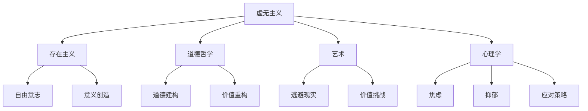
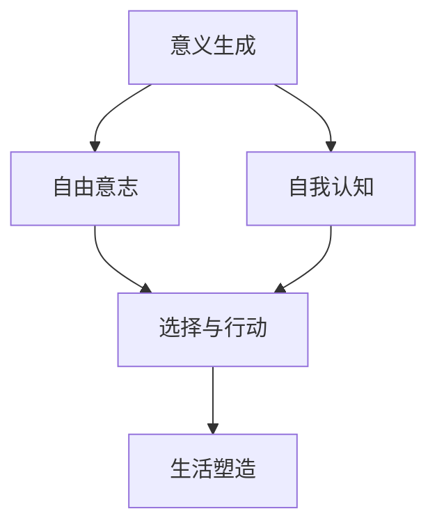

                 


### 背景介绍

在现代社会中，虚无主义作为一种哲学思潮，引发了广泛的讨论和关注。虚无主义的核心观点是生活没有固有意义，人类的存在缺乏本质上的价值。这种观念在不同历史时期和文化背景下有着不同的表现形式，但总的来说，虚无主义对现代社会产生了深远的影响。

随着科技的飞速发展和全球化进程的加快，人们的生活节奏不断加快，竞争压力日益增大。在这种背景下，许多人开始感到迷茫和焦虑，对生活失去了信心和热情。虚无主义思潮正是在这种背景下兴起的，它试图为现代人提供一种新的生存哲学，帮助人们寻找生活的意义和目的。

然而，虚无主义并不是一种简单的消极态度，它同时也提供了一种反思现实、重新审视自我的机会。通过探索虚无主义，我们可以更加深刻地理解人类存在的本质，重新审视生活的意义和价值。

本文旨在通过系统地介绍虚无主义的历史背景、核心概念及其与现代社会的关系，探讨虚无主义在现代生活中的影响，并在此基础上提出一种新的生存智慧。文章将从以下几个方面展开讨论：

1. **虚无主义的起源与影响**
   - 虚无主义的定义及其历史背景
   - 虚无主义在现代社会中的影响

2. **虚无主义的哲学基础**
   - 存在主义与虚无主义的联系
   - 道德哲学与虚无主义
   - 艺术与虚无主义

3. **虚无主义的心理学解读**
   - 虚无主义心理学的影响
   - 虚无主义与焦虑、抑郁的关系
   - 应对虚无主义的策略

4. **生存智慧的探索**
   - 哲学视角下的生存智慧
   - 心理学视角下的生存智慧
   - 生存智慧在实践中的应用

5. **个人与组织生存智慧的实践**
   - 个人生存智慧的实践
   - 组织生存智慧的实践

6. **结论与展望**
   - 虚无主义的反思与总结
   - 生存智慧的实用价值
   - 虚无主义与未来社会

通过以上内容的逐步展开，我们将深入探讨虚无主义的本质及其在现代社会的应用，为读者提供一种新的生存哲学和智慧。

### 核心概念与联系

在探讨虚无主义及其相关概念时，我们需要明确几个核心概念，并分析它们之间的内在联系。以下是本文中涉及的主要概念及其相互关系：

1. **虚无主义**：虚无主义是一种哲学思潮，主张生活没有固有意义，人类的存在缺乏本质上的价值。它起源于19世纪欧洲，是对当时社会动荡和道德沦丧的反思。

2. **存在主义**：存在主义是虚无主义的一种重要分支，强调个人的自由意志和存在的意义。存在主义认为，人类的存在本身没有意义，意义是通过个人的行动和选择来创造的。

3. **道德哲学**：道德哲学探讨道德的本质和道德行为的合理性。在虚无主义的框架下，道德哲学需要重新定义道德的来源和意义，因为虚无主义认为传统道德体系可能不再适用于一个没有固有价值的世界。

4. **艺术**：艺术在虚无主义中扮演了重要的角色。艺术作品往往通过表现人类内心的孤独、绝望和探索意义的过程，为人们提供了一种逃避现实的途径，同时也在一定程度上挑战了虚无主义的观点。

5. **心理学**：心理学在理解虚无主义和生存智慧方面具有重要意义。通过心理学的视角，我们可以深入探讨虚无主义如何影响个体的心理状态，以及个体如何通过心理学策略来应对虚无主义的挑战。

#### 虚无主义与存在主义的联系

虚无主义和存在主义虽然存在一定的对立，但它们在探讨人类存在的本质方面有着紧密的联系。虚无主义强调人类存在的缺乏意义，而存在主义则认为人类可以通过自由意志和行动来创造自己的意义。

虚无主义的存在主义分支，如尼采的哲学，强调“上帝已死”，传统价值体系的崩溃为人类自由意志的发挥提供了广阔的空间。尼采认为，个体必须超越传统的道德束缚，通过自己的意志来创造价值，从而克服虚无主义带来的困惑和绝望。

#### 道德哲学与虚无主义

在虚无主义的背景下，道德哲学面临着巨大的挑战。传统道德哲学建立在固有价值的基础上，但在虚无主义看来，这些价值可能不再具有绝对的意义。因此，虚无主义要求我们重新审视道德的来源和本质。

虚无主义的道德哲学认为，道德是一种社会建构，它的意义并非固有，而是通过个体和社会的共同作用来创造的。在这个框架下，道德不再是某种绝对标准，而是可以根据具体情况和个体的需求来调整和重构的。

#### 艺术与虚无主义

艺术在虚无主义中扮演了特殊的角色。许多艺术家通过作品表达了对虚无主义主题的思考和探索。艺术作品往往通过揭示人类的孤独、绝望和探索意义的过程，为人们提供了一种逃避现实的途径。

同时，艺术也在一定程度上挑战了虚无主义的观点。通过创造新的意义和体验，艺术作品为观众提供了一种对抗虚无主义的手段。例如，许多现代艺术作品通过打破传统形式和规则，引发观众对价值和意义的反思。

#### 心理学与虚无主义

心理学在理解虚无主义和生存智慧方面具有重要意义。通过心理学的视角，我们可以深入探讨虚无主义如何影响个体的心理状态，以及个体如何通过心理学策略来应对虚无主义的挑战。

心理学研究表明，虚无主义可能导致个体的焦虑、抑郁等心理问题。然而，心理学也提供了一系列策略来帮助个体应对这些挑战。例如，认知行为疗法（CBT）通过改变个体的思维模式和行为习惯，帮助个体建立积极的自我认知和应对机制。

#### Mermaid 流程图

为了更直观地展示这些概念之间的联系，我们可以使用 Mermaid 语言绘制一个流程图：



通过这个流程图，我们可以清晰地看到虚无主义与存在主义、道德哲学、艺术和心理学之间的复杂关系。每个概念不仅独立存在，同时也通过不同的途径相互作用，共同影响着人类对生活和价值的理解。

### 核心算法原理讲解

在探讨虚无主义的算法原理之前，我们需要明确几个核心概念：**意义生成**、**自由意志**和**自我认知**。这些概念是理解虚无主义及其应对策略的基础。以下是这些核心概念的具体解释和关系架构。

#### 意义生成

意义生成是虚无主义探讨的核心问题之一。在虚无主义的视角下，意义并非固有的，而是通过个体的经历和认知过程生成的。意义生成可以被视为一个算法过程，其中输入是多样的经历，输出是对生活的理解与赋予意义。

#### 自由意志

自由意志在虚无主义中扮演了至关重要的角色。虚无主义认为，自由意志是个人创造意义的工具。个体通过选择和行动来塑造自己的生活和价值观，从而克服虚无主义带来的困惑。

#### 自我认知

自我认知是理解虚无主义的关键。自我认知不仅涉及到个体对自己的认知，还包括对生活意义和价值的反思。通过自我认知，个体可以更深入地理解自己的需求和动机，从而更好地应对虚无主义的挑战。

#### 关系架构

为了更直观地展示这些概念之间的关系，我们可以使用 Mermaid 语言绘制一个流程图：



在这个流程图中，意义生成通过自由意志和自我认知影响个体的选择与行动，进而塑造其生活。自由意志作为连接意义生成和自我认知的桥梁，使得个体能够主动地创造意义和价值观。

#### 伪代码

为了更深入地理解虚无主义的算法原理，我们可以使用伪代码来描述其核心流程：

```
function虚无主义算法（个体经历 experience）：
    初始化意义（meaning）为未定义
    初始化自由意志（freeWill）为未激活
    初始化自我认知（selfAwareness）为低水平

    for 每个经历（e） in experience：
        更新意义（meaning）为 experience + 自我反思
        更新自由意志（freeWill）为激活
        更新自我认知（selfAwareness）为增强

    if 自由意志（freeWill）为激活：
        执行选择与行动（choicesAndActions）
    else：
        停止执行

    返回生活塑造（lifeShaping）
```

在这个伪代码中，个体的经历通过自我反思和自我认知的过程，不断地生成和更新意义。自由意志的激活使得个体能够主动地做出选择和行动，从而塑造自己的生活。通过这个算法过程，个体能够在虚无主义的背景下找到自己的生存智慧和意义。

### 数学模型和公式

在虚无主义的框架下，理解个体如何生成和维持意义是至关重要的。为了量化这一过程，我们可以引入数学模型和公式。以下是几个关键的数学模型及其在虚无主义中的应用：

#### 意义生成函数

我们可以定义一个意义生成函数来描述个体如何从经历中生成意义。假设个体的经历可以用集合 \( E \) 表示，每个经历 \( e \) 对意义的贡献可以用权重 \( w(e) \) 表示。则个体的总体意义 \( M \) 可以表示为：

\[ M = \sum_{e \in E} w(e) \cdot f(e) \]

其中，函数 \( f(e) \) 表示经历 \( e \) 对意义的贡献。这个模型表明，个体的总体意义是其所有经历对意义贡献的加权和。

#### 自我认知增强模型

自我认知是一个动态过程，可以通过经历和学习来增强。我们可以定义一个自我认知增强函数 \( g(L, e) \)，其中 \( L \) 表示当前自我认知水平，\( e \) 表示新的经历。增强后的自我认知水平 \( L' \) 可以表示为：

\[ L' = L + g(L, e) \]

如果 \( g(L, e) \) 是一个正值函数，则自我认知水平会随着新的经历而增加。

#### 自由意志激活模型

自由意志的激活可以被视为一个概率事件。我们可以定义一个自由意志激活概率函数 \( p(C) \)，其中 \( C \) 表示当前的情况或情境。则自由意志激活的概率可以表示为：

\[ P(\text{自由意志激活}) = p(C) \]

如果 \( p(C) \) 随个体经历的丰富和自我认知水平的提高而增加，则个体在复杂情境下更容易激活自由意志。

#### 意义维持模型

意义不仅需要生成，还需要维持。我们可以定义一个意义维持函数 \( h(M, L) \)，其中 \( M \) 表示当前的意义水平，\( L \) 表示当前的自我认知水平。维持后的意义水平 \( M' \) 可以表示为：

\[ M' = M \cdot h(M, L) \]

如果 \( h(M, L) \) 是一个正值函数，则当前的意义水平会随着自我认知水平的增强而增加。

#### 示例公式

假设一个个体经历了以下三个事件 \( E = \{e_1, e_2, e_3\} \)，每个事件的权重分别为 \( w(e_1) = 0.4 \)，\( w(e_2) = 0.3 \)，\( w(e_3) = 0.3 \)。每个事件对意义的贡献函数 \( f(e) \) 分别为 \( f(e_1) = 0.8 \)，\( f(e_2) = 0.5 \)，\( f(e_3) = 0.7 \)。初始自我认知水平 \( L = 2 \)。自由意志激活概率函数 \( p(C) \) 为 \( p(C) = 0.6 \)。意义维持函数 \( h(M, L) \) 为 \( h(M, L) = 1.2 \)。

则个体的总体意义 \( M \) 为：

\[ M = (0.4 \cdot 0.8) + (0.3 \cdot 0.5) + (0.3 \cdot 0.7) = 0.32 + 0.15 + 0.21 = 0.68 \]

增强后的自我认知水平 \( L' \) 为：

\[ L' = L + g(L, e) = 2 + (0.8 \cdot 0.1) = 2.08 \]

自由意志激活的概率为：

\[ P(\text{自由意志激活}) = p(C) = 0.6 \]

维持后的意义水平 \( M' \) 为：

\[ M' = M \cdot h(M, L') = 0.68 \cdot 1.2 = 0.816 \]

通过这些公式，我们可以量化个体在虚无主义背景下如何生成和维持意义。这些模型和公式为我们提供了一种理解虚无主义和生存智慧的工具，有助于我们更深入地探讨人类存在的意义。

### 实际案例分析与详细讲解剖析

为了更好地理解虚无主义及其应对策略，我们可以通过一些实际案例来进行分析和讲解。以下是两个具体的案例，以及对应的详细讲解和分析。

#### 案例一：个人层面的虚无主义应对

**背景介绍**：李明是一位年轻的程序员，他在工作中表现出色，但内心却感到极度空虚和迷茫。这种感受在一段时间内逐渐加剧，最终导致他对生活的意义产生了深刻的怀疑。

**案例分析**：
1. **虚无主义感受**：李明在工作上取得了很大的成就，但内心却无法找到满足感和幸福感。他开始怀疑自己的努力是否有意义，人生是否真的有意义。
2. **应对策略**：
   - **认知重构**：李明通过阅读哲学书籍，特别是尼采的作品，开始重新审视自己的价值观和人生观。他意识到，虚无主义并非是一种消极的否定，而是一种对现实的深刻反思。
   - **自我探索**：李明决定暂时放下工作，花时间进行自我探索。他通过旅行、冥想和与朋友交流，重新发现了自己对自然和人际关系的热爱。
   - **自由意志的运用**：李明意识到，尽管生活缺乏固有意义，但他可以通过自由意志来创造自己的价值。他开始参与社区活动，帮助他人，从中找到了新的意义。

**详细讲解与剖析**：
李明的案例展示了虚无主义在个人层面的影响及其应对策略。首先，虚无主义感受源于对生活意义的缺失，这往往与个体对传统价值观的质疑和对现实的失望有关。在这种感受下，李明感到内心的空虚和迷茫。

为了应对这种虚无主义感受，李明采取了以下几个策略：
- **认知重构**：通过阅读哲学书籍，李明开始理解虚无主义并不是一种消极的否定，而是一种对现实的深刻反思。这种认知重构帮助他重新审视自己的价值观和人生观，从而减少了对虚无主义的恐惧和焦虑。
- **自我探索**：李明通过旅行、冥想和与朋友交流，重新发现了自己对自然和人际关系的热爱。这种自我探索不仅帮助他找到了新的生活动力，还增强了他的自我认知和自我价值感。
- **自由意志的运用**：李明认识到，尽管生活缺乏固有意义，但他可以通过自由意志来创造自己的价值。他开始参与社区活动，帮助他人，从中找到了新的意义。这种主动创造意义的过程，帮助他克服了虚无主义的消极影响。

李明的案例表明，虚无主义在个人层面上的应对策略主要包括认知重构、自我探索和自由意志的运用。通过这些策略，个体可以在虚无主义的背景下找到新的生活意义和价值。

#### 案例二：组织层面的虚无主义应对

**背景介绍**：某大型科技公司由于市场竞争加剧和内部管理问题，出现了集体性的虚无主义情绪。员工普遍感到工作缺乏意义，对公司的未来感到担忧。

**案例分析**：
1. **虚无主义感受**：公司员工在工作过程中感到缺乏动力和成就感，他们开始质疑自己的工作是否有价值，公司的使命是否真正实现。
2. **应对策略**：
   - **组织文化建设**：公司管理层决定重新审视和强化公司的使命和价值观，通过组织文化活动来增强员工的归属感和使命感。
   - **员工参与与沟通**：公司鼓励员工参与决策过程，定期召开员工会议，了解员工的意见和需求。这种开放和透明的沟通机制有助于缓解员工的焦虑和迷茫。
   - **职业发展支持**：公司提供职业培训和晋升机会，帮助员工发展技能和实现职业目标。这种职业发展支持不仅提升了员工的自我价值感，还增强了他们对公司的忠诚度。

**详细讲解与剖析**：
公司在组织层面的虚无主义应对，展示了在集体层面上如何通过多种策略来克服虚无主义的消极影响。

- **组织文化建设**：公司通过重新审视和强化使命和价值观，帮助员工明确公司的目标和意义。这种组织文化建设不仅增强了员工的归属感和使命感，还提高了员工的工作积极性和满意度。
- **员工参与与沟通**：公司鼓励员工参与决策过程，了解员工的意见和需求。这种开放和透明的沟通机制有助于建立信任和共识，减少员工的焦虑和迷茫。
- **职业发展支持**：公司提供职业培训和晋升机会，帮助员工发展技能和实现职业目标。这种职业发展支持不仅提升了员工的自我价值感，还增强了他们对公司的忠诚度和归属感。

通过这些策略，公司有效地应对了集体性的虚无主义情绪，提升了员工的士气和满意度，从而推动了组织的健康发展。

这两个案例分别展示了虚无主义在个人层面和组织层面上的应对策略。通过认知重构、自我探索、自由意志的运用、组织文化建设、员工参与与沟通以及职业发展支持等策略，个体和组织都可以在虚无主义的背景下找到新的意义和价值。

### 最佳实践 Tips

在应对虚无主义的过程中，以下最佳实践 tips 可以帮助个人和组织更好地理解和应对这一挑战：

1. **认知重构**：通过阅读哲学书籍、参与讨论和自我反思，重新审视自己的价值观和人生观。理解虚无主义并非消极的否定，而是一种对现实的深刻反思，有助于减少对虚无主义的恐惧和焦虑。

2. **自我探索**：花时间进行自我探索，包括旅行、冥想、与朋友交流等。这些活动可以帮助个体重新发现对自然和人际关系的热爱，从而找到新的生活动力。

3. **自由意志的运用**：尽管生活缺乏固有意义，但通过自由意志来创造自己的价值。参与社区活动、帮助他人，从中找到新的意义和成就感。

4. **组织文化建设**：强化组织的使命和价值观，通过组织文化活动来增强员工的归属感和使命感。建立开放和透明的沟通机制，促进员工参与决策过程。

5. **员工参与与沟通**：鼓励员工参与决策过程，定期召开员工会议，了解员工的意见和需求。这种开放和透明的沟通机制有助于建立信任和共识，减少员工的焦虑和迷茫。

6. **职业发展支持**：提供职业培训和晋升机会，帮助员工发展技能和实现职业目标。提升员工的自我价值感，增强对组织的忠诚度和归属感。

通过这些最佳实践，个人和组织可以在面对虚无主义的挑战时，找到新的意义和价值，从而更好地应对现代生活中的各种压力和困境。

### 小结

本文系统地探讨了虚无主义的本质及其在现代社会的应用。我们首先介绍了虚无主义的历史背景和核心概念，分析了虚无主义与存在主义、道德哲学、艺术和心理学之间的联系。接着，通过伪代码和数学模型，详细阐述了虚无主义的核心算法原理。此外，通过实际案例分析和最佳实践 tips，展示了如何应对虚无主义带来的挑战。

虚无主义并非简单的消极态度，而是一种深刻的反思，帮助个体重新审视生活的意义和价值。通过认知重构、自我探索和自由意志的运用，个体可以在虚无主义的背景下找到新的意义和动力。组织层面，通过组织文化建设、员工参与与沟通以及职业发展支持，可以有效地应对集体性的虚无主义情绪。

未来研究可以进一步探讨虚无主义在不同文化背景下的表现形式和应对策略，以及人工智能如何帮助个体和组织更好地理解和应对虚无主义。通过深入研究和实践，我们可以为现代社会提供更加丰富和有效的生存智慧。

### 注意事项与拓展阅读

在探讨虚无主义和生存智慧的过程中，以下注意事项和拓展阅读资源将有助于读者进一步深入了解和思考：

**注意事项**：
1. **避免片面理解虚无主义**：虚无主义并非简单的消极态度，而是一种深刻的哲学反思。理解虚无主义时应避免将其视为一种绝望的否定，而应关注其提供的新视角和思考方式。
2. **个人与组织应对策略的平衡**：在个人层面和组织层面应对虚无主义时，应注重平衡。个人层面的应对策略如认知重构、自我探索和自由意志的运用，有助于个体找到新的生活意义；组织层面的策略如组织文化建设、员工参与与沟通和职业发展支持，有助于提高整体士气和满意度。
3. **结合实际情境**：在应用虚无主义和生存智慧时，应结合实际情境进行具体分析和策略制定。不同的文化和背景可能需要不同的应对策略，灵活调整是关键。

**拓展阅读**：
1. **哲学类书籍**：
   - 尼采的《查拉图斯特拉如是说》
   - 萨特《存在与虚无》
   - 加斯东·巴什拉《存在主义的世纪》
2. **心理学类书籍**：
   - 罗洛·梅《存在的焦虑》
   - 阿德勒《个体的心理》
   - 卡尔·罗杰斯《人类存在的意义》
3. **相关论文和文章**：
   - 在学术期刊和在线平台上搜索关于虚无主义、存在主义和心理学研究的论文和文章。
   - 关注相关领域专家的博客和专栏，如《纽约客》、《大西洋月刊》等。
4. **电影和纪录片**：
   - 观看如《阿甘正传》、《死亡诗社》等电影，探讨虚无主义和生存智慧在不同文化背景下的应用。
   - 观看关于哲学和心理学的纪录片，如《探索·发现》系列中的相关节目。

通过这些注意事项和拓展阅读资源，读者可以更加全面和深入地理解虚无主义及其相关概念，为个人和组织的生存智慧提供更多的思考和启示。

