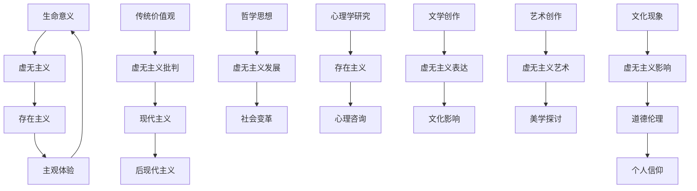

                 

## 虚无主义的定义与历史背景

虚无主义，作为一种哲学思想，起源于对生活、意义和存在的深刻质疑。其核心观点是，生活缺乏客观意义，人生在本质上是空虚和荒谬的。虚无主义并非一种单一的哲学体系，而是包含多种流派和思想。最早可以追溯到古希腊哲学家伊壁鸠鲁和斯多葛主义，他们对生命的本质和目的提出了不同的反思。

在19世纪，虚无主义得到了进一步的发展，特别是在西方哲学界。丹麦哲学家基尔克戈尔（Søren Kierkegaard）是虚无主义的早期代表之一。他认为，人类必须在主观的信念和普遍的怀疑之间做出选择，个体必须通过信仰来超越虚无主义。尼采（Friedrich Nietzsche）则提出了“上帝已死”的观点，他认为在上帝死后，人类将面临一种无意义的存在状态，这为虚无主义提供了一种新的理论基础。

20世纪的虚无主义主要代表人物是萨特（Jean-Paul Sartre）和加缪（Albert Camus）。萨特在《存在与虚无》中提出了“存在先于本质”的观点，认为人类在没有先验本质的情况下进入世界，必须自己创造自己的意义。加缪在《鼠疫》和《西西弗神话》中探讨了人类在荒诞面前的态度和生存意义。

虚无主义对现代社会的影响深远，尤其是在道德、伦理和个人信仰方面。它挑战了传统的价值体系，推动了现代主义和后现代主义的发展。虚无主义引发的质疑和反思，使得人们更加关注个体的主观体验和存在的意义。

通过了解虚无主义的定义和历史背景，我们可以更好地理解其与现代社会的复杂关系。虚无主义不仅是一种哲学思想，更是一种对人类存在和生活的深刻反思，它为我们在现代社会中寻找生存智慧提供了新的视角。在接下来的章节中，我们将进一步探讨虚无主义在现代社会中的具体表现和影响。

### 虚无主义的核心概念及其关系架构

在探讨虚无主义的核心概念时，我们需要明确几个关键点：生命意义、存在主义和主观体验。这些概念不仅是虚无主义理论的基础，也构成了其哲学体系的核心。通过使用Mermaid流程图，我们可以直观地展示这些概念之间的相互关系和作用。

首先，生命意义是虚无主义探讨的出发点。虚无主义认为，生命缺乏固有的意义，这种观点不仅是对传统宗教和哲学信仰的挑战，也是对人类存在本质的质疑。因此，生命意义成为虚无主义讨论的核心问题。

接下来，存在主义是虚无主义的重要分支。存在主义者认为，人类在没有先验本质的情况下进入世界，必须在主观体验中寻找和创造意义。这种观点强调个体的主动性和自由意志，与虚无主义的基本立场紧密相连。

最后，主观体验是虚无主义的核心概念之一。虚无主义认为，人类的存在是主观的，每个人的体验都是独特的。通过主观体验，个体能够感知生命的荒谬和无意义，从而反思自己的存在状态。

下面是一个用Mermaid绘制的流程图，展示了这些概念之间的相互关系：

从流程图中，我们可以看到：

- **生命意义**（A）直接连接到**虚无主义**（B），表明虚无主义是对生命意义质疑的结果。
- **虚无主义**（B）与**存在主义**（C）和**主观体验**（D）紧密相连，说明存在主义和主观体验是虚无主义的核心支持。
- **传统价值观**（E）通过**虚无主义批判**（F）连接到**现代主义**（G）和**后现代主义**（H），反映虚无主义对传统价值体系的冲击。
- **文化现象**（I）通过**虚无主义影响**（J）连接到**道德伦理**（K）和**个人信仰**（L），说明虚无主义对个人和社会的广泛影响。
- **哲学思想**（M）通过**虚无主义发展**（N）连接到**社会变革**（O），表明虚无主义在推动社会变革方面的作用。
- **心理学研究**（P）通过**存在主义**（Q）连接到**心理咨询**（R），说明虚无主义与心理学之间的紧密关系。
- **文学创作**（S）通过**虚无主义表达**（T）连接到**文化影响**（U），反映虚无主义在文学领域的影响。
- **艺术创作**（V）通过**虚无主义艺术**（W）连接到**美学探讨**（X），说明虚无主义对艺术创作和美学思考的启示。

通过这个流程图，我们可以清晰地看到虚无主义的核心概念及其相互关系，这不仅有助于理解虚无主义的本质，也为我们在现代社会中应对虚无主义提供了理论支持。

### 虚无主义在现代社会中的具体表现

虚无主义在现代社会中的具体表现多种多样，其影响渗透到文化、社会和个体心理层面。首先，从文化层面来看，虚无主义在消费主义文化中表现得尤为明显。消费主义强调物质享受和个人成功，但在追求这些目标的过程中，许多人感到内心的空虚和缺乏真正的满足感。这种现象可以视为虚无主义的一种体现，因为它揭示了在追求物质财富的过程中，人们可能忽视了对生命意义和内心需求的探索。

其次，虚无主义在互联网和社交媒体的普及下，也对个体心理产生了深远影响。网络文化提供了无限的虚拟体验，使得人们在现实和虚拟世界中徘徊。许多人沉迷于网络，逃避现实生活中的压力和困境。这种现象不仅导致了社会孤立和人际关系的疏远，也加剧了内心的虚无感和无意义感。网络文化的匿名性和虚拟性使得人们更容易陷入虚无主义的陷阱。

在社会层面，虚无主义的影响体现在对传统价值观和信仰体系的质疑和挑战。随着全球化的发展，各种文化观念相互碰撞，传统价值体系受到了前所未有的冲击。许多人开始质疑宗教、道德和社会制度的合理性，这在一定程度上反映了虚无主义的倾向。例如，婚姻观念的多元化、性观念的开放以及社会道德的相对化，都是虚无主义在现代社会中的一种表现。

在个体心理层面，虚无主义引发了一系列心理问题，如焦虑、抑郁和自杀倾向。虚无主义认为生活缺乏意义，这可能导致个体对未来的恐惧和对生活的失望。长期处于这种心理状态中，人们可能会感到生活毫无意义，从而产生消极情绪和行为。例如，研究表明，虚无主义与自杀风险之间存在显著关联，尤其是在年轻人中表现得尤为明显。

为了应对虚无主义在现代社会中的影响，我们需要从多个层面采取行动。首先，社会应该加强对心理健康问题的关注，提供更多的心理咨询和帮助。其次，教育体系需要加强对生命意义和价值观的教育，帮助年轻人树立正确的世界观和人生观。此外，个体也需要学会自我调节和自我反思，通过探索内心需求和寻找个人意义来克服虚无主义的影响。

总之，虚无主义在现代社会中具有复杂的成因和广泛的影响。通过深入探讨其具体表现，我们可以更好地理解其对社会和个体的挑战，从而采取有效措施应对这一哲学思想带来的负面影响。

### 虚无主义的反思与生存智慧

面对虚无主义带来的挑战，我们如何通过反思找到生存智慧，构建积极的人生观？首先，我们需要理解虚无主义的核心问题，即生活的无意义和空虚感。这种状态不仅影响个体的心理健康，还可能导致社会问题的加剧。因此，找到应对虚无主义的生存智慧是现代社会一个迫切需要解决的问题。

#### 1. 认识虚无主义的根源

虚无主义常常源于对生命意义的质疑和对存在的孤独感。在面对快速变化的社会和复杂的人际关系时，人们可能会感到迷茫和无助。这种迷茫往往源于对自我认知的缺失和对生活目标的模糊。要克服虚无主义，我们首先需要认清其根源，明确自己在社会和人生中的位置。

#### 2. 培养内在价值观

培养内在价值观是应对虚无主义的重要方法之一。内在价值观不同于外在的物质追求和社会地位，而是源于个体内心的信念和使命感。通过反思自己的信仰和价值观，我们可以找到生活的方向和动力。例如，通过冥想、宗教信仰或哲学思考，个体可以建立起内在的精神支柱，从而抵御虚无主义的侵蚀。

#### 3. 建立积极的社交网络

积极的社交网络对应对虚无主义具有重要作用。通过与家人、朋友和同事建立深厚的联系，个体可以获得情感支持和安全感。在社交互动中，我们可以学习他人的生活经验和应对策略，从而增强自己应对生活挑战的能力。此外，参与社区活动和公益事业，可以帮助个体找到社会归属感，增强自我价值感。

#### 4. 寻求专业帮助

当虚无主义影响严重时，寻求专业帮助是必要的。心理咨询师或心理医生可以提供专业的指导和支持，帮助个体找到解决问题的方法。通过心理治疗，个体可以深入了解自己的内心世界，学会调整心态和应对策略，从而减轻虚无主义的负面影响。

#### 5. 培养自我反思的习惯

自我反思是应对虚无主义的关键。通过定期反思自己的行为、思想和感受，我们可以更好地了解自己的内心需求，找到生活中的积极因素。自我反思可以帮助我们识别并消除消极情绪和行为模式，从而建立更加健康和有意义的生活方式。

#### 6. 设定实际可行的目标

设定实际可行的目标是应对虚无主义的有效方法。通过设定短期和长期目标，个体可以找到生活的方向和动力。这些目标可以是职业上的成就、健康上的改善、人际关系的发展等。在实现目标的过程中，个体会感受到成就感和满足感，从而增强对生活的信心和积极性。

总之，通过反思和行动，我们可以找到应对虚无主义的生存智慧。培养内在价值观、建立积极的社交网络、寻求专业帮助、培养自我反思的习惯以及设定实际可行的目标，都是帮助我们克服虚无主义、构建积极人生观的有效途径。

### 案例分析：虚无主义在现代社会的具体表现

为了更好地理解虚无主义在现代社会的具体表现，我们将通过两个具体的案例进行分析。这些案例不仅展示了虚无主义在不同领域中的影响，也揭示了应对虚无主义的方法和挑战。

#### 案例一：网络成瘾

网络成瘾是一种普遍存在的现象，它不仅影响个人的生活，也对社会产生深远影响。许多人在虚拟世界中寻求逃避现实，这种行为往往源于对现实生活的不满和对存在的无意义感。网络成瘾者可能会花费大量时间在社交媒体、游戏、在线购物等虚拟活动上，以逃避现实中的压力和困境。这种行为不仅导致社交隔离、心理健康问题，还可能影响个人的学业和职业发展。

**应对方法**：
1. **自我反思**：网络成瘾者需要首先认识到自己的问题，并深刻反思自己在网络中的行为。通过了解成瘾的原因，个体可以找到解决问题的切入点。
2. **设定限制**：制定明确的上网时间和规则，帮助个体逐步减少网络使用时间。例如，设定每天固定的“无网络时间”，以便进行其他有意义的活动。
3. **寻找替代活动**：鼓励个体参与体育活动、户外探险或艺术创作等实际活动，以充实生活内容，减少对网络的依赖。

#### 案例二：职场焦虑

在现代社会，职场焦虑已成为一种普遍现象，许多人在面对工作压力和职业发展困境时感到焦虑和无助。职场焦虑不仅影响个体的心理健康，还可能导致工作效率低下、人际关系紧张。在一些高竞争环境中，员工可能会感到自己的工作缺乏意义，从而陷入虚无主义的状态。

**应对方法**：
1. **目标设定**：通过明确职业目标和规划，个体可以找到工作的方向和动力。设定短期和长期目标，并制定实现这些目标的行动计划，有助于缓解焦虑情绪。
2. **寻求支持**：与同事、上司或职业导师交流，获取建议和支持。团队合作和分享经验可以增强个体的自信心和归属感。
3. **心理辅导**：在职场焦虑严重时，寻求心理咨询师的帮助是必要的。心理辅导可以帮助个体了解自己的情绪和行为模式，找到有效的应对策略。

通过这两个案例，我们可以看到虚无主义在现代社会的具体表现和影响。网络成瘾和职场焦虑都是虚无主义的典型表现，通过自我反思、设定限制、寻找替代活动、目标设定、寻求支持以及心理辅导等方法，个体可以有效地应对虚无主义带来的负面影响，找到生活的意义和方向。

### 结论与展望

虚无主义作为一种深刻反思人类存在和生活的哲学思想，其在现代社会中的表现和影响不容忽视。通过本文的探讨，我们了解到虚无主义不仅挑战了传统的价值体系，也为现代社会带来了许多心理健康和社会问题。然而，面对虚无主义的挑战，我们并非无助。通过自我反思、培养内在价值观、建立积极的社交网络、寻求专业帮助以及设定实际可行的目标，个体可以在虚无主义的阴影下找到生存智慧，构建积极的人生观。

未来的研究可以进一步探讨虚无主义在不同文化和社会背景下的表现和影响，特别是如何通过跨文化研究找到全球范围内的应对策略。此外，心理学、社会学和哲学等领域的合作研究，将为理解和应对虚无主义提供更为全面和深入的见解。通过不断探索和实践，我们有望在现代社会中构建一个更加有意义和充实的未来。

### 最佳实践 tips、注意事项及拓展阅读

为了更好地应对虚无主义，以下是一些最佳实践 tips 和注意事项，帮助您在生活中找到平衡与意义：

**最佳实践 tips：**
1. **建立日常冥想习惯**：每天花10分钟进行冥想，可以帮助您放松心情，找到内心的平静。
2. **积极参与公益活动**：参与志愿服务或捐赠活动，可以增强社会责任感和自我价值感。
3. **定期自我反思**：每周花时间回顾自己的行为和思考，有助于您了解自己的内心需求，找到生活的方向。
4. **培养多方面兴趣**：通过学习新技能、阅读书籍或参与兴趣爱好，丰富您的精神世界。
5. **保持健康生活方式**：均衡饮食、适量运动和充足睡眠，有助于提升身心健康。

**注意事项：**
1. **避免过度依赖虚拟世界**：沉迷于网络和社交媒体可能会加剧虚无主义感，应适度使用并保持现实生活的平衡。
2. **警惕完美主义倾向**：完美主义可能导致不必要的压力和焦虑，学会接受不完美，培养“足够好”的心态。
3. **寻求专业帮助**：在心理困境中，及时寻求心理咨询师或医生的帮助，可以有效缓解虚无主义带来的负面影响。

**拓展阅读：**
1. **《虚无主义》（The Nothingness of Existence）**：作者菲利普·罗斯（Philip Roth），深入探讨了虚无主义在文学中的体现。
2. **《活着》**：作者余华，通过一个普通农民的生活经历，展现了虚无主义在现实生活中的影响和挑战。
3. **《意义的追寻》**：作者维克多·弗兰克尔（Viktor Frankl），介绍了他在集中营中的经历，以及如何通过意义疗法克服虚无主义。

通过这些最佳实践和注意事项，以及拓展阅读，希望您能在面对虚无主义时找到更多的资源和指导，构建一个更加充实和有意义的生活。作者：AI天才研究院/AI Genius Institute & 禅与计算机程序设计艺术 /Zen And The Art of Computer Programming。

