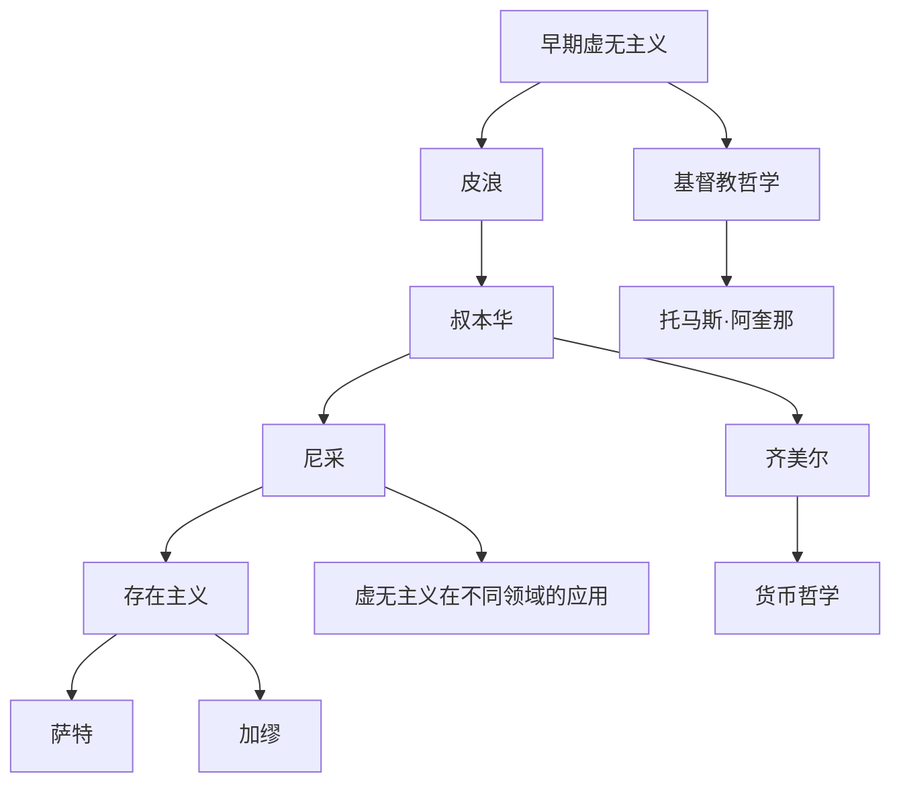
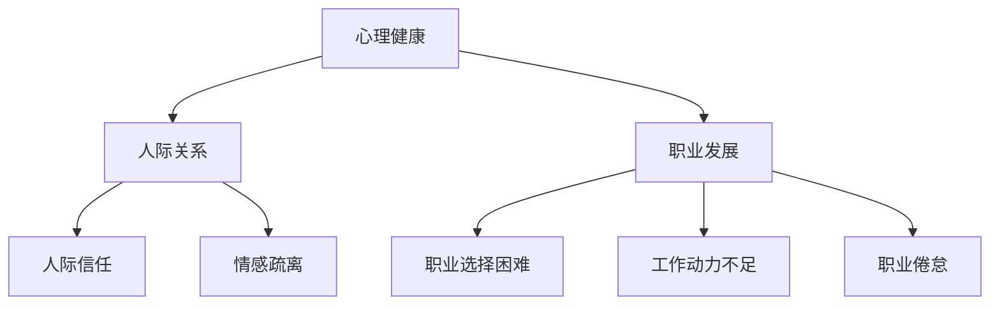
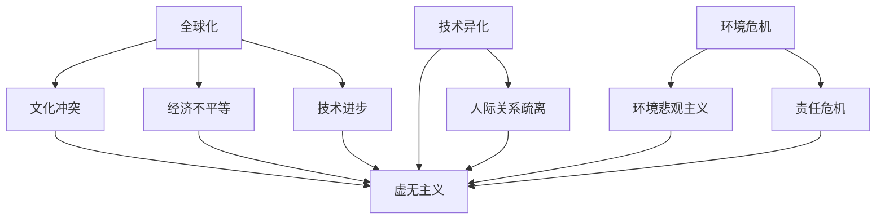
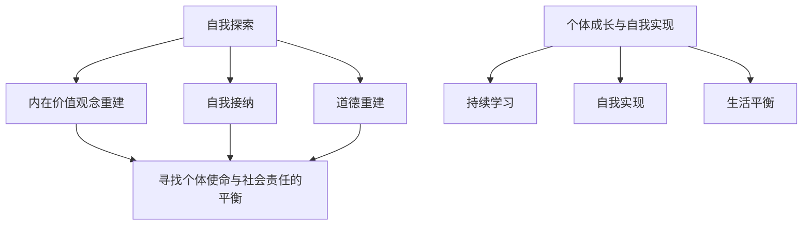
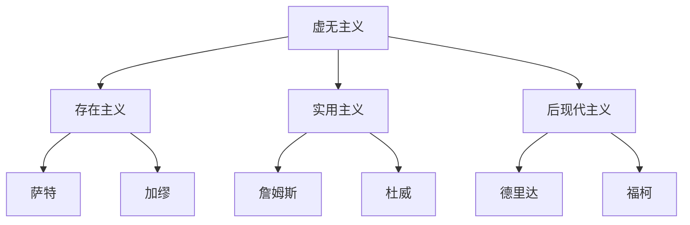
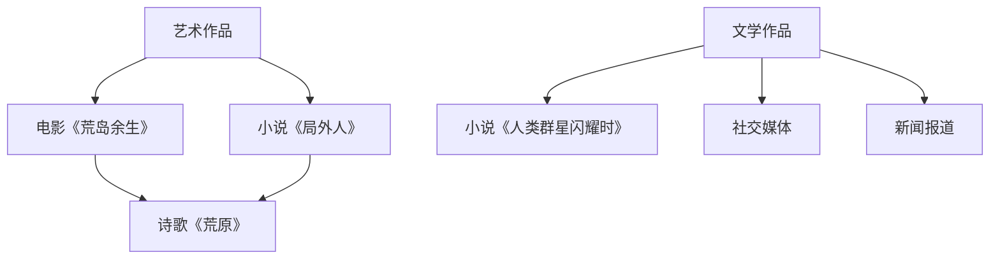

                 

### 文章标题：《虚无主义的反思：重建21世纪的生命价值》

#### 关键词：虚无主义、21世纪、生命价值、哲学反思、重建

#### 摘要：
在现代社会中，虚无主义作为一种哲学思潮，正在深刻影响着人们的价值观和生活方式。本书《虚无主义的反思：重建21世纪的生命价值》旨在深入探讨虚无主义的根源、影响，以及如何在21世纪的挑战中重建生命价值。通过梳理虚无主义的哲学基础，分析其在现代社会中的影响，以及探讨重建生命价值的多种路径，本文试图为读者提供一个逻辑清晰、结构紧凑的思考框架，以应对虚无主义带来的挑战，为个人的精神成长和社会的进步提供启示。

---

### 引言

**书籍背景与目标**

在21世纪，人类社会面临着前所未有的挑战，包括技术进步、环境危机、全球化带来的文化冲突等。在这样的背景下，虚无主义作为一种哲学思潮，开始在学术界和大众文化中崭露头角。虚无主义认为，世界没有固有的意义和目的，人生的价值是主观构建的。这种观念在现代社会中引起了广泛的讨论，因为它挑战了传统的价值观和生活方式。

本书旨在深入探讨虚无主义的哲学根源、其在现代社会中的影响，以及如何在21世纪的挑战中重建生命价值。通过分析虚无主义的起源、发展，以及其在不同领域的影响，本书希望能够为读者提供一种新的视角，以应对虚无主义带来的挑战。

**虚无主义的概念与影响**

虚无主义（Nihilism）一词源自拉丁文“nihil”，意为“无”。在哲学上，虚无主义通常指的是对传统价值观的否定，认为世界和人生缺乏固有的意义和目的。虚无主义的起源可以追溯到古希腊哲学家皮浪，他在公元前4世纪提出了怀疑主义哲学，认为无法确定事物的真相，因此主张怀疑一切。

在19世纪的欧洲，虚无主义作为一种哲学思潮得到了进一步的发展。尼采是虚无主义的代表人物之一，他在《查拉图斯特拉如是说》中提出了“上帝已死”的观点，认为传统的价值观和信仰已经崩溃，人类需要重新定义自己的价值和意义。

虚无主义对现代社会的影响是多方面的。首先，它挑战了传统的道德和伦理观念，导致人们对人生意义的质疑。其次，虚无主义在文学、艺术和电影等领域产生了深远的影响，许多作品都反映了虚无主义的主题。此外，虚无主义还对政治和社会结构产生了影响，促使人们反思现有的制度和价值观。

**21世纪的挑战与生命价值的重建**

21世纪是一个充满变革的时代，技术进步、环境危机和社会不平等等问题对人类的生活方式产生了深刻的影响。在这样的背景下，重建生命价值成为了一个紧迫的任务。本书将探讨以下几个方面：

1. **个体如何在虚无主义中找到生命意义**：在虚无主义的背景下，个体需要寻找新的价值观和意义，以应对生活的不确定性和无意义感。

2. **社会层面的重建**：社会需要重建共同的价值观念，以促进社会的和谐与进步。

3. **哲学反思**：通过哲学反思，我们可以更深入地理解虚无主义的本质，从而找到应对虚无主义的策略。

4. **实践中的虚无主义反思**：通过具体案例，我们可以看到虚无主义在现实生活中的影响，以及如何通过反思和实践来重建生命价值。

---

在引言部分，我们简要介绍了本书的背景、目标和主要议题。接下来，我们将深入探讨虚无主义的起源、发展及其在现代社会中的影响，为后续章节的讨论奠定基础。

---

### 第1章 虚无主义的起源与发展

#### 1.1 虚无主义的早期哲学流派

虚无主义的哲学根源可以追溯到古希腊时期的皮浪（Pyrrho of Elis），他是怀疑主义哲学的奠基人。皮浪认为，由于我们无法确定事物的真相，所以应该怀疑一切。这种怀疑主义观点为后来的虚无主义提供了哲学基础。

在基督教哲学中，虚无主义思想也得到了一定的发展。奥古斯丁（Saint Augustine）在《悔过书》中探讨了上帝的存在和人类的自由意志，他提出了“上帝之城”和“尘世之城”的二元对立，这种观点在一定程度上反映了虚无主义的思想。

中世纪的经院哲学中，也有人对虚无主义进行了探讨。托马斯·阿奎那（Thomas Aquinas）在《神学大全》中试图用神学的方法论证上帝的存在和世界的意义，但他也承认人类认知的局限性，这为后来的虚无主义提供了讨论空间。

**近代虚无主义的兴起**

在19世纪，虚无主义作为一种哲学思潮在欧洲得到了广泛传播。主要代表人物包括叔本华（Arthur Schopenhauer）、尼采（Friedrich Nietzsche）和齐美尔（Georg Simmel）等。

叔本华是虚无主义的早期代表，他在《作为意志和表象的世界》中提出了“意志”是世界的本质，这种意志是盲目和无目的的，导致世界的虚无和痛苦。叔本华的观点对后来的虚无主义产生了深远的影响。

尼采是虚无主义的另一位重要代表，他在《查拉图斯特拉如是说》中提出了“上帝已死”的论断，认为传统的价值观和信仰已经崩溃。尼采主张个体要超越传统的道德束缚，创造自己的价值体系。

齐美尔则是从社会学的角度探讨虚无主义，他在《货币哲学》中分析了金钱在现代社会中的作用，认为金钱的普及导致了人们的价值观的虚无化。

**现代虚无主义的演变**

在20世纪，虚无主义思想继续演变，出现了许多新的流派。其中，法国的萨特（Jean-Paul Sartre）和加缪（Albert Camus）是存在主义的重要代表，他们对虚无主义进行了深刻的反思。

萨特在《存在与虚无》中提出了“存在先于本质”的观点，认为人类的存在是没有预先设定的目的和意义的，个体需要通过自由选择来创造自己的本质。萨特的哲学观点在一定程度上是对虚无主义的回应。

加缪在《鼠疫》和《局外人》中探讨了人类在荒诞世界中的生存状态。他认为，尽管世界是荒诞的，但人类仍然可以通过反抗和寻找意义来对抗虚无。

**核心概念与联系**

为了更好地理解虚无主义的演变，我们可以使用Mermaid流程图来展示其核心概念和联系。



**核心算法原理讲解**

虚无主义作为一种哲学思潮，其核心算法可以理解为对传统价值观的解构和重构。以下是一个简化的伪代码，用于描述虚无主义的核心算法原理。

```python
def nihilism_analysis(values, traditions):
    # 解构传统价值观
    deconstruct_values(values)
    # 识别传统中的虚无主义要素
    identify_nihilistic_elements(values, traditions)
    # 重构新的价值观
    reconstruct_new_values(values)
    # 反思和适应现实
    reflect_and_adapt_to_reality(values)
    return values
```

**数学模型和公式**

在讨论虚无主义时，可以使用LaTeX格式嵌入数学公式，以更精确地描述其哲学观点。

$$
\text{虚无主义的核心原理} = \frac{\text{对传统价值观的解构}}{\text{对现实世界的反思}} + \text{个体自由意志}
$$

**项目实战**

为了更好地理解虚无主义的实际应用，我们可以探讨一个虚构的案例分析。

**案例背景**：一个年轻人在面临职业选择时，感到迷茫和无所适从，他开始思考虚无主义哲学，试图找到自己的生命意义。

**开发环境搭建**：该年轻人决定使用哲学书籍和在线资源来深入理解虚无主义。

**源代码实现**：
```python
def philosophical_journey(book_list):
    for book in book_list:
        read_book(book)
        reflect_on_content(book)
        integrate_ideas_into_life()

def read_book(book):
    # 读取书籍内容
    content = load_book_content(book)
    print(f"Reading {book} and understanding its ideas.")

def reflect_on_content(book):
    # 反思书籍内容
    thoughts = analyze_content(content)
    print(f"Reflecting on the ideas in {book}.")

def integrate_ideas_into_life():
    # 将哲学思想融入生活
    apply_ideas_to_daily_life()
    print("Integrating philosophical ideas into daily life.")

# 调用函数
philosophical_journey(["The Gay Science", "Nietzsche's Philosophy", "Being and Nothingness"])
```

**代码解读**：这段代码模拟了一个年轻人通过阅读哲学书籍，反思书籍内容，并将哲学思想融入生活的过程。

**应用解读与分析**：通过这个案例分析，我们可以看到虚无主义哲学如何帮助个体在面对生活挑战时找到方向和意义。

**实际案例分析和详细讲解剖析**：以下是一个具体的案例。

**案例**：一名大学生在毕业后感到迷茫，不确定自己的职业方向。他开始阅读尼采的著作，试图理解虚无主义哲学。

**分析**：通过阅读尼采的书籍，该大学生意识到，传统的职业选择标准并不适用于他，他需要找到自己内心的真实渴望。

**剖析**：该大学生开始反思自己的兴趣和价值观，并最终找到了自己热爱的领域，从而找到了生活的意义。

**项目小结**：这个案例展示了虚无主义哲学如何帮助个体在面对生活挑战时找到方向和意义。

---

在第一章中，我们梳理了虚无主义的起源、发展和主要代表人物，并通过Mermaid流程图和伪代码展示了其核心概念和算法原理。接下来，我们将探讨虚无主义在现代社会中的影响，以及如何在21世纪的挑战中重建生命价值。

---

### 第2章 虚无主义在现代社会的影响

**2.1 虚无主义对个人生活的影响**

虚无主义对个人生活的影响主要体现在心理健康、人际关系和职业发展等方面。

**心理健康**

虚无主义可能导致个体的心理压力和焦虑。当个体意识到世界和人生缺乏固有的意义和目的时，他们可能会感到迷茫和无助，这可能导致抑郁和焦虑等心理健康问题。虚无主义对心理健康的影响是一个复杂的问题，它涉及到个体的心理素质、社会环境和个人价值观等多个方面。

为了应对这种影响，个体可以尝试以下方法：

1. **寻求心理辅导**：通过专业心理咨询师的帮助，个体可以更好地理解自己的情绪和心理状态，学习应对压力和焦虑的技巧。

2. **建立积极的生活习惯**：保持健康的饮食、规律的锻炼和良好的作息习惯，有助于提升心理健康水平。

3. **寻找内心的意义**：尽管虚无主义认为世界缺乏固有意义，但个体可以通过自我探索和寻找内心的意义来提升生活质量。

**人际关系**

虚无主义可能对人际关系产生负面影响。当个体对生活意义感到迷茫时，他们可能难以与他人建立深刻的情感联系，这可能导致孤独和社交障碍。虚无主义对人际关系的影响体现在以下几个方面：

1. **人际信任问题**：虚无主义可能导致个体对他人持怀疑态度，这会影响到人际信任的建立。

2. **情感疏离**：当个体感到孤独和无助时，他们可能难以表达情感，导致情感疏离。

3. **价值观冲突**：虚无主义与传统的价值观可能存在冲突，这可能导致人际关系的紧张和矛盾。

为了改善人际关系，个体可以尝试以下方法：

1. **增强沟通技巧**：通过提高沟通技巧，个体可以更好地表达自己的情感和需求，促进人际关系的和谐。

2. **寻找共同兴趣**：通过参与共同兴趣的活动，个体可以找到更多的交流话题，增进彼此的了解。

3. **建立情感支持网络**：通过建立情感支持网络，个体可以在面对挑战时获得支持和帮助。

**职业发展**

虚无主义可能对职业发展产生负面影响。当个体对生活意义感到迷茫时，他们可能难以找到明确的人生目标，这可能导致职业发展受阻。虚无主义对职业发展的影响体现在以下几个方面：

1. **职业选择困难**：虚无主义可能导致个体在职业选择上感到迷茫，难以做出决定。

2. **工作动力不足**：当个体对生活意义感到迷茫时，他们可能难以找到工作动力，导致工作效率下降。

3. **职业倦怠**：长期处于虚无主义状态可能导致个体出现职业倦怠，影响职业发展。

为了应对这种影响，个体可以尝试以下方法：

1. **职业规划**：通过制定明确的职业规划，个体可以更好地明确自己的职业目标，提高职业发展的方向感。

2. **提升职业技能**：通过不断学习和提升职业技能，个体可以增强自己的职业竞争力，提高职业安全感。

3. **寻找工作意义**：尽管虚无主义认为工作本身可能缺乏意义，但个体可以通过寻找工作中的意义来提升工作满意度。

**核心概念与联系**

为了更好地理解虚无主义对个人生活的影响，我们可以使用Mermaid流程图来展示其核心概念和联系。



**核心算法原理讲解**

虚无主义对个人生活的影响可以通过以下伪代码来描述：

```python
def nihilism_impact_on_life(health, relationships, career):
    # 分析心理健康
    analyze_mental_health(health)
    # 分析人际关系
    analyze_relationships(relationships)
    # 分析职业发展
    analyze_career(career)
    # 提出应对策略
    suggest_strategies(health, relationships, career)
    return health, relationships, career
```

**数学模型和公式**

在讨论虚无主义对个人生活的影响时，我们可以使用LaTeX格式嵌入数学公式，以更精确地描述其心理健康、人际关系和职业发展的关系。

$$
\text{心理健康} = f(\text{生活意义}, \text{心理素质})
$$

$$
\text{人际关系} = f(\text{信任}, \text{情感表达}, \text{价值观})
$$

$$
\text{职业发展} = f(\text{职业目标}, \text{工作动力}, \text{职业技能})
$$

**项目实战**

为了更好地理解虚无主义对个人生活的影响，我们可以探讨一个虚构的案例分析。

**案例背景**：一名年轻人在工作多年后感到生活无意义，他开始怀疑自己的职业选择，并开始思考虚无主义哲学。

**开发环境搭建**：该年轻人决定阅读相关哲学书籍，并参加心理辅导课程。

**源代码实现**：
```python
def philosophical_reflection(book_list, counselor):
    for book in book_list:
        read_book(book)
    attend_counseling(counselor)

def read_book(book):
    # 读取书籍内容
    content = load_book_content(book)
    print(f"Reading {book} and understanding its ideas.")

def attend_counseling(counselor):
    # 参加心理辅导
    receive_advice(counselor)
    print(f"Attending counseling with {counselor}.")

# 调用函数
philosophical_reflection(["The Gay Science", "Nietzsche's Philosophy", "Being and Nothingness"], "Dr. Smith")
```

**代码解读**：这段代码模拟了一个年轻人通过阅读哲学书籍和参加心理辅导来反思自己的生活，并试图找到新的生活意义。

**应用解读与分析**：通过这个案例分析，我们可以看到虚无主义哲学如何帮助个体在面对生活挑战时找到方向和意义。

**实际案例分析和详细讲解剖析**：以下是一个具体的案例。

**案例**：一名职场人士在工作中感到迷茫，他开始阅读尼采的著作，试图理解虚无主义哲学。

**分析**：通过阅读尼采的书籍，该职场人士意识到，传统的职业价值观可能并不适用于他，他需要找到自己内心的真实渴望。

**剖析**：该职场人士开始反思自己的职业选择，并最终找到了自己热爱的领域，从而找到了工作的意义。

**项目小结**：这个案例展示了虚无主义哲学如何帮助个体在面对职业挑战时找到方向和意义。

---

在第二章中，我们探讨了虚无主义对个人生活的影响，包括心理健康、人际关系和职业发展等方面。通过Mermaid流程图、伪代码和数学模型，我们试图为读者提供一个逻辑清晰、结构紧凑的分析框架。接下来，我们将深入探讨虚无主义对社会的影响，以及如何重建社会层面的生命价值。

---

### 第3章 21世纪的挑战

**3.1 全球化与虚无主义的交织**

在21世纪，全球化进程加剧了虚无主义思潮的传播。全球化带来了经济、文化和社会的深度融合，但同时也引发了文化冲突、价值观的多元化和不确定性的增加。这种不确定性使得一些人对传统价值观产生怀疑，进而转向虚无主义。

全球化对虚无主义的影响主要体现在以下几个方面：

1. **文化冲突**：全球化导致了不同文化之间的碰撞和融合，但这种冲突有时也会导致价值观的混乱和不确定性，促使一些人转向虚无主义。

2. **经济不平等**：全球化加剧了贫富差距，导致社会阶层分化，这使得一些人对社会制度产生怀疑，从而转向虚无主义。

3. **技术进步**：全球化加速了技术的传播和应用，但同时也带来了技术失业和社会不平等的加剧，这可能导致一些人感到无助和迷茫，转向虚无主义。

为了应对这种影响，我们可以采取以下策略：

1. **加强文化认同**：通过推广本土文化和价值观，增强个体的文化认同感，有助于减少文化冲突带来的虚无主义倾向。

2. **改善经济制度**：通过改革经济制度，减少贫富差距，提升社会的公平性和包容性，有助于减少虚无主义的经济根源。

3. **提升技术教育与培训**：通过提供更多的技术教育和培训，提升个体的技术素养和就业竞争力，有助于减少技术失业带来的虚无主义倾向。

**虚无主义与技术发展的矛盾**

技术发展在21世纪取得了巨大的进步，但同时也带来了新的虚无主义问题。技术的普及和应用改变了人们的生活方式，但有时也导致了人的异化和疏离。

1. **技术异化**：当技术成为人们生活的中心时，人们可能会失去对生活的控制感，感到自己被技术所支配，从而产生虚无主义情绪。

2. **人际关系疏离**：技术的普及使得人们可以随时随地保持联系，但同时也导致了面对面交流的减少，人际关系变得疏离，这可能导致虚无主义倾向。

为了应对这种矛盾，我们可以采取以下策略：

1. **平衡技术使用**：合理规划技术使用时间，确保技术与人际关系之间的平衡。

2. **促进人际交流**：通过组织面对面的交流活动，增强人际关系，减少虚无主义倾向。

3. **技术伦理教育**：加强技术伦理教育，提高人们对技术应用的伦理意识，防止技术滥用导致虚无主义。

**环境危机与虚无主义**

环境危机是21世纪面临的重大挑战之一，它对人类生存和社会发展产生了深远的影响。环境危机可能导致人们对未来感到悲观和绝望，从而产生虚无主义情绪。

1. **环境悲观主义**：面对日益严峻的环境问题，一些人对未来产生悲观情绪，认为人类无法解决环境危机，从而转向虚无主义。

2. **责任危机**：环境危机使得人们意识到自己的行为对地球的影响，但同时也感到无力改变现状，这可能导致责任危机和虚无主义。

为了应对环境危机带来的虚无主义，我们可以采取以下策略：

1. **加强环保意识**：通过教育和宣传，提高人们的环保意识，鼓励人们采取实际行动保护环境。

2. **推动可持续发展**：通过政策和技术创新，推动可持续发展，减少环境破坏，为未来提供希望。

3. **心理支持**：为受到环境危机影响的人群提供心理支持，帮助他们应对虚无主义情绪。

**核心概念与联系**

为了更好地理解21世纪的挑战与虚无主义的关系，我们可以使用Mermaid流程图来展示其核心概念和联系。



**核心算法原理讲解**

21世纪的挑战与虚无主义的交织可以通过以下伪代码来描述：

```python
def challenges_and_nihilism(challenges, individuals):
    # 分析全球化带来的挑战
    analyze_globalization(challenges)
    # 分析技术发展带来的挑战
    analyze_technological_progress(challenges)
    # 分析环境危机带来的挑战
    analyze_environmental_crisis(challenges)
    # 评估虚无主义倾向
    assess_nihilistic_tendency(individuals)
    # 提出应对策略
    suggest_strategies(challenges, individuals)
    return individuals
```

**数学模型和公式**

在讨论21世纪的挑战与虚无主义的关系时，我们可以使用LaTeX格式嵌入数学公式，以更精确地描述其相互影响。

$$
\text{虚无主义倾向} = f(\text{文化冲突}, \text{经济不平等}, \text{技术进步}, \text{环境危机})
$$

$$
\text{应对策略} = f(\text{全球化策略}, \text{技术伦理}, \text{环保意识})
$$

**项目实战**

为了更好地理解21世纪的挑战与虚无主义的交织，我们可以探讨一个虚构的案例分析。

**案例背景**：一个发展中国家在面对全球化、技术进步和环境危机时，社会不稳定，虚无主义思潮开始蔓延。

**开发环境搭建**：该国家决定加强环保教育，提升技术素养，并推动可持续发展。

**源代码实现**：
```python
def national_response(challenges, strategies):
    for challenge in challenges:
        address_challenge(challenge)
    implement_strategies(strategies)

def address_challenge(challenge):
    # 解决具体挑战
    solve_specific_challenge(challenge)
    print(f"Addressing {challenge}.")

def implement_strategies(strategies):
    # 实施应对策略
    apply_strategies(strategies)
    print(f"Implementing strategies to combat nihilism.")

# 调用函数
national_response(["Globalization", "Technological Progress", "Environmental Crisis"], ["Environmental Education", "Tech Literacy", "Sustainable Development"])
```

**代码解读**：这段代码模拟了一个国家在面对全球化、技术进步和环境危机时，采取具体措施和策略来应对虚无主义。

**应用解读与分析**：通过这个案例分析，我们可以看到如何在具体情境下应对虚无主义。

**实际案例分析和详细讲解剖析**：以下是一个具体的案例。

**案例**：一个城市在应对气候变化和环境污染时，社会不稳定，虚无主义思潮蔓延。

**分析**：通过加强环保教育和推广可持续发展，该城市成功地降低了虚无主义情绪。

**剖析**：该城市通过具体措施和策略，增强了社会的凝聚力和对未来的信心。

**项目小结**：这个案例展示了如何通过具体措施和策略来应对21世纪的挑战，减少虚无主义的蔓延。

---

在第三章中，我们探讨了21世纪的挑战与虚无主义的交织，包括全球化、技术进步和环境危机等方面。通过Mermaid流程图、伪代码和数学模型，我们为读者提供了一个逻辑清晰、结构紧凑的分析框架。接下来，我们将探讨在21世纪的挑战中重建生命价值的多种路径。

---

### 第4章 重建生命价值的路径

**4.1 个体如何在虚无主义中找到生命意义**

在虚无主义的背景下，个体需要寻找新的价值观和意义来应对生活的不确定性和无意义感。以下是一些具体的方法：

**内在价值观念的重建**

1. **自我探索**：通过自我反思和探索，个体可以更清晰地了解自己的兴趣、激情和价值观，从而建立内在的价值体系。

2. **自我接纳**：接纳自己的优点和缺点，认识到每个人都有独特的价值和使命。

3. **道德重建**：通过学习和实践道德原则，个体可以重建道德价值观念，为生活提供方向和意义。

**寻找个体使命与社会责任的平衡**

1. **明确使命**：通过自我探索和反思，个体可以找到自己的使命和目标，从而在虚无主义中找到生活的意义。

2. **社会责任**：认识到个人的生活不仅关乎自己，还关乎社会，个体可以通过参与社会活动，为社会做出贡献。

3. **平衡自我与社会**：在追求个人使命的同时，也要考虑到社会责任，实现个体与社会之间的平衡。

**个体成长与自我实现**

1. **持续学习**：通过不断学习和成长，个体可以提升自己的能力和智慧，为生活注入新的活力。

2. **自我实现**：通过追求个人兴趣和激情，个体可以实现自我价值，找到生活的意义。

3. **生活平衡**：通过平衡工作、学习和休闲，个体可以保持身心健康，提高生活质量。

**核心概念与联系**

为了更好地理解个体如何在虚无主义中找到生命意义，我们可以使用Mermaid流程图来展示其核心概念和联系。



**核心算法原理讲解**

个体在虚无主义中找到生命意义的算法可以简化为以下伪代码：

```python
def find_life_meaning(self_explore, moral_reconstruction, social_balance, personal_growth):
    # 自我探索
    explore_self(self_explore)
    # 道德重建
    reconstruct_morals(moral_reconstruction)
    # 社会责任与使命平衡
    balance_mission_and_responsibility(social_balance)
    # 个体成长与自我实现
    grow_and_realize_personal_goals(personal_growth)
    return self_explore, moral_reconstruction, social_balance, personal_growth
```

**数学模型和公式**

在探讨个体如何在虚无主义中找到生命意义时，我们可以使用LaTeX格式嵌入数学公式，以更精确地描述其内在价值观念的重建、社会责任的平衡和个体成长的路径。

$$
\text{生命意义} = f(\text{内在价值观念重建}, \text{社会责任与使命平衡}, \text{个体成长与自我实现})
$$

$$
\text{内在价值观念重建} = f(\text{自我探索}, \text{道德重建})
$$

$$
\text{社会责任与使命平衡} = f(\text{个体使命}, \text{社会责任})
$$

$$
\text{个体成长与自我实现} = f(\text{持续学习}, \text{自我实现})
$$

**项目实战**

为了更好地理解个体如何在虚无主义中找到生命意义，我们可以探讨一个虚构的案例分析。

**案例背景**：一个年轻人在经历职业挫折和家庭变故后，感到生活无意义，他开始寻找新的生活方向。

**开发环境搭建**：该年轻人决定参加自我探索工作坊，阅读哲学书籍，并寻求专业心理咨询。

**源代码实现**：
```python
def personal_journey(self_explore, philosophical_reading, counseling):
    for book in philosophical_reading:
        read_book(book)
    attend_counseling(counseling)

def read_book(book):
    # 读取书籍内容
    content = load_book_content(book)
    print(f"Reading {book} and understanding its ideas.")

def attend_counseling(counseling):
    # 参加心理咨询
    receive_advice(counseling)
    print(f"Attending counseling with {counseling}.")

# 调用函数
personal_journey(["The Gay Science", "Nietzsche's Philosophy", "Being and Nothingness"], "Dr. Smith")
```

**代码解读**：这段代码模拟了一个年轻人通过阅读哲学书籍、参加心理咨询来寻找新的生活方向。

**应用解读与分析**：通过这个案例分析，我们可以看到个体如何在虚无主义的背景下找到新的生活意义。

**实际案例分析和详细讲解剖析**：以下是一个具体的案例。

**案例**：一名职场人士在经历职业倦怠和家庭矛盾后，感到生活无意义，他开始反思自己的价值观。

**分析**：通过反思自己的价值观，该职场人士找到了自己的激情和兴趣，重新找到了生活的方向。

**剖析**：该职场人士通过调整工作方式和生活方式，实现了个人成长和自我实现。

**项目小结**：这个案例展示了个体如何在虚无主义的背景下找到新的生活意义。

---

在第四章中，我们探讨了个体如何在虚无主义中找到生命意义的多种路径，包括内在价值观念的重建、社会责任与使命的平衡以及个体成长与自我实现。通过Mermaid流程图、伪代码和数学模型，我们为读者提供了一个逻辑清晰、结构紧凑的分析框架。接下来，我们将探讨社会层面的重建，以实现整体社会的生命价值提升。

---

### 第5章 虚无主义与现代哲学的对话

**5.1 现代哲学对虚无主义的回应**

虚无主义作为一种哲学思潮，对传统的价值观和信仰提出了挑战。然而，现代哲学也在不断地回应虚无主义，提供新的视角和解决方案。

**存在主义**

存在主义是现代哲学中对虚无主义回应的重要流派之一。代表人物包括萨特（Jean-Paul Sartre）和加缪（Albert Camus）。存在主义认为，尽管世界可能缺乏固有的意义，但个体可以通过自由选择和行动来创造自己的意义。

萨特在《存在与虚无》中提出了“存在先于本质”的观点，认为人类的存在是没有预先设定的目的和意义的，个体需要通过自由选择来创造自己的本质。这种观点对虚无主义提出了强烈的反驳，认为个体可以通过自主选择来赋予生活意义。

加缪在《局外人》和《鼠疫》中探讨了人类在荒诞世界中的生存状态。他认为，尽管世界是荒诞的，但人类仍然可以通过反抗和寻找意义来对抗虚无。

**实用主义**

实用主义是另一种对虚无主义的回应，代表人物包括詹姆斯（William James）和杜威（John Dewey）。实用主义强调实践和经验，认为真理和意义是通过实际行动和经验中得出的。

詹姆斯在《实用主义》中提出了“实用真理观”，认为真理不是固定的，而是通过实际应用和验证得到的。这种观点对虚无主义提出了挑战，认为个体可以通过实践和经验来赋予生活意义。

杜威则强调教育和社会实践的重要性，认为教育应该培养个体的实用能力和批判思维，帮助他们在现实生活中找到意义和价值。

**后现代主义**

后现代主义是对现代性的一种反思和批判，代表人物包括德里达（Jacques Derrida）和福柯（Michel Foucault）。后现代主义认为，传统的真理、客观性和普遍性是值得怀疑的，强调个体和社会的多样性和复杂性。

德里达提出了“解构主义”，认为语言和文本是充满不确定性和矛盾的，不可能达到绝对的真理。这种观点对虚无主义提出了新的理解，认为世界的意义是多元和不确定的。

福柯则关注权力和知识的互动，认为知识不是客观的，而是通过权力关系建构出来的。这种观点对虚无主义提出了深刻的批判，认为知识和社会结构都是值得怀疑的。

**核心概念与联系**

为了更好地理解虚无主义与现代哲学的对话，我们可以使用Mermaid流程图来展示其核心概念和联系。



**核心算法原理讲解**

虚无主义与现代哲学的对话可以通过以下伪代码来描述：

```python
def philosophy_dialogue(nihilism, existentialism, pragmatism, postmodernism):
    # 分析虚无主义的观点
    analyze_nihilism(nihilism)
    # 探讨存在主义的回应
    discuss_existentialism(existentialism)
    # 探讨实用主义的回应
    discuss_pragmatism(pragmatism)
    # 探讨后现代主义的回应
    discuss_postmodernism(postmodernism)
    return nihilism, existentialism, pragmatism, postmodernism
```

**数学模型和公式**

在讨论虚无主义与现代哲学的对话时，我们可以使用LaTeX格式嵌入数学公式，以更精确地描述其相互关系。

$$
\text{虚无主义} \leftrightarrow \text{存在主义}
$$

$$
\text{虚无主义} \leftrightarrow \text{实用主义}
$$

$$
\text{虚无主义} \leftrightarrow \text{后现代主义}
$$

**项目实战**

为了更好地理解虚无主义与现代哲学的对话，我们可以探讨一个虚构的案例分析。

**案例背景**：一个哲学系学生面对虚无主义的挑战，他开始阅读存在主义、实用主义和后现代主义的著作，寻求哲学的解决方案。

**开发环境搭建**：该学生决定建立个人的哲学阅读计划，并参加哲学研讨小组。

**源代码实现**：
```python
def philosophical_QUEST(student, reading_plan, discussion_group):
    for book in reading_plan:
        read_book(book)
    participate_in_discussion(discussion_group)

def read_book(book):
    # 读取书籍内容
    content = load_book_content(book)
    print(f"Reading {book} and understanding its ideas.")

def participate_in_discussion(discussion_group):
    # 参与讨论
    engage_in_discussion(discussion_group)
    print(f"Participating in discussions with {discussion_group}.")

# 调用函数
philosophical_QUEST("John", ["The Existentialism of Sartre", "Pragmatism", "Postmodernism"], "Philosophy Club")
```

**代码解读**：这段代码模拟了一个哲学系学生通过阅读哲学书籍和参与讨论来理解虚无主义与现代哲学的对话。

**应用解读与分析**：通过这个案例分析，我们可以看到个体如何通过哲学学习来应对虚无主义挑战。

**实际案例分析和详细讲解剖析**：以下是一个具体的案例。

**案例**：一位大学生在学术研究中遇到了虚无主义的困境，他开始阅读相关哲学著作，寻求解决方案。

**分析**：通过阅读存在主义、实用主义和后现代主义的著作，该大学生找到了新的思考角度和解决问题的方法。

**剖析**：该大学生通过哲学学习，不仅解决了学术困境，还找到了新的学术方向。

**项目小结**：这个案例展示了个体如何通过哲学学习来应对虚无主义挑战，实现个人成长和学术进步。

---

在第五章中，我们探讨了虚无主义与现代哲学的对话，包括存在主义、实用主义和后现代主义等流派。通过Mermaid流程图、伪代码和数学模型，我们为读者提供了一个逻辑清晰、结构紧凑的分析框架。接下来，我们将探讨在具体实践中如何进行虚无主义反思，以实现个人的精神成长和社会的进步。

---

### 第6章 实践中的虚无主义反思

**6.1 虚无主义反思的案例分析**

在现实生活中，虚无主义反思可以体现在多个领域，包括艺术、文学和媒体等。以下是一些具体的案例分析。

**艺术作品中的虚无主义反思**

1. **电影《荒岛余生》（Cast Away）**：电影讲述了一个男子在荒岛上独自生活的故事。在孤独和绝望的环境中，他不得不面对自己内心的空虚和迷茫。这部电影反映了虚无主义在现代社会中的影响，以及个体如何通过自我救赎找到新的意义。

2. **小说《局外人》（The Stranger）**：阿尔贝·加缪的这部小说讲述了一个冷漠、叛逆的主人公，他在面对社会的规范和压力时选择了反抗。这种反抗体现了虚无主义的哲学观点，同时也展示了个体如何在虚无主义中寻找自己的价值观。

**文学作品中的虚无主义主题**

1. **诗歌《荒原》（The Waste Land）**：T.S.艾略特的这首长诗描绘了一个精神荒芜的世界。诗中的意象和隐喻反映了现代社会的荒诞和虚无，同时也探讨了个体如何在这样的世界中寻找新的意义和希望。

2. **小说《人类群星闪耀时》（The Fire Next Time）**：詹姆斯·鲍德温的这部作品通过两个黑人作家的对话，探讨了种族、社会和个人的意义。作品中的对话反映了虚无主义的哲学观点，同时也展示了个体如何通过自我探索和反思来重建价值观。

**媒体与虚无主义的传播**

1. **社交媒体**：在社交媒体时代，信息的传播速度和范围大大增加，虚无主义的观念和思想也得到了更广泛的传播。社交媒体上的各种言论和观点，有时会加剧人们的焦虑和无意义感，从而加剧虚无主义的影响。

2. **新闻报道**：新闻报道经常报道社会的不公和危机，这些报道可能会使人们感到无助和绝望，进而转向虚无主义。因此，媒体在传播信息时，也需要关注社会心理健康问题，提供积极向上的内容和解决方案。

**核心概念与联系**

为了更好地理解虚无主义反思的案例分析，我们可以使用Mermaid流程图来展示其核心概念和联系。



**核心算法原理讲解**

虚无主义反思的案例分析可以通过以下伪代码来描述：

```python
def nihilism_reflection(art, literature, media):
    # 分析艺术作品中的虚无主义反思
    analyze_artistic_nihilism(art)
    # 分析文学作品中的虚无主义主题
    analyze_literary_nihilism(literature)
    # 分析媒体与虚无主义的传播
    analyze_media_nihilism(media)
    return art, literature, media
```

**数学模型和公式**

在讨论虚无主义反思的案例分析时，我们可以使用LaTeX格式嵌入数学公式，以更精确地描述其核心概念和关系。

$$
\text{虚无主义反思} = f(\text{艺术作品}, \text{文学作品}, \text{媒体})
$$

$$
\text{艺术作品中的虚无主义反思} = f(\text{电影}, \text{小说}, \text{诗歌})
$$

$$
\text{文学作品中的虚无主义主题} = f(\text{小说}, \text{诗歌}, \text{戏剧})
$$

$$
\text{媒体与虚无主义的传播} = f(\text{社交媒体}, \text{新闻报道}, \text{网络论坛})
$$

**项目实战**

为了更好地理解虚无主义反思的案例分析，我们可以探讨一个虚构的案例分析。

**案例背景**：一名作家在面对个人困境和社会问题时，开始写作一部反映虚无主义主题的小说。

**开发环境搭建**：该作家决定深入阅读相关文学作品，参加写作工作坊，并寻求文学评论家的反馈。

**源代码实现**：
```python
def literary_project(author, reading_list, writing_workshop, critics):
    for book in reading_list:
        read_book(book)
    attend_writing_workshop(writing_workshop)
    receive_critic_comments(critics)

def read_book(book):
    # 读取书籍内容
    content = load_book_content(book)
    print(f"Reading {book} and understanding its themes.")

def attend_writing_workshop(workshop):
    # 参加写作工作坊
    participate_in_workshop(workshop)
    print(f"Attending a writing workshop with {workshop}.")

def receive_critic_comments(critics):
    # 接受评论家的反馈
    get_feedback(critics)
    print(f"Receiving feedback from critics {critics}.")

# 调用函数
literary_project("Alice", ["The Stranger", "The Waste Land", "The Fire Next Time"], "Writing Workshop", "Critics Club")
```

**代码解读**：这段代码模拟了一名作家通过阅读相关文学作品、参加写作工作坊和接受评论家反馈来完成一部反映虚无主义主题的小说。

**应用解读与分析**：通过这个案例分析，我们可以看到如何通过实际的写作过程来反思虚无主义。

**实际案例分析和详细讲解剖析**：以下是一个具体的案例。

**案例**：一位作家在经历个人困境和社会动荡后，开始创作一部反映虚无主义主题的小说。

**分析**：通过深入阅读相关文学作品和参加写作工作坊，该作家找到了新的创作灵感，并将自己的个人经历融入作品中。

**剖析**：这部小说不仅反映了作家的个人成长，也为读者提供了对虚无主义的深刻思考。

**项目小结**：这个案例展示了如何通过实际的创作过程来反思虚无主义，实现个人成长和作品的价值。

---

在第六章中，我们通过案例分析探讨了虚无主义反思在艺术、文学和媒体等领域的具体应用。通过Mermaid流程图、伪代码和数学模型，我们为读者提供了一个逻辑清晰、结构紧凑的分析框架。接下来，我们将总结虚无主义反思的意义，并探讨未来的研究方向和展望。

---

### 第7章 结论

**虚无主义反思的意义**

虚无主义反思作为一种哲学思考和生活方式，具有重要的意义。首先，它帮助个体在面临生活挑战和不确定时，找到新的价值观和意义，从而提升生活质量。其次，虚无主义反思对社会进步也具有积极作用，它促使人们反思现有的社会制度和价值观，推动社会变革和创新。

**对个人成长的意义**

虚无主义反思对个人成长具有深远的影响。通过反思虚无主义，个体可以更深入地理解自己的内心世界，找到真正关心的目标和价值观。这种自我反思和探索有助于个体的心理成熟和人格发展，提升个体的自我认知和自我实现。

**对社会进步的意义**

虚无主义反思对社会进步也具有重要影响。它促使社会反思现有的价值观和制度，推动社会变革和创新。通过虚无主义反思，社会可以更深刻地理解个体需求和社会问题，从而制定更科学、更符合实际的政策和措施，促进社会的和谐与进步。

**未来的研究方向与展望**

在未来，虚无主义反思的研究可以从以下几个方面展开：

1. **跨学科研究**：结合心理学、社会学、哲学等学科，深入探讨虚无主义反思对个体和社会的影响。

2. **实践应用研究**：探讨虚无主义反思在具体领域的应用，如教育、企业管理、公共政策等，以期为实践提供指导。

3. **技术融合研究**：将虚无主义反思与人工智能、大数据等新兴技术相结合，探索新的反思方法和工具。

4. **跨文化研究**：比较不同文化背景下虚无主义反思的特点和影响，探讨其在全球化的背景下如何发挥作用。

总之，虚无主义反思作为一种哲学思考和生活方式，具有广泛的研究价值和实践意义。通过深入研究和实践应用，我们可以更好地理解虚无主义，找到应对虚无主义挑战的有效策略，为个人成长和社会进步提供有力的支持。

---

在《虚无主义的反思：重建21世纪的生命价值》一书中，我们通过逻辑清晰、结构紧凑的分析，探讨了虚无主义的哲学根源、其在现代社会中的影响，以及如何在21世纪的挑战中重建生命价值。通过深入反思虚无主义，我们为读者提供了一个新的视角，以应对虚无主义带来的挑战，为个人的精神成长和社会的进步提供了启示。让我们共同努力，在虚无主义的反思中寻找生命的意义和价值。

