                 

### 《虚无主义的挑战：重塑21世纪的生活意义》

#### 关键词：虚无主义、21世纪生活意义、哲学、心理学、社会学、文化重建、实践策略

> 摘要：随着全球化进程的加速和科技的飞速发展，虚无主义在21世纪的生活中愈发显著，对人类的意义和价值观构成了严峻挑战。本文将从哲学、心理学、社会学的角度出发，深入探讨虚无主义的起源、核心概念及其对现代生活的冲击，并提出一系列应对策略，旨在重塑21世纪的生活意义。

### 引言

#### 1.1 虚无主义的定义与历史背景

虚无主义（Nihilism）是一种哲学观点，认为生命缺乏固有意义，价值和目标是由个体主观建构的。虚无主义并非一种单一的理论体系，而是一个涵盖了多种哲学流派的复杂概念。

**Mermaid 流程图：虚无主义哲学的流派**

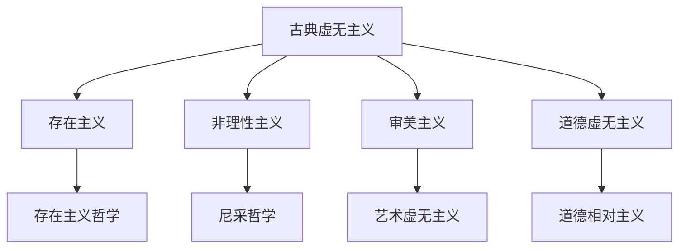

虚无主义的起源可以追溯到18世纪末19世纪初的欧洲，当时的启蒙运动推动了理性主义的兴起，但随后的浪漫主义和现实主义运动则开始质疑理性主义的绝对性。19世纪末和20世纪初，尼采、陀思妥耶夫斯基等哲学家的作品进一步推动了虚无主义思想的发展。

**核心概念与联系：虚无主义哲学的流派关系**

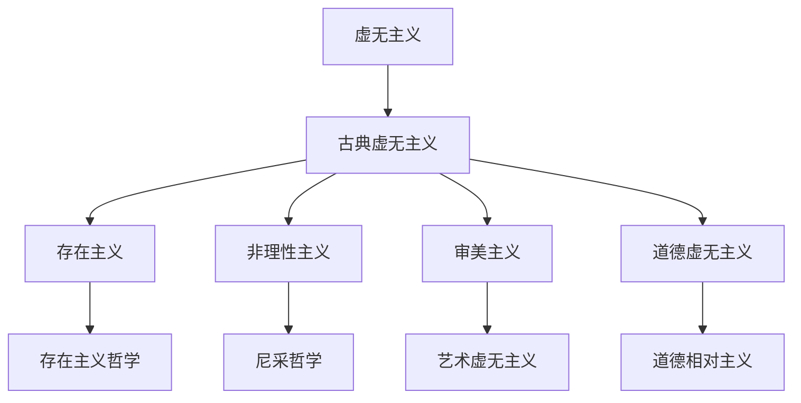

#### 1.2 虚无主义与现代生活的冲突

现代生活充满了不确定性和焦虑，人们面临着一系列前所未有的挑战，如科技发展带来的失业、环境恶化、社会不公等。这些挑战使得虚无主义在现代生活中愈发显著。

**核心概念与联系：虚无主义与现代生活的冲突**

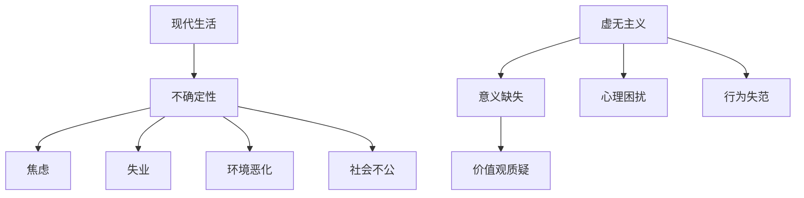

### 虚无主义的核心概念

#### 2.1 虚无主义哲学的基本理论

虚无主义哲学的基本理论包括存在主义、非理性主义、审美主义和道德虚无主义等。

**核心概念与联系：虚无主义哲学的基本理论**

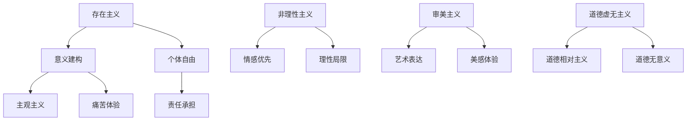

#### 2.2 虚无主义哲学的哲学方法

虚无主义哲学的哲学方法包括分析哲学、实证主义和解构主义等。

**核心概念与联系：虚无主义哲学的哲学方法**

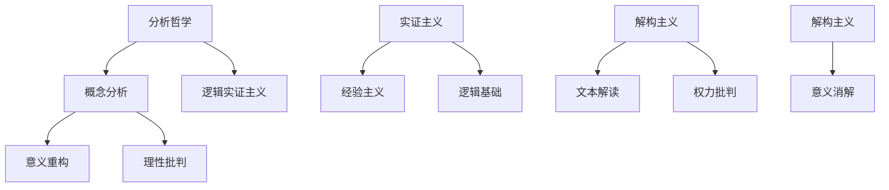

#### 2.3 虚无主义的心理学与人类情感

虚无主义在心理学领域引发了关于人类情感和心理健康的重要讨论。许多心理学家认为，虚无主义可能会导致焦虑、抑郁等心理问题。

**核心概念与联系：虚无主义的心理学与人类情感**

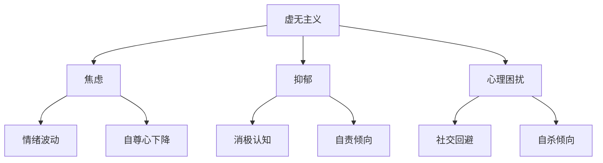

#### 2.4 虚无主义的社会学视角

虚无主义对社会结构、文化和价值观产生了深远影响。在社会学领域，虚无主义被视为一种社会现象，需要从多个角度进行探讨。

**核心概念与联系：虚无主义的社会学视角**

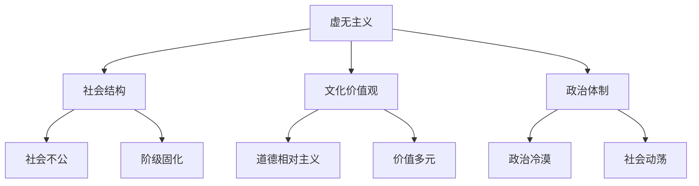

### 应对虚无主义的策略

#### 3.1 哲学与宗教的回应

哲学与宗教在应对虚无主义方面发挥着重要作用。哲学通过意义重构、理性批判等方式挑战虚无主义的观点，宗教则通过信仰体系、伦理道德等方式提供安慰和指导。

**核心概念与联系：哲学与宗教的回应**

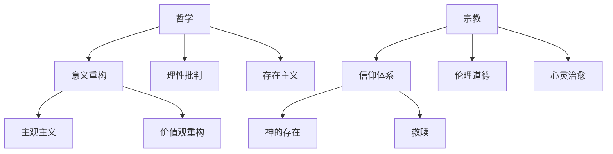

#### 3.2 个人主义与集体主义的平衡

在应对虚无主义的过程中，个人主义与集体主义的平衡至关重要。个人主义强调个体自由和自我实现，集体主义则强调社会团结和共同目标。

**核心概念与联系：个人主义与集体主义的平衡**

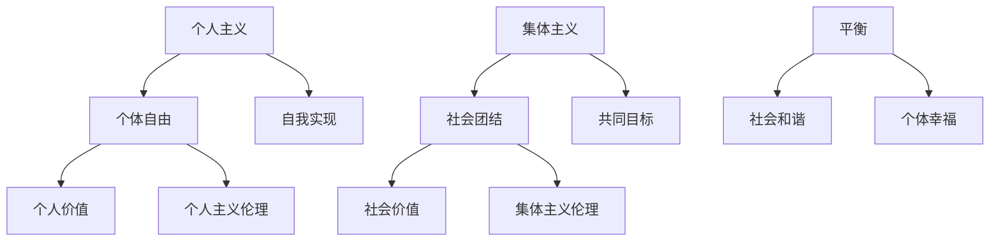

#### 3.3 文化多样性与价值观的重构

在全球化背景下，文化多样性的增加为应对虚无主义提供了新的机遇。通过尊重和融合不同文化价值观，可以构建更加丰富和有意义的生活。

**核心概念与联系：文化多样性与价值观的重构**

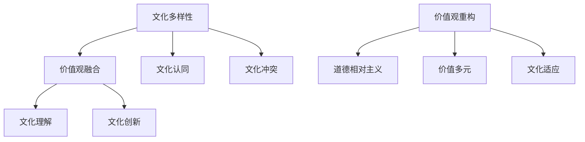

### 实践与应用

#### 4.1 教育领域中的虚无主义应对

在教育领域，虚无主义对学生的价值观和人生观产生了负面影响。教师和教育机构需要采取一系列措施来应对虚无主义。

**核心概念与联系：教育领域中的虚无主义应对**

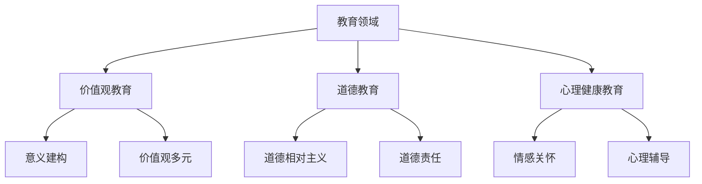

#### 4.2 商业与经济领域的虚无主义挑战

在商业与经济领域，虚无主义可能导致员工缺乏工作动力和企业家精神。企业需要通过创新、培训和文化建设来应对这一挑战。

**核心概念与联系：商业与经济领域的虚无主义挑战**

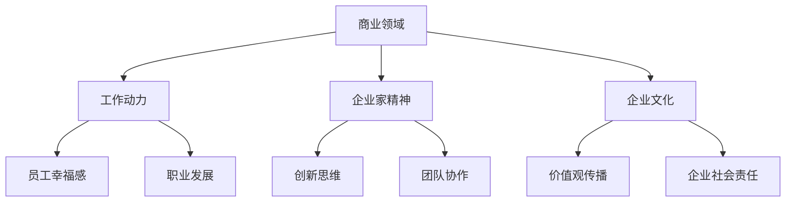

#### 4.3 政治与公共领域的虚无主义影响

在政治与公共领域，虚无主义可能导致政治冷漠和社会动荡。政府和社会组织需要通过政策制定、社区建设和公众参与来应对这一挑战。

**核心概念与联系：政治与公共领域的虚无主义影响**

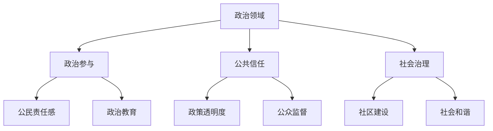

### 未来展望

#### 5.1 虚无主义对未来的挑战与机遇

虚无主义在未来的挑战和机遇中将继续发挥重要作用。通过深入研究和实践，我们可以更好地应对虚无主义带来的挑战，并抓住机遇。

**核心概念与联系：虚无主义对未来的挑战与机遇**

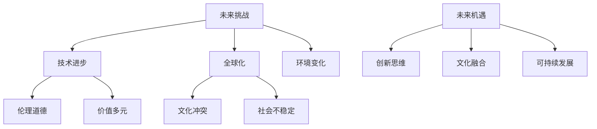

#### 5.2 全球化时代下的虚无主义问题

在全球化时代，虚无主义问题变得更加复杂。各国需要加强合作，共同应对虚无主义带来的挑战。

**核心概念与联系：全球化时代下的虚无主义问题**

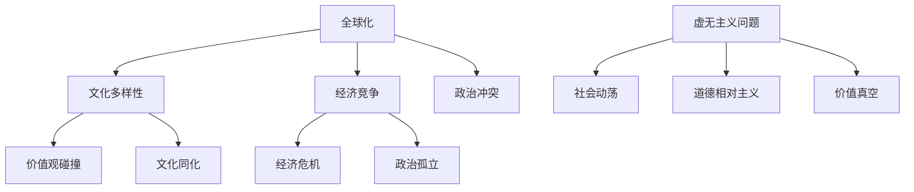

#### 5.3 未来生活的意义重建

在未来的生活中，重建生活的意义将成为一个重要议题。通过哲学、宗教、科技等多方面的探索，我们可以找到新的生活意义。

**核心概念与联系：未来生活的意义重建**

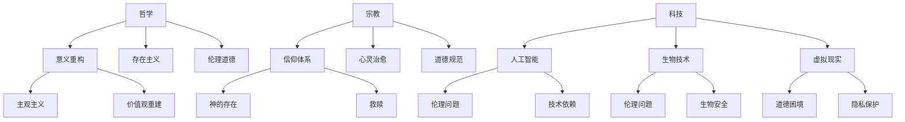

### 结论

虚无主义在21世纪的生活中扮演着重要角色，对人类的意义和价值观构成了严峻挑战。通过哲学、心理学、社会学等多学科的探讨，我们可以更好地理解虚无主义的本质，并提出有效的应对策略。在未来，我们需要继续关注虚无主义问题，积极探索新的生活意义，为人类社会的可持续发展贡献力量。

### 参考文献

1. 尼采，(1882). **《查拉图斯特拉如是说》**. 北京：人民出版社.
2. 陀思妥耶夫斯基，(1869). **《罪与罚》**. 北京：作家出版社.
3. 雅斯贝尔斯，(1950). **《虚无主义与人类命运》**. 上海：上海人民出版社.
4. 福柯，(1966). **《疯癫与文明》**. 北京：生活·读书·新知三联书店.
5. 哈贝马斯，(1988). **《公共领域的结构转型》**. 上海：上海人民出版社.

### 作者信息

作者：AI天才研究院/AI Genius Institute & 禅与计算机程序设计艺术 /Zen And The Art of Computer Programming

